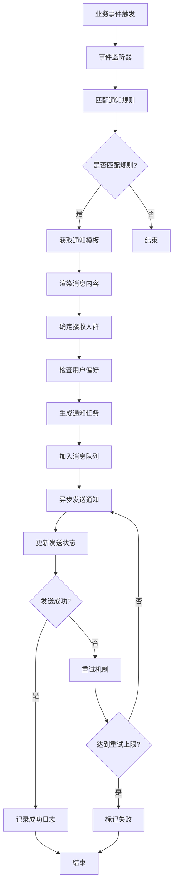

# 通知系统模块设计

## 1. 模块概述

通知系统模块是企业级应用中的重要组成部分，负责处理各种业务事件的通知推送，确保用户能够及时获得重要信息。该模块支持多种通知渠道（站内消息、邮件、短信、微信、钉钉等），提供灵活的通知规则配置和模板管理功能。

### 1.1 功能目标

1. **多渠道通知**：支持站内消息、邮件、短信、微信、钉钉等多种通知方式
2. **模板管理**：提供可视化的通知模板编辑和管理功能
3. **规则配置**：支持灵活的通知规则配置，包括触发条件、接收人群、发送时机等
4. **消息队列**：采用异步消息队列确保通知发送的可靠性和性能
5. **发送状态跟踪**：实时跟踪通知发送状态，提供重试机制
6. **用户偏好设置**：允许用户自定义通知偏好和免打扰设置
7. **统计分析**：提供通知发送统计和效果分析

### 1.2 业务流程



## 2. 数据库设计

### 2.1 通知模板表 (notification_templates)

```sql
CREATE TABLE notification_templates (
    id BIGINT PRIMARY KEY AUTO_INCREMENT,
    template_code VARCHAR(100) NOT NULL COMMENT '模板编码',
    template_name VARCHAR(200) NOT NULL COMMENT '模板名称',
    template_type ENUM('system', 'business', 'marketing') NOT NULL COMMENT '模板类型',
    channel_type ENUM('in_app', 'email', 'sms', 'wechat', 'dingtalk') NOT NULL COMMENT '通知渠道',
    subject_template TEXT COMMENT '标题模板',
    content_template TEXT NOT NULL COMMENT '内容模板',
    template_variables JSON COMMENT '模板变量定义',
    is_active BOOLEAN DEFAULT TRUE COMMENT '是否启用',
    created_by BIGINT NOT NULL COMMENT '创建人',
    created_at TIMESTAMP DEFAULT CURRENT_TIMESTAMP COMMENT '创建时间',
    updated_by BIGINT COMMENT '更新人',
    updated_at TIMESTAMP DEFAULT CURRENT_TIMESTAMP ON UPDATE CURRENT_TIMESTAMP COMMENT '更新时间',
    
    UNIQUE KEY uk_template_code_channel (template_code, channel_type),
    INDEX idx_template_type (template_type),
    INDEX idx_channel_type (channel_type),
    INDEX idx_created_at (created_at)
) COMMENT '通知模板表';
```

### 2.2 通知规则表 (notification_rules)

```sql
CREATE TABLE notification_rules (
    id BIGINT PRIMARY KEY AUTO_INCREMENT,
    rule_code VARCHAR(100) NOT NULL COMMENT '规则编码',
    rule_name VARCHAR(200) NOT NULL COMMENT '规则名称',
    event_type VARCHAR(100) NOT NULL COMMENT '事件类型',
    trigger_conditions JSON COMMENT '触发条件',
    recipient_config JSON NOT NULL COMMENT '接收人配置',
    channel_config JSON NOT NULL COMMENT '渠道配置',
    send_timing ENUM('immediate', 'delayed', 'scheduled') DEFAULT 'immediate' COMMENT '发送时机',
    delay_minutes INT DEFAULT 0 COMMENT '延迟分钟数',
    schedule_config JSON COMMENT '定时发送配置',
    priority ENUM('low', 'normal', 'high', 'urgent') DEFAULT 'normal' COMMENT '优先级',
    is_active BOOLEAN DEFAULT TRUE COMMENT '是否启用',
    created_by BIGINT NOT NULL COMMENT '创建人',
    created_at TIMESTAMP DEFAULT CURRENT_TIMESTAMP COMMENT '创建时间',
    updated_by BIGINT COMMENT '更新人',
    updated_at TIMESTAMP DEFAULT CURRENT_TIMESTAMP ON UPDATE CURRENT_TIMESTAMP COMMENT '更新时间',
    
    UNIQUE KEY uk_rule_code (rule_code),
    INDEX idx_event_type (event_type),
    INDEX idx_priority (priority),
    INDEX idx_created_at (created_at)
) COMMENT '通知规则表';
```

### 2.3 通知任务表 (notification_tasks)

```sql
CREATE TABLE notification_tasks (
    id BIGINT PRIMARY KEY AUTO_INCREMENT,
    task_id VARCHAR(100) NOT NULL COMMENT '任务ID',
    rule_id BIGINT NOT NULL COMMENT '规则ID',
    template_id BIGINT NOT NULL COMMENT '模板ID',
    event_type VARCHAR(100) NOT NULL COMMENT '事件类型',
    event_data JSON COMMENT '事件数据',
    recipient_type ENUM('user', 'role', 'department', 'custom') NOT NULL COMMENT '接收人类型',
    recipient_id VARCHAR(100) NOT NULL COMMENT '接收人ID',
    recipient_info JSON COMMENT '接收人信息',
    channel_type ENUM('in_app', 'email', 'sms', 'wechat', 'dingtalk') NOT NULL COMMENT '通知渠道',
    subject VARCHAR(500) COMMENT '通知标题',
    content TEXT NOT NULL COMMENT '通知内容',
    send_time TIMESTAMP NOT NULL COMMENT '发送时间',
    status ENUM('pending', 'sending', 'sent', 'failed', 'cancelled') DEFAULT 'pending' COMMENT '发送状态',
    retry_count INT DEFAULT 0 COMMENT '重试次数',
    max_retry_count INT DEFAULT 3 COMMENT '最大重试次数',
    error_message TEXT COMMENT '错误信息',
    sent_at TIMESTAMP NULL COMMENT '实际发送时间',
    created_at TIMESTAMP DEFAULT CURRENT_TIMESTAMP COMMENT '创建时间',
    updated_at TIMESTAMP DEFAULT CURRENT_TIMESTAMP ON UPDATE CURRENT_TIMESTAMP COMMENT '更新时间',
    
    UNIQUE KEY uk_task_id (task_id),
    INDEX idx_rule_id (rule_id),
    INDEX idx_template_id (template_id),
    INDEX idx_event_type (event_type),
    INDEX idx_recipient (recipient_type, recipient_id),
    INDEX idx_channel_type (channel_type),
    INDEX idx_status (status),
    INDEX idx_send_time (send_time),
    INDEX idx_created_at (created_at),
    
    FOREIGN KEY (rule_id) REFERENCES notification_rules(id),
    FOREIGN KEY (template_id) REFERENCES notification_templates(id)
) COMMENT '通知任务表';
```

### 2.4 站内消息表 (in_app_messages)

```sql
CREATE TABLE in_app_messages (
    id BIGINT PRIMARY KEY AUTO_INCREMENT,
    task_id BIGINT NOT NULL COMMENT '通知任务ID',
    user_id BIGINT NOT NULL COMMENT '用户ID',
    message_type ENUM('system', 'business', 'marketing') NOT NULL COMMENT '消息类型',
    title VARCHAR(500) NOT NULL COMMENT '消息标题',
    content TEXT NOT NULL COMMENT '消息内容',
    link_url VARCHAR(1000) COMMENT '链接地址',
    is_read BOOLEAN DEFAULT FALSE COMMENT '是否已读',
    read_at TIMESTAMP NULL COMMENT '阅读时间',
    is_deleted BOOLEAN DEFAULT FALSE COMMENT '是否删除',
    deleted_at TIMESTAMP NULL COMMENT '删除时间',
    created_at TIMESTAMP DEFAULT CURRENT_TIMESTAMP COMMENT '创建时间',
    updated_at TIMESTAMP DEFAULT CURRENT_TIMESTAMP ON UPDATE CURRENT_TIMESTAMP COMMENT '更新时间',
    
    INDEX idx_task_id (task_id),
    INDEX idx_user_id (user_id),
    INDEX idx_message_type (message_type),
    INDEX idx_is_read (is_read),
    INDEX idx_is_deleted (is_deleted),
    INDEX idx_created_at (created_at),
    
    FOREIGN KEY (task_id) REFERENCES notification_tasks(id)
) COMMENT '站内消息表';
```

### 2.5 用户通知偏好表 (user_notification_preferences)

```sql
CREATE TABLE user_notification_preferences (
    id BIGINT PRIMARY KEY AUTO_INCREMENT,
    user_id BIGINT NOT NULL COMMENT '用户ID',
    event_type VARCHAR(100) NOT NULL COMMENT '事件类型',
    channel_type ENUM('in_app', 'email', 'sms', 'wechat', 'dingtalk') NOT NULL COMMENT '通知渠道',
    is_enabled BOOLEAN DEFAULT TRUE COMMENT '是否启用',
    quiet_hours_start TIME COMMENT '免打扰开始时间',
    quiet_hours_end TIME COMMENT '免打扰结束时间',
    quiet_days JSON COMMENT '免打扰日期',
    created_at TIMESTAMP DEFAULT CURRENT_TIMESTAMP COMMENT '创建时间',
    updated_at TIMESTAMP DEFAULT CURRENT_TIMESTAMP ON UPDATE CURRENT_TIMESTAMP COMMENT '更新时间',
    
    UNIQUE KEY uk_user_event_channel (user_id, event_type, channel_type),
    INDEX idx_user_id (user_id),
    INDEX idx_event_type (event_type),
    INDEX idx_channel_type (channel_type)
) COMMENT '用户通知偏好表';
```

### 2.6 通知发送日志表 (notification_send_logs)

```sql
CREATE TABLE notification_send_logs (
    id BIGINT PRIMARY KEY AUTO_INCREMENT,
    task_id BIGINT NOT NULL COMMENT '通知任务ID',
    channel_type ENUM('in_app', 'email', 'sms', 'wechat', 'dingtalk') NOT NULL COMMENT '通知渠道',
    recipient VARCHAR(200) NOT NULL COMMENT '接收人',
    send_status ENUM('success', 'failed') NOT NULL COMMENT '发送状态',
    response_code VARCHAR(50) COMMENT '响应码',
    response_message TEXT COMMENT '响应消息',
    send_duration INT COMMENT '发送耗时(毫秒)',
    created_at TIMESTAMP DEFAULT CURRENT_TIMESTAMP COMMENT '创建时间',
    
    INDEX idx_task_id (task_id),
    INDEX idx_channel_type (channel_type),
    INDEX idx_send_status (send_status),
    INDEX idx_created_at (created_at),
    
    FOREIGN KEY (task_id) REFERENCES notification_tasks(id)
) COMMENT '通知发送日志表';
```

## 3. API接口设计

### 3.1 通知模板管理

#### 3.1.1 获取模板列表

```typescript
GET /api/notification/templates

Query Parameters:
- page: number (页码，默认1)
- size: number (每页大小，默认20)
- template_type?: string (模板类型)
- channel_type?: string (通知渠道)
- keyword?: string (搜索关键词)

Response:
{
  "code": 200,
  "message": "success",
  "data": {
    "items": [
      {
        "id": 1,
        "template_code": "user_register",
        "template_name": "用户注册通知",
        "template_type": "system",
        "channel_type": "email",
        "subject_template": "欢迎注册{{system_name}}",
        "content_template": "亲爱的{{user_name}}，欢迎注册{{system_name}}！",
        "template_variables": [
          {"name": "user_name", "description": "用户名", "required": true},
          {"name": "system_name", "description": "系统名称", "required": true}
        ],
        "is_active": true,
        "created_at": "2024-01-01T00:00:00Z"
      }
    ],
    "total": 50,
    "page": 1,
    "size": 20
  }
}
```

#### 3.1.2 创建通知模板

```typescript
POST /api/notification/templates

Request Body:
{
  "template_code": "user_register",
  "template_name": "用户注册通知",
  "template_type": "system",
  "channel_type": "email",
  "subject_template": "欢迎注册{{system_name}}",
  "content_template": "亲爱的{{user_name}}，欢迎注册{{system_name}}！",
  "template_variables": [
    {"name": "user_name", "description": "用户名", "required": true},
    {"name": "system_name", "description": "系统名称", "required": true}
  ]
}

Response:
{
  "code": 200,
  "message": "模板创建成功",
  "data": {
    "id": 1,
    "template_code": "user_register"
  }
}
```

### 3.2 通知规则管理

#### 3.2.1 获取规则列表

```typescript
GET /api/notification/rules

Query Parameters:
- page: number (页码，默认1)
- size: number (每页大小，默认20)
- event_type?: string (事件类型)
- is_active?: boolean (是否启用)

Response:
{
  "code": 200,
  "message": "success",
  "data": {
    "items": [
      {
        "id": 1,
        "rule_code": "user_register_rule",
        "rule_name": "用户注册通知规则",
        "event_type": "user.register",
        "trigger_conditions": {
          "user_type": "normal"
        },
        "recipient_config": {
          "type": "user",
          "target": "self"
        },
        "channel_config": {
          "in_app": {
            "enabled": true,
            "template_code": "user_register"
          },
          "email": {
            "enabled": true,
            "template_code": "user_register"
          }
        },
        "send_timing": "immediate",
        "priority": "normal",
        "is_active": true,
        "created_at": "2024-01-01T00:00:00Z"
      }
    ],
    "total": 30,
    "page": 1,
    "size": 20
  }
}
```

#### 3.2.2 创建通知规则

```typescript
POST /api/notification/rules

Request Body:
{
  "rule_code": "user_register_rule",
  "rule_name": "用户注册通知规则",
  "event_type": "user.register",
  "trigger_conditions": {
    "user_type": "normal"
  },
  "recipient_config": {
    "type": "user",
    "target": "self"
  },
  "channel_config": {
    "in_app": {
      "enabled": true,
      "template_code": "user_register"
    },
    "email": {
      "enabled": true,
      "template_code": "user_register"
    }
  },
  "send_timing": "immediate",
  "priority": "normal"
}

Response:
{
  "code": 200,
  "message": "规则创建成功",
  "data": {
    "id": 1,
    "rule_code": "user_register_rule"
  }
}
```

### 3.3 站内消息管理

#### 3.3.1 获取用户消息列表

```typescript
GET /api/notification/messages

Query Parameters:
- page: number (页码，默认1)
- size: number (每页大小，默认20)
- message_type?: string (消息类型)
- is_read?: boolean (是否已读)

Response:
{
  "code": 200,
  "message": "success",
  "data": {
    "items": [
      {
        "id": 1,
        "title": "欢迎注册系统",
        "content": "亲爱的张三，欢迎注册我们的系统！",
        "message_type": "system",
        "link_url": "/welcome",
        "is_read": false,
        "created_at": "2024-01-01T00:00:00Z"
      }
    ],
    "total": 100,
    "page": 1,
    "size": 20,
    "unread_count": 15
  }
}
```

#### 3.3.2 标记消息为已读

```typescript
PUT /api/notification/messages/{id}/read

Response:
{
  "code": 200,
  "message": "消息已标记为已读"
}
```

#### 3.3.3 批量标记消息为已读

```typescript
PUT /api/notification/messages/batch-read

Request Body:
{
  "message_ids": [1, 2, 3, 4, 5]
}

Response:
{
  "code": 200,
  "message": "消息已批量标记为已读"
}
```

### 3.4 用户偏好设置

#### 3.4.1 获取用户通知偏好

```typescript
GET /api/notification/preferences

Response:
{
  "code": 200,
  "message": "success",
  "data": [
    {
      "event_type": "user.register",
      "channels": {
        "in_app": {
          "enabled": true,
          "quiet_hours_start": "22:00",
          "quiet_hours_end": "08:00"
        },
        "email": {
          "enabled": true
        },
        "sms": {
          "enabled": false
        }
      }
    }
  ]
}
```

#### 3.4.2 更新用户通知偏好

```typescript
PUT /api/notification/preferences

Request Body:
{
  "preferences": [
    {
      "event_type": "user.register",
      "channel_type": "in_app",
      "is_enabled": true,
      "quiet_hours_start": "22:00",
      "quiet_hours_end": "08:00"
    }
  ]
}

Response:
{
  "code": 200,
  "message": "偏好设置更新成功"
}
```

## 4. 核心业务逻辑

### 4.1 通知服务

#### 4.1.1 通知服务主类

```typescript
// services/NotificationService.ts
class NotificationService {
  constructor(
    private templateRepo: NotificationTemplateRepository,
    private ruleRepo: NotificationRuleRepository,
    private taskRepo: NotificationTaskRepository,
    private messageRepo: InAppMessageRepository,
    private preferenceRepo: UserNotificationPreferenceRepository,
    private queueService: QueueService,
    private templateEngine: TemplateEngine
  ) {}

  // 发送通知
  async sendNotification(eventType: string, eventData: any, context?: NotificationContext): Promise<void> {
    try {
      // 获取匹配的通知规则
      const rules = await this.getMatchingRules(eventType, eventData);
      
      for (const rule of rules) {
        await this.processNotificationRule(rule, eventData, context);
      }
    } catch (error) {
      console.error('发送通知失败:', error);
      throw error;
    }
  }

  // 处理通知规则
  private async processNotificationRule(
    rule: NotificationRule, 
    eventData: any, 
    context?: NotificationContext
  ): Promise<void> {
    // 获取接收人列表
    const recipients = await this.getRecipients(rule.recipient_config, eventData, context);
    
    // 为每个渠道创建通知任务
    for (const [channelType, channelConfig] of Object.entries(rule.channel_config)) {
      if (!channelConfig.enabled) continue;
      
      const template = await this.templateRepo.findByCodeAndChannel(
        channelConfig.template_code, 
        channelType as ChannelType
      );
      
      if (!template) {
        console.warn(`模板不存在: ${channelConfig.template_code} - ${channelType}`);
        continue;
      }

      for (const recipient of recipients) {
        // 检查用户偏好
        if (await this.shouldSkipNotification(recipient, rule.event_type, channelType as ChannelType)) {
          continue;
        }

        await this.createNotificationTask(rule, template, recipient, eventData, channelType as ChannelType);
      }
    }
  }

  // 创建通知任务
  private async createNotificationTask(
    rule: NotificationRule,
    template: NotificationTemplate,
    recipient: NotificationRecipient,
    eventData: any,
    channelType: ChannelType
  ): Promise<void> {
    const taskId = this.generateTaskId();
    
    // 渲染消息内容
    const { subject, content } = await this.renderMessage(template, eventData, recipient);
    
    // 计算发送时间
    const sendTime = this.calculateSendTime(rule);
    
    // 创建通知任务
    const task = await this.taskRepo.create({
      task_id: taskId,
      rule_id: rule.id,
      template_id: template.id,
      event_type: rule.event_type,
      event_data: eventData,
      recipient_type: recipient.type,
      recipient_id: recipient.id,
      recipient_info: recipient.info,
      channel_type: channelType,
      subject,
      content,
      send_time: sendTime,
      status: 'pending'
    });

    // 加入消息队列
    await this.queueService.add('notification:send', {
      taskId: task.id,
      channelType,
      priority: rule.priority
    }, {
      delay: sendTime.getTime() - Date.now(),
      priority: this.getPriorityScore(rule.priority)
    });
  }

  // 获取匹配的通知规则
  private async getMatchingRules(eventType: string, eventData: any): Promise<NotificationRule[]> {
    const rules = await this.ruleRepo.findByEventType(eventType);
    
    return rules.filter(rule => {
      if (!rule.is_active) return false;
      
      // 检查触发条件
      return this.checkTriggerConditions(rule.trigger_conditions, eventData);
    });
  }

  // 检查触发条件
  private checkTriggerConditions(conditions: any, eventData: any): boolean {
    if (!conditions) return true;
    
    for (const [key, value] of Object.entries(conditions)) {
      if (eventData[key] !== value) {
        return false;
      }
    }
    
    return true;
  }

  // 获取接收人列表
  private async getRecipients(
    recipientConfig: any, 
    eventData: any, 
    context?: NotificationContext
  ): Promise<NotificationRecipient[]> {
    const recipients: NotificationRecipient[] = [];
    
    switch (recipientConfig.type) {
      case 'user':
        if (recipientConfig.target === 'self' && context?.userId) {
          recipients.push({
            type: 'user',
            id: context.userId.toString(),
            info: await this.getUserInfo(context.userId)
          });
        } else if (recipientConfig.user_ids) {
          for (const userId of recipientConfig.user_ids) {
            recipients.push({
              type: 'user',
              id: userId.toString(),
              info: await this.getUserInfo(userId)
            });
          }
        }
        break;
        
      case 'role':
        const roleUsers = await this.getUsersByRole(recipientConfig.role_ids);
        recipients.push(...roleUsers.map(user => ({
          type: 'user',
          id: user.id.toString(),
          info: user
        })));
        break;
        
      case 'department':
        const deptUsers = await this.getUsersByDepartment(recipientConfig.department_ids);
        recipients.push(...deptUsers.map(user => ({
          type: 'user',
          id: user.id.toString(),
          info: user
        })));
        break;
        
      case 'custom':
        // 自定义接收人逻辑
        const customRecipients = await this.getCustomRecipients(recipientConfig, eventData);
        recipients.push(...customRecipients);
        break;
    }
    
    return recipients;
  }

  // 检查是否应该跳过通知
  private async shouldSkipNotification(
    recipient: NotificationRecipient, 
    eventType: string, 
    channelType: ChannelType
  ): Promise<boolean> {
    if (recipient.type !== 'user') return false;
    
    const preference = await this.preferenceRepo.findByUserEventChannel(
      parseInt(recipient.id), 
      eventType, 
      channelType
    );
    
    if (!preference || !preference.is_enabled) {
      return true;
    }
    
    // 检查免打扰时间
    if (preference.quiet_hours_start && preference.quiet_hours_end) {
      const now = new Date();
      const currentTime = now.getHours() * 60 + now.getMinutes();
      const startTime = this.parseTime(preference.quiet_hours_start);
      const endTime = this.parseTime(preference.quiet_hours_end);
      
      if (startTime <= endTime) {
        // 同一天内的免打扰时间
        if (currentTime >= startTime && currentTime <= endTime) {
          return true;
        }
      } else {
        // 跨天的免打扰时间
        if (currentTime >= startTime || currentTime <= endTime) {
          return true;
        }
      }
    }
    
    // 检查免打扰日期
    if (preference.quiet_days && preference.quiet_days.length > 0) {
      const today = new Date().getDay(); // 0-6, 0为周日
      if (preference.quiet_days.includes(today)) {
        return true;
      }
    }
    
    return false;
  }

  // 渲染消息内容
  private async renderMessage(
    template: NotificationTemplate, 
    eventData: any, 
    recipient: NotificationRecipient
  ): Promise<{ subject: string; content: string }> {
    const variables = {
      ...eventData,
      recipient: recipient.info
    };
    
    const subject = template.subject_template 
      ? await this.templateEngine.render(template.subject_template, variables)
      : '';
      
    const content = await this.templateEngine.render(template.content_template, variables);
    
    return { subject, content };
  }

  // 计算发送时间
  private calculateSendTime(rule: NotificationRule): Date {
    const now = new Date();
    
    switch (rule.send_timing) {
      case 'immediate':
        return now;
        
      case 'delayed':
        return new Date(now.getTime() + (rule.delay_minutes || 0) * 60 * 1000);
        
      case 'scheduled':
        // 根据 schedule_config 计算下次发送时间
        return this.calculateScheduledTime(rule.schedule_config);
        
      default:
        return now;
    }
  }

  // 计算定时发送时间
  private calculateScheduledTime(scheduleConfig: any): Date {
    // 实现定时发送逻辑
    // 例如：每天9点、每周一9点、每月1号9点等
    return new Date();
  }

  // 获取优先级分数
  private getPriorityScore(priority: string): number {
    const scores = {
      'urgent': 1,
      'high': 2,
      'normal': 3,
      'low': 4
    };
    return scores[priority] || 3;
  }

  // 生成任务ID
  private generateTaskId(): string {
    return `task_${Date.now()}_${Math.random().toString(36).substr(2, 9)}`;
  }

  // 解析时间字符串
  private parseTime(timeStr: string): number {
    const [hours, minutes] = timeStr.split(':').map(Number);
    return hours * 60 + minutes;
  }

  // 获取用户信息
  private async getUserInfo(userId: number): Promise<any> {
    // 实现获取用户信息逻辑
    return {};
  }

  // 根据角色获取用户
  private async getUsersByRole(roleIds: number[]): Promise<any[]> {
    // 实现根据角色获取用户逻辑
    return [];
  }

  // 根据部门获取用户
  private async getUsersByDepartment(departmentIds: number[]): Promise<any[]> {
    // 实现根据部门获取用户逻辑
    return [];
  }

  // 获取自定义接收人
  private async getCustomRecipients(config: any, eventData: any): Promise<NotificationRecipient[]> {
    // 实现自定义接收人逻辑
    return [];
  }
}

interface NotificationContext {
  userId?: number;
  userInfo?: any;
  requestId?: string;
}

interface NotificationRecipient {
  type: 'user' | 'role' | 'department' | 'custom';
  id: string;
  info: any;
}

type ChannelType = 'in_app' | 'email' | 'sms' | 'wechat' | 'dingtalk';

interface NotificationRule {
  id: number;
  rule_code: string;
  rule_name: string;
  event_type: string;
  trigger_conditions: any;
  recipient_config: any;
  channel_config: any;
  send_timing: string;
  delay_minutes: number;
  schedule_config: any;
  priority: string;
  is_active: boolean;
}

interface NotificationTemplate {
  id: number;
  template_code: string;
  template_name: string;
  template_type: string;
  channel_type: string;
  subject_template: string;
  content_template: string;
  template_variables: any;
  is_active: boolean;
}
```

### 4.2 通知发送器

#### 4.2.1 发送器工厂

```typescript
// services/senders/NotificationSenderFactory.ts
class NotificationSenderFactory {
  private senders: Map<ChannelType, NotificationSender> = new Map();

  constructor(
    private emailSender: EmailSender,
    private smsSender: SmsSender,
    private wechatSender: WechatSender,
    private dingtalkSender: DingtalkSender,
    private inAppSender: InAppSender
  ) {
    this.senders.set('email', emailSender);
    this.senders.set('sms', smsSender);
    this.senders.set('wechat', wechatSender);
    this.senders.set('dingtalk', dingtalkSender);
    this.senders.set('in_app', inAppSender);
  }

  getSender(channelType: ChannelType): NotificationSender {
    const sender = this.senders.get(channelType);
    if (!sender) {
      throw new Error(`不支持的通知渠道: ${channelType}`);
    }
    return sender;
  }
}

// 通知发送器接口
interface NotificationSender {
  send(task: NotificationTask): Promise<SendResult>;
  validateRecipient(recipient: string): boolean;
  getChannelType(): ChannelType;
}

interface SendResult {
  success: boolean;
  messageId?: string;
  errorCode?: string;
  errorMessage?: string;
  duration: number;
}
```

#### 4.2.2 邮件发送器

```typescript
// services/senders/EmailSender.ts
class EmailSender implements NotificationSender {
  constructor(
    private emailClient: EmailClient,
    private config: EmailConfig
  ) {}

  async send(task: NotificationTask): Promise<SendResult> {
    const startTime = Date.now();
    
    try {
      // 验证邮箱地址
      if (!this.validateRecipient(task.recipient_info.email)) {
        throw new Error('无效的邮箱地址');
      }

      // 发送邮件
      const result = await this.emailClient.send({
        to: task.recipient_info.email,
        subject: task.subject,
        html: task.content,
        from: this.config.fromAddress
      });

      return {
        success: true,
        messageId: result.messageId,
        duration: Date.now() - startTime
      };
    } catch (error) {
      return {
        success: false,
        errorMessage: error.message,
        duration: Date.now() - startTime
      };
    }
  }

  validateRecipient(email: string): boolean {
    const emailRegex = /^[^\s@]+@[^\s@]+\.[^\s@]+$/;
    return emailRegex.test(email);
  }

  getChannelType(): ChannelType {
    return 'email';
  }
}
```

#### 4.2.3 短信发送器

```typescript
// services/senders/SmsSender.ts
class SmsSender implements NotificationSender {
  constructor(
    private smsClient: SmsClient,
    private config: SmsConfig
  ) {}

  async send(task: NotificationTask): Promise<SendResult> {
    const startTime = Date.now();
    
    try {
      // 验证手机号
      if (!this.validateRecipient(task.recipient_info.phone)) {
        throw new Error('无效的手机号码');
      }

      // 发送短信
      const result = await this.smsClient.send({
        phone: task.recipient_info.phone,
        content: task.content,
        templateId: this.config.templateId
      });

      return {
        success: true,
        messageId: result.messageId,
        duration: Date.now() - startTime
      };
    } catch (error) {
      return {
        success: false,
        errorCode: error.code,
        errorMessage: error.message,
        duration: Date.now() - startTime
      };
    }
  }

  validateRecipient(phone: string): boolean {
    const phoneRegex = /^1[3-9]\d{9}$/;
    return phoneRegex.test(phone);
  }

  getChannelType(): ChannelType {
    return 'sms';
  }
}
```

#### 4.2.4 站内消息发送器

```typescript
// services/senders/InAppSender.ts
class InAppSender implements NotificationSender {
  constructor(
    private messageRepo: InAppMessageRepository,
    private websocketService: WebSocketService
  ) {}

  async send(task: NotificationTask): Promise<SendResult> {
    const startTime = Date.now();
    
    try {
      // 保存站内消息
      const message = await this.messageRepo.create({
        task_id: task.id,
        user_id: parseInt(task.recipient_id),
        message_type: this.getMessageType(task.event_type),
        title: task.subject,
        content: task.content,
        link_url: this.extractLinkUrl(task.content)
      });

      // 实时推送给在线用户
      await this.websocketService.sendToUser(parseInt(task.recipient_id), {
        type: 'new_message',
        data: {
          id: message.id,
          title: message.title,
          content: message.content,
          message_type: message.message_type,
          created_at: message.created_at
        }
      });

      return {
        success: true,
        messageId: message.id.toString(),
        duration: Date.now() - startTime
      };
    } catch (error) {
      return {
        success: false,
        errorMessage: error.message,
        duration: Date.now() - startTime
      };
    }
  }

  validateRecipient(userId: string): boolean {
    return /^\d+$/.test(userId);
  }

  getChannelType(): ChannelType {
    return 'in_app';
  }

  private getMessageType(eventType: string): string {
    if (eventType.startsWith('system.')) return 'system';
    if (eventType.startsWith('marketing.')) return 'marketing';
    return 'business';
  }

  private extractLinkUrl(content: string): string | null {
    const linkMatch = content.match(/href="([^"]+)"/);
    return linkMatch ? linkMatch[1] : null;
  }
}
```

### 4.3 模板引擎

#### 4.3.1 模板引擎主类

```typescript
// services/TemplateEngine.ts
class TemplateEngine {
  private handlebars: typeof Handlebars;

  constructor() {
    this.handlebars = Handlebars.create();
    this.registerHelpers();
  }

  // 渲染模板
  async render(template: string, variables: any): Promise<string> {
    try {
      const compiledTemplate = this.handlebars.compile(template);
      return compiledTemplate(variables);
    } catch (error) {
      console.error('模板渲染失败:', error);
      throw new Error(`模板渲染失败: ${error.message}`);
    }
  }

  // 验证模板语法
  validateTemplate(template: string): { valid: boolean; error?: string } {
    try {
      this.handlebars.compile(template);
      return { valid: true };
    } catch (error) {
      return { valid: false, error: error.message };
    }
  }

  // 提取模板变量
  extractVariables(template: string): string[] {
    const variables = new Set<string>();
    const regex = /\{\{([^}]+)\}\}/g;
    let match;

    while ((match = regex.exec(template)) !== null) {
      const variable = match[1].trim();
      // 排除 Handlebars 内置助手函数
      if (!variable.startsWith('#') && !variable.startsWith('/') && !variable.startsWith('else')) {
        variables.add(variable.split(' ')[0]); // 只取变量名，不包括参数
      }
    }

    return Array.from(variables);
  }

  // 注册自定义助手函数
  private registerHelpers(): void {
    // 格式化日期
    this.handlebars.registerHelper('formatDate', (date: Date, format: string) => {
      if (!date) return '';
      // 使用 moment.js 或其他日期库格式化
      return new Date(date).toLocaleDateString('zh-CN');
    });

    // 格式化金额
    this.handlebars.registerHelper('formatMoney', (amount: number) => {
      if (typeof amount !== 'number') return '0.00';
      return amount.toFixed(2);
    });

    // 条件判断
    this.handlebars.registerHelper('eq', (a: any, b: any) => {
      return a === b;
    });

    this.handlebars.registerHelper('gt', (a: number, b: number) => {
      return a > b;
    });

    this.handlebars.registerHelper('lt', (a: number, b: number) => {
      return a < b;
    });

    // 字符串截取
    this.handlebars.registerHelper('truncate', (str: string, length: number) => {
      if (!str || str.length <= length) return str;
      return str.substring(0, length) + '...';
    });

    // URL 编码
    this.handlebars.registerHelper('urlEncode', (str: string) => {
      return encodeURIComponent(str || '');
    });

    // 生成链接
    this.handlebars.registerHelper('link', (url: string, text: string) => {
      return new this.handlebars.SafeString(`<a href="${url}">${text}</a>`);
    });
  }
}
```

### 4.4 消息队列处理器

#### 4.4.1 通知发送处理器

```typescript
// processors/NotificationSendProcessor.ts
class NotificationSendProcessor {
  constructor(
    private taskRepo: NotificationTaskRepository,
    private senderFactory: NotificationSenderFactory,
    private logRepo: NotificationSendLogRepository
  ) {}

  // 处理通知发送任务
  async process(job: Job): Promise<void> {
    const { taskId, channelType } = job.data;
    
    try {
      // 获取通知任务
      const task = await this.taskRepo.findById(taskId);
      if (!task) {
        throw new Error(`通知任务不存在: ${taskId}`);
      }

      // 检查任务状态
      if (task.status !== 'pending') {
        console.log(`任务状态不正确: ${task.status}`);
        return;
      }

      // 更新任务状态为发送中
      await this.taskRepo.updateStatus(taskId, 'sending');

      // 获取发送器
      const sender = this.senderFactory.getSender(channelType);

      // 发送通知
      const result = await sender.send(task);

      // 记录发送日志
      await this.logRepo.create({
        task_id: taskId,
        channel_type: channelType,
        recipient: this.getRecipientAddress(task, channelType),
        send_status: result.success ? 'success' : 'failed',
        response_code: result.errorCode,
        response_message: result.errorMessage,
        send_duration: result.duration
      });

      if (result.success) {
        // 发送成功
        await this.taskRepo.update(taskId, {
          status: 'sent',
          sent_at: new Date()
        });
      } else {
        // 发送失败，检查是否需要重试
        await this.handleSendFailure(task, result.errorMessage);
      }
    } catch (error) {
      console.error('处理通知发送任务失败:', error);
      await this.handleSendFailure(await this.taskRepo.findById(taskId), error.message);
    }
  }

  // 处理发送失败
  private async handleSendFailure(task: NotificationTask, errorMessage: string): Promise<void> {
    const retryCount = task.retry_count + 1;
    
    if (retryCount <= task.max_retry_count) {
      // 重试
      await this.taskRepo.update(task.id, {
        status: 'pending',
        retry_count: retryCount,
        error_message: errorMessage
      });

      // 重新加入队列，延迟重试
      const delay = this.calculateRetryDelay(retryCount);
      await this.queueService.add('notification:send', {
        taskId: task.id,
        channelType: task.channel_type
      }, { delay });
    } else {
      // 达到最大重试次数，标记为失败
      await this.taskRepo.update(task.id, {
        status: 'failed',
        error_message: errorMessage
      });
    }
  }

  // 计算重试延迟时间
  private calculateRetryDelay(retryCount: number): number {
    // 指数退避算法：2^retryCount * 1000ms
    return Math.pow(2, retryCount) * 1000;
  }

  // 获取接收人地址
  private getRecipientAddress(task: NotificationTask, channelType: ChannelType): string {
    switch (channelType) {
      case 'email':
        return task.recipient_info.email || '';
      case 'sms':
        return task.recipient_info.phone || '';
      case 'in_app':
        return task.recipient_id;
      case 'wechat':
        return task.recipient_info.wechat_openid || '';
      case 'dingtalk':
        return task.recipient_info.dingtalk_userid || '';
      default:
        return task.recipient_id;
    }
  }
}
```

## 5. 前端设计

### 5.1 通知模板管理

#### 5.1.1 模板列表页面

```typescript
// components/notification/TemplateList.tsx
import React, { useState, useEffect } from 'react';
import { Table, Button, Space, Input, Select, Modal, message, Tag } from 'antd';
import { PlusOutlined, EditOutlined, DeleteOutlined, EyeOutlined } from '@ant-design/icons';
import { notificationApi } from '@/api/notification';
import TemplateForm from './TemplateForm';
import TemplatePreview from './TemplatePreview';

const { Search } = Input;
const { Option } = Select;

interface NotificationTemplate {
  id: number;
  template_code: string;
  template_name: string;
  template_type: string;
  channel_type: string;
  subject_template: string;
  content_template: string;
  is_active: boolean;
  created_at: string;
}

const TemplateList: React.FC = () => {
  const [templates, setTemplates] = useState<NotificationTemplate[]>([]);
  const [loading, setLoading] = useState(false);
  const [pagination, setPagination] = useState({
    current: 1,
    pageSize: 20,
    total: 0
  });
  const [filters, setFilters] = useState({
    template_type: '',
    channel_type: '',
    keyword: ''
  });
  const [formVisible, setFormVisible] = useState(false);
  const [previewVisible, setPreviewVisible] = useState(false);
  const [editingTemplate, setEditingTemplate] = useState<NotificationTemplate | null>(null);
  const [previewTemplate, setPreviewTemplate] = useState<NotificationTemplate | null>(null);

  // 加载模板列表
  const loadTemplates = async () => {
    setLoading(true);
    try {
      const response = await notificationApi.getTemplates({
        page: pagination.current,
        size: pagination.pageSize,
        ...filters
      });
      
      setTemplates(response.data.items);
      setPagination(prev => ({
        ...prev,
        total: response.data.total
      }));
    } catch (error) {
      message.error('加载模板列表失败');
    } finally {
      setLoading(false);
    }
  };

  useEffect(() => {
    loadTemplates();
  }, [pagination.current, pagination.pageSize, filters]);

  // 表格列定义
  const columns = [
    {
      title: '模板编码',
      dataIndex: 'template_code',
      key: 'template_code',
      width: 150
    },
    {
      title: '模板名称',
      dataIndex: 'template_name',
      key: 'template_name',
      width: 200
    },
    {
      title: '模板类型',
      dataIndex: 'template_type',
      key: 'template_type',
      width: 100,
      render: (type: string) => {
        const colors = {
          system: 'blue',
          business: 'green',
          marketing: 'orange'
        };
        const labels = {
          system: '系统',
          business: '业务',
          marketing: '营销'
        };
        return <Tag color={colors[type]}>{labels[type]}</Tag>;
      }
    },
    {
      title: '通知渠道',
      dataIndex: 'channel_type',
      key: 'channel_type',
      width: 100,
      render: (channel: string) => {
        const colors = {
          in_app: 'purple',
          email: 'cyan',
          sms: 'gold',
          wechat: 'green',
          dingtalk: 'blue'
        };
        const labels = {
          in_app: '站内',
          email: '邮件',
          sms: '短信',
          wechat: '微信',
          dingtalk: '钉钉'
        };
        return <Tag color={colors[channel]}>{labels[channel]}</Tag>;
      }
    },
    {
      title: '状态',
      dataIndex: 'is_active',
      key: 'is_active',
      width: 80,
      render: (active: boolean) => (
        <Tag color={active ? 'success' : 'default'}>
          {active ? '启用' : '禁用'}
        </Tag>
      )
    },
    {
      title: '创建时间',
      dataIndex: 'created_at',
      key: 'created_at',
      width: 180,
      render: (time: string) => new Date(time).toLocaleString()
    },
    {
      title: '操作',
      key: 'actions',
      width: 200,
      render: (_, record: NotificationTemplate) => (
        <Space>
          <Button
            type="link"
            size="small"
            icon={<EyeOutlined />}
            onClick={() => handlePreview(record)}
          >
            预览
          </Button>
          <Button
            type="link"
            size="small"
            icon={<EditOutlined />}
            onClick={() => handleEdit(record)}
          >
            编辑
          </Button>
          <Button
            type="link"
            size="small"
            danger
            icon={<DeleteOutlined />}
            onClick={() => handleDelete(record)}
          >
            删除
          </Button>
        </Space>
      )
    }
  ];

  // 处理搜索
  const handleSearch = (value: string) => {
    setFilters(prev => ({ ...prev, keyword: value }));
    setPagination(prev => ({ ...prev, current: 1 }));
  };

  // 处理筛选
  const handleFilterChange = (key: string, value: string) => {
    setFilters(prev => ({ ...prev, [key]: value }));
    setPagination(prev => ({ ...prev, current: 1 }));
  };

  // 处理新增
  const handleAdd = () => {
    setEditingTemplate(null);
    setFormVisible(true);
  };

  // 处理编辑
  const handleEdit = (template: NotificationTemplate) => {
    setEditingTemplate(template);
    setFormVisible(true);
  };

  // 处理预览
  const handlePreview = (template: NotificationTemplate) => {
    setPreviewTemplate(template);
    setPreviewVisible(true);
  };

  // 处理删除
  const handleDelete = (template: NotificationTemplate) => {
    Modal.confirm({
      title: '确认删除',
      content: `确定要删除模板"${template.template_name}"吗？`,
      onOk: async () => {
        try {
          await notificationApi.deleteTemplate(template.id);
          message.success('删除成功');
          loadTemplates();
        } catch (error) {
          message.error('删除失败');
        }
      }
    });
  };

  // 处理表单提交
  const handleFormSubmit = async (values: any) => {
    try {
      if (editingTemplate) {
        await notificationApi.updateTemplate(editingTemplate.id, values);
        message.success('更新成功');
      } else {
        await notificationApi.createTemplate(values);
        message.success('创建成功');
      }
      setFormVisible(false);
      loadTemplates();
    } catch (error) {
      message.error(editingTemplate ? '更新失败' : '创建失败');
    }
  };

  return (
    <div className="template-list">
      {/* 搜索和筛选 */}
      <div className="search-filters" style={{ marginBottom: 16 }}>
        <Space>
          <Search
            placeholder="搜索模板名称或编码"
            style={{ width: 300 }}
            onSearch={handleSearch}
            allowClear
          />
          <Select
            placeholder="模板类型"
            style={{ width: 120 }}
            value={filters.template_type}
            onChange={(value) => handleFilterChange('template_type', value)}
            allowClear
          >
            <Option value="system">系统</Option>
            <Option value="business">业务</Option>
            <Option value="marketing">营销</Option>
          </Select>
          <Select
            placeholder="通知渠道"
            style={{ width: 120 }}
            value={filters.channel_type}
            onChange={(value) => handleFilterChange('channel_type', value)}
            allowClear
          >
            <Option value="in_app">站内</Option>
            <Option value="email">邮件</Option>
            <Option value="sms">短信</Option>
            <Option value="wechat">微信</Option>
            <Option value="dingtalk">钉钉</Option>
          </Select>
          <Button
            type="primary"
            icon={<PlusOutlined />}
            onClick={handleAdd}
          >
            新增模板
          </Button>
        </Space>
      </div>

      {/* 表格 */}
      <Table
        columns={columns}
        dataSource={templates}
        rowKey="id"
        loading={loading}
        pagination={{
          ...pagination,
          showSizeChanger: true,
          showQuickJumper: true,
          showTotal: (total) => `共 ${total} 条记录`
        }}
        onChange={(pag) => setPagination(prev => ({ ...prev, ...pag }))}
      />

      {/* 模板表单弹窗 */}
      <Modal
        title={editingTemplate ? '编辑模板' : '新增模板'}
        open={formVisible}
        onCancel={() => setFormVisible(false)}
        footer={null}
        width={800}
        destroyOnClose
      >
        <TemplateForm
          template={editingTemplate}
          onSubmit={handleFormSubmit}
          onCancel={() => setFormVisible(false)}
        />
      </Modal>

      {/* 模板预览弹窗 */}
      <Modal
        title="模板预览"
        open={previewVisible}
        onCancel={() => setPreviewVisible(false)}
        footer={null}
        width={600}
      >
        <TemplatePreview template={previewTemplate} />
      </Modal>
    </div>
  );
};

export default TemplateList;
```

#### 5.1.2 模板编辑表单

```typescript
// components/notification/TemplateForm.tsx
import React, { useState, useEffect } from 'react';
import { Form, Input, Select, Switch, Button, Space, Card, Row, Col, message } from 'antd';
import { PlusOutlined, DeleteOutlined } from '@ant-design/icons';
import CodeEditor from '@/components/common/CodeEditor';

const { Option } = Select;
const { TextArea } = Input;

interface TemplateVariable {
  name: string;
  description: string;
  required: boolean;
}

interface TemplateFormProps {
  template?: any;
  onSubmit: (values: any) => Promise<void>;
  onCancel: () => void;
}

const TemplateForm: React.FC<TemplateFormProps> = ({ template, onSubmit, onCancel }) => {
  const [form] = Form.useForm();
  const [variables, setVariables] = useState<TemplateVariable[]>([]);
  const [channelType, setChannelType] = useState<string>('');

  useEffect(() => {
    if (template) {
      form.setFieldsValue(template);
      setChannelType(template.channel_type);
      setVariables(template.template_variables || []);
    }
  }, [template, form]);

  // 添加变量
  const addVariable = () => {
    setVariables([...variables, { name: '', description: '', required: false }]);
  };

  // 删除变量
  const removeVariable = (index: number) => {
    setVariables(variables.filter((_, i) => i !== index));
  };

  // 更新变量
  const updateVariable = (index: number, field: string, value: any) => {
    const newVariables = [...variables];
    newVariables[index] = { ...newVariables[index], [field]: value };
    setVariables(newVariables);
  };

  // 提交表单
  const handleSubmit = async (values: any) => {
    try {
      await onSubmit({
        ...values,
        template_variables: variables
      });
    } catch (error) {
      message.error('提交失败');
    }
  };

  return (
    <Form
      form={form}
      layout="vertical"
      onFinish={handleSubmit}
      initialValues={{
        template_type: 'business',
        channel_type: 'in_app',
        is_active: true
      }}
    >
      <Row gutter={16}>
        <Col span={12}>
          <Form.Item
            name="template_code"
            label="模板编码"
            rules={[
              { required: true, message: '请输入模板编码' },
              { pattern: /^[a-zA-Z0-9_]+$/, message: '只能包含字母、数字和下划线' }
            ]}
          >
            <Input placeholder="请输入模板编码" />
          </Form.Item>
        </Col>
        <Col span={12}>
          <Form.Item
            name="template_name"
            label="模板名称"
            rules={[{ required: true, message: '请输入模板名称' }]}
          >
            <Input placeholder="请输入模板名称" />
          </Form.Item>
        </Col>
      </Row>

      <Row gutter={16}>
        <Col span={8}>
          <Form.Item
            name="template_type"
            label="模板类型"
            rules={[{ required: true, message: '请选择模板类型' }]}
          >
            <Select placeholder="请选择模板类型">
              <Option value="system">系统</Option>
              <Option value="business">业务</Option>
              <Option value="marketing">营销</Option>
            </Select>
          </Form.Item>
        </Col>
        <Col span={8}>
          <Form.Item
            name="channel_type"
            label="通知渠道"
            rules={[{ required: true, message: '请选择通知渠道' }]}
          >
            <Select 
              placeholder="请选择通知渠道"
              onChange={setChannelType}
            >
              <Option value="in_app">站内消息</Option>
              <Option value="email">邮件</Option>
              <Option value="sms">短信</Option>
              <Option value="wechat">微信</Option>
              <Option value="dingtalk">钉钉</Option>
            </Select>
          </Form.Item>
        </Col>
        <Col span={8}>
          <Form.Item
            name="is_active"
            label="是否启用"
            valuePropName="checked"
          >
            <Switch />
          </Form.Item>
        </Col>
      </Row>

      {/* 标题模板（邮件和站内消息需要） */}
      {(channelType === 'email' || channelType === 'in_app') && (
        <Form.Item
          name="subject_template"
          label="标题模板"
          rules={[{ required: true, message: '请输入标题模板' }]}
        >
          <Input placeholder="请输入标题模板，支持变量：{{variable_name}}" />
        </Form.Item>
      )}

      {/* 内容模板 */}
      <Form.Item
        name="content_template"
        label="内容模板"
        rules={[{ required: true, message: '请输入内容模板' }]}
      >
        {channelType === 'email' ? (
          <CodeEditor
            language="html"
            height="300px"
            placeholder="请输入HTML格式的邮件模板"
          />
        ) : (
          <TextArea
            rows={8}
            placeholder="请输入内容模板，支持变量：{{variable_name}}"
          />
        )}
      </Form.Item>

      {/* 模板变量 */}
      <Card title="模板变量" size="small">
        {variables.map((variable, index) => (
          <Row key={index} gutter={8} style={{ marginBottom: 8 }}>
            <Col span={6}>
              <Input
                placeholder="变量名"
                value={variable.name}
                onChange={(e) => updateVariable(index, 'name', e.target.value)}
              />
            </Col>
            <Col span={10}>
              <Input
                placeholder="变量描述"
                value={variable.description}
                onChange={(e) => updateVariable(index, 'description', e.target.value)}
              />
            </Col>
            <Col span={4}>
              <Switch
                checkedChildren="必填"
                unCheckedChildren="可选"
                checked={variable.required}
                onChange={(checked) => updateVariable(index, 'required', checked)}
              />
            </Col>
            <Col span={4}>
              <Button
                type="link"
                danger
                icon={<DeleteOutlined />}
                onClick={() => removeVariable(index)}
              >
                删除
              </Button>
            </Col>
          </Row>
        ))}
        <Button
          type="dashed"
          icon={<PlusOutlined />}
          onClick={addVariable}
          style={{ width: '100%' }}
        >
          添加变量
        </Button>
      </Card>

      {/* 表单按钮 */}
      <Form.Item style={{ marginTop: 24 }}>
        <Space>
          <Button type="primary" htmlType="submit">
            保存
          </Button>
          <Button onClick={onCancel}>
            取消
          </Button>
        </Space>
      </Form.Item>
    </Form>
  );
};

export default TemplateForm;
```

### 5.2 站内消息管理

#### 5.2.1 消息列表页面

```typescript
// components/notification/MessageList.tsx
import React, { useState, useEffect } from 'react';
import { List, Button, Space, Input, Select, Badge, Avatar, Typography, Empty, Spin } from 'antd';
import { BellOutlined, CheckOutlined, DeleteOutlined, EyeOutlined } from '@ant-design/icons';
import { notificationApi } from '@/api/notification';
import MessageDetail from './MessageDetail';

const { Search } = Input;
const { Option } = Select;
const { Text, Paragraph } = Typography;

interface InAppMessage {
  id: number;
  title: string;
  content: string;
  message_type: string;
  link_url?: string;
  is_read: boolean;
  created_at: string;
}

const MessageList: React.FC = () => {
  const [messages, setMessages] = useState<InAppMessage[]>([]);
  const [loading, setLoading] = useState(false);
  const [pagination, setPagination] = useState({
    current: 1,
    pageSize: 20,
    total: 0
  });
  const [filters, setFilters] = useState({
    message_type: '',
    is_read: '',
    keyword: ''
  });
  const [unreadCount, setUnreadCount] = useState(0);
  const [selectedMessage, setSelectedMessage] = useState<InAppMessage | null>(null);
  const [detailVisible, setDetailVisible] = useState(false);

  // 加载消息列表
  const loadMessages = async () => {
    setLoading(true);
    try {
      const response = await notificationApi.getMessages({
        page: pagination.current,
        size: pagination.pageSize,
        ...filters
      });
      
      setMessages(response.data.items);
      setPagination(prev => ({
        ...prev,
        total: response.data.total
      }));
      setUnreadCount(response.data.unread_count);
    } catch (error) {
      console.error('加载消息列表失败:', error);
    } finally {
      setLoading(false);
    }
  };

  useEffect(() => {
    loadMessages();
  }, [pagination.current, pagination.pageSize, filters]);

  // 处理搜索
  const handleSearch = (value: string) => {
    setFilters(prev => ({ ...prev, keyword: value }));
    setPagination(prev => ({ ...prev, current: 1 }));
  };

  // 处理筛选
  const handleFilterChange = (key: string, value: string) => {
    setFilters(prev => ({ ...prev, [key]: value }));
    setPagination(prev => ({ ...prev, current: 1 }));
  };

  // 标记单个消息为已读
  const markAsRead = async (messageId: number) => {
    try {
      await notificationApi.markMessageAsRead(messageId);
      setMessages(prev => prev.map(msg => 
        msg.id === messageId ? { ...msg, is_read: true } : msg
      ));
      setUnreadCount(prev => Math.max(0, prev - 1));
    } catch (error) {
      console.error('标记已读失败:', error);
    }
  };

  // 批量标记为已读
  const markAllAsRead = async () => {
    try {
      const unreadIds = messages.filter(msg => !msg.is_read).map(msg => msg.id);
      if (unreadIds.length === 0) return;
      
      await notificationApi.batchMarkAsRead(unreadIds);
      setMessages(prev => prev.map(msg => ({ ...msg, is_read: true })));
      setUnreadCount(0);
    } catch (error) {
      console.error('批量标记已读失败:', error);
    }
  };

  // 查看消息详情
  const viewMessage = async (message: InAppMessage) => {
    setSelectedMessage(message);
    setDetailVisible(true);
    
    // 如果未读，标记为已读
    if (!message.is_read) {
      await markAsRead(message.id);
    }
  };

  // 删除消息
  const deleteMessage = async (messageId: number) => {
    try {
      await notificationApi.deleteMessage(messageId);
      setMessages(prev => prev.filter(msg => msg.id !== messageId));
      setPagination(prev => ({ ...prev, total: prev.total - 1 }));
    } catch (error) {
      console.error('删除消息失败:', error);
    }
  };

  // 获取消息类型标签
  const getMessageTypeTag = (type: string) => {
    const config = {
      system: { color: 'blue', text: '系统' },
      business: { color: 'green', text: '业务' },
      marketing: { color: 'orange', text: '营销' }
    };
    return config[type] || { color: 'default', text: '其他' };
  };

  // 渲染消息项
  const renderMessageItem = (message: InAppMessage) => {
    const typeConfig = getMessageTypeTag(message.message_type);
    
    return (
      <List.Item
        key={message.id}
        className={`message-item ${!message.is_read ? 'unread' : ''}`}
        actions={[
          <Button
            type="link"
            size="small"
            icon={<EyeOutlined />}
            onClick={() => viewMessage(message)}
          >
            查看
          </Button>,
          !message.is_read && (
            <Button
              type="link"
              size="small"
              icon={<CheckOutlined />}
              onClick={() => markAsRead(message.id)}
            >
              标记已读
            </Button>
          ),
          <Button
            type="link"
            size="small"
            danger
            icon={<DeleteOutlined />}
            onClick={() => deleteMessage(message.id)}
          >
            删除
          </Button>
        ].filter(Boolean)}
      >
        <List.Item.Meta
          avatar={
            <Badge dot={!message.is_read}>
              <Avatar 
                icon={<BellOutlined />} 
                style={{ backgroundColor: typeConfig.color }}
              />
            </Badge>
          }
          title={
            <Space>
              <Text strong={!message.is_read}>{message.title}</Text>
              <Badge 
                count={typeConfig.text} 
                style={{ backgroundColor: typeConfig.color }}
              />
            </Space>
          }
          description={
            <div>
              <Paragraph 
                ellipsis={{ rows: 2 }}
                style={{ margin: 0, color: '#666' }}
              >
                {message.content}
              </Paragraph>
              <Text type="secondary" style={{ fontSize: '12px' }}>
                {new Date(message.created_at).toLocaleString()}
              </Text>
            </div>
          }
        />
      </List.Item>
    );
  };

  return (
    <div className="message-list">
      {/* 头部操作栏 */}
      <div className="message-header" style={{ marginBottom: 16 }}>
        <Space>
          <Search
            placeholder="搜索消息标题或内容"
            style={{ width: 300 }}
            onSearch={handleSearch}
            allowClear
          />
          <Select
            placeholder="消息类型"
            style={{ width: 120 }}
            value={filters.message_type}
            onChange={(value) => handleFilterChange('message_type', value)}
            allowClear
          >
            <Option value="system">系统</Option>
            <Option value="business">业务</Option>
            <Option value="marketing">营销</Option>
          </Select>
          <Select
            placeholder="阅读状态"
            style={{ width: 120 }}
            value={filters.is_read}
            onChange={(value) => handleFilterChange('is_read', value)}
            allowClear
          >
            <Option value="false">未读</Option>
            <Option value="true">已读</Option>
          </Select>
          <Button 
            type="primary" 
            onClick={markAllAsRead}
            disabled={unreadCount === 0}
          >
            全部标记已读 ({unreadCount})
          </Button>
        </Space>
      </div>

      {/* 消息列表 */}
      <Spin spinning={loading}>
        {messages.length > 0 ? (
          <List
            dataSource={messages}
            renderItem={renderMessageItem}
            pagination={{
              ...pagination,
              showSizeChanger: true,
              showQuickJumper: true,
              showTotal: (total, range) => 
                `第 ${range[0]}-${range[1]} 条，共 ${total} 条消息`,
              onChange: (page, pageSize) => {
                setPagination(prev => ({ ...prev, current: page, pageSize }));
              }
            }}
          />
        ) : (
          <Empty description="暂无消息" />
        )}
      </Spin>

      {/* 消息详情弹窗 */}
      <MessageDetail
        message={selectedMessage}
        visible={detailVisible}
        onClose={() => {
          setDetailVisible(false);
          setSelectedMessage(null);
        }}
      />
    </div>
  );
};

export default MessageList;
```

#### 5.2.2 消息详情组件

```typescript
// components/notification/MessageDetail.tsx
import React from 'react';
import { Modal, Typography, Tag, Space, Button } from 'antd';
import { LinkOutlined, ClockCircleOutlined } from '@ant-design/icons';

const { Title, Paragraph, Text } = Typography;

interface MessageDetailProps {
  message: any;
  visible: boolean;
  onClose: () => void;
}

const MessageDetail: React.FC<MessageDetailProps> = ({ message, visible, onClose }) => {
  if (!message) return null;

  // 获取消息类型配置
  const getMessageTypeConfig = (type: string) => {
    const config = {
      system: { color: 'blue', text: '系统消息' },
      business: { color: 'green', text: '业务消息' },
      marketing: { color: 'orange', text: '营销消息' }
    };
    return config[type] || { color: 'default', text: '其他消息' };
  };

  const typeConfig = getMessageTypeConfig(message.message_type);

  return (
    <Modal
      title="消息详情"
      open={visible}
      onCancel={onClose}
      footer={[
        <Button key="close" onClick={onClose}>
          关闭
        </Button>,
        message.link_url && (
          <Button 
            key="link" 
            type="primary" 
            icon={<LinkOutlined />}
            onClick={() => window.open(message.link_url, '_blank')}
          >
            查看详情
          </Button>
        )
      ].filter(Boolean)}
      width={600}
    >
      <div className="message-detail">
        {/* 消息头部 */}
        <div style={{ marginBottom: 16 }}>
          <Space>
            <Tag color={typeConfig.color}>{typeConfig.text}</Tag>
            <Tag color={message.is_read ? 'success' : 'warning'}>
              {message.is_read ? '已读' : '未读'}
            </Tag>
          </Space>
        </div>

        {/* 消息标题 */}
        <Title level={4} style={{ marginBottom: 16 }}>
          {message.title}
        </Title>

        {/* 消息内容 */}
        <div 
          style={{ 
            marginBottom: 16,
            padding: 16,
            backgroundColor: '#f5f5f5',
            borderRadius: 6
          }}
        >
          <Paragraph style={{ margin: 0, whiteSpace: 'pre-wrap' }}>
            {message.content}
          </Paragraph>
        </div>

        {/* 消息时间 */}
        <div style={{ textAlign: 'right' }}>
          <Space>
            <ClockCircleOutlined />
            <Text type="secondary">
              {new Date(message.created_at).toLocaleString()}
            </Text>
          </Space>
        </div>
      </div>
    </Modal>
  );
};

export default MessageDetail;
```

## 6. 性能优化

### 6.1 数据库优化

#### 6.1.1 索引策略

```sql
-- 通知任务表索引
CREATE INDEX idx_notification_tasks_status_created ON notification_tasks(status, created_at);
CREATE INDEX idx_notification_tasks_user_type ON notification_tasks(user_id, message_type);
CREATE INDEX idx_notification_tasks_send_time ON notification_tasks(send_time);

-- 站内消息表索引
CREATE INDEX idx_in_app_messages_user_read ON in_app_messages(user_id, is_read);
CREATE INDEX idx_in_app_messages_created ON in_app_messages(created_at);

-- 发送日志表索引
CREATE INDEX idx_notification_send_logs_task_channel ON notification_send_logs(task_id, channel_type);
CREATE INDEX idx_notification_send_logs_status_time ON notification_send_logs(send_status, send_time);

-- 用户偏好表索引
CREATE INDEX idx_user_notification_preferences_user_event ON user_notification_preferences(user_id, event_type);
```

#### 6.1.2 分表策略

```typescript
// utils/database/TableSharding.ts
export class NotificationTableSharding {
  // 按月分表策略
  static getTableSuffix(date: Date): string {
    const year = date.getFullYear();
    const month = String(date.getMonth() + 1).padStart(2, '0');
    return `${year}${month}`;
  }

  // 获取通知任务表名
  static getNotificationTasksTable(date: Date = new Date()): string {
    return `notification_tasks_${this.getTableSuffix(date)}`;
  }

  // 获取发送日志表名
  static getSendLogsTable(date: Date = new Date()): string {
    return `notification_send_logs_${this.getTableSuffix(date)}`;
  }

  // 创建月度分表
  static async createMonthlyTables(year: number, month: number) {
    const suffix = `${year}${String(month).padStart(2, '0')}`;
    
    const createTasksTable = `
      CREATE TABLE notification_tasks_${suffix} LIKE notification_tasks;
    `;
    
    const createLogsTable = `
      CREATE TABLE notification_send_logs_${suffix} LIKE notification_send_logs;
    `;

    // 执行建表语句
    await Promise.all([
      this.executeSQL(createTasksTable),
      this.executeSQL(createLogsTable)
    ]);
  }

  private static async executeSQL(sql: string) {
    // 数据库执行逻辑
  }
}
```

### 6.2 缓存策略

#### 6.2.1 Redis缓存

```typescript
// services/cache/NotificationCacheService.ts
import Redis from 'ioredis';

export class NotificationCacheService {
  private redis: Redis;

  constructor() {
    this.redis = new Redis({
      host: process.env.REDIS_HOST,
      port: parseInt(process.env.REDIS_PORT || '6379'),
      password: process.env.REDIS_PASSWORD,
      db: 2 // 通知系统专用数据库
    });
  }

  // 缓存通知模板
  async cacheTemplate(templateCode: string, template: any, ttl: number = 3600) {
    const key = `notification:template:${templateCode}`;
    await this.redis.setex(key, ttl, JSON.stringify(template));
  }

  // 获取缓存的模板
  async getTemplate(templateCode: string): Promise<any | null> {
    const key = `notification:template:${templateCode}`;
    const cached = await this.redis.get(key);
    return cached ? JSON.parse(cached) : null;
  }

  // 缓存通知规则
  async cacheRules(eventType: string, rules: any[], ttl: number = 1800) {
    const key = `notification:rules:${eventType}`;
    await this.redis.setex(key, ttl, JSON.stringify(rules));
  }

  // 获取缓存的规则
  async getRules(eventType: string): Promise<any[] | null> {
    const key = `notification:rules:${eventType}`;
    const cached = await this.redis.get(key);
    return cached ? JSON.parse(cached) : null;
  }

  // 缓存用户偏好设置
  async cacheUserPreferences(userId: number, preferences: any, ttl: number = 7200) {
    const key = `notification:preferences:${userId}`;
    await this.redis.setex(key, ttl, JSON.stringify(preferences));
  }

  // 获取用户偏好设置
  async getUserPreferences(userId: number): Promise<any | null> {
    const key = `notification:preferences:${userId}`;
    const cached = await this.redis.get(key);
    return cached ? JSON.parse(cached) : null;
  }

  // 缓存用户未读消息数量
  async cacheUnreadCount(userId: number, count: number, ttl: number = 300) {
    const key = `notification:unread:${userId}`;
    await this.redis.setex(key, ttl, count.toString());
  }

  // 获取用户未读消息数量
  async getUnreadCount(userId: number): Promise<number | null> {
    const key = `notification:unread:${userId}`;
    const cached = await this.redis.get(key);
    return cached ? parseInt(cached) : null;
  }

  // 增加未读消息数量
  async incrementUnreadCount(userId: number): Promise<number> {
    const key = `notification:unread:${userId}`;
    return await this.redis.incr(key);
  }

  // 减少未读消息数量
  async decrementUnreadCount(userId: number): Promise<number> {
    const key = `notification:unread:${userId}`;
    const current = await this.redis.get(key);
    if (current && parseInt(current) > 0) {
      return await this.redis.decr(key);
    }
    return 0;
  }

  // 清除相关缓存
  async clearTemplateCache(templateCode?: string) {
    if (templateCode) {
      await this.redis.del(`notification:template:${templateCode}`);
    } else {
      const keys = await this.redis.keys('notification:template:*');
      if (keys.length > 0) {
        await this.redis.del(...keys);
      }
    }
  }

  async clearRulesCache(eventType?: string) {
    if (eventType) {
      await this.redis.del(`notification:rules:${eventType}`);
    } else {
      const keys = await this.redis.keys('notification:rules:*');
      if (keys.length > 0) {
        await this.redis.del(...keys);
      }
    }
  }

  async clearUserCache(userId: number) {
    const keys = await this.redis.keys(`notification:*:${userId}`);
    if (keys.length > 0) {
      await this.redis.del(...keys);
    }
  }
}
```

#### 6.2.2 本地缓存

```typescript
// services/cache/LocalCacheService.ts
import LRU from 'lru-cache';

export class NotificationLocalCache {
  private templateCache: LRU<string, any>;
  private rulesCache: LRU<string, any[]>;
  private userPrefsCache: LRU<number, any>;

  constructor() {
    // 模板缓存 - 最多缓存1000个模板
    this.templateCache = new LRU({
      max: 1000,
      ttl: 1000 * 60 * 30 // 30分钟
    });

    // 规则缓存 - 最多缓存500个事件类型的规则
    this.rulesCache = new LRU({
      max: 500,
      ttl: 1000 * 60 * 15 // 15分钟
    });

    // 用户偏好缓存 - 最多缓存10000个用户
    this.userPrefsCache = new LRU({
      max: 10000,
      ttl: 1000 * 60 * 60 // 1小时
    });
  }

  // 模板缓存操作
  setTemplate(code: string, template: any) {
    this.templateCache.set(code, template);
  }

  getTemplate(code: string): any | undefined {
    return this.templateCache.get(code);
  }

  // 规则缓存操作
  setRules(eventType: string, rules: any[]) {
    this.rulesCache.set(eventType, rules);
  }

  getRules(eventType: string): any[] | undefined {
    return this.rulesCache.get(eventType);
  }

  // 用户偏好缓存操作
  setUserPreferences(userId: number, preferences: any) {
    this.userPrefsCache.set(userId, preferences);
  }

  getUserPreferences(userId: number): any | undefined {
    return this.userPrefsCache.get(userId);
  }

  // 清除缓存
  clearTemplate(code?: string) {
    if (code) {
      this.templateCache.delete(code);
    } else {
      this.templateCache.clear();
    }
  }

  clearRules(eventType?: string) {
    if (eventType) {
      this.rulesCache.delete(eventType);
    } else {
      this.rulesCache.clear();
    }
  }

  clearUserPreferences(userId?: number) {
    if (userId) {
      this.userPrefsCache.delete(userId);
    } else {
      this.userPrefsCache.clear();
    }
  }

  // 获取缓存统计信息
  getStats() {
    return {
      templates: {
        size: this.templateCache.size,
        max: this.templateCache.max
      },
      rules: {
        size: this.rulesCache.size,
        max: this.rulesCache.max
      },
      userPrefs: {
        size: this.userPrefsCache.size,
        max: this.userPrefsCache.max
      }
    };
  }
}
```

### 6.3 异步处理优化

#### 6.3.1 消息队列优化

```typescript
// services/queue/NotificationQueueOptimizer.ts
import { Queue, Worker, Job } from 'bullmq';

export class NotificationQueueOptimizer {
  private queues: Map<string, Queue> = new Map();
  private workers: Map<string, Worker> = new Map();

  constructor() {
    this.initializeQueues();
  }

  private initializeQueues() {
    // 高优先级队列 - 紧急通知
    this.createQueue('notification-urgent', {
      defaultJobOptions: {
        priority: 100,
        attempts: 5,
        backoff: {
          type: 'exponential',
          delay: 2000
        }
      }
    });

    // 普通优先级队列 - 常规通知
    this.createQueue('notification-normal', {
      defaultJobOptions: {
        priority: 50,
        attempts: 3,
        backoff: {
          type: 'exponential',
          delay: 5000
        }
      }
    });

    // 低优先级队列 - 营销通知
    this.createQueue('notification-low', {
      defaultJobOptions: {
        priority: 10,
        attempts: 2,
        backoff: {
          type: 'exponential',
          delay: 10000
        }
      }
    });

    // 批量处理队列
    this.createQueue('notification-batch', {
      defaultJobOptions: {
        priority: 30,
        attempts: 3
      }
    });
  }

  private createQueue(name: string, options: any) {
    const queue = new Queue(name, {
      connection: {
        host: process.env.REDIS_HOST,
        port: parseInt(process.env.REDIS_PORT || '6379'),
        password: process.env.REDIS_PASSWORD
      },
      ...options
    });

    this.queues.set(name, queue);
    this.createWorker(name);
  }

  private createWorker(queueName: string) {
    const concurrency = this.getWorkerConcurrency(queueName);
    
    const worker = new Worker(queueName, async (job: Job) => {
      return await this.processNotificationJob(job);
    }, {
      connection: {
        host: process.env.REDIS_HOST,
        port: parseInt(process.env.REDIS_PORT || '6379'),
        password: process.env.REDIS_PASSWORD
      },
      concurrency
    });

    this.workers.set(queueName, worker);
  }

  private getWorkerConcurrency(queueName: string): number {
    const concurrencyMap = {
      'notification-urgent': 20,   // 紧急通知高并发
      'notification-normal': 15,   // 普通通知中等并发
      'notification-low': 5,       // 低优先级通知低并发
      'notification-batch': 3      // 批量处理低并发
    };
    return concurrencyMap[queueName] || 10;
  }

  private async processNotificationJob(job: Job) {
    const { type, data } = job.data;
    
    switch (type) {
      case 'single':
        return await this.processSingleNotification(data);
      case 'batch':
        return await this.processBatchNotification(data);
      case 'scheduled':
        return await this.processScheduledNotification(data);
      default:
        throw new Error(`Unknown notification job type: ${type}`);
    }
  }

  private async processSingleNotification(data: any) {
    // 单个通知处理逻辑
    const notificationService = new NotificationService();
    return await notificationService.sendNotification(data);
  }

  private async processBatchNotification(data: any) {
    // 批量通知处理逻辑
    const { notifications } = data;
    const results = [];
    
    // 分批处理，避免内存溢出
    const batchSize = 100;
    for (let i = 0; i < notifications.length; i += batchSize) {
      const batch = notifications.slice(i, i + batchSize);
      const batchResults = await Promise.allSettled(
        batch.map(notification => this.processSingleNotification(notification))
      );
      results.push(...batchResults);
    }
    
    return results;
  }

  private async processScheduledNotification(data: any) {
    // 定时通知处理逻辑
    const { scheduledTime, notification } = data;
    const now = new Date();
    
    if (new Date(scheduledTime) <= now) {
      return await this.processSingleNotification(notification);
    } else {
      // 重新调度
      const delay = new Date(scheduledTime).getTime() - now.getTime();
      await this.addScheduledJob(notification, delay);
      return { status: 'rescheduled', delay };
    }
  }

  // 添加通知任务
  async addNotificationJob(priority: 'urgent' | 'normal' | 'low', data: any, options?: any) {
    const queueName = `notification-${priority}`;
    const queue = this.queues.get(queueName);
    
    if (!queue) {
      throw new Error(`Queue ${queueName} not found`);
    }

    return await queue.add('notification', {
      type: 'single',
      data
    }, options);
  }

  // 添加批量任务
  async addBatchJob(notifications: any[], options?: any) {
    const queue = this.queues.get('notification-batch');
    
    if (!queue) {
      throw new Error('Batch queue not found');
    }

    return await queue.add('batch-notification', {
      type: 'batch',
      data: { notifications }
    }, options);
  }

  // 添加定时任务
  async addScheduledJob(notification: any, delay: number) {
    const queue = this.queues.get('notification-normal');
    
    if (!queue) {
      throw new Error('Normal queue not found');
    }

    return await queue.add('scheduled-notification', {
      type: 'scheduled',
      data: {
        scheduledTime: new Date(Date.now() + delay),
        notification
      }
    }, { delay });
  }

  // 获取队列统计信息
  async getQueueStats() {
    const stats = {};
    
    for (const [name, queue] of this.queues) {
      stats[name] = {
        waiting: await queue.getWaiting(),
        active: await queue.getActive(),
        completed: await queue.getCompleted(),
        failed: await queue.getFailed()
      };
    }
    
    return stats;
  }

  // 清理队列
  async cleanQueues() {
    for (const [name, queue] of this.queues) {
      await queue.clean(24 * 60 * 60 * 1000, 1000, 'completed'); // 清理24小时前的已完成任务
      await queue.clean(7 * 24 * 60 * 60 * 1000, 1000, 'failed'); // 清理7天前的失败任务
    }
  }
}
```

## 7. 安全与权限

### 7.1 权限控制

#### 7.1.1 通知权限中间件

```typescript
// middleware/NotificationPermissionMiddleware.ts
import { Request, Response, NextFunction } from 'express';
import { NotificationPermissionService } from '../services/NotificationPermissionService';

export class NotificationPermissionMiddleware {
  private permissionService: NotificationPermissionService;

  constructor() {
    this.permissionService = new NotificationPermissionService();
  }

  // 检查模板管理权限
  checkTemplatePermission(action: 'read' | 'create' | 'update' | 'delete') {
    return async (req: Request, res: Response, next: NextFunction) => {
      try {
        const userId = req.user?.id;
        const hasPermission = await this.permissionService.checkTemplatePermission(
          userId, 
          action
        );

        if (!hasPermission) {
          return res.status(403).json({
            code: 403,
            message: '没有模板管理权限'
          });
        }

        next();
      } catch (error) {
        res.status(500).json({
          code: 500,
          message: '权限检查失败'
        });
      }
    };
  }

  // 检查规则管理权限
  checkRulePermission(action: 'read' | 'create' | 'update' | 'delete') {
    return async (req: Request, res: Response, next: NextFunction) => {
      try {
        const userId = req.user?.id;
        const hasPermission = await this.permissionService.checkRulePermission(
          userId, 
          action
        );

        if (!hasPermission) {
          return res.status(403).json({
            code: 403,
            message: '没有规则管理权限'
          });
        }

        next();
      } catch (error) {
        res.status(500).json({
          code: 500,
          message: '权限检查失败'
        });
      }
    };
  }

  // 检查消息发送权限
  checkSendPermission() {
    return async (req: Request, res: Response, next: NextFunction) => {
      try {
        const userId = req.user?.id;
        const { event_type, recipient_config } = req.body;

        const hasPermission = await this.permissionService.checkSendPermission(
          userId,
          event_type,
          recipient_config
        );

        if (!hasPermission) {
          return res.status(403).json({
            code: 403,
            message: '没有消息发送权限'
          });
        }

        next();
      } catch (error) {
        res.status(500).json({
          code: 500,
          message: '权限检查失败'
        });
      }
    };
  }

  // 检查消息查看权限
  checkMessageViewPermission() {
    return async (req: Request, res: Response, next: NextFunction) => {
      try {
        const userId = req.user?.id;
        const messageId = req.params.id;

        const hasPermission = await this.permissionService.checkMessageViewPermission(
          userId,
          parseInt(messageId)
        );

        if (!hasPermission) {
          return res.status(403).json({
            code: 403,
            message: '没有消息查看权限'
          });
        }

        next();
      } catch (error) {
        res.status(500).json({
          code: 500,
          message: '权限检查失败'
        });
      }
    };
  }
}
```

#### 7.1.2 权限服务

```typescript
// services/NotificationPermissionService.ts
export class NotificationPermissionService {
  // 检查模板权限
  async checkTemplatePermission(userId: number, action: string): Promise<boolean> {
    // 获取用户角色
    const userRoles = await this.getUserRoles(userId);
    
    // 检查是否有管理员角色
    if (userRoles.includes('admin') || userRoles.includes('notification_admin')) {
      return true;
    }

    // 检查具体权限
    const permissions = await this.getUserPermissions(userId);
    return permissions.includes(`notification:template:${action}`);
  }

  // 检查规则权限
  async checkRulePermission(userId: number, action: string): Promise<boolean> {
    const userRoles = await this.getUserRoles(userId);
    
    if (userRoles.includes('admin') || userRoles.includes('notification_admin')) {
      return true;
    }

    const permissions = await this.getUserPermissions(userId);
    return permissions.includes(`notification:rule:${action}`);
  }

  // 检查发送权限
  async checkSendPermission(
    userId: number, 
    eventType: string, 
    recipientConfig: any
  ): Promise<boolean> {
    const userRoles = await this.getUserRoles(userId);
    
    // 管理员可以发送所有类型通知
    if (userRoles.includes('admin') || userRoles.includes('notification_admin')) {
      return true;
    }

    // 检查事件类型权限
    const permissions = await this.getUserPermissions(userId);
    if (!permissions.includes(`notification:send:${eventType}`)) {
      return false;
    }

    // 检查接收人范围权限
    return await this.checkRecipientPermission(userId, recipientConfig);
  }

  // 检查消息查看权限
  async checkMessageViewPermission(userId: number, messageId: number): Promise<boolean> {
    // 检查消息是否属于该用户
    const message = await this.getMessageById(messageId);
    if (!message) {
      return false;
    }

    // 用户只能查看自己的消息
    if (message.user_id === userId) {
      return true;
    }

    // 管理员可以查看所有消息
    const userRoles = await this.getUserRoles(userId);
    return userRoles.includes('admin') || userRoles.includes('notification_admin');
  }

  // 检查接收人权限
  private async checkRecipientPermission(userId: number, recipientConfig: any): Promise<boolean> {
    const { type, expression } = recipientConfig;

    switch (type) {
      case 'user':
        // 检查是否可以向指定用户发送
        return await this.checkUserSendPermission(userId, expression);
      
      case 'role':
        // 检查是否可以向指定角色发送
        return await this.checkRoleSendPermission(userId, expression);
      
      case 'department':
        // 检查是否可以向指定部门发送
        return await this.checkDepartmentSendPermission(userId, expression);
      
      case 'all':
        // 检查是否可以向所有用户发送
        return await this.checkAllUsersSendPermission(userId);
      
      default:
        return false;
    }
  }

  private async checkUserSendPermission(userId: number, targetUserIds: number[]): Promise<boolean> {
    // 检查是否可以向指定用户发送通知
    const userDepartment = await this.getUserDepartment(userId);
    const targetDepartments = await this.getUsersDepartments(targetUserIds);
    
    // 只能向同部门用户发送，除非有跨部门权限
    const permissions = await this.getUserPermissions(userId);
    if (permissions.includes('notification:send:cross_department')) {
      return true;
    }

    return targetDepartments.every(dept => dept === userDepartment);
  }

  private async checkRoleSendPermission(userId: number, roleIds: number[]): Promise<boolean> {
    const permissions = await this.getUserPermissions(userId);
    
    // 检查是否有向指定角色发送的权限
    for (const roleId of roleIds) {
      if (!permissions.includes(`notification:send:role:${roleId}`)) {
        return false;
      }
    }
    
    return true;
  }

  private async checkDepartmentSendPermission(userId: number, departmentIds: number[]): Promise<boolean> {
    const userDepartment = await this.getUserDepartment(userId);
    const permissions = await this.getUserPermissions(userId);
    
    // 可以向自己部门发送
    if (departmentIds.includes(userDepartment)) {
      return true;
    }

    // 检查跨部门权限
    return permissions.includes('notification:send:cross_department');
  }

  private async checkAllUsersSendPermission(userId: number): Promise<boolean> {
    const permissions = await this.getUserPermissions(userId);
    return permissions.includes('notification:send:all_users');
  }

  // 辅助方法
  private async getUserRoles(userId: number): Promise<string[]> {
    // 从数据库获取用户角色
    // 实现省略
    return [];
  }

  private async getUserPermissions(userId: number): Promise<string[]> {
    // 从数据库获取用户权限
    // 实现省略
    return [];
  }

  private async getMessageById(messageId: number): Promise<any> {
    // 从数据库获取消息
    // 实现省略
    return null;
  }

  private async getUserDepartment(userId: number): Promise<number> {
    // 获取用户部门
    // 实现省略
    return 0;
  }

  private async getUsersDepartments(userIds: number[]): Promise<number[]> {
    // 获取多个用户的部门
    // 实现省略
    return [];
  }
}
```

### 7.2 数据安全

#### 7.2.1 数据加密

```typescript
// utils/encryption/NotificationEncryption.ts
import crypto from 'crypto';

export class NotificationEncryption {
  private static readonly ALGORITHM = 'aes-256-gcm';
  private static readonly KEY_LENGTH = 32;
  private static readonly IV_LENGTH = 16;
  private static readonly TAG_LENGTH = 16;

  // 生成加密密钥
  static generateKey(): string {
    return crypto.randomBytes(this.KEY_LENGTH).toString('hex');
  }

  // 加密敏感数据
  static encrypt(text: string, key: string): string {
    try {
      const keyBuffer = Buffer.from(key, 'hex');
      const iv = crypto.randomBytes(this.IV_LENGTH);
      
      const cipher = crypto.createCipher(this.ALGORITHM, keyBuffer);
      cipher.setAAD(Buffer.from('notification', 'utf8'));
      
      let encrypted = cipher.update(text, 'utf8', 'hex');
      encrypted += cipher.final('hex');
      
      const tag = cipher.getAuthTag();
      
      // 组合 IV + Tag + 加密数据
      return iv.toString('hex') + tag.toString('hex') + encrypted;
    } catch (error) {
      throw new Error('数据加密失败');
    }
  }

  // 解密敏感数据
  static decrypt(encryptedData: string, key: string): string {
    try {
      const keyBuffer = Buffer.from(key, 'hex');
      
      // 提取 IV、Tag 和加密数据
      const iv = Buffer.from(encryptedData.slice(0, this.IV_LENGTH * 2), 'hex');
      const tag = Buffer.from(encryptedData.slice(this.IV_LENGTH * 2, (this.IV_LENGTH + this.TAG_LENGTH) * 2), 'hex');
      const encrypted = encryptedData.slice((this.IV_LENGTH + this.TAG_LENGTH) * 2);
      
      const decipher = crypto.createDecipher(this.ALGORITHM, keyBuffer);
      decipher.setAAD(Buffer.from('notification', 'utf8'));
      decipher.setAuthTag(tag);
      
      let decrypted = decipher.update(encrypted, 'hex', 'utf8');
      decrypted += decipher.final('utf8');
      
      return decrypted;
    } catch (error) {
      throw new Error('数据解密失败');
    }
  }

  // 哈希敏感数据（用于搜索）
  static hash(text: string): string {
    return crypto.createHash('sha256').update(text).digest('hex');
  }

  // 加密手机号（保留后4位）
  static encryptPhone(phone: string, key: string): { encrypted: string; masked: string } {
    const encrypted = this.encrypt(phone, key);
    const masked = phone.replace(/(\d{3})\d{4}(\d{4})/, '$1****$2');
    
    return { encrypted, masked };
  }

  // 加密邮箱（保留域名）
  static encryptEmail(email: string, key: string): { encrypted: string; masked: string } {
    const encrypted = this.encrypt(email, key);
    const [username, domain] = email.split('@');
    const maskedUsername = username.length > 2 
      ? username.slice(0, 2) + '*'.repeat(username.length - 2)
      : '*'.repeat(username.length);
    const masked = `${maskedUsername}@${domain}`;
    
    return { encrypted, masked };
  }
}
```

#### 7.2.2 审计日志

```typescript
// services/audit/NotificationAuditService.ts
export class NotificationAuditService {
  // 记录模板操作
  async logTemplateOperation(
    userId: number,
    action: string,
    templateId: number,
    details: any,
    ipAddress: string
  ) {
    await this.createAuditLog({
      user_id: userId,
      module: 'notification_template',
      action,
      resource_type: 'template',
      resource_id: templateId,
      details: JSON.stringify(details),
      ip_address: ipAddress,
      user_agent: details.userAgent,
      created_at: new Date()
    });
  }

  // 记录规则操作
  async logRuleOperation(
    userId: number,
    action: string,
    ruleId: number,
    details: any,
    ipAddress: string
  ) {
    await this.createAuditLog({
      user_id: userId,
      module: 'notification_rule',
      action,
      resource_type: 'rule',
      resource_id: ruleId,
      details: JSON.stringify(details),
      ip_address: ipAddress,
      user_agent: details.userAgent,
      created_at: new Date()
    });
  }

  // 记录消息发送
  async logMessageSend(
    userId: number,
    messageType: string,
    recipientCount: number,
    channels: string[],
    details: any
  ) {
    await this.createAuditLog({
      user_id: userId,
      module: 'notification_send',
      action: 'send_message',
      resource_type: 'message',
      resource_id: null,
      details: JSON.stringify({
        message_type: messageType,
        recipient_count: recipientCount,
        channels,
        ...details
      }),
      ip_address: details.ipAddress,
      user_agent: details.userAgent,
      created_at: new Date()
    });
  }

  // 记录权限变更
  async logPermissionChange(
    operatorId: number,
    targetUserId: number,
    action: string,
    permissions: string[],
    details: any
  ) {
    await this.createAuditLog({
      user_id: operatorId,
      module: 'notification_permission',
      action,
      resource_type: 'user_permission',
      resource_id: targetUserId,
      details: JSON.stringify({
        target_user_id: targetUserId,
        permissions,
        ...details
      }),
      ip_address: details.ipAddress,
      user_agent: details.userAgent,
      created_at: new Date()
    });
  }

  // 查询审计日志
  async getAuditLogs(filters: {
    user_id?: number;
    module?: string;
    action?: string;
    start_date?: Date;
    end_date?: Date;
    page?: number;
    size?: number;
  }) {
    // 构建查询条件
    const conditions = [];
    const params = [];

    if (filters.user_id) {
      conditions.push('user_id = ?');
      params.push(filters.user_id);
    }

    if (filters.module) {
      conditions.push('module = ?');
      params.push(filters.module);
    }

    if (filters.action) {
      conditions.push('action = ?');
      params.push(filters.action);
    }

    if (filters.start_date) {
      conditions.push('created_at >= ?');
      params.push(filters.start_date);
    }

    if (filters.end_date) {
      conditions.push('created_at <= ?');
      params.push(filters.end_date);
    }

    const whereClause = conditions.length > 0 ? `WHERE ${conditions.join(' AND ')}` : '';
    const page = filters.page || 1;
    const size = filters.size || 20;
    const offset = (page - 1) * size;

    // 查询数据
    const sql = `
      SELECT * FROM notification_audit_logs 
      ${whereClause}
      ORDER BY created_at DESC 
      LIMIT ? OFFSET ?
    `;
    
    const countSql = `
      SELECT COUNT(*) as total FROM notification_audit_logs 
      ${whereClause}
    `;

    // 执行查询
    const [logs, countResult] = await Promise.all([
      this.executeQuery(sql, [...params, size, offset]),
      this.executeQuery(countSql, params)
    ]);

    return {
      items: logs,
      total: countResult[0].total,
      page,
      size
    };
  }

  // 生成审计报告
  async generateAuditReport(startDate: Date, endDate: Date) {
    const report = {
      period: {
        start: startDate,
        end: endDate
      },
      summary: {
        total_operations: 0,
        template_operations: 0,
        rule_operations: 0,
        message_sends: 0,
        permission_changes: 0
      },
      top_users: [],
      risk_events: []
    };

    // 统计总操作数
    const totalOps = await this.executeQuery(`
      SELECT COUNT(*) as count FROM notification_audit_logs 
      WHERE created_at BETWEEN ? AND ?
    `, [startDate, endDate]);
    report.summary.total_operations = totalOps[0].count;

    // 按模块统计
    const moduleStats = await this.executeQuery(`
      SELECT module, COUNT(*) as count FROM notification_audit_logs 
      WHERE created_at BETWEEN ? AND ?
      GROUP BY module
    `, [startDate, endDate]);

    moduleStats.forEach(stat => {
      switch (stat.module) {
        case 'notification_template':
          report.summary.template_operations = stat.count;
          break;
        case 'notification_rule':
          report.summary.rule_operations = stat.count;
          break;
        case 'notification_send':
          report.summary.message_sends = stat.count;
          break;
        case 'notification_permission':
          report.summary.permission_changes = stat.count;
          break;
      }
    });

    // 活跃用户TOP10
    const topUsers = await this.executeQuery(`
      SELECT user_id, COUNT(*) as operation_count 
      FROM notification_audit_logs 
      WHERE created_at BETWEEN ? AND ?
      GROUP BY user_id 
      ORDER BY operation_count DESC 
      LIMIT 10
    `, [startDate, endDate]);
    report.top_users = topUsers;

    // 风险事件检测
    const riskEvents = await this.detectRiskEvents(startDate, endDate);
    report.risk_events = riskEvents;

    return report;
  }

  // 检测风险事件
  private async detectRiskEvents(startDate: Date, endDate: Date) {
    const riskEvents = [];

    // 检测批量操作
    const batchOps = await this.executeQuery(`
      SELECT user_id, action, COUNT(*) as count, 
             MIN(created_at) as first_time, MAX(created_at) as last_time
      FROM notification_audit_logs 
      WHERE created_at BETWEEN ? AND ?
      GROUP BY user_id, action, DATE(created_at)
      HAVING count > 50
      ORDER BY count DESC
    `, [startDate, endDate]);

    batchOps.forEach(op => {
      riskEvents.push({
        type: 'batch_operation',
        user_id: op.user_id,
        action: op.action,
        count: op.count,
        time_range: {
          start: op.first_time,
          end: op.last_time
        },
        risk_level: op.count > 100 ? 'high' : 'medium'
      });
    });

    // 检测非工作时间操作
    const offHourOps = await this.executeQuery(`
      SELECT user_id, action, created_at
      FROM notification_audit_logs 
      WHERE created_at BETWEEN ? AND ?
        AND (HOUR(created_at) < 8 OR HOUR(created_at) > 22)
        AND action IN ('delete_template', 'delete_rule', 'update_permission')
    `, [startDate, endDate]);

    offHourOps.forEach(op => {
      riskEvents.push({
        type: 'off_hour_operation',
        user_id: op.user_id,
        action: op.action,
        time: op.created_at,
        risk_level: 'medium'
      });
    });

    return riskEvents;
  }

  private async createAuditLog(logData: any) {
    // 插入审计日志到数据库
    // 实现省略
  }

  private async executeQuery(sql: string, params: any[] = []) {
    // 执行数据库查询
    // 实现省略
    return [];
  }
}
```

## 8. 监控与告警

### 8.1 业务监控

#### 8.1.1 通知发送监控

```typescript
// services/monitoring/NotificationMonitoringService.ts
export class NotificationMonitoringService {
  private metricsCollector: any;
  private alertManager: any;

  constructor() {
    this.metricsCollector = new MetricsCollector();
    this.alertManager = new AlertManager();
  }

  // 记录通知发送指标
  async recordSendMetrics(
    channel: string,
    status: 'success' | 'failed',
    duration: number,
    messageType: string
  ) {
    // 发送成功率
    this.metricsCollector.increment('notification_send_total', {
      channel,
      status,
      message_type: messageType
    });

    // 发送耗时
    this.metricsCollector.histogram('notification_send_duration', duration, {
      channel,
      message_type: messageType
    });

    // 检查告警条件
    await this.checkSendAlerts(channel, status);
  }

  // 记录队列指标
  async recordQueueMetrics(queueName: string, metrics: any) {
    this.metricsCollector.gauge('notification_queue_waiting', metrics.waiting, {
      queue: queueName
    });

    this.metricsCollector.gauge('notification_queue_active', metrics.active, {
      queue: queueName
    });

    this.metricsCollector.gauge('notification_queue_failed', metrics.failed, {
      queue: queueName
    });

    // 检查队列告警
    await this.checkQueueAlerts(queueName, metrics);
  }

  // 记录用户活跃度
  async recordUserActivity(userId: number, action: string) {
    this.metricsCollector.increment('notification_user_activity', {
      action
    });

    // 记录活跃用户
    await this.updateActiveUsers(userId);
  }

  // 检查发送告警
  private async checkSendAlerts(channel: string, status: string) {
    if (status === 'failed') {
      const failureRate = await this.calculateFailureRate(channel, 300); // 5分钟内失败率
      
      if (failureRate > 0.1) { // 失败率超过10%
        await this.alertManager.sendAlert({
          type: 'notification_high_failure_rate',
          severity: 'warning',
          message: `${channel} 通知渠道失败率过高: ${(failureRate * 100).toFixed(2)}%`,
          details: {
            channel,
            failure_rate: failureRate,
            time_window: '5分钟'
          }
        });
      }
    }
  }

  // 检查队列告警
  private async checkQueueAlerts(queueName: string, metrics: any) {
    // 队列积压告警
    if (metrics.waiting > 1000) {
      await this.alertManager.sendAlert({
        type: 'notification_queue_backlog',
        severity: 'warning',
        message: `${queueName} 队列积压严重: ${metrics.waiting} 个任务等待处理`,
        details: {
          queue: queueName,
          waiting_count: metrics.waiting,
          active_count: metrics.active
        }
      });
    }

    // 队列失败率告警
    const totalProcessed = metrics.completed + metrics.failed;
    if (totalProcessed > 0) {
      const failureRate = metrics.failed / totalProcessed;
      if (failureRate > 0.05) { // 失败率超过5%
        await this.alertManager.sendAlert({
          type: 'notification_queue_high_failure',
          severity: 'error',
          message: `${queueName} 队列失败率过高: ${(failureRate * 100).toFixed(2)}%`,
          details: {
            queue: queueName,
            failure_rate: failureRate,
            failed_count: metrics.failed,
            total_processed: totalProcessed
          }
        });
      }
    }
  }

  // 计算失败率
  private async calculateFailureRate(channel: string, timeWindowSeconds: number): Promise<number> {
    const endTime = new Date();
    const startTime = new Date(endTime.getTime() - timeWindowSeconds * 1000);

    const totalCount = await this.metricsCollector.getMetricValue(
      'notification_send_total',
      { channel },
      startTime,
      endTime
    );

    const failedCount = await this.metricsCollector.getMetricValue(
      'notification_send_total',
      { channel, status: 'failed' },
      startTime,
      endTime
    );

    return totalCount > 0 ? failedCount / totalCount : 0;
  }

  // 更新活跃用户
  private async updateActiveUsers(userId: number) {
    const key = `active_users:${new Date().toISOString().slice(0, 10)}`;
    // 使用Redis HyperLogLog记录活跃用户
    await this.metricsCollector.addToHyperLogLog(key, userId.toString());
  }

  // 获取实时指标
  async getRealTimeMetrics() {
    const now = new Date();
    const oneHourAgo = new Date(now.getTime() - 60 * 60 * 1000);

    return {
      send_metrics: {
        total_sent: await this.getTotalSent(oneHourAgo, now),
        success_rate: await this.getSuccessRate(oneHourAgo, now),
        avg_duration: await this.getAverageDuration(oneHourAgo, now),
        by_channel: await this.getMetricsByChannel(oneHourAgo, now)
      },
      queue_metrics: await this.getQueueMetrics(),
      user_metrics: {
        active_users_today: await this.getActiveUsersCount(),
        total_messages_today: await this.getTotalMessagesToday()
      }
    };
  }

  private async getTotalSent(startTime: Date, endTime: Date): Promise<number> {
    return await this.metricsCollector.getMetricValue(
      'notification_send_total',
      {},
      startTime,
      endTime
    );
  }

  private async getSuccessRate(startTime: Date, endTime: Date): Promise<number> {
    const total = await this.getTotalSent(startTime, endTime);
    const successful = await this.metricsCollector.getMetricValue(
      'notification_send_total',
      { status: 'success' },
      startTime,
      endTime
    );
    
    return total > 0 ? successful / total : 0;
  }

  private async getAverageDuration(startTime: Date, endTime: Date): Promise<number> {
    return await this.metricsCollector.getHistogramAverage(
      'notification_send_duration',
      {},
      startTime,
      endTime
    );
  }

  private async getMetricsByChannel(startTime: Date, endTime: Date): Promise<any> {
    const channels = ['in_app', 'email', 'sms', 'wechat', 'dingtalk'];
    const result = {};

    for (const channel of channels) {
      const total = await this.metricsCollector.getMetricValue(
        'notification_send_total',
        { channel },
        startTime,
        endTime
      );

      const successful = await this.metricsCollector.getMetricValue(
        'notification_send_total',
        { channel, status: 'success' },
        startTime,
        endTime
      );

      result[channel] = {
        total,
        success_rate: total > 0 ? successful / total : 0
      };
    }

    return result;
  }

  private async getQueueMetrics(): Promise<any> {
    // 获取当前队列状态
    const queueOptimizer = new NotificationQueueOptimizer();
    return await queueOptimizer.getQueueStats();
  }

  private async getActiveUsersCount(): Promise<number> {
    const key = `active_users:${new Date().toISOString().slice(0, 10)}`;
    return await this.metricsCollector.getHyperLogLogCount(key);
  }

  private async getTotalMessagesToday(): Promise<number> {
    const today = new Date();
    const startOfDay = new Date(today.getFullYear(), today.getMonth(), today.getDate());
    
    return await this.getTotalSent(startOfDay, today);
  }
}
```

## 9. 总结

通知系统模块是企业级应用的重要基础设施，本设计文档详细阐述了一个完整、可扩展的通知系统架构。

### 9.1 核心功能

1. **多渠道通知支持**：站内消息、邮件、短信、微信、钉钉等
2. **灵活的模板管理**：支持可视化编辑和变量替换
3. **智能规则引擎**：基于事件和条件的自动化通知
4. **用户偏好设置**：个性化的通知接收配置
5. **异步消息队列**：确保高性能和可靠性
6. **完善的监控体系**：实时监控和告警机制

### 9.2 技术特色

1. **高性能架构**：采用消息队列、缓存、分表等优化策略
2. **安全可靠**：完善的权限控制、数据加密和审计日志
3. **易于扩展**：模块化设计，支持新增通知渠道和业务场景
4. **运维友好**：丰富的监控指标和告警机制

### 9.3 运营支持

1. **数据统计**：发送成功率、用户活跃度等关键指标
2. **性能监控**：队列状态、响应时间等性能指标
3. **异常告警**：自动检测异常情况并及时告警
4. **审计追踪**：完整的操作日志和审计报告

该通知系统设计充分考虑了企业级应用的需求，在功能完整性、性能可靠性、安全合规性等方面都有完善的解决方案，能够满足大规模业务场景的通知需求。
> 历史版本说明：本文件为旧版“通知系统模块设计”，已于系统设计重构中整合至 `需求/02-系统设计/03-模块设计/24-通知系统模块设计.md`。请以新文件为准，此处仅保留原始内容以便审计与追溯。
