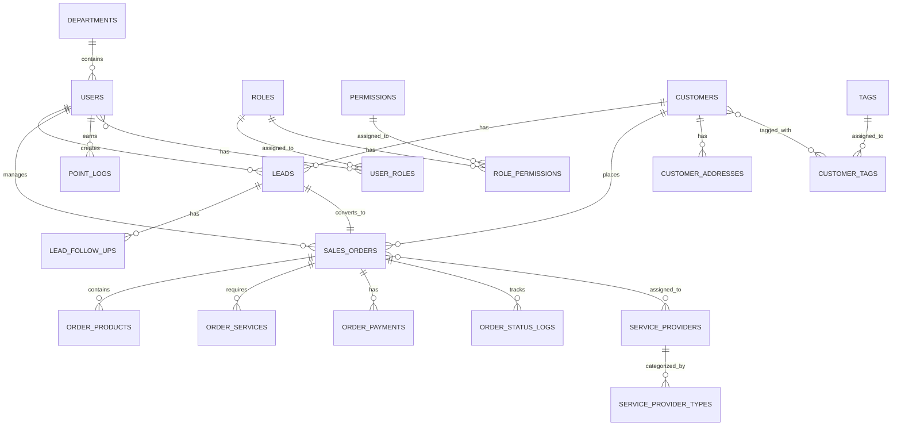

# 罗莱L2C销售管理系统 - 数据库设计文档

## 🗄️ 数据库架构总览

### 数据库选型与架构

#### 技术栈选择
```
Supabase (PostgreSQL 15+) - 主数据库，托管与认证、RLS
Redis 7.x                 - 缓存数据库，存储热点数据和会话
```

#### 数据库设计原则
1. **业务模块化**：按业务领域进行表结构设计
2. **数据一致性**：通过事务和约束保证数据完整性
3. **性能优化**：合理的索引设计和查询优化
4. **扩展性**：预留扩展字段，支持业务演进
5. **安全性**：敏感数据加密存储，访问权限控制

#### 语言使用规范
1. **表名**：必须使用英文，采用复数形式，如 sales_orders, leads, customers
2. **字段名**：必须使用英文，采用下划线命名法，如 customer_name, phone_number, created_at
3. **索引名**：必须使用英文，格式为 idx_表名_字段名，如 idx_sales_orders_status
4. **约束名**：必须使用英文，格式为 约束类型_表名_字段名，如 fk_sales_orders_customer_id
5. **注释说明**：表注释和字段注释使用中文，便于开发人员理解业务含义

#### 数据库分层架构
```
┌─────────────────────────────────────┐
│         业务数据层（Business Layer） │
│  用户、线索、订单、积分等核心业务表    │
├─────────────────────────────────────┤
│         配置数据层（Config Layer）   │
│  系统配置、业务规则、枚举值等配置表     │
├─────────────────────────────────────┤
│         日志数据层（Log Layer）      │
│  操作日志、登录日志、积分流水等日志表    │
├─────────────────────────────────────┤
 │         统计数据层（Stats Layer）    │
 │  业务统计、排行榜、报表数据等统计表      │
 └─────────────────────────────────────┘
```

## 🔒 数据库安全与RLS策略

### 安全策略基线
- **默认拒绝**：所有业务表在开启RLS后默认拒绝访问
- **管理员放通**：业务管理员与超管具备全表访问权限
- **本人可读**：普通用户仅可访问与自己相关的数据域（创建人/分配人/所属账户）
- **数据加密**：敏感数据采用AES-256加密存储，密钥托管于Supabase Vault
- **审计日志**：所有数据变更操作记录审计日志，保留90天

### RLS策略设计
#### 用户数据隔离
```sql
-- 用户表策略：用户只能查看和更新自己的信息
CREATE POLICY users_self_manage ON users FOR ALL TO authenticated USING (
  auth.uid() = auth_user_id
);
```

#### 组织数据隔离
```sql
-- 线索表策略：基于组织架构的数据访问控制
CREATE POLICY leads_org_access ON leads FOR ALL TO authenticated USING (
  EXISTS (
    SELECT 1 FROM public.users u
    JOIN public.departments d ON u.department_id = d.id
    WHERE u.auth_user_id = auth.uid()
      AND (
        -- 同部门可见
        leads.department_id = u.department_id
        -- 上级部门可见下级
        OR d.path @> (SELECT path FROM departments WHERE id = leads.department_id)
        -- 分配给自己的线索
        OR leads.assigned_to_id = u.id
      )
  )
);
```

#### 角色权限控制
```sql
-- 销售订单策略：基于角色的数据访问
CREATE POLICY orders_role_based ON orders FOR ALL TO authenticated USING (
  CASE
    WHEN public.has_role('SALES_MANAGER') THEN
      -- 销售经理查看本部门订单
      EXISTS (
        SELECT 1 FROM users u
        WHERE u.auth_user_id = auth.uid()
          AND u.department_id = orders.department_id
      )
    WHEN public.has_role('SALES_REP') THEN
      -- 销售代表只能查看自己的订单
      EXISTS (
        SELECT 1 FROM users u
        WHERE u.auth_user_id = auth.uid()
          AND u.id = orders.sales_user_id
      )
    ELSE public.is_admin()
  END
);
```

#### 时间窗口控制
```sql
-- 数据保留策略：自动清理过期数据
CREATE POLICY data_retention_policy ON audit_logs FOR DELETE TO authenticated USING (
  created_at < CURRENT_TIMESTAMP - INTERVAL '90 days'
);
```

### 用户映射与认证集成
```sql
-- Supabase认证用户与业务用户映射
ALTER TABLE users ADD COLUMN IF NOT EXISTS auth_user_id uuid UNIQUE;
ALTER TABLE users ADD COLUMN IF NOT EXISTS role VARCHAR(50) DEFAULT 'USER';

-- 管理员权限检查函数
CREATE OR REPLACE FUNCTION public.is_admin() RETURNS boolean LANGUAGE sql STABLE AS $$
  SELECT EXISTS (
    SELECT 1 FROM public.users u
    WHERE u.auth_user_id = auth.uid() AND u.role IN ('ADMIN', 'SUPER_ADMIN')
  );
$$;

-- 角色权限检查函数
CREATE OR REPLACE FUNCTION public.has_role(role_name TEXT) RETURNS boolean LANGUAGE sql STABLE AS $$
  SELECT EXISTS (
    SELECT 1 FROM public.users u
    WHERE u.auth_user_id = auth.uid() AND u.role = role_name
  );
$$;
```

## 📊 数据库架构演进

### MVP阶段（模块化单体架构）
**时间范围**：项目启动-第6个月  
**架构特点**：
- 单一PostgreSQL实例，简化部署和维护
- 模块化表设计，按业务域分组管理
- 基础RLS策略，保障数据安全
- 标准索引优化，满足基本性能需求

**适用场景**：快速验证业务，小规模用户和数据量  
**优势**：开发简单，运维成本低，快速上线  
**限制**：单点故障，性能瓶颈，扩展性有限

### 扩展阶段（混合架构）
**时间范围**：第7-18个月  
**架构特点**：
- 读写分离 + Redis缓存层
- 分区表优化，提升查询性能
- 强化RLS策略，支持组织架构
- 引入连接池，提高并发处理能力

**适用场景**：用户量增长，读多写少场景  
**优势**：提高读取性能，降低主库压力  
**实现方式**：主从复制 + 读写中间件 + 连接池

### 成熟期（模块化服务架构）
**时间范围**：第19个月及以后  
**架构特点**：
- 分库分表 + 微服务数据库
- 多租户架构支持，数据物理隔离
- 分布式事务，保证数据一致性
- 实时数据同步，支持分析场景

**适用场景**：大规模用户和数据量  
**优势**：水平扩展，高可用，性能线性增长  
**实现方式**：按业务域分库，按数据特征分表，分布式缓存

## 📊 核心实体关系图

### 实体关系总览


## 👥 用户管理模块

### 用户表（users）
```sql
CREATE TABLE users (
  id BIGSERIAL PRIMARY KEY,
  username VARCHAR(50) NOT NULL UNIQUE,
  password VARCHAR(255) NOT NULL,
  nickname VARCHAR(50) NOT NULL,
  email VARCHAR(100) UNIQUE,
  phone VARCHAR(15) UNIQUE,
  avatar VARCHAR(500),
  department_id BIGINT REFERENCES departments(id),
  status VARCHAR(20) NOT NULL DEFAULT 'active' CHECK (status IN ('active', 'inactive')),
  last_login_time TIMESTAMP,
  last_login_ip VARCHAR(50),
  login_count INTEGER NOT NULL DEFAULT 0,
  created_by BIGINT REFERENCES users(id),
  updated_by BIGINT REFERENCES users(id),
  created_at TIMESTAMP NOT NULL DEFAULT CURRENT_TIMESTAMP,
  updated_at TIMESTAMP NOT NULL DEFAULT CURRENT_TIMESTAMP,
  deleted_at TIMESTAMP
);

-- 创建索引
CREATE INDEX idx_users_department_id ON users(department_id);
CREATE INDEX idx_users_status ON users(status);
CREATE INDEX idx_users_created_at ON users(created_at);
CREATE INDEX idx_users_deleted_at ON users(deleted_at);

-- 添加表注释
COMMENT ON TABLE users IS '用户表';
COMMENT ON COLUMN users.id IS '用户ID';
COMMENT ON COLUMN users.username IS '用户名';
COMMENT ON COLUMN users.password IS '密码（加密存储）';
COMMENT ON COLUMN users.nickname IS '姓名';
COMMENT ON COLUMN users.email IS '邮箱';
COMMENT ON COLUMN users.phone IS '手机号';
COMMENT ON COLUMN users.avatar IS '头像URL';
COMMENT ON COLUMN users.department_id IS '部门ID';
COMMENT ON COLUMN users.status IS '状态：active,inactive';
COMMENT ON COLUMN users.last_login_time IS '最后登录时间';
COMMENT ON COLUMN users.last_login_ip IS '最后登录IP';
COMMENT ON COLUMN users.login_count IS '登录次数';
COMMENT ON COLUMN users.created_by IS '创建人ID';
COMMENT ON COLUMN users.updated_by IS '更新人ID';
COMMENT ON COLUMN users.created_at IS '创建时间';
COMMENT ON COLUMN users.updated_at IS '更新时间';
COMMENT ON COLUMN users.deleted_at IS '删除时间（软删除）';

-- 创建更新时间触发器
CREATE OR REPLACE FUNCTION update_updated_at_column()
RETURNS TRIGGER AS $$
BEGIN
    NEW.updated_at = CURRENT_TIMESTAMP;
    RETURN NEW;
END;
$$ language 'plpgsql';

CREATE TRIGGER update_users_updated_at BEFORE UPDATE ON users
    FOR EACH ROW EXECUTE FUNCTION update_updated_at_column();
```

### 部门表（departments）
```sql
CREATE TABLE departments (
  id BIGSERIAL PRIMARY KEY,
  name VARCHAR(50) NOT NULL,
  code VARCHAR(50) NOT NULL UNIQUE,
  parent_id BIGINT DEFAULT 0 REFERENCES departments(id),
  manager_id BIGINT REFERENCES users(id),
  sort INTEGER NOT NULL DEFAULT 0,
  status VARCHAR(20) NOT NULL DEFAULT 'active' CHECK (status IN ('active', 'inactive')),
  description TEXT,
  created_by BIGINT REFERENCES users(id),
  updated_by BIGINT REFERENCES users(id),
  created_at TIMESTAMP NOT NULL DEFAULT CURRENT_TIMESTAMP,
  updated_at TIMESTAMP NOT NULL DEFAULT CURRENT_TIMESTAMP
);

-- 创建索引
CREATE INDEX idx_departments_parent_id ON departments(parent_id);
CREATE INDEX idx_departments_manager_id ON departments(manager_id);

-- 添加表注释
COMMENT ON TABLE departments IS '部门表';
COMMENT ON COLUMN departments.id IS '部门ID';
COMMENT ON COLUMN departments.name IS '部门名称';
COMMENT ON COLUMN departments.code IS '部门编码';
COMMENT ON COLUMN departments.parent_id IS '父部门ID';
COMMENT ON COLUMN departments.manager_id IS '部门负责人ID';
COMMENT ON COLUMN departments.sort IS '排序';
COMMENT ON COLUMN departments.status IS '状态：active,inactive';
COMMENT ON COLUMN departments.description IS '描述';
COMMENT ON COLUMN departments.created_by IS '创建人ID';
COMMENT ON COLUMN departments.updated_by IS '更新人ID';
COMMENT ON COLUMN departments.created_at IS '创建时间';
COMMENT ON COLUMN departments.updated_at IS '更新时间';

-- 创建更新时间触发器
CREATE TRIGGER update_departments_updated_at BEFORE UPDATE ON departments
    FOR EACH ROW EXECUTE FUNCTION update_updated_at_column();
```

### 角色表（roles）
```sql
CREATE TABLE roles (
  id BIGSERIAL PRIMARY KEY,
  name VARCHAR(50) NOT NULL,
  code VARCHAR(50) NOT NULL UNIQUE,
  description TEXT,
  status VARCHAR(20) NOT NULL DEFAULT 'active' CHECK (status IN ('active', 'inactive')),
  created_by BIGINT REFERENCES users(id),
  updated_by BIGINT REFERENCES users(id),
  created_at TIMESTAMP NOT NULL DEFAULT CURRENT_TIMESTAMP,
  updated_at TIMESTAMP NOT NULL DEFAULT CURRENT_TIMESTAMP
);

-- 创建索引
CREATE INDEX idx_roles_status ON roles(status);

-- 添加表注释
COMMENT ON TABLE roles IS '角色表';
COMMENT ON COLUMN roles.id IS '角色ID';
COMMENT ON COLUMN roles.name IS '角色名称';
COMMENT ON COLUMN roles.code IS '角色编码';
COMMENT ON COLUMN roles.description IS '描述';
COMMENT ON COLUMN roles.status IS '状态：active,inactive';
COMMENT ON COLUMN roles.created_by IS '创建人ID';
COMMENT ON COLUMN roles.updated_by IS '更新人ID';
COMMENT ON COLUMN roles.created_at IS '创建时间';
COMMENT ON COLUMN roles.updated_at IS '更新时间';

-- 创建更新时间触发器
CREATE TRIGGER update_roles_updated_at BEFORE UPDATE ON roles
    FOR EACH ROW EXECUTE FUNCTION update_updated_at_column();
```

### 权限表（permissions）
```sql
CREATE TABLE permissions (
  id BIGSERIAL PRIMARY KEY,
  name VARCHAR(50) NOT NULL,
  code VARCHAR(100) NOT NULL UNIQUE,
  module VARCHAR(50) NOT NULL,
  action VARCHAR(50) NOT NULL,
  description TEXT,
  created_at TIMESTAMP NOT NULL DEFAULT CURRENT_TIMESTAMP,
  updated_at TIMESTAMP NOT NULL DEFAULT CURRENT_TIMESTAMP
);

-- 创建索引
CREATE INDEX idx_permissions_module ON permissions(module);

-- 添加表注释
COMMENT ON TABLE permissions IS '权限表';
COMMENT ON COLUMN permissions.id IS '权限ID';
COMMENT ON COLUMN permissions.name IS '权限名称';
COMMENT ON COLUMN permissions.code IS '权限编码';
COMMENT ON COLUMN permissions.module IS '所属模块';
COMMENT ON COLUMN permissions.action IS '操作类型';
COMMENT ON COLUMN permissions.description IS '描述';
COMMENT ON COLUMN permissions.created_at IS '创建时间';
COMMENT ON COLUMN permissions.updated_at IS '更新时间';

-- 创建更新时间触发器
CREATE TRIGGER update_permissions_updated_at BEFORE UPDATE ON permissions
    FOR EACH ROW EXECUTE FUNCTION update_updated_at_column();
```

### 用户角色关联表（user_roles）
```sql
CREATE TABLE user_roles (
  id BIGSERIAL PRIMARY KEY,
  user_id BIGINT NOT NULL REFERENCES users(id) ON DELETE CASCADE,
  role_id BIGINT NOT NULL REFERENCES roles(id) ON DELETE CASCADE,
  created_at TIMESTAMP NOT NULL DEFAULT CURRENT_TIMESTAMP,
  UNIQUE(user_id, role_id)
);

-- 创建索引
CREATE INDEX idx_user_roles_user_id ON user_roles(user_id);
CREATE INDEX idx_user_roles_role_id ON user_roles(role_id);

-- 添加表注释
COMMENT ON TABLE user_roles IS '用户角色关联表';
COMMENT ON COLUMN user_roles.id IS '关联ID';
COMMENT ON COLUMN user_roles.user_id IS '用户ID';
COMMENT ON COLUMN user_roles.role_id IS '角色ID';
COMMENT ON COLUMN user_roles.created_at IS '创建时间';
```

### 角色权限关联表（role_permissions）
```sql
CREATE TABLE role_permissions (
  id BIGSERIAL PRIMARY KEY,
  role_id BIGINT NOT NULL REFERENCES roles(id) ON DELETE CASCADE,
  permission_id BIGINT NOT NULL REFERENCES permissions(id) ON DELETE CASCADE,
  created_at TIMESTAMP NOT NULL DEFAULT CURRENT_TIMESTAMP,
  UNIQUE(role_id, permission_id)
);

-- 创建索引
CREATE INDEX idx_role_permissions_role_id ON role_permissions(role_id);
CREATE INDEX idx_role_permissions_permission_id ON role_permissions(permission_id);

-- 添加表注释
COMMENT ON TABLE role_permissions IS '角色权限关联表';
COMMENT ON COLUMN role_permissions.id IS '关联ID';
COMMENT ON COLUMN role_permissions.role_id IS '角色ID';
COMMENT ON COLUMN role_permissions.permission_id IS '权限ID';
COMMENT ON COLUMN role_permissions.created_at IS '创建时间';
```

## 📋 线索管理模块

### 线索表（leads）
```sql
CREATE TABLE leads (
  id BIGSERIAL PRIMARY KEY,
  lead_no VARCHAR(20) NOT NULL UNIQUE DEFAULT generate_business_number('lead'),
  customer_name VARCHAR(50) NOT NULL,
  customer_phone VARCHAR(15) NOT NULL,
  customer_address TEXT,
  customer_city VARCHAR(50),
  customer_district VARCHAR(50),
  status VARCHAR(20) NOT NULL DEFAULT 'new' CHECK (status IN ('new', 'assigned', 'following', 'converted', 'invalid')),
  source VARCHAR(20) NOT NULL CHECK (source IN ('wechat', 'website', 'referral', 'offline')),
  intention VARCHAR(20) CHECK (intention IN ('strong', 'medium', 'weak')),
  budget DECIMAL(10,2) CHECK (budget >= 0),
  requirement TEXT,
  assigned_to BIGINT REFERENCES users(id),
  created_by BIGINT NOT NULL REFERENCES users(id),
  next_follow_time TIMESTAMP,
  follow_count INTEGER NOT NULL DEFAULT 0,
  last_follow_time TIMESTAMP,
  remark TEXT,
  converted_at TIMESTAMP,
  converted_to_order_id BIGINT REFERENCES sales_orders(id),
  lost_reason VARCHAR(500),
  lost_at TIMESTAMP,
  created_at TIMESTAMP NOT NULL DEFAULT CURRENT_TIMESTAMP,
  updated_at TIMESTAMP NOT NULL DEFAULT CURRENT_TIMESTAMP,
  deleted_at TIMESTAMP
);

-- 创建索引
CREATE INDEX idx_leads_customer_phone ON leads(customer_phone);
CREATE INDEX idx_leads_status ON leads(status);
CREATE INDEX idx_leads_source ON leads(source);
CREATE INDEX idx_leads_assigned_to ON leads(assigned_to);
CREATE INDEX idx_leads_created_by ON leads(created_by);
CREATE INDEX idx_leads_next_follow_time ON leads(next_follow_time);
CREATE INDEX idx_leads_created_at ON leads(created_at);
CREATE INDEX idx_leads_deleted_at ON leads(deleted_at);

-- 添加表注释
COMMENT ON TABLE leads IS '线索表';
COMMENT ON COLUMN leads.id IS '线索ID';
COMMENT ON COLUMN leads.lead_no IS '线索编号';
COMMENT ON COLUMN leads.customer_name IS '客户姓名';
COMMENT ON COLUMN leads.customer_phone IS '客户手机号';
COMMENT ON COLUMN leads.customer_address IS '客户地址';
COMMENT ON COLUMN leads.customer_city IS '客户城市';
COMMENT ON COLUMN leads.customer_district IS '客户区域';
COMMENT ON COLUMN leads.status IS '状态：new(新建),assigned(已分配),following(跟进中),converted(已转化),invalid(已失效)';
COMMENT ON COLUMN leads.source IS '来源：wechat,website,referral,offline';
COMMENT ON COLUMN leads.intention IS '意向：strong,medium,weak';
COMMENT ON COLUMN leads.budget IS '预算';
COMMENT ON COLUMN leads.requirement IS '需求描述';
COMMENT ON COLUMN leads.assigned_to IS '分配给的用户ID';
COMMENT ON COLUMN leads.created_by IS '创建人ID';
COMMENT ON COLUMN leads.next_follow_time IS '下次跟进时间';
COMMENT ON COLUMN leads.follow_count IS '跟进次数';
COMMENT ON COLUMN leads.last_follow_time IS '最后跟进时间';
COMMENT ON COLUMN leads.remark IS '备注';
COMMENT ON COLUMN leads.converted_at IS '转化时间';
COMMENT ON COLUMN leads.converted_to_order_id IS '转化成的订单ID';
COMMENT ON COLUMN leads.lost_reason IS '流失原因';
COMMENT ON COLUMN leads.lost_at IS '流失时间';
COMMENT ON COLUMN leads.created_at IS '创建时间';
COMMENT ON COLUMN leads.updated_at IS '更新时间';
COMMENT ON COLUMN leads.deleted_at IS '删除时间（软删除）';

-- 添加业务逻辑验证约束
ALTER TABLE leads ADD CONSTRAINT chk_leads_budget_positive
  CHECK (budget IS NULL OR budget > 0);

ALTER TABLE leads ADD CONSTRAINT chk_leads_follow_count_non_negative
  CHECK (follow_count >= 0);

ALTER TABLE leads ADD CONSTRAINT chk_leads_conversion_logic
  CHECK (
    (status = 'converted' AND converted_at IS NOT NULL AND converted_to_order_id IS NOT NULL) OR
    (status != 'converted' AND converted_at IS NULL AND converted_to_order_id IS NULL)
  );

ALTER TABLE leads ADD CONSTRAINT chk_leads_lost_logic
  CHECK (
    (status = 'invalid' AND lost_reason IS NOT NULL AND lost_at IS NOT NULL) OR
    (status != 'invalid' AND lost_reason IS NULL AND lost_at IS NULL)
  );

ALTER TABLE leads ADD CONSTRAINT chk_leads_follow_time_logic
  CHECK (last_follow_time IS NULL OR next_follow_time IS NULL OR next_follow_time >= last_follow_time);

-- 创建更新时间触发器
CREATE TRIGGER update_leads_updated_at BEFORE UPDATE ON leads
    FOR EACH ROW EXECUTE FUNCTION update_updated_at_column();
```

### 线索跟进记录表（lead_follow_ups）
```sql
CREATE TABLE lead_follow_ups (
  id BIGSERIAL PRIMARY KEY,
  lead_id BIGINT NOT NULL REFERENCES leads(id) ON DELETE CASCADE,
  content TEXT NOT NULL,
  type VARCHAR(20) NOT NULL CHECK (type IN ('phone', 'wechat', 'visit', 'message')),
  next_follow_time TIMESTAMP,
  attachment_urls JSONB,
  created_by BIGINT NOT NULL REFERENCES users(id),
  created_at TIMESTAMP NOT NULL DEFAULT CURRENT_TIMESTAMP
);

-- 创建索引
CREATE INDEX idx_lead_follow_ups_lead_id ON lead_follow_ups(lead_id);
CREATE INDEX idx_lead_follow_ups_created_by ON lead_follow_ups(created_by);
CREATE INDEX idx_lead_follow_ups_next_follow_time ON lead_follow_ups(next_follow_time);

-- 添加表注释
COMMENT ON TABLE lead_follow_ups IS '线索跟进记录表';
COMMENT ON COLUMN lead_follow_ups.id IS '跟进记录ID';
COMMENT ON COLUMN lead_follow_ups.lead_id IS '线索ID';
COMMENT ON COLUMN lead_follow_ups.content IS '跟进内容';
COMMENT ON COLUMN lead_follow_ups.type IS '跟进方式：phone,wechat,visit,message';
COMMENT ON COLUMN lead_follow_ups.next_follow_time IS '下次跟进时间';
COMMENT ON COLUMN lead_follow_ups.attachment_urls IS '附件URL数组';
COMMENT ON COLUMN lead_follow_ups.created_by IS '创建人ID';
COMMENT ON COLUMN lead_follow_ups.created_at IS '创建时间';
```

### 线索标签关联表（lead_tags）
```sql
CREATE TABLE lead_tags (
  id BIGSERIAL PRIMARY KEY,
  lead_id BIGINT NOT NULL REFERENCES leads(id) ON DELETE CASCADE,
  tag_id BIGINT NOT NULL REFERENCES tags(id) ON DELETE CASCADE,
  created_at TIMESTAMP NOT NULL DEFAULT CURRENT_TIMESTAMP,
  UNIQUE(lead_id, tag_id)
);

-- 创建索引
CREATE INDEX idx_lead_tags_lead_id ON lead_tags(lead_id);
CREATE INDEX idx_lead_tags_tag_id ON lead_tags(tag_id);

-- 添加表注释
COMMENT ON TABLE lead_tags IS '线索标签关联表';
COMMENT ON COLUMN lead_tags.id IS '关联ID';
COMMENT ON COLUMN lead_tags.lead_id IS '线索ID';
COMMENT ON COLUMN lead_tags.tag_id IS '标签ID';
COMMENT ON COLUMN lead_tags.created_at IS '创建时间';
```

### 预报价表（lead_quotes）
```sql
CREATE TABLE lead_quotes (
  id BIGSERIAL PRIMARY KEY,
  lead_id BIGINT NOT NULL REFERENCES leads(id) ON DELETE CASCADE,
  quote_no VARCHAR(50) NOT NULL UNIQUE,
  file_name VARCHAR(255) NOT NULL,
  file_path VARCHAR(500) NOT NULL,
  file_size INTEGER NOT NULL,
  total_amount DECIMAL(10,2) CHECK (total_amount >= 0),
  product_count INTEGER DEFAULT 0,
  quoted_at TIMESTAMP NOT NULL DEFAULT CURRENT_TIMESTAMP,
  expires_at TIMESTAMP NOT NULL,
  is_expired BOOLEAN NOT NULL DEFAULT FALSE,
  needs_maintenance BOOLEAN NOT NULL DEFAULT FALSE,
  maintenance_added_at TIMESTAMP,
  created_by BIGINT NOT NULL REFERENCES users(id),
  created_at TIMESTAMP NOT NULL DEFAULT CURRENT_TIMESTAMP,
  updated_at TIMESTAMP NOT NULL DEFAULT CURRENT_TIMESTAMP
);

-- 创建索引
CREATE INDEX idx_lead_quotes_lead_id ON lead_quotes(lead_id);
CREATE INDEX idx_lead_quotes_quote_no ON lead_quotes(quote_no);
CREATE INDEX idx_lead_quotes_expires_at ON lead_quotes(expires_at);
CREATE INDEX idx_lead_quotes_needs_maintenance ON lead_quotes(needs_maintenance);
CREATE INDEX idx_lead_quotes_created_by ON lead_quotes(created_by);

-- 添加表注释
COMMENT ON TABLE lead_quotes IS '线索预报价表';
COMMENT ON COLUMN lead_quotes.id IS '预报价ID';
COMMENT ON COLUMN lead_quotes.lead_id IS '线索ID';
COMMENT ON COLUMN lead_quotes.quote_no IS '预报价编号';
COMMENT ON COLUMN lead_quotes.file_name IS '上传文件名';
COMMENT ON COLUMN lead_quotes.file_path IS '文件存储路径';
COMMENT ON COLUMN lead_quotes.file_size IS '文件大小（字节）';
COMMENT ON COLUMN lead_quotes.total_amount IS '预报价总金额';
COMMENT ON COLUMN lead_quotes.product_count IS '产品数量';
COMMENT ON COLUMN lead_quotes.quoted_at IS '报价时间';
COMMENT ON COLUMN lead_quotes.expires_at IS '过期时间（90天后）';
COMMENT ON COLUMN lead_quotes.is_expired IS '是否已过期';
COMMENT ON COLUMN lead_quotes.needs_maintenance IS '是否需要维护（10天后自动标记）';
COMMENT ON COLUMN lead_quotes.maintenance_added_at IS '添加维护标记时间';
COMMENT ON COLUMN lead_quotes.created_by IS '创建人ID';
COMMENT ON COLUMN lead_quotes.created_at IS '创建时间';
COMMENT ON COLUMN lead_quotes.updated_at IS '更新时间';

-- 创建更新时间触发器
CREATE TRIGGER update_lead_quotes_updated_at BEFORE UPDATE ON lead_quotes
    FOR EACH ROW EXECUTE FUNCTION update_updated_at_column();
```

### 预报价明细表（lead_quote_items）
```sql
CREATE TABLE lead_quote_items (
  id BIGSERIAL PRIMARY KEY,
  quote_id BIGINT NOT NULL REFERENCES lead_quotes(id) ON DELETE CASCADE,
  product_category VARCHAR(50) NOT NULL,
  product_name VARCHAR(100) NOT NULL,
  specifications VARCHAR(200),
  quantity DECIMAL(10,2) NOT NULL CHECK (quantity >= 0),
  unit VARCHAR(20),
  unit_price DECIMAL(10,2) NOT NULL CHECK (unit_price >= 0),
  total_price DECIMAL(10,2) NOT NULL CHECK (total_price >= 0),
  discount_rate DECIMAL(5,2) DEFAULT 0.00 CHECK (discount_rate >= 0 AND discount_rate <= 100),
  discount_amount DECIMAL(10,2) DEFAULT 0.00 CHECK (discount_amount >= 0),
  final_price DECIMAL(10,2) NOT NULL CHECK (final_price >= 0),
  remark TEXT,
  created_at TIMESTAMP NOT NULL DEFAULT CURRENT_TIMESTAMP
);

-- 创建索引
CREATE INDEX idx_lead_quote_items_quote_id ON lead_quote_items(quote_id);
CREATE INDEX idx_lead_quote_items_category ON lead_quote_items(product_category);

-- 添加表注释
COMMENT ON TABLE lead_quote_items IS '预报价明细表';
COMMENT ON COLUMN lead_quote_items.id IS '明细ID';
COMMENT ON COLUMN lead_quote_items.quote_id IS '预报价ID';
COMMENT ON COLUMN lead_quote_items.product_category IS '产品类别';
COMMENT ON COLUMN lead_quote_items.product_name IS '产品名称';
COMMENT ON COLUMN lead_quote_items.specifications IS '规格型号';
COMMENT ON COLUMN lead_quote_items.quantity IS '数量';
COMMENT ON COLUMN lead_quote_items.unit IS '单位';
COMMENT ON COLUMN lead_quote_items.unit_price IS '单价';
COMMENT ON COLUMN lead_quote_items.total_price IS '小计';
COMMENT ON COLUMN lead_quote_items.discount_rate IS '折扣率';
COMMENT ON COLUMN lead_quote_items.discount_amount IS '折扣金额';
COMMENT ON COLUMN lead_quote_items.final_price IS '最终价格';
COMMENT ON COLUMN lead_quote_items.remark IS '备注';
COMMENT ON COLUMN lead_quote_items.created_at IS '创建时间';
```

### 线索状态变更日志表（lead_status_logs）
```sql
CREATE TABLE lead_status_logs (
  id BIGSERIAL PRIMARY KEY,
  lead_id BIGINT NOT NULL REFERENCES leads(id) ON DELETE CASCADE,
  previous_status VARCHAR(20),
  current_status VARCHAR(20) NOT NULL,
  change_reason VARCHAR(200),
  operator_id BIGINT NOT NULL REFERENCES users(id),
  created_at TIMESTAMP NOT NULL DEFAULT CURRENT_TIMESTAMP
);

-- 创建索引
CREATE INDEX idx_lead_status_logs_lead_id ON lead_status_logs(lead_id);
CREATE INDEX idx_lead_status_logs_operator_id ON lead_status_logs(operator_id);
CREATE INDEX idx_lead_status_logs_created_at ON lead_status_logs(created_at);

-- 添加表注释
COMMENT ON TABLE lead_status_logs IS '线索状态变更日志表';
COMMENT ON COLUMN lead_status_logs.id IS '日志ID';
COMMENT ON COLUMN lead_status_logs.lead_id IS '线索ID';
COMMENT ON COLUMN lead_status_logs.previous_status IS '变更前状态';
COMMENT ON COLUMN lead_status_logs.current_status IS '变更后状态';
COMMENT ON COLUMN lead_status_logs.change_reason IS '变更原因';
COMMENT ON COLUMN lead_status_logs.operator_id IS '操作人ID';
COMMENT ON COLUMN lead_status_logs.created_at IS '创建时间';
```

## 📦 销售单管理模块

### 销售订单表（sales_orders）
```sql
CREATE TABLE sales_orders (
  id BIGSERIAL PRIMARY KEY,
  order_no VARCHAR(20) NOT NULL UNIQUE DEFAULT generate_business_number('order'),
  customer_name VARCHAR(50) NOT NULL,
  customer_phone VARCHAR(15) NOT NULL,
  customer_address TEXT,
  customer_id BIGINT REFERENCES customers(id),
  lead_id BIGINT REFERENCES leads(id),
  status VARCHAR(50) NOT NULL DEFAULT 'INITIAL',
  total_amount DECIMAL(10,2) NOT NULL DEFAULT 0.00 CHECK (total_amount >= 0),
  paid_amount DECIMAL(10,2) NOT NULL DEFAULT 0.00 CHECK (paid_amount >= 0),
  sales_id BIGINT NOT NULL REFERENCES users(id),
  measure_provider_id BIGINT REFERENCES providers(id),
  install_provider_id BIGINT REFERENCES providers(id),
  expected_install_date DATE,
  actual_install_date DATE,
  remark TEXT,
  created_by BIGINT NOT NULL REFERENCES users(id),
  updated_by BIGINT REFERENCES users(id),
  created_at TIMESTAMP NOT NULL DEFAULT CURRENT_TIMESTAMP,
  updated_at TIMESTAMP NOT NULL DEFAULT CURRENT_TIMESTAMP,
  deleted_at TIMESTAMP
);

-- 创建索引
CREATE INDEX idx_sales_orders_customer_phone ON sales_orders(customer_phone);
CREATE INDEX idx_sales_orders_status ON sales_orders(status);
CREATE INDEX idx_sales_orders_sales_id ON sales_orders(sales_id);
CREATE INDEX idx_sales_orders_lead_id ON sales_orders(lead_id);
CREATE INDEX idx_sales_orders_created_at ON sales_orders(created_at);
CREATE INDEX idx_sales_orders_deleted_at ON sales_orders(deleted_at);

-- 添加表注释
COMMENT ON TABLE sales_orders IS '销售订单表';
COMMENT ON COLUMN sales_orders.id IS '订单ID';
COMMENT ON COLUMN sales_orders.order_no IS '订单编号';
COMMENT ON COLUMN sales_orders.customer_name IS '客户姓名';
COMMENT ON COLUMN sales_orders.customer_phone IS '客户手机号';
COMMENT ON COLUMN sales_orders.customer_address IS '客户地址';
COMMENT ON COLUMN sales_orders.customer_id IS '客户ID';
COMMENT ON COLUMN sales_orders.lead_id IS '关联线索ID';
COMMENT ON COLUMN sales_orders.status IS '状态';
COMMENT ON COLUMN sales_orders.total_amount IS '订单总金额';
COMMENT ON COLUMN sales_orders.paid_amount IS '已支付金额';
COMMENT ON COLUMN sales_orders.sales_id IS '销售员ID';
COMMENT ON COLUMN sales_orders.measure_provider_id IS '测量服务商ID';
COMMENT ON COLUMN sales_orders.install_provider_id IS '安装服务商ID';
COMMENT ON COLUMN sales_orders.expected_install_date IS '期望安装日期';
COMMENT ON COLUMN sales_orders.actual_install_date IS '实际安装日期';
COMMENT ON COLUMN sales_orders.remark IS '备注';
COMMENT ON COLUMN sales_orders.created_by IS '创建人ID';
COMMENT ON COLUMN sales_orders.updated_by IS '更新人ID';
COMMENT ON COLUMN sales_orders.created_at IS '创建时间';
COMMENT ON COLUMN sales_orders.updated_at IS '更新时间';
COMMENT ON COLUMN sales_orders.deleted_at IS '删除时间（软删除）';

-- 添加业务逻辑验证约束
ALTER TABLE sales_orders ADD CONSTRAINT chk_sales_orders_paid_amount_not_exceed_total
  CHECK (paid_amount <= total_amount);

ALTER TABLE sales_orders ADD CONSTRAINT chk_sales_orders_install_date_logic
  CHECK (actual_install_date IS NULL OR expected_install_date IS NULL OR actual_install_date >= expected_install_date - INTERVAL '30 days');

ALTER TABLE sales_orders ADD CONSTRAINT chk_sales_orders_status_values
  CHECK (status IN ('INITIAL', 'CONFIRMED', 'MEASURING', 'MEASURED', 'QUOTED', 'PAID', 'PRODUCING', 'PRODUCED', 'DELIVERING', 'DELIVERED', 'INSTALLING', 'INSTALLED', 'COMPLETED', 'CANCELLED'));

-- 创建更新时间触发器
CREATE TRIGGER update_sales_orders_updated_at BEFORE UPDATE ON sales_orders
    FOR EACH ROW EXECUTE FUNCTION update_updated_at_column();
```

### 销售单产品表（order_products）
```sql
CREATE TABLE order_products (
  id BIGSERIAL PRIMARY KEY,
  order_id BIGINT NOT NULL REFERENCES sales_orders(id) ON DELETE CASCADE,
  category VARCHAR(50) NOT NULL,
  product_name VARCHAR(100) NOT NULL,
  specifications VARCHAR(200) NOT NULL,
  quantity INTEGER NOT NULL CHECK (quantity >= 0),
  unit_price DECIMAL(10,2) NOT NULL CHECK (unit_price >= 0),
  total_price DECIMAL(10,2) NOT NULL CHECK (total_price >= 0),
  remarks TEXT,
  sort INTEGER NOT NULL DEFAULT 0,
  created_at TIMESTAMP NOT NULL DEFAULT CURRENT_TIMESTAMP,
  updated_at TIMESTAMP NOT NULL DEFAULT CURRENT_TIMESTAMP
);

-- 创建索引
CREATE INDEX idx_order_products_order_id ON order_products(order_id);
CREATE INDEX idx_order_products_category ON order_products(category);

-- 添加表注释
COMMENT ON TABLE order_products IS '销售单产品表';
COMMENT ON COLUMN order_products.id IS '销售单产品ID';
COMMENT ON COLUMN order_products.order_id IS '销售单ID';
COMMENT ON COLUMN order_products.category IS '产品类别';
COMMENT ON COLUMN order_products.product_name IS '产品名称';
COMMENT ON COLUMN order_products.specifications IS '规格';
COMMENT ON COLUMN order_products.quantity IS '数量';
COMMENT ON COLUMN order_products.unit_price IS '单价';
COMMENT ON COLUMN order_products.total_price IS '总价';
COMMENT ON COLUMN order_products.remarks IS '备注';
COMMENT ON COLUMN order_products.sort IS '排序';
COMMENT ON COLUMN order_products.created_at IS '创建时间';
COMMENT ON COLUMN order_products.updated_at IS '更新时间';

-- 创建更新时间触发器
CREATE TRIGGER update_order_products_updated_at BEFORE UPDATE ON order_products
    FOR EACH ROW EXECUTE FUNCTION update_updated_at_column();
```

### 销售单服务表（order_services）
```sql
CREATE TABLE order_services (
  id BIGSERIAL PRIMARY KEY,
  order_id BIGINT NOT NULL REFERENCES sales_orders(id) ON DELETE CASCADE,
  service_type VARCHAR(50) NOT NULL CHECK (service_type IN ('measure', 'install')),
  provider_id BIGINT NOT NULL REFERENCES providers(id),
  provider_name VARCHAR(100),
  scheduled_time TIMESTAMP,
  actual_time TIMESTAMP,
  status VARCHAR(20) NOT NULL DEFAULT 'pending' CHECK (status IN ('pending', 'assigned', 'completed', 'cancelled')),
  fee DECIMAL(10,2) NOT NULL DEFAULT 0.00 CHECK (fee >= 0),
  remark TEXT,
  created_at TIMESTAMP NOT NULL DEFAULT CURRENT_TIMESTAMP,
  updated_at TIMESTAMP NOT NULL DEFAULT CURRENT_TIMESTAMP
);

-- 创建索引
CREATE INDEX idx_order_services_order_id ON order_services(order_id);
CREATE INDEX idx_order_services_service_type ON order_services(service_type);
CREATE INDEX idx_order_services_provider_id ON order_services(provider_id);
CREATE INDEX idx_order_services_status ON order_services(status);

-- 添加表注释
COMMENT ON TABLE order_services IS '销售单服务表';
COMMENT ON COLUMN order_services.id IS '销售单服务ID';
COMMENT ON COLUMN order_services.order_id IS '销售单ID';
COMMENT ON COLUMN order_services.service_type IS '服务类型：measure,install';
COMMENT ON COLUMN order_services.provider_id IS '服务商ID';
COMMENT ON COLUMN order_services.provider_name IS '服务商名称';
COMMENT ON COLUMN order_services.scheduled_time IS '预约时间';
COMMENT ON COLUMN order_services.actual_time IS '实际完成时间';
COMMENT ON COLUMN order_services.status IS '状态：pending,assigned,completed,cancelled';
COMMENT ON COLUMN order_services.fee IS '服务费用';
COMMENT ON COLUMN order_services.remark IS '备注';
COMMENT ON COLUMN order_services.created_at IS '创建时间';
COMMENT ON COLUMN order_services.updated_at IS '更新时间';

-- 创建更新时间触发器
CREATE TRIGGER update_order_services_updated_at BEFORE UPDATE ON order_services
    FOR EACH ROW EXECUTE FUNCTION update_updated_at_column();
```

### 销售单支付记录表（order_payments）
```sql
CREATE TABLE order_payments (
  id BIGSERIAL PRIMARY KEY,
  payment_no VARCHAR(50) NOT NULL UNIQUE,
  order_id BIGINT NOT NULL REFERENCES sales_orders(id),
  amount DECIMAL(10,2) NOT NULL CHECK (amount > 0),
  payment_method VARCHAR(20) NOT NULL CHECK (payment_method IN ('wechat', 'alipay', 'bank', 'cash')),
  status VARCHAR(20) NOT NULL DEFAULT 'pending' CHECK (status IN ('pending', 'success', 'failed', 'cancelled')),
  paid_at TIMESTAMP,
  transaction_id VARCHAR(100),
  remark TEXT,
  created_by BIGINT NOT NULL REFERENCES users(id),
  created_at TIMESTAMP NOT NULL DEFAULT CURRENT_TIMESTAMP,
  updated_at TIMESTAMP NOT NULL DEFAULT CURRENT_TIMESTAMP
);

-- 创建索引
CREATE INDEX idx_order_payments_order_id ON order_payments(order_id);
CREATE INDEX idx_order_payments_payment_method ON order_payments(payment_method);
CREATE INDEX idx_order_payments_status ON order_payments(status);
CREATE INDEX idx_order_payments_paid_at ON order_payments(paid_at);

-- 添加表注释
COMMENT ON TABLE order_payments IS '销售单支付记录表';
COMMENT ON COLUMN order_payments.id IS '支付记录ID';
COMMENT ON COLUMN order_payments.payment_no IS '支付编号';
COMMENT ON COLUMN order_payments.order_id IS '销售单ID';
COMMENT ON COLUMN order_payments.amount IS '支付金额';
COMMENT ON COLUMN order_payments.payment_method IS '支付方式：wechat,alipay,bank,cash';
COMMENT ON COLUMN order_payments.status IS '状态：pending,success,failed,cancelled';
COMMENT ON COLUMN order_payments.paid_at IS '支付时间';
COMMENT ON COLUMN order_payments.transaction_id IS '第三方交易ID';
COMMENT ON COLUMN order_payments.remark IS '备注';
COMMENT ON COLUMN order_payments.created_by IS '创建人ID';
COMMENT ON COLUMN order_payments.created_at IS '创建时间';
COMMENT ON COLUMN order_payments.updated_at IS '更新时间';

-- 创建更新时间触发器
CREATE TRIGGER update_order_payments_updated_at BEFORE UPDATE ON order_payments
    FOR EACH ROW EXECUTE FUNCTION update_updated_at_column();
```

### 销售单状态变更日志表（order_status_logs）
```sql
CREATE TABLE order_status_logs (
  id BIGSERIAL PRIMARY KEY,
  order_id BIGINT NOT NULL REFERENCES sales_orders(id) ON DELETE CASCADE,
  previous_status VARCHAR(50),
  current_status VARCHAR(50) NOT NULL,
  operator_id BIGINT NOT NULL REFERENCES users(id),
  operator_name VARCHAR(50),
  remark TEXT,
  created_at TIMESTAMP NOT NULL DEFAULT CURRENT_TIMESTAMP
);

-- 创建索引
CREATE INDEX idx_order_status_logs_order_id ON order_status_logs(order_id);
CREATE INDEX idx_order_status_logs_current_status ON order_status_logs(current_status);
CREATE INDEX idx_order_status_logs_operator_id ON order_status_logs(operator_id);
CREATE INDEX idx_order_status_logs_created_at ON order_status_logs(created_at);

-- 添加表注释
COMMENT ON TABLE order_status_logs IS '销售单状态变更日志表';
COMMENT ON COLUMN order_status_logs.id IS '日志ID';
COMMENT ON COLUMN order_status_logs.order_id IS '销售单ID';
COMMENT ON COLUMN order_status_logs.previous_status IS '之前状态';
COMMENT ON COLUMN order_status_logs.current_status IS '当前状态';
COMMENT ON COLUMN order_status_logs.operator_id IS '操作人ID';
COMMENT ON COLUMN order_status_logs.operator_name IS '操作人姓名';
COMMENT ON COLUMN order_status_logs.remark IS '备注';
COMMENT ON COLUMN order_status_logs.created_at IS '创建时间';
```

## 💰 积分管理模块

### 积分流水表（point_logs）
```sql
CREATE TABLE point_logs (
  id BIGSERIAL PRIMARY KEY,
  user_id BIGINT NOT NULL REFERENCES users(id),
  points INTEGER NOT NULL,
  type VARCHAR(20) NOT NULL CHECK (type IN ('earned', 'consumed', 'expired')),
  source VARCHAR(50) NOT NULL,
  source_id BIGINT,
  source_description VARCHAR(500),
  balance INTEGER NOT NULL,
  expired_at TIMESTAMP,
  created_at TIMESTAMP NOT NULL DEFAULT CURRENT_TIMESTAMP
);

-- 创建索引
CREATE INDEX idx_point_logs_user_id ON point_logs(user_id);
CREATE INDEX idx_point_logs_type ON point_logs(type);
CREATE INDEX idx_point_logs_source ON point_logs(source);
CREATE INDEX idx_point_logs_source_id ON point_logs(source_id);
CREATE INDEX idx_point_logs_created_at ON point_logs(created_at);

-- 添加表注释
COMMENT ON TABLE point_logs IS '积分流水表';
COMMENT ON COLUMN point_logs.id IS '流水ID';
COMMENT ON COLUMN point_logs.user_id IS '用户ID';
COMMENT ON COLUMN point_logs.points IS '积分数量（正数为获得，负数为消耗）';
COMMENT ON COLUMN point_logs.type IS '类型：earned,consumed,expired';
COMMENT ON COLUMN point_logs.source IS '来源：lead_created,lead_followed,order_signed,order_completed,service_completed';
COMMENT ON COLUMN point_logs.source_id IS '来源ID';
COMMENT ON COLUMN point_logs.source_description IS '来源描述';
COMMENT ON COLUMN point_logs.balance IS '变更后余额';
COMMENT ON COLUMN point_logs.expired_at IS '过期时间';
COMMENT ON COLUMN point_logs.created_at IS '创建时间';
```

### 积分规则表（point_rules）
```sql
CREATE TABLE point_rules (
  id BIGSERIAL PRIMARY KEY,
  rule_code VARCHAR(50) NOT NULL UNIQUE,
  rule_name VARCHAR(100) NOT NULL,
  points INTEGER NOT NULL,
  source_type VARCHAR(50) NOT NULL,
  conditions JSONB,
  adjustment_factors JSONB,
  status VARCHAR(20) NOT NULL DEFAULT 'active' CHECK (status IN ('active', 'inactive')),
  valid_from TIMESTAMP NOT NULL,
  valid_to TIMESTAMP,
  created_by BIGINT REFERENCES users(id),
  created_at TIMESTAMP NOT NULL DEFAULT CURRENT_TIMESTAMP,
  updated_at TIMESTAMP NOT NULL DEFAULT CURRENT_TIMESTAMP
);

-- 创建索引
CREATE INDEX idx_point_rules_source_type ON point_rules(source_type);
CREATE INDEX idx_point_rules_status ON point_rules(status);
CREATE INDEX idx_point_rules_valid_from ON point_rules(valid_from);
CREATE INDEX idx_point_rules_valid_to ON point_rules(valid_to);

-- 添加表注释
COMMENT ON TABLE point_rules IS '积分规则表';
COMMENT ON COLUMN point_rules.id IS '规则ID';
COMMENT ON COLUMN point_rules.rule_code IS '规则编码';
COMMENT ON COLUMN point_rules.rule_name IS '规则名称';
COMMENT ON COLUMN point_rules.points IS '积分数量';
COMMENT ON COLUMN point_rules.source_type IS '来源类型';
COMMENT ON COLUMN point_rules.conditions IS '触发条件';
COMMENT ON COLUMN point_rules.adjustment_factors IS '调节系数';
COMMENT ON COLUMN point_rules.status IS '状态：active,inactive';
COMMENT ON COLUMN point_rules.valid_from IS '生效时间';
COMMENT ON COLUMN point_rules.valid_to IS '失效时间';
COMMENT ON COLUMN point_rules.created_by IS '创建人ID';
COMMENT ON COLUMN point_rules.created_at IS '创建时间';
COMMENT ON COLUMN point_rules.updated_at IS '更新时间';

-- 创建更新时间触发器
CREATE TRIGGER update_point_rules_updated_at BEFORE UPDATE ON point_rules
    FOR EACH ROW EXECUTE FUNCTION update_updated_at_column();
```

## 👤 客户管理模块

### 客户表（customers）
```sql
CREATE TABLE customers (
  id BIGSERIAL PRIMARY KEY,
  customer_no VARCHAR(50) NOT NULL UNIQUE,
  name VARCHAR(50) NOT NULL,
  phone VARCHAR(15) NOT NULL UNIQUE,
  email VARCHAR(100),
  gender VARCHAR(10) CHECK (gender IN ('male', 'female', 'unknown')),
  birthday DATE,
  company VARCHAR(100),
  occupation VARCHAR(50),
  income_level VARCHAR(20) CHECK (income_level IN ('high', 'middle', 'low')),
  customer_type VARCHAR(20) DEFAULT 'individual' CHECK (customer_type IN ('individual', 'enterprise')),
  source VARCHAR(50),
  status VARCHAR(20) NOT NULL DEFAULT 'active' CHECK (status IN ('active', 'inactive', 'blacklist')),
  total_orders INTEGER NOT NULL DEFAULT 0,
  total_amount DECIMAL(10,2) NOT NULL DEFAULT 0.00,
  last_order_time TIMESTAMP,
  satisfaction_score DECIMAL(3,1),
  remark TEXT,
  created_at TIMESTAMP NOT NULL DEFAULT CURRENT_TIMESTAMP,
  updated_at TIMESTAMP NOT NULL DEFAULT CURRENT_TIMESTAMP,
  deleted_at TIMESTAMP
);

-- 创建索引
CREATE INDEX idx_customers_name ON customers(name);
CREATE INDEX idx_customers_status ON customers(status);
CREATE INDEX idx_customers_created_at ON customers(created_at);
CREATE INDEX idx_customers_deleted_at ON customers(deleted_at);

-- 添加表注释
COMMENT ON TABLE customers IS '客户表';
COMMENT ON COLUMN customers.id IS '客户ID';
COMMENT ON COLUMN customers.customer_no IS '客户编号';
COMMENT ON COLUMN customers.name IS '客户姓名';
COMMENT ON COLUMN customers.phone IS '客户手机号';
COMMENT ON COLUMN customers.email IS '客户邮箱';
COMMENT ON COLUMN customers.gender IS '性别：male,female,unknown';
COMMENT ON COLUMN customers.birthday IS '生日';
COMMENT ON COLUMN customers.company IS '公司';
COMMENT ON COLUMN customers.occupation IS '职业';
COMMENT ON COLUMN customers.income_level IS '收入水平：high,middle,low';
COMMENT ON COLUMN customers.customer_type IS '客户类型：individual,enterprise';
COMMENT ON COLUMN customers.source IS '客户来源';
COMMENT ON COLUMN customers.status IS '状态：active,inactive,blacklist';
COMMENT ON COLUMN customers.total_orders IS '总订单数';
COMMENT ON COLUMN customers.total_amount IS '总消费金额';
COMMENT ON COLUMN customers.last_order_time IS '最后下单时间';
COMMENT ON COLUMN customers.satisfaction_score IS '满意度评分';
COMMENT ON COLUMN customers.remark IS '备注';
COMMENT ON COLUMN customers.created_at IS '创建时间';
COMMENT ON COLUMN customers.updated_at IS '更新时间';
COMMENT ON COLUMN customers.deleted_at IS '删除时间（软删除）';

-- 创建更新时间触发器
CREATE TRIGGER update_customers_updated_at BEFORE UPDATE ON customers
    FOR EACH ROW EXECUTE FUNCTION update_updated_at_column();
```

### 客户地址表（customer_addresses）
```sql
CREATE TABLE customer_addresses (
  id BIGSERIAL PRIMARY KEY,
  customer_id BIGINT NOT NULL REFERENCES customers(id) ON DELETE CASCADE,
  address_type VARCHAR(20) NOT NULL DEFAULT 'home' CHECK (address_type IN ('home', 'work', 'other')),
  province VARCHAR(50) NOT NULL,
  city VARCHAR(50) NOT NULL,
  district VARCHAR(50) NOT NULL,
  street VARCHAR(100) NOT NULL,
  detail_address TEXT,
  postal_code VARCHAR(10),
  is_default BOOLEAN NOT NULL DEFAULT FALSE,
  created_at TIMESTAMP NOT NULL DEFAULT CURRENT_TIMESTAMP,
  updated_at TIMESTAMP NOT NULL DEFAULT CURRENT_TIMESTAMP
);

-- 创建索引
CREATE INDEX idx_customer_addresses_customer_id ON customer_addresses(customer_id);
CREATE INDEX idx_customer_addresses_is_default ON customer_addresses(is_default);

-- 添加表注释
COMMENT ON TABLE customer_addresses IS '客户地址表';
COMMENT ON COLUMN customer_addresses.id IS '地址ID';
COMMENT ON COLUMN customer_addresses.customer_id IS '客户ID';
COMMENT ON COLUMN customer_addresses.address_type IS '地址类型：home,work,other';
COMMENT ON COLUMN customer_addresses.province IS '省份';
COMMENT ON COLUMN customer_addresses.city IS '城市';
COMMENT ON COLUMN customer_addresses.district IS '区县';
COMMENT ON COLUMN customer_addresses.street IS '街道';
COMMENT ON COLUMN customer_addresses.detail_address IS '详细地址';
COMMENT ON COLUMN customer_addresses.postal_code IS '邮编';
COMMENT ON COLUMN customer_addresses.is_default IS '是否默认地址';
COMMENT ON COLUMN customer_addresses.created_at IS '创建时间';
COMMENT ON COLUMN customer_addresses.updated_at IS '更新时间';

-- 创建更新时间触发器
CREATE TRIGGER update_customer_addresses_updated_at BEFORE UPDATE ON customer_addresses
    FOR EACH ROW EXECUTE FUNCTION update_updated_at_column();
```

### 标签表（tags）
```sql
CREATE TABLE tags (
  id BIGSERIAL PRIMARY KEY,
  name VARCHAR(50) NOT NULL,
  color VARCHAR(20),
  category VARCHAR(50) NOT NULL CHECK (category IN ('customer', 'lead', 'order')),
  description TEXT,
  sort INTEGER NOT NULL DEFAULT 0,
  status VARCHAR(20) NOT NULL DEFAULT 'active' CHECK (status IN ('active', 'inactive')),
  created_by BIGINT REFERENCES users(id),
  created_at TIMESTAMP NOT NULL DEFAULT CURRENT_TIMESTAMP,
  updated_at TIMESTAMP NOT NULL DEFAULT CURRENT_TIMESTAMP,
  UNIQUE(name, category)
);

-- 创建索引
CREATE INDEX idx_tags_category ON tags(category);
CREATE INDEX idx_tags_status ON tags(status);

-- 添加表注释
COMMENT ON TABLE tags IS '标签表';
COMMENT ON COLUMN tags.id IS '标签ID';
COMMENT ON COLUMN tags.name IS '标签名称';
COMMENT ON COLUMN tags.color IS '标签颜色';
COMMENT ON COLUMN tags.category IS '标签分类：customer,lead,order';
COMMENT ON COLUMN tags.description IS '描述';
COMMENT ON COLUMN tags.sort IS '排序';
COMMENT ON COLUMN tags.status IS '状态：active,inactive';
COMMENT ON COLUMN tags.created_by IS '创建人ID';
COMMENT ON COLUMN tags.created_at IS '创建时间';
COMMENT ON COLUMN tags.updated_at IS '更新时间';

-- 创建更新时间触发器
CREATE TRIGGER update_tags_updated_at BEFORE UPDATE ON tags
    FOR EACH ROW EXECUTE FUNCTION update_updated_at_column();
```

### 客户标签关联表（customer_tags）
```sql
CREATE TABLE customer_tags (
  id BIGSERIAL PRIMARY KEY,
  customer_id BIGINT NOT NULL REFERENCES customers(id) ON DELETE CASCADE,
  tag_id BIGINT NOT NULL REFERENCES tags(id) ON DELETE CASCADE,
  created_by BIGINT REFERENCES users(id),
  created_at TIMESTAMP NOT NULL DEFAULT CURRENT_TIMESTAMP,
  UNIQUE(customer_id, tag_id)
);

-- 创建索引
CREATE INDEX idx_customer_tags_customer_id ON customer_tags(customer_id);
CREATE INDEX idx_customer_tags_tag_id ON customer_tags(tag_id);

-- 添加表注释
COMMENT ON TABLE customer_tags IS '客户标签关联表';
COMMENT ON COLUMN customer_tags.id IS '关联ID';
COMMENT ON COLUMN customer_tags.customer_id IS '客户ID';
COMMENT ON COLUMN customer_tags.tag_id IS '标签ID';
COMMENT ON COLUMN customer_tags.created_by IS '创建人ID';
COMMENT ON COLUMN customer_tags.created_at IS '创建时间';
```

## 🔧 系统配置模块

### 系统配置表（system_configs）
```sql
CREATE TABLE system_configs (
  id BIGSERIAL PRIMARY KEY,
  config_key VARCHAR(100) NOT NULL UNIQUE,
  config_value TEXT,
  config_type VARCHAR(20) NOT NULL DEFAULT 'string' CHECK (config_type IN ('string', 'number', 'boolean', 'json')),
  module VARCHAR(50) NOT NULL,
  description TEXT,
  is_system BOOLEAN NOT NULL DEFAULT FALSE,
  editable BOOLEAN NOT NULL DEFAULT TRUE,
  created_by BIGINT REFERENCES users(id),
  updated_by BIGINT REFERENCES users(id),
  created_at TIMESTAMP NOT NULL DEFAULT CURRENT_TIMESTAMP,
  updated_at TIMESTAMP NOT NULL DEFAULT CURRENT_TIMESTAMP
);

-- 创建索引
CREATE INDEX idx_system_configs_module ON system_configs(module);

-- 添加表注释
COMMENT ON TABLE system_configs IS '系统配置表';
COMMENT ON COLUMN system_configs.id IS '配置ID';
COMMENT ON COLUMN system_configs.config_key IS '配置键';
COMMENT ON COLUMN system_configs.config_value IS '配置值';
COMMENT ON COLUMN system_configs.config_type IS '配置类型：string,number,boolean,json';
COMMENT ON COLUMN system_configs.module IS '配置模块';
COMMENT ON COLUMN system_configs.description IS '描述';
COMMENT ON COLUMN system_configs.is_system IS '是否系统配置';
COMMENT ON COLUMN system_configs.editable IS '是否可编辑';
COMMENT ON COLUMN system_configs.created_by IS '创建人ID';
COMMENT ON COLUMN system_configs.updated_by IS '更新人ID';
COMMENT ON COLUMN system_configs.created_at IS '创建时间';
COMMENT ON COLUMN system_configs.updated_at IS '更新时间';

-- 创建更新时间触发器
CREATE TRIGGER update_system_configs_updated_at BEFORE UPDATE ON system_configs
    FOR EACH ROW EXECUTE FUNCTION update_updated_at_column();
```

## 📋 日志管理模块

### 操作日志表（operation_logs）
```sql
CREATE TABLE operation_logs (
  id BIGSERIAL PRIMARY KEY,
  user_id BIGINT NOT NULL REFERENCES users(id),
  user_name VARCHAR(50),
  module VARCHAR(50) NOT NULL,
  action VARCHAR(50) NOT NULL,
  method VARCHAR(10),
  path VARCHAR(200),
  params JSONB,
  ip VARCHAR(50),
  user_agent TEXT,
  duration INTEGER,
  result VARCHAR(20) CHECK (result IN ('success', 'failure')),
  error_message TEXT,
  created_at TIMESTAMP NOT NULL DEFAULT CURRENT_TIMESTAMP
);

-- 创建索引
CREATE INDEX idx_operation_logs_user_id ON operation_logs(user_id);
CREATE INDEX idx_operation_logs_module ON operation_logs(module);
CREATE INDEX idx_operation_logs_action ON operation_logs(action);
CREATE INDEX idx_operation_logs_created_at ON operation_logs(created_at);

-- 添加表注释
COMMENT ON TABLE operation_logs IS '操作日志表';
COMMENT ON COLUMN operation_logs.id IS '日志ID';
COMMENT ON COLUMN operation_logs.user_id IS '用户ID';
COMMENT ON COLUMN operation_logs.user_name IS '用户姓名';
COMMENT ON COLUMN operation_logs.module IS '操作模块';
COMMENT ON COLUMN operation_logs.action IS '操作动作';
COMMENT ON COLUMN operation_logs.method IS '请求方法';
COMMENT ON COLUMN operation_logs.path IS '请求路径';
COMMENT ON COLUMN operation_logs.params IS '请求参数';
COMMENT ON COLUMN operation_logs.ip IS 'IP地址';
COMMENT ON COLUMN operation_logs.user_agent IS '用户代理';
COMMENT ON COLUMN operation_logs.duration IS '请求耗时（毫秒）';
COMMENT ON COLUMN operation_logs.result IS '操作结果：success,failure';
COMMENT ON COLUMN operation_logs.error_message IS '错误信息';
COMMENT ON COLUMN operation_logs.created_at IS '创建时间';
```

### 登录日志表（login_logs）
```sql
CREATE TABLE login_logs (
  id BIGSERIAL PRIMARY KEY,
  user_id BIGINT NOT NULL REFERENCES users(id),
  user_name VARCHAR(50),
  login_time TIMESTAMP NOT NULL,
  login_ip VARCHAR(50),
  login_location VARCHAR(200),
  user_agent TEXT,
  login_result VARCHAR(20) NOT NULL CHECK (login_result IN ('success', 'failure')),
  failure_reason VARCHAR(200),
  created_at TIMESTAMP NOT NULL DEFAULT CURRENT_TIMESTAMP
);

-- 创建索引
CREATE INDEX idx_login_logs_user_id ON login_logs(user_id);
CREATE INDEX idx_login_logs_login_time ON login_logs(login_time);
CREATE INDEX idx_login_logs_login_result ON login_logs(login_result);

-- 添加表注释
COMMENT ON TABLE login_logs IS '登录日志表';
COMMENT ON COLUMN login_logs.id IS '日志ID';
COMMENT ON COLUMN login_logs.user_id IS '用户ID';
COMMENT ON COLUMN login_logs.user_name IS '用户名';
COMMENT ON COLUMN login_logs.login_time IS '登录时间';
COMMENT ON COLUMN login_logs.login_ip IS '登录IP';
COMMENT ON COLUMN login_logs.login_location IS '登录地点';
COMMENT ON COLUMN login_logs.user_agent IS '用户代理';
COMMENT ON COLUMN login_logs.login_result IS '登录结果：success,failure';
COMMENT ON COLUMN login_logs.failure_reason IS '失败原因';
COMMENT ON COLUMN login_logs.created_at IS '创建时间';
```

## 🔍 索引优化策略

### 核心查询索引
```sql
-- 用户登录查询优化
CREATE INDEX idx_users_login ON users(username, status);

-- 线索查询优化
CREATE INDEX idx_leads_query ON leads(status, assigned_to, next_follow_time, created_at);

-- 订单查询优化
CREATE INDEX idx_orders_query ON sales_orders(status, sales_id, customer_name, created_at);

-- 积分流水查询优化
CREATE INDEX idx_point_logs_query ON point_logs(user_id, created_at, type, source);

-- 客户查询优化
CREATE INDEX idx_customers_query ON customers(phone, name, status, created_at);
```

### 复合索引设计
```sql
-- 多条件组合查询
CREATE INDEX idx_leads_composite ON leads(customer_phone, status, source, created_at);
CREATE INDEX idx_orders_composite ON sales_orders(order_no, customer_phone, status, sales_id);

-- 排序优化
CREATE INDEX idx_leads_sort ON leads(next_follow_time, status, assigned_to);
CREATE INDEX idx_orders_sort ON sales_orders(created_at DESC, status, sales_id);
```

### 全文索引
```sql
-- 客户信息全文搜索
CREATE INDEX idx_customers_fulltext ON customers USING gin(to_tsvector('chinese', name || ' ' || phone || ' ' || COALESCE(company, '')));

-- 产品信息全文搜索
CREATE INDEX idx_products_fulltext ON order_products USING gin(to_tsvector('chinese', product_name || ' ' || COALESCE(specifications, '')));
```

## 📊 分表分库策略

### 水平分表策略

#### 按时间维度分表
```sql
-- 积分流水表按月分表
CREATE TABLE point_logs_202501 (LIKE point_logs INCLUDING ALL);
CREATE TABLE point_logs_202502 (LIKE point_logs INCLUDING ALL);
CREATE TABLE point_logs_202503 (LIKE point_logs INCLUDING ALL);

-- 操作日志表按周分表
CREATE TABLE operation_logs_2025w01 (LIKE operation_logs INCLUDING ALL);
CREATE TABLE operation_logs_2025w02 (LIKE operation_logs INCLUDING ALL);
CREATE TABLE operation_logs_2025w03 (LIKE operation_logs INCLUDING ALL);
```

#### 按业务维度分表
```sql
-- 按用户ID取模分表（示例）
-- 用户ID % 4 = 0的表
CREATE TABLE user_points_0 (LIKE point_logs INCLUDING ALL);
-- 用户ID % 4 = 1的表
CREATE TABLE user_points_1 (LIKE point_logs INCLUDING ALL);
-- 用户ID % 4 = 2的表
CREATE TABLE user_points_2 (LIKE point_logs INCLUDING ALL);
-- 用户ID % 4 = 3的表
CREATE TABLE user_points_3 (LIKE point_logs INCLUDING ALL);
```

### 垂直分表策略

#### 用户表拆分
```sql
-- 用户基本信息表（高频查询）
CREATE TABLE users_basic (
  id, username, nickname, phone, email, status, last_login_time
);

-- 用户扩展信息表（低频查询）
CREATE TABLE users_profile (
  user_id, avatar, birthday, address, bio, preferences
);

-- 用户认证信息表（安全敏感）
CREATE TABLE users_auth (
  user_id, password, salt, mfa_secret, last_password_change
);
```

## 🔒 数据安全策略

### 敏感数据加密
```sql
-- 密码加密存储（使用bcrypt）
ALTER TABLE users ADD COLUMN password_hash VARCHAR(255) NOT NULL;
COMMENT ON COLUMN users.password_hash IS '密码哈希';

-- 手机号加密存储（使用AES）
ALTER TABLE customers ADD COLUMN phone_encrypted VARCHAR(100);
ALTER TABLE customers ADD COLUMN phone_mask VARCHAR(15);
COMMENT ON COLUMN customers.phone_encrypted IS '加密手机号';
COMMENT ON COLUMN customers.phone_mask IS '脱敏手机号';

-- 身份证信息加密
ALTER TABLE customers ADD COLUMN id_card_encrypted VARCHAR(200);
COMMENT ON COLUMN customers.id_card_encrypted IS '加密身份证信息';
```

### 数据脱敏策略
```sql
-- 创建脱敏视图
CREATE VIEW customers_masked AS
SELECT 
  id,
  customer_no,
  name,
  CONCAT(LEFT(phone, 3), '****', RIGHT(phone, 4)) AS phone_display,
  email,
  status,
  created_at
FROM customers;

-- 添加视图注释
COMMENT ON VIEW customers_masked IS '客户信息脱敏视图';
```

## 📈 性能监控与优化

### 慢查询监控
```sql
-- 开启慢查询日志
ALTER SYSTEM SET log_min_duration_statement = 1000;  -- 超过1秒的查询记录
ALTER SYSTEM SET log_statement = 'all';
ALTER SYSTEM SET log_directory = 'pg_log';
ALTER SYSTEM SET log_filename = 'postgresql-%Y-%m-%d_%H%M%S.log';
SELECT pg_reload_conf();

-- 创建慢查询分析表
CREATE TABLE slow_query_logs (
  id BIGSERIAL PRIMARY KEY,
  query_time TIMESTAMP DEFAULT CURRENT_TIMESTAMP,
  execution_time DECIMAL(10,3) NOT NULL,
  query_text TEXT NOT NULL,
  user_host VARCHAR(100),
  rows_examined INTEGER,
  rows_sent INTEGER
);

-- 创建索引
CREATE INDEX idx_slow_query_logs_query_time ON slow_query_logs(query_time);
CREATE INDEX idx_slow_query_logs_execution_time ON slow_query_logs(execution_time);

-- 添加表注释
COMMENT ON TABLE slow_query_logs IS '慢查询分析表';
COMMENT ON COLUMN slow_query_logs.id IS '记录ID';
COMMENT ON COLUMN slow_query_logs.query_time IS '查询时间';
COMMENT ON COLUMN slow_query_logs.execution_time IS '执行时间（秒）';
COMMENT ON COLUMN slow_query_logs.query_text IS '查询语句';
COMMENT ON COLUMN slow_query_logs.user_host IS '用户主机';
COMMENT ON COLUMN slow_query_logs.rows_examined IS '检查行数';
COMMENT ON COLUMN slow_query_logs.rows_sent IS '返回行数';
```

### 索引使用监控
```sql
-- 查看索引使用情况
SELECT 
  schemaname,
  tablename,
  indexname,
  idx_scan,
  idx_tup_read,
  idx_tup_fetch
FROM pg_stat_user_indexes 
ORDER BY schemaname, tablename, indexname;

-- 监控索引命中率
SELECT 
  datname,
  numbackends,
  xact_commit,
  xact_rollback,
  blks_read,
  blks_hit,
  round(blks_hit::numeric / (blks_hit + blks_read) * 100, 2) AS cache_hit_ratio
FROM pg_stat_database 
WHERE datname = current_database();
```

## 🔄 数据备份与恢复

### 备份策略
```bash
# 全量备份（每日）
pg_dump -h localhost -U postgres -d crm_db -f backup_$(date +%Y%m%d).sql

# 增量备份（每小时）- 基于WAL日志
pg_receivewal -h localhost -U postgres -D /var/lib/postgresql/wal_archive -z -P
```

### 恢复策略
```bash
# 全量恢复
psql -h localhost -U postgres -d crm_db -f backup_20250101.sql

# 基于时间点恢复（PITR）
pg_ctl start -D /var/lib/postgresql/data
psql -U postgres -c "SELECT pg_start_backup('backup');"
# 执行文件系统备份
psql -U postgres -c "SELECT pg_stop_backup();"
```

## ⏰ 定时任务配置

### 1. 线索状态自动化任务

```sql
-- 创建状态刷新存储过程
CREATE OR REPLACE FUNCTION refresh_lead_statuses()
RETURNS void AS $$
BEGIN
    -- 更新过期的预报价状态
    UPDATE lead_quotes 
    SET is_expired = TRUE, updated_at = CURRENT_TIMESTAMP
    WHERE expires_at < CURRENT_TIMESTAMP AND is_expired = FALSE;
    
    -- 为10天未转化的已报价线索添加"需维护"标签
    UPDATE lead_quotes 
    SET needs_maintenance = TRUE, 
        maintenance_added_at = CURRENT_TIMESTAMP,
        updated_at = CURRENT_TIMESTAMP
    WHERE quoted_at < CURRENT_TIMESTAMP - INTERVAL '10 days'
      AND needs_maintenance = FALSE
      AND lead_id NOT IN (
          SELECT DISTINCT lead_id FROM sales_orders WHERE lead_id IS NOT NULL
      );
    
    -- 记录状态变更日志
    INSERT INTO lead_status_logs (lead_id, previous_status, current_status, change_reason, operator_id)
    SELECT l.id, l.status, l.status, '系统自动刷新状态', 1
    FROM leads l
    WHERE l.updated_at = CURRENT_TIMESTAMP;
    
    -- 清理1年前的预报价记录
    DELETE FROM lead_quotes 
    WHERE created_at < CURRENT_TIMESTAMP - INTERVAL '1 year';
    
    -- 记录任务执行日志
    INSERT INTO scheduled_task_logs (task_name, status, affected_rows)
    VALUES ('refresh_lead_statuses', 'success', ROW_COUNT());
    
END;
$$ LANGUAGE plpgsql;

-- 创建线索跟进提醒存储过程
CREATE OR REPLACE FUNCTION send_follow_up_reminders()
RETURNS void AS $$
BEGIN
    -- 更新需要跟进提醒的线索
    UPDATE leads 
    SET updated_at = CURRENT_TIMESTAMP
    WHERE next_follow_time <= CURRENT_TIMESTAMP 
      AND status NOT IN ('converted', 'lost')
      AND next_follow_time IS NOT NULL;
      
    -- 记录任务执行日志
    INSERT INTO scheduled_task_logs (task_name, status, affected_rows)
    VALUES ('send_follow_up_reminders', 'success', ROW_COUNT());
    
END;
$$ LANGUAGE plpgsql;
```

### 2. 定时任务调度配置

```sql
-- 需要安装pg_cron扩展
-- CREATE EXTENSION IF NOT EXISTS pg_cron;

-- 每日凌晨2点执行状态刷新任务
SELECT cron.schedule(
    'daily-lead-status-refresh', 
    '0 2 * * *', 
    'SELECT refresh_lead_statuses();'
);

-- 每小时检查跟进提醒
SELECT cron.schedule(
    'hourly-follow-up-reminders', 
    '0 * * * *', 
    'SELECT send_follow_up_reminders();'
);

-- 查看已配置的定时任务
SELECT * FROM cron.job;

-- 删除定时任务（如需要）
-- SELECT cron.unschedule('daily-lead-status-refresh');
-- SELECT cron.unschedule('hourly-follow-up-reminders');
```

### 3. 任务执行日志表

```sql
-- 创建任务执行日志表
CREATE TABLE scheduled_task_logs (
    id BIGSERIAL PRIMARY KEY,
    task_name VARCHAR(100) NOT NULL,
    execution_time TIMESTAMP NOT NULL DEFAULT CURRENT_TIMESTAMP,
    status VARCHAR(20) NOT NULL DEFAULT 'success',
    error_message TEXT,
    execution_duration INTERVAL,
    affected_rows INTEGER DEFAULT 0
);

-- 创建索引
CREATE INDEX idx_scheduled_task_logs_task_name ON scheduled_task_logs(task_name);
CREATE INDEX idx_scheduled_task_logs_execution_time ON scheduled_task_logs(execution_time);

-- 添加表注释
COMMENT ON TABLE scheduled_task_logs IS '定时任务执行日志表';
COMMENT ON COLUMN scheduled_task_logs.id IS '日志ID';
COMMENT ON COLUMN scheduled_task_logs.task_name IS '任务名称';
COMMENT ON COLUMN scheduled_task_logs.execution_time IS '执行时间';
COMMENT ON COLUMN scheduled_task_logs.status IS '执行状态：success/failed';
COMMENT ON COLUMN scheduled_task_logs.error_message IS '错误信息';
COMMENT ON COLUMN scheduled_task_logs.execution_duration IS '执行耗时';
COMMENT ON COLUMN scheduled_task_logs.affected_rows IS '影响行数';
```

### 4. 数据保留策略

```sql
-- 创建数据清理存储过程
CREATE OR REPLACE FUNCTION cleanup_old_data()
RETURNS void AS $$
BEGIN
    -- 清理1年前的预报价记录
    DELETE FROM lead_quotes 
    WHERE created_at < CURRENT_TIMESTAMP - INTERVAL '1 year';
    
    -- 清理3个月前的任务执行日志
    DELETE FROM scheduled_task_logs 
    WHERE execution_time < CURRENT_TIMESTAMP - INTERVAL '3 months';
    
    -- 清理6个月前的线索状态变更日志
    DELETE FROM lead_status_logs 
    WHERE created_at < CURRENT_TIMESTAMP - INTERVAL '6 months';
    
    -- 记录清理任务执行日志
    INSERT INTO scheduled_task_logs (task_name, status, affected_rows)
    VALUES ('cleanup_old_data', 'success', ROW_COUNT());
    
END;
$$ LANGUAGE plpgsql;

-- 每周日凌晨3点执行数据清理任务
SELECT cron.schedule(
    'weekly-data-cleanup', 
    '0 3 * * 0', 
    'SELECT cleanup_old_data();'
);
```

## 📏 测量管理模块

### 测量任务表（measurements）
```sql
CREATE TABLE measurements (
  id BIGSERIAL PRIMARY KEY,
  order_id BIGINT NOT NULL REFERENCES sales_orders(id),
  customer_id BIGINT NOT NULL REFERENCES customers(id),
  measurer_id BIGINT REFERENCES users(id),
  appointment_time TIMESTAMP,
  actual_start_time TIMESTAMP,
  actual_end_time TIMESTAMP,
  status VARCHAR(20) NOT NULL DEFAULT 'pending' CHECK (status IN ('pending', 'scheduled', 'in_progress', 'completed', 'cancelled')),
  measurement_data JSONB,
  photos JSONB,
  notes TEXT,
  created_by BIGINT NOT NULL REFERENCES users(id),
  updated_by BIGINT REFERENCES users(id),
  created_at TIMESTAMP NOT NULL DEFAULT CURRENT_TIMESTAMP,
  updated_at TIMESTAMP NOT NULL DEFAULT CURRENT_TIMESTAMP
);

-- 创建索引
CREATE INDEX idx_measurements_order_id ON measurements(order_id);
CREATE INDEX idx_measurements_customer_id ON measurements(customer_id);
CREATE INDEX idx_measurements_measurer_id ON measurements(measurer_id);
CREATE INDEX idx_measurements_status ON measurements(status);
CREATE INDEX idx_measurements_appointment_time ON measurements(appointment_time);

-- 添加表注释
COMMENT ON TABLE measurements IS '测量任务表';
COMMENT ON COLUMN measurements.id IS '测量ID';
COMMENT ON COLUMN measurements.order_id IS '订单ID';
COMMENT ON COLUMN measurements.customer_id IS '客户ID';
COMMENT ON COLUMN measurements.measurer_id IS '测量员ID';
COMMENT ON COLUMN measurements.appointment_time IS '预约时间';
COMMENT ON COLUMN measurements.actual_start_time IS '实际开始时间';
COMMENT ON COLUMN measurements.actual_end_time IS '实际结束时间';
COMMENT ON COLUMN measurements.status IS '状态：pending,scheduled,in_progress,completed,cancelled';
COMMENT ON COLUMN measurements.measurement_data IS '测量数据';
COMMENT ON COLUMN measurements.photos IS '测量照片';
COMMENT ON COLUMN measurements.notes IS '备注';

-- 创建更新时间触发器
CREATE TRIGGER update_measurements_updated_at BEFORE UPDATE ON measurements
    FOR EACH ROW EXECUTE FUNCTION update_updated_at_column();
```

## 🔧 安装管理模块

### 安装任务表（installations）
```sql
CREATE TABLE installations (
  id BIGSERIAL PRIMARY KEY,
  order_id BIGINT NOT NULL REFERENCES sales_orders(id),
  customer_id BIGINT NOT NULL REFERENCES customers(id),
  installer_id BIGINT REFERENCES users(id),
  scheduled_date DATE,
  actual_start_time TIMESTAMP,
  actual_end_time TIMESTAMP,
  status VARCHAR(20) NOT NULL DEFAULT 'pending' CHECK (status IN ('pending', 'scheduled', 'in_progress', 'completed', 'cancelled')),
  installation_progress JSONB,
  photos JSONB,
  work_hours DECIMAL(5,2),
  notes TEXT,
  created_by BIGINT NOT NULL REFERENCES users(id),
  updated_by BIGINT REFERENCES users(id),
  created_at TIMESTAMP NOT NULL DEFAULT CURRENT_TIMESTAMP,
  updated_at TIMESTAMP NOT NULL DEFAULT CURRENT_TIMESTAMP
);

-- 创建索引
CREATE INDEX idx_installations_order_id ON installations(order_id);
CREATE INDEX idx_installations_customer_id ON installations(customer_id);
CREATE INDEX idx_installations_installer_id ON installations(installer_id);
CREATE INDEX idx_installations_status ON installations(status);
CREATE INDEX idx_installations_scheduled_date ON installations(scheduled_date);

-- 添加表注释
COMMENT ON TABLE installations IS '安装任务表';
COMMENT ON COLUMN installations.id IS '安装ID';
COMMENT ON COLUMN installations.order_id IS '订单ID';
COMMENT ON COLUMN installations.customer_id IS '客户ID';
COMMENT ON COLUMN installations.installer_id IS '安装员ID';
COMMENT ON COLUMN installations.scheduled_date IS '计划安装日期';
COMMENT ON COLUMN installations.actual_start_time IS '实际开始时间';
COMMENT ON COLUMN installations.actual_end_time IS '实际结束时间';
COMMENT ON COLUMN installations.status IS '状态：pending,scheduled,in_progress,completed,cancelled';
COMMENT ON COLUMN installations.installation_progress IS '安装进度';
COMMENT ON COLUMN installations.photos IS '安装照片';
COMMENT ON COLUMN installations.work_hours IS '工作时长';
COMMENT ON COLUMN installations.notes IS '备注';

-- 创建更新时间触发器
CREATE TRIGGER update_installations_updated_at BEFORE UPDATE ON installations
    FOR EACH ROW EXECUTE FUNCTION update_updated_at_column();
```

## 📦 产品管理模块

### 产品表（products）
```sql
CREATE TABLE products (
  id BIGSERIAL PRIMARY KEY,
  name VARCHAR(200) NOT NULL,
  code VARCHAR(100) NOT NULL UNIQUE,
  category_id BIGINT REFERENCES product_categories(id),
  description TEXT,
  specifications JSONB,
  unit VARCHAR(20) NOT NULL DEFAULT '件',
  price DECIMAL(10,2) NOT NULL DEFAULT 0 CHECK (price >= 0),
  cost_price DECIMAL(10,2) CHECK (cost_price >= 0),
  inventory_type VARCHAR(20) NOT NULL DEFAULT 'unlimited' CHECK (inventory_type IN ('unlimited', 'limited')),
  inventory_quantity INTEGER DEFAULT 0,
  inventory_alert_threshold INTEGER DEFAULT 0,
  status VARCHAR(20) NOT NULL DEFAULT 'active' CHECK (status IN ('active', 'inactive', 'pre_launch', 'discontinued')),
  launch_date DATE,
  discontinue_date DATE,
  images JSONB,
  created_by BIGINT NOT NULL REFERENCES users(id),
  updated_by BIGINT REFERENCES users(id),
  created_at TIMESTAMP NOT NULL DEFAULT CURRENT_TIMESTAMP,
  updated_at TIMESTAMP NOT NULL DEFAULT CURRENT_TIMESTAMP
);

-- 创建索引
CREATE INDEX idx_products_code ON products(code);
CREATE INDEX idx_products_category_id ON products(category_id);
CREATE INDEX idx_products_status ON products(status);
CREATE INDEX idx_products_name ON products USING gin(to_tsvector('chinese', name));

-- 添加表注释
COMMENT ON TABLE products IS '产品表';
COMMENT ON COLUMN products.id IS '产品ID';
COMMENT ON COLUMN products.name IS '产品名称';
COMMENT ON COLUMN products.code IS '产品编码';
COMMENT ON COLUMN products.category_id IS '产品分类ID';
COMMENT ON COLUMN products.description IS '产品描述';
COMMENT ON COLUMN products.specifications IS '产品规格';
COMMENT ON COLUMN products.unit IS '计量单位';
COMMENT ON COLUMN products.price IS '销售价格';
COMMENT ON COLUMN products.cost_price IS '成本价格';
COMMENT ON COLUMN products.inventory_type IS '库存类型：unlimited,limited';
COMMENT ON COLUMN products.inventory_quantity IS '库存数量';
COMMENT ON COLUMN products.inventory_alert_threshold IS '库存预警阈值';
COMMENT ON COLUMN products.status IS '状态：active,inactive,pre_launch,discontinued';
COMMENT ON COLUMN products.launch_date IS '上架日期';
COMMENT ON COLUMN products.discontinue_date IS '下架日期';
COMMENT ON COLUMN products.images IS '产品图片';

-- 创建更新时间触发器
CREATE TRIGGER update_products_updated_at BEFORE UPDATE ON products
    FOR EACH ROW EXECUTE FUNCTION update_updated_at_column();
```

### 产品分类表（product_categories）
```sql
CREATE TABLE product_categories (
  id BIGSERIAL PRIMARY KEY,
  name VARCHAR(100) NOT NULL,
  parent_id BIGINT REFERENCES product_categories(id),
  sort_order INTEGER DEFAULT 0,
  description TEXT,
  is_active BOOLEAN NOT NULL DEFAULT TRUE,
  created_by BIGINT NOT NULL REFERENCES users(id),
  updated_by BIGINT REFERENCES users(id),
  created_at TIMESTAMP NOT NULL DEFAULT CURRENT_TIMESTAMP,
  updated_at TIMESTAMP NOT NULL DEFAULT CURRENT_TIMESTAMP
);

-- 创建索引
CREATE INDEX idx_product_categories_parent_id ON product_categories(parent_id);
CREATE INDEX idx_product_categories_sort_order ON product_categories(sort_order);

-- 添加表注释
COMMENT ON TABLE product_categories IS '产品分类表';
COMMENT ON COLUMN product_categories.id IS '分类ID';
COMMENT ON COLUMN product_categories.name IS '分类名称';
COMMENT ON COLUMN product_categories.parent_id IS '父分类ID';
COMMENT ON COLUMN product_categories.sort_order IS '排序';
COMMENT ON COLUMN product_categories.description IS '分类描述';
COMMENT ON COLUMN product_categories.is_active IS '是否启用';

-- 创建更新时间触发器
CREATE TRIGGER update_product_categories_updated_at BEFORE UPDATE ON product_categories
    FOR EACH ROW EXECUTE FUNCTION update_updated_at_column();
```

## 💰 报价管理模块

### 报价表（quotations）
```sql
CREATE TABLE quotations (
  id BIGSERIAL PRIMARY KEY,
  quote_number VARCHAR(50) NOT NULL UNIQUE,
  customer_id BIGINT NOT NULL REFERENCES customers(id),
  lead_id BIGINT REFERENCES leads(id),
  title VARCHAR(200) NOT NULL,
  total_amount DECIMAL(10,2) NOT NULL DEFAULT 0 CHECK (total_amount >= 0),
  discount_amount DECIMAL(10,2) NOT NULL DEFAULT 0 CHECK (discount_amount >= 0),
  final_amount DECIMAL(10,2) NOT NULL DEFAULT 0 CHECK (final_amount >= 0),
  valid_until DATE NOT NULL,
  status VARCHAR(20) NOT NULL DEFAULT 'draft' CHECK (status IN ('draft', 'pending_approval', 'approved', 'sent', 'accepted', 'rejected', 'expired')),
  approval_status VARCHAR(20) DEFAULT 'pending' CHECK (approval_status IN ('pending', 'approved', 'rejected')),
  approved_by BIGINT REFERENCES users(id),
  approved_at TIMESTAMP,
  sent_at TIMESTAMP,
  notes TEXT,
  terms_conditions TEXT,
  created_by BIGINT NOT NULL REFERENCES users(id),
  updated_by BIGINT REFERENCES users(id),
  created_at TIMESTAMP NOT NULL DEFAULT CURRENT_TIMESTAMP,
  updated_at TIMESTAMP NOT NULL DEFAULT CURRENT_TIMESTAMP
);

-- 创建索引
CREATE INDEX idx_quotations_quote_number ON quotations(quote_number);
CREATE INDEX idx_quotations_customer_id ON quotations(customer_id);
CREATE INDEX idx_quotations_lead_id ON quotations(lead_id);
CREATE INDEX idx_quotations_status ON quotations(status);
CREATE INDEX idx_quotations_valid_until ON quotations(valid_until);

-- 添加表注释
COMMENT ON TABLE quotations IS '报价表';
COMMENT ON COLUMN quotations.id IS '报价ID';
COMMENT ON COLUMN quotations.quote_number IS '报价单号';
COMMENT ON COLUMN quotations.customer_id IS '客户ID';
COMMENT ON COLUMN quotations.lead_id IS '线索ID';
COMMENT ON COLUMN quotations.title IS '报价标题';
COMMENT ON COLUMN quotations.total_amount IS '总金额';
COMMENT ON COLUMN quotations.discount_amount IS '折扣金额';
COMMENT ON COLUMN quotations.final_amount IS '最终金额';
COMMENT ON COLUMN quotations.valid_until IS '有效期至';
COMMENT ON COLUMN quotations.status IS '状态：draft,pending_approval,approved,sent,accepted,rejected,expired';
COMMENT ON COLUMN quotations.approval_status IS '审批状态：pending,approved,rejected';
COMMENT ON COLUMN quotations.approved_by IS '审批人ID';
COMMENT ON COLUMN quotations.approved_at IS '审批时间';
COMMENT ON COLUMN quotations.sent_at IS '发送时间';
COMMENT ON COLUMN quotations.notes IS '备注';
COMMENT ON COLUMN quotations.terms_conditions IS '条款条件';

-- 添加业务逻辑验证约束
ALTER TABLE quotations ADD CONSTRAINT chk_quotations_discount_not_exceed_total
  CHECK (discount_amount <= total_amount);

ALTER TABLE quotations ADD CONSTRAINT chk_quotations_final_amount_logic
  CHECK (final_amount = total_amount - discount_amount);

ALTER TABLE quotations ADD CONSTRAINT chk_quotations_valid_until_future
  CHECK (valid_until >= CURRENT_DATE);

ALTER TABLE quotations ADD CONSTRAINT chk_quotations_approval_logic
  CHECK (
    (status = 'pending_approval' AND approval_status = 'pending') OR
    (status = 'approved' AND approval_status = 'approved' AND approved_by IS NOT NULL AND approved_at IS NOT NULL) OR
    (status IN ('draft', 'sent', 'accepted', 'rejected', 'expired'))
  );

-- 创建更新时间触发器
CREATE TRIGGER update_quotations_updated_at BEFORE UPDATE ON quotations
    FOR EACH ROW EXECUTE FUNCTION update_updated_at_column();
```

### 报价明细表（quotation_items）
```sql
CREATE TABLE quotation_items (
  id BIGSERIAL PRIMARY KEY,
  quotation_id BIGINT NOT NULL REFERENCES quotations(id) ON DELETE CASCADE,
  product_id BIGINT REFERENCES products(id),
  product_name VARCHAR(200) NOT NULL,
  product_code VARCHAR(100),
  specifications TEXT,
  unit VARCHAR(20) NOT NULL DEFAULT '件',
  quantity DECIMAL(10,2) NOT NULL DEFAULT 1 CHECK (quantity >= 0),
  unit_price DECIMAL(10,2) NOT NULL DEFAULT 0 CHECK (unit_price >= 0),
  total_price DECIMAL(10,2) NOT NULL DEFAULT 0 CHECK (total_price >= 0),
  discount_rate DECIMAL(5,2) DEFAULT 0 CHECK (discount_rate >= 0 AND discount_rate <= 100),
  discount_amount DECIMAL(10,2) DEFAULT 0 CHECK (discount_amount >= 0),
  final_price DECIMAL(10,2) NOT NULL DEFAULT 0 CHECK (final_price >= 0),
  sort_order INTEGER DEFAULT 0,
  notes TEXT,
  created_at TIMESTAMP NOT NULL DEFAULT CURRENT_TIMESTAMP,
  updated_at TIMESTAMP NOT NULL DEFAULT CURRENT_TIMESTAMP
);

-- 创建索引
CREATE INDEX idx_quotation_items_quotation_id ON quotation_items(quotation_id);
CREATE INDEX idx_quotation_items_product_id ON quotation_items(product_id);

-- 添加表注释
COMMENT ON TABLE quotation_items IS '报价明细表';
COMMENT ON COLUMN quotation_items.id IS '明细ID';
COMMENT ON COLUMN quotation_items.quotation_id IS '报价ID';
COMMENT ON COLUMN quotation_items.product_id IS '产品ID';
COMMENT ON COLUMN quotation_items.product_name IS '产品名称';
COMMENT ON COLUMN quotation_items.product_code IS '产品编码';
COMMENT ON COLUMN quotation_items.specifications IS '规格说明';
COMMENT ON COLUMN quotation_items.unit IS '计量单位';
COMMENT ON COLUMN quotation_items.quantity IS '数量';
COMMENT ON COLUMN quotation_items.unit_price IS '单价';
COMMENT ON COLUMN quotation_items.total_price IS '小计';
COMMENT ON COLUMN quotation_items.discount_rate IS '折扣率';
COMMENT ON COLUMN quotation_items.discount_amount IS '折扣金额';
COMMENT ON COLUMN quotation_items.final_price IS '最终价格';
COMMENT ON COLUMN quotation_items.sort_order IS '排序';
COMMENT ON COLUMN quotation_items.notes IS '备注';

-- 创建更新时间触发器
CREATE TRIGGER update_quotation_items_updated_at BEFORE UPDATE ON quotation_items
    FOR EACH ROW EXECUTE FUNCTION update_updated_at_column();
```

## 🛍️ 积分商城模块

### 商城商品表（mall_items）
```sql
CREATE TABLE mall_items (
  id BIGSERIAL PRIMARY KEY,
  name VARCHAR(200) NOT NULL,
  description TEXT,
  category VARCHAR(50) NOT NULL,
  points_required INTEGER NOT NULL DEFAULT 0 CHECK (points_required >= 0),
  cash_required DECIMAL(10,2) DEFAULT 0 CHECK (cash_required >= 0),
  stock_quantity INTEGER DEFAULT -1,
  images JSONB,
  status VARCHAR(20) NOT NULL DEFAULT 'active' CHECK (status IN ('active', 'inactive', 'out_of_stock')),
  sort_order INTEGER DEFAULT 0,
  start_time TIMESTAMP,
  end_time TIMESTAMP,
  exchange_limit INTEGER DEFAULT 0,
  created_by BIGINT NOT NULL REFERENCES users(id),
  updated_by BIGINT REFERENCES users(id),
  created_at TIMESTAMP NOT NULL DEFAULT CURRENT_TIMESTAMP,
  updated_at TIMESTAMP NOT NULL DEFAULT CURRENT_TIMESTAMP
);

-- 创建索引
CREATE INDEX idx_mall_items_category ON mall_items(category);
CREATE INDEX idx_mall_items_status ON mall_items(status);
CREATE INDEX idx_mall_items_points_required ON mall_items(points_required);
CREATE INDEX idx_mall_items_sort_order ON mall_items(sort_order);

-- 添加表注释
COMMENT ON TABLE mall_items IS '商城商品表';
COMMENT ON COLUMN mall_items.id IS '商品ID';
COMMENT ON COLUMN mall_items.name IS '商品名称';
COMMENT ON COLUMN mall_items.description IS '商品描述';
COMMENT ON COLUMN mall_items.category IS '商品分类';
COMMENT ON COLUMN mall_items.points_required IS '所需积分';
COMMENT ON COLUMN mall_items.cash_required IS '所需现金';
COMMENT ON COLUMN mall_items.stock_quantity IS '库存数量（-1表示无限）';
COMMENT ON COLUMN mall_items.images IS '商品图片';
COMMENT ON COLUMN mall_items.status IS '状态：active,inactive,out_of_stock';
COMMENT ON COLUMN mall_items.sort_order IS '排序';
COMMENT ON COLUMN mall_items.start_time IS '开始时间';
COMMENT ON COLUMN mall_items.end_time IS '结束时间';
COMMENT ON COLUMN mall_items.exchange_limit IS '兑换限制（0表示无限制）';

-- 创建更新时间触发器
CREATE TRIGGER update_mall_items_updated_at BEFORE UPDATE ON mall_items
    FOR EACH ROW EXECUTE FUNCTION update_updated_at_column();
```

### 兑换订单表（exchange_orders）
```sql
CREATE TABLE exchange_orders (
  id BIGSERIAL PRIMARY KEY,
  order_number VARCHAR(50) NOT NULL UNIQUE,
  user_id BIGINT NOT NULL REFERENCES users(id),
  mall_item_id BIGINT NOT NULL REFERENCES mall_items(id),
  item_name VARCHAR(200) NOT NULL,
  quantity INTEGER NOT NULL DEFAULT 1 CHECK (quantity > 0),
  points_used INTEGER NOT NULL DEFAULT 0 CHECK (points_used >= 0),
  cash_used DECIMAL(10,2) DEFAULT 0 CHECK (cash_used >= 0),
  status VARCHAR(20) NOT NULL DEFAULT 'pending' CHECK (status IN ('pending', 'confirmed', 'shipped', 'completed', 'cancelled')),
  shipping_address JSONB,
  tracking_number VARCHAR(100),
  notes TEXT,
  created_at TIMESTAMP NOT NULL DEFAULT CURRENT_TIMESTAMP,
  updated_at TIMESTAMP NOT NULL DEFAULT CURRENT_TIMESTAMP
);

-- 创建索引
CREATE INDEX idx_exchange_orders_order_number ON exchange_orders(order_number);
CREATE INDEX idx_exchange_orders_user_id ON exchange_orders(user_id);
CREATE INDEX idx_exchange_orders_mall_item_id ON exchange_orders(mall_item_id);
CREATE INDEX idx_exchange_orders_status ON exchange_orders(status);

-- 添加表注释
COMMENT ON TABLE exchange_orders IS '兑换订单表';
COMMENT ON COLUMN exchange_orders.id IS '订单ID';
COMMENT ON COLUMN exchange_orders.order_number IS '订单号';
COMMENT ON COLUMN exchange_orders.user_id IS '用户ID';
COMMENT ON COLUMN exchange_orders.mall_item_id IS '商品ID';
COMMENT ON COLUMN exchange_orders.item_name IS '商品名称';
COMMENT ON COLUMN exchange_orders.quantity IS '兑换数量';
COMMENT ON COLUMN exchange_orders.points_used IS '使用积分';
COMMENT ON COLUMN exchange_orders.cash_used IS '使用现金';
COMMENT ON COLUMN exchange_orders.status IS '状态：pending,confirmed,shipped,completed,cancelled';
COMMENT ON COLUMN exchange_orders.shipping_address IS '收货地址';
COMMENT ON COLUMN exchange_orders.tracking_number IS '快递单号';
COMMENT ON COLUMN exchange_orders.notes IS '备注';

-- 创建更新时间触发器
CREATE TRIGGER update_exchange_orders_updated_at BEFORE UPDATE ON exchange_orders
    FOR EACH ROW EXECUTE FUNCTION update_updated_at_column();
```

## 📁 文件管理模块

### 文件表（files）
```sql
CREATE TABLE files (
  id BIGSERIAL PRIMARY KEY,
  original_name VARCHAR(255) NOT NULL,
  file_name VARCHAR(255) NOT NULL,
  file_path VARCHAR(500) NOT NULL,
  file_size BIGINT NOT NULL DEFAULT 0,
  mime_type VARCHAR(100),
  file_hash VARCHAR(64),
  category VARCHAR(50) NOT NULL,
  business_type VARCHAR(50),
  business_id BIGINT,
  version INTEGER DEFAULT 1,
  parent_file_id BIGINT REFERENCES files(id),
  is_public BOOLEAN NOT NULL DEFAULT FALSE,
  download_count INTEGER DEFAULT 0,
  tags JSONB,
  metadata JSONB,
  uploaded_by BIGINT NOT NULL REFERENCES users(id),
  created_at TIMESTAMP NOT NULL DEFAULT CURRENT_TIMESTAMP,
  updated_at TIMESTAMP NOT NULL DEFAULT CURRENT_TIMESTAMP
);

-- 创建索引
CREATE INDEX idx_files_file_name ON files(file_name);
CREATE INDEX idx_files_category ON files(category);
CREATE INDEX idx_files_business_type_id ON files(business_type, business_id);
CREATE INDEX idx_files_uploaded_by ON files(uploaded_by);
CREATE INDEX idx_files_file_hash ON files(file_hash);

-- 添加表注释
COMMENT ON TABLE files IS '文件表';
COMMENT ON COLUMN files.id IS '文件ID';
COMMENT ON COLUMN files.original_name IS '原始文件名';
COMMENT ON COLUMN files.file_name IS '存储文件名';
COMMENT ON COLUMN files.file_path IS '文件路径';
COMMENT ON COLUMN files.file_size IS '文件大小（字节）';
COMMENT ON COLUMN files.mime_type IS 'MIME类型';
COMMENT ON COLUMN files.file_hash IS '文件哈希值';
COMMENT ON COLUMN files.category IS '文件分类';
COMMENT ON COLUMN files.business_type IS '业务类型';
COMMENT ON COLUMN files.business_id IS '业务ID';
COMMENT ON COLUMN files.version IS '版本号';
COMMENT ON COLUMN files.parent_file_id IS '父文件ID';
COMMENT ON COLUMN files.is_public IS '是否公开';
COMMENT ON COLUMN files.download_count IS '下载次数';
COMMENT ON COLUMN files.tags IS '标签';
COMMENT ON COLUMN files.metadata IS '元数据';
COMMENT ON COLUMN files.uploaded_by IS '上传人ID';

-- 创建更新时间触发器
CREATE TRIGGER update_files_updated_at BEFORE UPDATE ON files
    FOR EACH ROW EXECUTE FUNCTION update_updated_at_column();
```

## ✅ 审批流程模块

### 审批流程表（approval_flows）
```sql
CREATE TABLE approval_flows (
  id BIGSERIAL PRIMARY KEY,
  name VARCHAR(100) NOT NULL,
  business_type VARCHAR(50) NOT NULL,
  description TEXT,
  flow_config JSONB NOT NULL,
  is_active BOOLEAN NOT NULL DEFAULT TRUE,
  created_by BIGINT NOT NULL REFERENCES users(id),
  updated_by BIGINT REFERENCES users(id),
  created_at TIMESTAMP NOT NULL DEFAULT CURRENT_TIMESTAMP,
  updated_at TIMESTAMP NOT NULL DEFAULT CURRENT_TIMESTAMP
);

-- 创建索引
CREATE INDEX idx_approval_flows_business_type ON approval_flows(business_type);
CREATE INDEX idx_approval_flows_is_active ON approval_flows(is_active);

-- 添加表注释
COMMENT ON TABLE approval_flows IS '审批流程表';
COMMENT ON COLUMN approval_flows.id IS '流程ID';
COMMENT ON COLUMN approval_flows.name IS '流程名称';
COMMENT ON COLUMN approval_flows.business_type IS '业务类型';
COMMENT ON COLUMN approval_flows.description IS '流程描述';
COMMENT ON COLUMN approval_flows.flow_config IS '流程配置';
COMMENT ON COLUMN approval_flows.is_active IS '是否启用';

-- 创建更新时间触发器
CREATE TRIGGER update_approval_flows_updated_at BEFORE UPDATE ON approval_flows
    FOR EACH ROW EXECUTE FUNCTION update_updated_at_column();
```

### 审批实例表（approval_instances）
```sql
CREATE TABLE approval_instances (
  id BIGSERIAL PRIMARY KEY,
  flow_id BIGINT NOT NULL REFERENCES approval_flows(id),
  business_type VARCHAR(50) NOT NULL,
  business_id BIGINT NOT NULL,
  title VARCHAR(200) NOT NULL,
  current_step INTEGER DEFAULT 1,
  status VARCHAR(20) NOT NULL DEFAULT 'pending' CHECK (status IN ('pending', 'approved', 'rejected', 'cancelled')),
  applicant_id BIGINT NOT NULL REFERENCES users(id),
  application_data JSONB,
  result_data JSONB,
  created_at TIMESTAMP NOT NULL DEFAULT CURRENT_TIMESTAMP,
  updated_at TIMESTAMP NOT NULL DEFAULT CURRENT_TIMESTAMP
);

-- 创建索引
CREATE INDEX idx_approval_instances_flow_id ON approval_instances(flow_id);
CREATE INDEX idx_approval_instances_business_type_id ON approval_instances(business_type, business_id);
CREATE INDEX idx_approval_instances_status ON approval_instances(status);
CREATE INDEX idx_approval_instances_applicant_id ON approval_instances(applicant_id);

-- 添加表注释
COMMENT ON TABLE approval_instances IS '审批实例表';
COMMENT ON COLUMN approval_instances.id IS '实例ID';
COMMENT ON COLUMN approval_instances.flow_id IS '流程ID';
COMMENT ON COLUMN approval_instances.business_type IS '业务类型';
COMMENT ON COLUMN approval_instances.business_id IS '业务ID';
COMMENT ON COLUMN approval_instances.title IS '审批标题';
COMMENT ON COLUMN approval_instances.current_step IS '当前步骤';
COMMENT ON COLUMN approval_instances.status IS '状态：pending,approved,rejected,cancelled';
COMMENT ON COLUMN approval_instances.applicant_id IS '申请人ID';
COMMENT ON COLUMN approval_instances.application_data IS '申请数据';
COMMENT ON COLUMN approval_instances.result_data IS '审批结果数据';

-- 创建更新时间触发器
CREATE TRIGGER update_approval_instances_updated_at BEFORE UPDATE ON approval_instances
    FOR EACH ROW EXECUTE FUNCTION update_updated_at_column();
```

### 审批记录表（approval_records）
```sql
CREATE TABLE approval_records (
  id BIGSERIAL PRIMARY KEY,
  instance_id BIGINT NOT NULL REFERENCES approval_instances(id) ON DELETE CASCADE,
  step_number INTEGER NOT NULL,
  approver_id BIGINT NOT NULL REFERENCES users(id),
  action VARCHAR(20) NOT NULL CHECK (action IN ('approve', 'reject', 'transfer')),
  comment TEXT,
  processed_at TIMESTAMP NOT NULL DEFAULT CURRENT_TIMESTAMP
);

-- 创建索引
CREATE INDEX idx_approval_records_instance_id ON approval_records(instance_id);
CREATE INDEX idx_approval_records_approver_id ON approval_records(approver_id);
CREATE INDEX idx_approval_records_step_number ON approval_records(step_number);

-- 添加表注释
COMMENT ON TABLE approval_records IS '审批记录表';
COMMENT ON COLUMN approval_records.id IS '记录ID';
COMMENT ON COLUMN approval_records.instance_id IS '实例ID';
COMMENT ON COLUMN approval_records.step_number IS '步骤号';
COMMENT ON COLUMN approval_records.approver_id IS '审批人ID';
COMMENT ON COLUMN approval_records.action IS '操作：approve,reject,transfer';
COMMENT ON COLUMN approval_records.comment IS '审批意见';
COMMENT ON COLUMN approval_records.processed_at IS '处理时间';
```

## 📋 编号生成最佳实践

### 性能优化建议

1. **缓存策略**
   - 使用Redis缓存当日流水号，减少数据库访问
   - 缓存生成器配置，避免重复查询
   - 设置合理的缓存过期时间

2. **并发控制**
   - 使用Redis原子操作（INCR）保证并发安全
   - 数据库层面使用行锁防止重复
   - 批量生成时使用INCRBY减少网络开销

3. **容错机制**
   - Redis不可用时降级到数据库生成
   - 定期同步Redis和数据库的流水号
   - 异常情况下的编号回收机制

### 监控和告警

```sql
-- 编号生成监控视图
CREATE VIEW number_generation_stats AS
SELECT 
  business_type,
  DATE(generation_date) as date,
  COUNT(*) as total_generated,
  MAX(sequence_number) as max_sequence,
  MIN(sequence_number) as min_sequence
FROM number_generation_logs
GROUP BY business_type, DATE(generation_date);

-- 编号使用率监控
CREATE VIEW number_usage_rate AS
SELECT 
  ng.business_type,
  ng.current_sequence,
  POWER(10, ng.sequence_length) as max_capacity,
  (ng.current_sequence / POWER(10, ng.sequence_length)) * 100 as usage_rate
FROM number_generators ng;
```

### 注意事项

1. **编号长度规划**
   - 根据业务量预估选择合适的流水号长度
   - 预留足够的增长空间
   - 考虑显示和存储的便利性

2. **日期切换处理**
   - 确保跨日期时流水号正确重置
   - 处理时区问题
   - 考虑节假日和特殊日期

3. **数据一致性**
   - 定期校验Redis和数据库的一致性
   - 处理缓存失效时的数据同步
   - 建立数据修复机制

4. **业务扩展**
   - 新增业务类型时的配置管理
   - 编号格式变更的兼容性处理
   - 历史数据的迁移策略

## 📱 电话号码格式验证约束

为确保电话号码数据的一致性和有效性，对所有电话字段添加格式验证约束：

```sql
-- 电话号码格式验证函数
CREATE OR REPLACE FUNCTION validate_phone_format(phone_number VARCHAR(15))
RETURNS BOOLEAN AS $$
BEGIN
  -- 允许空值
  IF phone_number IS NULL OR phone_number = '' THEN
    RETURN TRUE;
  END IF;
  
  -- 验证中国大陆手机号格式：1开头，第二位为3-9，总长度11位
  -- 验证固定电话格式：区号+号码，支持带连字符
  RETURN phone_number ~ '^(1[3-9]\d{9}|0\d{2,3}-?\d{7,8})$';
END;
$$ LANGUAGE plpgsql;

-- 为主要表的电话字段添加检查约束
ALTER TABLE users ADD CONSTRAINT chk_users_phone 
  CHECK (validate_phone_format(phone));

ALTER TABLE customers ADD CONSTRAINT chk_customers_phone 
  CHECK (validate_phone_format(phone));

ALTER TABLE leads ADD CONSTRAINT chk_leads_customer_phone 
  CHECK (validate_phone_format(customer_phone));

ALTER TABLE sales_orders ADD CONSTRAINT chk_sales_orders_customer_phone 
  CHECK (validate_phone_format(customer_phone));

ALTER TABLE sales_orders ADD CONSTRAINT chk_sales_orders_delivery_phone 
  CHECK (validate_phone_format(delivery_phone));

-- 为其他模块的电话字段添加约束
ALTER TABLE measurement_orders ADD CONSTRAINT chk_measurement_orders_customer_phone 
  CHECK (validate_phone_format(customer_phone));

ALTER TABLE installation_orders ADD CONSTRAINT chk_installation_orders_customer_phone 
  CHECK (validate_phone_format(customer_phone));

ALTER TABLE quotes ADD CONSTRAINT chk_quotes_customer_phone 
  CHECK (validate_phone_format(customer_phone));

ALTER TABLE mall_orders ADD CONSTRAINT chk_mall_orders_receiver_phone 
  CHECK (validate_phone_format(receiver_phone));

-- 添加约束说明注释
COMMENT ON FUNCTION validate_phone_format IS '电话号码格式验证函数，支持中国大陆手机号和固定电话';

-- 邮箱格式验证函数
CREATE OR REPLACE FUNCTION validate_email_format(email_address VARCHAR(100))
RETURNS BOOLEAN AS $$
BEGIN
  -- 允许空值
  IF email_address IS NULL OR email_address = '' THEN
    RETURN TRUE;
  END IF;
  
  -- 验证邮箱格式：基本的邮箱格式验证
  RETURN email_address ~ '^[A-Za-z0-9._%+-]+@[A-Za-z0-9.-]+\.[A-Za-z]{2,}$';
END;
$$ LANGUAGE plpgsql;

-- 为主要表的邮箱字段添加检查约束
ALTER TABLE users ADD CONSTRAINT chk_users_email 
  CHECK (validate_email_format(email));

ALTER TABLE customers ADD CONSTRAINT chk_customers_email 
  CHECK (validate_email_format(email));

ALTER TABLE leads ADD CONSTRAINT chk_leads_customer_email 
  CHECK (validate_email_format(customer_email));

ALTER TABLE sales_orders ADD CONSTRAINT chk_sales_orders_customer_email 
  CHECK (validate_email_format(customer_email));

-- 添加邮箱验证函数说明注释
COMMENT ON FUNCTION validate_email_format IS '邮箱格式验证函数，验证基本的邮箱格式';

-- 状态变更日志表
CREATE TABLE status_change_logs (
    id BIGSERIAL PRIMARY KEY,
    table_name VARCHAR(50) NOT NULL,
    record_id BIGINT NOT NULL,
    field_name VARCHAR(50) NOT NULL,
    old_value VARCHAR(100),
    new_value VARCHAR(100) NOT NULL,
    changed_by BIGINT NOT NULL REFERENCES users(id),
    changed_at TIMESTAMP NOT NULL DEFAULT CURRENT_TIMESTAMP,
    reason TEXT,
    ip_address INET,
    user_agent TEXT
);

-- 创建索引
CREATE INDEX idx_status_change_logs_table_record ON status_change_logs(table_name, record_id);
CREATE INDEX idx_status_change_logs_changed_by ON status_change_logs(changed_by);
CREATE INDEX idx_status_change_logs_changed_at ON status_change_logs(changed_at);

-- 添加表注释
COMMENT ON TABLE status_change_logs IS '状态变更日志表';
COMMENT ON COLUMN status_change_logs.table_name IS '表名';
COMMENT ON COLUMN status_change_logs.record_id IS '记录ID';
COMMENT ON COLUMN status_change_logs.field_name IS '字段名';
COMMENT ON COLUMN status_change_logs.old_value IS '旧值';
COMMENT ON COLUMN status_change_logs.new_value IS '新值';
COMMENT ON COLUMN status_change_logs.changed_by IS '变更人ID';
COMMENT ON COLUMN status_change_logs.changed_at IS '变更时间';
COMMENT ON COLUMN status_change_logs.reason IS '变更原因';
COMMENT ON COLUMN status_change_logs.ip_address IS 'IP地址';
COMMENT ON COLUMN status_change_logs.user_agent IS '用户代理';

-- 状态变更验证函数
CREATE OR REPLACE FUNCTION validate_status_transition(
    p_table_name VARCHAR(50),
    p_field_name VARCHAR(50),
    p_old_status VARCHAR(50),
    p_new_status VARCHAR(50)
) RETURNS BOOLEAN AS $$
BEGIN
    -- 销售订单状态变更规则
    IF p_table_name = 'sales_orders' AND p_field_name = 'status' THEN
        RETURN CASE 
            WHEN p_old_status = 'INITIAL' AND p_new_status IN ('CONFIRMED', 'CANCELLED') THEN TRUE
            WHEN p_old_status = 'CONFIRMED' AND p_new_status IN ('MEASURING', 'CANCELLED') THEN TRUE
            WHEN p_old_status = 'MEASURING' AND p_new_status IN ('MEASURED', 'CANCELLED') THEN TRUE
            WHEN p_old_status = 'MEASURED' AND p_new_status IN ('QUOTED', 'CANCELLED') THEN TRUE
            WHEN p_old_status = 'QUOTED' AND p_new_status IN ('PAID', 'CANCELLED') THEN TRUE
            WHEN p_old_status = 'PAID' AND p_new_status IN ('PRODUCING', 'CANCELLED') THEN TRUE
            WHEN p_old_status = 'PRODUCING' AND p_new_status IN ('PRODUCED', 'CANCELLED') THEN TRUE
            WHEN p_old_status = 'PRODUCED' AND p_new_status IN ('DELIVERING', 'CANCELLED') THEN TRUE
            WHEN p_old_status = 'DELIVERING' AND p_new_status IN ('DELIVERED', 'CANCELLED') THEN TRUE
            WHEN p_old_status = 'DELIVERED' AND p_new_status IN ('INSTALLING', 'CANCELLED') THEN TRUE
            WHEN p_old_status = 'INSTALLING' AND p_new_status IN ('INSTALLED', 'CANCELLED') THEN TRUE
            WHEN p_old_status = 'INSTALLED' AND p_new_status = 'COMPLETED' THEN TRUE
            ELSE FALSE
        END;
    END IF;
    
    -- 线索状态变更规则
    IF p_table_name = 'leads' AND p_field_name = 'status' THEN
        RETURN CASE 
            WHEN p_old_status = 'new' AND p_new_status IN ('assigned', 'invalid') THEN TRUE
            WHEN p_old_status = 'assigned' AND p_new_status IN ('following', 'invalid') THEN TRUE
            WHEN p_old_status = 'following' AND p_new_status IN ('converted', 'invalid') THEN TRUE
            ELSE FALSE
        END;
    END IF;
    
    -- 报价状态变更规则
    IF p_table_name = 'quotations' AND p_field_name = 'status' THEN
        RETURN CASE 
            WHEN p_old_status = 'draft' AND p_new_status IN ('pending_approval', 'expired') THEN TRUE
            WHEN p_old_status = 'pending_approval' AND p_new_status IN ('approved', 'rejected') THEN TRUE
            WHEN p_old_status = 'approved' AND p_new_status IN ('sent', 'expired') THEN TRUE
            WHEN p_old_status = 'sent' AND p_new_status IN ('accepted', 'rejected', 'expired') THEN TRUE
            ELSE FALSE
        END;
    END IF;
    
    -- 默认允许所有变更（对于未定义规则的表）
    RETURN TRUE;
END;
$$ LANGUAGE plpgsql;

-- 状态变更日志记录函数
CREATE OR REPLACE FUNCTION log_status_change() RETURNS TRIGGER AS $$
DECLARE
    old_val TEXT;
    new_val TEXT;
    field_name TEXT;
BEGIN
    -- 获取触发器参数中的字段名
    field_name := TG_ARGV[0];
    
    -- 获取旧值和新值
    EXECUTE format('SELECT ($1).%I::TEXT', field_name) INTO old_val USING OLD;
    EXECUTE format('SELECT ($1).%I::TEXT', field_name) INTO new_val USING NEW;
    
    -- 如果值发生变化，记录日志
    IF old_val IS DISTINCT FROM new_val THEN
        -- 验证状态变更是否合法
        IF NOT validate_status_transition(TG_TABLE_NAME, field_name, old_val, new_val) THEN
            RAISE EXCEPTION '非法的状态变更: % 从 % 到 %', field_name, old_val, new_val;
        END IF;
        
        -- 记录状态变更日志
        INSERT INTO status_change_logs (
            table_name, record_id, field_name, old_value, new_value, changed_by
        ) VALUES (
            TG_TABLE_NAME, NEW.id, field_name, old_val, new_val, 
            COALESCE(NEW.updated_by, NEW.created_by, 1) -- 默认用户ID为1
        );
    END IF;
    
    RETURN NEW;
END;
$$ LANGUAGE plpgsql;

-- 为关键表创建状态变更触发器
CREATE TRIGGER trg_sales_orders_status_change
    BEFORE UPDATE ON sales_orders
    FOR EACH ROW
    EXECUTE FUNCTION log_status_change('status');

CREATE TRIGGER trg_leads_status_change
    BEFORE UPDATE ON leads
    FOR EACH ROW
    EXECUTE FUNCTION log_status_change('status');

CREATE TRIGGER trg_quotations_status_change
    BEFORE UPDATE ON quotations
    FOR EACH ROW
    EXECUTE FUNCTION log_status_change('status');

-- 性能优化索引
-- 复合索引用于常见查询场景

-- 销售订单相关复合索引
CREATE INDEX idx_sales_orders_customer_status ON sales_orders(customer_id, status);
CREATE INDEX idx_sales_orders_sales_date ON sales_orders(sales_id, created_at);
CREATE INDEX idx_sales_orders_status_amount ON sales_orders(status, total_amount);
CREATE INDEX idx_sales_orders_date_range ON sales_orders(created_at, status) WHERE deleted_at IS NULL;

-- 线索相关复合索引
CREATE INDEX idx_leads_assigned_status ON leads(assigned_to, status);
CREATE INDEX idx_leads_source_status ON leads(source, status);
CREATE INDEX idx_leads_follow_time ON leads(next_follow_time) WHERE status IN ('assigned', 'following');
CREATE INDEX idx_leads_conversion ON leads(converted_at, converted_to_order_id) WHERE status = 'converted';

-- 报价相关复合索引
CREATE INDEX idx_quotations_customer_status ON quotations(customer_id, status);
CREATE INDEX idx_quotations_valid_status ON quotations(valid_until, status);
CREATE INDEX idx_quotations_approval ON quotations(approval_status, approved_by);

-- 客户相关复合索引
CREATE INDEX idx_customers_city_status ON customers(city, status);
CREATE INDEX idx_customers_source_created ON customers(source, created_at);
CREATE INDEX idx_customers_phone_name ON customers(phone, customer_name);

-- 用户相关复合索引
CREATE INDEX idx_users_role_status ON users(role, status);
CREATE INDEX idx_users_department_role ON users(department_id, role);

-- 产品相关复合索引
CREATE INDEX idx_products_category_status ON products(category_id, status);
CREATE INDEX idx_products_price_range ON products(price) WHERE status = 'active';

-- 库存相关复合索引
CREATE INDEX idx_inventory_warehouse_product ON inventory(warehouse_id, product_id);
CREATE INDEX idx_inventory_low_stock ON inventory(warehouse_id, available_quantity) 
    WHERE available_quantity <= safety_stock;

-- 订单明细相关索引
CREATE INDEX idx_sales_order_items_product ON sales_order_items(product_id, order_id);
CREATE INDEX idx_quotation_items_product ON quotation_items(product_id, quotation_id);

-- 日志表分区索引（按时间分区）
CREATE INDEX idx_status_change_logs_date ON status_change_logs(changed_at);
CREATE INDEX idx_status_change_logs_table_date ON status_change_logs(table_name, changed_at);

-- 部分索引（条件索引）用于特定查询
CREATE INDEX idx_sales_orders_active ON sales_orders(id, status) 
    WHERE status NOT IN ('COMPLETED', 'CANCELLED');
CREATE INDEX idx_leads_active ON leads(id, status) 
    WHERE status NOT IN ('converted', 'invalid');
CREATE INDEX idx_quotations_pending ON quotations(id, created_at) 
    WHERE status IN ('draft', 'pending_approval', 'sent');

-- 全文搜索索引
CREATE INDEX idx_customers_search ON customers USING gin(to_tsvector('chinese', customer_name || ' ' || COALESCE(company_name, '')));
CREATE INDEX idx_products_search ON products USING gin(to_tsvector('chinese', product_name || ' ' || COALESCE(description, '')));
CREATE INDEX idx_leads_search ON leads USING gin(to_tsvector('chinese', customer_name || ' ' || COALESCE(requirement, '')));

-- 数据库备份和恢复策略

-- 1. 创建备份日志表
CREATE TABLE backup_logs (
    id BIGSERIAL PRIMARY KEY,
    backup_type VARCHAR(20) NOT NULL CHECK (backup_type IN ('full', 'incremental', 'differential')),
    backup_file_path TEXT NOT NULL,
    backup_size BIGINT,
    start_time TIMESTAMP NOT NULL DEFAULT CURRENT_TIMESTAMP,
    end_time TIMESTAMP,
    status VARCHAR(20) NOT NULL DEFAULT 'running' CHECK (status IN ('running', 'completed', 'failed')),
    error_message TEXT,
    created_by BIGINT REFERENCES users(id)
);

-- 2. 创建数据归档表（用于历史数据归档）
CREATE TABLE archived_sales_orders (
    LIKE sales_orders INCLUDING ALL
);

CREATE TABLE archived_leads (
    LIKE leads INCLUDING ALL
);

CREATE TABLE archived_quotations (
    LIKE quotations INCLUDING ALL
);

-- 3. 数据归档函数
CREATE OR REPLACE FUNCTION archive_old_data(
    p_table_name VARCHAR(50),
    p_archive_before_date DATE
) RETURNS INTEGER AS $$
DECLARE
    archived_count INTEGER := 0;
BEGIN
    -- 归档销售订单
    IF p_table_name = 'sales_orders' THEN
        INSERT INTO archived_sales_orders 
        SELECT * FROM sales_orders 
        WHERE created_at < p_archive_before_date 
        AND status IN ('COMPLETED', 'CANCELLED');
        
        GET DIAGNOSTICS archived_count = ROW_COUNT;
        
        DELETE FROM sales_orders 
        WHERE created_at < p_archive_before_date 
        AND status IN ('COMPLETED', 'CANCELLED');
    END IF;
    
    -- 归档线索
    IF p_table_name = 'leads' THEN
        INSERT INTO archived_leads 
        SELECT * FROM leads 
        WHERE created_at < p_archive_before_date 
        AND status IN ('converted', 'invalid');
        
        GET DIAGNOSTICS archived_count = ROW_COUNT;
        
        DELETE FROM leads 
        WHERE created_at < p_archive_before_date 
        AND status IN ('converted', 'invalid');
    END IF;
    
    -- 归档报价
    IF p_table_name = 'quotations' THEN
        INSERT INTO archived_quotations 
        SELECT * FROM quotations 
        WHERE created_at < p_archive_before_date 
        AND status IN ('accepted', 'rejected', 'expired');
        
        GET DIAGNOSTICS archived_count = ROW_COUNT;
        
        DELETE FROM quotations 
        WHERE created_at < p_archive_before_date 
        AND status IN ('accepted', 'rejected', 'expired');
    END IF;
    
    RETURN archived_count;
END;
$$ LANGUAGE plpgsql;

-- 4. 数据库健康检查函数
CREATE OR REPLACE FUNCTION database_health_check()
RETURNS TABLE(
    check_name VARCHAR(50),
    status VARCHAR(20),
    details TEXT
) AS $$
BEGIN
    -- 检查表空间使用情况
    RETURN QUERY
    SELECT 
        'tablespace_usage'::VARCHAR(50),
        CASE WHEN pg_size_pretty(pg_database_size(current_database()))::TEXT LIKE '%GB%' THEN 'warning' ELSE 'ok' END::VARCHAR(20),
        'Database size: ' || pg_size_pretty(pg_database_size(current_database()))::TEXT;
    
    -- 检查长时间运行的查询
    RETURN QUERY
    SELECT 
        'long_running_queries'::VARCHAR(50),
        CASE WHEN COUNT(*) > 0 THEN 'warning' ELSE 'ok' END::VARCHAR(20),
        'Long running queries: ' || COUNT(*)::TEXT
    FROM pg_stat_activity 
    WHERE state = 'active' 
    AND query_start < NOW() - INTERVAL '5 minutes'
    AND query NOT LIKE '%pg_stat_activity%';
    
    -- 检查锁等待情况
    RETURN QUERY
    SELECT 
        'lock_waits'::VARCHAR(50),
        CASE WHEN COUNT(*) > 0 THEN 'critical' ELSE 'ok' END::VARCHAR(20),
        'Lock waits: ' || COUNT(*)::TEXT
    FROM pg_stat_activity 
    WHERE wait_event_type = 'Lock';
    
    -- 检查连接数
    RETURN QUERY
    SELECT 
        'connection_count'::VARCHAR(50),
        CASE WHEN COUNT(*) > 80 THEN 'warning' WHEN COUNT(*) > 90 THEN 'critical' ELSE 'ok' END::VARCHAR(20),
        'Active connections: ' || COUNT(*)::TEXT
    FROM pg_stat_activity 
    WHERE state = 'active';
END;
$$ LANGUAGE plpgsql;

-- 5. 自动清理过期数据的函数
CREATE OR REPLACE FUNCTION cleanup_expired_data()
RETURNS INTEGER AS $$
DECLARE
    cleanup_count INTEGER := 0;
    total_count INTEGER := 0;
BEGIN
    -- 清理过期的状态变更日志（保留1年）
    DELETE FROM status_change_logs 
    WHERE changed_at < NOW() - INTERVAL '1 year';
    GET DIAGNOSTICS cleanup_count = ROW_COUNT;
    total_count := total_count + cleanup_count;
    
    -- 清理过期的备份日志（保留6个月）
    DELETE FROM backup_logs 
    WHERE start_time < NOW() - INTERVAL '6 months';
    GET DIAGNOSTICS cleanup_count = ROW_COUNT;
    total_count := total_count + cleanup_count;
    
    -- 清理软删除的记录（删除超过3个月的）
    DELETE FROM sales_orders 
    WHERE deleted_at IS NOT NULL 
    AND deleted_at < NOW() - INTERVAL '3 months';
    GET DIAGNOSTICS cleanup_count = ROW_COUNT;
    total_count := total_count + cleanup_count;
    
    DELETE FROM leads 
    WHERE deleted_at IS NOT NULL 
    AND deleted_at < NOW() - INTERVAL '3 months';
    GET DIAGNOSTICS cleanup_count = ROW_COUNT;
    total_count := total_count + cleanup_count;
    
    DELETE FROM customers 
    WHERE deleted_at IS NOT NULL 
    AND deleted_at < NOW() - INTERVAL '3 months';
    GET DIAGNOSTICS cleanup_count = ROW_COUNT;
    total_count := total_count + cleanup_count;
    
    RETURN total_count;
END;
$$ LANGUAGE plpgsql;

## 📋 客户信息同步机制

### 客户信息冗余问题分析

#### 当前冗余情况
```sql
-- 客户信息在多个表中重复存储
-- 1. 线索表 (leads)
customer_name, customer_phone, customer_address, customer_city, customer_district

-- 2. 销售订单表 (sales_orders)  
customer_name, customer_phone, customer_address

-- 3. 测量任务表 (measurements)
customer_id, 但可能存在冗余的客户信息字段

-- 4. 安装任务表 (installations)
customer_id, 但可能存在冗余的客户信息字段

-- 5. 客户表 (customers) - 主表
name, phone, email, company, occupation, 等完整信息
```

#### 数据不一致风险
- **更新遗漏**：客户信息更新时，可能遗漏某些关联表
- **数据冲突**：不同表中同一客户的信息不一致
- **维护困难**：需要在多个地方维护相同的客户信息
- **查询复杂**：需要关联多个表才能获取完整的客户信息

## 🔢 统一编号生成系统

### 编号生成器表 (number_generators)
```sql
CREATE TABLE number_generators (
    id BIGSERIAL PRIMARY KEY,
    business_type VARCHAR(20) NOT NULL UNIQUE COMMENT '业务类型',
    prefix VARCHAR(10) NOT NULL COMMENT '编号前缀',
    current_date DATE NOT NULL COMMENT '当前日期',
    current_sequence INT NOT NULL DEFAULT 0 COMMENT '当前流水号',
    sequence_length INT NOT NULL DEFAULT 3 COMMENT '流水号长度',
    format_template VARCHAR(50) NOT NULL COMMENT '格式模板',
    description VARCHAR(100) COMMENT '描述',
    created_at TIMESTAMP DEFAULT CURRENT_TIMESTAMP,
    updated_at TIMESTAMP DEFAULT CURRENT_TIMESTAMP,
    INDEX idx_business_type (business_type),
    INDEX idx_current_date (current_date)
) COMMENT '编号生成器表';

-- 初始化编号生成器数据
INSERT INTO number_generators (business_type, prefix, current_date, format_template, description) VALUES
('lead', 'L', CURRENT_DATE, '{prefix}{date}{sequence}', '线索编号'),
('order', 'O', CURRENT_DATE, '{prefix}{date}{sequence}', '订单编号'),
('customer', 'C', CURRENT_DATE, '{prefix}{date}{sequence}', '客户编号'),
('product', 'P', CURRENT_DATE, '{prefix}{date}{sequence}', '产品编号'),
('measurement', 'M', CURRENT_DATE, '{prefix}{date}{sequence}', '测量编号'),
('installation', 'I', CURRENT_DATE, '{prefix}{date}{sequence}', '安装编号'),
('quote', 'Q', CURRENT_DATE, '{prefix}{date}{sequence}', '报价编号'),
('contract', 'CT', CURRENT_DATE, '{prefix}{date}{sequence}', '合同编号'),
('point_transaction', 'PT', CURRENT_DATE, '{prefix}{date}{sequence}', '积分交易编号'),
('mall_order', 'MO', CURRENT_DATE, '{prefix}{date}{sequence}', '商城订单编号'),
('reservation', 'R', CURRENT_DATE, '{prefix}{date}{sequence}', '库存预留编号'),
('stocktake', 'S', CURRENT_DATE, '{prefix}{date}{sequence}', '盘点编号'),
('finance', 'F', CURRENT_DATE, '{prefix}{date}{sequence}', '财务流水编号'),
('logistics', 'T', CURRENT_DATE, '{prefix}{date}{sequence}', '物流任务编号');
```

### 编号生成函数
```sql
-- 统一编号生成函数
CREATE OR REPLACE FUNCTION generate_business_number(p_business_type VARCHAR(20))
RETURNS VARCHAR(20) AS $
DECLARE
    v_generator RECORD;
    v_current_date DATE;
    v_date_str VARCHAR(8);
    v_sequence_str VARCHAR(10);
    v_new_number VARCHAR(20);
BEGIN
    v_current_date := CURRENT_DATE;
    v_date_str := TO_CHAR(v_current_date, 'YYYYMMDD');
    
    -- 获取生成器配置（加锁防止并发）
    SELECT * INTO v_generator 
    FROM number_generators 
    WHERE business_type = p_business_type 
    FOR UPDATE;
    
    IF NOT FOUND THEN
        RAISE EXCEPTION '未找到业务类型 % 的编号生成器', p_business_type;
    END IF;
    
    -- 检查日期是否变更，如果变更则重置流水号
    IF v_generator.current_date != v_current_date THEN
        UPDATE number_generators 
        SET current_date = v_current_date,
            current_sequence = 1,
            updated_at = CURRENT_TIMESTAMP
        WHERE business_type = p_business_type;
        
        v_sequence_str := LPAD('1', v_generator.sequence_length, '0');
    ELSE
        -- 递增流水号
        UPDATE number_generators 
        SET current_sequence = current_sequence + 1,
            updated_at = CURRENT_TIMESTAMP
        WHERE business_type = p_business_type;
        
        v_sequence_str := LPAD((v_generator.current_sequence + 1)::TEXT, v_generator.sequence_length, '0');
    END IF;
    
    -- 生成编号
    v_new_number := v_generator.prefix || v_date_str || v_sequence_str;
    
    -- 记录生成日志
    INSERT INTO number_generation_logs (
        business_type, generated_number, generation_date, sequence_number
    ) VALUES (
        p_business_type, v_new_number, v_current_date, 
        CASE WHEN v_generator.current_date != v_current_date THEN 1 ELSE v_generator.current_sequence + 1 END
    );
    
    RETURN v_new_number;
END;
$ LANGUAGE plpgsql;
```

### 编号生成日志表
```sql
CREATE TABLE number_generation_logs (
    id BIGSERIAL PRIMARY KEY,
    business_type VARCHAR(20) NOT NULL COMMENT '业务类型',
    generated_number VARCHAR(20) NOT NULL COMMENT '生成的编号',
    generation_date DATE NOT NULL COMMENT '生成日期',
    sequence_number INT NOT NULL COMMENT '当日流水号',
    created_at TIMESTAMP DEFAULT CURRENT_TIMESTAMP,
    INDEX idx_business_type (business_type),
    INDEX idx_generated_number (generated_number),
    INDEX idx_generation_date (generation_date)
) COMMENT '编号生成日志表';
```

### 编号重复检查函数
```sql
-- 编号唯一性检查函数
CREATE OR REPLACE FUNCTION check_number_uniqueness(
    p_table_name VARCHAR(50),
    p_column_name VARCHAR(50),
    p_number VARCHAR(20)
) RETURNS BOOLEAN AS $
DECLARE
    v_count INT;
    v_sql TEXT;
BEGIN
    v_sql := FORMAT('SELECT COUNT(*) FROM %I WHERE %I = $1', p_table_name, p_column_name);
    EXECUTE v_sql INTO v_count USING p_number;
    
    RETURN v_count = 0;
END;
$ LANGUAGE plpgsql;
```

### 批量编号生成函数
```sql
-- 批量编号生成函数（用于数据迁移）
CREATE OR REPLACE FUNCTION generate_batch_numbers(
    p_business_type VARCHAR(20),
    p_count INT
) RETURNS TEXT[] AS $
DECLARE
    v_numbers TEXT[] := '{}';
    v_number VARCHAR(20);
    i INT;
BEGIN
    FOR i IN 1..p_count LOOP
        v_number := generate_business_number(p_business_type);
        v_numbers := array_append(v_numbers, v_number);
    END LOOP;
    
    RETURN v_numbers;
END;
$ LANGUAGE plpgsql;
```

### 客户信息同步解决方案

#### 数据库触发器同步
```sql
-- 客户信息变更同步触发器
CREATE OR REPLACE FUNCTION sync_customer_info()
RETURNS TRIGGER AS $
BEGIN
    -- 同步到线索表
    UPDATE leads 
    SET customer_name = NEW.name,
        customer_phone = NEW.phone,
        updated_at = CURRENT_TIMESTAMP
    WHERE customer_id = NEW.id;
    
    -- 同步到销售订单表
    UPDATE sales_orders 
    SET customer_name = NEW.name,
        customer_phone = NEW.phone,
        updated_at = CURRENT_TIMESTAMP
    WHERE customer_id = NEW.id;
    
    -- 记录同步日志
    INSERT INTO customer_sync_logs (
        customer_id, sync_type, affected_tables, 
        old_values, new_values, sync_time
    ) VALUES (
        NEW.id, 'customer_update', 
        ARRAY['leads', 'sales_orders'],
        jsonb_build_object('name', OLD.name, 'phone', OLD.phone),
        jsonb_build_object('name', NEW.name, 'phone', NEW.phone),
        CURRENT_TIMESTAMP
    );
    
    RETURN NEW;
END;
$ LANGUAGE plpgsql;

-- 创建触发器
CREATE TRIGGER trigger_sync_customer_info
    AFTER UPDATE OF name, phone ON customers
    FOR EACH ROW
    WHEN (OLD.name IS DISTINCT FROM NEW.name OR OLD.phone IS DISTINCT FROM NEW.phone)
    EXECUTE FUNCTION sync_customer_info();
```

### 📱 应用层编号生成服务

### 编号生成服务类
```typescript
// services/NumberGeneratorService.ts
export class NumberGeneratorService {
  private redis: Redis;
  private db: Database;
  
  constructor(redis: Redis, db: Database) {
    this.redis = redis;
    this.db = db;
  }

  /**
   * 生成业务编号
   * @param businessType 业务类型
   * @returns 生成的编号
   */
  async generateNumber(businessType: string): Promise<string> {
    const cacheKey = `number_gen:${businessType}:${this.getCurrentDateStr()}`;
    
    try {
      // 1. 尝试从Redis获取当日流水号
      let sequence = await this.redis.incr(cacheKey);
      
      // 2. 如果是第一次生成，设置过期时间
      if (sequence === 1) {
        await this.redis.expire(cacheKey, 86400); // 24小时过期
      }
      
      // 3. 生成编号
      const config = await this.getGeneratorConfig(businessType);
      const number = this.formatNumber(config, sequence);
      
      // 4. 异步更新数据库（不阻塞响应）
      this.updateDatabaseAsync(businessType, sequence, number);
      
      // 5. 验证编号唯一性
      await this.validateNumberUniqueness(businessType, number);
      
      return number;
    } catch (error) {
      // 降级到数据库生成
      return this.generateFromDatabase(businessType);
    }
  }

  /**
   * 批量生成编号
   * @param businessType 业务类型
   * @param count 生成数量
   * @returns 编号数组
   */
  async generateBatchNumbers(businessType: string, count: number): Promise<string[]> {
    const cacheKey = `number_gen:${businessType}:${this.getCurrentDateStr()}`;
    
    // 批量递增
    const startSequence = await this.redis.incrby(cacheKey, count);
    const endSequence = startSequence - count + 1;
    
    const config = await this.getGeneratorConfig(businessType);
    const numbers: string[] = [];
    
    for (let i = endSequence; i <= startSequence; i++) {
      numbers.push(this.formatNumber(config, i));
    }
    
    // 异步更新数据库
    this.updateDatabaseBatchAsync(businessType, numbers);
    
    return numbers;
  }

  /**
   * 格式化编号
   */
  private formatNumber(config: GeneratorConfig, sequence: number): string {
    const dateStr = this.getCurrentDateStr();
    const sequenceStr = sequence.toString().padStart(config.sequenceLength, '0');
    return `${config.prefix}${dateStr}${sequenceStr}`;
  }

  /**
   * 获取生成器配置（带缓存）
   */
  private async getGeneratorConfig(businessType: string): Promise<GeneratorConfig> {
    const cacheKey = `number_config:${businessType}`;
    
    let config = await this.redis.get(cacheKey);
    if (!config) {
      config = await this.db.query(
        'SELECT * FROM number_generators WHERE business_type = ?',
        [businessType]
      );
      await this.redis.setex(cacheKey, 3600, JSON.stringify(config)); // 1小时缓存
    }
    
    return JSON.parse(config);
  }

  /**
   * 验证编号唯一性
   */
  private async validateNumberUniqueness(businessType: string, number: string): Promise<void> {
    const tableConfig = this.getTableConfig(businessType);
    const exists = await this.db.query(
      `SELECT 1 FROM ${tableConfig.tableName} WHERE ${tableConfig.columnName} = ? LIMIT 1`,
      [number]
    );
    
    if (exists.length > 0) {
      throw new Error(`编号 ${number} 已存在`);
    }
  }

  /**
   * 异步更新数据库
   */
  private async updateDatabaseAsync(businessType: string, sequence: number, number: string): Promise<void> {
    // 使用消息队列或定时任务异步更新
    await this.db.query(
      'UPDATE number_generators SET current_sequence = ?, updated_at = NOW() WHERE business_type = ?',
      [sequence, businessType]
    );
    
    // 记录生成日志
    await this.db.query(
      'INSERT INTO number_generation_logs (business_type, generated_number, generation_date, sequence_number) VALUES (?, ?, CURDATE(), ?)',
      [businessType, number, sequence]
    );
  }

  private getCurrentDateStr(): string {
    return new Date().toISOString().slice(0, 10).replace(/-/g, '');
  }
}
```

### 编号生成配置接口
```typescript
// interfaces/NumberGenerator.ts
export interface GeneratorConfig {
  businessType: string;
  prefix: string;
  sequenceLength: number;
  formatTemplate: string;
  description: string;
}

export interface TableConfig {
  tableName: string;
  columnName: string;
}

export const BUSINESS_TYPE_MAPPING: Record<string, TableConfig> = {
  'lead': { tableName: 'leads', columnName: 'lead_no' },
  'order': { tableName: 'sales_orders', columnName: 'order_no' },
  'customer': { tableName: 'customers', columnName: 'customer_no' },
  'product': { tableName: 'products', columnName: 'product_code' },
  'measurement': { tableName: 'measurement_orders', columnName: 'measurement_no' },
  'installation': { tableName: 'installation_orders', columnName: 'installation_no' },
  'quote': { tableName: 'quotations', columnName: 'quote_no' },
  'contract': { tableName: 'contracts', columnName: 'contract_number' },
  'point_transaction': { tableName: 'point_transactions', columnName: 'transaction_no' },
  'mall_order': { tableName: 'mall_orders', columnName: 'order_no' },
  'reservation': { tableName: 'inventory_reservations', columnName: 'reservation_no' },
  'stocktake': { tableName: 'inventory_stocktakes', columnName: 'stocktake_no' },
  'finance': { tableName: 'financial_transactions', columnName: 'transaction_no' },
  'logistics': { tableName: 'logistics_tasks', columnName: 'task_no' }
};
```

### 编号生成中间件
```typescript
// middleware/NumberGeneratorMiddleware.ts
export class NumberGeneratorMiddleware {
  private numberService: NumberGeneratorService;

  constructor(numberService: NumberGeneratorService) {
    this.numberService = numberService;
  }

  /**
   * 自动生成编号的装饰器
   */
  autoGenerateNumber(businessType: string, fieldName: string = 'no') {
    return function (target: any, propertyName: string, descriptor: PropertyDescriptor) {
      const method = descriptor.value;

      descriptor.value = async function (...args: any[]) {
        const data = args[0];
        
        // 如果没有提供编号，自动生成
        if (!data[fieldName]) {
          data[fieldName] = await this.numberService.generateNumber(businessType);
        }
        
        return method.apply(this, args);
      };
    };
  }
}
```

### 使用示例
```typescript
// services/LeadService.ts
export class LeadService {
  @autoGenerateNumber('lead', 'lead_no')
  async createLead(leadData: CreateLeadDto): Promise<Lead> {
    // leadData.lead_no 已自动生成
    return this.leadRepository.create(leadData);
  }
}

// services/OrderService.ts
export class OrderService {
  @autoGenerateNumber('order', 'order_no')
  async createOrder(orderData: CreateOrderDto): Promise<Order> {
    // orderData.order_no 已自动生成
    return this.orderRepository.create(orderData);
  }
}
```

### 客户信息同步日志表
```sql
-- 客户信息同步日志表
CREATE TABLE customer_sync_logs (
    id BIGSERIAL PRIMARY KEY,
    customer_id BIGINT NOT NULL REFERENCES customers(id),
    sync_type VARCHAR(50) NOT NULL, -- 同步类型：customer_update, address_update, contact_update
    affected_tables TEXT[] NOT NULL, -- 受影响的表
    old_values JSONB, -- 旧值
    new_values JSONB, -- 新值
    sync_status VARCHAR(20) DEFAULT 'success', -- 同步状态：success, failed, partial
    error_message TEXT, -- 错误信息
    sync_time TIMESTAMP DEFAULT CURRENT_TIMESTAMP,
    sync_duration_ms INTEGER -- 同步耗时(毫秒)
);

-- 创建索引
CREATE INDEX idx_customer_sync_customer_id ON customer_sync_logs(customer_id);
CREATE INDEX idx_customer_sync_type ON customer_sync_logs(sync_type);
CREATE INDEX idx_customer_sync_time ON customer_sync_logs(sync_time);
CREATE INDEX idx_customer_sync_status ON customer_sync_logs(sync_status);

-- 添加表注释
COMMENT ON TABLE customer_sync_logs IS '客户信息同步日志表';
COMMENT ON COLUMN customer_sync_logs.customer_id IS '客户ID';
COMMENT ON COLUMN customer_sync_logs.sync_type IS '同步类型';
COMMENT ON COLUMN customer_sync_logs.affected_tables IS '受影响的表';
COMMENT ON COLUMN customer_sync_logs.old_values IS '旧值';
COMMENT ON COLUMN customer_sync_logs.new_values IS '新值';
COMMENT ON COLUMN customer_sync_logs.sync_status IS '同步状态';
COMMENT ON COLUMN customer_sync_logs.error_message IS '错误信息';
COMMENT ON COLUMN customer_sync_logs.sync_time IS '同步时间';
COMMENT ON COLUMN customer_sync_logs.sync_duration_ms IS '同步耗时(毫秒)';

-- 客户信息一致性检查表
CREATE TABLE customer_consistency_checks (
    id BIGSERIAL PRIMARY KEY,
    customer_id BIGINT NOT NULL REFERENCES customers(id),
    table_name VARCHAR(50) NOT NULL,
    field_name VARCHAR(50) NOT NULL,
    master_value TEXT, -- 主表值
    slave_value TEXT, -- 从表值
    inconsistency_type VARCHAR(50), -- 不一致类型：value_mismatch, missing_record
    detected_at TIMESTAMP DEFAULT CURRENT_TIMESTAMP,
    resolved_at TIMESTAMP,
    resolution_method VARCHAR(50), -- 解决方法：auto_sync, manual_fix
    resolved_by BIGINT REFERENCES users(id)
);

-- 创建索引
CREATE INDEX idx_consistency_customer_id ON customer_consistency_checks(customer_id);
CREATE INDEX idx_consistency_table ON customer_consistency_checks(table_name);
CREATE INDEX idx_consistency_detected ON customer_consistency_checks(detected_at);
CREATE INDEX idx_consistency_resolved ON customer_consistency_checks(resolved_at);

-- 添加表注释
COMMENT ON TABLE customer_consistency_checks IS '客户信息一致性检查表';
COMMENT ON COLUMN customer_consistency_checks.customer_id IS '客户ID';
COMMENT ON COLUMN customer_consistency_checks.table_name IS '表名';
COMMENT ON COLUMN customer_consistency_checks.field_name IS '字段名';
COMMENT ON COLUMN customer_consistency_checks.master_value IS '主表值';
COMMENT ON COLUMN customer_consistency_checks.slave_value IS '从表值';
COMMENT ON COLUMN customer_consistency_checks.inconsistency_type IS '不一致类型';
COMMENT ON COLUMN customer_consistency_checks.detected_at IS '检测时间';
COMMENT ON COLUMN customer_consistency_checks.resolved_at IS '解决时间';
COMMENT ON COLUMN customer_consistency_checks.resolution_method IS '解决方法';
COMMENT ON COLUMN customer_consistency_checks.resolved_by IS '解决人ID';
```

#### 数据一致性检查
```sql
-- 客户信息一致性检查函数
CREATE OR REPLACE FUNCTION check_customer_data_consistency()
RETURNS TABLE(
    customer_id BIGINT,
    table_name VARCHAR(50),
    field_name VARCHAR(50),
    master_value TEXT,
    slave_value TEXT,
    inconsistency_type VARCHAR(50)
) AS $
BEGIN
    -- 清空之前的检查结果
    DELETE FROM customer_consistency_checks WHERE detected_at < CURRENT_DATE;
    
    -- 检查线索表数据一致性
    INSERT INTO customer_consistency_checks (
        customer_id, table_name, field_name, master_value, slave_value, inconsistency_type
    )
    SELECT 
        c.id, 'leads', 'customer_name', c.name, l.customer_name, 'value_mismatch'
    FROM customers c
    JOIN leads l ON c.id = l.customer_id
    WHERE c.name != l.customer_name;
    
    INSERT INTO customer_consistency_checks (
        customer_id, table_name, field_name, master_value, slave_value, inconsistency_type
    )
    SELECT 
        c.id, 'leads', 'customer_phone', c.phone, l.customer_phone, 'value_mismatch'
    FROM customers c
    JOIN leads l ON c.id = l.customer_id
    WHERE c.phone != l.customer_phone;
    
    -- 检查销售订单表数据一致性
    INSERT INTO customer_consistency_checks (
        customer_id, table_name, field_name, master_value, slave_value, inconsistency_type
    )
    SELECT 
        c.id, 'sales_orders', 'customer_name', c.name, so.customer_name, 'value_mismatch'
    FROM customers c
    JOIN sales_orders so ON c.id = so.customer_id
    WHERE c.name != so.customer_name;
    
    INSERT INTO customer_consistency_checks (
        customer_id, table_name, field_name, master_value, slave_value, inconsistency_type
    )
    SELECT 
        c.id, 'sales_orders', 'customer_phone', c.phone, so.customer_phone, 'value_mismatch'
    FROM customers c
    JOIN sales_orders so ON c.id = so.customer_id
    WHERE c.phone != so.customer_phone;
    
    -- 返回检查结果
    RETURN QUERY
    SELECT 
        cc.customer_id, cc.table_name, cc.field_name, 
        cc.master_value, cc.slave_value, cc.inconsistency_type
    FROM customer_consistency_checks cc
    WHERE cc.resolved_at IS NULL
    ORDER BY cc.customer_id, cc.table_name, cc.field_name;
END;
$ LANGUAGE plpgsql;

-- 添加函数注释
COMMENT ON FUNCTION check_customer_data_consistency IS '检查客户信息在各表中的一致性';
```

#### 自动修复机制
```sql
-- 自动修复客户信息不一致
CREATE OR REPLACE FUNCTION auto_fix_customer_inconsistency(
    fix_customer_id BIGINT DEFAULT NULL
)
RETURNS TABLE(
    customer_id BIGINT,
    fixed_count INTEGER,
    error_count INTEGER,
    details JSONB
) AS $
DECLARE
    inconsistency_record RECORD;
    fix_count INTEGER := 0;
    error_count INTEGER := 0;
    fix_details JSONB := '[]'::JSONB;
BEGIN
    FOR inconsistency_record IN 
        SELECT * FROM customer_consistency_checks 
        WHERE resolved_at IS NULL 
        AND (fix_customer_id IS NULL OR customer_consistency_checks.customer_id = fix_customer_id)
    LOOP
        BEGIN
            -- 根据表名和字段名执行修复
            IF inconsistency_record.table_name = 'leads' AND inconsistency_record.field_name = 'customer_name' THEN
                UPDATE leads 
                SET customer_name = inconsistency_record.master_value,
                    updated_at = CURRENT_TIMESTAMP
                WHERE customer_id = inconsistency_record.customer_id;
                
            ELSIF inconsistency_record.table_name = 'leads' AND inconsistency_record.field_name = 'customer_phone' THEN
                UPDATE leads 
                SET customer_phone = inconsistency_record.master_value,
                    updated_at = CURRENT_TIMESTAMP
                WHERE customer_id = inconsistency_record.customer_id;
                
            ELSIF inconsistency_record.table_name = 'sales_orders' AND inconsistency_record.field_name = 'customer_name' THEN
                UPDATE sales_orders 
                SET customer_name = inconsistency_record.master_value,
                    updated_at = CURRENT_TIMESTAMP
                WHERE customer_id = inconsistency_record.customer_id;
                
            ELSIF inconsistency_record.table_name = 'sales_orders' AND inconsistency_record.field_name = 'customer_phone' THEN
                UPDATE sales_orders 
                SET customer_phone = inconsistency_record.master_value,
                    updated_at = CURRENT_TIMESTAMP
                WHERE customer_id = inconsistency_record.customer_id;
            END IF;
            
            -- 标记为已解决
            UPDATE customer_consistency_checks 
            SET resolved_at = CURRENT_TIMESTAMP,
                resolution_method = 'auto_sync'
            WHERE id = inconsistency_record.id;
            
            fix_count := fix_count + 1;
            fix_details := fix_details || jsonb_build_object(
                'table', inconsistency_record.table_name,
                'field', inconsistency_record.field_name,
                'old_value', inconsistency_record.slave_value,
                'new_value', inconsistency_record.master_value
            );
            
        EXCEPTION WHEN OTHERS THEN
            error_count := error_count + 1;
            
            -- 记录错误
            UPDATE customer_consistency_checks 
            SET resolved_at = CURRENT_TIMESTAMP,
                resolution_method = 'failed'
            WHERE id = inconsistency_record.id;
        END;
    END LOOP;
    
    RETURN QUERY SELECT 
        COALESCE(fix_customer_id, 0::BIGINT), 
        fix_count, 
        error_count, 
        fix_details;
END;
$ LANGUAGE plpgsql;

-- 添加函数注释
COMMENT ON FUNCTION auto_fix_customer_inconsistency IS '自动修复客户信息不一致问题';
```

### 定时任务和监控

#### 定时一致性检查
```sql
-- 一致性检查统计视图
CREATE VIEW customer_consistency_stats AS
SELECT 
    DATE(detected_at) as check_date,
    table_name,
    inconsistency_type,
    COUNT(*) as inconsistency_count,
    COUNT(CASE WHEN resolved_at IS NOT NULL THEN 1 END) as resolved_count,
    COUNT(CASE WHEN resolved_at IS NULL THEN 1 END) as pending_count
FROM customer_consistency_checks
GROUP BY DATE(detected_at), table_name, inconsistency_type
ORDER BY check_date DESC, table_name;

-- 添加视图注释
COMMENT ON VIEW customer_consistency_stats IS '客户信息一致性检查统计视图';
```

#### 监控指标
```sql
-- 客户信息同步性能监控
CREATE VIEW customer_sync_performance AS
SELECT 
    DATE(sync_time) as sync_date,
    sync_type,
    COUNT(*) as total_syncs,
    COUNT(CASE WHEN sync_status = 'success' THEN 1 END) as success_count,
    COUNT(CASE WHEN sync_status = 'failed' THEN 1 END) as failed_count,
    AVG(sync_duration_ms) as avg_duration_ms,
    MAX(sync_duration_ms) as max_duration_ms
FROM customer_sync_logs
GROUP BY DATE(sync_time), sync_type
ORDER BY sync_date DESC, sync_type;

-- 添加视图注释
COMMENT ON VIEW customer_sync_performance IS '客户信息同步性能监控视图';
```

---
**文档版本**：v1.4  
**最后更新**：2025年1月21日  
**下次评审**：2025年2月21日
