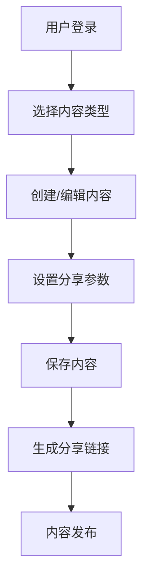
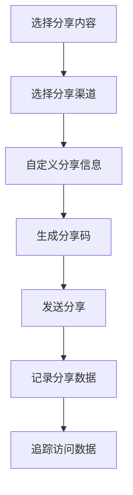
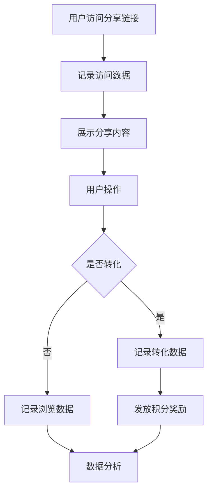

# 罗莱L2C销售管理系统 - 分享功能完整设计

## 📋 文档概述

**项目名称：** 罗莱L2C销售管理系统分享功能  
**文档版本：** v2.0  
**创建日期：** 2024年  
**设计目标：** 构建完整的内容分享体系，支持多渠道分享、数据追踪和转化分析  

---

## 🎯 功能概述与业务流程

### 1. 核心业务目标
- **✅ 提升用户粘性**：通过分享激励机制增强B端用户（销售人员、合作伙伴）参与度
- **✅ 数据收集**：收集用户行为数据，优化营销策略和内容效果
- **❌ 扩大品牌影响力**：暂不针对C端客户进行品牌传播
- **❌ 获客引流**：暂不作为主要目标

### 2. 核心应用场景
- **✅ 合作伙伴招募**（partner_recruitment）：招募罗莱好伙伴，扩大合作网络
- **✅ 产品推广**（product_promotion）：分享产品信息、规格参数、优惠活动
- **✅ 内容营销**（content_marketing）：传播品牌价值、企业文化、成功案例
- **❌ 员工招聘**（staff_recruitment）：暂不需要此功能

### 3. 功能特性
- **内容分享**：支持文本、图片、视频、链接等多种内容类型的分享
- **多渠道分享**：支持微信、短信、邮件、链接等多种分享渠道
- **数据追踪**：完整的分享数据追踪和转化分析
- **模板管理**：可复用的分享内容模板系统
- **权限控制**：基于角色的分享权限管理
- **激励机制**：积分奖励体系，提升B端用户参与积极性

### 2. 核心业务流程

#### 2.1 内容创建流程


#### 2.2 分享操作流程


#### 2.3 转化处理流程


---

## 🗄️ 数据库设计

### 1. 分享内容表（share_contents）

存储可分享的内容模板和自定义内容。

```sql
CREATE TABLE share_contents (
  id BIGSERIAL PRIMARY KEY,
  title VARCHAR(200) NOT NULL,                    -- 分享标题
  content TEXT NOT NULL,                          -- 分享内容（支持HTML）
  content_type VARCHAR(50) NOT NULL DEFAULT 'text' CHECK (content_type IN ('text', 'html', 'image', 'video', 'link')),
  category VARCHAR(50) NOT NULL,                  -- 内容分类（partner_recruitment, product_promotion, content_marketing等）
  thumbnail VARCHAR(500),                         -- 缩略图URL
  share_url VARCHAR(500),                         -- 分享链接
  template_id BIGINT,                             -- 模板ID（如果是基于模板创建）
  is_template BOOLEAN NOT NULL DEFAULT FALSE,     -- 是否为模板
  status VARCHAR(20) NOT NULL DEFAULT 'active' CHECK (status IN ('active', 'inactive')),
  created_by BIGINT NOT NULL REFERENCES users(id),
  updated_by BIGINT REFERENCES users(id),
  created_at TIMESTAMP NOT NULL DEFAULT CURRENT_TIMESTAMP,
  updated_at TIMESTAMP NOT NULL DEFAULT CURRENT_TIMESTAMP,
  deleted_at TIMESTAMP
);

-- 创建索引
CREATE INDEX idx_share_contents_category ON share_contents(category);
CREATE INDEX idx_share_contents_created_by ON share_contents(created_by);
CREATE INDEX idx_share_contents_status ON share_contents(status);
CREATE INDEX idx_share_contents_is_template ON share_contents(is_template);
CREATE INDEX idx_share_contents_created_at ON share_contents(created_at);
CREATE INDEX idx_share_contents_deleted_at ON share_contents(deleted_at);

-- 添加表注释
COMMENT ON TABLE share_contents IS '分享内容表';
COMMENT ON COLUMN share_contents.id IS '内容ID';
COMMENT ON COLUMN share_contents.title IS '分享标题';
COMMENT ON COLUMN share_contents.content IS '分享内容';
COMMENT ON COLUMN share_contents.content_type IS '内容类型：text,html,image,video,link';
COMMENT ON COLUMN share_contents.category IS '内容分类：partner_recruitment,product_promotion,content_marketing等';
COMMENT ON COLUMN share_contents.thumbnail IS '缩略图URL';
COMMENT ON COLUMN share_contents.share_url IS '分享链接';
COMMENT ON COLUMN share_contents.template_id IS '模板ID';
COMMENT ON COLUMN share_contents.is_template IS '是否为模板';
COMMENT ON COLUMN share_contents.status IS '状态：active,inactive';
COMMENT ON COLUMN share_contents.created_by IS '创建人ID';
COMMENT ON COLUMN share_contents.updated_by IS '更新人ID';
COMMENT ON COLUMN share_contents.created_at IS '创建时间';
COMMENT ON COLUMN share_contents.updated_at IS '更新时间';
COMMENT ON COLUMN share_contents.deleted_at IS '删除时间（软删除）';
```

### 2. 分享记录表（share_records）

记录每次分享操作的详细信息。

```sql
CREATE TABLE share_records (
  id BIGSERIAL PRIMARY KEY,
  content_id BIGINT NOT NULL REFERENCES share_contents(id),
  share_by BIGINT NOT NULL REFERENCES users(id),   -- 分享人
  channel VARCHAR(50) NOT NULL,                    -- 分享渠道（wechat, sms, email等）
  share_url VARCHAR(500) NOT NULL,                 -- 生成的分享链接
  share_code VARCHAR(50) NOT NULL UNIQUE,          -- 分享码（用于追踪）
  target_phone VARCHAR(15),                        -- 目标手机号（短信分享）
  target_email VARCHAR(100),                       -- 目标邮箱（邮件分享）
  custom_message TEXT,                             -- 自定义分享消息
  qr_code_url VARCHAR(500),                        -- 二维码图片URL
  status VARCHAR(20) NOT NULL DEFAULT 'active' CHECK (status IN ('active', 'inactive', 'expired')),
  expire_time TIMESTAMP,                           -- 过期时间
  created_at TIMESTAMP NOT NULL DEFAULT CURRENT_TIMESTAMP,
  updated_at TIMESTAMP NOT NULL DEFAULT CURRENT_TIMESTAMP
);

-- 创建索引
CREATE INDEX idx_share_records_content_id ON share_records(content_id);
CREATE INDEX idx_share_records_share_by ON share_records(share_by);
CREATE INDEX idx_share_records_channel ON share_records(channel);
CREATE INDEX idx_share_records_share_code ON share_records(share_code);
CREATE INDEX idx_share_records_status ON share_records(status);
CREATE INDEX idx_share_records_created_at ON share_records(created_at);

-- 添加表注释
COMMENT ON TABLE share_records IS '分享记录表';
COMMENT ON COLUMN share_records.id IS '分享记录ID';
COMMENT ON COLUMN share_records.content_id IS '分享内容ID';
COMMENT ON COLUMN share_records.share_by IS '分享人ID';
COMMENT ON COLUMN share_records.channel IS '分享渠道：wechat,sms,email等';
COMMENT ON COLUMN share_records.share_url IS '分享链接';
COMMENT ON COLUMN share_records.share_code IS '分享码（用于追踪）';
COMMENT ON COLUMN share_records.target_phone IS '目标手机号（短信分享）';
COMMENT ON COLUMN share_records.target_email IS '目标邮箱（邮件分享）';
COMMENT ON COLUMN share_records.custom_message IS '自定义分享消息';
COMMENT ON COLUMN share_records.qr_code_url IS '二维码图片URL';
COMMENT ON COLUMN share_records.status IS '状态：active,inactive,expired';
COMMENT ON COLUMN share_records.expire_time IS '过期时间';
COMMENT ON COLUMN share_records.created_at IS '创建时间';
COMMENT ON COLUMN share_records.updated_at IS '更新时间';
```

### 3. 分享访问记录表（share_visits）

记录分享链接的访问情况。

```sql
CREATE TABLE share_visits (
  id BIGSERIAL PRIMARY KEY,
  share_record_id BIGINT NOT NULL REFERENCES share_records(id),
  visitor_ip VARCHAR(45),                         -- 访问者IP
  visitor_user_agent TEXT,                        -- 访问者User Agent
  visitor_phone VARCHAR(15),                      -- 访问者手机号（如果已注册）
  visitor_id BIGINT REFERENCES users(id),         -- 访问者用户ID（如果已登录）
  referrer VARCHAR(500),                          -- 来源页面
  utm_source VARCHAR(100),                        -- UTM来源
  utm_medium VARCHAR(100),                        -- UTM媒介
  utm_campaign VARCHAR(100),                      -- UTM活动
  visit_duration INTEGER DEFAULT 0,               -- 访问时长（秒）
  page_views INTEGER DEFAULT 1,                   -- 页面浏览数
  is_converted BOOLEAN DEFAULT FALSE,              -- 是否转化
  conversion_type VARCHAR(50),                     -- 转化类型
  conversion_value DECIMAL(10,2) DEFAULT 0,       -- 转化价值
  created_at TIMESTAMP NOT NULL DEFAULT CURRENT_TIMESTAMP
);

-- 创建索引
CREATE INDEX idx_share_visits_share_record_id ON share_visits(share_record_id);
CREATE INDEX idx_share_visits_visitor_id ON share_visits(visitor_id);
CREATE INDEX idx_share_visits_visitor_phone ON share_visits(visitor_phone);
CREATE INDEX idx_share_visits_is_converted ON share_visits(is_converted);
CREATE INDEX idx_share_visits_created_at ON share_visits(created_at);

-- 添加表注释
COMMENT ON TABLE share_visits IS '分享访问记录表';
COMMENT ON COLUMN share_visits.id IS '访问记录ID';
COMMENT ON COLUMN share_visits.share_record_id IS '分享记录ID';
COMMENT ON COLUMN share_visits.visitor_ip IS '访问者IP';
COMMENT ON COLUMN share_visits.visitor_user_agent IS '访问者User Agent';
COMMENT ON COLUMN share_visits.visitor_phone IS '访问者手机号';
COMMENT ON COLUMN share_visits.visitor_id IS '访问者用户ID';
COMMENT ON COLUMN share_visits.referrer IS '来源页面';
COMMENT ON COLUMN share_visits.utm_source IS 'UTM来源';
COMMENT ON COLUMN share_visits.utm_medium IS 'UTM媒介';
COMMENT ON COLUMN share_visits.utm_campaign IS 'UTM活动';
COMMENT ON COLUMN share_visits.visit_duration IS '访问时长（秒）';
COMMENT ON COLUMN share_visits.page_views IS '页面浏览数';
COMMENT ON COLUMN share_visits.is_converted IS '是否转化';
COMMENT ON COLUMN share_visits.conversion_type IS '转化类型';
COMMENT ON COLUMN share_visits.conversion_value IS '转化价值';
COMMENT ON COLUMN share_visits.created_at IS '访问时间';
```

### 4. 分享渠道配置表（share_channel_configs）

存储不同分享渠道的配置信息。

```sql
CREATE TABLE share_channel_configs (
  id BIGSERIAL PRIMARY KEY,
  channel VARCHAR(50) NOT NULL UNIQUE,            -- 渠道名称（wechat, sms, email等）
  name VARCHAR(100) NOT NULL,                     -- 渠道显示名称
  config JSONB NOT NULL,                          -- 渠道配置（API密钥、模板等）
  is_enabled BOOLEAN NOT NULL DEFAULT TRUE,       -- 是否启用
  sort_order INTEGER DEFAULT 0,                   -- 排序
  created_at TIMESTAMP NOT NULL DEFAULT CURRENT_TIMESTAMP,
  updated_at TIMESTAMP NOT NULL DEFAULT CURRENT_TIMESTAMP
);

-- 创建索引
CREATE INDEX idx_share_channel_configs_channel ON share_channel_configs(channel);
CREATE INDEX idx_share_channel_configs_is_enabled ON share_channel_configs(is_enabled);
CREATE INDEX idx_share_channel_configs_sort_order ON share_channel_configs(sort_order);

-- 添加表注释
COMMENT ON TABLE share_channel_configs IS '分享渠道配置表';
COMMENT ON COLUMN share_channel_configs.id IS '配置ID';
COMMENT ON COLUMN share_channel_configs.channel IS '渠道名称';
COMMENT ON COLUMN share_channel_configs.name IS '渠道显示名称';
COMMENT ON COLUMN share_channel_configs.config IS '渠道配置（API密钥、模板等）';
COMMENT ON COLUMN share_channel_configs.is_enabled IS '是否启用';
COMMENT ON COLUMN share_channel_configs.sort_order IS '排序';
COMMENT ON COLUMN share_channel_configs.created_at IS '创建时间';
COMMENT ON COLUMN share_channel_configs.updated_at IS '更新时间';
```

---

## 🌐 API接口设计

### 基础信息
```
基础URL：https://api.l2c.luolai.com/v1
认证方式：JWT Token认证
请求格式：application/json
响应格式：application/json
```

### 认证说明
```
Authorization: Bearer {access_token}

权限要求：
- 分享内容管理：share:content:read, share:content:write
- 分享记录管理：share:record:read, share:record:write
- 分享统计查看：share:statistics:read
- 分享渠道配置：share:channel:read, share:channel:write
```

### 1. 分享内容管理接口

#### 1.1 获取分享内容列表
```
GET /share/contents
```

**请求参数：**
```json
{
  "page": 1,                    // 页码，可选，默认1
  "page_size": 20,              // 每页数量，可选，默认20
  "category": "partner_recruitment", // 内容分类，可选
  "is_template": false,         // 是否为模板，可选
  "keyword": "招募",            // 关键词搜索，可选
  "status": "active",           // 状态，可选
  "created_by": 1,              // 创建人ID，可选
  "sort_field": "created_at",   // 排序字段，可选，默认created_at
  "sort_order": "desc"          // 排序方向，可选，默认desc
}
```

**响应参数：**
```json
{
  "code": 200,
  "message": "获取成功",
  "data": {
    "total": 100,
    "page": 1,
    "page_size": 20,
    "items": [
      {
        "id": 1,
        "title": "罗莱好伙伴招募",
        "content": "<h2>加入罗莱，共创辉煌</h2>...",
        "content_type": "html",
        "category": "partner_recruitment",
        "thumbnail": "https://example.com/thumb.jpg",
        "share_url": "https://l2c.luolai.com/share/abc123",
        "template_id": null,
        "is_template": true,
        "status": "active",
        "created_by": {
          "id": 1,
          "username": "admin",
          "nickname": "管理员"
        },
        "created_at": "2024-01-21T10:30:00Z",
        "updated_at": "2024-01-21T10:30:00Z"
      }
    ]
  }
}
```

#### 1.2 创建分享内容
```
POST /share/contents
```

**请求参数：**
```json
{
  "title": "罗莱好伙伴招募",
  "content": "<h2>加入罗莱，共创辉煌</h2>...",
  "content_type": "html",
  "category": "partner_recruitment",
  "thumbnail": "https://example.com/thumb.jpg",
  "template_id": 1,
  "is_template": false
}
```

#### 1.3 更新分享内容
```
PUT /share/contents/{id}
```

#### 1.4 删除分享内容
```
DELETE /share/contents/{id}
```

### 2. 分享操作接口

#### 2.1 创建分享记录
```
POST /share/records
```

**请求参数：**
```json
{
  "content_id": 1,
  "channel": "wechat",
  "target_phone": "13800138000",
  "target_email": "user@example.com",
  "custom_message": "推荐给您一个好机会",
  "expire_hours": 72
}
```

**响应参数：**
```json
{
  "code": 200,
  "message": "分享创建成功",
  "data": {
    "id": 1,
    "share_url": "https://l2c.luolai.com/s/abc123",
    "share_code": "abc123",
    "qr_code_url": "https://example.com/qr/abc123.png",
    "expire_time": "2024-01-24T10:30:00Z"
  }
}
```

#### 2.2 获取分享记录列表
```
GET /share/records
```

#### 2.3 获取分享统计数据
```
GET /share/statistics
```

**请求参数：**
```json
{
  "start_date": "2024-01-01",
  "end_date": "2024-01-31",
  "user_id": 1,
  "channel": "wechat",
  "category": "partner_recruitment"
}
```

**响应参数：**
```json
{
  "code": 200,
  "message": "获取成功",
  "data": {
    "summary": {
      "total_shares": 150,
      "total_visits": 1200,
      "total_conversions": 45,
      "conversion_rate": 3.75
    },
    "channel_stats": [
      {
        "channel": "wechat",
        "shares": 80,
        "visits": 650,
        "conversions": 25,
        "conversion_rate": 3.85
      }
    ],
    "daily_stats": [
      {
        "date": "2024-01-21",
        "shares": 5,
        "visits": 42,
        "conversions": 2
      }
    ]
  }
}
```

---

## 🔧 核心业务逻辑实现

### 1. 内容服务（ContentService）

```typescript
interface ContentService {
  // 内容管理
  createContent(data: CreateContentDto): Promise<ShareContent>;
  updateContent(id: number, data: UpdateContentDto): Promise<ShareContent>;
  deleteContent(id: number): Promise<void>;
  getContent(id: number): Promise<ShareContent>;
  getContentList(query: ContentQueryDto): Promise<PaginatedResult<ShareContent>>;
  
  // 模板管理
  createTemplate(data: CreateTemplateDto): Promise<ShareContent>;
  getTemplateList(category?: string): Promise<ShareContent[]>;
  cloneFromTemplate(templateId: number, data: CloneContentDto): Promise<ShareContent>;
}
```

### 2. 分享服务（ShareService）

```typescript
interface ShareService {
  // 分享操作
  createShare(data: CreateShareDto): Promise<ShareRecord>;
  getShareList(query: ShareQueryDto): Promise<PaginatedResult<ShareRecord>>;
  getShareDetail(shareCode: string): Promise<ShareRecord>;
  
  // 访问追踪
  recordVisit(shareCode: string, visitData: VisitDataDto): Promise<ShareVisit>;
  recordConversion(shareCode: string, conversionData: ConversionDataDto): Promise<void>;
  
  // 统计分析
  getShareStatistics(query: StatisticsQueryDto): Promise<ShareStatistics>;
  getUserShareStats(userId: number, dateRange: DateRangeDto): Promise<UserShareStats>;
}
```

### 3. 渠道服务（ChannelService）

```typescript
interface ChannelService {
  // 渠道管理
  getChannelConfigs(): Promise<ChannelConfig[]>;
  updateChannelConfig(channel: string, config: any): Promise<ChannelConfig>;
  
  // 分享发送
  sendWechatShare(shareData: WechatShareDto): Promise<SendResult>;
  sendSmsShare(shareData: SmsShareDto): Promise<SendResult>;
  sendEmailShare(shareData: EmailShareDto): Promise<SendResult>;
  
  // 二维码生成
  generateQRCode(shareUrl: string): Promise<string>;
}
```

---

## 📱 多渠道分享实现

### 1. 微信分享

#### 1.1 微信JS-SDK配置
```typescript
class WechatShareService {
  async getJSSDKConfig(url: string): Promise<WechatJSSDKConfig> {
    const ticket = await this.getJSAPITicket();
    const timestamp = Math.floor(Date.now() / 1000);
    const nonceStr = this.generateNonceStr();
    
    const signature = this.generateSignature(ticket, timestamp, nonceStr, url);
    
    return {
      appId: this.configService.get('WECHAT_APP_ID'),
      timestamp,
      nonceStr,
      signature,
      jsApiList: ['updateAppMessageShareData', 'updateTimelineShareData']
    };
  }
  
  async shareToFriend(shareData: WechatShareData): Promise<void> {
    // 微信好友分享逻辑
  }
  
  async shareToTimeline(shareData: WechatShareData): Promise<void> {
    // 微信朋友圈分享逻辑
  }
}
```

### 2. 短信分享

```typescript
class SmsShareService {
  async sendShareSms(data: SmsShareDto): Promise<SendResult> {
    const template = await this.getTemplate(data.templateType);
    const message = this.renderTemplate(template, {
      shareUrl: data.shareUrl,
      customMessage: data.customMessage,
      senderName: data.senderName
    });
    
    return await this.smsProvider.send({
      phone: data.targetPhone,
      message: message
    });
  }
}
```

### 3. 邮件分享

```typescript
class EmailShareService {
  async sendShareEmail(data: EmailShareDto): Promise<SendResult> {
    const template = await this.getEmailTemplate(data.templateType);
    const html = this.renderEmailTemplate(template, {
      shareUrl: data.shareUrl,
      content: data.content,
      senderName: data.senderName
    });
    
    return await this.emailProvider.send({
      to: data.targetEmail,
      subject: data.subject,
      html: html
    });
  }
}
```

---

## 📊 数据统计与分析

### 1. 统计指标

#### 1.1 基础指标
- **分享数量**：总分享次数、各渠道分享数
- **访问数量**：总访问次数、独立访客数
- **转化数量**：总转化次数、转化率
- **用户参与**：活跃分享用户数、人均分享次数

#### 1.2 高级指标
- **渠道效果**：各渠道转化率对比
- **内容效果**：各内容类型表现分析
- **时间趋势**：分享和转化的时间分布
- **用户行为**：用户分享路径分析

### 2. 报表生成

```typescript
class ReportService {
  async generateShareReport(query: ReportQueryDto): Promise<ShareReport> {
    const data = await this.getReportData(query);
    
    return {
      summary: this.calculateSummary(data),
      charts: this.generateCharts(data),
      tables: this.generateTables(data),
      insights: this.generateInsights(data)
    };
  }
  
  async exportReport(reportId: string, format: 'pdf' | 'excel'): Promise<Buffer> {
    const report = await this.getReport(reportId);
    
    if (format === 'pdf') {
      return await this.generatePDF(report);
    } else {
      return await this.generateExcel(report);
    }
  }
}
```

---

## 🔒 安全与权限控制

### 1. 权限设计

#### 1.1 权限列表
- `share:content:read` - 查看分享内容
- `share:content:write` - 创建/编辑分享内容
- `share:content:delete` - 删除分享内容
- `share:record:read` - 查看分享记录
- `share:record:write` - 创建分享记录
- `share:statistics:read` - 查看分享统计
- `share:channel:read` - 查看渠道配置
- `share:channel:write` - 修改渠道配置

#### 1.2 数据权限
- **个人数据**：用户只能查看自己的分享记录
- **部门数据**：部门管理员可查看部门内所有数据
- **全局数据**：系统管理员可查看所有数据

### 2. 安全措施

#### 2.1 分享链接安全
- **有效期控制**：设置分享链接过期时间
- **访问限制**：限制单个链接的访问次数
- **IP限制**：可选的IP访问限制
- **防刷机制**：防止恶意刷量

#### 2.2 数据安全
- **敏感信息脱敏**：手机号、邮箱等敏感信息脱敏显示
- **操作日志**：记录所有关键操作日志
- **数据加密**：敏感配置信息加密存储

---

## 🚀 性能优化

### 1. 缓存策略

```typescript
class ShareCacheService {
  // 内容缓存
  async cacheContent(contentId: number, ttl: number = 3600): Promise<void> {
    const content = await this.contentService.getContent(contentId);
    await this.redis.setex(`content:${contentId}`, ttl, JSON.stringify(content));
  }
  
  // 统计数据缓存
  async cacheStatistics(key: string, data: any, ttl: number = 1800): Promise<void> {
    await this.redis.setex(`stats:${key}`, ttl, JSON.stringify(data));
  }
  
  // 热点数据预热
  async warmupCache(): Promise<void> {
    const hotContents = await this.getHotContents();
    for (const content of hotContents) {
      await this.cacheContent(content.id);
    }
  }
}
```

### 2. 数据库优化

- **索引优化**：为查询频繁的字段创建合适的索引
- **分表策略**：访问记录表按时间分表
- **读写分离**：统计查询使用只读副本
- **连接池**：合理配置数据库连接池

### 3. 异步处理

```typescript
class ShareQueueService {
  // 异步发送分享
  async queueShare(shareData: ShareDto): Promise<void> {
    await this.queue.add('send-share', shareData, {
      delay: 0,
      attempts: 3,
      backoff: 'exponential'
    });
  }
  
  // 异步统计计算
  async queueStatistics(query: StatisticsQueryDto): Promise<void> {
    await this.queue.add('calculate-statistics', query, {
      delay: 60000, // 延迟1分钟执行
      attempts: 2
    });
  }
}
```

---

## 📈 监控与告警

### 1. 关键指标监控

- **API响应时间**：分享相关API的响应时间监控
- **成功率监控**：分享发送成功率、访问成功率
- **错误率监控**：各类错误的发生频率
- **资源使用**：CPU、内存、数据库连接数等

### 2. 业务指标监控

- **分享量监控**：实时分享数量监控
- **转化率监控**：转化率异常告警
- **渠道状态**：各分享渠道的可用性监控
- **用户行为**：异常用户行为检测

### 3. 告警配置

```typescript
class AlertService {
  // 分享失败率告警
  async checkShareFailureRate(): Promise<void> {
    const failureRate = await this.getShareFailureRate();
    if (failureRate > 0.05) { // 失败率超过5%
      await this.sendAlert('分享失败率过高', {
        rate: failureRate,
        threshold: 0.05
      });
    }
  }
  
  // 转化率异常告警
  async checkConversionRate(): Promise<void> {
    const currentRate = await this.getCurrentConversionRate();
    const historicalRate = await this.getHistoricalConversionRate();
    
    if (currentRate < historicalRate * 0.7) { // 转化率下降30%
      await this.sendAlert('转化率异常下降', {
        current: currentRate,
        historical: historicalRate
      });
    }
  }
}
```

---

## 🎨 前端界面设计

### 1. 设计原则

#### 1.1 用户体验原则
- **简洁直观**：界面简洁，操作流程清晰
- **响应迅速**：快速响应用户操作，及时反馈
- **移动优先**：优先考虑移动端体验
- **一致性**：保持与整体系统的设计一致性

#### 1.2 交互设计原则
- **最少点击**：减少用户操作步骤
- **智能预填**：根据上下文智能预填信息
- **错误预防**：通过设计预防用户操作错误
- **渐进式披露**：按需展示功能和信息

### 2. 界面设计规范

#### 2.1 色彩规范
```css
/* 主色调 */
--primary-color: #1890ff;      /* 主品牌色 */
--primary-light: #40a9ff;      /* 主色调亮色 */
--primary-dark: #096dd9;       /* 主色调暗色 */

/* 辅助色 */
--success-color: #52c41a;      /* 成功色 */
--warning-color: #faad14;      /* 警告色 */
--error-color: #ff4d4f;        /* 错误色 */
--info-color: #1890ff;         /* 信息色 */

/* 中性色 */
--text-primary: #262626;       /* 主要文本 */
--text-secondary: #595959;     /* 次要文本 */
--text-disabled: #bfbfbf;      /* 禁用文本 */
--border-color: #d9d9d9;       /* 边框色 */
--background-color: #f5f5f5;   /* 背景色 */
```

#### 2.2 字体规范
```css
/* 字体大小 */
--font-size-xs: 12px;          /* 辅助文字 */
--font-size-sm: 14px;          /* 正文小号 */
--font-size-base: 16px;        /* 正文 */
--font-size-lg: 18px;          /* 小标题 */
--font-size-xl: 20px;          /* 标题 */
--font-size-xxl: 24px;         /* 大标题 */

/* 字体粗细 */
--font-weight-normal: 400;
--font-weight-medium: 500;
--font-weight-semibold: 600;
--font-weight-bold: 700;
```

### 3. 页面设计

#### 3.1 分享内容管理页面
- **页面布局**：采用经典的列表页布局，包含搜索筛选区、操作按钮区和内容列表区
- **交互设计**：支持批量操作、快速搜索、分类筛选
- **响应式设计**：适配桌面端和移动端显示

#### 3.2 内容编辑页面
- **富文本编辑器**：支持文本格式化、图片插入、链接添加
- **实时预览**：提供分享效果的实时预览
- **自动保存**：定时自动保存编辑内容

#### 3.3 分享操作界面
- **渠道选择**：直观的渠道图标选择
- **自定义编辑**：支持自定义分享文案和图片
- **二维码生成**：实时生成分享二维码

#### 3.4 数据统计页面
- **可视化图表**：使用ECharts展示分享数据趋势
- **实时数据**：支持实时数据刷新
- **数据导出**：支持数据报表导出

### 4. 移动端适配

#### 4.1 响应式布局
- **断点设计**：xs(<576px), sm(≥576px), md(≥768px), lg(≥992px), xl(≥1200px)
- **弹性布局**：使用Flexbox和Grid布局
- **触摸优化**：按钮大小不小于44px，适合手指点击

#### 4.2 移动端交互
- **手势支持**：支持滑动、长按等手势操作
- **底部抽屉**：移动端使用底部抽屉展示分享选项
- **原生体验**：模拟原生应用的交互体验

---

## 🧪 测试策略与质量保证

### 1. 测试策略

#### 1.1 测试层次
- **单元测试**：覆盖核心业务逻辑，目标覆盖率≥80%
- **集成测试**：测试API接口和数据库操作
- **端到端测试**：测试完整的用户操作流程
- **性能测试**：验证系统性能和并发处理能力

#### 1.2 测试工具
- **单元测试**：Jest + React Testing Library
- **集成测试**：Supertest + Jest
- **E2E测试**：Playwright / Cypress
- **性能测试**：Artillery / K6

### 2. 关键测试用例

#### 2.1 功能测试
- **内容管理**：创建、编辑、删除分享内容
- **分享操作**：微信、短信、邮件分享功能
- **访问追踪**：分享链接访问和转化追踪
- **权限控制**：用户权限和数据安全

#### 2.2 性能测试
- **API响应时间**：所有接口响应时间<2秒
- **并发处理**：支持100并发用户同时操作
- **数据库性能**：复杂查询响应时间<1秒
- **前端性能**：页面加载时间<3秒，FCP<1.5秒

#### 2.3 安全测试
- **SQL注入防护**：验证所有输入参数的安全性
- **XSS防护**：确保用户输入内容经过适当过滤
- **权限验证**：验证API接口的权限控制
- **数据加密**：敏感数据传输和存储加密

### 3. 质量保证流程

#### 3.1 代码质量
- **代码审查**：所有代码变更必须经过同行评审
- **静态分析**：使用ESLint、SonarQube进行代码质量检查
- **测试覆盖率**：维持80%以上的测试覆盖率
- **性能监控**：持续监控应用性能指标

#### 3.2 发布流程
- **自动化测试**：CI/CD流程中集成自动化测试
- **灰度发布**：新功能采用灰度发布策略
- **回滚机制**：建立快速回滚机制
- **监控告警**：部署后持续监控系统状态

---

## 📊 数据分析与监控

### 1. 关键指标监控

#### 1.1 业务指标
- **分享量**：每日/每周/每月分享数量
- **访问量**：分享链接的访问数量
- **转化率**：访问到转化的比例
- **渠道效果**：各分享渠道的效果对比

#### 1.2 技术指标
- **API响应时间**：各接口的平均响应时间
- **错误率**：系统错误和异常的发生率
- **系统负载**：CPU、内存、数据库负载
- **用户体验**：页面加载时间、交互响应时间

### 2. 数据分析

#### 2.1 用户行为分析
- **分享路径分析**：用户分享行为的路径分析
- **用户分群**：基于分享行为的用户聚类
- **A/B测试**：不同设计方案的效果对比
- **漏斗分析**：从分享到转化的漏斗分析

#### 2.2 业务洞察
- **热门内容分析**：识别最受欢迎的分享内容
- **渠道效果分析**：各分享渠道的ROI分析
- **时间趋势分析**：分享行为的时间分布规律
- **地域分析**：不同地区的分享偏好分析

---

## 📝 总结

本文档整合了分享功能的完整设计，包括：

1. **功能概述**：明确了分享功能的目标和业务流程
2. **数据库设计**：设计了完整的数据模型支持分享业务
3. **API接口**：定义了标准化的API接口规范
4. **业务逻辑**：实现了核心的业务服务和逻辑
5. **多渠道支持**：支持微信、短信、邮件等多种分享渠道
6. **数据分析**：提供完整的数据统计和分析能力
7. **安全控制**：实现了权限控制和安全防护
8. **性能优化**：通过缓存、异步等手段优化性能
9. **监控告警**：建立了完善的监控和告警机制
10. **前端设计**：提供了完整的UI/UX设计规范和交互流程
11. **测试策略**：建立了全面的测试体系和质量保证流程
12. **数据监控**：实现了业务和技术指标的全面监控

通过这个完整的设计文档，开发团队可以高效地实现分享功能的各个模块，确保功能的完整性、安全性、可用性和可扩展性。
