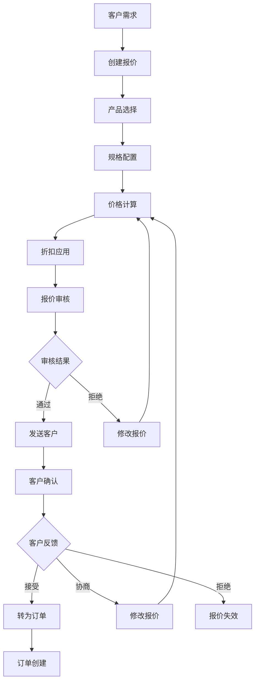
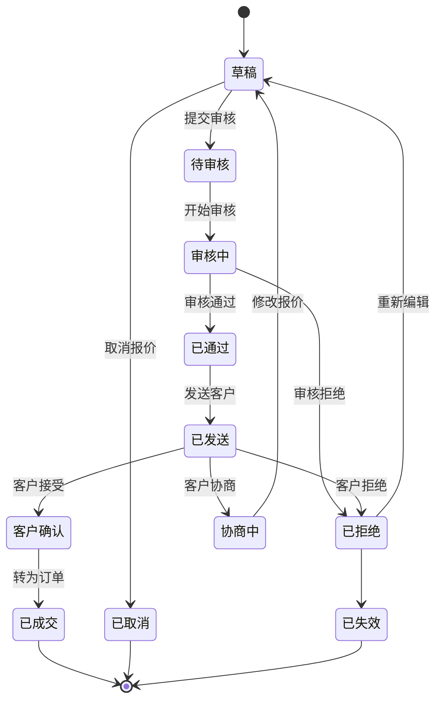

# 报价管理模块设计

## 1. 模块概述

报价管理模块是定制家具系统的核心模块之一，负责管理从客户需求收集到最终报价确认的整个报价流程。该模块支持标准产品报价、定制产品报价、组合套餐报价等多种报价类型，并提供灵活的价格计算、折扣管理、版本控制等功能。

### 1.1 功能目标

- **报价创建**：支持多种类型的报价创建和配置
- **价格计算**：智能价格计算引擎，支持复杂定价规则
- **版本管理**：报价版本控制，支持修改历史追踪
- **审批流程**：多级审批机制，确保报价合规性
- **客户沟通**：报价展示、客户反馈、协商记录
- **转换管理**：报价转订单的无缝衔接
- **统计分析**：报价成功率、转化率等数据分析

### 1.2 业务流程



### 1.3 报价类型

- **标准报价**：基于标准产品的快速报价
- **定制报价**：基于客户定制需求的个性化报价
- **套餐报价**：多产品组合的整体解决方案报价
- **补充报价**：对现有报价的补充或修改
- **竞标报价**：针对招标项目的专业报价

### 1.4 报价状态流转



## 2. 数据库设计

### 2.1 报价主表 (quotes)

```sql
CREATE TABLE quotes (
  id BIGINT PRIMARY KEY AUTO_INCREMENT,
  quote_number VARCHAR(32) NOT NULL UNIQUE COMMENT '报价单号',
  quote_title VARCHAR(200) NOT NULL COMMENT '报价标题',
  quote_type ENUM('standard', 'custom', 'package', 'supplement', 'tender') NOT NULL COMMENT '报价类型',
  quote_status ENUM('draft', 'pending_review', 'reviewing', 'approved', 'rejected', 'sent', 'confirmed', 'negotiating', 'closed', 'cancelled') NOT NULL DEFAULT 'draft' COMMENT '报价状态',
  
  -- 客户信息
  customer_id BIGINT NOT NULL COMMENT '客户ID',
  customer_name VARCHAR(100) NOT NULL COMMENT '客户姓名',
  customer_phone VARCHAR(15) COMMENT '客户电话',
  customer_email VARCHAR(100) COMMENT '客户邮箱',
  customer_address TEXT COMMENT '客户地址',
  
  -- 项目信息
  project_name VARCHAR(200) COMMENT '项目名称',
  project_address TEXT COMMENT '项目地址',
  project_area DECIMAL(10,2) COMMENT '项目面积',
  project_type VARCHAR(50) COMMENT '项目类型',
  delivery_address TEXT COMMENT '交付地址',
  
  -- 销售信息
  salesperson_id BIGINT NOT NULL COMMENT '销售员ID',
  salesperson_name VARCHAR(50) NOT NULL COMMENT '销售员姓名',
  sales_channel VARCHAR(50) COMMENT '销售渠道',
  lead_source VARCHAR(50) COMMENT '线索来源',
  
  -- 价格信息
  subtotal_amount DECIMAL(15,2) NOT NULL DEFAULT 0 COMMENT '小计金额',
  discount_amount DECIMAL(15,2) NOT NULL DEFAULT 0 COMMENT '折扣金额',
  tax_amount DECIMAL(15,2) NOT NULL DEFAULT 0 COMMENT '税费金额',
  total_amount DECIMAL(15,2) NOT NULL DEFAULT 0 COMMENT '总金额',
  currency VARCHAR(10) NOT NULL DEFAULT 'CNY' COMMENT '币种',
  
  -- 折扣信息
  discount_type ENUM('none', 'percentage', 'fixed', 'custom') DEFAULT 'none' COMMENT '折扣类型',
  discount_rate DECIMAL(5,4) COMMENT '折扣率',
  discount_reason TEXT COMMENT '折扣原因',
  
  -- 时间信息
  quote_date DATE NOT NULL COMMENT '报价日期',
  valid_until DATE COMMENT '有效期至',
  delivery_date DATE COMMENT '预计交付日期',
  installation_date DATE COMMENT '预计安装日期',
  
  -- 版本信息
  version_number INT NOT NULL DEFAULT 1 COMMENT '版本号',
  parent_quote_id BIGINT COMMENT '父报价ID',
  is_latest_version BOOLEAN NOT NULL DEFAULT TRUE COMMENT '是否最新版本',
  
  -- 审批信息
  submitted_at TIMESTAMP NULL COMMENT '提交审核时间',
  submitted_by BIGINT COMMENT '提交人ID',
  reviewed_at TIMESTAMP NULL COMMENT '审核时间',
  reviewed_by BIGINT COMMENT '审核人ID',
  review_comments TEXT COMMENT '审核意见',
  
  -- 客户反馈
  sent_to_customer_at TIMESTAMP NULL COMMENT '发送客户时间',
  customer_viewed_at TIMESTAMP NULL COMMENT '客户查看时间',
  customer_feedback TEXT COMMENT '客户反馈',
  customer_confirmed_at TIMESTAMP NULL COMMENT '客户确认时间',
  
  -- 转换信息
  converted_to_order_id BIGINT COMMENT '转换的订单ID',
  converted_at TIMESTAMP NULL COMMENT '转换时间',
  conversion_rate DECIMAL(5,4) COMMENT '转换率',
  
  -- 备注信息
  internal_notes TEXT COMMENT '内部备注',
  customer_notes TEXT COMMENT '客户备注',
  special_requirements TEXT COMMENT '特殊要求',
  
  -- 附件信息
  attachment_count INT NOT NULL DEFAULT 0 COMMENT '附件数量',
  has_design_drawings BOOLEAN NOT NULL DEFAULT FALSE COMMENT '是否有设计图',
  has_3d_renderings BOOLEAN NOT NULL DEFAULT FALSE COMMENT '是否有3D效果图',
  
  -- 统计信息
  view_count INT NOT NULL DEFAULT 0 COMMENT '查看次数',
  download_count INT NOT NULL DEFAULT 0 COMMENT '下载次数',
  modification_count INT NOT NULL DEFAULT 0 COMMENT '修改次数',
  
  -- 系统字段
  created_at TIMESTAMP DEFAULT CURRENT_TIMESTAMP COMMENT '创建时间',
  updated_at TIMESTAMP DEFAULT CURRENT_TIMESTAMP ON UPDATE CURRENT_TIMESTAMP COMMENT '更新时间',
  created_by BIGINT NOT NULL COMMENT '创建人ID',
  updated_by BIGINT COMMENT '更新人ID',
  
  INDEX idx_quote_number (quote_number),
  INDEX idx_customer_id (customer_id),
  INDEX idx_salesperson_id (salesperson_id),
  INDEX idx_quote_status (quote_status),
  INDEX idx_quote_date (quote_date),
  INDEX idx_created_at (created_at),
  INDEX idx_parent_quote (parent_quote_id, version_number),
  INDEX idx_conversion (converted_to_order_id, converted_at)
) COMMENT '报价主表';
```

### 2.2 报价明细表 (quote_items)

```sql
CREATE TABLE quote_items (
  id BIGINT PRIMARY KEY AUTO_INCREMENT,
  quote_id BIGINT NOT NULL COMMENT '报价ID',
  item_sequence INT NOT NULL COMMENT '明细序号',
  
  -- 产品信息
  product_id BIGINT COMMENT '产品ID',
  product_code VARCHAR(50) COMMENT '产品编码',
  product_name VARCHAR(200) NOT NULL COMMENT '产品名称',
  product_category VARCHAR(100) COMMENT '产品分类',
  product_type ENUM('standard', 'custom', 'accessory', 'service') NOT NULL COMMENT '产品类型',
  
  -- 规格信息
  specifications JSON COMMENT '产品规格配置',
  custom_requirements TEXT COMMENT '定制要求',
  material VARCHAR(100) COMMENT '材质',
  color VARCHAR(50) COMMENT '颜色',
  size_info VARCHAR(200) COMMENT '尺寸信息',
  
  -- 数量和单位
  quantity DECIMAL(10,3) NOT NULL COMMENT '数量',
  unit VARCHAR(20) NOT NULL COMMENT '单位',
  area DECIMAL(10,2) COMMENT '面积',
  volume DECIMAL(10,3) COMMENT '体积',
  
  -- 价格信息
  unit_price DECIMAL(10,2) NOT NULL COMMENT '单价',
  base_price DECIMAL(10,2) COMMENT '基础价格',
  specification_cost DECIMAL(10,2) DEFAULT 0 COMMENT '规格加价',
  customization_cost DECIMAL(10,2) DEFAULT 0 COMMENT '定制加价',
  line_total DECIMAL(15,2) NOT NULL COMMENT '行总价',
  
  -- 折扣信息
  item_discount_type ENUM('none', 'percentage', 'fixed') DEFAULT 'none' COMMENT '明细折扣类型',
  item_discount_rate DECIMAL(5,4) COMMENT '明细折扣率',
  item_discount_amount DECIMAL(10,2) DEFAULT 0 COMMENT '明细折扣金额',
  final_amount DECIMAL(15,2) NOT NULL COMMENT '最终金额',
  
  -- 生产信息
  production_days INT COMMENT '生产周期(天)',
  installation_days INT COMMENT '安装周期(天)',
  delivery_method VARCHAR(50) COMMENT '交付方式',
  
  -- 备注信息
  item_notes TEXT COMMENT '明细备注',
  technical_requirements TEXT COMMENT '技术要求',
  
  -- 关联信息
  parent_item_id BIGINT COMMENT '父明细ID(用于组合产品)',
  group_name VARCHAR(100) COMMENT '分组名称',
  sort_order INT NOT NULL DEFAULT 0 COMMENT '排序',
  
  -- 状态信息
  item_status ENUM('active', 'deleted', 'replaced') NOT NULL DEFAULT 'active' COMMENT '明细状态',
  
  -- 系统字段
  created_at TIMESTAMP DEFAULT CURRENT_TIMESTAMP COMMENT '创建时间',
  updated_at TIMESTAMP DEFAULT CURRENT_TIMESTAMP ON UPDATE CURRENT_TIMESTAMP COMMENT '更新时间',
  
  INDEX idx_quote_id (quote_id),
  INDEX idx_product_id (product_id),
  INDEX idx_sequence (quote_id, item_sequence),
  INDEX idx_parent_item (parent_item_id),
  FOREIGN KEY (quote_id) REFERENCES quotes(id) ON DELETE CASCADE
) COMMENT '报价明细表';
```

### 2.3 报价模板表 (quote_templates)

```sql
CREATE TABLE quote_templates (
  id BIGINT PRIMARY KEY AUTO_INCREMENT,
  template_name VARCHAR(100) NOT NULL COMMENT '模板名称',
  template_code VARCHAR(50) NOT NULL UNIQUE COMMENT '模板编码',
  template_type ENUM('standard', 'custom', 'package') NOT NULL COMMENT '模板类型',
  template_category VARCHAR(50) COMMENT '模板分类',
  
  -- 模板内容
  template_description TEXT COMMENT '模板描述',
  default_title VARCHAR(200) COMMENT '默认标题',
  default_validity_days INT DEFAULT 30 COMMENT '默认有效期(天)',
  
  -- 产品配置
  template_items JSON COMMENT '模板明细配置',
  default_discount_rate DECIMAL(5,4) COMMENT '默认折扣率',
  
  -- 适用范围
  applicable_regions JSON COMMENT '适用地区',
  applicable_channels JSON COMMENT '适用渠道',
  customer_levels JSON COMMENT '适用客户等级',
  
  -- 状态信息
  template_status ENUM('active', 'inactive', 'draft') NOT NULL DEFAULT 'draft' COMMENT '模板状态',
  usage_count INT NOT NULL DEFAULT 0 COMMENT '使用次数',
  
  -- 系统字段
  created_at TIMESTAMP DEFAULT CURRENT_TIMESTAMP COMMENT '创建时间',
  updated_at TIMESTAMP DEFAULT CURRENT_TIMESTAMP ON UPDATE CURRENT_TIMESTAMP COMMENT '更新时间',
  created_by BIGINT NOT NULL COMMENT '创建人ID',
  updated_by BIGINT COMMENT '更新人ID',
  
  INDEX idx_template_code (template_code),
  INDEX idx_template_type (template_type),
  INDEX idx_template_status (template_status)
) COMMENT '报价模板表';
```

### 2.4 报价审批记录表 (quote_approvals)

```sql
CREATE TABLE quote_approvals (
  id BIGINT PRIMARY KEY AUTO_INCREMENT,
  quote_id BIGINT NOT NULL COMMENT '报价ID',
  approval_level INT NOT NULL COMMENT '审批级别',
  approval_step VARCHAR(50) NOT NULL COMMENT '审批步骤',
  
  -- 审批人信息
  approver_id BIGINT NOT NULL COMMENT '审批人ID',
  approver_name VARCHAR(50) NOT NULL COMMENT '审批人姓名',
  approver_role VARCHAR(50) COMMENT '审批人角色',
  
  -- 审批结果
  approval_status ENUM('pending', 'approved', 'rejected', 'cancelled') NOT NULL COMMENT '审批状态',
  approval_result ENUM('pass', 'reject', 'return') COMMENT '审批结果',
  approval_comments TEXT COMMENT '审批意见',
  
  -- 审批条件
  approval_amount_limit DECIMAL(15,2) COMMENT '审批金额限制',
  approval_discount_limit DECIMAL(5,4) COMMENT '审批折扣限制',
  
  -- 时间信息
  submitted_at TIMESTAMP NOT NULL COMMENT '提交时间',
  approved_at TIMESTAMP NULL COMMENT '审批时间',
  deadline TIMESTAMP COMMENT '审批截止时间',
  
  -- 系统字段
  created_at TIMESTAMP DEFAULT CURRENT_TIMESTAMP COMMENT '创建时间',
  updated_at TIMESTAMP DEFAULT CURRENT_TIMESTAMP ON UPDATE CURRENT_TIMESTAMP COMMENT '更新时间',
  
  INDEX idx_quote_id (quote_id),
  INDEX idx_approver_id (approver_id),
  INDEX idx_approval_status (approval_status),
  INDEX idx_submitted_at (submitted_at),
  FOREIGN KEY (quote_id) REFERENCES quotes(id) ON DELETE CASCADE
) COMMENT '报价审批记录表';
```

### 2.5 报价沟通记录表 (quote_communications)

```sql
CREATE TABLE quote_communications (
  id BIGINT PRIMARY KEY AUTO_INCREMENT,
  quote_id BIGINT NOT NULL COMMENT '报价ID',
  communication_type ENUM('email', 'phone', 'meeting', 'message', 'system') NOT NULL COMMENT '沟通类型',
  communication_direction ENUM('outbound', 'inbound') NOT NULL COMMENT '沟通方向',
  
  -- 沟通内容
  subject VARCHAR(200) COMMENT '主题',
  content TEXT NOT NULL COMMENT '沟通内容',
  attachments JSON COMMENT '附件信息',
  
  -- 参与人信息
  sender_id BIGINT COMMENT '发送人ID',
  sender_name VARCHAR(50) COMMENT '发送人姓名',
  sender_type ENUM('staff', 'customer') NOT NULL COMMENT '发送人类型',
  recipient_ids JSON COMMENT '接收人ID列表',
  
  -- 状态信息
  communication_status ENUM('sent', 'delivered', 'read', 'replied') COMMENT '沟通状态',
  is_important BOOLEAN NOT NULL DEFAULT FALSE COMMENT '是否重要',
  requires_follow_up BOOLEAN NOT NULL DEFAULT FALSE COMMENT '是否需要跟进',
  follow_up_date DATE COMMENT '跟进日期',
  
  -- 系统字段
  created_at TIMESTAMP DEFAULT CURRENT_TIMESTAMP COMMENT '创建时间',
  updated_at TIMESTAMP DEFAULT CURRENT_TIMESTAMP ON UPDATE CURRENT_TIMESTAMP COMMENT '更新时间',
  
  INDEX idx_quote_id (quote_id),
  INDEX idx_communication_type (communication_type),
  INDEX idx_sender (sender_id, sender_type),
  INDEX idx_created_at (created_at),
  FOREIGN KEY (quote_id) REFERENCES quotes(id) ON DELETE CASCADE
) COMMENT '报价沟通记录表';
```

### 2.6 报价附件表 (quote_attachments)

```sql
CREATE TABLE quote_attachments (
  id BIGINT PRIMARY KEY AUTO_INCREMENT,
  quote_id BIGINT NOT NULL COMMENT '报价ID',
  attachment_type ENUM('document', 'image', 'drawing', 'rendering', 'video', 'other') NOT NULL COMMENT '附件类型',
  
  -- 文件信息
  file_name VARCHAR(255) NOT NULL COMMENT '文件名',
  file_path VARCHAR(500) NOT NULL COMMENT '文件路径',
  file_size BIGINT NOT NULL COMMENT '文件大小(字节)',
  file_extension VARCHAR(10) COMMENT '文件扩展名',
  mime_type VARCHAR(100) COMMENT 'MIME类型',
  
  -- 附件描述
  attachment_title VARCHAR(200) COMMENT '附件标题',
  attachment_description TEXT COMMENT '附件描述',
  attachment_category VARCHAR(50) COMMENT '附件分类',
  
  -- 权限控制
  is_public BOOLEAN NOT NULL DEFAULT FALSE COMMENT '是否公开',
  is_customer_visible BOOLEAN NOT NULL DEFAULT TRUE COMMENT '客户是否可见',
  access_level ENUM('internal', 'customer', 'public') NOT NULL DEFAULT 'customer' COMMENT '访问级别',
  
  -- 版本信息
  version_number INT NOT NULL DEFAULT 1 COMMENT '版本号',
  is_latest_version BOOLEAN NOT NULL DEFAULT TRUE COMMENT '是否最新版本',
  
  -- 统计信息
  download_count INT NOT NULL DEFAULT 0 COMMENT '下载次数',
  view_count INT NOT NULL DEFAULT 0 COMMENT '查看次数',
  
  -- 系统字段
  created_at TIMESTAMP DEFAULT CURRENT_TIMESTAMP COMMENT '创建时间',
  updated_at TIMESTAMP DEFAULT CURRENT_TIMESTAMP ON UPDATE CURRENT_TIMESTAMP COMMENT '更新时间',
  uploaded_by BIGINT NOT NULL COMMENT '上传人ID',
  
  INDEX idx_quote_id (quote_id),
  INDEX idx_attachment_type (attachment_type),
  INDEX idx_file_name (file_name),
  INDEX idx_created_at (created_at),
  FOREIGN KEY (quote_id) REFERENCES quotes(id) ON DELETE CASCADE
) COMMENT '报价附件表';
```

## 3. API接口设计

### 3.1 报价管理接口

#### 3.1.1 创建报价
```typescript
POST /api/quotes
Content-Type: application/json

{
  "quoteTitle": "客厅整体定制方案",
  "quoteType": "custom",
  "customerId": 12345,
  "projectName": "张先生家装项目",
  "projectAddress": "北京市朝阳区xxx小区",
  "projectArea": 120.5,
  "deliveryAddress": "北京市朝阳区xxx小区1号楼2单元301",
  "validityDays": 30,
  "deliveryDate": "2024-03-15",
  "installationDate": "2024-03-20",
  "items": [
    {
      "productId": 1001,
      "productName": "定制衣柜",
      "quantity": 1,
      "unit": "套",
      "specifications": {
        "width": 2400,
        "height": 2400,
        "depth": 600,
        "material": "实木颗粒板",
        "color": "白橡木色",
        "doors": 4,
        "drawers": 6
      },
      "customRequirements": "需要增加LED灯带",
      "unitPrice": 8800.00
    }
  ],
  "discountType": "percentage",
  "discountRate": 0.05,
  "discountReason": "新客户优惠",
  "internalNotes": "客户对价格比较敏感",
  "specialRequirements": "需要环保材料认证"
}

Response:
{
  "code": 200,
  "message": "报价创建成功",
  "data": {
    "quoteId": 67890,
    "quoteNumber": "QT202401150001",
    "quoteStatus": "draft",
    "totalAmount": 8360.00,
    "validUntil": "2024-02-14"
  }
}
```

#### 3.1.2 获取报价列表
```typescript
GET /api/quotes?page=1&page_size=20&status=draft&salesperson_id=123&start_date=2024-01-01&end_date=2024-01-31

Response:
{
  "code": 200,
  "message": "获取成功",
  "data": {
    "list": [
      {
        "id": 67890,
        "quoteNumber": "QT202401150001",
        "quoteTitle": "客厅整体定制方案",
        "quoteType": "custom",
        "quoteStatus": "draft",
        "customerName": "张先生",
        "customerPhone": "13800138000",
        "salespersonName": "李销售",
        "totalAmount": 8360.00,
        "quoteDate": "2024-01-15",
        "validUntil": "2024-02-14",
        "createdAt": "2024-01-15T10:30:00Z"
      }
    ],
    "pagination": {
      "page": 1,
      "pageSize": 20,
      "total": 156,
      "totalPages": 8
    }
  }
}
```

#### 3.1.3 获取报价详情
```typescript
GET /api/quotes/67890

Response:
{
  "code": 200,
  "message": "获取成功",
  "data": {
    "id": 67890,
    "quoteNumber": "QT202401150001",
    "quoteTitle": "客厅整体定制方案",
    "quoteType": "custom",
    "quoteStatus": "draft",
    "customer": {
      "id": 12345,
      "name": "张先生",
      "phone": "13800138000",
      "email": "zhang@example.com",
      "address": "北京市朝阳区xxx小区"
    },
    "project": {
      "name": "张先生家装项目",
      "address": "北京市朝阳区xxx小区",
      "area": 120.5,
      "type": "家装"
    },
    "salesperson": {
      "id": 123,
      "name": "李销售",
      "phone": "13900139000"
    },
    "pricing": {
      "subtotalAmount": 8800.00,
      "discountAmount": 440.00,
      "taxAmount": 0.00,
      "totalAmount": 8360.00,
      "currency": "CNY"
    },
    "discount": {
      "type": "percentage",
      "rate": 0.05,
      "reason": "新客户优惠"
    },
    "items": [
      {
        "id": 1,
        "sequence": 1,
        "productId": 1001,
        "productName": "定制衣柜",
        "productType": "custom",
        "quantity": 1,
        "unit": "套",
        "unitPrice": 8800.00,
        "lineTotal": 8800.00,
        "finalAmount": 8360.00,
        "specifications": {
          "width": 2400,
          "height": 2400,
          "depth": 600,
          "material": "实木颗粒板",
          "color": "白橡木色"
        },
        "customRequirements": "需要增加LED灯带",
        "productionDays": 15,
        "installationDays": 2
      }
    ],
    "timeline": {
      "quoteDate": "2024-01-15",
      "validUntil": "2024-02-14",
      "deliveryDate": "2024-03-15",
      "installationDate": "2024-03-20"
    },
    "version": {
      "number": 1,
      "isLatest": true,
      "parentQuoteId": null
    },
    "attachments": [
      {
        "id": 1,
        "type": "rendering",
        "title": "3D效果图",
        "fileName": "living_room_design.jpg",
        "fileSize": 2048576,
        "isCustomerVisible": true
      }
    ],
    "createdAt": "2024-01-15T10:30:00Z",
    "updatedAt": "2024-01-15T10:30:00Z"
  }
}
```

### 3.2 报价操作接口

#### 3.2.1 提交审核
```typescript
POST /api/quotes/67890/submit_review
Content-Type: application/json

{
  "submissionNotes": "客户急需，请优先审核"
}

Response:
{
  "code": 200,
  "message": "提交审核成功",
  "data": {
    "quoteId": 67890,
    "quoteStatus": "pending_review",
    "submittedAt": "2024-01-15T14:30:00Z",
    "expectedReviewTime": "2024-01-16T14:30:00Z"
  }
}
```

#### 3.2.2 审核报价
```typescript
POST /api/quotes/67890/approve
Content-Type: application/json

{
  "approvalResult": "pass",
  "approvalComments": "价格合理，同意发送客户",
  "approvalLevel": 1
}

Response:
{
  "code": 200,
  "message": "审核完成",
  "data": {
    "quoteId": 67890,
    "quoteStatus": "approved",
    "approvedAt": "2024-01-16T09:15:00Z",
    "approvedBy": "王经理",
    "nextStep": "可发送客户"
  }
}
```

#### 3.2.3 发送客户
```typescript
POST /api/quotes/67890/send_to_customer
Content-Type: application/json

{
  "sendMethod": "email",
  "recipientEmail": "zhang@example.com",
  "emailSubject": "您的定制家具报价单",
  "emailContent": "尊敬的张先生，您的定制家具报价单已准备完成...",
  "includeAttachments": true,
  "attachmentIds": [1, 2]
}

Response:
{
  "code": 200,
  "message": "发送成功",
  "data": {
    "quoteId": 67890,
    "quoteStatus": "sent",
    "sentAt": "2024-01-16T10:00:00Z",
    "customerViewUrl": "https://example.com/quotes/view/67890?token=abc123",
    "trackingId": "email_track_001"
  }
}
```

### 3.3 价格计算接口

#### 3.3.1 计算报价价格
```typescript
POST /api/quotes/calculate_price
Content-Type: application/json

{
  "customerId": 12345,
  "items": [
    {
      "productId": 1001,
      "quantity": 1,
      "specifications": {
        "width": 2400,
        "height": 2400,
        "depth": 600,
        "material": "实木颗粒板",
        "color": "白橡木色"
      },
      "customizations": [
        {
          "type": "led_lighting",
          "description": "LED灯带"
        }
      ]
    }
  ],
  "discountCode": "NEW2024",
  "region": "beijing"
}

Response:
{
  "code": 200,
  "message": "计算成功",
  "data": {
    "calculation": {
      "subtotal": 8800.00,
      "discountAmount": 440.00,
      "taxAmount": 0.00,
      "totalAmount": 8360.00,
      "currency": "CNY"
    },
    "itemDetails": [
      {
        "productId": 1001,
        "basePrice": 8000.00,
        "specificationCost": 600.00,
        "customizationCost": 200.00,
        "unitPrice": 8800.00,
        "quantity": 1,
        "lineTotal": 8800.00,
        "breakdown": {
          "basePrice": 8000.00,
          "specifications": [
            {
              "name": "尺寸加价",
              "cost": 400.00
            },
            {
              "name": "材质加价",
              "cost": 200.00
            }
          ],
          "customizations": [
            {
              "name": "LED灯带",
              "cost": 200.00
            }
          ]
        }
      }
    ],
    "discounts": [
      {
        "type": "customer_level",
        "name": "VIP客户折扣",
        "rate": 0.03,
        "amount": 264.00
      },
      {
        "type": "promotion",
        "name": "新客户优惠",
        "code": "NEW2024",
        "rate": 0.02,
        "amount": 176.00
      }
    ],
    "calculatedAt": "2024-01-15T10:30:00Z"
  }
}
```

## 4. 核心业务逻辑

### 4.1 报价服务 (QuoteService)

```typescript
@Injectable()
export class QuoteService {
  constructor(
    private quoteRepository: QuoteRepository,
    private quoteItemRepository: QuoteItemRepository,
    private productService: ProductService,
    private priceService: PriceService,
    private customerService: CustomerService,
    private approvalService: ApprovalService,
    private notificationService: NotificationService,
    private numberGenerator: NumberGenerator,
    private eventBus: EventBus
  ) {}

  /**
   * 创建报价
   */
  async createQuote(
    createQuoteDto: CreateQuoteDto,
    userId: number
  ): Promise<Quote> {
    // 1. 验证客户信息
    const customer = await this.customerService.findById(createQuoteDto.customerId);
    if (!customer) {
      throw new NotFoundException('客户不存在');
    }

    // 2. 生成报价单号
    const quoteNumber = await this.numberGenerator.generateQuoteNumber();

    // 3. 计算报价价格
    const priceCalculation = await this.calculateQuotePrice(
      createQuoteDto.items,
      createQuoteDto.customerId,
      createQuoteDto.discountType,
      createQuoteDto.discountRate
    );

    // 4. 创建报价主记录
    const quote = await this.quoteRepository.create({
      quoteNumber,
      quoteTitle: createQuoteDto.quoteTitle,
      quoteType: createQuoteDto.quoteType,
      quoteStatus: 'draft',
      customerId: createQuoteDto.customerId,
      customerName: customer.customerName,
      customerPhone: customer.phone,
      customerEmail: customer.email,
      customerAddress: customer.address,
      projectName: createQuoteDto.projectName,
      projectAddress: createQuoteDto.projectAddress,
      projectArea: createQuoteDto.projectArea,
      salespersonId: userId,
      salespersonName: await this.getUserName(userId),
      subtotalAmount: priceCalculation.subtotal,
      discountAmount: priceCalculation.discountAmount,
      totalAmount: priceCalculation.totalAmount,
      discountType: createQuoteDto.discountType,
      discountRate: createQuoteDto.discountRate,
      discountReason: createQuoteDto.discountReason,
      quoteDate: new Date(),
      validUntil: this.calculateValidUntil(createQuoteDto.validityDays),
      deliveryDate: createQuoteDto.deliveryDate,
      installationDate: createQuoteDto.installationDate,
      internalNotes: createQuoteDto.internalNotes,
      specialRequirements: createQuoteDto.specialRequirements,
      createdBy: userId
    });

    // 5. 创建报价明细
    for (let i = 0; i < createQuoteDto.items.length; i++) {
      const item = createQuoteDto.items[i];
      const itemCalculation = priceCalculation.itemDetails[i];

      await this.quoteItemRepository.create({
        quoteId: quote.id,
        itemSequence: i + 1,
        productId: item.productId,
        productCode: item.productCode,
        productName: item.productName,
        productType: item.productType,
        specifications: item.specifications,
        customRequirements: item.customRequirements,
        quantity: item.quantity,
        unit: item.unit,
        unitPrice: itemCalculation.unitPrice,
        basePrice: itemCalculation.basePrice,
        specificationCost: itemCalculation.specificationCost,
        customizationCost: itemCalculation.customizationCost,
        lineTotal: itemCalculation.lineTotal,
        finalAmount: itemCalculation.finalAmount,
        productionDays: item.productionDays,
        installationDays: item.installationDays,
        itemNotes: item.itemNotes
      });
    }

    // 6. 发布报价创建事件
    await this.eventBus.publish('quote.created', {
      quoteId: quote.id,
      customerId: quote.customerId,
      salespersonId: quote.salespersonId,
      totalAmount: quote.totalAmount
    });

    return quote;
  }

  /**
   * 计算报价价格
   */
  async calculateQuotePrice(
    items: QuoteItemDto[],
    customerId: number,
    discountType?: string,
    discountRate?: number
  ): Promise<PriceCalculation> {
    let subtotal = 0;
    const itemDetails = [];

    // 1. 计算每个明细的价格
    for (const item of items) {
      const itemCalculation = await this.priceService.calculatePrice(
        item.productId,
        item.specifications,
        item.quantity,
        customerId
      );

      itemDetails.push(itemCalculation);
      subtotal += itemCalculation.finalPrice;
    }

    // 2. 计算整体折扣
    let discountAmount = 0;
    if (discountType === 'percentage' && discountRate) {
      discountAmount = subtotal * discountRate;
    } else if (discountType === 'fixed' && discountRate) {
      discountAmount = discountRate;
    }

    // 3. 计算客户等级折扣
    const customer = await this.customerService.findById(customerId);
    const customerDiscount = await this.calculateCustomerDiscount(
      customer,
      subtotal
    );
    discountAmount += customerDiscount.amount;

    // 4. 计算最终金额
    const totalAmount = subtotal - discountAmount;

    return {
      subtotal,
      discountAmount,
      totalAmount,
      itemDetails,
      discounts: [
        {
          type: 'manual',
          amount: discountType === 'percentage' ? subtotal * discountRate : discountRate
        },
        customerDiscount
      ]
    };
  }

  /**
   * 提交审核
   */
  async submitForReview(
    quoteId: number,
    submissionNotes: string,
    userId: number
  ): Promise<void> {
    const quote = await this.quoteRepository.findById(quoteId);
    if (!quote) {
      throw new NotFoundException('报价不存在');
    }

    if (quote.quoteStatus !== 'draft') {
      throw new BadRequestException('只有草稿状态的报价可以提交审核');
    }

    // 1. 更新报价状态
    await this.quoteRepository.update(quoteId, {
      quoteStatus: 'pending_review',
      submittedAt: new Date(),
      submittedBy: userId
    });

    // 2. 启动审批流程
    await this.approvalService.startApprovalProcess({
      businessType: 'quote',
      businessId: quoteId,
      businessAmount: quote.totalAmount,
      discountRate: quote.discountRate,
      submittedBy: userId,
      submissionNotes
    });

    // 3. 发送通知
    await this.notificationService.sendNotification({
      type: 'quote_submitted',
      title: '报价提交审核',
      message: `报价 ${quote.quoteNumber} 已提交审核`,
      recipients: await this.getApprovers(quote.totalAmount, quote.discountRate),
      data: {
        quoteId,
        quoteNumber: quote.quoteNumber,
        totalAmount: quote.totalAmount
      }
    });

    // 4. 发布事件
    await this.eventBus.publish('quote.submitted', {
      quoteId,
      submittedBy: userId,
      submissionNotes
    });
  }

  /**
   * 发送给客户
   */
  async sendToCustomer(
    quoteId: number,
    sendOptions: SendToCustomerDto,
    userId: number
  ): Promise<SendResult> {
    const quote = await this.quoteRepository.findByIdWithDetails(quoteId);
    if (!quote) {
      throw new NotFoundException('报价不存在');
    }

    if (quote.quoteStatus !== 'approved') {
      throw new BadRequestException('只有已审核通过的报价可以发送客户');
    }

    // 1. 生成客户查看链接
    const viewToken = await this.generateCustomerViewToken(quoteId);
    const customerViewUrl = `${process.env.CUSTOMER_PORTAL_URL}/quotes/view/${quoteId}?token=${viewToken}`;

    // 2. 准备发送内容
    const emailContent = await this.prepareEmailContent(quote, sendOptions);
    const attachments = await this.prepareAttachments(quote, sendOptions.attachmentIds);

    // 3. 发送邮件
    const sendResult = await this.notificationService.sendEmail({
      to: sendOptions.recipientEmail || quote.customerEmail,
      subject: sendOptions.emailSubject,
      content: emailContent,
      attachments,
      trackingEnabled: true
    });

    // 4. 更新报价状态
    await this.quoteRepository.update(quoteId, {
      quoteStatus: 'sent',
      sentToCustomerAt: new Date()
    });

    // 5. 记录沟通记录
    await this.recordCommunication({
      quoteId,
      communicationType: 'email',
      communicationDirection: 'outbound',
      subject: sendOptions.emailSubject,
      content: emailContent,
      senderId: userId,
      senderType: 'staff',
      recipientIds: [quote.customerId]
    });

    // 6. 发布事件
    await this.eventBus.publish('quote.sent', {
      quoteId,
      customerId: quote.customerId,
      sentBy: userId,
      customerViewUrl
    });

    return {
      success: true,
      trackingId: sendResult.trackingId,
      customerViewUrl,
      sentAt: new Date()
    };
  }

  /**
   * 客户确认报价
   */
  async customerConfirm(
    quoteId: number,
    confirmationData: CustomerConfirmationDto
  ): Promise<void> {
    const quote = await this.quoteRepository.findById(quoteId);
    if (!quote) {
      throw new NotFoundException('报价不存在');
    }

    if (quote.quoteStatus !== 'sent') {
      throw new BadRequestException('报价状态不正确');
    }

    // 1. 更新报价状态
    await this.quoteRepository.update(quoteId, {
      quoteStatus: 'confirmed',
      customerConfirmedAt: new Date(),
      customerFeedback: confirmationData.feedback
    });

    // 2. 记录客户反馈
    await this.recordCommunication({
      quoteId,
      communicationType: 'system',
      communicationDirection: 'inbound',
      subject: '客户确认报价',
      content: confirmationData.feedback || '客户已确认报价',
      senderType: 'customer',
      recipientIds: [quote.salespersonId]
    });

    // 3. 通知销售人员
    await this.notificationService.sendNotification({
      type: 'quote_confirmed',
      title: '客户确认报价',
      message: `客户已确认报价 ${quote.quoteNumber}`,
      recipients: [quote.salespersonId],
      data: {
        quoteId,
        quoteNumber: quote.quoteNumber,
        customerName: quote.customerName
      }
    });

    // 4. 发布事件
    await this.eventBus.publish('quote.confirmed', {
      quoteId,
      customerId: quote.customerId,
      confirmedAt: new Date()
    });
  }

  /**
   * 转换为订单
   */
  async convertToOrder(
    quoteId: number,
    conversionOptions: ConvertToOrderDto,
    userId: number
  ): Promise<Order> {
    const quote = await this.quoteRepository.findByIdWithDetails(quoteId);
    if (!quote) {
      throw new NotFoundException('报价不存在');
    }

    if (quote.quoteStatus !== 'confirmed') {
      throw new BadRequestException('只有已确认的报价可以转换为订单');
    }

    // 1. 创建订单
    const order = await this.orderService.createFromQuote(quote, conversionOptions, userId);

    // 2. 更新报价状态
    await this.quoteRepository.update(quoteId, {
      quoteStatus: 'closed',
      convertedToOrderId: order.id,
      convertedAt: new Date()
    });

    // 3. 发布事件
    await this.eventBus.publish('quote.converted', {
      quoteId,
      orderId: order.id,
      convertedBy: userId
    });

    return order;
  }

  /**
   * 创建报价版本
   */
  async createVersion(
    parentQuoteId: number,
    versionData: CreateVersionDto,
    userId: number
  ): Promise<Quote> {
    const parentQuote = await this.quoteRepository.findById(parentQuoteId);
    if (!parentQuote) {
      throw new NotFoundException('父报价不存在');
    }

    // 1. 将父报价设为非最新版本
    await this.quoteRepository.update(parentQuoteId, {
      isLatestVersion: false
    });

    // 2. 创建新版本
    const newVersion = await this.createQuote({
      ...versionData,
      parentQuoteId,
      versionNumber: parentQuote.versionNumber + 1
    }, userId);

    // 3. 发布事件
    await this.eventBus.publish('quote.version_created', {
      parentQuoteId,
      newQuoteId: newVersion.id,
      versionNumber: newVersion.versionNumber
    });

    return newVersion;
  }

  /**
   * 计算有效期
   */
  private calculateValidUntil(validityDays: number = 30): Date {
    const validUntil = new Date();
    validUntil.setDate(validUntil.getDate() + validityDays);
    return validUntil;
  }

  /**
   * 计算客户折扣
   */
  private async calculateCustomerDiscount(
    customer: Customer,
    amount: number
  ): Promise<Discount> {
    const discountRates = {
      'vip': 0.05,
      'gold': 0.03,
      'silver': 0.02,
      'regular': 0
    };

    const rate = discountRates[customer.level] || 0;
    return {
      type: 'customer_level',
      name: `${customer.level}客户折扣`,
      rate,
      amount: amount * rate
    };
  }

  /**
   * 获取审批人列表
   */
  private async getApprovers(
    amount: number,
    discountRate: number
  ): Promise<number[]> {
    // 根据金额和折扣率确定审批人
    const approvers = [];

    if (amount > 20000 || discountRate > 0.05) {
      // 销售经理审批（合并了原部门经理和高级经理的功能）
      approvers.push(...await this.getManagersByRole('sales_manager'));
    } else {
      // 主管审批
      approvers.push(...await this.getManagersByRole('supervisor'));
    }

    return approvers;
  }
}

## 6. 前端设计

### 6.1 Web端设计

#### 6.1.1 报价列表页面 (QuoteList)

```tsx
import React, { useState, useEffect } from 'react';
import { Table, Button, Space, Input, Select, DatePicker, Tag, Modal, message } from 'antd';
import { PlusOutlined, SearchOutlined, EyeOutlined, EditOutlined, SendOutlined } from '@ant-design/icons';

const QuoteList: React.FC = () => {
  const [quotes, setQuotes] = useState([]);
  const [loading, setLoading] = useState(false);
  const [searchParams, setSearchParams] = useState({
    keyword: '',
    status: '',
    salesperson: '',
    dateRange: []
  });

  const columns = [
    {
      title: '报价编号',
      dataIndex: 'quote_number',
      key: 'quote_number',
      render: (text: string, record: any) => (
        <Button type="link" onClick={() => viewQuote(record.id)}>
          {text}
        </Button>
      )
    },
    {
      title: '客户信息',
      key: 'customer',
      render: (record: any) => (
        <div>
          <div>{record.customer_name}</div>
          <div style={{ color: '#666', fontSize: '12px' }}>{record.customer_phone}</div>
        </div>
      )
    },
    {
      title: '项目名称',
      dataIndex: 'project_name',
      key: 'project_name'
    },
    {
      title: '报价金额',
      dataIndex: 'total_amount',
      key: 'total_amount',
      render: (amount: number) => `¥${amount.toLocaleString()}`
    },
    {
      title: '状态',
      dataIndex: 'status',
      key: 'status',
      render: (status: string) => {
        const statusConfig = {
          'draft': { color: 'default', text: '草稿' },
          'pending_review': { color: 'processing', text: '待审核' },
          'approved': { color: 'success', text: '已审核' },
          'sent': { color: 'blue', text: '已发送' },
          'confirmed': { color: 'green', text: '已确认' },
          'rejected': { color: 'error', text: '已拒绝' },
          'expired': { color: 'warning', text: '已过期' }
        };
        const config = statusConfig[status] || { color: 'default', text: status };
        return <Tag color={config.color}>{config.text}</Tag>;
      }
    },
    {
      title: '销售员',
      dataIndex: 'salesperson_name',
      key: 'salesperson_name'
    },
    {
      title: '创建时间',
      dataIndex: 'created_at',
      key: 'created_at',
      render: (date: string) => new Date(date).toLocaleDateString()
    },
    {
      title: '操作',
      key: 'actions',
      render: (record: any) => (
        <Space>
          <Button 
            type="text" 
            icon={<EyeOutlined />} 
            onClick={() => viewQuote(record.id)}
          >
            查看
          </Button>
          {record.status === 'draft' && (
            <Button 
              type="text" 
              icon={<EditOutlined />} 
              onClick={() => editQuote(record.id)}
            >
              编辑
            </Button>
          )}
          {record.status === 'approved' && (
            <Button 
              type="text" 
              icon={<SendOutlined />} 
              onClick={() => sendQuote(record.id)}
            >
              发送
            </Button>
          )}
        </Space>
      )
    }
  ];

  const viewQuote = (id: number) => {
    // 查看报价详情
  };

  const editQuote = (id: number) => {
    // 编辑报价
  };

  const sendQuote = (id: number) => {
    // 发送报价给客户
  };

  return (
    <div className="quote-list">
      <div className="page-header">
        <h2>报价管理</h2>
        <Button type="primary" icon={<PlusOutlined />}>
          新建报价
        </Button>
      </div>

      <div className="search-form">
        <Space wrap>
          <Input
            placeholder="搜索报价编号、客户名称"
            prefix={<SearchOutlined />}
            value={searchParams.keyword}
            onChange={(e) => setSearchParams({...searchParams, keyword: e.target.value})}
            style={{ width: 200 }}
          />
          <Select
            placeholder="选择状态"
            value={searchParams.status}
            onChange={(value) => setSearchParams({...searchParams, status: value})}
            style={{ width: 120 }}
            allowClear
          >
            <Select.Option value="draft">草稿</Select.Option>
            <Select.Option value="pending_review">待审核</Select.Option>
            <Select.Option value="approved">已审核</Select.Option>
            <Select.Option value="sent">已发送</Select.Option>
            <Select.Option value="confirmed">已确认</Select.Option>
          </Select>
          <DatePicker.RangePicker
            value={searchParams.dateRange}
            onChange={(dates) => setSearchParams({...searchParams, dateRange: dates})}
          />
          <Button type="primary" icon={<SearchOutlined />}>
            搜索
          </Button>
        </Space>
      </div>

      <Table
        columns={columns}
        dataSource={quotes}
        loading={loading}
        rowKey="id"
        pagination={{
          total: quotes.length,
          pageSize: 20,
          showSizeChanger: true,
          showQuickJumper: true,
          showTotal: (total) => `共 ${total} 条记录`
        }}
      />
    </div>
  );
};

export default QuoteList;
```

#### 6.1.2 报价详情页面 (QuoteDetail)

```tsx
import React, { useState, useEffect } from 'react';
import { Card, Descriptions, Table, Button, Space, Tag, Modal, Steps, Timeline } from 'antd';
import { PrinterOutlined, SendOutlined, EditOutlined, CheckOutlined } from '@ant-design/icons';

const QuoteDetail: React.FC<{ quoteId: number }> = ({ quoteId }) => {
  const [quote, setQuote] = useState(null);
  const [loading, setLoading] = useState(true);

  const itemColumns = [
    {
      title: '产品名称',
      dataIndex: 'product_name',
      key: 'product_name'
    },
    {
      title: '规格',
      dataIndex: 'specifications',
      key: 'specifications',
      render: (specs: any) => (
        <div>
          {Object.entries(specs).map(([key, value]) => (
            <div key={key}>{key}: {value}</div>
          ))}
        </div>
      )
    },
    {
      title: '数量',
      dataIndex: 'quantity',
      key: 'quantity'
    },
    {
      title: '单价',
      dataIndex: 'unit_price',
      key: 'unit_price',
      render: (price: number) => `¥${price.toLocaleString()}`
    },
    {
      title: '小计',
      dataIndex: 'subtotal',
      key: 'subtotal',
      render: (amount: number) => `¥${amount.toLocaleString()}`
    }
  ];

  return (
    <div className="quote-detail">
      <div className="page-header">
        <h2>报价详情</h2>
        <Space>
          <Button icon={<PrinterOutlined />}>打印</Button>
          <Button type="primary" icon={<SendOutlined />}>发送客户</Button>
          <Button icon={<EditOutlined />}>编辑</Button>
        </Space>
      </div>

      <Card title="基本信息" style={{ marginBottom: 16 }}>
        <Descriptions column={3}>
          <Descriptions.Item label="报价编号">{quote?.quote_number}</Descriptions.Item>
          <Descriptions.Item label="客户名称">{quote?.customer_name}</Descriptions.Item>
          <Descriptions.Item label="联系电话">{quote?.customer_phone}</Descriptions.Item>
          <Descriptions.Item label="项目名称">{quote?.project_name}</Descriptions.Item>
          <Descriptions.Item label="销售员">{quote?.salesperson_name}</Descriptions.Item>
          <Descriptions.Item label="状态">
            <Tag color="blue">{quote?.status_text}</Tag>
          </Descriptions.Item>
          <Descriptions.Item label="创建时间">{quote?.created_at}</Descriptions.Item>
          <Descriptions.Item label="有效期至">{quote?.valid_until}</Descriptions.Item>
          <Descriptions.Item label="版本">{quote?.version}</Descriptions.Item>
        </Descriptions>
      </Card>

      <Card title="报价明细" style={{ marginBottom: 16 }}>
        <Table
          columns={itemColumns}
          dataSource={quote?.items}
          pagination={false}
          rowKey="id"
          summary={(pageData) => {
            const total = pageData.reduce((sum, item) => sum + item.subtotal, 0);
            return (
              <Table.Summary.Row>
                <Table.Summary.Cell index={0} colSpan={4}>
                  <strong>合计</strong>
                </Table.Summary.Cell>
                <Table.Summary.Cell index={1}>
                  <strong>¥{total.toLocaleString()}</strong>
                </Table.Summary.Cell>
              </Table.Summary.Row>
            );
          }}
        />
      </Card>

      <Card title="价格信息" style={{ marginBottom: 16 }}>
        <Descriptions column={2}>
          <Descriptions.Item label="商品总额">¥{quote?.subtotal?.toLocaleString()}</Descriptions.Item>
          <Descriptions.Item label="整体折扣">-¥{quote?.overall_discount?.toLocaleString()}</Descriptions.Item>
          <Descriptions.Item label="客户折扣">-¥{quote?.customer_discount?.toLocaleString()}</Descriptions.Item>
          <Descriptions.Item label="最终金额">
            <span style={{ fontSize: '18px', color: '#f50', fontWeight: 'bold' }}>
              ¥{quote?.total_amount?.toLocaleString()}
            </span>
          </Descriptions.Item>
        </Descriptions>
      </Card>

      <Card title="审批流程">
        <Timeline>
          {quote?.approvals?.map((approval, index) => (
            <Timeline.Item
              key={index}
              color={approval.status === 'approved' ? 'green' : 'blue'}
              dot={approval.status === 'approved' ? <CheckOutlined /> : null}
            >
              <div>
                <strong>{approval.approver_name}</strong> - {approval.status_text}
              </div>
              <div style={{ color: '#666' }}>{approval.created_at}</div>
              {approval.comments && (
                <div style={{ marginTop: 4 }}>{approval.comments}</div>
              )}
            </Timeline.Item>
          ))}
        </Timeline>
      </Card>
    </div>
  );
};

export default QuoteDetail;
```

### 6.2 移动端设计

#### 6.2.1 报价列表页面

```tsx
import React, { useState } from 'react';
import { List, SearchBar, Tag, Button, Space, PullToRefresh } from 'antd-mobile';
import { EyeOutlined, EditOutlined } from '@ant-design/icons';

const MobileQuoteList: React.FC = () => {
  const [quotes, setQuotes] = useState([]);
  const [searchText, setSearchText] = useState('');

  const getStatusColor = (status: string) => {
    const colors = {
      'draft': '#999',
      'pending_review': '#1890ff',
      'approved': '#52c41a',
      'sent': '#722ed1',
      'confirmed': '#389e0d',
      'rejected': '#f5222d',
      'expired': '#fa8c16'
    };
    return colors[status] || '#999';
  };

  const getStatusText = (status: string) => {
    const texts = {
      'draft': '草稿',
      'pending_review': '待审核',
      'approved': '已审核',
      'sent': '已发送',
      'confirmed': '已确认',
      'rejected': '已拒绝',
      'expired': '已过期'
    };
    return texts[status] || status;
  };

  return (
    <div className="mobile-quote-list">
      <SearchBar
        placeholder="搜索报价编号、客户名称"
        value={searchText}
        onChange={setSearchText}
        style={{ marginBottom: 12 }}
      />

      <PullToRefresh onRefresh={async () => {}}>
        <List>
          {quotes.map((quote) => (
            <List.Item
              key={quote.id}
              onClick={() => {/* 查看详情 */}}
              extra={
                <Space direction="vertical" align="end">
                  <Tag color={getStatusColor(quote.status)}>
                    {getStatusText(quote.status)}
                  </Tag>
                  <div style={{ fontSize: '14px', color: '#999' }}>
                    {new Date(quote.created_at).toLocaleDateString()}
                  </div>
                </Space>
              }
            >
              <div>
                <div style={{ fontWeight: 'bold', marginBottom: 4 }}>
                  {quote.quote_number}
                </div>
                <div style={{ color: '#666', marginBottom: 4 }}>
                  {quote.customer_name} | {quote.project_name}
                </div>
                <div style={{ color: '#f50', fontWeight: 'bold' }}>
                  ¥{quote.total_amount.toLocaleString()}
                </div>
              </div>
            </List.Item>
          ))}
        </List>
      </PullToRefresh>

      <div className="floating-button">
        <Button type="primary" shape="circle" size="large">
          +
        </Button>
      </div>
    </div>
  );
};

export default MobileQuoteList;
```

## 7. 性能优化

### 7.1 数据库优化

#### 7.1.1 索引策略

```sql
-- 报价表索引
CREATE INDEX idx_quotes_customer_id ON quotes(customer_id);
CREATE INDEX idx_quotes_salesperson_id ON quotes(salesperson_id);
CREATE INDEX idx_quotes_status ON quotes(status);
CREATE INDEX idx_quotes_created_at ON quotes(created_at);
CREATE INDEX idx_quotes_valid_until ON quotes(valid_until);
CREATE INDEX idx_quotes_quote_number ON quotes(quote_number);
CREATE INDEX idx_quotes_project_name ON quotes(project_name);

-- 复合索引
CREATE INDEX idx_quotes_status_created ON quotes(status, created_at);
CREATE INDEX idx_quotes_salesperson_status ON quotes(salesperson_id, status);

-- 报价明细表索引
CREATE INDEX idx_quote_items_quote_id ON quote_items(quote_id);
CREATE INDEX idx_quote_items_product_id ON quote_items(product_id);

-- 审批表索引
CREATE INDEX idx_quote_approvals_quote_id ON quote_approvals(quote_id);
CREATE INDEX idx_quote_approvals_approver_id ON quote_approvals(approver_id);
CREATE INDEX idx_quote_approvals_status ON quote_approvals(status);

-- 沟通记录表索引
CREATE INDEX idx_quote_communications_quote_id ON quote_communications(quote_id);
CREATE INDEX idx_quote_communications_created_at ON quote_communications(created_at);
```

#### 7.1.2 分页优化

```typescript
// 使用游标分页提高大数据量查询性能
interface CursorPagination {
  cursor?: string;
  limit: number;
}

class QuoteRepository {
  async getQuotesByCursor(params: CursorPagination & QuoteSearchParams) {
    const query = this.db.select()
      .from('quotes')
      .where(this.buildSearchConditions(params))
      .orderBy('created_at', 'desc')
      .limit(params.limit);

    if (params.cursor) {
      const cursorDate = new Date(Buffer.from(params.cursor, 'base64').toString());
      query.where('created_at', '<', cursorDate);
    }

    const quotes = await query;
    const nextCursor = quotes.length === params.limit 
      ? Buffer.from(quotes[quotes.length - 1].created_at.toISOString()).toString('base64')
      : null;

    return {
      data: quotes,
      nextCursor,
      hasMore: quotes.length === params.limit
    };
  }
}
```

#### 7.1.3 读写分离

```typescript
// 数据库连接配置
const dbConfig = {
  master: {
    host: process.env.DB_MASTER_HOST,
    // 写操作配置
  },
  slaves: [
    {
      host: process.env.DB_SLAVE1_HOST,
      // 读操作配置
    },
    {
      host: process.env.DB_SLAVE2_HOST,
      // 读操作配置
    }
  ]
};

class DatabaseManager {
  private masterConnection: Connection;
  private slaveConnections: Connection[];

  async executeRead(query: string, params?: any[]) {
    const slave = this.getRandomSlave();
    return slave.query(query, params);
  }

  async executeWrite(query: string, params?: any[]) {
    return this.masterConnection.query(query, params);
  }

  private getRandomSlave(): Connection {
    const index = Math.floor(Math.random() * this.slaveConnections.length);
    return this.slaveConnections[index];
  }
}
```

### 7.2 缓存策略

#### 7.2.1 Redis缓存

```typescript
class QuoteCacheService {
  private redis: Redis;

  // 缓存报价详情
  async cacheQuoteDetail(quoteId: number, quote: Quote) {
    const key = `quote:detail:${quoteId}`;
    await this.redis.setex(key, 3600, JSON.stringify(quote)); // 1小时过期
  }

  // 获取缓存的报价详情
  async getCachedQuoteDetail(quoteId: number): Promise<Quote | null> {
    const key = `quote:detail:${quoteId}`;
    const cached = await this.redis.get(key);
    return cached ? JSON.parse(cached) : null;
  }

  // 缓存报价列表
  async cacheQuoteList(searchKey: string, quotes: Quote[]) {
    const key = `quote:list:${searchKey}`;
    await this.redis.setex(key, 300, JSON.stringify(quotes)); // 5分钟过期
  }

  // 清除相关缓存
  async clearQuoteCache(quoteId: number) {
    const patterns = [
      `quote:detail:${quoteId}`,
      `quote:list:*`,
      `quote:stats:*`
    ];

    for (const pattern of patterns) {
      const keys = await this.redis.keys(pattern);
      if (keys.length > 0) {
        await this.redis.del(...keys);
      }
    }
  }
}
```

#### 7.2.2 本地缓存

```typescript
import LRU from 'lru-cache';

class LocalCacheService {
  private cache = new LRU<string, any>({
    max: 1000,
    ttl: 1000 * 60 * 5 // 5分钟
  });

  // 缓存产品价格计算结果
  cacheProductPrice(productId: number, specs: any, price: number) {
    const key = `product:price:${productId}:${JSON.stringify(specs)}`;
    this.cache.set(key, price);
  }

  getCachedProductPrice(productId: number, specs: any): number | null {
    const key = `product:price:${productId}:${JSON.stringify(specs)}`;
    return this.cache.get(key) || null;
  }

  // 缓存客户折扣信息
  cacheCustomerDiscount(customerId: number, discount: any) {
    const key = `customer:discount:${customerId}`;
    this.cache.set(key, discount);
  }
}
```

### 7.3 异步处理

#### 7.3.1 消息队列

```typescript
import Bull from 'bull';

// 报价处理队列
const quoteQueue = new Bull('quote processing', {
  redis: { host: 'localhost', port: 6379 }
});

// 异步发送报价邮件
quoteQueue.process('send-quote-email', async (job) => {
  const { quoteId, customerEmail } = job.data;
  
  try {
    const quote = await QuoteService.getQuoteDetail(quoteId);
    const emailContent = await EmailTemplateService.generateQuoteEmail(quote);
    await EmailService.sendEmail(customerEmail, '报价单', emailContent);
    
    // 更新发送状态
    await QuoteService.updateQuoteStatus(quoteId, 'sent');
    
    return { success: true };
  } catch (error) {
    throw new Error(`发送报价邮件失败: ${error.message}`);
  }
});

// 异步生成报价PDF
quoteQueue.process('generate-quote-pdf', async (job) => {
  const { quoteId } = job.data;
  
  try {
    const quote = await QuoteService.getQuoteDetail(quoteId);
    const pdfBuffer = await PDFService.generateQuotePDF(quote);
    const fileUrl = await FileService.uploadFile(pdfBuffer, `quote-${quoteId}.pdf`);
    
    // 更新PDF链接
    await QuoteService.updateQuotePDFUrl(quoteId, fileUrl);
    
    return { success: true, fileUrl };
  } catch (error) {
    throw new Error(`生成报价PDF失败: ${error.message}`);
  }
});
```

#### 7.3.2 批量操作

```typescript
class BatchQuoteService {
  // 批量更新报价状态
  async batchUpdateQuoteStatus(quoteIds: number[], status: string) {
    const batchSize = 100;
    const batches = [];
    
    for (let i = 0; i < quoteIds.length; i += batchSize) {
      batches.push(quoteIds.slice(i, i + batchSize));
    }
    
    const results = await Promise.allSettled(
      batches.map(batch => this.updateBatchStatus(batch, status))
    );
    
    return results;
  }

  private async updateBatchStatus(quoteIds: number[], status: string) {
    return this.db.update('quotes')
      .set({ 
        status,
        updated_at: new Date()
      })
      .whereIn('id', quoteIds);
  }

  // 批量计算报价价格
  async batchCalculateQuotePrices(quoteIds: number[]) {
    const quotes = await this.db.select()
      .from('quotes')
      .whereIn('id', quoteIds);
    
    const calculations = quotes.map(async (quote) => {
      try {
        const newPrice = await this.calculateQuotePrice(quote.id);
        return { quoteId: quote.id, price: newPrice, success: true };
      } catch (error) {
        return { quoteId: quote.id, error: error.message, success: false };
      }
    });
    
    return Promise.allSettled(calculations);
  }
}
```

## 8. 安全与权限控制

### 8.1 角色权限设计

#### 8.1.1 角色定义

```typescript
enum QuoteRole {
  SALESPERSON = 'salesperson',      // 销售员
  SALES_MANAGER = 'sales_manager',  // 销售经理
  FINANCE = 'finance',              // 财务
  ADMIN = 'admin'                   // 系统管理员
}

interface QuotePermission {
  role: QuoteRole;
  permissions: {
    create: boolean;
    read: boolean;
    update: boolean;
    delete: boolean;
    approve: boolean;
    send: boolean;
    export: boolean;
  };
  conditions?: {
    ownOnly?: boolean;           // 只能操作自己的报价
    departmentOnly?: boolean;    // 只能操作本部门的报价
    amountLimit?: number;        // 金额限制
    discountLimit?: number;      // 折扣限制
  };
}

const QUOTE_PERMISSIONS: QuotePermission[] = [
  {
    role: QuoteRole.SALESPERSON,
    permissions: {
      create: true,
      read: true,
      update: true,
      delete: false,
      approve: false,
      send: false,
      export: true
    },
    conditions: {
      ownOnly: true,
      amountLimit: 20000,
      discountLimit: 0.05
    }
  },
  {
    role: QuoteRole.SALES_MANAGER,
    permissions: {
      create: true,
      read: true,
      update: true,
      delete: true,
      approve: true,
      send: true,
      export: true
    },
    conditions: {
      departmentOnly: true,
      amountLimit: 100000,
      discountLimit: 0.15
    }
  }
];
```

#### 8.1.2 权限验证中间件

```typescript
class QuotePermissionService {
  // 检查用户是否有权限执行操作
  async checkPermission(
    userId: number,
    action: string,
    quoteId?: number,
    additionalData?: any
  ): Promise<boolean> {
    const user = await this.getUserWithRoles(userId);
    const permissions = this.getPermissionsForRoles(user.roles);
    
    // 基础权限检查
    if (!permissions[action]) {
      return false;
    }
    
    // 如果是针对特定报价的操作，进行额外检查
    if (quoteId) {
      const quote = await this.getQuote(quoteId);
      return this.checkQuoteSpecificPermission(user, quote, action, additionalData);
    }
    
    return true;
  }

  private async checkQuoteSpecificPermission(
    user: User,
    quote: Quote,
    action: string,
    additionalData?: any
  ): Promise<boolean> {
    const userPermissions = this.getPermissionsForRoles(user.roles);
    
    for (const permission of userPermissions) {
      if (!permission.conditions) continue;
      
      // 检查是否只能操作自己的报价
      if (permission.conditions.ownOnly && quote.salesperson_id !== user.id) {
        continue;
      }
      
      // 检查是否只能操作本部门的报价
      if (permission.conditions.departmentOnly) {
        const quoteUser = await this.getUser(quote.salesperson_id);
        if (quoteUser.department_id !== user.department_id) {
          continue;
        }
      }
      
      // 检查金额限制
      if (permission.conditions.amountLimit && 
          quote.total_amount > permission.conditions.amountLimit) {
        continue;
      }
      
      // 检查折扣限制
      if (permission.conditions.discountLimit && additionalData?.discountRate) {
        if (additionalData.discountRate > permission.conditions.discountLimit) {
          continue;
        }
      }
      
      return true;
    }
    
    return false;
  }
}

// 权限验证装饰器
function RequireQuotePermission(action: string) {
  return function (target: any, propertyName: string, descriptor: PropertyDescriptor) {
    const method = descriptor.value;
    
    descriptor.value = async function (...args: any[]) {
      const userId = this.getCurrentUserId();
      const quoteId = args[0]; // 假设第一个参数是quoteId
      
      const hasPermission = await this.permissionService.checkPermission(
        userId, action, quoteId
      );
      
      if (!hasPermission) {
        throw new ForbiddenError(`没有权限执行操作: ${action}`);
      }
      
      return method.apply(this, args);
    };
  };
}
```

### 8.2 数据安全

#### 8.2.1 敏感信息加密

```typescript
import crypto from 'crypto';

class DataEncryptionService {
  private readonly algorithm = 'aes-256-gcm';
  private readonly secretKey = process.env.ENCRYPTION_KEY;

  // 加密敏感数据
  encrypt(text: string): string {
    const iv = crypto.randomBytes(16);
    const cipher = crypto.createCipher(this.algorithm, this.secretKey);
    cipher.setAAD(Buffer.from('quote-data'));
    
    let encrypted = cipher.update(text, 'utf8', 'hex');
    encrypted += cipher.final('hex');
    
    const authTag = cipher.getAuthTag();
    
    return iv.toString('hex') + ':' + authTag.toString('hex') + ':' + encrypted;
  }

  // 解密敏感数据
  decrypt(encryptedText: string): string {
    const parts = encryptedText.split(':');
    const iv = Buffer.from(parts[0], 'hex');
    const authTag = Buffer.from(parts[1], 'hex');
    const encrypted = parts[2];
    
    const decipher = crypto.createDecipher(this.algorithm, this.secretKey);
    decipher.setAAD(Buffer.from('quote-data'));
    decipher.setAuthTag(authTag);
    
    let decrypted = decipher.update(encrypted, 'hex', 'utf8');
    decrypted += decipher.final('utf8');
    
    return decrypted;
  }
}

// 在模型中使用加密
class Quote {
  @Column({
    type: 'text',
    transformer: {
      to: (value: string) => encryptionService.encrypt(value),
      from: (value: string) => encryptionService.decrypt(value)
    }
  })
  customer_notes: string;

  @Column({
    type: 'text',
    transformer: {
      to: (value: string) => encryptionService.encrypt(value),
      from: (value: string) => encryptionService.decrypt(value)
    }
  })
  internal_notes: string;
}
```

#### 8.2.2 操作日志记录

```typescript
interface QuoteAuditLog {
  id: number;
  quote_id: number;
  user_id: number;
  action: string;
  old_values?: any;
  new_values?: any;
  ip_address: string;
  user_agent: string;
  created_at: Date;
}

class QuoteAuditService {
  // 记录操作日志
  async logAction(
    quoteId: number,
    userId: number,
    action: string,
    oldValues?: any,
    newValues?: any,
    request?: Request
  ) {
    const log: Partial<QuoteAuditLog> = {
      quote_id: quoteId,
      user_id: userId,
      action,
      old_values: oldValues ? JSON.stringify(oldValues) : null,
      new_values: newValues ? JSON.stringify(newValues) : null,
      ip_address: this.getClientIP(request),
      user_agent: request?.headers['user-agent'] || '',
      created_at: new Date()
    };

    await this.db.insert('quote_audit_logs').values(log);
  }

  // 获取操作历史
  async getAuditHistory(quoteId: number): Promise<QuoteAuditLog[]> {
    return this.db.select()
      .from('quote_audit_logs')
      .where('quote_id', quoteId)
      .orderBy('created_at', 'desc');
  }

  private getClientIP(request?: Request): string {
    if (!request) return '';
    
    return request.headers['x-forwarded-for'] ||
           request.headers['x-real-ip'] ||
           request.connection.remoteAddress ||
           '';
  }
}

// 审计装饰器
function AuditQuoteAction(action: string) {
  return function (target: any, propertyName: string, descriptor: PropertyDescriptor) {
    const method = descriptor.value;
    
    descriptor.value = async function (...args: any[]) {
      const quoteId = args[0];
      const oldQuote = await this.getQuote(quoteId);
      
      const result = await method.apply(this, args);
      
      const newQuote = await this.getQuote(quoteId);
      
      await this.auditService.logAction(
        quoteId,
        this.getCurrentUserId(),
        action,
        oldQuote,
        newQuote,
        this.getCurrentRequest()
      );
      
      return result;
    };
  };
}
```

### 8.3 数据备份与恢复

```typescript
class QuoteBackupService {
  // 定期备份报价数据
  async scheduleBackup() {
    cron.schedule('0 2 * * *', async () => { // 每天凌晨2点执行
      await this.performBackup();
    });
  }

  private async performBackup() {
    try {
      const timestamp = new Date().toISOString().replace(/[:.]/g, '-');
      const backupPath = `backups/quotes-${timestamp}.sql`;
      
      // 导出报价相关表数据
      const tables = [
        'quotes',
        'quote_items',
        'quote_templates',
        'quote_approvals',
        'quote_communications',
        'quote_attachments',
        'quote_audit_logs'
      ];
      
      for (const table of tables) {
        await this.exportTable(table, backupPath);
      }
      
      // 上传到云存储
      await this.uploadToCloudStorage(backupPath);
      
      // 清理本地文件
      await fs.unlink(backupPath);
      
      console.log(`报价数据备份完成: ${backupPath}`);
    } catch (error) {
      console.error('报价数据备份失败:', error);
      // 发送告警通知
      await this.sendBackupFailureAlert(error);
    }
  }

  // 数据恢复
  async restoreFromBackup(backupFile: string) {
    try {
      // 下载备份文件
      const localPath = await this.downloadFromCloudStorage(backupFile);
      
      // 执行恢复
      await this.executeRestore(localPath);
      
      console.log(`报价数据恢复完成: ${backupFile}`);
    } catch (error) {
      console.error('报价数据恢复失败:', error);
      throw error;
    }
  }
}
```

## 9. 监控与告警

### 9.1 业务指标监控

#### 9.1.1 关键指标定义

```typescript
interface QuoteMetrics {
  // 报价数量指标
  totalQuotes: number;
  newQuotesToday: number;
  pendingQuotes: number;
  approvedQuotes: number;
  confirmedQuotes: number;
  
  // 转化率指标
  quoteToOrderRate: number;
  approvalRate: number;
  customerConfirmationRate: number;
  
  // 金额指标
  totalQuoteAmount: number;
  averageQuoteAmount: number;
  confirmedQuoteAmount: number;
  
  // 时效指标
  averageApprovalTime: number;
  averageResponseTime: number;
  expiredQuotesCount: number;
  
  // 销售员指标
  topSalespersonByQuotes: any[];
  topSalespersonByAmount: any[];
}

class QuoteMetricsService {
  // 计算实时指标
  async calculateRealTimeMetrics(): Promise<QuoteMetrics> {
    const today = new Date();
    const startOfDay = new Date(today.getFullYear(), today.getMonth(), today.getDate());
    
    const [
      totalQuotes,
      newQuotesToday,
      pendingQuotes,
      approvedQuotes,
      confirmedQuotes,
      totalAmount,
      confirmedAmount
    ] = await Promise.all([
      this.countQuotes(),
      this.countQuotes({ created_at: { gte: startOfDay } }),
      this.countQuotes({ status: 'pending_review' }),
      this.countQuotes({ status: 'approved' }),
      this.countQuotes({ status: 'confirmed' }),
      this.sumQuoteAmount(),
      this.sumQuoteAmount({ status: 'confirmed' })
    ]);

    return {
      totalQuotes,
      newQuotesToday,
      pendingQuotes,
      approvedQuotes,
      confirmedQuotes,
      quoteToOrderRate: await this.calculateQuoteToOrderRate(),
      approvalRate: approvedQuotes / totalQuotes,
      customerConfirmationRate: confirmedQuotes / approvedQuotes,
      totalQuoteAmount: totalAmount,
      averageQuoteAmount: totalAmount / totalQuotes,
      confirmedQuoteAmount: confirmedAmount,
      averageApprovalTime: await this.calculateAverageApprovalTime(),
      averageResponseTime: await this.calculateAverageResponseTime(),
      expiredQuotesCount: await this.countExpiredQuotes(),
      topSalespersonByQuotes: await this.getTopSalespersonByQuotes(),
      topSalespersonByAmount: await this.getTopSalespersonByAmount()
    };
  }

  // 定期收集指标
  async collectMetrics() {
    const metrics = await this.calculateRealTimeMetrics();
    
    // 存储到时序数据库
    await this.storeMetrics(metrics);
    
    // 检查告警条件
    await this.checkAlerts(metrics);
  }
}
```

#### 9.1.2 性能监控

```typescript
class QuotePerformanceMonitor {
  // API性能监控
  @Monitor('quote_api_performance')
  async monitorAPIPerformance(req: Request, res: Response, next: NextFunction) {
    const startTime = Date.now();
    
    res.on('finish', () => {
      const duration = Date.now() - startTime;
      const route = req.route?.path || req.path;
      
      // 记录性能指标
      this.recordMetric('api_response_time', duration, {
        route,
        method: req.method,
        status: res.statusCode
      });
      
      // 检查是否超过阈值
      if (duration > 5000) { // 5秒
        this.sendSlowAPIAlert(route, duration);
      }
    });
    
    next();
  }

  // 数据库查询性能监控
  async monitorDatabasePerformance() {
    const slowQueries = await this.getSlowQueries();
    
    for (const query of slowQueries) {
      if (query.duration > 3000) { // 3秒
        await this.sendSlowQueryAlert(query);
      }
    }
  }

  // 缓存命中率监控
  async monitorCachePerformance() {
    const cacheStats = await this.getCacheStats();
    
    if (cacheStats.hitRate < 0.8) { // 命中率低于80%
      await this.sendLowCacheHitRateAlert(cacheStats);
    }
  }
}
```

### 9.2 告警规则

#### 9.2.1 业务告警

```typescript
interface AlertRule {
  name: string;
  condition: (metrics: QuoteMetrics) => boolean;
  severity: 'low' | 'medium' | 'high' | 'critical';
  message: string;
  recipients: string[];
}

const QUOTE_ALERT_RULES: AlertRule[] = [
  {
    name: 'pending_quotes_high',
    condition: (metrics) => metrics.pendingQuotes > 50,
    severity: 'medium',
    message: '待审核报价数量过多，当前: {{pendingQuotes}}',
    recipients: ['sales-manager@company.com']
  },
  {
    name: 'approval_rate_low',
    condition: (metrics) => metrics.approvalRate < 0.7,
    severity: 'high',
    message: '报价审核通过率过低，当前: {{approvalRate}}%',
    recipients: ['sales-director@company.com']
  },
  {
    name: 'quote_to_order_rate_low',
    condition: (metrics) => metrics.quoteToOrderRate < 0.3,
    severity: 'high',
    message: '报价转订单率过低，当前: {{quoteToOrderRate}}%',
    recipients: ['sales-director@company.com', 'ceo@company.com']
  },
  {
    name: 'expired_quotes_high',
    condition: (metrics) => metrics.expiredQuotesCount > 20,
    severity: 'medium',
    message: '过期报价数量过多，当前: {{expiredQuotesCount}}',
    recipients: ['sales-manager@company.com']
  }
];

class QuoteAlertService {
  async checkAlerts(metrics: QuoteMetrics) {
    for (const rule of QUOTE_ALERT_RULES) {
      if (rule.condition(metrics)) {
        await this.sendAlert(rule, metrics);
      }
    }
  }

  private async sendAlert(rule: AlertRule, metrics: QuoteMetrics) {
    const message = this.interpolateMessage(rule.message, metrics);
    
    // 检查是否在冷却期内
    if (await this.isInCooldown(rule.name)) {
      return;
    }
    
    // 发送告警
    await Promise.all([
      this.sendEmailAlert(rule.recipients, rule.name, message),
      this.sendSlackAlert(rule.name, message, rule.severity),
      this.recordAlert(rule.name, message, rule.severity)
    ]);
    
    // 设置冷却期
    await this.setCooldown(rule.name, 30 * 60 * 1000); // 30分钟
  }

  private interpolateMessage(template: string, metrics: QuoteMetrics): string {
    return template.replace(/\{\{(\w+)\}\}/g, (match, key) => {
      return metrics[key]?.toString() || match;
    });
  }
}
```

#### 9.2.2 系统告警

```typescript
class SystemAlertService {
  // 错误率告警
  async checkErrorRate() {
    const errorRate = await this.calculateErrorRate();
    
    if (errorRate > 0.05) { // 错误率超过5%
      await this.sendAlert('high_error_rate', {
        message: `报价系统错误率过高: ${(errorRate * 100).toFixed(2)}%`,
        severity: 'critical'
      });
    }
  }

  // 响应时间告警
  async checkResponseTime() {
    const avgResponseTime = await this.calculateAverageResponseTime();
    
    if (avgResponseTime > 3000) { // 平均响应时间超过3秒
      await this.sendAlert('slow_response', {
        message: `报价系统响应时间过慢: ${avgResponseTime}ms`,
        severity: 'high'
      });
    }
  }

  // 数据库连接告警
  async checkDatabaseConnection() {
    try {
      await this.db.raw('SELECT 1');
    } catch (error) {
      await this.sendAlert('database_connection_failed', {
        message: `报价系统数据库连接失败: ${error.message}`,
        severity: 'critical'
      });
    }
  }

  // 磁盘空间告警
  async checkDiskSpace() {
    const diskUsage = await this.getDiskUsage();
    
    if (diskUsage > 0.9) { // 磁盘使用率超过90%
      await this.sendAlert('disk_space_low', {
        message: `服务器磁盘空间不足: ${(diskUsage * 100).toFixed(1)}%`,
        severity: 'high'
      });
    }
  }
}
```

### 9.3 监控面板

```typescript
// 监控面板数据接口
class QuoteMonitoringDashboard {
  // 获取实时指标
  async getRealTimeMetrics(): Promise<any> {
    const metrics = await this.metricsService.calculateRealTimeMetrics();
    
    return {
      summary: {
        totalQuotes: metrics.totalQuotes,
        newQuotesToday: metrics.newQuotesToday,
        pendingQuotes: metrics.pendingQuotes,
        totalAmount: metrics.totalQuoteAmount
      },
      charts: {
        quotesByStatus: await this.getQuotesByStatusChart(),
        quoteTrend: await this.getQuoteTrendChart(),
        conversionRate: await this.getConversionRateChart(),
        topSalespeople: await this.getTopSalespeopleChart()
      },
      alerts: await this.getActiveAlerts()
    };
  }

  // 获取历史趋势数据
  async getHistoricalTrends(period: string): Promise<any> {
    const endDate = new Date();
    const startDate = this.getStartDate(period);
    
    return {
      quoteCounts: await this.getQuoteCountTrend(startDate, endDate),
      amounts: await this.getAmountTrend(startDate, endDate),
      conversionRates: await this.getConversionRateTrend(startDate, endDate),
      performanceMetrics: await this.getPerformanceMetricsTrend(startDate, endDate)
    };
  }
}
```

---

## 总结

报价管理模块设计涵盖了完整的报价生命周期管理，包括：

1. **核心功能**：报价创建、价格计算、审批流程、客户沟通、订单转换
2. **数据模型**：完整的数据库设计，支持复杂的报价场景
3. **业务逻辑**：详细的服务层设计，处理各种业务规则
4. **前端界面**：Web端和移动端的用户界面设计
5. **性能优化**：数据库优化、缓存策略、异步处理
6. **安全控制**：权限管理、数据加密、操作审计
7. **监控告警**：业务指标监控、性能监控、告警机制

该模块设计确保了报价管理的高效性、安全性和可扩展性，为定制家具业务提供了强有力的支持。
```
