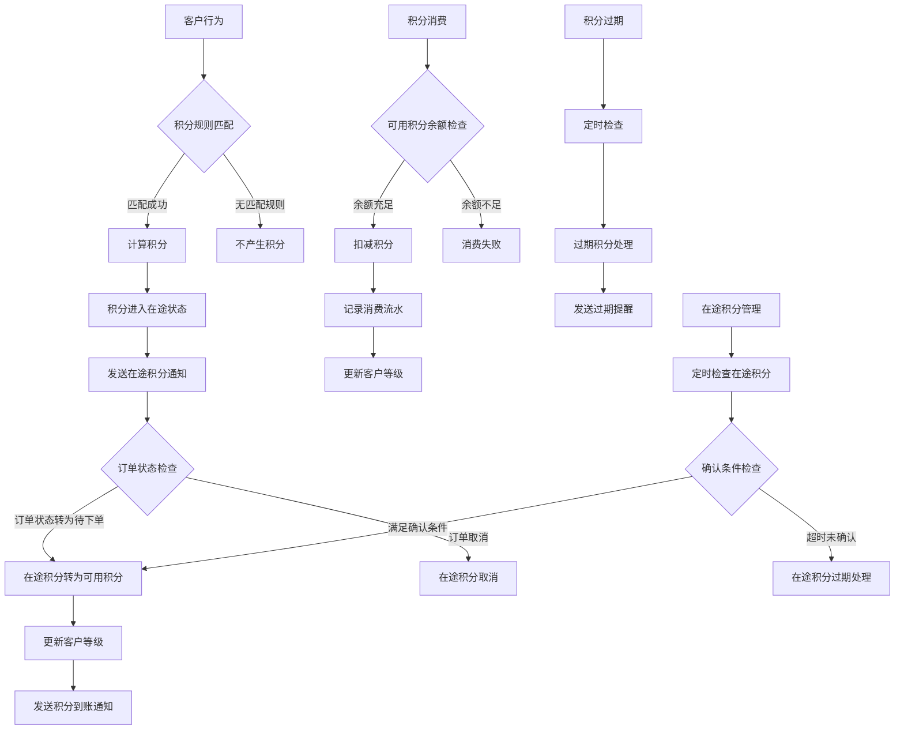

# 积分系统模块设计

## 1. 模块概述

积分系统是客户忠诚度管理的核心模块，通过积分奖励机制激励客户消费，提升客户粘性和复购率。系统支持多种积分获取方式、灵活的积分规则配置、完整的积分生命周期管理。

### 1.1 功能目标

- **积分获取**：支持多种积分获取方式（消费、签到、推荐、活动等）
- **积分消费**：提供积分抵扣、兑换商品、参与活动等消费场景
- **积分管理**：完整的积分账户管理、流水记录、有效期控制
- **规则配置**：灵活的积分规则配置，支持不同业务场景
- **等级体系**：基于积分的客户等级体系，提供差异化服务
- **统计分析**：积分数据统计分析，支持运营决策

### 1.2 业务流程



## 2. 数据库设计

### 2.1 积分账户表 (point_accounts)

```sql
CREATE TABLE point_accounts (
    id BIGINT PRIMARY KEY AUTO_INCREMENT,
    customer_id BIGINT NOT NULL COMMENT '客户ID',
    total_points BIGINT DEFAULT 0 COMMENT '总积分',
    available_points BIGINT DEFAULT 0 COMMENT '可用积分',
    pending_points BIGINT DEFAULT 0 COMMENT '在途积分',
    frozen_points BIGINT DEFAULT 0 COMMENT '冻结积分',
    used_points BIGINT DEFAULT 0 COMMENT '已使用积分',
    expired_points BIGINT DEFAULT 0 COMMENT '已过期积分',
    level_id INT DEFAULT 1 COMMENT '客户等级ID',
    level_points BIGINT DEFAULT 0 COMMENT '等级积分（用于等级计算）',
    created_at TIMESTAMP DEFAULT CURRENT_TIMESTAMP,
    updated_at TIMESTAMP DEFAULT CURRENT_TIMESTAMP ON UPDATE CURRENT_TIMESTAMP,
    INDEX idx_customer_id (customer_id),
    INDEX idx_level_id (level_id)
) COMMENT '积分账户表';
```

### 2.2 积分流水表 (point_transactions)

```sql
CREATE TABLE point_transactions (
    id BIGINT PRIMARY KEY AUTO_INCREMENT,
    customer_id BIGINT NOT NULL COMMENT '客户ID',
    transaction_no VARCHAR(64) NOT NULL COMMENT '交易流水号',
    type ENUM('earn', 'consume', 'freeze', 'unfreeze', 'expire', 'adjust', 'pending', 'confirm', 'cancel') NOT NULL COMMENT '交易类型',
    source VARCHAR(50) NOT NULL COMMENT '积分来源',
    points BIGINT NOT NULL COMMENT '积分数量',
    balance_before BIGINT NOT NULL COMMENT '交易前余额',
    balance_after BIGINT NOT NULL COMMENT '交易后余额',
    business_type VARCHAR(50) COMMENT '业务类型',
    business_id VARCHAR(100) COMMENT '业务ID',
    rule_id BIGINT COMMENT '规则ID',
    description TEXT COMMENT '交易描述',
    expire_at TIMESTAMP NULL COMMENT '过期时间',
    status ENUM('pending', 'success', 'failed', 'cancelled') DEFAULT 'pending' COMMENT '交易状态',
    operator_id BIGINT COMMENT '操作员ID',
    remark TEXT COMMENT '备注',
    created_at TIMESTAMP DEFAULT CURRENT_TIMESTAMP,
    updated_at TIMESTAMP DEFAULT CURRENT_TIMESTAMP ON UPDATE CURRENT_TIMESTAMP,
    INDEX idx_customer_id (customer_id),
    INDEX idx_transaction_no (transaction_no),
    INDEX idx_type (type),
    INDEX idx_source (source),
    INDEX idx_business (business_type, business_id),
    INDEX idx_expire_at (expire_at),
    INDEX idx_created_at (created_at)
) COMMENT '积分流水表';
```

### 2.3 积分规则表 (point_rules)

```sql
CREATE TABLE point_rules (
    id BIGINT PRIMARY KEY AUTO_INCREMENT,
    name VARCHAR(100) NOT NULL COMMENT '规则名称',
    code VARCHAR(50) NOT NULL UNIQUE COMMENT '规则编码',
    type ENUM('fixed', 'ratio', 'ladder', 'custom') NOT NULL COMMENT '规则类型',
    business_type VARCHAR(50) NOT NULL COMMENT '业务类型',
    trigger_condition JSON COMMENT '触发条件',
    point_calculation JSON NOT NULL COMMENT '积分计算规则',
    max_points_per_day INT COMMENT '每日最大积分',
    max_points_per_month INT COMMENT '每月最大积分',
    max_points_total INT COMMENT '总最大积分',
    valid_days INT DEFAULT 365 COMMENT '积分有效期（天）',
    customer_level_limit JSON COMMENT '客户等级限制',
    start_time TIMESTAMP COMMENT '规则开始时间',
    end_time TIMESTAMP COMMENT '规则结束时间',
    is_active BOOLEAN DEFAULT TRUE COMMENT '是否启用',
    priority INT DEFAULT 0 COMMENT '优先级',
    description TEXT COMMENT '规则描述',
    created_by BIGINT COMMENT '创建人',
    created_at TIMESTAMP DEFAULT CURRENT_TIMESTAMP,
    updated_at TIMESTAMP DEFAULT CURRENT_TIMESTAMP ON UPDATE CURRENT_TIMESTAMP,
    INDEX idx_code (code),
    INDEX idx_business_type (business_type),
    INDEX idx_is_active (is_active),
    INDEX idx_priority (priority)
) COMMENT '积分规则表';
```

### 2.4 客户等级表 (customer_levels)

```sql
CREATE TABLE customer_levels (
    id INT PRIMARY KEY AUTO_INCREMENT,
    name VARCHAR(50) NOT NULL COMMENT '等级名称',
    code VARCHAR(20) NOT NULL UNIQUE COMMENT '等级编码',
    min_points BIGINT NOT NULL COMMENT '最低积分要求',
    max_points BIGINT COMMENT '最高积分限制',
    level_order INT NOT NULL COMMENT '等级顺序',
    benefits JSON COMMENT '等级权益',
    point_ratio DECIMAL(5,4) DEFAULT 1.0000 COMMENT '积分倍率',
    discount_rate DECIMAL(5,4) DEFAULT 0.0000 COMMENT '折扣率',
    icon_url VARCHAR(255) COMMENT '等级图标',
    color VARCHAR(20) COMMENT '等级颜色',
    description TEXT COMMENT '等级描述',
    is_active BOOLEAN DEFAULT TRUE COMMENT '是否启用',
    created_at TIMESTAMP DEFAULT CURRENT_TIMESTAMP,
    updated_at TIMESTAMP DEFAULT CURRENT_TIMESTAMP ON UPDATE CURRENT_TIMESTAMP,
    INDEX idx_code (code),
    INDEX idx_level_order (level_order),
    INDEX idx_points_range (min_points, max_points)
) COMMENT '客户等级表';
```

### 2.5 积分过期批次表 (point_expiry_batches)

```sql
CREATE TABLE point_expiry_batches (
    id BIGINT PRIMARY KEY AUTO_INCREMENT,
    customer_id BIGINT NOT NULL COMMENT '客户ID',
    points BIGINT NOT NULL COMMENT '积分数量',
    remaining_points BIGINT NOT NULL COMMENT '剩余积分',
    source VARCHAR(50) NOT NULL COMMENT '积分来源',
    business_id VARCHAR(100) COMMENT '业务ID',
    earned_at TIMESTAMP NOT NULL COMMENT '获得时间',
    expire_at TIMESTAMP NOT NULL COMMENT '过期时间',
    status ENUM('active', 'expired', 'consumed') DEFAULT 'active' COMMENT '状态',
    created_at TIMESTAMP DEFAULT CURRENT_TIMESTAMP,
    updated_at TIMESTAMP DEFAULT CURRENT_TIMESTAMP ON UPDATE CURRENT_TIMESTAMP,
    INDEX idx_customer_id (customer_id),
    INDEX idx_expire_at (expire_at),
    INDEX idx_status (status)
) COMMENT '积分过期批次表';
```

### 2.6 积分活动表 (point_activities)

```sql
CREATE TABLE point_activities (
    id BIGINT PRIMARY KEY AUTO_INCREMENT,
    name VARCHAR(100) NOT NULL COMMENT '活动名称',
    type ENUM('sign_in', 'share', 'invite', 'task', 'special') NOT NULL COMMENT '活动类型',
    description TEXT COMMENT '活动描述',
    rules JSON NOT NULL COMMENT '活动规则',
    point_reward JSON NOT NULL COMMENT '积分奖励',
    participation_limit JSON COMMENT '参与限制',
    start_time TIMESTAMP NOT NULL COMMENT '开始时间',
    end_time TIMESTAMP NOT NULL COMMENT '结束时间',
    is_active BOOLEAN DEFAULT TRUE COMMENT '是否启用',
    created_by BIGINT COMMENT '创建人',
    created_at TIMESTAMP DEFAULT CURRENT_TIMESTAMP,
    updated_at TIMESTAMP DEFAULT CURRENT_TIMESTAMP ON UPDATE CURRENT_TIMESTAMP,
    INDEX idx_type (type),
    INDEX idx_time_range (start_time, end_time),
    INDEX idx_is_active (is_active)
) COMMENT '积分活动表';
```

### 2.7 积分活动参与记录表 (point_activity_participations)

```sql
CREATE TABLE point_activity_participations (
    id BIGINT PRIMARY KEY AUTO_INCREMENT,
    activity_id BIGINT NOT NULL COMMENT '活动ID',
    customer_id BIGINT NOT NULL COMMENT '客户ID',
    participation_date DATE NOT NULL COMMENT '参与日期',
    points_earned BIGINT DEFAULT 0 COMMENT '获得积分',
    status ENUM('pending', 'completed', 'failed') DEFAULT 'pending' COMMENT '状态',
    completion_data JSON COMMENT '完成数据',
    created_at TIMESTAMP DEFAULT CURRENT_TIMESTAMP,
    updated_at TIMESTAMP DEFAULT CURRENT_TIMESTAMP ON UPDATE CURRENT_TIMESTAMP,
    UNIQUE KEY uk_activity_customer_date (activity_id, customer_id, participation_date),
    INDEX idx_customer_id (customer_id),
    INDEX idx_participation_date (participation_date)
) COMMENT '积分活动参与记录表';
```

## 3. API接口设计

### 3.1 积分账户管理

#### 3.1.1 获取积分账户信息

```typescript
GET /api/points/account/{customerId}

Response:
{
  "code": 200,
  "data": {
    "customerId": 12345,
    "totalPoints": 15000,
    "availablePoints": 12000,
    "frozenPoints": 1000,
    "usedPoints": 8000,
    "expiredPoints": 500,
    "level": {
      "id": 3,
      "name": "黄金会员",
      "code": "GOLD",
      "pointRatio": 1.2,
      "discountRate": 0.05,
      "benefits": ["免费配送", "专属客服", "生日礼品"]
    },
    "expiringPoints": [
      {
        "points": 2000,
        "expireAt": "2024-03-15T00:00:00Z"
      }
    ]
  }
}
```

#### 3.1.2 获取积分流水

```typescript
GET /api/points/transactions?customer_id=12345&page=1&size=20&type=earn

Response:
{
  "code": 200,
  "data": {
    "list": [
      {
        "id": 1001,
        "transactionNo": "PT202401150001",
        "type": "earn",
        "source": "order_payment",
        "points": 500,
        "balanceBefore": 11500,
        "balanceAfter": 12000,
        "businessType": "order",
        "businessId": "ORD202401150001",
        "description": "订单支付获得积分",
        "expireAt": "2025-01-15T00:00:00Z",
        "status": "success",
        "createdAt": "2024-01-15T10:30:00Z"
      }
    ],
    "total": 156,
    "page": 1,
    "size": 20
  }
}
```

### 3.2 积分获取

#### 3.2.1 手动发放积分

```typescript
POST /api/points/grant

Request:
{
  "customerId": 12345,
  "points": 1000,
  "source": "manual_grant",
  "businessType": "promotion",
  "businessId": "PROMO001",
  "description": "新用户注册奖励",
  "validDays": 365,
  "operatorId": 1001
}

Response:
{
  "code": 200,
  "data": {
    "transactionNo": "PT202401150002",
    "points": 1000,
    "newBalance": 13000,
    "expireAt": "2025-01-15T00:00:00Z"
  }
}
```

#### 3.2.2 业务触发积分

```typescript
POST /api/points/trigger

Request:
{
  "customerId": 12345,
  "businessType": "order_payment",
  "businessId": "ORD202401150001",
  "businessData": {
    "orderAmount": 5000,
    "paymentMethod": "wechat",
    "isFirstOrder": false
  }
}

Response:
{
  "code": 200,
  "data": {
    "matched": true,
    "ruleId": 1001,
    "ruleName": "订单支付积分",
    "points": 500,
    "transactionNo": "PT202401150003",
    "newBalance": 13500
  }
}
```

### 3.3 在途积分管理

#### 3.3.1 创建在途积分

```typescript
POST /api/points/pending

Request:
{
  "customerId": 12345,
  "points": 500,
  "source": "order_payment",
  "businessType": "order_payment",
  "businessId": "ORD202401150001",
  "ruleId": 1001,
  "description": "订单支付在途积分"
}

Response:
{
  "code": 200,
  "data": {
    "transactionNo": "PT202401150005",
    "points": 500,
    "pendingBalance": 1500,
    "expectedConfirmAt": "2024-01-22T10:30:00Z"
  }
}
```

#### 3.3.2 确认在途积分

```typescript
POST /api/points/pending/{transactionNo}/confirm

Response:
{
  "code": 200,
  "data": {
    "transactionNo": "PT202401150006",
    "points": 500,
    "newBalance": 14000,
    "expireAt": "2025-01-15T00:00:00Z"
  }
}
```

#### 3.3.3 取消在途积分

```typescript
POST /api/points/pending/{transactionNo}/cancel

Request:
{
  "reason": "订单已取消"
}

Response:
{
  "code": 200,
  "message": "在途积分已取消"
}
```

#### 3.3.4 查询在途积分

```typescript
GET /api/points/pending?customer_id=12345&page=1&size=20

Response:
{
  "code": 200,
  "data": {
    "list": [
      {
        "id": 1005,
        "transactionNo": "PT202401150005",
        "points": 500,
        "source": "order_payment",
        "businessType": "order_payment",
        "businessId": "ORD202401150001",
        "description": "订单支付在途积分",
        "expectedConfirmAt": "2024-01-22T10:30:00Z",
        "status": "pending",
        "createdAt": "2024-01-15T10:30:00Z"
      }
    ],
    "total": 3,
    "page": 1,
    "size": 20,
    "summary": {
      "totalPendingPoints": 1500,
      "pendingCount": 3
    }
  }
}
```

### 3.4 积分消费

#### 3.3.1 积分抵扣

```typescript
POST /api/points/deduct

Request:
{
  "customerId": 12345,
  "points": 1000,
  "businessType": "order_deduction",
  "businessId": "ORD202401150002",
  "description": "订单积分抵扣",
  "operatorId": 1001
}

Response:
{
  "code": 200,
  "data": {
    "transactionNo": "PT202401150004",
    "points": 1000,
    "newBalance": 12500,
    "deductionDetails": [
      {
        "batchId": 1001,
        "points": 600,
        "expireAt": "2024-12-31T00:00:00Z"
      },
      {
        "batchId": 1002,
        "points": 400,
        "expireAt": "2025-03-15T00:00:00Z"
      }
    ]
  }
}
```

#### 3.3.2 积分预扣（冻结）

```typescript
POST /api/points/freeze

Request:
{
  "customerId": 12345,
  "points": 500,
  "businessType": "order_pending",
  "businessId": "ORD202401150003",
  "description": "订单待支付冻结积分",
  "freezeDuration": 1800 // 30分钟
}

Response:
{
  "code": 200,
  "data": {
    "transactionNo": "PT202401150005",
    "frozenPoints": 500,
    "availablePoints": 12000,
    "unfreezeAt": "2024-01-15T11:30:00Z"
  }
}
```

### 3.4 积分规则管理

#### 3.4.1 创建积分规则

```typescript
POST /api/points/rules

Request:
{
  "name": "订单支付积分",
  "code": "ORDER_PAYMENT",
  "type": "ratio",
  "businessType": "order_payment",
  "triggerCondition": {
    "minAmount": 100,
    "paymentMethods": ["wechat", "alipay", "bank_card"],
    "excludePromotions": ["FIRST_ORDER"]
  },
  "pointCalculation": {
    "ratio": 0.01,
    "maxPoints": 5000,
    "roundingRule": "floor"
  },
  "maxPointsPerDay": 10000,
  "maxPointsPerMonth": 50000,
  "validDays": 365,
  "customerLevelLimit": {
    "includeLevels": ["BRONZE", "SILVER", "GOLD", "PLATINUM"],
    "levelMultiplier": {
      "BRONZE": 1.0,
      "SILVER": 1.2,
      "GOLD": 1.5,
      "PLATINUM": 2.0
    }
  },
  "startTime": "2024-01-01T00:00:00Z",
  "endTime": "2024-12-31T23:59:59Z",
  "description": "客户订单支付时按金额比例获得积分"
}

Response:
{
  "code": 200,
  "data": {
    "id": 1001,
    "code": "ORDER_PAYMENT",
    "status": "active"
  }
}
```

## 4. 核心业务逻辑

### 4.1 积分服务 (PointService)

```typescript
class PointService {
  constructor(
    private pointAccountRepo: PointAccountRepository,
    private pointTransactionRepo: PointTransactionRepository,
    private pointRuleRepo: PointRuleRepository,
    private pointExpiryRepo: PointExpiryBatchRepository,
    private customerLevelService: CustomerLevelService,
    private notificationService: NotificationService,
    private eventBus: EventBus
  ) {}

  // 业务触发积分获取
  async triggerPointEarn(request: PointTriggerRequest): Promise<PointEarnResult> {
    const { customerId, businessType, businessId, businessData } = request;
    
    // 获取匹配的积分规则
    const rules = await this.getMatchingRules(businessType, businessData);
    
    if (rules.length === 0) {
      return { matched: false, points: 0 };
    }
    
    // 按优先级排序，取第一个匹配的规则
    const rule = rules.sort((a, b) => b.priority - a.priority)[0];
    
    // 计算积分
    const points = await this.calculatePoints(rule, businessData, customerId);
    
    if (points <= 0) {
      return { matched: true, ruleId: rule.id, points: 0 };
    }
    
    // 检查限制
    await this.checkPointLimits(rule, customerId, points);
    
    // 发放积分
    const result = await this.grantPoints({
      customerId,
      points,
      source: rule.code,
      businessType,
      businessId,
      ruleId: rule.id,
      validDays: rule.validDays,
      description: `${rule.name} - ${businessType}`
    });
    
    return {
      matched: true,
      ruleId: rule.id,
      ruleName: rule.name,
      points,
      transactionNo: result.transactionNo,
      newBalance: result.newBalance
    };
  }

  // 发放积分
  async grantPoints(request: PointGrantRequest): Promise<PointGrantResult> {
    const { customerId, points, source, businessType, businessId, validDays = 365 } = request;
    
    return await this.db.transaction(async (trx) => {
      // 获取客户积分账户
      const account = await this.getOrCreateAccount(customerId, trx);
      
      // 生成交易流水号
      const transactionNo = await this.generateTransactionNo();
      
      // 计算过期时间
      const expireAt = new Date();
      expireAt.setDate(expireAt.getDate() + validDays);
      
      // 创建积分流水
      const transaction = await this.pointTransactionRepo.create({
        customerId,
        transactionNo,
        type: 'earn',
        source,
        points,
        balanceBefore: account.availablePoints,
        balanceAfter: account.availablePoints + points,
        businessType,
        businessId,
        ruleId: request.ruleId,
        description: request.description,
        expireAt,
        status: 'success'
      }, trx);
      
      // 更新积分账户
      await this.pointAccountRepo.update(customerId, {
        totalPoints: account.totalPoints + points,
        availablePoints: account.availablePoints + points,
        levelPoints: account.levelPoints + points
      }, trx);
      
      // 创建积分过期批次
      await this.pointExpiryRepo.create({
        customerId,
        points,
        remainingPoints: points,
        source,
        businessId,
        earnedAt: new Date(),
        expireAt,
        status: 'active'
      }, trx);
      
      // 检查并更新客户等级
      await this.updateCustomerLevel(customerId, account.levelPoints + points, trx);
      
      // 发布积分获得事件
      await this.eventBus.publish('point.earned', {
        customerId,
        points,
        source,
        transactionNo,
        newBalance: account.availablePoints + points
      });
      
      return {
        transactionNo,
        points,
        newBalance: account.availablePoints + points,
        expireAt
      };
    });
  }

  // 在途积分管理
  async createPendingPoints(request: PendingPointRequest): Promise<PendingPointResult> {
    const { customerId, points, businessType, businessId, ruleId, source } = request;
    
    return await this.db.transaction(async (trx) => {
      // 获取客户积分账户
      const account = await this.getAccount(customerId, trx);
      
      // 生成交易流水号
      const transactionNo = await this.generateTransactionNo();
      
      // 计算预期到账时间（根据业务类型确定）
      const expectedConfirmAt = this.calculateExpectedConfirmTime(businessType);
      
      // 创建在途积分流水
      await this.pointTransactionRepo.create({
        customerId,
        transactionNo,
        type: 'pending',
        source,
        points,
        balanceBefore: account.availablePoints,
        balanceAfter: account.availablePoints, // 在途积分不影响可用余额
        businessType,
        businessId,
        ruleId,
        description: request.description,
        expectedConfirmAt,
        status: 'pending'
      }, trx);
      
      // 更新积分账户的在途积分
      await this.pointAccountRepo.update(customerId, {
        pendingPoints: account.pendingPoints + points
      }, trx);
      
      // 发布在途积分创建事件
      await this.eventBus.publish('point.pending.created', {
        customerId,
        points,
        source,
        transactionNo,
        businessId,
        expectedConfirmAt
      });
      
      return {
        transactionNo,
        points,
        pendingBalance: account.pendingPoints + points,
        expectedConfirmAt
      };
    });
  }

  // 确认在途积分
  async confirmPendingPoints(transactionNo: string): Promise<PointEarnResult> {
    return await this.db.transaction(async (trx) => {
      // 获取在途积分记录
      const pendingTransaction = await this.pointTransactionRepo.findByTransactionNo(transactionNo, trx);
      
      if (!pendingTransaction || pendingTransaction.status !== 'pending') {
        throw new InvalidTransactionError('无效的在途积分记录');
      }
      
      const { customerId, points, source, businessType, businessId, ruleId } = pendingTransaction;
      
      // 获取客户积分账户
      const account = await this.getAccount(customerId, trx);
      
      // 计算积分有效期
      const expireAt = await this.calculateExpireDate(ruleId);
      
      // 更新在途积分状态为已确认
      await this.pointTransactionRepo.update(pendingTransaction.id, {
        type: 'confirm',
        status: 'success',
        confirmedAt: new Date()
      }, trx);
      
      // 创建积分到账流水
      const confirmTransactionNo = await this.generateTransactionNo();
      await this.pointTransactionRepo.create({
        customerId,
        transactionNo: confirmTransactionNo,
        type: 'earn',
        source,
        points,
        balanceBefore: account.availablePoints,
        balanceAfter: account.availablePoints + points,
        businessType,
        businessId,
        ruleId,
        description: `在途积分确认到账 (${transactionNo})`,
        expireAt,
        status: 'success',
        relatedTransactionNo: transactionNo
      }, trx);
      
      // 更新积分账户
      await this.pointAccountRepo.update(customerId, {
        totalPoints: account.totalPoints + points,
        availablePoints: account.availablePoints + points,
        pendingPoints: account.pendingPoints - points,
        levelPoints: account.levelPoints + points
      }, trx);
      
      // 创建积分过期批次
      await this.pointExpiryRepo.create({
        customerId,
        points,
        remainingPoints: points,
        source,
        businessId,
        earnedAt: new Date(),
        expireAt,
        status: 'active'
      }, trx);
      
      // 检查并更新客户等级
      await this.updateCustomerLevel(customerId, account.levelPoints + points, trx);
      
      // 发布积分确认事件
      await this.eventBus.publish('point.pending.confirmed', {
        customerId,
        points,
        source,
        originalTransactionNo: transactionNo,
        confirmTransactionNo,
        newBalance: account.availablePoints + points
      });
      
      return {
        transactionNo: confirmTransactionNo,
        points,
        newBalance: account.availablePoints + points,
        expireAt
      };
    });
  }

  // 取消在途积分
  async cancelPendingPoints(transactionNo: string, reason: string): Promise<void> {
    return await this.db.transaction(async (trx) => {
      // 获取在途积分记录
      const pendingTransaction = await this.pointTransactionRepo.findByTransactionNo(transactionNo, trx);
      
      if (!pendingTransaction || pendingTransaction.status !== 'pending') {
        throw new InvalidTransactionError('无效的在途积分记录');
      }
      
      const { customerId, points } = pendingTransaction;
      
      // 获取客户积分账户
      const account = await this.getAccount(customerId, trx);
      
      // 更新在途积分状态为已取消
      await this.pointTransactionRepo.update(pendingTransaction.id, {
        type: 'cancel',
        status: 'cancelled',
        cancelledAt: new Date(),
        cancelReason: reason
      }, trx);
      
      // 更新积分账户的在途积分
      await this.pointAccountRepo.update(customerId, {
        pendingPoints: account.pendingPoints - points
      }, trx);
      
      // 发布在途积分取消事件
      await this.eventBus.publish('point.pending.cancelled', {
        customerId,
        points,
        transactionNo,
        reason
      });
    });
  }

  // 定时处理在途积分
  async processPendingPoints(): Promise<void> {
    // 获取需要处理的在途积分记录
    const pendingTransactions = await this.pointTransactionRepo.findPendingToProcess();
    
    for (const transaction of pendingTransactions) {
      try {
        // 检查业务状态
        const businessStatus = await this.checkBusinessStatus(
          transaction.businessType,
          transaction.businessId
        );
        
        if (businessStatus === 'completed') {
          // 自动确认积分
          await this.confirmPendingPoints(transaction.transactionNo);
        } else if (businessStatus === 'cancelled' || businessStatus === 'expired') {
          // 自动取消积分
          await this.cancelPendingPoints(
            transaction.transactionNo,
            `业务状态变更: ${businessStatus}`
          );
        }
      } catch (error) {
        console.error(`处理在途积分失败: ${transaction.transactionNo}`, error);
      }
    }
  }

  // 计算预期确认时间
  private calculateExpectedConfirmTime(businessType: string): Date {
    const now = new Date();
    
    switch (businessType) {
      case 'order_payment':
        // 订单支付：7天后确认
        return new Date(now.getTime() + 7 * 24 * 60 * 60 * 1000);
      case 'referral':
        // 推荐奖励：3天后确认
        return new Date(now.getTime() + 3 * 24 * 60 * 60 * 1000);
      case 'activity':
        // 活动奖励：1天后确认
        return new Date(now.getTime() + 1 * 24 * 60 * 60 * 1000);
      default:
        // 默认：3天后确认
        return new Date(now.getTime() + 3 * 24 * 60 * 60 * 1000);
    }
  }

  // 检查业务状态
  private async checkBusinessStatus(businessType: string, businessId: string): Promise<string> {
    switch (businessType) {
      case 'order_payment':
        return await this.orderService.getOrderStatus(businessId);
      case 'referral':
        return await this.referralService.getReferralStatus(businessId);
      default:
        return 'unknown';
    }
  }

  // 消费积分
  async deductPoints(request: PointDeductRequest): Promise<PointDeductResult> {
    const { customerId, points, businessType, businessId } = request;
    
    return await this.db.transaction(async (trx) => {
      // 获取客户积分账户
      const account = await this.getAccount(customerId, trx);
      
      if (account.availablePoints < points) {
        throw new InsufficientPointsError('积分余额不足');
      }
      
      // 获取可用的积分批次（按过期时间排序，先过期的先使用）
      const batches = await this.getAvailableBatches(customerId, trx);
      
      // 计算扣减明细
      const deductionDetails = this.calculateDeduction(batches, points);
      
      // 生成交易流水号
      const transactionNo = await this.generateTransactionNo();
      
      // 创建积分流水
      await this.pointTransactionRepo.create({
        customerId,
        transactionNo,
        type: 'consume',
        source: businessType,
        points: -points,
        balanceBefore: account.availablePoints,
        balanceAfter: account.availablePoints - points,
        businessType,
        businessId,
        description: request.description,
        status: 'success'
      }, trx);
      
      // 更新积分批次
      for (const detail of deductionDetails) {
        await this.pointExpiryRepo.updateRemainingPoints(
          detail.batchId,
          detail.remainingAfter,
          trx
        );
        
        if (detail.remainingAfter === 0) {
          await this.pointExpiryRepo.updateStatus(detail.batchId, 'consumed', trx);
        }
      }
      
      // 更新积分账户
      await this.pointAccountRepo.update(customerId, {
        availablePoints: account.availablePoints - points,
        usedPoints: account.usedPoints + points
      }, trx);
      
      // 发布积分消费事件
      await this.eventBus.publish('point.consumed', {
        customerId,
        points,
        businessType,
        businessId,
        transactionNo,
        newBalance: account.availablePoints - points
      });
      
      return {
        transactionNo,
        points,
        newBalance: account.availablePoints - points,
        deductionDetails
      };
    });
  }

  // 冻结积分
  async freezePoints(request: PointFreezeRequest): Promise<PointFreezeResult> {
    const { customerId, points, businessType, businessId, freezeDuration } = request;
    
    return await this.db.transaction(async (trx) => {
      const account = await this.getAccount(customerId, trx);
      
      if (account.availablePoints < points) {
        throw new InsufficientPointsError('可用积分不足');
      }
      
      const transactionNo = await this.generateTransactionNo();
      const unfreezeAt = new Date(Date.now() + freezeDuration * 1000);
      
      // 创建冻结流水
      await this.pointTransactionRepo.create({
        customerId,
        transactionNo,
        type: 'freeze',
        source: businessType,
        points,
        balanceBefore: account.availablePoints,
        balanceAfter: account.availablePoints - points,
        businessType,
        businessId,
        description: request.description,
        expireAt: unfreezeAt,
        status: 'success'
      }, trx);
      
      // 更新账户
      await this.pointAccountRepo.update(customerId, {
        availablePoints: account.availablePoints - points,
        frozenPoints: account.frozenPoints + points
      }, trx);
      
      // 设置自动解冻任务
      await this.scheduleUnfreeze(transactionNo, unfreezeAt);
      
      return {
        transactionNo,
        frozenPoints: points,
        availablePoints: account.availablePoints - points,
        unfreezeAt
      };
    });
  }

  // 解冻积分
  async unfreezePoints(transactionNo: string): Promise<void> {
    const freezeTransaction = await this.pointTransactionRepo.findByTransactionNo(transactionNo);
    
    if (!freezeTransaction || freezeTransaction.type !== 'freeze') {
      throw new Error('冻结交易不存在');
    }
    
    await this.db.transaction(async (trx) => {
      const account = await this.getAccount(freezeTransaction.customerId, trx);
      const points = freezeTransaction.points;
      
      // 创建解冻流水
      const unfreezeTransactionNo = await this.generateTransactionNo();
      await this.pointTransactionRepo.create({
        customerId: freezeTransaction.customerId,
        transactionNo: unfreezeTransactionNo,
        type: 'unfreeze',
        source: freezeTransaction.source,
        points,
        balanceBefore: account.availablePoints,
        balanceAfter: account.availablePoints + points,
        businessType: freezeTransaction.businessType,
        businessId: freezeTransaction.businessId,
        description: '积分解冻',
        status: 'success'
      }, trx);
      
      // 更新账户
      await this.pointAccountRepo.update(freezeTransaction.customerId, {
        availablePoints: account.availablePoints + points,
        frozenPoints: account.frozenPoints - points
      }, trx);
    });
  }

  // 处理积分过期
  async processExpiredPoints(): Promise<void> {
    const expiredBatches = await this.pointExpiryRepo.findExpiredBatches();
    
    for (const batch of expiredBatches) {
      if (batch.remainingPoints > 0) {
        await this.expirePointBatch(batch);
      }
    }
  }

  private async expirePointBatch(batch: PointExpiryBatch): Promise<void> {
    await this.db.transaction(async (trx) => {
      const account = await this.getAccount(batch.customerId, trx);
      const expiredPoints = batch.remainingPoints;
      
      // 创建过期流水
      const transactionNo = await this.generateTransactionNo();
      await this.pointTransactionRepo.create({
        customerId: batch.customerId,
        transactionNo,
        type: 'expire',
        source: batch.source,
        points: -expiredPoints,
        balanceBefore: account.availablePoints,
        balanceAfter: account.availablePoints - expiredPoints,
        businessId: batch.businessId,
        description: '积分过期',
        status: 'success'
      }, trx);
      
      // 更新积分批次状态
      await this.pointExpiryRepo.update(batch.id, {
        remainingPoints: 0,
        status: 'expired'
      }, trx);
      
      // 更新积分账户
      await this.pointAccountRepo.update(batch.customerId, {
        availablePoints: account.availablePoints - expiredPoints,
        expiredPoints: account.expiredPoints + expiredPoints
      }, trx);
      
      // 发送过期通知
      await this.notificationService.sendPointExpiredNotification(
        batch.customerId,
        expiredPoints
      );
    });
  }

  // 计算积分
  private async calculatePoints(
    rule: PointRule,
    businessData: any,
    customerId: number
  ): Promise<number> {
    const { type, pointCalculation } = rule;
    let points = 0;
    
    switch (type) {
      case 'fixed':
        points = pointCalculation.points;
        break;
        
      case 'ratio':
        const amount = businessData.orderAmount || businessData.amount || 0;
        points = Math.floor(amount * pointCalculation.ratio);
        break;
        
      case 'ladder':
        points = this.calculateLadderPoints(pointCalculation.ladders, businessData);
        break;
        
      case 'custom':
        points = await this.calculateCustomPoints(pointCalculation, businessData);
        break;
    }
    
    // 应用客户等级倍率
    const customerLevel = await this.customerLevelService.getCustomerLevel(customerId);
    if (rule.customerLevelLimit?.levelMultiplier?.[customerLevel.code]) {
      points = Math.floor(points * rule.customerLevelLimit.levelMultiplier[customerLevel.code]);
    }
    
    // 应用最大积分限制
    if (pointCalculation.maxPoints && points > pointCalculation.maxPoints) {
      points = pointCalculation.maxPoints;
    }
    
    return points;
  }

  // 检查积分限制
  private async checkPointLimits(
    rule: PointRule,
    customerId: number,
    points: number
  ): Promise<void> {
    const today = new Date();
    const startOfDay = new Date(today.getFullYear(), today.getMonth(), today.getDate());
    const startOfMonth = new Date(today.getFullYear(), today.getMonth(), 1);
    
    // 检查每日限制
    if (rule.maxPointsPerDay) {
      const todayPoints = await this.pointTransactionRepo.sumPointsByDateRange(
        customerId,
        rule.code,
        startOfDay,
        new Date()
      );
      
      if (todayPoints + points > rule.maxPointsPerDay) {
        throw new PointLimitExceededError('超过每日积分限制');
      }
    }
    
    // 检查每月限制
    if (rule.maxPointsPerMonth) {
      const monthPoints = await this.pointTransactionRepo.sumPointsByDateRange(
        customerId,
        rule.code,
        startOfMonth,
        new Date()
      );
      
      if (monthPoints + points > rule.maxPointsPerMonth) {
        throw new PointLimitExceededError('超过每月积分限制');
      }
    }
    
    // 检查总限制
    if (rule.maxPointsTotal) {
      const totalPoints = await this.pointTransactionRepo.sumPointsBySource(
        customerId,
        rule.code
      );
      
      if (totalPoints + points > rule.maxPointsTotal) {
        throw new PointLimitExceededError('超过总积分限制');
      }
    }
  }

  // 更新客户等级
  private async updateCustomerLevel(
    customerId: number,
    totalPoints: number,
    trx?: any
  ): Promise<void> {
    const newLevel = await this.customerLevelService.calculateLevel(totalPoints);
    const currentAccount = await this.getAccount(customerId, trx);
    
    if (newLevel.id !== currentAccount.levelId) {
      await this.pointAccountRepo.update(customerId, {
        levelId: newLevel.id
      }, trx);
      
      // 发布等级变更事件
      await this.eventBus.publish('customer.level.changed', {
        customerId,
        oldLevelId: currentAccount.levelId,
        newLevelId: newLevel.id,
        totalPoints
      });
    }
  }
}
```

### 4.2 积分规则引擎 (PointRuleEngine)

```typescript
class PointRuleEngine {
  // 获取匹配的规则
  async getMatchingRules(
    businessType: string,
    businessData: any
  ): Promise<PointRule[]> {
    const rules = await this.pointRuleRepo.findActiveRulesByBusinessType(businessType);
    const matchingRules: PointRule[] = [];
    
    for (const rule of rules) {
      if (await this.isRuleMatched(rule, businessData)) {
        matchingRules.push(rule);
      }
    }
    
    return matchingRules;
  }

  // 检查规则是否匹配
  private async isRuleMatched(rule: PointRule, businessData: any): Promise<boolean> {
    const { triggerCondition } = rule;
    
    if (!triggerCondition) {
      return true;
    }
    
    // 检查金额条件
    if (triggerCondition.minAmount) {
      const amount = businessData.orderAmount || businessData.amount || 0;
      if (amount < triggerCondition.minAmount) {
        return false;
      }
    }
    
    if (triggerCondition.maxAmount) {
      const amount = businessData.orderAmount || businessData.amount || 0;
      if (amount > triggerCondition.maxAmount) {
        return false;
      }
    }
    
    // 检查支付方式
    if (triggerCondition.paymentMethods) {
      const paymentMethod = businessData.paymentMethod;
      if (!triggerCondition.paymentMethods.includes(paymentMethod)) {
        return false;
      }
    }
    
    // 检查排除条件
    if (triggerCondition.excludePromotions) {
      const promotions = businessData.promotions || [];
      for (const promotion of promotions) {
        if (triggerCondition.excludePromotions.includes(promotion)) {
          return false;
        }
      }
    }
    
    // 检查产品类别
    if (triggerCondition.productCategories) {
      const categories = businessData.productCategories || [];
      const hasMatchingCategory = categories.some(category =>
        triggerCondition.productCategories.includes(category)
      );
      if (!hasMatchingCategory) {
        return false;
      }
    }
    
    // 检查客户条件
    if (triggerCondition.customerConditions) {
      const isMatched = await this.checkCustomerConditions(
        triggerCondition.customerConditions,
        businessData.customerId
      );
      if (!isMatched) {
        return false;
      }
    }
    
    return true;
  }

  // 检查客户条件
  private async checkCustomerConditions(
    conditions: any,
    customerId: number
  ): Promise<boolean> {
    // 检查是否首次购买
    if (conditions.isFirstOrder !== undefined) {
      const orderCount = await this.orderService.getCustomerOrderCount(customerId);
      if ((orderCount === 0) !== conditions.isFirstOrder) {
        return false;
      }
    }
    
    // 检查客户等级
    if (conditions.customerLevels) {
      const customerLevel = await this.customerLevelService.getCustomerLevel(customerId);
      if (!conditions.customerLevels.includes(customerLevel.code)) {
        return false;
      }
    }
    
    // 检查注册时间
    if (conditions.registrationDaysAgo) {
      const customer = await this.customerService.getCustomer(customerId);
      const daysSinceRegistration = Math.floor(
        (Date.now() - customer.createdAt.getTime()) / (1000 * 60 * 60 * 24)
      );
      if (daysSinceRegistration < conditions.registrationDaysAgo) {
        return false;
      }
    }
    
    return true;
  }
}
```

## 5. 前端设计

### 5.1 Web端设计

#### 5.1.1 积分账户页面

```typescript
// components/PointAccount.tsx
import React, { useState, useEffect } from 'react';
import { Card, Row, Col, Statistic, Table, Tag, Tabs, Progress } from 'antd';
import { GiftOutlined, TrophyOutlined, ClockCircleOutlined } from '@ant-design/icons';

interface PointAccountProps {
  customerId: number;
}

const PointAccount: React.FC<PointAccountProps> = ({ customerId }) => {
  const [accountData, setAccountData] = useState<any>(null);
  const [transactions, setTransactions] = useState<any[]>([]);
  const [loading, setLoading] = useState(true);

  useEffect(() => {
    loadAccountData();
    loadTransactions();
  }, [customerId]);

  const loadAccountData = async () => {
    try {
      const response = await fetch(`/api/points/account/${customerId}`);
      const data = await response.json();
      setAccountData(data.data);
    } catch (error) {
      console.error('加载积分账户失败:', error);
    }
  };

  const loadTransactions = async () => {
    try {
      const response = await fetch(`/api/points/transactions?customerId=${customerId}`);
      const data = await response.json();
      setTransactions(data.data.list);
    } catch (error) {
      console.error('加载积分流水失败:', error);
    } finally {
      setLoading(false);
    }
  };

  const transactionColumns = [
    {
      title: '交易时间',
      dataIndex: 'createdAt',
      key: 'createdAt',
      render: (text: string) => new Date(text).toLocaleString()
    },
    {
      title: '交易类型',
      dataIndex: 'type',
      key: 'type',
      render: (type: string) => {
        const typeMap = {
          earn: { text: '获得', color: 'green' },
          consume: { text: '消费', color: 'red' },
          freeze: { text: '冻结', color: 'orange' },
          expire: { text: '过期', color: 'gray' }
        };
        const config = typeMap[type] || { text: type, color: 'default' };
        return <Tag color={config.color}>{config.text}</Tag>;
      }
    },
    {
      title: '积分变动',
      dataIndex: 'points',
      key: 'points',
      render: (points: number, record: any) => (
        <span style={{ color: record.type === 'earn' ? '#52c41a' : '#ff4d4f' }}>
          {record.type === 'earn' ? '+' : ''}{points}
        </span>
      )
    },
    {
      title: '余额',
      dataIndex: 'balanceAfter',
      key: 'balanceAfter'
    },
    {
      title: '来源',
      dataIndex: 'source',
      key: 'source'
    },
    {
      title: '说明',
      dataIndex: 'description',
      key: 'description'
    }
  ];

  if (!accountData) {
    return <div>加载中...</div>;
  }

  return (
    <div className="point-account">
      {/* 积分概览 */}
      <Row gutter={16} style={{ marginBottom: 24 }}>
        <Col span={6}>
          <Card>
            <Statistic
              title="可用积分"
              value={accountData.availablePoints}
              prefix={<GiftOutlined />}
              valueStyle={{ color: '#3f8600' }}
            />
          </Card>
        </Col>
        <Col span={6}>
          <Card>
            <Statistic
              title="累计积分"
              value={accountData.totalPoints}
              prefix={<TrophyOutlined />}
            />
          </Card>
        </Col>
        <Col span={6}>
          <Card>
            <Statistic
              title="已使用积分"
              value={accountData.usedPoints}
              valueStyle={{ color: '#cf1322' }}
            />
          </Card>
        </Col>
        <Col span={6}>
          <Card>
            <Statistic
              title="冻结积分"
              value={accountData.frozenPoints}
              prefix={<ClockCircleOutlined />}
              valueStyle={{ color: '#fa8c16' }}
            />
          </Card>
        </Col>
      </Row>

      {/* 会员等级 */}
      <Card title="会员等级" style={{ marginBottom: 24 }}>
        <Row align="middle">
          <Col span={4}>
            <div className="level-badge">
              
              <div>{accountData.level.name}</div>
            </div>
          </Col>
          <Col span={16}>
            <div>
              <div>等级权益：{accountData.level.benefits.join('、')}</div>
              <div>积分倍率：{accountData.level.pointRatio}x</div>
              <div>专享折扣：{(accountData.level.discountRate * 100).toFixed(1)}%</div>
            </div>
          </Col>
          <Col span={4}>
            <Progress
              type="circle"
              percent={75}
              format={() => '75%'}
              strokeColor="#52c41a"
            />
            <div style={{ textAlign: 'center', marginTop: 8 }}>
              距离下一等级还需 2500 积分
            </div>
          </Col>
        </Row>
      </Card>

      {/* 即将过期积分 */}
      {accountData.expiringPoints.length > 0 && (
        <Card title="即将过期积分" style={{ marginBottom: 24 }}>
          {accountData.expiringPoints.map((item: any, index: number) => (
            <div key={index} className="expiring-point-item">
              <span>{item.points} 积分</span>
              <span>将于 {new Date(item.expireAt).toLocaleDateString()} 过期</span>
            </div>
          ))}
        </Card>
      )}

      {/* 积分流水 */}
      <Card title="积分流水">
        <Table
          columns={transactionColumns}
          dataSource={transactions}
          loading={loading}
          pagination={{
            pageSize: 10,
            showSizeChanger: true,
            showQuickJumper: true,
            showTotal: (total) => `共 ${total} 条记录`
          }}
        />
      </Card>
    </div>
  );
};

export default PointAccount;
```

#### 5.1.2 积分规则管理页面

```typescript
// components/PointRuleManagement.tsx
import React, { useState, useEffect } from 'react';
import {
  Table, Button, Modal, Form, Input, Select, InputNumber,
  Switch, DatePicker, Card, Tag, Space, Popconfirm
} from 'antd';
import { PlusOutlined, EditOutlined, DeleteOutlined } from '@ant-design/icons';

const { RangePicker } = DatePicker;
const { TextArea } = Input;

const PointRuleManagement: React.FC = () => {
  const [rules, setRules] = useState<any[]>([]);
  const [loading, setLoading] = useState(false);
  const [modalVisible, setModalVisible] = useState(false);
  const [editingRule, setEditingRule] = useState<any>(null);
  const [form] = Form.useForm();

  useEffect(() => {
    loadRules();
  }, []);

  const loadRules = async () => {
    setLoading(true);
    try {
      const response = await fetch('/api/points/rules');
      const data = await response.json();
      setRules(data.data.list);
    } catch (error) {
      console.error('加载积分规则失败:', error);
    } finally {
      setLoading(false);
    }
  };

  const handleCreate = () => {
    setEditingRule(null);
    form.resetFields();
    setModalVisible(true);
  };

  const handleEdit = (rule: any) => {
    setEditingRule(rule);
    form.setFieldsValue({
      ...rule,
      timeRange: [rule.startTime, rule.endTime]
    });
    setModalVisible(true);
  };

  const handleSubmit = async (values: any) => {
    try {
      const [startTime, endTime] = values.timeRange || [];
      const payload = {
        ...values,
        startTime,
        endTime
      };

      if (editingRule) {
        await fetch(`/api/points/rules/${editingRule.id}`, {
          method: 'PUT',
          headers: { 'Content-Type': 'application/json' },
          body: JSON.stringify(payload)
        });
      } else {
        await fetch('/api/points/rules', {
          method: 'POST',
          headers: { 'Content-Type': 'application/json' },
          body: JSON.stringify(payload)
        });
      }

      setModalVisible(false);
      loadRules();
    } catch (error) {
      console.error('保存积分规则失败:', error);
    }
  };

  const handleDelete = async (id: number) => {
    try {
      await fetch(`/api/points/rules/${id}`, { method: 'DELETE' });
      loadRules();
    } catch (error) {
      console.error('删除积分规则失败:', error);
    }
  };

  const columns = [
    {
      title: '规则名称',
      dataIndex: 'name',
      key: 'name'
    },
    {
      title: '规则编码',
      dataIndex: 'code',
      key: 'code'
    },
    {
      title: '业务类型',
      dataIndex: 'businessType',
      key: 'businessType'
    },
    {
      title: '规则类型',
      dataIndex: 'type',
      key: 'type',
      render: (type: string) => {
        const typeMap = {
          fixed: '固定积分',
          ratio: '比例积分',
          ladder: '阶梯积分',
          custom: '自定义'
        };
        return typeMap[type] || type;
      }
    },
    {
      title: '状态',
      dataIndex: 'isActive',
      key: 'isActive',
      render: (isActive: boolean) => (
        <Tag color={isActive ? 'green' : 'red'}>
          {isActive ? '启用' : '禁用'}
        </Tag>
      )
    },
    {
      title: '优先级',
      dataIndex: 'priority',
      key: 'priority'
    },
    {
      title: '操作',
      key: 'action',
      render: (_, record: any) => (
        <Space>
          <Button
            type="link"
            icon={<EditOutlined />}
            onClick={() => handleEdit(record)}
          >
            编辑
          </Button>
          <Popconfirm
            title="确定要删除这个规则吗？"
            onConfirm={() => handleDelete(record.id)}
          >
            <Button type="link" danger icon={<DeleteOutlined />}>
              删除
            </Button>
          </Popconfirm>
        </Space>
      )
    }
  ];

  return (
    <div className="point-rule-management">
      <Card
        title="积分规则管理"
        extra={
          <Button type="primary" icon={<PlusOutlined />} onClick={handleCreate}>
            新建规则
          </Button>
        }
      >
        <Table
          columns={columns}
          dataSource={rules}
          loading={loading}
          pagination={{
            pageSize: 10,
            showSizeChanger: true,
            showQuickJumper: true
          }}
        />
      </Card>

      <Modal
        title={editingRule ? '编辑积分规则' : '新建积分规则'}
        open={modalVisible}
        onCancel={() => setModalVisible(false)}
        onOk={() => form.submit()}
        width={800}
      >
        <Form
          form={form}
          layout="vertical"
          onFinish={handleSubmit}
        >
          <Form.Item
            name="name"
            label="规则名称"
            rules={[{ required: true, message: '请输入规则名称' }]}
          >
            <Input placeholder="请输入规则名称" />
          </Form.Item>

          <Form.Item
            name="code"
            label="规则编码"
            rules={[{ required: true, message: '请输入规则编码' }]}
          >
            <Input placeholder="请输入规则编码" />
          </Form.Item>

          <Form.Item
            name="businessType"
            label="业务类型"
            rules={[{ required: true, message: '请选择业务类型' }]}
          >
            <Select placeholder="请选择业务类型">
              <Select.Option value="order_payment">订单支付</Select.Option>
              <Select.Option value="sign_in">签到</Select.Option>
              <Select.Option value="share">分享</Select.Option>
              <Select.Option value="invite">邀请</Select.Option>
              <Select.Option value="review">评价</Select.Option>
            </Select>
          </Form.Item>

          <Form.Item
            name="type"
            label="规则类型"
            rules={[{ required: true, message: '请选择规则类型' }]}
          >
            <Select placeholder="请选择规则类型">
              <Select.Option value="fixed">固定积分</Select.Option>
              <Select.Option value="ratio">比例积分</Select.Option>
              <Select.Option value="ladder">阶梯积分</Select.Option>
              <Select.Option value="custom">自定义</Select.Option>
            </Select>
          </Form.Item>

          <Form.Item
            name="priority"
            label="优先级"
            rules={[{ required: true, message: '请输入优先级' }]}
          >
            <InputNumber min={0} max={100} placeholder="数值越大优先级越高" />
          </Form.Item>

          <Form.Item
            name="validDays"
            label="积分有效期（天）"
            rules={[{ required: true, message: '请输入积分有效期' }]}
          >
            <InputNumber min={1} max={3650} placeholder="请输入积分有效期" />
          </Form.Item>

          <Form.Item
            name="timeRange"
            label="规则有效期"
          >
            <RangePicker showTime />
          </Form.Item>

          <Form.Item
            name="isActive"
            label="是否启用"
            valuePropName="checked"
          >
            <Switch />
          </Form.Item>

          <Form.Item
            name="description"
            label="规则描述"
          >
            <TextArea rows={3} placeholder="请输入规则描述" />
          </Form.Item>
        </Form>
      </Modal>
    </div>
  );
};

export default PointRuleManagement;
```

### 5.2 移动端设计

#### 5.2.1 积分首页

```typescript
// components/mobile/PointHome.tsx
import React, { useState, useEffect } from 'react';
import { List, Card, Badge, Button, Grid, Toast } from 'antd-mobile';
import {
  GiftOutline,
  TrophyOutline,
  ClockCircleOutline,
  RightOutline
} from 'antd-mobile-icons';

const PointHome: React.FC = () => {
  const [accountData, setAccountData] = useState<any>(null);
  const [activities, setActivities] = useState<any[]>([]);

  useEffect(() => {
    loadData();
  }, []);

  const loadData = async () => {
    try {
      const [accountRes, activitiesRes] = await Promise.all([
        fetch('/api/points/account/current'),
        fetch('/api/points/activities/current')
      ]);
      
      const accountData = await accountRes.json();
      const activitiesData = await activitiesRes.json();
      
      setAccountData(accountData.data);
      setActivities(activitiesData.data);
    } catch (error) {
      Toast.show('加载失败');
    }
  };

  const handleSignIn = async () => {
    try {
      const response = await fetch('/api/points/activities/sign-in', {
        method: 'POST'
      });
      const data = await response.json();
      
      if (data.code === 200) {
        Toast.show(`签到成功，获得 ${data.data.points} 积分`);
        loadData();
      }
    } catch (error) {
      Toast.show('签到失败');
    }
  };

  if (!accountData) {
    return <div>加载中...</div>;
  }

  return (
    <div className="point-home">
      {/* 积分概览卡片 */}
      <Card className="point-overview">
        <div className="point-header">
          <div className="level-info">
            
            <span>{accountData.level.name}</span>
          </div>
          <div className="point-balance">
            <div className="available-points">
              <span className="label">可用积分</span>
              <span className="value">{accountData.availablePoints}</span>
            </div>
          </div>
        </div>
        
        <Grid columns={3} gap={8} className="point-stats">
          <Grid.Item>
            <div className="stat-item">
              <TrophyOutline />
              <span className="value">{accountData.totalPoints}</span>
              <span className="label">累计积分</span>
            </div>
          </Grid.Item>
          <Grid.Item>
            <div className="stat-item">
              <GiftOutline />
              <span className="value">{accountData.usedPoints}</span>
              <span className="label">已使用</span>
            </div>
          </Grid.Item>
          <Grid.Item>
            <div className="stat-item">
              <ClockCircleOutline />
              <span className="value">{accountData.frozenPoints}</span>
              <span className="label">冻结中</span>
            </div>
          </Grid.Item>
        </Grid>
      </Card>

      {/* 快捷操作 */}
      <Card title="快捷操作" className="quick-actions">
        <Grid columns={4} gap={8}>
          <Grid.Item>
            <Button
              className="action-btn"
              onClick={handleSignIn}
            >
              <GiftOutline />
              <span>每日签到</span>
            </Button>
          </Grid.Item>
          <Grid.Item>
            <Button className="action-btn">
              <TrophyOutline />
              <span>积分商城</span>
            </Button>
          </Grid.Item>
          <Grid.Item>
            <Button className="action-btn">
              <ClockCircleOutline />
              <span>积分流水</span>
            </Button>
          </Grid.Item>
          <Grid.Item>
            <Button className="action-btn">
              <RightOutline />
              <span>邀请好友</span>
            </Button>
          </Grid.Item>
        </Grid>
      </Card>

      {/* 即将过期积分 */}
      {accountData.expiringPoints.length > 0 && (
        <Card title="即将过期" className="expiring-points">
          {accountData.expiringPoints.map((item: any, index: number) => (
            <div key={index} className="expiring-item">
              <Badge content="即将过期" style={{ '--right': '8px', '--top': '8px' }}>
                <div className="point-info">
                  <span className="points">{item.points} 积分</span>
                  <span className="expire-date">
                    {new Date(item.expireAt).toLocaleDateString()} 过期
                  </span>
                </div>
              </Badge>
            </div>
          ))}
        </Card>
      )}

      {/* 积分活动 */}
      <Card title="积分活动">
        <List>
          {activities.map((activity: any) => (
            <List.Item
              key={activity.id}
              prefix={<GiftOutline />}
              extra={<RightOutline />}
              onClick={() => {/* 跳转到活动详情 */}}
            >
              <div>
                <div className="activity-name">{activity.name}</div>
                <div className="activity-reward">
                  奖励：{activity.pointReward.points} 积分
                </div>
              </div>
            </List.Item>
          ))}
        </List>
      </Card>
    </div>
  );
};

export default PointHome;
```

## 6. 性能优化

### 6.1 数据库优化

#### 6.1.1 索引设计

```sql
-- 积分账户表索引
CREATE INDEX idx_point_accounts_customer_id ON point_accounts(customer_id);
CREATE INDEX idx_point_accounts_level_id ON point_accounts(level_id);

-- 积分流水表索引
CREATE INDEX idx_point_transactions_customer_type ON point_transactions(customer_id, type);
CREATE INDEX idx_point_transactions_source_date ON point_transactions(source, created_at);
CREATE INDEX idx_point_transactions_business ON point_transactions(business_type, business_id);
CREATE INDEX idx_point_transactions_expire_status ON point_transactions(expire_at, status);

-- 积分过期批次表索引
CREATE INDEX idx_point_expiry_customer_status ON point_expiry_batches(customer_id, status);
CREATE INDEX idx_point_expiry_expire_date ON point_expiry_batches(expire_at, status);

-- 积分规则表索引
CREATE INDEX idx_point_rules_business_active ON point_rules(business_type, is_active);
CREATE INDEX idx_point_rules_time_range ON point_rules(start_time, end_time);
```

#### 6.1.2 分表策略

```sql
-- 按月分表的积分流水表
CREATE TABLE point_transactions_202401 LIKE point_transactions;
CREATE TABLE point_transactions_202402 LIKE point_transactions;
-- ... 其他月份表

-- 分表路由函数
DELIMITER //
CREATE FUNCTION get_transaction_table_name(transaction_date DATE) 
RETURNS VARCHAR(50)
READS SQL DATA
DETERMINISTIC
BEGIN
    RETURN CONCAT('point_transactions_', DATE_FORMAT(transaction_date, '%Y%m'));
END //
DELIMITER ;
```

#### 6.1.3 读写分离配置

```typescript
// config/database.ts
export const databaseConfig = {
  master: {
    host: 'master-db-host',
    port: 3306,
    username: 'root',
    password: 'password',
    database: 'points_system'
  },
  slaves: [
    {
      host: 'slave1-db-host',
      port: 3306,
      username: 'readonly',
      password: 'password',
      database: 'points_system'
    },
    {
      host: 'slave2-db-host',
      port: 3306,
      username: 'readonly',
      password: 'password',
      database: 'points_system'
    }
  ]
};

// 数据库连接管理
class DatabaseManager {
  private masterConnection: Connection;
  private slaveConnections: Connection[];

  async executeQuery(sql: string, params: any[], readOnly: boolean = false): Promise<any> {
    if (readOnly && this.slaveConnections.length > 0) {
      // 随机选择一个从库
      const slaveIndex = Math.floor(Math.random() * this.slaveConnections.length);
      return this.slaveConnections[slaveIndex].query(sql, params);
    }
    
    return this.masterConnection.query(sql, params);
  }
}
```

### 6.2 缓存策略

#### 6.2.1 Redis缓存设计

```typescript
// services/PointCacheService.ts
class PointCacheService {
  private redis: Redis;
  
  constructor(redis: Redis) {
    this.redis = redis;
  }

  // 缓存积分账户信息
  async cachePointAccount(customerId: number, account: PointAccount): Promise<void> {
    const key = `point:account:${customerId}`;
    await this.redis.setex(key, 300, JSON.stringify(account)); // 5分钟过期
  }

  async getPointAccount(customerId: number): Promise<PointAccount | null> {
    const key = `point:account:${customerId}`;
    const data = await this.redis.get(key);
    return data ? JSON.parse(data) : null;
  }

  // 缓存积分规则
  async cachePointRules(businessType: string, rules: PointRule[]): Promise<void> {
    const key = `point:rules:${businessType}`;
    await this.redis.setex(key, 3600, JSON.stringify(rules)); // 1小时过期
  }

  async getPointRules(businessType: string): Promise<PointRule[] | null> {
    const key = `point:rules:${businessType}`;
    const data = await this.redis.get(key);
    return data ? JSON.parse(data) : null;
  }

  // 缓存客户等级信息
  async cacheCustomerLevel(customerId: number, level: CustomerLevel): Promise<void> {
    const key = `customer:level:${customerId}`;
    await this.redis.setex(key, 1800, JSON.stringify(level)); // 30分钟过期
  }

  // 积分限制缓存（防止超限）
  async incrementDailyPoints(customerId: number, ruleCode: string, points: number): Promise<number> {
    const today = new Date().toISOString().split('T')[0];
    const key = `point:daily:${customerId}:${ruleCode}:${today}`;
    
    const pipeline = this.redis.pipeline();
    pipeline.incrby(key, points);
    pipeline.expire(key, 86400); // 24小时过期
    
    const results = await pipeline.exec();
    return results[0][1] as number;
  }

  async incrementMonthlyPoints(customerId: number, ruleCode: string, points: number): Promise<number> {
    const month = new Date().toISOString().substring(0, 7);
    const key = `point:monthly:${customerId}:${ruleCode}:${month}`;
    
    const pipeline = this.redis.pipeline();
    pipeline.incrby(key, points);
    pipeline.expire(key, 2592000); // 30天过期
    
    const results = await pipeline.exec();
    return results[0][1] as number;
  }
}
```

#### 6.2.2 本地缓存

```typescript
// services/LocalCacheService.ts
import LRU from 'lru-cache';

class LocalCacheService {
  private ruleCache: LRU<string, PointRule[]>;
  private levelCache: LRU<string, CustomerLevel[]>;

  constructor() {
    this.ruleCache = new LRU({
      max: 1000,
      ttl: 1000 * 60 * 30 // 30分钟
    });

    this.levelCache = new LRU({
      max: 100,
      ttl: 1000 * 60 * 60 // 1小时
    });
  }

  // 缓存积分规则
  cacheRules(businessType: string, rules: PointRule[]): void {
    this.ruleCache.set(businessType, rules);
  }

  getRules(businessType: string): PointRule[] | undefined {
    return this.ruleCache.get(businessType);
  }

  // 缓存客户等级配置
  cacheLevels(levels: CustomerLevel[]): void {
    this.levelCache.set('all_levels', levels);
  }

  getLevels(): CustomerLevel[] | undefined {
    return this.levelCache.get('all_levels');
  }
}
```

### 6.3 异步处理

#### 6.3.1 消息队列设计

```typescript
// services/PointMessageQueue.ts
import { Queue, Worker } from 'bullmq';

class PointMessageQueue {
  private pointEarnQueue: Queue;
  private pointExpireQueue: Queue;
  private levelUpdateQueue: Queue;

  constructor(redisConnection: any) {
    this.pointEarnQueue = new Queue('point:earn', { connection: redisConnection });
    this.pointExpireQueue = new Queue('point:expire', { connection: redisConnection });
    this.levelUpdateQueue = new Queue('level:update', { connection: redisConnection });

    this.setupWorkers(redisConnection);
  }

  // 异步处理积分获得
  async addPointEarnJob(data: PointEarnJobData): Promise<void> {
    await this.pointEarnQueue.add('process-point-earn', data, {
      attempts: 3,
      backoff: {
        type: 'exponential',
        delay: 2000
      }
    });
  }

  // 异步处理积分过期
  async addPointExpireJob(data: PointExpireJobData, delay: number): Promise<void> {
    await this.pointExpireQueue.add('process-point-expire', data, {
      delay,
      attempts: 3
    });
  }

  // 异步处理等级更新
  async addLevelUpdateJob(data: LevelUpdateJobData): Promise<void> {
    await this.levelUpdateQueue.add('process-level-update', data, {
      attempts: 3
    });
  }

  private setupWorkers(redisConnection: any): void {
    // 积分获得处理器
    new Worker('point:earn', async (job) => {
      const { customerId, points, source, businessData } = job.data;
      
      try {
        await this.pointService.processPointEarn({
          customerId,
          points,
          source,
          businessData
        });
        
        // 发送通知
        await this.notificationService.sendPointEarnNotification(customerId, points);
        
      } catch (error) {
        console.error('积分获得处理失败:', error);
        throw error;
      }
    }, { connection: redisConnection });

    // 积分过期处理器
    new Worker('point:expire', async (job) => {
      const { batchId } = job.data;
      
      try {
        await this.pointService.expirePointBatch(batchId);
      } catch (error) {
        console.error('积分过期处理失败:', error);
        throw error;
      }
    }, { connection: redisConnection });

    // 等级更新处理器
    new Worker('level:update', async (job) => {
      const { customerId, oldLevelId, newLevelId } = job.data;
      
      try {
        await this.customerLevelService.processLevelChange(
          customerId,
          oldLevelId,
          newLevelId
        );
        
        // 发送等级变更通知
        await this.notificationService.sendLevelChangeNotification(
          customerId,
          newLevelId
        );
        
      } catch (error) {
        console.error('等级更新处理失败:', error);
        throw error;
      }
    }, { connection: redisConnection });
  }
}
```

#### 6.3.2 批量处理

```typescript
// services/PointBatchProcessor.ts
class PointBatchProcessor {
  private batchSize = 1000;
  private processingInterval = 5000; // 5秒

  constructor(
    private pointService: PointService,
    private messageQueue: PointMessageQueue
  ) {
    this.startBatchProcessing();
  }

  // 批量处理积分过期
  async processBatchExpire(): Promise<void> {
    const expiredBatches = await this.pointExpiryRepo.findExpiredBatches(this.batchSize);
    
    if (expiredBatches.length === 0) {
      return;
    }

    console.log(`开始批量处理 ${expiredBatches.length} 个过期积分批次`);

    const chunks = this.chunkArray(expiredBatches, 100);
    
    for (const chunk of chunks) {
      await Promise.all(
        chunk.map(batch => this.pointService.expirePointBatch(batch))
      );
    }

    console.log(`批量处理完成，共处理 ${expiredBatches.length} 个批次`);
  }

  // 批量更新客户等级
  async processBatchLevelUpdate(): Promise<void> {
    const customers = await this.pointAccountRepo.findCustomersNeedLevelUpdate(this.batchSize);
    
    if (customers.length === 0) {
      return;
    }

    console.log(`开始批量更新 ${customers.length} 个客户等级`);

    for (const customer of customers) {
      try {
        await this.customerLevelService.updateCustomerLevel(
          customer.customerId,
          customer.levelPoints
        );
      } catch (error) {
        console.error(`更新客户 ${customer.customerId} 等级失败:`, error);
      }
    }

    console.log(`批量等级更新完成`);
  }

  private startBatchProcessing(): void {
    setInterval(async () => {
      try {
        await this.processBatchExpire();
        await this.processBatchLevelUpdate();
      } catch (error) {
        console.error('批量处理失败:', error);
      }
    }, this.processingInterval);
  }

  private chunkArray<T>(array: T[], size: number): T[][] {
    const chunks: T[][] = [];
    for (let i = 0; i < array.length; i += size) {
      chunks.push(array.slice(i, i + size));
    }
    return chunks;
  }
}
```

## 7. 安全与权限

### 7.1 权限控制

#### 7.1.1 基于角色的访问控制

```typescript
// middleware/PointPermissionMiddleware.ts
class PointPermissionMiddleware {
  static checkPermission(permission: string) {
    return async (req: Request, res: Response, next: NextFunction) => {
      try {
        const user = req.user;
        
        if (!user) {
          return res.status(401).json({ code: 401, message: '未登录' });
        }

        const hasPermission = await this.hasPermission(user, permission);
        
        if (!hasPermission) {
          return res.status(403).json({ code: 403, message: '权限不足' });
        }

        next();
      } catch (error) {
        res.status(500).json({ code: 500, message: '权限检查失败' });
      }
    };
  }

  private static async hasPermission(user: any, permission: string): Promise<boolean> {
    const userRoles = await this.getUserRoles(user.id);
    
    for (const role of userRoles) {
      const rolePermissions = await this.getRolePermissions(role.id);
      
      if (rolePermissions.some(p => p.code === permission)) {
        return true;
      }
    }

    return false;
  }

  private static async getUserRoles(userId: number): Promise<any[]> {
    // 获取用户角色
    return [];
  }

  private static async getRolePermissions(roleId: number): Promise<any[]> {
    // 获取角色权限
    return [];
  }
}

// 权限定义
export const PointPermissions = {
  VIEW_POINT_ACCOUNT: 'point:account:view',
  GRANT_POINTS: 'point:grant',
  DEDUCT_POINTS: 'point:deduct',
  MANAGE_RULES: 'point:rules:manage',
  VIEW_STATISTICS: 'point:statistics:view',
  EXPORT_DATA: 'point:data:export'
};
```

#### 7.1.2 数据权限控制

```typescript
// services/PointDataPermissionService.ts
class PointDataPermissionService {
  // 检查客户数据访问权限
  async checkCustomerDataAccess(
    operatorId: number,
    customerId: number,
    operation: string
  ): Promise<boolean> {
    const operator = await this.userService.getUser(operatorId);
    
    // 超级管理员拥有所有权限
    if (operator.role === 'super_admin') {
      return true;
    }

    // 客户只能访问自己的数据
    if (operator.role === 'customer' && operator.customerId === customerId) {
      return ['view', 'consume'].includes(operation);
    }

    // 销售人员只能访问自己负责的客户
    if (operator.role === 'sales') {
      const customer = await this.customerService.getCustomer(customerId);
      return customer.salesId === operatorId;
    }

    // 客服人员可以查看但不能操作
    if (operator.role === 'service') {
      return operation === 'view';
    }

    return false;
  }

  // 过滤客户列表（基于数据权限）
  async filterCustomersByPermission(
    operatorId: number,
    customers: any[]
  ): Promise<any[]> {
    const operator = await this.userService.getUser(operatorId);
    
    if (operator.role === 'super_admin') {
      return customers;
    }

    if (operator.role === 'sales') {
      return customers.filter(customer => customer.salesId === operatorId);
    }

    if (operator.role === 'service') {
      // 客服可以查看所有客户，但操作权限受限
      return customers;
    }

    return [];
  }
}
```

### 7.2 数据加密

#### 7.2.1 敏感数据加密

```typescript
// utils/EncryptionUtil.ts
import crypto from 'crypto';

class EncryptionUtil {
  private static readonly algorithm = 'aes-256-gcm';
  private static readonly keyLength = 32;
  private static readonly ivLength = 16;
  private static readonly tagLength = 16;

  // 加密敏感数据
  static encrypt(text: string, key: string): string {
    const keyBuffer = crypto.scryptSync(key, 'salt', this.keyLength);
    const iv = crypto.randomBytes(this.ivLength);
    
    const cipher = crypto.createCipher(this.algorithm, keyBuffer, { iv });
    
    let encrypted = cipher.update(text, 'utf8', 'hex');
    encrypted += cipher.final('hex');
    
    const tag = cipher.getAuthTag();
    
    return iv.toString('hex') + ':' + tag.toString('hex') + ':' + encrypted;
  }

  // 解密敏感数据
  static decrypt(encryptedText: string, key: string): string {
    const parts = encryptedText.split(':');
    const iv = Buffer.from(parts[0], 'hex');
    const tag = Buffer.from(parts[1], 'hex');
    const encrypted = parts[2];
    
    const keyBuffer = crypto.scryptSync(key, 'salt', this.keyLength);
    
    const decipher = crypto.createDecipher(this.algorithm, keyBuffer, { iv });
    decipher.setAuthTag(tag);
    
    let decrypted = decipher.update(encrypted, 'hex', 'utf8');
    decrypted += decipher.final('utf8');
    
    return decrypted;
  }

  // 生成哈希
  static hash(text: string): string {
    return crypto.createHash('sha256').update(text).digest('hex');
  }
}
```

### 7.3 审计日志

#### 7.3.1 操作日志记录

```typescript
// services/PointAuditService.ts
class PointAuditService {
  constructor(
    private auditLogRepo: AuditLogRepository
  ) {}

  // 记录积分操作日志
  async logPointOperation(operation: PointAuditLog): Promise<void> {
    const logEntry = {
      operationType: operation.type,
      operatorId: operation.operatorId,
      operatorType: operation.operatorType,
      targetCustomerId: operation.customerId,
      businessType: operation.businessType,
      businessId: operation.businessId,
      beforeData: JSON.stringify(operation.beforeData),
      afterData: JSON.stringify(operation.afterData),
      changeDetails: JSON.stringify(operation.changes),
      ipAddress: operation.ipAddress,
      userAgent: operation.userAgent,
      requestId: operation.requestId,
      createdAt: new Date()
    };

    await this.auditLogRepo.create(logEntry);
  }

  // 查询审计日志
  async getAuditLogs(query: AuditLogQuery): Promise<PaginatedResult<AuditLog>> {
    const { customerId, operatorId, operationType, startDate, endDate, page, size } = query;
    
    const conditions: any = {};
    
    if (customerId) {
      conditions.targetCustomerId = customerId;
    }
    
    if (operatorId) {
      conditions.operatorId = operatorId;
    }
    
    if (operationType) {
      conditions.operationType = operationType;
    }
    
    if (startDate && endDate) {
      conditions.createdAt = {
        $gte: startDate,
        $lte: endDate
      };
    }

    return await this.auditLogRepo.findWithPagination(conditions, page, size);
  }

  // 生成审计报告
  async generateAuditReport(
    startDate: Date,
    endDate: Date,
    customerId?: number
  ): Promise<AuditReport> {
    const conditions: any = {
      createdAt: {
        $gte: startDate,
        $lte: endDate
      }
    };

    if (customerId) {
      conditions.targetCustomerId = customerId;
    }

    const logs = await this.auditLogRepo.find(conditions);
    
    const report: AuditReport = {
      period: { startDate, endDate },
      totalOperations: logs.length,
      operationsByType: this.groupByOperationType(logs),
      operationsByOperator: this.groupByOperator(logs),
      suspiciousActivities: this.detectSuspiciousActivities(logs),
      generatedAt: new Date()
    };

    return report;
  }

  private groupByOperationType(logs: AuditLog[]): Record<string, number> {
    return logs.reduce((acc, log) => {
      acc[log.operationType] = (acc[log.operationType] || 0) + 1;
      return acc;
    }, {} as Record<string, number>);
  }

  private groupByOperator(logs: AuditLog[]): Record<string, number> {
    return logs.reduce((acc, log) => {
      const key = `${log.operatorId}-${log.operatorType}`;
      acc[key] = (acc[key] || 0) + 1;
      return acc;
    }, {} as Record<string, number>);
  }

  private detectSuspiciousActivities(logs: AuditLog[]): SuspiciousActivity[] {
    const suspicious: SuspiciousActivity[] = [];
    
    // 检测异常大额积分操作
    const largeAmountOps = logs.filter(log => {
      const changes = JSON.parse(log.changeDetails);
      return changes.points && Math.abs(changes.points) > 10000;
    });

    if (largeAmountOps.length > 0) {
      suspicious.push({
        type: 'large_amount_operation',
        description: '检测到大额积分操作',
        count: largeAmountOps.length,
        details: largeAmountOps.map(op => ({
          operationId: op.id,
          operatorId: op.operatorId,
          points: JSON.parse(op.changeDetails).points,
          timestamp: op.createdAt
        }))
      });
    }

    // 检测频繁操作
    const operatorCounts = this.groupByOperator(logs);
    const frequentOperators = Object.entries(operatorCounts)
      .filter(([_, count]) => count > 100)
      .map(([operator, count]) => ({ operator, count }));

    if (frequentOperators.length > 0) {
      suspicious.push({
        type: 'frequent_operations',
        description: '检测到频繁操作',
        count: frequentOperators.length,
        details: frequentOperators
      });
    }

    return suspicious;
  }
}
```

## 8. 监控与告警

### 8.1 业务监控

#### 8.1.1 积分业务指标

```typescript
// services/PointMonitoringService.ts
class PointMonitoringService {
  constructor(
    private metricsCollector: MetricsCollector,
    private alertService: AlertService
  ) {}

  // 收集积分业务指标
  async collectPointMetrics(): Promise<void> {
    const now = new Date();
    const today = new Date(now.getFullYear(), now.getMonth(), now.getDate());
    const yesterday = new Date(today.getTime() - 24 * 60 * 60 * 1000);

    // 今日积分发放统计
    const todayEarned = await this.pointTransactionRepo.sumPointsByDateRange(
      null, null, today, now, 'earn'
    );

    // 今日积分消费统计
    const todayConsumed = await this.pointTransactionRepo.sumPointsByDateRange(
      null, null, today, now, 'consume'
    );

    // 今日积分过期统计
    const todayExpired = await this.pointTransactionRepo.sumPointsByDateRange(
      null, null, today, now, 'expire'
    );

    // 活跃用户数
    const activeUsers = await this.pointTransactionRepo.countActiveUsers(today, now);

    // 积分规则命中率
    const ruleHitRate = await this.calculateRuleHitRate(today, now);

    // 发送指标到监控系统
    this.metricsCollector.gauge('points.earned.daily', todayEarned);
    this.metricsCollector.gauge('points.consumed.daily', todayConsumed);
    this.metricsCollector.gauge('points.expired.daily', todayExpired);
    this.metricsCollector.gauge('points.active_users.daily', activeUsers);
    this.metricsCollector.gauge('points.rule_hit_rate', ruleHitRate);

    // 检查异常情况
    await this.checkBusinessAlerts(todayEarned, todayConsumed, activeUsers);
  }

  // 计算规则命中率
  private async calculateRuleHitRate(startDate: Date, endDate: Date): Promise<number> {
    const totalTriggers = await this.pointTriggerLogRepo.countByDateRange(startDate, endDate);
    const successfulTriggers = await this.pointTriggerLogRepo.countSuccessByDateRange(
      startDate, endDate
    );

    return totalTriggers > 0 ? (successfulTriggers / totalTriggers) * 100 : 0;
  }

  // 检查业务告警
  private async checkBusinessAlerts(
    todayEarned: number,
    todayConsumed: number,
    activeUsers: number
  ): Promise<void> {
    // 积分发放异常告警
    const avgEarned = await this.getAverageEarnedPoints(7); // 7天平均
    if (todayEarned > avgEarned * 2) {
      await this.alertService.sendAlert({
        type: 'business',
        level: 'warning',
        title: '积分发放异常',
        message: `今日积分发放量 ${todayEarned} 超过7天平均值 ${avgEarned} 的2倍`,
        metrics: { todayEarned, avgEarned }
      });
    }

    // 积分消费异常告警
    const avgConsumed = await this.getAverageConsumedPoints(7);
    if (todayConsumed < avgConsumed * 0.5) {
      await this.alertService.sendAlert({
        type: 'business',
        level: 'warning',
        title: '积分消费异常',
        message: `今日积分消费量 ${todayConsumed} 低于7天平均值 ${avgConsumed} 的50%`,
        metrics: { todayConsumed, avgConsumed }
      });
    }

    // 用户活跃度告警
    const avgActiveUsers = await this.getAverageActiveUsers(7);
    if (activeUsers < avgActiveUsers * 0.7) {
      await this.alertService.sendAlert({
        type: 'business',
        level: 'info',
        title: '用户活跃度下降',
        message: `今日活跃用户数 ${activeUsers} 低于7天平均值 ${avgActiveUsers} 的70%`,
        metrics: { activeUsers, avgActiveUsers }
      });
    }
  }
}
```

### 8.2 系统监控

#### 8.2.1 性能监控

```typescript
// middleware/PerformanceMonitoringMiddleware.ts
class PerformanceMonitoringMiddleware {
  static monitor() {
    return async (req: Request, res: Response, next: NextFunction) => {
      const startTime = Date.now();
      const requestId = req.headers['x-request-id'] || this.generateRequestId();
      
      req.requestId = requestId;
      req.startTime = startTime;

      // 监听响应结束事件
      res.on('finish', () => {
        const duration = Date.now() - startTime;
        const statusCode = res.statusCode;
        const method = req.method;
        const path = req.path;

        // 记录性能指标
        this.recordMetrics(method, path, statusCode, duration);

        // 记录慢请求
        if (duration > 5000) { // 超过5秒的请求
          this.recordSlowRequest({
            requestId,
            method,
            path,
            duration,
            statusCode,
            userAgent: req.headers['user-agent'],
            ip: req.ip
          });
        }
      });

      next();
    };
  }

  private static recordMetrics(
    method: string,
    path: string,
    statusCode: number,
    duration: number
  ): void {
    const labels = { method, path, status_code: statusCode.toString() };
    
    // 请求计数
    metricsCollector.counter('http_requests_total', labels).inc();
    
    // 请求耗时
    metricsCollector.histogram('http_request_duration_ms', labels).observe(duration);
    
    // 错误率
    if (statusCode >= 400) {
      metricsCollector.counter('http_requests_errors_total', labels).inc();
    }
  }

  private static recordSlowRequest(request: any): void {
    console.warn('慢请求检测:', request);
    
    // 发送告警
    alertService.sendAlert({
      type: 'performance',
      level: 'warning',
      title: '慢请求告警',
      message: `检测到慢请求: ${request.method} ${request.path}, 耗时: ${request.duration}ms`,
      details: request
    });
  }

  private static generateRequestId(): string {
    return Math.random().toString(36).substring(2, 15);
  }
}
```

### 8.3 告警规则

#### 8.3.1 告警配置

```typescript
// config/AlertRules.ts
export const alertRules = {
  // 业务告警规则
  business: {
    pointEarnAnomaly: {
      name: '积分发放异常',
      condition: 'daily_earned > avg_7d * 2',
      level: 'warning',
      channels: ['email', 'sms', 'webhook']
    },
    pointConsumeAnomaly: {
      name: '积分消费异常',
      condition: 'daily_consumed < avg_7d * 0.5',
      level: 'warning',
      channels: ['email', 'webhook']
    },
    ruleHitRateLow: {
      name: '规则命中率过低',
      condition: 'rule_hit_rate < 80',
      level: 'info',
      channels: ['email']
    },
    largePointOperation: {
      name: '大额积分操作',
      condition: 'single_operation > 50000',
      level: 'critical',
      channels: ['email', 'sms', 'webhook', 'phone']
    }
  },

  // 系统告警规则
  system: {
    highErrorRate: {
      name: '错误率过高',
      condition: 'error_rate > 5%',
      level: 'critical',
      channels: ['email', 'sms', 'webhook']
    },
    slowResponse: {
      name: '响应时间过慢',
      condition: 'avg_response_time > 3000ms',
      level: 'warning',
      channels: ['email', 'webhook']
    },
    databaseConnectionIssue: {
      name: '数据库连接异常',
      condition: 'db_connection_errors > 10',
      level: 'critical',
      channels: ['email', 'sms', 'phone']
    },
    redisConnectionIssue: {
      name: 'Redis连接异常',
      condition: 'redis_connection_errors > 5',
      level: 'warning',
      channels: ['email', 'webhook']
    }
  }
};
```

#### 8.3.2 监控面板

```typescript
// components/MonitoringDashboard.tsx
import React, { useState, useEffect } from 'react';
import { Card, Row, Col, Statistic, Alert, Table, Tag } from 'antd';
import { Line, Column, Gauge } from '@ant-design/plots';

const MonitoringDashboard: React.FC = () => {
  const [metrics, setMetrics] = useState<any>(null);
  const [alerts, setAlerts] = useState<any[]>([]);
  const [performanceData, setPerformanceData] = useState<any[]>([]);

  useEffect(() => {
    loadDashboardData();
    const interval = setInterval(loadDashboardData, 30000); // 30秒刷新
    return () => clearInterval(interval);
  }, []);

  const loadDashboardData = async () => {
    try {
      const [metricsRes, alertsRes, performanceRes] = await Promise.all([
        fetch('/api/monitoring/metrics'),
        fetch('/api/monitoring/alerts'),
        fetch('/api/monitoring/performance')
      ]);

      const metricsData = await metricsRes.json();
      const alertsData = await alertsRes.json();
      const performanceData = await performanceRes.json();

      setMetrics(metricsData.data);
      setAlerts(alertsData.data);
      setPerformanceData(performanceData.data);
    } catch (error) {
      console.error('加载监控数据失败:', error);
    }
  };

  if (!metrics) {
    return <div>加载中...</div>;
  }

  return (
    <div className="monitoring-dashboard">
      {/* 告警信息 */}
      {alerts.length > 0 && (
        <Alert
          message={`当前有 ${alerts.length} 个活跃告警`}
          type="warning"
          showIcon
          style={{ marginBottom: 24 }}
        />
      )}

      {/* 核心指标 */}
      <Row gutter={16} style={{ marginBottom: 24 }}>
        <Col span={6}>
          <Card>
            <Statistic
              title="今日积分发放"
              value={metrics.todayEarned}
              suffix="积分"
              valueStyle={{ color: '#3f8600' }}
            />
          </Card>
        </Col>
        <Col span={6}>
          <Card>
            <Statistic
              title="今日积分消费"
              value={metrics.todayConsumed}
              suffix="积分"
              valueStyle={{ color: '#cf1322' }}
            />
          </Card>
        </Col>
        <Col span={6}>
          <Card>
            <Statistic
              title="活跃用户数"
              value={metrics.activeUsers}
              suffix="人"
            />
          </Card>
        </Col>
        <Col span={6}>
          <Card>
            <Gauge
              percent={metrics.ruleHitRate / 100}
              range={{ color: '#30BF78' }}
              indicator={{
                pointer: { style: { stroke: '#D0D0D0' } },
                pin: { style: { stroke: '#D0D0D0' } }
              }}
              statistic={{
                content: {
                  style: { fontSize: '36px', lineHeight: '36px', color: '#4B535E' },
                  formatter: () => `${metrics.ruleHitRate}%`
                }
              }}
            />
            <div style={{ textAlign: 'center', marginTop: 8 }}>规则命中率</div>
          </Card>
        </Col>
      </Row>

      {/* 性能趋势图 */}
      <Row gutter={16} style={{ marginBottom: 24 }}>
        <Col span={12}>
          <Card title="积分发放趋势">
            <Line
              data={performanceData.earnTrend}
              xField="date"
              yField="points"
              smooth={true}
            />
          </Card>
        </Col>
        <Col span={12}>
          <Card title="响应时间趋势">
            <Line
              data={performanceData.responseTrend}
              xField="time"
              yField="duration"
              smooth={true}
            />
          </Card>
        </Col>
      </Row>

      {/* 告警列表 */}
      <Card title="活跃告警">
        <Table
          dataSource={alerts}
          pagination={false}
          columns={[
            {
              title: '告警类型',
              dataIndex: 'type',
              key: 'type'
            },
            {
              title: '告警级别',
              dataIndex: 'level',
              key: 'level',
              render: (level: string) => {
                const colors = {
                  critical: 'red',
                  warning: 'orange',
                  info: 'blue'
                };
                return <Tag color={colors[level]}>{level}</Tag>;
              }
            },
            {
              title: '告警内容',
              dataIndex: 'message',
              key: 'message'
            },
            {
              title: '触发时间',
              dataIndex: 'createdAt',
              key: 'createdAt',
              render: (text: string) => new Date(text).toLocaleString()
            }
          ]}
        />
      </Card>
    </div>
  );
};

export default MonitoringDashboard;
```

## 9. 总结

积分系统模块设计涵盖了完整的积分生命周期管理，包括：

### 9.1 核心功能
- **积分获取**：支持多种业务场景的积分获取，灵活的规则配置
- **积分消费**：提供积分抵扣、兑换等消费场景
- **积分管理**：完整的账户管理、流水记录、过期处理
- **等级体系**：基于积分的客户等级管理和权益体系

### 9.2 技术特点
- **高性能**：通过缓存、异步处理、批量操作等手段保证系统性能
- **高可用**：读写分离、消息队列、故障恢复机制
- **安全性**：权限控制、数据加密、审计日志
- **可扩展**：模块化设计、插件化规则引擎

### 9.3 运营支持
- **实时监控**：业务指标监控、性能监控、告警机制
- **数据分析**：积分使用统计、用户行为分析
- **运营工具**：规则配置、活动管理、数据导出

该积分系统设计能够满足企业级应用的需求，支持大规模用户和高并发场景，为客户忠诚度管理提供强有力的技术支撑。
