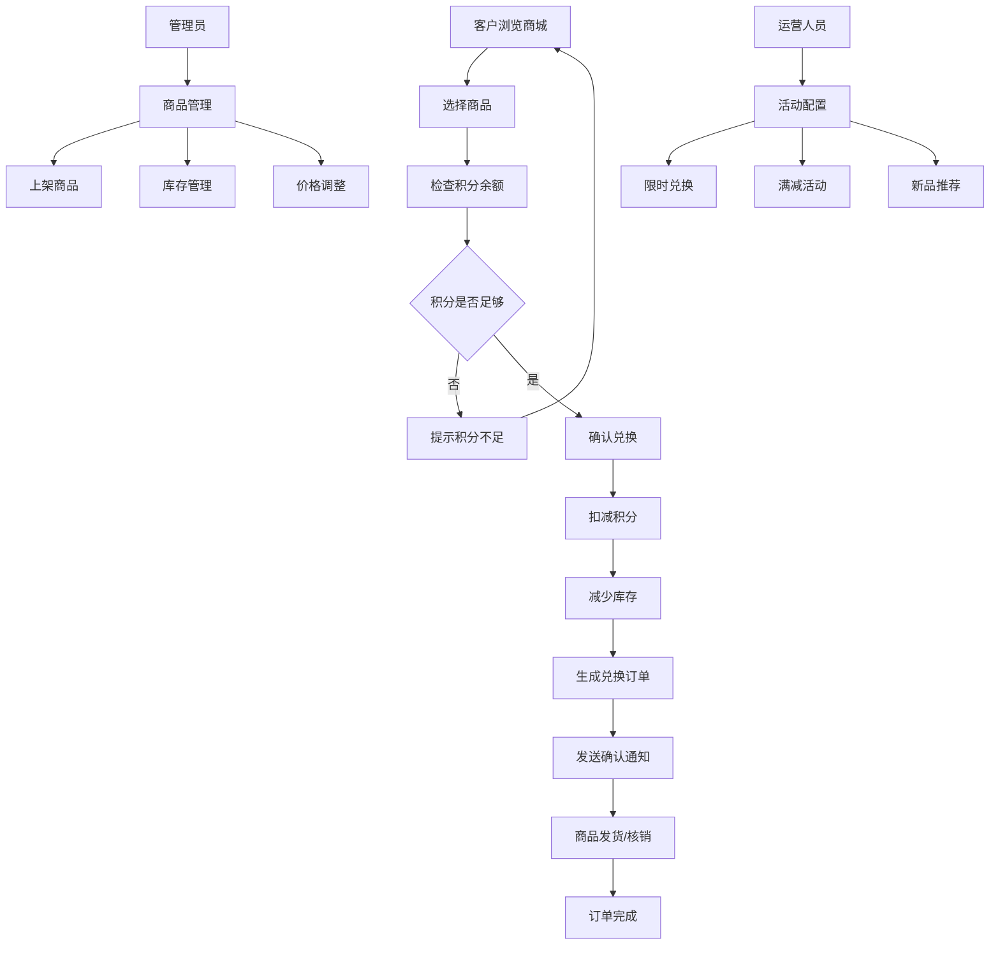

# 积分商城模块设计

## 1. 模块概述

积分商城模块是客户忠诚度管理系统的重要组成部分，为客户提供积分兑换商品和服务的平台。该模块通过丰富的商品选择和灵活的兑换规则，提升客户粘性和活跃度。

### 1.1 功能目标

- **商品管理**：支持多种类型商品的上架、下架、库存管理
- **兑换流程**：提供完整的积分兑换流程，包括商品选择、积分抵扣、订单生成
- **库存控制**：实时库存管理，防止超卖
- **活动营销**：支持限时兑换、满减活动等营销功能
- **订单管理**：完整的兑换订单生命周期管理
- **数据统计**：商品兑换数据分析和报表

### 1.2 业务流程



## 2. 数据库设计

### 2.1 商品表 (mall_products)

```sql
CREATE TABLE mall_products (
    id BIGINT PRIMARY KEY AUTO_INCREMENT,
    product_code VARCHAR(50) NOT NULL UNIQUE COMMENT '商品编码',
    name VARCHAR(200) NOT NULL COMMENT '商品名称',
    description TEXT COMMENT '商品描述',
    category_id BIGINT NOT NULL COMMENT '分类ID',
    brand VARCHAR(100) COMMENT '品牌',
    
    -- 积分价格信息
    point_price INT NOT NULL COMMENT '积分价格',
    cash_price DECIMAL(10,2) DEFAULT 0 COMMENT '现金价格（积分+现金模式）',
    original_price DECIMAL(10,2) COMMENT '原价（用于显示优惠）',
    
    -- 库存信息
    stock_quantity INT NOT NULL DEFAULT 0 COMMENT '库存数量',
    sold_quantity INT NOT NULL DEFAULT 0 COMMENT '已售数量',
    virtual_stock BOOLEAN DEFAULT FALSE COMMENT '是否虚拟库存',
    
    -- 商品属性
    product_type ENUM('physical', 'virtual', 'service', 'coupon') NOT NULL COMMENT '商品类型',
    weight DECIMAL(8,2) COMMENT '重量（kg）',
    dimensions VARCHAR(100) COMMENT '尺寸',
    
    -- 显示信息
    main_image VARCHAR(500) COMMENT '主图片',
    image_gallery JSON COMMENT '图片集合',
    video_url VARCHAR(500) COMMENT '视频链接',
    
    -- 销售控制
    status ENUM('draft', 'active', 'inactive', 'sold_out') NOT NULL DEFAULT 'draft' COMMENT '状态',
    is_featured BOOLEAN DEFAULT FALSE COMMENT '是否推荐',
    is_limited BOOLEAN DEFAULT FALSE COMMENT '是否限量',
    limit_per_user INT COMMENT '每人限购数量',
    
    -- 时间控制
    sale_start_time DATETIME COMMENT '开售时间',
    sale_end_time DATETIME COMMENT '结束时间',
    
    -- 客户等级限制
    min_customer_level INT COMMENT '最低客户等级要求',
    allowed_customer_levels JSON COMMENT '允许的客户等级',
    
    -- SEO信息
    seo_title VARCHAR(200) COMMENT 'SEO标题',
    seo_description TEXT COMMENT 'SEO描述',
    seo_keywords VARCHAR(500) COMMENT 'SEO关键词',
    
    -- 统计信息
    view_count INT DEFAULT 0 COMMENT '浏览次数',
    exchange_count INT DEFAULT 0 COMMENT '兑换次数',
    rating DECIMAL(3,2) DEFAULT 0 COMMENT '评分',
    review_count INT DEFAULT 0 COMMENT '评价数量',
    
    -- 系统字段
    sort_order INT DEFAULT 0 COMMENT '排序',
    created_by BIGINT COMMENT '创建人',
    updated_by BIGINT COMMENT '更新人',
    created_at TIMESTAMP DEFAULT CURRENT_TIMESTAMP,
    updated_at TIMESTAMP DEFAULT CURRENT_TIMESTAMP ON UPDATE CURRENT_TIMESTAMP,
    
    INDEX idx_category_status (category_id, status),
    INDEX idx_point_price (point_price),
    INDEX idx_sale_time (sale_start_time, sale_end_time),
    INDEX idx_featured_status (is_featured, status),
    INDEX idx_product_code (product_code)
);
```

### 2.2 商品分类表 (mall_categories)

```sql
CREATE TABLE mall_categories (
    id BIGINT PRIMARY KEY AUTO_INCREMENT,
    name VARCHAR(100) NOT NULL COMMENT '分类名称',
    parent_id BIGINT DEFAULT 0 COMMENT '父分类ID',
    level INT NOT NULL DEFAULT 1 COMMENT '分类层级',
    path VARCHAR(500) COMMENT '分类路径',
    
    description TEXT COMMENT '分类描述',
    icon VARCHAR(200) COMMENT '分类图标',
    banner_image VARCHAR(500) COMMENT '分类横幅图',
    
    status ENUM('active', 'inactive') DEFAULT 'active' COMMENT '状态',
    sort_order INT DEFAULT 0 COMMENT '排序',
    
    -- SEO信息
    seo_title VARCHAR(200) COMMENT 'SEO标题',
    seo_description TEXT COMMENT 'SEO描述',
    
    created_at TIMESTAMP DEFAULT CURRENT_TIMESTAMP,
    updated_at TIMESTAMP DEFAULT CURRENT_TIMESTAMP ON UPDATE CURRENT_TIMESTAMP,
    
    INDEX idx_parent_status (parent_id, status),
    INDEX idx_level_sort (level, sort_order)
);
```

### 2.3 兑换订单表 (mall_orders)

```sql
CREATE TABLE mall_orders (
    id BIGINT PRIMARY KEY AUTO_INCREMENT,
    order_no VARCHAR(32) NOT NULL UNIQUE COMMENT '订单号',
    customer_id BIGINT NOT NULL COMMENT '客户ID',
    
    -- 订单金额
    total_points INT NOT NULL COMMENT '总积分',
    total_cash DECIMAL(10,2) DEFAULT 0 COMMENT '总现金',
    discount_points INT DEFAULT 0 COMMENT '优惠积分',
    final_points INT NOT NULL COMMENT '实付积分',
    final_cash DECIMAL(10,2) DEFAULT 0 COMMENT '实付现金',
    
    -- 订单状态
    status ENUM('pending', 'paid', 'processing', 'shipped', 'delivered', 'completed', 'cancelled', 'refunded') 
           NOT NULL DEFAULT 'pending' COMMENT '订单状态',
    
    -- 收货信息
    receiver_name VARCHAR(100) COMMENT '收货人姓名',
    receiver_phone VARCHAR(15) COMMENT '收货人电话',
    receiver_address TEXT COMMENT '收货地址',
    delivery_method ENUM('express', 'pickup', 'virtual') COMMENT '配送方式',
    
    -- 物流信息
    shipping_company VARCHAR(100) COMMENT '物流公司',
    tracking_number VARCHAR(100) COMMENT '物流单号',
    shipped_at DATETIME COMMENT '发货时间',
    delivered_at DATETIME COMMENT '签收时间',
    
    -- 备注信息
    customer_note TEXT COMMENT '客户备注',
    admin_note TEXT COMMENT '管理员备注',
    
    -- 活动信息
    activity_id BIGINT COMMENT '参与的活动ID',
    activity_type VARCHAR(50) COMMENT '活动类型',
    
    -- 时间信息
    paid_at DATETIME COMMENT '支付时间',
    completed_at DATETIME COMMENT '完成时间',
    cancelled_at DATETIME COMMENT '取消时间',
    
    created_at TIMESTAMP DEFAULT CURRENT_TIMESTAMP,
    updated_at TIMESTAMP DEFAULT CURRENT_TIMESTAMP ON UPDATE CURRENT_TIMESTAMP,
    
    INDEX idx_customer_status (customer_id, status),
    INDEX idx_order_no (order_no),
    INDEX idx_status_created (status, created_at),
    INDEX idx_activity (activity_id, activity_type)
);
```

### 2.4 订单商品表 (mall_order_items)

```sql
CREATE TABLE mall_order_items (
    id BIGINT PRIMARY KEY AUTO_INCREMENT,
    order_id BIGINT NOT NULL COMMENT '订单ID',
    product_id BIGINT NOT NULL COMMENT '商品ID',
    
    -- 商品信息快照
    product_code VARCHAR(50) NOT NULL COMMENT '商品编码',
    product_name VARCHAR(200) NOT NULL COMMENT '商品名称',
    product_image VARCHAR(500) COMMENT '商品图片',
    
    -- 价格信息
    point_price INT NOT NULL COMMENT '积分单价',
    cash_price DECIMAL(10,2) DEFAULT 0 COMMENT '现金单价',
    quantity INT NOT NULL COMMENT '数量',
    total_points INT NOT NULL COMMENT '总积分',
    total_cash DECIMAL(10,2) DEFAULT 0 COMMENT '总现金',
    
    -- 商品规格
    specifications JSON COMMENT '商品规格',
    
    -- 核销信息（虚拟商品）
    verification_code VARCHAR(100) COMMENT '核销码',
    verification_status ENUM('pending', 'verified', 'expired') COMMENT '核销状态',
    verified_at DATETIME COMMENT '核销时间',
    verified_by BIGINT COMMENT '核销人',
    
    created_at TIMESTAMP DEFAULT CURRENT_TIMESTAMP,
    
    INDEX idx_order_id (order_id),
    INDEX idx_product_id (product_id),
    INDEX idx_verification_code (verification_code)
);
```

### 2.5 商城活动表 (mall_activities)

```sql
CREATE TABLE mall_activities (
    id BIGINT PRIMARY KEY AUTO_INCREMENT,
    name VARCHAR(200) NOT NULL COMMENT '活动名称',
    type ENUM('discount', 'limited_time', 'new_user', 'level_exclusive', 'bundle') NOT NULL COMMENT '活动类型',
    description TEXT COMMENT '活动描述',
    
    -- 活动规则
    rules JSON NOT NULL COMMENT '活动规则配置',
    
    -- 时间设置
    start_time DATETIME NOT NULL COMMENT '开始时间',
    end_time DATETIME NOT NULL COMMENT '结束时间',
    
    -- 参与限制
    max_participants INT COMMENT '最大参与人数',
    current_participants INT DEFAULT 0 COMMENT '当前参与人数',
    max_per_user INT COMMENT '每人最大参与次数',
    
    -- 客户限制
    customer_levels JSON COMMENT '允许的客户等级',
    new_user_only BOOLEAN DEFAULT FALSE COMMENT '仅限新用户',
    
    -- 商品范围
    product_scope ENUM('all', 'category', 'specific') NOT NULL COMMENT '商品范围',
    included_categories JSON COMMENT '包含的分类',
    included_products JSON COMMENT '包含的商品',
    excluded_products JSON COMMENT '排除的商品',
    
    -- 状态控制
    status ENUM('draft', 'active', 'paused', 'ended') NOT NULL DEFAULT 'draft' COMMENT '状态',
    auto_start BOOLEAN DEFAULT FALSE COMMENT '自动开始',
    auto_end BOOLEAN DEFAULT FALSE COMMENT '自动结束',
    
    -- 显示设置
    banner_image VARCHAR(500) COMMENT '活动横幅',
    priority INT DEFAULT 0 COMMENT '优先级',
    
    created_by BIGINT COMMENT '创建人',
    created_at TIMESTAMP DEFAULT CURRENT_TIMESTAMP,
    updated_at TIMESTAMP DEFAULT CURRENT_TIMESTAMP ON UPDATE CURRENT_TIMESTAMP,
    
    INDEX idx_type_status (type, status),
    INDEX idx_time_range (start_time, end_time),
    INDEX idx_priority_status (priority, status)
);
```

### 2.6 库存记录表 (mall_stock_records)

```sql
CREATE TABLE mall_stock_records (
    id BIGINT PRIMARY KEY AUTO_INCREMENT,
    product_id BIGINT NOT NULL COMMENT '商品ID',
    type ENUM('in', 'out', 'adjust', 'freeze', 'unfreeze') NOT NULL COMMENT '变动类型',
    quantity INT NOT NULL COMMENT '变动数量',
    before_quantity INT NOT NULL COMMENT '变动前数量',
    after_quantity INT NOT NULL COMMENT '变动后数量',
    
    -- 关联信息
    related_type ENUM('order', 'manual', 'system', 'return') COMMENT '关联类型',
    related_id BIGINT COMMENT '关联ID',
    
    reason VARCHAR(500) COMMENT '变动原因',
    operator_id BIGINT COMMENT '操作人ID',
    operator_type ENUM('admin', 'system') COMMENT '操作人类型',
    
    created_at TIMESTAMP DEFAULT CURRENT_TIMESTAMP,
    
    INDEX idx_product_type (product_id, type),
    INDEX idx_related (related_type, related_id),
    INDEX idx_created_at (created_at)
);
```

### 2.7 商品评价表 (mall_reviews)

```sql
CREATE TABLE mall_reviews (
    id BIGINT PRIMARY KEY AUTO_INCREMENT,
    product_id BIGINT NOT NULL COMMENT '商品ID',
    customer_id BIGINT NOT NULL COMMENT '客户ID',
    order_id BIGINT NOT NULL COMMENT '订单ID',
    
    rating INT NOT NULL COMMENT '评分(1-5)',
    content TEXT COMMENT '评价内容',
    images JSON COMMENT '评价图片',
    
    -- 管理字段
    status ENUM('pending', 'approved', 'rejected') DEFAULT 'pending' COMMENT '审核状态',
    admin_reply TEXT COMMENT '管理员回复',
    
    -- 统计字段
    helpful_count INT DEFAULT 0 COMMENT '有用数',
    
    created_at TIMESTAMP DEFAULT CURRENT_TIMESTAMP,
    updated_at TIMESTAMP DEFAULT CURRENT_TIMESTAMP ON UPDATE CURRENT_TIMESTAMP,
    
    INDEX idx_product_status (product_id, status),
    INDEX idx_customer_id (customer_id),
    INDEX idx_rating (rating),
    UNIQUE KEY uk_customer_order (customer_id, order_id)
);
```

## 3. API接口设计

### 3.1 商品管理接口

#### 3.1.1 获取商品列表

```typescript
// GET /api/mall/products
interface GetProductsRequest {
  categoryId?: number;
  keyword?: string;
  minPoints?: number;
  maxPoints?: number;
  productType?: 'physical' | 'virtual' | 'service' | 'coupon';
  isFeatured?: boolean;
  status?: 'active' | 'inactive';
  sortBy?: 'price' | 'sales' | 'rating' | 'created_at';
  sortOrder?: 'asc' | 'desc';
  page?: number;
  size?: number;
}

interface GetProductsResponse {
  code: number;
  message: string;
  data: {
    products: Product[];
    pagination: {
      total: number;
      page: number;
      size: number;
      totalPages: number;
    };
    filters: {
      categories: Category[];
      priceRange: {
        min: number;
        max: number;
      };
    };
  };
}
```

#### 3.1.2 获取商品详情

```typescript
// GET /api/mall/products/:id
interface GetProductDetailResponse {
  code: number;
  message: string;
  data: {
    product: ProductDetail;
    relatedProducts: Product[];
    reviews: {
      summary: {
        averageRating: number;
        totalReviews: number;
        ratingDistribution: Record<string, number>;
      };
      reviews: Review[];
    };
    stock: {
      available: number;
      reserved: number;
    };
  };
}
```

#### 3.1.3 创建商品

```typescript
// POST /api/admin/mall/products
interface CreateProductRequest {
  productCode: string;
  name: string;
  description: string;
  categoryId: number;
  brand?: string;
  pointPrice: number;
  cashPrice?: number;
  originalPrice?: number;
  stockQuantity: number;
  virtualStock?: boolean;
  productType: 'physical' | 'virtual' | 'service' | 'coupon';
  weight?: number;
  dimensions?: string;
  mainImage: string;
  imageGallery?: string[];
  videoUrl?: string;
  isLimited?: boolean;
  limitPerUser?: number;
  saleStartTime?: string;
  saleEndTime?: string;
  minCustomerLevel?: number;
  allowedCustomerLevels?: number[];
  seoTitle?: string;
  seoDescription?: string;
  seoKeywords?: string;
}
```

### 3.2 购物车接口

#### 3.2.1 添加到购物车

```typescript
// POST /api/mall/cart/add
interface AddToCartRequest {
  productId: number;
  quantity: number;
  specifications?: Record<string, any>;
}

interface AddToCartResponse {
  code: number;
  message: string;
  data: {
    cartItem: CartItem;
    cartSummary: {
      totalItems: number;
      totalPoints: number;
      totalCash: number;
    };
  };
}
```

#### 3.2.2 获取购物车

```typescript
// GET /api/mall/cart
interface GetCartResponse {
  code: number;
  message: string;
  data: {
    items: CartItem[];
    summary: {
      totalItems: number;
      totalPoints: number;
      totalCash: number;
      availablePoints: number;
      applicableActivities: Activity[];
    };
  };
}
```

### 3.3 订单接口

#### 3.3.1 创建订单

```typescript
// POST /api/mall/orders
interface CreateOrderRequest {
  items: {
    productId: number;
    quantity: number;
    specifications?: Record<string, any>;
  }[];
  receiverInfo?: {
    name: string;
    phone: string;
    address: string;
  };
  deliveryMethod: 'express' | 'pickup' | 'virtual';
  customerNote?: string;
  activityId?: number;
  usePoints: number;
  useCash?: number;
}

interface CreateOrderResponse {
  code: number;
  message: string;
  data: {
    order: Order;
    paymentInfo?: {
      paymentUrl?: string;
      qrCode?: string;
    };
  };
}
```

#### 3.3.2 获取订单列表

```typescript
// GET /api/mall/orders
interface GetOrdersRequest {
  status?: string;
  startDate?: string;
  endDate?: string;
  page?: number;
  size?: number;
}

interface GetOrdersResponse {
  code: number;
  message: string;
  data: {
    orders: Order[];
    pagination: PaginationInfo;
    statistics: {
      totalOrders: number;
      totalPoints: number;
      statusCounts: Record<string, number>;
    };
  };
}
```

### 3.4 活动接口

#### 3.4.1 获取活动列表

```typescript
// GET /api/mall/activities
interface GetActivitiesResponse {
  code: number;
  message: string;
  data: {
    activities: Activity[];
    featured: Activity[];
    upcoming: Activity[];
  };
}
```

#### 3.4.2 参与活动

```typescript
// POST /api/mall/activities/:id/participate
interface ParticipateActivityRequest {
  productIds?: number[];
  quantity?: number;
}

interface ParticipateActivityResponse {
  code: number;
  message: string;
  data: {
    success: boolean;
    discount: {
      pointsDiscount: number;
      cashDiscount: number;
    };
    message: string;
  };
}
```

## 4. 核心业务逻辑

### 4.1 商城服务 (MallService)

```typescript
// services/MallService.ts
class MallService {
  constructor(
    private productRepo: ProductRepository,
    private orderRepo: OrderRepository,
    private stockRepo: StockRepository,
    private pointService: PointService,
    private activityService: ActivityService,
    private notificationService: NotificationService
  ) {}

  // 获取商品列表
  async getProducts(query: GetProductsQuery): Promise<ProductListResult> {
    const { categoryId, keyword, minPoints, maxPoints, productType, page, size } = query;
    
    // 构建查询条件
    const conditions: any = {
      status: 'active'
    };

    if (categoryId) {
      conditions.categoryId = categoryId;
    }

    if (keyword) {
      conditions.$or = [
        { name: { $like: `%${keyword}%` } },
        { description: { $like: `%${keyword}%` } }
      ];
    }

    if (minPoints || maxPoints) {
      conditions.pointPrice = {};
      if (minPoints) conditions.pointPrice.$gte = minPoints;
      if (maxPoints) conditions.pointPrice.$lte = maxPoints;
    }

    if (productType) {
      conditions.productType = productType;
    }

    // 检查时间限制
    const now = new Date();
    conditions.$and = [
      {
        $or: [
          { saleStartTime: null },
          { saleStartTime: { $lte: now } }
        ]
      },
      {
        $or: [
          { saleEndTime: null },
          { saleEndTime: { $gte: now } }
        ]
      }
    ];

    const products = await this.productRepo.findWithPagination(conditions, page, size);
    
    // 获取库存信息
    for (const product of products.data) {
      product.stockInfo = await this.getProductStock(product.id);
    }

    return products;
  }

  // 获取商品详情
  async getProductDetail(productId: number, customerId?: number): Promise<ProductDetail> {
    const product = await this.productRepo.findById(productId);
    
    if (!product) {
      throw new Error('商品不存在');
    }

    // 检查商品状态
    if (product.status !== 'active') {
      throw new Error('商品已下架');
    }

    // 检查销售时间
    const now = new Date();
    if (product.saleStartTime && product.saleStartTime > now) {
      throw new Error('商品尚未开售');
    }

    if (product.saleEndTime && product.saleEndTime < now) {
      throw new Error('商品销售已结束');
    }

    // 检查客户等级权限
    if (customerId && product.minCustomerLevel) {
      const customer = await this.customerService.getCustomer(customerId);
      if (customer.level < product.minCustomerLevel) {
        throw new Error('客户等级不足');
      }
    }

    // 获取库存信息
    product.stockInfo = await this.getProductStock(productId);

    // 获取相关商品
    product.relatedProducts = await this.getRelatedProducts(productId, product.categoryId);

    // 获取评价信息
    product.reviews = await this.getProductReviews(productId);

    // 记录浏览次数
    await this.productRepo.incrementViewCount(productId);

    return product;
  }

  // 添加到购物车
  async addToCart(customerId: number, request: AddToCartRequest): Promise<CartItem> {
    const { productId, quantity, specifications } = request;

    // 验证商品
    const product = await this.getProductDetail(productId, customerId);

    // 检查库存
    if (!product.virtualStock && product.stockInfo.available < quantity) {
      throw new Error('库存不足');
    }

    // 检查限购
    if (product.limitPerUser) {
      const userPurchased = await this.orderRepo.getUserProductQuantity(customerId, productId);
      if (userPurchased + quantity > product.limitPerUser) {
        throw new Error(`每人限购${product.limitPerUser}件`);
      }
    }

    // 添加到购物车
    const cartItem = await this.cartService.addItem(customerId, {
      productId,
      quantity,
      specifications,
      pointPrice: product.pointPrice,
      cashPrice: product.cashPrice
    });

    return cartItem;
  }

  // 创建订单
  async createOrder(customerId: number, request: CreateOrderRequest): Promise<Order> {
    const { items, receiverInfo, deliveryMethod, customerNote, activityId, usePoints, useCash } = request;

    // 验证客户积分余额
    const customerPoints = await this.pointService.getCustomerPoints(customerId);
    if (customerPoints < usePoints) {
      throw new Error('积分余额不足');
    }

    // 验证商品和库存
    const orderItems: OrderItem[] = [];
    let totalPoints = 0;
    let totalCash = 0;

    for (const item of items) {
      const product = await this.getProductDetail(item.productId, customerId);
      
      // 检查库存
      if (!product.virtualStock && product.stockInfo.available < item.quantity) {
        throw new Error(`商品"${product.name}"库存不足`);
      }

      const itemPoints = product.pointPrice * item.quantity;
      const itemCash = (product.cashPrice || 0) * item.quantity;

      orderItems.push({
        productId: item.productId,
        productCode: product.productCode,
        productName: product.name,
        productImage: product.mainImage,
        pointPrice: product.pointPrice,
        cashPrice: product.cashPrice || 0,
        quantity: item.quantity,
        totalPoints: itemPoints,
        totalCash: itemCash,
        specifications: item.specifications
      });

      totalPoints += itemPoints;
      totalCash += itemCash;
    }

    // 应用活动优惠
    let discountPoints = 0;
    let discountCash = 0;

    if (activityId) {
      const discount = await this.activityService.calculateDiscount(
        activityId, customerId, orderItems
      );
      discountPoints = discount.pointsDiscount;
      discountCash = discount.cashDiscount;
    }

    const finalPoints = totalPoints - discountPoints;
    const finalCash = totalCash - discountCash;

    // 验证支付金额
    if (usePoints !== finalPoints || (useCash || 0) !== finalCash) {
      throw new Error('支付金额不正确');
    }

    // 开始事务
    return await this.db.transaction(async (trx) => {
      // 创建订单
      const order = await this.orderRepo.create({
        orderNo: this.generateOrderNo(),
        customerId,
        totalPoints,
        totalCash,
        discountPoints,
        finalPoints,
        finalCash,
        status: 'pending',
        receiverName: receiverInfo?.name,
        receiverPhone: receiverInfo?.phone,
        receiverAddress: receiverInfo?.address,
        deliveryMethod,
        customerNote,
        activityId
      }, trx);

      // 创建订单商品
      for (const item of orderItems) {
        await this.orderItemRepo.create({
          ...item,
          orderId: order.id
        }, trx);
      }

      // 扣减积分
      await this.pointService.deductPoints(customerId, finalPoints, {
        source: 'mall_exchange',
        businessType: 'mall_order',
        businessId: order.id,
        description: `商城兑换订单：${order.orderNo}`
      }, trx);

      // 扣减库存
      for (const item of orderItems) {
        const product = await this.productRepo.findById(item.productId);
        if (!product.virtualStock) {
          await this.stockService.decreaseStock(
            item.productId,
            item.quantity,
            'order',
            order.id,
            trx
          );
        }
      }

      // 更新订单状态为已支付
      await this.orderRepo.updateStatus(order.id, 'paid', trx);

      // 发送通知
      await this.notificationService.sendOrderConfirmation(customerId, order);

      // 发布事件
      await this.eventBus.publish('mall.order.created', {
        orderId: order.id,
        customerId,
        totalPoints: finalPoints,
        items: orderItems
      });

      return order;
    });
  }

  // 处理订单发货
  async shipOrder(orderId: number, shippingInfo: ShippingInfo): Promise<void> {
    const order = await this.orderRepo.findById(orderId);
    
    if (!order) {
      throw new Error('订单不存在');
    }

    if (order.status !== 'paid') {
      throw new Error('订单状态不正确');
    }

    // 更新订单状态和物流信息
    await this.orderRepo.update(orderId, {
      status: 'shipped',
      shippingCompany: shippingInfo.company,
      trackingNumber: shippingInfo.trackingNumber,
      shippedAt: new Date()
    });

    // 发送发货通知
    await this.notificationService.sendShippingNotification(order.customerId, order, shippingInfo);

    // 发布事件
    await this.eventBus.publish('mall.order.shipped', {
      orderId,
      customerId: order.customerId,
      shippingInfo
    });
  }

  // 确认收货
  async confirmDelivery(orderId: number, customerId: number): Promise<void> {
    const order = await this.orderRepo.findById(orderId);
    
    if (!order) {
      throw new Error('订单不存在');
    }

    if (order.customerId !== customerId) {
      throw new Error('无权操作此订单');
    }

    if (order.status !== 'shipped') {
      throw new Error('订单状态不正确');
    }

    // 更新订单状态
    await this.orderRepo.update(orderId, {
      status: 'delivered',
      deliveredAt: new Date()
    });

    // 发布事件
    await this.eventBus.publish('mall.order.delivered', {
      orderId,
      customerId
    });
  }

  // 完成订单
  async completeOrder(orderId: number): Promise<void> {
    const order = await this.orderRepo.findById(orderId);
    
    if (!order) {
      throw new Error('订单不存在');
    }

    if (order.status !== 'delivered') {
      throw new Error('订单状态不正确');
    }

    // 更新订单状态
    await this.orderRepo.update(orderId, {
      status: 'completed',
      completedAt: new Date()
    });

    // 更新商品销量
    const orderItems = await this.orderItemRepo.findByOrderId(orderId);
    for (const item of orderItems) {
      await this.productRepo.incrementSoldQuantity(item.productId, item.quantity);
    }

    // 发布事件
    await this.eventBus.publish('mall.order.completed', {
      orderId,
      customerId: order.customerId,
      items: orderItems
    });
  }

  // 取消订单
  async cancelOrder(orderId: number, customerId: number, reason: string): Promise<void> {
    const order = await this.orderRepo.findById(orderId);
    
    if (!order) {
      throw new Error('订单不存在');
    }

    if (order.customerId !== customerId) {
      throw new Error('无权操作此订单');
    }

    if (!['pending', 'paid'].includes(order.status)) {
      throw new Error('订单状态不允许取消');
    }

    await this.db.transaction(async (trx) => {
      // 更新订单状态
      await this.orderRepo.update(orderId, {
        status: 'cancelled',
        cancelledAt: new Date(),
        adminNote: reason
      }, trx);

      // 退还积分
      if (order.status === 'paid') {
        await this.pointService.grantPoints(customerId, order.finalPoints, {
          source: 'mall_refund',
          businessType: 'mall_order',
          businessId: orderId,
          description: `订单取消退还积分：${order.orderNo}`
        }, trx);
      }

      // 恢复库存
      const orderItems = await this.orderItemRepo.findByOrderId(orderId);
      for (const item of orderItems) {
        const product = await this.productRepo.findById(item.productId);
        if (!product.virtualStock) {
          await this.stockService.increaseStock(
            item.productId,
            item.quantity,
            'return',
            orderId,
            trx
          );
        }
      }
    });

    // 发送通知
    await this.notificationService.sendOrderCancellation(customerId, order);

    // 发布事件
    await this.eventBus.publish('mall.order.cancelled', {
      orderId,
      customerId,
      reason
    });
  }

  // 获取商品库存
  private async getProductStock(productId: number): Promise<StockInfo> {
    const product = await this.productRepo.findById(productId);
    
    if (product.virtualStock) {
      return {
        available: 999999,
        reserved: 0,
        total: 999999
      };
    }

    const reserved = await this.orderRepo.getReservedStock(productId);
    
    return {
      available: Math.max(0, product.stockQuantity - reserved),
      reserved,
      total: product.stockQuantity
    };
  }

  // 获取相关商品
  private async getRelatedProducts(productId: number, categoryId: number): Promise<Product[]> {
    return await this.productRepo.findRelatedProducts(productId, categoryId, 8);
  }

  // 获取商品评价
  private async getProductReviews(productId: number): Promise<ReviewSummary> {
    const reviews = await this.reviewRepo.findByProductId(productId, 1, 10);
    const summary = await this.reviewRepo.getReviewSummary(productId);
    
    return {
      summary,
      reviews: reviews.data
    };
  }

  // 生成订单号
  private generateOrderNo(): string {
    const timestamp = Date.now().toString();
    const random = Math.random().toString(36).substring(2, 8);
    return `ML${timestamp}${random}`.toUpperCase();
  }
 }
 ```

## 7. 安全与权限

### 7.1 权限控制

#### 7.1.1 角色权限设计

```typescript
// middleware/MallPermissionMiddleware.ts
class MallPermissionMiddleware {
  private permissions = {
    // 商品管理权限
    'mall:product:view': ['admin', 'mall_manager', 'mall_operator'],
    'mall:product:create': ['admin', 'mall_manager'],
    'mall:product:edit': ['admin', 'mall_manager'],
    'mall:product:delete': ['admin', 'mall_manager'],
    'mall:product:publish': ['admin', 'mall_manager'],

    // 订单管理权限
    'mall:order:view': ['admin', 'mall_manager', 'mall_operator', 'customer_service'],
    'mall:order:edit': ['admin', 'mall_manager', 'customer_service'],
    'mall:order:cancel': ['admin', 'mall_manager', 'customer_service'],
    'mall:order:refund': ['admin', 'mall_manager'],

    // 库存管理权限
    'mall:stock:view': ['admin', 'mall_manager', 'mall_operator'],
    'mall:stock:edit': ['admin', 'mall_manager'],
    'mall:stock:import': ['admin', 'mall_manager'],

    // 活动管理权限
    'mall:activity:view': ['admin', 'mall_manager', 'mall_operator'],
    'mall:activity:create': ['admin', 'mall_manager'],
    'mall:activity:edit': ['admin', 'mall_manager'],
    'mall:activity:delete': ['admin', 'mall_manager'],

    // 数据统计权限
    'mall:stats:view': ['admin', 'mall_manager'],
    'mall:stats:export': ['admin', 'mall_manager'],

    // 客户权限
    'mall:customer:browse': ['customer'],
    'mall:customer:purchase': ['customer'],
    'mall:customer:review': ['customer']
  };

  checkPermission(permission: string, userRoles: string[]): boolean {
    const allowedRoles = this.permissions[permission];
    if (!allowedRoles) {
      return false;
    }

    return userRoles.some(role => allowedRoles.includes(role));
  }

  middleware(permission: string) {
    return (req: Request, res: Response, next: NextFunction) => {
      const user = req.user;
      
      if (!user) {
        return res.status(401).json({
          code: 401,
          message: '未登录'
        });
      }

      if (!this.checkPermission(permission, user.roles)) {
        return res.status(403).json({
          code: 403,
          message: '权限不足'
        });
      }

      next();
    };
  }
}
```

#### 7.1.2 数据权限控制

```typescript
// services/MallDataPermissionService.ts
class MallDataPermissionService {
  constructor(private userService: UserService) {}

  // 商品数据权限过滤
  async filterProductsByPermission(userId: number, products: Product[]): Promise<Product[]> {
    const user = await this.userService.getUserById(userId);
    
    if (!user) {
      return [];
    }

    // 管理员可以查看所有商品
    if (user.roles.includes('admin')) {
      return products;
    }

    // 商城管理员可以查看所有商品
    if (user.roles.includes('mall_manager')) {
      return products;
    }

    // 商城操作员只能查看已发布的商品
    if (user.roles.includes('mall_operator')) {
      return products.filter(product => product.status === 'active');
    }

    // 普通客户只能查看已发布且在销售期内的商品
    const now = new Date();
    return products.filter(product => 
      product.status === 'active' &&
      (!product.saleStartTime || product.saleStartTime <= now) &&
      (!product.saleEndTime || product.saleEndTime >= now)
    );
  }

  // 订单数据权限过滤
  async filterOrdersByPermission(userId: number, orders: Order[]): Promise<Order[]> {
    const user = await this.userService.getUserById(userId);
    
    if (!user) {
      return [];
    }

    // 管理员和商城管理员可以查看所有订单
    if (user.roles.includes('admin') || user.roles.includes('mall_manager')) {
      return orders;
    }

    // 客服可以查看所有订单
    if (user.roles.includes('customer_service')) {
      return orders;
    }

    // 普通客户只能查看自己的订单
    return orders.filter(order => order.customerId === userId);
  }

  // 检查商品操作权限
  async canOperateProduct(userId: number, productId: number, operation: string): Promise<boolean> {
    const user = await this.userService.getUserById(userId);
    const product = await this.productService.getProductById(productId);
    
    if (!user || !product) {
      return false;
    }

    // 管理员可以操作所有商品
    if (user.roles.includes('admin')) {
      return true;
    }

    // 商城管理员可以操作所有商品
    if (user.roles.includes('mall_manager')) {
      return true;
    }

    // 商城操作员只能查看商品
    if (user.roles.includes('mall_operator')) {
      return operation === 'view';
    }

    return false;
  }

  // 检查订单操作权限
  async canOperateOrder(userId: number, orderId: number, operation: string): Promise<boolean> {
    const user = await this.userService.getUserById(userId);
    const order = await this.orderService.getOrderById(orderId);
    
    if (!user || !order) {
      return false;
    }

    // 管理员可以操作所有订单
    if (user.roles.includes('admin')) {
      return true;
    }

    // 商城管理员可以操作所有订单
    if (user.roles.includes('mall_manager')) {
      return true;
    }

    // 客服可以查看和编辑订单
    if (user.roles.includes('customer_service')) {
      return ['view', 'edit', 'cancel'].includes(operation);
    }

    // 客户只能查看自己的订单
    if (order.customerId === userId) {
      return operation === 'view';
    }

    return false;
  }
}
```

### 7.2 数据加密

#### 7.2.1 敏感数据加密

```typescript
// utils/EncryptionUtil.ts
import crypto from 'crypto';

class EncryptionUtil {
  private static readonly ALGORITHM = 'aes-256-gcm';
  private static readonly KEY_LENGTH = 32;
  private static readonly IV_LENGTH = 16;
  private static readonly TAG_LENGTH = 16;

  // 生成密钥
  static generateKey(): string {
    return crypto.randomBytes(this.KEY_LENGTH).toString('hex');
  }

  // 加密数据
  static encrypt(text: string, key: string): string {
    const keyBuffer = Buffer.from(key, 'hex');
    const iv = crypto.randomBytes(this.IV_LENGTH);
    const cipher = crypto.createCipher(this.ALGORITHM, keyBuffer);
    cipher.setAAD(Buffer.from('mall-data'));

    let encrypted = cipher.update(text, 'utf8', 'hex');
    encrypted += cipher.final('hex');

    const tag = cipher.getAuthTag();
    
    return iv.toString('hex') + ':' + tag.toString('hex') + ':' + encrypted;
  }

  // 解密数据
  static decrypt(encryptedData: string, key: string): string {
    const keyBuffer = Buffer.from(key, 'hex');
    const parts = encryptedData.split(':');
    
    if (parts.length !== 3) {
      throw new Error('Invalid encrypted data format');
    }

    const iv = Buffer.from(parts[0], 'hex');
    const tag = Buffer.from(parts[1], 'hex');
    const encrypted = parts[2];

    const decipher = crypto.createDecipher(this.ALGORITHM, keyBuffer);
    decipher.setAAD(Buffer.from('mall-data'));
    decipher.setAuthTag(tag);

    let decrypted = decipher.update(encrypted, 'hex', 'utf8');
    decrypted += decipher.final('utf8');

    return decrypted;
  }

  // 哈希密码
  static hashPassword(password: string, salt?: string): { hash: string, salt: string } {
    const saltBuffer = salt ? Buffer.from(salt, 'hex') : crypto.randomBytes(16);
    const hash = crypto.pbkdf2Sync(password, saltBuffer, 10000, 64, 'sha512');
    
    return {
      hash: hash.toString('hex'),
      salt: saltBuffer.toString('hex')
    };
  }

  // 验证密码
  static verifyPassword(password: string, hash: string, salt: string): boolean {
    const { hash: computedHash } = this.hashPassword(password, salt);
    return computedHash === hash;
  }

  // 生成令牌
  static generateToken(length: number = 32): string {
    return crypto.randomBytes(length).toString('hex');
  }

  // 哈希数据
  static hashData(data: string): string {
    return crypto.createHash('sha256').update(data).digest('hex');
  }
}

// 敏感字段加密装饰器
function Encrypted(encryptionKey: string) {
  return function (target: any, propertyKey: string) {
    const privateKey = `_${propertyKey}`;
    
    Object.defineProperty(target, propertyKey, {
      get: function() {
        const encryptedValue = this[privateKey];
        if (!encryptedValue) return null;
        
        try {
          return EncryptionUtil.decrypt(encryptedValue, encryptionKey);
        } catch (error) {
          console.error('解密失败:', error);
          return null;
        }
      },
      set: function(value: string) {
        if (value) {
          this[privateKey] = EncryptionUtil.encrypt(value, encryptionKey);
        } else {
          this[privateKey] = null;
        }
      },
      enumerable: true,
      configurable: true
    });
  };
}
```

### 7.3 审计日志

#### 7.3.1 操作审计

```typescript
// services/MallAuditService.ts
class MallAuditService {
  constructor(private auditRepo: AuditLogRepository) {}

  // 记录商品操作
  async logProductOperation(
    userId: number,
    operation: string,
    productId: number,
    oldData?: any,
    newData?: any,
    ip?: string
  ): Promise<void> {
    const auditLog = {
      userId,
      module: 'mall_product',
      operation,
      resourceId: productId.toString(),
      oldData: oldData ? JSON.stringify(oldData) : null,
      newData: newData ? JSON.stringify(newData) : null,
      ip,
      userAgent: this.getCurrentUserAgent(),
      createdAt: new Date()
    };

    await this.auditRepo.create(auditLog);
  }

  // 记录订单操作
  async logOrderOperation(
    userId: number,
    operation: string,
    orderId: number,
    oldData?: any,
    newData?: any,
    ip?: string
  ): Promise<void> {
    const auditLog = {
      userId,
      module: 'mall_order',
      operation,
      resourceId: orderId.toString(),
      oldData: oldData ? JSON.stringify(oldData) : null,
      newData: newData ? JSON.stringify(newData) : null,
      ip,
      userAgent: this.getCurrentUserAgent(),
      createdAt: new Date()
    };

    await this.auditRepo.create(auditLog);
  }

  // 记录库存操作
  async logStockOperation(
    userId: number,
    operation: string,
    productId: number,
    quantity: number,
    reason: string,
    ip?: string
  ): Promise<void> {
    const auditLog = {
      userId,
      module: 'mall_stock',
      operation,
      resourceId: productId.toString(),
      newData: JSON.stringify({ quantity, reason }),
      ip,
      userAgent: this.getCurrentUserAgent(),
      createdAt: new Date()
    };

    await this.auditRepo.create(auditLog);
  }

  // 记录支付操作
  async logPaymentOperation(
    userId: number,
    operation: string,
    orderId: number,
    amount: number,
    paymentMethod: string,
    ip?: string
  ): Promise<void> {
    const auditLog = {
      userId,
      module: 'mall_payment',
      operation,
      resourceId: orderId.toString(),
      newData: JSON.stringify({ amount, paymentMethod }),
      ip,
      userAgent: this.getCurrentUserAgent(),
      createdAt: new Date()
    };

    await this.auditRepo.create(auditLog);
  }

  // 查询审计日志
  async getAuditLogs(filters: {
    userId?: number;
    module?: string;
    operation?: string;
    resourceId?: string;
    startDate?: Date;
    endDate?: Date;
    page?: number;
    size?: number;
  }): Promise<{ logs: AuditLog[], total: number }> {
    return await this.auditRepo.findWithFilters(filters);
  }

  // 生成审计报告
  async generateAuditReport(
    startDate: Date,
    endDate: Date,
    modules?: string[]
  ): Promise<AuditReport> {
    const logs = await this.auditRepo.findByDateRange(startDate, endDate, modules);
    
    const report: AuditReport = {
      period: { startDate, endDate },
      totalOperations: logs.length,
      operationsByModule: {},
      operationsByUser: {},
      suspiciousActivities: [],
      generatedAt: new Date()
    };

    // 按模块统计
    logs.forEach(log => {
      if (!report.operationsByModule[log.module]) {
        report.operationsByModule[log.module] = 0;
      }
      report.operationsByModule[log.module]++;
    });

    // 按用户统计
    logs.forEach(log => {
      if (!report.operationsByUser[log.userId]) {
        report.operationsByUser[log.userId] = 0;
      }
      report.operationsByUser[log.userId]++;
    });

    // 检测可疑活动
    report.suspiciousActivities = await this.detectSuspiciousActivities(logs);

    return report;
  }

  // 检测可疑活动
  private async detectSuspiciousActivities(logs: AuditLog[]): Promise<SuspiciousActivity[]> {
    const suspicious: SuspiciousActivity[] = [];

    // 检测频繁操作
    const userOperations = new Map<number, AuditLog[]>();
    logs.forEach(log => {
      if (!userOperations.has(log.userId)) {
        userOperations.set(log.userId, []);
      }
      userOperations.get(log.userId)!.push(log);
    });

    userOperations.forEach((userLogs, userId) => {
      // 检测短时间内大量操作
      const recentLogs = userLogs.filter(log => 
        Date.now() - log.createdAt.getTime() < 60 * 60 * 1000 // 1小时内
      );

      if (recentLogs.length > 100) { // 1小时内超过100次操作
        suspicious.push({
          type: 'frequent_operations',
          userId,
          description: `用户在1小时内进行了${recentLogs.length}次操作`,
          severity: 'high',
          detectedAt: new Date()
        });
      }

      // 检测异常IP
      const ips = new Set(userLogs.map(log => log.ip).filter(Boolean));
      if (ips.size > 5) { // 使用超过5个不同IP
        suspicious.push({
          type: 'multiple_ips',
          userId,
          description: `用户使用了${ips.size}个不同的IP地址`,
          severity: 'medium',
          detectedAt: new Date()
        });
      }
    });

    return suspicious;
  }

  private getCurrentUserAgent(): string {
    // 在实际应用中，这应该从请求上下文中获取
    return 'Unknown';
  }
}

// 审计日志装饰器
function Auditable(module: string, operation: string) {
  return function (target: any, propertyName: string, descriptor: PropertyDescriptor) {
    const method = descriptor.value;

    descriptor.value = async function (...args: any[]) {
      const auditService = new MallAuditService(new AuditLogRepository());
      const userId = this.getCurrentUserId?.() || 0;
      const ip = this.getCurrentUserIP?.() || '';

      try {
        const result = await method.apply(this, args);
        
        // 记录成功操作
        await auditService.logProductOperation(
          userId,
          `${operation}_success`,
          args[0], // 假设第一个参数是资源ID
          null,
          result,
          ip
        );

        return result;
      } catch (error) {
        // 记录失败操作
        await auditService.logProductOperation(
          userId,
          `${operation}_failed`,
          args[0],
          null,
          { error: error.message },
          ip
        );

        throw error;
      }
    };

    return descriptor;
  };
}
```

## 8. 监控与告警

### 8.1 业务监控

#### 8.1.1 业务指标监控

```typescript
// services/MallMonitoringService.ts
class MallMonitoringService {
  constructor(
    private metricsCollector: MetricsCollector,
    private alertService: AlertService
  ) {}

  // 收集商品相关指标
  async collectProductMetrics(): Promise<void> {
    // 商品总数
    const totalProducts = await this.productRepo.count();
    this.metricsCollector.gauge('mall.products.total', totalProducts);

    // 在售商品数
    const activeProducts = await this.productRepo.countByStatus('active');
    this.metricsCollector.gauge('mall.products.active', activeProducts);

    // 缺货商品数
    const outOfStockProducts = await this.productRepo.countOutOfStock();
    this.metricsCollector.gauge('mall.products.out_of_stock', outOfStockProducts);

    // 低库存商品数
    const lowStockProducts = await this.productRepo.countLowStock();
    this.metricsCollector.gauge('mall.products.low_stock', lowStockProducts);

    // 检查库存告警
    if (outOfStockProducts > 10) {
      await this.alertService.sendAlert({
        type: 'business',
        level: 'high',
        title: '缺货商品过多',
        message: `当前有${outOfStockProducts}个商品缺货`,
        module: 'mall_product'
      });
    }
  }

  // 收集订单相关指标
  async collectOrderMetrics(): Promise<void> {
    const today = new Date();
    const yesterday = new Date(today.getTime() - 24 * 60 * 60 * 1000);

    // 今日订单数
    const todayOrders = await this.orderRepo.countByDateRange(yesterday, today);
    this.metricsCollector.gauge('mall.orders.today', todayOrders);

    // 今日订单金额（积分）
    const todayOrderAmount = await this.orderRepo.sumPointsByDateRange(yesterday, today);
    this.metricsCollector.gauge('mall.orders.today_points', todayOrderAmount);

    // 待处理订单数
    const pendingOrders = await this.orderRepo.countByStatus('pending');
    this.metricsCollector.gauge('mall.orders.pending', pendingOrders);

    // 超时订单数
    const timeoutOrders = await this.orderRepo.countTimeoutOrders();
    this.metricsCollector.gauge('mall.orders.timeout', timeoutOrders);

    // 检查订单告警
    if (pendingOrders > 100) {
      await this.alertService.sendAlert({
        type: 'business',
        level: 'medium',
        title: '待处理订单过多',
        message: `当前有${pendingOrders}个订单待处理`,
        module: 'mall_order'
      });
    }
  }

  // 收集用户行为指标
  async collectUserMetrics(): Promise<void> {
    const today = new Date();
    const yesterday = new Date(today.getTime() - 24 * 60 * 60 * 1000);

    // 今日活跃用户数
    const activeUsers = await this.userRepo.countActiveUsers(yesterday, today);
    this.metricsCollector.gauge('mall.users.active_today', activeUsers);

    // 今日新用户数
    const newUsers = await this.userRepo.countNewUsers(yesterday, today);
    this.metricsCollector.gauge('mall.users.new_today', newUsers);

    // 今日购买用户数
    const purchaseUsers = await this.orderRepo.countUniqueCustomers(yesterday, today);
    this.metricsCollector.gauge('mall.users.purchase_today', purchaseUsers);

    // 计算转化率
    const conversionRate = activeUsers > 0 ? (purchaseUsers / activeUsers) * 100 : 0;
    this.metricsCollector.gauge('mall.users.conversion_rate', conversionRate);
  }

  // 收集库存指标
  async collectStockMetrics(): Promise<void> {
    // 库存总值（积分）
    const totalStockValue = await this.stockRepo.getTotalStockValue();
    this.metricsCollector.gauge('mall.stock.total_value', totalStockValue);

    // 今日库存变动
    const today = new Date();
    const yesterday = new Date(today.getTime() - 24 * 60 * 60 * 1000);
    
    const stockChanges = await this.stockRepo.getStockChanges(yesterday, today);
    this.metricsCollector.gauge('mall.stock.changes_today', stockChanges.total);
    this.metricsCollector.gauge('mall.stock.inbound_today', stockChanges.inbound);
    this.metricsCollector.gauge('mall.stock.outbound_today', stockChanges.outbound);
  }

  // 启动监控
  startMonitoring(): void {
    // 每5分钟收集一次指标
    setInterval(async () => {
      try {
        await Promise.all([
          this.collectProductMetrics(),
          this.collectOrderMetrics(),
          this.collectUserMetrics(),
          this.collectStockMetrics()
        ]);
      } catch (error) {
        console.error('指标收集失败:', error);
      }
    }, 5 * 60 * 1000);
  }
}
```

#### 8.1.2 业务告警规则

```typescript
// services/MallAlertRules.ts
class MallAlertRules {
  private rules: AlertRule[] = [
    // 商品相关告警
    {
      name: 'product_out_of_stock',
      condition: 'mall.products.out_of_stock > 10',
      level: 'high',
      message: '缺货商品数量过多',
      cooldown: 30 * 60 * 1000 // 30分钟冷却
    },
    {
      name: 'product_low_stock',
      condition: 'mall.products.low_stock > 20',
      level: 'medium',
      message: '低库存商品数量过多',
      cooldown: 60 * 60 * 1000 // 1小时冷却
    },

    // 订单相关告警
    {
      name: 'order_pending_high',
      condition: 'mall.orders.pending > 100',
      level: 'high',
      message: '待处理订单数量过多',
      cooldown: 15 * 60 * 1000 // 15分钟冷却
    },
    {
      name: 'order_timeout_high',
      condition: 'mall.orders.timeout > 50',
      level: 'medium',
      message: '超时订单数量过多',
      cooldown: 30 * 60 * 1000 // 30分钟冷却
    },
    {
      name: 'order_today_low',
      condition: 'mall.orders.today < 10 AND hour() > 18', // 下午6点后订单少于10个
      level: 'low',
      message: '今日订单数量偏低',
      cooldown: 2 * 60 * 60 * 1000 // 2小时冷却
    },

    // 用户相关告警
    {
      name: 'conversion_rate_low',
      condition: 'mall.users.conversion_rate < 5', // 转化率低于5%
      level: 'medium',
      message: '用户转化率偏低',
      cooldown: 4 * 60 * 60 * 1000 // 4小时冷却
    },
    {
      name: 'active_users_low',
      condition: 'mall.users.active_today < 100 AND hour() > 20', // 晚上8点后活跃用户少于100
      level: 'low',
      message: '今日活跃用户数偏低',
      cooldown: 2 * 60 * 60 * 1000 // 2小时冷却
    },

    // 库存相关告警
    {
      name: 'stock_value_low',
      condition: 'mall.stock.total_value < 100000', // 库存总值低于10万积分
      level: 'medium',
      message: '库存总值偏低',
      cooldown: 4 * 60 * 60 * 1000 // 4小时冷却
    }
  ];

  constructor(
    private metricsCollector: MetricsCollector,
    private alertService: AlertService
  ) {}

  // 检查告警规则
  async checkAlertRules(): Promise<void> {
    for (const rule of this.rules) {
      try {
        const shouldAlert = await this.evaluateCondition(rule.condition);
        
        if (shouldAlert) {
          const lastAlert = await this.alertService.getLastAlert(rule.name);
          
          // 检查冷却时间
          if (!lastAlert || Date.now() - lastAlert.createdAt.getTime() > rule.cooldown) {
            await this.alertService.sendAlert({
              type: 'business',
              level: rule.level,
              title: rule.name,
              message: rule.message,
              module: 'mall_monitoring',
              ruleName: rule.name
            });
          }
        }
      } catch (error) {
        console.error(`告警规则检查失败: ${rule.name}`, error);
      }
    }
  }

  // 评估条件表达式
  private async evaluateCondition(condition: string): Promise<boolean> {
    // 简化的条件评估器，实际应用中可以使用更复杂的表达式引擎
    const metrics = await this.metricsCollector.getAllMetrics();
    const currentHour = new Date().getHours();
    
    // 替换指标名称为实际值
    let expression = condition;
    for (const [metricName, value] of Object.entries(metrics)) {
      expression = expression.replace(new RegExp(metricName, 'g'), value.toString());
    }
    
    // 替换函数
    expression = expression.replace(/hour\(\)/g, currentHour.toString());
    
    // 评估表达式（注意：这里使用eval仅作示例，生产环境应使用安全的表达式评估器）
    try {
      return eval(expression);
    } catch (error) {
      console.error('条件表达式评估失败:', condition, error);
      return false;
    }
  }

  // 启动告警检查
  startAlertChecking(): void {
    // 每分钟检查一次告警规则
    setInterval(async () => {
      await this.checkAlertRules();
    }, 60 * 1000);
  }
}
```

### 8.2 性能监控

#### 8.2.1 接口性能监控

```typescript
// middleware/PerformanceMonitoringMiddleware.ts
class PerformanceMonitoringMiddleware {
  constructor(
    private metricsCollector: MetricsCollector,
    private alertService: AlertService
  ) {}

  middleware() {
    return (req: Request, res: Response, next: NextFunction) => {
      const startTime = Date.now();
      const route = req.route?.path || req.path;
      const method = req.method;

      // 监听响应结束事件
      res.on('finish', () => {
        const duration = Date.now() - startTime;
        const statusCode = res.statusCode;

        // 记录请求指标
        this.recordRequestMetrics(method, route, statusCode, duration);

        // 检查慢请求
        if (duration > 5000) { // 超过5秒的请求
          this.handleSlowRequest(method, route, duration, req);
        }

        // 检查错误请求
        if (statusCode >= 500) {
          this.handleErrorRequest(method, route, statusCode, req);
        }
      });

      next();
    };
  }

  private recordRequestMetrics(
    method: string,
    route: string,
    statusCode: number,
    duration: number
  ): void {
    const labels = { method, route, status: statusCode.toString() };

    // 请求计数
    this.metricsCollector.counter('mall.http.requests.total', 1, labels);

    // 请求耗时
    this.metricsCollector.histogram('mall.http.request.duration', duration, labels);

    // 按状态码分类
    if (statusCode >= 200 && statusCode < 300) {
      this.metricsCollector.counter('mall.http.requests.success', 1, labels);
    } else if (statusCode >= 400 && statusCode < 500) {
      this.metricsCollector.counter('mall.http.requests.client_error', 1, labels);
    } else if (statusCode >= 500) {
      this.metricsCollector.counter('mall.http.requests.server_error', 1, labels);
    }
  }

  private async handleSlowRequest(
    method: string,
    route: string,
    duration: number,
    req: Request
  ): Promise<void> {
    console.warn(`慢请求检测: ${method} ${route} - ${duration}ms`);

    // 记录慢请求指标
    this.metricsCollector.counter('mall.http.requests.slow', 1, {
      method,
      route
    });

    // 发送告警（如果超过10秒）
    if (duration > 10000) {
      await this.alertService.sendAlert({
        type: 'performance',
        level: 'high',
        title: '极慢请求告警',
        message: `${method} ${route} 请求耗时 ${duration}ms`,
        module: 'mall_performance',
        metadata: {
          method,
          route,
          duration,
          userAgent: req.get('User-Agent'),
          ip: req.ip
        }
      });
    }
  }

  private async handleErrorRequest(
    method: string,
    route: string,
    statusCode: number,
    req: Request
  ): Promise<void> {
    console.error(`服务器错误: ${method} ${route} - ${statusCode}`);

    // 发送告警
    await this.alertService.sendAlert({
      type: 'error',
      level: 'high',
      title: '服务器错误告警',
      message: `${method} ${route} 返回 ${statusCode} 错误`,
      module: 'mall_error',
      metadata: {
        method,
        route,
        statusCode,
        userAgent: req.get('User-Agent'),
        ip: req.ip
      }
    });
  }
}
```

### 8.3 监控面板

#### 8.3.1 监控仪表板

```typescript
// components/MonitoringDashboard.tsx
import React, { useState, useEffect } from 'react';
import {
  Card, Row, Col, Statistic, Table, Alert,
  Select, DatePicker, Button, Spin, Tag
} from 'antd';
import {
  LineChart, Line, AreaChart, Area, BarChart, Bar,
  XAxis, YAxis, CartesianGrid, Tooltip, Legend,
  ResponsiveContainer, PieChart, Pie, Cell
} from 'recharts';
import {
  ArrowUpOutlined, ArrowDownOutlined,
  WarningOutlined, CheckCircleOutlined
} from '@ant-design/icons';

const { RangePicker } = DatePicker;
const { Option } = Select;

const MonitoringDashboard: React.FC = () => {
  const [loading, setLoading] = useState(false);
  const [timeRange, setTimeRange] = useState<[Date, Date]>([
    new Date(Date.now() - 24 * 60 * 60 * 1000), // 24小时前
    new Date()
  ]);
  const [metrics, setMetrics] = useState<any>({});
  const [alerts, setAlerts] = useState<Alert[]>([]);
  const [chartData, setChartData] = useState<any>({});

  useEffect(() => {
    loadDashboardData();
    
    // 每30秒刷新一次数据
    const interval = setInterval(loadDashboardData, 30000);
    return () => clearInterval(interval);
  }, [timeRange]);

  const loadDashboardData = async () => {
    setLoading(true);
    try {
      const [metricsRes, alertsRes, chartsRes] = await Promise.all([
        fetch(`/api/monitoring/metrics?start=${timeRange[0].toISOString()}&end=${timeRange[1].toISOString()}`),
        fetch('/api/monitoring/alerts?status=active'),
        fetch(`/api/monitoring/charts?start=${timeRange[0].toISOString()}&end=${timeRange[1].toISOString()}`)
      ]);

      const [metricsData, alertsData, chartsData] = await Promise.all([
        metricsRes.json(),
        alertsRes.json(),
        chartsRes.json()
      ]);

      setMetrics(metricsData.data);
      setAlerts(alertsData.data);
      setChartData(chartsData.data);
    } catch (error) {
      console.error('加载监控数据失败:', error);
    } finally {
      setLoading(false);
    }
  };

  const getStatisticColor = (value: number, threshold: number, reverse = false) => {
    const isGood = reverse ? value < threshold : value > threshold;
    return isGood ? '#3f8600' : '#cf1322';
  };

  const alertColumns = [
    {
      title: '级别',
      dataIndex: 'level',
      key: 'level',
      render: (level: string) => {
        const colors = {
          high: 'red',
          medium: 'orange',
          low: 'blue'
        };
        return <Tag color={colors[level]}>{level.toUpperCase()}</Tag>;
      }
    },
    {
      title: '标题',
      dataIndex: 'title',
      key: 'title'
    },
    {
      title: '消息',
      dataIndex: 'message',
      key: 'message'
    },
    {
      title: '模块',
      dataIndex: 'module',
      key: 'module'
    },
    {
      title: '时间',
      dataIndex: 'createdAt',
      key: 'createdAt',
      render: (date: string) => new Date(date).toLocaleString()
    }
  ];

  const COLORS = ['#0088FE', '#00C49F', '#FFBB28', '#FF8042', '#8884D8'];

  return (
    <div className="monitoring-dashboard">
      <div className="dashboard-header" style={{ marginBottom: 24 }}>
        <Row justify="space-between" align="middle">
          <Col>
            <h2>积分商城监控面板</h2>
          </Col>
          <Col>
            <RangePicker
              value={timeRange}
              onChange={(dates) => dates && setTimeRange([dates[0].toDate(), dates[1].toDate()])}
              showTime
              style={{ marginRight: 16 }}
            />
            <Button onClick={loadDashboardData} loading={loading}>
              刷新
            </Button>
          </Col>
        </Row>
      </div>

      <Spin spinning={loading}>
        {/* 关键指标 */}
        <Row gutter={16} style={{ marginBottom: 24 }}>
          <Col span={6}>
            <Card>
              <Statistic
                title="今日订单数"
                value={metrics.ordersToday || 0}
                valueStyle={{ color: getStatisticColor(metrics.ordersToday || 0, 50) }}
                prefix={<ArrowUpOutlined />}
                suffix="单"
              />
            </Card>
          </Col>
          <Col span={6}>
            <Card>
              <Statistic
                title="今日积分消耗"
                value={metrics.pointsConsumedToday || 0}
                valueStyle={{ color: getStatisticColor(metrics.pointsConsumedToday || 0, 10000) }}
                prefix={<ArrowUpOutlined />}
                suffix="积分"
              />
            </Card>
          </Col>
          <Col span={6}>
            <Card>
              <Statistic
                title="活跃用户数"
                value={metrics.activeUsersToday || 0}
                valueStyle={{ color: getStatisticColor(metrics.activeUsersToday || 0, 100) }}
                prefix={<ArrowUpOutlined />}
                suffix="人"
              />
            </Card>
          </Col>
          <Col span={6}>
            <Card>
              <Statistic
                title="转化率"
                value={metrics.conversionRate || 0}
                precision={2}
                valueStyle={{ color: getStatisticColor(metrics.conversionRate || 0, 5) }}
                prefix={<ArrowUpOutlined />}
                suffix="%"
              />
            </Card>
          </Col>
        </Row>

        {/* 告警信息 */}
        {alerts.length > 0 && (
          <Row style={{ marginBottom: 24 }}>
            <Col span={24}>
              <Alert
                message={`当前有 ${alerts.length} 个活跃告警`}
                type="warning"
                showIcon
                icon={<WarningOutlined />}
                action={
                  <Button size="small" onClick={() => window.open('/monitoring/alerts')}>
                    查看详情
                  </Button>
                }
              />
            </Col>
          </Row>
        )}

        {/* 图表区域 */}
        <Row gutter={16} style={{ marginBottom: 24 }}>
          {/* 订单趋势 */}
          <Col span={12}>
            <Card title="订单趋势" size="small">
              <ResponsiveContainer width="100%" height={300}>
                <LineChart data={chartData.orderTrend || []}>
                  <CartesianGrid strokeDasharray="3 3" />
                  <XAxis dataKey="time" />
                  <YAxis />
                  <Tooltip />
                  <Legend />
                  <Line type="monotone" dataKey="orders" stroke="#8884d8" />
                  <Line type="monotone" dataKey="points" stroke="#82ca9d" />
                </LineChart>
              </ResponsiveContainer>
            </Card>
          </Col>

          {/* 用户活跃度 */}
          <Col span={12}>
            <Card title="用户活跃度" size="small">
              <ResponsiveContainer width="100%" height={300}>
                <AreaChart data={chartData.userActivity || []}>
                  <CartesianGrid strokeDasharray="3 3" />
                  <XAxis dataKey="time" />
                  <YAxis />
                  <Tooltip />
                  <Legend />
                  <Area type="monotone" dataKey="activeUsers" stackId="1" stroke="#8884d8" fill="#8884d8" />
                  <Area type="monotone" dataKey="newUsers" stackId="1" stroke="#82ca9d" fill="#82ca9d" />
                </AreaChart>
              </ResponsiveContainer>
            </Card>
          </Col>
        </Row>

        <Row gutter={16} style={{ marginBottom: 24 }}>
          {/* 商品分类销量 */}
          <Col span={12}>
            <Card title="商品分类销量" size="small">
              <ResponsiveContainer width="100%" height={300}>
                <PieChart>
                  <Pie
                    data={chartData.categorySales || []}
                    cx="50%"
                    cy="50%"
                    labelLine={false}
                    label={({ name, percent }) => `${name} ${(percent * 100).toFixed(0)}%`}
                    outerRadius={80}
                    fill="#8884d8"
                    dataKey="value"
                  >
                    {(chartData.categorySales || []).map((entry, index) => (
                      <Cell key={`cell-${index}`} fill={COLORS[index % COLORS.length]} />
                    ))}
                  </Pie>
                  <Tooltip />
                </PieChart>
              </ResponsiveContainer>
            </Card>
          </Col>

          {/* 接口性能 */}
          <Col span={12}>
            <Card title="接口响应时间" size="small">
              <ResponsiveContainer width="100%" height={300}>
                <BarChart data={chartData.apiPerformance || []}>
                  <CartesianGrid strokeDasharray="3 3" />
                  <XAxis dataKey="endpoint" />
                  <YAxis />
                  <Tooltip />
                  <Legend />
                  <Bar dataKey="avgResponseTime" fill="#8884d8" />
                  <Bar dataKey="p95ResponseTime" fill="#82ca9d" />
                </BarChart>
              </ResponsiveContainer>
            </Card>
          </Col>
        </Row>

        {/* 告警列表 */}
        <Row>
          <Col span={24}>
            <Card title="活跃告警" size="small">
              <Table
                columns={alertColumns}
                dataSource={alerts}
                rowKey="id"
                pagination={{ pageSize: 10 }}
                size="small"
              />
            </Card>
          </Col>
        </Row>
      </Spin>
    </div>
  );
};

export default MonitoringDashboard;
```

## 9. 总结

积分商城模块是客户忠诚度管理系统的重要组成部分，通过完善的商品管理、订单处理、库存控制和营销活动功能，为客户提供丰富的积分消费场景。

### 9.1 核心功能

1. **商品管理**：支持多样化的商品类型和灵活的定价策略
2. **购物体验**：提供完整的购物流程和用户友好的界面
3. **订单处理**：自动化的订单处理流程和状态管理
4. **库存控制**：实时库存监控和自动补货提醒
5. **营销活动**：多种促销活动类型和参与机制
6. **数据统计**：全面的业务数据分析和报表

### 9.2 技术特色

1. **高性能**：通过数据库优化、缓存策略和异步处理确保系统性能
2. **高可用**：分表分库、读写分离和故障转移机制
3. **安全性**：完善的权限控制、数据加密和审计日志
4. **可扩展**：模块化设计和微服务架构支持业务扩展
5. **可监控**：全面的监控指标和告警机制

### 9.3 运营支持

1. **业务监控**：实时监控关键业务指标和异常情况
2. **性能监控**：接口性能监控和慢查询优化
3. **告警机制**：多级告警规则和通知渠道
4. **数据分析**：丰富的数据报表和业务洞察
5. **运维工具**：自动化运维和故障处理工具

通过积分商城模块，企业可以有效提升客户粘性，增加客户活跃度，实现积分价值的最大化利用。

### 4.2 库存服务 (StockService)

```typescript
// services/StockService.ts
class StockService {
  constructor(
    private productRepo: ProductRepository,
    private stockRecordRepo: StockRecordRepository,
    private redisClient: Redis
  ) {}

  // 增加库存
  async increaseStock(
    productId: number,
    quantity: number,
    type: 'in' | 'adjust' | 'return',
    relatedId?: number,
    reason?: string,
    operatorId?: number,
    trx?: Transaction
  ): Promise<void> {
    const lockKey = `stock:lock:${productId}`;
    
    await this.redisClient.set(lockKey, '1', 'EX', 10); // 10秒锁
    
    try {
      const product = await this.productRepo.findById(productId, trx);
      
      if (!product) {
        throw new Error('商品不存在');
      }

      const beforeQuantity = product.stockQuantity;
      const afterQuantity = beforeQuantity + quantity;

      // 更新商品库存
      await this.productRepo.updateStock(productId, afterQuantity, trx);

      // 记录库存变动
      await this.stockRecordRepo.create({
        productId,
        type,
        quantity,
        beforeQuantity,
        afterQuantity,
        relatedType: this.getRelatedType(type),
        relatedId,
        reason,
        operatorId,
        operatorType: operatorId ? 'admin' : 'system'
      }, trx);

      // 更新缓存
      await this.updateStockCache(productId, afterQuantity);

      // 发布库存变动事件
      await this.eventBus.publish('stock.increased', {
        productId,
        quantity,
        beforeQuantity,
        afterQuantity,
        type,
        relatedId
      });

    } finally {
      await this.redisClient.del(lockKey);
    }
  }

  // 减少库存
  async decreaseStock(
    productId: number,
    quantity: number,
    type: 'out' | 'adjust',
    relatedId?: number,
    reason?: string,
    operatorId?: number,
    trx?: Transaction
  ): Promise<void> {
    const lockKey = `stock:lock:${productId}`;
    
    await this.redisClient.set(lockKey, '1', 'EX', 10);
    
    try {
      const product = await this.productRepo.findById(productId, trx);
      
      if (!product) {
        throw new Error('商品不存在');
      }

      if (product.virtualStock) {
        return; // 虚拟库存不需要扣减
      }

      const beforeQuantity = product.stockQuantity;
      
      if (beforeQuantity < quantity) {
        throw new Error('库存不足');
      }

      const afterQuantity = beforeQuantity - quantity;

      // 更新商品库存
      await this.productRepo.updateStock(productId, afterQuantity, trx);

      // 记录库存变动
      await this.stockRecordRepo.create({
        productId,
        type,
        quantity: -quantity,
        beforeQuantity,
        afterQuantity,
        relatedType: this.getRelatedType(type),
        relatedId,
        reason,
        operatorId,
        operatorType: operatorId ? 'admin' : 'system'
      }, trx);

      // 更新缓存
      await this.updateStockCache(productId, afterQuantity);

      // 检查库存预警
      await this.checkStockAlert(productId, afterQuantity);

      // 发布库存变动事件
      await this.eventBus.publish('stock.decreased', {
        productId,
        quantity,
        beforeQuantity,
        afterQuantity,
        type,
        relatedId
      });

    } finally {
      await this.redisClient.del(lockKey);
    }
  }

  // 冻结库存
  async freezeStock(productId: number, quantity: number, relatedId: number): Promise<void> {
    const lockKey = `stock:freeze:${productId}`;
    
    await this.redisClient.set(lockKey, '1', 'EX', 10);
    
    try {
      const currentFrozen = await this.getFrozenStock(productId);
      const newFrozen = currentFrozen + quantity;
      
      await this.redisClient.set(`stock:frozen:${productId}`, newFrozen, 'EX', 3600); // 1小时过期
      
      // 记录冻结记录
      await this.stockRecordRepo.create({
        productId,
        type: 'freeze',
        quantity,
        beforeQuantity: currentFrozen,
        afterQuantity: newFrozen,
        relatedType: 'order',
        relatedId,
        operatorType: 'system'
      });

    } finally {
      await this.redisClient.del(lockKey);
    }
  }

  // 解冻库存
  async unfreezeStock(productId: number, quantity: number, relatedId: number): Promise<void> {
    const lockKey = `stock:freeze:${productId}`;
    
    await this.redisClient.set(lockKey, '1', 'EX', 10);
    
    try {
      const currentFrozen = await this.getFrozenStock(productId);
      const newFrozen = Math.max(0, currentFrozen - quantity);
      
      if (newFrozen === 0) {
        await this.redisClient.del(`stock:frozen:${productId}`);
      } else {
        await this.redisClient.set(`stock:frozen:${productId}`, newFrozen, 'EX', 3600);
      }
      
      // 记录解冻记录
      await this.stockRecordRepo.create({
        productId,
        type: 'unfreeze',
        quantity: -quantity,
        beforeQuantity: currentFrozen,
        afterQuantity: newFrozen,
        relatedType: 'order',
        relatedId,
        operatorType: 'system'
      });

    } finally {
      await this.redisClient.del(lockKey);
    }
  }

  // 获取可用库存
  async getAvailableStock(productId: number): Promise<number> {
    const product = await this.productRepo.findById(productId);
    
    if (!product) {
      return 0;
    }

    if (product.virtualStock) {
      return 999999;
    }

    const frozenStock = await this.getFrozenStock(productId);
    return Math.max(0, product.stockQuantity - frozenStock);
  }

  // 获取冻结库存
  private async getFrozenStock(productId: number): Promise<number> {
    const frozen = await this.redisClient.get(`stock:frozen:${productId}`);
    return frozen ? parseInt(frozen) : 0;
  }

  // 更新库存缓存
  private async updateStockCache(productId: number, quantity: number): Promise<void> {
    await this.redisClient.set(`stock:${productId}`, quantity, 'EX', 300); // 5分钟缓存
  }

  // 检查库存预警
  private async checkStockAlert(productId: number, currentStock: number): Promise<void> {
    const product = await this.productRepo.findById(productId);
    
    if (!product) return;

    // 库存预警阈值（可配置）
    const alertThreshold = 10;
    
    if (currentStock <= alertThreshold && currentStock > 0) {
      await this.alertService.sendAlert({
        type: 'stock_low',
        level: 'warning',
        title: '库存不足预警',
        message: `商品"${product.name}"库存不足，当前库存：${currentStock}`,
        data: {
          productId,
          productName: product.name,
          currentStock,
          threshold: alertThreshold
        }
      });
    } else if (currentStock === 0) {
      // 自动下架缺货商品
      await this.productRepo.updateStatus(productId, 'sold_out');
      
      await this.alertService.sendAlert({
        type: 'stock_out',
        level: 'critical',
        title: '商品缺货',
        message: `商品"${product.name}"已缺货，系统已自动下架`,
        data: {
          productId,
          productName: product.name
        }
      });
    }
  }

  // 获取关联类型
  private getRelatedType(type: string): string {
    const typeMap = {
      'in': 'manual',
      'out': 'order',
      'adjust': 'manual',
      'return': 'order'
    };
    
    return typeMap[type] || 'system';
  }
}
```

## 5. 前端设计

### 5.1 Web端设计

#### 5.1.1 商品列表页面

```typescript
// components/ProductList.tsx
import React, { useState, useEffect } from 'react';
import { Card, Row, Col, Pagination, Select, Input, Slider, Tag, Empty } from 'antd';
import { SearchOutlined, HeartOutlined, ShoppingCartOutlined } from '@ant-design/icons';

const { Option } = Select;
const { Search } = Input;

interface ProductListProps {
  categoryId?: number;
}

const ProductList: React.FC<ProductListProps> = ({ categoryId }) => {
  const [products, setProducts] = useState<Product[]>([]);
  const [loading, setLoading] = useState(false);
  const [pagination, setPagination] = useState({
    current: 1,
    pageSize: 20,
    total: 0
  });
  const [filters, setFilters] = useState({
    keyword: '',
    priceRange: [0, 10000],
    sortBy: 'created_at',
    sortOrder: 'desc'
  });

  useEffect(() => {
    loadProducts();
  }, [categoryId, pagination.current, filters]);

  const loadProducts = async () => {
    setLoading(true);
    try {
      const response = await fetch('/api/mall/products?' + new URLSearchParams({
        categoryId: categoryId?.toString() || '',
        keyword: filters.keyword,
        minPoints: filters.priceRange[0].toString(),
        maxPoints: filters.priceRange[1].toString(),
        sortBy: filters.sortBy,
        sortOrder: filters.sortOrder,
        page: pagination.current.toString(),
        size: pagination.pageSize.toString()
      }));

      const result = await response.json();
      
      if (result.code === 200) {
        setProducts(result.data.products);
        setPagination(prev => ({
          ...prev,
          total: result.data.pagination.total
        }));
      }
    } catch (error) {
      console.error('加载商品失败:', error);
    } finally {
      setLoading(false);
    }
  };

  const handleSearch = (value: string) => {
    setFilters(prev => ({ ...prev, keyword: value }));
    setPagination(prev => ({ ...prev, current: 1 }));
  };

  const handlePriceChange = (value: number[]) => {
    setFilters(prev => ({ ...prev, priceRange: value }));
  };

  const handleSortChange = (value: string) => {
    const [sortBy, sortOrder] = value.split('-');
    setFilters(prev => ({ ...prev, sortBy, sortOrder }));
  };

  const handleAddToCart = async (productId: number) => {
    try {
      const response = await fetch('/api/mall/cart/add', {
        method: 'POST',
        headers: {
          'Content-Type': 'application/json'
        },
        body: JSON.stringify({
          productId,
          quantity: 1
        })
      });

      const result = await response.json();
      
      if (result.code === 200) {
        message.success('已添加到购物车');
      } else {
        message.error(result.message);
      }
    } catch (error) {
      message.error('添加失败');
    }
  };

  return (
    <div className="product-list">
      {/* 搜索和筛选 */}
      <div className="filters" style={{ marginBottom: 24 }}>
        <Row gutter={16} align="middle">
          <Col span={8}>
            <Search
              placeholder="搜索商品"
              allowClear
              enterButton={<SearchOutlined />}
              onSearch={handleSearch}
            />
          </Col>
          <Col span={6}>
            <div>
              <span>积分范围：</span>
              <Slider
                range
                min={0}
                max={10000}
                value={filters.priceRange}
                onChange={handlePriceChange}
                tipFormatter={value => `${value}积分`}
              />
            </div>
          </Col>
          <Col span={4}>
            <Select
              value={`${filters.sortBy}-${filters.sortOrder}`}
              onChange={handleSortChange}
              style={{ width: '100%' }}
            >
              <Option value="created_at-desc">最新上架</Option>
              <Option value="price-asc">积分从低到高</Option>
              <Option value="price-desc">积分从高到低</Option>
              <Option value="sales-desc">销量最高</Option>
              <Option value="rating-desc">评分最高</Option>
            </Select>
          </Col>
        </Row>
      </div>

      {/* 商品列表 */}
      {products.length === 0 ? (
        <Empty description="暂无商品" />
      ) : (
        <>
          <Row gutter={[16, 16]}>
            {products.map(product => (
              <Col key={product.id} xs={12} sm={8} md={6} lg={4}>
                <Card
                  hoverable
                  loading={loading}
                  cover={
                    
                  }
                  actions={[
                    <HeartOutlined key="favorite" />,
                    <ShoppingCartOutlined 
                      key="cart" 
                      onClick={() => handleAddToCart(product.id)}
                    />
                  ]}
                >
                  <Card.Meta
                    title={
                      <div className="product-title">
                        {product.name}
                        {product.isLimited && <Tag color="red">限量</Tag>}
                        {product.isFeatured && <Tag color="gold">推荐</Tag>}
                      </div>
                    }
                    description={
                      <div className="product-info">
                        <div className="price">
                          <span className="point-price">{product.pointPrice}积分</span>
                          {product.originalPrice && (
                            <span className="original-price">
                              原价：{product.originalPrice}元
                            </span>
                          )}
                        </div>
                        <div className="stats">
                          <span>已兑换{product.exchangeCount}件</span>
                          {product.rating > 0 && (
                            <span>评分{product.rating}</span>
                          )}
                        </div>
                      </div>
                    }
                  />
                </Card>
              </Col>
            ))}
          </Row>

          {/* 分页 */}
          <div style={{ textAlign: 'center', marginTop: 32 }}>
            <Pagination
              current={pagination.current}
              pageSize={pagination.pageSize}
              total={pagination.total}
              showSizeChanger
              showQuickJumper
              showTotal={(total, range) => 
                `第 ${range[0]}-${range[1]} 条/共 ${total} 条`
              }
              onChange={(page, pageSize) => {
                setPagination(prev => ({
                  ...prev,
                  current: page,
                  pageSize: pageSize || prev.pageSize
                }));
              }}
            />
          </div>
        </>
      )}
    </div>
  );
};

export default ProductList;
```

#### 5.1.2 商品详情页面

```typescript
// components/ProductDetail.tsx
import React, { useState, useEffect } from 'react';
import { 
  Row, Col, Image, Button, InputNumber, Tabs, Rate, 
  Descriptions, Tag, Alert, Carousel, Modal, message 
} from 'antd';
import { 
  ShoppingCartOutlined, HeartOutlined, ShareAltOutlined,
  SafetyCertificateOutlined, TruckOutlined 
} from '@ant-design/icons';

const { TabPane } = Tabs;

interface ProductDetailProps {
  productId: number;
}

const ProductDetail: React.FC<ProductDetailProps> = ({ productId }) => {
  const [product, setProduct] = useState<ProductDetail | null>(null);
  const [loading, setLoading] = useState(false);
  const [quantity, setQuantity] = useState(1);
  const [selectedSpecs, setSelectedSpecs] = useState<Record<string, any>>({});

  useEffect(() => {
    loadProductDetail();
  }, [productId]);

  const loadProductDetail = async () => {
    setLoading(true);
    try {
      const response = await fetch(`/api/mall/products/${productId}`);
      const result = await response.json();
      
      if (result.code === 200) {
        setProduct(result.data.product);
      }
    } catch (error) {
      console.error('加载商品详情失败:', error);
    } finally {
      setLoading(false);
    }
  };

  const handleAddToCart = async () => {
    if (!product) return;

    try {
      const response = await fetch('/api/mall/cart/add', {
        method: 'POST',
        headers: {
          'Content-Type': 'application/json'
        },
        body: JSON.stringify({
          productId: product.id,
          quantity,
          specifications: selectedSpecs
        })
      });

      const result = await response.json();
      
      if (result.code === 200) {
        message.success('已添加到购物车');
      } else {
        message.error(result.message);
      }
    } catch (error) {
      message.error('添加失败');
    }
  };

  const handleBuyNow = async () => {
    if (!product) return;

    try {
      // 先添加到购物车
      await handleAddToCart();
      
      // 跳转到结算页面
      window.location.href = '/mall/checkout';
    } catch (error) {
      message.error('购买失败');
    }
  };

  if (!product) {
    return <div>加载中...</div>;
  }

  return (
    <div className="product-detail">
      <Row gutter={32}>
        {/* 商品图片 */}
        <Col span={12}>
          <div className="product-images">
            <Image.PreviewGroup>
              <Carousel autoplay>
                <div>
                  <Image
                    src={product.mainImage}
                    alt={product.name}
                    style={{ width: '100%', height: 400, objectFit: 'cover' }}
                  />
                </div>
                {product.imageGallery?.map((image, index) => (
                  <div key={index}>
                    <Image
                      src={image}
                      alt={`${product.name}-${index + 1}`}
                      style={{ width: '100%', height: 400, objectFit: 'cover' }}
                    />
                  </div>
                ))}
              </Carousel>
            </Image.PreviewGroup>
          </div>
        </Col>

        {/* 商品信息 */}
        <Col span={12}>
          <div className="product-info">
            <h1 className="product-title">
              {product.name}
              {product.isLimited && <Tag color="red">限量</Tag>}
              {product.isFeatured && <Tag color="gold">推荐</Tag>}
            </h1>

            <div className="product-rating">
              <Rate disabled value={product.rating} />
              <span>({product.reviewCount}条评价)</span>
            </div>

            <div className="product-price">
              <span className="point-price">{product.pointPrice}积分</span>
              {product.cashPrice > 0 && (
                <span className="cash-price">+{product.cashPrice}元</span>
              )}
              {product.originalPrice && (
                <span className="original-price">
                  原价：{product.originalPrice}元
                </span>
              )}
            </div>

            {/* 库存信息 */}
            <div className="stock-info">
              {product.stockInfo.available > 0 ? (
                <Tag color="green">现货 {product.stockInfo.available}件</Tag>
              ) : (
                <Tag color="red">缺货</Tag>
              )}
            </div>

            {/* 商品规格 */}
            {product.specifications && (
              <div className="product-specs">
                <h4>选择规格：</h4>
                {/* 规格选择组件 */}
              </div>
            )}

            {/* 购买数量 */}
            <div className="quantity-selector">
              <span>数量：</span>
              <InputNumber
                min={1}
                max={product.limitPerUser || product.stockInfo.available}
                value={quantity}
                onChange={setQuantity}
              />
              {product.limitPerUser && (
                <span className="limit-tip">
                  每人限购{product.limitPerUser}件
                </span>
              )}
            </div>

            {/* 购买按钮 */}
            <div className="action-buttons">
              <Button
                type="primary"
                size="large"
                icon={<ShoppingCartOutlined />}
                onClick={handleAddToCart}
                disabled={product.stockInfo.available === 0}
                style={{ marginRight: 16 }}
              >
                加入购物车
              </Button>
              <Button
                type="primary"
                size="large"
                danger
                onClick={handleBuyNow}
                disabled={product.stockInfo.available === 0}
              >
                立即兑换
              </Button>
            </div>

            {/* 服务保障 */}
            <div className="service-guarantee">
              <div className="guarantee-item">
                <SafetyCertificateOutlined />
                <span>正品保障</span>
              </div>
              <div className="guarantee-item">
                <TruckOutlined />
                <span>免费配送</span>
              </div>
            </div>
          </div>
        </Col>
      </Row>

      {/* 商品详情标签页 */}
      <div className="product-tabs" style={{ marginTop: 32 }}>
        <Tabs defaultActiveKey="description">
          <TabPane tab="商品详情" key="description">
            <div 
              className="product-description"
              dangerouslySetInnerHTML={{ __html: product.description }}
            />
          </TabPane>

          <TabPane tab="规格参数" key="specifications">
            <Descriptions column={2} bordered>
              <Descriptions.Item label="商品编码">{product.productCode}</Descriptions.Item>
              <Descriptions.Item label="品牌">{product.brand}</Descriptions.Item>
              <Descriptions.Item label="商品类型">{product.productType}</Descriptions.Item>
              {product.weight && (
                <Descriptions.Item label="重量">{product.weight}kg</Descriptions.Item>
              )}
              {product.dimensions && (
                <Descriptions.Item label="尺寸">{product.dimensions}</Descriptions.Item>
              )}
            </Descriptions>
          </TabPane>

          <TabPane tab={`用户评价(${product.reviewCount})`} key="reviews">
            <div className="reviews-section">
              <div className="review-summary">
                <Row gutter={16}>
                  <Col span={8}>
                    <div className="rating-overview">
                      <div className="average-rating">
                        <span className="rating-score">{product.rating}</span>
                        <Rate disabled value={product.rating} />
                      </div>
                      <div className="total-reviews">
                        共{product.reviewCount}条评价
                      </div>
                    </div>
                  </Col>
                  <Col span={16}>
                    <div className="rating-distribution">
                      {[5, 4, 3, 2, 1].map(star => (
                        <div key={star} className="rating-bar">
                          <span>{star}星</span>
                          <div className="progress-bar">
                            <div 
                              className="progress-fill"
                              style={{ 
                                width: `${(product.reviews?.summary.ratingDistribution[star] || 0) / product.reviewCount * 100}%` 
                              }}
                            />
                          </div>
                          <span>{product.reviews?.summary.ratingDistribution[star] || 0}</span>
                        </div>
                      ))}
                    </div>
                  </Col>
                </Row>
              </div>

              <div className="review-list">
                {product.reviews?.reviews.map(review => (
                  <div key={review.id} className="review-item">
                    <div className="review-header">
                      <span className="reviewer-name">{review.customerName}</span>
                      <Rate disabled value={review.rating} size="small" />
                      <span className="review-date">{review.createdAt}</span>
                    </div>
                    <div className="review-content">{review.content}</div>
                    {review.images && review.images.length > 0 && (
                      <div className="review-images">
                        {review.images.map((image, index) => (
                          <Image
                            key={index}
                            src={image}
                            width={80}
                            height={80}
                            style={{ objectFit: 'cover', marginRight: 8 }}
                          />
                        ))}
                      </div>
                    )}
                    {review.adminReply && (
                      <div className="admin-reply">
                        <strong>商家回复：</strong>
                        {review.adminReply}
                      </div>
                    )}
                  </div>
                ))}
              </div>
            </div>
          </TabPane>
        </Tabs>
      </div>

      {/* 相关商品推荐 */}
      {product.relatedProducts && product.relatedProducts.length > 0 && (
        <div className="related-products" style={{ marginTop: 32 }}>
          <h3>相关商品推荐</h3>
          <Row gutter={16}>
            {product.relatedProducts.map(relatedProduct => (
              <Col key={relatedProduct.id} span={6}>
                <Card
                  hoverable
                  cover={
                    
                  }
                  onClick={() => window.location.href = `/mall/products/${relatedProduct.id}`}
                >
                  <Card.Meta
                    title={relatedProduct.name}
                    description={`${relatedProduct.pointPrice}积分`}
                  />
                </Card>
              </Col>
            ))}
          </Row>
        </div>
      )}
    </div>
  );
};

export default ProductDetail;
```

#### 5.1.3 购物车页面

```typescript
// components/ShoppingCart.tsx
import React, { useState, useEffect } from 'react';
import { 
  Table, Button, InputNumber, Checkbox, Image, 
  Empty, Alert, Modal, message, Divider 
} from 'antd';
import { DeleteOutlined, ShoppingOutlined } from '@ant-design/icons';

const ShoppingCart: React.FC = () => {
  const [cartItems, setCartItems] = useState<CartItem[]>([]);
  const [selectedItems, setSelectedItems] = useState<number[]>([]);
  const [loading, setLoading] = useState(false);
  const [cartSummary, setCartSummary] = useState({
    totalItems: 0,
    totalPoints: 0,
    totalCash: 0,
    availablePoints: 0
  });

  useEffect(() => {
    loadCart();
  }, []);

  const loadCart = async () => {
    setLoading(true);
    try {
      const response = await fetch('/api/mall/cart');
      const result = await response.json();
      
      if (result.code === 200) {
        setCartItems(result.data.items);
        setCartSummary(result.data.summary);
        setSelectedItems(result.data.items.map(item => item.id));
      }
    } catch (error) {
      console.error('加载购物车失败:', error);
    } finally {
      setLoading(false);
    }
  };

  const updateQuantity = async (itemId: number, quantity: number) => {
    try {
      const response = await fetch(`/api/mall/cart/items/${itemId}`, {
        method: 'PUT',
        headers: {
          'Content-Type': 'application/json'
        },
        body: JSON.stringify({ quantity })
      });

      const result = await response.json();
      
      if (result.code === 200) {
        await loadCart();
      } else {
        message.error(result.message);
      }
    } catch (error) {
      message.error('更新失败');
    }
  };

  const removeItem = async (itemId: number) => {
    Modal.confirm({
      title: '确认删除',
      content: '确定要从购物车中删除这件商品吗？',
      onOk: async () => {
        try {
          const response = await fetch(`/api/mall/cart/items/${itemId}`, {
            method: 'DELETE'
          });

          const result = await response.json();
          
          if (result.code === 200) {
            await loadCart();
            message.success('已删除');
          } else {
            message.error(result.message);
          }
        } catch (error) {
          message.error('删除失败');
        }
      }
    });
  };

  const handleSelectChange = (selectedRowKeys: React.Key[]) => {
    setSelectedItems(selectedRowKeys as number[]);
  };

  const calculateSelectedTotal = () => {
    const selected = cartItems.filter(item => selectedItems.includes(item.id));
    return {
      totalPoints: selected.reduce((sum, item) => sum + item.totalPoints, 0),
      totalCash: selected.reduce((sum, item) => sum + item.totalCash, 0),
      totalItems: selected.reduce((sum, item) => sum + item.quantity, 0)
    };
  };

  const handleCheckout = () => {
    if (selectedItems.length === 0) {
      message.warning('请选择要结算的商品');
      return;
    }

    const selectedTotal = calculateSelectedTotal();
    
    if (selectedTotal.totalPoints > cartSummary.availablePoints) {
      message.error('积分余额不足');
      return;
    }

    // 跳转到结算页面
    const selectedProducts = cartItems.filter(item => selectedItems.includes(item.id));
    sessionStorage.setItem('checkoutItems', JSON.stringify(selectedProducts));
    window.location.href = '/mall/checkout';
  };

  const columns = [
    {
      title: '商品信息',
      dataIndex: 'product',
      key: 'product',
      render: (_, record: CartItem) => (
        <div className="product-info">
          <Image
            src={record.productImage}
            alt={record.productName}
            width={80}
            height={80}
            style={{ objectFit: 'cover' }}
          />
          <div className="product-details">
            <div className="product-name">{record.productName}</div>
            <div className="product-specs">
              {record.specifications && Object.entries(record.specifications).map(([key, value]) => (
                <span key={key}>{key}: {value}</span>
              ))}
            </div>
          </div>
        </div>
      )
    },
    {
      title: '积分单价',
      dataIndex: 'pointPrice',
      key: 'pointPrice',
      render: (price: number) => `${price}积分`
    },
    {
      title: '现金单价',
      dataIndex: 'cashPrice',
      key: 'cashPrice',
      render: (price: number) => price > 0 ? `¥${price}` : '-'
    },
    {
      title: '数量',
      dataIndex: 'quantity',
      key: 'quantity',
      render: (quantity: number, record: CartItem) => (
        <InputNumber
          min={1}
          max={record.maxQuantity}
          value={quantity}
          onChange={(value) => updateQuantity(record.id, value || 1)}
        />
      )
    },
    {
      title: '小计',
      dataIndex: 'total',
      key: 'total',
      render: (_, record: CartItem) => (
        <div>
          <div>{record.totalPoints}积分</div>
          {record.totalCash > 0 && <div>¥{record.totalCash}</div>}
        </div>
      )
    },
    {
      title: '操作',
      key: 'action',
      render: (_, record: CartItem) => (
        <Button
          type="text"
          danger
          icon={<DeleteOutlined />}
          onClick={() => removeItem(record.id)}
        >
          删除
        </Button>
      )
    }
  ];

  const selectedTotal = calculateSelectedTotal();

  return (
    <div className="shopping-cart">
      <h2>购物车</h2>
      
      {cartItems.length === 0 ? (
        <Empty
          image={Empty.PRESENTED_IMAGE_SIMPLE}
          description="购物车是空的"
        >
          <Button type="primary" href="/mall">
            去逛逛
          </Button>
        </Empty>
      ) : (
        <>
          <Table
            rowSelection={{
              selectedRowKeys: selectedItems,
              onChange: handleSelectChange,
              getCheckboxProps: (record) => ({
                disabled: !record.available
              })
            }}
            columns={columns}
            dataSource={cartItems}
            rowKey="id"
            loading={loading}
            pagination={false}
          />

          <Divider />

          <div className="cart-summary">
            <div className="summary-info">
              <div>已选择 {selectedTotal.totalItems} 件商品</div>
              <div>
                总计：{selectedTotal.totalPoints}积分
                {selectedTotal.totalCash > 0 && ` + ¥${selectedTotal.totalCash}`}
              </div>
              <div>可用积分：{cartSummary.availablePoints}积分</div>
            </div>
            
            <Button
              type="primary"
              size="large"
              icon={<ShoppingOutlined />}
              onClick={handleCheckout}
              disabled={selectedItems.length === 0}
            >
              去结算
            </Button>
          </div>

          {selectedTotal.totalPoints > cartSummary.availablePoints && (
            <Alert
              message="积分余额不足"
              description="您的积分余额不足以支付所选商品，请调整商品数量或充值积分"
              type="warning"
              showIcon
              style={{ marginTop: 16 }}
            />
          )}
        </>
      )}
    </div>
  );
};

export default ShoppingCart;
```

### 5.2 移动端设计

#### 5.2.1 商城首页

```typescript
// mobile/components/MallHome.tsx
import React, { useState, useEffect } from 'react';
import { 
  SearchBar, Swiper, Grid, Card, Tag, 
  InfiniteScroll, PullToRefresh, Toast 
} from 'antd-mobile';
import { SearchOutline, ShoppingBagOutline } from 'antd-mobile-icons';

const MallHome: React.FC = () => {
  const [banners, setBanners] = useState<Banner[]>([]);
  const [categories, setCategories] = useState<Category[]>([]);
  const [featuredProducts, setFeaturedProducts] = useState<Product[]>([]);
  const [products, setProducts] = useState<Product[]>([]);
  const [hasMore, setHasMore] = useState(true);
  const [loading, setLoading] = useState(false);

  useEffect(() => {
    loadInitialData();
  }, []);

  const loadInitialData = async () => {
    try {
      const [bannersRes, categoriesRes, featuredRes] = await Promise.all([
        fetch('/api/mall/banners'),
        fetch('/api/mall/categories'),
        fetch('/api/mall/products?isFeatured=true&size=10')
      ]);

      const [bannersData, categoriesData, featuredData] = await Promise.all([
        bannersRes.json(),
        categoriesRes.json(),
        featuredRes.json()
      ]);

      setBanners(bannersData.data);
      setCategories(categoriesData.data);
      setFeaturedProducts(featuredData.data.products);
      
      await loadMoreProducts();
    } catch (error) {
      Toast.show('加载失败');
    }
  };

  const loadMoreProducts = async () => {
    if (loading) return;
    
    setLoading(true);
    try {
      const response = await fetch(`/api/mall/products?page=${Math.floor(products.length / 20) + 1}&size=20`);
      const result = await response.json();
      
      if (result.code === 200) {
        const newProducts = result.data.products;
        setProducts(prev => [...prev, ...newProducts]);
        setHasMore(newProducts.length === 20);
      }
    } catch (error) {
      Toast.show('加载失败');
    } finally {
      setLoading(false);
    }
  };

  const handleSearch = (value: string) => {
    if (value.trim()) {
      window.location.href = `/mall/search?keyword=${encodeURIComponent(value)}`;
    }
  };

  const handleProductClick = (productId: number) => {
    window.location.href = `/mall/products/${productId}`;
  };

  const handleAddToCart = async (productId: number, e: React.MouseEvent) => {
    e.stopPropagation();
    
    try {
      const response = await fetch('/api/mall/cart/add', {
        method: 'POST',
        headers: {
          'Content-Type': 'application/json'
        },
        body: JSON.stringify({
          productId,
          quantity: 1
        })
      });

      const result = await response.json();
      
      if (result.code === 200) {
        Toast.show('已添加到购物车');
      } else {
        Toast.show(result.message);
      }
    } catch (error) {
      Toast.show('添加失败');
    }
  };

  return (
    <div className="mall-home">
      {/* 搜索栏 */}
      <div className="search-header">
        <SearchBar
          placeholder="搜索商品"
          onSearch={handleSearch}
          style={{ '--border-radius': '20px' }}
        />
      </div>

      {/* 轮播图 */}
      {banners.length > 0 && (
        <Swiper autoplay loop>
          {banners.map(banner => (
            <Swiper.Item key={banner.id}>
               banner.link && (window.location.href = banner.link)}
              />
            </Swiper.Item>
          ))}
        </Swiper>
      )}

      {/* 分类导航 */}
      <div className="categories-section">
        <Grid columns={4} gap={8}>
          {categories.slice(0, 8).map(category => (
            <Grid.Item key={category.id}>
              <div 
                className="category-item"
                onClick={() => window.location.href = `/mall/categories/${category.id}`}
              >
                
                <span>{category.name}</span>
              </div>
            </Grid.Item>
          ))}
        </Grid>
      </div>

      {/* 推荐商品 */}
      {featuredProducts.length > 0 && (
        <div className="featured-section">
          <h3>精选推荐</h3>
          <div className="featured-products">
            {featuredProducts.map(product => (
              <Card
                key={product.id}
                className="featured-product-card"
                onClick={() => handleProductClick(product.id)}
              >
                
                <div className="product-info">
                  <div className="product-name">{product.name}</div>
                  <div className="product-price">{product.pointPrice}积分</div>
                </div>
              </Card>
            ))}
          </div>
        </div>
      )}

      {/* 商品列表 */}
      <div className="products-section">
        <h3>全部商品</h3>
        <div className="products-grid">
          {products.map(product => (
            <Card
              key={product.id}
              className="product-card"
              onClick={() => handleProductClick(product.id)}
            >
              <div className="product-image">
                
                {product.isLimited && <Tag color="danger" className="product-tag">限量</Tag>}
                {product.isFeatured && <Tag color="warning" className="product-tag">推荐</Tag>}
              </div>
              <div className="product-info">
                <div className="product-name">{product.name}</div>
                <div className="product-price">
                  <span className="point-price">{product.pointPrice}积分</span>
                  {product.originalPrice && (
                    <span className="original-price">¥{product.originalPrice}</span>
                  )}
                </div>
                <div className="product-stats">
                  <span>已兑换{product.exchangeCount}</span>
                  {product.rating > 0 && <span>★{product.rating}</span>}
                </div>
              </div>
              <div 
                className="add-cart-btn"
                onClick={(e) => handleAddToCart(product.id, e)}
              >
                <ShoppingBagOutline />
              </div>
            </Card>
          ))}
        </div>

        <InfiniteScroll
          loadMore={loadMoreProducts}
          hasMore={hasMore}
          threshold={10}
        >
          {hasMore ? '加载中...' : '没有更多了'}
        </InfiniteScroll>
      </div>
    </div>
  );
};

export default MallHome;
```

## 6. 性能优化

### 6.1 数据库优化

#### 6.1.1 索引策略

```sql
-- 商品表索引
CREATE INDEX idx_products_category_status ON mall_products(category_id, status);
CREATE INDEX idx_products_point_price ON mall_products(point_price);
CREATE INDEX idx_products_sale_time ON mall_products(sale_start_time, sale_end_time);
CREATE INDEX idx_products_featured_status ON mall_products(is_featured, status);
CREATE INDEX idx_products_search ON mall_products(name, description) USING FULLTEXT;

-- 订单表索引
CREATE INDEX idx_orders_customer_status ON mall_orders(customer_id, status);
CREATE INDEX idx_orders_status_created ON mall_orders(status, created_at);
CREATE INDEX idx_orders_activity ON mall_orders(activity_id, activity_type);

-- 库存记录表索引
CREATE INDEX idx_stock_records_product_type ON mall_stock_records(product_id, type);
CREATE INDEX idx_stock_records_created ON mall_stock_records(created_at);

-- 评价表索引
CREATE INDEX idx_reviews_product_status ON mall_reviews(product_id, status);
CREATE INDEX idx_reviews_rating ON mall_reviews(rating);
```

#### 6.1.2 分表策略

```typescript
// 订单分表策略
class OrderShardingStrategy {
  // 按年月分表
  getTableName(date: Date): string {
    const year = date.getFullYear();
    const month = String(date.getMonth() + 1).padStart(2, '0');
    return `mall_orders_${year}_${month}`;
  }

  // 创建分表
  async createMonthlyTable(year: number, month: number): Promise<void> {
    const tableName = `mall_orders_${year}_${String(month).padStart(2, '0')}`;
    
    const sql = `
      CREATE TABLE ${tableName} LIKE mall_orders;
      
      ALTER TABLE ${tableName} 
      ADD CONSTRAINT pk_${tableName} PRIMARY KEY (id),
      ADD CONSTRAINT chk_${tableName}_date 
      CHECK (created_at >= '${year}-${String(month).padStart(2, '0')}-01' 
             AND created_at < '${year}-${String(month + 1).padStart(2, '0')}-01');
    `;
    
    await this.db.query(sql);
  }
}

// 库存记录分表
class StockRecordShardingStrategy {
  // 按产品ID哈希分表
  getTableName(productId: number): string {
    const shardIndex = productId % 10; // 10个分表
    return `mall_stock_records_${shardIndex}`;
  }

  async createShardTables(): Promise<void> {
    for (let i = 0; i < 10; i++) {
      const tableName = `mall_stock_records_${i}`;
      
      const sql = `
        CREATE TABLE ${tableName} LIKE mall_stock_records;
        ALTER TABLE ${tableName} 
        ADD CONSTRAINT pk_${tableName} PRIMARY KEY (id);
      `;
      
      await this.db.query(sql);
    }
  }
}
```

### 6.2 缓存策略

#### 6.2.1 Redis缓存

```typescript
// services/MallCacheService.ts
class MallCacheService {
  constructor(private redis: Redis) {}

  // 商品信息缓存
  async cacheProduct(product: Product): Promise<void> {
    const key = `mall:product:${product.id}`;
    await this.redis.setex(key, 3600, JSON.stringify(product)); // 1小时缓存
  }

  async getProduct(productId: number): Promise<Product | null> {
    const key = `mall:product:${productId}`;
    const cached = await this.redis.get(key);
    return cached ? JSON.parse(cached) : null;
  }

  // 商品列表缓存
  async cacheProductList(query: string, products: Product[], total: number): Promise<void> {
    const key = `mall:products:${this.hashQuery(query)}`;
    const data = { products, total, cachedAt: Date.now() };
    await this.redis.setex(key, 300, JSON.stringify(data)); // 5分钟缓存
  }

  async getProductList(query: string): Promise<{ products: Product[], total: number } | null> {
    const key = `mall:products:${this.hashQuery(query)}`;
    const cached = await this.redis.get(key);
    
    if (cached) {
      const data = JSON.parse(cached);
      // 检查缓存是否过期（业务逻辑过期，非Redis过期）
      if (Date.now() - data.cachedAt < 300000) { // 5分钟
        return { products: data.products, total: data.total };
      }
    }
    
    return null;
  }

  // 库存缓存
  async cacheStock(productId: number, stock: number): Promise<void> {
    const key = `mall:stock:${productId}`;
    await this.redis.setex(key, 60, stock.toString()); // 1分钟缓存
  }

  async getStock(productId: number): Promise<number | null> {
    const key = `mall:stock:${productId}`;
    const cached = await this.redis.get(key);
    return cached ? parseInt(cached) : null;
  }

  // 购物车缓存
  async cacheCart(customerId: number, cart: CartItem[]): Promise<void> {
    const key = `mall:cart:${customerId}`;
    await this.redis.setex(key, 1800, JSON.stringify(cart)); // 30分钟缓存
  }

  async getCart(customerId: number): Promise<CartItem[] | null> {
    const key = `mall:cart:${customerId}`;
    const cached = await this.redis.get(key);
    return cached ? JSON.parse(cached) : null;
  }

  // 热门商品缓存
  async cacheHotProducts(products: Product[]): Promise<void> {
    const key = 'mall:hot:products';
    await this.redis.setex(key, 3600, JSON.stringify(products)); // 1小时缓存
  }

  async getHotProducts(): Promise<Product[] | null> {
    const key = 'mall:hot:products';
    const cached = await this.redis.get(key);
    return cached ? JSON.parse(cached) : null;
  }

  // 分类缓存
  async cacheCategories(categories: Category[]): Promise<void> {
    const key = 'mall:categories';
    await this.redis.setex(key, 7200, JSON.stringify(categories)); // 2小时缓存
  }

  async getCategories(): Promise<Category[] | null> {
    const key = 'mall:categories';
    const cached = await this.redis.get(key);
    return cached ? JSON.parse(cached) : null;
  }

  // 活动缓存
  async cacheActivity(activity: Activity): Promise<void> {
    const key = `mall:activity:${activity.id}`;
    await this.redis.setex(key, 1800, JSON.stringify(activity)); // 30分钟缓存
  }

  async getActivity(activityId: number): Promise<Activity | null> {
    const key = `mall:activity:${activityId}`;
    const cached = await this.redis.get(key);
    return cached ? JSON.parse(cached) : null;
  }

  // 清除相关缓存
  async clearProductCache(productId: number): Promise<void> {
    const keys = [
      `mall:product:${productId}`,
      `mall:stock:${productId}`
    ];
    
    await this.redis.del(...keys);
    
    // 清除商品列表缓存
    const listKeys = await this.redis.keys('mall:products:*');
    if (listKeys.length > 0) {
      await this.redis.del(...listKeys);
    }
  }

  async clearCartCache(customerId: number): Promise<void> {
    await this.redis.del(`mall:cart:${customerId}`);
  }

  // 查询哈希
  private hashQuery(query: string): string {
    return require('crypto').createHash('md5').update(query).digest('hex');
  }
}
```

#### 6.2.2 本地缓存

```typescript
// services/LocalCacheService.ts
class LocalCacheService {
  private cache = new Map<string, { data: any, expiry: number }>();
  private maxSize = 1000;

  set(key: string, data: any, ttl: number = 300): void {
    // LRU淘汰策略
    if (this.cache.size >= this.maxSize) {
      const firstKey = this.cache.keys().next().value;
      this.cache.delete(firstKey);
    }

    this.cache.set(key, {
      data,
      expiry: Date.now() + ttl * 1000
    });
  }

  get(key: string): any | null {
    const item = this.cache.get(key);
    
    if (!item) {
      return null;
    }

    if (Date.now() > item.expiry) {
      this.cache.delete(key);
      return null;
    }

    // 更新访问顺序（LRU）
    this.cache.delete(key);
    this.cache.set(key, item);

    return item.data;
  }

  delete(key: string): void {
    this.cache.delete(key);
  }

  clear(): void {
    this.cache.clear();
  }

  // 缓存商品分类
  cacheCategories(categories: Category[]): void {
    this.set('categories', categories, 7200); // 2小时
  }

  getCategories(): Category[] | null {
    return this.get('categories');
  }

  // 缓存商品规格
  cacheProductSpecs(productId: number, specs: any): void {
    this.set(`product:specs:${productId}`, specs, 3600); // 1小时
  }

  getProductSpecs(productId: number): any | null {
    return this.get(`product:specs:${productId}`);
  }
}
```

### 6.3 异步处理

#### 6.3.1 消息队列

```typescript
// queues/MallQueues.ts
import Bull from 'bull';

// 订单处理队列
export const orderProcessQueue = new Bull('mall:order:process', {
  redis: {
    host: process.env.REDIS_HOST,
    port: parseInt(process.env.REDIS_PORT || '6379')
  }
});

// 库存同步队列
export const stockSyncQueue = new Bull('mall:stock:sync', {
  redis: {
    host: process.env.REDIS_HOST,
    port: parseInt(process.env.REDIS_PORT || '6379')
  }
});

// 商品推荐队列
export const recommendationQueue = new Bull('mall:recommendation', {
  redis: {
    host: process.env.REDIS_HOST,
    port: parseInt(process.env.REDIS_PORT || '6379')
  }
});

// 订单处理任务
orderProcessQueue.process('create', async (job) => {
  const { orderId, customerId, items } = job.data;
  
  try {
    // 发送订单确认邮件
    await emailService.sendOrderConfirmation(customerId, orderId);
    
    // 更新客户统计
    await customerService.updateOrderStats(customerId, items);
    
    // 更新商品销量
    for (const item of items) {
      await productService.updateSalesCount(item.productId, item.quantity);
    }
    
    // 触发推荐算法更新
    await recommendationQueue.add('update', { customerId, items });
    
  } catch (error) {
    console.error('订单处理失败:', error);
    throw error;
  }
});

// 库存同步任务
stockSyncQueue.process('update', async (job) => {
  const { productId, quantity, operation } = job.data;
  
  try {
    // 同步到外部系统
    await externalStockService.syncStock(productId, quantity, operation);
    
    // 更新搜索索引
    await searchService.updateProductIndex(productId);
    
    // 检查库存预警
    await stockService.checkStockAlert(productId);
    
  } catch (error) {
    console.error('库存同步失败:', error);
    throw error;
  }
});

// 商品推荐任务
recommendationQueue.process('update', async (job) => {
  const { customerId, items } = job.data;
  
  try {
    // 更新用户行为数据
    await behaviorService.recordPurchase(customerId, items);
    
    // 重新计算推荐
    await recommendationService.updateRecommendations(customerId);
    
    // 更新热门商品
    await recommendationService.updateHotProducts();
    
  } catch (error) {
    console.error('推荐更新失败:', error);
    throw error;
  }
});
```

#### 6.3.2 批量处理

```typescript
// services/BatchProcessor.ts
class MallBatchProcessor {
  constructor(
    private productRepo: ProductRepository,
    private orderRepo: OrderRepository,
    private stockRepo: StockRepository
  ) {}

  // 批量更新商品状态
  async batchUpdateProductStatus(): Promise<void> {
    const now = new Date();
    
    // 批量上架到期商品
    await this.productRepo.batchUpdate(
      {
        status: 'draft',
        saleStartTime: { $lte: now }
      },
      { status: 'active' }
    );

    // 批量下架过期商品
    await this.productRepo.batchUpdate(
      {
        status: 'active',
        saleEndTime: { $lte: now }
      },
      { status: 'inactive' }
    );

    console.log('商品状态批量更新完成');
  }

  // 批量处理超时订单
  async batchProcessTimeoutOrders(): Promise<void> {
    const timeoutDate = new Date(Date.now() - 30 * 60 * 1000); // 30分钟超时
    
    const timeoutOrders = await this.orderRepo.findTimeoutOrders(timeoutDate);
    
    for (const order of timeoutOrders) {
      try {
        await this.orderService.cancelOrder(order.id, order.customerId, '订单超时自动取消');
      } catch (error) {
        console.error(`取消超时订单失败: ${order.id}`, error);
      }
    }

    console.log(`批量处理超时订单完成，处理数量: ${timeoutOrders.length}`);
  }

  // 批量清理过期库存记录
  async batchCleanExpiredStockRecords(): Promise<void> {
    const expiredDate = new Date(Date.now() - 90 * 24 * 60 * 60 * 1000); // 90天前
    
    const deletedCount = await this.stockRepo.deleteExpiredRecords(expiredDate);
    
    console.log(`批量清理过期库存记录完成，清理数量: ${deletedCount}`);
  }

  // 批量更新商品统计
  async batchUpdateProductStats(): Promise<void> {
    const products = await this.productRepo.findAll();
    
    for (const product of products) {
      try {
        // 更新销量统计
        const salesCount = await this.orderRepo.getProductSalesCount(product.id);
        
        // 更新评分统计
        const ratingStats = await this.reviewRepo.getProductRatingStats(product.id);
        
        await this.productRepo.updateStats(product.id, {
          exchangeCount: salesCount,
          rating: ratingStats.averageRating,
          reviewCount: ratingStats.totalReviews
        });
        
      } catch (error) {
        console.error(`更新商品统计失败: ${product.id}`, error);
      }
    }

    console.log('商品统计批量更新完成');
  }

  // 启动定时任务
  startScheduledTasks(): void {
    // 每分钟检查商品状态
    setInterval(() => {
      this.batchUpdateProductStatus().catch(console.error);
    }, 60 * 1000);

    // 每5分钟处理超时订单
    setInterval(() => {
      this.batchProcessTimeoutOrders().catch(console.error);
    }, 5 * 60 * 1000);

    // 每天凌晨清理过期数据
    setInterval(() => {
      const now = new Date();
      if (now.getHours() === 2 && now.getMinutes() === 0) { // 凌晨2点
        this.batchCleanExpiredStockRecords().catch(console.error);
      }
    }, 60 * 1000);

    // 每小时更新商品统计
    setInterval(() => {
      this.batchUpdateProductStats().catch(console.error);
    }, 60 * 60 * 1000);
  }
}
```
