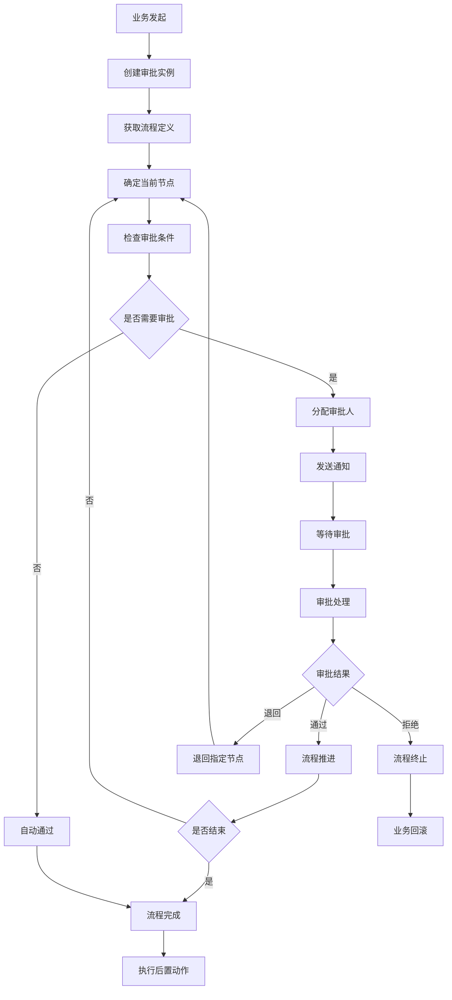

# 审批流程模块设计

## 1. 模块概述

审批流程模块是企业管理系统的核心组件，负责处理各种业务场景下的审批需求，包括报价审批、积分发放审批、商品上架审批、客户等级调整审批等。该模块提供灵活的流程配置、自动化的流程执行和完善的监控管理功能。

### 1.1 功能目标

1. **流程配置**：支持可视化的流程设计和配置
2. **自动执行**：根据条件自动触发和推进审批流程
3. **多样化审批**：支持串行、并行、条件分支等多种审批模式
4. **权限控制**：基于角色和组织架构的审批权限管理
5. **状态跟踪**：实时跟踪审批进度和状态变化
6. **通知提醒**：及时通知相关人员处理审批事项
7. **数据统计**：提供审批效率和质量的数据分析

### 1.2 业务流程



## 2. 数据库设计

### 2.1 流程定义表 (workflow_definitions)

```sql
CREATE TABLE workflow_definitions (
  id BIGINT PRIMARY KEY AUTO_INCREMENT,
  name VARCHAR(100) NOT NULL COMMENT '流程名称',
  code VARCHAR(50) NOT NULL UNIQUE COMMENT '流程编码',
  category VARCHAR(50) NOT NULL COMMENT '流程分类',
  description TEXT COMMENT '流程描述',
  version INT NOT NULL DEFAULT 1 COMMENT '版本号',
  definition JSON NOT NULL COMMENT '流程定义(JSON格式)',
  status ENUM('draft', 'active', 'inactive') DEFAULT 'draft' COMMENT '状态',
  created_by BIGINT NOT NULL COMMENT '创建人',
  updated_by BIGINT COMMENT '更新人',
  created_at TIMESTAMP DEFAULT CURRENT_TIMESTAMP,
  updated_at TIMESTAMP DEFAULT CURRENT_TIMESTAMP ON UPDATE CURRENT_TIMESTAMP,
  
  INDEX idx_code (code),
  INDEX idx_category (category),
  INDEX idx_status (status),
  INDEX idx_created_at (created_at)
) COMMENT '流程定义表';
```

### 2.2 流程实例表 (workflow_instances)

```sql
CREATE TABLE workflow_instances (
  id BIGINT PRIMARY KEY AUTO_INCREMENT,
  workflow_id BIGINT NOT NULL COMMENT '流程定义ID',
  business_type VARCHAR(50) NOT NULL COMMENT '业务类型',
  business_id VARCHAR(100) NOT NULL COMMENT '业务ID',
  title VARCHAR(200) NOT NULL COMMENT '审批标题',
  initiator_id BIGINT NOT NULL COMMENT '发起人ID',
  current_node VARCHAR(50) COMMENT '当前节点',
  status ENUM('pending', 'approved', 'rejected', 'cancelled', 'timeout') DEFAULT 'pending' COMMENT '状态',
  priority ENUM('low', 'medium', 'high', 'urgent') DEFAULT 'medium' COMMENT '优先级',
  data JSON COMMENT '业务数据',
  started_at TIMESTAMP DEFAULT CURRENT_TIMESTAMP COMMENT '开始时间',
  completed_at TIMESTAMP NULL COMMENT '完成时间',
  created_at TIMESTAMP DEFAULT CURRENT_TIMESTAMP,
  updated_at TIMESTAMP DEFAULT CURRENT_TIMESTAMP ON UPDATE CURRENT_TIMESTAMP,
  
  INDEX idx_workflow_id (workflow_id),
  INDEX idx_business (business_type, business_id),
  INDEX idx_initiator (initiator_id),
  INDEX idx_status (status),
  INDEX idx_priority (priority),
  INDEX idx_started_at (started_at),
  
  FOREIGN KEY (workflow_id) REFERENCES workflow_definitions(id),
  FOREIGN KEY (initiator_id) REFERENCES users(id)
) COMMENT '流程实例表';
```

### 2.3 审批任务表 (approval_tasks)

```sql
CREATE TABLE approval_tasks (
  id BIGINT PRIMARY KEY AUTO_INCREMENT,
  instance_id BIGINT NOT NULL COMMENT '流程实例ID',
  node_id VARCHAR(50) NOT NULL COMMENT '节点ID',
  node_name VARCHAR(100) NOT NULL COMMENT '节点名称',
  assignee_id BIGINT COMMENT '指定审批人ID',
  assignee_type ENUM('user', 'role', 'department') DEFAULT 'user' COMMENT '审批人类型',
  status ENUM('pending', 'approved', 'rejected', 'delegated', 'timeout') DEFAULT 'pending' COMMENT '状态',
  result ENUM('approve', 'reject', 'delegate') COMMENT '审批结果',
  comment TEXT COMMENT '审批意见',
  attachments JSON COMMENT '附件信息',
  assigned_at TIMESTAMP DEFAULT CURRENT_TIMESTAMP COMMENT '分配时间',
  completed_at TIMESTAMP NULL COMMENT '完成时间',
  due_date TIMESTAMP NULL COMMENT '截止时间',
  created_at TIMESTAMP DEFAULT CURRENT_TIMESTAMP,
  updated_at TIMESTAMP DEFAULT CURRENT_TIMESTAMP ON UPDATE CURRENT_TIMESTAMP,
  
  INDEX idx_instance_id (instance_id),
  INDEX idx_assignee (assignee_id),
  INDEX idx_status (status),
  INDEX idx_assigned_at (assigned_at),
  INDEX idx_due_date (due_date),
  
  FOREIGN KEY (instance_id) REFERENCES workflow_instances(id),
  FOREIGN KEY (assignee_id) REFERENCES users(id)
) COMMENT '审批任务表';
```

### 2.4 流程历史表 (workflow_history)

```sql
CREATE TABLE workflow_history (
  id BIGINT PRIMARY KEY AUTO_INCREMENT,
  instance_id BIGINT NOT NULL COMMENT '流程实例ID',
  task_id BIGINT COMMENT '任务ID',
  action VARCHAR(50) NOT NULL COMMENT '操作类型',
  from_node VARCHAR(50) COMMENT '源节点',
  to_node VARCHAR(50) COMMENT '目标节点',
  operator_id BIGINT NOT NULL COMMENT '操作人ID',
  comment TEXT COMMENT '操作说明',
  data JSON COMMENT '操作数据',
  created_at TIMESTAMP DEFAULT CURRENT_TIMESTAMP,
  
  INDEX idx_instance_id (instance_id),
  INDEX idx_task_id (task_id),
  INDEX idx_operator (operator_id),
  INDEX idx_created_at (created_at),
  
  FOREIGN KEY (instance_id) REFERENCES workflow_instances(id),
  FOREIGN KEY (task_id) REFERENCES approval_tasks(id),
  FOREIGN KEY (operator_id) REFERENCES users(id)
) COMMENT '流程历史表';
```

### 2.5 审批人配置表 (approval_assignees)

```sql
CREATE TABLE approval_assignees (
  id BIGINT PRIMARY KEY AUTO_INCREMENT,
  workflow_id BIGINT NOT NULL COMMENT '流程定义ID',
  node_id VARCHAR(50) NOT NULL COMMENT '节点ID',
  assignee_type ENUM('user', 'role', 'department', 'expression') NOT NULL COMMENT '审批人类型',
  assignee_value VARCHAR(200) NOT NULL COMMENT '审批人值',
  condition_expression TEXT COMMENT '条件表达式',
  priority INT DEFAULT 0 COMMENT '优先级',
  is_active BOOLEAN DEFAULT TRUE COMMENT '是否启用',
  created_at TIMESTAMP DEFAULT CURRENT_TIMESTAMP,
  updated_at TIMESTAMP DEFAULT CURRENT_TIMESTAMP ON UPDATE CURRENT_TIMESTAMP,
  
  INDEX idx_workflow_node (workflow_id, node_id),
  INDEX idx_assignee (assignee_type, assignee_value),
  
  FOREIGN KEY (workflow_id) REFERENCES workflow_definitions(id)
) COMMENT '审批人配置表';
```

### 2.6 流程模板表 (workflow_templates)

```sql
CREATE TABLE workflow_templates (
  id BIGINT PRIMARY KEY AUTO_INCREMENT,
  name VARCHAR(100) NOT NULL COMMENT '模板名称',
  category VARCHAR(50) NOT NULL COMMENT '模板分类',
  description TEXT COMMENT '模板描述',
  definition JSON NOT NULL COMMENT '模板定义',
  is_system BOOLEAN DEFAULT FALSE COMMENT '是否系统模板',
  usage_count INT DEFAULT 0 COMMENT '使用次数',
  created_by BIGINT NOT NULL COMMENT '创建人',
  created_at TIMESTAMP DEFAULT CURRENT_TIMESTAMP,
  updated_at TIMESTAMP DEFAULT CURRENT_TIMESTAMP ON UPDATE CURRENT_TIMESTAMP,
  
  INDEX idx_category (category),
  INDEX idx_created_by (created_by),
  INDEX idx_usage_count (usage_count)
) COMMENT '流程模板表';
```

## 3. API接口设计

### 3.1 流程定义管理

#### 3.1.1 创建流程定义

```typescript
// POST /api/workflows/definitions
interface CreateWorkflowDefinitionRequest {
  name: string;
  code: string;
  category: string;
  description?: string;
  definition: WorkflowDefinition;
}

interface WorkflowDefinition {
  nodes: WorkflowNode[];
  edges: WorkflowEdge[];
  variables?: WorkflowVariable[];
}

interface WorkflowNode {
  id: string;
  name: string;
  type: 'start' | 'approval' | 'condition' | 'parallel' | 'end';
  properties: {
    assigneeType?: 'user' | 'role' | 'department' | 'expression';
    assigneeValue?: string;
    conditionExpression?: string;
    timeoutHours?: number;
    autoApprove?: boolean;
    [key: string]: any;
  };
}

interface WorkflowEdge {
  id: string;
  source: string;
  target: string;
  condition?: string;
  label?: string;
}

interface WorkflowVariable {
  name: string;
  type: 'string' | 'number' | 'boolean' | 'date';
  defaultValue?: any;
  description?: string;
}
```

#### 3.1.2 获取流程定义列表

```typescript
// GET /api/workflows/definitions
interface GetWorkflowDefinitionsRequest {
  category?: string;
  status?: 'draft' | 'active' | 'inactive';
  keyword?: string;
  page?: number;
  size?: number;
}

interface GetWorkflowDefinitionsResponse {
  code: number;
  message: string;
  data: {
    items: WorkflowDefinitionInfo[];
    total: number;
    page: number;
    size: number;
  };
}

interface WorkflowDefinitionInfo {
  id: number;
  name: string;
  code: string;
  category: string;
  description: string;
  version: number;
  status: string;
  createdBy: number;
  createdAt: string;
  updatedAt: string;
}
```

### 3.2 流程实例管理

#### 3.2.1 启动流程

```typescript
// POST /api/workflows/instances
interface StartWorkflowRequest {
  workflowCode: string;
  businessType: string;
  businessId: string;
  title: string;
  priority?: 'low' | 'medium' | 'high' | 'urgent';
  data?: Record<string, any>;
  variables?: Record<string, any>;
}

interface StartWorkflowResponse {
  code: number;
  message: string;
  data: {
    instanceId: number;
    currentNode: string;
    tasks: ApprovalTask[];
  };
}
```

#### 3.2.2 获取我的待办

```typescript
// GET /api/workflows/tasks/pending
interface GetPendingTasksRequest {
  businessType?: string;
  priority?: string;
  keyword?: string;
  page?: number;
  size?: number;
}

interface GetPendingTasksResponse {
  code: number;
  message: string;
  data: {
    items: ApprovalTask[];
    total: number;
    page: number;
    size: number;
  };
}

interface ApprovalTask {
  id: number;
  instanceId: number;
  nodeId: string;
  nodeName: string;
  title: string;
  businessType: string;
  businessId: string;
  priority: string;
  initiator: UserInfo;
  assignedAt: string;
  dueDate?: string;
  data?: Record<string, any>;
}
```

### 3.3 审批操作

#### 3.3.1 审批任务

```typescript
// POST /api/workflows/tasks/{taskId}/approve
interface ApproveTaskRequest {
  result: 'approve' | 'reject' | 'delegate';
  comment?: string;
  attachments?: FileInfo[];
  delegateToUserId?: number; // 委托时必填
  variables?: Record<string, any>; // 更新流程变量
}

interface ApproveTaskResponse {
  code: number;
  message: string;
  data: {
    taskId: number;
    instanceId: number;
    nextTasks: ApprovalTask[];
    isCompleted: boolean;
  };
}
```

#### 3.3.2 批量审批

```typescript
// POST /api/workflows/tasks/batch-approve
interface BatchApproveRequest {
  taskIds: number[];
  result: 'approve' | 'reject';
  comment?: string;
}

interface BatchApproveResponse {
  code: number;
  message: string;
  data: {
    successCount: number;
    failureCount: number;
    results: {
      taskId: number;
      success: boolean;
      message?: string;
    }[];
  };
}
```

### 3.4 流程监控

#### 3.4.1 获取流程实例详情

```typescript
// GET /api/workflows/instances/{instanceId}
interface GetWorkflowInstanceResponse {
  code: number;
  message: string;
  data: {
    instance: WorkflowInstance;
    tasks: ApprovalTask[];
    history: WorkflowHistory[];
    currentNode: WorkflowNode;
  };
}

interface WorkflowInstance {
  id: number;
  workflowId: number;
  workflowName: string;
  businessType: string;
  businessId: string;
  title: string;
  initiator: UserInfo;
  currentNode: string;
  status: string;
  priority: string;
  data: Record<string, any>;
  startedAt: string;
  completedAt?: string;
}

interface WorkflowHistory {
  id: number;
  action: string;
  fromNode?: string;
  toNode?: string;
  operator: UserInfo;
  comment?: string;
  createdAt: string;
}
```

## 4. 核心业务逻辑

### 4.1 工作流引擎 (WorkflowEngine)

```typescript
// services/WorkflowEngine.ts
class WorkflowEngine {
  constructor(
    private workflowRepo: WorkflowRepository,
    private instanceRepo: WorkflowInstanceRepository,
    private taskRepo: ApprovalTaskRepository,
    private historyRepo: WorkflowHistoryRepository,
    private assigneeService: AssigneeService,
    private notificationService: NotificationService
  ) {}

  // 启动流程
  async startWorkflow(request: StartWorkflowRequest, initiatorId: number): Promise<WorkflowInstance> {
    // 获取流程定义
    const workflow = await this.workflowRepo.findByCode(request.workflowCode);
    if (!workflow || workflow.status !== 'active') {
      throw new Error('流程定义不存在或未激活');
    }

    // 创建流程实例
    const instance = await this.instanceRepo.create({
      workflowId: workflow.id,
      businessType: request.businessType,
      businessId: request.businessId,
      title: request.title,
      initiatorId,
      priority: request.priority || 'medium',
      data: request.data,
      status: 'pending'
    });

    // 记录启动历史
    await this.historyRepo.create({
      instanceId: instance.id,
      action: 'start',
      operatorId: initiatorId,
      comment: '流程启动'
    });

    // 执行第一个节点
    await this.executeNode(instance, this.getStartNode(workflow.definition));

    return instance;
  }

  // 执行节点
  private async executeNode(instance: WorkflowInstance, node: WorkflowNode): Promise<void> {
    // 更新当前节点
    await this.instanceRepo.updateCurrentNode(instance.id, node.id);

    switch (node.type) {
      case 'start':
        await this.handleStartNode(instance, node);
        break;
      case 'approval':
        await this.handleApprovalNode(instance, node);
        break;
      case 'condition':
        await this.handleConditionNode(instance, node);
        break;
      case 'parallel':
        await this.handleParallelNode(instance, node);
        break;
      case 'end':
        await this.handleEndNode(instance, node);
        break;
    }
  }

  // 处理审批节点
  private async handleApprovalNode(instance: WorkflowInstance, node: WorkflowNode): Promise<void> {
    // 检查是否自动审批
    if (node.properties.autoApprove) {
      const condition = node.properties.autoApproveCondition;
      if (await this.evaluateCondition(condition, instance)) {
        await this.autoApprove(instance, node);
        return;
      }
    }

    // 分配审批人
    const assignees = await this.assigneeService.getAssignees(
      instance.workflowId,
      node.id,
      instance.data
    );

    if (assignees.length === 0) {
      throw new Error(`节点 ${node.name} 没有找到合适的审批人`);
    }

    // 创建审批任务
    const tasks = await Promise.all(
      assignees.map(assignee => this.createApprovalTask(instance, node, assignee))
    );

    // 发送通知
    await Promise.all(
      tasks.map(task => this.notificationService.sendApprovalNotification(task))
    );
  }

  // 创建审批任务
  private async createApprovalTask(
    instance: WorkflowInstance,
    node: WorkflowNode,
    assignee: Assignee
  ): Promise<ApprovalTask> {
    const dueDate = node.properties.timeoutHours
      ? new Date(Date.now() + node.properties.timeoutHours * 60 * 60 * 1000)
      : null;

    return await this.taskRepo.create({
      instanceId: instance.id,
      nodeId: node.id,
      nodeName: node.name,
      assigneeId: assignee.id,
      assigneeType: assignee.type,
      status: 'pending',
      dueDate
    });
  }

  // 处理审批
  async processApproval(taskId: number, request: ApproveTaskRequest, operatorId: number): Promise<void> {
    const task = await this.taskRepo.findById(taskId);
    if (!task) {
      throw new Error('审批任务不存在');
    }

    if (task.status !== 'pending') {
      throw new Error('任务已处理，无法重复操作');
    }

    if (task.assigneeId !== operatorId) {
      throw new Error('无权限处理此任务');
    }

    // 更新任务状态
    await this.taskRepo.update(taskId, {
      status: request.result === 'approve' ? 'approved' : 
             request.result === 'reject' ? 'rejected' : 'delegated',
      result: request.result,
      comment: request.comment,
      attachments: request.attachments,
      completedAt: new Date()
    });

    // 记录历史
    await this.historyRepo.create({
      instanceId: task.instanceId,
      taskId: task.id,
      action: request.result,
      operatorId,
      comment: request.comment
    });

    // 处理委托
    if (request.result === 'delegate' && request.delegateToUserId) {
      await this.delegateTask(task, request.delegateToUserId, operatorId);
      return;
    }

    // 检查节点是否完成
    const instance = await this.instanceRepo.findById(task.instanceId);
    const workflow = await this.workflowRepo.findById(instance.workflowId);
    const currentNode = this.getNodeById(workflow.definition, task.nodeId);

    if (await this.isNodeCompleted(task.instanceId, task.nodeId)) {
      if (request.result === 'reject') {
        // 拒绝则终止流程
        await this.terminateWorkflow(instance, 'rejected');
      } else {
        // 继续下一个节点
        await this.moveToNextNode(instance, currentNode);
      }
    }
  }

  // 移动到下一个节点
  private async moveToNextNode(instance: WorkflowInstance, currentNode: WorkflowNode): Promise<void> {
    const workflow = await this.workflowRepo.findById(instance.workflowId);
    const nextNodes = this.getNextNodes(workflow.definition, currentNode.id);

    if (nextNodes.length === 0) {
      // 没有下一个节点，流程结束
      await this.completeWorkflow(instance);
    } else if (nextNodes.length === 1) {
      // 单个下一节点
      await this.executeNode(instance, nextNodes[0]);
    } else {
      // 多个下一节点，需要条件判断
      for (const nextNode of nextNodes) {
        const edge = this.getEdge(workflow.definition, currentNode.id, nextNode.id);
        if (!edge.condition || await this.evaluateCondition(edge.condition, instance)) {
          await this.executeNode(instance, nextNode);
          break;
        }
      }
    }
  }

  // 检查节点是否完成
  private async isNodeCompleted(instanceId: number, nodeId: string): Promise<boolean> {
    const pendingTasks = await this.taskRepo.findPendingByInstanceAndNode(instanceId, nodeId);
    return pendingTasks.length === 0;
  }

  // 完成流程
  private async completeWorkflow(instance: WorkflowInstance): Promise<void> {
    await this.instanceRepo.update(instance.id, {
      status: 'approved',
      completedAt: new Date()
    });

    await this.historyRepo.create({
      instanceId: instance.id,
      action: 'complete',
      operatorId: instance.initiatorId,
      comment: '流程完成'
    });

    // 执行后置动作
    await this.executePostActions(instance);

    // 发送完成通知
    await this.notificationService.sendWorkflowCompletedNotification(instance);
  }

  // 终止流程
  private async terminateWorkflow(instance: WorkflowInstance, status: string): Promise<void> {
    await this.instanceRepo.update(instance.id, {
      status,
      completedAt: new Date()
    });

    // 取消所有待处理任务
    await this.taskRepo.cancelPendingTasks(instance.id);

    await this.historyRepo.create({
      instanceId: instance.id,
      action: 'terminate',
      operatorId: instance.initiatorId,
      comment: `流程终止: ${status}`
    });

    // 发送终止通知
    await this.notificationService.sendWorkflowTerminatedNotification(instance, status);
  }

  // 评估条件表达式
  private async evaluateCondition(condition: string, instance: WorkflowInstance): Promise<boolean> {
    if (!condition) return true;

    try {
      // 构建上下文
      const context = {
        data: instance.data,
        initiator: await this.getUserById(instance.initiatorId),
        instance: instance,
        // 添加更多上下文变量...
      };

      // 使用表达式引擎评估条件
      return await this.expressionEngine.evaluate(condition, context);
    } catch (error) {
      console.error('条件评估失败:', condition, error);
      return false;
    }
  }

  // 获取开始节点
  private getStartNode(definition: WorkflowDefinition): WorkflowNode {
    return definition.nodes.find(node => node.type === 'start')!;
  }

  // 根据ID获取节点
  private getNodeById(definition: WorkflowDefinition, nodeId: string): WorkflowNode {
    return definition.nodes.find(node => node.id === nodeId)!;
  }

  // 获取下一个节点
  private getNextNodes(definition: WorkflowDefinition, currentNodeId: string): WorkflowNode[] {
    const edges = definition.edges.filter(edge => edge.source === currentNodeId);
    return edges.map(edge => this.getNodeById(definition, edge.target));
  }

  // 获取边
  private getEdge(definition: WorkflowDefinition, sourceId: string, targetId: string): WorkflowEdge {
    return definition.edges.find(edge => edge.source === sourceId && edge.target === targetId)!;
  }

  // 执行后置动作
  private async executePostActions(instance: WorkflowInstance): Promise<void> {
    // 根据业务类型执行相应的后置动作
    switch (instance.businessType) {
      case 'quote_approval':
        await this.handleQuoteApprovalComplete(instance);
        break;
      case 'point_grant':
        await this.handlePointGrantComplete(instance);
        break;
      case 'product_publish':
        await this.handleProductPublishComplete(instance);
        break;
      // 添加更多业务类型...
    }
  }

  // 处理报价审批完成
  private async handleQuoteApprovalComplete(instance: WorkflowInstance): Promise<void> {
    const quoteId = instance.businessId;
    // 更新报价状态为已审批
    // await this.quoteService.updateStatus(quoteId, 'approved');
  }

  // 处理积分发放审批完成
  private async handlePointGrantComplete(instance: WorkflowInstance): Promise<void> {
    const grantData = instance.data;
    // 执行积分发放
    // await this.pointService.grantPoints(grantData);
  }

  // 处理商品发布审批完成
  private async handleProductPublishComplete(instance: WorkflowInstance): Promise<void> {
    const productId = instance.businessId;
    // 发布商品
    // await this.productService.publish(productId);
  }
}
```

### 4.2 审批人分配服务 (AssigneeService)

```typescript
// services/AssigneeService.ts
class AssigneeService {
  constructor(
    private assigneeRepo: ApprovalAssigneeRepository,
    private userService: UserService,
    private organizationService: OrganizationService
  ) {}

  // 获取审批人
  async getAssignees(
    workflowId: number,
    nodeId: string,
    businessData: Record<string, any>
  ): Promise<Assignee[]> {
    const configs = await this.assigneeRepo.findByWorkflowAndNode(workflowId, nodeId);
    const assignees: Assignee[] = [];

    for (const config of configs) {
      // 检查条件
      if (config.conditionExpression) {
        const conditionMet = await this.evaluateCondition(config.conditionExpression, businessData);
        if (!conditionMet) {
          continue;
        }
      }

      // 根据类型获取审批人
      const configAssignees = await this.getAssigneesByType(config, businessData);
      assignees.push(...configAssignees);
    }

    // 去重
    return this.deduplicateAssignees(assignees);
  }

  // 根据类型获取审批人
  private async getAssigneesByType(
    config: ApprovalAssigneeConfig,
    businessData: Record<string, any>
  ): Promise<Assignee[]> {
    switch (config.assigneeType) {
      case 'user':
        return await this.getUserAssignees(config.assigneeValue);
      case 'role':
        return await this.getRoleAssignees(config.assigneeValue);
      case 'department':
        return await this.getDepartmentAssignees(config.assigneeValue);
      case 'expression':
        return await this.getExpressionAssignees(config.assigneeValue, businessData);
      default:
        return [];
    }
  }

  // 获取用户审批人
  private async getUserAssignees(userIds: string): Promise<Assignee[]> {
    const ids = userIds.split(',').map(id => parseInt(id.trim()));
    const users = await this.userService.getUsersByIds(ids);
    
    return users.map(user => ({
      id: user.id,
      type: 'user',
      name: user.name,
      email: user.email
    }));
  }

  // 获取角色审批人
  private async getRoleAssignees(roleCodes: string): Promise<Assignee[]> {
    const codes = roleCodes.split(',').map(code => code.trim());
    const users = await this.userService.getUsersByRoles(codes);
    
    return users.map(user => ({
      id: user.id,
      type: 'user',
      name: user.name,
      email: user.email
    }));
  }

  // 获取部门审批人
  private async getDepartmentAssignees(departmentIds: string): Promise<Assignee[]> {
    const ids = departmentIds.split(',').map(id => parseInt(id.trim()));
    const users = await this.organizationService.getUsersByDepartments(ids);
    
    return users.map(user => ({
      id: user.id,
      type: 'user',
      name: user.name,
      email: user.email
    }));
  }

  // 获取表达式审批人
  private async getExpressionAssignees(
    expression: string,
    businessData: Record<string, any>
  ): Promise<Assignee[]> {
    try {
      // 构建上下文
      const context = {
        data: businessData,
        userService: this.userService,
        organizationService: this.organizationService
      };

      // 执行表达式获取审批人ID列表
      const userIds = await this.expressionEngine.evaluate(expression, context);
      
      if (Array.isArray(userIds)) {
        const users = await this.userService.getUsersByIds(userIds);
        return users.map(user => ({
          id: user.id,
          type: 'user',
          name: user.name,
          email: user.email
        }));
      }

      return [];
    } catch (error) {
      console.error('表达式审批人获取失败:', expression, error);
      return [];
    }
  }

  // 去重审批人
  private deduplicateAssignees(assignees: Assignee[]): Assignee[] {
    const seen = new Set<number>();
    return assignees.filter(assignee => {
      if (seen.has(assignee.id)) {
        return false;
      }
      seen.add(assignee.id);
      return true;
    });
  }

  // 评估条件表达式
  private async evaluateCondition(
    condition: string,
    businessData: Record<string, any>
  ): Promise<boolean> {
    try {
      const context = { data: businessData };
      return await this.expressionEngine.evaluate(condition, context);
    } catch (error) {
      console.error('条件评估失败:', condition, error);
      return false;
    }
  }
}

interface Assignee {
  id: number;
  type: 'user';
  name: string;
  email: string;
}

interface ApprovalAssigneeConfig {
  assigneeType: 'user' | 'role' | 'department' | 'expression';
  assigneeValue: string;
  conditionExpression?: string;
}
```

## 5. 前端设计

### 5.1 流程设计器

```typescript
// components/WorkflowDesigner.tsx
import React, { useState, useCallback } from 'react';
import { Card, Button, Form, Input, Select, Modal, message } from 'antd';
import ReactFlow, {
  Node, Edge, addEdge, Connection, useNodesState, useEdgesState,
  Controls, Background, MiniMap
} from 'reactflow';
import 'reactflow/dist/style.css';

const { Option } = Select;

const WorkflowDesigner: React.FC = () => {
  const [nodes, setNodes, onNodesChange] = useNodesState([]);
  const [edges, setEdges, onEdgesChange] = useEdgesState([]);
  const [selectedNode, setSelectedNode] = useState<Node | null>(null);
  const [propertyModalVisible, setPropertyModalVisible] = useState(false);
  const [form] = Form.useForm();

  // 节点类型配置
  const nodeTypes = [
    { value: 'start', label: '开始节点', color: '#52c41a' },
    { value: 'approval', label: '审批节点', color: '#1890ff' },
    { value: 'condition', label: '条件节点', color: '#faad14' },
    { value: 'parallel', label: '并行节点', color: '#722ed1' },
    { value: 'end', label: '结束节点', color: '#f5222d' }
  ];

  // 添加节点
  const addNode = (type: string) => {
    const nodeConfig = nodeTypes.find(nt => nt.value === type);
    const newNode: Node = {
      id: `${type}_${Date.now()}`,
      type: 'default',
      position: { x: Math.random() * 400, y: Math.random() * 400 },
      data: {
        label: nodeConfig?.label || type,
        nodeType: type,
        properties: {}
      },
      style: {
        backgroundColor: nodeConfig?.color,
        color: 'white',
        border: 'none',
        borderRadius: '8px',
        padding: '10px'
      }
    };

    setNodes(nds => [...nds, newNode]);
  };

  // 连接节点
  const onConnect = useCallback(
    (params: Connection) => setEdges(eds => addEdge(params, eds)),
    [setEdges]
  );

  // 节点点击事件
  const onNodeClick = (event: React.MouseEvent, node: Node) => {
    setSelectedNode(node);
    setPropertyModalVisible(true);
    
    // 设置表单初始值
    form.setFieldsValue({
      name: node.data.label,
      ...node.data.properties
    });
  };

  // 保存节点属性
  const saveNodeProperties = async () => {
    try {
      const values = await form.validateFields();
      
      if (selectedNode) {
        setNodes(nds => nds.map(node => {
          if (node.id === selectedNode.id) {
            return {
              ...node,
              data: {
                ...node.data,
                label: values.name,
                properties: {
                  ...values,
                  name: undefined // 移除name字段，避免重复
                }
              }
            };
          }
          return node;
        }));
      }

      setPropertyModalVisible(false);
      setSelectedNode(null);
      form.resetFields();
      message.success('节点属性保存成功');
    } catch (error) {
      console.error('保存节点属性失败:', error);
    }
  };

  // 保存流程定义
  const saveWorkflow = async () => {
    try {
      const workflowData = {
        nodes: nodes.map(node => ({
          id: node.id,
          name: node.data.label,
          type: node.data.nodeType,
          properties: node.data.properties,
          position: node.position
        })),
        edges: edges.map(edge => ({
          id: edge.id,
          source: edge.source,
          target: edge.target,
          condition: edge.data?.condition,
          label: edge.label
        }))
      };

      // 调用API保存
      const response = await fetch('/api/workflows/definitions', {
        method: 'POST',
        headers: { 'Content-Type': 'application/json' },
        body: JSON.stringify({
          name: '新流程',
          code: `workflow_${Date.now()}`,
          category: 'custom',
          definition: workflowData
        })
      });

      if (response.ok) {
        message.success('流程保存成功');
      } else {
        message.error('流程保存失败');
      }
    } catch (error) {
      console.error('保存流程失败:', error);
      message.error('流程保存失败');
    }
  };

  // 渲染节点属性表单
  const renderNodePropertyForm = () => {
    if (!selectedNode) return null;

    const nodeType = selectedNode.data.nodeType;

    return (
      <Form form={form} layout="vertical">
        <Form.Item
          name="name"
          label="节点名称"
          rules={[{ required: true, message: '请输入节点名称' }]}
        >
          <Input placeholder="请输入节点名称" />
        </Form.Item>

        {nodeType === 'approval' && (
          <>
            <Form.Item name="assigneeType" label="审批人类型">
              <Select placeholder="请选择审批人类型">
                <Option value="user">指定用户</Option>
                <Option value="role">角色</Option>
                <Option value="department">部门</Option>
                <Option value="expression">表达式</Option>
              </Select>
            </Form.Item>

            <Form.Item name="assigneeValue" label="审批人值">
              <Input placeholder="请输入审批人值" />
            </Form.Item>

            <Form.Item name="timeoutHours" label="超时时间(小时)">
              <Input type="number" placeholder="请输入超时时间" />
            </Form.Item>

            <Form.Item name="autoApprove" label="自动审批">
              <Select placeholder="是否自动审批">
                <Option value={true}>是</Option>
                <Option value={false}>否</Option>
              </Select>
            </Form.Item>

            <Form.Item name="autoApproveCondition" label="自动审批条件">
              <Input.TextArea placeholder="请输入自动审批条件表达式" />
            </Form.Item>
          </>
        )}

        {nodeType === 'condition' && (
          <Form.Item name="conditionExpression" label="条件表达式">
            <Input.TextArea placeholder="请输入条件表达式" />
          </Form.Item>
        )}
      </Form>
    );
  };

  return (
    <div style={{ height: '600px', width: '100%' }}>
      <Card
        title="流程设计器"
        extra={
          <div>
            {nodeTypes.map(nodeType => (
              <Button
                key={nodeType.value}
                size="small"
                style={{ marginRight: 8 }}
                onClick={() => addNode(nodeType.value)}
              >
                添加{nodeType.label}
              </Button>
            ))}
            <Button type="primary" onClick={saveWorkflow}>
              保存流程
            </Button>
          </div>
        }
      >
        <ReactFlow
          nodes={nodes}
          edges={edges}
          onNodesChange={onNodesChange}
          onEdgesChange={onEdgesChange}
          onConnect={onConnect}
          onNodeClick={onNodeClick}
          fitView
        >
          <Controls />
          <Background />
          <MiniMap />
        </ReactFlow>
      </Card>

      <Modal
        title="节点属性"
        open={propertyModalVisible}
        onOk={saveNodeProperties}
        onCancel={() => {
          setPropertyModalVisible(false);
          setSelectedNode(null);
          form.resetFields();
        }}
        width={600}
      >
        {renderNodePropertyForm()}
      </Modal>
    </div>
  );
};

export default WorkflowDesigner;
```

### 5.2 待办任务列表

```typescript
// components/PendingTasks.tsx
import React, { useState, useEffect } from 'react';
import {
  Table, Card, Button, Modal, Form, Input, Select, Tag,
  Space, Tooltip, message, Upload, Badge
} from 'antd';
import {
  CheckOutlined, CloseOutlined, UserSwitchOutlined,
  EyeOutlined, ClockCircleOutlined, ExclamationCircleOutlined
} from '@ant-design/icons';
import type { ColumnsType } from 'antd/es/table';

const { TextArea } = Input;
const { Option } = Select;

interface PendingTask {
  id: number;
  instanceId: number;
  title: string;
  businessType: string;
  priority: string;
  initiator: {
    id: number;
    name: string;
    avatar?: string;
  };
  assignedAt: string;
  dueDate?: string;
  data?: Record<string, any>;
}

const PendingTasks: React.FC = () => {
  const [loading, setLoading] = useState(false);
  const [tasks, setTasks] = useState<PendingTask[]>([]);
  const [selectedTasks, setSelectedTasks] = useState<number[]>([]);
  const [approvalModalVisible, setApprovalModalVisible] = useState(false);
  const [currentTask, setCurrentTask] = useState<PendingTask | null>(null);
  const [batchApprovalModalVisible, setBatchApprovalModalVisible] = useState(false);
  const [form] = Form.useForm();

  useEffect(() => {
    loadPendingTasks();
  }, []);

  // 加载待办任务
  const loadPendingTasks = async () => {
    setLoading(true);
    try {
      const response = await fetch('/api/workflows/tasks/pending');
      const result = await response.json();
      
      if (result.code === 200) {
        setTasks(result.data.items);
      }
    } catch (error) {
      console.error('加载待办任务失败:', error);
      message.error('加载待办任务失败');
    } finally {
      setLoading(false);
    }
  };

  // 处理单个审批
  const handleApproval = (task: PendingTask) => {
    setCurrentTask(task);
    setApprovalModalVisible(true);
    form.resetFields();
  };

  // 提交审批
  const submitApproval = async () => {
    try {
      const values = await form.validateFields();
      
      const response = await fetch(`/api/workflows/tasks/${currentTask?.id}/approve`, {
        method: 'POST',
        headers: { 'Content-Type': 'application/json' },
        body: JSON.stringify(values)
      });

      const result = await response.json();
      
      if (result.code === 200) {
        message.success('审批处理成功');
        setApprovalModalVisible(false);
        setCurrentTask(null);
        form.resetFields();
        loadPendingTasks();
      } else {
        message.error(result.message || '审批处理失败');
      }
    } catch (error) {
      console.error('审批处理失败:', error);
      message.error('审批处理失败');
    }
  };

  // 批量审批
  const handleBatchApproval = () => {
    if (selectedTasks.length === 0) {
      message.warning('请选择要批量处理的任务');
      return;
    }
    setBatchApprovalModalVisible(true);
  };

  // 提交批量审批
  const submitBatchApproval = async () => {
    try {
      const values = await form.validateFields();
      
      const response = await fetch('/api/workflows/tasks/batch-approve', {
        method: 'POST',
        headers: { 'Content-Type': 'application/json' },
        body: JSON.stringify({
          taskIds: selectedTasks,
          ...values
        })
      });

      const result = await response.json();
      
      if (result.code === 200) {
        message.success(`批量审批完成，成功处理 ${result.data.successCount} 个任务`);
        setBatchApprovalModalVisible(false);
        setSelectedTasks([]);
        form.resetFields();
        loadPendingTasks();
      } else {
        message.error(result.message || '批量审批失败');
      }
    } catch (error) {
      console.error('批量审批失败:', error);
      message.error('批量审批失败');
    }
  };

  // 查看详情
  const viewDetail = (task: PendingTask) => {
    // 跳转到详情页面
    window.open(`/workflows/instances/${task.instanceId}`, '_blank');
  };

  // 获取优先级标签
  const getPriorityTag = (priority: string) => {
    const configs = {
      urgent: { color: 'red', text: '紧急' },
      high: { color: 'orange', text: '高' },
      medium: { color: 'blue', text: '中' },
      low: { color: 'default', text: '低' }
    };
    
    const config = configs[priority] || configs.medium;
    return <Tag color={config.color}>{config.text}</Tag>;
  };

  // 获取业务类型标签
  const getBusinessTypeTag = (businessType: string) => {
    const configs = {
      quote_approval: { color: 'blue', text: '报价审批' },
      point_grant: { color: 'green', text: '积分发放' },
      product_publish: { color: 'purple', text: '商品发布' },
      customer_level: { color: 'orange', text: '客户等级' }
    };
    
    const config = configs[businessType] || { color: 'default', text: businessType };
    return <Tag color={config.color}>{config.text}</Tag>;
  };

  // 检查是否超期
  const isOverdue = (dueDate?: string) => {
    if (!dueDate) return false;
    return new Date(dueDate) < new Date();
  };

  const columns: ColumnsType<PendingTask> = [
    {
      title: '审批标题',
      dataIndex: 'title',
      key: 'title',
      render: (title, record) => (
        <div>
          <div style={{ fontWeight: 500 }}>{title}</div>
          <div style={{ fontSize: '12px', color: '#666', marginTop: '4px' }}>
            发起人: {record.initiator.name}
          </div>
        </div>
      )
    },
    {
      title: '业务类型',
      dataIndex: 'businessType',
      key: 'businessType',
      width: 120,
      render: (businessType) => getBusinessTypeTag(businessType)
    },
    {
      title: '优先级',
      dataIndex: 'priority',
      key: 'priority',
      width: 80,
      render: (priority) => getPriorityTag(priority)
    },
    {
      title: '分配时间',
      dataIndex: 'assignedAt',
      key: 'assignedAt',
      width: 150,
      render: (assignedAt, record) => (
        <div>
          <div>{new Date(assignedAt).toLocaleString()}</div>
          {record.dueDate && (
            <div style={{ 
              fontSize: '12px', 
              color: isOverdue(record.dueDate) ? '#f5222d' : '#666',
              marginTop: '2px'
            }}>
              {isOverdue(record.dueDate) && <ExclamationCircleOutlined style={{ marginRight: 4 }} />}
              截止: {new Date(record.dueDate).toLocaleString()}
            </div>
          )}
        </div>
      )
    },
    {
      title: '操作',
      key: 'action',
      width: 200,
      render: (_, record) => (
        <Space>
          <Tooltip title="查看详情">
            <Button
              type="text"
              icon={<EyeOutlined />}
              onClick={() => viewDetail(record)}
            />
          </Tooltip>
          <Tooltip title="审批">
            <Button
              type="text"
              icon={<CheckOutlined />}
              onClick={() => handleApproval(record)}
            />
          </Tooltip>
        </Space>
      )
    }
  ];

  const rowSelection = {
    selectedRowKeys: selectedTasks,
    onChange: (selectedRowKeys: React.Key[]) => {
      setSelectedTasks(selectedRowKeys as number[]);
    }
  };

  return (
    <Card
      title={
        <div style={{ display: 'flex', alignItems: 'center' }}>
          <span>我的待办</span>
          <Badge count={tasks.length} style={{ marginLeft: 8 }} />
        </div>
      }
      extra={
        <Space>
          <Button
            type="primary"
            disabled={selectedTasks.length === 0}
            onClick={handleBatchApproval}
          >
            批量审批
          </Button>
          <Button onClick={loadPendingTasks}>
            刷新
          </Button>
        </Space>
      }
    >
      <Table
        columns={columns}
        dataSource={tasks}
        rowKey="id"
        loading={loading}
        rowSelection={rowSelection}
        pagination={{
          showSizeChanger: true,
          showQuickJumper: true,
          showTotal: (total) => `共 ${total} 条记录`
        }}
      />

      {/* 单个审批模态框 */}
      <Modal
        title="审批处理"
        open={approvalModalVisible}
        onOk={submitApproval}
        onCancel={() => {
          setApprovalModalVisible(false);
          setCurrentTask(null);
          form.resetFields();
        }}
        width={600}
      >
        <Form form={form} layout="vertical">
          <Form.Item
            name="result"
            label="审批结果"
            rules={[{ required: true, message: '请选择审批结果' }]}
          >
            <Select placeholder="请选择审批结果">
              <Option value="approve">
                <CheckOutlined style={{ color: '#52c41a', marginRight: 8 }} />
                通过
              </Option>
              <Option value="reject">
                <CloseOutlined style={{ color: '#f5222d', marginRight: 8 }} />
                拒绝
              </Option>
              <Option value="delegate">
                <UserSwitchOutlined style={{ color: '#1890ff', marginRight: 8 }} />
                委托
              </Option>
            </Select>
          </Form.Item>

          <Form.Item
            name="comment"
            label="审批意见"
            rules={[{ required: true, message: '请输入审批意见' }]}
          >
            <TextArea rows={4} placeholder="请输入审批意见" />
          </Form.Item>

          <Form.Item
            noStyle
            shouldUpdate={(prevValues, currentValues) => 
              prevValues.result !== currentValues.result
            }
          >
            {({ getFieldValue }) =>
              getFieldValue('result') === 'delegate' && (
                <Form.Item
                  name="delegateToUserId"
                  label="委托给"
                  rules={[{ required: true, message: '请选择委托人' }]}
                >
                  <Select placeholder="请选择委托人">
                    {/* 这里应该动态加载用户列表 */}
                  </Select>
                </Form.Item>
              )
            }
          </Form.Item>

          <Form.Item name="attachments" label="附件">
            <Upload>
              <Button>上传附件</Button>
            </Upload>
          </Form.Item>
        </Form>
      </Modal>

      {/* 批量审批模态框 */}
      <Modal
        title={`批量审批 (${selectedTasks.length} 个任务)`}
        open={batchApprovalModalVisible}
        onOk={submitBatchApproval}
        onCancel={() => {
          setBatchApprovalModalVisible(false);
          form.resetFields();
        }}
      >
        <Form form={form} layout="vertical">
          <Form.Item
            name="result"
            label="审批结果"
            rules={[{ required: true, message: '请选择审批结果' }]}
          >
            <Select placeholder="请选择审批结果">
              <Option value="approve">
                <CheckOutlined style={{ color: '#52c41a', marginRight: 8 }} />
                批量通过
              </Option>
              <Option value="reject">
                <CloseOutlined style={{ color: '#f5222d', marginRight: 8 }} />
                批量拒绝
              </Option>
            </Select>
          </Form.Item>

          <Form.Item
            name="comment"
            label="审批意见"
            rules={[{ required: true, message: '请输入审批意见' }]}
          >
            <TextArea rows={4} placeholder="请输入审批意见" />
          </Form.Item>
        </Form>
      </Modal>
    </Card>
  );
};

export default PendingTasks;
```

## 6. 性能优化

### 6.1 数据库优化

#### 6.1.1 索引策略

```sql
-- 流程实例表索引
CREATE INDEX idx_workflow_instances_business ON workflow_instances(business_type, business_id);
CREATE INDEX idx_workflow_instances_initiator_status ON workflow_instances(initiator_id, status);
CREATE INDEX idx_workflow_instances_started_at ON workflow_instances(started_at);
CREATE INDEX idx_workflow_instances_status_priority ON workflow_instances(status, priority);

-- 审批任务表索引
CREATE INDEX idx_approval_tasks_assignee_status ON approval_tasks(assignee_id, status);
CREATE INDEX idx_approval_tasks_instance_node ON approval_tasks(instance_id, node_id);
CREATE INDEX idx_approval_tasks_due_date ON approval_tasks(due_date);
CREATE INDEX idx_approval_tasks_assigned_at ON approval_tasks(assigned_at);

-- 流程历史表索引
CREATE INDEX idx_workflow_history_instance_created ON workflow_history(instance_id, created_at);
CREATE INDEX idx_workflow_history_operator ON workflow_history(operator_id);

-- 审批人配置表索引
CREATE INDEX idx_approval_assignees_workflow_node ON approval_assignees(workflow_id, node_id);
CREATE INDEX idx_approval_assignees_type_value ON approval_assignees(assignee_type, assignee_value);
```

#### 6.1.2 分表策略

```typescript
// utils/TableShardingUtil.ts
class TableShardingUtil {
  // 根据时间分表 - 流程历史表
  static getHistoryTableName(date: Date): string {
    const year = date.getFullYear();
    const month = String(date.getMonth() + 1).padStart(2, '0');
    return `workflow_history_${year}_${month}`;
  }

  // 根据业务类型分表 - 流程实例表
  static getInstanceTableName(businessType: string): string {
    const typeMapping = {
      'quote_approval': 'workflow_instances_quote',
      'point_grant': 'workflow_instances_point',
      'product_publish': 'workflow_instances_product',
      'default': 'workflow_instances'
    };
    
    return typeMapping[businessType] || typeMapping.default;
  }

  // 创建分表SQL
  static generateShardTableSQL(baseTableName: string, shardSuffix: string): string {
    return `
      CREATE TABLE ${baseTableName}_${shardSuffix} LIKE ${baseTableName};
      
      ALTER TABLE ${baseTableName}_${shardSuffix} 
      ADD CONSTRAINT pk_${baseTableName}_${shardSuffix} 
      PRIMARY KEY (id);
    `;
  }
}
```

### 6.2 缓存策略

#### 6.2.1 Redis缓存

```typescript
// services/WorkflowCacheService.ts
class WorkflowCacheService {
  constructor(private redis: Redis) {}

  // 缓存流程定义
  async cacheWorkflowDefinition(workflow: WorkflowDefinition): Promise<void> {
    const key = `workflow:definition:${workflow.code}`;
    await this.redis.setex(key, 3600, JSON.stringify(workflow)); // 1小时过期
  }

  // 获取缓存的流程定义
  async getCachedWorkflowDefinition(code: string): Promise<WorkflowDefinition | null> {
    const key = `workflow:definition:${code}`;
    const cached = await this.redis.get(key);
    return cached ? JSON.parse(cached) : null;
  }

  // 缓存用户待办数量
  async cacheUserPendingCount(userId: number, count: number): Promise<void> {
    const key = `workflow:pending:count:${userId}`;
    await this.redis.setex(key, 300, count.toString()); // 5分钟过期
  }

  // 获取用户待办数量
  async getUserPendingCount(userId: number): Promise<number | null> {
    const key = `workflow:pending:count:${userId}`;
    const cached = await this.redis.get(key);
    return cached ? parseInt(cached) : null;
  }

  // 缓存审批人配置
  async cacheAssigneeConfig(workflowId: number, nodeId: string, config: any[]): Promise<void> {
    const key = `workflow:assignee:${workflowId}:${nodeId}`;
    await this.redis.setex(key, 1800, JSON.stringify(config)); // 30分钟过期
  }

  // 获取审批人配置
  async getCachedAssigneeConfig(workflowId: number, nodeId: string): Promise<any[] | null> {
    const key = `workflow:assignee:${workflowId}:${nodeId}`;
    const cached = await this.redis.get(key);
    return cached ? JSON.parse(cached) : null;
  }

  // 缓存流程实例状态
  async cacheInstanceStatus(instanceId: number, status: string): Promise<void> {
    const key = `workflow:instance:status:${instanceId}`;
    await this.redis.setex(key, 600, status); // 10分钟过期
  }

  // 清除相关缓存
  async clearWorkflowCache(workflowId: number): Promise<void> {
    const pattern = `workflow:*:${workflowId}:*`;
    const keys = await this.redis.keys(pattern);
    if (keys.length > 0) {
      await this.redis.del(...keys);
    }
  }

  // 清除用户相关缓存
  async clearUserCache(userId: number): Promise<void> {
    const patterns = [
      `workflow:pending:count:${userId}`,
      `workflow:user:*:${userId}`
    ];
    
    for (const pattern of patterns) {
      const keys = await this.redis.keys(pattern);
      if (keys.length > 0) {
        await this.redis.del(...keys);
      }
    }
  }
}
```

#### 6.2.2 本地缓存

```typescript
// utils/LocalCacheUtil.ts
import LRU from 'lru-cache';

class LocalCacheUtil {
  private static workflowCache = new LRU<string, any>({
    max: 1000,
    ttl: 1000 * 60 * 30 // 30分钟
  });

  private static assigneeCache = new LRU<string, any>({
    max: 500,
    ttl: 1000 * 60 * 15 // 15分钟
  });

  // 缓存流程定义
  static cacheWorkflowDefinition(code: string, definition: any): void {
    this.workflowCache.set(`workflow:${code}`, definition);
  }

  // 获取流程定义
  static getWorkflowDefinition(code: string): any | null {
    return this.workflowCache.get(`workflow:${code}`) || null;
  }

  // 缓存审批人规则
  static cacheAssigneeRules(workflowId: number, nodeId: string, rules: any[]): void {
    this.assigneeCache.set(`assignee:${workflowId}:${nodeId}`, rules);
  }

  // 获取审批人规则
  static getAssigneeRules(workflowId: number, nodeId: string): any[] | null {
    return this.assigneeCache.get(`assignee:${workflowId}:${nodeId}`) || null;
  }

  // 清除缓存
  static clearCache(): void {
    this.workflowCache.clear();
    this.assigneeCache.clear();
  }
}
```

### 6.3 异步处理

#### 6.3.1 消息队列

```typescript
// queues/WorkflowQueue.ts
import Bull from 'bull';
import { WorkflowEngine } from '../services/WorkflowEngine';
import { NotificationService } from '../services/NotificationService';

// 流程处理队列
export const workflowProcessQueue = new Bull('workflow:process', {
  redis: { host: 'localhost', port: 6379 }
});

// 通知队列
export const notificationQueue = new Bull('workflow:notification', {
  redis: { host: 'localhost', port: 6379 }
});

// 超时检查队列
export const timeoutCheckQueue = new Bull('workflow:timeout', {
  redis: { host: 'localhost', port: 6379 }
});

// 流程处理任务
workflowProcessQueue.process('start', async (job) => {
  const { workflowCode, businessType, businessId, title, initiatorId, data } = job.data;
  
  const workflowEngine = new WorkflowEngine();
  await workflowEngine.startWorkflow({
    workflowCode,
    businessType,
    businessId,
    title,
    data
  }, initiatorId);
});

workflowProcessQueue.process('approve', async (job) => {
  const { taskId, request, operatorId } = job.data;
  
  const workflowEngine = new WorkflowEngine();
  await workflowEngine.processApproval(taskId, request, operatorId);
});

// 通知任务
notificationQueue.process('approval', async (job) => {
  const { taskId, type } = job.data;
  
  const notificationService = new NotificationService();
  await notificationService.sendApprovalNotification(taskId, type);
});

notificationQueue.process('reminder', async (job) => {
  const { taskId } = job.data;
  
  const notificationService = new NotificationService();
  await notificationService.sendReminderNotification(taskId);
});

// 超时检查任务
timeoutCheckQueue.process('check', async (job) => {
  const workflowEngine = new WorkflowEngine();
  await workflowEngine.checkTimeoutTasks();
});

// 定时任务 - 每5分钟检查一次超时任务
timeoutCheckQueue.add('check', {}, {
  repeat: { cron: '*/5 * * * *' },
  removeOnComplete: 10,
  removeOnFail: 5
});
```

#### 6.3.2 批处理

```typescript
// services/WorkflowBatchProcessor.ts
class WorkflowBatchProcessor {
  constructor(
    private taskRepo: ApprovalTaskRepository,
    private instanceRepo: WorkflowInstanceRepository,
    private notificationService: NotificationService
  ) {}

  // 批量处理超时任务
  async processTimeoutTasks(): Promise<void> {
    const timeoutTasks = await this.taskRepo.findTimeoutTasks();
    
    for (const task of timeoutTasks) {
      try {
        await this.handleTimeoutTask(task);
      } catch (error) {
        console.error(`处理超时任务失败: ${task.id}`, error);
      }
    }
  }

  // 处理单个超时任务
  private async handleTimeoutTask(task: ApprovalTask): Promise<void> {
    // 更新任务状态为超时
    await this.taskRepo.update(task.id, {
      status: 'timeout',
      completedAt: new Date()
    });

    // 发送超时通知
    await this.notificationService.sendTimeoutNotification(task);

    // 根据配置决定是否自动处理
    const instance = await this.instanceRepo.findById(task.instanceId);
    const workflow = await this.getWorkflowDefinition(instance.workflowId);
    const node = this.getNodeById(workflow.definition, task.nodeId);

    if (node.properties.autoProcessOnTimeout) {
      const action = node.properties.timeoutAction || 'approve';
      
      // 自动处理
      await this.autoProcessTask(task, action);
    }
  }

  // 自动处理任务
  private async autoProcessTask(task: ApprovalTask, action: string): Promise<void> {
    const workflowEngine = new WorkflowEngine();
    
    await workflowEngine.processApproval(task.id, {
      result: action as 'approve' | 'reject',
      comment: '系统自动处理（超时）'
    }, 0); // 系统用户ID为0
  }

  // 批量更新流程统计
  async updateWorkflowStatistics(): Promise<void> {
    const statistics = await this.calculateStatistics();
    
    // 更新到缓存或数据库
    for (const stat of statistics) {
      await this.updateStatistic(stat);
    }
  }

  // 计算统计数据
  private async calculateStatistics(): Promise<WorkflowStatistic[]> {
    const sql = `
      SELECT 
        workflow_id,
        DATE(created_at) as date,
        COUNT(*) as total_instances,
        SUM(CASE WHEN status = 'approved' THEN 1 ELSE 0 END) as approved_count,
        SUM(CASE WHEN status = 'rejected' THEN 1 ELSE 0 END) as rejected_count,
        AVG(TIMESTAMPDIFF(HOUR, started_at, completed_at)) as avg_duration_hours
      FROM workflow_instances 
      WHERE DATE(created_at) = CURDATE() - INTERVAL 1 DAY
      GROUP BY workflow_id, DATE(created_at)
    `;

    return await this.instanceRepo.query(sql);
  }

  // 清理历史数据
  async cleanupHistoryData(): Promise<void> {
    const retentionDays = 365; // 保留1年
    const cutoffDate = new Date();
    cutoffDate.setDate(cutoffDate.getDate() - retentionDays);

    // 清理已完成的流程实例
    await this.instanceRepo.deleteCompletedBefore(cutoffDate);

    // 清理历史记录
    await this.historyRepo.deleteBefore(cutoffDate);

    console.log(`清理了 ${cutoffDate.toISOString()} 之前的历史数据`);
  }
}

interface WorkflowStatistic {
  workflowId: number;
  date: string;
  totalInstances: number;
  approvedCount: number;
  rejectedCount: number;
  avgDurationHours: number;
}
```

## 7. 安全与权限

### 7.1 权限控制

#### 7.1.1 审批权限中间件

```typescript
// middleware/WorkflowPermissionMiddleware.ts
class WorkflowPermissionMiddleware {
  constructor(
    private userService: UserService,
    private roleService: RoleService
  ) {}

  // 检查流程启动权限
  checkStartPermission = async (req: Request, res: Response, next: NextFunction) => {
    try {
      const { workflowCode } = req.body;
      const userId = req.user.id;

      const hasPermission = await this.hasStartPermission(userId, workflowCode);
      
      if (!hasPermission) {
        return res.status(403).json({
          code: 403,
          message: '无权限启动此流程'
        });
      }

      next();
    } catch (error) {
      console.error('权限检查失败:', error);
      res.status(500).json({
        code: 500,
        message: '权限检查失败'
      });
    }
  };

  // 检查审批权限
  checkApprovalPermission = async (req: Request, res: Response, next: NextFunction) => {
    try {
      const { taskId } = req.params;
      const userId = req.user.id;

      const hasPermission = await this.hasApprovalPermission(userId, parseInt(taskId));
      
      if (!hasPermission) {
        return res.status(403).json({
          code: 403,
          message: '无权限处理此审批任务'
        });
      }

      next();
    } catch (error) {
      console.error('权限检查失败:', error);
      res.status(500).json({
        code: 500,
        message: '权限检查失败'
      });
    }
  };

  // 检查流程管理权限
  checkManagePermission = async (req: Request, res: Response, next: NextFunction) => {
    try {
      const userId = req.user.id;
      const userRoles = await this.roleService.getUserRoles(userId);
      
      const hasManageRole = userRoles.some(role => 
        ['workflow_admin', 'system_admin'].includes(role.code)
      );

      if (!hasManageRole) {
        return res.status(403).json({
          code: 403,
          message: '无权限管理流程'
        });
      }

      next();
    } catch (error) {
      console.error('权限检查失败:', error);
      res.status(500).json({
        code: 500,
        message: '权限检查失败'
      });
    }
  };

  // 检查启动权限
  private async hasStartPermission(userId: number, workflowCode: string): Promise<boolean> {
    // 获取用户角色
    const userRoles = await this.roleService.getUserRoles(userId);
    
    // 获取流程启动权限配置
    const workflow = await this.getWorkflowByCode(workflowCode);
    const startPermissions = workflow.startPermissions || [];

    // 检查是否有启动权限
    return startPermissions.some(permission => {
      if (permission.type === 'user') {
        return permission.value.includes(userId.toString());
      } else if (permission.type === 'role') {
        return userRoles.some(role => permission.value.includes(role.code));
      }
      return false;
    });
  }

  // 检查审批权限
  private async hasApprovalPermission(userId: number, taskId: number): Promise<boolean> {
    const task = await this.getApprovalTask(taskId);
    
    if (!task) {
      return false;
    }

    // 检查是否是指定的审批人
    if (task.assigneeType === 'user' && task.assigneeId === userId) {
      return true;
    }

    // 检查角色权限
    if (task.assigneeType === 'role') {
      const userRoles = await this.roleService.getUserRoles(userId);
      return userRoles.some(role => role.id === task.assigneeId);
    }

    // 检查部门权限
    if (task.assigneeType === 'department') {
      const user = await this.userService.getUserById(userId);
      return user.departmentId === task.assigneeId;
    }

    return false;
  }
}
```

#### 7.1.2 数据权限控制

```typescript
// services/WorkflowDataPermissionService.ts
class WorkflowDataPermissionService {
  constructor(
    private userService: UserService,
    private organizationService: OrganizationService
  ) {}

  // 过滤用户可见的流程实例
  async filterVisibleInstances(userId: number, instances: WorkflowInstance[]): Promise<WorkflowInstance[]> {
    const user = await this.userService.getUserById(userId);
    const userRoles = await this.userService.getUserRoles(userId);
    
    return instances.filter(instance => {
      return this.canViewInstance(user, userRoles, instance);
    });
  }

  // 检查是否可以查看流程实例
  private canViewInstance(user: User, userRoles: Role[], instance: WorkflowInstance): boolean {
    // 发起人可以查看
    if (instance.initiatorId === user.id) {
      return true;
    }

    // 参与过审批的可以查看
    if (this.hasParticipated(user.id, instance.id)) {
      return true;
    }

    // 管理员可以查看所有
    if (userRoles.some(role => ['workflow_admin', 'system_admin'].includes(role.code))) {
      return true;
    }

    // 销售经理可以查看本部门的（合并了原部门经理功能）
    if (userRoles.some(role => role.code === 'sales_manager')) {
      return this.isSameDepartment(user, instance);
    }

    return false;
  }

  // 检查是否参与过审批
  private async hasParticipated(userId: number, instanceId: number): Promise<boolean> {
    // 查询是否有该用户的审批任务
    const tasks = await this.getApprovalTasksByUser(userId, instanceId);
    return tasks.length > 0;
  }

  // 检查是否同部门
  private async isSameDepartment(user: User, instance: WorkflowInstance): Promise<boolean> {
    const initiator = await this.userService.getUserById(instance.initiatorId);
    return user.departmentId === initiator.departmentId;
  }

  // 获取用户数据范围
  async getUserDataScope(userId: number): Promise<DataScope> {
    const user = await this.userService.getUserById(userId);
    const userRoles = await this.userService.getUserRoles(userId);

    // 系统管理员 - 全部数据
    if (userRoles.some(role => role.code === 'system_admin')) {
      return { type: 'all' };
    }

    // 流程管理员 - 全部流程数据
    if (userRoles.some(role => role.code === 'workflow_admin')) {
      return { type: 'all_workflow' };
    }

    // 销售经理 - 本部门数据（合并了原部门经理功能）
    if (userRoles.some(role => role.code === 'sales_manager')) {
      return { 
        type: 'department', 
        departmentIds: [user.departmentId] 
      };
    }

    // 普通用户 - 仅自己相关的数据
    return { 
      type: 'self', 
      userId: user.id 
    };
  }
}

interface DataScope {
  type: 'all' | 'all_workflow' | 'department' | 'self';
  userId?: number;
  departmentIds?: number[];
}
```

### 7.2 数据加密

#### 7.2.1 敏感数据加密

```typescript
// utils/EncryptionUtil.ts
import crypto from 'crypto';

class EncryptionUtil {
  private static readonly ALGORITHM = 'aes-256-gcm';
  private static readonly KEY_LENGTH = 32;
  private static readonly IV_LENGTH = 16;
  private static readonly TAG_LENGTH = 16;

  // 获取加密密钥
  private static getEncryptionKey(): Buffer {
    const key = process.env.WORKFLOW_ENCRYPTION_KEY;
    if (!key) {
      throw new Error('WORKFLOW_ENCRYPTION_KEY environment variable is required');
    }
    return crypto.scryptSync(key, 'salt', this.KEY_LENGTH);
  }

  // 加密敏感数据
  static encrypt(text: string): string {
    try {
      const key = this.getEncryptionKey();
      const iv = crypto.randomBytes(this.IV_LENGTH);
      const cipher = crypto.createCipher(this.ALGORITHM, key);
      cipher.setAAD(Buffer.from('workflow', 'utf8'));

      let encrypted = cipher.update(text, 'utf8', 'hex');
      encrypted += cipher.final('hex');

      const tag = cipher.getAuthTag();
      
      // 组合 IV + Tag + 加密数据
      return iv.toString('hex') + tag.toString('hex') + encrypted;
    } catch (error) {
      console.error('数据加密失败:', error);
      throw new Error('数据加密失败');
    }
  }

  // 解密敏感数据
  static decrypt(encryptedData: string): string {
    try {
      const key = this.getEncryptionKey();
      
      // 提取 IV、Tag 和加密数据
      const iv = Buffer.from(encryptedData.slice(0, this.IV_LENGTH * 2), 'hex');
      const tag = Buffer.from(encryptedData.slice(this.IV_LENGTH * 2, (this.IV_LENGTH + this.TAG_LENGTH) * 2), 'hex');
      const encrypted = encryptedData.slice((this.IV_LENGTH + this.TAG_LENGTH) * 2);

      const decipher = crypto.createDecipher(this.ALGORITHM, key);
      decipher.setAAD(Buffer.from('workflow', 'utf8'));
      decipher.setAuthTag(tag);

      let decrypted = decipher.update(encrypted, 'hex', 'utf8');
      decrypted += decipher.final('utf8');

      return decrypted;
    } catch (error) {
      console.error('数据解密失败:', error);
      throw new Error('数据解密失败');
    }
  }

  // 哈希敏感数据（用于搜索）
  static hash(text: string): string {
    return crypto.createHash('sha256').update(text).digest('hex');
  }

  // 生成随机密钥
  static generateKey(): string {
    return crypto.randomBytes(32).toString('hex');
  }
}
```

### 7.3 审计日志

#### 7.3.1 审计日志服务

```typescript
// services/WorkflowAuditService.ts
class WorkflowAuditService {
  constructor(
    private auditRepo: AuditLogRepository,
    private userService: UserService
  ) {}

  // 记录流程启动
  async logWorkflowStart(instance: WorkflowInstance, operatorId: number): Promise<void> {
    await this.createAuditLog({
      action: 'workflow_start',
      resourceType: 'workflow_instance',
      resourceId: instance.id.toString(),
      operatorId,
      details: {
        workflowCode: instance.workflowCode,
        businessType: instance.businessType,
        businessId: instance.businessId,
        title: instance.title
      },
      ipAddress: this.getCurrentIP(),
      userAgent: this.getCurrentUserAgent()
    });
  }

  // 记录审批操作
  async logApprovalAction(task: ApprovalTask, action: string, operatorId: number, comment?: string): Promise<void> {
    await this.createAuditLog({
      action: `approval_${action}`,
      resourceType: 'approval_task',
      resourceId: task.id.toString(),
      operatorId,
      details: {
        instanceId: task.instanceId,
        nodeId: task.nodeId,
        nodeName: task.nodeName,
        result: action,
        comment: comment
      },
      ipAddress: this.getCurrentIP(),
      userAgent: this.getCurrentUserAgent()
    });
  }

  // 记录流程配置变更
  async logWorkflowConfigChange(workflowId: number, changes: any, operatorId: number): Promise<void> {
    await this.createAuditLog({
      action: 'workflow_config_change',
      resourceType: 'workflow_definition',
      resourceId: workflowId.toString(),
      operatorId,
      details: {
        changes: changes,
        timestamp: new Date().toISOString()
      },
      ipAddress: this.getCurrentIP(),
      userAgent: this.getCurrentUserAgent()
    });
  }

  // 记录权限变更
  async logPermissionChange(resourceType: string, resourceId: string, changes: any, operatorId: number): Promise<void> {
    await this.createAuditLog({
      action: 'permission_change',
      resourceType,
      resourceId,
      operatorId,
      details: {
        permissionChanges: changes,
        timestamp: new Date().toISOString()
      },
      ipAddress: this.getCurrentIP(),
      userAgent: this.getCurrentUserAgent()
    });
  }

  // 创建审计日志
  private async createAuditLog(logData: AuditLogData): Promise<void> {
    try {
      await this.auditRepo.create({
        ...logData,
        createdAt: new Date()
      });
    } catch (error) {
      console.error('创建审计日志失败:', error);
      // 审计日志失败不应该影响业务流程
    }
  }

  // 查询审计日志
  async queryAuditLogs(query: AuditLogQuery): Promise<AuditLogResult> {
    const conditions: any = {};

    if (query.action) {
      conditions.action = query.action;
    }

    if (query.resourceType) {
      conditions.resourceType = query.resourceType;
    }

    if (query.resourceId) {
      conditions.resourceId = query.resourceId;
    }

    if (query.operatorId) {
      conditions.operatorId = query.operatorId;
    }

    if (query.startDate && query.endDate) {
      conditions.createdAt = {
        $gte: query.startDate,
        $lte: query.endDate
      };
    }

    const { items, total } = await this.auditRepo.findWithPagination(
      conditions,
      query.page || 1,
      query.size || 20,
      { createdAt: -1 }
    );

    // 填充操作人信息
    const enrichedItems = await Promise.all(
      items.map(async (item) => ({
        ...item,
        operator: await this.userService.getUserById(item.operatorId)
      }))
    );

    return {
      items: enrichedItems,
      total,
      page: query.page || 1,
      size: query.size || 20
    };
  }

  // 生成审计报告
  async generateAuditReport(startDate: Date, endDate: Date): Promise<AuditReport> {
    const logs = await this.auditRepo.findByDateRange(startDate, endDate);

    const report: AuditReport = {
      period: {
        startDate: startDate.toISOString(),
        endDate: endDate.toISOString()
      },
      summary: {
        totalActions: logs.length,
        uniqueUsers: new Set(logs.map(log => log.operatorId)).size,
        actionBreakdown: this.getActionBreakdown(logs),
        riskEvents: this.identifyRiskEvents(logs)
      },
      details: logs
    };

    return report;
  }

  // 获取操作分类统计
  private getActionBreakdown(logs: AuditLog[]): Record<string, number> {
    const breakdown: Record<string, number> = {};
    
    logs.forEach(log => {
      breakdown[log.action] = (breakdown[log.action] || 0) + 1;
    });

    return breakdown;
  }

  // 识别风险事件
  private identifyRiskEvents(logs: AuditLog[]): RiskEvent[] {
    const riskEvents: RiskEvent[] = [];

    // 检测批量操作
    const batchOperations = this.detectBatchOperations(logs);
    riskEvents.push(...batchOperations);

    // 检测异常时间操作
    const offHourOperations = this.detectOffHourOperations(logs);
    riskEvents.push(...offHourOperations);

    // 检测权限变更
    const permissionChanges = logs.filter(log => log.action === 'permission_change');
    riskEvents.push(...permissionChanges.map(log => ({
      type: 'permission_change',
      description: '权限变更操作',
      operatorId: log.operatorId,
      timestamp: log.createdAt,
      details: log.details
    })));

    return riskEvents;
  }

  // 检测批量操作
  private detectBatchOperations(logs: AuditLog[]): RiskEvent[] {
    const userOperations: Record<number, AuditLog[]> = {};
    
    logs.forEach(log => {
      if (!userOperations[log.operatorId]) {
        userOperations[log.operatorId] = [];
      }
      userOperations[log.operatorId].push(log);
    });

    const riskEvents: RiskEvent[] = [];
    
    Object.entries(userOperations).forEach(([userId, operations]) => {
      if (operations.length > 50) { // 阈值：50个操作
        riskEvents.push({
          type: 'batch_operation',
          description: `用户 ${userId} 在短时间内执行了大量操作 (${operations.length} 次)`,
          operatorId: parseInt(userId),
          timestamp: operations[0].createdAt,
          details: { operationCount: operations.length }
        });
      }
    });

    return riskEvents;
  }

  // 检测非工作时间操作
  private detectOffHourOperations(logs: AuditLog[]): RiskEvent[] {
    return logs.filter(log => {
      const hour = new Date(log.createdAt).getHours();
      return hour < 8 || hour > 18; // 非工作时间：18:00-08:00
    }).map(log => ({
      type: 'off_hour_operation',
      description: '非工作时间操作',
      operatorId: log.operatorId,
      timestamp: log.createdAt,
      details: log.details
    }));
  }

  // 获取当前IP地址
  private getCurrentIP(): string {
    // 从请求上下文获取IP地址
    return 'unknown';
  }

  // 获取当前User Agent
  private getCurrentUserAgent(): string {
    // 从请求上下文获取User Agent
    return 'unknown';
  }
}

interface AuditLogData {
  action: string;
  resourceType: string;
  resourceId: string;
  operatorId: number;
  details: any;
  ipAddress: string;
  userAgent: string;
}

interface AuditLogQuery {
  action?: string;
  resourceType?: string;
  resourceId?: string;
  operatorId?: number;
  startDate?: Date;
  endDate?: Date;
  page?: number;
  size?: number;
}

interface AuditLogResult {
  items: AuditLog[];
  total: number;
  page: number;
  size: number;
}

interface AuditReport {
  period: {
    startDate: string;
    endDate: string;
  };
  summary: {
    totalActions: number;
    uniqueUsers: number;
    actionBreakdown: Record<string, number>;
    riskEvents: RiskEvent[];
  };
  details: AuditLog[];
}

interface RiskEvent {
  type: string;
  description: string;
  operatorId: number;
  timestamp: Date;
  details: any;
}

interface AuditLog {
  id: number;
  action: string;
  resourceType: string;
  resourceId: string;
  operatorId: number;
  details: any;
  ipAddress: string;
  userAgent: string;
  createdAt: Date;
}
```

## 8. 监控告警

### 8.1 业务监控

#### 8.1.1 业务指标监控

```typescript
// services/WorkflowMonitoringService.ts
class WorkflowMonitoringService {
  constructor(
    private workflowRepo: WorkflowInstanceRepository,
    private taskRepo: ApprovalTaskRepository,
    private metricsService: MetricsService
  ) {}

  // 获取流程实例统计
  async getInstanceMetrics(timeRange: TimeRange): Promise<InstanceMetrics> {
    const { startDate, endDate } = timeRange;

    const [
      totalInstances,
      completedInstances,
      pendingInstances,
      rejectedInstances,
      timeoutInstances
    ] = await Promise.all([
      this.workflowRepo.countByDateRange(startDate, endDate),
      this.workflowRepo.countByStatusAndDateRange('completed', startDate, endDate),
      this.workflowRepo.countByStatusAndDateRange('running', startDate, endDate),
      this.workflowRepo.countByStatusAndDateRange('rejected', startDate, endDate),
      this.workflowRepo.countByStatusAndDateRange('timeout', startDate, endDate)
    ]);

    const completionRate = totalInstances > 0 ? (completedInstances / totalInstances) * 100 : 0;
    const rejectionRate = totalInstances > 0 ? (rejectedInstances / totalInstances) * 100 : 0;

    return {
      totalInstances,
      completedInstances,
      pendingInstances,
      rejectedInstances,
      timeoutInstances,
      completionRate,
      rejectionRate
    };
  }

  // 获取审批任务统计
  async getTaskMetrics(timeRange: TimeRange): Promise<TaskMetrics> {
    const { startDate, endDate } = timeRange;

    const [
      totalTasks,
      completedTasks,
      pendingTasks,
      overdueTasks,
      avgProcessingTime
    ] = await Promise.all([
      this.taskRepo.countByDateRange(startDate, endDate),
      this.taskRepo.countByStatusAndDateRange('completed', startDate, endDate),
      this.taskRepo.countByStatusAndDateRange('pending', startDate, endDate),
      this.taskRepo.countOverdueTasks(endDate),
      this.taskRepo.getAverageProcessingTime(startDate, endDate)
    ]);

    const completionRate = totalTasks > 0 ? (completedTasks / totalTasks) * 100 : 0;
    const overdueRate = totalTasks > 0 ? (overdueTasks / totalTasks) * 100 : 0;

    return {
      totalTasks,
      completedTasks,
      pendingTasks,
      overdueTasks,
      completionRate,
      overdueRate,
      avgProcessingTime
    };
  }

  // 获取用户活跃度统计
  async getUserActivityMetrics(timeRange: TimeRange): Promise<UserActivityMetrics> {
    const { startDate, endDate } = timeRange;

    const [
      activeUsers,
      topApprovers,
      topInitiators,
      userWorkload
    ] = await Promise.all([
      this.getActiveUsers(startDate, endDate),
      this.getTopApprovers(startDate, endDate, 10),
      this.getTopInitiators(startDate, endDate, 10),
      this.getUserWorkload(startDate, endDate)
    ]);

    return {
      activeUsers: activeUsers.length,
      topApprovers,
      topInitiators,
      userWorkload
    };
  }

  // 获取流程类型统计
  async getWorkflowTypeMetrics(timeRange: TimeRange): Promise<WorkflowTypeMetrics[]> {
    const { startDate, endDate } = timeRange;
    
    const typeStats = await this.workflowRepo.getTypeStatistics(startDate, endDate);
    
    return typeStats.map(stat => ({
      workflowCode: stat.workflowCode,
      workflowName: stat.workflowName,
      totalInstances: stat.count,
      completedInstances: stat.completedCount,
      avgProcessingTime: stat.avgProcessingTime,
      completionRate: stat.count > 0 ? (stat.completedCount / stat.count) * 100 : 0
    }));
  }

  // 生成业务告警
  async checkBusinessAlerts(): Promise<BusinessAlert[]> {
    const alerts: BusinessAlert[] = [];
    const now = new Date();
    const oneHourAgo = new Date(now.getTime() - 60 * 60 * 1000);

    // 检查超时任务
    const overdueTasks = await this.taskRepo.countOverdueTasks(now);
    if (overdueTasks > 10) { // 阈值：10个超时任务
      alerts.push({
        type: 'overdue_tasks',
        level: 'warning',
        message: `当前有 ${overdueTasks} 个超时任务`,
        count: overdueTasks,
        timestamp: now
      });
    }

    // 检查待处理任务积压
    const pendingTasks = await this.taskRepo.countByStatus('pending');
    if (pendingTasks > 100) { // 阈值：100个待处理任务
      alerts.push({
        type: 'pending_tasks_backlog',
        level: 'warning',
        message: `当前有 ${pendingTasks} 个待处理任务`,
        count: pendingTasks,
        timestamp: now
      });
    }

    // 检查流程启动异常
    const recentInstances = await this.workflowRepo.countByDateRange(oneHourAgo, now);
    const avgHourlyInstances = await this.getAverageHourlyInstances();
    if (recentInstances > avgHourlyInstances * 2) { // 超过平均值2倍
      alerts.push({
        type: 'high_instance_creation',
        level: 'info',
        message: `最近一小时创建了 ${recentInstances} 个流程实例，超过平均值`,
        count: recentInstances,
        timestamp: now
      });
    }

    return alerts;
  }

  // 获取活跃用户
  private async getActiveUsers(startDate: Date, endDate: Date): Promise<number[]> {
    return await this.taskRepo.getActiveUsers(startDate, endDate);
  }

  // 获取审批最多的用户
  private async getTopApprovers(startDate: Date, endDate: Date, limit: number): Promise<UserStat[]> {
    return await this.taskRepo.getTopApprovers(startDate, endDate, limit);
  }

  // 获取发起最多的用户
  private async getTopInitiators(startDate: Date, endDate: Date, limit: number): Promise<UserStat[]> {
    return await this.workflowRepo.getTopInitiators(startDate, endDate, limit);
  }

  // 获取用户工作负载
  private async getUserWorkload(startDate: Date, endDate: Date): Promise<UserWorkload[]> {
    return await this.taskRepo.getUserWorkload(startDate, endDate);
  }

  // 获取平均每小时实例数
  private async getAverageHourlyInstances(): Promise<number> {
    const sevenDaysAgo = new Date(Date.now() - 7 * 24 * 60 * 60 * 1000);
    const now = new Date();
    const totalInstances = await this.workflowRepo.countByDateRange(sevenDaysAgo, now);
    return totalInstances / (7 * 24); // 7天的小时数
  }
}

interface TimeRange {
  startDate: Date;
  endDate: Date;
}

interface InstanceMetrics {
  totalInstances: number;
  completedInstances: number;
  pendingInstances: number;
  rejectedInstances: number;
  timeoutInstances: number;
  completionRate: number;
  rejectionRate: number;
}

interface TaskMetrics {
  totalTasks: number;
  completedTasks: number;
  pendingTasks: number;
  overdueTasks: number;
  completionRate: number;
  overdueRate: number;
  avgProcessingTime: number;
}

interface UserActivityMetrics {
  activeUsers: number;
  topApprovers: UserStat[];
  topInitiators: UserStat[];
  userWorkload: UserWorkload[];
}

interface WorkflowTypeMetrics {
  workflowCode: string;
  workflowName: string;
  totalInstances: number;
  completedInstances: number;
  avgProcessingTime: number;
  completionRate: number;
}

interface UserStat {
  userId: number;
  userName: string;
  count: number;
}

interface UserWorkload {
  userId: number;
  userName: string;
  pendingTasks: number;
  completedTasks: number;
  avgProcessingTime: number;
}

interface BusinessAlert {
  type: string;
  level: 'info' | 'warning' | 'error';
  message: string;
  count: number;
  timestamp: Date;
}
```

### 8.2 系统性能监控

#### 8.2.1 性能监控中间件

```typescript
// middleware/PerformanceMonitoringMiddleware.ts
class PerformanceMonitoringMiddleware {
  constructor(
    private metricsService: MetricsService,
    private logger: Logger
  ) {}

  // 请求性能监控
  async monitor(req: Request, res: Response, next: NextFunction): Promise<void> {
    const startTime = Date.now();
    const requestId = this.generateRequestId();
    
    // 设置请求ID
    req.requestId = requestId;
    
    // 记录请求开始
    this.logger.info('Request started', {
      requestId,
      method: req.method,
      url: req.url,
      userAgent: req.get('User-Agent'),
      ip: req.ip
    });

    // 监听响应结束
    res.on('finish', () => {
      const duration = Date.now() - startTime;
      
      // 记录请求指标
      this.recordRequestMetrics(req, res, duration);
      
      // 记录请求结束
      this.logger.info('Request completed', {
        requestId,
        method: req.method,
        url: req.url,
        statusCode: res.statusCode,
        duration
      });

      // 检查慢请求
      if (duration > 5000) { // 5秒阈值
        this.handleSlowRequest(req, res, duration);
      }
    });

    next();
  }

  // 记录请求指标
  private recordRequestMetrics(req: Request, res: Response, duration: number): void {
    const labels = {
      method: req.method,
      route: req.route?.path || req.url,
      status_code: res.statusCode.toString()
    };

    // 记录请求计数
    this.metricsService.incrementCounter('workflow_http_requests_total', labels);

    // 记录请求耗时
    this.metricsService.recordHistogram('workflow_http_request_duration_ms', duration, labels);

    // 记录响应大小
    const responseSize = res.get('Content-Length');
    if (responseSize) {
      this.metricsService.recordHistogram('workflow_http_response_size_bytes', parseInt(responseSize), labels);
    }
  }

  // 处理慢请求
  private handleSlowRequest(req: Request, res: Response, duration: number): void {
    this.logger.warn('Slow request detected', {
      requestId: req.requestId,
      method: req.method,
      url: req.url,
      duration,
      statusCode: res.statusCode
    });

    // 发送慢请求告警
    this.metricsService.incrementCounter('workflow_slow_requests_total', {
      method: req.method,
      route: req.route?.path || req.url
    });
  }

  // 生成请求ID
  private generateRequestId(): string {
    return `req_${Date.now()}_${Math.random().toString(36).substr(2, 9)}`;
  }
}
```

#### 8.2.2 系统资源监控

```typescript
// services/SystemMonitoringService.ts
class SystemMonitoringService {
  constructor(
    private metricsService: MetricsService,
    private redisClient: Redis
  ) {}

  // 启动系统监控
  startMonitoring(): void {
    // 每30秒收集一次系统指标
    setInterval(() => {
      this.collectSystemMetrics();
    }, 30000);

    // 每分钟检查数据库连接
    setInterval(() => {
      this.checkDatabaseHealth();
    }, 60000);

    // 每分钟检查Redis连接
    setInterval(() => {
      this.checkRedisHealth();
    }, 60000);
  }

  // 收集系统指标
  private async collectSystemMetrics(): Promise<void> {
    try {
      // 内存使用情况
      const memoryUsage = process.memoryUsage();
      this.metricsService.recordGauge('workflow_memory_usage_bytes', memoryUsage.heapUsed, { type: 'heap_used' });
      this.metricsService.recordGauge('workflow_memory_usage_bytes', memoryUsage.heapTotal, { type: 'heap_total' });
      this.metricsService.recordGauge('workflow_memory_usage_bytes', memoryUsage.rss, { type: 'rss' });

      // CPU使用情况
      const cpuUsage = process.cpuUsage();
      this.metricsService.recordGauge('workflow_cpu_usage_microseconds', cpuUsage.user, { type: 'user' });
      this.metricsService.recordGauge('workflow_cpu_usage_microseconds', cpuUsage.system, { type: 'system' });

      // 事件循环延迟
      const eventLoopDelay = await this.measureEventLoopDelay();
      this.metricsService.recordGauge('workflow_event_loop_delay_ms', eventLoopDelay);

    } catch (error) {
      console.error('收集系统指标失败:', error);
    }
  }

  // 检查数据库健康状态
  private async checkDatabaseHealth(): Promise<void> {
    try {
      const startTime = Date.now();
      
      // 执行简单查询测试连接
      await this.executeDatabaseHealthCheck();
      
      const duration = Date.now() - startTime;
      
      // 记录数据库健康状态
      this.metricsService.recordGauge('workflow_database_health', 1);
      this.metricsService.recordHistogram('workflow_database_response_time_ms', duration);
      
    } catch (error) {
      console.error('数据库健康检查失败:', error);
      this.metricsService.recordGauge('workflow_database_health', 0);
    }
  }

  // 检查Redis健康状态
  private async checkRedisHealth(): Promise<void> {
    try {
      const startTime = Date.now();
      
      // 执行Redis ping测试
      await this.redisClient.ping();
      
      const duration = Date.now() - startTime;
      
      // 记录Redis健康状态
      this.metricsService.recordGauge('workflow_redis_health', 1);
      this.metricsService.recordHistogram('workflow_redis_response_time_ms', duration);
      
    } catch (error) {
      console.error('Redis健康检查失败:', error);
      this.metricsService.recordGauge('workflow_redis_health', 0);
    }
  }

  // 测量事件循环延迟
  private measureEventLoopDelay(): Promise<number> {
    return new Promise((resolve) => {
      const start = Date.now();
      setImmediate(() => {
        const delay = Date.now() - start;
        resolve(delay);
      });
    });
  }

  // 执行数据库健康检查
  private async executeDatabaseHealthCheck(): Promise<void> {
    // 这里应该执行实际的数据库查询
    // 例如：SELECT 1
  }
}
```

### 8.3 监控面板

#### 8.3.1 监控面板组件

```typescript
// components/MonitoringDashboard.tsx
import React, { useState, useEffect } from 'react';
import { Card, Row, Col, Statistic, Table, Alert, Tabs, DatePicker } from 'antd';
import { Line, Pie, Bar } from '@ant-design/charts';
import { ArrowUpOutlined, ArrowDownOutlined, WarningOutlined } from '@ant-design/icons';

const { RangePicker } = DatePicker;
const { TabPane } = Tabs;

interface MonitoringDashboardProps {
  monitoringService: WorkflowMonitoringService;
}

const MonitoringDashboard: React.FC<MonitoringDashboardProps> = ({ monitoringService }) => {
  const [timeRange, setTimeRange] = useState<TimeRange>({
    startDate: new Date(Date.now() - 7 * 24 * 60 * 60 * 1000), // 7天前
    endDate: new Date()
  });
  const [instanceMetrics, setInstanceMetrics] = useState<InstanceMetrics | null>(null);
  const [taskMetrics, setTaskMetrics] = useState<TaskMetrics | null>(null);
  const [userActivityMetrics, setUserActivityMetrics] = useState<UserActivityMetrics | null>(null);
  const [workflowTypeMetrics, setWorkflowTypeMetrics] = useState<WorkflowTypeMetrics[]>([]);
  const [businessAlerts, setBusinessAlerts] = useState<BusinessAlert[]>([]);
  const [loading, setLoading] = useState(false);

  useEffect(() => {
    loadDashboardData();
    
    // 每5分钟刷新一次数据
    const interval = setInterval(loadDashboardData, 5 * 60 * 1000);
    
    return () => clearInterval(interval);
  }, [timeRange]);

  const loadDashboardData = async () => {
    setLoading(true);
    try {
      const [
        instanceData,
        taskData,
        userActivityData,
        workflowTypeData,
        alertsData
      ] = await Promise.all([
        monitoringService.getInstanceMetrics(timeRange),
        monitoringService.getTaskMetrics(timeRange),
        monitoringService.getUserActivityMetrics(timeRange),
        monitoringService.getWorkflowTypeMetrics(timeRange),
        monitoringService.checkBusinessAlerts()
      ]);

      setInstanceMetrics(instanceData);
      setTaskMetrics(taskData);
      setUserActivityMetrics(userActivityData);
      setWorkflowTypeMetrics(workflowTypeData);
      setBusinessAlerts(alertsData);
    } catch (error) {
      console.error('加载监控数据失败:', error);
    } finally {
      setLoading(false);
    }
  };

  const handleTimeRangeChange = (dates: any) => {
    if (dates && dates.length === 2) {
      setTimeRange({
        startDate: dates[0].toDate(),
        endDate: dates[1].toDate()
      });
    }
  };

  // 流程实例状态分布图数据
  const instanceStatusData = instanceMetrics ? [
    { type: '已完成', value: instanceMetrics.completedInstances },
    { type: '进行中', value: instanceMetrics.pendingInstances },
    { type: '已拒绝', value: instanceMetrics.rejectedInstances },
    { type: '已超时', value: instanceMetrics.timeoutInstances }
  ] : [];

  // 流程类型统计图数据
  const workflowTypeData = workflowTypeMetrics.map(item => ({
    type: item.workflowName,
    value: item.totalInstances
  }));

  // 用户工作负载表格列
  const userWorkloadColumns = [
    {
      title: '用户名',
      dataIndex: 'userName',
      key: 'userName'
    },
    {
      title: '待处理任务',
      dataIndex: 'pendingTasks',
      key: 'pendingTasks',
      sorter: (a: UserWorkload, b: UserWorkload) => a.pendingTasks - b.pendingTasks
    },
    {
      title: '已完成任务',
      dataIndex: 'completedTasks',
      key: 'completedTasks',
      sorter: (a: UserWorkload, b: UserWorkload) => a.completedTasks - b.completedTasks
    },
    {
      title: '平均处理时间(小时)',
      dataIndex: 'avgProcessingTime',
      key: 'avgProcessingTime',
      render: (time: number) => (time / (1000 * 60 * 60)).toFixed(2),
      sorter: (a: UserWorkload, b: UserWorkload) => a.avgProcessingTime - b.avgProcessingTime
    }
  ];

  return (
    <div className="monitoring-dashboard">
      <div style={{ marginBottom: 16 }}>
        <RangePicker
          value={[moment(timeRange.startDate), moment(timeRange.endDate)]}
          onChange={handleTimeRangeChange}
          style={{ marginRight: 16 }}
        />
      </div>

      {/* 业务告警 */}
      {businessAlerts.length > 0 && (
        <div style={{ marginBottom: 16 }}>
          {businessAlerts.map((alert, index) => (
            <Alert
              key={index}
              message={alert.message}
              type={alert.level === 'error' ? 'error' : alert.level === 'warning' ? 'warning' : 'info'}
              icon={<WarningOutlined />}
              style={{ marginBottom: 8 }}
              showIcon
            />
          ))}
        </div>
      )}

      <Tabs defaultActiveKey="overview">
        <TabPane tab="总览" key="overview">
          {/* 关键指标卡片 */}
          <Row gutter={16} style={{ marginBottom: 16 }}>
            <Col span={6}>
              <Card>
                <Statistic
                  title="总流程实例"
                  value={instanceMetrics?.totalInstances || 0}
                  prefix={<ArrowUpOutlined />}
                  valueStyle={{ color: '#3f8600' }}
                />
              </Card>
            </Col>
            <Col span={6}>
              <Card>
                <Statistic
                  title="完成率"
                  value={instanceMetrics?.completionRate || 0}
                  precision={2}
                  suffix="%"
                  valueStyle={{ color: instanceMetrics && instanceMetrics.completionRate > 80 ? '#3f8600' : '#cf1322' }}
                />
              </Card>
            </Col>
            <Col span={6}>
              <Card>
                <Statistic
                  title="待处理任务"
                  value={taskMetrics?.pendingTasks || 0}
                  prefix={<ArrowDownOutlined />}
                  valueStyle={{ color: '#cf1322' }}
                />
              </Card>
            </Col>
            <Col span={6}>
              <Card>
                <Statistic
                  title="超时任务"
                  value={taskMetrics?.overdueTasks || 0}
                  prefix={<WarningOutlined />}
                  valueStyle={{ color: '#cf1322' }}
                />
              </Card>
            </Col>
          </Row>

          {/* 图表 */}
          <Row gutter={16}>
            <Col span={12}>
              <Card title="流程实例状态分布" loading={loading}>
                <Pie
                  data={instanceStatusData}
                  angleField="value"
                  colorField="type"
                  radius={0.8}
                  label={{
                    type: 'outer',
                    content: '{name} {percentage}'
                  }}
                />
              </Card>
            </Col>
            <Col span={12}>
              <Card title="流程类型统计" loading={loading}>
                <Bar
                  data={workflowTypeData}
                  xField="value"
                  yField="type"
                  seriesField="type"
                />
              </Card>
            </Col>
          </Row>
        </TabPane>

        <TabPane tab="用户活动" key="user-activity">
          <Row gutter={16}>
            <Col span={24}>
              <Card title="用户工作负载" loading={loading}>
                <Table
                  dataSource={userActivityMetrics?.userWorkload || []}
                  columns={userWorkloadColumns}
                  rowKey="userId"
                  pagination={{ pageSize: 10 }}
                />
              </Card>
            </Col>
          </Row>
        </TabPane>

        <TabPane tab="流程类型分析" key="workflow-analysis">
          <Row gutter={16}>
            <Col span={24}>
              <Card title="流程类型详细统计" loading={loading}>
                <Table
                  dataSource={workflowTypeMetrics}
                  columns={[
                    {
                      title: '流程名称',
                      dataIndex: 'workflowName',
                      key: 'workflowName'
                    },
                    {
                      title: '总实例数',
                      dataIndex: 'totalInstances',
                      key: 'totalInstances',
                      sorter: (a, b) => a.totalInstances - b.totalInstances
                    },
                    {
                      title: '完成数',
                      dataIndex: 'completedInstances',
                      key: 'completedInstances',
                      sorter: (a, b) => a.completedInstances - b.completedInstances
                    },
                    {
                      title: '完成率',
                      dataIndex: 'completionRate',
                      key: 'completionRate',
                      render: (rate: number) => `${rate.toFixed(2)}%`,
                      sorter: (a, b) => a.completionRate - b.completionRate
                    },
                    {
                      title: '平均处理时间(小时)',
                      dataIndex: 'avgProcessingTime',
                      key: 'avgProcessingTime',
                      render: (time: number) => (time / (1000 * 60 * 60)).toFixed(2),
                      sorter: (a, b) => a.avgProcessingTime - b.avgProcessingTime
                    }
                  ]}
                  rowKey="workflowCode"
                  pagination={{ pageSize: 10 }}
                />
              </Card>
            </Col>
          </Row>
        </TabPane>
      </Tabs>
    </div>
  );
};

export default MonitoringDashboard;
```

## 9. 总结

### 9.1 核心功能

审批流程模块提供了完整的工作流管理能力：

1. **流程定义管理**：支持可视化流程设计，灵活的节点配置和条件设置
2. **流程实例管理**：完整的流程生命周期管理，支持启动、审批、撤回、终止等操作
3. **任务分配机制**：多种分配策略，支持用户、角色、部门和表达式分配
4. **审批操作**：支持单个和批量审批，提供丰富的审批意见和附件功能
5. **流程监控**：实时监控流程状态，提供详细的执行历史和统计分析

### 9.2 技术特性

1. **高性能**：通过数据库优化、缓存策略和异步处理确保系统高性能
2. **高可用**：分片策略、读写分离和故障恢复机制保证系统稳定性
3. **可扩展**：模块化设计，支持自定义节点类型和业务扩展
4. **安全性**：完善的权限控制、数据加密和审计日志
5. **易用性**：直观的可视化设计器和用户友好的操作界面

### 9.3 运营支持

1. **监控告警**：全面的业务和系统监控，及时发现和处理问题
2. **数据分析**：丰富的统计报表，支持业务决策和流程优化
3. **审计合规**：完整的操作日志和审计报告，满足合规要求
4. **运维管理**：便捷的配置管理和故障排查工具

该审批流程模块设计充分考虑了企业级应用的各种需求，提供了完整、可靠、高效的工作流解决方案。

## 9.5 审批流程角色的3种审批人类型

基于审批流程的实际业务需求，我们设计了三种核心的审批人类型，每种类型都有其特定的权限范围和职责分工：

### 9.5.1 业务审批人 (BUSINESS_APPROVER)

**TypeScript权限定义：**
```typescript
const BUSINESS_APPROVER_PERMISSIONS: Permission[] = [
  // 业务审批权限
  { code: 'workflow.business.approve', name: '业务审批', description: '处理业务相关审批任务' },
  { code: 'workflow.business.view', name: '查看业务审批', description: '查看业务审批流程和详情' },
  { code: 'workflow.business.comment', name: '审批意见', description: '添加审批意见和建议' },
  { code: 'workflow.business.delegate', name: '委托审批', description: '将审批任务委托给他人' },
  { code: 'workflow.business.batch', name: '批量审批', description: '批量处理业务审批任务' },
  
  // 客户相关审批
  { code: 'customer.credit.approve', name: '客户信用额度审批', description: '审批客户信用额度申请' },
  { code: 'customer.discount.approve', name: '客户特殊折扣审批', description: '审批特殊客户折扣申请' },
  
  // 报价相关审批
  { code: 'quote.special.approve', name: '特殊报价审批', description: '审批超出标准范围的报价' },
  { code: 'quote.discount.approve', name: '报价折扣审批', description: '审批报价中的折扣申请' },
  { code: 'quote.modify.approve', name: '报价修改审批', description: '审批已提交报价的修改申请' },
  
  // 订单相关审批
  { code: 'order.urgent.tag', name: '加急订单标签', description: '为订单添加加急标签' },
  { code: 'order.cancel.approve', name: '订单取消审批', description: '审批订单取消申请' },
  { code: 'order.refund.approve', name: '订单退款审批', description: '审批订单退款申请' },
  
  // 数据权限
  { code: 'data.business.view', name: '查看业务数据', description: '查看业务相关的数据报表' },
  { code: 'data.customer.view', name: '查看客户数据', description: '查看客户信息和交易记录' },
  { code: 'data.quote.view', name: '查看报价数据', description: '查看报价历史和统计信息' }
];
```

**角色定位：**
业务审批人是企业日常运营中的核心审批角色，主要负责处理与客户、报价、订单直接相关的业务审批事项。他们需要具备丰富的业务知识和判断能力，能够根据公司政策和实际情况做出合理的审批决策。

**权限范围：**
- **允许操作：** 处理各类业务审批任务、查看相关业务数据、添加审批意见、委托审批、批量审批
- **禁止操作：** 修改审批流程定义、查看其他部门敏感数据、处理财务相关审批、系统管理操作

**典型工作流程：**
1. 接收审批通知（邮件/系统消息）
2. 登录系统查看待审批任务列表
3. 详细查看申请内容和相关数据
4. 根据公司政策和个人判断进行审批
5. 填写审批意见和建议
6. 提交审批结果
7. 跟踪审批后续进展

**具体审批示例：**

1. **特殊报价审批**
   - 场景：业务员申请为竞争项目提供15%的特殊折扣（超出标准10%上限）
   - 审批要点：评估项目金额、竞争对手情况、利润率影响
   - 决策标准：项目金额≥100万且毛利率仍≥20%
   - 审批结果：同意特殊折扣，要求加强后续合作

2. **加急订单标签审批**
   - 场景：客户要求7天内完成normally需要15天的定制订单，申请加急标签
   - 审批要点：检查生产排期、原材料库存、人工成本
   - 决策标准：生产能力可满足且客户愿意支付加急费用
   - 审批结果：同意加急标签，系统自动调整优先级并通知生产部门

3. **客户特殊折扣审批**
   - 场景：销售申请为长期合作的重要客户提供额外5%的忠诚度折扣
   - 审批要点：检查客户合作历史、年度采购额、利润贡献
   - 决策标准：年采购额≥200万且合作满3年以上
   - 审批结果：同意特殊折扣，设置自动生效期限

### 9.5.2 财务审批人 (FINANCIAL_APPROVER)

**TypeScript权限定义：**
```typescript
const FINANCIAL_APPROVER_PERMISSIONS: Permission[] = [
  // 财务审批权限
  { code: 'workflow.financial.approve', name: '财务审批', description: '处理财务相关审批任务' },
  { code: 'workflow.financial.view', name: '查看财务审批', description: '查看财务审批流程和详情' },
  { code: 'workflow.financial.audit', name: '财务审计', description: '对财务流程进行审计检查' },
  { code: 'workflow.financial.batch', name: '批量财务审批', description: '批量处理财务审批任务' },
  
  // 预算相关审批
  { code: 'budget.apply.approve', name: '预算申请审批', description: '审批部门预算申请' },
  { code: 'budget.adjust.approve', name: '预算调整审批', description: '审批预算调整申请' },
  { code: 'budget.overrun.approve', name: '预算超支审批', description: '审批预算超支申请' },
  
  // 费用相关审批
  { code: 'expense.reimburse.approve', name: '费用报销审批', description: '审批员工费用报销' },
  { code: 'expense.travel.approve', name: '差旅费审批', description: '审批差旅费用申请' },
  { code: 'expense.purchase.approve', name: '采购费用审批', description: '审批采购费用申请' },
  
  // 付款相关审批
  { code: 'payment.supplier.approve', name: '供应商付款审批', description: '审批供应商付款申请' },
  { code: 'payment.salary.approve', name: '薪资发放审批', description: '审批员工薪资发放' },
  { code: 'payment.bonus.approve', name: '奖金发放审批', description: '审批员工奖金发放' },
  
  // 积分相关审批
  { code: 'points.budget.approve', name: '积分预算审批', description: '审批积分活动预算' },
  { code: 'points.settlement.approve', name: '积分结算审批', description: '审批积分结算申请' },
  { code: 'points.writeoff.approve', name: '积分核销审批', description: '审批积分异常核销' },
  
  // 数据权限
  { code: 'data.financial.view', name: '查看财务数据', description: '查看财务报表和统计数据' },
  { code: 'data.budget.view', name: '查看预算数据', description: '查看预算执行情况' },
  { code: 'data.payment.view', name: '查看付款数据', description: '查看付款记录和统计' },
  { code: 'data.audit.view', name: '查看审计数据', description: '查看审计相关数据' }
];
```

**角色定位：**
财务审批人是企业财务管理的重要把关者，主要负责处理与资金、预算、费用相关的审批事项。他们需要具备专业的财务知识和风险意识，确保企业的财务支出合规、合理、可控。

**权限范围：**
- **允许操作：** 处理各类财务审批任务、查看财务相关数据、进行财务审计、批量财务审批
- **禁止操作：** 处理纯业务审批、修改财务流程定义、执行财务付款操作、系统管理功能

**典型工作流程：**
1. 接收财务审批通知
2. 查看待处理财务审批列表
3. 详细审核申请内容和财务数据
4. 核对预算余额和支出标准
5. 评估财务风险和合规性
6. 做出审批决策并填写意见
7. 提交审批结果并归档

**具体审批示例：**

1. **预算申请审批**
   - 场景：市场部申请Q2季度推广预算80万元（原预算50万）
   - 审批要点：检查Q1预算执行情况、Q2收入预测、ROI分析
   - 决策标准：收入增长≥30%且预算占比≤收入的15%
   - 审批结果：同意增至65万，要求每月提供效果报告

2. **费用报销审批**
   - 场景：销售总监报销客户招待费2.8万元（含高档餐厅消费）
   - 审批要点：核对发票真实性、客户重要性、公司报销标准
   - 决策标准：客户年采购额≥500万且在报销标准范围内
   - 审批结果：同意报销，提醒注意控制招待标准

3. **供应商付款审批**
   - 场景：采购部申请支付原材料供应商货款300万元（账期30天）
   - 审批要点：检查采购合同、收货确认、发票匹配、账期政策
   - 决策标准：货物已验收且发票齐全，在约定账期内
   - 审批结果：同意付款，安排出纳在到期日支付

### 9.5.3 管理审批人 (MANAGEMENT_APPROVER)

**TypeScript权限定义：**
```typescript
const MANAGEMENT_APPROVER_PERMISSIONS: Permission[] = [
  // 管理审批权限
  { code: 'workflow.management.approve', name: '管理审批', description: '处理高级管理审批任务' },
  { code: 'workflow.management.view', name: '查看管理审批', description: '查看所有审批流程和详情' },
  { code: 'workflow.management.override', name: '越权审批', description: '在特殊情况下进行越权审批' },
  { code: 'workflow.management.terminate', name: '终止流程', description: '终止正在进行的审批流程' },
  { code: 'workflow.management.delegate', name: '高级委托', description: '进行跨部门的高级委托审批' },
  
  // 战略相关审批
  { code: 'strategy.contract.approve', name: '战略合同审批', description: '审批重大战略合同' },
  { code: 'strategy.investment.approve', name: '投资决策审批', description: '审批重大投资项目' },
  { code: 'strategy.partner.approve', name: '合作伙伴审批', description: '审批重要合作伙伴' },
  
  // 组织相关审批
  { code: 'org.structure.approve', name: '组织架构调整审批', description: '审批组织架构调整方案' },
  { code: 'org.personnel.approve', name: '人事任免审批', description: '审批重要人事任免' },
  { code: 'org.policy.approve', name: '政策制度审批', description: '审批公司政策和制度' },
  
  // 风险相关审批
  { code: 'risk.crisis.approve', name: '危机处理审批', description: '审批危机处理方案' },
  { code: 'risk.compliance.approve', name: '合规风险审批', description: '审批合规风险处理方案' },
  { code: 'risk.emergency.approve', name: '紧急事件审批', description: '审批紧急事件处理方案' },
  
  // 跨部门审批
  { code: 'cross.department.budget', name: '跨部门预算审批', description: '审批涉及多部门的预算' },
  { code: 'cross.department.project', name: '跨部门项目审批', description: '审批跨部门合作项目' },
  { code: 'cross.department.dispute', name: '部门争议仲裁', description: '仲裁部门间的争议' },
  
  // 数据权限
  { code: 'data.all.view', name: '查看全数据', description: '查看企业所有数据报表' },
  { code: 'data.management.view', name: '查看管理数据', description: '查看管理决策相关数据' },
  { code: 'data.strategic.view', name: '查看战略数据', description: '查看战略分析数据' },
  
  // 系统管理权限
  { code: 'system.workflow.manage', name: '管理工作流', description: '管理和配置审批工作流' },
  { code: 'system.audit.view', name: '查看审计日志', description: '查看系统审计和操作日志' }
];
```

**角色定位：**
管理审批人是企业高层管理的代表，主要负责处理战略性、跨部门、高风险的重要审批事项。他们需要具备全局视野和战略思维，能够在复杂情况下做出平衡各方利益的决策。

**权限范围：**
- **允许操作：** 处理各类高级管理审批、查看全企业数据、终止流程、越权审批、跨部门委托、系统工作流管理
- **禁止操作：** 处理日常操作性审批、直接执行财务付款、修改系统核心配置、删除审计日志

**典型工作流程：**
1. 接收高级管理审批通知
2. 全面了解审批事项的背景和影响
3. 召集相关部门进行会商（如需要）
4. 评估战略影响和风险控制
5. 平衡各方利益和长期发展
6. 做出最终决策并承担相应责任
7. 监督决策执行情况

**具体审批示例：**

1. **战略合同审批**
   - 场景：与重要合作伙伴签署5年期战略合作协议，涉及金额5000万元
   - 审批要点：评估合作方实力、市场前景、风险条款、退出机制
   - 决策标准：IRR≥15%且符合公司战略发展方向
   - 审批结果：同意签署，要求法务增加保护条款并定期评估

2. **组织架构调整审批**
   - 场景：将销售部分为华东、华南、华北三个区域事业部
   - 审批要点：评估调整必要性、成本效益、人员安排、过渡期管理
   - 决策标准：能提升销售效率≥20%且不影响当前业务
   - 审批结果：同意调整，分6个月逐步实施并设立过渡期

3. **危机处理审批**
   - 场景：主要供应商突然停产，影响30%的产品交付
   - 审批要点：评估影响范围、替代方案、成本增加、客户风险
   - 决策标准：将损失控制在最小且维护客户关系
   - 审批结果：启动应急预案，寻找新供应商，给予客户补偿

### 9.5.4 三种审批人类型的对比

| 对比维度 | 业务审批人 | 财务审批人 | 管理审批人 |
|---------|------------|------------|------------|
| **审批层级** | 基层/中层 | 中层/高层 | 高层/战略层 |
| **审批重点** | 业务合理性 | 财务合规性 | 战略影响性 |
| **权限范围** | 业务相关 | 财务相关 | 全企业范围 |
| **决策依据** | 业务政策 | 财务制度 | 战略规划 |
| **风险承担** | 业务风险 | 财务风险 | 综合风险 |
| **委托权限** | 同部门委托 | 财务线委托 | 跨部门委托 |

### 9.5.5 协作流程设计

**多级审批流程示例：**
```
业务申请 → 业务审批人初审 → 财务审批人复审 → 管理审批人终审 → 执行
     ↓           ↓              ↓            ↓
   自动通过   退回修改      财务否决     战略否决
```

**并行审批流程示例：**
```
业务申请 → 同时审批 → 汇总结果 → 执行决策
     ↓     ↓     ↓     ↓
  业务审批 财务审批 管理审批 按规则汇总
```

**条件审批流程示例：**
```
业务申请 → 条件判断 → 分支处理
     ↓         ↓
  金额<1万 → 业务审批人直接审批
  金额1-10万 → 业务+财务审批人审批  
  金额>10万 → 业务+财务+管理审批人审批
```

这种三种审批人类型的设计既保证了审批的专业性和效率，又通过合理的权限划分和协作机制确保了审批质量和风险控制。

### 9.5.6 领导查看角色 (LEAD_VIEWER)

**TypeScript权限定义：**
```typescript
const LEAD_VIEWER_PERMISSIONS: Permission[] = [
  // 仪表板查看权限
  { code: 'dashboard.view', name: '查看仪表板', description: '查看各类业务仪表板' },
  { code: 'dashboard.sales.view', name: '查看销售仪表板', description: '查看销售业绩和销售趋势仪表板' },
  { code: 'dashboard.operation.view', name: '查看运营仪表板', description: '查看业务运营和流程效率仪表板' },
  { code: 'dashboard.finance.view', name: '查看财务仪表板', description: '查看财务数据和预算执行仪表板' },
  { code: 'dashboard.custom.view', name: '查看自定义仪表板', description: '查看自定义配置的仪表板' },
  
  // 销售数据查看权限
  { code: 'sales.data.view', name: '查看销售数据', description: '查看销售业绩和数据统计' },
  { code: 'sales.performance.view', name: '查看销售绩效', description: '查看销售人员和团队绩效数据' },
  { code: 'sales.trend.view', name: '查看销售趋势', description: '查看销售趋势和分析图表' },
  { code: 'sales.ranking.view', name: '查看销售排名', description: '查看销售业绩排名和对比' },
  { code: 'sales.conversion.view', name: '查看转化率', description: '查看销售转化率和漏斗分析' },
  
  // 业务数据查看权限
  { code: 'business.overview.view', name: '查看业务概览', description: '查看整体业务运营概览' },
  { code: 'business.leads.view', name: '查看线索数据', description: '查看线索获取和转化数据' },
  { code: 'business.orders.view', name: '查看订单数据', description: '查看订单状态和完成情况' },
  { code: 'business.customers.view', name: '查看客户数据', description: '查看客户信息和行为数据' },
  { code: 'business.products.view', name: '查看产品数据', description: '查看产品销售和库存数据' },
  
  // 运营数据查看权限
  { code: 'operation.efficiency.view', name: '查看运营效率', description: '查看业务流程效率指标' },
  { code: 'operation.quality.view', name: '查看运营质量', description: '查看服务质量和满意度指标' },
  { code: 'operation.timing.view', name: '查看时效分析', description: '查看业务处理时效和周期' },
  { code: 'operation.team.view', name: '查看团队绩效', description: '查看团队工作效率和绩效' },
  { code: 'operation.cost.view', name: '查看成本分析', description: '查看运营成本和控制指标' },
  
  // 报表查看权限
  { code: 'reports.view', name: '查看报表', description: '查看各类业务报表' },
  { code: 'reports.daily.view', name: '查看日报', description: '查看每日业务汇总报表' },
  { code: 'reports.weekly.view', name: '查看周报', description: '查看每周业务分析报表' },
  { code: 'reports.monthly.view', name: '查看月报', description: '查看每月业务总结报表' },
  { code: 'reports.custom.view', name: '查看自定义报表', description: '查看自定义配置的报表' },
  
  // 实时数据查看权限
  { code: 'realtime.data.view', name: '查看实时数据', description: '查看实时业务数据和指标' },
  { code: 'realtime.alerts.view', name: '查看实时告警', description: '查看实时业务告警和异常' },
  { code: 'realtime.performance.view', name: '查看实时性能', description: '查看系统性能和响应指标' },
  
  // 数据导出权限
  { code: 'data.export', name: '导出数据', description: '导出业务数据和报表' },
  { code: 'data.export.excel', name: '导出Excel', description: '导出数据到Excel文件' },
  { code: 'data.export.pdf', name: '导出PDF', description: '导出数据到PDF文件' },
  { code: 'data.export.csv', name: '导出CSV', description: '导出数据到CSV文件' },
  
  // 对比分析权限
  { code: 'data.compare.view', name: '查看数据对比', description: '查看不同时期数据对比分析' },
  { code: 'data.trend.view', name: '查看趋势分析', description: '查看业务数据趋势和预测' },
  { code: 'data.forecast.view', name: '查看预测分析', description: '查看业务数据预测和分析' }
];
```

**角色定位：**
领导查看角色是为企业高层管理人员设计的专门角色，主要负责查看各类业务仪表板、数据报表和分析图表。这个角色具有全面的数据查看权限，可以实时了解企业各项业务的运行情况，为管理决策提供数据支持。

**权限范围：**
- **允许操作：** 查看所有类型的仪表板、销售数据、业务数据、运营数据、各类报表、实时数据监控、数据导出、对比分析
- **禁止操作：** 修改数据、创建报表、配置仪表板、审批流程、系统管理、数据录入

**典型使用场景：**
1. **晨会数据汇报**：每天早上查看前一天的业务数据汇总
2. **销售趋势监控**：实时关注销售业绩和趋势变化
3. **运营效率分析**：查看各部门运营效率和质量指标
4. **异常数据预警**：及时发现业务异常和风险点
5. **月度总结分析**：查看月度业务报表和分析总结
6. **决策数据支持**：为重要决策提供数据依据和支持

**仪表板访问示例：**
```typescript
// 领导查看仪表板权限验证
const hasDashboardAccess = (userId: number, dashboardCode: string): boolean => {
  const userPermissions = getUserPermissions(userId);
  
  // 基础仪表板查看权限
  if (!userPermissions.includes('dashboard.view')) {
    return false;
  }
  
  // 根据仪表板类型检查具体权限
  const dashboardType = getDashboardType(dashboardCode);
  const requiredPermission = `dashboard.${dashboardType}.view`;
  
  return userPermissions.includes(requiredPermission);
};

// 数据范围过滤（领导可查看所有数据）
const getDataScopeFilter = (userId: number): DataScopeFilter => {
  const userRoles = getUserRoles(userId);
  
  if (userRoles.includes('LEAD_VIEWER')) {
    return {
      scope: 'all',
      departments: [], // 可查看所有部门
      teams: [], // 可查看所有团队
      users: [] // 可查看所有用户
    };
  }
  
  // 其他角色的数据范围限制
  return getRoleBasedDataScope(userId);
};
```

**与其他角色的区别：**
- **vs 业务审批人**：领导查看角色专注于数据查看，不参与具体业务审批
- **vs 管理审批人**：领导查看角色权限更广泛，但不涉及审批决策
- **vs 系统管理员**：领导查看角色只查看数据，不进行系统配置和管理

这种设计既满足了领导对全面数据查看的需求，又通过权限控制确保了数据安全性和角色职责的清晰划分。
