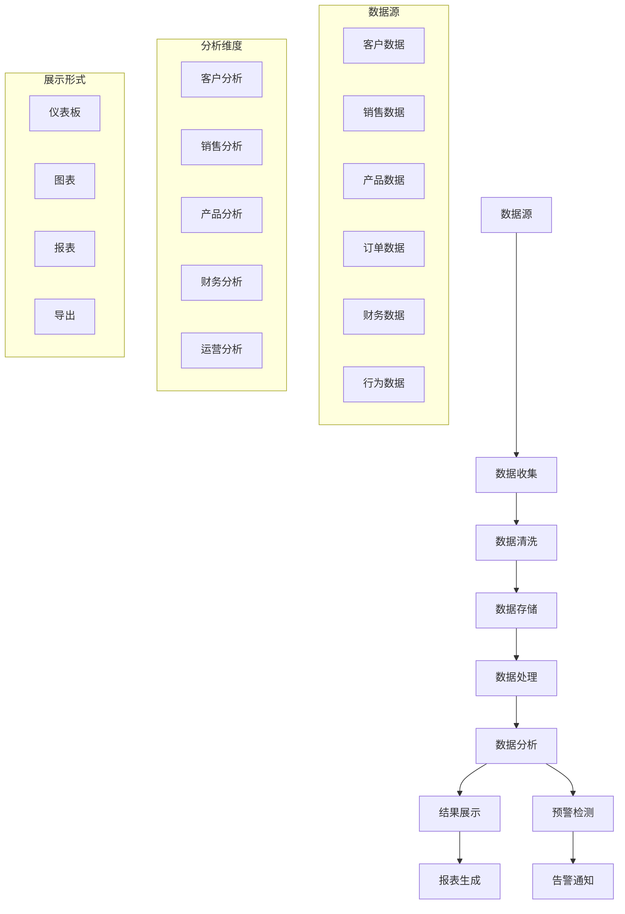

# 数据分析模块设计

## 1. 模块概述

数据分析模块是企业级CRM系统的核心组件，负责收集、处理、分析和展示业务数据，为管理层决策提供数据支撑。该模块通过多维度的数据分析，帮助企业深入了解客户行为、销售趋势、业务绩效等关键指标。

### 1.1 功能目标

1. **数据收集与整合**：从各业务模块收集数据，建立统一的数据仓库
2. **实时数据处理**：支持实时数据流处理和批量数据处理
3. **多维度分析**：提供客户分析、销售分析、业务分析等多个维度
4. **可视化展示**：丰富的图表和仪表板展示分析结果
5. **自定义报表**：支持用户自定义报表和数据导出
6. **预警机制**：基于数据分析的业务预警和异常检测

### 1.2 业务流程



## 2. 数据库设计

### 2.1 数据仓库表结构

#### 2.1.1 事实表

```sql
-- 销售事实表
CREATE TABLE fact_sales (
    id BIGINT PRIMARY KEY AUTO_INCREMENT,
    date_key INT NOT NULL,
    customer_key INT NOT NULL,
    product_key INT NOT NULL,
    salesperson_key INT NOT NULL,
    order_id BIGINT NOT NULL,
    quantity DECIMAL(10,2) NOT NULL,
    unit_price DECIMAL(10,2) NOT NULL,
    total_amount DECIMAL(10,2) NOT NULL,
    discount_amount DECIMAL(10,2) DEFAULT 0,
    cost_amount DECIMAL(10,2) NOT NULL,
    profit_amount DECIMAL(10,2) NOT NULL,
    created_at TIMESTAMP DEFAULT CURRENT_TIMESTAMP,
    updated_at TIMESTAMP DEFAULT CURRENT_TIMESTAMP ON UPDATE CURRENT_TIMESTAMP,
    
    INDEX idx_date_key (date_key),
    INDEX idx_customer_key (customer_key),
    INDEX idx_product_key (product_key),
    INDEX idx_salesperson_key (salesperson_key),
    INDEX idx_order_id (order_id),
    INDEX idx_created_at (created_at)
);

-- 客户行为事实表
CREATE TABLE fact_customer_behavior (
    id BIGINT PRIMARY KEY AUTO_INCREMENT,
    date_key INT NOT NULL,
    customer_key INT NOT NULL,
    behavior_type ENUM('visit', 'inquiry', 'quote_request', 'order', 'payment', 'complaint') NOT NULL,
    channel ENUM('web', 'mobile', 'phone', 'email', 'offline') NOT NULL,
    duration_seconds INT DEFAULT 0,
    page_views INT DEFAULT 0,
    conversion_value DECIMAL(10,2) DEFAULT 0,
    session_id VARCHAR(64),
    ip_address VARCHAR(45),
    user_agent TEXT,
    created_at TIMESTAMP DEFAULT CURRENT_TIMESTAMP,
    
    INDEX idx_date_key (date_key),
    INDEX idx_customer_key (customer_key),
    INDEX idx_behavior_type (behavior_type),
    INDEX idx_channel (channel),
    INDEX idx_session_id (session_id),
    INDEX idx_created_at (created_at)
);

-- 财务事实表
CREATE TABLE fact_finance (
    id BIGINT PRIMARY KEY AUTO_INCREMENT,
    date_key INT NOT NULL,
    customer_key INT NOT NULL,
    transaction_type ENUM('income', 'expense', 'receivable', 'payable') NOT NULL,
    category VARCHAR(50) NOT NULL,
    amount DECIMAL(10,2) NOT NULL,
    currency VARCHAR(3) DEFAULT 'CNY',
    exchange_rate DECIMAL(8,4) DEFAULT 1.0000,
    reference_id BIGINT,
    reference_type VARCHAR(50),
    description TEXT,
    created_at TIMESTAMP DEFAULT CURRENT_TIMESTAMP,
    
    INDEX idx_date_key (date_key),
    INDEX idx_customer_key (customer_key),
    INDEX idx_transaction_type (transaction_type),
    INDEX idx_category (category),
    INDEX idx_reference (reference_type, reference_id),
    INDEX idx_created_at (created_at)
);
```

#### 2.1.2 维度表

```sql
-- 日期维度表
CREATE TABLE dim_date (
    date_key INT PRIMARY KEY,
    full_date DATE NOT NULL,
    year INT NOT NULL,
    quarter INT NOT NULL,
    month INT NOT NULL,
    week INT NOT NULL,
    day INT NOT NULL,
    weekday INT NOT NULL,
    is_weekend BOOLEAN DEFAULT FALSE,
    is_holiday BOOLEAN DEFAULT FALSE,
    holiday_name VARCHAR(100),
    fiscal_year INT NOT NULL,
    fiscal_quarter INT NOT NULL,
    fiscal_month INT NOT NULL,
    
    UNIQUE KEY uk_full_date (full_date),
    INDEX idx_year_month (year, month),
    INDEX idx_fiscal_year_quarter (fiscal_year, fiscal_quarter)
);

-- 客户维度表
CREATE TABLE dim_customer (
    customer_key INT PRIMARY KEY AUTO_INCREMENT,
    customer_id BIGINT NOT NULL,
    customer_name VARCHAR(200) NOT NULL,
    customer_type ENUM('individual', 'enterprise') NOT NULL,
    industry VARCHAR(100),
    region VARCHAR(100),
    city VARCHAR(100),
    customer_level ENUM('A', 'B', 'C', 'D') NOT NULL,
    registration_date DATE,
    first_order_date DATE,
    last_order_date DATE,
    total_orders INT DEFAULT 0,
    total_amount DECIMAL(10,2) DEFAULT 0,
    is_active BOOLEAN DEFAULT TRUE,
    created_at TIMESTAMP DEFAULT CURRENT_TIMESTAMP,
    updated_at TIMESTAMP DEFAULT CURRENT_TIMESTAMP ON UPDATE CURRENT_TIMESTAMP,
    
    UNIQUE KEY uk_customer_id (customer_id),
    INDEX idx_customer_type (customer_type),
    INDEX idx_industry (industry),
    INDEX idx_region (region),
    INDEX idx_customer_level (customer_level),
    INDEX idx_registration_date (registration_date)
);

-- 产品维度表
CREATE TABLE dim_product (
    product_key INT PRIMARY KEY AUTO_INCREMENT,
    product_id BIGINT NOT NULL,
    product_name VARCHAR(200) NOT NULL,
    product_code VARCHAR(100) NOT NULL,
    category_id INT NOT NULL,
    category_name VARCHAR(100) NOT NULL,
    brand VARCHAR(100),
    unit VARCHAR(20),
    cost_price DECIMAL(10,2),
    sale_price DECIMAL(10,2),
    is_active BOOLEAN DEFAULT TRUE,
    created_at TIMESTAMP DEFAULT CURRENT_TIMESTAMP,
    updated_at TIMESTAMP DEFAULT CURRENT_TIMESTAMP ON UPDATE CURRENT_TIMESTAMP,
    
    UNIQUE KEY uk_product_id (product_id),
    INDEX idx_product_code (product_code),
    INDEX idx_category (category_id),
    INDEX idx_brand (brand),
    INDEX idx_is_active (is_active)
);

-- 销售人员维度表
CREATE TABLE dim_salesperson (
    salesperson_key INT PRIMARY KEY AUTO_INCREMENT,
    user_id BIGINT NOT NULL,
    name VARCHAR(100) NOT NULL,
    employee_id VARCHAR(50),
    department VARCHAR(100),
    position VARCHAR(100),
    hire_date DATE,
    manager_id BIGINT,
    region VARCHAR(100),
    is_active BOOLEAN DEFAULT TRUE,
    created_at TIMESTAMP DEFAULT CURRENT_TIMESTAMP,
    updated_at TIMESTAMP DEFAULT CURRENT_TIMESTAMP ON UPDATE CURRENT_TIMESTAMP,
    
    UNIQUE KEY uk_user_id (user_id),
    INDEX idx_employee_id (employee_id),
    INDEX idx_department (department),
    INDEX idx_manager_id (manager_id),
    INDEX idx_region (region)
);
```

### 2.2 分析配置表

```sql
-- 分析指标配置表
CREATE TABLE analysis_metrics (
    id BIGINT PRIMARY KEY AUTO_INCREMENT,
    metric_code VARCHAR(100) NOT NULL,
    metric_name VARCHAR(200) NOT NULL,
    metric_type ENUM('count', 'sum', 'avg', 'max', 'min', 'ratio', 'growth') NOT NULL,
    data_source VARCHAR(100) NOT NULL,
    calculation_formula TEXT,
    unit VARCHAR(20),
    decimal_places INT DEFAULT 2,
    is_percentage BOOLEAN DEFAULT FALSE,
    category VARCHAR(100),
    description TEXT,
    is_active BOOLEAN DEFAULT TRUE,
    created_by BIGINT NOT NULL,
    created_at TIMESTAMP DEFAULT CURRENT_TIMESTAMP,
    updated_at TIMESTAMP DEFAULT CURRENT_TIMESTAMP ON UPDATE CURRENT_TIMESTAMP,
    
    UNIQUE KEY uk_metric_code (metric_code),
    INDEX idx_metric_type (metric_type),
    INDEX idx_category (category),
    INDEX idx_is_active (is_active)
);

-- 仪表板配置表
CREATE TABLE analysis_dashboards (
    id BIGINT PRIMARY KEY AUTO_INCREMENT,
    dashboard_code VARCHAR(100) NOT NULL,
    dashboard_name VARCHAR(200) NOT NULL,
    description TEXT,
    layout_config JSON,
    refresh_interval INT DEFAULT 300, -- 刷新间隔（秒）
    is_public BOOLEAN DEFAULT FALSE,
    created_by BIGINT NOT NULL,
    created_at TIMESTAMP DEFAULT CURRENT_TIMESTAMP,
    updated_at TIMESTAMP DEFAULT CURRENT_TIMESTAMP ON UPDATE CURRENT_TIMESTAMP,
    
    UNIQUE KEY uk_dashboard_code (dashboard_code),
    INDEX idx_created_by (created_by),
    INDEX idx_is_public (is_public)
);

-- 图表配置表
CREATE TABLE analysis_charts (
    id BIGINT PRIMARY KEY AUTO_INCREMENT,
    chart_code VARCHAR(100) NOT NULL,
    chart_name VARCHAR(200) NOT NULL,
    chart_type ENUM('line', 'bar', 'pie', 'area', 'scatter', 'gauge', 'table') NOT NULL,
    dashboard_id BIGINT,
    data_source VARCHAR(100) NOT NULL,
    query_config JSON NOT NULL,
    chart_config JSON NOT NULL,
    position_x INT DEFAULT 0,
    position_y INT DEFAULT 0,
    width INT DEFAULT 6,
    height INT DEFAULT 4,
    is_active BOOLEAN DEFAULT TRUE,
    created_by BIGINT NOT NULL,
    created_at TIMESTAMP DEFAULT CURRENT_TIMESTAMP,
    updated_at TIMESTAMP DEFAULT CURRENT_TIMESTAMP ON UPDATE CURRENT_TIMESTAMP,
    
    UNIQUE KEY uk_chart_code (chart_code),
    INDEX idx_dashboard_id (dashboard_id),
    INDEX idx_chart_type (chart_type),
    INDEX idx_created_by (created_by),
    FOREIGN KEY (dashboard_id) REFERENCES analysis_dashboards(id) ON DELETE CASCADE
);

-- 报表配置表
CREATE TABLE analysis_reports (
    id BIGINT PRIMARY KEY AUTO_INCREMENT,
    report_code VARCHAR(100) NOT NULL,
    report_name VARCHAR(200) NOT NULL,
    report_type ENUM('standard', 'custom', 'scheduled') NOT NULL,
    template_config JSON NOT NULL,
    data_config JSON NOT NULL,
    schedule_config JSON,
    output_format ENUM('pdf', 'excel', 'csv', 'html') DEFAULT 'pdf',
    is_active BOOLEAN DEFAULT TRUE,
    created_by BIGINT NOT NULL,
    created_at TIMESTAMP DEFAULT CURRENT_TIMESTAMP,
    updated_at TIMESTAMP DEFAULT CURRENT_TIMESTAMP ON UPDATE CURRENT_TIMESTAMP,
    
    UNIQUE KEY uk_report_code (report_code),
    INDEX idx_report_type (report_type),
    INDEX idx_created_by (created_by),
    INDEX idx_is_active (is_active)
);

-- 数据预警配置表
CREATE TABLE analysis_alerts (
    id BIGINT PRIMARY KEY AUTO_INCREMENT,
    alert_code VARCHAR(100) NOT NULL,
    alert_name VARCHAR(200) NOT NULL,
    metric_code VARCHAR(100) NOT NULL,
    condition_type ENUM('threshold', 'change_rate', 'anomaly') NOT NULL,
    condition_config JSON NOT NULL,
    notification_config JSON NOT NULL,
    check_interval INT DEFAULT 3600, -- 检查间隔（秒）
    is_active BOOLEAN DEFAULT TRUE,
    last_check_at TIMESTAMP NULL,
    last_alert_at TIMESTAMP NULL,
    created_by BIGINT NOT NULL,
    created_at TIMESTAMP DEFAULT CURRENT_TIMESTAMP,
    updated_at TIMESTAMP DEFAULT CURRENT_TIMESTAMP ON UPDATE CURRENT_TIMESTAMP,
    
    UNIQUE KEY uk_alert_code (alert_code),
    INDEX idx_metric_code (metric_code),
    INDEX idx_condition_type (condition_type),
    INDEX idx_is_active (is_active),
    INDEX idx_last_check_at (last_check_at)
);
```

## 3. API接口设计

### 3.1 数据分析接口

```typescript
// 获取仪表板数据
GET /api/analysis/dashboards/{dashboardCode}/data
Query Parameters:
- dateRange: string (可选，日期范围，如 "2024-01-01,2024-01-31")
- filters: string (可选，过滤条件JSON字符串)
- refresh: boolean (可选，是否强制刷新缓存)

Response:
{
  "code": 200,
  "message": "success",
  "data": {
    "dashboard": {
      "code": "sales_overview",
      "name": "销售概览",
      "lastUpdated": "2024-01-15T10:30:00Z"
    },
    "charts": [
      {
        "code": "sales_trend",
        "name": "销售趋势",
        "type": "line",
        "data": {
          "categories": ["2024-01", "2024-02", "2024-03"],
          "series": [
            {
              "name": "销售额",
              "data": [1000000, 1200000, 1100000]
            }
          ]
        }
      }
    ]
  }
}

// 获取指标数据
GET /api/analysis/metrics/{metricCode}/data
Query Parameters:
- dateRange: string (必需，日期范围)
- dimensions: string (可选，维度字段，逗号分隔)
- filters: string (可选，过滤条件JSON字符串)
- groupBy: string (可选，分组字段)

Response:
{
  "code": 200,
  "message": "success",
  "data": {
    "metric": {
      "code": "total_sales",
      "name": "总销售额",
      "value": 5000000,
      "unit": "元",
      "change": {
        "value": 15.5,
        "type": "increase"
      }
    },
    "breakdown": [
      {
        "dimension": "华东区",
        "value": 2000000,
        "percentage": 40
      },
      {
        "dimension": "华南区", 
        "value": 1500000,
        "percentage": 30
      }
    ]
  }
}

// 创建自定义报表
POST /api/analysis/reports/custom
Request Body:
{
  "reportName": "客户分析报表",
  "dataSource": "customer_analysis",
  "dateRange": "2024-01-01,2024-01-31",
  "dimensions": ["region", "customerLevel"],
  "metrics": ["customerCount", "totalSales", "avgOrderValue"],
  "filters": {
    "customerType": "enterprise"
  },
  "outputFormat": "excel"
}

Response:
{
  "code": 200,
  "message": "报表生成中",
  "data": {
    "taskId": "report_task_123456",
    "estimatedTime": 30
  }
}

// 获取报表生成状态
GET /api/analysis/reports/tasks/{taskId}/status

Response:
{
  "code": 200,
  "message": "success",
  "data": {
    "taskId": "report_task_123456",
    "status": "completed",
    "progress": 100,
    "downloadUrl": "/api/analysis/reports/download/report_123456.xlsx",
    "createdAt": "2024-01-15T10:30:00Z",
    "completedAt": "2024-01-15T10:30:30Z"
  }
}
```

## 8. 监控与告警

### 8.1 业务监控

```typescript
// services/AnalysisMonitoringService.ts
export class AnalysisMonitoringService {
  private metricsCollector: MetricsCollector;
  private alertManager: AlertManager;

  constructor() {
    this.metricsCollector = new MetricsCollector();
    this.alertManager = new AlertManager();
  }

  // 记录查询性能指标
  async recordQueryMetrics(
    queryType: string,
    duration: number,
    dataSize: number,
    success: boolean
  ): Promise<void> {
    const metrics = {
      timestamp: new Date(),
      queryType,
      duration,
      dataSize,
      success,
      memoryUsage: process.memoryUsage().heapUsed,
      cpuUsage: process.cpuUsage()
    };

    await this.metricsCollector.record('query_performance', metrics);

    // 检查性能告警
    if (duration > 30000) { // 超过30秒
      await this.alertManager.sendAlert({
        type: 'performance',
        level: 'warning',
        message: `查询执行时间过长: ${duration}ms`,
        details: { queryType, duration, dataSize }
      });
    }

    if (!success) {
      await this.alertManager.sendAlert({
        type: 'error',
        level: 'error',
        message: `查询执行失败`,
        details: { queryType, duration }
      });
    }
  }

  // 记录用户行为指标
  async recordUserActivity(
    userId: number,
    action: string,
    resource: string,
    details?: any
  ): Promise<void> {
    const activity = {
      timestamp: new Date(),
      userId,
      action,
      resource,
      details,
      userAgent: details?.userAgent,
      ip: details?.ip
    };

    await this.metricsCollector.record('user_activity', activity);
  }

  // 记录系统资源使用情况
  async recordSystemMetrics(): Promise<void> {
    const systemMetrics = {
      timestamp: new Date(),
      memory: {
        used: process.memoryUsage().heapUsed,
        total: process.memoryUsage().heapTotal,
        external: process.memoryUsage().external
      },
      cpu: process.cpuUsage(),
      uptime: process.uptime()
    };

    await this.metricsCollector.record('system_metrics', systemMetrics);

    // 检查资源告警
    const memoryUsagePercent = (systemMetrics.memory.used / systemMetrics.memory.total) * 100;
    if (memoryUsagePercent > 80) {
      await this.alertManager.sendAlert({
        type: 'resource',
        level: 'warning',
        message: `内存使用率过高: ${memoryUsagePercent.toFixed(2)}%`,
        details: systemMetrics.memory
      });
    }
  }

  // 记录缓存命中率
  async recordCacheMetrics(
    cacheType: string,
    hit: boolean,
    key: string
  ): Promise<void> {
    const cacheMetrics = {
      timestamp: new Date(),
      cacheType,
      hit,
      key
    };

    await this.metricsCollector.record('cache_metrics', cacheMetrics);
  }

  // 获取性能统计报告
  async getPerformanceReport(
    startDate: Date,
    endDate: Date
  ): Promise<any> {
    const queryMetrics = await this.metricsCollector.getMetrics(
      'query_performance',
      startDate,
      endDate
    );

    const cacheMetrics = await this.metricsCollector.getMetrics(
      'cache_metrics',
      startDate,
      endDate
    );

    const systemMetrics = await this.metricsCollector.getMetrics(
      'system_metrics',
      startDate,
      endDate
    );

    return {
      queryPerformance: this.analyzeQueryPerformance(queryMetrics),
      cachePerformance: this.analyzeCachePerformance(cacheMetrics),
      systemPerformance: this.analyzeSystemPerformance(systemMetrics)
    };
  }

  // 分析查询性能
  private analyzeQueryPerformance(metrics: any[]): any {
    if (metrics.length === 0) return null;

    const durations = metrics.map(m => m.duration);
    const successRate = metrics.filter(m => m.success).length / metrics.length;

    return {
      totalQueries: metrics.length,
      successRate: successRate * 100,
      averageDuration: durations.reduce((a, b) => a + b, 0) / durations.length,
      maxDuration: Math.max(...durations),
      minDuration: Math.min(...durations),
      slowQueries: metrics.filter(m => m.duration > 10000).length
    };
  }

  // 分析缓存性能
  private analyzeCachePerformance(metrics: any[]): any {
    if (metrics.length === 0) return null;

    const hitCount = metrics.filter(m => m.hit).length;
    const hitRate = hitCount / metrics.length;

    const cacheTypes = [...new Set(metrics.map(m => m.cacheType))];
    const typeStats = cacheTypes.map(type => {
      const typeMetrics = metrics.filter(m => m.cacheType === type);
      const typeHitCount = typeMetrics.filter(m => m.hit).length;
      return {
        type,
        hitRate: typeHitCount / typeMetrics.length,
        totalRequests: typeMetrics.length
      };
    });

    return {
      overallHitRate: hitRate * 100,
      totalRequests: metrics.length,
      hitCount,
      missCount: metrics.length - hitCount,
      typeStats
    };
  }

  // 分析系统性能
  private analyzeSystemPerformance(metrics: any[]): any {
    if (metrics.length === 0) return null;

    const memoryUsages = metrics.map(m => m.memory.used);
    const avgMemoryUsage = memoryUsages.reduce((a, b) => a + b, 0) / memoryUsages.length;
    const maxMemoryUsage = Math.max(...memoryUsages);

    return {
      averageMemoryUsage: avgMemoryUsage,
      maxMemoryUsage: maxMemoryUsage,
      memoryUsageGrowth: memoryUsages[memoryUsages.length - 1] - memoryUsages[0],
      sampleCount: metrics.length
    };
  }
}

// services/MetricsCollector.ts
export class MetricsCollector {
  // 记录指标数据
  async record(metricType: string, data: any): Promise<void> {
    // 存储到时序数据库或日志系统
    const metric = {
      type: metricType,
      timestamp: new Date(),
      data
    };

    // 这里可以集成 InfluxDB、Prometheus 等时序数据库
    console.log('Recording metric:', metric);
  }

  // 获取指标数据
  async getMetrics(
    metricType: string,
    startDate: Date,
    endDate: Date
  ): Promise<any[]> {
    // 从时序数据库查询数据
    // 这里返回模拟数据
    return [];
  }
}

// services/AlertManager.ts
export class AlertManager {
  private alertChannels: AlertChannel[];

  constructor() {
    this.alertChannels = [
      new EmailAlertChannel(),
      new SlackAlertChannel(),
      new WebhookAlertChannel()
    ];
  }

  // 发送告警
  async sendAlert(alert: {
    type: string;
    level: 'info' | 'warning' | 'error' | 'critical';
    message: string;
    details?: any;
  }): Promise<void> {
    const alertData = {
      ...alert,
      timestamp: new Date(),
      id: this.generateAlertId()
    };

    // 根据告警级别选择发送渠道
    const channels = this.getChannelsForLevel(alert.level);
    
    const promises = channels.map(channel => 
      channel.send(alertData).catch(error => 
        console.error(`Failed to send alert via ${channel.name}:`, error)
      )
    );

    await Promise.all(promises);

    // 记录告警历史
    await this.recordAlert(alertData);
  }

  private getChannelsForLevel(level: string): AlertChannel[] {
    switch (level) {
      case 'critical':
        return this.alertChannels; // 所有渠道
      case 'error':
        return this.alertChannels.filter(c => c.name !== 'webhook');
      case 'warning':
        return this.alertChannels.filter(c => c.name === 'slack');
      default:
        return [];
    }
  }

  private generateAlertId(): string {
    return `alert_${Date.now()}_${Math.random().toString(36).substr(2, 9)}`;
  }

  private async recordAlert(alert: any): Promise<void> {
    // 记录告警到数据库
    console.log('Recording alert:', alert);
  }
}

// 告警渠道接口
interface AlertChannel {
  name: string;
  send(alert: any): Promise<void>;
}

class EmailAlertChannel implements AlertChannel {
  name = 'email';

  async send(alert: any): Promise<void> {
    // 发送邮件告警
    console.log('Sending email alert:', alert);
  }
}

class SlackAlertChannel implements AlertChannel {
  name = 'slack';

  async send(alert: any): Promise<void> {
    // 发送Slack告警
    console.log('Sending Slack alert:', alert);
  }
}

class WebhookAlertChannel implements AlertChannel {
  name = 'webhook';

  async send(alert: any): Promise<void> {
    // 发送Webhook告警
    console.log('Sending webhook alert:', alert);
  }
}
```

### 8.2 健康检查

```typescript
// services/HealthCheckService.ts
export class HealthCheckService {
  private checks: HealthCheck[];

  constructor() {
    this.checks = [
      new DatabaseHealthCheck(),
      new RedisHealthCheck(),
      new QueueHealthCheck(),
      new ExternalAPIHealthCheck()
    ];
  }

  // 执行所有健康检查
  async performHealthCheck(): Promise<HealthCheckResult> {
    const results = await Promise.all(
      this.checks.map(async (check) => {
        try {
          const result = await check.check();
          return {
            name: check.name,
            status: result.healthy ? 'healthy' : 'unhealthy',
            message: result.message,
            details: result.details,
            duration: result.duration
          };
        } catch (error) {
          return {
            name: check.name,
            status: 'error',
            message: error.message,
            details: null,
            duration: 0
          };
        }
      })
    );

    const overallStatus = results.every(r => r.status === 'healthy') 
      ? 'healthy' 
      : 'unhealthy';

    return {
      status: overallStatus,
      timestamp: new Date(),
      checks: results
    };
  }

  // 获取系统状态摘要
  async getSystemStatus(): Promise<any> {
    const healthCheck = await this.performHealthCheck();
    const monitoringService = new AnalysisMonitoringService();
    
    // 获取最近的性能数据
    const endDate = new Date();
    const startDate = new Date(endDate.getTime() - 24 * 60 * 60 * 1000); // 24小时前
    const performanceReport = await monitoringService.getPerformanceReport(startDate, endDate);

    return {
      health: healthCheck,
      performance: performanceReport,
      uptime: process.uptime(),
      version: process.env.APP_VERSION || '1.0.0'
    };
  }
}

// 健康检查接口
interface HealthCheck {
  name: string;
  check(): Promise<{
    healthy: boolean;
    message: string;
    details?: any;
    duration: number;
  }>;
}

interface HealthCheckResult {
  status: 'healthy' | 'unhealthy';
  timestamp: Date;
  checks: Array<{
    name: string;
    status: 'healthy' | 'unhealthy' | 'error';
    message: string;
    details: any;
    duration: number;
  }>;
}

// 数据库健康检查
class DatabaseHealthCheck implements HealthCheck {
  name = 'database';

  async check(): Promise<any> {
    const startTime = Date.now();
    
    try {
      // 执行简单的数据库查询
      // const result = await db.query('SELECT 1');
      const duration = Date.now() - startTime;
      
      return {
        healthy: true,
        message: 'Database connection is healthy',
        details: { responseTime: duration },
        duration
      };
    } catch (error) {
      return {
        healthy: false,
        message: `Database connection failed: ${error.message}`,
        details: { error: error.message },
        duration: Date.now() - startTime
      };
    }
  }
}

// Redis健康检查
class RedisHealthCheck implements HealthCheck {
  name = 'redis';

  async check(): Promise<any> {
    const startTime = Date.now();
    
    try {
      // 执行Redis ping
      // const result = await redis.ping();
      const duration = Date.now() - startTime;
      
      return {
        healthy: true,
        message: 'Redis connection is healthy',
        details: { responseTime: duration },
        duration
      };
    } catch (error) {
      return {
        healthy: false,
        message: `Redis connection failed: ${error.message}`,
        details: { error: error.message },
        duration: Date.now() - startTime
      };
    }
  }
}

// 队列健康检查
class QueueHealthCheck implements HealthCheck {
  name = 'queue';

  async check(): Promise<any> {
    const startTime = Date.now();
    
    try {
      // 检查队列状态
      const queueService = new AnalysisQueueService();
      const stats = await queueService.getQueueStats();
      const duration = Date.now() - startTime;
      
      // 检查是否有过多的失败任务
      const totalFailed = Object.values(stats).reduce((sum: number, stat: any) => sum + stat.failed, 0);
      const healthy = totalFailed < 100; // 失败任务少于100个认为健康
      
      return {
        healthy,
        message: healthy ? 'Queue is healthy' : 'Too many failed jobs in queue',
        details: stats,
        duration
      };
    } catch (error) {
      return {
        healthy: false,
        message: `Queue check failed: ${error.message}`,
        details: { error: error.message },
        duration: Date.now() - startTime
      };
    }
  }
}

// 外部API健康检查
class ExternalAPIHealthCheck implements HealthCheck {
  name = 'external_api';

  async check(): Promise<any> {
    const startTime = Date.now();
    
    try {
      // 检查外部API连接
      // const response = await fetch('https://api.example.com/health');
      const duration = Date.now() - startTime;
      
      return {
        healthy: true,
        message: 'External APIs are accessible',
        details: { responseTime: duration },
        duration
      };
    } catch (error) {
      return {
        healthy: false,
        message: `External API check failed: ${error.message}`,
        details: { error: error.message },
        duration: Date.now() - startTime
      };
    }
  }
}
```

## 9. 总结

### 9.1 模块核心功能

数据分析模块是L2C系统的重要组成部分，主要提供以下核心功能：

1. **数据收集与整合**
   - 多数据源集成（销售、客户、财务等）
   - 实时数据同步和批量数据处理
   - 数据清洗和标准化

2. **多维度分析**
   - 销售分析（趋势、排名、转化率等）
   - 客户分析（行为、价值、生命周期等）
   - 财务分析（收入、成本、利润等）
   - 自定义指标计算

3. **可视化展示**
   - 丰富的图表类型（折线图、柱状图、饼图等）
   - 交互式仪表板
   - 响应式设计，支持多设备访问

4. **报表管理**
   - 自定义报表创建
   - 定时报表生成
   - 报表导出（Excel、PDF等）
   - 报表分享和权限控制

5. **预警机制**
   - 业务指标监控
   - 异常数据检测
   - 实时告警通知

### 9.2 技术特色

1. **高性能架构**
   - 数据仓库设计，支持大数据量分析
   - 多级缓存策略，提升查询性能
   - 异步处理，避免阻塞用户操作
   - 数据库分区和索引优化

2. **安全可靠**
   - 细粒度权限控制
   - 数据加密和脱敏
   - SQL注入防护
   - 审计日志记录

3. **易于扩展**
   - 模块化设计，便于功能扩展
   - 插件化图表组件
   - 灵活的指标配置
   - 开放的API接口

4. **运维友好**
   - 完善的监控体系
   - 健康检查机制
   - 性能指标收集
   - 自动告警通知

### 9.3 业务价值

1. **决策支持**
   - 提供准确、及时的业务数据
   - 多维度分析，发现业务洞察
   - 趋势预测，支持战略规划

2. **效率提升**
   - 自动化报表生成，减少人工工作
   - 实时数据更新，提高响应速度
   - 统一的数据平台，避免数据孤岛

3. **风险控制**
   - 异常数据及时发现
   - 业务指标实时监控
   - 预警机制，降低业务风险

4. **用户体验**
   - 直观的可视化界面
   - 灵活的自定义功能
   - 移动端适配，随时随地查看数据

数据分析模块通过先进的技术架构和完善的功能设计，为L2C系统提供了强大的数据分析能力，帮助企业实现数据驱动的业务决策，提升整体运营效率和竞争优势。

### 3.2 配置管理接口

```typescript
// 获取仪表板列表
GET /api/analysis/dashboards
Query Parameters:
- page: number (可选，页码，默认1)
- size: number (可选，每页数量，默认20)
- category: string (可选，分类筛选)
- isPublic: boolean (可选，是否公开)

Response:
{
  "code": 200,
  "message": "success",
  "data": {
    "items": [
      {
        "id": 1,
        "code": "sales_overview",
        "name": "销售概览",
        "description": "销售业绩总览仪表板",
        "isPublic": true,
        "createdBy": "张三",
        "createdAt": "2024-01-01T00:00:00Z"
      }
    ],
    "total": 10,
    "page": 1,
    "size": 20
  }
}

// 创建仪表板
POST /api/analysis/dashboards
Request Body:
{
  "code": "customer_analysis",
  "name": "客户分析",
  "description": "客户行为和价值分析",
  "layoutConfig": {
    "columns": 12,
    "rows": 8,
    "gap": 16
  },
  "refreshInterval": 300,
  "isPublic": false
}

// 更新仪表板
PUT /api/analysis/dashboards/{id}
Request Body: (同创建仪表板)

// 删除仪表板
DELETE /api/analysis/dashboards/{id}

// 获取图表配置
GET /api/analysis/charts/{chartCode}/config

Response:
{
  "code": 200,
  "message": "success",
  "data": {
    "code": "sales_trend",
    "name": "销售趋势",
    "type": "line",
    "dataSource": "fact_sales",
    "queryConfig": {
      "dimensions": ["date_key"],
      "metrics": ["total_amount"],
      "filters": {},
      "groupBy": "month",
      "orderBy": "date_key"
    },
    "chartConfig": {
      "xAxis": {
        "type": "category",
        "title": "月份"
      },
      "yAxis": {
        "type": "value",
        "title": "销售额（元）"
      },
      "series": {
        "type": "line",
        "smooth": true
      }
    }
  }
}
```

## 4. 核心业务逻辑

### 4.1 数据分析服务

```typescript
// services/AnalysisService.ts
export class AnalysisService {
  private dataWarehouse: DataWarehouseService;
  private cacheService: CacheService;
  private metricCalculator: MetricCalculator;

  constructor() {
    this.dataWarehouse = new DataWarehouseService();
    this.cacheService = new CacheService();
    this.metricCalculator = new MetricCalculator();
  }

  // 获取仪表板数据
  async getDashboardData(
    dashboardCode: string,
    options: {
      dateRange?: [string, string];
      filters?: Record<string, any>;
      refresh?: boolean;
    } = {}
  ): Promise<DashboardData> {
    const cacheKey = `dashboard:${dashboardCode}:${JSON.stringify(options)}`;
    
    // 检查缓存
    if (!options.refresh) {
      const cached = await this.cacheService.get(cacheKey);
      if (cached) {
        return cached;
      }
    }

    // 获取仪表板配置
    const dashboard = await this.getDashboardConfig(dashboardCode);
    if (!dashboard) {
      throw new Error(`Dashboard ${dashboardCode} not found`);
    }

    // 获取图表数据
    const chartDataPromises = dashboard.charts.map(chart => 
      this.getChartData(chart.code, options)
    );
    
    const chartsData = await Promise.all(chartDataPromises);

    const result: DashboardData = {
      dashboard: {
        code: dashboard.code,
        name: dashboard.name,
        lastUpdated: new Date().toISOString()
      },
      charts: chartsData
    };

    // 缓存结果
    await this.cacheService.set(cacheKey, result, 300); // 5分钟缓存

    return result;
  }

  // 获取图表数据
  async getChartData(
    chartCode: string,
    options: {
      dateRange?: [string, string];
      filters?: Record<string, any>;
    } = {}
  ): Promise<ChartData> {
    const chart = await this.getChartConfig(chartCode);
    if (!chart) {
      throw new Error(`Chart ${chartCode} not found`);
    }

    const queryConfig = {
      ...chart.queryConfig,
      ...options
    };

    const rawData = await this.dataWarehouse.query(
      chart.dataSource,
      queryConfig
    );

    return this.formatChartData(rawData, chart);
  }

  // 获取指标数据
  async getMetricData(
    metricCode: string,
    options: {
      dateRange: [string, string];
      dimensions?: string[];
      filters?: Record<string, any>;
      groupBy?: string;
    }
  ): Promise<MetricData> {
    const metric = await this.getMetricConfig(metricCode);
    if (!metric) {
      throw new Error(`Metric ${metricCode} not found`);
    }

    // 计算指标值
    const currentValue = await this.metricCalculator.calculate(
      metric,
      options
    );

    // 计算同比/环比
    const previousPeriod = this.getPreviousPeriod(options.dateRange);
    const previousValue = await this.metricCalculator.calculate(
      metric,
      { ...options, dateRange: previousPeriod }
    );

    const change = this.calculateChange(currentValue, previousValue);

    // 获取维度分解数据
    let breakdown = [];
    if (options.dimensions && options.dimensions.length > 0) {
      breakdown = await this.getMetricBreakdown(metric, options);
    }

    return {
      metric: {
        code: metric.code,
        name: metric.name,
        value: currentValue,
        unit: metric.unit,
        change
      },
      breakdown
    };
  }

  // 生成自定义报表
  async generateCustomReport(config: CustomReportConfig): Promise<string> {
    const taskId = `report_task_${Date.now()}`;
    
    // 异步生成报表
    this.processReportGeneration(taskId, config).catch(error => {
      console.error(`Report generation failed for task ${taskId}:`, error);
    });

    return taskId;
  }

  // 处理报表生成
  private async processReportGeneration(
    taskId: string,
    config: CustomReportConfig
  ): Promise<void> {
    try {
      // 更新任务状态
      await this.updateReportTaskStatus(taskId, 'processing', 0);

      // 查询数据
      const data = await this.dataWarehouse.query(
        config.dataSource,
        {
          dateRange: config.dateRange,
          dimensions: config.dimensions,
          metrics: config.metrics,
          filters: config.filters
        }
      );

      await this.updateReportTaskStatus(taskId, 'processing', 50);

      // 生成报表文件
      const reportGenerator = new ReportGenerator();
      const filePath = await reportGenerator.generate(
        data,
        config,
        taskId
      );

      await this.updateReportTaskStatus(taskId, 'completed', 100, filePath);

    } catch (error) {
      await this.updateReportTaskStatus(taskId, 'failed', 0, null, error.message);
    }
  }

  // 格式化图表数据
  private formatChartData(rawData: any[], chart: ChartConfig): ChartData {
    const { chartConfig } = chart;

    switch (chart.type) {
      case 'line':
      case 'bar':
      case 'area':
        return this.formatSeriesData(rawData, chartConfig);
      
      case 'pie':
        return this.formatPieData(rawData, chartConfig);
      
      case 'gauge':
        return this.formatGaugeData(rawData, chartConfig);
      
      case 'table':
        return this.formatTableData(rawData, chartConfig);
      
      default:
        throw new Error(`Unsupported chart type: ${chart.type}`);
    }
  }

  private formatSeriesData(rawData: any[], config: any): ChartData {
    const categories = [...new Set(rawData.map(item => item.category))];
    const series = [];

    // 按系列分组数据
    const seriesMap = new Map();
    rawData.forEach(item => {
      if (!seriesMap.has(item.series)) {
        seriesMap.set(item.series, []);
      }
      seriesMap.get(item.series).push(item);
    });

    // 构建系列数据
    seriesMap.forEach((data, seriesName) => {
      const seriesData = categories.map(category => {
        const item = data.find(d => d.category === category);
        return item ? item.value : 0;
      });

      series.push({
        name: seriesName,
        data: seriesData
      });
    });

    return {
      categories,
      series
    };
  }

  private formatPieData(rawData: any[], config: any): ChartData {
    return {
      series: rawData.map(item => ({
        name: item.name,
        value: item.value
      }))
    };
  }

  private formatGaugeData(rawData: any[], config: any): ChartData {
    const item = rawData[0];
    return {
      value: item.value,
      max: config.max || 100,
      min: config.min || 0
    };
  }

  private formatTableData(rawData: any[], config: any): ChartData {
    return {
      columns: config.columns,
      data: rawData
    };
  }

  // 计算变化率
  private calculateChange(current: number, previous: number): ChangeData {
    if (previous === 0) {
      return {
        value: current > 0 ? 100 : 0,
        type: current > 0 ? 'increase' : 'stable'
      };
    }

    const changeValue = ((current - previous) / previous) * 100;
    return {
      value: Math.abs(changeValue),
      type: changeValue > 0 ? 'increase' : changeValue < 0 ? 'decrease' : 'stable'
    };
  }

  // 获取上一周期
  private getPreviousPeriod(dateRange: [string, string]): [string, string] {
    const [start, end] = dateRange;
    const startDate = new Date(start);
    const endDate = new Date(end);
    const duration = endDate.getTime() - startDate.getTime();

    const previousEnd = new Date(startDate.getTime() - 1);
    const previousStart = new Date(previousEnd.getTime() - duration);

    return [
      previousStart.toISOString().split('T')[0],
      previousEnd.toISOString().split('T')[0]
    ];
  }

  // 获取指标分解数据
  private async getMetricBreakdown(
    metric: MetricConfig,
    options: any
  ): Promise<BreakdownData[]> {
    const breakdownData = await this.dataWarehouse.query(
      metric.dataSource,
      {
        ...options,
        groupBy: options.dimensions[0]
      }
    );

    const total = breakdownData.reduce((sum, item) => sum + item.value, 0);

    return breakdownData.map(item => ({
      dimension: item.dimension,
      value: item.value,
      percentage: total > 0 ? (item.value / total) * 100 : 0
    }));
  }

  // 辅助方法
  private async getDashboardConfig(code: string): Promise<DashboardConfig | null> {
    // 从数据库获取仪表板配置
    return null;
  }

  private async getChartConfig(code: string): Promise<ChartConfig | null> {
    // 从数据库获取图表配置
    return null;
  }

  private async getMetricConfig(code: string): Promise<MetricConfig | null> {
    // 从数据库获取指标配置
    return null;
  }

  private async updateReportTaskStatus(
    taskId: string,
    status: string,
    progress: number,
    filePath?: string,
    error?: string
  ): Promise<void> {
    // 更新报表任务状态
  }
}

// 类型定义
interface DashboardData {
  dashboard: {
    code: string;
    name: string;
    lastUpdated: string;
  };
  charts: ChartData[];
}

interface ChartData {
  code?: string;
  name?: string;
  type?: string;
  categories?: string[];
  series?: any[];
  value?: number;
  max?: number;
  min?: number;
  columns?: any[];
  data?: any[];
}

interface MetricData {
  metric: {
    code: string;
    name: string;
    value: number;
    unit?: string;
    change: ChangeData;
  };
  breakdown: BreakdownData[];
}

interface ChangeData {
  value: number;
  type: 'increase' | 'decrease' | 'stable';
}

interface BreakdownData {
  dimension: string;
  value: number;
  percentage: number;
}

interface CustomReportConfig {
  reportName: string;
  dataSource: string;
  dateRange: [string, string];
  dimensions: string[];
  metrics: string[];
  filters: Record<string, any>;
  outputFormat: 'pdf' | 'excel' | 'csv' | 'html';
}

interface DashboardConfig {
  code: string;
  name: string;
  charts: ChartConfig[];
}

interface ChartConfig {
  code: string;
  name: string;
  type: string;
  dataSource: string;
  queryConfig: any;
  chartConfig: any;
}

interface MetricConfig {
  code: string;
  name: string;
  type: string;
  dataSource: string;
  unit?: string;
}
```

### 4.2 数据仓库服务

```typescript
// services/DataWarehouseService.ts
export class DataWarehouseService {
  private connection: any;
  private queryBuilder: QueryBuilder;

  constructor() {
    this.connection = this.createConnection();
    this.queryBuilder = new QueryBuilder();
  }

  // 执行查询
  async query(
    dataSource: string,
    config: QueryConfig
  ): Promise<any[]> {
    const sql = this.queryBuilder.build(dataSource, config);
    const params = this.queryBuilder.getParameters();

    console.log('Executing query:', sql);
    console.log('Parameters:', params);

    const result = await this.connection.query(sql, params);
    return result;
  }

  // 批量插入数据
  async batchInsert(
    tableName: string,
    data: any[],
    batchSize: number = 1000
  ): Promise<void> {
    if (data.length === 0) return;

    const columns = Object.keys(data[0]);
    const placeholders = columns.map(() => '?').join(',');
    const sql = `INSERT INTO ${tableName} (${columns.join(',')}) VALUES (${placeholders})`;

    for (let i = 0; i < data.length; i += batchSize) {
      const batch = data.slice(i, i + batchSize);
      const values = batch.map(row => columns.map(col => row[col]));
      
      await this.connection.query(sql, values);
    }
  }

  // 数据聚合
  async aggregate(
    tableName: string,
    config: AggregateConfig
  ): Promise<any[]> {
    const { dimensions, metrics, filters, groupBy, orderBy, limit } = config;

    let sql = 'SELECT ';
    
    // 构建选择字段
    const selectFields = [];
    
    if (dimensions) {
      selectFields.push(...dimensions);
    }
    
    if (metrics) {
      metrics.forEach(metric => {
        switch (metric.type) {
          case 'count':
            selectFields.push(`COUNT(${metric.field}) as ${metric.alias}`);
            break;
          case 'sum':
            selectFields.push(`SUM(${metric.field}) as ${metric.alias}`);
            break;
          case 'avg':
            selectFields.push(`AVG(${metric.field}) as ${metric.alias}`);
            break;
          case 'max':
            selectFields.push(`MAX(${metric.field}) as ${metric.alias}`);
            break;
          case 'min':
            selectFields.push(`MIN(${metric.field}) as ${metric.alias}`);
            break;
        }
      });
    }

    sql += selectFields.join(', ');
    sql += ` FROM ${tableName}`;

    // 添加过滤条件
    if (filters && Object.keys(filters).length > 0) {
      const conditions = Object.entries(filters).map(([key, value]) => {
        if (Array.isArray(value)) {
          return `${key} IN (${value.map(() => '?').join(',')})`;
        } else {
          return `${key} = ?`;
        }
      });
      sql += ` WHERE ${conditions.join(' AND ')}`;
    }

    // 添加分组
    if (groupBy) {
      sql += ` GROUP BY ${groupBy}`;
    }

    // 添加排序
    if (orderBy) {
      sql += ` ORDER BY ${orderBy}`;
    }

    // 添加限制
    if (limit) {
      sql += ` LIMIT ${limit}`;
    }

    const params = this.flattenFilterValues(filters);
    return await this.connection.query(sql, params);
  }

  // 创建数据库连接
  private createConnection(): any {
    // 创建数据库连接
    return null;
  }

  // 展平过滤器值
  private flattenFilterValues(filters: Record<string, any>): any[] {
    if (!filters) return [];
    
    const values = [];
    Object.values(filters).forEach(value => {
      if (Array.isArray(value)) {
        values.push(...value);
      } else {
        values.push(value);
      }
    });
    
    return values;
  }
}

// 查询构建器
class QueryBuilder {
  private sql: string = '';
  private parameters: any[] = [];

  build(dataSource: string, config: QueryConfig): string {
    this.sql = '';
    this.parameters = [];

    const { dimensions, metrics, filters, groupBy, orderBy, limit, dateRange } = config;

    // 构建SELECT子句
    this.buildSelectClause(dimensions, metrics);
    
    // 构建FROM子句
    this.sql += ` FROM ${dataSource}`;
    
    // 构建WHERE子句
    this.buildWhereClause(filters, dateRange);
    
    // 构建GROUP BY子句
    if (groupBy) {
      this.sql += ` GROUP BY ${groupBy}`;
    }
    
    // 构建ORDER BY子句
    if (orderBy) {
      this.sql += ` ORDER BY ${orderBy}`;
    }
    
    // 构建LIMIT子句
    if (limit) {
      this.sql += ` LIMIT ${limit}`;
    }

    return this.sql;
  }

  getParameters(): any[] {
    return this.parameters;
  }

  private buildSelectClause(dimensions?: string[], metrics?: string[]): void {
    const selectFields = [];

    if (dimensions) {
      selectFields.push(...dimensions);
    }

    if (metrics) {
      selectFields.push(...metrics);
    }

    this.sql = `SELECT ${selectFields.join(', ')}`;
  }

  private buildWhereClause(filters?: Record<string, any>, dateRange?: [string, string]): void {
    const conditions = [];

    // 添加过滤条件
    if (filters) {
      Object.entries(filters).forEach(([key, value]) => {
        if (Array.isArray(value)) {
          conditions.push(`${key} IN (${value.map(() => '?').join(',')})`);
          this.parameters.push(...value);
        } else {
          conditions.push(`${key} = ?`);
          this.parameters.push(value);
        }
      });
    }

    // 添加日期范围条件
    if (dateRange) {
      conditions.push('date_key >= ?');
      conditions.push('date_key <= ?');
      this.parameters.push(
        this.dateToKey(dateRange[0]),
        this.dateToKey(dateRange[1])
      );
    }

    if (conditions.length > 0) {
      this.sql += ` WHERE ${conditions.join(' AND ')}`;
    }
  }

  private dateToKey(dateStr: string): number {
    return parseInt(dateStr.replace(/-/g, ''));
  }
}

// 类型定义
interface QueryConfig {
  dimensions?: string[];
  metrics?: string[];
  filters?: Record<string, any>;
  groupBy?: string;
  orderBy?: string;
  limit?: number;
  dateRange?: [string, string];
}

interface AggregateConfig {
  dimensions?: string[];
  metrics?: Array<{
    type: 'count' | 'sum' | 'avg' | 'max' | 'min';
    field: string;
    alias: string;
  }>;
  filters?: Record<string, any>;
  groupBy?: string;
  orderBy?: string;
  limit?: number;
}
```

### 4.3 指标计算器

```typescript
// services/MetricCalculator.ts
export class MetricCalculator {
  private dataWarehouse: DataWarehouseService;

  constructor() {
    this.dataWarehouse = new DataWarehouseService();
  }

  // 计算指标值
  async calculate(
    metric: MetricConfig,
    options: {
      dateRange: [string, string];
      filters?: Record<string, any>;
      dimensions?: string[];
    }
  ): Promise<number> {
    switch (metric.type) {
      case 'count':
        return await this.calculateCount(metric, options);
      
      case 'sum':
        return await this.calculateSum(metric, options);
      
      case 'avg':
        return await this.calculateAverage(metric, options);
      
      case 'max':
        return await this.calculateMax(metric, options);
      
      case 'min':
        return await this.calculateMin(metric, options);
      
      case 'ratio':
        return await this.calculateRatio(metric, options);
      
      case 'growth':
        return await this.calculateGrowth(metric, options);
      
      default:
        throw new Error(`Unsupported metric type: ${metric.type}`);
    }
  }

  // 计算数量
  private async calculateCount(
    metric: MetricConfig,
    options: any
  ): Promise<number> {
    const result = await this.dataWarehouse.aggregate(
      metric.dataSource,
      {
        metrics: [{
          type: 'count',
          field: '*',
          alias: 'count_value'
        }],
        filters: options.filters,
        ...this.getDateFilter(options.dateRange)
      }
    );

    return result[0]?.count_value || 0;
  }

  // 计算总和
  private async calculateSum(
    metric: MetricConfig,
    options: any
  ): Promise<number> {
    const field = this.getMetricField(metric);
    const result = await this.dataWarehouse.aggregate(
      metric.dataSource,
      {
        metrics: [{
          type: 'sum',
          field,
          alias: 'sum_value'
        }],
        filters: options.filters,
        ...this.getDateFilter(options.dateRange)
      }
    );

    return result[0]?.sum_value || 0;
  }

  // 计算平均值
  private async calculateAverage(
    metric: MetricConfig,
    options: any
  ): Promise<number> {
    const field = this.getMetricField(metric);
    const result = await this.dataWarehouse.aggregate(
      metric.dataSource,
      {
        metrics: [{
          type: 'avg',
          field,
          alias: 'avg_value'
        }],
        filters: options.filters,
        ...this.getDateFilter(options.dateRange)
      }
    );

    return result[0]?.avg_value || 0;
  }

  // 计算最大值
  private async calculateMax(
    metric: MetricConfig,
    options: any
  ): Promise<number> {
    const field = this.getMetricField(metric);
    const result = await this.dataWarehouse.aggregate(
      metric.dataSource,
      {
        metrics: [{
          type: 'max',
          field,
          alias: 'max_value'
        }],
        filters: options.filters,
        ...this.getDateFilter(options.dateRange)
      }
    );

    return result[0]?.max_value || 0;
  }

  // 计算最小值
  private async calculateMin(
    metric: MetricConfig,
    options: any
  ): Promise<number> {
    const field = this.getMetricField(metric);
    const result = await this.dataWarehouse.aggregate(
      metric.dataSource,
      {
        metrics: [{
          type: 'min',
          field,
          alias: 'min_value'
        }],
        filters: options.filters,
        ...this.getDateFilter(options.dateRange)
      }
    );

    return result[0]?.min_value || 0;
  }

  // 计算比率
  private async calculateRatio(
    metric: MetricConfig,
    options: any
  ): Promise<number> {
    const formula = this.parseFormula(metric.calculationFormula);
    const numerator = await this.calculate(formula.numerator, options);
    const denominator = await this.calculate(formula.denominator, options);

    return denominator !== 0 ? (numerator / denominator) * 100 : 0;
  }

  // 计算增长率
  private async calculateGrowth(
    metric: MetricConfig,
    options: any
  ): Promise<number> {
    const currentValue = await this.calculateSum(metric, options);
    
    // 计算上一周期的值
    const previousPeriod = this.getPreviousPeriod(options.dateRange);
    const previousValue = await this.calculateSum(metric, {
      ...options,
      dateRange: previousPeriod
    });

    if (previousValue === 0) {
      return currentValue > 0 ? 100 : 0;
    }

    return ((currentValue - previousValue) / previousValue) * 100;
  }

  // 获取指标字段
  private getMetricField(metric: MetricConfig): string {
    // 从计算公式或配置中获取字段名
    return metric.calculationFormula || 'value';
  }

  // 获取日期过滤条件
  private getDateFilter(dateRange: [string, string]): any {
    return {
      filters: {
        date_key: {
          gte: this.dateToKey(dateRange[0]),
          lte: this.dateToKey(dateRange[1])
        }
      }
    };
  }

  // 解析计算公式
  private parseFormula(formula: string): any {
    // 解析比率计算公式，如 "metric1/metric2"
    const parts = formula.split('/');
    return {
      numerator: { code: parts[0] },
      denominator: { code: parts[1] }
    };
  }

  // 获取上一周期
  private getPreviousPeriod(dateRange: [string, string]): [string, string] {
    const [start, end] = dateRange;
    const startDate = new Date(start);
    const endDate = new Date(end);
    const duration = endDate.getTime() - startDate.getTime();

    const previousEnd = new Date(startDate.getTime() - 1);
    const previousStart = new Date(previousEnd.getTime() - duration);

    return [
      previousStart.toISOString().split('T')[0],
      previousEnd.toISOString().split('T')[0]
    ];
  }

  // 日期转换为键值
  private dateToKey(dateStr: string): number {
    return parseInt(dateStr.replace(/-/g, ''));
  }
}
```

## 5. 前端设计

### 5.1 仪表板组件

```typescript
// components/Dashboard/DashboardView.tsx
import React, { useState, useEffect } from 'react';
import { Card, Row, Col, Spin, DatePicker, Select, Button } from 'antd';
import { ReloadOutlined, DownloadOutlined } from '@ant-design/icons';
import ChartRenderer from './ChartRenderer';
import { AnalysisService } from '../../services/AnalysisService';

const { RangePicker } = DatePicker;
const { Option } = Select;

interface DashboardViewProps {
  dashboardCode: string;
}

const DashboardView: React.FC<DashboardViewProps> = ({ dashboardCode }) => {
  const [loading, setLoading] = useState(false);
  const [dashboardData, setDashboardData] = useState<any>(null);
  const [dateRange, setDateRange] = useState<[string, string]>(['2024-01-01', '2024-01-31']);
  const [filters, setFilters] = useState<Record<string, any>>({});

  const analysisService = new AnalysisService();

  useEffect(() => {
    loadDashboardData();
  }, [dashboardCode, dateRange, filters]);

  const loadDashboardData = async (refresh = false) => {
    setLoading(true);
    try {
      const data = await analysisService.getDashboardData(dashboardCode, {
        dateRange,
        filters,
        refresh
      });
      setDashboardData(data);
    } catch (error) {
      console.error('Failed to load dashboard data:', error);
    } finally {
      setLoading(false);
    }
  };

  const handleRefresh = () => {
    loadDashboardData(true);
  };

  const handleExport = () => {
    // 导出仪表板数据
  };

  const handleDateRangeChange = (dates: any) => {
    if (dates) {
      setDateRange([
        dates[0].format('YYYY-MM-DD'),
        dates[1].format('YYYY-MM-DD')
      ]);
    }
  };

  const handleFilterChange = (key: string, value: any) => {
    setFilters(prev => ({
      ...prev,
      [key]: value
    }));
  };

  if (!dashboardData) {
    return <Spin size="large" />;
  }

  return (
    <div className="dashboard-view">
      {/* 控制面板 */}
      <Card className="dashboard-controls" style={{ marginBottom: 16 }}>
        <Row gutter={16} align="middle">
          <Col>
            <RangePicker
              value={dateRange.map(date => moment(date))}
              onChange={handleDateRangeChange}
              format="YYYY-MM-DD"
            />
          </Col>
          <Col>
            <Select
              placeholder="选择区域"
              style={{ width: 120 }}
              allowClear
              onChange={(value) => handleFilterChange('region', value)}
            >
              <Option value="华东区">华东区</Option>
              <Option value="华南区">华南区</Option>
              <Option value="华北区">华北区</Option>
            </Select>
          </Col>
          <Col>
            <Select
              placeholder="客户类型"
              style={{ width: 120 }}
              allowClear
              onChange={(value) => handleFilterChange('customerType', value)}
            >
              <Option value="enterprise">企业客户</Option>
              <Option value="individual">个人客户</Option>
            </Select>
          </Col>
          <Col>
            <Button
              icon={<ReloadOutlined />}
              onClick={handleRefresh}
              loading={loading}
            >
              刷新
            </Button>
          </Col>
          <Col>
            <Button
              icon={<DownloadOutlined />}
              onClick={handleExport}
            >
              导出
            </Button>
          </Col>
        </Row>
      </Card>

      {/* 仪表板标题 */}
      <Card style={{ marginBottom: 16 }}>
        <div className="dashboard-header">
          <h2>{dashboardData.dashboard.name}</h2>
          <span className="last-updated">
            最后更新: {new Date(dashboardData.dashboard.lastUpdated).toLocaleString()}
          </span>
        </div>
      </Card>

      {/* 图表网格 */}
      <Spin spinning={loading}>
        <Row gutter={[16, 16]}>
          {dashboardData.charts.map((chart: any, index: number) => (
            <Col
              key={chart.code || index}
              xs={24}
              sm={12}
              md={chart.width || 12}
              lg={chart.width || 8}
            >
              <Card
                title={chart.name}
                style={{ height: (chart.height || 4) * 60 + 100 }}
              >
                <ChartRenderer
                  type={chart.type}
                  data={chart.data}
                  config={chart.config}
                />
              </Card>
            </Col>
          ))}
        </Row>
      </Spin>
    </div>
  );
};

export default DashboardView;
```

### 5.2 图表渲染组件

```typescript
// components/Dashboard/ChartRenderer.tsx
import React from 'react';
import {
  LineChart,
  Line,
  BarChart,
  Bar,
  PieChart,
  Pie,
  AreaChart,
  Area,
  XAxis,
  YAxis,
  CartesianGrid,
  Tooltip,
  Legend,
  ResponsiveContainer,
  Cell
} from 'recharts';
import { Table, Progress } from 'antd';

interface ChartRendererProps {
  type: string;
  data: any;
  config?: any;
}

const ChartRenderer: React.FC<ChartRendererProps> = ({ type, data, config = {} }) => {
  const colors = ['#1890ff', '#52c41a', '#faad14', '#f5222d', '#722ed1', '#13c2c2'];

  const renderLineChart = () => {
    const chartData = data.categories.map((category: string, index: number) => {
      const point: any = { category };
      data.series.forEach((series: any) => {
        point[series.name] = series.data[index];
      });
      return point;
    });

    return (
      <ResponsiveContainer width="100%" height="100%">
        <LineChart data={chartData}>
          <CartesianGrid strokeDasharray="3 3" />
          <XAxis dataKey="category" />
          <YAxis />
          <Tooltip />
          <Legend />
          {data.series.map((series: any, index: number) => (
            <Line
              key={series.name}
              type="monotone"
              dataKey={series.name}
              stroke={colors[index % colors.length]}
              strokeWidth={2}
            />
          ))}
        </LineChart>
      </ResponsiveContainer>
    );
  };

  const renderBarChart = () => {
    const chartData = data.categories.map((category: string, index: number) => {
      const point: any = { category };
      data.series.forEach((series: any) => {
        point[series.name] = series.data[index];
      });
      return point;
    });

    return (
      <ResponsiveContainer width="100%" height="100%">
        <BarChart data={chartData}>
          <CartesianGrid strokeDasharray="3 3" />
          <XAxis dataKey="category" />
          <YAxis />
          <Tooltip />
          <Legend />
          {data.series.map((series: any, index: number) => (
            <Bar
              key={series.name}
              dataKey={series.name}
              fill={colors[index % colors.length]}
            />
          ))}
        </BarChart>
      </ResponsiveContainer>
    );
  };

  const renderPieChart = () => {
    return (
      <ResponsiveContainer width="100%" height="100%">
        <PieChart>
          <Pie
            data={data.series}
            cx="50%"
            cy="50%"
            labelLine={false}
            label={({ name, percent }) => `${name} ${(percent * 100).toFixed(0)}%`}
            outerRadius={80}
            fill="#8884d8"
            dataKey="value"
          >
            {data.series.map((entry: any, index: number) => (
              <Cell key={`cell-${index}`} fill={colors[index % colors.length]} />
            ))}
          </Pie>
          <Tooltip />
        </PieChart>
      </ResponsiveContainer>
    );
  };

  const renderAreaChart = () => {
    const chartData = data.categories.map((category: string, index: number) => {
      const point: any = { category };
      data.series.forEach((series: any) => {
        point[series.name] = series.data[index];
      });
      return point;
    });

    return (
      <ResponsiveContainer width="100%" height="100%">
        <AreaChart data={chartData}>
          <CartesianGrid strokeDasharray="3 3" />
          <XAxis dataKey="category" />
          <YAxis />
          <Tooltip />
          <Legend />
          {data.series.map((series: any, index: number) => (
            <Area
              key={series.name}
              type="monotone"
              dataKey={series.name}
              stackId="1"
              stroke={colors[index % colors.length]}
              fill={colors[index % colors.length]}
            />
          ))}
        </AreaChart>
      </ResponsiveContainer>
    );
  };

  const renderGaugeChart = () => {
    const percentage = (data.value / data.max) * 100;
    
    return (
      <div style={{ textAlign: 'center', padding: '20px' }}>
        <Progress
          type="circle"
          percent={percentage}
          format={() => `${data.value}${config.unit || ''}`}
          width={120}
          strokeColor={{
            '0%': '#108ee9',
            '100%': '#87d068',
          }}
        />
        <div style={{ marginTop: 16, fontSize: 16, fontWeight: 'bold' }}>
          {config.title || '当前值'}
        </div>
      </div>
    );
  };

  const renderTable = () => {
    return (
      <Table
        columns={data.columns}
        dataSource={data.data}
        pagination={false}
        size="small"
        scroll={{ y: 200 }}
      />
    );
  };

  const renderChart = () => {
    switch (type) {
      case 'line':
        return renderLineChart();
      case 'bar':
        return renderBarChart();
      case 'pie':
        return renderPieChart();
      case 'area':
        return renderAreaChart();
      case 'gauge':
        return renderGaugeChart();
      case 'table':
        return renderTable();
      default:
        return <div>不支持的图表类型: {type}</div>;
    }
  };

  return (
    <div style={{ width: '100%', height: '100%', minHeight: 200 }}>
      {renderChart()}
    </div>
  );
};

export default ChartRenderer;
```

### 5.3 指标卡片组件

```typescript
// components/Dashboard/MetricCard.tsx
import React from 'react';
import { Card, Statistic, Row, Col } from 'antd';
import { ArrowUpOutlined, ArrowDownOutlined } from '@ant-design/icons';

interface MetricCardProps {
  title: string;
  value: number;
  unit?: string;
  change?: {
    value: number;
    type: 'increase' | 'decrease' | 'stable';
  };
  precision?: number;
  loading?: boolean;
}

const MetricCard: React.FC<MetricCardProps> = ({
  title,
  value,
  unit,
  change,
  precision = 0,
  loading = false
}) => {
  const getChangeColor = () => {
    if (!change) return undefined;
    
    switch (change.type) {
      case 'increase':
        return '#3f8600';
      case 'decrease':
        return '#cf1322';
      default:
        return '#666';
    }
  };

  const getChangeIcon = () => {
    if (!change) return null;
    
    switch (change.type) {
      case 'increase':
        return <ArrowUpOutlined />;
      case 'decrease':
        return <ArrowDownOutlined />;
      default:
        return null;
    }
  };

  return (
    <Card loading={loading}>
      <Statistic
        title={title}
        value={value}
        precision={precision}
        suffix={unit}
        valueStyle={{ color: '#1890ff' }}
      />
      
      {change && (
        <div style={{ marginTop: 16 }}>
          <Row>
            <Col span={24}>
              <Statistic
                value={change.value}
                precision={1}
                valueStyle={{ 
                  color: getChangeColor(),
                  fontSize: 14
                }}
                prefix={getChangeIcon()}
                suffix="%"
              />
            </Col>
          </Row>
        </div>
      )}
    </Card>
  );
};

export default MetricCard;
```

### 5.4 报表管理组件

```typescript
// components/Report/ReportList.tsx
import React, { useState, useEffect } from 'react';
import {
  Table,
  Button,
  Space,
  Tag,
  Modal,
  Form,
  Input,
  Select,
  DatePicker,
  message,
  Popconfirm
} from 'antd';
import {
  PlusOutlined,
  DownloadOutlined,
  EditOutlined,
  DeleteOutlined,
  EyeOutlined
} from '@ant-design/icons';
import { ReportService } from '../../services/ReportService';

const { Option } = Select;
const { RangePicker } = DatePicker;

const ReportList: React.FC = () => {
  const [loading, setLoading] = useState(false);
  const [reports, setReports] = useState([]);
  const [modalVisible, setModalVisible] = useState(false);
  const [editingReport, setEditingReport] = useState(null);
  const [form] = Form.useForm();

  const reportService = new ReportService();

  useEffect(() => {
    loadReports();
  }, []);

  const loadReports = async () => {
    setLoading(true);
    try {
      const data = await reportService.getReports();
      setReports(data.items);
    } catch (error) {
      message.error('加载报表列表失败');
    } finally {
      setLoading(false);
    }
  };

  const handleCreate = () => {
    setEditingReport(null);
    form.resetFields();
    setModalVisible(true);
  };

  const handleEdit = (record: any) => {
    setEditingReport(record);
    form.setFieldsValue(record);
    setModalVisible(true);
  };

  const handleDelete = async (id: number) => {
    try {
      await reportService.deleteReport(id);
      message.success('删除成功');
      loadReports();
    } catch (error) {
      message.error('删除失败');
    }
  };

  const handleGenerate = async (record: any) => {
    try {
      const taskId = await reportService.generateReport(record.id);
      message.success('报表生成中，请稍后查看下载列表');
      // 可以跳转到下载任务页面
    } catch (error) {
      message.error('生成报表失败');
    }
  };

  const handleSubmit = async (values: any) => {
    try {
      if (editingReport) {
        await reportService.updateReport(editingReport.id, values);
        message.success('更新成功');
      } else {
        await reportService.createReport(values);
        message.success('创建成功');
      }
      setModalVisible(false);
      loadReports();
    } catch (error) {
      message.error('操作失败');
    }
  };

  const columns = [
    {
      title: '报表名称',
      dataIndex: 'reportName',
      key: 'reportName',
    },
    {
      title: '报表类型',
      dataIndex: 'reportType',
      key: 'reportType',
      render: (type: string) => {
        const typeMap = {
          standard: { color: 'blue', text: '标准报表' },
          custom: { color: 'green', text: '自定义报表' },
          scheduled: { color: 'orange', text: '定时报表' }
        };
        const config = typeMap[type] || { color: 'default', text: type };
        return <Tag color={config.color}>{config.text}</Tag>;
      }
    },
    {
      title: '输出格式',
      dataIndex: 'outputFormat',
      key: 'outputFormat',
      render: (format: string) => format.toUpperCase()
    },
    {
      title: '状态',
      dataIndex: 'isActive',
      key: 'isActive',
      render: (isActive: boolean) => (
        <Tag color={isActive ? 'success' : 'default'}>
          {isActive ? '启用' : '禁用'}
        </Tag>
      )
    },
    {
      title: '创建时间',
      dataIndex: 'createdAt',
      key: 'createdAt',
      render: (date: string) => new Date(date).toLocaleString()
    },
    {
      title: '操作',
      key: 'action',
      render: (_, record: any) => (
        <Space size="middle">
          <Button
            type="link"
            icon={<DownloadOutlined />}
            onClick={() => handleGenerate(record)}
          >
            生成
          </Button>
          <Button
            type="link"
            icon={<EditOutlined />}
            onClick={() => handleEdit(record)}
          >
            编辑
          </Button>
          <Popconfirm
            title="确定删除这个报表吗？"
            onConfirm={() => handleDelete(record.id)}
            okText="确定"
            cancelText="取消"
          >
            <Button
              type="link"
              danger
              icon={<DeleteOutlined />}
            >
              删除
            </Button>
          </Popconfirm>
        </Space>
      ),
    },
  ];

  return (
    <div>
      <div style={{ marginBottom: 16 }}>
        <Button
          type="primary"
          icon={<PlusOutlined />}
          onClick={handleCreate}
        >
          新建报表
        </Button>
      </div>

      <Table
        columns={columns}
        dataSource={reports}
        loading={loading}
        rowKey="id"
        pagination={{
          showSizeChanger: true,
          showQuickJumper: true,
          showTotal: (total) => `共 ${total} 条记录`
        }}
      />

      <Modal
        title={editingReport ? '编辑报表' : '新建报表'}
        open={modalVisible}
        onCancel={() => setModalVisible(false)}
        onOk={() => form.submit()}
        width={600}
      >
        <Form
          form={form}
          layout="vertical"
          onFinish={handleSubmit}
        >
          <Form.Item
            name="reportName"
            label="报表名称"
            rules={[{ required: true, message: '请输入报表名称' }]}
          >
            <Input placeholder="请输入报表名称" />
          </Form.Item>

          <Form.Item
            name="reportType"
            label="报表类型"
            rules={[{ required: true, message: '请选择报表类型' }]}
          >
            <Select placeholder="请选择报表类型">
              <Option value="standard">标准报表</Option>
              <Option value="custom">自定义报表</Option>
              <Option value="scheduled">定时报表</Option>
            </Select>
          </Form.Item>

          <Form.Item
            name="dataSource"
            label="数据源"
            rules={[{ required: true, message: '请选择数据源' }]}
          >
            <Select placeholder="请选择数据源">
              <Option value="sales_analysis">销售分析</Option>
              <Option value="customer_analysis">客户分析</Option>
              <Option value="product_analysis">产品分析</Option>
              <Option value="finance_analysis">财务分析</Option>
            </Select>
          </Form.Item>

          <Form.Item
            name="outputFormat"
            label="输出格式"
            rules={[{ required: true, message: '请选择输出格式' }]}
          >
            <Select placeholder="请选择输出格式">
              <Option value="pdf">PDF</Option>
              <Option value="excel">Excel</Option>
              <Option value="csv">CSV</Option>
              <Option value="html">HTML</Option>
            </Select>
          </Form.Item>

          <Form.Item
            name="description"
            label="描述"
          >
            <Input.TextArea
              placeholder="请输入报表描述"
              rows={3}
            />
          </Form.Item>
        </Form>
      </Modal>
    </div>
  );
};

export default ReportList;
```

### 5.5 自定义报表构建器

```typescript
// components/Report/ReportBuilder.tsx
import React, { useState, useEffect } from 'react';
import {
  Card,
  Row,
  Col,
  Form,
  Input,
  Select,
  DatePicker,
  Button,
  Table,
  Tag,
  Space,
  Divider,
  message
} from 'antd';
import { PlusOutlined, MinusCircleOutlined, PlayCircleOutlined } from '@ant-design/icons';
import { ReportService } from '../../services/ReportService';

const { Option } = Select;
const { RangePicker } = DatePicker;

const ReportBuilder: React.FC = () => {
  const [form] = Form.useForm();
  const [previewData, setPreviewData] = useState([]);
  const [previewColumns, setPreviewColumns] = useState([]);
  const [loading, setLoading] = useState(false);
  const [dataSources, setDataSources] = useState([]);
  const [availableFields, setAvailableFields] = useState([]);

  const reportService = new ReportService();

  useEffect(() => {
    loadDataSources();
  }, []);

  const loadDataSources = async () => {
    try {
      const sources = await reportService.getDataSources();
      setDataSources(sources);
    } catch (error) {
      message.error('加载数据源失败');
    }
  };

  const handleDataSourceChange = async (dataSource: string) => {
    try {
      const fields = await reportService.getDataSourceFields(dataSource);
      setAvailableFields(fields);
    } catch (error) {
      message.error('加载字段失败');
    }
  };

  const handlePreview = async () => {
    try {
      const values = await form.validateFields();
      setLoading(true);
      
      const config = {
        dataSource: values.dataSource,
        dateRange: values.dateRange.map((date: any) => date.format('YYYY-MM-DD')),
        dimensions: values.dimensions || [],
        metrics: values.metrics || [],
        filters: values.filters || {}
      };

      const result = await reportService.previewReport(config);
      
      // 构建表格列
      const columns = [
        ...config.dimensions.map((dim: string) => ({
          title: dim,
          dataIndex: dim,
          key: dim
        })),
        ...config.metrics.map((metric: string) => ({
          title: metric,
          dataIndex: metric,
          key: metric,
          render: (value: number) => value?.toLocaleString()
        }))
      ];

      setPreviewColumns(columns);
      setPreviewData(result.data);
    } catch (error) {
      message.error('预览失败');
    } finally {
      setLoading(false);
    }
  };

  const handleSave = async () => {
    try {
      const values = await form.validateFields();
      
      const reportConfig = {
        reportName: values.reportName,
        reportType: 'custom',
        dataSource: values.dataSource,
        templateConfig: {
          dimensions: values.dimensions,
          metrics: values.metrics,
          filters: values.filters
        },
        dataConfig: {
          dateRange: values.dateRange.map((date: any) => date.format('YYYY-MM-DD'))
        },
        outputFormat: values.outputFormat
      };

      await reportService.createReport(reportConfig);
      message.success('报表保存成功');
      form.resetFields();
      setPreviewData([]);
      setPreviewColumns([]);
    } catch (error) {
      message.error('保存失败');
    }
  };

  return (
    <div>
      <Row gutter={24}>
        <Col span={8}>
          <Card title="报表配置" style={{ height: '100vh', overflow: 'auto' }}>
            <Form
              form={form}
              layout="vertical"
              initialValues={{
                outputFormat: 'excel'
              }}
            >
              <Form.Item
                name="reportName"
                label="报表名称"
                rules={[{ required: true, message: '请输入报表名称' }]}
              >
                <Input placeholder="请输入报表名称" />
              </Form.Item>

              <Form.Item
                name="dataSource"
                label="数据源"
                rules={[{ required: true, message: '请选择数据源' }]}
              >
                <Select
                  placeholder="请选择数据源"
                  onChange={handleDataSourceChange}
                >
                  {dataSources.map((source: any) => (
                    <Option key={source.code} value={source.code}>
                      {source.name}
                    </Option>
                  ))}
                </Select>
              </Form.Item>

              <Form.Item
                name="dateRange"
                label="日期范围"
                rules={[{ required: true, message: '请选择日期范围' }]}
              >
                <RangePicker style={{ width: '100%' }} />
              </Form.Item>

              <Form.Item label="维度字段">
                <Form.List name="dimensions">
                  {(fields, { add, remove }) => (
                    <>
                      {fields.map(({ key, name, ...restField }) => (
                        <Space key={key} style={{ display: 'flex', marginBottom: 8 }}>
                          <Form.Item
                            {...restField}
                            name={[name]}
                            style={{ margin: 0, flex: 1 }}
                          >
                            <Select placeholder="选择维度字段">
                              {availableFields
                                .filter((field: any) => field.type === 'dimension')
                                .map((field: any) => (
                                  <Option key={field.code} value={field.code}>
                                    {field.name}
                                  </Option>
                                ))}
                            </Select>
                          </Form.Item>
                          <MinusCircleOutlined onClick={() => remove(name)} />
                        </Space>
                      ))}
                      <Form.Item>
                        <Button
                          type="dashed"
                          onClick={() => add()}
                          block
                          icon={<PlusOutlined />}
                        >
                          添加维度
                        </Button>
                      </Form.Item>
                    </>
                  )}
                </Form.List>
              </Form.Item>

              <Form.Item label="指标字段">
                <Form.List name="metrics">
                  {(fields, { add, remove }) => (
                    <>
                      {fields.map(({ key, name, ...restField }) => (
                        <Space key={key} style={{ display: 'flex', marginBottom: 8 }}>
                          <Form.Item
                            {...restField}
                            name={[name]}
                            style={{ margin: 0, flex: 1 }}
                          >
                            <Select placeholder="选择指标字段">
                              {availableFields
                                .filter((field: any) => field.type === 'metric')
                                .map((field: any) => (
                                  <Option key={field.code} value={field.code}>
                                    {field.name}
                                  </Option>
                                ))}
                            </Select>
                          </Form.Item>
                          <MinusCircleOutlined onClick={() => remove(name)} />
                        </Space>
                      ))}
                      <Form.Item>
                        <Button
                          type="dashed"
                          onClick={() => add()}
                          block
                          icon={<PlusOutlined />}
                        >
                          添加指标
                        </Button>
                      </Form.Item>
                    </>
                  )}
                </Form.List>
              </Form.Item>

              <Form.Item
                name="outputFormat"
                label="输出格式"
              >
                <Select>
                  <Option value="excel">Excel</Option>
                  <Option value="pdf">PDF</Option>
                  <Option value="csv">CSV</Option>
                </Select>
              </Form.Item>

              <Divider />

              <Space style={{ width: '100%' }} direction="vertical">
                <Button
                  type="primary"
                  icon={<PlayCircleOutlined />}
                  onClick={handlePreview}
                  loading={loading}
                  block
                >
                  预览数据
                </Button>
                <Button
                  type="default"
                  onClick={handleSave}
                  block
                >
                  保存报表
                </Button>
              </Space>
            </Form>
          </Card>
        </Col>

        <Col span={16}>
          <Card title="数据预览" style={{ height: '100vh', overflow: 'auto' }}>
            {previewData.length > 0 ? (
              <Table
                columns={previewColumns}
                dataSource={previewData}
                pagination={{
                  pageSize: 20,
                  showSizeChanger: true,
                  showTotal: (total) => `共 ${total} 条记录`
                }}
                scroll={{ x: true, y: 600 }}
                size="small"
              />
            ) : (
              <div style={{ 
                textAlign: 'center', 
                padding: '100px 0',
                color: '#999'
              }}>
                请配置报表参数并点击预览数据
              </div>
            )}
          </Card>
        </Col>
      </Row>
    </div>
  );
};

export default ReportBuilder;
```

## 6. 性能优化

### 6.1 数据库优化

#### 6.1.1 索引策略

```sql
-- 事实表索引
CREATE INDEX idx_fact_sales_composite ON fact_sales (date_key, customer_key, product_key);
CREATE INDEX idx_fact_sales_amount ON fact_sales (total_amount);
CREATE INDEX idx_fact_sales_date_amount ON fact_sales (date_key, total_amount);

CREATE INDEX idx_fact_customer_behavior_composite ON fact_customer_behavior (date_key, customer_key, behavior_type);
CREATE INDEX idx_fact_customer_behavior_session ON fact_customer_behavior (session_id, created_at);

CREATE INDEX idx_fact_finance_composite ON fact_finance (date_key, customer_key, transaction_type);
CREATE INDEX idx_fact_finance_amount ON fact_finance (amount);

-- 维度表索引
CREATE INDEX idx_dim_customer_level_region ON dim_customer (customer_level, region);
CREATE INDEX idx_dim_customer_registration ON dim_customer (registration_date);
CREATE INDEX idx_dim_customer_active ON dim_customer (is_active, customer_level);

CREATE INDEX idx_dim_product_category_brand ON dim_product (category_id, brand);
CREATE INDEX idx_dim_product_price ON dim_product (sale_price);

CREATE INDEX idx_dim_salesperson_dept_region ON dim_salesperson (department, region);
CREATE INDEX idx_dim_salesperson_manager ON dim_salesperson (manager_id);
```

#### 6.1.2 分区策略

```sql
-- 按月分区事实表
CREATE TABLE fact_sales_202401 PARTITION OF fact_sales
FOR VALUES FROM ('20240101') TO ('20240201');

CREATE TABLE fact_sales_202402 PARTITION OF fact_sales
FOR VALUES FROM ('20240201') TO ('20240301');

-- 自动分区管理
CREATE OR REPLACE FUNCTION create_monthly_partition(table_name TEXT, start_date DATE)
RETURNS VOID AS $$
DECLARE
    partition_name TEXT;
    end_date DATE;
BEGIN
    partition_name := table_name || '_' || to_char(start_date, 'YYYYMM');
    end_date := start_date + INTERVAL '1 month';
    
    EXECUTE format('CREATE TABLE %I PARTITION OF %I FOR VALUES FROM (%L) TO (%L)',
                   partition_name, table_name, 
                   to_char(start_date, 'YYYYMMDD'), 
                   to_char(end_date, 'YYYYMMDD'));
END;
$$ LANGUAGE plpgsql;
```

### 6.2 缓存策略

#### 6.2.1 Redis缓存

```typescript
// services/AnalysisCacheService.ts
export class AnalysisCacheService {
  private redis: Redis;
  private defaultTTL = 300; // 5分钟

  constructor() {
    this.redis = new Redis({
      host: process.env.REDIS_HOST,
      port: parseInt(process.env.REDIS_PORT || '6379'),
      password: process.env.REDIS_PASSWORD
    });
  }

  // 缓存仪表板数据
  async cacheDashboardData(
    dashboardCode: string,
    options: any,
    data: any,
    ttl: number = this.defaultTTL
  ): Promise<void> {
    const key = this.getDashboardCacheKey(dashboardCode, options);
    await this.redis.setex(key, ttl, JSON.stringify(data));
  }

  // 获取缓存的仪表板数据
  async getCachedDashboardData(
    dashboardCode: string,
    options: any
  ): Promise<any | null> {
    const key = this.getDashboardCacheKey(dashboardCode, options);
    const cached = await this.redis.get(key);
    return cached ? JSON.parse(cached) : null;
  }

  // 缓存指标数据
  async cacheMetricData(
    metricCode: string,
    options: any,
    data: any,
    ttl: number = this.defaultTTL
  ): Promise<void> {
    const key = this.getMetricCacheKey(metricCode, options);
    await this.redis.setex(key, ttl, JSON.stringify(data));
  }

  // 获取缓存的指标数据
  async getCachedMetricData(
    metricCode: string,
    options: any
  ): Promise<any | null> {
    const key = this.getMetricCacheKey(metricCode, options);
    const cached = await this.redis.get(key);
    return cached ? JSON.parse(cached) : null;
  }

  // 清除相关缓存
  async clearRelatedCache(pattern: string): Promise<void> {
    const keys = await this.redis.keys(pattern);
    if (keys.length > 0) {
      await this.redis.del(...keys);
    }
  }

  // 批量预热缓存
  async warmupCache(configs: Array<{
    type: 'dashboard' | 'metric';
    code: string;
    options: any;
  }>): Promise<void> {
    const promises = configs.map(async (config) => {
      try {
        if (config.type === 'dashboard') {
          // 预热仪表板缓存
          const analysisService = new AnalysisService();
          const data = await analysisService.getDashboardData(config.code, config.options);
          await this.cacheDashboardData(config.code, config.options, data, 3600); // 1小时
        } else if (config.type === 'metric') {
          // 预热指标缓存
          const analysisService = new AnalysisService();
          const data = await analysisService.getMetricData(config.code, config.options);
          await this.cacheMetricData(config.code, config.options, data, 3600); // 1小时
        }
      } catch (error) {
        console.error(`Failed to warmup cache for ${config.type}:${config.code}`, error);
      }
    });

    await Promise.all(promises);
  }

  private getDashboardCacheKey(dashboardCode: string, options: any): string {
    const optionsHash = this.hashOptions(options);
    return `dashboard:${dashboardCode}:${optionsHash}`;
  }

  private getMetricCacheKey(metricCode: string, options: any): string {
    const optionsHash = this.hashOptions(options);
    return `metric:${metricCode}:${optionsHash}`;
  }

  private hashOptions(options: any): string {
    return require('crypto')
      .createHash('md5')
      .update(JSON.stringify(options))
      .digest('hex');
  }
}
```

#### 6.2.2 本地缓存

```typescript
// services/LocalCacheService.ts
import LRU from 'lru-cache';

export class LocalCacheService {
  private configCache: LRU<string, any>;
  private dataCache: LRU<string, any>;

  constructor() {
    // 配置缓存 - 长期缓存
    this.configCache = new LRU({
      max: 1000,
      ttl: 1000 * 60 * 30 // 30分钟
    });

    // 数据缓存 - 短期缓存
    this.dataCache = new LRU({
      max: 500,
      ttl: 1000 * 60 * 5 // 5分钟
    });
  }

  // 缓存配置
  cacheConfig(key: string, config: any): void {
    this.configCache.set(key, config);
  }

  // 获取配置缓存
  getConfig(key: string): any | null {
    return this.configCache.get(key) || null;
  }

  // 缓存数据
  cacheData(key: string, data: any): void {
    this.dataCache.set(key, data);
  }

  // 获取数据缓存
  getData(key: string): any | null {
    return this.dataCache.get(key) || null;
  }

  // 清除缓存
  clearCache(type: 'config' | 'data' | 'all' = 'all'): void {
    if (type === 'config' || type === 'all') {
      this.configCache.clear();
    }
    if (type === 'data' || type === 'all') {
      this.dataCache.clear();
    }
  }

  // 获取缓存统计
  getCacheStats(): any {
    return {
      config: {
        size: this.configCache.size,
        max: this.configCache.max,
        calculatedSize: this.configCache.calculatedSize
      },
      data: {
        size: this.dataCache.size,
        max: this.dataCache.max,
        calculatedSize: this.dataCache.calculatedSize
      }
    };
  }
}
```

### 6.3 异步处理优化

#### 6.3.1 消息队列

```typescript
// services/AnalysisQueueService.ts
import Bull from 'bull';

export class AnalysisQueueService {
  private reportQueue: Bull.Queue;
  private dataProcessQueue: Bull.Queue;
  private cacheWarmupQueue: Bull.Queue;

  constructor() {
    const redisConfig = {
      host: process.env.REDIS_HOST,
      port: parseInt(process.env.REDIS_PORT || '6379'),
      password: process.env.REDIS_PASSWORD
    };

    this.reportQueue = new Bull('report generation', { redis: redisConfig });
    this.dataProcessQueue = new Bull('data processing', { redis: redisConfig });
    this.cacheWarmupQueue = new Bull('cache warmup', { redis: redisConfig });

    this.setupProcessors();
  }

  private setupProcessors(): void {
    // 报表生成处理器
    this.reportQueue.process('generate', 5, async (job) => {
      const { reportConfig, taskId } = job.data;
      const reportGenerator = new ReportGenerator();
      return await reportGenerator.generate(reportConfig, taskId);
    });

    // 数据处理器
    this.dataProcessQueue.process('etl', 3, async (job) => {
      const { dataSource, config } = job.data;
      const etlProcessor = new ETLProcessor();
      return await etlProcessor.process(dataSource, config);
    });

    // 缓存预热处理器
    this.cacheWarmupQueue.process('warmup', 2, async (job) => {
      const { configs } = job.data;
      const cacheService = new AnalysisCacheService();
      return await cacheService.warmupCache(configs);
    });
  }

  // 添加报表生成任务
  async addReportGenerationJob(
    reportConfig: any,
    taskId: string,
    priority: number = 0
  ): Promise<Bull.Job> {
    return await this.reportQueue.add(
      'generate',
      { reportConfig, taskId },
      {
        priority,
        attempts: 3,
        backoff: {
          type: 'exponential',
          delay: 2000
        }
      }
    );
  }

  // 添加数据处理任务
  async addDataProcessingJob(
    dataSource: string,
    config: any,
    priority: number = 0
  ): Promise<Bull.Job> {
    return await this.dataProcessQueue.add(
      'etl',
      { dataSource, config },
      {
        priority,
        attempts: 2,
        backoff: {
          type: 'fixed',
          delay: 5000
        }
      }
    );
  }

  // 添加缓存预热任务
  async addCacheWarmupJob(configs: any[]): Promise<Bull.Job> {
    return await this.cacheWarmupQueue.add(
      'warmup',
      { configs },
      {
        delay: 1000, // 延迟1秒执行
        attempts: 1
      }
    );
  }

  // 获取队列状态
  async getQueueStats(): Promise<any> {
    const [reportStats, dataStats, cacheStats] = await Promise.all([
      this.getQueueStat(this.reportQueue),
      this.getQueueStat(this.dataProcessQueue),
      this.getQueueStat(this.cacheWarmupQueue)
    ]);

    return {
      report: reportStats,
      dataProcess: dataStats,
      cacheWarmup: cacheStats
    };
  }

  private async getQueueStat(queue: Bull.Queue): Promise<any> {
    const [waiting, active, completed, failed] = await Promise.all([
      queue.getWaiting(),
      queue.getActive(),
      queue.getCompleted(),
      queue.getFailed()
    ]);

    return {
      waiting: waiting.length,
      active: active.length,
      completed: completed.length,
      failed: failed.length
    };
  }
}
```

## 7. 安全与权限

### 7.1 权限控制

```typescript
// middleware/AnalysisPermissionMiddleware.ts
export class AnalysisPermissionMiddleware {
  private permissionService: AnalysisPermissionService;

  constructor() {
    this.permissionService = new AnalysisPermissionService();
  }

  // 检查仪表板访问权限
  checkDashboardAccess = async (req: any, res: any, next: any) => {
    try {
      const { dashboardCode } = req.params;
      const userId = req.user.id;

      const hasAccess = await this.permissionService.checkDashboardAccess(
        userId,
        dashboardCode
      );

      if (!hasAccess) {
        return res.status(403).json({
          code: 403,
          message: '无权访问此仪表板'
        });
      }

      next();
    } catch (error) {
      res.status(500).json({
        code: 500,
        message: '权限检查失败'
      });
    }
  };

  // 检查报表操作权限
  checkReportPermission = async (req: any, res: any, next: any) => {
    try {
      const { action } = req.body;
      const userId = req.user.id;

      const hasPermission = await this.permissionService.checkReportPermission(
        userId,
        action
      );

      if (!hasPermission) {
        return res.status(403).json({
          code: 403,
          message: '无权执行此操作'
        });
      }

      next();
    } catch (error) {
      res.status(500).json({
        code: 500,
        message: '权限检查失败'
      });
    }
  };

  // 检查数据访问权限
  checkDataAccess = async (req: any, res: any, next: any) => {
    try {
      const { dataSource } = req.query;
      const userId = req.user.id;

      const hasAccess = await this.permissionService.checkDataAccess(
        userId,
        dataSource
      );

      if (!hasAccess) {
        return res.status(403).json({
          code: 403,
          message: '无权访问此数据源'
        });
      }

      next();
    } catch (error) {
      res.status(500).json({
        code: 500,
        message: '权限检查失败'
      });
    }
  };
}

// services/AnalysisPermissionService.ts
export class AnalysisPermissionService {
  // 检查仪表板访问权限
  async checkDashboardAccess(userId: number, dashboardCode: string): Promise<boolean> {
    // 检查用户角色权限
    const userRoles = await this.getUserRoles(userId);
    
    // 检查仪表板是否公开
    const dashboard = await this.getDashboardConfig(dashboardCode);
    if (dashboard?.isPublic) {
      return true;
    }

    // 检查创建者权限
    if (dashboard?.createdBy === userId) {
      return true;
    }

    // 检查角色权限
    const requiredRoles = await this.getDashboardRequiredRoles(dashboardCode);
    return this.hasAnyRole(userRoles, requiredRoles);
  }

  // 检查报表权限
  async checkReportPermission(userId: number, action: string): Promise<boolean> {
    const userRoles = await this.getUserRoles(userId);
    
    const permissionMap = {
      'create': ['admin', 'analyst', 'manager'],
      'edit': ['admin', 'analyst', 'manager'],
      'delete': ['admin', 'manager'],
      'generate': ['admin', 'analyst', 'manager', 'user'],
      'export': ['admin', 'analyst', 'manager', 'user']
    };

    const requiredRoles = permissionMap[action] || [];
    return this.hasAnyRole(userRoles, requiredRoles);
  }

  // 检查数据访问权限
  async checkDataAccess(userId: number, dataSource: string): Promise<boolean> {
    const userRoles = await this.getUserRoles(userId);
    const userDepartment = await this.getUserDepartment(userId);

    // 数据源权限配置
    const dataSourcePermissions = {
      'sales_analysis': {
        roles: ['admin', 'sales_manager', 'analyst'],
        departments: ['sales', 'management']
      },
      'customer_analysis': {
        roles: ['admin', 'customer_manager', 'analyst'],
        departments: ['customer_service', 'sales', 'management']
      },
      'finance_analysis': {
        roles: ['admin', 'finance_manager', 'analyst'],
        departments: ['finance', 'management']
      }
    };

    const permissions = dataSourcePermissions[dataSource];
    if (!permissions) {
      return false;
    }

    // 检查角色权限
    if (this.hasAnyRole(userRoles, permissions.roles)) {
      return true;
    }

    // 检查部门权限
    if (permissions.departments.includes(userDepartment)) {
      return true;
    }

    return false;
  }

  // 数据行级权限过滤
  async applyDataRowFilter(userId: number, query: any): Promise<any> {
    const userDepartment = await this.getUserDepartment(userId);
    const userRegion = await this.getUserRegion(userId);
    const userRoles = await this.getUserRoles(userId);

    // 管理员可以查看所有数据
    if (userRoles.includes('admin')) {
      return query;
    }

    // 根据部门和区域过滤数据
    const filters = { ...query.filters };

    if (!userRoles.includes('manager')) {
      // 非管理者只能查看自己部门的数据
      if (userDepartment) {
        filters.department = userDepartment;
      }

      // 销售人员只能查看自己区域的数据
      if (userRoles.includes('salesperson') && userRegion) {
        filters.region = userRegion;
      }
    }

    return {
      ...query,
      filters
    };
  }

  // 辅助方法
  private async getUserRoles(userId: number): Promise<string[]> {
    // 从数据库获取用户角色
    return [];
  }

  private async getUserDepartment(userId: number): Promise<string> {
    // 从数据库获取用户部门
    return '';
  }

  private async getUserRegion(userId: number): Promise<string> {
    // 从数据库获取用户区域
    return '';
  }

  private async getDashboardConfig(dashboardCode: string): Promise<any> {
    // 从数据库获取仪表板配置
    return null;
  }

  private async getDashboardRequiredRoles(dashboardCode: string): Promise<string[]> {
    // 从数据库获取仪表板所需角色
    return [];
  }

  private hasAnyRole(userRoles: string[], requiredRoles: string[]): boolean {
    return requiredRoles.some(role => userRoles.includes(role));
  }
}
```

### 7.2 数据安全

```typescript
// services/AnalysisSecurityService.ts
export class AnalysisSecurityService {
  private encryptionKey: string;

  constructor() {
    this.encryptionKey = process.env.ANALYSIS_ENCRYPTION_KEY || 'default-key';
  }

  // 敏感数据加密
  encryptSensitiveData(data: any): any {
    const sensitiveFields = ['customerName', 'phone', 'email', 'idCard'];
    
    const encrypted = { ...data };
    sensitiveFields.forEach(field => {
      if (encrypted[field]) {
        encrypted[field] = this.encrypt(encrypted[field]);
      }
    });

    return encrypted;
  }

  // 敏感数据解密
  decryptSensitiveData(data: any): any {
    const sensitiveFields = ['customerName', 'phone', 'email', 'idCard'];
    
    const decrypted = { ...data };
    sensitiveFields.forEach(field => {
      if (decrypted[field]) {
        decrypted[field] = this.decrypt(decrypted[field]);
      }
    });

    return decrypted;
  }

  // 数据脱敏
  maskSensitiveData(data: any, userRole: string): any {
    const masked = { ...data };

    // 根据用户角色决定脱敏程度
    if (!['admin', 'manager'].includes(userRole)) {
      // 普通用户看到脱敏数据
      if (masked.customerName) {
        masked.customerName = this.maskName(masked.customerName);
      }
      if (masked.phone) {
        masked.phone = this.maskPhone(masked.phone);
      }
      if (masked.email) {
        masked.email = this.maskEmail(masked.email);
      }
    }

    return masked;
  }

  // SQL注入防护
  sanitizeQuery(query: string): string {
    // 移除危险的SQL关键字
    const dangerousKeywords = [
      'DROP', 'DELETE', 'INSERT', 'UPDATE', 'ALTER', 'CREATE',
      'EXEC', 'EXECUTE', 'UNION', 'SCRIPT', '--', ';'
    ];

    let sanitized = query;
    dangerousKeywords.forEach(keyword => {
      const regex = new RegExp(keyword, 'gi');
      sanitized = sanitized.replace(regex, '');
    });

    return sanitized;
  }

  // 参数验证
  validateQueryParameters(params: any): boolean {
    // 验证日期格式
    if (params.dateRange) {
      const dateRegex = /^\d{4}-\d{2}-\d{2}$/;
      if (!Array.isArray(params.dateRange) || 
          params.dateRange.length !== 2 ||
          !params.dateRange.every(date => dateRegex.test(date))) {
        return false;
      }
    }

    // 验证数字参数
    if (params.limit && (!Number.isInteger(params.limit) || params.limit > 10000)) {
      return false;
    }

    // 验证字符串长度
    const stringFields = ['dataSource', 'metricCode', 'dashboardCode'];
    for (const field of stringFields) {
      if (params[field] && params[field].length > 100) {
        return false;
      }
    }

    return true;
  }

  private encrypt(text: string): string {
    const crypto = require('crypto');
    const cipher = crypto.createCipher('aes-256-cbc', this.encryptionKey);
    let encrypted = cipher.update(text, 'utf8', 'hex');
    encrypted += cipher.final('hex');
    return encrypted;
  }

  private decrypt(encryptedText: string): string {
    const crypto = require('crypto');
    const decipher = crypto.createDecipher('aes-256-cbc', this.encryptionKey);
    let decrypted = decipher.update(encryptedText, 'hex', 'utf8');
    decrypted += decipher.final('utf8');
    return decrypted;
  }

  private maskName(name: string): string {
    if (name.length <= 2) return name;
    return name[0] + '*'.repeat(name.length - 2) + name[name.length - 1];
  }

  private maskPhone(phone: string): string {
    if (phone.length <= 7) return phone;
    return phone.substring(0, 3) + '****' + phone.substring(7);
  }

  private maskEmail(email: string): string {
    const [username, domain] = email.split('@');
    if (username.length <= 2) return email;
    return username[0] + '***' + username[username.length - 1] + '@' + domain;
  }
}
```
