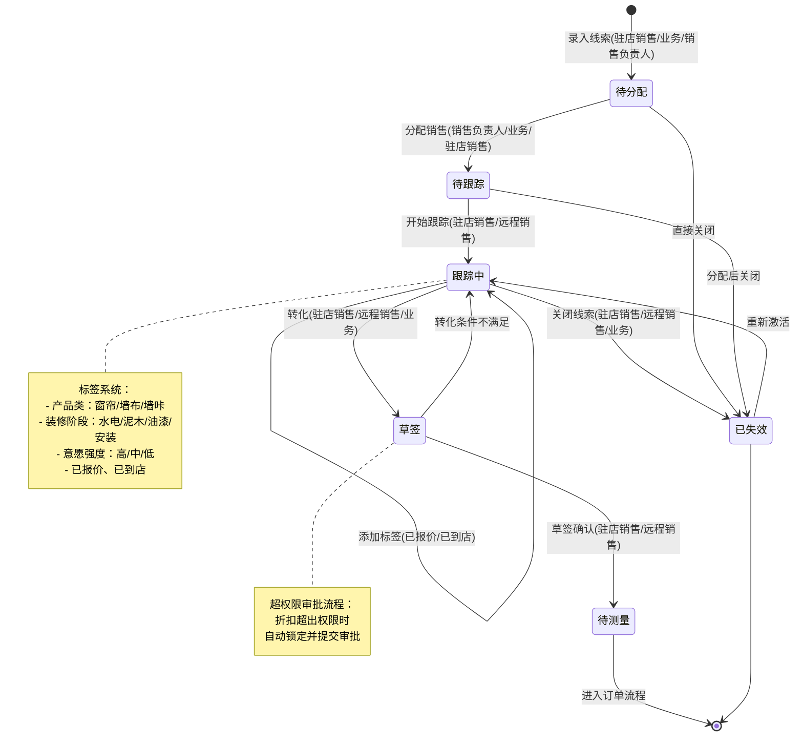
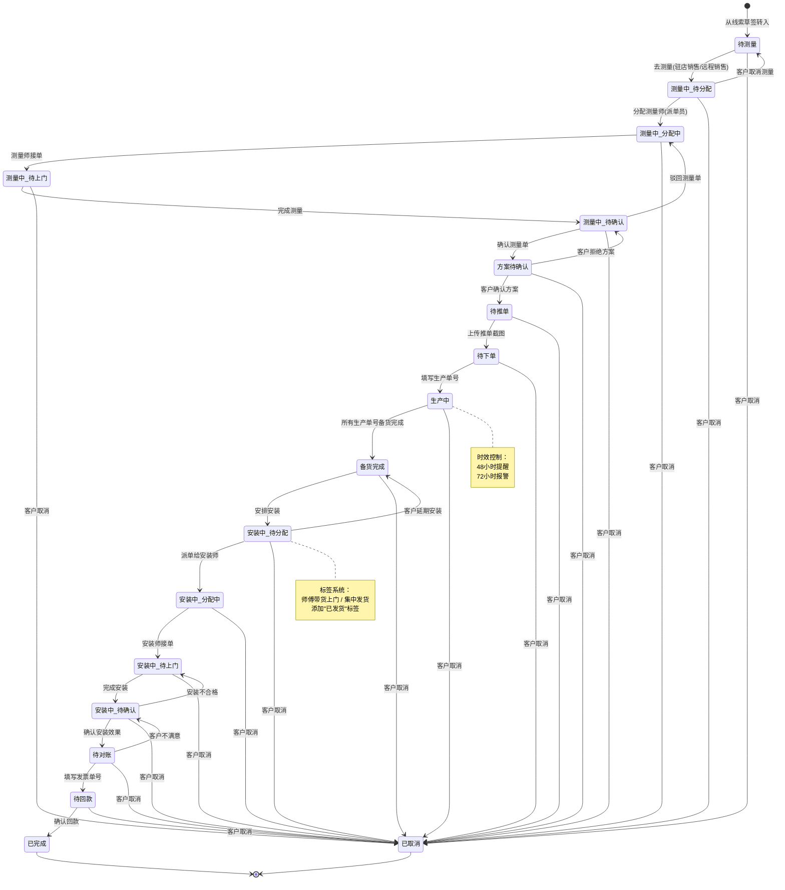
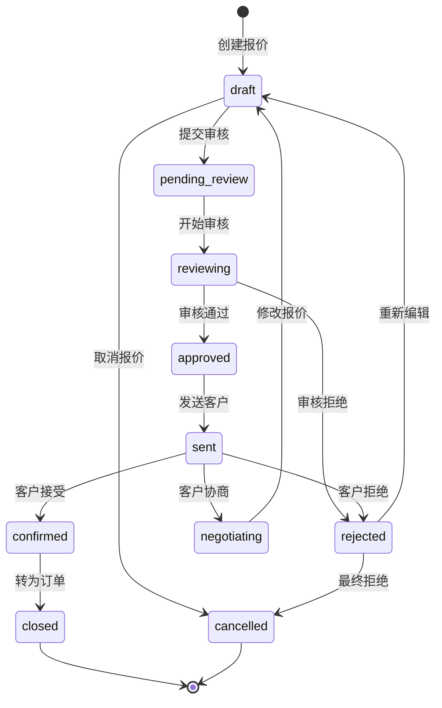
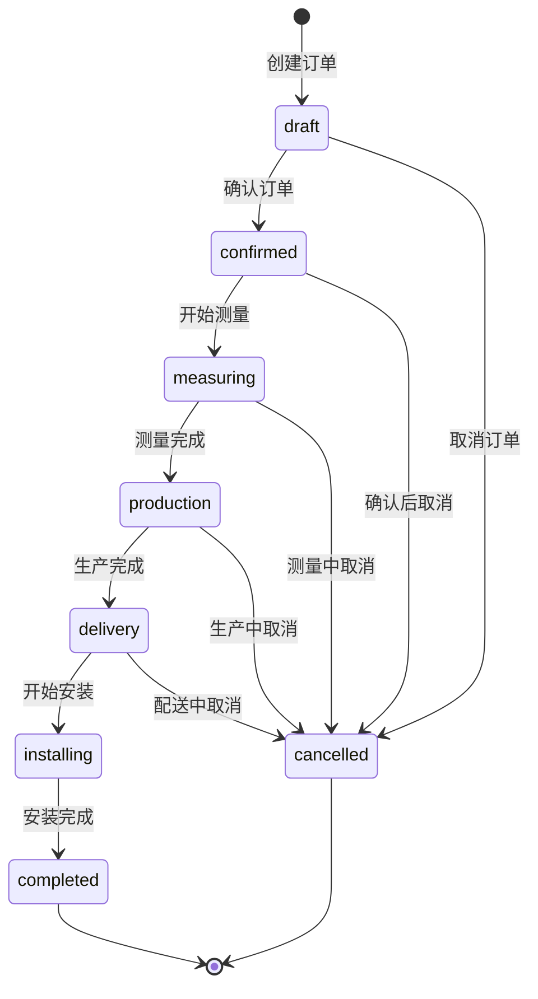
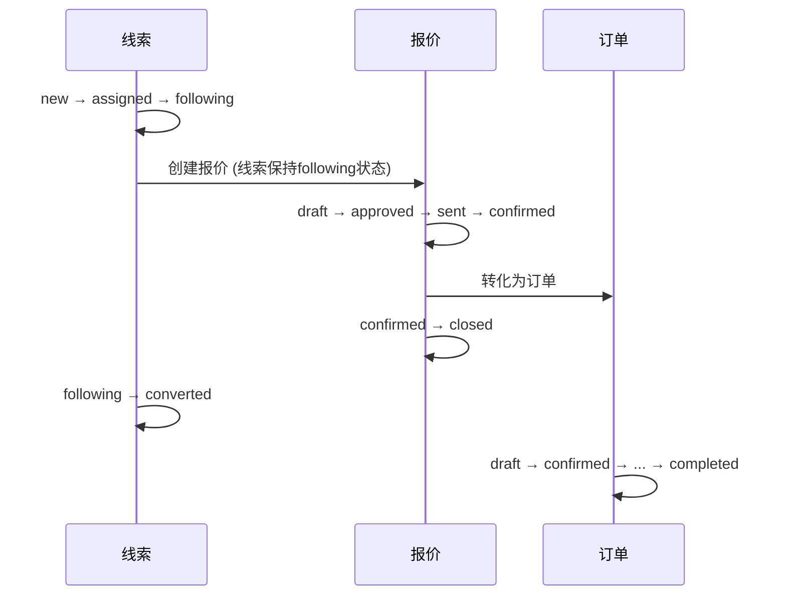

# 状态流转规则设计

## 1. 概述

本文档定义了系统中各业务实体的状态流转规则，确保业务逻辑的一致性和清晰性。

## 2. 线索状态流转

### 2.1 线索状态定义
```sql
CREATE TYPE lead_status AS ENUM (
  'new',        -- 新建
  'assigned',   -- 已分配
  'following',  -- 跟进中
  'converted',  -- 已转化
  'invalid'     -- 已失效
);
```

### 2.2 线索状态流转图


### 2.3 线索标签系统
- **已报价**：线索在跟进过程中已提供报价，但仍处于跟进中状态
- **高意向**：客户意向度较高
- **需维护**：需要持续跟进维护
- **重点客户**：重要客户优先处理
- **预算充足**：客户预算充足

### 2.4 订单状态流转图


## 3. 报价状态流转

### 3.1 报价状态定义
```sql
CREATE TYPE quote_status AS ENUM (
  'draft',          -- 草稿
  'pending_review', -- 待审核
  'reviewing',      -- 审核中
  'approved',       -- 已通过
  'rejected',       -- 已拒绝
  'sent',           -- 已发送
  'confirmed',      -- 客户确认
  'negotiating',    -- 协商中
  'closed',         -- 已成交
  'cancelled'       -- 已取消
);
```

### 3.2 报价状态流转图


## 4. 订单状态流转

### 4.1 订单状态定义
```sql
CREATE TYPE order_status AS ENUM (
  'draft',      -- 草稿
  'confirmed',  -- 已确认
  'measuring',  -- 测量中
  'production', -- 生产中
  'delivery',   -- 配送中
  'installing', -- 安装中
  'completed',  -- 已完成
  'cancelled'   -- 已取消
);
```

### 4.2 订单状态流转图


## 5. 业务实体关联关系

### 5.1 线索到订单的转化流程


### 5.2 状态映射关系

#### 线索与报价关联
- 线索状态为 `following` 时，可以创建报价
- 报价创建后，线索添加"已报价"标签，但状态仍为 `following`
- 报价状态为 `closed` 时，线索状态变更为 `converted`

#### 报价与订单关联
- 报价状态为 `confirmed` 时，可以转化为订单
- 订单创建后，报价状态变更为 `closed`
- 订单初始状态为 `draft`

## 6. 状态变更规则

### 6.1 状态变更权限
```typescript
interface StatusChangePermission {
  lead: {
    'new → assigned': ['sales_manager', 'admin'],
    'assigned → following': ['sales_rep', 'sales_manager', 'admin'],
    'following → converted': ['sales_rep', 'sales_manager', 'admin'],
    'following → invalid': ['sales_rep', 'sales_manager', 'admin'],
    '* → invalid': ['sales_manager', 'admin']
  },
  
  quote: {
    'draft → pending_review': ['sales_rep', 'sales_manager'],
    'pending_review → reviewing': ['sales_manager', 'admin'],
    'reviewing → approved': ['sales_manager', 'admin'],
    'reviewing → rejected': ['sales_manager', 'admin'],
    'approved → sent': ['sales_rep', 'sales_manager'],
    'sent → confirmed': ['customer', 'sales_rep'],
    'sent → negotiating': ['customer', 'sales_rep'],
    'confirmed → closed': ['system'] // 系统自动
  },
  
  order: {
    'draft → confirmed': ['sales_rep', 'sales_manager'],
    'confirmed → measuring': ['designer', 'sales_manager'],
    'measuring → production': ['designer', 'production_manager'],
    'production → delivery': ['production_manager', 'logistics'],
    'delivery → installing': ['installer', 'logistics'],
    'installing → completed': ['installer', 'sales_manager'],
    '* → cancelled': ['sales_manager', 'admin']
  }
}
```

### 6.2 状态变更触发条件
```typescript
interface StatusChangeTrigger {
  lead: {
    '待分配 → 待跟踪': '销售负责人/业务/驻店销售分配',
    '待跟踪 → 跟踪中': '驻店销售/远程销售开始跟踪',
    '跟踪中 → 跟踪中': '添加标签(已报价/已到店)',
    '跟踪中 → 草签': '驻店销售/远程销售/业务转化',
    '跟踪中 → 已失效': '驻店销售/远程销售/业务关闭',
    '草签 → 待测量': '驻店销售/远程销售草签确认',
    '草签 → 跟踪中': '转化条件不满足退回',
    '已失效 → 跟踪中': '重新激活线索'
  },
  
  order: {
    '待测量 → 测量中-待分配': '驻店销售/远程销售点击去测量',
    '测量中-待分配 → 测量中-分配中': '派单员分配测量师',
    '测量中-分配中 → 测量中-待上门': '测量师接单',
    '测量中-待上门 → 测量中-待确认': '测量师完成上门测量',
    '测量中-待确认 → 测量中-分配中': '驻店销售/远程销售驳回测量单',
    '测量中-待确认 → 方案待确认': '驻店销售/远程销售确认测量单',
    '方案待确认 → 待推单': '驻店销售/远程销售上传客户确认图片',
    '待推单 → 待下单': '远程销售上传圣都Home系统采购申请截图（推单确认）',
    '待下单 → 生产中': '订单客服填写生产单号',
    '生产中 → 备货完成': '订单客服确认所有生产单号备货完成',
    '备货完成 → 安装中-待分配': '驻店销售/远程销售安排安装',
    '安装中-待分配 → 安装中-分配中': '派单员派单给安装师',
    '安装中-分配中 → 安装中-待上门': '安装师接单',
    '安装中-待上门 → 安装中-待确认': '安装师上传安装照片',
    '安装中-待确认 → 待对账': '驻店销售/远程销售上传安装后图片',
    '待对账 → 待回款': '财务填写发票单号',
    '待回款 → 已完成': '财务上传回款图片并确认'
  },
  
  // 异常处理触发条件
  exceptions: {
    '任何状态 → 已取消': '客户主动取消订单',
    '超权限折扣': '系统自动锁定并提交渠道负责人审批',
    '超时提醒': '48小时系统提醒，72小时自动报警',
    '质量问题': '可申请重新测量/生产/安装',
    '客户不满意': '可退回上一环节重新处理'
  },
  
  // 时效控制触发条件
  timeControl: {
    '测量环节': {
      '测量中-待分配': '4小时内分配测量师',
      '测量中-分配中': '12小时内测量师接单',
      '测量中-待上门': '24小时内完成上门测量',
      '测量中-待确认': '8小时内销售确认测量单'
    },
    '跟踪周期': '线索跟踪最长30天，每7天系统提醒',
    '生产周期': '根据产品类型设定，48小时提醒，72小时报警',
    '安装时效': '备货完成后7天内安排安装',
    '审批时效': '超权限审批2小时内处理，24小时未处理自动升级'
  }
}
```

## 7. 状态变更日志

### 7.1 日志记录规范
所有状态变更都需要记录日志，包括：
- 变更时间
- 操作人员
- 变更前状态
- 变更后状态
- 变更原因
- 备注信息

### 7.2 日志表设计
```sql
-- 线索状态变更日志
CREATE TABLE lead_status_logs (
  id BIGSERIAL PRIMARY KEY,
  lead_id BIGINT NOT NULL,
  previous_status VARCHAR(20) NOT NULL,
  current_status VARCHAR(20) NOT NULL,
  change_reason VARCHAR(500),
  operator_id BIGINT NOT NULL,
  created_at TIMESTAMP DEFAULT CURRENT_TIMESTAMP
);

-- 报价状态变更日志
CREATE TABLE quote_status_logs (
  id BIGSERIAL PRIMARY KEY,
  quote_id BIGINT NOT NULL,
  previous_status VARCHAR(20) NOT NULL,
  current_status VARCHAR(20) NOT NULL,
  change_reason VARCHAR(500),
  operator_id BIGINT NOT NULL,
  created_at TIMESTAMP DEFAULT CURRENT_TIMESTAMP
);

-- 订单状态变更日志
CREATE TABLE order_status_logs (
  id BIGSERIAL PRIMARY KEY,
  order_id BIGINT NOT NULL,
  previous_status VARCHAR(20) NOT NULL,
  current_status VARCHAR(20) NOT NULL,
  change_reason VARCHAR(500),
  operator_id BIGINT NOT NULL,
  created_at TIMESTAMP DEFAULT CURRENT_TIMESTAMP
);
```

## 8. 实施建议

### 8.1 状态机实现
建议使用状态机模式实现状态流转，确保状态变更的合法性和一致性。

### 8.2 事件驱动
使用事件驱动架构，状态变更时发布相应事件，触发后续业务逻辑。

### 8.3 幂等性保证
确保状态变更操作的幂等性，避免重复变更导致的数据不一致。

### 8.4 回滚机制
提供状态回滚机制，支持在特殊情况下恢复到之前的状态。
