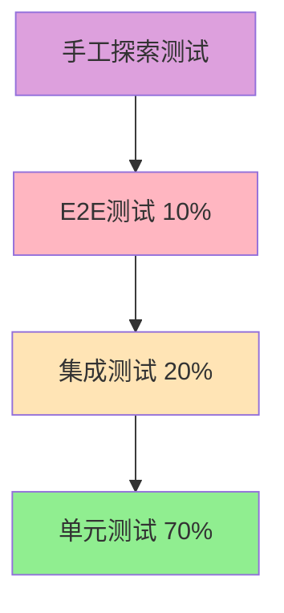

# 罗莱L2C销售管理系统 - 测试策略完善方案

## 📋 文档概述

**项目名称：** 罗莱L2C销售管理系统测试策略  
**文档版本：** v1.0  
**创建日期：** 2024年  
**设计目标：** 构建全面、高效、可靠的测试体系，确保系统质量  

---

## 🎯 测试目标与价值

### 1. 核心目标
- **质量保障**：确保系统功能正确性和稳定性
- **风险控制**：提前发现和预防潜在问题
- **性能保证**：验证系统性能指标达标
- **用户体验**：保证良好的用户交互体验
- **持续改进**：建立测试反馈和优化机制

### 2. 测试原则
- **左移测试**：尽早发现问题，降低修复成本
- **自动化优先**：提高测试效率和覆盖率
- **风险驱动**：重点测试高风险和核心功能
- **持续集成**：测试与开发流程无缝集成
- **数据驱动**：基于数据分析优化测试策略

---

## 🏗️ 测试金字塔架构

### 1. 测试金字塔模型



### 2. 各层测试策略

#### 2.1 单元测试（70%）
```typescript
// 单元测试示例 - 用户服务
// backend/src/services/__tests__/user.service.test.ts

import { UserService } from '../user.service';
import { UserRepository } from '../repositories/user.repository';
import { PasswordService } from '../password.service';

describe('UserService', () => {
  let userService: UserService;
  let userRepository: jest.Mocked<UserRepository>;
  let passwordService: jest.Mocked<PasswordService>;

  beforeEach(() => {
    userRepository = {
      findById: jest.fn(),
      findByEmail: jest.fn(),
      create: jest.fn(),
      update: jest.fn(),
      delete: jest.fn(),
    } as any;

    passwordService = {
      hash: jest.fn(),
      verify: jest.fn(),
    } as any;

    userService = new UserService(userRepository, passwordService);
  });

  describe('createUser', () => {
    it('应该成功创建用户', async () => {
      // Arrange
      const userData = {
        email: 'test@example.com',
        password: 'password123',
        name: '测试用户',
      };
      
      const hashedPassword = 'hashed_password';
      const createdUser = { id: 1, ...userData, password: hashedPassword };

      userRepository.findByEmail.mockResolvedValue(null);
      passwordService.hash.mockResolvedValue(hashedPassword);
      userRepository.create.mockResolvedValue(createdUser);

      // Act
      const result = await userService.createUser(userData);

      // Assert
      expect(userRepository.findByEmail).toHaveBeenCalledWith(userData.email);
      expect(passwordService.hash).toHaveBeenCalledWith(userData.password);
      expect(userRepository.create).toHaveBeenCalledWith({
        ...userData,
        password: hashedPassword,
      });
      expect(result).toEqual(createdUser);
    });

    it('当邮箱已存在时应该抛出错误', async () => {
      // Arrange
      const userData = {
        email: 'existing@example.com',
        password: 'password123',
        name: '测试用户',
      };

      userRepository.findByEmail.mockResolvedValue({ id: 1 } as any);

      // Act & Assert
      await expect(userService.createUser(userData)).rejects.toThrow(
        '邮箱已存在'
      );
    });
  });

  describe('authenticateUser', () => {
    it('应该成功验证用户', async () => {
      // Arrange
      const email = 'test@example.com';
      const password = 'password123';
      const user = {
        id: 1,
        email,
        password: 'hashed_password',
        name: '测试用户',
      };

      userRepository.findByEmail.mockResolvedValue(user);
      passwordService.verify.mockResolvedValue(true);

      // Act
      const result = await userService.authenticateUser(email, password);

      // Assert
      expect(userRepository.findByEmail).toHaveBeenCalledWith(email);
      expect(passwordService.verify).toHaveBeenCalledWith(password, user.password);
      expect(result).toEqual({ id: user.id, email: user.email, name: user.name });
    });
  });
});
```

#### 2.2 集成测试（20%）
```typescript
// 集成测试示例 - API测试
// backend/src/__tests__/integration/user.api.test.ts

import request from 'supertest';
import { app } from '../../app';
import { DatabaseService } from '../../services/database.service';

describe('User API Integration Tests', () => {
  let databaseService: DatabaseService;

  beforeAll(async () => {
    databaseService = new DatabaseService();
    await databaseService.connect();
    await databaseService.migrate();
  });

  afterAll(async () => {
    await databaseService.disconnect();
  });

  beforeEach(async () => {
    await databaseService.clearTables();
  });

  describe('POST /api/users', () => {
    it('应该成功创建用户', async () => {
      const userData = {
        email: 'test@example.com',
        password: 'password123',
        name: '测试用户',
        role: 'sales',
      };

      const response = await request(app)
        .post('/api/users')
        .send(userData)
        .expect(201);

      expect(response.body).toMatchObject({
        id: expect.any(Number),
        email: userData.email,
        name: userData.name,
        role: userData.role,
        createdAt: expect.any(String),
      });

      expect(response.body.password).toBeUndefined();
    });

    it('应该验证必填字段', async () => {
      const response = await request(app)
        .post('/api/users')
        .send({})
        .expect(400);

      expect(response.body.errors).toContain('邮箱是必填项');
      expect(response.body.errors).toContain('密码是必填项');
      expect(response.body.errors).toContain('姓名是必填项');
    });
  });

  describe('POST /api/auth/login', () => {
    beforeEach(async () => {
      // 创建测试用户
      await request(app)
        .post('/api/users')
        .send({
          email: 'test@example.com',
          password: 'password123',
          name: '测试用户',
          role: 'sales',
        });
    });

    it('应该成功登录', async () => {
      const response = await request(app)
        .post('/api/auth/login')
        .send({
          email: 'test@example.com',
          password: 'password123',
        })
        .expect(200);

      expect(response.body).toMatchObject({
        token: expect.any(String),
        user: {
          id: expect.any(Number),
          email: 'test@example.com',
          name: '测试用户',
        },
      });
    });

    it('密码错误时应该返回401', async () => {
      await request(app)
        .post('/api/auth/login')
        .send({
          email: 'test@example.com',
          password: 'wrongpassword',
        })
        .expect(401);
    });
  });
});
```

#### 2.3 端到端测试（10%）
```typescript
// E2E测试示例 - Cypress
// cypress/e2e/user-management.cy.ts

describe('用户管理流程', () => {
  beforeEach(() => {
    // 重置数据库
    cy.task('db:seed');
    
    // 登录管理员账户
    cy.login('admin@luolai.com', 'admin123');
  });

  it('应该能够完成用户管理全流程', () => {
    // 访问用户管理页面
    cy.visit('/users');
    cy.get('[data-testid="page-title"]').should('contain', '用户管理');

    // 创建新用户
    cy.get('[data-testid="add-user-btn"]').click();
    cy.get('[data-testid="user-form"]').should('be.visible');

    cy.get('[data-testid="email-input"]').type('newuser@luolai.com');
    cy.get('[data-testid="name-input"]').type('新用户');
    cy.get('[data-testid="role-select"]').select('sales');
    cy.get('[data-testid="password-input"]').type('password123');
    cy.get('[data-testid="confirm-password-input"]').type('password123');

    cy.get('[data-testid="submit-btn"]').click();

    // 验证用户创建成功
    cy.get('[data-testid="success-message"]').should('contain', '用户创建成功');
    cy.get('[data-testid="user-table"]').should('contain', 'newuser@luolai.com');

    // 编辑用户
    cy.get('[data-testid="user-row"]')
      .contains('newuser@luolai.com')
      .parent()
      .find('[data-testid="edit-btn"]')
      .click();

    cy.get('[data-testid="name-input"]').clear().type('更新用户名');
    cy.get('[data-testid="submit-btn"]').click();

    // 验证用户更新成功
    cy.get('[data-testid="success-message"]').should('contain', '用户更新成功');
    cy.get('[data-testid="user-table"]').should('contain', '更新用户名');

    // 删除用户
    cy.get('[data-testid="user-row"]')
      .contains('newuser@luolai.com')
      .parent()
      .find('[data-testid="delete-btn"]')
      .click();

    cy.get('[data-testid="confirm-dialog"]').should('be.visible');
    cy.get('[data-testid="confirm-delete-btn"]').click();

    // 验证用户删除成功
    cy.get('[data-testid="success-message"]').should('contain', '用户删除成功');
    cy.get('[data-testid="user-table"]').should('not.contain', 'newuser@luolai.com');
  });

  it('应该验证表单输入', () => {
    cy.visit('/users');
    cy.get('[data-testid="add-user-btn"]').click();

    // 提交空表单
    cy.get('[data-testid="submit-btn"]').click();

    // 验证错误消息
    cy.get('[data-testid="email-error"]').should('contain', '邮箱是必填项');
    cy.get('[data-testid="name-error"]').should('contain', '姓名是必填项');
    cy.get('[data-testid="password-error"]').should('contain', '密码是必填项');

    // 输入无效邮箱
    cy.get('[data-testid="email-input"]').type('invalid-email');
    cy.get('[data-testid="submit-btn"]').click();
    cy.get('[data-testid="email-error"]').should('contain', '请输入有效的邮箱地址');

    // 输入不匹配的密码
    cy.get('[data-testid="email-input"]').clear().type('valid@email.com');
    cy.get('[data-testid="name-input"]').type('测试用户');
    cy.get('[data-testid="password-input"]').type('password123');
    cy.get('[data-testid="confirm-password-input"]').type('different');
    cy.get('[data-testid="submit-btn"]').click();
    cy.get('[data-testid="confirm-password-error"]').should('contain', '密码不匹配');
  });
});
```

---

## 🚀 性能测试策略

### 1. 性能测试类型

#### 1.1 负载测试
```javascript
// K6负载测试脚本
// performance-tests/load-test.js

import http from 'k6/http';
import { check, sleep } from 'k6';
import { Rate } from 'k6/metrics';

// 自定义指标
export let errorRate = new Rate('errors');

export let options = {
  stages: [
    { duration: '5m', target: 100 },   // 5分钟内增加到100用户
    { duration: '10m', target: 100 },  // 保持100用户10分钟
    { duration: '5m', target: 200 },   // 5分钟内增加到200用户
    { duration: '10m', target: 200 },  // 保持200用户10分钟
    { duration: '5m', target: 0 },     // 5分钟内减少到0用户
  ],
  thresholds: {
    http_req_duration: ['p(95)<2000'],  // 95%的请求在2秒内完成
    http_req_failed: ['rate<0.05'],     // 错误率小于5%
    errors: ['rate<0.1'],               // 业务错误率小于10%
  },
};

const BASE_URL = 'https://crm-staging.luolai.com';

export function setup() {
  // 登录获取token
  let loginRes = http.post(`${BASE_URL}/api/auth/login`, {
    email: 'test@luolai.com',
    password: 'test123',
  });
  
  return { token: loginRes.json('token') };
}

export default function(data) {
  let params = {
    headers: {
      'Authorization': `Bearer ${data.token}`,
      'Content-Type': 'application/json',
    },
  };

  // 测试场景1：获取线索列表
  let leadsRes = http.get(`${BASE_URL}/api/leads?page=1&limit=20`, params);
  check(leadsRes, {
    '获取线索列表状态为200': (r) => r.status === 200,
    '获取线索列表响应时间<1s': (r) => r.timings.duration < 1000,
  }) || errorRate.add(1);

  sleep(1);

  // 测试场景2：创建线索
  let createLeadRes = http.post(`${BASE_URL}/api/leads`, JSON.stringify({
    name: `测试线索_${Date.now()}`,
    phone: '13800138000',
    source: 'website',
    status: 'new',
  }), params);
  
  check(createLeadRes, {
    '创建线索状态为201': (r) => r.status === 201,
    '创建线索响应时间<2s': (r) => r.timings.duration < 2000,
  }) || errorRate.add(1);

  sleep(2);

  // 测试场景3：搜索线索
  let searchRes = http.get(`${BASE_URL}/api/leads/search?q=测试`, params);
  check(searchRes, {
    '搜索线索状态为200': (r) => r.status === 200,
    '搜索线索响应时间<1.5s': (r) => r.timings.duration < 1500,
  }) || errorRate.add(1);

  sleep(1);
}

export function teardown(data) {
  // 清理测试数据
  console.log('清理测试数据...');
}
```

#### 1.2 压力测试
```javascript
// performance-tests/stress-test.js

import http from 'k6/http';
import { check } from 'k6';

export let options = {
  stages: [
    { duration: '2m', target: 100 },   // 正常负载
    { duration: '5m', target: 100 },   
    { duration: '2m', target: 200 },   // 增加负载
    { duration: '5m', target: 200 },   
    { duration: '2m', target: 300 },   // 高负载
    { duration: '5m', target: 300 },   
    { duration: '2m', target: 400 },   // 极限负载
    { duration: '5m', target: 400 },   
    { duration: '10m', target: 0 },    // 恢复
  ],
  thresholds: {
    http_req_duration: ['p(99)<5000'],  // 99%的请求在5秒内完成
    http_req_failed: ['rate<0.1'],      // 错误率小于10%
  },
};

const BASE_URL = 'https://crm-staging.luolai.com';

export default function() {
  let response = http.get(`${BASE_URL}/api/health`);
  check(response, {
    '健康检查状态为200': (r) => r.status === 200,
  });
}
```

#### 1.3 容量测试
```javascript
// performance-tests/volume-test.js

import http from 'k6/http';
import { check } from 'k6';

export let options = {
  vus: 50,                    // 50个虚拟用户
  duration: '30m',            // 持续30分钟
  thresholds: {
    http_req_duration: ['p(95)<3000'],
    http_req_failed: ['rate<0.05'],
  },
};

const BASE_URL = 'https://crm-staging.luolai.com';

export default function() {
  // 模拟大量数据操作
  let batchData = [];
  for (let i = 0; i < 100; i++) {
    batchData.push({
      name: `批量线索_${i}_${Date.now()}`,
      phone: `138${String(Math.random()).substr(2, 8)}`,
      source: 'batch_import',
    });
  }

  let response = http.post(`${BASE_URL}/api/leads/batch`, JSON.stringify({
    leads: batchData
  }), {
    headers: { 'Content-Type': 'application/json' },
  });

  check(response, {
    '批量创建状态为200': (r) => r.status === 200,
    '批量创建响应时间<10s': (r) => r.timings.duration < 10000,
  });
}
```

### 2. 性能监控配置

#### 2.1 应用性能监控
```yaml
# APM配置 - New Relic
# newrelic.yml
common: &default_settings
  license_key: '<%= license_key %>'
  app_name: 'CRM System'
  
  # 事务追踪
  transaction_tracer:
    enabled: true
    transaction_threshold: apdex_f
    record_sql: obfuscated
    stack_trace_threshold: 0.500
    
  # 错误收集
  error_collector:
    enabled: true
    capture_source: true
    ignore_errors: "ActionController::RoutingError"
    
  # 浏览器监控
  browser_monitoring:
    auto_instrument: true
    
  # 数据库监控
  slow_sql:
    enabled: true
    use_longer_sql_id: true

production:
  <<: *default_settings
  app_name: 'CRM System (Production)'
  
staging:
  <<: *default_settings
  app_name: 'CRM System (Staging)'
```

#### 2.2 数据库性能监控
```sql
-- PostgreSQL性能监控查询
-- 慢查询监控
SELECT 
  query,
  calls,
  total_time,
  mean_time,
  rows,
  100.0 * shared_blks_hit / nullif(shared_blks_hit + shared_blks_read, 0) AS hit_percent
FROM pg_stat_statements 
ORDER BY total_time DESC 
LIMIT 10;

-- 锁等待监控
SELECT 
  blocked_locks.pid AS blocked_pid,
  blocked_activity.usename AS blocked_user,
  blocking_locks.pid AS blocking_pid,
  blocking_activity.usename AS blocking_user,
  blocked_activity.query AS blocked_statement,
  blocking_activity.query AS current_statement_in_blocking_process
FROM pg_catalog.pg_locks blocked_locks
JOIN pg_catalog.pg_stat_activity blocked_activity ON blocked_activity.pid = blocked_locks.pid
JOIN pg_catalog.pg_locks blocking_locks ON blocking_locks.locktype = blocked_locks.locktype
JOIN pg_catalog.pg_stat_activity blocking_activity ON blocking_activity.pid = blocking_locks.pid
WHERE NOT blocked_locks.granted;

-- 连接数监控
SELECT 
  state,
  count(*) 
FROM pg_stat_activity 
GROUP BY state;
```

---

## 🔥 混沌工程实践

### 1. 混沌工程原则

#### 1.1 混沌实验设计
```yaml
# Chaos Engineering实验配置
# chaos-experiments/network-latency.yaml
apiVersion: chaos-mesh.org/v1alpha1
kind: NetworkChaos
metadata:
  name: network-delay-experiment
  namespace: crm-system
spec:
  action: delay
  mode: one
  selector:
    labelSelectors:
      app: crm-backend
  delay:
    latency: "100ms"
    correlation: "100"
    jitter: "0ms"
  duration: "5m"
  scheduler:
    cron: "@every 1h"

---
apiVersion: chaos-mesh.org/v1alpha1
kind: PodChaos
metadata:
  name: pod-failure-experiment
  namespace: crm-system
spec:
  action: pod-failure
  mode: fixed-percent
  value: "20"
  selector:
    labelSelectors:
      app: crm-backend
  duration: "2m"
  scheduler:
    cron: "0 2 * * *"  # 每天凌晨2点执行

---
apiVersion: chaos-mesh.org/v1alpha1
kind: StressChaos
metadata:
  name: cpu-stress-experiment
  namespace: crm-system
spec:
  mode: one
  selector:
    labelSelectors:
      app: crm-backend
  stressors:
    cpu:
      workers: 2
      load: 80
  duration: "3m"
```

#### 1.2 混沌实验脚本
```bash
#!/bin/bash
# scripts/chaos-experiment.sh

set -e

NAMESPACE="crm-system"
EXPERIMENT_NAME=${1:-"network-delay-experiment"}
DURATION=${2:-"5m"}

echo "🔥 开始混沌工程实验: $EXPERIMENT_NAME"

# 检查系统基线状态
echo "📊 检查系统基线状态..."
kubectl get pods -n $NAMESPACE
kubectl top pods -n $NAMESPACE

# 记录实验前的关键指标
echo "📈 记录实验前指标..."
BASELINE_RESPONSE_TIME=$(curl -w "%{time_total}" -s -o /dev/null https://crm.luolai.com/api/health)
BASELINE_ERROR_RATE=$(curl -s https://crm.luolai.com/api/metrics | grep error_rate | awk '{print $2}')

echo "基线响应时间: ${BASELINE_RESPONSE_TIME}s"
echo "基线错误率: ${BASELINE_ERROR_RATE}%"

# 启动混沌实验
echo "🚀 启动混沌实验..."
kubectl apply -f chaos-experiments/$EXPERIMENT_NAME.yaml

# 监控实验过程
echo "👀 监控实验过程..."
for i in {1..10}; do
  sleep 30
  
  # 检查响应时间
  CURRENT_RESPONSE_TIME=$(curl -w "%{time_total}" -s -o /dev/null https://crm.luolai.com/api/health)
  CURRENT_ERROR_RATE=$(curl -s https://crm.luolai.com/api/metrics | grep error_rate | awk '{print $2}')
  
  echo "第${i}次检查 - 响应时间: ${CURRENT_RESPONSE_TIME}s, 错误率: ${CURRENT_ERROR_RATE}%"
  
  # 检查系统是否仍然可用
  if ! curl -f -s https://crm.luolai.com/api/health > /dev/null; then
    echo "⚠️  系统不可用，停止实验"
    kubectl delete -f chaos-experiments/$EXPERIMENT_NAME.yaml
    exit 1
  fi
done

# 停止实验
echo "🛑 停止混沌实验..."
kubectl delete -f chaos-experiments/$EXPERIMENT_NAME.yaml

# 等待系统恢复
echo "⏳ 等待系统恢复..."
sleep 60

# 检查系统恢复状态
echo "🔍 检查系统恢复状态..."
RECOVERY_RESPONSE_TIME=$(curl -w "%{time_total}" -s -o /dev/null https://crm.luolai.com/api/health)
RECOVERY_ERROR_RATE=$(curl -s https://crm.luolai.com/api/metrics | grep error_rate | awk '{print $2}')

echo "恢复后响应时间: ${RECOVERY_RESPONSE_TIME}s"
echo "恢复后错误率: ${RECOVERY_ERROR_RATE}%"

# 生成实验报告
echo "📋 生成实验报告..."
cat > chaos-report-$(date +%Y%m%d-%H%M%S).md << EOF
# 混沌工程实验报告

## 实验信息
- 实验名称: $EXPERIMENT_NAME
- 实验时间: $(date)
- 实验持续时间: $DURATION

## 实验结果
- 基线响应时间: ${BASELINE_RESPONSE_TIME}s
- 实验期间最大响应时间: ${CURRENT_RESPONSE_TIME}s
- 恢复后响应时间: ${RECOVERY_RESPONSE_TIME}s
- 基线错误率: ${BASELINE_ERROR_RATE}%
- 实验期间最大错误率: ${CURRENT_ERROR_RATE}%
- 恢复后错误率: ${RECOVERY_ERROR_RATE}%

## 结论
系统在混沌实验期间保持了基本的可用性，证明了系统的弹性能力。
EOF

echo "✅ 混沌工程实验完成！"
```

### 2. 故障注入测试

#### 2.1 数据库故障模拟
```javascript
// tests/chaos/database-failure.test.js

const { Pool } = require('pg');
const request = require('supertest');
const app = require('../../src/app');

describe('数据库故障测试', () => {
  let originalPool;
  
  beforeAll(() => {
    originalPool = app.get('db');
  });

  afterEach(() => {
    // 恢复数据库连接
    app.set('db', originalPool);
  });

  it('应该在数据库连接失败时优雅降级', async () => {
    // 模拟数据库连接失败
    const mockPool = {
      query: jest.fn().mockRejectedValue(new Error('Connection failed')),
    };
    app.set('db', mockPool);

    const response = await request(app)
      .get('/api/leads')
      .expect(503);

    expect(response.body).toMatchObject({
      error: '服务暂时不可用',
      message: '数据库连接失败，请稍后重试',
    });
  });

  it('应该在数据库查询超时时返回错误', async () => {
    // 模拟查询超时
    const mockPool = {
      query: jest.fn().mockImplementation(() => 
        new Promise((_, reject) => 
          setTimeout(() => reject(new Error('Query timeout')), 100)
        )
      ),
    };
    app.set('db', mockPool);

    const response = await request(app)
      .get('/api/leads')
      .expect(504);

    expect(response.body).toMatchObject({
      error: '请求超时',
      message: '数据库查询超时，请稍后重试',
    });
  });
});
```

#### 2.2 网络故障模拟
```javascript
// tests/chaos/network-failure.test.js

const nock = require('nock');
const request = require('supertest');
const app = require('../../src/app');

describe('网络故障测试', () => {
  afterEach(() => {
    nock.cleanAll();
  });

  it('应该在外部API调用失败时使用缓存数据', async () => {
    // 模拟外部API失败
    nock('https://api.external-service.com')
      .get('/data')
      .replyWithError('Network error');

    const response = await request(app)
      .get('/api/external-data')
      .expect(200);

    expect(response.body).toMatchObject({
      data: expect.any(Array),
      source: 'cache',
      message: '外部服务不可用，返回缓存数据',
    });
  });

  it('应该在网络延迟时设置超时', async () => {
    // 模拟网络延迟
    nock('https://api.external-service.com')
      .get('/data')
      .delay(5000)
      .reply(200, { data: 'test' });

    const response = await request(app)
      .get('/api/external-data')
      .expect(504);

    expect(response.body).toMatchObject({
      error: '请求超时',
      message: '外部服务响应超时',
    });
  });
});
```

---

## 🔍 测试数据管理

### 1. 测试数据策略

#### 1.1 测试数据生成
```typescript
// tests/fixtures/data-factory.ts

import { faker } from '@faker-js/faker';

export class DataFactory {
  static createUser(overrides: Partial<User> = {}): User {
    return {
      id: faker.datatype.number(),
      email: faker.internet.email(),
      name: faker.name.fullName(),
      phone: faker.phone.number(),
      role: faker.helpers.arrayElement(['admin', 'sales', 'manager']),
      status: 'active',
      createdAt: faker.date.past(),
      updatedAt: faker.date.recent(),
      ...overrides,
    };
  }

  static createLead(overrides: Partial<Lead> = {}): Lead {
    return {
      id: faker.datatype.number(),
      name: faker.name.fullName(),
      phone: faker.phone.number(),
      email: faker.internet.email(),
      company: faker.company.name(),
      source: faker.helpers.arrayElement(['website', 'phone', 'referral']),
      status: faker.helpers.arrayElement(['new', 'contacted', 'qualified']),
      assignedTo: faker.datatype.number(),
      createdAt: faker.date.past(),
      updatedAt: faker.date.recent(),
      ...overrides,
    };
  }

  static createOrder(overrides: Partial<Order> = {}): Order {
    return {
      id: faker.datatype.number(),
      orderNumber: faker.random.alphaNumeric(10).toUpperCase(),
      customerId: faker.datatype.number(),
      totalAmount: faker.datatype.number({ min: 100, max: 10000 }),
      status: faker.helpers.arrayElement(['pending', 'confirmed', 'shipped']),
      items: Array.from({ length: faker.datatype.number({ min: 1, max: 5 }) }, () => ({
        productId: faker.datatype.number(),
        quantity: faker.datatype.number({ min: 1, max: 10 }),
        price: faker.datatype.number({ min: 10, max: 1000 }),
      })),
      createdAt: faker.date.past(),
      updatedAt: faker.date.recent(),
      ...overrides,
    };
  }

  static createBatchUsers(count: number): User[] {
    return Array.from({ length: count }, () => this.createUser());
  }

  static createBatchLeads(count: number): Lead[] {
    return Array.from({ length: count }, () => this.createLead());
  }
}
```

#### 1.2 数据库种子数据
```typescript
// tests/seeds/database-seeder.ts

import { DatabaseService } from '../../src/services/database.service';
import { DataFactory } from '../fixtures/data-factory';

export class DatabaseSeeder {
  constructor(private db: DatabaseService) {}

  async seedAll(): Promise<void> {
    await this.clearAll();
    await this.seedUsers();
    await this.seedLeads();
    await this.seedOrders();
  }

  async clearAll(): Promise<void> {
    const tables = [
      'order_items',
      'orders',
      'leads',
      'users',
    ];

    for (const table of tables) {
      await this.db.query(`TRUNCATE TABLE ${table} RESTART IDENTITY CASCADE`);
    }
  }

  async seedUsers(): Promise<void> {
    const users = [
      // 固定测试用户
      {
        email: 'admin@luolai.com',
        name: '系统管理员',
        role: 'admin',
        password: 'admin123',
      },
      {
        email: 'sales@luolai.com',
        name: '销售代表',
        role: 'sales',
        password: 'sales123',
      },
      // 随机测试用户
      ...DataFactory.createBatchUsers(50),
    ];

    for (const user of users) {
      await this.db.query(
        'INSERT INTO users (email, name, role, password, status) VALUES ($1, $2, $3, $4, $5)',
        [user.email, user.name, user.role, user.password, 'active']
      );
    }
  }

  async seedLeads(): Promise<void> {
    const leads = DataFactory.createBatchLeads(200);
    
    for (const lead of leads) {
      await this.db.query(
        'INSERT INTO leads (name, phone, email, company, source, status, assigned_to) VALUES ($1, $2, $3, $4, $5, $6, $7)',
        [lead.name, lead.phone, lead.email, lead.company, lead.source, lead.status, lead.assignedTo]
      );
    }
  }

  async seedOrders(): Promise<void> {
    const orders = DataFactory.createBatchOrders(100);
    
    for (const order of orders) {
      const orderId = await this.db.query(
        'INSERT INTO orders (order_number, customer_id, total_amount, status) VALUES ($1, $2, $3, $4) RETURNING id',
        [order.orderNumber, order.customerId, order.totalAmount, order.status]
      );

      for (const item of order.items) {
        await this.db.query(
          'INSERT INTO order_items (order_id, product_id, quantity, price) VALUES ($1, $2, $3, $4)',
          [orderId.rows[0].id, item.productId, item.quantity, item.price]
        );
      }
    }
  }
}
```

### 2. 测试环境隔离

#### 2.1 Docker测试环境
```yaml
# docker-compose.test.yml
version: '3.8'

services:
  test-db:
    image: postgres:15-alpine
    environment:
      POSTGRES_DB: crm_test
      POSTGRES_USER: test_user
      POSTGRES_PASSWORD: test_password
    ports:
      - "5433:5432"
    volumes:
      - test_db_data:/var/lib/postgresql/data
    command: postgres -c log_statement=all

  test-redis:
    image: redis:7-alpine
    ports:
      - "6380:6379"
    volumes:
      - test_redis_data:/data

  test-elasticsearch:
    image: elasticsearch:8.8.0
    environment:
      - discovery.type=single-node
      - xpack.security.enabled=false
      - "ES_JAVA_OPTS=-Xms512m -Xmx512m"
    ports:
      - "9201:9200"
    volumes:
      - test_es_data:/usr/share/elasticsearch/data

volumes:
  test_db_data:
  test_redis_data:
  test_es_data:
```

---

## 📊 测试报告和指标

### 1. 测试覆盖率配置

#### 1.1 Jest覆盖率配置
```javascript
// jest.config.js
module.exports = {
  collectCoverage: true,
  coverageDirectory: 'coverage',
  coverageReporters: [
    'text',
    'lcov',
    'html',
    'json-summary',
  ],
  collectCoverageFrom: [
    'src/**/*.{ts,tsx}',
    '!src/**/*.d.ts',
    '!src/**/*.test.{ts,tsx}',
    '!src/**/*.spec.{ts,tsx}',
    '!src/migrations/**',
    '!src/seeds/**',
  ],
  coverageThreshold: {
    global: {
      branches: 80,
      functions: 80,
      lines: 80,
      statements: 80,
    },
    './src/services/': {
      branches: 90,
      functions: 90,
      lines: 90,
      statements: 90,
    },
  },
};
```

#### 1.2 SonarQube质量报告
```xml
<!-- sonar-project.xml -->
<?xml version="1.0" encoding="UTF-8"?>
<sonar>
  <property>
    <key>sonar.projectKey</key>
    <value>luolai-crm</value>
  </property>
  <property>
    <key>sonar.projectName</key>
    <value>罗莱CRM系统</value>
  </property>
  <property>
    <key>sonar.sources</key>
    <value>src</value>
  </property>
  <property>
    <key>sonar.tests</key>
    <value>tests</value>
  </property>
  <property>
    <key>sonar.javascript.lcov.reportPaths</key>
    <value>coverage/lcov.info</value>
  </property>
  <property>
    <key>sonar.testExecutionReportPaths</key>
    <value>reports/test-results.xml</value>
  </property>
</sonar>
```

### 2. 自动化测试报告

#### 2.1 测试报告生成脚本
```bash
#!/bin/bash
# scripts/generate-test-report.sh

set -e

REPORT_DIR="reports"
TIMESTAMP=$(date +%Y%m%d_%H%M%S)

echo "📊 生成测试报告..."

# 创建报告目录
mkdir -p $REPORT_DIR

# 运行单元测试
echo "🧪 运行单元测试..."
npm run test:unit -- --coverage --ci --reporters=default --reporters=jest-junit

# 运行集成测试
echo "🔗 运行集成测试..."
npm run test:integration -- --ci --reporters=jest-junit

# 运行E2E测试
echo "🎭 运行E2E测试..."
npm run test:e2e -- --reporter junit --reporter-options "mochaFile=$REPORT_DIR/e2e-results.xml"

# 运行性能测试
echo "🚀 运行性能测试..."
k6 run --out json=$REPORT_DIR/performance-results.json performance-tests/load-test.js

# 生成综合报告
echo "📋 生成综合报告..."
cat > $REPORT_DIR/test-summary-$TIMESTAMP.md << EOF
# 测试报告 - $(date)

## 测试概览
- 测试时间: $(date)
- 测试环境: $CI_ENVIRONMENT_NAME
- 代码版本: $CI_COMMIT_SHA

## 单元测试结果
$(cat $REPORT_DIR/unit-test-summary.txt)

## 集成测试结果
$(cat $REPORT_DIR/integration-test-summary.txt)

## E2E测试结果
$(cat $REPORT_DIR/e2e-test-summary.txt)

## 性能测试结果
$(cat $REPORT_DIR/performance-summary.txt)

## 代码覆盖率
$(cat coverage/coverage-summary.txt)
EOF

echo "✅ 测试报告生成完成: $REPORT_DIR/test-summary-$TIMESTAMP.md"
```

这个完整的测试策略方案提供了从单元测试到混沌工程的全方位测试体系，确保系统的质量、性能和可靠性。
