# 罗莱L2C销售管理系统 - 数据治理框架设计方案

## 📋 文档概述

**项目名称：** 罗莱L2C销售管理系统数据治理框架  
**文档版本：** v1.0  
**创建日期：** 2024年  
**设计目标：** 建立完善的数据治理体系，确保数据质量、安全和合规  

---

## 🎯 数据治理目标与价值

### 1. 核心目标
- **数据质量保障**：确保数据的准确性、完整性、一致性和及时性
- **数据安全合规**：保护敏感数据，满足法规要求
- **数据资产管理**：建立数据资产目录，提升数据价值
- **数据标准化**：统一数据定义、格式和处理规范
- **数据生命周期管理**：从数据产生到销毁的全生命周期管理

### 2. 治理原则
- **统一标准**：建立企业级数据标准和规范
- **分级管理**：根据数据重要性实施分级治理
- **全程监控**：数据流转全过程质量监控
- **持续改进**：基于监控结果持续优化治理策略
- **业务驱动**：以业务需求为导向的数据治理

---

## 🏗️ 数据治理架构

### 1. 整体架构设计

```mermaid
graph TB
    subgraph "数据治理层"
        A[数据治理委员会] --> B[数据管理办公室]
        B --> C[数据标准管理]
        B --> D[数据质量管理]
        B --> E[主数据管理]
        B --> F[元数据管理]
        B --> G[数据安全管理]
    end
    
    subgraph "数据处理层"
        H[数据采集] --> I[数据清洗]
        I --> J[数据转换]
        J --> K[数据加载]
        K --> L[数据存储]
    end
    
    subgraph "数据应用层"
        M[业务应用] --> N[数据分析]
        N --> O[数据报告]
        O --> P[数据服务]
    end
    
    subgraph "监控支撑层"
        Q[质量监控] --> R[合规审计]
        R --> S[风险预警]
        S --> T[治理评估]
    end
    
    C --> H
    D --> I
    E --> J
    F --> K
    G --> L
    
    L --> M
    Q --> H
    R --> I
    S --> J
    T --> K
```



### 2. 组织架构设计

#### 2.1 数据治理委员会
```yaml
# 数据治理组织架构
governance_committee:
  chairman: "CTO"
  members:
    - role: "业务负责人"
      department: "销售部门"
      responsibilities:
        - "业务数据需求定义"
        - "数据质量标准制定"
    - role: "技术负责人"
      department: "IT部门"
      responsibilities:
        - "技术标准制定"
        - "数据架构设计"
    - role: "数据管理员"
      department: "数据中心"
      responsibilities:
        - "日常数据治理执行"
        - "数据质量监控"
    - role: "合规专员"
      department: "法务部门"
      responsibilities:
        - "数据合规审查"
        - "隐私保护监督"

data_management_office:
  director: "数据总监"
  teams:
    - name: "数据标准团队"
      size: 3
      focus: "数据标准制定和维护"
    - name: "数据质量团队"
      size: 4
      focus: "数据质量监控和改进"
    - name: "主数据团队"
      size: 2
      focus: "主数据管理和维护"
    - name: "元数据团队"
      size: 2
      focus: "元数据管理和血缘分析"
```

---

## 📊 数据质量管理

### 1. 数据质量框架

#### 1.1 数据质量维度
```typescript
// 数据质量维度定义
interface DataQualityDimensions {
  accuracy: {
    name: '准确性';
    description: '数据与真实情况的符合程度';
    metrics: ['错误率', '准确率'];
    threshold: {
      error_rate: '<1%';
      accuracy_rate: '>99%';
    };
  };
  
  completeness: {
    name: '完整性';
    description: '数据的完整程度';
    metrics: ['缺失率', '完整率'];
    threshold: {
      missing_rate: '<5%';
      completeness_rate: '>95%';
    };
  };
  
  consistency: {
    name: '一致性';
    description: '同一数据在不同系统中的一致程度';
    metrics: ['一致性率', '冲突率'];
    threshold: {
      consistency_rate: '>98%';
      conflict_rate: '<2%';
    };
  };
  
  timeliness: {
    name: '及时性';
    description: '数据的时效性';
    metrics: ['延迟时间', '更新频率'];
    threshold: {
      max_delay: '1小时';
      update_frequency: '实时';
    };
  };
  
  validity: {
    name: '有效性';
    description: '数据格式和业务规则的符合程度';
    metrics: ['格式错误率', '业务规则违反率'];
    threshold: {
      format_error_rate: '<0.5%';
      rule_violation_rate: '<1%';
    };
  };
  
  uniqueness: {
    name: '唯一性';
    description: '数据的重复程度';
    metrics: ['重复率', '唯一性率'];
    threshold: {
      duplicate_rate: '<2%';
      uniqueness_rate: '>98%';
    };
  };
}
```

#### 1.2 数据质量规则引擎
```typescript
// 数据质量规则引擎
// src/services/data-quality/quality-rule-engine.ts

export class QualityRuleEngine {
  private rules: QualityRule[] = [];
  
  constructor(
    private databaseService: DatabaseService,
    private notificationService: NotificationService
  ) {
    this.initializeRules();
  }

  private initializeRules(): void {
    // 客户数据质量规则
    this.addRule({
      id: 'customer_phone_format',
      name: '客户手机号格式检查',
      table: 'customers',
      column: 'phone',
      type: 'format',
      rule: /^1[3-9]\d{9}$/,
      severity: 'high',
      action: 'alert',
    });

    this.addRule({
      id: 'customer_email_format',
      name: '客户邮箱格式检查',
      table: 'customers',
      column: 'email',
      type: 'format',
      rule: /^[^\s@]+@[^\s@]+\.[^\s@]+$/,
      severity: 'medium',
      action: 'alert',
    });

    this.addRule({
      id: 'customer_name_completeness',
      name: '客户姓名完整性检查',
      table: 'customers',
      column: 'name',
      type: 'completeness',
      rule: 'NOT NULL AND LENGTH(name) > 0',
      severity: 'high',
      action: 'block',
    });

    // 订单数据质量规则
    this.addRule({
      id: 'order_amount_range',
      name: '订单金额范围检查',
      table: 'orders',
      column: 'total_amount',
      type: 'range',
      rule: 'total_amount > 0 AND total_amount < 1000000',
      severity: 'high',
      action: 'alert',
    });

    this.addRule({
      id: 'order_status_validity',
      name: '订单状态有效性检查',
      table: 'orders',
      column: 'status',
      type: 'validity',
      rule: "status IN ('pending', 'confirmed', 'shipped', 'delivered', 'cancelled')",
      severity: 'high',
      action: 'block',
    });
  }

  addRule(rule: QualityRule): void {
    this.rules.push(rule);
  }

  async validateData(tableName: string, data: any): Promise<ValidationResult> {
    const tableRules = this.rules.filter(rule => rule.table === tableName);
    const violations: QualityViolation[] = [];

    for (const rule of tableRules) {
      const violation = await this.checkRule(rule, data);
      if (violation) {
        violations.push(violation);
      }
    }

    return {
      isValid: violations.length === 0,
      violations,
      score: this.calculateQualityScore(violations),
    };
  }

  private async checkRule(rule: QualityRule, data: any): Promise<QualityViolation | null> {
    const value = data[rule.column];

    switch (rule.type) {
      case 'format':
        if (value && !rule.rule.test(value)) {
          return {
            ruleId: rule.id,
            ruleName: rule.name,
            severity: rule.severity,
            message: `字段 ${rule.column} 格式不正确: ${value}`,
            value,
            expectedFormat: rule.rule.toString(),
          };
        }
        break;

      case 'completeness':
        if (!value || (typeof value === 'string' && value.trim().length === 0)) {
          return {
            ruleId: rule.id,
            ruleName: rule.name,
            severity: rule.severity,
            message: `字段 ${rule.column} 不能为空`,
            value,
          };
        }
        break;

      case 'range':
        if (rule.column === 'total_amount') {
          if (value <= 0 || value >= 1000000) {
            return {
              ruleId: rule.id,
              ruleName: rule.name,
              severity: rule.severity,
              message: `字段 ${rule.column} 超出有效范围: ${value}`,
              value,
              validRange: '0 < amount < 1000000',
            };
          }
        }
        break;

      case 'validity':
        if (rule.column === 'status') {
          const validStatuses = ['pending', 'confirmed', 'shipped', 'delivered', 'cancelled'];
          if (!validStatuses.includes(value)) {
            return {
              ruleId: rule.id,
              ruleName: rule.name,
              severity: rule.severity,
              message: `字段 ${rule.column} 值无效: ${value}`,
              value,
              validValues: validStatuses,
            };
          }
        }
        break;
    }

    return null;
  }

  private calculateQualityScore(violations: QualityViolation[]): number {
    if (violations.length === 0) return 100;

    const severityWeights = {
      low: 1,
      medium: 3,
      high: 5,
      critical: 10,
    };

    const totalWeight = violations.reduce((sum, violation) => {
      return sum + severityWeights[violation.severity];
    }, 0);

    return Math.max(0, 100 - totalWeight);
  }

  async runQualityCheck(tableName: string): Promise<QualityReport> {
    const startTime = Date.now();
    const totalRecords = await this.getTotalRecords(tableName);
    const violations: QualityViolation[] = [];
    
    // 分批检查数据
    const batchSize = 1000;
    for (let offset = 0; offset < totalRecords; offset += batchSize) {
      const records = await this.getRecords(tableName, offset, batchSize);
      
      for (const record of records) {
        const result = await this.validateData(tableName, record);
        violations.push(...result.violations);
      }
    }

    const endTime = Date.now();
    const duration = endTime - startTime;

    const report: QualityReport = {
      tableName,
      totalRecords,
      checkedRecords: totalRecords,
      violations,
      qualityScore: this.calculateOverallQualityScore(violations, totalRecords),
      checkDuration: duration,
      timestamp: new Date(),
      summary: this.generateSummary(violations, totalRecords),
    };

    // 发送质量报告
    await this.sendQualityReport(report);

    return report;
  }

  private async getTotalRecords(tableName: string): Promise<number> {
    const result = await this.databaseService.query(
      `SELECT COUNT(*) as count FROM ${tableName}`
    );
    return parseInt(result.rows[0].count);
  }

  private async getRecords(tableName: string, offset: number, limit: number): Promise<any[]> {
    const result = await this.databaseService.query(
      `SELECT * FROM ${tableName} LIMIT $1 OFFSET $2`,
      [limit, offset]
    );
    return result.rows;
  }

  private calculateOverallQualityScore(violations: QualityViolation[], totalRecords: number): number {
    if (violations.length === 0) return 100;

    const errorRate = violations.length / totalRecords;
    return Math.max(0, 100 - (errorRate * 100));
  }

  private generateSummary(violations: QualityViolation[], totalRecords: number): QualitySummary {
    const severityCount = violations.reduce((acc, violation) => {
      acc[violation.severity] = (acc[violation.severity] || 0) + 1;
      return acc;
    }, {} as Record<string, number>);

    const ruleViolationCount = violations.reduce((acc, violation) => {
      acc[violation.ruleId] = (acc[violation.ruleId] || 0) + 1;
      return acc;
    }, {} as Record<string, number>);

    return {
      totalRecords,
      totalViolations: violations.length,
      errorRate: (violations.length / totalRecords) * 100,
      severityBreakdown: severityCount,
      topViolatedRules: Object.entries(ruleViolationCount)
        .sort(([, a], [, b]) => b - a)
        .slice(0, 5)
        .map(([ruleId, count]) => ({ ruleId, count })),
    };
  }

  private async sendQualityReport(report: QualityReport): Promise<void> {
    if (report.qualityScore < 95) {
      await this.notificationService.sendAlert({
        type: 'data_quality_alert',
        severity: report.qualityScore < 80 ? 'high' : 'medium',
        title: `数据质量告警 - ${report.tableName}`,
        message: `表 ${report.tableName} 数据质量分数: ${report.qualityScore.toFixed(2)}%`,
        details: report,
      });
    }
  }
}

// 数据质量接口定义
interface QualityRule {
  id: string;
  name: string;
  table: string;
  column: string;
  type: 'format' | 'completeness' | 'range' | 'validity' | 'uniqueness';
  rule: RegExp | string;
  severity: 'low' | 'medium' | 'high' | 'critical';
  action: 'alert' | 'block' | 'auto_fix';
}

interface QualityViolation {
  ruleId: string;
  ruleName: string;
  severity: string;
  message: string;
  value: any;
  expectedFormat?: string;
  validRange?: string;
  validValues?: any[];
}

interface ValidationResult {
  isValid: boolean;
  violations: QualityViolation[];
  score: number;
}

interface QualityReport {
  tableName: string;
  totalRecords: number;
  checkedRecords: number;
  violations: QualityViolation[];
  qualityScore: number;
  checkDuration: number;
  timestamp: Date;
  summary: QualitySummary;
}

interface QualitySummary {
  totalRecords: number;
  totalViolations: number;
  errorRate: number;
  severityBreakdown: Record<string, number>;
  topViolatedRules: Array<{ ruleId: string; count: number }>;
}
```

### 2. 数据清洗和修复

#### 2.1 自动化数据清洗
```typescript
// 数据清洗服务
// src/services/data-quality/data-cleansing.service.ts

export class DataCleansingService {
  constructor(
    private databaseService: DatabaseService,
    private logService: LogService
  ) {}

  async cleanseCustomerData(): Promise<CleansingResult> {
    const startTime = Date.now();
    const results: CleansingOperation[] = [];

    // 1. 清理重复客户记录
    const duplicateResult = await this.removeDuplicateCustomers();
    results.push(duplicateResult);

    // 2. 标准化手机号格式
    const phoneResult = await this.standardizePhoneNumbers();
    results.push(phoneResult);

    // 3. 清理无效邮箱
    const emailResult = await this.cleanInvalidEmails();
    results.push(emailResult);

    // 4. 补全缺失信息
    const completionResult = await this.completeCustomerInfo();
    results.push(completionResult);

    const endTime = Date.now();
    const duration = endTime - startTime;

    const result: CleansingResult = {
      tableName: 'customers',
      operations: results,
      totalProcessed: results.reduce((sum, op) => sum + op.processedCount, 0),
      totalCleansed: results.reduce((sum, op) => sum + op.cleanedCount, 0),
      duration,
      timestamp: new Date(),
    };

    await this.logCleansingResult(result);
    return result;
  }

  private async removeDuplicateCustomers(): Promise<CleansingOperation> {
    // 查找重复客户（基于手机号和邮箱）
    const duplicatesQuery = `
      SELECT 
        phone, 
        email, 
        COUNT(*) as count,
        array_agg(id ORDER BY created_at DESC) as ids
      FROM customers 
      WHERE phone IS NOT NULL OR email IS NOT NULL
      GROUP BY phone, email 
      HAVING COUNT(*) > 1
    `;

    const duplicates = await this.databaseService.query(duplicatesQuery);
    let cleanedCount = 0;

    for (const duplicate of duplicates.rows) {
      const [keepId, ...removeIds] = duplicate.ids;
      
      // 合并数据到保留的记录
      await this.mergeCustomerData(keepId, removeIds);
      
      // 删除重复记录
      await this.databaseService.query(
        'DELETE FROM customers WHERE id = ANY($1)',
        [removeIds]
      );
      
      cleanedCount += removeIds.length;
    }

    return {
      operation: 'remove_duplicates',
      description: '删除重复客户记录',
      processedCount: duplicates.rows.length,
      cleanedCount,
      details: `删除了 ${cleanedCount} 条重复记录`,
    };
  }

  private async standardizePhoneNumbers(): Promise<CleansingOperation> {
    // 查找需要标准化的手机号
    const phonesQuery = `
      SELECT id, phone 
      FROM customers 
      WHERE phone IS NOT NULL 
      AND phone !~ '^1[3-9]\\d{9}$'
    `;

    const phones = await this.databaseService.query(phonesQuery);
    let cleanedCount = 0;

    for (const record of phones.rows) {
      const standardizedPhone = this.standardizePhone(record.phone);
      
      if (standardizedPhone) {
        await this.databaseService.query(
          'UPDATE customers SET phone = $1 WHERE id = $2',
          [standardizedPhone, record.id]
        );
        cleanedCount++;
      }
    }

    return {
      operation: 'standardize_phones',
      description: '标准化手机号格式',
      processedCount: phones.rows.length,
      cleanedCount,
      details: `标准化了 ${cleanedCount} 个手机号`,
    };
  }

  private async cleanInvalidEmails(): Promise<CleansingOperation> {
    // 查找无效邮箱
    const emailsQuery = `
      SELECT id, email 
      FROM customers 
      WHERE email IS NOT NULL 
      AND email !~ '^[^\\s@]+@[^\\s@]+\\.[^\\s@]+$'
    `;

    const emails = await this.databaseService.query(emailsQuery);
    let cleanedCount = 0;

    for (const record of emails.rows) {
      // 尝试修复常见的邮箱错误
      const fixedEmail = this.fixCommonEmailErrors(record.email);
      
      if (fixedEmail && this.isValidEmail(fixedEmail)) {
        await this.databaseService.query(
          'UPDATE customers SET email = $1 WHERE id = $2',
          [fixedEmail, record.id]
        );
        cleanedCount++;
      } else {
        // 无法修复，设为null
        await this.databaseService.query(
          'UPDATE customers SET email = NULL WHERE id = $1',
          [record.id]
        );
        cleanedCount++;
      }
    }

    return {
      operation: 'clean_emails',
      description: '清理无效邮箱',
      processedCount: emails.rows.length,
      cleanedCount,
      details: `清理了 ${cleanedCount} 个无效邮箱`,
    };
  }

  private async completeCustomerInfo(): Promise<CleansingOperation> {
    // 基于历史订单补全客户信息
    const incompleteQuery = `
      SELECT c.id, c.name, c.phone, c.email
      FROM customers c
      WHERE c.name IS NULL OR c.phone IS NULL OR c.email IS NULL
    `;

    const incomplete = await this.databaseService.query(incompleteQuery);
    let cleanedCount = 0;

    for (const customer of incomplete.rows) {
      const completed = await this.enrichCustomerData(customer);
      if (completed) {
        cleanedCount++;
      }
    }

    return {
      operation: 'complete_info',
      description: '补全客户信息',
      processedCount: incomplete.rows.length,
      cleanedCount,
      details: `补全了 ${cleanedCount} 个客户的信息`,
    };
  }

  private standardizePhone(phone: string): string | null {
    // 移除所有非数字字符
    const cleaned = phone.replace(/\D/g, '');
    
    // 处理不同格式的手机号
    if (cleaned.length === 11 && cleaned.startsWith('1')) {
      return cleaned;
    } else if (cleaned.length === 13 && cleaned.startsWith('86')) {
      return cleaned.substring(2);
    } else if (cleaned.length === 10) {
      return '1' + cleaned;
    }
    
    return null;
  }

  private fixCommonEmailErrors(email: string): string | null {
    let fixed = email.toLowerCase().trim();
    
    // 修复常见错误
    fixed = fixed.replace(/\.{2,}/g, '.');  // 多个点
    fixed = fixed.replace(/^\.+|\.+$/g, ''); // 开头结尾的点
    fixed = fixed.replace(/\s+/g, '');       // 空格
    
    // 修复常见域名错误
    const domainFixes = {
      'gmial.com': 'gmail.com',
      'gmai.com': 'gmail.com',
      'yahooo.com': 'yahoo.com',
      'hotmial.com': 'hotmail.com',
    };
    
    for (const [wrong, correct] of Object.entries(domainFixes)) {
      fixed = fixed.replace(wrong, correct);
    }
    
    return fixed;
  }

  private isValidEmail(email: string): boolean {
    const emailRegex = /^[^\s@]+@[^\s@]+\.[^\s@]+$/;
    return emailRegex.test(email);
  }

  private async mergeCustomerData(keepId: number, removeIds: number[]): Promise<void> {
    // 合并订单
    await this.databaseService.query(
      'UPDATE orders SET customer_id = $1 WHERE customer_id = ANY($2)',
      [keepId, removeIds]
    );

    // 合并线索
    await this.databaseService.query(
      'UPDATE leads SET customer_id = $1 WHERE customer_id = ANY($2)',
      [keepId, removeIds]
    );

    // 合并其他相关数据...
  }

  private async enrichCustomerData(customer: any): Promise<boolean> {
    // 从订单中获取客户信息
    const orderInfoQuery = `
      SELECT DISTINCT 
        shipping_name, 
        shipping_phone, 
        shipping_email
      FROM orders 
      WHERE customer_id = $1 
      AND (shipping_name IS NOT NULL OR shipping_phone IS NOT NULL OR shipping_email IS NOT NULL)
      ORDER BY created_at DESC
      LIMIT 1
    `;

    const orderInfo = await this.databaseService.query(orderInfoQuery, [customer.id]);
    
    if (orderInfo.rows.length > 0) {
      const info = orderInfo.rows[0];
      const updates: string[] = [];
      const values: any[] = [];
      let paramIndex = 1;

      if (!customer.name && info.shipping_name) {
        updates.push(`name = $${paramIndex++}`);
        values.push(info.shipping_name);
      }

      if (!customer.phone && info.shipping_phone) {
        updates.push(`phone = $${paramIndex++}`);
        values.push(info.shipping_phone);
      }

      if (!customer.email && info.shipping_email) {
        updates.push(`email = $${paramIndex++}`);
        values.push(info.shipping_email);
      }

      if (updates.length > 0) {
        values.push(customer.id);
        await this.databaseService.query(
          `UPDATE customers SET ${updates.join(', ')} WHERE id = $${paramIndex}`,
          values
        );
        return true;
      }
    }

    return false;
  }

  private async logCleansingResult(result: CleansingResult): Promise<void> {
    await this.logService.log({
      level: 'info',
      category: 'data_cleansing',
      message: `数据清洗完成 - ${result.tableName}`,
      details: result,
    });
  }
}

// 数据清洗接口定义
interface CleansingOperation {
  operation: string;
  description: string;
  processedCount: number;
  cleanedCount: number;
  details: string;
}

interface CleansingResult {
  tableName: string;
  operations: CleansingOperation[];
  totalProcessed: number;
  totalCleansed: number;
  duration: number;
  timestamp: Date;
}
```

---

## 🏢 主数据管理

### 1. 主数据架构设计

#### 1.1 主数据模型
```typescript
// 主数据管理服务
// src/services/master-data/master-data.service.ts

export class MasterDataService {
  constructor(
    private databaseService: DatabaseService,
    private cacheService: CacheService,
    private eventBus: EventBus
  ) {}

  // 客户主数据管理
  async createCustomerMaster(customerData: CustomerMasterData): Promise<CustomerMaster> {
    // 1. 数据验证
    await this.validateCustomerData(customerData);

    // 2. 重复检查
    const duplicates = await this.findDuplicateCustomers(customerData);
    if (duplicates.length > 0) {
      throw new Error(`发现重复客户: ${duplicates.map(d => d.id).join(', ')}`);
    }

    // 3. 生成主数据ID
    const masterId = await this.generateMasterId('customer');

    // 4. 创建主数据记录
    const masterRecord = await this.databaseService.query(`
      INSERT INTO customer_master (
        master_id, name, phone, email, company, 
        industry, source, status, created_at, updated_at
      ) VALUES ($1, $2, $3, $4, $5, $6, $7, $8, NOW(), NOW())
      RETURNING *
    `, [
      masterId,
      customerData.name,
      customerData.phone,
      customerData.email,
      customerData.company,
      customerData.industry,
      customerData.source,
      'active'
    ]);

    const master = masterRecord.rows[0];

    // 5. 更新缓存
    await this.updateCustomerCache(master);

    // 6. 发布事件
    await this.eventBus.publish('customer.master.created', {
      masterId: master.master_id,
      customerData: master,
    });

    return master;
  }

  async updateCustomerMaster(masterId: string, updates: Partial<CustomerMasterData>): Promise<CustomerMaster> {
    // 1. 验证主数据存在
    const existing = await this.getCustomerMaster(masterId);
    if (!existing) {
      throw new Error(`客户主数据不存在: ${masterId}`);
    }

    // 2. 数据验证
    await this.validateCustomerData({ ...existing, ...updates });

    // 3. 更新记录
    const updateFields = Object.keys(updates).map((key, index) => `${key} = $${index + 2}`).join(', ');
    const values = [masterId, ...Object.values(updates)];

    const result = await this.databaseService.query(`
      UPDATE customer_master 
      SET ${updateFields}, updated_at = NOW()
      WHERE master_id = $1
      RETURNING *
    `, values);

    const updated = result.rows[0];

    // 4. 更新缓存
    await this.updateCustomerCache(updated);

    // 5. 同步到下游系统
    await this.syncCustomerToDownstream(updated);

    // 6. 发布事件
    await this.eventBus.publish('customer.master.updated', {
      masterId,
      oldData: existing,
      newData: updated,
      changes: updates,
    });

    return updated;
  }

  async getCustomerMaster(masterId: string): Promise<CustomerMaster | null> {
    // 先从缓存获取
    const cached = await this.cacheService.get(`customer:master:${masterId}`);
    if (cached) {
      return JSON.parse(cached);
    }

    // 从数据库获取
    const result = await this.databaseService.query(
      'SELECT * FROM customer_master WHERE master_id = $1',
      [masterId]
    );

    if (result.rows.length === 0) {
      return null;
    }

    const master = result.rows[0];
    
    // 更新缓存
    await this.cacheService.set(
      `customer:master:${masterId}`,
      JSON.stringify(master),
      3600 // 1小时过期
    );

    return master;
  }

  async linkCustomerRecord(masterId: string, systemId: string, recordId: string): Promise<void> {
    // 创建关联记录
    await this.databaseService.query(`
      INSERT INTO customer_master_links (master_id, system_id, record_id, created_at)
      VALUES ($1, $2, $3, NOW())
      ON CONFLICT (master_id, system_id, record_id) DO NOTHING
    `, [masterId, systemId, recordId]);

    // 发布事件
    await this.eventBus.publish('customer.master.linked', {
      masterId,
      systemId,
      recordId,
    });
  }

  async findDuplicateCustomers(customerData: CustomerMasterData): Promise<CustomerMaster[]> {
    const conditions: string[] = [];
    const values: any[] = [];
    let paramIndex = 1;

    // 基于手机号查找
    if (customerData.phone) {
      conditions.push(`phone = $${paramIndex++}`);
      values.push(customerData.phone);
    }

    // 基于邮箱查找
    if (customerData.email) {
      conditions.push(`email = $${paramIndex++}`);
      values.push(customerData.email);
    }

    // 基于公司名称和联系人姓名查找
    if (customerData.company && customerData.name) {
      conditions.push(`(company = $${paramIndex++} AND name = $${paramIndex++})`);
      values.push(customerData.company, customerData.name);
    }

    if (conditions.length === 0) {
      return [];
    }

    const query = `
      SELECT * FROM customer_master 
      WHERE status = 'active' AND (${conditions.join(' OR ')})
    `;

    const result = await this.databaseService.query(query, values);
    return result.rows;
  }

  private async validateCustomerData(data: Partial<CustomerMasterData>): Promise<void> {
    const errors: string[] = [];

    // 必填字段验证
    if (!data.name || data.name.trim().length === 0) {
      errors.push('客户姓名不能为空');
    }

    // 手机号验证
    if (data.phone && !/^1[3-9]\d{9}$/.test(data.phone)) {
      errors.push('手机号格式不正确');
    }

    // 邮箱验证
    if (data.email && !/^[^\s@]+@[^\s@]+\.[^\s@]+$/.test(data.email)) {
      errors.push('邮箱格式不正确');
    }

    // 至少需要一个联系方式
    if (!data.phone && !data.email) {
      errors.push('至少需要提供手机号或邮箱');
    }

    if (errors.length > 0) {
      throw new Error(`数据验证失败: ${errors.join(', ')}`);
    }
  }

  private async generateMasterId(type: string): Promise<string> {
    const prefix = type.toUpperCase();
    const timestamp = Date.now().toString(36);
    const random = Math.random().toString(36).substring(2, 8);
    return `${prefix}_${timestamp}_${random}`.toUpperCase();
  }

  private async updateCustomerCache(customer: CustomerMaster): Promise<void> {
    const cacheKey = `customer:master:${customer.master_id}`;
    await this.cacheService.set(cacheKey, JSON.stringify(customer), 3600);

    // 更新索引缓存
    if (customer.phone) {
      await this.cacheService.set(`customer:phone:${customer.phone}`, customer.master_id, 3600);
    }
    if (customer.email) {
      await this.cacheService.set(`customer:email:${customer.email}`, customer.master_id, 3600);
    }
  }

  private async syncCustomerToDownstream(customer: CustomerMaster): Promise<void> {
    // 获取所有关联的系统记录
    const links = await this.databaseService.query(
      'SELECT * FROM customer_master_links WHERE master_id = $1',
      [customer.master_id]
    );

    // 同步到各个下游系统
    for (const link of links.rows) {
      await this.syncToSystem(link.system_id, link.record_id, customer);
    }
  }

  private async syncToSystem(systemId: string, recordId: string, customer: CustomerMaster): Promise<void> {
    switch (systemId) {
      case 'crm':
        await this.syncToCRM(recordId, customer);
        break;
      case 'order':
        await this.syncToOrderSystem(recordId, customer);
        break;
      case 'marketing':
        await this.syncToMarketingSystem(recordId, customer);
        break;
      default:
        console.warn(`未知的系统ID: ${systemId}`);
    }
  }

  private async syncToCRM(recordId: string, customer: CustomerMaster): Promise<void> {
    await this.databaseService.query(`
      UPDATE customers SET 
        name = $1, 
        phone = $2, 
        email = $3, 
        company = $4,
        updated_at = NOW()
      WHERE id = $5
    `, [customer.name, customer.phone, customer.email, customer.company, recordId]);
  }

  private async syncToOrderSystem(recordId: string, customer: CustomerMaster): Promise<void> {
    // 同步到订单系统的客户信息
    await this.databaseService.query(`
      UPDATE order_customers SET 
        name = $1, 
        phone = $2, 
        email = $3,
        updated_at = NOW()
      WHERE id = $5
    `, [customer.name, customer.phone, customer.email, recordId]);
  }

  private async syncToMarketingSystem(recordId: string, customer: CustomerMaster): Promise<void> {
    // 同步到营销系统的客户信息
    // 这里可以调用营销系统的API
  }
}

// 主数据接口定义
interface CustomerMasterData {
  name: string;
  phone?: string;
  email?: string;
  company?: string;
  industry?: string;
  source?: string;
}

interface CustomerMaster extends CustomerMasterData {
  master_id: string;
  status: 'active' | 'inactive' | 'merged';
  created_at: Date;
  updated_at: Date;
}
```

### 2. 主数据同步机制

#### 2.1 数据同步配置
```yaml
# 主数据同步配置
# config/master-data-sync.yml
sync_config:
  customer:
    source_system: "master_data"
    target_systems:
      - system_id: "crm"
        table: "customers"
        mapping:
          master_id: "master_customer_id"
          name: "name"
          phone: "phone"
          email: "email"
          company: "company"
        sync_mode: "real_time"
        
      - system_id: "order"
        table: "order_customers"
        mapping:
          master_id: "master_customer_id"
          name: "customer_name"
          phone: "customer_phone"
          email: "customer_email"
        sync_mode: "batch"
        batch_interval: "1h"
        
      - system_id: "marketing"
        api_endpoint: "https://marketing.luolai.com/api/customers"
        mapping:
          master_id: "customerId"
          name: "customerName"
          phone: "phoneNumber"
          email: "emailAddress"
          company: "companyName"
        sync_mode: "real_time"
        retry_policy:
          max_retries: 3
          retry_interval: "5m"

  product:
    source_system: "master_data"
    target_systems:
      - system_id: "catalog"
        table: "products"
        mapping:
          master_id: "master_product_id"
          name: "product_name"
          sku: "sku_code"
          category: "category_id"
          price: "base_price"
        sync_mode: "real_time"
        
      - system_id: "inventory"
        table: "inventory_items"
        mapping:
          master_id: "master_product_id"
          sku: "item_sku"
          name: "item_name"
        sync_mode: "real_time"

sync_monitoring:
  enabled: true
  metrics:
    - sync_success_rate
    - sync_latency
    - sync_error_count
    - data_consistency_score
  alerts:
    - condition: "sync_success_rate < 95%"
      severity: "high"
      notification: ["email", "slack"]
    - condition: "sync_latency > 30s"
      severity: "medium"
      notification: ["slack"]
```

---

## 📈 元数据管理

### 1. 元数据架构

#### 1.1 元数据模型设计
```sql
-- 元数据管理表结构
-- database/migrations/create_metadata_tables.sql

-- 数据源表
CREATE TABLE data_sources (
    id SERIAL PRIMARY KEY,
    source_id VARCHAR(100) UNIQUE NOT NULL,
    name VARCHAR(200) NOT NULL,
    type VARCHAR(50) NOT NULL, -- database, api, file, stream
    connection_info JSONB,
    description TEXT,
    owner_id INTEGER,
    status VARCHAR(20) DEFAULT 'active',
    created_at TIMESTAMP DEFAULT NOW(),
    updated_at TIMESTAMP DEFAULT NOW()
);

-- 数据表元数据
CREATE TABLE data_tables (
    id SERIAL PRIMARY KEY,
    table_id VARCHAR(100) UNIQUE NOT NULL,
    source_id VARCHAR(100) REFERENCES data_sources(source_id),
    schema_name VARCHAR(100),
    table_name VARCHAR(100) NOT NULL,
    table_type VARCHAR(50), -- table, view, materialized_view
    description TEXT,
    business_purpose TEXT,
    data_classification VARCHAR(50), -- public, internal, confidential, restricted
    retention_period INTEGER, -- 保留期限（天）
    owner_id INTEGER,
    steward_id INTEGER,
    row_count BIGINT,
    size_mb DECIMAL(10,2),
    last_updated TIMESTAMP,
    created_at TIMESTAMP DEFAULT NOW(),
    updated_at TIMESTAMP DEFAULT NOW()
);

-- 数据字段元数据
CREATE TABLE data_columns (
    id SERIAL PRIMARY KEY,
    column_id VARCHAR(100) UNIQUE NOT NULL,
    table_id VARCHAR(100) REFERENCES data_tables(table_id),
    column_name VARCHAR(100) NOT NULL,
    data_type VARCHAR(50) NOT NULL,
    max_length INTEGER,
    is_nullable BOOLEAN DEFAULT true,
    is_primary_key BOOLEAN DEFAULT false,
    is_foreign_key BOOLEAN DEFAULT false,
    default_value TEXT,
    description TEXT,
    business_name VARCHAR(200),
    business_rules TEXT,
    data_classification VARCHAR(50),
    sensitive_data_type VARCHAR(50), -- pii, financial, health, etc.
    quality_rules JSONB,
    created_at TIMESTAMP DEFAULT NOW(),
    updated_at TIMESTAMP DEFAULT NOW()
);

-- 数据血缘关系
CREATE TABLE data_lineage (
    id SERIAL PRIMARY KEY,
    lineage_id VARCHAR(100) UNIQUE NOT NULL,
    source_table_id VARCHAR(100),
    source_column_id VARCHAR(100),
    target_table_id VARCHAR(100),
    target_column_id VARCHAR(100),
    transformation_type VARCHAR(50), -- direct, calculated, aggregated, joined
    transformation_logic TEXT,
    process_id VARCHAR(100), -- ETL作业ID
    created_at TIMESTAMP DEFAULT NOW()
);

-- 数据字典
CREATE TABLE data_dictionary (
    id SERIAL PRIMARY KEY,
    term_id VARCHAR(100) UNIQUE NOT NULL,
    term_name VARCHAR(200) NOT NULL,
    definition TEXT NOT NULL,
    business_context TEXT,
    synonyms TEXT[],
    related_terms TEXT[],
    domain VARCHAR(100),
    status VARCHAR(20) DEFAULT 'active',
    owner_id INTEGER,
    created_at TIMESTAMP DEFAULT NOW(),
    updated_at TIMESTAMP DEFAULT NOW()
);

-- 数据质量规则
CREATE TABLE data_quality_rules (
    id SERIAL PRIMARY KEY,
    rule_id VARCHAR(100) UNIQUE NOT NULL,
    rule_name VARCHAR(200) NOT NULL,
    table_id VARCHAR(100) REFERENCES data_tables(table_id),
    column_id VARCHAR(100),
    rule_type VARCHAR(50), -- completeness, accuracy, consistency, validity
    rule_expression TEXT NOT NULL,
    threshold_value DECIMAL(5,2),
    severity VARCHAR(20), -- low, medium, high, critical
    is_active BOOLEAN DEFAULT true,
    created_at TIMESTAMP DEFAULT NOW(),
    updated_at TIMESTAMP DEFAULT NOW()
);

-- 创建索引
CREATE INDEX idx_data_tables_source_id ON data_tables(source_id);
CREATE INDEX idx_data_columns_table_id ON data_columns(table_id);
CREATE INDEX idx_data_lineage_source ON data_lineage(source_table_id, source_column_id);
CREATE INDEX idx_data_lineage_target ON data_lineage(target_table_id, target_column_id);
CREATE INDEX idx_data_dictionary_domain ON data_dictionary(domain);
CREATE INDEX idx_data_quality_rules_table ON data_quality_rules(table_id);
```

#### 1.2 元数据采集服务
```typescript
// 元数据采集服务
// src/services/metadata/metadata-collector.service.ts

export class MetadataCollectorService {
  constructor(
    private databaseService: DatabaseService,
    private configService: ConfigService
  ) {}

  async collectDatabaseMetadata(sourceId: string): Promise<void> {
    console.log(`开始采集数据源 ${sourceId} 的元数据...`);

    // 1. 获取数据源配置
    const dataSource = await this.getDataSource(sourceId);
    if (!dataSource) {
      throw new Error(`数据源不存在: ${sourceId}`);
    }

    // 2. 建立数据库连接
    const connection = await this.createConnection(dataSource);

    try {
      // 3. 采集表元数据
      await this.collectTableMetadata(sourceId, connection);

      // 4. 采集字段元数据
      await this.collectColumnMetadata(sourceId, connection);

      // 5. 采集索引信息
      await this.collectIndexMetadata(sourceId, connection);

      // 6. 采集统计信息
      await this.collectStatistics(sourceId, connection);

      console.log(`数据源 ${sourceId} 元数据采集完成`);
    } finally {
      await connection.end();
    }
  }

  private async collectTableMetadata(sourceId: string, connection: any): Promise<void> {
    const tablesQuery = `
      SELECT 
        schemaname as schema_name,
        tablename as table_name,
        'table' as table_type,
        obj_description(c.oid) as description
      FROM pg_tables t
      LEFT JOIN pg_class c ON c.relname = t.tablename
      WHERE schemaname NOT IN ('information_schema', 'pg_catalog', 'pg_toast')
      
      UNION ALL
      
      SELECT 
        schemaname as schema_name,
        viewname as table_name,
        'view' as table_type,
        obj_description(c.oid) as description
      FROM pg_views v
      LEFT JOIN pg_class c ON c.relname = v.viewname
      WHERE schemaname NOT IN ('information_schema', 'pg_catalog')
    `;

    const tables = await connection.query(tablesQuery);

    for (const table of tables.rows) {
      const tableId = `${sourceId}.${table.schema_name}.${table.table_name}`;
      
      // 获取表统计信息
      const statsQuery = `
        SELECT 
          n_tup_ins + n_tup_upd + n_tup_del as total_operations,
          n_live_tup as row_count,
          pg_total_relation_size(c.oid) / 1024 / 1024 as size_mb
        FROM pg_stat_user_tables s
        JOIN pg_class c ON c.relname = s.relname
        WHERE s.schemaname = $1 AND s.relname = $2
      `;
      
      const stats = await connection.query(statsQuery, [table.schema_name, table.table_name]);
      const tableStats = stats.rows[0] || {};

      // 插入或更新表元数据
      await this.databaseService.query(`
        INSERT INTO data_tables (
          table_id, source_id, schema_name, table_name, table_type,
          description, row_count, size_mb, last_updated, updated_at
        ) VALUES ($1, $2, $3, $4, $5, $6, $7, $8, NOW(), NOW())
        ON CONFLICT (table_id) DO UPDATE SET
          description = EXCLUDED.description,
          row_count = EXCLUDED.row_count,
          size_mb = EXCLUDED.size_mb,
          last_updated = EXCLUDED.last_updated,
          updated_at = NOW()
      `, [
        tableId,
        sourceId,
        table.schema_name,
        table.table_name,
        table.table_type,
        table.description,
        tableStats.row_count || 0,
        tableStats.size_mb || 0
      ]);
    }
  }

  private async collectColumnMetadata(sourceId: string, connection: any): Promise<void> {
    const columnsQuery = `
      SELECT 
        t.table_schema as schema_name,
        t.table_name,
        t.column_name,
        t.data_type,
        t.character_maximum_length as max_length,
        t.is_nullable = 'YES' as is_nullable,
        t.column_default as default_value,
        col_description(c.oid, t.ordinal_position) as description,
        CASE WHEN pk.column_name IS NOT NULL THEN true ELSE false END as is_primary_key,
        CASE WHEN fk.column_name IS NOT NULL THEN true ELSE false END as is_foreign_key
      FROM information_schema.columns t
      LEFT JOIN pg_class c ON c.relname = t.table_name
      LEFT JOIN (
        SELECT ku.table_name, ku.column_name
        FROM information_schema.table_constraints tc
        JOIN information_schema.key_column_usage ku ON tc.constraint_name = ku.constraint_name
        WHERE tc.constraint_type = 'PRIMARY KEY'
      ) pk ON pk.table_name = t.table_name AND pk.column_name = t.column_name
      LEFT JOIN (
        SELECT ku.table_name, ku.column_name
        FROM information_schema.table_constraints tc
        JOIN information_schema.key_column_usage ku ON tc.constraint_name = ku.constraint_name
        WHERE tc.constraint_type = 'FOREIGN KEY'
      ) fk ON fk.table_name = t.table_name AND fk.column_name = t.column_name
      WHERE t.table_schema NOT IN ('information_schema', 'pg_catalog')
      ORDER BY t.table_schema, t.table_name, t.ordinal_position
    `;

    const columns = await connection.query(columnsQuery);

    for (const column of columns.rows) {
      const tableId = `${sourceId}.${column.schema_name}.${column.table_name}`;
      const columnId = `${tableId}.${column.column_name}`;

      // 检测敏感数据类型
      const sensitiveDataType = this.detectSensitiveDataType(column.column_name, column.data_type);
      
      // 确定数据分类
      const dataClassification = this.classifyData(column.column_name, sensitiveDataType);

      await this.databaseService.query(`
        INSERT INTO data_columns (
          column_id, table_id, column_name, data_type, max_length,
          is_nullable, is_primary_key, is_foreign_key, default_value,
          description, data_classification, sensitive_data_type, updated_at
        ) VALUES ($1, $2, $3, $4, $5, $6, $7, $8, $9, $10, $11, $12, NOW())
        ON CONFLICT (column_id) DO UPDATE SET
          data_type = EXCLUDED.data_type,
          max_length = EXCLUDED.max_length,
          is_nullable = EXCLUDED.is_nullable,
          is_primary_key = EXCLUDED.is_primary_key,
          is_foreign_key = EXCLUDED.is_foreign_key,
          default_value = EXCLUDED.default_value,
          description = EXCLUDED.description,
          data_classification = EXCLUDED.data_classification,
          sensitive_data_type = EXCLUDED.sensitive_data_type,
          updated_at = NOW()
      `, [
        columnId,
        tableId,
        column.column_name,
        column.data_type,
        column.max_length,
        column.is_nullable,
        column.is_primary_key,
        column.is_foreign_key,
        column.default_value,
        column.description,
        dataClassification,
        sensitiveDataType
      ]);
    }
  }

  private detectSensitiveDataType(columnName: string, dataType: string): string | null {
    const sensitivePatterns = {
      'pii': [
        /name/i, /姓名/i, /用户名/i,
        /phone/i, /电话/i, /手机/i,
        /email/i, /邮箱/i, /邮件/i,
        /address/i, /地址/i,
        /id_card/i, /身份证/i
      ],
      'financial': [
        /price/i, /金额/i, /amount/i,
        /salary/i, /工资/i, /薪资/i,
        /account/i, /账户/i, /银行/i
      ],
      'auth': [
        /password/i, /密码/i, /pwd/i,
        /token/i, /secret/i, /key/i
      ]
    };

    for (const [type, patterns] of Object.entries(sensitivePatterns)) {
      if (patterns.some(pattern => pattern.test(columnName))) {
        return type;
      }
    }

    return null;
  }

  private classifyData(columnName: string, sensitiveDataType: string | null): string {
    if (sensitiveDataType === 'auth') {
      return 'restricted';
    } else if (sensitiveDataType === 'pii' || sensitiveDataType === 'financial') {
      return 'confidential';
    } else if (/internal|private/i.test(columnName)) {
      return 'internal';
    } else {
      return 'public';
    }
  }

  private async getDataSource(sourceId: string): Promise<any> {
    const result = await this.databaseService.query(
      'SELECT * FROM data_sources WHERE source_id = $1',
      [sourceId]
    );
    return result.rows[0];
  }

  private async createConnection(dataSource: any): Promise<any> {
    const { Pool } = require('pg');
    const pool = new Pool(dataSource.connection_info);
    return pool;
  }
}
```

### 2. 数据血缘分析

#### 2.1 血缘关系追踪
```typescript
// 数据血缘分析服务
// src/services/metadata/data-lineage.service.ts

export class DataLineageService {
  constructor(
    private databaseService: DatabaseService,
    private metadataService: MetadataService
  ) {}

  async analyzeLineage(tableId: string): Promise<LineageGraph> {
    const upstreamTables = await this.getUpstreamTables(tableId);
    const downstreamTables = await this.getDownstreamTables(tableId);
    
    const graph: LineageGraph = {
      rootTable: tableId,
      upstream: await this.buildLineageTree(upstreamTables, 'upstream'),
      downstream: await this.buildLineageTree(downstreamTables, 'downstream'),
      metadata: await this.getTableMetadata(tableId),
    };

    return graph;
  }

  async trackColumnLineage(columnId: string): Promise<ColumnLineage> {
    const column = await this.getColumnMetadata(columnId);
    if (!column) {
      throw new Error(`字段不存在: ${columnId}`);
    }

    // 查找上游字段
    const upstreamQuery = `
      SELECT 
        l.*,
        st.table_name as source_table_name,
        sc.column_name as source_column_name,
        tt.table_name as target_table_name,
        tc.column_name as target_column_name
      FROM data_lineage l
      LEFT JOIN data_tables st ON st.table_id = l.source_table_id
      LEFT JOIN data_columns sc ON sc.column_id = l.source_column_id
      LEFT JOIN data_tables tt ON tt.table_id = l.target_table_id
      LEFT JOIN data_columns tc ON tc.column_id = l.target_column_id
      WHERE l.target_column_id = $1
    `;

    const upstream = await this.databaseService.query(upstreamQuery, [columnId]);

    // 查找下游字段
    const downstreamQuery = `
      SELECT 
        l.*,
        st.table_name as source_table_name,
        sc.column_name as source_column_name,
        tt.table_name as target_table_name,
        tc.column_name as target_column_name
      FROM data_lineage l
      LEFT JOIN data_tables st ON st.table_id = l.source_table_id
      LEFT JOIN data_columns sc ON sc.column_id = l.source_column_id
      LEFT JOIN data_tables tt ON tt.table_id = l.target_table_id
      LEFT JOIN data_columns tc ON tc.column_id = l.target_column_id
      WHERE l.source_column_id = $1
    `;

    const downstream = await this.databaseService.query(downstreamQuery, [columnId]);

    return {
      column,
      upstream: upstream.rows,
      downstream: downstream.rows,
      impactAnalysis: await this.analyzeImpact(columnId),
    };
  }

  async recordLineage(lineageData: LineageRecord): Promise<void> {
    const lineageId = this.generateLineageId(lineageData);

    await this.databaseService.query(`
      INSERT INTO data_lineage (
        lineage_id, source_table_id, source_column_id,
        target_table_id, target_column_id, transformation_type,
        transformation_logic, process_id
      ) VALUES ($1, $2, $3, $4, $5, $6, $7, $8)
      ON CONFLICT (lineage_id) DO UPDATE SET
        transformation_type = EXCLUDED.transformation_type,
        transformation_logic = EXCLUDED.transformation_logic,
        process_id = EXCLUDED.process_id
    `, [
      lineageId,
      lineageData.sourceTableId,
      lineageData.sourceColumnId,
      lineageData.targetTableId,
      lineageData.targetColumnId,
      lineageData.transformationType,
      lineageData.transformationLogic,
      lineageData.processId
    ]);
  }

  async generateLineageReport(tableId: string): Promise<LineageReport> {
    const lineage = await this.analyzeLineage(tableId);
    const table = await this.getTableMetadata(tableId);
    
    const report: LineageReport = {
      tableId,
      tableName: table.table_name,
      reportDate: new Date(),
      upstreamCount: lineage.upstream.length,
      downstreamCount: lineage.downstream.length,
      totalImpactedTables: await this.countImpactedTables(tableId),
      criticalDependencies: await this.findCriticalDependencies(tableId),
      recommendations: await this.generateRecommendations(lineage),
    };

    return report;
  }

  private async getUpstreamTables(tableId: string): Promise<string[]> {
    const result = await this.databaseService.query(
      'SELECT DISTINCT source_table_id FROM data_lineage WHERE target_table_id = $1',
      [tableId]
    );
    return result.rows.map(row => row.source_table_id);
  }

  private async getDownstreamTables(tableId: string): Promise<string[]> {
    const result = await this.databaseService.query(
      'SELECT DISTINCT target_table_id FROM data_lineage WHERE source_table_id = $1',
      [tableId]
    );
    return result.rows.map(row => row.target_table_id);
  }

  private generateLineageId(lineageData: LineageRecord): string {
    const parts = [
      lineageData.sourceTableId,
      lineageData.sourceColumnId || 'table',
      lineageData.targetTableId,
      lineageData.targetColumnId || 'table'
    ];
    return parts.join('->');
  }
}

// 数据血缘接口定义
interface LineageRecord {
  sourceTableId: string;
  sourceColumnId?: string;
  targetTableId: string;
  targetColumnId?: string;
  transformationType: string;
  transformationLogic?: string;
  processId?: string;
}

interface LineageGraph {
  rootTable: string;
  upstream: LineageNode[];
  downstream: LineageNode[];
  metadata: any;
}

interface LineageNode {
  tableId: string;
  tableName: string;
  transformationType: string;
  children: LineageNode[];
}

interface ColumnLineage {
  column: any;
  upstream: any[];
  downstream: any[];
  impactAnalysis: ImpactAnalysis;
}

interface ImpactAnalysis {
  affectedTables: string[];
  affectedReports: string[];
  businessImpact: string;
  riskLevel: 'low' | 'medium' | 'high';
}

interface LineageReport {
  tableId: string;
  tableName: string;
  reportDate: Date;
  upstreamCount: number;
  downstreamCount: number;
  totalImpactedTables: number;
  criticalDependencies: string[];
  recommendations: string[];
}
```

---

## 🔒 数据安全和合规

### 1. 数据分类分级

#### 1.1 数据分类标准
```typescript
// 数据分类服务
// src/services/data-governance/data-classification.service.ts

export class DataClassificationService {
  private classificationRules: ClassificationRule[] = [
    {
      id: 'pii_phone',
      name: '个人手机号',
      pattern: /phone|电话|手机/i,
      dataType: 'varchar',
      classification: 'confidential',
      sensitiveType: 'pii',
      protectionLevel: 'high',
      retentionPeriod: 2555, // 7年
      encryptionRequired: true,
      maskingRule: 'phone_masking',
    },
    {
      id: 'pii_email',
      name: '个人邮箱',
      pattern: /email|邮箱|邮件/i,
      dataType: 'varchar',
      classification: 'confidential',
      sensitiveType: 'pii',
      protectionLevel: 'high',
      retentionPeriod: 2555,
      encryptionRequired: true,
      maskingRule: 'email_masking',
    },
    {
      id: 'financial_amount',
      name: '金融金额',
      pattern: /amount|price|金额|价格|费用/i,
      dataType: 'numeric',
      classification: 'confidential',
      sensitiveType: 'financial',
      protectionLevel: 'high',
      retentionPeriod: 3650, // 10年
      encryptionRequired: false,
      maskingRule: 'amount_masking',
    },
    {
      id: 'auth_password',
      name: '认证密码',
      pattern: /password|pwd|密码/i,
      dataType: 'varchar',
      classification: 'restricted',
      sensitiveType: 'auth',
      protectionLevel: 'critical',
      retentionPeriod: 365,
      encryptionRequired: true,
      maskingRule: 'full_masking',
    },
  ];

  async classifyTable(tableId: string): Promise<TableClassification> {
    const columns = await this.getTableColumns(tableId);
    const classifiedColumns: ColumnClassification[] = [];
    
    for (const column of columns) {
      const classification = await this.classifyColumn(column);
      classifiedColumns.push(classification);
    }

    // 确定表级别分类（取最高级别）
    const tableClassification = this.determineTableClassification(classifiedColumns);
    
    // 保存分类结果
    await this.saveClassificationResult(tableId, tableClassification, classifiedColumns);

    return {
      tableId,
      classification: tableClassification,
      columns: classifiedColumns,
      protectionRequirements: this.generateProtectionRequirements(classifiedColumns),
      complianceRequirements: this.generateComplianceRequirements(classifiedColumns),
    };
  }

  private async classifyColumn(column: any): Promise<ColumnClassification> {
    // 应用分类规则
    for (const rule of this.classificationRules) {
      if (this.matchesRule(column, rule)) {
        return {
          columnId: column.column_id,
          columnName: column.column_name,
          classification: rule.classification,
          sensitiveType: rule.sensitiveType,
          protectionLevel: rule.protectionLevel,
          retentionPeriod: rule.retentionPeriod,
          encryptionRequired: rule.encryptionRequired,
          maskingRule: rule.maskingRule,
          appliedRule: rule.id,
          confidence: this.calculateConfidence(column, rule),
        };
      }
    }

    // 默认分类
    return {
      columnId: column.column_id,
      columnName: column.column_name,
      classification: 'public',
      sensitiveType: null,
      protectionLevel: 'low',
      retentionPeriod: 1095, // 3年
      encryptionRequired: false,
      maskingRule: null,
      appliedRule: 'default',
      confidence: 1.0,
    };
  }

  private matchesRule(column: any, rule: ClassificationRule): boolean {
    const nameMatch = rule.pattern.test(column.column_name);
    const typeMatch = !rule.dataType || column.data_type.includes(rule.dataType);
    return nameMatch && typeMatch;
  }

  private calculateConfidence(column: any, rule: ClassificationRule): number {
    let confidence = 0.5;
    
    // 名称匹配度
    if (rule.pattern.test(column.column_name)) {
      confidence += 0.3;
    }
    
    // 数据类型匹配度
    if (rule.dataType && column.data_type.includes(rule.dataType)) {
      confidence += 0.2;
    }
    
    return Math.min(confidence, 1.0);
  }

  private determineTableClassification(columns: ColumnClassification[]): string {
    const levels = ['public', 'internal', 'confidential', 'restricted'];
    let maxLevel = 'public';
    
    for (const column of columns) {
      const currentIndex = levels.indexOf(column.classification);
      const maxIndex = levels.indexOf(maxLevel);
      if (currentIndex > maxIndex) {
        maxLevel = column.classification;
      }
    }
    
    return maxLevel;
  }

  private generateProtectionRequirements(columns: ColumnClassification[]): ProtectionRequirement[] {
    const requirements: ProtectionRequirement[] = [];
    
    // 加密要求
    const encryptionColumns = columns.filter(c => c.encryptionRequired);
    if (encryptionColumns.length > 0) {
      requirements.push({
        type: 'encryption',
        description: '字段级加密',
        columns: encryptionColumns.map(c => c.columnName),
        priority: 'high',
      });
    }
    
    // 脱敏要求
    const maskingColumns = columns.filter(c => c.maskingRule);
    if (maskingColumns.length > 0) {
      requirements.push({
        type: 'masking',
        description: '数据脱敏',
        columns: maskingColumns.map(c => c.columnName),
        priority: 'medium',
      });
    }
    
    // 访问控制要求
    const restrictedColumns = columns.filter(c => c.classification === 'restricted');
    if (restrictedColumns.length > 0) {
      requirements.push({
        type: 'access_control',
        description: '严格访问控制',
        columns: restrictedColumns.map(c => c.columnName),
        priority: 'critical',
      });
    }
    
    return requirements;
  }
}

// 数据分类接口定义
interface ClassificationRule {
  id: string;
  name: string;
  pattern: RegExp;
  dataType?: string;
  classification: string;
  sensitiveType: string;
  protectionLevel: string;
  retentionPeriod: number;
  encryptionRequired: boolean;
  maskingRule: string | null;
}

interface ColumnClassification {
  columnId: string;
  columnName: string;
  classification: string;
  sensitiveType: string | null;
  protectionLevel: string;
  retentionPeriod: number;
  encryptionRequired: boolean;
  maskingRule: string | null;
  appliedRule: string;
  confidence: number;
}

interface TableClassification {
  tableId: string;
  classification: string;
  columns: ColumnClassification[];
  protectionRequirements: ProtectionRequirement[];
  complianceRequirements: ComplianceRequirement[];
}

interface ProtectionRequirement {
  type: string;
  description: string;
  columns: string[];
  priority: string;
}

interface ComplianceRequirement {
  regulation: string;
  requirement: string;
  applicableColumns: string[];
  deadline?: Date;
}
```

### 2. 数据生命周期管理

#### 2.1 数据保留策略
```typescript
// 数据生命周期管理服务
// src/services/data-governance/data-lifecycle.service.ts

export class DataLifecycleService {
  constructor(
    private databaseService: DatabaseService,
    private archiveService: ArchiveService,
    private notificationService: NotificationService
  ) {}

  async executeRetentionPolicy(): Promise<RetentionExecutionResult> {
    console.log('开始执行数据保留策略...');
    
    const results: RetentionResult[] = [];
    const policies = await this.getActiveRetentionPolicies();
    
    for (const policy of policies) {
      try {
        const result = await this.executePolicy(policy);
        results.push(result);
      } catch (error) {
        console.error(`执行保留策略失败: ${policy.id}`, error);
        results.push({
          policyId: policy.id,
          tableName: policy.tableName,
          success: false,
          error: error.message,
          processedRecords: 0,
          archivedRecords: 0,
          deletedRecords: 0,
        });
      }
    }
    
    const summary = this.generateExecutionSummary(results);
    await this.sendExecutionReport(summary);
    
    return summary;
  }

  private async executePolicy(policy: RetentionPolicy): Promise<RetentionResult> {
    const cutoffDate = this.calculateCutoffDate(policy);
    
    // 查找需要处理的记录
    const recordsToProcess = await this.findRecordsToProcess(policy, cutoffDate);
    
    let archivedRecords = 0;
    let deletedRecords = 0;
    
    if (recordsToProcess.length > 0) {
      if (policy.action === 'archive') {
        archivedRecords = await this.archiveRecords(policy, recordsToProcess);
      } else if (policy.action === 'delete') {
        deletedRecords = await this.deleteRecords(policy, recordsToProcess);
      } else if (policy.action === 'archive_then_delete') {
        archivedRecords = await this.archiveRecords(policy, recordsToProcess);
        // 等待归档完成后删除
        await this.delay(5000);
        deletedRecords = await this.deleteRecords(policy, recordsToProcess);
      }
    }
    
    // 记录执行日志
    await this.logPolicyExecution(policy, {
      processedRecords: recordsToProcess.length,
      archivedRecords,
      deletedRecords,
      cutoffDate,
    });
    
    return {
      policyId: policy.id,
      tableName: policy.tableName,
      success: true,
      processedRecords: recordsToProcess.length,
      archivedRecords,
      deletedRecords,
      cutoffDate,
    };
  }

  private async getActiveRetentionPolicies(): Promise<RetentionPolicy[]> {
    const result = await this.databaseService.query(`
      SELECT 
        p.*,
        t.table_name,
        t.schema_name
      FROM data_retention_policies p
      JOIN data_tables t ON t.table_id = p.table_id
      WHERE p.is_active = true
      ORDER BY p.priority DESC
    `);
    
    return result.rows.map(row => ({
      id: row.id,
      tableId: row.table_id,
      tableName: row.table_name,
      schemaName: row.schema_name,
      retentionPeriodDays: row.retention_period_days,
      action: row.action,
      dateColumn: row.date_column,
      conditions: row.conditions ? JSON.parse(row.conditions) : null,
      priority: row.priority,
      isActive: row.is_active,
    }));
  }

  private calculateCutoffDate(policy: RetentionPolicy): Date {
    const cutoff = new Date();
    cutoff.setDate(cutoff.getDate() - policy.retentionPeriodDays);
    return cutoff;
  }

  private async findRecordsToProcess(policy: RetentionPolicy, cutoffDate: Date): Promise<any[]> {
    let whereClause = `${policy.dateColumn} < $1`;
    const params = [cutoffDate];
    
    // 添加额外条件
    if (policy.conditions) {
      for (const [key, value] of Object.entries(policy.conditions)) {
        whereClause += ` AND ${key} = $${params.length + 1}`;
        params.push(value);
      }
    }
    
    const query = `
      SELECT id FROM ${policy.schemaName}.${policy.tableName}
      WHERE ${whereClause}
      LIMIT 10000
    `;
    
    const result = await this.databaseService.query(query, params);
    return result.rows;
  }

  private async archiveRecords(policy: RetentionPolicy, records: any[]): Promise<number> {
    const batchSize = 1000;
    let archivedCount = 0;
    
    for (let i = 0; i < records.length; i += batchSize) {
      const batch = records.slice(i, i + batchSize);
      const ids = batch.map(r => r.id);
      
      // 获取完整记录数据
      const dataQuery = `
        SELECT * FROM ${policy.schemaName}.${policy.tableName}
        WHERE id = ANY($1)
      `;
      const dataResult = await this.databaseService.query(dataQuery, [ids]);
      
      // 归档到归档表或外部存储
      await this.archiveService.archiveRecords(
        `${policy.schemaName}.${policy.tableName}`,
        dataResult.rows
      );
      
      archivedCount += batch.length;
    }
    
    return archivedCount;
  }

  private async deleteRecords(policy: RetentionPolicy, records: any[]): Promise<number> {
    const batchSize = 1000;
    let deletedCount = 0;
    
    for (let i = 0; i < records.length; i += batchSize) {
      const batch = records.slice(i, i + batchSize);
      const ids = batch.map(r => r.id);
      
      const deleteQuery = `
        DELETE FROM ${policy.schemaName}.${policy.tableName}
        WHERE id = ANY($1)
      `;
      
      const result = await this.databaseService.query(deleteQuery, [ids]);
      deletedCount += result.rowCount;
    }
    
    return deletedCount;
  }

  private delay(ms: number): Promise<void> {
    return new Promise(resolve => setTimeout(resolve, ms));
  }
}

// 数据生命周期接口定义
interface RetentionPolicy {
  id: string;
  tableId: string;
  tableName: string;
  schemaName: string;
  retentionPeriodDays: number;
  action: 'archive' | 'delete' | 'archive_then_delete';
  dateColumn: string;
  conditions?: Record<string, any>;
  priority: number;
  isActive: boolean;
}

interface RetentionResult {
  policyId: string;
  tableName: string;
  success: boolean;
  error?: string;
  processedRecords: number;
  archivedRecords: number;
  deletedRecords: number;
  cutoffDate?: Date;
}

interface RetentionExecutionResult {
  executionDate: Date;
  totalPolicies: number;
  successfulPolicies: number;
  failedPolicies: number;
  totalProcessedRecords: number;
  totalArchivedRecords: number;
  totalDeletedRecords: number;
  results: RetentionResult[];
}
```

---

## 📋 数据治理监控和报告

### 1. 治理仪表板

#### 1.1 治理指标监控
```typescript
// 数据治理监控服务
// src/services/data-governance/governance-monitoring.service.ts

export class GovernanceMonitoringService {
  async generateGovernanceDashboard(): Promise<GovernanceDashboard> {
    const [
      qualityMetrics,
      complianceMetrics,
      lineageMetrics,
      securityMetrics,
      lifecycleMetrics
    ] = await Promise.all([
      this.getDataQualityMetrics(),
      this.getComplianceMetrics(),
      this.getLineageMetrics(),
      this.getSecurityMetrics(),
      this.getLifecycleMetrics()
    ]);

    return {
      lastUpdated: new Date(),
      overallScore: this.calculateOverallScore([
        qualityMetrics,
        complianceMetrics,
        lineageMetrics,
        securityMetrics,
        lifecycleMetrics
      ]),
      dataQuality: qualityMetrics,
      compliance: complianceMetrics,
      lineage: lineageMetrics,
      security: securityMetrics,
      lifecycle: lifecycleMetrics,
      alerts: await this.getActiveAlerts(),
      trends: await this.getTrends(),
    };
  }

  private async getDataQualityMetrics(): Promise<QualityMetrics> {
    const qualityQuery = `
      SELECT 
        COUNT(*) as total_tables,
        AVG(quality_score) as avg_quality_score,
        COUNT(CASE WHEN quality_score >= 95 THEN 1 END) as high_quality_tables,
        COUNT(CASE WHEN quality_score < 80 THEN 1 END) as low_quality_tables,
        SUM(total_violations) as total_violations
      FROM data_quality_reports
      WHERE report_date >= CURRENT_DATE - INTERVAL '7 days'
    `;

    const result = await this.databaseService.query(qualityQuery);
    const metrics = result.rows[0];

    return {
      totalTables: parseInt(metrics.total_tables),
      averageQualityScore: parseFloat(metrics.avg_quality_score) || 0,
      highQualityTables: parseInt(metrics.high_quality_tables),
      lowQualityTables: parseInt(metrics.low_quality_tables),
      totalViolations: parseInt(metrics.total_violations),
      qualityTrend: await this.getQualityTrend(),
    };
  }

  private async getComplianceMetrics(): Promise<ComplianceMetrics> {
    const complianceQuery = `
      SELECT 
        COUNT(DISTINCT table_id) as classified_tables,
        COUNT(CASE WHEN classification = 'restricted' THEN 1 END) as restricted_tables,
        COUNT(CASE WHEN classification = 'confidential' THEN 1 END) as confidential_tables,
        COUNT(CASE WHEN encryption_required = true THEN 1 END) as encrypted_columns
      FROM data_classification
    `;

    const result = await this.databaseService.query(complianceQuery);
    const metrics = result.rows[0];

    const retentionCompliance = await this.getRetentionCompliance();

    return {
      classifiedTables: parseInt(metrics.classified_tables),
      restrictedTables: parseInt(metrics.restricted_tables),
      confidentialTables: parseInt(metrics.confidential_tables),
      encryptedColumns: parseInt(metrics.encrypted_columns),
      retentionCompliance: retentionCompliance,
      complianceScore: this.calculateComplianceScore(metrics, retentionCompliance),
    };
  }

  async generateGovernanceReport(period: 'weekly' | 'monthly' | 'quarterly'): Promise<GovernanceReport> {
    const startDate = this.getReportStartDate(period);
    const endDate = new Date();

    const report: GovernanceReport = {
      reportPeriod: period,
      startDate,
      endDate,
      executiveSummary: await this.generateExecutiveSummary(startDate, endDate),
      dataQualitySection: await this.generateQualitySection(startDate, endDate),
      complianceSection: await this.generateComplianceSection(startDate, endDate),
      securitySection: await this.generateSecuritySection(startDate, endDate),
      recommendationsSection: await this.generateRecommendations(startDate, endDate),
      appendices: await this.generateAppendices(startDate, endDate),
    };

    return report;
  }
}
```

这个数据治理框架设计方案提供了完整的数据治理体系，包括数据质量管理、主数据管理、元数据管理、数据安全合规和生命周期管理等核心功能，确保企业数据资产的有效管理和价值最大化。
