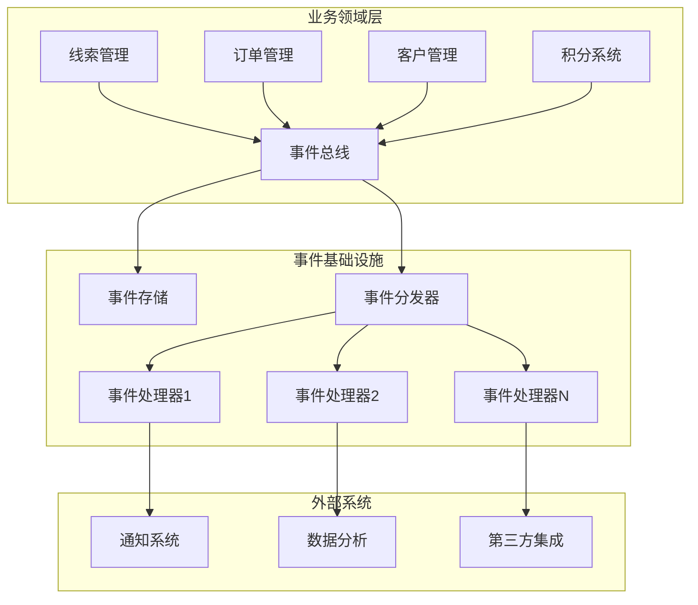

# 罗莱L2C销售管理系统 - 领域事件驱动架构设计方案

## 📋 目录
- [设计目标与价值](#设计目标与价值)
- [事件驱动架构概述](#事件驱动架构概述)
- [领域事件设计](#领域事件设计)
- [事件发布订阅机制](#事件发布订阅机制)
- [事件处理器设计](#事件处理器设计)
- [事件存储和重放](#事件存储和重放)
- [监控和运维](#监控和运维)

---

## 🎯 设计目标与价值

### 1. 设计目标
- **解耦业务模块**：通过事件机制实现模块间的松耦合
- **提升系统扩展性**：支持新功能的快速接入和扩展
- **保证数据一致性**：通过事件确保跨模块数据的最终一致性
- **增强系统可观测性**：通过事件流追踪业务流程
- **支持异步处理**：提升系统性能和用户体验

### 2. 业务价值
- **业务流程透明化**：完整记录业务事件流转过程
- **快速响应变化**：支持业务规则的灵活调整
- **提升用户体验**：异步处理提升系统响应速度
- **降低维护成本**：模块解耦降低系统复杂度

---

## 🏗️ 事件驱动架构概述

### 1. 架构总览



### 2. 核心组件

#### 2.1 事件总线 (Event Bus)
```typescript
// 事件总线接口
// src/infrastructure/events/event-bus.interface.ts

export interface IEventBus {
  publish<T extends DomainEvent>(event: T): Promise<void>;
  publishAll(events: DomainEvent[]): Promise<void>;
  subscribe<T extends DomainEvent>(
    eventType: string,
    handler: EventHandler<T>
  ): void;
  unsubscribe(eventType: string, handlerId: string): void;
}

// 事件总线实现
// src/infrastructure/events/event-bus.service.ts

@Injectable()
export class EventBusService implements IEventBus {
  private handlers = new Map<string, EventHandler[]>();
  private eventStore: IEventStore;
  private logger: Logger;

  constructor(
    @Inject('EVENT_STORE') eventStore: IEventStore,
    logger: Logger
  ) {
    this.eventStore = eventStore;
    this.logger = logger;
  }

  async publish<T extends DomainEvent>(event: T): Promise<void> {
    try {
      // 1. 持久化事件
      await this.eventStore.save(event);
      
      // 2. 分发事件
      await this.dispatch(event);
      
      this.logger.log(`Event published: ${event.eventType}`, {
        eventId: event.eventId,
        aggregateId: event.aggregateId,
        eventType: event.eventType,
      });
    } catch (error) {
      this.logger.error(`Failed to publish event: ${event.eventType}`, error);
      throw error;
    }
  }

  async publishAll(events: DomainEvent[]): Promise<void> {
    // 批量发布事件，保证原子性
    const transaction = await this.eventStore.beginTransaction();
    
    try {
      for (const event of events) {
        await this.eventStore.save(event, transaction);
      }
      
      await transaction.commit();
      
      // 事务提交成功后分发事件
      for (const event of events) {
        await this.dispatch(event);
      }
    } catch (error) {
      await transaction.rollback();
      throw error;
    }
  }

  subscribe<T extends DomainEvent>(
    eventType: string,
    handler: EventHandler<T>
  ): void {
    if (!this.handlers.has(eventType)) {
      this.handlers.set(eventType, []);
    }
    
    this.handlers.get(eventType)!.push(handler);
    
    this.logger.log(`Handler subscribed to event: ${eventType}`, {
      handlerId: handler.id,
      eventType,
    });
  }

  unsubscribe(eventType: string, handlerId: string): void {
    const handlers = this.handlers.get(eventType);
    if (handlers) {
      const index = handlers.findIndex(h => h.id === handlerId);
      if (index !== -1) {
        handlers.splice(index, 1);
        this.logger.log(`Handler unsubscribed from event: ${eventType}`, {
          handlerId,
          eventType,
        });
      }
    }
  }

  private async dispatch<T extends DomainEvent>(event: T): Promise<void> {
    const handlers = this.handlers.get(event.eventType) || [];
    
    // 并行处理所有处理器
    const promises = handlers.map(async (handler) => {
      try {
        await handler.handle(event);
        this.logger.log(`Event handled successfully`, {
          eventId: event.eventId,
          handlerId: handler.id,
          eventType: event.eventType,
        });
      } catch (error) {
        this.logger.error(`Event handler failed`, {
          eventId: event.eventId,
          handlerId: handler.id,
          eventType: event.eventType,
          error: error.message,
        });
        
        // 记录失败事件，用于重试
        await this.recordFailedEvent(event, handler.id, error);
      }
    });
    
    await Promise.allSettled(promises);
  }

  private async recordFailedEvent(
    event: DomainEvent,
    handlerId: string,
    error: Error
  ): Promise<void> {
    const failedEvent: FailedEvent = {
      id: generateId(),
      eventId: event.eventId,
      handlerId,
      eventType: event.eventType,
      eventData: event,
      error: error.message,
      failedAt: new Date(),
      retryCount: 0,
      maxRetries: 3,
    };
    
    await this.eventStore.saveFailedEvent(failedEvent);
  }
}
```

---

## 📝 领域事件设计

### 1. 事件基类设计

```typescript
// 领域事件基类
// src/domain/events/domain-event.base.ts

export abstract class DomainEvent {
  public readonly eventId: string;
  public readonly eventType: string;
  public readonly aggregateId: string;
  public readonly aggregateType: string;
  public readonly occurredOn: Date;
  public readonly version: number;
  public readonly metadata: EventMetadata;

  constructor(
    aggregateId: string,
    aggregateType: string,
    eventData: any,
    metadata: Partial<EventMetadata> = {}
  ) {
    this.eventId = generateId();
    this.eventType = this.constructor.name;
    this.aggregateId = aggregateId;
    this.aggregateType = aggregateType;
    this.occurredOn = new Date();
    this.version = 1;
    this.metadata = {
      userId: metadata.userId,
      correlationId: metadata.correlationId || generateId(),
      causationId: metadata.causationId,
      source: metadata.source || 'system',
      ...metadata,
    };
  }

  abstract getEventData(): any;
}

// 事件元数据
export interface EventMetadata {
  userId?: string;
  correlationId: string;
  causationId?: string;
  source: string;
  traceId?: string;
  sessionId?: string;
  ipAddress?: string;
  userAgent?: string;
}
```

### 2. 具体业务事件

#### 2.1 线索管理事件
```typescript
// 线索相关事件
// src/domain/leads/events/lead.events.ts

export class LeadCreatedEvent extends DomainEvent {
  constructor(
    leadId: string,
    private readonly leadData: {
      customerId: string;
      customerName: string;
      phone: string;
      email?: string;
      source: string;
      assignedTo?: string;
      priority: string;
      estimatedValue?: number;
    },
    metadata?: Partial<EventMetadata>
  ) {
    super(leadId, 'Lead', leadData, metadata);
  }

  getEventData() {
    return {
      leadId: this.aggregateId,
      customerId: this.leadData.customerId,
      customerName: this.leadData.customerName,
      phone: this.leadData.phone,
      email: this.leadData.email,
      source: this.leadData.source,
      assignedTo: this.leadData.assignedTo,
      priority: this.leadData.priority,
      estimatedValue: this.leadData.estimatedValue,
    };
  }
}

export class LeadAssignedEvent extends DomainEvent {
  constructor(
    leadId: string,
    private readonly assignmentData: {
      assignedTo: string;
      assignedBy: string;
      previousAssignee?: string;
      reason?: string;
    },
    metadata?: Partial<EventMetadata>
  ) {
    super(leadId, 'Lead', assignmentData, metadata);
  }

  getEventData() {
    return {
      leadId: this.aggregateId,
      assignedTo: this.assignmentData.assignedTo,
      assignedBy: this.assignmentData.assignedBy,
      previousAssignee: this.assignmentData.previousAssignee,
      reason: this.assignmentData.reason,
    };
  }
}

export class LeadStatusChangedEvent extends DomainEvent {
  constructor(
    leadId: string,
    private readonly statusData: {
      fromStatus: string;
      toStatus: string;
      changedBy: string;
      reason?: string;
    },
    metadata?: Partial<EventMetadata>
  ) {
    super(leadId, 'Lead', statusData, metadata);
  }

  getEventData() {
    return {
      leadId: this.aggregateId,
      fromStatus: this.statusData.fromStatus,
      toStatus: this.statusData.toStatus,
      changedBy: this.statusData.changedBy,
      reason: this.statusData.reason,
    };
  }
}

export class LeadConvertedToOrderEvent extends DomainEvent {
  constructor(
    leadId: string,
    private readonly conversionData: {
      orderId: string;
      convertedBy: string;
      conversionValue: number;
      conversionRate?: number;
    },
    metadata?: Partial<EventMetadata>
  ) {
    super(leadId, 'Lead', conversionData, metadata);
  }

  getEventData() {
    return {
      leadId: this.aggregateId,
      orderId: this.conversionData.orderId,
      convertedBy: this.conversionData.convertedBy,
      conversionValue: this.conversionData.conversionValue,
      conversionRate: this.conversionData.conversionRate,
    };
  }
}
```

#### 2.2 订单管理事件
```typescript
// 订单相关事件
// src/domain/orders/events/order.events.ts

export class OrderCreatedEvent extends DomainEvent {
  constructor(
    orderId: string,
    private readonly orderData: {
      customerId: string;
      leadId?: string;
      salesPersonId: string;
      totalAmount: number;
      items: OrderItem[];
      deliveryAddress: Address;
    },
    metadata?: Partial<EventMetadata>
  ) {
    super(orderId, 'Order', orderData, metadata);
  }

  getEventData() {
    return {
      orderId: this.aggregateId,
      customerId: this.orderData.customerId,
      leadId: this.orderData.leadId,
      salesPersonId: this.orderData.salesPersonId,
      totalAmount: this.orderData.totalAmount,
      itemCount: this.orderData.items.length,
      deliveryAddress: this.orderData.deliveryAddress,
    };
  }
}

export class OrderStatusChangedEvent extends DomainEvent {
  constructor(
    orderId: string,
    private readonly statusData: {
      fromStatus: string;
      toStatus: string;
      changedBy: string;
      reason?: string;
      estimatedDeliveryDate?: Date;
    },
    metadata?: Partial<EventMetadata>
  ) {
    super(orderId, 'Order', statusData, metadata);
  }

  getEventData() {
    return {
      orderId: this.aggregateId,
      fromStatus: this.statusData.fromStatus,
      toStatus: this.statusData.toStatus,
      changedBy: this.statusData.changedBy,
      reason: this.statusData.reason,
      estimatedDeliveryDate: this.statusData.estimatedDeliveryDate,
    };
  }
}

export class OrderPaymentReceivedEvent extends DomainEvent {
  constructor(
    orderId: string,
    private readonly paymentData: {
      paymentId: string;
      amount: number;
      paymentMethod: string;
      paidBy: string;
      remainingAmount: number;
    },
    metadata?: Partial<EventMetadata>
  ) {
    super(orderId, 'Order', paymentData, metadata);
  }

  getEventData() {
    return {
      orderId: this.aggregateId,
      paymentId: this.paymentData.paymentId,
      amount: this.paymentData.amount,
      paymentMethod: this.paymentData.paymentMethod,
      paidBy: this.paymentData.paidBy,
      remainingAmount: this.paymentData.remainingAmount,
    };
  }
}
```

#### 2.3 客户管理事件
```typescript
// 客户相关事件
// src/domain/customers/events/customer.events.ts

export class CustomerCreatedEvent extends DomainEvent {
  constructor(
    customerId: string,
    private readonly customerData: {
      name: string;
      phone: string;
      email?: string;
      address?: Address;
      source: string;
      tags?: string[];
    },
    metadata?: Partial<EventMetadata>
  ) {
    super(customerId, 'Customer', customerData, metadata);
  }

  getEventData() {
    return {
      customerId: this.aggregateId,
      name: this.customerData.name,
      phone: this.customerData.phone,
      email: this.customerData.email,
      address: this.customerData.address,
      source: this.customerData.source,
      tags: this.customerData.tags,
    };
  }
}

export class CustomerUpdatedEvent extends DomainEvent {
  constructor(
    customerId: string,
    private readonly updateData: {
      updatedFields: string[];
      updatedBy: string;
      previousData: any;
      newData: any;
    },
    metadata?: Partial<EventMetadata>
  ) {
    super(customerId, 'Customer', updateData, metadata);
  }

  getEventData() {
    return {
      customerId: this.aggregateId,
      updatedFields: this.updateData.updatedFields,
      updatedBy: this.updateData.updatedBy,
      changes: this.calculateChanges(),
    };
  }

  private calculateChanges() {
    const changes: any = {};
    for (const field of this.updateData.updatedFields) {
      changes[field] = {
        from: this.updateData.previousData[field],
        to: this.updateData.newData[field],
      };
    }
    return changes;
  }
}
```

---

## 🔄 事件发布订阅机制

### 1. 事件处理器基类

```typescript
// 事件处理器基类
// src/infrastructure/events/event-handler.base.ts

export abstract class EventHandler<T extends DomainEvent = DomainEvent> {
  public readonly id: string;
  public readonly eventType: string;
  protected readonly logger: Logger;

  constructor(eventType: string, logger: Logger) {
    this.id = generateId();
    this.eventType = eventType;
    this.logger = logger;
  }

  abstract handle(event: T): Promise<void>;

  protected async withRetry<R>(
    operation: () => Promise<R>,
    maxRetries: number = 3,
    delay: number = 1000
  ): Promise<R> {
    let lastError: Error;
    
    for (let attempt = 1; attempt <= maxRetries; attempt++) {
      try {
        return await operation();
      } catch (error) {
        lastError = error;
        
        if (attempt === maxRetries) {
          break;
        }
        
        this.logger.warn(`Attempt ${attempt} failed, retrying in ${delay}ms`, {
          error: error.message,
          attempt,
          maxRetries,
        });
        
        await this.sleep(delay * attempt); // 指数退避
      }
    }
    
    throw lastError!;
  }

  private sleep(ms: number): Promise<void> {
    return new Promise(resolve => setTimeout(resolve, ms));
  }
}
```

### 2. 具体事件处理器

#### 2.1 通知处理器
```typescript
// 通知事件处理器
// src/application/handlers/notification.handlers.ts

@Injectable()
export class LeadCreatedNotificationHandler extends EventHandler<LeadCreatedEvent> {
  constructor(
    private readonly notificationService: NotificationService,
    private readonly userService: UserService,
    logger: Logger
  ) {
    super('LeadCreatedEvent', logger);
  }

  async handle(event: LeadCreatedEvent): Promise<void> {
    const eventData = event.getEventData();
    
    await this.withRetry(async () => {
      // 1. 通知分配的销售人员
      if (eventData.assignedTo) {
        const assignee = await this.userService.findById(eventData.assignedTo);
        if (assignee) {
          await this.notificationService.sendNotification({
            userId: assignee.id,
            type: 'lead_assigned',
            title: '新线索分配',
            message: `您有一个新的线索：${eventData.customerName}`,
            data: {
              leadId: eventData.leadId,
              customerName: eventData.customerName,
              priority: eventData.priority,
            },
          });
        }
      }

      // 2. 通知销售经理
      const managers = await this.userService.findByRole('sales_manager');
      for (const manager of managers) {
        await this.notificationService.sendNotification({
          userId: manager.id,
          type: 'lead_created',
          title: '新线索创建',
          message: `新线索：${eventData.customerName}，来源：${eventData.source}`,
          data: {
            leadId: eventData.leadId,
            customerName: eventData.customerName,
            source: eventData.source,
            estimatedValue: eventData.estimatedValue,
          },
        });
      }

      this.logger.log('Lead created notifications sent', {
        leadId: eventData.leadId,
        eventId: event.eventId,
      });
    });
  }
}

@Injectable()
export class OrderStatusChangedNotificationHandler extends EventHandler<OrderStatusChangedEvent> {
  constructor(
    private readonly notificationService: NotificationService,
    private readonly customerService: CustomerService,
    logger: Logger
  ) {
    super('OrderStatusChangedEvent', logger);
  }

  async handle(event: OrderStatusChangedEvent): Promise<void> {
    const eventData = event.getEventData();
    
    await this.withRetry(async () => {
      // 根据状态变化发送不同通知
      const notificationConfig = this.getNotificationConfig(
        eventData.fromStatus,
        eventData.toStatus
      );
      
      if (notificationConfig) {
        // 通知客户
        const order = await this.orderService.findById(eventData.orderId);
        if (order) {
          await this.notificationService.sendCustomerNotification({
            customerId: order.customerId,
            type: notificationConfig.type,
            title: notificationConfig.title,
            message: notificationConfig.message,
            data: {
              orderId: eventData.orderId,
              status: eventData.toStatus,
              estimatedDeliveryDate: eventData.estimatedDeliveryDate,
            },
          });
        }
      }

      this.logger.log('Order status change notification sent', {
        orderId: eventData.orderId,
        fromStatus: eventData.fromStatus,
        toStatus: eventData.toStatus,
        eventId: event.eventId,
      });
    });
  }

  private getNotificationConfig(fromStatus: string, toStatus: string) {
    const configs = {
      'confirmed': {
        type: 'order_confirmed',
        title: '订单确认',
        message: '您的订单已确认，我们将尽快安排生产。',
      },
      'in_production': {
        type: 'order_production',
        title: '订单生产中',
        message: '您的订单正在生产中，请耐心等待。',
      },
      'ready_for_delivery': {
        type: 'order_ready',
        title: '订单准备发货',
        message: '您的订单已准备就绪，即将安排发货。',
      },
      'delivered': {
        type: 'order_delivered',
        title: '订单已送达',
        message: '您的订单已成功送达，感谢您的信任！',
      },
    };
    
    return configs[toStatus];
  }
}
```

#### 2.2 积分处理器
```typescript
// 积分事件处理器
// src/application/handlers/points.handlers.ts

@Injectable()
export class OrderCreatedPointsHandler extends EventHandler<OrderCreatedEvent> {
  constructor(
    private readonly pointsService: PointsService,
    logger: Logger
  ) {
    super('OrderCreatedEvent', logger);
  }

  async handle(event: OrderCreatedEvent): Promise<void> {
    const eventData = event.getEventData();
    
    await this.withRetry(async () => {
      // 计算积分奖励
      const pointsToAward = this.calculatePoints(eventData.totalAmount);
      
      if (pointsToAward > 0) {
        await this.pointsService.awardPoints({
          customerId: eventData.customerId,
          points: pointsToAward,
          reason: 'order_created',
          referenceId: eventData.orderId,
          referenceType: 'order',
          description: `订单创建积分奖励，订单金额：${eventData.totalAmount}`,
        });

        this.logger.log('Points awarded for order creation', {
          orderId: eventData.orderId,
          customerId: eventData.customerId,
          pointsAwarded: pointsToAward,
          eventId: event.eventId,
        });
      }
    });
  }

  private calculatePoints(orderAmount: number): number {
    // 每100元奖励1积分
    return Math.floor(orderAmount / 100);
  }
}

@Injectable()
export class LeadConvertedPointsHandler extends EventHandler<LeadConvertedToOrderEvent> {
  constructor(
    private readonly pointsService: PointsService,
    private readonly userService: UserService,
    logger: Logger
  ) {
    super('LeadConvertedToOrderEvent', logger);
  }

  async handle(event: LeadConvertedToOrderEvent): Promise<void> {
    const eventData = event.getEventData();
    
    await this.withRetry(async () => {
      // 给销售人员奖励积分
      const conversionPoints = this.calculateConversionPoints(eventData.conversionValue);
      
      if (conversionPoints > 0) {
        await this.pointsService.awardPoints({
          userId: eventData.convertedBy,
          points: conversionPoints,
          reason: 'lead_conversion',
          referenceId: eventData.leadId,
          referenceType: 'lead',
          description: `线索转化积分奖励，转化金额：${eventData.conversionValue}`,
        });

        this.logger.log('Points awarded for lead conversion', {
          leadId: eventData.leadId,
          orderId: eventData.orderId,
          convertedBy: eventData.convertedBy,
          pointsAwarded: conversionPoints,
          eventId: event.eventId,
        });
      }
    });
  }

  private calculateConversionPoints(conversionValue: number): number {
    // 根据转化金额计算积分，每1000元奖励10积分
    return Math.floor(conversionValue / 1000) * 10;
  }
}
```

---

## 💾 事件存储和重放

### 1. 事件存储接口

```typescript
// 事件存储接口
// src/infrastructure/events/event-store.interface.ts

export interface IEventStore {
  save(event: DomainEvent, transaction?: Transaction): Promise<void>;
  saveFailedEvent(failedEvent: FailedEvent): Promise<void>;
  getEvents(aggregateId: string, fromVersion?: number): Promise<DomainEvent[]>;
  getEventsByType(eventType: string, fromDate?: Date, toDate?: Date): Promise<DomainEvent[]>;
  getAllEvents(fromDate?: Date, toDate?: Date, limit?: number): Promise<DomainEvent[]>;
  getFailedEvents(maxRetries?: number): Promise<FailedEvent[]>;
  markFailedEventAsRetried(failedEventId: string): Promise<void>;
  beginTransaction(): Promise<Transaction>;
}

// 事件存储实现
// src/infrastructure/events/postgresql-event-store.service.ts

@Injectable()
export class PostgreSQLEventStore implements IEventStore {
  constructor(
    private readonly databaseService: DatabaseService,
    private readonly logger: Logger
  ) {}

  async save(event: DomainEvent, transaction?: Transaction): Promise<void> {
    const query = `
      INSERT INTO events (
        event_id, event_type, aggregate_id, aggregate_type,
        event_data, metadata, occurred_on, version
      ) VALUES ($1, $2, $3, $4, $5, $6, $7, $8)
    `;
    
    const params = [
      event.eventId,
      event.eventType,
      event.aggregateId,
      event.aggregateType,
      JSON.stringify(event.getEventData()),
      JSON.stringify(event.metadata),
      event.occurredOn,
      event.version,
    ];
    
    if (transaction) {
      await transaction.query(query, params);
    } else {
      await this.databaseService.query(query, params);
    }
    
    this.logger.log('Event saved to store', {
      eventId: event.eventId,
      eventType: event.eventType,
      aggregateId: event.aggregateId,
    });
  }

  async saveFailedEvent(failedEvent: FailedEvent): Promise<void> {
    const query = `
      INSERT INTO failed_events (
        id, event_id, handler_id, event_type, event_data,
        error, failed_at, retry_count, max_retries
      ) VALUES ($1, $2, $3, $4, $5, $6, $7, $8, $9)
    `;
    
    const params = [
      failedEvent.id,
      failedEvent.eventId,
      failedEvent.handlerId,
      failedEvent.eventType,
      JSON.stringify(failedEvent.eventData),
      failedEvent.error,
      failedEvent.failedAt,
      failedEvent.retryCount,
      failedEvent.maxRetries,
    ];
    
    await this.databaseService.query(query, params);
    
    this.logger.warn('Failed event saved', {
      failedEventId: failedEvent.id,
      eventId: failedEvent.eventId,
      handlerId: failedEvent.handlerId,
    });
  }

  async getEvents(aggregateId: string, fromVersion?: number): Promise<DomainEvent[]> {
    let query = `
      SELECT * FROM events 
      WHERE aggregate_id = $1
    `;
    const params: any[] = [aggregateId];
    
    if (fromVersion !== undefined) {
      query += ` AND version >= $2`;
      params.push(fromVersion);
    }
    
    query += ` ORDER BY version ASC`;
    
    const result = await this.databaseService.query(query, params);
    return result.rows.map(row => this.deserializeEvent(row));
  }

  async getEventsByType(
    eventType: string,
    fromDate?: Date,
    toDate?: Date
  ): Promise<DomainEvent[]> {
    let query = `SELECT * FROM events WHERE event_type = $1`;
    const params: any[] = [eventType];
    
    if (fromDate) {
      query += ` AND occurred_on >= $${params.length + 1}`;
      params.push(fromDate);
    }
    
    if (toDate) {
      query += ` AND occurred_on <= $${params.length + 1}`;
      params.push(toDate);
    }
    
    query += ` ORDER BY occurred_on ASC`;
    
    const result = await this.databaseService.query(query, params);
    return result.rows.map(row => this.deserializeEvent(row));
  }

  async getAllEvents(
    fromDate?: Date,
    toDate?: Date,
    limit?: number
  ): Promise<DomainEvent[]> {
    let query = `SELECT * FROM events WHERE 1=1`;
    const params: any[] = [];
    
    if (fromDate) {
      query += ` AND occurred_on >= $${params.length + 1}`;
      params.push(fromDate);
    }
    
    if (toDate) {
      query += ` AND occurred_on <= $${params.length + 1}`;
      params.push(toDate);
    }
    
    query += ` ORDER BY occurred_on ASC`;
    
    if (limit) {
      query += ` LIMIT $${params.length + 1}`;
      params.push(limit);
    }
    
    const result = await this.databaseService.query(query, params);
    return result.rows.map(row => this.deserializeEvent(row));
  }

  async getFailedEvents(maxRetries?: number): Promise<FailedEvent[]> {
    let query = `
      SELECT * FROM failed_events 
      WHERE retry_count < max_retries
    `;
    const params: any[] = [];
    
    if (maxRetries !== undefined) {
      query += ` AND max_retries <= $${params.length + 1}`;
      params.push(maxRetries);
    }
    
    query += ` ORDER BY failed_at ASC`;
    
    const result = await this.databaseService.query(query, params);
    return result.rows.map(row => ({
      id: row.id,
      eventId: row.event_id,
      handlerId: row.handler_id,
      eventType: row.event_type,
      eventData: JSON.parse(row.event_data),
      error: row.error,
      failedAt: row.failed_at,
      retryCount: row.retry_count,
      maxRetries: row.max_retries,
    }));
  }

  async markFailedEventAsRetried(failedEventId: string): Promise<void> {
    const query = `
      UPDATE failed_events 
      SET retry_count = retry_count + 1,
          last_retry_at = CURRENT_TIMESTAMP
      WHERE id = $1
    `;
    
    await this.databaseService.query(query, [failedEventId]);
  }

  async beginTransaction(): Promise<Transaction> {
    return await this.databaseService.beginTransaction();
  }

  private deserializeEvent(row: any): DomainEvent {
    // 这里需要根据事件类型反序列化为具体的事件对象
    // 可以使用工厂模式或注册表模式
    const eventData = JSON.parse(row.event_data);
    const metadata = JSON.parse(row.metadata);
    
    // 简化示例，实际应该有完整的事件重建逻辑
    return {
      eventId: row.event_id,
      eventType: row.event_type,
      aggregateId: row.aggregate_id,
      aggregateType: row.aggregate_type,
      occurredOn: row.occurred_on,
      version: row.version,
      metadata,
      getEventData: () => eventData,
    } as DomainEvent;
  }
}
```

### 2. 事件重放服务

```typescript
// 事件重放服务
// src/infrastructure/events/event-replay.service.ts

@Injectable()
export class EventReplayService {
  constructor(
    private readonly eventStore: IEventStore,
    private readonly eventBus: IEventBus,
    private readonly logger: Logger
  ) {}

  async replayEvents(
    fromDate: Date,
    toDate: Date,
    eventTypes?: string[]
  ): Promise<ReplayResult> {
    this.logger.log('Starting event replay', {
      fromDate,
      toDate,
      eventTypes,
    });

    const startTime = Date.now();
    let processedCount = 0;
    let errorCount = 0;
    const errors: ReplayError[] = [];

    try {
      // 获取需要重放的事件
      const events = await this.getEventsForReplay(fromDate, toDate, eventTypes);
      
      this.logger.log(`Found ${events.length} events to replay`);

      // 按时间顺序重放事件
      for (const event of events) {
        try {
          await this.replayEvent(event);
          processedCount++;
          
          if (processedCount % 100 === 0) {
            this.logger.log(`Replayed ${processedCount}/${events.length} events`);
          }
        } catch (error) {
          errorCount++;
          errors.push({
            eventId: event.eventId,
            eventType: event.eventType,
            error: error.message,
          });
          
          this.logger.error(`Failed to replay event ${event.eventId}`, error);
        }
      }

      const duration = Date.now() - startTime;
      
      this.logger.log('Event replay completed', {
        totalEvents: events.length,
        processedCount,
        errorCount,
        duration,
      });

      return {
        totalEvents: events.length,
        processedCount,
        errorCount,
        duration,
        errors,
      };
    } catch (error) {
      this.logger.error('Event replay failed', error);
      throw error;
    }
  }

  async replayFailedEvents(): Promise<ReplayResult> {
    this.logger.log('Starting failed events replay');

    const startTime = Date.now();
    let processedCount = 0;
    let errorCount = 0;
    const errors: ReplayError[] = [];

    try {
      const failedEvents = await this.eventStore.getFailedEvents();
      
      this.logger.log(`Found ${failedEvents.length} failed events to retry`);

      for (const failedEvent of failedEvents) {
        try {
          await this.retryFailedEvent(failedEvent);
          processedCount++;
        } catch (error) {
          errorCount++;
          errors.push({
            eventId: failedEvent.eventId,
            eventType: failedEvent.eventType,
            error: error.message,
          });
          
          // 标记重试次数
          await this.eventStore.markFailedEventAsRetried(failedEvent.id);
        }
      }

      const duration = Date.now() - startTime;
      
      this.logger.log('Failed events replay completed', {
        totalEvents: failedEvents.length,
        processedCount,
        errorCount,
        duration,
      });

      return {
        totalEvents: failedEvents.length,
        processedCount,
        errorCount,
        duration,
        errors,
      };
    } catch (error) {
      this.logger.error('Failed events replay failed', error);
      throw error;
    }
  }

  private async getEventsForReplay(
    fromDate: Date,
    toDate: Date,
    eventTypes?: string[]
  ): Promise<DomainEvent[]> {
    if (eventTypes && eventTypes.length > 0) {
      const allEvents: DomainEvent[] = [];
      
      for (const eventType of eventTypes) {
        const events = await this.eventStore.getEventsByType(eventType, fromDate, toDate);
        allEvents.push(...events);
      }
      
      // 按时间排序
      return allEvents.sort((a, b) => a.occurredOn.getTime() - b.occurredOn.getTime());
    } else {
      return await this.eventStore.getAllEvents(fromDate, toDate);
    }
  }

  private async replayEvent(event: DomainEvent): Promise<void> {
    // 重新发布事件，但不保存到事件存储
    await this.eventBus.publish(event);
  }

  private async retryFailedEvent(failedEvent: FailedEvent): Promise<void> {
    // 重建事件对象并重新发布
    const event = this.rebuildEvent(failedEvent);
    await this.eventBus.publish(event);
  }

  private rebuildEvent(failedEvent: FailedEvent): DomainEvent {
    // 根据失败事件数据重建事件对象
    // 这里需要实现具体的事件重建逻辑
    return failedEvent.eventData as DomainEvent;
  }
}

// 重放结果接口
interface ReplayResult {
  totalEvents: number;
  processedCount: number;
  errorCount: number;
  duration: number;
  errors: ReplayError[];
}

interface ReplayError {
  eventId: string;
  eventType: string;
  error: string;
}

// 失败事件接口
interface FailedEvent {
  id: string;
  eventId: string;
  handlerId: string;
  eventType: string;
  eventData: any;
  error: string;
  failedAt: Date;
  retryCount: number;
  maxRetries: number;
}
```

这个领域事件驱动架构设计方案提供了完整的事件驱动机制，包括事件定义、发布订阅、存储重放等核心功能，确保系统各模块间的松耦合和高扩展性。
