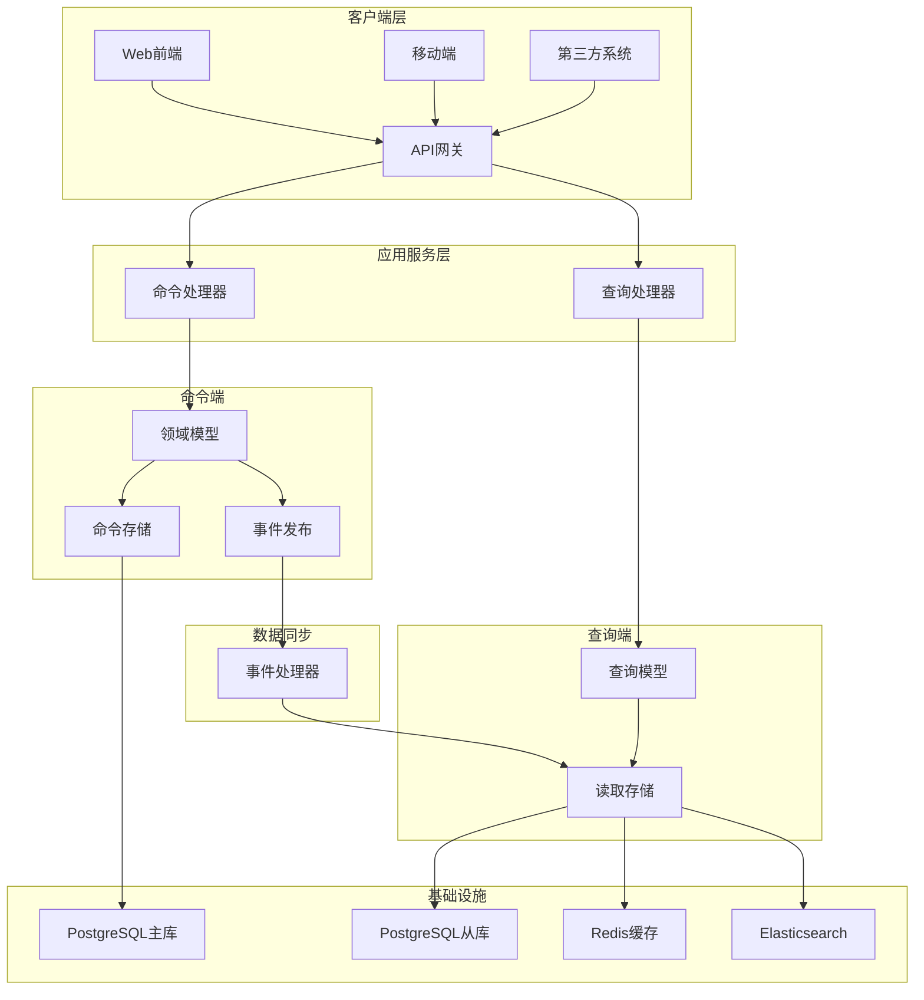

# 罗莱L2C销售管理系统 - CQRS命令查询分离架构设计方案

## 📋 目录
- [设计目标与价值](#设计目标与价值)
- [CQRS架构概述](#CQRS架构概述)
- [命令端设计](#命令端设计)
- [查询端设计](#查询端设计)
- [数据同步机制](#数据同步机制)
- [性能优化策略](#性能优化策略)
- [监控和运维](#监控和运维)

---

## 🎯 设计目标与价值

### 1. 设计目标
- **读写分离**：将命令操作和查询操作完全分离，优化各自性能
- **独立扩展**：命令端和查询端可以独立扩展和优化
- **复杂查询支持**：支持复杂的查询需求和报表生成
- **数据一致性**：通过事件机制保证最终一致性
- **系统解耦**：降低读写操作之间的耦合度

### 2. 业务价值
- **提升查询性能**：专门优化的查询模型提升查询效率
- **简化业务逻辑**：命令和查询逻辑分离，降低复杂度
- **支持多种视图**：同一数据可以构建多种查询视图
- **提升用户体验**：快速的查询响应和可靠的命令处理

---

## 🏗️ CQRS架构概述

### 1. 架构总览



### 2. 核心组件

#### 2.1 命令总线
```typescript
// 命令总线接口
// src/application/commands/command-bus.interface.ts

export interface ICommandBus {
  execute<T extends Command, R = any>(command: T): Promise<R>;
  register<T extends Command>(
    commandType: string,
    handler: CommandHandler<T>
  ): void;
}

// 命令基类
export abstract class Command {
  public readonly commandId: string;
  public readonly commandType: string;
  public readonly timestamp: Date;
  public readonly userId?: string;
  public readonly correlationId: string;

  constructor(userId?: string, correlationId?: string) {
    this.commandId = generateId();
    this.commandType = this.constructor.name;
    this.timestamp = new Date();
    this.userId = userId;
    this.correlationId = correlationId || generateId();
  }
}

// 命令总线实现
// src/infrastructure/commands/command-bus.service.ts

@Injectable()
export class CommandBusService implements ICommandBus {
  private handlers = new Map<string, CommandHandler>();
  private middleware: CommandMiddleware[] = [];

  constructor(
    private readonly logger: Logger,
    private readonly metricsService: MetricsService
  ) {}

  async execute<T extends Command, R = any>(command: T): Promise<R> {
    const startTime = Date.now();
    
    try {
      this.logger.log(`Executing command: ${command.commandType}`, {
        commandId: command.commandId,
        commandType: command.commandType,
        userId: command.userId,
        correlationId: command.correlationId,
      });

      // 执行中间件
      for (const middleware of this.middleware) {
        await middleware.execute(command);
      }

      // 获取处理器
      const handler = this.handlers.get(command.commandType);
      if (!handler) {
        throw new Error(`No handler registered for command: ${command.commandType}`);
      }

      // 执行命令
      const result = await handler.handle(command);

      const duration = Date.now() - startTime;
      
      // 记录指标
      this.metricsService.recordCommandExecution(
        command.commandType,
        'success',
        duration
      );

      this.logger.log(`Command executed successfully: ${command.commandType}`, {
        commandId: command.commandId,
        duration,
      });

      return result;
    } catch (error) {
      const duration = Date.now() - startTime;
      
      // 记录错误指标
      this.metricsService.recordCommandExecution(
        command.commandType,
        'error',
        duration
      );

      this.logger.error(`Command execution failed: ${command.commandType}`, {
        commandId: command.commandId,
        error: error.message,
        duration,
      });

      throw error;
    }
  }

  register<T extends Command>(
    commandType: string,
    handler: CommandHandler<T>
  ): void {
    this.handlers.set(commandType, handler);
    this.logger.log(`Command handler registered: ${commandType}`);
  }

  addMiddleware(middleware: CommandMiddleware): void {
    this.middleware.push(middleware);
  }
}
```

#### 2.2 查询总线
```typescript
// 查询总线接口
// src/application/queries/query-bus.interface.ts

export interface IQueryBus {
  execute<T extends Query, R = any>(query: T): Promise<R>;
  register<T extends Query>(
    queryType: string,
    handler: QueryHandler<T>
  ): void;
}

// 查询基类
export abstract class Query {
  public readonly queryId: string;
  public readonly queryType: string;
  public readonly timestamp: Date;
  public readonly userId?: string;
  public readonly correlationId: string;

  constructor(userId?: string, correlationId?: string) {
    this.queryId = generateId();
    this.queryType = this.constructor.name;
    this.timestamp = new Date();
    this.userId = userId;
    this.correlationId = correlationId || generateId();
  }
}

// 查询总线实现
// src/infrastructure/queries/query-bus.service.ts

@Injectable()
export class QueryBusService implements IQueryBus {
  private handlers = new Map<string, QueryHandler>();
  private middleware: QueryMiddleware[] = [];

  constructor(
    private readonly logger: Logger,
    private readonly metricsService: MetricsService,
    private readonly cacheService: CacheService
  ) {}

  async execute<T extends Query, R = any>(query: T): Promise<R> {
    const startTime = Date.now();
    
    try {
      this.logger.log(`Executing query: ${query.queryType}`, {
        queryId: query.queryId,
        queryType: query.queryType,
        userId: query.userId,
        correlationId: query.correlationId,
      });

      // 检查缓存
      const cacheKey = this.generateCacheKey(query);
      const cachedResult = await this.cacheService.get(cacheKey);
      if (cachedResult) {
        this.metricsService.recordQueryExecution(
          query.queryType,
          'cache_hit',
          Date.now() - startTime
        );
        return cachedResult;
      }

      // 执行中间件
      for (const middleware of this.middleware) {
        await middleware.execute(query);
      }

      // 获取处理器
      const handler = this.handlers.get(query.queryType);
      if (!handler) {
        throw new Error(`No handler registered for query: ${query.queryType}`);
      }

      // 执行查询
      const result = await handler.handle(query);

      // 缓存结果
      if (this.shouldCache(query)) {
        await this.cacheService.set(
          cacheKey,
          result,
          this.getCacheTTL(query)
        );
      }

      const duration = Date.now() - startTime;
      
      // 记录指标
      this.metricsService.recordQueryExecution(
        query.queryType,
        'success',
        duration
      );

      this.logger.log(`Query executed successfully: ${query.queryType}`, {
        queryId: query.queryId,
        duration,
      });

      return result;
    } catch (error) {
      const duration = Date.now() - startTime;
      
      // 记录错误指标
      this.metricsService.recordQueryExecution(
        query.queryType,
        'error',
        duration
      );

      this.logger.error(`Query execution failed: ${query.queryType}`, {
        queryId: query.queryId,
        error: error.message,
        duration,
      });

      throw error;
    }
  }

  register<T extends Query>(
    queryType: string,
    handler: QueryHandler<T>
  ): void {
    this.handlers.set(queryType, handler);
    this.logger.log(`Query handler registered: ${queryType}`);
  }

  addMiddleware(middleware: QueryMiddleware): void {
    this.middleware.push(middleware);
  }

  private generateCacheKey(query: Query): string {
    // 生成基于查询内容的缓存键
    const queryData = JSON.stringify(query);
    return `query:${query.queryType}:${hashString(queryData)}`;
  }

  private shouldCache(query: Query): boolean {
    // 根据查询类型决定是否缓存
    const cacheableQueries = [
      'GetCustomerListQuery',
      'GetProductCatalogQuery',
      'GetOrderStatisticsQuery',
    ];
    return cacheableQueries.includes(query.queryType);
  }

  private getCacheTTL(query: Query): number {
    // 根据查询类型返回不同的缓存时间
    const ttlMap = {
      'GetCustomerListQuery': 300, // 5分钟
      'GetProductCatalogQuery': 3600, // 1小时
      'GetOrderStatisticsQuery': 600, // 10分钟
    };
    return ttlMap[query.queryType] || 300;
  }
}
```

---

## ⚡ 命令端设计

### 1. 命令定义

#### 1.1 线索管理命令
```typescript
// 线索管理命令
// src/application/commands/leads/lead.commands.ts

export class CreateLeadCommand extends Command {
  constructor(
    public readonly customerData: {
      name: string;
      phone: string;
      email?: string;
      address?: Address;
      source: string;
    },
    public readonly leadData: {
      priority: string;
      estimatedValue?: number;
      notes?: string;
      assignedTo?: string;
    },
    userId?: string,
    correlationId?: string
  ) {
    super(userId, correlationId);
  }
}

export class AssignLeadCommand extends Command {
  constructor(
    public readonly leadId: string,
    public readonly assignedTo: string,
    public readonly reason?: string,
    userId?: string,
    correlationId?: string
  ) {
    super(userId, correlationId);
  }
}

export class UpdateLeadStatusCommand extends Command {
  constructor(
    public readonly leadId: string,
    public readonly newStatus: string,
    public readonly reason?: string,
    userId?: string,
    correlationId?: string
  ) {
    super(userId, correlationId);
  }
}

export class ConvertLeadToOrderCommand extends Command {
  constructor(
    public readonly leadId: string,
    public readonly orderData: {
      items: OrderItem[];
      deliveryAddress: Address;
      notes?: string;
    },
    userId?: string,
    correlationId?: string
  ) {
    super(userId, correlationId);
  }
}
```

#### 1.2 订单管理命令
```typescript
// 订单管理命令
// src/application/commands/orders/order.commands.ts

export class CreateOrderCommand extends Command {
  constructor(
    public readonly customerId: string,
    public readonly orderData: {
      items: OrderItem[];
      deliveryAddress: Address;
      notes?: string;
      leadId?: string;
    },
    userId?: string,
    correlationId?: string
  ) {
    super(userId, correlationId);
  }
}

export class UpdateOrderStatusCommand extends Command {
  constructor(
    public readonly orderId: string,
    public readonly newStatus: string,
    public readonly reason?: string,
    public readonly estimatedDeliveryDate?: Date,
    userId?: string,
    correlationId?: string
  ) {
    super(userId, correlationId);
  }
}

export class ProcessPaymentCommand extends Command {
  constructor(
    public readonly orderId: string,
    public readonly paymentData: {
      amount: number;
      paymentMethod: string;
      paymentReference?: string;
    },
    userId?: string,
    correlationId?: string
  ) {
    super(userId, correlationId);
  }
}

export class CancelOrderCommand extends Command {
  constructor(
    public readonly orderId: string,
    public readonly reason: string,
    userId?: string,
    correlationId?: string
  ) {
    super(userId, correlationId);
  }
}
```

### 2. 命令处理器

#### 2.1 线索命令处理器
```typescript
// 线索命令处理器
// src/application/commands/leads/handlers/lead.handlers.ts

@Injectable()
export class CreateLeadCommandHandler implements CommandHandler<CreateLeadCommand> {
  constructor(
    private readonly leadRepository: ILeadRepository,
    private readonly customerRepository: ICustomerRepository,
    private readonly eventBus: IEventBus,
    private readonly logger: Logger
  ) {}

  async handle(command: CreateLeadCommand): Promise<string> {
    this.logger.log('Handling CreateLeadCommand', {
      commandId: command.commandId,
      customerName: command.customerData.name,
    });

    // 1. 验证命令
    await this.validateCommand(command);

    // 2. 查找或创建客户
    let customer = await this.customerRepository.findByPhone(command.customerData.phone);
    if (!customer) {
      customer = Customer.create(
        command.customerData.name,
        command.customerData.phone,
        command.customerData.email,
        command.customerData.address,
        command.customerData.source
      );
      await this.customerRepository.save(customer);
    }

    // 3. 创建线索
    const lead = Lead.create(
      customer.id,
      command.leadData.priority,
      command.leadData.estimatedValue,
      command.leadData.notes,
      command.leadData.assignedTo,
      command.userId
    );

    // 4. 保存线索
    await this.leadRepository.save(lead);

    // 5. 发布事件
    const events = lead.getUncommittedEvents();
    for (const event of events) {
      await this.eventBus.publish(event);
    }
    lead.markEventsAsCommitted();

    this.logger.log('Lead created successfully', {
      leadId: lead.id,
      customerId: customer.id,
      commandId: command.commandId,
    });

    return lead.id;
  }

  private async validateCommand(command: CreateLeadCommand): Promise<void> {
    // 验证客户数据
    if (!command.customerData.name?.trim()) {
      throw new ValidationError('Customer name is required');
    }

    if (!command.customerData.phone?.trim()) {
      throw new ValidationError('Customer phone is required');
    }

    // 验证手机号格式
    const phoneRegex = /^1[3-9]\d{9}$/;
    if (!phoneRegex.test(command.customerData.phone)) {
      throw new ValidationError('Invalid phone number format');
    }

    // 验证邮箱格式
    if (command.customerData.email) {
      const emailRegex = /^[^\s@]+@[^\s@]+\.[^\s@]+$/;
      if (!emailRegex.test(command.customerData.email)) {
        throw new ValidationError('Invalid email format');
      }
    }

    // 验证线索数据
    const validPriorities = ['low', 'medium', 'high', 'urgent'];
    if (!validPriorities.includes(command.leadData.priority)) {
      throw new ValidationError('Invalid priority value');
    }

    if (command.leadData.estimatedValue && command.leadData.estimatedValue < 0) {
      throw new ValidationError('Estimated value cannot be negative');
    }
  }
}

@Injectable()
export class AssignLeadCommandHandler implements CommandHandler<AssignLeadCommand> {
  constructor(
    private readonly leadRepository: ILeadRepository,
    private readonly userRepository: IUserRepository,
    private readonly eventBus: IEventBus,
    private readonly logger: Logger
  ) {}

  async handle(command: AssignLeadCommand): Promise<void> {
    this.logger.log('Handling AssignLeadCommand', {
      commandId: command.commandId,
      leadId: command.leadId,
      assignedTo: command.assignedTo,
    });

    // 1. 验证命令
    await this.validateCommand(command);

    // 2. 获取线索
    const lead = await this.leadRepository.findById(command.leadId);
    if (!lead) {
      throw new NotFoundError(`Lead not found: ${command.leadId}`);
    }

    // 3. 分配线索
    lead.assignTo(command.assignedTo, command.userId, command.reason);

    // 4. 保存线索
    await this.leadRepository.save(lead);

    // 5. 发布事件
    const events = lead.getUncommittedEvents();
    for (const event of events) {
      await this.eventBus.publish(event);
    }
    lead.markEventsAsCommitted();

    this.logger.log('Lead assigned successfully', {
      leadId: command.leadId,
      assignedTo: command.assignedTo,
      commandId: command.commandId,
    });
  }

  private async validateCommand(command: AssignLeadCommand): Promise<void> {
    // 验证分配对象是否存在
    const assignee = await this.userRepository.findById(command.assignedTo);
    if (!assignee) {
      throw new ValidationError(`Assignee not found: ${command.assignedTo}`);
    }

    // 验证分配对象是否有权限处理线索
    if (!assignee.hasRole('sales_person') && !assignee.hasRole('sales_manager')) {
      throw new ValidationError('Assignee does not have permission to handle leads');
    }
  }
}
```

#### 2.2 订单命令处理器
```typescript
// 订单命令处理器
// src/application/commands/orders/handlers/order.handlers.ts

@Injectable()
export class CreateOrderCommandHandler implements CommandHandler<CreateOrderCommand> {
  constructor(
    private readonly orderRepository: IOrderRepository,
    private readonly customerRepository: ICustomerRepository,
    private readonly productRepository: IProductRepository,
    private readonly leadRepository: ILeadRepository,
    private readonly eventBus: IEventBus,
    private readonly logger: Logger
  ) {}

  async handle(command: CreateOrderCommand): Promise<string> {
    this.logger.log('Handling CreateOrderCommand', {
      commandId: command.commandId,
      customerId: command.customerId,
      itemCount: command.orderData.items.length,
    });

    // 1. 验证命令
    await this.validateCommand(command);

    // 2. 获取客户信息
    const customer = await this.customerRepository.findById(command.customerId);
    if (!customer) {
      throw new NotFoundError(`Customer not found: ${command.customerId}`);
    }

    // 3. 验证产品和计算总金额
    const validatedItems = await this.validateAndCalculateItems(command.orderData.items);
    const totalAmount = validatedItems.reduce((sum, item) => sum + item.totalPrice, 0);

    // 4. 创建订单
    const order = Order.create(
      command.customerId,
      validatedItems,
      command.orderData.deliveryAddress,
      totalAmount,
      command.userId,
      command.orderData.notes,
      command.orderData.leadId
    );

    // 5. 保存订单
    await this.orderRepository.save(order);

    // 6. 如果是从线索转化，更新线索状态
    if (command.orderData.leadId) {
      const lead = await this.leadRepository.findById(command.orderData.leadId);
      if (lead) {
        lead.convertToOrder(order.id, command.userId);
        await this.leadRepository.save(lead);
        
        // 发布线索转化事件
        const leadEvents = lead.getUncommittedEvents();
        for (const event of leadEvents) {
          await this.eventBus.publish(event);
        }
        lead.markEventsAsCommitted();
      }
    }

    // 7. 发布订单事件
    const orderEvents = order.getUncommittedEvents();
    for (const event of orderEvents) {
      await this.eventBus.publish(event);
    }
    order.markEventsAsCommitted();

    this.logger.log('Order created successfully', {
      orderId: order.id,
      customerId: command.customerId,
      totalAmount,
      commandId: command.commandId,
    });

    return order.id;
  }

  private async validateCommand(command: CreateOrderCommand): Promise<void> {
    // 验证订单项
    if (!command.orderData.items || command.orderData.items.length === 0) {
      throw new ValidationError('Order must have at least one item');
    }

    // 验证配送地址
    if (!command.orderData.deliveryAddress) {
      throw new ValidationError('Delivery address is required');
    }

    if (!command.orderData.deliveryAddress.street?.trim()) {
      throw new ValidationError('Delivery street address is required');
    }

    if (!command.orderData.deliveryAddress.city?.trim()) {
      throw new ValidationError('Delivery city is required');
    }
  }

  private async validateAndCalculateItems(items: OrderItem[]): Promise<ValidatedOrderItem[]> {
    const validatedItems: ValidatedOrderItem[] = [];

    for (const item of items) {
      // 验证产品是否存在
      const product = await this.productRepository.findById(item.productId);
      if (!product) {
        throw new ValidationError(`Product not found: ${item.productId}`);
      }

      // 验证库存
      if (product.stock < item.quantity) {
        throw new ValidationError(
          `Insufficient stock for product ${product.name}. Available: ${product.stock}, Requested: ${item.quantity}`
        );
      }

      // 验证数量
      if (item.quantity <= 0) {
        throw new ValidationError('Item quantity must be greater than 0');
      }

      // 计算价格
      const unitPrice = product.price;
      const totalPrice = unitPrice * item.quantity;

      validatedItems.push({
        productId: item.productId,
        productName: product.name,
        quantity: item.quantity,
        unitPrice,
        totalPrice,
        specifications: item.specifications,
      });
    }

    return validatedItems;
  }
}
```

---

## 🔍 查询端设计

### 1. 查询定义

#### 1.1 线索查询
```typescript
// 线索查询
// src/application/queries/leads/lead.queries.ts

export class GetLeadListQuery extends Query {
  constructor(
    public readonly filters: {
      status?: string[];
      priority?: string[];
      assignedTo?: string;
      source?: string[];
      dateRange?: {
        from: Date;
        to: Date;
      };
      searchKeyword?: string;
    },
    public readonly pagination: {
      page: number;
      pageSize: number;
    },
    public readonly sorting: {
      field: string;
      direction: 'asc' | 'desc';
    },
    userId?: string,
    correlationId?: string
  ) {
    super(userId, correlationId);
  }
}

export class GetLeadDetailQuery extends Query {
  constructor(
    public readonly leadId: string,
    userId?: string,
    correlationId?: string
  ) {
    super(userId, correlationId);
  }
}

export class GetLeadStatisticsQuery extends Query {
  constructor(
    public readonly filters: {
      dateRange?: {
        from: Date;
        to: Date;
      };
      assignedTo?: string;
      source?: string[];
    },
    userId?: string,
    correlationId?: string
  ) {
    super(userId, correlationId);
  }
}

export class GetLeadConversionAnalysisQuery extends Query {
  constructor(
    public readonly filters: {
      dateRange: {
        from: Date;
        to: Date;
      };
      assignedTo?: string;
      source?: string[];
    },
    userId?: string,
    correlationId?: string
  ) {
    super(userId, correlationId);
  }
}
```

#### 1.2 订单查询
```typescript
// 订单查询
// src/application/queries/orders/order.queries.ts

export class GetOrderListQuery extends Query {
  constructor(
    public readonly filters: {
      status?: string[];
      customerId?: string;
      salesPersonId?: string;
      dateRange?: {
        from: Date;
        to: Date;
      };
      amountRange?: {
        min: number;
        max: number;
      };
      searchKeyword?: string;
    },
    public readonly pagination: {
      page: number;
      pageSize: number;
    },
    public readonly sorting: {
      field: string;
      direction: 'asc' | 'desc';
    },
    userId?: string,
    correlationId?: string
  ) {
    super(userId, correlationId);
  }
}

export class GetOrderDetailQuery extends Query {
  constructor(
    public readonly orderId: string,
    userId?: string,
    correlationId?: string
  ) {
    super(userId, correlationId);
  }
}

export class GetOrderStatisticsQuery extends Query {
  constructor(
    public readonly filters: {
      dateRange?: {
        from: Date;
        to: Date;
      };
      salesPersonId?: string;
      status?: string[];
    },
    userId?: string,
    correlationId?: string
  ) {
    super(userId, correlationId);
  }
}

export class GetSalesReportQuery extends Query {
  constructor(
    public readonly reportType: 'daily' | 'weekly' | 'monthly' | 'yearly',
    public readonly filters: {
      dateRange: {
        from: Date;
        to: Date;
      };
      salesPersonId?: string;
      productCategory?: string;
    },
    userId?: string,
    correlationId?: string
  ) {
    super(userId, correlationId);
  }
}
```

### 2. 查询模型

#### 2.1 线索查询模型
```typescript
// 线索查询模型
// src/infrastructure/queries/leads/models/lead-read.model.ts

export interface LeadReadModel {
  id: string;
  customerId: string;
  customerName: string;
  customerPhone: string;
  customerEmail?: string;
  status: string;
  priority: string;
  source: string;
  estimatedValue?: number;
  assignedTo?: string;
  assignedToName?: string;
  createdBy: string;
  createdByName: string;
  createdAt: Date;
  updatedAt: Date;
  lastContactAt?: Date;
  notes?: string;
  tags: string[];
  conversionRate?: number;
  followUpCount: number;
}

export interface LeadDetailReadModel extends LeadReadModel {
  customer: {
    id: string;
    name: string;
    phone: string;
    email?: string;
    address?: Address;
    totalOrders: number;
    totalOrderValue: number;
    lastOrderDate?: Date;
  };
  activities: LeadActivity[];
  followUps: FollowUp[];
  relatedOrders: RelatedOrder[];
}

export interface LeadStatisticsReadModel {
  totalLeads: number;
  newLeads: number;
  convertedLeads: number;
  conversionRate: number;
  averageConversionTime: number;
  totalEstimatedValue: number;
  actualConversionValue: number;
  leadsByStatus: StatusCount[];
  leadsByPriority: PriorityCount[];
  leadsBySource: SourceCount[];
  conversionTrend: TrendData[];
}
```

#### 2.2 订单查询模型
```typescript
// 订单查询模型
// src/infrastructure/queries/orders/models/order-read.model.ts

export interface OrderReadModel {
  id: string;
  orderNumber: string;
  customerId: string;
  customerName: string;
  customerPhone: string;
  salesPersonId: string;
  salesPersonName: string;
  status: string;
  totalAmount: number;
  paidAmount: number;
  remainingAmount: number;
  itemCount: number;
  deliveryAddress: Address;
  estimatedDeliveryDate?: Date;
  actualDeliveryDate?: Date;
  createdAt: Date;
  updatedAt: Date;
  notes?: string;
  leadId?: string;
}

export interface OrderDetailReadModel extends OrderReadModel {
  customer: {
    id: string;
    name: string;
    phone: string;
    email?: string;
    address?: Address;
    totalOrders: number;
    totalOrderValue: number;
  };
  items: OrderItemReadModel[];
  payments: PaymentReadModel[];
  statusHistory: OrderStatusHistory[];
  deliveryInfo?: DeliveryInfo;
}

export interface OrderStatisticsReadModel {
  totalOrders: number;
  totalRevenue: number;
  averageOrderValue: number;
  completedOrders: number;
  pendingOrders: number;
  cancelledOrders: number;
  ordersByStatus: StatusCount[];
  revenueByMonth: MonthlyRevenue[];
  topProducts: ProductSales[];
  topCustomers: CustomerSales[];
}
```

### 3. 查询处理器

#### 3.1 线索查询处理器
```typescript
// 线索查询处理器
// src/infrastructure/queries/leads/handlers/lead-query.handlers.ts

@Injectable()
export class GetLeadListQueryHandler implements QueryHandler<GetLeadListQuery> {
  constructor(
    private readonly leadReadRepository: ILeadReadRepository,
    private readonly logger: Logger
  ) {}

  async handle(query: GetLeadListQuery): Promise<PaginatedResult<LeadReadModel>> {
    this.logger.log('Handling GetLeadListQuery', {
      queryId: query.queryId,
      filters: query.filters,
      pagination: query.pagination,
    });

    // 构建查询条件
    const queryBuilder = this.leadReadRepository.createQueryBuilder();

    // 应用过滤条件
    this.applyFilters(queryBuilder, query.filters);

    // 应用搜索
    if (query.filters.searchKeyword) {
      this.applySearch(queryBuilder, query.filters.searchKeyword);
    }

    // 应用排序
    queryBuilder.orderBy(query.sorting.field, query.sorting.direction);

    // 应用分页
    const offset = (query.pagination.page - 1) * query.pagination.pageSize;
    queryBuilder.skip(offset).take(query.pagination.pageSize);

    // 执行查询
    const [leads, total] = await queryBuilder.getManyAndCount();

    const result = {
      items: leads,
      total,
      page: query.pagination.page,
      pageSize: query.pagination.pageSize,
      totalPages: Math.ceil(total / query.pagination.pageSize),
    };

    this.logger.log('Lead list query completed', {
      queryId: query.queryId,
      resultCount: leads.length,
      total,
    });

    return result;
  }

  private applyFilters(queryBuilder: any, filters: any): void {
    if (filters.status && filters.status.length > 0) {
      queryBuilder.andWhere('status IN (:...statuses)', { statuses: filters.status });
    }

    if (filters.priority && filters.priority.length > 0) {
      queryBuilder.andWhere('priority IN (:...priorities)', { priorities: filters.priority });
    }

    if (filters.assignedTo) {
      queryBuilder.andWhere('assignedTo = :assignedTo', { assignedTo: filters.assignedTo });
    }

    if (filters.source && filters.source.length > 0) {
      queryBuilder.andWhere('source IN (:...sources)', { sources: filters.source });
    }

    if (filters.dateRange) {
      queryBuilder.andWhere('createdAt BETWEEN :from AND :to', {
        from: filters.dateRange.from,
        to: filters.dateRange.to,
      });
    }
  }

  private applySearch(queryBuilder: any, keyword: string): void {
    queryBuilder.andWhere(
      '(customerName ILIKE :keyword OR customerPhone ILIKE :keyword OR notes ILIKE :keyword)',
      { keyword: `%${keyword}%` }
    );
  }
}

@Injectable()
export class GetLeadStatisticsQueryHandler implements QueryHandler<GetLeadStatisticsQuery> {
  constructor(
    private readonly leadReadRepository: ILeadReadRepository,
    private readonly logger: Logger
  ) {}

  async handle(query: GetLeadStatisticsQuery): Promise<LeadStatisticsReadModel> {
    this.logger.log('Handling GetLeadStatisticsQuery', {
      queryId: query.queryId,
      filters: query.filters,
    });

    // 并行执行多个统计查询
    const [
      totalLeads,
      newLeads,
      convertedLeads,
      totalEstimatedValue,
      actualConversionValue,
      leadsByStatus,
      leadsByPriority,
      leadsBySource,
      conversionTrend,
    ] = await Promise.all([
      this.getTotalLeads(query.filters),
      this.getNewLeads(query.filters),
      this.getConvertedLeads(query.filters),
      this.getTotalEstimatedValue(query.filters),
      this.getActualConversionValue(query.filters),
      this.getLeadsByStatus(query.filters),
      this.getLeadsByPriority(query.filters),
      this.getLeadsBySource(query.filters),
      this.getConversionTrend(query.filters),
    ]);

    const conversionRate = totalLeads > 0 ? (convertedLeads / totalLeads) * 100 : 0;
    const averageConversionTime = await this.getAverageConversionTime(query.filters);

    const result: LeadStatisticsReadModel = {
      totalLeads,
      newLeads,
      convertedLeads,
      conversionRate,
      averageConversionTime,
      totalEstimatedValue,
      actualConversionValue,
      leadsByStatus,
      leadsByPriority,
      leadsBySource,
      conversionTrend,
    };

    this.logger.log('Lead statistics query completed', {
      queryId: query.queryId,
      totalLeads,
      conversionRate,
    });

    return result;
  }

  private async getTotalLeads(filters: any): Promise<number> {
    const queryBuilder = this.leadReadRepository.createQueryBuilder();
    this.applyDateFilter(queryBuilder, filters.dateRange);
    this.applyAssigneeFilter(queryBuilder, filters.assignedTo);
    this.applySourceFilter(queryBuilder, filters.source);
    return await queryBuilder.getCount();
  }

  private async getNewLeads(filters: any): Promise<number> {
    const queryBuilder = this.leadReadRepository.createQueryBuilder();
    queryBuilder.andWhere('status = :status', { status: 'new' });
    this.applyDateFilter(queryBuilder, filters.dateRange);
    this.applyAssigneeFilter(queryBuilder, filters.assignedTo);
    this.applySourceFilter(queryBuilder, filters.source);
    return await queryBuilder.getCount();
  }

  private async getConvertedLeads(filters: any): Promise<number> {
    const queryBuilder = this.leadReadRepository.createQueryBuilder();
    queryBuilder.andWhere('status = :status', { status: 'converted' });
    this.applyDateFilter(queryBuilder, filters.dateRange);
    this.applyAssigneeFilter(queryBuilder, filters.assignedTo);
    this.applySourceFilter(queryBuilder, filters.source);
    return await queryBuilder.getCount();
  }

  // 其他统计方法...
}
```

这个CQRS命令查询分离架构设计方案提供了完整的读写分离机制，通过独立的命令端和查询端设计，实现了高性能的数据处理和查询能力。
