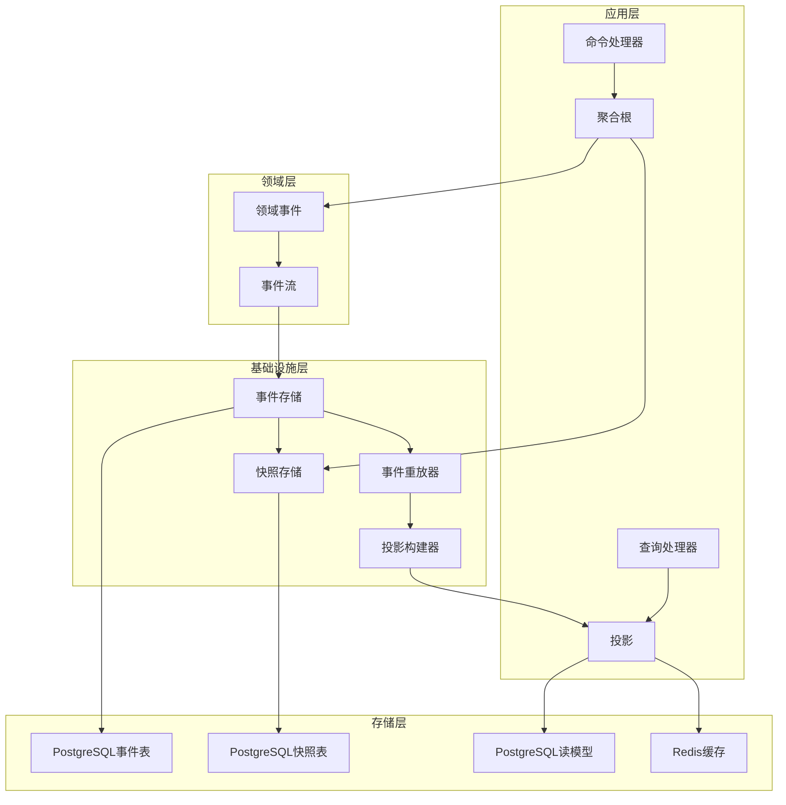

# 罗莱L2C销售管理系统 - 事件溯源机制设计方案

## 📋 目录
- [设计目标与价值](#设计目标与价值)
- [事件溯源架构概述](#事件溯源架构概述)
- [聚合根设计](#聚合根设计)
- [事件存储设计](#事件存储设计)
- [快照机制](#快照机制)
- [事件重放与投影](#事件重放与投影)
- [性能优化策略](#性能优化策略)
- [监控和运维](#监控和运维)

---

## 🎯 设计目标与价值

### 1. 设计目标
- **完整审计追踪**：记录所有业务状态变更的完整历史
- **时间旅行能力**：支持查看任意时间点的系统状态
- **事件重放**：支持从事件流重建系统状态
- **数据一致性**：通过事件确保数据的强一致性
- **业务洞察**：通过事件分析获得深度业务洞察

### 2. 业务价值
- **合规审计**：满足业务合规和审计要求
- **故障恢复**：快速从故障中恢复系统状态
- **业务分析**：深入分析业务流程和用户行为
- **调试能力**：精确定位和重现问题
- **数据挖掘**：基于完整历史数据进行分析

---

## 🏗️ 事件溯源架构概述

### 1. 架构总览



### 2. 核心概念

#### 2.1 事件溯源聚合根基类
```typescript
// 事件溯源聚合根基类
// src/domain/common/event-sourced-aggregate.base.ts

export abstract class EventSourcedAggregate {
  protected id: string;
  protected version: number = 0;
  private uncommittedEvents: DomainEvent[] = [];
  private isReplaying: boolean = false;

  constructor(id?: string) {
    this.id = id || generateId();
  }

  // 获取聚合根ID
  getId(): string {
    return this.id;
  }

  // 获取版本号
  getVersion(): number {
    return this.version;
  }

  // 获取未提交的事件
  getUncommittedEvents(): DomainEvent[] {
    return [...this.uncommittedEvents];
  }

  // 标记事件为已提交
  markEventsAsCommitted(): void {
    this.uncommittedEvents = [];
  }

  // 从事件流重建聚合根
  static fromHistory<T extends EventSourcedAggregate>(
    aggregateClass: new (id: string) => T,
    events: DomainEvent[]
  ): T {
    if (events.length === 0) {
      throw new Error('Cannot rebuild aggregate from empty event stream');
    }

    const aggregate = new aggregateClass(events[0].aggregateId);
    aggregate.replay(events);
    return aggregate;
  }

  // 重放事件
  private replay(events: DomainEvent[]): void {
    this.isReplaying = true;
    
    for (const event of events) {
      this.applyEvent(event);
      this.version = event.version;
    }
    
    this.isReplaying = false;
  }

  // 应用事件
  protected applyEvent(event: DomainEvent): void {
    const handler = this.getEventHandler(event.eventType);
    if (handler) {
      handler.call(this, event);
    }
  }

  // 发布事件
  protected publishEvent(event: DomainEvent): void {
    // 设置事件版本
    event.version = this.version + 1;
    
    // 应用事件到聚合根
    this.applyEvent(event);
    
    // 更新版本
    this.version = event.version;
    
    // 如果不是重放模式，添加到未提交事件列表
    if (!this.isReplaying) {
      this.uncommittedEvents.push(event);
    }
  }

  // 获取事件处理器
  private getEventHandler(eventType: string): Function | undefined {
    const handlerName = `on${eventType}`;
    return (this as any)[handlerName];
  }

  // 创建快照
  abstract createSnapshot(): AggregateSnapshot;

  // 从快照恢复
  abstract restoreFromSnapshot(snapshot: AggregateSnapshot): void;
}

// 聚合快照接口
export interface AggregateSnapshot {
  aggregateId: string;
  aggregateType: string;
  version: number;
  data: any;
  createdAt: Date;
}
```

#### 2.2 事件存储接口
```typescript
// 事件存储接口
// src/infrastructure/event-sourcing/event-store.interface.ts

export interface IEventStore {
  // 保存事件
  saveEvents(
    aggregateId: string,
    events: DomainEvent[],
    expectedVersion: number
  ): Promise<void>;

  // 获取事件流
  getEventStream(
    aggregateId: string,
    fromVersion?: number
  ): Promise<DomainEvent[]>;

  // 获取所有事件
  getAllEvents(
    fromTimestamp?: Date,
    toTimestamp?: Date,
    eventTypes?: string[]
  ): Promise<DomainEvent[]>;

  // 保存快照
  saveSnapshot(snapshot: AggregateSnapshot): Promise<void>;

  // 获取快照
  getSnapshot(aggregateId: string): Promise<AggregateSnapshot | null>;

  // 获取最新快照
  getLatestSnapshot(
    aggregateId: string,
    beforeVersion?: number
  ): Promise<AggregateSnapshot | null>;
}
```

---

## 🎯 聚合根设计

### 1. 线索聚合根

```typescript
// 线索聚合根
// src/domain/leads/lead.aggregate.ts

export class Lead extends EventSourcedAggregate {
  private customerId: string;
  private status: LeadStatus;
  private priority: LeadPriority;
  private source: string;
  private estimatedValue?: number;
  private assignedTo?: string;
  private createdBy: string;
  private createdAt: Date;
  private updatedAt: Date;
  private notes?: string;
  private tags: string[] = [];
  private followUps: FollowUp[] = [];
  private activities: Activity[] = [];

  constructor(id?: string) {
    super(id);
  }

  // 创建线索
  static create(
    customerId: string,
    priority: LeadPriority,
    source: string,
    estimatedValue?: number,
    assignedTo?: string,
    createdBy?: string,
    notes?: string
  ): Lead {
    const lead = new Lead();
    
    const event = new LeadCreatedEvent(
      lead.getId(),
      {
        customerId,
        priority,
        source,
        estimatedValue,
        assignedTo,
        createdBy,
        notes,
      }
    );
    
    lead.publishEvent(event);
    return lead;
  }

  // 分配线索
  assignTo(assignedTo: string, assignedBy: string, reason?: string): void {
    if (this.status === LeadStatus.CONVERTED) {
      throw new DomainError('Cannot assign converted lead');
    }

    if (this.assignedTo === assignedTo) {
      throw new DomainError('Lead is already assigned to this person');
    }

    const event = new LeadAssignedEvent(
      this.getId(),
      {
        assignedTo,
        assignedBy,
        previousAssignee: this.assignedTo,
        reason,
      }
    );

    this.publishEvent(event);
  }

  // 更新状态
  updateStatus(newStatus: LeadStatus, changedBy: string, reason?: string): void {
    if (this.status === newStatus) {
      throw new DomainError('Lead is already in this status');
    }

    if (this.status === LeadStatus.CONVERTED && newStatus !== LeadStatus.CONVERTED) {
      throw new DomainError('Cannot change status of converted lead');
    }

    const event = new LeadStatusChangedEvent(
      this.getId(),
      {
        fromStatus: this.status,
        toStatus: newStatus,
        changedBy,
        reason,
      }
    );

    this.publishEvent(event);
  }

  // 转化为订单
  convertToOrder(orderId: string, convertedBy: string): void {
    if (this.status === LeadStatus.CONVERTED) {
      throw new DomainError('Lead is already converted');
    }

    const conversionValue = this.estimatedValue || 0;
    
    const event = new LeadConvertedToOrderEvent(
      this.getId(),
      {
        orderId,
        convertedBy,
        conversionValue,
      }
    );

    this.publishEvent(event);
  }

  // 添加跟进记录
  addFollowUp(content: string, followUpBy: string, nextFollowUpDate?: Date): void {
    const event = new LeadFollowUpAddedEvent(
      this.getId(),
      {
        content,
        followUpBy,
        nextFollowUpDate,
      }
    );

    this.publishEvent(event);
  }

  // 事件处理器
  private onLeadCreatedEvent(event: LeadCreatedEvent): void {
    const data = event.getEventData();
    this.customerId = data.customerId;
    this.priority = data.priority;
    this.source = data.source;
    this.estimatedValue = data.estimatedValue;
    this.assignedTo = data.assignedTo;
    this.createdBy = data.createdBy;
    this.notes = data.notes;
    this.status = LeadStatus.NEW;
    this.createdAt = event.occurredOn;
    this.updatedAt = event.occurredOn;
  }

  private onLeadAssignedEvent(event: LeadAssignedEvent): void {
    const data = event.getEventData();
    this.assignedTo = data.assignedTo;
    this.updatedAt = event.occurredOn;
  }

  private onLeadStatusChangedEvent(event: LeadStatusChangedEvent): void {
    const data = event.getEventData();
    this.status = data.toStatus;
    this.updatedAt = event.occurredOn;
  }

  private onLeadConvertedToOrderEvent(event: LeadConvertedToOrderEvent): void {
    this.status = LeadStatus.CONVERTED;
    this.updatedAt = event.occurredOn;
  }

  private onLeadFollowUpAddedEvent(event: LeadFollowUpAddedEvent): void {
    const data = event.getEventData();
    this.followUps.push({
      id: generateId(),
      content: data.content,
      followUpBy: data.followUpBy,
      followUpDate: event.occurredOn,
      nextFollowUpDate: data.nextFollowUpDate,
    });
    this.updatedAt = event.occurredOn;
  }

  // 创建快照
  createSnapshot(): AggregateSnapshot {
    return {
      aggregateId: this.getId(),
      aggregateType: 'Lead',
      version: this.getVersion(),
      data: {
        customerId: this.customerId,
        status: this.status,
        priority: this.priority,
        source: this.source,
        estimatedValue: this.estimatedValue,
        assignedTo: this.assignedTo,
        createdBy: this.createdBy,
        createdAt: this.createdAt,
        updatedAt: this.updatedAt,
        notes: this.notes,
        tags: this.tags,
        followUps: this.followUps,
        activities: this.activities,
      },
      createdAt: new Date(),
    };
  }

  // 从快照恢复
  restoreFromSnapshot(snapshot: AggregateSnapshot): void {
    const data = snapshot.data;
    this.customerId = data.customerId;
    this.status = data.status;
    this.priority = data.priority;
    this.source = data.source;
    this.estimatedValue = data.estimatedValue;
    this.assignedTo = data.assignedTo;
    this.createdBy = data.createdBy;
    this.createdAt = data.createdAt;
    this.updatedAt = data.updatedAt;
    this.notes = data.notes;
    this.tags = data.tags || [];
    this.followUps = data.followUps || [];
    this.activities = data.activities || [];
    this.version = snapshot.version;
  }

  // Getters
  getCustomerId(): string { return this.customerId; }
  getStatus(): LeadStatus { return this.status; }
  getPriority(): LeadPriority { return this.priority; }
  getSource(): string { return this.source; }
  getEstimatedValue(): number | undefined { return this.estimatedValue; }
  getAssignedTo(): string | undefined { return this.assignedTo; }
  getCreatedBy(): string { return this.createdBy; }
  getCreatedAt(): Date { return this.createdAt; }
  getUpdatedAt(): Date { return this.updatedAt; }
  getNotes(): string | undefined { return this.notes; }
  getTags(): string[] { return [...this.tags]; }
  getFollowUps(): FollowUp[] { return [...this.followUps]; }
  getActivities(): Activity[] { return [...this.activities]; }
}

// 线索状态枚举
export enum LeadStatus {
  NEW = 'new',
  CONTACTED = 'contacted',
  QUALIFIED = 'qualified',
  PROPOSAL = 'proposal',
  NEGOTIATION = 'negotiation',
  CONVERTED = 'converted',
  LOST = 'lost',
}

// 线索优先级枚举
export enum LeadPriority {
  LOW = 'low',
  MEDIUM = 'medium',
  HIGH = 'high',
  URGENT = 'urgent',
}
```

### 2. 订单聚合根

```typescript
// 订单聚合根
// src/domain/orders/order.aggregate.ts

export class Order extends EventSourcedAggregate {
  private orderNumber: string;
  private customerId: string;
  private salesPersonId: string;
  private status: OrderStatus;
  private items: OrderItem[] = [];
  private totalAmount: number;
  private paidAmount: number = 0;
  private deliveryAddress: Address;
  private estimatedDeliveryDate?: Date;
  private actualDeliveryDate?: Date;
  private createdAt: Date;
  private updatedAt: Date;
  private notes?: string;
  private leadId?: string;
  private payments: Payment[] = [];
  private statusHistory: OrderStatusChange[] = [];

  constructor(id?: string) {
    super(id);
  }

  // 创建订单
  static create(
    customerId: string,
    salesPersonId: string,
    items: OrderItem[],
    deliveryAddress: Address,
    notes?: string,
    leadId?: string
  ): Order {
    const order = new Order();
    const orderNumber = order.generateOrderNumber();
    const totalAmount = items.reduce((sum, item) => sum + item.totalPrice, 0);
    
    const event = new OrderCreatedEvent(
      order.getId(),
      {
        orderNumber,
        customerId,
        salesPersonId,
        items,
        totalAmount,
        deliveryAddress,
        notes,
        leadId,
      }
    );
    
    order.publishEvent(event);
    return order;
  }

  // 更新状态
  updateStatus(
    newStatus: OrderStatus,
    changedBy: string,
    reason?: string,
    estimatedDeliveryDate?: Date
  ): void {
    if (this.status === newStatus) {
      throw new DomainError('Order is already in this status');
    }

    if (this.status === OrderStatus.CANCELLED) {
      throw new DomainError('Cannot change status of cancelled order');
    }

    if (this.status === OrderStatus.DELIVERED && newStatus !== OrderStatus.DELIVERED) {
      throw new DomainError('Cannot change status of delivered order');
    }

    const event = new OrderStatusChangedEvent(
      this.getId(),
      {
        fromStatus: this.status,
        toStatus: newStatus,
        changedBy,
        reason,
        estimatedDeliveryDate,
      }
    );

    this.publishEvent(event);
  }

  // 处理付款
  processPayment(
    amount: number,
    paymentMethod: string,
    paymentReference: string,
    paidBy: string
  ): void {
    if (amount <= 0) {
      throw new DomainError('Payment amount must be greater than 0');
    }

    if (this.paidAmount + amount > this.totalAmount) {
      throw new DomainError('Payment amount exceeds order total');
    }

    if (this.status === OrderStatus.CANCELLED) {
      throw new DomainError('Cannot process payment for cancelled order');
    }

    const event = new OrderPaymentReceivedEvent(
      this.getId(),
      {
        paymentId: generateId(),
        amount,
        paymentMethod,
        paymentReference,
        paidBy,
        remainingAmount: this.totalAmount - (this.paidAmount + amount),
      }
    );

    this.publishEvent(event);
  }

  // 取消订单
  cancel(cancelledBy: string, reason: string): void {
    if (this.status === OrderStatus.CANCELLED) {
      throw new DomainError('Order is already cancelled');
    }

    if (this.status === OrderStatus.DELIVERED) {
      throw new DomainError('Cannot cancel delivered order');
    }

    if (this.status === OrderStatus.IN_PRODUCTION) {
      throw new DomainError('Cannot cancel order that is in production');
    }

    const event = new OrderCancelledEvent(
      this.getId(),
      {
        cancelledBy,
        reason,
        refundAmount: this.paidAmount,
      }
    );

    this.publishEvent(event);
  }

  // 添加订单项
  addItem(item: OrderItem, addedBy: string): void {
    if (this.status !== OrderStatus.PENDING) {
      throw new DomainError('Can only add items to pending orders');
    }

    const event = new OrderItemAddedEvent(
      this.getId(),
      {
        item,
        addedBy,
        newTotalAmount: this.totalAmount + item.totalPrice,
      }
    );

    this.publishEvent(event);
  }

  // 移除订单项
  removeItem(itemId: string, removedBy: string): void {
    if (this.status !== OrderStatus.PENDING) {
      throw new DomainError('Can only remove items from pending orders');
    }

    const item = this.items.find(i => i.id === itemId);
    if (!item) {
      throw new DomainError('Item not found in order');
    }

    const event = new OrderItemRemovedEvent(
      this.getId(),
      {
        itemId,
        removedBy,
        newTotalAmount: this.totalAmount - item.totalPrice,
      }
    );

    this.publishEvent(event);
  }

  // 事件处理器
  private onOrderCreatedEvent(event: OrderCreatedEvent): void {
    const data = event.getEventData();
    this.orderNumber = data.orderNumber;
    this.customerId = data.customerId;
    this.salesPersonId = data.salesPersonId;
    this.items = data.items;
    this.totalAmount = data.totalAmount;
    this.deliveryAddress = data.deliveryAddress;
    this.notes = data.notes;
    this.leadId = data.leadId;
    this.status = OrderStatus.PENDING;
    this.createdAt = event.occurredOn;
    this.updatedAt = event.occurredOn;
  }

  private onOrderStatusChangedEvent(event: OrderStatusChangedEvent): void {
    const data = event.getEventData();
    this.status = data.toStatus;
    this.estimatedDeliveryDate = data.estimatedDeliveryDate;
    this.updatedAt = event.occurredOn;
    
    this.statusHistory.push({
      fromStatus: data.fromStatus,
      toStatus: data.toStatus,
      changedBy: data.changedBy,
      changedAt: event.occurredOn,
      reason: data.reason,
    });

    if (data.toStatus === OrderStatus.DELIVERED) {
      this.actualDeliveryDate = event.occurredOn;
    }
  }

  private onOrderPaymentReceivedEvent(event: OrderPaymentReceivedEvent): void {
    const data = event.getEventData();
    this.paidAmount += data.amount;
    this.updatedAt = event.occurredOn;
    
    this.payments.push({
      id: data.paymentId,
      amount: data.amount,
      paymentMethod: data.paymentMethod,
      paymentReference: data.paymentReference,
      paidBy: data.paidBy,
      paidAt: event.occurredOn,
    });
  }

  private onOrderCancelledEvent(event: OrderCancelledEvent): void {
    this.status = OrderStatus.CANCELLED;
    this.updatedAt = event.occurredOn;
  }

  private onOrderItemAddedEvent(event: OrderItemAddedEvent): void {
    const data = event.getEventData();
    this.items.push(data.item);
    this.totalAmount = data.newTotalAmount;
    this.updatedAt = event.occurredOn;
  }

  private onOrderItemRemovedEvent(event: OrderItemRemovedEvent): void {
    const data = event.getEventData();
    this.items = this.items.filter(item => item.id !== data.itemId);
    this.totalAmount = data.newTotalAmount;
    this.updatedAt = event.occurredOn;
  }

  // 生成订单号
  private generateOrderNumber(): string {
    const now = new Date();
    const year = now.getFullYear();
    const month = String(now.getMonth() + 1).padStart(2, '0');
    const day = String(now.getDate()).padStart(2, '0');
    const random = Math.random().toString(36).substr(2, 6).toUpperCase();
    return `ORD${year}${month}${day}${random}`;
  }

  // 创建快照
  createSnapshot(): AggregateSnapshot {
    return {
      aggregateId: this.getId(),
      aggregateType: 'Order',
      version: this.getVersion(),
      data: {
        orderNumber: this.orderNumber,
        customerId: this.customerId,
        salesPersonId: this.salesPersonId,
        status: this.status,
        items: this.items,
        totalAmount: this.totalAmount,
        paidAmount: this.paidAmount,
        deliveryAddress: this.deliveryAddress,
        estimatedDeliveryDate: this.estimatedDeliveryDate,
        actualDeliveryDate: this.actualDeliveryDate,
        createdAt: this.createdAt,
        updatedAt: this.updatedAt,
        notes: this.notes,
        leadId: this.leadId,
        payments: this.payments,
        statusHistory: this.statusHistory,
      },
      createdAt: new Date(),
    };
  }

  // 从快照恢复
  restoreFromSnapshot(snapshot: AggregateSnapshot): void {
    const data = snapshot.data;
    this.orderNumber = data.orderNumber;
    this.customerId = data.customerId;
    this.salesPersonId = data.salesPersonId;
    this.status = data.status;
    this.items = data.items;
    this.totalAmount = data.totalAmount;
    this.paidAmount = data.paidAmount;
    this.deliveryAddress = data.deliveryAddress;
    this.estimatedDeliveryDate = data.estimatedDeliveryDate;
    this.actualDeliveryDate = data.actualDeliveryDate;
    this.createdAt = data.createdAt;
    this.updatedAt = data.updatedAt;
    this.notes = data.notes;
    this.leadId = data.leadId;
    this.payments = data.payments || [];
    this.statusHistory = data.statusHistory || [];
    this.version = snapshot.version;
  }

  // Getters
  getOrderNumber(): string { return this.orderNumber; }
  getCustomerId(): string { return this.customerId; }
  getSalesPersonId(): string { return this.salesPersonId; }
  getStatus(): OrderStatus { return this.status; }
  getItems(): OrderItem[] { return [...this.items]; }
  getTotalAmount(): number { return this.totalAmount; }
  getPaidAmount(): number { return this.paidAmount; }
  getRemainingAmount(): number { return this.totalAmount - this.paidAmount; }
  getDeliveryAddress(): Address { return this.deliveryAddress; }
  getEstimatedDeliveryDate(): Date | undefined { return this.estimatedDeliveryDate; }
  getActualDeliveryDate(): Date | undefined { return this.actualDeliveryDate; }
  getCreatedAt(): Date { return this.createdAt; }
  getUpdatedAt(): Date { return this.updatedAt; }
  getNotes(): string | undefined { return this.notes; }
  getLeadId(): string | undefined { return this.leadId; }
  getPayments(): Payment[] { return [...this.payments]; }
  getStatusHistory(): OrderStatusChange[] { return [...this.statusHistory]; }
}

// 订单状态枚举
export enum OrderStatus {
  PENDING = 'pending',
  CONFIRMED = 'confirmed',
  IN_PRODUCTION = 'in_production',
  READY_FOR_DELIVERY = 'ready_for_delivery',
  DELIVERED = 'delivered',
  CANCELLED = 'cancelled',
}
```

---

## 💾 事件存储设计

### 1. PostgreSQL事件存储实现

```typescript
// PostgreSQL事件存储实现
// src/infrastructure/event-sourcing/postgresql-event-store.service.ts

@Injectable()
export class PostgreSQLEventStore implements IEventStore {
  constructor(
    private readonly databaseService: DatabaseService,
    private readonly logger: Logger
  ) {}

  async saveEvents(
    aggregateId: string,
    events: DomainEvent[],
    expectedVersion: number
  ): Promise<void> {
    if (events.length === 0) {
      return;
    }

    const client = await this.databaseService.getClient();
    
    try {
      await client.query('BEGIN');

      // 检查版本冲突
      await this.checkVersionConflict(client, aggregateId, expectedVersion);

      // 保存事件
      for (const event of events) {
        await this.saveEvent(client, event);
      }

      await client.query('COMMIT');

      this.logger.log('Events saved successfully', {
        aggregateId,
        eventCount: events.length,
        expectedVersion,
      });
    } catch (error) {
      await client.query('ROLLBACK');
      
      if (error.message.includes('version_conflict')) {
        throw new ConcurrencyError(
          `Concurrency conflict for aggregate ${aggregateId}. Expected version: ${expectedVersion}`
        );
      }
      
      this.logger.error('Failed to save events', {
        aggregateId,
        error: error.message,
      });
      
      throw error;
    } finally {
      client.release();
    }
  }

  async getEventStream(
    aggregateId: string,
    fromVersion?: number
  ): Promise<DomainEvent[]> {
    let query = `
      SELECT * FROM events 
      WHERE aggregate_id = $1
    `;
    const params: any[] = [aggregateId];

    if (fromVersion !== undefined) {
      query += ` AND version > $2`;
      params.push(fromVersion);
    }

    query += ` ORDER BY version ASC`;

    const result = await this.databaseService.query(query, params);
    
    return result.rows.map(row => this.deserializeEvent(row));
  }

  async getAllEvents(
    fromTimestamp?: Date,
    toTimestamp?: Date,
    eventTypes?: string[]
  ): Promise<DomainEvent[]> {
    let query = `SELECT * FROM events WHERE 1=1`;
    const params: any[] = [];

    if (fromTimestamp) {
      query += ` AND occurred_on >= $${params.length + 1}`;
      params.push(fromTimestamp);
    }

    if (toTimestamp) {
      query += ` AND occurred_on <= $${params.length + 1}`;
      params.push(toTimestamp);
    }

    if (eventTypes && eventTypes.length > 0) {
      query += ` AND event_type = ANY($${params.length + 1})`;
      params.push(eventTypes);
    }

    query += ` ORDER BY occurred_on ASC, version ASC`;

    const result = await this.databaseService.query(query, params);
    
    return result.rows.map(row => this.deserializeEvent(row));
  }

  async saveSnapshot(snapshot: AggregateSnapshot): Promise<void> {
    const query = `
      INSERT INTO snapshots (
        aggregate_id, aggregate_type, version, data, created_at
      ) VALUES ($1, $2, $3, $4, $5)
      ON CONFLICT (aggregate_id) 
      DO UPDATE SET 
        version = EXCLUDED.version,
        data = EXCLUDED.data,
        created_at = EXCLUDED.created_at
      WHERE snapshots.version < EXCLUDED.version
    `;

    const params = [
      snapshot.aggregateId,
      snapshot.aggregateType,
      snapshot.version,
      JSON.stringify(snapshot.data),
      snapshot.createdAt,
    ];

    await this.databaseService.query(query, params);

    this.logger.log('Snapshot saved', {
      aggregateId: snapshot.aggregateId,
      version: snapshot.version,
    });
  }

  async getSnapshot(aggregateId: string): Promise<AggregateSnapshot | null> {
    const query = `
      SELECT * FROM snapshots 
      WHERE aggregate_id = $1
    `;

    const result = await this.databaseService.query(query, [aggregateId]);
    
    if (result.rows.length === 0) {
      return null;
    }

    const row = result.rows[0];
    return {
      aggregateId: row.aggregate_id,
      aggregateType: row.aggregate_type,
      version: row.version,
      data: JSON.parse(row.data),
      createdAt: row.created_at,
    };
  }

  async getLatestSnapshot(
    aggregateId: string,
    beforeVersion?: number
  ): Promise<AggregateSnapshot | null> {
    let query = `
      SELECT * FROM snapshots 
      WHERE aggregate_id = $1
    `;
    const params: any[] = [aggregateId];

    if (beforeVersion !== undefined) {
      query += ` AND version < $2`;
      params.push(beforeVersion);
    }

    query += ` ORDER BY version DESC LIMIT 1`;

    const result = await this.databaseService.query(query, params);
    
    if (result.rows.length === 0) {
      return null;
    }

    const row = result.rows[0];
    return {
      aggregateId: row.aggregate_id,
      aggregateType: row.aggregate_type,
      version: row.version,
      data: JSON.parse(row.data),
      createdAt: row.created_at,
    };
  }

  private async checkVersionConflict(
    client: any,
    aggregateId: string,
    expectedVersion: number
  ): Promise<void> {
    const query = `
      SELECT MAX(version) as current_version 
      FROM events 
      WHERE aggregate_id = $1
    `;

    const result = await client.query(query, [aggregateId]);
    const currentVersion = result.rows[0]?.current_version || 0;

    if (currentVersion !== expectedVersion) {
      throw new Error('version_conflict');
    }
  }

  private async saveEvent(client: any, event: DomainEvent): Promise<void> {
    const query = `
      INSERT INTO events (
        event_id, event_type, aggregate_id, aggregate_type,
        version, event_data, metadata, occurred_on
      ) VALUES ($1, $2, $3, $4, $5, $6, $7, $8)
    `;

    const params = [
      event.eventId,
      event.eventType,
      event.aggregateId,
      event.aggregateType,
      event.version,
      JSON.stringify(event.getEventData()),
      JSON.stringify(event.metadata),
      event.occurredOn,
    ];

    await client.query(query, params);
  }

  private deserializeEvent(row: any): DomainEvent {
    // 这里需要根据事件类型反序列化为具体的事件对象
    // 可以使用事件工厂或注册表模式
    const eventData = JSON.parse(row.event_data);
    const metadata = JSON.parse(row.metadata);

    // 简化示例，实际应该有完整的事件重建逻辑
    return {
      eventId: row.event_id,
      eventType: row.event_type,
      aggregateId: row.aggregate_id,
      aggregateType: row.aggregate_type,
      version: row.version,
      occurredOn: row.occurred_on,
      metadata,
      getEventData: () => eventData,
    } as DomainEvent;
  }
}
```

### 2. 数据库表结构

```sql
-- 事件表
-- migrations/001_create_events_table.sql

CREATE TABLE events (
    event_id UUID PRIMARY KEY,
    event_type VARCHAR(255) NOT NULL,
    aggregate_id UUID NOT NULL,
    aggregate_type VARCHAR(100) NOT NULL,
    version INTEGER NOT NULL,
    event_data JSONB NOT NULL,
    metadata JSONB NOT NULL,
    occurred_on TIMESTAMP WITH TIME ZONE NOT NULL DEFAULT CURRENT_TIMESTAMP,
    
    CONSTRAINT unique_aggregate_version UNIQUE (aggregate_id, version)
);

-- 创建索引
CREATE INDEX idx_events_aggregate_id ON events (aggregate_id);
CREATE INDEX idx_events_aggregate_type ON events (aggregate_type);
CREATE INDEX idx_events_event_type ON events (event_type);
CREATE INDEX idx_events_occurred_on ON events (occurred_on);
CREATE INDEX idx_events_aggregate_id_version ON events (aggregate_id, version);

-- 快照表
-- migrations/002_create_snapshots_table.sql

CREATE TABLE snapshots (
    aggregate_id UUID PRIMARY KEY,
    aggregate_type VARCHAR(100) NOT NULL,
    version INTEGER NOT NULL,
    data JSONB NOT NULL,
    created_at TIMESTAMP WITH TIME ZONE NOT NULL DEFAULT CURRENT_TIMESTAMP
);

-- 创建索引
CREATE INDEX idx_snapshots_aggregate_type ON snapshots (aggregate_type);
CREATE INDEX idx_snapshots_version ON snapshots (version);
CREATE INDEX idx_snapshots_created_at ON snapshots (created_at);
```

---

## 📸 快照机制

### 1. 快照策略

```typescript
// 快照策略接口
// src/infrastructure/event-sourcing/snapshot-strategy.interface.ts

export interface ISnapshotStrategy {
  shouldCreateSnapshot(aggregateId: string, currentVersion: number): Promise<boolean>;
  getSnapshotFrequency(): number;
}

// 基于版本的快照策略
export class VersionBasedSnapshotStrategy implements ISnapshotStrategy {
  constructor(private readonly snapshotFrequency: number = 10) {}

  async shouldCreateSnapshot(
    aggregateId: string,
    currentVersion: number
  ): Promise<boolean> {
    return currentVersion % this.snapshotFrequency === 0;
  }

  getSnapshotFrequency(): number {
    return this.snapshotFrequency;
  }
}

// 基于时间的快照策略
export class TimeBasedSnapshotStrategy implements ISnapshotStrategy {
  constructor(
    private readonly snapshotInterval: number = 24 * 60 * 60 * 1000, // 24小时
    private readonly eventStore: IEventStore
  ) {}

  async shouldCreateSnapshot(
    aggregateId: string,
    currentVersion: number
  ): Promise<boolean> {
    const latestSnapshot = await this.eventStore.getLatestSnapshot(aggregateId);
    
    if (!latestSnapshot) {
      return true;
    }

    const timeSinceLastSnapshot = Date.now() - latestSnapshot.createdAt.getTime();
    return timeSinceLastSnapshot >= this.snapshotInterval;
  }

  getSnapshotFrequency(): number {
    return this.snapshotInterval;
  }
}
```

### 2. 快照管理服务

```typescript
// 快照管理服务
// src/infrastructure/event-sourcing/snapshot-manager.service.ts

@Injectable()
export class SnapshotManagerService {
  constructor(
    private readonly eventStore: IEventStore,
    private readonly snapshotStrategy: ISnapshotStrategy,
    private readonly logger: Logger
  ) {}

  async createSnapshotIfNeeded<T extends EventSourcedAggregate>(
    aggregate: T
  ): Promise<void> {
    const shouldCreate = await this.snapshotStrategy.shouldCreateSnapshot(
      aggregate.getId(),
      aggregate.getVersion()
    );

    if (shouldCreate) {
      await this.createSnapshot(aggregate);
    }
  }

  async createSnapshot<T extends EventSourcedAggregate>(
    aggregate: T
  ): Promise<void> {
    try {
      const snapshot = aggregate.createSnapshot();
      await this.eventStore.saveSnapshot(snapshot);

      this.logger.log('Snapshot created successfully', {
        aggregateId: aggregate.getId(),
        version: aggregate.getVersion(),
      });
    } catch (error) {
      this.logger.error('Failed to create snapshot', {
        aggregateId: aggregate.getId(),
        error: error.message,
      });
      throw error;
    }
  }

  async loadAggregateFromSnapshot<T extends EventSourcedAggregate>(
    aggregateClass: new (id: string) => T,
    aggregateId: string
  ): Promise<{ aggregate: T; fromVersion: number } | null> {
    try {
      const snapshot = await this.eventStore.getLatestSnapshot(aggregateId);
      
      if (!snapshot) {
        return null;
      }

      const aggregate = new aggregateClass(aggregateId);
      aggregate.restoreFromSnapshot(snapshot);

      this.logger.log('Aggregate loaded from snapshot', {
        aggregateId,
        snapshotVersion: snapshot.version,
      });

      return {
        aggregate,
        fromVersion: snapshot.version,
      };
    } catch (error) {
      this.logger.error('Failed to load aggregate from snapshot', {
        aggregateId,
        error: error.message,
      });
      return null;
    }
  }

  async cleanupOldSnapshots(
    aggregateId: string,
    keepCount: number = 5
  ): Promise<void> {
    // 实现快照清理逻辑
    // 保留最新的几个快照，删除旧的快照
    const query = `
      DELETE FROM snapshots 
      WHERE aggregate_id = $1 
      AND version NOT IN (
        SELECT version FROM snapshots 
        WHERE aggregate_id = $1 
        ORDER BY version DESC 
        LIMIT $2
      )
    `;

    await this.eventStore.query(query, [aggregateId, keepCount]);

    this.logger.log('Old snapshots cleaned up', {
      aggregateId,
      keepCount,
    });
  }
}
```

---

## 🔄 事件重放与投影

### 1. 事件重放服务

```typescript
// 事件重放服务
// src/infrastructure/event-sourcing/event-replay.service.ts

@Injectable()
export class EventReplayService {
  constructor(
    private readonly eventStore: IEventStore,
    private readonly snapshotManager: SnapshotManagerService,
    private readonly logger: Logger
  ) {}

  async replayAggregate<T extends EventSourcedAggregate>(
    aggregateClass: new (id: string) => T,
    aggregateId: string,
    toVersion?: number
  ): Promise<T> {
    // 尝试从快照加载
    const snapshotResult = await this.snapshotManager.loadAggregateFromSnapshot(
      aggregateClass,
      aggregateId
    );

    let aggregate: T;
    let fromVersion = 0;

    if (snapshotResult) {
      aggregate = snapshotResult.aggregate;
      fromVersion = snapshotResult.fromVersion;
    } else {
      aggregate = new aggregateClass(aggregateId);
    }

    // 获取事件流
    const events = await this.eventStore.getEventStream(aggregateId, fromVersion);
    
    // 过滤到指定版本
    const filteredEvents = toVersion 
      ? events.filter(event => event.version <= toVersion)
      : events;

    if (filteredEvents.length === 0 && !snapshotResult) {
      throw new AggregateNotFoundError(`Aggregate ${aggregateId} not found`);
    }

    // 重放事件
    if (filteredEvents.length > 0) {
      const replayedAggregate = EventSourcedAggregate.fromHistory(
        aggregateClass,
        filteredEvents
      );
      
      // 如果有快照，需要合并状态
      if (snapshotResult) {
        // 这里需要实现状态合并逻辑
        aggregate = this.mergeAggregateStates(aggregate, replayedAggregate);
      } else {
        aggregate = replayedAggregate;
      }
    }

    this.logger.log('Aggregate replayed successfully', {
      aggregateId,
      fromVersion,
      toVersion: aggregate.getVersion(),
      eventCount: filteredEvents.length,
    });

    return aggregate;
  }

  async replayAllEvents(
    fromTimestamp?: Date,
    toTimestamp?: Date,
    eventTypes?: string[]
  ): Promise<DomainEvent[]> {
    const events = await this.eventStore.getAllEvents(
      fromTimestamp,
      toTimestamp,
      eventTypes
    );

    this.logger.log('Events replayed', {
      eventCount: events.length,
      fromTimestamp,
      toTimestamp,
      eventTypes,
    });

    return events;
  }

  async replayEventsToProjection(
    projectionName: string,
    fromTimestamp?: Date,
    toTimestamp?: Date
  ): Promise<void> {
    const events = await this.replayAllEvents(fromTimestamp, toTimestamp);
    
    // 这里需要根据投影名称找到对应的投影处理器
    const projectionHandler = this.getProjectionHandler(projectionName);
    
    for (const event of events) {
      await projectionHandler.handle(event);
    }

    this.logger.log('Events replayed to projection', {
      projectionName,
      eventCount: events.length,
    });
  }

  private mergeAggregateStates<T extends EventSourcedAggregate>(
    snapshotAggregate: T,
    replayedAggregate: T
  ): T {
    // 实现聚合状态合并逻辑
    // 这是一个简化的实现，实际可能需要更复杂的合并策略
    return replayedAggregate;
  }

  private getProjectionHandler(projectionName: string): any {
    // 实现投影处理器查找逻辑
    // 可以使用依赖注入容器或注册表模式
    throw new Error('Projection handler not implemented');
  }
}
```

### 2. 投影构建器

```typescript
// 投影构建器基类
// src/infrastructure/event-sourcing/projection-builder.base.ts

export abstract class ProjectionBuilder {
  protected abstract projectionName: string;
  
  constructor(
    protected readonly eventStore: IEventStore,
    protected readonly logger: Logger
  ) {}

  abstract handle(event: DomainEvent): Promise<void>;

  async rebuild(fromTimestamp?: Date): Promise<void> {
    this.logger.log(`Starting projection rebuild: ${this.projectionName}`);
    
    // 清空现有投影数据
    await this.clearProjection();
    
    // 获取所有相关事件
    const events = await this.eventStore.getAllEvents(fromTimestamp);
    
    // 重建投影
    for (const event of events) {
      if (this.shouldHandleEvent(event)) {
        await this.handle(event);
      }
    }
    
    this.logger.log(`Projection rebuild completed: ${this.projectionName}`, {
      eventCount: events.length,
    });
  }

  protected abstract clearProjection(): Promise<void>;
  
  protected abstract shouldHandleEvent(event: DomainEvent): boolean;
}

// 线索统计投影构建器
export class LeadStatisticsProjectionBuilder extends ProjectionBuilder {
  protected projectionName = 'LeadStatistics';

  constructor(
    eventStore: IEventStore,
    logger: Logger,
    private readonly databaseService: DatabaseService
  ) {
    super(eventStore, logger);
  }

  async handle(event: DomainEvent): Promise<void> {
    switch (event.eventType) {
      case 'LeadCreatedEvent':
        await this.handleLeadCreated(event);
        break;
      case 'LeadStatusChangedEvent':
        await this.handleLeadStatusChanged(event);
        break;
      case 'LeadConvertedToOrderEvent':
        await this.handleLeadConverted(event);
        break;
    }
  }

  protected async clearProjection(): Promise<void> {
    await this.databaseService.query('DELETE FROM lead_statistics');
  }

  protected shouldHandleEvent(event: DomainEvent): boolean {
    return event.aggregateType === 'Lead';
  }

  private async handleLeadCreated(event: DomainEvent): Promise<void> {
    const data = event.getEventData();
    
    await this.databaseService.query(`
      INSERT INTO lead_statistics (
        date, source, status, count, total_value
      ) VALUES ($1, $2, $3, 1, $4)
      ON CONFLICT (date, source, status)
      DO UPDATE SET 
        count = lead_statistics.count + 1,
        total_value = lead_statistics.total_value + $4
    `, [
      event.occurredOn.toISOString().split('T')[0],
      data.source,
      'new',
      data.estimatedValue || 0,
    ]);
  }

  private async handleLeadStatusChanged(event: DomainEvent): Promise<void> {
    const data = event.getEventData();
    
    // 减少旧状态计数
    await this.databaseService.query(`
      UPDATE lead_statistics 
      SET count = count - 1 
      WHERE date = $1 AND status = $2
    `, [
      event.occurredOn.toISOString().split('T')[0],
      data.fromStatus,
    ]);

    // 增加新状态计数
    await this.databaseService.query(`
      INSERT INTO lead_statistics (
        date, source, status, count, total_value
      ) VALUES ($1, 'unknown', $2, 1, 0)
      ON CONFLICT (date, source, status)
      DO UPDATE SET count = lead_statistics.count + 1
    `, [
      event.occurredOn.toISOString().split('T')[0],
      data.toStatus,
    ]);
  }

  private async handleLeadConverted(event: DomainEvent): Promise<void> {
    const data = event.getEventData();
    
    await this.databaseService.query(`
      UPDATE lead_statistics 
      SET 
        conversion_count = conversion_count + 1,
        conversion_value = conversion_value + $2
      WHERE date = $1
    `, [
      event.occurredOn.toISOString().split('T')[0],
      data.conversionValue,
    ]);
  }
}
```

---

## ⚡ 性能优化策略

### 1. 事件存储优化

```typescript
// 事件存储性能优化
// src/infrastructure/event-sourcing/optimized-event-store.service.ts

@Injectable()
export class OptimizedEventStore extends PostgreSQLEventStore {
  private readonly eventCache = new Map<string, DomainEvent[]>();
  private readonly snapshotCache = new Map<string, AggregateSnapshot>();
  
  constructor(
    databaseService: DatabaseService,
    logger: Logger,
    private readonly cacheService: CacheService,
    private readonly metricsService: MetricsService
  ) {
    super(databaseService, logger);
  }

  async getEventStream(
    aggregateId: string,
    fromVersion?: number
  ): Promise<DomainEvent[]> {
    const cacheKey = `events:${aggregateId}:${fromVersion || 0}`;
    
    // 尝试从缓存获取
    const cachedEvents = await this.cacheService.get(cacheKey);
    if (cachedEvents) {
      this.metricsService.incrementCounter('event_store.cache_hit');
      return cachedEvents;
    }

    // 从数据库获取
    const startTime = Date.now();
    const events = await super.getEventStream(aggregateId, fromVersion);
    const duration = Date.now() - startTime;

    // 缓存结果
    await this.cacheService.set(cacheKey, events, 300); // 5分钟缓存
    
    this.metricsService.incrementCounter('event_store.cache_miss');
    this.metricsService.recordHistogram('event_store.query_duration', duration);
    
    return events;
  }

  async saveEvents(
    aggregateId: string,
    events: DomainEvent[],
    expectedVersion: number
  ): Promise<void> {
    const startTime = Date.now();
    
    await super.saveEvents(aggregateId, events, expectedVersion);
    
    // 清除相关缓存
    await this.invalidateCache(aggregateId);
    
    const duration = Date.now() - startTime;
    this.metricsService.recordHistogram('event_store.save_duration', duration);
    this.metricsService.incrementCounter('event_store.events_saved', events.length);
  }

  async getSnapshot(aggregateId: string): Promise<AggregateSnapshot | null> {
    const cacheKey = `snapshot:${aggregateId}`;
    
    // 尝试从缓存获取
    const cachedSnapshot = await this.cacheService.get(cacheKey);
    if (cachedSnapshot) {
      this.metricsService.incrementCounter('snapshot_store.cache_hit');
      return cachedSnapshot;
    }

    // 从数据库获取
    const snapshot = await super.getSnapshot(aggregateId);
    
    if (snapshot) {
      // 缓存结果
      await this.cacheService.set(cacheKey, snapshot, 600); // 10分钟缓存
    }
    
    this.metricsService.incrementCounter('snapshot_store.cache_miss');
    
    return snapshot;
  }

  private async invalidateCache(aggregateId: string): Promise<void> {
    const patterns = [
      `events:${aggregateId}:*`,
      `snapshot:${aggregateId}`,
    ];

    for (const pattern of patterns) {
      await this.cacheService.deletePattern(pattern);
    }
  }
}
```

### 2. 批量处理优化

```typescript
// 批量事件处理器
// src/infrastructure/event-sourcing/batch-event-processor.service.ts

@Injectable()
export class BatchEventProcessor {
  private readonly batchSize = 100;
  private readonly batchTimeout = 5000; // 5秒
  private readonly eventBatches = new Map<string, DomainEvent[]>();
  private readonly batchTimers = new Map<string, NodeJS.Timeout>();

  constructor(
    private readonly eventStore: IEventStore,
    private readonly logger: Logger
  ) {}

  async addEvent(event: DomainEvent): Promise<void> {
    const batchKey = this.getBatchKey(event);
    
    if (!this.eventBatches.has(batchKey)) {
      this.eventBatches.set(batchKey, []);
    }

    const batch = this.eventBatches.get(batchKey)!;
    batch.push(event);

    // 检查是否需要立即处理
    if (batch.length >= this.batchSize) {
      await this.processBatch(batchKey);
    } else {
      // 设置超时处理
      this.setBatchTimeout(batchKey);
    }
  }

  private getBatchKey(event: DomainEvent): string {
    // 可以根据聚合类型或其他条件分组
    return event.aggregateType;
  }

  private setBatchTimeout(batchKey: string): void {
    // 清除现有定时器
    if (this.batchTimers.has(batchKey)) {
      clearTimeout(this.batchTimers.get(batchKey)!);
    }

    // 设置新定时器
    const timer = setTimeout(async () => {
      await this.processBatch(batchKey);
    }, this.batchTimeout);

    this.batchTimers.set(batchKey, timer);
  }

  private async processBatch(batchKey: string): Promise<void> {
    const batch = this.eventBatches.get(batchKey);
    if (!batch || batch.length === 0) {
      return;
    }

    try {
      // 按聚合ID分组
      const eventsByAggregate = this.groupEventsByAggregate(batch);

      // 批量保存
      for (const [aggregateId, events] of eventsByAggregate) {
        await this.eventStore.saveEvents(
          aggregateId,
          events,
          events[0].version - 1
        );
      }

      this.logger.log('Batch processed successfully', {
        batchKey,
        eventCount: batch.length,
        aggregateCount: eventsByAggregate.size,
      });
    } catch (error) {
      this.logger.error('Failed to process batch', {
        batchKey,
        eventCount: batch.length,
        error: error.message,
      });
      throw error;
    } finally {
      // 清理
      this.eventBatches.delete(batchKey);
      if (this.batchTimers.has(batchKey)) {
        clearTimeout(this.batchTimers.get(batchKey)!);
        this.batchTimers.delete(batchKey);
      }
    }
  }

  private groupEventsByAggregate(
    events: DomainEvent[]
  ): Map<string, DomainEvent[]> {
    const grouped = new Map<string, DomainEvent[]>();

    for (const event of events) {
      if (!grouped.has(event.aggregateId)) {
        grouped.set(event.aggregateId, []);
      }
      grouped.get(event.aggregateId)!.push(event);
    }

    // 按版本排序
    for (const [, aggregateEvents] of grouped) {
      aggregateEvents.sort((a, b) => a.version - b.version);
    }

    return grouped;
  }
}
```

---

## 📊 监控和运维

### 1. 事件溯源监控

```typescript
// 事件溯源监控服务
// src/infrastructure/event-sourcing/event-sourcing-monitor.service.ts

@Injectable()
export class EventSourcingMonitorService {
  constructor(
    private readonly eventStore: IEventStore,
    private readonly metricsService: MetricsService,
    private readonly alertService: AlertService,
    private readonly logger: Logger
  ) {}

  @Cron('*/5 * * * *') // 每5分钟执行
  async monitorEventStoreHealth(): Promise<void> {
    try {
      await this.checkEventStoreLatency();
      await this.checkEventStoreSize();
      await this.checkSnapshotHealth();
      await this.checkConcurrencyConflicts();
    } catch (error) {
      this.logger.error('Event store health check failed', {
        error: error.message,
      });
    }
  }

  private async checkEventStoreLatency(): Promise<void> {
    const startTime = Date.now();
    
    // 执行简单查询测试延迟
    await this.eventStore.getAllEvents(
      new Date(Date.now() - 60000), // 最近1分钟
      new Date()
    );
    
    const latency = Date.now() - startTime;
    
    this.metricsService.recordGauge('event_store.latency', latency);
    
    if (latency > 5000) { // 超过5秒
      await this.alertService.sendAlert({
        level: 'warning',
        message: `Event store latency is high: ${latency}ms`,
        component: 'event-store',
      });
    }
  }

  private async checkEventStoreSize(): Promise<void> {
    const query = `
      SELECT 
        COUNT(*) as event_count,
        pg_total_relation_size('events') as table_size
      FROM events
    `;
    
    const result = await this.eventStore.query(query);
    const { event_count, table_size } = result.rows[0];
    
    this.metricsService.recordGauge('event_store.event_count', event_count);
    this.metricsService.recordGauge('event_store.table_size', table_size);
    
    // 检查表大小是否过大
    const sizeInGB = table_size / (1024 * 1024 * 1024);
    if (sizeInGB > 10) { // 超过10GB
      await this.alertService.sendAlert({
        level: 'warning',
        message: `Event store table size is large: ${sizeInGB.toFixed(2)}GB`,
        component: 'event-store',
      });
    }
  }

  private async checkSnapshotHealth(): Promise<void> {
    const query = `
      SELECT 
        aggregate_type,
        COUNT(*) as snapshot_count,
        AVG(version) as avg_version,
        MAX(created_at) as last_snapshot
      FROM snapshots
      GROUP BY aggregate_type
    `;
    
    const result = await this.eventStore.query(query);
    
    for (const row of result.rows) {
      const { aggregate_type, snapshot_count, avg_version, last_snapshot } = row;
      
      this.metricsService.recordGauge(
        'event_store.snapshot_count',
        snapshot_count,
        { aggregate_type }
      );
      
      this.metricsService.recordGauge(
        'event_store.avg_snapshot_version',
        avg_version,
        { aggregate_type }
      );
      
      // 检查快照是否过旧
      const hoursSinceLastSnapshot = 
        (Date.now() - new Date(last_snapshot).getTime()) / (1000 * 60 * 60);
      
      if (hoursSinceLastSnapshot > 24) { // 超过24小时
        await this.alertService.sendAlert({
          level: 'info',
          message: `No recent snapshots for ${aggregate_type}: ${hoursSinceLastSnapshot.toFixed(1)} hours`,
          component: 'snapshot-manager',
        });
      }
    }
  }

  private async checkConcurrencyConflicts(): Promise<void> {
    // 检查最近的并发冲突
    const query = `
      SELECT COUNT(*) as conflict_count
      FROM application_logs
      WHERE level = 'ERROR'
      AND message LIKE '%ConcurrencyError%'
      AND created_at > NOW() - INTERVAL '1 hour'
    `;
    
    const result = await this.eventStore.query(query);
    const conflictCount = result.rows[0]?.conflict_count || 0;
    
    this.metricsService.recordGauge('event_store.concurrency_conflicts', conflictCount);
    
    if (conflictCount > 10) { // 每小时超过10次冲突
      await this.alertService.sendAlert({
        level: 'warning',
        message: `High concurrency conflicts detected: ${conflictCount} in the last hour`,
        component: 'event-store',
      });
    }
  }

  async generateHealthReport(): Promise<EventStoreHealthReport> {
    const eventCountQuery = 'SELECT COUNT(*) as count FROM events';
    const snapshotCountQuery = 'SELECT COUNT(*) as count FROM snapshots';
    const tableSizeQuery = `
      SELECT pg_total_relation_size('events') as events_size,
             pg_total_relation_size('snapshots') as snapshots_size
    `;
    
    const [eventResult, snapshotResult, sizeResult] = await Promise.all([
      this.eventStore.query(eventCountQuery),
      this.eventStore.query(snapshotCountQuery),
      this.eventStore.query(tableSizeQuery),
    ]);
    
    return {
      eventCount: eventResult.rows[0].count,
      snapshotCount: snapshotResult.rows[0].count,
      eventsTableSize: sizeResult.rows[0].events_size,
      snapshotsTableSize: sizeResult.rows[0].snapshots_size,
      generatedAt: new Date(),
    };
  }
}

// 健康报告接口
export interface EventStoreHealthReport {
  eventCount: number;
  snapshotCount: number;
  eventsTableSize: number;
  snapshotsTableSize: number;
  generatedAt: Date;
}
```

### 2. 事件溯源运维工具

```typescript
// 事件溯源运维工具
// src/infrastructure/event-sourcing/event-sourcing-admin.service.ts

@Injectable()
export class EventSourcingAdminService {
  constructor(
    private readonly eventStore: IEventStore,
    private readonly snapshotManager: SnapshotManagerService,
    private readonly eventReplay: EventReplayService,
    private readonly logger: Logger
  ) {}

  async archiveOldEvents(beforeDate: Date): Promise<number> {
    const archiveQuery = `
      INSERT INTO events_archive 
      SELECT * FROM events 
      WHERE occurred_on < $1
    `;
    
    const deleteQuery = `
      DELETE FROM events 
      WHERE occurred_on < $1
    `;
    
    const client = await this.eventStore.getClient();
    
    try {
      await client.query('BEGIN');
      
      // 归档事件
      const archiveResult = await client.query(archiveQuery, [beforeDate]);
      
      // 删除原事件
      const deleteResult = await client.query(deleteQuery, [beforeDate]);
      
      await client.query('COMMIT');
      
      const archivedCount = deleteResult.rowCount;
      
      this.logger.log('Events archived successfully', {
        archivedCount,
        beforeDate,
      });
      
      return archivedCount;
    } catch (error) {
      await client.query('ROLLBACK');
      this.logger.error('Failed to archive events', {
        error: error.message,
        beforeDate,
      });
      throw error;
    } finally {
      client.release();
    }
  }

  async rebuildProjection(
    projectionName: string,
    fromDate?: Date
  ): Promise<void> {
    this.logger.log('Starting projection rebuild', {
      projectionName,
      fromDate,
    });
    
    await this.eventReplay.replayEventsToProjection(
      projectionName,
      fromDate
    );
    
    this.logger.log('Projection rebuild completed', {
      projectionName,
    });
  }

  async createSnapshotsForAllAggregates(
    aggregateType: string
  ): Promise<number> {
    const query = `
      SELECT DISTINCT aggregate_id 
      FROM events 
      WHERE aggregate_type = $1
    `;
    
    const result = await this.eventStore.query(query, [aggregateType]);
    const aggregateIds = result.rows.map(row => row.aggregate_id);
    
    let snapshotCount = 0;
    
    for (const aggregateId of aggregateIds) {
      try {
        // 这里需要根据聚合类型创建相应的聚合实例
        // 简化示例，实际需要工厂模式
        const aggregate = await this.eventReplay.replayAggregate(
          this.getAggregateClass(aggregateType),
          aggregateId
        );
        
        await this.snapshotManager.createSnapshot(aggregate);
        snapshotCount++;
      } catch (error) {
        this.logger.error('Failed to create snapshot', {
          aggregateId,
          error: error.message,
        });
      }
    }
    
    this.logger.log('Bulk snapshot creation completed', {
      aggregateType,
      totalAggregates: aggregateIds.length,
      successfulSnapshots: snapshotCount,
    });
    
    return snapshotCount;
  }

  async validateEventIntegrity(): Promise<ValidationResult> {
    const issues: string[] = [];
    
    // 检查版本连续性
    const versionGapQuery = `
      SELECT aggregate_id, version, 
             LAG(version) OVER (PARTITION BY aggregate_id ORDER BY version) as prev_version
      FROM events
      ORDER BY aggregate_id, version
    `;
    
    const versionResult = await this.eventStore.query(versionGapQuery);
    
    for (const row of versionResult.rows) {
      if (row.prev_version && row.version !== row.prev_version + 1) {
        issues.push(
          `Version gap detected for aggregate ${row.aggregate_id}: ${row.prev_version} -> ${row.version}`
        );
      }
    }
    
    // 检查重复事件
    const duplicateQuery = `
      SELECT event_id, COUNT(*) as count
      FROM events
      GROUP BY event_id
      HAVING COUNT(*) > 1
    `;
    
    const duplicateResult = await this.eventStore.query(duplicateQuery);
    
    for (const row of duplicateResult.rows) {
      issues.push(`Duplicate event detected: ${row.event_id} (${row.count} times)`);
    }
    
    return {
      isValid: issues.length === 0,
      issues,
      checkedAt: new Date(),
    };
  }

  private getAggregateClass(aggregateType: string): any {
    // 实现聚合类型到类的映射
    const aggregateClasses = {
      'Lead': Lead,
      'Order': Order,
      // 添加其他聚合类型
    };
    
    return aggregateClasses[aggregateType];
  }
}

// 验证结果接口
export interface ValidationResult {
  isValid: boolean;
  issues: string[];
  checkedAt: Date;
}
```

这个完整的事件溯源机制设计方案提供了企业级的事件溯源架构，包括聚合根设计、事件存储、快照机制、事件重放、投影构建、性能优化和监控运维等全方位功能，确保系统具备完整的审计追踪、时间旅行和故障恢复能力。
