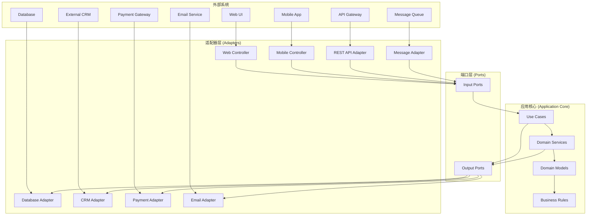

# 罗莱L2C销售管理系统 - 六边形架构设计方案

## 📋 目录
- [设计目标与价值](#设计目标与价值)
- [六边形架构概述](#六边形架构概述)
- [端口设计](#端口设计)
- [适配器设计](#适配器设计)
- [应用核心设计](#应用核心设计)
- [依赖注入配置](#依赖注入配置)
- [测试策略](#测试策略)
- [部署配置](#部署配置)

---

## 🎯 设计目标与价值

### 1. 设计目标
- **业务逻辑隔离**：将核心业务逻辑与外部依赖完全隔离
- **可测试性**：通过端口抽象实现高度可测试的架构
- **可扩展性**：支持多种外部系统和技术栈的灵活切换
- **技术无关性**：核心业务逻辑不依赖任何特定技术
- **清晰边界**：明确定义内部和外部系统的交互边界

### 2. 业务价值
- **降低耦合度**：减少系统各部分之间的依赖关系
- **提高可维护性**：业务逻辑变更不影响外部系统集成
- **增强灵活性**：支持快速适配新的外部系统和技术
- **简化测试**：通过模拟适配器实现高效的单元测试
- **风险控制**：外部系统变更不会影响核心业务逻辑

---

## 🏗️ 六边形架构概述

### 1. 架构总览



### 2. 核心概念

#### 2.1 端口 (Ports)
端口定义了应用核心与外部世界的交互契约，分为输入端口和输出端口。

#### 2.2 适配器 (Adapters)
适配器实现端口接口，负责将外部系统的调用转换为应用核心能理解的格式。

#### 2.3 应用核心 (Application Core)
包含所有业务逻辑、领域模型和用例，完全独立于外部技术。

---

## 🔌 端口设计

### 1. 输入端口 (Input Ports)

```typescript
// 线索管理输入端口
// src/application/ports/input/lead-management.port.ts

export interface ILeadManagementPort {
  createLead(command: CreateLeadCommand): Promise<LeadDto>;
  updateLead(command: UpdateLeadCommand): Promise<LeadDto>;
  assignLead(command: AssignLeadCommand): Promise<void>;
  convertLead(command: ConvertLeadCommand): Promise<OrderDto>;
  getLeadById(leadId: string): Promise<LeadDto>;
  searchLeads(query: SearchLeadsQuery): Promise<PaginatedResult<LeadDto>>;
  addFollowUp(command: AddFollowUpCommand): Promise<void>;
  updateLeadStatus(command: UpdateLeadStatusCommand): Promise<void>;
}

// 订单管理输入端口
// src/application/ports/input/order-management.port.ts

export interface IOrderManagementPort {
  createOrder(command: CreateOrderCommand): Promise<OrderDto>;
  updateOrderStatus(command: UpdateOrderStatusCommand): Promise<void>;
  processPayment(command: ProcessPaymentCommand): Promise<PaymentDto>;
  cancelOrder(command: CancelOrderCommand): Promise<void>;
  getOrderById(orderId: string): Promise<OrderDto>;
  searchOrders(query: SearchOrdersQuery): Promise<PaginatedResult<OrderDto>>;
  addOrderItem(command: AddOrderItemCommand): Promise<void>;
  removeOrderItem(command: RemoveOrderItemCommand): Promise<void>;
  updateDeliveryInfo(command: UpdateDeliveryInfoCommand): Promise<void>;
}

// 客户管理输入端口
// src/application/ports/input/customer-management.port.ts

export interface ICustomerManagementPort {
  createCustomer(command: CreateCustomerCommand): Promise<CustomerDto>;
  updateCustomer(command: UpdateCustomerCommand): Promise<CustomerDto>;
  getCustomerById(customerId: string): Promise<CustomerDto>;
  searchCustomers(query: SearchCustomersQuery): Promise<PaginatedResult<CustomerDto>>;
  getCustomerLeads(customerId: string): Promise<LeadDto[]>;
  getCustomerOrders(customerId: string): Promise<OrderDto[]>;
  mergeCustomers(command: MergeCustomersCommand): Promise<CustomerDto>;
  deactivateCustomer(command: DeactivateCustomerCommand): Promise<void>;
}

// 报表分析输入端口
// src/application/ports/input/analytics.port.ts

export interface IAnalyticsPort {
  getSalesReport(query: SalesReportQuery): Promise<SalesReportDto>;
  getLeadConversionReport(query: LeadConversionQuery): Promise<ConversionReportDto>;
  getCustomerAnalytics(query: CustomerAnalyticsQuery): Promise<CustomerAnalyticsDto>;
  getPerformanceMetrics(query: PerformanceQuery): Promise<PerformanceMetricsDto>;
  exportReport(command: ExportReportCommand): Promise<ExportResultDto>;
}
```

### 2. 输出端口 (Output Ports)

```typescript
// 数据持久化输出端口
// src/application/ports/output/persistence.port.ts

export interface ILeadRepositoryPort {
  save(lead: Lead): Promise<void>;
  findById(id: string): Promise<Lead | null>;
  findByCustomerId(customerId: string): Promise<Lead[]>;
  search(criteria: LeadSearchCriteria): Promise<PaginatedResult<Lead>>;
  delete(id: string): Promise<void>;
  exists(id: string): Promise<boolean>;
}

export interface IOrderRepositoryPort {
  save(order: Order): Promise<void>;
  findById(id: string): Promise<Order | null>;
  findByCustomerId(customerId: string): Promise<Order[]>;
  search(criteria: OrderSearchCriteria): Promise<PaginatedResult<Order>>;
  findByStatus(status: OrderStatus): Promise<Order[]>;
  delete(id: string): Promise<void>;
}

export interface ICustomerRepositoryPort {
  save(customer: Customer): Promise<void>;
  findById(id: string): Promise<Customer | null>;
  findByEmail(email: string): Promise<Customer | null>;
  findByPhone(phone: string): Promise<Customer | null>;
  search(criteria: CustomerSearchCriteria): Promise<PaginatedResult<Customer>>;
  delete(id: string): Promise<void>;
}

// 外部系统集成输出端口
// src/application/ports/output/external-systems.port.ts

export interface INotificationPort {
  sendEmail(notification: EmailNotification): Promise<void>;
  sendSMS(notification: SMSNotification): Promise<void>;
  sendPushNotification(notification: PushNotification): Promise<void>;
  sendWebhook(webhook: WebhookNotification): Promise<void>;
}

export interface IPaymentPort {
  processPayment(payment: PaymentRequest): Promise<PaymentResult>;
  refundPayment(refund: RefundRequest): Promise<RefundResult>;
  getPaymentStatus(paymentId: string): Promise<PaymentStatus>;
  validatePaymentMethod(method: PaymentMethod): Promise<boolean>;
}

export interface ICRMIntegrationPort {
  syncCustomer(customer: Customer): Promise<void>;
  syncLead(lead: Lead): Promise<void>;
  syncOrder(order: Order): Promise<void>;
  getCustomerFromCRM(crmId: string): Promise<CRMCustomer | null>;
  updateCustomerInCRM(customer: Customer): Promise<void>;
}

export interface IFileStoragePort {
  uploadFile(file: FileUpload): Promise<FileMetadata>;
  downloadFile(fileId: string): Promise<FileContent>;
  deleteFile(fileId: string): Promise<void>;
  getFileMetadata(fileId: string): Promise<FileMetadata>;
  generatePresignedUrl(fileId: string, expiresIn: number): Promise<string>;
}

// 事件发布输出端口
// src/application/ports/output/event-publisher.port.ts

export interface IEventPublisherPort {
  publishDomainEvent(event: DomainEvent): Promise<void>;
  publishIntegrationEvent(event: IntegrationEvent): Promise<void>;
  publishBatch(events: DomainEvent[]): Promise<void>;
}

// 缓存输出端口
// src/application/ports/output/cache.port.ts

export interface ICachePort {
  get<T>(key: string): Promise<T | null>;
  set<T>(key: string, value: T, ttl?: number): Promise<void>;
  delete(key: string): Promise<void>;
  deletePattern(pattern: string): Promise<void>;
  exists(key: string): Promise<boolean>;
  increment(key: string, value?: number): Promise<number>;
  expire(key: string, ttl: number): Promise<void>;
}
```

---

## 🔧 适配器设计

### 1. 输入适配器 (Input Adapters)

```typescript
// Web控制器适配器
// src/adapters/input/web/lead-management.controller.ts

@Controller('api/leads')
@ApiTags('Lead Management')
export class LeadManagementController {
  constructor(
    private readonly leadManagementPort: ILeadManagementPort
  ) {}

  @Post()
  @ApiOperation({ summary: 'Create a new lead' })
  @ApiResponse({ status: 201, description: 'Lead created successfully' })
  async createLead(
    @Body() request: CreateLeadRequest,
    @CurrentUser() user: UserContext
  ): Promise<ApiResponse<LeadDto>> {
    try {
      const command = new CreateLeadCommand(
        request.customerId,
        request.priority,
        request.source,
        request.estimatedValue,
        user.id,
        request.notes
      );

      const lead = await this.leadManagementPort.createLead(command);

      return {
        success: true,
        data: lead,
        message: 'Lead created successfully',
      };
    } catch (error) {
      throw new BadRequestException(error.message);
    }
  }

  @Put(':id/assign')
  @ApiOperation({ summary: 'Assign lead to sales person' })
  async assignLead(
    @Param('id') leadId: string,
    @Body() request: AssignLeadRequest,
    @CurrentUser() user: UserContext
  ): Promise<ApiResponse<void>> {
    try {
      const command = new AssignLeadCommand(
        leadId,
        request.assignedTo,
        user.id,
        request.reason
      );

      await this.leadManagementPort.assignLead(command);

      return {
        success: true,
        message: 'Lead assigned successfully',
      };
    } catch (error) {
      throw new BadRequestException(error.message);
    }
  }

  @Get(':id')
  @ApiOperation({ summary: 'Get lead by ID' })
  async getLeadById(
    @Param('id') leadId: string
  ): Promise<ApiResponse<LeadDto>> {
    try {
      const lead = await this.leadManagementPort.getLeadById(leadId);

      if (!lead) {
        throw new NotFoundException('Lead not found');
      }

      return {
        success: true,
        data: lead,
      };
    } catch (error) {
      if (error instanceof NotFoundException) {
        throw error;
      }
      throw new BadRequestException(error.message);
    }
  }

  @Get()
  @ApiOperation({ summary: 'Search leads' })
  async searchLeads(
    @Query() query: SearchLeadsRequest
  ): Promise<ApiResponse<PaginatedResult<LeadDto>>> {
    try {
      const searchQuery = new SearchLeadsQuery(
        query.keyword,
        query.status,
        query.priority,
        query.source,
        query.assignedTo,
        query.dateFrom,
        query.dateTo,
        query.page,
        query.limit
      );

      const result = await this.leadManagementPort.searchLeads(searchQuery);

      return {
        success: true,
        data: result,
      };
    } catch (error) {
      throw new BadRequestException(error.message);
    }
  }
}

// 消息队列适配器
// src/adapters/input/messaging/lead-event.handler.ts

@EventsHandler(CustomerCreatedEvent)
export class CustomerCreatedEventHandler implements IEventHandler<CustomerCreatedEvent> {
  constructor(
    private readonly leadManagementPort: ILeadManagementPort,
    private readonly logger: Logger
  ) {}

  async handle(event: CustomerCreatedEvent): Promise<void> {
    try {
      this.logger.log('Processing customer created event', {
        customerId: event.customerId,
        eventId: event.eventId,
      });

      // 如果客户来源是营销活动，自动创建线索
      if (event.source === 'marketing_campaign') {
        const command = new CreateLeadCommand(
          event.customerId,
          LeadPriority.MEDIUM,
          event.source,
          undefined,
          'system',
          'Auto-created from customer registration'
        );

        await this.leadManagementPort.createLead(command);

        this.logger.log('Auto-created lead for new customer', {
          customerId: event.customerId,
        });
      }
    } catch (error) {
      this.logger.error('Failed to handle customer created event', {
        customerId: event.customerId,
        error: error.message,
      });
      throw error;
    }
  }
}

// GraphQL适配器
// src/adapters/input/graphql/lead.resolver.ts

@Resolver(() => Lead)
export class LeadResolver {
  constructor(
    private readonly leadManagementPort: ILeadManagementPort
  ) {}

  @Query(() => Lead, { nullable: true })
  async lead(@Args('id') id: string): Promise<LeadDto | null> {
    return await this.leadManagementPort.getLeadById(id);
  }

  @Query(() => LeadConnection)
  async leads(
    @Args() args: LeadsArgs
  ): Promise<PaginatedResult<LeadDto>> {
    const query = new SearchLeadsQuery(
      args.filter?.keyword,
      args.filter?.status,
      args.filter?.priority,
      args.filter?.source,
      args.filter?.assignedTo,
      args.filter?.dateFrom,
      args.filter?.dateTo,
      args.pagination?.page,
      args.pagination?.limit
    );

    return await this.leadManagementPort.searchLeads(query);
  }

  @Mutation(() => Lead)
  async createLead(
    @Args('input') input: CreateLeadInput,
    @Context('user') user: UserContext
  ): Promise<LeadDto> {
    const command = new CreateLeadCommand(
      input.customerId,
      input.priority,
      input.source,
      input.estimatedValue,
      user.id,
      input.notes
    );

    return await this.leadManagementPort.createLead(command);
  }

  @Mutation(() => Boolean)
  async assignLead(
    @Args('input') input: AssignLeadInput,
    @Context('user') user: UserContext
  ): Promise<boolean> {
    const command = new AssignLeadCommand(
      input.leadId,
      input.assignedTo,
      user.id,
      input.reason
    );

    await this.leadManagementPort.assignLead(command);
    return true;
  }
}
```

### 2. 输出适配器 (Output Adapters)

```typescript
// 数据库适配器
// src/adapters/output/persistence/lead.repository.ts

@Injectable()
export class LeadRepository implements ILeadRepositoryPort {
  constructor(
    private readonly databaseService: DatabaseService,
    private readonly leadMapper: LeadMapper,
    private readonly logger: Logger
  ) {}

  async save(lead: Lead): Promise<void> {
    try {
      const leadData = this.leadMapper.toData(lead);
      
      const query = `
        INSERT INTO leads (
          id, customer_id, status, priority, source, estimated_value,
          assigned_to, created_by, created_at, updated_at, notes
        ) VALUES ($1, $2, $3, $4, $5, $6, $7, $8, $9, $10, $11)
        ON CONFLICT (id) 
        DO UPDATE SET
          status = EXCLUDED.status,
          priority = EXCLUDED.priority,
          estimated_value = EXCLUDED.estimated_value,
          assigned_to = EXCLUDED.assigned_to,
          updated_at = EXCLUDED.updated_at,
          notes = EXCLUDED.notes
      `;

      const params = [
        leadData.id,
        leadData.customerId,
        leadData.status,
        leadData.priority,
        leadData.source,
        leadData.estimatedValue,
        leadData.assignedTo,
        leadData.createdBy,
        leadData.createdAt,
        leadData.updatedAt,
        leadData.notes,
      ];

      await this.databaseService.query(query, params);

      this.logger.log('Lead saved successfully', { leadId: lead.getId() });
    } catch (error) {
      this.logger.error('Failed to save lead', {
        leadId: lead.getId(),
        error: error.message,
      });
      throw new PersistenceError('Failed to save lead', error);
    }
  }

  async findById(id: string): Promise<Lead | null> {
    try {
      const query = `
        SELECT * FROM leads WHERE id = $1
      `;

      const result = await this.databaseService.query(query, [id]);

      if (result.rows.length === 0) {
        return null;
      }

      return this.leadMapper.toDomain(result.rows[0]);
    } catch (error) {
      this.logger.error('Failed to find lead by ID', {
        leadId: id,
        error: error.message,
      });
      throw new PersistenceError('Failed to find lead', error);
    }
  }

  async search(criteria: LeadSearchCriteria): Promise<PaginatedResult<Lead>> {
    try {
      const { query, params } = this.buildSearchQuery(criteria);
      
      const result = await this.databaseService.query(query, params);
      const leads = result.rows.map(row => this.leadMapper.toDomain(row));

      // 获取总数
      const countQuery = this.buildCountQuery(criteria);
      const countResult = await this.databaseService.query(countQuery.query, countQuery.params);
      const total = parseInt(countResult.rows[0].count);

      return {
        items: leads,
        total,
        page: criteria.page || 1,
        limit: criteria.limit || 20,
        totalPages: Math.ceil(total / (criteria.limit || 20)),
      };
    } catch (error) {
      this.logger.error('Failed to search leads', {
        criteria,
        error: error.message,
      });
      throw new PersistenceError('Failed to search leads', error);
    }
  }

  private buildSearchQuery(criteria: LeadSearchCriteria): { query: string; params: any[] } {
    let query = `
      SELECT * FROM leads 
      WHERE 1=1
    `;
    const params: any[] = [];

    if (criteria.keyword) {
      query += ` AND (notes ILIKE $${params.length + 1} OR source ILIKE $${params.length + 1})`;
      params.push(`%${criteria.keyword}%`);
    }

    if (criteria.status) {
      query += ` AND status = $${params.length + 1}`;
      params.push(criteria.status);
    }

    if (criteria.priority) {
      query += ` AND priority = $${params.length + 1}`;
      params.push(criteria.priority);
    }

    if (criteria.assignedTo) {
      query += ` AND assigned_to = $${params.length + 1}`;
      params.push(criteria.assignedTo);
    }

    if (criteria.dateFrom) {
      query += ` AND created_at >= $${params.length + 1}`;
      params.push(criteria.dateFrom);
    }

    if (criteria.dateTo) {
      query += ` AND created_at <= $${params.length + 1}`;
      params.push(criteria.dateTo);
    }

    query += ` ORDER BY created_at DESC`;

    if (criteria.limit) {
      query += ` LIMIT $${params.length + 1}`;
      params.push(criteria.limit);
    }

    if (criteria.page && criteria.limit) {
      const offset = (criteria.page - 1) * criteria.limit;
      query += ` OFFSET $${params.length + 1}`;
      params.push(offset);
    }

    return { query, params };
  }

  private buildCountQuery(criteria: LeadSearchCriteria): { query: string; params: any[] } {
    let query = `
      SELECT COUNT(*) as count FROM leads 
      WHERE 1=1
    `;
    const params: any[] = [];

    // 复制搜索条件逻辑，但不包括 LIMIT 和 OFFSET
    if (criteria.keyword) {
      query += ` AND (notes ILIKE $${params.length + 1} OR source ILIKE $${params.length + 1})`;
      params.push(`%${criteria.keyword}%`);
    }

    if (criteria.status) {
      query += ` AND status = $${params.length + 1}`;
      params.push(criteria.status);
    }

    if (criteria.priority) {
      query += ` AND priority = $${params.length + 1}`;
      params.push(criteria.priority);
    }

    if (criteria.assignedTo) {
      query += ` AND assigned_to = $${params.length + 1}`;
      params.push(criteria.assignedTo);
    }

    if (criteria.dateFrom) {
      query += ` AND created_at >= $${params.length + 1}`;
      params.push(criteria.dateFrom);
    }

    if (criteria.dateTo) {
      query += ` AND created_at <= $${params.length + 1}`;
      params.push(criteria.dateTo);
    }

    return { query, params };
  }
}

// 通知适配器
// src/adapters/output/notification/email-notification.adapter.ts

@Injectable()
export class EmailNotificationAdapter implements INotificationPort {
  constructor(
    private readonly emailService: EmailService,
    private readonly templateService: TemplateService,
    private readonly logger: Logger
  ) {}

  async sendEmail(notification: EmailNotification): Promise<void> {
    try {
      const template = await this.templateService.getTemplate(
        notification.templateId,
        notification.language || 'zh-CN'
      );

      const renderedContent = await this.templateService.render(
        template,
        notification.data
      );

      await this.emailService.send({
        to: notification.recipients,
        subject: renderedContent.subject,
        html: renderedContent.html,
        text: renderedContent.text,
        attachments: notification.attachments,
      });

      this.logger.log('Email sent successfully', {
        recipients: notification.recipients,
        templateId: notification.templateId,
      });
    } catch (error) {
      this.logger.error('Failed to send email', {
        recipients: notification.recipients,
        error: error.message,
      });
      throw new NotificationError('Failed to send email', error);
    }
  }

  async sendSMS(notification: SMSNotification): Promise<void> {
    try {
      // SMS发送逻辑
      this.logger.log('SMS sent successfully', {
        recipients: notification.recipients,
      });
    } catch (error) {
      this.logger.error('Failed to send SMS', {
        recipients: notification.recipients,
        error: error.message,
      });
      throw new NotificationError('Failed to send SMS', error);
    }
  }

  async sendPushNotification(notification: PushNotification): Promise<void> {
    try {
      // 推送通知逻辑
      this.logger.log('Push notification sent successfully', {
        recipients: notification.recipients,
      });
    } catch (error) {
      this.logger.error('Failed to send push notification', {
        recipients: notification.recipients,
        error: error.message,
      });
      throw new NotificationError('Failed to send push notification', error);
    }
  }

  async sendWebhook(webhook: WebhookNotification): Promise<void> {
    try {
      // Webhook发送逻辑
      this.logger.log('Webhook sent successfully', {
        url: webhook.url,
      });
    } catch (error) {
      this.logger.error('Failed to send webhook', {
        url: webhook.url,
        error: error.message,
      });
      throw new NotificationError('Failed to send webhook', error);
    }
  }
}

// 支付适配器
// src/adapters/output/payment/alipay-payment.adapter.ts

@Injectable()
export class AlipayPaymentAdapter implements IPaymentPort {
  constructor(
    private readonly alipayClient: AlipayClient,
    private readonly configService: ConfigService,
    private readonly logger: Logger
  ) {}

  async processPayment(payment: PaymentRequest): Promise<PaymentResult> {
    try {
      const alipayRequest = {
        out_trade_no: payment.orderId,
        total_amount: payment.amount.toString(),
        subject: payment.description,
        body: payment.description,
        timeout_express: '30m',
        product_code: 'QUICK_WAP_WAY',
      };

      const response = await this.alipayClient.exec('alipay.trade.wap.pay', alipayRequest);

      this.logger.log('Payment processed successfully', {
        orderId: payment.orderId,
        amount: payment.amount,
        paymentId: response.trade_no,
      });

      return {
        paymentId: response.trade_no,
        status: 'pending',
        amount: payment.amount,
        currency: payment.currency,
        paymentUrl: response.body,
        expiresAt: new Date(Date.now() + 30 * 60 * 1000), // 30分钟后过期
      };
    } catch (error) {
      this.logger.error('Failed to process payment', {
        orderId: payment.orderId,
        error: error.message,
      });
      throw new PaymentError('Failed to process payment', error);
    }
  }

  async refundPayment(refund: RefundRequest): Promise<RefundResult> {
    try {
      const alipayRequest = {
        trade_no: refund.paymentId,
        refund_amount: refund.amount.toString(),
        refund_reason: refund.reason,
        out_request_no: refund.refundId,
      };

      const response = await this.alipayClient.exec('alipay.trade.refund', alipayRequest);

      this.logger.log('Refund processed successfully', {
        paymentId: refund.paymentId,
        refundId: refund.refundId,
        amount: refund.amount,
      });

      return {
        refundId: response.out_request_no,
        status: response.code === '10000' ? 'success' : 'failed',
        amount: refund.amount,
        processedAt: new Date(),
      };
    } catch (error) {
      this.logger.error('Failed to process refund', {
        paymentId: refund.paymentId,
        error: error.message,
      });
      throw new PaymentError('Failed to process refund', error);
    }
  }

  async getPaymentStatus(paymentId: string): Promise<PaymentStatus> {
    try {
      const alipayRequest = {
        trade_no: paymentId,
      };

      const response = await this.alipayClient.exec('alipay.trade.query', alipayRequest);

      const statusMap = {
        'WAIT_BUYER_PAY': 'pending',
        'TRADE_SUCCESS': 'success',
        'TRADE_FINISHED': 'success',
        'TRADE_CLOSED': 'failed',
      };

      return {
        paymentId,
        status: statusMap[response.trade_status] || 'unknown',
        amount: parseFloat(response.total_amount),
        paidAt: response.send_pay_date ? new Date(response.send_pay_date) : undefined,
      };
    } catch (error) {
      this.logger.error('Failed to get payment status', {
        paymentId,
        error: error.message,
      });
      throw new PaymentError('Failed to get payment status', error);
    }
  }

  async validatePaymentMethod(method: PaymentMethod): Promise<boolean> {
    // 验证支付方式逻辑
    return method.type === 'alipay';
  }
}
```

---

## 💼 应用核心设计

### 1. 用例实现

```typescript
// 线索管理用例
// src/application/use-cases/lead-management.use-case.ts

@Injectable()
export class LeadManagementUseCase implements ILeadManagementPort {
  constructor(
    private readonly leadRepository: ILeadRepositoryPort,
    private readonly customerRepository: ICustomerRepositoryPort,
    private readonly eventPublisher: IEventPublisherPort,
    private readonly notificationPort: INotificationPort,
    private readonly logger: Logger
  ) {}

  async createLead(command: CreateLeadCommand): Promise<LeadDto> {
    try {
      // 验证客户是否存在
      const customer = await this.customerRepository.findById(command.customerId);
      if (!customer) {
        throw new DomainError('Customer not found');
      }

      // 创建线索聚合
      const lead = Lead.create(
        command.customerId,
        command.priority,
        command.source,
        command.estimatedValue,
        command.assignedTo,
        command.createdBy,
        command.notes
      );

      // 保存线索
      await this.leadRepository.save(lead);

      // 发布领域事件
      const events = lead.getUncommittedEvents();
      for (const event of events) {
        await this.eventPublisher.publishDomainEvent(event);
      }
      lead.markEventsAsCommitted();

      // 发送通知
      if (command.assignedTo) {
        await this.sendLeadAssignmentNotification(lead, command.assignedTo);
      }

      this.logger.log('Lead created successfully', {
        leadId: lead.getId(),
        customerId: command.customerId,
      });

      return LeadMapper.toDto(lead);
    } catch (error) {
      this.logger.error('Failed to create lead', {
        customerId: command.customerId,
        error: error.message,
      });
      throw error;
    }
  }

  async assignLead(command: AssignLeadCommand): Promise<void> {
    try {
      // 获取线索
      const lead = await this.leadRepository.findById(command.leadId);
      if (!lead) {
        throw new DomainError('Lead not found');
      }

      // 分配线索
      lead.assignTo(command.assignedTo, command.assignedBy, command.reason);

      // 保存更新
      await this.leadRepository.save(lead);

      // 发布事件
      const events = lead.getUncommittedEvents();
      for (const event of events) {
        await this.eventPublisher.publishDomainEvent(event);
      }
      lead.markEventsAsCommitted();

      // 发送通知
      await this.sendLeadAssignmentNotification(lead, command.assignedTo);

      this.logger.log('Lead assigned successfully', {
        leadId: command.leadId,
        assignedTo: command.assignedTo,
      });
    } catch (error) {
      this.logger.error('Failed to assign lead', {
        leadId: command.leadId,
        error: error.message,
      });
      throw error;
    }
  }

  async convertLead(command: ConvertLeadCommand): Promise<OrderDto> {
    try {
      // 获取线索
      const lead = await this.leadRepository.findById(command.leadId);
      if (!lead) {
        throw new DomainError('Lead not found');
      }

      // 获取客户信息
      const customer = await this.customerRepository.findById(lead.getCustomerId());
      if (!customer) {
        throw new DomainError('Customer not found');
      }

      // 创建订单
      const order = Order.create(
        customer.getId(),
        command.salesPersonId,
        command.items,
        command.deliveryAddress,
        command.notes,
        lead.getId()
      );

      // 转化线索
      lead.convertToOrder(order.getId(), command.salesPersonId);

      // 保存更新
      await this.leadRepository.save(lead);
      await this.orderRepository.save(order);

      // 发布事件
      const leadEvents = lead.getUncommittedEvents();
      const orderEvents = order.getUncommittedEvents();
      
      for (const event of [...leadEvents, ...orderEvents]) {
        await this.eventPublisher.publishDomainEvent(event);
      }
      
      lead.markEventsAsCommitted();
      order.markEventsAsCommitted();

      this.logger.log('Lead converted successfully', {
        leadId: command.leadId,
        orderId: order.getId(),
      });

      return OrderMapper.toDto(order);
    } catch (error) {
      this.logger.error('Failed to convert lead', {
        leadId: command.leadId,
        error: error.message,
      });
      throw error;
    }
  }

  async getLeadById(leadId: string): Promise<LeadDto> {
    try {
      const lead = await this.leadRepository.findById(leadId);
      if (!lead) {
        throw new DomainError('Lead not found');
      }

      return LeadMapper.toDto(lead);
    } catch (error) {
      this.logger.error('Failed to get lead', {
        leadId,
        error: error.message,
      });
      throw error;
    }
  }

  async searchLeads(query: SearchLeadsQuery): Promise<PaginatedResult<LeadDto>> {
    try {
      const criteria = new LeadSearchCriteria(
        query.keyword,
        query.status,
        query.priority,
        query.source,
        query.assignedTo,
        query.dateFrom,
        query.dateTo,
        query.page,
        query.limit
      );

      const result = await this.leadRepository.search(criteria);

      return {
        items: result.items.map(lead => LeadMapper.toDto(lead)),
        total: result.total,
        page: result.page,
        limit: result.limit,
        totalPages: result.totalPages,
      };
    } catch (error) {
      this.logger.error('Failed to search leads', {
        query,
        error: error.message,
      });
      throw error;
    }
  }

  private async sendLeadAssignmentNotification(
    lead: Lead,
    assignedTo: string
  ): Promise<void> {
    try {
      const notification = new EmailNotification(
        [assignedTo],
        'lead_assignment',
        {
          leadId: lead.getId(),
          customerName: 'Customer Name', // 需要从客户信息获取
          priority: lead.getPriority(),
          estimatedValue: lead.getEstimatedValue(),
        }
      );

      await this.notificationPort.sendEmail(notification);
    } catch (error) {
      this.logger.error('Failed to send lead assignment notification', {
        leadId: lead.getId(),
        assignedTo,
        error: error.message,
      });
      // 不抛出错误，避免影响主流程
    }
  }
}
```

### 2. 领域服务

```typescript
// 线索转化领域服务
// src/domain/services/lead-conversion.service.ts

@Injectable()
export class LeadConversionService {
  constructor(
    private readonly leadRepository: ILeadRepositoryPort,
    private readonly customerRepository: ICustomerRepositoryPort,
    private readonly pricingService: PricingService,
    private readonly logger: Logger
  ) {}

  async calculateConversionProbability(leadId: string): Promise<number> {
    const lead = await this.leadRepository.findById(leadId);
    if (!lead) {
      throw new DomainError('Lead not found');
    }

    const customer = await this.customerRepository.findById(lead.getCustomerId());
    if (!customer) {
      throw new DomainError('Customer not found');
    }

    // 基于多个因素计算转化概率
    let probability = 0.5; // 基础概率

    // 线索优先级影响
    switch (lead.getPriority()) {
      case LeadPriority.URGENT:
        probability += 0.3;
        break;
      case LeadPriority.HIGH:
        probability += 0.2;
        break;
      case LeadPriority.MEDIUM:
        probability += 0.1;
        break;
      default:
        break;
    }

    // 线索来源影响
    const sourceWeights = {
      'referral': 0.25,
      'website': 0.15,
      'social_media': 0.1,
      'cold_call': 0.05,
    };
    probability += sourceWeights[lead.getSource()] || 0;

    // 客户历史订单影响
    const customerOrders = await this.getCustomerOrderHistory(customer.getId());
    if (customerOrders.length > 0) {
      probability += 0.2; // 老客户转化率更高
    }

    // 跟进次数影响
    const followUpCount = lead.getFollowUps().length;
    probability += Math.min(followUpCount * 0.05, 0.2);

    // 确保概率在0-1之间
    return Math.min(Math.max(probability, 0), 1);
  }

  async suggestOptimalTiming(leadId: string): Promise<Date> {
    const lead = await this.leadRepository.findById(leadId);
    if (!lead) {
      throw new DomainError('Lead not found');
    }

    // 基于线索创建时间和跟进历史建议最佳联系时间
    const lastFollowUp = lead.getFollowUps()
      .sort((a, b) => b.followUpDate.getTime() - a.followUpDate.getTime())[0];

    if (lastFollowUp) {
      // 如果有跟进记录，建议在上次跟进后3-5天联系
      const daysSinceLastFollowUp = Math.floor(
        (Date.now() - lastFollowUp.followUpDate.getTime()) / (1000 * 60 * 60 * 24)
      );

      if (daysSinceLastFollowUp >= 3) {
        return new Date(); // 立即联系
      } else {
        return new Date(Date.now() + (3 - daysSinceLastFollowUp) * 24 * 60 * 60 * 1000);
      }
    } else {
      // 如果没有跟进记录，建议在创建后24小时内联系
      const hoursSinceCreation = Math.floor(
        (Date.now() - lead.getCreatedAt().getTime()) / (1000 * 60 * 60)
      );

      if (hoursSinceCreation >= 24) {
        return new Date(); // 立即联系
      } else {
        return new Date(Date.now() + (24 - hoursSinceCreation) * 60 * 60 * 1000);
      }
    }
  }

  private async getCustomerOrderHistory(customerId: string): Promise<any[]> {
    // 获取客户历史订单
    // 这里需要调用订单仓储
    return [];
  }
}

// 定价领域服务
// src/domain/services/pricing.service.ts

@Injectable()
export class PricingService {
  constructor(
    private readonly configService: ConfigService,
    private readonly logger: Logger
  ) {}

  calculateOrderTotal(items: OrderItem[], customer: Customer): number {
    let total = 0;

    for (const item of items) {
      let itemPrice = item.unitPrice * item.quantity;

      // 应用产品折扣
      if (item.discountPercentage > 0) {
        itemPrice *= (1 - item.discountPercentage / 100);
      }

      total += itemPrice;
    }

    // 应用客户级别折扣
    const customerDiscount = this.getCustomerDiscount(customer);
    if (customerDiscount > 0) {
      total *= (1 - customerDiscount / 100);
    }

    // 应用批量折扣
    const volumeDiscount = this.getVolumeDiscount(total);
    if (volumeDiscount > 0) {
      total *= (1 - volumeDiscount / 100);
    }

    return Math.round(total * 100) / 100; // 保留两位小数
  }

  private getCustomerDiscount(customer: Customer): number {
    // 根据客户等级返回折扣
    const discountMap = {
      'vip': 10,
      'gold': 5,
      'silver': 2,
      'bronze': 0,
    };

    return discountMap[customer.getLevel()] || 0;
  }

  private getVolumeDiscount(total: number): number {
    // 根据订单金额返回批量折扣
    if (total >= 100000) return 15; // 10万以上15%折扣
    if (total >= 50000) return 10;  // 5万以上10%折扣
    if (total >= 20000) return 5;   // 2万以上5%折扣
    return 0;
  }
}
```

---

## 🔧 依赖注入配置

### 1. 容器配置

```typescript
// 依赖注入容器配置
// src/infrastructure/di/container.config.ts

import { Container } from 'inversify';
import { TYPES } from './types';

// 输入端口
import { ILeadManagementPort } from '../application/ports/input/lead-management.port';
import { IOrderManagementPort } from '../application/ports/input/order-management.port';
import { ICustomerManagementPort } from '../application/ports/input/customer-management.port';
import { IAnalyticsPort } from '../application/ports/input/analytics.port';

// 输出端口
import { ILeadRepositoryPort } from '../application/ports/output/persistence.port';
import { IOrderRepositoryPort } from '../application/ports/output/persistence.port';
import { ICustomerRepositoryPort } from '../application/ports/output/persistence.port';
import { INotificationPort } from '../application/ports/output/external-systems.port';
import { IPaymentPort } from '../application/ports/output/external-systems.port';
import { ICRMIntegrationPort } from '../application/ports/output/external-systems.port';
import { IEventPublisherPort } from '../application/ports/output/event-publisher.port';
import { ICachePort } from '../application/ports/output/cache.port';

// 用例实现
import { LeadManagementUseCase } from '../application/use-cases/lead-management.use-case';
import { OrderManagementUseCase } from '../application/use-cases/order-management.use-case';
import { CustomerManagementUseCase } from '../application/use-cases/customer-management.use-case';
import { AnalyticsUseCase } from '../application/use-cases/analytics.use-case';

// 适配器实现
import { LeadRepository } from '../adapters/output/persistence/lead.repository';
import { OrderRepository } from '../adapters/output/persistence/order.repository';
import { CustomerRepository } from '../adapters/output/persistence/customer.repository';
import { EmailNotificationAdapter } from '../adapters/output/notification/email-notification.adapter';
import { AlipayPaymentAdapter } from '../adapters/output/payment/alipay-payment.adapter';
import { SalesforceCRMAdapter } from '../adapters/output/crm/salesforce-crm.adapter';
import { RedisEventPublisher } from '../adapters/output/events/redis-event-publisher';
import { RedisCacheAdapter } from '../adapters/output/cache/redis-cache.adapter';

// 领域服务
import { LeadConversionService } from '../domain/services/lead-conversion.service';
import { PricingService } from '../domain/services/pricing.service';

const container = new Container();

// 绑定输入端口到用例实现
container.bind<ILeadManagementPort>(TYPES.LeadManagementPort).to(LeadManagementUseCase);
container.bind<IOrderManagementPort>(TYPES.OrderManagementPort).to(OrderManagementUseCase);
container.bind<ICustomerManagementPort>(TYPES.CustomerManagementPort).to(CustomerManagementUseCase);
container.bind<IAnalyticsPort>(TYPES.AnalyticsPort).to(AnalyticsUseCase);

// 绑定输出端口到适配器实现
container.bind<ILeadRepositoryPort>(TYPES.LeadRepositoryPort).to(LeadRepository);
container.bind<IOrderRepositoryPort>(TYPES.OrderRepositoryPort).to(OrderRepository);
container.bind<ICustomerRepositoryPort>(TYPES.CustomerRepositoryPort).to(CustomerRepository);
container.bind<INotificationPort>(TYPES.NotificationPort).to(EmailNotificationAdapter);
container.bind<IPaymentPort>(TYPES.PaymentPort).to(AlipayPaymentAdapter);
container.bind<ICRMIntegrationPort>(TYPES.CRMIntegrationPort).to(SalesforceCRMAdapter);
container.bind<IEventPublisherPort>(TYPES.EventPublisherPort).to(RedisEventPublisher);
container.bind<ICachePort>(TYPES.CachePort).to(RedisCacheAdapter);

// 绑定领域服务
container.bind<LeadConversionService>(TYPES.LeadConversionService).to(LeadConversionService);
container.bind<PricingService>(TYPES.PricingService).to(PricingService);

export { container };

// 类型定义
// src/infrastructure/di/types.ts

export const TYPES = {
  // 输入端口
  LeadManagementPort: Symbol.for('LeadManagementPort'),
  OrderManagementPort: Symbol.for('OrderManagementPort'),
  CustomerManagementPort: Symbol.for('CustomerManagementPort'),
  AnalyticsPort: Symbol.for('AnalyticsPort'),

  // 输出端口
  LeadRepositoryPort: Symbol.for('LeadRepositoryPort'),
  OrderRepositoryPort: Symbol.for('OrderRepositoryPort'),
  CustomerRepositoryPort: Symbol.for('CustomerRepositoryPort'),
  NotificationPort: Symbol.for('NotificationPort'),
  PaymentPort: Symbol.for('PaymentPort'),
  CRMIntegrationPort: Symbol.for('CRMIntegrationPort'),
  EventPublisherPort: Symbol.for('EventPublisherPort'),
  CachePort: Symbol.for('CachePort'),

  // 领域服务
  LeadConversionService: Symbol.for('LeadConversionService'),
  PricingService: Symbol.for('PricingService'),

  // 基础设施
  DatabaseService: Symbol.for('DatabaseService'),
  ConfigService: Symbol.for('ConfigService'),
  Logger: Symbol.for('Logger'),
};
```

### 2. NestJS模块配置

```typescript
// NestJS模块配置
// src/infrastructure/modules/hexagonal.module.ts

import { Module } from '@nestjs/common';
import { ConfigModule } from '@nestjs/config';

// 控制器
import { LeadManagementController } from '../adapters/input/web/lead-management.controller';
import { OrderManagementController } from '../adapters/input/web/order-management.controller';
import { CustomerManagementController } from '../adapters/input/web/customer-management.controller';

// 用例
import { LeadManagementUseCase } from '../application/use-cases/lead-management.use-case';
import { OrderManagementUseCase } from '../application/use-cases/order-management.use-case';
import { CustomerManagementUseCase } from '../application/use-cases/customer-management.use-case';

// 适配器
import { LeadRepository } from '../adapters/output/persistence/lead.repository';
import { OrderRepository } from '../adapters/output/persistence/order.repository';
import { CustomerRepository } from '../adapters/output/persistence/customer.repository';
import { EmailNotificationAdapter } from '../adapters/output/notification/email-notification.adapter';
import { AlipayPaymentAdapter } from '../adapters/output/payment/alipay-payment.adapter';

// 端口令牌
import { LEAD_MANAGEMENT_PORT } from '../application/ports/input/lead-management.port';
import { ORDER_MANAGEMENT_PORT } from '../application/ports/input/order-management.port';
import { CUSTOMER_MANAGEMENT_PORT } from '../application/ports/input/customer-management.port';
import { LEAD_REPOSITORY_PORT } from '../application/ports/output/persistence.port';
import { ORDER_REPOSITORY_PORT } from '../application/ports/output/persistence.port';
import { CUSTOMER_REPOSITORY_PORT } from '../application/ports/output/persistence.port';
import { NOTIFICATION_PORT } from '../application/ports/output/external-systems.port';
import { PAYMENT_PORT } from '../application/ports/output/external-systems.port';

@Module({
  imports: [
    ConfigModule.forRoot({
      isGlobal: true,
    }),
  ],
  controllers: [
    LeadManagementController,
    OrderManagementController,
    CustomerManagementController,
  ],
  providers: [
    // 用例提供者
    {
      provide: LEAD_MANAGEMENT_PORT,
      useClass: LeadManagementUseCase,
    },
    {
      provide: ORDER_MANAGEMENT_PORT,
      useClass: OrderManagementUseCase,
    },
    {
      provide: CUSTOMER_MANAGEMENT_PORT,
      useClass: CustomerManagementUseCase,
    },

    // 仓储提供者
    {
      provide: LEAD_REPOSITORY_PORT,
      useClass: LeadRepository,
    },
    {
      provide: ORDER_REPOSITORY_PORT,
      useClass: OrderRepository,
    },
    {
      provide: CUSTOMER_REPOSITORY_PORT,
      useClass: CustomerRepository,
    },

    // 外部系统适配器提供者
    {
      provide: NOTIFICATION_PORT,
      useClass: EmailNotificationAdapter,
    },
    {
      provide: PAYMENT_PORT,
      useClass: AlipayPaymentAdapter,
    },

    // 领域服务
    LeadConversionService,
    PricingService,
  ],
  exports: [
    LEAD_MANAGEMENT_PORT,
    ORDER_MANAGEMENT_PORT,
    CUSTOMER_MANAGEMENT_PORT,
  ],
})
export class HexagonalModule {}
```

---

## 🧪 测试策略

### 1. 单元测试

```typescript
// 用例单元测试
// src/application/use-cases/__tests__/lead-management.use-case.spec.ts

import { Test, TestingModule } from '@nestjs/testing';
import { LeadManagementUseCase } from '../lead-management.use-case';
import { ILeadRepositoryPort } from '../../ports/output/persistence.port';
import { ICustomerRepositoryPort } from '../../ports/output/persistence.port';
import { IEventPublisherPort } from '../../ports/output/event-publisher.port';
import { INotificationPort } from '../../ports/output/external-systems.port';
import { CreateLeadCommand } from '../../commands/create-lead.command';
import { Lead } from '../../../domain/entities/lead.entity';
import { Customer } from '../../../domain/entities/customer.entity';
import { DomainError } from '../../../domain/errors/domain.error';

describe('LeadManagementUseCase', () => {
  let useCase: LeadManagementUseCase;
  let leadRepository: jest.Mocked<ILeadRepositoryPort>;
  let customerRepository: jest.Mocked<ICustomerRepositoryPort>;
  let eventPublisher: jest.Mocked<IEventPublisherPort>;
  let notificationPort: jest.Mocked<INotificationPort>;

  beforeEach(async () => {
    const leadRepositoryMock = {
      save: jest.fn(),
      findById: jest.fn(),
      findByCustomerId: jest.fn(),
      search: jest.fn(),
      delete: jest.fn(),
      exists: jest.fn(),
    };

    const customerRepositoryMock = {
      save: jest.fn(),
      findById: jest.fn(),
      findByEmail: jest.fn(),
      findByPhone: jest.fn(),
      search: jest.fn(),
      delete: jest.fn(),
    };

    const eventPublisherMock = {
      publishDomainEvent: jest.fn(),
      publishIntegrationEvent: jest.fn(),
      publishBatch: jest.fn(),
    };

    const notificationPortMock = {
      sendEmail: jest.fn(),
      sendSMS: jest.fn(),
      sendPushNotification: jest.fn(),
      sendWebhook: jest.fn(),
    };

    const module: TestingModule = await Test.createTestingModule({
      providers: [
        LeadManagementUseCase,
        {
          provide: 'ILeadRepositoryPort',
          useValue: leadRepositoryMock,
        },
        {
          provide: 'ICustomerRepositoryPort',
          useValue: customerRepositoryMock,
        },
        {
          provide: 'IEventPublisherPort',
          useValue: eventPublisherMock,
        },
        {
          provide: 'INotificationPort',
          useValue: notificationPortMock,
        },
        {
          provide: 'Logger',
          useValue: { log: jest.fn(), error: jest.fn() },
        },
      ],
    }).compile();

    useCase = module.get<LeadManagementUseCase>(LeadManagementUseCase);
    leadRepository = module.get('ILeadRepositoryPort');
    customerRepository = module.get('ICustomerRepositoryPort');
    eventPublisher = module.get('IEventPublisherPort');
    notificationPort = module.get('INotificationPort');
  });

  describe('createLead', () => {
    it('should create a lead successfully', async () => {
      // Arrange
      const customerId = 'customer-123';
      const command = new CreateLeadCommand(
        customerId,
        'HIGH',
        'website',
        50000,
        'sales-person-123',
        'user-123',
        'Test lead'
      );

      const customer = Customer.create(
        'John Doe',
        'john@example.com',
        '+1234567890',
        'Company Inc'
      );

      customerRepository.findById.mockResolvedValue(customer);
      leadRepository.save.mockResolvedValue(undefined);
      eventPublisher.publishDomainEvent.mockResolvedValue(undefined);
      notificationPort.sendEmail.mockResolvedValue(undefined);

      // Act
      const result = await useCase.createLead(command);

      // Assert
      expect(customerRepository.findById).toHaveBeenCalledWith(customerId);
      expect(leadRepository.save).toHaveBeenCalled();
      expect(eventPublisher.publishDomainEvent).toHaveBeenCalled();
      expect(notificationPort.sendEmail).toHaveBeenCalled();
      expect(result).toBeDefined();
      expect(result.customerId).toBe(customerId);
    });

    it('should throw error when customer not found', async () => {
      // Arrange
      const command = new CreateLeadCommand(
        'non-existent-customer',
        'HIGH',
        'website',
        50000,
        'sales-person-123',
        'user-123',
        'Test lead'
      );

      customerRepository.findById.mockResolvedValue(null);

      // Act & Assert
      await expect(useCase.createLead(command)).rejects.toThrow(DomainError);
      expect(customerRepository.findById).toHaveBeenCalled();
      expect(leadRepository.save).not.toHaveBeenCalled();
    });
  });

  describe('assignLead', () => {
    it('should assign lead successfully', async () => {
      // Arrange
      const leadId = 'lead-123';
      const assignedTo = 'sales-person-456';
      const command = new AssignLeadCommand(
        leadId,
        assignedTo,
        'manager-123',
        'Reassignment for better coverage'
      );

      const lead = Lead.create(
        'customer-123',
        'MEDIUM',
        'referral',
        30000,
        'sales-person-123',
        'user-123',
        'Existing lead'
      );

      leadRepository.findById.mockResolvedValue(lead);
      leadRepository.save.mockResolvedValue(undefined);
      eventPublisher.publishDomainEvent.mockResolvedValue(undefined);
      notificationPort.sendEmail.mockResolvedValue(undefined);

      // Act
      await useCase.assignLead(command);

      // Assert
      expect(leadRepository.findById).toHaveBeenCalledWith(leadId);
      expect(leadRepository.save).toHaveBeenCalled();
      expect(eventPublisher.publishDomainEvent).toHaveBeenCalled();
      expect(notificationPort.sendEmail).toHaveBeenCalled();
    });

    it('should throw error when lead not found', async () => {
      // Arrange
      const command = new AssignLeadCommand(
        'non-existent-lead',
        'sales-person-456',
        'manager-123',
        'Reassignment'
      );

      leadRepository.findById.mockResolvedValue(null);

      // Act & Assert
      await expect(useCase.assignLead(command)).rejects.toThrow(DomainError);
      expect(leadRepository.findById).toHaveBeenCalled();
      expect(leadRepository.save).not.toHaveBeenCalled();
    });
  });
});
```

### 2. 集成测试

```typescript
// 适配器集成测试
// src/adapters/output/persistence/__tests__/lead.repository.integration.spec.ts

import { Test, TestingModule } from '@nestjs/testing';
import { LeadRepository } from '../lead.repository';
import { DatabaseService } from '../../../infrastructure/database/database.service';
import { LeadMapper } from '../mappers/lead.mapper';
import { Lead } from '../../../../domain/entities/lead.entity';
import { LeadSearchCriteria } from '../../../../domain/criteria/lead-search.criteria';

describe('LeadRepository Integration', () => {
  let repository: LeadRepository;
  let databaseService: DatabaseService;

  beforeEach(async () => {
    const module: TestingModule = await Test.createTestingModule({
      providers: [
        LeadRepository,
        {
          provide: DatabaseService,
          useValue: {
            query: jest.fn(),
          },
        },
        {
          provide: LeadMapper,
          useValue: {
            toData: jest.fn(),
            toDomain: jest.fn(),
          },
        },
        {
          provide: 'Logger',
          useValue: { log: jest.fn(), error: jest.fn() },
        },
      ],
    }).compile();

    repository = module.get<LeadRepository>(LeadRepository);
    databaseService = module.get<DatabaseService>(DatabaseService);
  });

  describe('save', () => {
    it('should save lead to database', async () => {
      // Arrange
      const lead = Lead.create(
        'customer-123',
        'HIGH',
        'website',
        50000,
        'sales-person-123',
        'user-123',
        'Test lead'
      );

      const leadData = {
        id: lead.getId(),
        customerId: 'customer-123',
        status: 'NEW',
        priority: 'HIGH',
        source: 'website',
        estimatedValue: 50000,
        assignedTo: 'sales-person-123',
        createdBy: 'user-123',
        createdAt: lead.getCreatedAt(),
        updatedAt: lead.getUpdatedAt(),
        notes: 'Test lead',
      };

      jest.spyOn(repository['leadMapper'], 'toData').mockReturnValue(leadData);
      jest.spyOn(databaseService, 'query').mockResolvedValue({ rows: [] });

      // Act
      await repository.save(lead);

      // Assert
      expect(databaseService.query).toHaveBeenCalledWith(
        expect.stringContaining('INSERT INTO leads'),
        expect.arrayContaining([
          leadData.id,
          leadData.customerId,
          leadData.status,
          leadData.priority,
          leadData.source,
          leadData.estimatedValue,
          leadData.assignedTo,
          leadData.createdBy,
          leadData.createdAt,
          leadData.updatedAt,
          leadData.notes,
        ])
      );
    });
  });

  describe('findById', () => {
    it('should return lead when found', async () => {
      // Arrange
      const leadId = 'lead-123';
      const leadData = {
        id: leadId,
        customer_id: 'customer-123',
        status: 'NEW',
        priority: 'HIGH',
        source: 'website',
        estimated_value: 50000,
        assigned_to: 'sales-person-123',
        created_by: 'user-123',
        created_at: new Date(),
        updated_at: new Date(),
        notes: 'Test lead',
      };

      const lead = Lead.create(
        'customer-123',
        'HIGH',
        'website',
        50000,
        'sales-person-123',
        'user-123',
        'Test lead'
      );

      jest.spyOn(databaseService, 'query').mockResolvedValue({
        rows: [leadData],
      });
      jest.spyOn(repository['leadMapper'], 'toDomain').mockReturnValue(lead);

      // Act
      const result = await repository.findById(leadId);

      // Assert
      expect(databaseService.query).toHaveBeenCalledWith(
        'SELECT * FROM leads WHERE id = $1',
        [leadId]
      );
      expect(result).toBe(lead);
    });

    it('should return null when lead not found', async () => {
      // Arrange
      const leadId = 'non-existent-lead';

      jest.spyOn(databaseService, 'query').mockResolvedValue({
        rows: [],
      });

      // Act
      const result = await repository.findById(leadId);

      // Assert
      expect(result).toBeNull();
    });
  });
});
```

### 3. 端到端测试

```typescript
// 端到端测试
// src/__tests__/e2e/lead-management.e2e.spec.ts

import { Test, TestingModule } from '@nestjs/testing';
import { INestApplication } from '@nestjs/common';
import * as request from 'supertest';
import { AppModule } from '../../app.module';
import { DatabaseService } from '../../infrastructure/database/database.service';

describe('Lead Management E2E', () => {
  let app: INestApplication;
  let databaseService: DatabaseService;

  beforeEach(async () => {
    const moduleFixture: TestingModule = await Test.createTestingModule({
      imports: [AppModule],
    }).compile();

    app = moduleFixture.createNestApplication();
    databaseService = moduleFixture.get<DatabaseService>(DatabaseService);
    
    await app.init();
    
    // 清理测试数据
    await databaseService.query('DELETE FROM leads WHERE created_by = $1', ['test-user']);
    await databaseService.query('DELETE FROM customers WHERE created_by = $1', ['test-user']);
  });

  afterEach(async () => {
    // 清理测试数据
    await databaseService.query('DELETE FROM leads WHERE created_by = $1', ['test-user']);
    await databaseService.query('DELETE FROM customers WHERE created_by = $1', ['test-user']);
    
    await app.close();
  });

  describe('/api/leads (POST)', () => {
    it('should create a new lead', async () => {
      // 首先创建一个客户
      const customerResponse = await request(app.getHttpServer())
        .post('/api/customers')
        .send({
          name: 'Test Customer',
          email: 'test@example.com',
          phone: '+1234567890',
          company: 'Test Company',
        })
        .expect(201);

      const customerId = customerResponse.body.data.id;

      // 创建线索
      const leadData = {
        customerId,
        priority: 'HIGH',
        source: 'website',
        estimatedValue: 50000,
        notes: 'Test lead from E2E test',
      };

      const response = await request(app.getHttpServer())
        .post('/api/leads')
        .send(leadData)
        .expect(201);

      expect(response.body.success).toBe(true);
      expect(response.body.data).toBeDefined();
      expect(response.body.data.customerId).toBe(customerId);
      expect(response.body.data.priority).toBe('HIGH');
      expect(response.body.data.source).toBe('website');
      expect(response.body.data.estimatedValue).toBe(50000);
    });

    it('should return 400 when customer not found', async () => {
      const leadData = {
        customerId: 'non-existent-customer',
        priority: 'HIGH',
        source: 'website',
        estimatedValue: 50000,
        notes: 'Test lead',
      };

      await request(app.getHttpServer())
        .post('/api/leads')
        .send(leadData)
        .expect(400);
    });
  });

  describe('/api/leads/:id (GET)', () => {
    it('should get lead by id', async () => {
      // 创建客户和线索
      const customerResponse = await request(app.getHttpServer())
        .post('/api/customers')
        .send({
          name: 'Test Customer',
          email: 'test@example.com',
          phone: '+1234567890',
          company: 'Test Company',
        });

      const customerId = customerResponse.body.data.id;

      const leadResponse = await request(app.getHttpServer())
        .post('/api/leads')
        .send({
          customerId,
          priority: 'HIGH',
          source: 'website',
          estimatedValue: 50000,
          notes: 'Test lead',
        });

      const leadId = leadResponse.body.data.id;

      // 获取线索
      const response = await request(app.getHttpServer())
        .get(`/api/leads/${leadId}`)
        .expect(200);

      expect(response.body.success).toBe(true);
      expect(response.body.data.id).toBe(leadId);
      expect(response.body.data.customerId).toBe(customerId);
    });

    it('should return 404 when lead not found', async () => {
      await request(app.getHttpServer())
        .get('/api/leads/non-existent-lead')
        .expect(404);
    });
  });

  describe('/api/leads (GET)', () => {
    it('should search leads with filters', async () => {
      // 创建多个线索用于测试搜索
      const customerResponse = await request(app.getHttpServer())
        .post('/api/customers')
        .send({
          name: 'Test Customer',
          email: 'test@example.com',
          phone: '+1234567890',
          company: 'Test Company',
        });

      const customerId = customerResponse.body.data.id;

      // 创建高优先级线索
      await request(app.getHttpServer())
        .post('/api/leads')
        .send({
          customerId,
          priority: 'HIGH',
          source: 'website',
          estimatedValue: 50000,
          notes: 'High priority lead',
        });

      // 创建中优先级线索
      await request(app.getHttpServer())
        .post('/api/leads')
        .send({
          customerId,
          priority: 'MEDIUM',
          source: 'referral',
          estimatedValue: 30000,
          notes: 'Medium priority lead',
        });

      // 搜索高优先级线索
      const response = await request(app.getHttpServer())
        .get('/api/leads')
        .query({
          priority: 'HIGH',
          page: 1,
          limit: 10,
        })
        .expect(200);

      expect(response.body.success).toBe(true);
      expect(response.body.data.items).toBeDefined();
      expect(response.body.data.items.length).toBeGreaterThan(0);
      expect(response.body.data.items[0].priority).toBe('HIGH');
    });
  });
});
```

---

## 🚀 部署配置

### 1. Docker配置

```dockerfile
# 多阶段构建Dockerfile
# Dockerfile

# 构建阶段
FROM node:18-alpine AS builder

WORKDIR /app

# 复制依赖文件
COPY package*.json ./
COPY tsconfig*.json ./

# 安装依赖
RUN npm ci --only=production && npm cache clean --force

# 复制源代码
COPY src/ ./src/

# 构建应用
RUN npm run build

# 生产阶段
FROM node:18-alpine AS production

WORKDIR /app

# 创建非root用户
RUN addgroup -g 1001 -S nodejs
RUN adduser -S nestjs -u 1001

# 复制构建产物和依赖
COPY --from=builder --chown=nestjs:nodejs /app/node_modules ./node_modules
COPY --from=builder --chown=nestjs:nodejs /app/dist ./dist
COPY --from=builder --chown=nestjs:nodejs /app/package*.json ./

# 切换到非root用户
USER nestjs

# 暴露端口
EXPOSE 3000

# 健康检查
HEALTHCHECK --interval=30s --timeout=3s --start-period=5s --retries=3 \
  CMD curl -f http://localhost:3000/health || exit 1

# 启动应用
CMD ["node", "dist/main.js"]
```

### 2. Kubernetes配置

```yaml
# Kubernetes部署配置
# k8s/deployment.yaml

apiVersion: apps/v1
kind: Deployment
metadata:
  name: l2c-hexagonal-api
  namespace: l2c-system
  labels:
    app: l2c-hexagonal-api
    version: v1
spec:
  replicas: 3
  selector:
    matchLabels:
      app: l2c-hexagonal-api
  template:
    metadata:
      labels:
        app: l2c-hexagonal-api
        version: v1
    spec:
      containers:
      - name: api
        image: l2c/hexagonal-api:latest
        ports:
        - containerPort: 3000
          name: http
        env:
        - name: NODE_ENV
          value: "production"
        - name: DATABASE_URL
          valueFrom:
            secretKeyRef:
              name: l2c-secrets
              key: database-url
        - name: REDIS_URL
          valueFrom:
            secretKeyRef:
              name: l2c-secrets
              key: redis-url
        - name: JWT_SECRET
          valueFrom:
            secretKeyRef:
              name: l2c-secrets
              key: jwt-secret
        resources:
          requests:
            memory: "256Mi"
            cpu: "250m"
          limits:
            memory: "512Mi"
            cpu: "500m"
        livenessProbe:
          httpGet:
            path: /health
            port: 3000
          initialDelaySeconds: 30
          periodSeconds: 10
        readinessProbe:
          httpGet:
            path: /health/ready
            port: 3000
          initialDelaySeconds: 5
          periodSeconds: 5
        volumeMounts:
        - name: config
          mountPath: /app/config
          readOnly: true
      volumes:
      - name: config
        configMap:
          name: l2c-config
      imagePullSecrets:
      - name: l2c-registry-secret

---
apiVersion: v1
kind: Service
metadata:
  name: l2c-hexagonal-api-service
  namespace: l2c-system
  labels:
    app: l2c-hexagonal-api
spec:
  selector:
    app: l2c-hexagonal-api
  ports:
  - name: http
    port: 80
    targetPort: 3000
    protocol: TCP
  type: ClusterIP

---
apiVersion: networking.k8s.io/v1
kind: Ingress
metadata:
  name: l2c-hexagonal-api-ingress
  namespace: l2c-system
  annotations:
    kubernetes.io/ingress.class: nginx
    nginx.ingress.kubernetes.io/ssl-redirect: "true"
    nginx.ingress.kubernetes.io/use-regex: "true"
    cert-manager.io/cluster-issuer: letsencrypt-prod
spec:
  tls:
  - hosts:
    - api.l2c.example.com
    secretName: l2c-api-tls
  rules:
  - host: api.l2c.example.com
    http:
      paths:
      - path: /
        pathType: Prefix
        backend:
          service:
            name: l2c-hexagonal-api-service
            port:
              number: 80
```

### 3. 环境配置

```yaml
# 配置映射
# k8s/configmap.yaml

apiVersion: v1
kind: ConfigMap
metadata:
  name: l2c-config
  namespace: l2c-system
data:
  application.yaml: |
    server:
      port: 3000
      cors:
        enabled: true
        origins:
          - https://app.l2c.example.com
          - https://admin.l2c.example.com
    
    database:
      type: postgresql
      host: postgres-service
      port: 5432
      database: l2c_db
      pool:
        min: 5
        max: 20
        acquireTimeoutMillis: 60000
        idleTimeoutMillis: 600000
    
    redis:
      host: redis-service
      port: 6379
      db: 0
      keyPrefix: l2c:
      ttl: 3600
    
    messaging:
      type: redis
      channels:
        events: l2c:events
        notifications: l2c:notifications
    
    external:
      crm:
        type: salesforce
        apiVersion: v52.0
        timeout: 30000
      
      payment:
        alipay:
          appId: ${ALIPAY_APP_ID}
          timeout: 30000
        
      notification:
        email:
          provider: sendgrid
          timeout: 10000
        sms:
          provider: twilio
          timeout: 5000
    
    monitoring:
      metrics:
        enabled: true
        endpoint: /metrics
      
      tracing:
        enabled: true
        jaeger:
          endpoint: http://jaeger-collector:14268/api/traces
      
      logging:
        level: info
        format: json
        destinations:
          - console
          - file

---
apiVersion: v1
kind: Secret
metadata:
  name: l2c-secrets
  namespace: l2c-system
type: Opaque
data:
  database-url: cG9zdGdyZXNxbDovL3VzZXI6cGFzc3dvcmRAcG9zdGdyZXMtc2VydmljZTo1NDMyL2wyY19kYg==
  redis-url: cmVkaXM6Ly9yZWRpcy1zZXJ2aWNlOjYzNzk=
  jwt-secret: eW91ci1qd3Qtc2VjcmV0LWtleQ==
  alipay-app-id: eW91ci1hbGlwYXktYXBwLWlk
  alipay-private-key: eW91ci1hbGlwYXktcHJpdmF0ZS1rZXk=
  sendgrid-api-key: eW91ci1zZW5kZ3JpZC1hcGkta2V5
  twilio-auth-token: eW91ci10d2lsaW8tYXV0aC10b2tlbg==
```

### 4. 监控配置

```yaml
# Prometheus监控配置
# k8s/monitoring.yaml

apiVersion: monitoring.coreos.com/v1
kind: ServiceMonitor
metadata:
  name: l2c-hexagonal-api-monitor
  namespace: l2c-system
  labels:
    app: l2c-hexagonal-api
spec:
  selector:
    matchLabels:
      app: l2c-hexagonal-api
  endpoints:
  - port: http
    path: /metrics
    interval: 30s
    scrapeTimeout: 10s

---
apiVersion: v1
kind: Service
metadata:
  name: l2c-hexagonal-api-metrics
  namespace: l2c-system
  labels:
    app: l2c-hexagonal-api
    metrics: "true"
spec:
  selector:
    app: l2c-hexagonal-api
  ports:
  - name: metrics
    port: 3000
    targetPort: 3000
    protocol: TCP
  type: ClusterIP
```

---

## 📊 总结

这个六边形架构设计方案提供了完整的端口适配器架构，具有以下核心优势：

### 🎯 架构优势
- **业务逻辑隔离**：核心业务逻辑完全独立于外部技术
- **高度可测试**：通过端口抽象实现全面的单元测试覆盖
- **技术无关性**：支持灵活切换不同的技术栈和外部系统
- **清晰边界**：明确定义内部和外部系统的交互契约

### 🔧 实现特点
- **完整的端口定义**：涵盖输入端口和输出端口的全面设计
- **多样化适配器**：支持Web、GraphQL、消息队列等多种输入方式
- **灵活的依赖注入**：支持IoC容器和NestJS模块化配置
- **全面的测试策略**：包含单元测试、集成测试和端到端测试

### 🚀 部署支持
- **容器化部署**：提供完整的Docker和Kubernetes配置
- **环境配置管理**：支持配置映射和密钥管理
- **监控集成**：内置Prometheus监控和健康检查
- **扩展性设计**：支持水平扩展和负载均衡

这个架构设计确保了罗莱L2C销售管理系统具有高度的可维护性、可扩展性和可测试性，为系统的长期发展奠定了坚实的基础。
