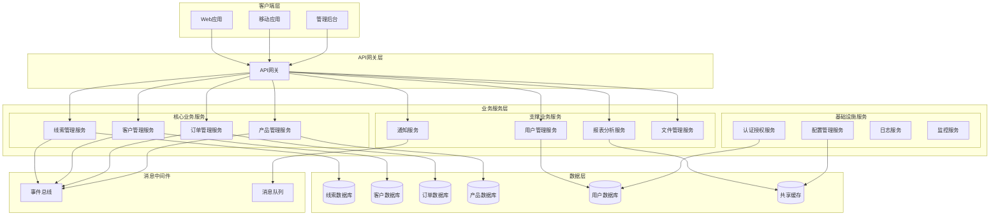
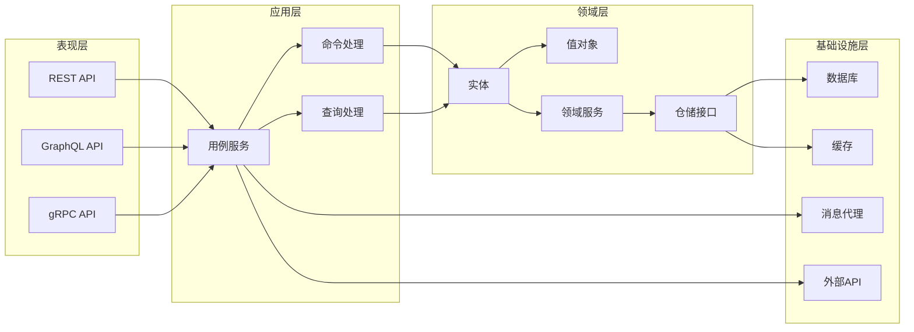
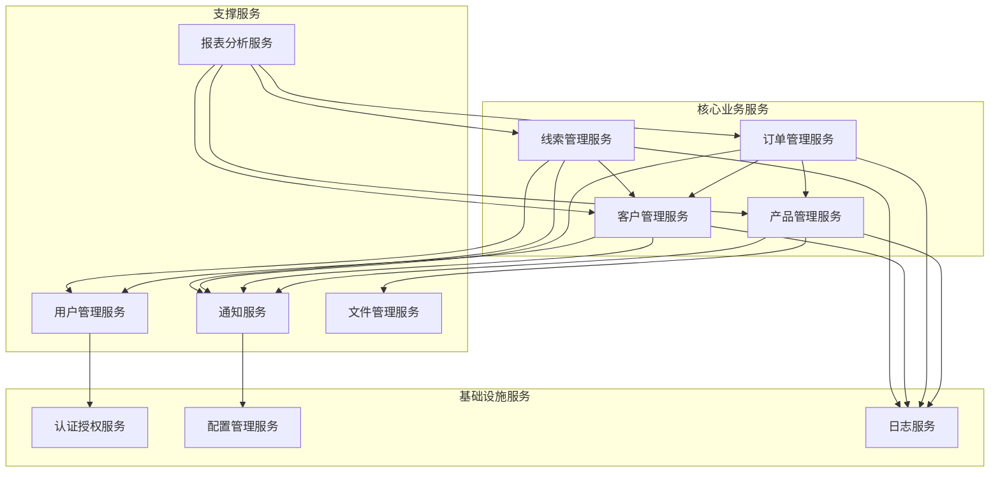

# 服务拆分边界设计方案

## 📋 概述

本文档详细阐述了罗莱L2C销售管理系统的模块化架构拆分边界设计方案，基于领域驱动设计（DDD）原则，明确各个模块的职责边界、数据边界和交互方式，确保系统的高内聚、低耦合。

---

## 🎯 设计目标与价值

### 1. 核心目标
- **业务边界清晰**：基于业务领域划分服务边界
- **数据自治**：每个服务拥有独立的数据存储
- **技术独立**：支持不同技术栈的选择
- **团队自治**：支持独立开发和部署
- **扩展灵活**：支持按需扩展特定服务

### 2. 业务价值
- **开发效率提升**：团队可以并行开发不同服务
- **系统可靠性增强**：服务故障隔离，避免级联失败
- **技术演进支持**：支持渐进式技术升级
- **业务敏捷性**：快速响应业务变化需求

---

## 🏗️ 服务拆分架构

### 1. 整体架构图



### 2. 服务分层架构



---

## 🎯 核心业务服务设计

### 1. 线索管理服务 (Lead Management Service)

#### 服务边界定义
```typescript
// 线索管理服务边界定义
// src/services/lead-management/domain/boundaries/lead-service.boundary.ts

export interface LeadServiceBoundary {
  // 核心职责
  responsibilities: {
    leadLifecycleManagement: string;    // 线索生命周期管理
    leadAssignment: string;             // 线索分配
    leadConversion: string;             // 线索转化
    leadScoring: string;                // 线索评分
    leadNurturing: string;              // 线索培育
  };

  // 数据边界
  dataOwnership: {
    entities: ['Lead', 'LeadActivity', 'LeadScore', 'LeadAssignment'];
    aggregates: ['LeadAggregate'];
    valueObjects: ['LeadPriority', 'LeadSource', 'LeadStatus'];
  };

  // 业务能力
  capabilities: {
    createLead: LeadCreationCapability;
    assignLead: LeadAssignmentCapability;
    updateLeadStatus: LeadStatusUpdateCapability;
    convertLead: LeadConversionCapability;
    scoreLead: LeadScoringCapability;
  };

  // 外部依赖
  dependencies: {
    customerService: CustomerServiceContract;
    userService: UserServiceContract;
    notificationService: NotificationServiceContract;
  };

  // 发布的事件
  publishedEvents: [
    'LeadCreated',
    'LeadAssigned',
    'LeadStatusChanged',
    'LeadConverted',
    'LeadScoreUpdated'
  ];

  // 订阅的事件
  subscribedEvents: [
    'CustomerCreated',
    'UserAssigned',
    'OrderCreated'
  ];
}

// 线索聚合根
export class LeadAggregate {
  private constructor(
    private readonly id: LeadId,
    private readonly customerId: CustomerId,
    private status: LeadStatus,
    private priority: LeadPriority,
    private source: LeadSource,
    private estimatedValue: Money,
    private assignedTo: UserId,
    private activities: LeadActivity[],
    private score: LeadScore,
    private createdAt: Date,
    private updatedAt: Date
  ) {}

  // 创建线索
  public static create(
    customerId: CustomerId,
    priority: LeadPriority,
    source: LeadSource,
    estimatedValue: Money,
    assignedTo: UserId,
    createdBy: UserId
  ): LeadAggregate {
    const leadId = LeadId.generate();
    const lead = new LeadAggregate(
      leadId,
      customerId,
      LeadStatus.NEW,
      priority,
      source,
      estimatedValue,
      assignedTo,
      [],
      LeadScore.initial(),
      new Date(),
      new Date()
    );

    // 发布领域事件
    lead.addDomainEvent(new LeadCreatedEvent(
      leadId,
      customerId,
      priority,
      source,
      estimatedValue,
      assignedTo,
      createdBy
    ));

    return lead;
  }

  // 分配线索
  public assign(newAssignee: UserId, assignedBy: UserId, reason?: string): void {
    if (this.assignedTo.equals(newAssignee)) {
      throw new DomainError('线索已分配给该用户');
    }

    const oldAssignee = this.assignedTo;
    this.assignedTo = newAssignee;
    this.updatedAt = new Date();

    // 记录活动
    this.activities.push(LeadActivity.createAssignment(
      this.id,
      oldAssignee,
      newAssignee,
      assignedBy,
      reason
    ));

    // 发布领域事件
    this.addDomainEvent(new LeadAssignedEvent(
      this.id,
      oldAssignee,
      newAssignee,
      assignedBy,
      reason
    ));
  }

  // 更新状态
  public updateStatus(newStatus: LeadStatus, updatedBy: UserId, notes?: string): void {
    if (this.status.equals(newStatus)) {
      return;
    }

    // 验证状态转换
    if (!this.status.canTransitionTo(newStatus)) {
      throw new DomainError(`无法从${this.status.value}转换到${newStatus.value}`);
    }

    const oldStatus = this.status;
    this.status = newStatus;
    this.updatedAt = new Date();

    // 记录活动
    this.activities.push(LeadActivity.createStatusChange(
      this.id,
      oldStatus,
      newStatus,
      updatedBy,
      notes
    ));

    // 发布领域事件
    this.addDomainEvent(new LeadStatusChangedEvent(
      this.id,
      oldStatus,
      newStatus,
      updatedBy,
      notes
    ));
  }

  // 转化线索
  public convert(orderId: OrderId, convertedBy: UserId): void {
    if (!this.status.canConvert()) {
      throw new DomainError('当前状态不允许转化');
    }

    this.status = LeadStatus.CONVERTED;
    this.updatedAt = new Date();

    // 记录活动
    this.activities.push(LeadActivity.createConversion(
      this.id,
      orderId,
      convertedBy
    ));

    // 发布领域事件
    this.addDomainEvent(new LeadConvertedEvent(
      this.id,
      this.customerId,
      orderId,
      this.estimatedValue,
      convertedBy
    ));
  }

  // 更新评分
  public updateScore(newScore: LeadScore, scoredBy: UserId): void {
    const oldScore = this.score;
    this.score = newScore;
    this.updatedAt = new Date();

    // 记录活动
    this.activities.push(LeadActivity.createScoreUpdate(
      this.id,
      oldScore,
      newScore,
      scoredBy
    ));

    // 发布领域事件
    this.addDomainEvent(new LeadScoreUpdatedEvent(
      this.id,
      oldScore,
      newScore,
      scoredBy
    ));
  }

  // 获取器方法
  public getId(): LeadId { return this.id; }
  public getCustomerId(): CustomerId { return this.customerId; }
  public getStatus(): LeadStatus { return this.status; }
  public getPriority(): LeadPriority { return this.priority; }
  public getSource(): LeadSource { return this.source; }
  public getEstimatedValue(): Money { return this.estimatedValue; }
  public getAssignedTo(): UserId { return this.assignedTo; }
  public getActivities(): LeadActivity[] { return [...this.activities]; }
  public getScore(): LeadScore { return this.score; }
  public getCreatedAt(): Date { return this.createdAt; }
  public getUpdatedAt(): Date { return this.updatedAt; }
}
```

#### 数据模型设计
```sql
-- 线索管理服务数据模型
-- database/lead-service/schema.sql

-- 线索表
CREATE TABLE leads (
    id UUID PRIMARY KEY DEFAULT gen_random_uuid(),
    customer_id UUID NOT NULL,
    status VARCHAR(20) NOT NULL DEFAULT 'NEW',
    priority VARCHAR(10) NOT NULL,
    source VARCHAR(50) NOT NULL,
    estimated_value DECIMAL(15,2),
    assigned_to UUID,
    score INTEGER DEFAULT 0,
    score_factors JSONB,
    tags TEXT[],
    notes TEXT,
    created_by UUID NOT NULL,
    created_at TIMESTAMP WITH TIME ZONE DEFAULT CURRENT_TIMESTAMP,
    updated_at TIMESTAMP WITH TIME ZONE DEFAULT CURRENT_TIMESTAMP,
    
    CONSTRAINT chk_status CHECK (status IN ('NEW', 'CONTACTED', 'QUALIFIED', 'PROPOSAL', 'NEGOTIATION', 'CONVERTED', 'LOST')),
    CONSTRAINT chk_priority CHECK (priority IN ('LOW', 'MEDIUM', 'HIGH', 'URGENT')),
    CONSTRAINT chk_score CHECK (score >= 0 AND score <= 100)
);

-- 线索活动表
CREATE TABLE lead_activities (
    id UUID PRIMARY KEY DEFAULT gen_random_uuid(),
    lead_id UUID NOT NULL REFERENCES leads(id) ON DELETE CASCADE,
    activity_type VARCHAR(30) NOT NULL,
    description TEXT,
    metadata JSONB,
    performed_by UUID NOT NULL,
    performed_at TIMESTAMP WITH TIME ZONE DEFAULT CURRENT_TIMESTAMP,
    
    CONSTRAINT chk_activity_type CHECK (activity_type IN (
        'CREATED', 'ASSIGNED', 'STATUS_CHANGED', 'SCORE_UPDATED', 
        'CONVERTED', 'NOTE_ADDED', 'EMAIL_SENT', 'CALL_MADE', 'MEETING_SCHEDULED'
    ))
);

-- 线索评分规则表
CREATE TABLE lead_scoring_rules (
    id UUID PRIMARY KEY DEFAULT gen_random_uuid(),
    name VARCHAR(100) NOT NULL,
    description TEXT,
    condition_expression TEXT NOT NULL,
    score_impact INTEGER NOT NULL,
    weight DECIMAL(3,2) DEFAULT 1.0,
    is_active BOOLEAN DEFAULT true,
    created_at TIMESTAMP WITH TIME ZONE DEFAULT CURRENT_TIMESTAMP,
    updated_at TIMESTAMP WITH TIME ZONE DEFAULT CURRENT_TIMESTAMP,
    
    CONSTRAINT chk_score_impact CHECK (score_impact BETWEEN -50 AND 50),
    CONSTRAINT chk_weight CHECK (weight BETWEEN 0.1 AND 2.0)
);

-- 线索分配规则表
CREATE TABLE lead_assignment_rules (
    id UUID PRIMARY KEY DEFAULT gen_random_uuid(),
    name VARCHAR(100) NOT NULL,
    description TEXT,
    condition_expression TEXT NOT NULL,
    assignment_strategy VARCHAR(20) NOT NULL,
    target_users UUID[],
    priority INTEGER DEFAULT 0,
    is_active BOOLEAN DEFAULT true,
    created_at TIMESTAMP WITH TIME ZONE DEFAULT CURRENT_TIMESTAMP,
    updated_at TIMESTAMP WITH TIME ZONE DEFAULT CURRENT_TIMESTAMP,
    
    CONSTRAINT chk_assignment_strategy CHECK (assignment_strategy IN ('ROUND_ROBIN', 'LOAD_BALANCED', 'SKILL_BASED', 'MANUAL'))
);

-- 索引
CREATE INDEX idx_leads_customer_id ON leads(customer_id);
CREATE INDEX idx_leads_assigned_to ON leads(assigned_to);
CREATE INDEX idx_leads_status ON leads(status);
CREATE INDEX idx_leads_priority ON leads(priority);
CREATE INDEX idx_leads_source ON leads(source);
CREATE INDEX idx_leads_created_at ON leads(created_at);
CREATE INDEX idx_leads_score ON leads(score);

CREATE INDEX idx_lead_activities_lead_id ON lead_activities(lead_id);
CREATE INDEX idx_lead_activities_type ON lead_activities(activity_type);
CREATE INDEX idx_lead_activities_performed_at ON lead_activities(performed_at);

-- 触发器：更新时间戳
CREATE OR REPLACE FUNCTION update_updated_at_column()
RETURNS TRIGGER AS $$
BEGIN
    NEW.updated_at = CURRENT_TIMESTAMP;
    RETURN NEW;
END;
$$ language 'plpgsql';

CREATE TRIGGER update_leads_updated_at BEFORE UPDATE ON leads
    FOR EACH ROW EXECUTE FUNCTION update_updated_at_column();

CREATE TRIGGER update_lead_scoring_rules_updated_at BEFORE UPDATE ON lead_scoring_rules
    FOR EACH ROW EXECUTE FUNCTION update_updated_at_column();

CREATE TRIGGER update_lead_assignment_rules_updated_at BEFORE UPDATE ON lead_assignment_rules
    FOR EACH ROW EXECUTE FUNCTION update_updated_at_column();
```

### 2. 客户管理服务 (Customer Management Service)

#### 服务边界定义
```typescript
// 客户管理服务边界定义
// src/services/customer-management/domain/boundaries/customer-service.boundary.ts

export interface CustomerServiceBoundary {
  // 核心职责
  responsibilities: {
    customerLifecycleManagement: string;    // 客户生命周期管理
    customerSegmentation: string;           // 客户分群
    customerProfileManagement: string;      // 客户档案管理
    customerRelationshipTracking: string;   // 客户关系跟踪
  };

  // 数据边界
  dataOwnership: {
    entities: ['Customer', 'CustomerProfile', 'CustomerSegment', 'CustomerContact'];
    aggregates: ['CustomerAggregate'];
    valueObjects: ['CustomerType', 'CustomerStatus', 'ContactInfo'];
  };

  // 业务能力
  capabilities: {
    createCustomer: CustomerCreationCapability;
    updateCustomerProfile: CustomerProfileUpdateCapability;
    segmentCustomers: CustomerSegmentationCapability;
    trackCustomerInteractions: CustomerInteractionTrackingCapability;
  };

  // 外部依赖
  dependencies: {
    userService: UserServiceContract;
    notificationService: NotificationServiceContract;
    crmIntegration: CRMIntegrationContract;
  };

  // 发布的事件
  publishedEvents: [
    'CustomerCreated',
    'CustomerUpdated',
    'CustomerSegmentChanged',
    'CustomerStatusChanged'
  ];

  // 订阅的事件
  subscribedEvents: [
    'LeadConverted',
    'OrderCreated',
    'OrderCompleted'
  ];
}

// 客户聚合根
export class CustomerAggregate {
  private constructor(
    private readonly id: CustomerId,
    private profile: CustomerProfile,
    private status: CustomerStatus,
    private type: CustomerType,
    private segments: CustomerSegment[],
    private contacts: CustomerContact[],
    private preferences: CustomerPreferences,
    private createdAt: Date,
    private updatedAt: Date
  ) {}

  // 创建客户
  public static create(
    name: string,
    email: string,
    phone: string,
    company?: string,
    createdBy: UserId
  ): CustomerAggregate {
    const customerId = CustomerId.generate();
    const profile = CustomerProfile.create(name, email, phone, company);
    
    const customer = new CustomerAggregate(
      customerId,
      profile,
      CustomerStatus.ACTIVE,
      CustomerType.PROSPECT,
      [],
      [],
      CustomerPreferences.default(),
      new Date(),
      new Date()
    );

    // 发布领域事件
    customer.addDomainEvent(new CustomerCreatedEvent(
      customerId,
      profile,
      createdBy
    ));

    return customer;
  }

  // 更新客户档案
  public updateProfile(
    updates: Partial<CustomerProfileData>,
    updatedBy: UserId
  ): void {
    const oldProfile = this.profile;
    this.profile = this.profile.update(updates);
    this.updatedAt = new Date();

    // 发布领域事件
    this.addDomainEvent(new CustomerUpdatedEvent(
      this.id,
      oldProfile,
      this.profile,
      updatedBy
    ));
  }

  // 更新客户状态
  public updateStatus(newStatus: CustomerStatus, updatedBy: UserId): void {
    if (this.status.equals(newStatus)) {
      return;
    }

    const oldStatus = this.status;
    this.status = newStatus;
    this.updatedAt = new Date();

    // 发布领域事件
    this.addDomainEvent(new CustomerStatusChangedEvent(
      this.id,
      oldStatus,
      newStatus,
      updatedBy
    ));
  }

  // 添加客户分群
  public addToSegment(segment: CustomerSegment, addedBy: UserId): void {
    if (this.segments.some(s => s.equals(segment))) {
      return;
    }

    this.segments.push(segment);
    this.updatedAt = new Date();

    // 发布领域事件
    this.addDomainEvent(new CustomerSegmentChangedEvent(
      this.id,
      'ADDED',
      segment,
      addedBy
    ));
  }

  // 移除客户分群
  public removeFromSegment(segment: CustomerSegment, removedBy: UserId): void {
    const index = this.segments.findIndex(s => s.equals(segment));
    if (index === -1) {
      return;
    }

    this.segments.splice(index, 1);
    this.updatedAt = new Date();

    // 发布领域事件
    this.addDomainEvent(new CustomerSegmentChangedEvent(
      this.id,
      'REMOVED',
      segment,
      removedBy
    ));
  }

  // 添加联系方式
  public addContact(contact: CustomerContact, addedBy: UserId): void {
    this.contacts.push(contact);
    this.updatedAt = new Date();

    // 发布领域事件
    this.addDomainEvent(new CustomerContactAddedEvent(
      this.id,
      contact,
      addedBy
    ));
  }

  // 获取器方法
  public getId(): CustomerId { return this.id; }
  public getProfile(): CustomerProfile { return this.profile; }
  public getStatus(): CustomerStatus { return this.status; }
  public getType(): CustomerType { return this.type; }
  public getSegments(): CustomerSegment[] { return [...this.segments]; }
  public getContacts(): CustomerContact[] { return [...this.contacts]; }
  public getPreferences(): CustomerPreferences { return this.preferences; }
  public getCreatedAt(): Date { return this.createdAt; }
  public getUpdatedAt(): Date { return this.updatedAt; }
}
```

### 3. 订单管理服务 (Order Management Service)

#### 服务边界定义
```typescript
// 订单管理服务边界定义
// src/services/order-management/domain/boundaries/order-service.boundary.ts

export interface OrderServiceBoundary {
  // 核心职责
  responsibilities: {
    orderLifecycleManagement: string;       // 订单生命周期管理
    orderFulfillment: string;               // 订单履行
    paymentProcessing: string;              // 支付处理
    inventoryReservation: string;           // 库存预留
    shippingManagement: string;             // 配送管理
  };

  // 数据边界
  dataOwnership: {
    entities: ['Order', 'OrderItem', 'Payment', 'Shipment', 'Invoice'];
    aggregates: ['OrderAggregate'];
    valueObjects: ['OrderStatus', 'PaymentStatus', 'ShippingAddress', 'Money'];
  };

  // 业务能力
  capabilities: {
    createOrder: OrderCreationCapability;
    processPayment: PaymentProcessingCapability;
    fulfillOrder: OrderFulfillmentCapability;
    shipOrder: OrderShippingCapability;
    cancelOrder: OrderCancellationCapability;
  };

  // 外部依赖
  dependencies: {
    customerService: CustomerServiceContract;
    productService: ProductServiceContract;
    paymentService: PaymentServiceContract;
    shippingService: ShippingServiceContract;
    inventoryService: InventoryServiceContract;
  };

  // 发布的事件
  publishedEvents: [
    'OrderCreated',
    'OrderPaid',
    'OrderShipped',
    'OrderDelivered',
    'OrderCancelled'
  ];

  // 订阅的事件
  subscribedEvents: [
    'PaymentCompleted',
    'PaymentFailed',
    'InventoryReserved',
    'ShipmentCreated'
  ];
}

// 订单聚合根
export class OrderAggregate {
  private constructor(
    private readonly id: OrderId,
    private readonly customerId: CustomerId,
    private readonly leadId: LeadId,
    private items: OrderItem[],
    private status: OrderStatus,
    private totalAmount: Money,
    private discountAmount: Money,
    private taxAmount: Money,
    private finalAmount: Money,
    private shippingAddress: ShippingAddress,
    private billingAddress: BillingAddress,
    private payments: Payment[],
    private shipments: Shipment[],
    private createdAt: Date,
    private updatedAt: Date
  ) {}

  // 创建订单
  public static create(
    customerId: CustomerId,
    leadId: LeadId,
    items: OrderItemData[],
    shippingAddress: ShippingAddress,
    billingAddress: BillingAddress,
    createdBy: UserId
  ): OrderAggregate {
    const orderId = OrderId.generate();
    const orderItems = items.map(item => OrderItem.create(
      item.productId,
      item.quantity,
      item.unitPrice,
      item.discount
    ));

    // 计算金额
    const totalAmount = orderItems.reduce((sum, item) => sum.add(item.getSubtotal()), Money.zero());
    const discountAmount = orderItems.reduce((sum, item) => sum.add(item.getDiscount()), Money.zero());
    const taxAmount = totalAmount.multiply(0.1); // 假设税率10%
    const finalAmount = totalAmount.subtract(discountAmount).add(taxAmount);

    const order = new OrderAggregate(
      orderId,
      customerId,
      leadId,
      orderItems,
      OrderStatus.PENDING,
      totalAmount,
      discountAmount,
      taxAmount,
      finalAmount,
      shippingAddress,
      billingAddress,
      [],
      [],
      new Date(),
      new Date()
    );

    // 发布领域事件
    order.addDomainEvent(new OrderCreatedEvent(
      orderId,
      customerId,
      leadId,
      orderItems,
      finalAmount,
      createdBy
    ));

    return order;
  }

  // 添加订单项
  public addItem(
    productId: ProductId,
    quantity: number,
    unitPrice: Money,
    discount: Money = Money.zero(),
    addedBy: UserId
  ): void {
    const existingItem = this.items.find(item => item.getProductId().equals(productId));
    
    if (existingItem) {
      existingItem.updateQuantity(existingItem.getQuantity() + quantity);
    } else {
      const newItem = OrderItem.create(productId, quantity, unitPrice, discount);
      this.items.push(newItem);
    }

    this.recalculateAmounts();
    this.updatedAt = new Date();

    // 发布领域事件
    this.addDomainEvent(new OrderItemAddedEvent(
      this.id,
      productId,
      quantity,
      unitPrice,
      addedBy
    ));
  }

  // 移除订单项
  public removeItem(productId: ProductId, removedBy: UserId): void {
    const index = this.items.findIndex(item => item.getProductId().equals(productId));
    if (index === -1) {
      throw new DomainError('订单项不存在');
    }

    const removedItem = this.items.splice(index, 1)[0];
    this.recalculateAmounts();
    this.updatedAt = new Date();

    // 发布领域事件
    this.addDomainEvent(new OrderItemRemovedEvent(
      this.id,
      productId,
      removedItem.getQuantity(),
      removedBy
    ));
  }

  // 处理支付
  public processPayment(
    paymentMethod: PaymentMethod,
    amount: Money,
    processedBy: UserId
  ): void {
    if (!this.status.canProcessPayment()) {
      throw new DomainError('当前状态不允许处理支付');
    }

    const payment = Payment.create(
      this.id,
      paymentMethod,
      amount,
      processedBy
    );

    this.payments.push(payment);
    
    // 检查是否已全额支付
    const totalPaid = this.payments
      .filter(p => p.getStatus().isPaid())
      .reduce((sum, p) => sum.add(p.getAmount()), Money.zero());

    if (totalPaid.greaterThanOrEqual(this.finalAmount)) {
      this.status = OrderStatus.PAID;
      
      // 发布支付完成事件
      this.addDomainEvent(new OrderPaidEvent(
        this.id,
        this.customerId,
        this.finalAmount,
        processedBy
      ));
    }

    this.updatedAt = new Date();
  }

  // 发货
  public ship(
    trackingNumber: string,
    carrier: string,
    shippedBy: UserId
  ): void {
    if (!this.status.canShip()) {
      throw new DomainError('当前状态不允许发货');
    }

    const shipment = Shipment.create(
      this.id,
      trackingNumber,
      carrier,
      this.shippingAddress,
      shippedBy
    );

    this.shipments.push(shipment);
    this.status = OrderStatus.SHIPPED;
    this.updatedAt = new Date();

    // 发布发货事件
    this.addDomainEvent(new OrderShippedEvent(
      this.id,
      this.customerId,
      trackingNumber,
      carrier,
      shippedBy
    ));
  }

  // 取消订单
  public cancel(reason: string, cancelledBy: UserId): void {
    if (!this.status.canCancel()) {
      throw new DomainError('当前状态不允许取消');
    }

    this.status = OrderStatus.CANCELLED;
    this.updatedAt = new Date();

    // 发布取消事件
    this.addDomainEvent(new OrderCancelledEvent(
      this.id,
      this.customerId,
      reason,
      cancelledBy
    ));
  }

  // 重新计算金额
  private recalculateAmounts(): void {
    this.totalAmount = this.items.reduce((sum, item) => sum.add(item.getSubtotal()), Money.zero());
    this.discountAmount = this.items.reduce((sum, item) => sum.add(item.getDiscount()), Money.zero());
    this.taxAmount = this.totalAmount.multiply(0.1);
    this.finalAmount = this.totalAmount.subtract(this.discountAmount).add(this.taxAmount);
  }

  // 获取器方法
  public getId(): OrderId { return this.id; }
  public getCustomerId(): CustomerId { return this.customerId; }
  public getLeadId(): LeadId { return this.leadId; }
  public getItems(): OrderItem[] { return [...this.items]; }
  public getStatus(): OrderStatus { return this.status; }
  public getTotalAmount(): Money { return this.totalAmount; }
  public getDiscountAmount(): Money { return this.discountAmount; }
  public getTaxAmount(): Money { return this.taxAmount; }
  public getFinalAmount(): Money { return this.finalAmount; }
  public getShippingAddress(): ShippingAddress { return this.shippingAddress; }
  public getBillingAddress(): BillingAddress { return this.billingAddress; }
  public getPayments(): Payment[] { return [...this.payments]; }
  public getShipments(): Shipment[] { return [...this.shipments]; }
  public getCreatedAt(): Date { return this.createdAt; }
  public getUpdatedAt(): Date { return this.updatedAt; }
}
```

### 4. 产品管理服务 (Product Management Service)

#### 服务边界定义
```typescript
// 产品管理服务边界定义
// src/services/product-management/domain/boundaries/product-service.boundary.ts

export interface ProductServiceBoundary {
  // 核心职责
  responsibilities: {
    productCatalogManagement: string;       // 产品目录管理
    pricingManagement: string;              // 定价管理
    inventoryTracking: string;              // 库存跟踪
    productVariantManagement: string;       // 产品变体管理
  };

  // 数据边界
  dataOwnership: {
    entities: ['Product', 'ProductVariant', 'ProductCategory', 'PriceRule', 'Inventory'];
    aggregates: ['ProductAggregate', 'ProductCategoryAggregate'];
    valueObjects: ['ProductStatus', 'Price', 'SKU', 'ProductSpecification'];
  };

  // 业务能力
  capabilities: {
    createProduct: ProductCreationCapability;
    updateProductInfo: ProductUpdateCapability;
    managePricing: PricingManagementCapability;
    trackInventory: InventoryTrackingCapability;
    categorizeProducts: ProductCategorizationCapability;
  };

  // 外部依赖
  dependencies: {
    fileService: FileServiceContract;
    notificationService: NotificationServiceContract;
    supplierIntegration: SupplierIntegrationContract;
  };

  // 发布的事件
  publishedEvents: [
    'ProductCreated',
    'ProductUpdated',
    'ProductPriceChanged',
    'InventoryUpdated',
    'ProductDiscontinued'
  ];

  // 订阅的事件
  subscribedEvents: [
    'OrderCreated',
    'OrderCancelled',
    'SupplierInventoryUpdated'
  ];
}
```

---

## 🔗 服务间依赖关系

### 1. 依赖关系图



### 2. 服务契约定义

```typescript
// 服务间契约定义
// src/shared/contracts/service-contracts.ts

// 客户服务契约
export interface CustomerServiceContract {
  // 查询客户信息
  getCustomer(customerId: CustomerId): Promise<CustomerDto | null>;
  
  // 验证客户存在
  customerExists(customerId: CustomerId): Promise<boolean>;
  
  // 获取客户基本信息
  getCustomerBasicInfo(customerId: CustomerId): Promise<CustomerBasicInfoDto>;
  
  // 批量获取客户信息
  getCustomersBatch(customerIds: CustomerId[]): Promise<CustomerDto[]>;
}

// 用户服务契约
export interface UserServiceContract {
  // 获取用户信息
  getUser(userId: UserId): Promise<UserDto | null>;
  
  // 验证用户存在
  userExists(userId: UserId): Promise<boolean>;
  
  // 获取用户基本信息
  getUserBasicInfo(userId: UserId): Promise<UserBasicInfoDto>;
  
  // 获取用户权限
  getUserPermissions(userId: UserId): Promise<string[]>;
}

// 产品服务契约
export interface ProductServiceContract {
  // 获取产品信息
  getProduct(productId: ProductId): Promise<ProductDto | null>;
  
  // 验证产品存在
  productExists(productId: ProductId): Promise<boolean>;
  
  // 获取产品价格
  getProductPrice(productId: ProductId, quantity: number): Promise<PriceDto>;
  
  // 检查库存
  checkInventory(productId: ProductId, quantity: number): Promise<boolean>;
  
  // 预留库存
  reserveInventory(productId: ProductId, quantity: number, orderId: OrderId): Promise<void>;
}

// 通知服务契约
export interface NotificationServiceContract {
  // 发送邮件通知
  sendEmail(to: string, subject: string, content: string, templateId?: string): Promise<void>;
  
  // 发送短信通知
  sendSMS(to: string, message: string): Promise<void>;
  
  // 发送推送通知
  sendPushNotification(userId: UserId, title: string, message: string): Promise<void>;
  
  // 发送系统通知
  sendSystemNotification(userId: UserId, type: string, data: any): Promise<void>;
}

// 支付服务契约
export interface PaymentServiceContract {
  // 创建支付
  createPayment(orderId: OrderId, amount: Money, method: PaymentMethod): Promise<PaymentDto>;
  
  // 处理支付
  processPayment(paymentId: PaymentId): Promise<PaymentResultDto>;
  
  // 退款
  refundPayment(paymentId: PaymentId, amount: Money, reason: string): Promise<RefundDto>;
  
  // 查询支付状态
  getPaymentStatus(paymentId: PaymentId): Promise<PaymentStatusDto>;
}
```

---

## 📊 数据一致性策略

### 1. 数据一致性模式

```typescript
// 数据一致性策略
// src/shared/consistency/consistency-patterns.ts

// 最终一致性模式
export class EventualConsistencyPattern {
  constructor(
    private readonly eventBus: EventBus,
    private readonly retryPolicy: RetryPolicy
  ) {}

  // 发布领域事件
  async publishDomainEvent(event: DomainEvent): Promise<void> {
    try {
      await this.eventBus.publish(event);
    } catch (error) {
      // 重试机制
      await this.retryPolicy.execute(() => this.eventBus.publish(event));
    }
  }

  // 处理事件失败的补偿机制
  async handleEventFailure(event: DomainEvent, error: Error): Promise<void> {
    // 记录失败事件
    await this.logFailedEvent(event, error);
    
    // 触发补偿流程
    await this.triggerCompensation(event);
  }

  private async logFailedEvent(event: DomainEvent, error: Error): Promise<void> {
    // 记录到失败事件表
    await this.failedEventRepository.save({
      eventId: event.id,
      eventType: event.type,
      eventData: event.data,
      error: error.message,
      timestamp: new Date(),
      retryCount: 0
    });
  }

  private async triggerCompensation(event: DomainEvent): Promise<void> {
    // 根据事件类型触发相应的补偿操作
    const compensationEvent = this.createCompensationEvent(event);
    await this.eventBus.publish(compensationEvent);
  }
}

// Saga模式实现
export class SagaPattern {
  constructor(
    private readonly sagaRepository: SagaRepository,
    private readonly eventBus: EventBus
  ) {}

  // 开始Saga
  async startSaga(sagaType: string, data: any): Promise<SagaId> {
    const saga = Saga.create(sagaType, data);
    await this.sagaRepository.save(saga);
    
    // 执行第一步
    await this.executeNextStep(saga);
    
    return saga.getId();
  }

  // 执行下一步
  async executeNextStep(saga: Saga): Promise<void> {
    const nextStep = saga.getNextStep();
    if (!nextStep) {
      // Saga完成
      saga.complete();
      await this.sagaRepository.save(saga);
      return;
    }

    try {
      // 执行步骤
      await this.executeStep(nextStep);
      saga.markStepCompleted(nextStep.id);
      await this.sagaRepository.save(saga);
      
      // 继续下一步
      await this.executeNextStep(saga);
    } catch (error) {
      // 步骤失败，开始补偿
      await this.startCompensation(saga, nextStep);
    }
  }

  // 开始补偿
  async startCompensation(saga: Saga, failedStep: SagaStep): Promise<void> {
    saga.markFailed(failedStep.id);
    
    // 执行补偿操作
    const completedSteps = saga.getCompletedSteps().reverse();
    for (const step of completedSteps) {
      await this.compensateStep(step);
    }
    
    saga.markCompensated();
    await this.sagaRepository.save(saga);
  }

  private async executeStep(step: SagaStep): Promise<void> {
    const command = step.createCommand();
    await this.eventBus.publish(command);
  }

  private async compensateStep(step: SagaStep): Promise<void> {
    const compensationCommand = step.createCompensationCommand();
    await this.eventBus.publish(compensationCommand);
  }
}
```

### 2. 分布式事务处理

```typescript
// 分布式事务处理
// src/shared/transactions/distributed-transaction.ts

// 订单创建Saga
export class OrderCreationSaga extends Saga {
  constructor(
    private readonly orderService: OrderServiceContract,
    private readonly customerService: CustomerServiceContract,
    private readonly productService: ProductServiceContract,
    private readonly paymentService: PaymentServiceContract,
    private readonly inventoryService: InventoryServiceContract
  ) {
    super('OrderCreation');
  }

  // 定义Saga步骤
  protected defineSteps(): SagaStep[] {
    return [
      new ValidateCustomerStep(this.customerService),
      new ValidateProductsStep(this.productService),
      new ReserveInventoryStep(this.inventoryService),
      new CreateOrderStep(this.orderService),
      new ProcessPaymentStep(this.paymentService),
      new ConfirmOrderStep(this.orderService)
    ];
  }
}

// 验证客户步骤
export class ValidateCustomerStep extends SagaStep {
  constructor(private readonly customerService: CustomerServiceContract) {
    super('ValidateCustomer');
  }

  async execute(data: OrderCreationData): Promise<void> {
    const customerExists = await this.customerService.customerExists(data.customerId);
    if (!customerExists) {
      throw new SagaStepError('客户不存在');
    }
  }

  async compensate(data: OrderCreationData): Promise<void> {
    // 验证步骤无需补偿
  }
}

// 预留库存步骤
export class ReserveInventoryStep extends SagaStep {
  constructor(private readonly inventoryService: InventoryServiceContract) {
    super('ReserveInventory');
  }

  async execute(data: OrderCreationData): Promise<void> {
    for (const item of data.items) {
      await this.inventoryService.reserveInventory(
        item.productId,
        item.quantity,
        data.orderId
      );
    }
  }

  async compensate(data: OrderCreationData): Promise<void> {
    // 释放预留的库存
    for (const item of data.items) {
      await this.inventoryService.releaseReservation(
        item.productId,
        item.quantity,
        data.orderId
      );
    }
  }
}

// 处理支付步骤
export class ProcessPaymentStep extends SagaStep {
  constructor(private readonly paymentService: PaymentServiceContract) {
    super('ProcessPayment');
  }

  async execute(data: OrderCreationData): Promise<void> {
    const payment = await this.paymentService.createPayment(
      data.orderId,
      data.totalAmount,
      data.paymentMethod
    );

    const result = await this.paymentService.processPayment(payment.id);
    if (!result.success) {
      throw new SagaStepError('支付处理失败');
    }

    // 保存支付ID用于补偿
    data.paymentId = payment.id;
  }

  async compensate(data: OrderCreationData): Promise<void> {
    if (data.paymentId) {
      // 退款
      await this.paymentService.refundPayment(
        data.paymentId,
        data.totalAmount,
        '订单创建失败'
      );
    }
  }
}
```

---

## 🔄 服务通信模式

### 1. 同步通信

```typescript
// 同步通信实现
// src/shared/communication/sync-communication.ts

// HTTP客户端
export class HttpServiceClient {
  constructor(
    private readonly httpClient: HttpClient,
    private readonly circuitBreaker: CircuitBreaker,
    private readonly retryPolicy: RetryPolicy
  ) {}

  async get<T>(url: string, headers?: Record<string, string>): Promise<T> {
    return this.circuitBreaker.execute(async () => {
      return this.retryPolicy.execute(async () => {
        const response = await this.httpClient.get(url, { headers });
        return response.data;
      });
    });
  }

  async post<T>(url: string, data: any, headers?: Record<string, string>): Promise<T> {
    return this.circuitBreaker.execute(async () => {
      return this.retryPolicy.execute(async () => {
        const response = await this.httpClient.post(url, data, { headers });
        return response.data;
      });
    });
  }
}

// gRPC客户端
export class GrpcServiceClient {
  constructor(
    private readonly client: GrpcClient,
    private readonly loadBalancer: LoadBalancer
  ) {}

  async call<TRequest, TResponse>(
    method: string,
    request: TRequest
  ): Promise<TResponse> {
    const endpoint = await this.loadBalancer.getEndpoint();
    return this.client.call(endpoint, method, request);
  }
}
```

### 2. 异步通信

```typescript
// 异步通信实现
// src/shared/communication/async-communication.ts

// 事件发布器
export class EventPublisher {
  constructor(
    private readonly messageBroker: MessageBroker,
    private readonly eventStore: EventStore
  ) {}

  async publishDomainEvent(event: DomainEvent): Promise<void> {
    // 保存事件到事件存储
    await this.eventStore.save(event);
    
    // 发布到消息代理
    await this.messageBroker.publish(event.type, event);
  }

  async publishIntegrationEvent(event: IntegrationEvent): Promise<void> {
    await this.messageBroker.publish(event.type, event);
  }
}

// 事件订阅器
export class EventSubscriber {
  constructor(
    private readonly messageBroker: MessageBroker,
    private readonly eventHandlers: Map<string, EventHandler[]>
  ) {}

  async subscribe(eventType: string, handler: EventHandler): Promise<void> {
    if (!this.eventHandlers.has(eventType)) {
      this.eventHandlers.set(eventType, []);
    }
    
    this.eventHandlers.get(eventType)!.push(handler);
    
    await this.messageBroker.subscribe(eventType, async (event) => {
      const handlers = this.eventHandlers.get(eventType) || [];
      
      // 并行处理所有处理器
      await Promise.all(handlers.map(h => h.handle(event)));
    });
  }
}
```

---

## 📊 总结

这个微服务拆分边界设计方案基于领域驱动设计原则，为罗莱L2C销售管理系统提供了清晰的服务边界定义，具有以下核心优势：

### 🎯 设计优势
- **业务边界清晰**：基于业务领域和聚合根划分服务边界
- **数据自治**：每个服务拥有独立的数据存储和管理
- **技术独立**：支持不同服务采用不同技术栈
- **团队自治**：支持团队独立开发、测试和部署

### 🔧 实现特点
- **完整的聚合根设计**：每个服务都有明确的聚合根和业务逻辑
- **清晰的服务契约**：定义了服务间的交互接口和数据传输对象
- **灵活的通信模式**：支持同步和异步通信方式
- **强大的一致性保证**：通过Saga模式和事件驱动确保数据一致性

### 🚀 架构价值
- **高内聚低耦合**：服务内部高度内聚，服务间松散耦合
- **可扩展性**：支持独立扩展特定业务服务
- **可维护性**：清晰的边界便于代码维护和功能扩展
- **可测试性**：独立的服务边界便于单元测试和集成测试

这个设计方案为系统的微服务化改造提供了坚实的理论基础和实践指导，确保了系统的长期可维护性和业务敏捷性。
