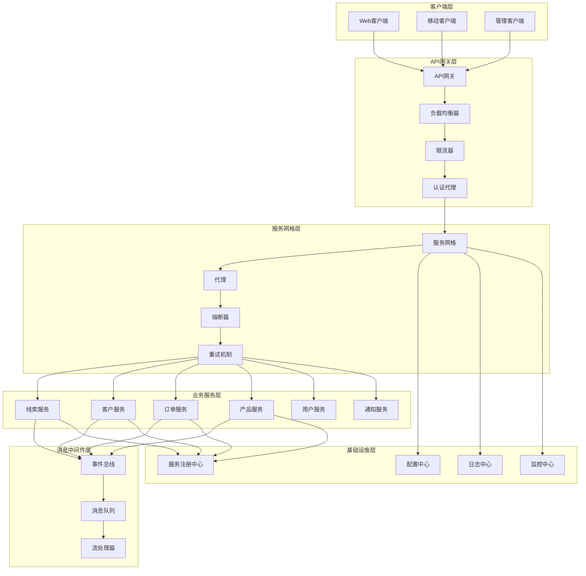
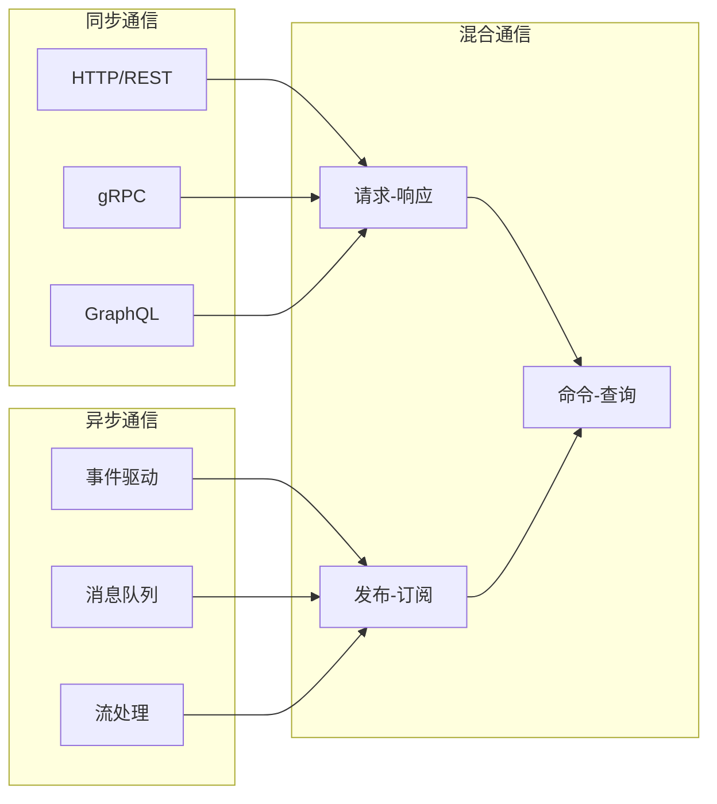

# 服务间通信规范设计方案

## 📋 概述

本文档详细阐述了罗莱L2C销售管理系统的服务间通信规范设计方案，定义了微服务架构中各服务间的通信协议、数据格式、错误处理、安全机制和监控策略，确保服务间高效、可靠、安全的通信。

---

## 🎯 设计目标与价值

### 1. 核心目标
- **通信标准化**：建立统一的服务间通信标准和规范
- **高可用性**：确保服务间通信的稳定性和可靠性
- **性能优化**：提供高效的通信机制和数据传输
- **安全保障**：确保服务间通信的安全性和数据保护
- **可观测性**：提供完整的通信监控和追踪能力

### 2. 业务价值
- **开发效率提升**：统一的通信规范降低开发复杂度
- **系统稳定性增强**：可靠的通信机制保障系统稳定运行
- **运维便利性**：标准化的监控和日志便于运维管理
- **扩展性支持**：灵活的通信架构支持系统扩展

---

## 🏗️ 通信架构设计

### 1. 整体通信架构



### 2. 通信模式分类



---

## 🔄 同步通信规范

### 1. HTTP/REST通信规范

#### API设计规范
```typescript
// HTTP/REST API设计规范
// src/shared/communication/http/rest-api.standards.ts

// API版本控制
export enum APIVersion {
  V1 = 'v1',
  V2 = 'v2'
}

// HTTP方法规范
export enum HTTPMethod {
  GET = 'GET',       // 查询资源
  POST = 'POST',     // 创建资源
  PUT = 'PUT',       // 更新资源（完整更新）
  PATCH = 'PATCH',   // 更新资源（部分更新）
  DELETE = 'DELETE'  // 删除资源
}

// HTTP状态码规范
export enum HTTPStatusCode {
  // 成功响应
  OK = 200,                    // 请求成功
  CREATED = 201,               // 资源创建成功
  ACCEPTED = 202,              // 请求已接受，异步处理
  NO_CONTENT = 204,            // 请求成功，无返回内容

  // 客户端错误
  BAD_REQUEST = 400,           // 请求参数错误
  UNAUTHORIZED = 401,          // 未授权
  FORBIDDEN = 403,             // 禁止访问
  NOT_FOUND = 404,             // 资源不存在
  METHOD_NOT_ALLOWED = 405,    // 方法不允许
  CONFLICT = 409,              // 资源冲突
  UNPROCESSABLE_ENTITY = 422,  // 请求格式正确但语义错误

  // 服务器错误
  INTERNAL_SERVER_ERROR = 500, // 服务器内部错误
  BAD_GATEWAY = 502,           // 网关错误
  SERVICE_UNAVAILABLE = 503,   // 服务不可用
  GATEWAY_TIMEOUT = 504        // 网关超时
}

// 标准API响应格式
export interface APIResponse<T = any> {
  success: boolean;
  data?: T;
  error?: APIError;
  metadata?: APIMetadata;
}

export interface APIError {
  code: string;
  message: string;
  details?: any;
  timestamp: string;
  traceId: string;
}

export interface APIMetadata {
  version: string;
  timestamp: string;
  requestId: string;
  pagination?: PaginationMetadata;
}

export interface PaginationMetadata {
  page: number;
  pageSize: number;
  total: number;
  totalPages: number;
  hasNext: boolean;
  hasPrevious: boolean;
}

// REST API客户端
export class RestAPIClient {
  constructor(
    private readonly baseURL: string,
    private readonly version: APIVersion,
    private readonly httpClient: HttpClient,
    private readonly authProvider: AuthProvider,
    private readonly retryPolicy: RetryPolicy,
    private readonly circuitBreaker: CircuitBreaker
  ) {}

  // GET请求
  async get<T>(
    endpoint: string,
    params?: Record<string, any>,
    options?: RequestOptions
  ): Promise<APIResponse<T>> {
    const url = this.buildURL(endpoint, params);
    const headers = await this.buildHeaders(options?.headers);

    return this.circuitBreaker.execute(async () => {
      return this.retryPolicy.execute(async () => {
        const response = await this.httpClient.get<APIResponse<T>>(url, {
          headers,
          timeout: options?.timeout || 30000
        });
        
        this.validateResponse(response);
        return response.data;
      });
    });
  }

  // POST请求
  async post<T>(
    endpoint: string,
    data: any,
    options?: RequestOptions
  ): Promise<APIResponse<T>> {
    const url = this.buildURL(endpoint);
    const headers = await this.buildHeaders(options?.headers);

    return this.circuitBreaker.execute(async () => {
      return this.retryPolicy.execute(async () => {
        const response = await this.httpClient.post<APIResponse<T>>(url, data, {
          headers,
          timeout: options?.timeout || 30000
        });
        
        this.validateResponse(response);
        return response.data;
      });
    });
  }

  // PUT请求
  async put<T>(
    endpoint: string,
    data: any,
    options?: RequestOptions
  ): Promise<APIResponse<T>> {
    const url = this.buildURL(endpoint);
    const headers = await this.buildHeaders(options?.headers);

    return this.circuitBreaker.execute(async () => {
      return this.retryPolicy.execute(async () => {
        const response = await this.httpClient.put<APIResponse<T>>(url, data, {
          headers,
          timeout: options?.timeout || 30000
        });
        
        this.validateResponse(response);
        return response.data;
      });
    });
  }

  // PATCH请求
  async patch<T>(
    endpoint: string,
    data: any,
    options?: RequestOptions
  ): Promise<APIResponse<T>> {
    const url = this.buildURL(endpoint);
    const headers = await this.buildHeaders(options?.headers);

    return this.circuitBreaker.execute(async () => {
      return this.retryPolicy.execute(async () => {
        const response = await this.httpClient.patch<APIResponse<T>>(url, data, {
          headers,
          timeout: options?.timeout || 30000
        });
        
        this.validateResponse(response);
        return response.data;
      });
    });
  }

  // DELETE请求
  async delete<T>(
    endpoint: string,
    options?: RequestOptions
  ): Promise<APIResponse<T>> {
    const url = this.buildURL(endpoint);
    const headers = await this.buildHeaders(options?.headers);

    return this.circuitBreaker.execute(async () => {
      return this.retryPolicy.execute(async () => {
        const response = await this.httpClient.delete<APIResponse<T>>(url, {
          headers,
          timeout: options?.timeout || 30000
        });
        
        this.validateResponse(response);
        return response.data;
      });
    });
  }

  private buildURL(endpoint: string, params?: Record<string, any>): string {
    let url = `${this.baseURL}/api/${this.version}${endpoint}`;
    
    if (params) {
      const searchParams = new URLSearchParams();
      Object.entries(params).forEach(([key, value]) => {
        if (value !== undefined && value !== null) {
          searchParams.append(key, String(value));
        }
      });
      
      if (searchParams.toString()) {
        url += `?${searchParams.toString()}`;
      }
    }
    
    return url;
  }

  private async buildHeaders(customHeaders?: Record<string, string>): Promise<Record<string, string>> {
    const headers: Record<string, string> = {
      'Content-Type': 'application/json',
      'Accept': 'application/json',
      'X-API-Version': this.version,
      'X-Request-ID': this.generateRequestId(),
      ...customHeaders
    };

    // 添加认证头
    const authToken = await this.authProvider.getToken();
    if (authToken) {
      headers['Authorization'] = `Bearer ${authToken}`;
    }

    return headers;
  }

  private validateResponse(response: any): void {
    if (response.status >= 400) {
      throw new APIError(
        response.data?.error?.code || 'UNKNOWN_ERROR',
        response.data?.error?.message || 'Unknown error occurred',
        response.data?.error?.details
      );
    }
  }

  private generateRequestId(): string {
    return `req_${Date.now()}_${Math.random().toString(36).substr(2, 9)}`;
  }
}

// API错误类
export class APIError extends Error {
  constructor(
    public readonly code: string,
    message: string,
    public readonly details?: any
  ) {
    super(message);
    this.name = 'APIError';
  }
}

// 请求选项
export interface RequestOptions {
  headers?: Record<string, string>;
  timeout?: number;
  retries?: number;
}
```

#### 服务间REST调用示例
```typescript
// 服务间REST调用示例
// src/services/lead-management/infrastructure/clients/customer-api.client.ts

export class CustomerAPIClient {
  constructor(private readonly restClient: RestAPIClient) {}

  // 获取客户信息
  async getCustomer(customerId: string): Promise<CustomerDto | null> {
    try {
      const response = await this.restClient.get<CustomerDto>(
        `/customers/${customerId}`
      );
      return response.data || null;
    } catch (error) {
      if (error instanceof APIError && error.code === 'CUSTOMER_NOT_FOUND') {
        return null;
      }
      throw error;
    }
  }

  // 验证客户存在
  async customerExists(customerId: string): Promise<boolean> {
    try {
      await this.restClient.get(`/customers/${customerId}/exists`);
      return true;
    } catch (error) {
      if (error instanceof APIError && error.code === 'CUSTOMER_NOT_FOUND') {
        return false;
      }
      throw error;
    }
  }

  // 获取客户基本信息
  async getCustomerBasicInfo(customerId: string): Promise<CustomerBasicInfoDto> {
    const response = await this.restClient.get<CustomerBasicInfoDto>(
      `/customers/${customerId}/basic-info`
    );
    return response.data!;
  }

  // 批量获取客户信息
  async getCustomersBatch(customerIds: string[]): Promise<CustomerDto[]> {
    const response = await this.restClient.post<CustomerDto[]>(
      '/customers/batch',
      { customerIds }
    );
    return response.data || [];
  }
}
```

### 2. gRPC通信规范

#### Protocol Buffers定义
```protobuf
// gRPC服务定义
// proto/customer/customer.proto

syntax = "proto3";

package customer.v1;

import "google/protobuf/timestamp.proto";
import "google/protobuf/empty.proto";

// 客户服务
service CustomerService {
  // 获取客户信息
  rpc GetCustomer(GetCustomerRequest) returns (GetCustomerResponse);
  
  // 验证客户存在
  rpc CustomerExists(CustomerExistsRequest) returns (CustomerExistsResponse);
  
  // 获取客户基本信息
  rpc GetCustomerBasicInfo(GetCustomerBasicInfoRequest) returns (GetCustomerBasicInfoResponse);
  
  // 批量获取客户信息
  rpc GetCustomersBatch(GetCustomersBatchRequest) returns (GetCustomersBatchResponse);
  
  // 创建客户
  rpc CreateCustomer(CreateCustomerRequest) returns (CreateCustomerResponse);
  
  // 更新客户信息
  rpc UpdateCustomer(UpdateCustomerRequest) returns (UpdateCustomerResponse);
}

// 请求消息
message GetCustomerRequest {
  string customer_id = 1;
}

message CustomerExistsRequest {
  string customer_id = 1;
}

message GetCustomerBasicInfoRequest {
  string customer_id = 1;
}

message GetCustomersBatchRequest {
  repeated string customer_ids = 1;
}

message CreateCustomerRequest {
  string name = 1;
  string email = 2;
  string phone = 3;
  string company = 4;
  string created_by = 5;
}

message UpdateCustomerRequest {
  string customer_id = 1;
  CustomerUpdateData update_data = 2;
  string updated_by = 3;
}

// 响应消息
message GetCustomerResponse {
  Customer customer = 1;
}

message CustomerExistsResponse {
  bool exists = 1;
}

message GetCustomerBasicInfoResponse {
  CustomerBasicInfo basic_info = 1;
}

message GetCustomersBatchResponse {
  repeated Customer customers = 1;
}

message CreateCustomerResponse {
  Customer customer = 1;
}

message UpdateCustomerResponse {
  Customer customer = 1;
}

// 数据模型
message Customer {
  string id = 1;
  string name = 2;
  string email = 3;
  string phone = 4;
  string company = 5;
  CustomerStatus status = 6;
  CustomerType type = 7;
  repeated string segments = 8;
  google.protobuf.Timestamp created_at = 9;
  google.protobuf.Timestamp updated_at = 10;
}

message CustomerBasicInfo {
  string id = 1;
  string name = 2;
  string email = 3;
  string phone = 4;
}

message CustomerUpdateData {
  optional string name = 1;
  optional string email = 2;
  optional string phone = 3;
  optional string company = 4;
}

// 枚举
enum CustomerStatus {
  CUSTOMER_STATUS_UNSPECIFIED = 0;
  CUSTOMER_STATUS_ACTIVE = 1;
  CUSTOMER_STATUS_INACTIVE = 2;
  CUSTOMER_STATUS_SUSPENDED = 3;
}

enum CustomerType {
  CUSTOMER_TYPE_UNSPECIFIED = 0;
  CUSTOMER_TYPE_PROSPECT = 1;
  CUSTOMER_TYPE_LEAD = 2;
  CUSTOMER_TYPE_CUSTOMER = 3;
  CUSTOMER_TYPE_VIP = 4;
}
```

#### gRPC客户端实现
```typescript
// gRPC客户端实现
// src/shared/communication/grpc/grpc-client.ts

import * as grpc from '@grpc/grpc-js';
import { CustomerServiceClient } from '../../../proto/customer/customer_grpc_pb';
import { 
  GetCustomerRequest, 
  GetCustomerResponse,
  CustomerExistsRequest,
  CustomerExistsResponse 
} from '../../../proto/customer/customer_pb';

export class GrpcCustomerClient {
  private client: CustomerServiceClient;

  constructor(
    private readonly serviceUrl: string,
    private readonly credentials: grpc.ChannelCredentials,
    private readonly options: grpc.ClientOptions
  ) {
    this.client = new CustomerServiceClient(serviceUrl, credentials, options);
  }

  // 获取客户信息
  async getCustomer(customerId: string): Promise<Customer | null> {
    return new Promise((resolve, reject) => {
      const request = new GetCustomerRequest();
      request.setCustomerId(customerId);

      this.client.getCustomer(request, (error, response) => {
        if (error) {
          if (error.code === grpc.status.NOT_FOUND) {
            resolve(null);
          } else {
            reject(new GrpcError(error));
          }
          return;
        }

        const customer = response?.getCustomer();
        resolve(customer ? this.mapToCustomer(customer) : null);
      });
    });
  }

  // 验证客户存在
  async customerExists(customerId: string): Promise<boolean> {
    return new Promise((resolve, reject) => {
      const request = new CustomerExistsRequest();
      request.setCustomerId(customerId);

      this.client.customerExists(request, (error, response) => {
        if (error) {
          reject(new GrpcError(error));
          return;
        }

        resolve(response?.getExists() || false);
      });
    });
  }

  // 批量获取客户信息
  async getCustomersBatch(customerIds: string[]): Promise<Customer[]> {
    return new Promise((resolve, reject) => {
      const request = new GetCustomersBatchRequest();
      request.setCustomerIdsList(customerIds);

      this.client.getCustomersBatch(request, (error, response) => {
        if (error) {
          reject(new GrpcError(error));
          return;
        }

        const customers = response?.getCustomersList() || [];
        resolve(customers.map(c => this.mapToCustomer(c)));
      });
    });
  }

  private mapToCustomer(grpcCustomer: any): Customer {
    return {
      id: grpcCustomer.getId(),
      name: grpcCustomer.getName(),
      email: grpcCustomer.getEmail(),
      phone: grpcCustomer.getPhone(),
      company: grpcCustomer.getCompany(),
      status: this.mapCustomerStatus(grpcCustomer.getStatus()),
      type: this.mapCustomerType(grpcCustomer.getType()),
      segments: grpcCustomer.getSegmentsList(),
      createdAt: grpcCustomer.getCreatedAt()?.toDate(),
      updatedAt: grpcCustomer.getUpdatedAt()?.toDate()
    };
  }

  private mapCustomerStatus(status: number): CustomerStatus {
    // 映射gRPC枚举到领域枚举
    switch (status) {
      case 1: return CustomerStatus.ACTIVE;
      case 2: return CustomerStatus.INACTIVE;
      case 3: return CustomerStatus.SUSPENDED;
      default: return CustomerStatus.ACTIVE;
    }
  }

  private mapCustomerType(type: number): CustomerType {
    // 映射gRPC枚举到领域枚举
    switch (type) {
      case 1: return CustomerType.PROSPECT;
      case 2: return CustomerType.LEAD;
      case 3: return CustomerType.CUSTOMER;
      case 4: return CustomerType.VIP;
      default: return CustomerType.PROSPECT;
    }
  }
}

// gRPC错误处理
export class GrpcError extends Error {
  constructor(public readonly grpcError: grpc.ServiceError) {
    super(grpcError.message);
    this.name = 'GrpcError';
  }

  get code(): grpc.status {
    return this.grpcError.code;
  }

  get details(): string {
    return this.grpcError.details;
  }
}
```

### 3. GraphQL通信规范

#### GraphQL Schema定义
```graphql
# GraphQL Schema定义
# schema/customer.graphql

type Query {
  # 获取客户信息
  customer(id: ID!): Customer
  
  # 获取客户列表
  customers(
    filter: CustomerFilter
    pagination: PaginationInput
    sort: CustomerSort
  ): CustomerConnection!
  
  # 搜索客户
  searchCustomers(
    query: String!
    pagination: PaginationInput
  ): CustomerConnection!
}

type Mutation {
  # 创建客户
  createCustomer(input: CreateCustomerInput!): CreateCustomerPayload!
  
  # 更新客户
  updateCustomer(input: UpdateCustomerInput!): UpdateCustomerPayload!
  
  # 删除客户
  deleteCustomer(id: ID!): DeleteCustomerPayload!
}

type Subscription {
  # 客户状态变更
  customerStatusChanged(customerId: ID): CustomerStatusChangedPayload!
  
  # 客户信息更新
  customerUpdated(customerId: ID): CustomerUpdatedPayload!
}

# 客户类型
type Customer {
  id: ID!
  name: String!
  email: String!
  phone: String
  company: String
  status: CustomerStatus!
  type: CustomerType!
  segments: [String!]!
  profile: CustomerProfile
  contacts: [CustomerContact!]!
  orders: [Order!]!
  leads: [Lead!]!
  createdAt: DateTime!
  updatedAt: DateTime!
}

type CustomerProfile {
  avatar: String
  bio: String
  preferences: CustomerPreferences
  address: Address
}

type CustomerContact {
  id: ID!
  type: ContactType!
  value: String!
  isPrimary: Boolean!
}

type CustomerPreferences {
  language: String
  timezone: String
  notifications: NotificationPreferences
}

# 枚举类型
enum CustomerStatus {
  ACTIVE
  INACTIVE
  SUSPENDED
}

enum CustomerType {
  PROSPECT
  LEAD
  CUSTOMER
  VIP
}

enum ContactType {
  EMAIL
  PHONE
  WECHAT
  QQ
}

# 输入类型
input CustomerFilter {
  status: CustomerStatus
  type: CustomerType
  segments: [String!]
  createdAfter: DateTime
  createdBefore: DateTime
}

input CustomerSort {
  field: CustomerSortField!
  direction: SortDirection!
}

enum CustomerSortField {
  NAME
  EMAIL
  CREATED_AT
  UPDATED_AT
}

enum SortDirection {
  ASC
  DESC
}

input CreateCustomerInput {
  name: String!
  email: String!
  phone: String
  company: String
  type: CustomerType = PROSPECT
}

input UpdateCustomerInput {
  id: ID!
  name: String
  email: String
  phone: String
  company: String
  status: CustomerStatus
  type: CustomerType
}

# 连接类型（分页）
type CustomerConnection {
  edges: [CustomerEdge!]!
  pageInfo: PageInfo!
  totalCount: Int!
}

type CustomerEdge {
  node: Customer!
  cursor: String!
}

type PageInfo {
  hasNextPage: Boolean!
  hasPreviousPage: Boolean!
  startCursor: String
  endCursor: String
}

# 载荷类型
type CreateCustomerPayload {
  customer: Customer
  errors: [Error!]!
}

type UpdateCustomerPayload {
  customer: Customer
  errors: [Error!]!
}

type DeleteCustomerPayload {
  deletedCustomerId: ID
  errors: [Error!]!
}

type CustomerStatusChangedPayload {
  customer: Customer!
  oldStatus: CustomerStatus!
  newStatus: CustomerStatus!
}

type CustomerUpdatedPayload {
  customer: Customer!
  updatedFields: [String!]!
}

# 通用类型
type Error {
  code: String!
  message: String!
  field: String
}

input PaginationInput {
  first: Int
  after: String
  last: Int
  before: String
}

scalar DateTime
```

#### GraphQL客户端实现
```typescript
// GraphQL客户端实现
// src/shared/communication/graphql/graphql-client.ts

import { GraphQLClient, gql } from 'graphql-request';

export class GraphQLCustomerClient {
  constructor(
    private readonly client: GraphQLClient,
    private readonly authProvider: AuthProvider
  ) {}

  // 获取客户信息
  async getCustomer(customerId: string): Promise<Customer | null> {
    const query = gql`
      query GetCustomer($id: ID!) {
        customer(id: $id) {
          id
          name
          email
          phone
          company
          status
          type
          segments
          profile {
            avatar
            bio
            preferences {
              language
              timezone
            }
            address {
              street
              city
              state
              country
              zipCode
            }
          }
          contacts {
            id
            type
            value
            isPrimary
          }
          createdAt
          updatedAt
        }
      }
    `;

    try {
      const headers = await this.getAuthHeaders();
      const response = await this.client.request<{ customer: Customer }>(
        query,
        { id: customerId },
        headers
      );
      return response.customer;
    } catch (error) {
      if (this.isNotFoundError(error)) {
        return null;
      }
      throw new GraphQLError(error);
    }
  }

  // 获取客户列表
  async getCustomers(
    filter?: CustomerFilter,
    pagination?: PaginationInput,
    sort?: CustomerSort
  ): Promise<CustomerConnection> {
    const query = gql`
      query GetCustomers(
        $filter: CustomerFilter
        $pagination: PaginationInput
        $sort: CustomerSort
      ) {
        customers(filter: $filter, pagination: $pagination, sort: $sort) {
          edges {
            node {
              id
              name
              email
              phone
              company
              status
              type
              segments
              createdAt
              updatedAt
            }
            cursor
          }
          pageInfo {
            hasNextPage
            hasPreviousPage
            startCursor
            endCursor
          }
          totalCount
        }
      }
    `;

    const headers = await this.getAuthHeaders();
    const response = await this.client.request<{ customers: CustomerConnection }>(
      query,
      { filter, pagination, sort },
      headers
    );
    return response.customers;
  }

  // 创建客户
  async createCustomer(input: CreateCustomerInput): Promise<Customer> {
    const mutation = gql`
      mutation CreateCustomer($input: CreateCustomerInput!) {
        createCustomer(input: $input) {
          customer {
            id
            name
            email
            phone
            company
            status
            type
            segments
            createdAt
            updatedAt
          }
          errors {
            code
            message
            field
          }
        }
      }
    `;

    const headers = await this.getAuthHeaders();
    const response = await this.client.request<{ createCustomer: CreateCustomerPayload }>(
      mutation,
      { input },
      headers
    );

    if (response.createCustomer.errors.length > 0) {
      throw new GraphQLValidationError(response.createCustomer.errors);
    }

    return response.createCustomer.customer!;
  }

  // 更新客户
  async updateCustomer(input: UpdateCustomerInput): Promise<Customer> {
    const mutation = gql`
      mutation UpdateCustomer($input: UpdateCustomerInput!) {
        updateCustomer(input: $input) {
          customer {
            id
            name
            email
            phone
            company
            status
            type
            segments
            createdAt
            updatedAt
          }
          errors {
            code
            message
            field
          }
        }
      }
    `;

    const headers = await this.getAuthHeaders();
    const response = await this.client.request<{ updateCustomer: UpdateCustomerPayload }>(
      mutation,
      { input },
      headers
    );

    if (response.updateCustomer.errors.length > 0) {
      throw new GraphQLValidationError(response.updateCustomer.errors);
    }

    return response.updateCustomer.customer!;
  }

  // 订阅客户状态变更
  subscribeToCustomerStatusChanges(customerId?: string): Observable<CustomerStatusChangedPayload> {
    const subscription = gql`
      subscription CustomerStatusChanged($customerId: ID) {
        customerStatusChanged(customerId: $customerId) {
          customer {
            id
            name
            status
          }
          oldStatus
          newStatus
        }
      }
    `;

    return this.client.subscribe<{ customerStatusChanged: CustomerStatusChangedPayload }>(
      subscription,
      { customerId }
    ).pipe(
      map(response => response.customerStatusChanged)
    );
  }

  private async getAuthHeaders(): Promise<Record<string, string>> {
    const token = await this.authProvider.getToken();
    return token ? { Authorization: `Bearer ${token}` } : {};
  }

  private isNotFoundError(error: any): boolean {
    return error?.response?.errors?.some((e: any) => 
      e.extensions?.code === 'NOT_FOUND'
    );
  }
}

// GraphQL错误处理
export class GraphQLError extends Error {
  constructor(public readonly originalError: any) {
    super(originalError.message || 'GraphQL request failed');
    this.name = 'GraphQLError';
  }
}

export class GraphQLValidationError extends Error {
  constructor(public readonly errors: Array<{ code: string; message: string; field?: string }>) {
    super(`Validation failed: ${errors.map(e => e.message).join(', ')}`);
    this.name = 'GraphQLValidationError';
  }
}
```

---

## 📨 异步通信规范

### 1. 事件驱动通信

#### 事件定义规范
```typescript
// 事件定义规范
// src/shared/events/event.standards.ts

// 基础事件接口
export interface DomainEvent {
  id: string;
  type: string;
  aggregateId: string;
  aggregateType: string;
  version: number;
  data: any;
  metadata: EventMetadata;
  timestamp: Date;
}

export interface IntegrationEvent {
  id: string;
  type: string;
  source: string;
  data: any;
  metadata: EventMetadata;
  timestamp: Date;
}

export interface EventMetadata {
  correlationId: string;
  causationId?: string;
  userId?: string;
  traceId: string;
  version: string;
}

// 事件命名规范
export enum EventNamingPattern {
  // 领域事件：{AggregateType}.{Action}
  LEAD_CREATED = 'Lead.Created',
  LEAD_ASSIGNED = 'Lead.Assigned',
  LEAD_STATUS_CHANGED = 'Lead.StatusChanged',
  LEAD_CONVERTED = 'Lead.Converted',

  // 集成事件：{Service}.{AggregateType}.{Action}
  CUSTOMER_SERVICE_CUSTOMER_CREATED = 'CustomerService.Customer.Created',
  ORDER_SERVICE_ORDER_PAID = 'OrderService.Order.Paid',
  NOTIFICATION_SERVICE_EMAIL_SENT = 'NotificationService.Email.Sent'
}

// 事件版本控制
export interface EventSchema {
  version: string;
  type: string;
  schema: any; // JSON Schema
  compatibleVersions: string[];
}

// 事件注册表
export class EventRegistry {
  private schemas = new Map<string, EventSchema>();

  registerEvent(schema: EventSchema): void {
    const key = `${schema.type}:${schema.version}`;
    this.schemas.set(key, schema);
  }

  getSchema(type: string, version: string): EventSchema | undefined {
    const key = `${type}:${version}`;
    return this.schemas.get(key);
  }

  validateEvent(event: DomainEvent | IntegrationEvent): boolean {
    const schema = this.getSchema(event.type, event.metadata.version);
    if (!schema) {
      throw new Error(`Unknown event type: ${event.type}:${event.metadata.version}`);
    }

    // 使用JSON Schema验证事件数据
    return this.validateAgainstSchema(event.data, schema.schema);
  }

  private validateAgainstSchema(data: any, schema: any): boolean {
    // JSON Schema验证逻辑
    return true; // 简化实现
  }
}

// 具体事件定义
export class LeadCreatedEvent implements DomainEvent {
  public readonly id: string;
  public readonly type = EventNamingPattern.LEAD_CREATED;
  public readonly timestamp: Date;

  constructor(
    public readonly aggregateId: string,
    public readonly aggregateType: string = 'Lead',
    public readonly version: number,
    public readonly data: LeadCreatedEventData,
    public readonly metadata: EventMetadata
  ) {
    this.id = this.generateEventId();
    this.timestamp = new Date();
  }

  private generateEventId(): string {
    return `evt_${Date.now()}_${Math.random().toString(36).substr(2, 9)}`;
  }
}

export interface LeadCreatedEventData {
  leadId: string;
  customerId: string;
  priority: string;
  source: string;
  estimatedValue: number;
  assignedTo: string;
  createdBy: string;
}
```

#### 事件发布订阅机制
```typescript
// 事件发布订阅机制
// src/shared/events/event-bus.ts

export interface EventBus {
  publish(event: DomainEvent | IntegrationEvent): Promise<void>;
  subscribe<T extends DomainEvent | IntegrationEvent>(
    eventType: string,
    handler: EventHandler<T>
  ): Promise<void>;
  unsubscribe(eventType: string, handler: EventHandler): Promise<void>;
}

export interface EventHandler<T = any> {
  handle(event: T): Promise<void>;
  canHandle(event: any): boolean;
  getEventType(): string;
}

// Redis事件总线实现
export class RedisEventBus implements EventBus {
  constructor(
    private readonly redis: Redis,
    private readonly eventRegistry: EventRegistry,
    private readonly serializer: EventSerializer,
    private readonly logger: Logger
  ) {}

  async publish(event: DomainEvent | IntegrationEvent): Promise<void> {
    try {
      // 验证事件
      this.eventRegistry.validateEvent(event);

      // 序列化事件
      const serializedEvent = this.serializer.serialize(event);

      // 发布到Redis
      await this.redis.publish(event.type, serializedEvent);

      this.logger.info('Event published', {
        eventId: event.id,
        eventType: event.type,
        aggregateId: 'aggregateId' in event ? event.aggregateId : undefined
      });
    } catch (error) {
      this.logger.error('Failed to publish event', {
        eventId: event.id,
        eventType: event.type,
        error: error.message
      });
      throw error;
    }
  }

  async subscribe<T extends DomainEvent | IntegrationEvent>(
    eventType: string,
    handler: EventHandler<T>
  ): Promise<void> {
    await this.redis.subscribe(eventType);

    this.redis.on('message', async (channel, message) => {
      if (channel === eventType) {
        try {
          const event = this.serializer.deserialize<T>(message);
          
          if (handler.canHandle(event)) {
            await handler.handle(event);
            
            this.logger.info('Event handled successfully', {
              eventId: event.id,
              eventType: event.type,
              handlerName: handler.constructor.name
            });
          }
        } catch (error) {
          this.logger.error('Failed to handle event', {
            eventType,
            handlerName: handler.constructor.name,
            error: error.message
          });
          
          // 发送到死信队列
          await this.sendToDeadLetterQueue(message, error);
        }
      }
    });
  }

  async unsubscribe(eventType: string, handler: EventHandler): Promise<void> {
    await this.redis.unsubscribe(eventType);
  }

  private async sendToDeadLetterQueue(message: string, error: Error): Promise<void> {
    const deadLetterEvent = {
      originalMessage: message,
      error: error.message,
      timestamp: new Date(),
      retryCount: 0
    };

    await this.redis.lpush('dead-letter-queue', JSON.stringify(deadLetterEvent));
  }
}

// 事件序列化器
export class EventSerializer {
  serialize(event: DomainEvent | IntegrationEvent): string {
    return JSON.stringify({
      ...event,
      timestamp: event.timestamp.toISOString()
    });
  }

  deserialize<T extends DomainEvent | IntegrationEvent>(data: string): T {
    const parsed = JSON.parse(data);
    return {
      ...parsed,
      timestamp: new Date(parsed.timestamp)
    } as T;
  }
}

// 事件处理器基类
export abstract class BaseEventHandler<T extends DomainEvent | IntegrationEvent> 
  implements EventHandler<T> {
  
  abstract handle(event: T): Promise<void>;
  abstract getEventType(): string;

  canHandle(event: any): boolean {
    return event.type === this.getEventType();
  }

  protected async withRetry<R>(
    operation: () => Promise<R>,
    maxRetries: number = 3,
    delay: number = 1000
  ): Promise<R> {
    let lastError: Error;

    for (let attempt = 1; attempt <= maxRetries; attempt++) {
      try {
        return await operation();
      } catch (error) {
        lastError = error as Error;
        
        if (attempt < maxRetries) {
          await this.sleep(delay * attempt);
        }
      }
    }

    throw lastError!;
  }

  private sleep(ms: number): Promise<void> {
    return new Promise(resolve => setTimeout(resolve, ms));
  }
}

// 具体事件处理器示例
export class LeadCreatedEventHandler extends BaseEventHandler<LeadCreatedEvent> {
  constructor(
    private readonly notificationService: NotificationServiceContract,
    private readonly customerService: CustomerServiceContract
  ) {
    super();
  }

  getEventType(): string {
    return EventNamingPattern.LEAD_CREATED;
  }

  async handle(event: LeadCreatedEvent): Promise<void> {
    await this.withRetry(async () => {
      // 获取客户信息
      const customer = await this.customerService.getCustomer(event.data.customerId);
      if (!customer) {
        throw new Error(`Customer not found: ${event.data.customerId}`);
      }

      // 发送通知给分配的销售人员
      await this.notificationService.sendSystemNotification(
        event.data.assignedTo,
        'NEW_LEAD_ASSIGNED',
        {
          leadId: event.data.leadId,
          customerName: customer.name,
          priority: event.data.priority,
          estimatedValue: event.data.estimatedValue
        }
      );

      // 发送邮件通知
      await this.notificationService.sendEmail(
        customer.email,
        '感谢您的咨询',
        '我们已收到您的咨询，销售顾问将尽快与您联系。'
      );
    });
  }
}
```

### 2. 消息队列通信

#### 消息队列规范
```typescript
// 消息队列规范
// src/shared/messaging/message-queue.ts

export interface MessageQueue {
  send(queueName: string, message: Message): Promise<void>;
  receive(queueName: string, handler: MessageHandler): Promise<void>;
  createQueue(queueName: string, options?: QueueOptions): Promise<void>;
  deleteQueue(queueName: string): Promise<void>;
}

export interface Message {
  id: string;
  type: string;
  data: any;
  metadata: MessageMetadata;
  timestamp: Date;
}

export interface MessageMetadata {
  correlationId: string;
  replyTo?: string;
  expiration?: number;
  priority?: number;
  retryCount?: number;
  maxRetries?: number;
}

export interface MessageHandler {
  handle(message: Message): Promise<void>;
  canHandle(message: Message): boolean;
}

export interface QueueOptions {
  durable?: boolean;
  exclusive?: boolean;
  autoDelete?: boolean;
  maxLength?: number;
  messageTTL?: number;
  deadLetterExchange?: string;
}

// RabbitMQ消息队列实现
export class RabbitMQMessageQueue implements MessageQueue {
  constructor(
    private readonly connection: amqp.Connection,
    private readonly channel: amqp.Channel,
    private readonly serializer: MessageSerializer,
    private readonly logger: Logger
  ) {}

  async send(queueName: string, message: Message): Promise<void> {
    try {
      const serializedMessage = this.serializer.serialize(message);
      
      const options: amqp.Options.Publish = {
        persistent: true,
        correlationId: message.metadata.correlationId,
        replyTo: message.metadata.replyTo,
        expiration: message.metadata.expiration,
        priority: message.metadata.priority || 0,
        timestamp: message.timestamp.getTime()
      };

      const sent = this.channel.sendToQueue(
        queueName,
        Buffer.from(serializedMessage),
        options
      );

      if (!sent) {
        throw new Error('Failed to send message to queue');
      }

      this.logger.info('Message sent to queue', {
        messageId: message.id,
        queueName,
        messageType: message.type
      });
    } catch (error) {
      this.logger.error('Failed to send message', {
        messageId: message.id,
        queueName,
        error: error.message
      });
      throw error;
    }
  }

  async receive(queueName: string, handler: MessageHandler): Promise<void> {
    await this.channel.consume(queueName, async (msg) => {
      if (!msg) return;

      try {
        const message = this.serializer.deserialize(msg.content.toString());
        
        if (handler.canHandle(message)) {
          await handler.handle(message);
          this.channel.ack(msg);
          
          this.logger.info('Message processed successfully', {
            messageId: message.id,
            queueName,
            handlerName: handler.constructor.name
          });
        } else {
          this.channel.nack(msg, false, false);
          this.logger.warn('Message rejected by handler', {
            messageId: message.id,
            queueName,
            handlerName: handler.constructor.name
          });
        }
      } catch (error) {
        this.logger.error('Failed to process message', {
          queueName,
          handlerName: handler.constructor.name,
          error: error.message
        });

        // 检查重试次数
        const retryCount = this.getRetryCount(msg);
        const maxRetries = this.getMaxRetries(msg);

        if (retryCount < maxRetries) {
          // 重新入队，增加重试次数
          await this.requeueWithRetry(msg, retryCount + 1);
          this.channel.ack(msg);
        } else {
          // 发送到死信队列
          this.channel.nack(msg, false, false);
        }
      }
    });
  }

  async createQueue(queueName: string, options: QueueOptions = {}): Promise<void> {
    const queueOptions: amqp.Options.AssertQueue = {
      durable: options.durable !== false,
      exclusive: options.exclusive || false,
      autoDelete: options.autoDelete || false,
      arguments: {}
    };

    if (options.maxLength) {
      queueOptions.arguments!['x-max-length'] = options.maxLength;
    }

    if (options.messageTTL) {
      queueOptions.arguments!['x-message-ttl'] = options.messageTTL;
    }

    if (options.deadLetterExchange) {
      queueOptions.arguments!['x-dead-letter-exchange'] = options.deadLetterExchange;
    }

    await this.channel.assertQueue(queueName, queueOptions);
  }

  async deleteQueue(queueName: string): Promise<void> {
    await this.channel.deleteQueue(queueName);
  }

  private getRetryCount(msg: amqp.ConsumeMessage): number {
    const headers = msg.properties.headers || {};
    return headers['x-retry-count'] || 0;
  }

  private getMaxRetries(msg: amqp.ConsumeMessage): number {
    const headers = msg.properties.headers || {};
    return headers['x-max-retries'] || 3;
  }

  private async requeueWithRetry(msg: amqp.ConsumeMessage, retryCount: number): Promise<void> {
    const headers = { ...msg.properties.headers, 'x-retry-count': retryCount };
    const options: amqp.Options.Publish = {
      ...msg.properties,
      headers
    };

    this.channel.sendToQueue(
      msg.fields.routingKey,
      msg.content,
      options
    );
  }
}

// 消息序列化器
export class MessageSerializer {
  serialize(message: Message): string {
    return JSON.stringify({
      ...message,
      timestamp: message.timestamp.toISOString()
    });
  }

  deserialize(data: string): Message {
    const parsed = JSON.parse(data);
    return {
      ...parsed,
      timestamp: new Date(parsed.timestamp)
    };
  }
}
```

---

## 🔒 安全通信规范

### 1. 认证授权机制

```typescript
// 认证授权机制
// src/shared/security/auth.ts

export interface AuthProvider {
  getToken(): Promise<string | null>;
  refreshToken(): Promise<string>;
  validateToken(token: string): Promise<boolean>;
  getTokenClaims(token: string): Promise<TokenClaims>;
}

export interface TokenClaims {
  sub: string;        // 用户ID
  iss: string;        // 发行者
  aud: string;        // 受众
  exp: number;        // 过期时间
  iat: number;        // 签发时间
  scope: string[];    // 权限范围
  roles: string[];    // 用户角色
}

// JWT认证提供者
export class JWTAuthProvider implements AuthProvider {
  constructor(
    private readonly jwtSecret: string,
    private readonly tokenStorage: TokenStorage,
    private readonly authService: AuthServiceClient
  ) {}

  async getToken(): Promise<string | null> {
    let token = await this.tokenStorage.getAccessToken();
    
    if (!token) {
      return null;
    }

    // 检查token是否即将过期
    if (await this.isTokenExpiringSoon(token)) {
      try {
        token = await this.refreshToken();
      } catch (error) {
        // 刷新失败，返回null
        return null;
      }
    }

    return token;
  }

  async refreshToken(): Promise<string> {
    const refreshToken = await this.tokenStorage.getRefreshToken();
    if (!refreshToken) {
      throw new Error('No refresh token available');
    }

    const response = await this.authService.refreshToken(refreshToken);
    
    await this.tokenStorage.setAccessToken(response.accessToken);
    await this.tokenStorage.setRefreshToken(response.refreshToken);

    return response.accessToken;
  }

  async validateToken(token: string): Promise<boolean> {
    try {
      jwt.verify(token, this.jwtSecret);
      return true;
    } catch (error) {
      return false;
    }
  }

  async getTokenClaims(token: string): Promise<TokenClaims> {
    const decoded = jwt.verify(token, this.jwtSecret) as any;
    return {
      sub: decoded.sub,
      iss: decoded.iss,
      aud: decoded.aud,
      exp: decoded.exp,
      iat: decoded.iat,
      scope: decoded.scope || [],
      roles: decoded.roles || []
    };
  }

  private async isTokenExpiringSoon(token: string): Promise<boolean> {
    try {
      const claims = await this.getTokenClaims(token);
      const expirationTime = claims.exp * 1000; // 转换为毫秒
      const currentTime = Date.now();
      const timeUntilExpiration = expirationTime - currentTime;
      
      // 如果token在5分钟内过期，则认为即将过期
      return timeUntilExpiration < 5 * 60 * 1000;
    } catch (error) {
      return true; // 如果无法解析token，认为已过期
    }
  }
}

// 服务间认证中间件
export class ServiceAuthMiddleware {
  constructor(
    private readonly authProvider: AuthProvider,
    private readonly permissionChecker: PermissionChecker
  ) {}

  // HTTP中间件
  httpMiddleware() {
    return async (req: Request, res: Response, next: NextFunction) => {
      try {
        const token = this.extractTokenFromRequest(req);
        if (!token) {
          return res.status(401).json({ error: 'Missing authentication token' });
        }

        const isValid = await this.authProvider.validateToken(token);
        if (!isValid) {
          return res.status(401).json({ error: 'Invalid authentication token' });
        }

        const claims = await this.authProvider.getTokenClaims(token);
        
        // 检查权限
        const hasPermission = await this.permissionChecker.checkPermission(
          claims.sub,
          req.method,
          req.path
        );

        if (!hasPermission) {
          return res.status(403).json({ error: 'Insufficient permissions' });
        }

        // 将用户信息添加到请求上下文
        req.user = {
          id: claims.sub,
          roles: claims.roles,
          scope: claims.scope
        };

        next();
      } catch (error) {
        return res.status(500).json({ error: 'Authentication error' });
      }
    };
  }

  // gRPC中间件
  grpcMiddleware() {
    return async (call: any, callback: any, next: any) => {
      try {
        const metadata = call.metadata;
        const token = metadata.get('authorization')[0]?.replace('Bearer ', '');

        if (!token) {
          return callback({
            code: grpc.status.UNAUTHENTICATED,
            message: 'Missing authentication token'
          });
        }

        const isValid = await this.authProvider.validateToken(token);
        if (!isValid) {
          return callback({
            code: grpc.status.UNAUTHENTICATED,
            message: 'Invalid authentication token'
          });
        }

        const claims = await this.authProvider.getTokenClaims(token);
        
        // 将用户信息添加到调用上下文
        call.user = {
          id: claims.sub,
          roles: claims.roles,
          scope: claims.scope
        };

        next();
      } catch (error) {
        return callback({
          code: grpc.status.INTERNAL,
          message: 'Authentication error'
        });
      }
    };
  }

  private extractTokenFromRequest(req: Request): string | null {
    const authHeader = req.headers.authorization;
    if (!authHeader || !authHeader.startsWith('Bearer ')) {
      return null;
    }
    return authHeader.substring(7);
  }
}
```

### 2. 数据加密传输

```typescript
// 数据加密传输
// src/shared/security/encryption.ts

export interface EncryptionService {
  encrypt(data: string): Promise<string>;
  decrypt(encryptedData: string): Promise<string>;
  hash(data: string): Promise<string>;
  verifyHash(data: string, hash: string): Promise<boolean>;
}

// AES加密服务
export class AESEncryptionService implements EncryptionService {
  constructor(
    private readonly secretKey: string,
    private readonly algorithm: string = 'aes-256-gcm'
  ) {}

  async encrypt(data: string): Promise<string> {
    const iv = crypto.randomBytes(16);
    const cipher = crypto.createCipher(this.algorithm, this.secretKey);
    cipher.setAAD(Buffer.from('additional-data'));

    let encrypted = cipher.update(data, 'utf8', 'hex');
    encrypted += cipher.final('hex');

    const authTag = cipher.getAuthTag();

    return JSON.stringify({
      iv: iv.toString('hex'),
      encrypted,
      authTag: authTag.toString('hex')
    });
  }

  async decrypt(encryptedData: string): Promise<string> {
    const { iv, encrypted, authTag } = JSON.parse(encryptedData);

    const decipher = crypto.createDecipher(this.algorithm, this.secretKey);
    decipher.setAAD(Buffer.from('additional-data'));
    decipher.setAuthTag(Buffer.from(authTag, 'hex'));

    let decrypted = decipher.update(encrypted, 'hex', 'utf8');
    decrypted += decipher.final('utf8');

    return decrypted;
  }

  async hash(data: string): Promise<string> {
    return crypto.createHash('sha256').update(data).digest('hex');
  }

  async verifyHash(data: string, hash: string): Promise<boolean> {
    const computedHash = await this.hash(data);
    return computedHash === hash;
  }
}

// TLS配置
export class TLSConfig {
  static getHTTPSOptions(): https.ServerOptions {
    return {
      key: fs.readFileSync(process.env.TLS_PRIVATE_KEY_PATH!),
      cert: fs.readFileSync(process.env.TLS_CERTIFICATE_PATH!),
      ca: fs.readFileSync(process.env.TLS_CA_PATH!),
      requestCert: true,
      rejectUnauthorized: true,
      secureProtocol: 'TLSv1_2_method',
      ciphers: [
        'ECDHE-RSA-AES128-GCM-SHA256',
        'ECDHE-RSA-AES256-GCM-SHA384',
        'ECDHE-RSA-AES128-SHA256',
        'ECDHE-RSA-AES256-SHA384'
      ].join(':'),
      honorCipherOrder: true
    };
  }

  static getGRPCCredentials(): grpc.ServerCredentials {
    const privateKey = fs.readFileSync(process.env.TLS_PRIVATE_KEY_PATH!);
    const certChain = fs.readFileSync(process.env.TLS_CERTIFICATE_PATH!);
    const rootCerts = fs.readFileSync(process.env.TLS_CA_PATH!);

    return grpc.ServerCredentials.createSsl(
      rootCerts,
      [{ private_key: privateKey, cert_chain: certChain }],
      true
    );
  }
}
```

---

## 📊 监控与可观测性

### 1. 分布式追踪

```typescript
// 分布式追踪
// src/shared/observability/tracing.ts

export interface TracingService {
  startSpan(operationName: string, parentSpan?: Span): Span;
  finishSpan(span: Span): void;
  injectHeaders(span: Span): Record<string, string>;
  extractSpan(headers: Record<string, string>): Span | null;
}

export interface Span {
  id: string;
  traceId: string;
  parentId?: string;
  operationName: string;
  startTime: Date;
  endTime?: Date;
  tags: Record<string, any>;
  logs: SpanLog[];
}

export interface SpanLog {
  timestamp: Date;
  level: string;
  message: string;
  fields?: Record<string, any>;
}

// Jaeger追踪服务
export class JaegerTracingService implements TracingService {
  constructor(
    private readonly tracer: opentracing.Tracer,
    private readonly serviceName: string
  ) {}

  startSpan(operationName: string, parentSpan?: Span): Span {
    const spanOptions: opentracing.SpanOptions = {
      tags: {
        [opentracing.Tags.COMPONENT]: this.serviceName,
        [opentracing.Tags.SPAN_KIND]: opentracing.Tags.SPAN_KIND_RPC_SERVER
      }
    };

    if (parentSpan) {
      spanOptions.childOf = parentSpan as any;
    }

    const span = this.tracer.startSpan(operationName, spanOptions);
    
    return {
      id: span.context().toSpanId(),
      traceId: span.context().toTraceId(),
      parentId: parentSpan?.id,
      operationName,
      startTime: new Date(),
      tags: {},
      logs: []
    } as Span;
  }

  finishSpan(span: Span): void {
    span.endTime = new Date();
    (span as any).finish();
  }

  injectHeaders(span: Span): Record<string, string> {
    const headers: Record<string, string> = {};
    this.tracer.inject(span as any, opentracing.FORMAT_HTTP_HEADERS, headers);
    return headers;
  }

  extractSpan(headers: Record<string, string>): Span | null {
    const spanContext = this.tracer.extract(opentracing.FORMAT_HTTP_HEADERS, headers);
    if (!spanContext) {
      return null;
    }

    return spanContext as any;
  }
}

// 追踪中间件
export class TracingMiddleware {
  constructor(private readonly tracingService: TracingService) {}

  // HTTP追踪中间件
  httpMiddleware() {
    return (req: Request, res: Response, next: NextFunction) => {
      const parentSpan = this.tracingService.extractSpan(req.headers as any);
      const span = this.tracingService.startSpan(
        `${req.method} ${req.path}`,
        parentSpan || undefined
      );

      // 添加标签
      span.tags = {
        'http.method': req.method,
        'http.url': req.url,
        'http.user_agent': req.headers['user-agent'],
        'user.id': req.user?.id
      };

      // 将span添加到请求上下文
      req.span = span;

      // 响应完成时结束span
      res.on('finish', () => {
        span.tags['http.status_code'] = res.statusCode;
        if (res.statusCode >= 400) {
          span.tags['error'] = true;
        }
        this.tracingService.finishSpan(span);
      });

      next();
    };
  }

  // gRPC追踪中间件
  grpcMiddleware() {
    return (call: any, callback: any, next: any) => {
      const metadata = call.metadata;
      const headers: Record<string, string> = {};
      
      metadata.forEach((value: string, key: string) => {
        headers[key] = value;
      });

      const parentSpan = this.tracingService.extractSpan(headers);
      const span = this.tracingService.startSpan(
        call.getPath(),
        parentSpan || undefined
      );

      // 添加标签
      span.tags = {
        'rpc.service': call.getPath().split('/')[1],
        'rpc.method': call.getPath().split('/')[2],
        'user.id': call.user?.id
      };

      call.span = span;

      // 包装回调以结束span
      const originalCallback = callback;
      callback = (error: any, response: any) => {
        if (error) {
          span.tags['error'] = true;
          span.tags['error.message'] = error.message;
        }
        this.tracingService.finishSpan(span);
        originalCallback(error, response);
      };

      next();
    };
  }
}
```

### 2. 性能监控

```typescript
// 性能监控
// src/shared/observability/metrics.ts

export interface MetricsCollector {
  incrementCounter(name: string, labels?: Record<string, string>): void;
  recordHistogram(name: string, value: number, labels?: Record<string, string>): void;
  setGauge(name: string, value: number, labels?: Record<string, string>): void;
  recordTimer(name: string, duration: number, labels?: Record<string, string>): void;
}

// Prometheus指标收集器
export class PrometheusMetricsCollector implements MetricsCollector {
  private readonly registry: prometheus.Registry;
  private readonly counters = new Map<string, prometheus.Counter>();
  private readonly histograms = new Map<string, prometheus.Histogram>();
  private readonly gauges = new Map<string, prometheus.Gauge>();

  constructor() {
    this.registry = new prometheus.Registry();
    prometheus.collectDefaultMetrics({ register: this.registry });
  }

  incrementCounter(name: string, labels: Record<string, string> = {}): void {
    let counter = this.counters.get(name);
    if (!counter) {
      counter = new prometheus.Counter({
        name,
        help: `Counter for ${name}`,
        labelNames: Object.keys(labels),
        registers: [this.registry]
      });
      this.counters.set(name, counter);
    }

    counter.inc(labels);
  }

  recordHistogram(name: string, value: number, labels: Record<string, string> = {}): void {
    let histogram = this.histograms.get(name);
    if (!histogram) {
      histogram = new prometheus.Histogram({
        name,
        help: `Histogram for ${name}`,
        labelNames: Object.keys(labels),
        buckets: [0.1, 0.5, 1, 2, 5, 10, 30, 60],
        registers: [this.registry]
      });
      this.histograms.set(name, histogram);
    }

    histogram.observe(labels, value);
  }

  setGauge(name: string, value: number, labels: Record<string, string> = {}): void {
    let gauge = this.gauges.get(name);
    if (!gauge) {
      gauge = new prometheus.Gauge({
        name,
        help: `Gauge for ${name}`,
        labelNames: Object.keys(labels),
        registers: [this.registry]
      });
      this.gauges.set(name, gauge);
    }

    gauge.set(labels, value);
  }

  recordTimer(name: string, duration: number, labels: Record<string, string> = {}): void {
    this.recordHistogram(`${name}_duration_seconds`, duration / 1000, labels);
  }

  getMetrics(): string {
    return this.registry.metrics();
  }
}

// 性能监控中间件
export class PerformanceMonitoringMiddleware {
  constructor(private readonly metricsCollector: MetricsCollector) {}

  // HTTP性能监控
  httpMiddleware() {
    return (req: Request, res: Response, next: NextFunction) => {
      const startTime = Date.now();
      
      // 记录请求计数
      this.metricsCollector.incrementCounter('http_requests_total', {
        method: req.method,
        endpoint: req.route?.path || req.path
      });

      res.on('finish', () => {
        const duration = Date.now() - startTime;
        
        // 记录响应时间
        this.metricsCollector.recordTimer('http_request_duration', duration, {
          method: req.method,
          endpoint: req.route?.path || req.path,
          status_code: res.statusCode.toString()
        });

        // 记录响应状态
        this.metricsCollector.incrementCounter('http_responses_total', {
          method: req.method,
          endpoint: req.route?.path || req.path,
          status_code: res.statusCode.toString()
        });
      });

      next();
    };
  }

  // gRPC性能监控
  grpcMiddleware() {
    return (call: any, callback: any, next: any) => {
      const startTime = Date.now();
      const serviceName = call.getPath().split('/')[1];
      const methodName = call.getPath().split('/')[2];

      // 记录请求计数
      this.metricsCollector.incrementCounter('grpc_requests_total', {
        service: serviceName,
        method: methodName
      });

      const originalCallback = callback;
      callback = (error: any, response: any) => {
        const duration = Date.now() - startTime;
        
        // 记录响应时间
        this.metricsCollector.recordTimer('grpc_request_duration', duration, {
          service: serviceName,
          method: methodName,
          status: error ? 'error' : 'success'
        });

        // 记录响应状态
        this.metricsCollector.incrementCounter('grpc_responses_total', {
          service: serviceName,
          method: methodName,
          status: error ? 'error' : 'success'
        });

        originalCallback(error, response);
      };

      next();
    };
  }
}
```

---

## 🔧 错误处理与重试机制

### 1. 统一错误处理

```typescript
// 统一错误处理
// src/shared/errors/error-handling.ts

export enum ErrorCode {
  // 通用错误
  UNKNOWN_ERROR = 'UNKNOWN_ERROR',
  VALIDATION_ERROR = 'VALIDATION_ERROR',
  AUTHENTICATION_ERROR = 'AUTHENTICATION_ERROR',
  AUTHORIZATION_ERROR = 'AUTHORIZATION_ERROR',
  
  // 业务错误
  RESOURCE_NOT_FOUND = 'RESOURCE_NOT_FOUND',
  RESOURCE_CONFLICT = 'RESOURCE_CONFLICT',
  BUSINESS_RULE_VIOLATION = 'BUSINESS_RULE_VIOLATION',
  
  // 系统错误
  SERVICE_UNAVAILABLE = 'SERVICE_UNAVAILABLE',
  TIMEOUT_ERROR = 'TIMEOUT_ERROR',
  NETWORK_ERROR = 'NETWORK_ERROR',
  DATABASE_ERROR = 'DATABASE_ERROR'
}

export class ServiceError extends Error {
  constructor(
    public readonly code: ErrorCode,
    message: string,
    public readonly details?: any,
    public readonly cause?: Error
  ) {
    super(message);
    this.name = 'ServiceError';
  }

  toJSON() {
    return {
      code: this.code,
      message: this.message,
      details: this.details,
      timestamp: new Date().toISOString()
    };
  }
}

// 错误处理中间件
export class ErrorHandlingMiddleware {
  constructor(private readonly logger: Logger) {}

  // HTTP错误处理
  httpErrorHandler() {
    return (error: Error, req: Request, res: Response, next: NextFunction) => {
      this.logger.error('HTTP request error', {
        error: error.message,
        stack: error.stack,
        url: req.url,
        method: req.method,
        userAgent: req.headers['user-agent']
      });

      if (error instanceof ServiceError) {
        const statusCode = this.mapErrorCodeToHttpStatus(error.code);
        res.status(statusCode).json({
          success: false,
          error: error.toJSON()
        });
      } else {
        res.status(500).json({
          success: false,
          error: {
            code: ErrorCode.UNKNOWN_ERROR,
            message: 'Internal server error',
            timestamp: new Date().toISOString()
          }
        });
      }
    };
  }

  // gRPC错误处理
  grpcErrorHandler() {
    return (error: Error, call: any, callback: any) => {
      this.logger.error('gRPC request error', {
        error: error.message,
        stack: error.stack,
        service: call.getPath()
      });

      if (error instanceof ServiceError) {
        const grpcStatus = this.mapErrorCodeToGrpcStatus(error.code);
        callback({
          code: grpcStatus,
          message: error.message,
          details: error.details
        });
      } else {
        callback({
          code: grpc.status.INTERNAL,
          message: 'Internal server error'
        });
      }
    };
  }

  private mapErrorCodeToHttpStatus(errorCode: ErrorCode): number {
    switch (errorCode) {
      case ErrorCode.VALIDATION_ERROR:
        return 400;
      case ErrorCode.AUTHENTICATION_ERROR:
        return 401;
      case ErrorCode.AUTHORIZATION_ERROR:
        return 403;
      case ErrorCode.RESOURCE_NOT_FOUND:
        return 404;
      case ErrorCode.RESOURCE_CONFLICT:
        return 409;
      case ErrorCode.BUSINESS_RULE_VIOLATION:
        return 422;
      case ErrorCode.SERVICE_UNAVAILABLE:
        return 503;
      case ErrorCode.TIMEOUT_ERROR:
        return 504;
      default:
        return 500;
    }
  }

  private mapErrorCodeToGrpcStatus(errorCode: ErrorCode): grpc.status {
    switch (errorCode) {
      case ErrorCode.VALIDATION_ERROR:
        return grpc.status.INVALID_ARGUMENT;
      case ErrorCode.AUTHENTICATION_ERROR:
        return grpc.status.UNAUTHENTICATED;
      case ErrorCode.AUTHORIZATION_ERROR:
        return grpc.status.PERMISSION_DENIED;
      case ErrorCode.RESOURCE_NOT_FOUND:
        return grpc.status.NOT_FOUND;
      case ErrorCode.RESOURCE_CONFLICT:
        return grpc.status.ALREADY_EXISTS;
      case ErrorCode.SERVICE_UNAVAILABLE:
        return grpc.status.UNAVAILABLE;
      case ErrorCode.TIMEOUT_ERROR:
        return grpc.status.DEADLINE_EXCEEDED;
      default:
        return grpc.status.INTERNAL;
    }
  }
}
```

### 2. 重试机制

```typescript
// 重试机制
// src/shared/resilience/retry.ts

export interface RetryPolicy {
  execute<T>(operation: () => Promise<T>): Promise<T>;
}

export interface RetryOptions {
  maxRetries: number;
  baseDelay: number;
  maxDelay: number;
  backoffMultiplier: number;
  retryableErrors: ErrorCode[];
}

// 指数退避重试策略
export class ExponentialBackoffRetryPolicy implements RetryPolicy {
  constructor(private readonly options: RetryOptions) {}

  async execute<T>(operation: () => Promise<T>): Promise<T> {
    let lastError: Error;
    
    for (let attempt = 0; attempt <= this.options.maxRetries; attempt++) {
      try {
        return await operation();
      } catch (error) {
        lastError = error as Error;
        
        // 检查是否为可重试错误
        if (!this.isRetryableError(error as Error)) {
          throw error;
        }
        
        // 如果已达到最大重试次数，抛出错误
        if (attempt === this.options.maxRetries) {
          throw error;
        }
        
        // 计算延迟时间
        const delay = this.calculateDelay(attempt);
        await this.sleep(delay);
      }
    }
    
    throw lastError!;
  }

  private isRetryableError(error: Error): boolean {
    if (error instanceof ServiceError) {
      return this.options.retryableErrors.includes(error.code);
    }
    
    // 网络错误通常可重试
    return error.message.includes('ECONNRESET') ||
           error.message.includes('ETIMEDOUT') ||
           error.message.includes('ENOTFOUND');
  }

  private calculateDelay(attempt: number): number {
    const delay = this.options.baseDelay * Math.pow(this.options.backoffMultiplier, attempt);
    return Math.min(delay, this.options.maxDelay);
  }

  private sleep(ms: number): Promise<void> {
    return new Promise(resolve => setTimeout(resolve, ms));
  }
}

// 熔断器
export interface CircuitBreaker {
  execute<T>(operation: () => Promise<T>): Promise<T>;
  getState(): CircuitBreakerState;
}

export enum CircuitBreakerState {
  CLOSED = 'CLOSED',
  OPEN = 'OPEN',
  HALF_OPEN = 'HALF_OPEN'
}

export interface CircuitBreakerOptions {
  failureThreshold: number;
  recoveryTimeout: number;
  monitoringPeriod: number;
}

export class SimpleCircuitBreaker implements CircuitBreaker {
  private state = CircuitBreakerState.CLOSED;
  private failureCount = 0;
  private lastFailureTime = 0;
  private successCount = 0;

  constructor(private readonly options: CircuitBreakerOptions) {}

  async execute<T>(operation: () => Promise<T>): Promise<T> {
    if (this.state === CircuitBreakerState.OPEN) {
      if (this.shouldAttemptReset()) {
        this.state = CircuitBreakerState.HALF_OPEN;
      } else {
        throw new ServiceError(
          ErrorCode.SERVICE_UNAVAILABLE,
          'Circuit breaker is open'
        );
      }
    }

    try {
      const result = await operation();
      this.onSuccess();
      return result;
    } catch (error) {
      this.onFailure();
      throw error;
    }
  }

  getState(): CircuitBreakerState {
    return this.state;
  }

  private onSuccess(): void {
    this.failureCount = 0;
    
    if (this.state === CircuitBreakerState.HALF_OPEN) {
      this.successCount++;
      if (this.successCount >= 3) { // 连续3次成功后关闭熔断器
        this.state = CircuitBreakerState.CLOSED;
        this.successCount = 0;
      }
    }
  }

  private onFailure(): void {
    this.failureCount++;
    this.lastFailureTime = Date.now();
    
    if (this.failureCount >= this.options.failureThreshold) {
      this.state = CircuitBreakerState.OPEN;
    }
    
    if (this.state === CircuitBreakerState.HALF_OPEN) {
      this.state = CircuitBreakerState.OPEN;
      this.successCount = 0;
    }
  }

  private shouldAttemptReset(): boolean {
    return Date.now() - this.lastFailureTime >= this.options.recoveryTimeout;
  }
}
```

---

## 📈 总结

本服务间通信规范设计方案为罗莱L2C销售管理系统提供了完整的微服务通信解决方案：

### 🎯 核心价值
- **标准化通信**：建立了统一的HTTP/REST、gRPC、GraphQL通信规范
- **异步解耦**：通过事件驱动和消息队列实现服务间异步通信
- **安全保障**：提供完整的认证授权和数据加密机制
- **可观测性**：集成分布式追踪和性能监控能力
- **高可用性**：通过重试机制和熔断器保障系统稳定性

### 🏗️ 架构特点
- **多协议支持**：支持同步和异步多种通信协议
- **安全第一**：端到端的安全通信保障
- **监控完备**：全链路追踪和性能监控
- **容错设计**：完善的错误处理和恢复机制
- **扩展灵活**：支持服务的独立扩展和部署

### 🚀 实施优势
- **开发效率**：统一的通信标准降低开发复杂度
- **运维便利**：标准化的监控和日志便于运维管理
- **系统稳定**：多层次的容错机制保障系统稳定运行
- **性能优化**：高效的通信协议和缓存机制
- **安全可靠**：企业级的安全通信保障
