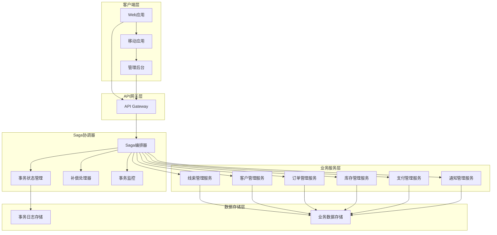
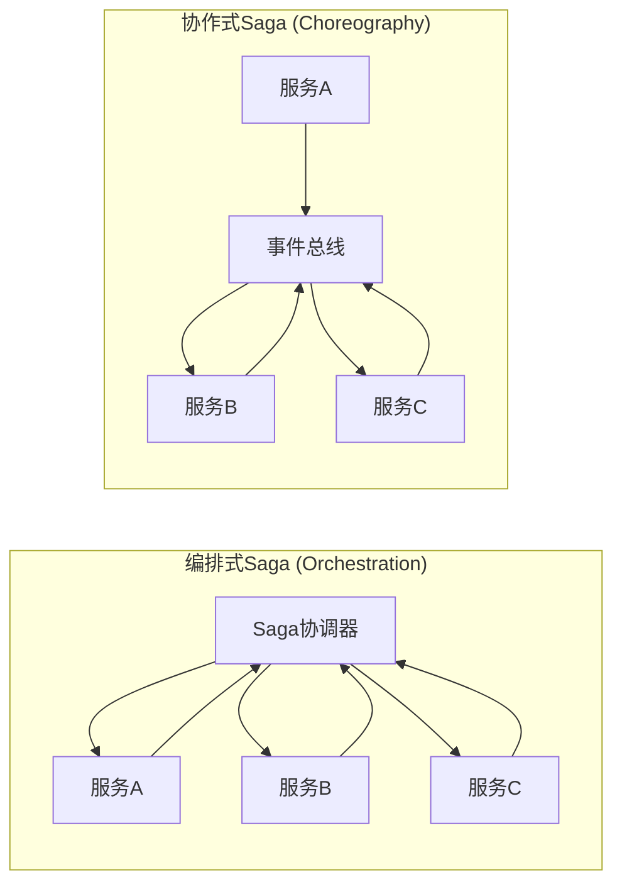

# 分布式事务处理设计方案

## 设计目标与价值

### 核心目标
- **数据一致性保证**：确保跨服务的业务操作保持数据一致性
- **高可用性**：避免分布式锁导致的系统阻塞
- **故障恢复**：提供完善的补偿机制和故障恢复能力
- **可观测性**：提供事务执行状态的完整追踪
- **性能优化**：避免长时间锁定资源，提升系统吞吐量

### 业务价值
- **业务完整性**：保证复杂业务流程的原子性
- **系统可靠性**：提供可靠的分布式事务处理能力
- **运维友好**：提供清晰的事务状态监控和故障诊断
- **扩展性**：支持新业务场景的事务处理需求

## Saga模式架构设计

### 整体架构



### Saga模式类型



## Saga事务定义与管理

### 事务步骤接口

```typescript
// 事务步骤基础接口
interface SagaStep {
  stepId: string;
  stepName: string;
  serviceId: string;
  execute(context: SagaContext): Promise<StepResult>;
  compensate(context: SagaContext): Promise<CompensationResult>;
  validate(context: SagaContext): Promise<boolean>;
}

// 事务上下文
interface SagaContext {
  sagaId: string;
  transactionId: string;
  correlationId: string;
  data: Record<string, any>;
  metadata: SagaMetadata;
  stepResults: Map<string, StepResult>;
}

// 事务元数据
interface SagaMetadata {
  startTime: Date;
  timeout: number;
  retryPolicy: RetryPolicy;
  compensationPolicy: CompensationPolicy;
  priority: SagaPriority;
  tags: string[];
}

// 步骤执行结果
interface StepResult {
  stepId: string;
  status: StepStatus;
  data?: any;
  error?: Error;
  executionTime: number;
  retryCount: number;
}

enum StepStatus {
  PENDING = 'pending',
  EXECUTING = 'executing',
  COMPLETED = 'completed',
  FAILED = 'failed',
  COMPENSATING = 'compensating',
  COMPENSATED = 'compensated'
}
```

### Saga定义

```typescript
// Saga定义接口
interface SagaDefinition {
  sagaId: string;
  sagaName: string;
  version: string;
  steps: SagaStep[];
  compensationOrder: string[];
  timeout: number;
  retryPolicy: RetryPolicy;
}

// 订单创建Saga定义
class OrderCreationSaga implements SagaDefinition {
  sagaId = 'order-creation-saga';
  sagaName = '订单创建事务';
  version = '1.0.0';
  timeout = 300000; // 5分钟
  
  steps: SagaStep[] = [
    new ValidateCustomerStep(),
    new ReserveInventoryStep(),
    new CreateOrderStep(),
    new ProcessPaymentStep(),
    new UpdateCustomerStep(),
    new SendNotificationStep()
  ];
  
  compensationOrder = [
    'send-notification',
    'update-customer',
    'process-payment',
    'create-order',
    'reserve-inventory',
    'validate-customer'
  ];
  
  retryPolicy: RetryPolicy = {
    maxRetries: 3,
    backoffStrategy: BackoffStrategy.EXPONENTIAL,
    baseDelay: 1000,
    maxDelay: 10000
  };
}
```

## 具体事务步骤实现

### 客户验证步骤

```typescript
class ValidateCustomerStep implements SagaStep {
  stepId = 'validate-customer';
  stepName = '验证客户信息';
  serviceId = 'customer-service';
  
  async execute(context: SagaContext): Promise<StepResult> {
    const startTime = Date.now();
    
    try {
      const customerId = context.data.customerId;
      const customerService = new CustomerServiceClient();
      
      const customer = await customerService.validateCustomer(customerId);
      
      if (!customer.isActive) {
        throw new Error('客户账户未激活');
      }
      
      if (customer.creditLimit < context.data.orderAmount) {
        throw new Error('客户信用额度不足');
      }
      
      return {
        stepId: this.stepId,
        status: StepStatus.COMPLETED,
        data: { customer },
        executionTime: Date.now() - startTime,
        retryCount: 0
      };
    } catch (error) {
      return {
        stepId: this.stepId,
        status: StepStatus.FAILED,
        error,
        executionTime: Date.now() - startTime,
        retryCount: 0
      };
    }
  }
  
  async compensate(context: SagaContext): Promise<CompensationResult> {
    // 客户验证步骤通常不需要补偿
    return {
      stepId: this.stepId,
      status: CompensationStatus.COMPLETED,
      message: '客户验证步骤无需补偿'
    };
  }
  
  async validate(context: SagaContext): Promise<boolean> {
    return context.data.customerId != null;
  }
}
```

### 库存预留步骤

```typescript
class ReserveInventoryStep implements SagaStep {
  stepId = 'reserve-inventory';
  stepName = '预留库存';
  serviceId = 'inventory-service';
  
  async execute(context: SagaContext): Promise<StepResult> {
    const startTime = Date.now();
    
    try {
      const orderItems = context.data.orderItems;
      const inventoryService = new InventoryServiceClient();
      
      const reservationId = await inventoryService.reserveInventory({
        items: orderItems,
        customerId: context.data.customerId,
        orderId: context.data.orderId,
        expirationTime: new Date(Date.now() + 300000) // 5分钟过期
      });
      
      return {
        stepId: this.stepId,
        status: StepStatus.COMPLETED,
        data: { reservationId },
        executionTime: Date.now() - startTime,
        retryCount: 0
      };
    } catch (error) {
      return {
        stepId: this.stepId,
        status: StepStatus.FAILED,
        error,
        executionTime: Date.now() - startTime,
        retryCount: 0
      };
    }
  }
  
  async compensate(context: SagaContext): Promise<CompensationResult> {
    try {
      const stepResult = context.stepResults.get(this.stepId);
      if (stepResult?.data?.reservationId) {
        const inventoryService = new InventoryServiceClient();
        await inventoryService.releaseReservation(stepResult.data.reservationId);
      }
      
      return {
        stepId: this.stepId,
        status: CompensationStatus.COMPLETED,
        message: '库存预留已释放'
      };
    } catch (error) {
      return {
        stepId: this.stepId,
        status: CompensationStatus.FAILED,
        error,
        message: '库存预留释放失败'
      };
    }
  }
  
  async validate(context: SagaContext): Promise<boolean> {
    return Array.isArray(context.data.orderItems) && context.data.orderItems.length > 0;
  }
}
```

### 订单创建步骤

```typescript
class CreateOrderStep implements SagaStep {
  stepId = 'create-order';
  stepName = '创建订单';
  serviceId = 'order-service';
  
  async execute(context: SagaContext): Promise<StepResult> {
    const startTime = Date.now();
    
    try {
      const orderService = new OrderServiceClient();
      
      const order = await orderService.createOrder({
        customerId: context.data.customerId,
        items: context.data.orderItems,
        totalAmount: context.data.orderAmount,
        reservationId: context.stepResults.get('reserve-inventory')?.data?.reservationId,
        status: OrderStatus.PENDING_PAYMENT
      });
      
      // 更新上下文中的订单ID
      context.data.orderId = order.id;
      
      return {
        stepId: this.stepId,
        status: StepStatus.COMPLETED,
        data: { order },
        executionTime: Date.now() - startTime,
        retryCount: 0
      };
    } catch (error) {
      return {
        stepId: this.stepId,
        status: StepStatus.FAILED,
        error,
        executionTime: Date.now() - startTime,
        retryCount: 0
      };
    }
  }
  
  async compensate(context: SagaContext): Promise<CompensationResult> {
    try {
      const stepResult = context.stepResults.get(this.stepId);
      if (stepResult?.data?.order?.id) {
        const orderService = new OrderServiceClient();
        await orderService.cancelOrder(stepResult.data.order.id, '事务回滚');
      }
      
      return {
        stepId: this.stepId,
        status: CompensationStatus.COMPLETED,
        message: '订单已取消'
      };
    } catch (error) {
      return {
        stepId: this.stepId,
        status: CompensationStatus.FAILED,
        error,
        message: '订单取消失败'
      };
    }
  }
  
  async validate(context: SagaContext): Promise<boolean> {
    return context.data.customerId != null && 
           context.data.orderAmount > 0 &&
           context.stepResults.get('reserve-inventory')?.status === StepStatus.COMPLETED;
  }
}
```

### 支付处理步骤

```typescript
class ProcessPaymentStep implements SagaStep {
  stepId = 'process-payment';
  stepName = '处理支付';
  serviceId = 'payment-service';
  
  async execute(context: SagaContext): Promise<StepResult> {
    const startTime = Date.now();
    
    try {
      const paymentService = new PaymentServiceClient();
      
      const payment = await paymentService.processPayment({
        customerId: context.data.customerId,
        orderId: context.data.orderId,
        amount: context.data.orderAmount,
        paymentMethod: context.data.paymentMethod,
        currency: 'CNY'
      });
      
      return {
        stepId: this.stepId,
        status: StepStatus.COMPLETED,
        data: { payment },
        executionTime: Date.now() - startTime,
        retryCount: 0
      };
    } catch (error) {
      return {
        stepId: this.stepId,
        status: StepStatus.FAILED,
        error,
        executionTime: Date.now() - startTime,
        retryCount: 0
      };
    }
  }
  
  async compensate(context: SagaContext): Promise<CompensationResult> {
    try {
      const stepResult = context.stepResults.get(this.stepId);
      if (stepResult?.data?.payment?.id) {
        const paymentService = new PaymentServiceClient();
        await paymentService.refundPayment(stepResult.data.payment.id, '事务回滚退款');
      }
      
      return {
        stepId: this.stepId,
        status: CompensationStatus.COMPLETED,
        message: '支付已退款'
      };
    } catch (error) {
      return {
        stepId: this.stepId,
        status: CompensationStatus.FAILED,
        error,
        message: '支付退款失败'
      };
    }
  }
  
  async validate(context: SagaContext): Promise<boolean> {
    return context.data.orderId != null && 
           context.data.paymentMethod != null &&
           context.stepResults.get('create-order')?.status === StepStatus.COMPLETED;
  }
}
```

## Saga协调器实现

### 核心协调器

```typescript
class SagaOrchestrator {
  private sagaRepository: SagaRepository;
  private eventPublisher: EventPublisher;
  private stepExecutor: StepExecutor;
  private compensationHandler: CompensationHandler;
  private retryHandler: RetryHandler;
  
  constructor(
    sagaRepository: SagaRepository,
    eventPublisher: EventPublisher,
    stepExecutor: StepExecutor,
    compensationHandler: CompensationHandler,
    retryHandler: RetryHandler
  ) {
    this.sagaRepository = sagaRepository;
    this.eventPublisher = eventPublisher;
    this.stepExecutor = stepExecutor;
    this.compensationHandler = compensationHandler;
    this.retryHandler = retryHandler;
  }
  
  async startSaga(sagaDefinition: SagaDefinition, initialData: any): Promise<string> {
    const sagaId = generateUUID();
    const context: SagaContext = {
      sagaId,
      transactionId: generateUUID(),
      correlationId: generateUUID(),
      data: initialData,
      metadata: {
        startTime: new Date(),
        timeout: sagaDefinition.timeout,
        retryPolicy: sagaDefinition.retryPolicy,
        compensationPolicy: CompensationPolicy.REVERSE_ORDER,
        priority: SagaPriority.NORMAL,
        tags: []
      },
      stepResults: new Map()
    };
    
    const sagaInstance: SagaInstance = {
      sagaId,
      sagaDefinition,
      context,
      status: SagaStatus.STARTED,
      currentStepIndex: 0,
      createdAt: new Date(),
      updatedAt: new Date()
    };
    
    await this.sagaRepository.save(sagaInstance);
    
    // 发布Saga开始事件
    await this.eventPublisher.publish(new SagaStartedEvent(sagaId, sagaDefinition.sagaName));
    
    // 开始执行第一个步骤
    await this.executeNextStep(sagaInstance);
    
    return sagaId;
  }
  
  async executeNextStep(sagaInstance: SagaInstance): Promise<void> {
    const { sagaDefinition, context, currentStepIndex } = sagaInstance;
    
    if (currentStepIndex >= sagaDefinition.steps.length) {
      await this.completeSaga(sagaInstance);
      return;
    }
    
    const currentStep = sagaDefinition.steps[currentStepIndex];
    sagaInstance.status = SagaStatus.EXECUTING;
    sagaInstance.updatedAt = new Date();
    
    await this.sagaRepository.save(sagaInstance);
    
    try {
      // 验证步骤前置条件
      const isValid = await currentStep.validate(context);
      if (!isValid) {
        throw new Error(`步骤 ${currentStep.stepName} 前置条件验证失败`);
      }
      
      // 执行步骤
      const stepResult = await this.stepExecutor.execute(currentStep, context);
      context.stepResults.set(currentStep.stepId, stepResult);
      
      if (stepResult.status === StepStatus.COMPLETED) {
        // 步骤成功，继续下一步
        sagaInstance.currentStepIndex++;
        await this.executeNextStep(sagaInstance);
      } else if (stepResult.status === StepStatus.FAILED) {
        // 步骤失败，尝试重试或开始补偿
        await this.handleStepFailure(sagaInstance, currentStep, stepResult);
      }
    } catch (error) {
      await this.handleStepError(sagaInstance, currentStep, error);
    }
  }
  
  private async handleStepFailure(
    sagaInstance: SagaInstance, 
    failedStep: SagaStep, 
    stepResult: StepResult
  ): Promise<void> {
    const shouldRetry = await this.retryHandler.shouldRetry(
      failedStep, 
      stepResult, 
      sagaInstance.context.metadata.retryPolicy
    );
    
    if (shouldRetry) {
      // 重试步骤
      await this.retryStep(sagaInstance, failedStep);
    } else {
      // 开始补偿流程
      await this.startCompensation(sagaInstance, stepResult.error);
    }
  }
  
  private async startCompensation(sagaInstance: SagaInstance, error?: Error): Promise<void> {
    sagaInstance.status = SagaStatus.COMPENSATING;
    sagaInstance.updatedAt = new Date();
    
    await this.sagaRepository.save(sagaInstance);
    
    // 发布补偿开始事件
    await this.eventPublisher.publish(new SagaCompensationStartedEvent(
      sagaInstance.sagaId, 
      error?.message || '未知错误'
    ));
    
    // 执行补偿
    await this.compensationHandler.compensate(sagaInstance);
  }
  
  private async completeSaga(sagaInstance: SagaInstance): Promise<void> {
    sagaInstance.status = SagaStatus.COMPLETED;
    sagaInstance.updatedAt = new Date();
    
    await this.sagaRepository.save(sagaInstance);
    
    // 发布Saga完成事件
    await this.eventPublisher.publish(new SagaCompletedEvent(
      sagaInstance.sagaId,
      sagaInstance.context.stepResults
    ));
  }
}
```

### 补偿处理器

```typescript
class CompensationHandler {
  private eventPublisher: EventPublisher;
  
  constructor(eventPublisher: EventPublisher) {
    this.eventPublisher = eventPublisher;
  }
  
  async compensate(sagaInstance: SagaInstance): Promise<void> {
    const { sagaDefinition, context } = sagaInstance;
    const compensationOrder = sagaDefinition.compensationOrder;
    
    for (const stepId of compensationOrder) {
      const step = sagaDefinition.steps.find(s => s.stepId === stepId);
      const stepResult = context.stepResults.get(stepId);
      
      // 只补偿已成功执行的步骤
      if (step && stepResult?.status === StepStatus.COMPLETED) {
        try {
          const compensationResult = await step.compensate(context);
          
          if (compensationResult.status === CompensationStatus.COMPLETED) {
            await this.eventPublisher.publish(new StepCompensatedEvent(
              sagaInstance.sagaId,
              stepId,
              compensationResult.message
            ));
          } else {
            await this.eventPublisher.publish(new StepCompensationFailedEvent(
              sagaInstance.sagaId,
              stepId,
              compensationResult.error?.message || '补偿失败'
            ));
          }
        } catch (error) {
          await this.eventPublisher.publish(new StepCompensationFailedEvent(
            sagaInstance.sagaId,
            stepId,
            error.message
          ));
        }
      }
    }
    
    // 标记Saga为已补偿
    sagaInstance.status = SagaStatus.COMPENSATED;
    sagaInstance.updatedAt = new Date();
    
    await this.eventPublisher.publish(new SagaCompensatedEvent(sagaInstance.sagaId));
  }
}
```

## 事务状态管理

### 状态定义

```typescript
enum SagaStatus {
  STARTED = 'started',
  EXECUTING = 'executing',
  COMPLETED = 'completed',
  COMPENSATING = 'compensating',
  COMPENSATED = 'compensated',
  FAILED = 'failed',
  TIMEOUT = 'timeout'
}

enum CompensationStatus {
  PENDING = 'pending',
  EXECUTING = 'executing',
  COMPLETED = 'completed',
  FAILED = 'failed'
}

interface SagaInstance {
  sagaId: string;
  sagaDefinition: SagaDefinition;
  context: SagaContext;
  status: SagaStatus;
  currentStepIndex: number;
  createdAt: Date;
  updatedAt: Date;
  completedAt?: Date;
  error?: Error;
}
```

### 状态存储

```typescript
class PostgreSQLSagaRepository implements SagaRepository {
  private pool: Pool;
  
  constructor(pool: Pool) {
    this.pool = pool;
  }
  
  async save(sagaInstance: SagaInstance): Promise<void> {
    const client = await this.pool.connect();
    
    try {
      await client.query('BEGIN');
      
      const sagaQuery = `
        INSERT INTO saga_instances (
          saga_id, saga_name, saga_version, status, current_step_index,
          context_data, created_at, updated_at, completed_at, error_message
        ) VALUES ($1, $2, $3, $4, $5, $6, $7, $8, $9, $10)
        ON CONFLICT (saga_id) DO UPDATE SET
          status = EXCLUDED.status,
          current_step_index = EXCLUDED.current_step_index,
          context_data = EXCLUDED.context_data,
          updated_at = EXCLUDED.updated_at,
          completed_at = EXCLUDED.completed_at,
          error_message = EXCLUDED.error_message
      `;
      
      await client.query(sagaQuery, [
        sagaInstance.sagaId,
        sagaInstance.sagaDefinition.sagaName,
        sagaInstance.sagaDefinition.version,
        sagaInstance.status,
        sagaInstance.currentStepIndex,
        JSON.stringify(sagaInstance.context),
        sagaInstance.createdAt,
        sagaInstance.updatedAt,
        sagaInstance.completedAt,
        sagaInstance.error?.message
      ]);
      
      // 保存步骤执行结果
      for (const [stepId, stepResult] of sagaInstance.context.stepResults) {
        const stepQuery = `
          INSERT INTO saga_step_results (
            saga_id, step_id, status, result_data, error_message,
            execution_time, retry_count, created_at
          ) VALUES ($1, $2, $3, $4, $5, $6, $7, $8)
          ON CONFLICT (saga_id, step_id) DO UPDATE SET
            status = EXCLUDED.status,
            result_data = EXCLUDED.result_data,
            error_message = EXCLUDED.error_message,
            execution_time = EXCLUDED.execution_time,
            retry_count = EXCLUDED.retry_count
        `;
        
        await client.query(stepQuery, [
          sagaInstance.sagaId,
          stepId,
          stepResult.status,
          JSON.stringify(stepResult.data),
          stepResult.error?.message,
          stepResult.executionTime,
          stepResult.retryCount,
          new Date()
        ]);
      }
      
      await client.query('COMMIT');
    } catch (error) {
      await client.query('ROLLBACK');
      throw error;
    } finally {
      client.release();
    }
  }
  
  async findById(sagaId: string): Promise<SagaInstance | null> {
    const client = await this.pool.connect();
    
    try {
      const sagaQuery = `
        SELECT * FROM saga_instances WHERE saga_id = $1
      `;
      
      const sagaResult = await client.query(sagaQuery, [sagaId]);
      
      if (sagaResult.rows.length === 0) {
        return null;
      }
      
      const sagaRow = sagaResult.rows[0];
      const context = JSON.parse(sagaRow.context_data);
      
      // 加载步骤结果
      const stepQuery = `
        SELECT * FROM saga_step_results WHERE saga_id = $1
      `;
      
      const stepResult = await client.query(stepQuery, [sagaId]);
      const stepResults = new Map<string, StepResult>();
      
      for (const stepRow of stepResult.rows) {
        stepResults.set(stepRow.step_id, {
          stepId: stepRow.step_id,
          status: stepRow.status,
          data: JSON.parse(stepRow.result_data || '{}'),
          error: stepRow.error_message ? new Error(stepRow.error_message) : undefined,
          executionTime: stepRow.execution_time,
          retryCount: stepRow.retry_count
        });
      }
      
      context.stepResults = stepResults;
      
      return {
        sagaId: sagaRow.saga_id,
        sagaDefinition: await this.loadSagaDefinition(sagaRow.saga_name, sagaRow.saga_version),
        context,
        status: sagaRow.status,
        currentStepIndex: sagaRow.current_step_index,
        createdAt: sagaRow.created_at,
        updatedAt: sagaRow.updated_at,
        completedAt: sagaRow.completed_at,
        error: sagaRow.error_message ? new Error(sagaRow.error_message) : undefined
      };
    } finally {
      client.release();
    }
  }
  
  private async loadSagaDefinition(sagaName: string, version: string): Promise<SagaDefinition> {
    // 从注册表加载Saga定义
    const sagaRegistry = SagaRegistry.getInstance();
    return sagaRegistry.getSagaDefinition(sagaName, version);
  }
}
```

## 重试机制与故障恢复

### 重试策略

```typescript
interface RetryPolicy {
  maxRetries: number;
  backoffStrategy: BackoffStrategy;
  baseDelay: number;
  maxDelay: number;
  retryableErrors?: string[];
}

enum BackoffStrategy {
  FIXED = 'fixed',
  LINEAR = 'linear',
  EXPONENTIAL = 'exponential',
  RANDOM = 'random'
}

class RetryHandler {
  async shouldRetry(step: SagaStep, stepResult: StepResult, retryPolicy: RetryPolicy): Promise<boolean> {
    if (stepResult.retryCount >= retryPolicy.maxRetries) {
      return false;
    }
    
    if (retryPolicy.retryableErrors && stepResult.error) {
      const isRetryableError = retryPolicy.retryableErrors.some(errorType => 
        stepResult.error!.message.includes(errorType)
      );
      
      if (!isRetryableError) {
        return false;
      }
    }
    
    return true;
  }
  
  calculateDelay(retryCount: number, retryPolicy: RetryPolicy): number {
    switch (retryPolicy.backoffStrategy) {
      case BackoffStrategy.FIXED:
        return retryPolicy.baseDelay;
        
      case BackoffStrategy.LINEAR:
        return Math.min(retryPolicy.baseDelay * (retryCount + 1), retryPolicy.maxDelay);
        
      case BackoffStrategy.EXPONENTIAL:
        return Math.min(retryPolicy.baseDelay * Math.pow(2, retryCount), retryPolicy.maxDelay);
        
      case BackoffStrategy.RANDOM:
        return Math.random() * retryPolicy.maxDelay;
        
      default:
        return retryPolicy.baseDelay;
    }
  }
}
```

### 超时处理

```typescript
class SagaTimeoutHandler {
  private sagaRepository: SagaRepository;
  private compensationHandler: CompensationHandler;
  
  constructor(sagaRepository: SagaRepository, compensationHandler: CompensationHandler) {
    this.sagaRepository = sagaRepository;
    this.compensationHandler = compensationHandler;
  }
  
  async checkTimeouts(): Promise<void> {
    const timeoutSagas = await this.sagaRepository.findTimeoutSagas();
    
    for (const saga of timeoutSagas) {
      await this.handleTimeout(saga);
    }
  }
  
  private async handleTimeout(sagaInstance: SagaInstance): Promise<void> {
    sagaInstance.status = SagaStatus.TIMEOUT;
    sagaInstance.error = new Error('Saga执行超时');
    sagaInstance.updatedAt = new Date();
    
    await this.sagaRepository.save(sagaInstance);
    
    // 开始补偿流程
    await this.compensationHandler.compensate(sagaInstance);
  }
  
  // 定时任务，每分钟检查一次超时的Saga
  @Cron('0 * * * * *')
  async handleTimeoutCheck(): Promise<void> {
    await this.checkTimeouts();
  }
}
```

## 监控与可观测性

### Saga监控服务

```typescript
class SagaMonitoringService {
  private sagaRepository: SagaRepository;
  private metricsCollector: MetricsCollector;
  
  constructor(sagaRepository: SagaRepository, metricsCollector: MetricsCollector) {
    this.sagaRepository = sagaRepository;
    this.metricsCollector = metricsCollector;
  }
  
  async getSagaStatistics(timeRange: TimeRange): Promise<SagaStatistics> {
    const stats = await this.sagaRepository.getStatistics(timeRange);
    
    return {
      totalSagas: stats.total,
      completedSagas: stats.completed,
      failedSagas: stats.failed,
      compensatedSagas: stats.compensated,
      averageExecutionTime: stats.avgExecutionTime,
      successRate: stats.completed / stats.total,
      compensationRate: stats.compensated / stats.total,
      topFailureReasons: stats.topFailureReasons,
      performanceMetrics: {
        p50ExecutionTime: stats.p50ExecutionTime,
        p95ExecutionTime: stats.p95ExecutionTime,
        p99ExecutionTime: stats.p99ExecutionTime
      }
    };
  }
  
  async getActiveSagas(): Promise<SagaInstance[]> {
    return this.sagaRepository.findActiveSagas();
  }
  
  async getSagaHealth(): Promise<SagaHealthReport> {
    const activeSagas = await this.getActiveSagas();
    const longRunningSagas = activeSagas.filter(saga => 
      Date.now() - saga.createdAt.getTime() > 300000 // 5分钟
    );
    
    const stuckSagas = activeSagas.filter(saga => 
      Date.now() - saga.updatedAt.getTime() > 600000 // 10分钟
    );
    
    return {
      totalActiveSagas: activeSagas.length,
      longRunningSagas: longRunningSagas.length,
      stuckSagas: stuckSagas.length,
      healthStatus: stuckSagas.length > 0 ? 'UNHEALTHY' : 'HEALTHY',
      recommendations: this.generateRecommendations(longRunningSagas, stuckSagas)
    };
  }
  
  private generateRecommendations(
    longRunningSagas: SagaInstance[], 
    stuckSagas: SagaInstance[]
  ): string[] {
    const recommendations: string[] = [];
    
    if (stuckSagas.length > 0) {
      recommendations.push(`发现 ${stuckSagas.length} 个卡住的Saga，建议检查相关服务状态`);
    }
    
    if (longRunningSagas.length > 5) {
      recommendations.push(`发现 ${longRunningSagas.length} 个长时间运行的Saga，建议优化业务流程`);
    }
    
    return recommendations;
  }
}
```

### 事件追踪

```typescript
class SagaEventTracker {
  private eventStore: EventStore;
  
  constructor(eventStore: EventStore) {
    this.eventStore = eventStore;
  }
  
  async trackSagaEvent(event: SagaEvent): Promise<void> {
    await this.eventStore.append(event.sagaId, event);
    
    // 发送到监控系统
    await this.sendToMonitoring(event);
  }
  
  private async sendToMonitoring(event: SagaEvent): Promise<void> {
    // 发送到Prometheus、Grafana等监控系统
    const metrics = {
      saga_events_total: 1,
      saga_id: event.sagaId,
      event_type: event.eventType,
      timestamp: event.timestamp
    };
    
    // 实现具体的监控数据发送逻辑
  }
  
  async getSagaEventHistory(sagaId: string): Promise<SagaEvent[]> {
    return this.eventStore.getEvents(sagaId);
  }
}
```

## 总结

本分布式事务处理设计方案基于Saga模式，为罗莱L2C销售管理系统提供了完整的分布式事务处理能力：

### 核心优势
- **数据一致性保证**：通过补偿机制确保最终一致性
- **高可用性**：避免分布式锁，提升系统可用性
- **故障恢复能力**：完善的重试和补偿机制
- **可观测性**：全面的监控和追踪能力
- **扩展性**：支持新业务场景的事务处理

### 架构特点
- **编排式Saga**：集中式协调器管理事务流程
- **状态持久化**：完整的事务状态存储和恢复
- **事件驱动**：基于事件的异步处理机制
- **监控友好**：丰富的监控指标和健康检查

### 实施价值
- **业务完整性**：保证复杂业务流程的原子性
- **系统可靠性**：提供可靠的分布式事务处理
- **运维效率**：清晰的状态监控和故障诊断
- **开发效率**：标准化的事务处理框架
