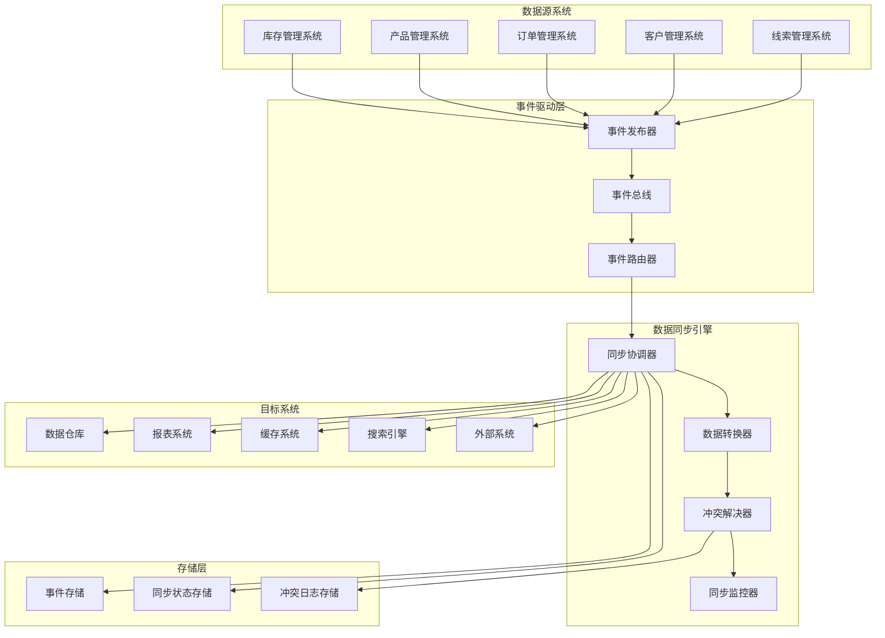
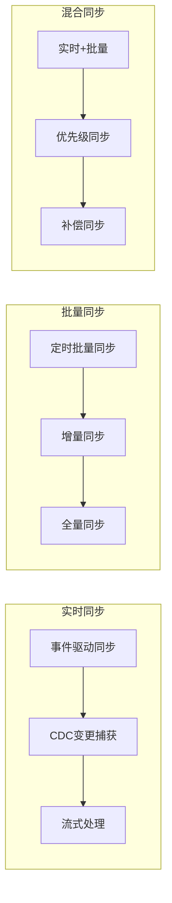

# 数据同步机制设计方案

## 设计目标与价值

### 核心目标
- **数据一致性**：确保分布式系统中数据的最终一致性
- **实时同步**：提供近实时的数据同步能力
- **高可用性**：保证数据同步服务的高可用性
- **可扩展性**：支持大规模数据同步场景
- **故障恢复**：提供完善的故障检测和恢复机制

### 业务价值
- **数据准确性**：保证各系统间数据的准确性和一致性
- **业务连续性**：确保业务流程的连续性和完整性
- **决策支持**：为业务决策提供准确的数据基础
- **用户体验**：提升用户体验的一致性

## 数据同步架构设计

### 整体架构



### 同步模式分类



## 事件驱动数据同步

### 数据变更事件定义

```typescript
// 数据变更事件基类
abstract class DataChangeEvent {
  eventId: string;
  eventType: DataChangeType;
  sourceSystem: string;
  entityType: string;
  entityId: string;
  timestamp: Date;
  version: number;
  correlationId: string;
  metadata: EventMetadata;
  
  constructor(
    eventType: DataChangeType,
    sourceSystem: string,
    entityType: string,
    entityId: string,
    metadata: EventMetadata = {}
  ) {
    this.eventId = generateUUID();
    this.eventType = eventType;
    this.sourceSystem = sourceSystem;
    this.entityType = entityType;
    this.entityId = entityId;
    this.timestamp = new Date();
    this.version = 1;
    this.correlationId = generateUUID();
    this.metadata = metadata;
  }
  
  abstract getData(): any;
  abstract getOldData(): any;
}

enum DataChangeType {
  CREATED = 'created',
  UPDATED = 'updated',
  DELETED = 'deleted',
  MERGED = 'merged',
  ARCHIVED = 'archived'
}

interface EventMetadata {
  userId?: string;
  sessionId?: string;
  source?: string;
  reason?: string;
  tags?: string[];
  priority?: SyncPriority;
}

enum SyncPriority {
  LOW = 'low',
  NORMAL = 'normal',
  HIGH = 'high',
  CRITICAL = 'critical'
}
```

### 具体数据变更事件

```typescript
// 线索数据变更事件
class LeadDataChangeEvent extends DataChangeEvent {
  private leadData: LeadData;
  private oldLeadData?: LeadData;
  
  constructor(
    eventType: DataChangeType,
    leadData: LeadData,
    oldLeadData?: LeadData,
    metadata: EventMetadata = {}
  ) {
    super(eventType, 'lead-service', 'lead', leadData.id, metadata);
    this.leadData = leadData;
    this.oldLeadData = oldLeadData;
  }
  
  getData(): LeadData {
    return this.leadData;
  }
  
  getOldData(): LeadData | undefined {
    return this.oldLeadData;
  }
  
  getChangedFields(): string[] {
    if (!this.oldLeadData) return [];
    
    const changedFields: string[] = [];
    const currentData = this.leadData;
    const oldData = this.oldLeadData;
    
    Object.keys(currentData).forEach(key => {
      if (currentData[key] !== oldData[key]) {
        changedFields.push(key);
      }
    });
    
    return changedFields;
  }
}

// 客户数据变更事件
class CustomerDataChangeEvent extends DataChangeEvent {
  private customerData: CustomerData;
  private oldCustomerData?: CustomerData;
  
  constructor(
    eventType: DataChangeType,
    customerData: CustomerData,
    oldCustomerData?: CustomerData,
    metadata: EventMetadata = {}
  ) {
    super(eventType, 'customer-service', 'customer', customerData.id, metadata);
    this.customerData = customerData;
    this.oldCustomerData = oldCustomerData;
  }
  
  getData(): CustomerData {
    return this.customerData;
  }
  
  getOldData(): CustomerData | undefined {
    return this.oldCustomerData;
  }
}

// 订单数据变更事件
class OrderDataChangeEvent extends DataChangeEvent {
  private orderData: OrderData;
  private oldOrderData?: OrderData;
  
  constructor(
    eventType: DataChangeType,
    orderData: OrderData,
    oldOrderData?: OrderData,
    metadata: EventMetadata = {}
  ) {
    super(eventType, 'order-service', 'order', orderData.id, metadata);
    this.orderData = orderData;
    this.oldOrderData = oldOrderData;
  }
  
  getData(): OrderData {
    return this.orderData;
  }
  
  getOldData(): OrderData | undefined {
    return this.oldOrderData;
  }
}
```

### 事件发布器

```typescript
class DataChangeEventPublisher {
  private eventBus: EventBus;
  private eventStore: EventStore;
  private retryHandler: RetryHandler;
  
  constructor(
    eventBus: EventBus,
    eventStore: EventStore,
    retryHandler: RetryHandler
  ) {
    this.eventBus = eventBus;
    this.eventStore = eventStore;
    this.retryHandler = retryHandler;
  }
  
  async publishDataChange(event: DataChangeEvent): Promise<void> {
    try {
      // 存储事件
      await this.eventStore.append(event.entityId, event);
      
      // 发布事件到事件总线
      await this.eventBus.publish(event);
      
      // 记录发布成功
      await this.recordPublishSuccess(event);
    } catch (error) {
      // 记录发布失败
      await this.recordPublishFailure(event, error);
      
      // 重试机制
      await this.retryHandler.scheduleRetry(event, error);
    }
  }
  
  async publishBatchDataChanges(events: DataChangeEvent[]): Promise<void> {
    const batchId = generateUUID();
    
    try {
      // 批量存储事件
      await this.eventStore.appendBatch(events);
      
      // 批量发布事件
      await this.eventBus.publishBatch(events);
      
      // 记录批量发布成功
      await this.recordBatchPublishSuccess(batchId, events);
    } catch (error) {
      // 记录批量发布失败
      await this.recordBatchPublishFailure(batchId, events, error);
      
      // 逐个重试失败的事件
      for (const event of events) {
        await this.retryHandler.scheduleRetry(event, error);
      }
    }
  }
  
  private async recordPublishSuccess(event: DataChangeEvent): Promise<void> {
    // 记录发布成功的指标
    const metrics = {
      event_published_total: 1,
      event_type: event.eventType,
      source_system: event.sourceSystem,
      entity_type: event.entityType,
      success: true
    };
    
    await this.recordMetrics(metrics);
  }
  
  private async recordPublishFailure(event: DataChangeEvent, error: Error): Promise<void> {
    // 记录发布失败的指标
    const metrics = {
      event_published_total: 1,
      event_type: event.eventType,
      source_system: event.sourceSystem,
      entity_type: event.entityType,
      success: false,
      error_type: error.constructor.name
    };
    
    await this.recordMetrics(metrics);
  }
  
  private async recordMetrics(metrics: any): Promise<void> {
    // 发送指标到监控系统
    // 实现具体的指标记录逻辑
  }
}
```

## 数据同步引擎

### 同步协调器

```typescript
class DataSyncCoordinator {
  private syncRules: Map<string, SyncRule[]>;
  private dataTransformer: DataTransformer;
  private conflictResolver: ConflictResolver;
  private syncStateManager: SyncStateManager;
  private targetSystemClients: Map<string, TargetSystemClient>;
  
  constructor(
    dataTransformer: DataTransformer,
    conflictResolver: ConflictResolver,
    syncStateManager: SyncStateManager
  ) {
    this.syncRules = new Map();
    this.dataTransformer = dataTransformer;
    this.conflictResolver = conflictResolver;
    this.syncStateManager = syncStateManager;
    this.targetSystemClients = new Map();
  }
  
  async handleDataChangeEvent(event: DataChangeEvent): Promise<void> {
    const syncTasks = await this.createSyncTasks(event);
    
    for (const task of syncTasks) {
      await this.executeSyncTask(task);
    }
  }
  
  private async createSyncTasks(event: DataChangeEvent): Promise<SyncTask[]> {
    const rules = this.syncRules.get(event.entityType) || [];
    const tasks: SyncTask[] = [];
    
    for (const rule of rules) {
      if (await this.shouldSync(event, rule)) {
        const task: SyncTask = {
          taskId: generateUUID(),
          event,
          rule,
          status: SyncTaskStatus.PENDING,
          createdAt: new Date(),
          retryCount: 0
        };
        
        tasks.push(task);
      }
    }
    
    return tasks;
  }
  
  private async shouldSync(event: DataChangeEvent, rule: SyncRule): Promise<boolean> {
    // 检查同步条件
    if (rule.conditions) {
      for (const condition of rule.conditions) {
        if (!await condition.evaluate(event)) {
          return false;
        }
      }
    }
    
    // 检查优先级
    if (rule.minPriority && event.metadata.priority) {
      const priorityOrder = [SyncPriority.LOW, SyncPriority.NORMAL, SyncPriority.HIGH, SyncPriority.CRITICAL];
      const eventPriorityIndex = priorityOrder.indexOf(event.metadata.priority);
      const rulePriorityIndex = priorityOrder.indexOf(rule.minPriority);
      
      if (eventPriorityIndex < rulePriorityIndex) {
        return false;
      }
    }
    
    return true;
  }
  
  private async executeSyncTask(task: SyncTask): Promise<void> {
    try {
      task.status = SyncTaskStatus.EXECUTING;
      task.startedAt = new Date();
      
      await this.syncStateManager.updateTaskStatus(task);
      
      // 数据转换
      const transformedData = await this.dataTransformer.transform(
        task.event.getData(),
        task.rule.targetSystem,
        task.rule.transformationRules
      );
      
      // 冲突检测和解决
      const conflictResolution = await this.conflictResolver.resolve(
        task.event,
        transformedData,
        task.rule.targetSystem
      );
      
      if (conflictResolution.hasConflict) {
        await this.handleConflict(task, conflictResolution);
        return;
      }
      
      // 同步到目标系统
      const targetClient = this.targetSystemClients.get(task.rule.targetSystem);
      if (!targetClient) {
        throw new Error(`目标系统客户端未找到: ${task.rule.targetSystem}`);
      }
      
      await targetClient.syncData(task.event.entityType, transformedData, task.event.eventType);
      
      // 更新同步状态
      task.status = SyncTaskStatus.COMPLETED;
      task.completedAt = new Date();
      
      await this.syncStateManager.updateTaskStatus(task);
      
    } catch (error) {
      await this.handleSyncError(task, error);
    }
  }
  
  private async handleConflict(task: SyncTask, conflictResolution: ConflictResolution): Promise<void> {
    task.status = SyncTaskStatus.CONFLICT;
    task.conflictInfo = conflictResolution;
    
    await this.syncStateManager.updateTaskStatus(task);
    
    // 发送冲突通知
    await this.sendConflictNotification(task, conflictResolution);
  }
  
  private async handleSyncError(task: SyncTask, error: Error): Promise<void> {
    task.status = SyncTaskStatus.FAILED;
    task.error = error;
    task.retryCount++;
    
    await this.syncStateManager.updateTaskStatus(task);
    
    // 判断是否需要重试
    if (task.retryCount < task.rule.maxRetries) {
      await this.scheduleRetry(task);
    } else {
      // 发送失败通知
      await this.sendFailureNotification(task, error);
    }
  }
}
```

### 数据转换器

```typescript
class DataTransformer {
  private transformationRules: Map<string, TransformationRule[]>;
  
  constructor() {
    this.transformationRules = new Map();
  }
  
  async transform(
    sourceData: any,
    targetSystem: string,
    rules: TransformationRule[]
  ): Promise<any> {
    let transformedData = { ...sourceData };
    
    for (const rule of rules) {
      transformedData = await this.applyTransformationRule(transformedData, rule);
    }
    
    return transformedData;
  }
  
  private async applyTransformationRule(
    data: any,
    rule: TransformationRule
  ): Promise<any> {
    switch (rule.type) {
      case TransformationType.FIELD_MAPPING:
        return this.applyFieldMapping(data, rule);
        
      case TransformationType.VALUE_TRANSFORMATION:
        return this.applyValueTransformation(data, rule);
        
      case TransformationType.DATA_ENRICHMENT:
        return await this.applyDataEnrichment(data, rule);
        
      case TransformationType.DATA_FILTERING:
        return this.applyDataFiltering(data, rule);
        
      case TransformationType.CUSTOM_TRANSFORMATION:
        return await this.applyCustomTransformation(data, rule);
        
      default:
        return data;
    }
  }
  
  private applyFieldMapping(data: any, rule: TransformationRule): any {
    const result = { ...data };
    
    if (rule.fieldMappings) {
      for (const mapping of rule.fieldMappings) {
        if (data[mapping.sourceField] !== undefined) {
          result[mapping.targetField] = data[mapping.sourceField];
          
          if (mapping.removeSource) {
            delete result[mapping.sourceField];
          }
        }
      }
    }
    
    return result;
  }
  
  private applyValueTransformation(data: any, rule: TransformationRule): any {
    const result = { ...data };
    
    if (rule.valueTransformations) {
      for (const transformation of rule.valueTransformations) {
        if (result[transformation.field] !== undefined) {
          result[transformation.field] = this.transformValue(
            result[transformation.field],
            transformation
          );
        }
      }
    }
    
    return result;
  }
  
  private transformValue(value: any, transformation: ValueTransformation): any {
    switch (transformation.type) {
      case ValueTransformationType.FORMAT:
        return this.formatValue(value, transformation.format);
        
      case ValueTransformationType.CONVERT:
        return this.convertValue(value, transformation.targetType);
        
      case ValueTransformationType.CALCULATE:
        return this.calculateValue(value, transformation.expression);
        
      case ValueTransformationType.LOOKUP:
        return this.lookupValue(value, transformation.lookupTable);
        
      default:
        return value;
    }
  }
  
  private async applyDataEnrichment(data: any, rule: TransformationRule): Promise<any> {
    const result = { ...data };
    
    if (rule.enrichmentRules) {
      for (const enrichment of rule.enrichmentRules) {
        const enrichedData = await this.enrichData(data, enrichment);
        Object.assign(result, enrichedData);
      }
    }
    
    return result;
  }
  
  private async enrichData(data: any, enrichment: EnrichmentRule): Promise<any> {
    // 从外部数据源获取补充数据
    const externalDataSource = new ExternalDataSource(enrichment.dataSource);
    const enrichedData = await externalDataSource.getData(data[enrichment.keyField]);
    
    return enrichedData;
  }
}
```

### 冲突解决器

```typescript
class ConflictResolver {
  private conflictStrategies: Map<string, ConflictStrategy>;
  
  constructor() {
    this.conflictStrategies = new Map();
    this.initializeDefaultStrategies();
  }
  
  async resolve(
    event: DataChangeEvent,
    transformedData: any,
    targetSystem: string
  ): Promise<ConflictResolution> {
    // 检测冲突
    const conflicts = await this.detectConflicts(event, transformedData, targetSystem);
    
    if (conflicts.length === 0) {
      return {
        hasConflict: false,
        conflicts: [],
        resolution: null
      };
    }
    
    // 解决冲突
    const resolution = await this.resolveConflicts(conflicts, targetSystem);
    
    return {
      hasConflict: true,
      conflicts,
      resolution
    };
  }
  
  private async detectConflicts(
    event: DataChangeEvent,
    transformedData: any,
    targetSystem: string
  ): Promise<DataConflict[]> {
    const conflicts: DataConflict[] = [];
    
    // 检测版本冲突
    const versionConflict = await this.detectVersionConflict(event, targetSystem);
    if (versionConflict) {
      conflicts.push(versionConflict);
    }
    
    // 检测数据冲突
    const dataConflicts = await this.detectDataConflicts(transformedData, targetSystem);
    conflicts.push(...dataConflicts);
    
    // 检测业务规则冲突
    const businessConflicts = await this.detectBusinessConflicts(transformedData, targetSystem);
    conflicts.push(...businessConflicts);
    
    return conflicts;
  }
  
  private async detectVersionConflict(
    event: DataChangeEvent,
    targetSystem: string
  ): Promise<DataConflict | null> {
    const targetSystemClient = new TargetSystemClient(targetSystem);
    const currentVersion = await targetSystemClient.getEntityVersion(
      event.entityType,
      event.entityId
    );
    
    if (currentVersion && currentVersion > event.version) {
      return {
        type: ConflictType.VERSION_CONFLICT,
        field: 'version',
        sourceValue: event.version,
        targetValue: currentVersion,
        description: '目标系统中的数据版本更新'
      };
    }
    
    return null;
  }
  
  private async detectDataConflicts(
    transformedData: any,
    targetSystem: string
  ): Promise<DataConflict[]> {
    const conflicts: DataConflict[] = [];
    const targetSystemClient = new TargetSystemClient(targetSystem);
    
    // 获取目标系统中的当前数据
    const currentData = await targetSystemClient.getCurrentData(
      transformedData.entityType,
      transformedData.entityId
    );
    
    if (!currentData) {
      return conflicts;
    }
    
    // 比较字段值
    for (const field in transformedData) {
      if (currentData[field] !== undefined && 
          currentData[field] !== transformedData[field]) {
        conflicts.push({
          type: ConflictType.DATA_CONFLICT,
          field,
          sourceValue: transformedData[field],
          targetValue: currentData[field],
          description: `字段 ${field} 的值不一致`
        });
      }
    }
    
    return conflicts;
  }
  
  private async resolveConflicts(
    conflicts: DataConflict[],
    targetSystem: string
  ): Promise<ConflictResolutionResult> {
    const strategy = this.conflictStrategies.get(targetSystem) || 
                    this.conflictStrategies.get('default');
    
    if (!strategy) {
      throw new Error(`未找到冲突解决策略: ${targetSystem}`);
    }
    
    return await strategy.resolve(conflicts);
  }
  
  private initializeDefaultStrategies(): void {
    // 最后写入获胜策略
    this.conflictStrategies.set('last-write-wins', new LastWriteWinsStrategy());
    
    // 源系统优先策略
    this.conflictStrategies.set('source-priority', new SourcePriorityStrategy());
    
    // 手动解决策略
    this.conflictStrategies.set('manual-resolution', new ManualResolutionStrategy());
    
    // 合并策略
    this.conflictStrategies.set('merge-strategy', new MergeStrategy());
    
    // 默认策略
    this.conflictStrategies.set('default', new LastWriteWinsStrategy());
  }
}

// 冲突解决策略接口
interface ConflictStrategy {
  resolve(conflicts: DataConflict[]): Promise<ConflictResolutionResult>;
}

// 最后写入获胜策略
class LastWriteWinsStrategy implements ConflictStrategy {
  async resolve(conflicts: DataConflict[]): Promise<ConflictResolutionResult> {
    return {
      strategy: 'last-write-wins',
      action: ConflictAction.OVERWRITE,
      resolvedData: conflicts.reduce((acc, conflict) => {
        acc[conflict.field] = conflict.sourceValue;
        return acc;
      }, {} as any),
      message: '使用源数据覆盖目标数据'
    };
  }
}

// 源系统优先策略
class SourcePriorityStrategy implements ConflictStrategy {
  async resolve(conflicts: DataConflict[]): Promise<ConflictResolutionResult> {
    return {
      strategy: 'source-priority',
      action: ConflictAction.OVERWRITE,
      resolvedData: conflicts.reduce((acc, conflict) => {
        acc[conflict.field] = conflict.sourceValue;
        return acc;
      }, {} as any),
      message: '源系统数据优先'
    };
  }
}

// 手动解决策略
class ManualResolutionStrategy implements ConflictStrategy {
  async resolve(conflicts: DataConflict[]): Promise<ConflictResolutionResult> {
    return {
      strategy: 'manual-resolution',
      action: ConflictAction.MANUAL_REVIEW,
      resolvedData: null,
      message: '需要手动解决冲突',
      requiresManualIntervention: true
    };
  }
}
```

## 同步状态管理

### 同步状态定义

```typescript
enum SyncTaskStatus {
  PENDING = 'pending',
  EXECUTING = 'executing',
  COMPLETED = 'completed',
  FAILED = 'failed',
  CONFLICT = 'conflict',
  CANCELLED = 'cancelled'
}

interface SyncTask {
  taskId: string;
  event: DataChangeEvent;
  rule: SyncRule;
  status: SyncTaskStatus;
  createdAt: Date;
  startedAt?: Date;
  completedAt?: Date;
  retryCount: number;
  error?: Error;
  conflictInfo?: ConflictResolution;
}

interface SyncRule {
  ruleId: string;
  name: string;
  sourceSystem: string;
  targetSystem: string;
  entityType: string;
  conditions?: SyncCondition[];
  transformationRules: TransformationRule[];
  minPriority?: SyncPriority;
  maxRetries: number;
  retryDelay: number;
  enabled: boolean;
}

interface SyncCondition {
  field: string;
  operator: ConditionOperator;
  value: any;
  evaluate(event: DataChangeEvent): Promise<boolean>;
}

enum ConditionOperator {
  EQUALS = 'equals',
  NOT_EQUALS = 'not_equals',
  GREATER_THAN = 'greater_than',
  LESS_THAN = 'less_than',
  CONTAINS = 'contains',
  IN = 'in',
  NOT_IN = 'not_in'
}
```

### 同步状态管理器

```typescript
class SyncStateManager {
  private stateRepository: SyncStateRepository;
  private eventPublisher: EventPublisher;
  
  constructor(stateRepository: SyncStateRepository, eventPublisher: EventPublisher) {
    this.stateRepository = stateRepository;
    this.eventPublisher = eventPublisher;
  }
  
  async updateTaskStatus(task: SyncTask): Promise<void> {
    await this.stateRepository.saveTask(task);
    
    // 发布状态变更事件
    await this.eventPublisher.publish(new SyncTaskStatusChangedEvent(
      task.taskId,
      task.status,
      task.error?.message
    ));
  }
  
  async getTaskStatus(taskId: string): Promise<SyncTask | null> {
    return this.stateRepository.getTask(taskId);
  }
  
  async getTasksByStatus(status: SyncTaskStatus): Promise<SyncTask[]> {
    return this.stateRepository.getTasksByStatus(status);
  }
  
  async getFailedTasks(timeRange: TimeRange): Promise<SyncTask[]> {
    return this.stateRepository.getFailedTasks(timeRange);
  }
  
  async getConflictTasks(): Promise<SyncTask[]> {
    return this.stateRepository.getTasksByStatus(SyncTaskStatus.CONFLICT);
  }
  
  async getSyncStatistics(timeRange: TimeRange): Promise<SyncStatistics> {
    return this.stateRepository.getStatistics(timeRange);
  }
  
  async retryFailedTask(taskId: string): Promise<void> {
    const task = await this.stateRepository.getTask(taskId);
    
    if (!task || task.status !== SyncTaskStatus.FAILED) {
      throw new Error('任务不存在或状态不正确');
    }
    
    task.status = SyncTaskStatus.PENDING;
    task.retryCount++;
    task.error = undefined;
    
    await this.updateTaskStatus(task);
    
    // 重新提交任务到同步队列
    await this.resubmitTask(task);
  }
  
  private async resubmitTask(task: SyncTask): Promise<void> {
    // 将任务重新提交到同步队列
    const syncCoordinator = new DataSyncCoordinator(
      new DataTransformer(),
      new ConflictResolver(),
      this
    );
    
    await syncCoordinator.handleDataChangeEvent(task.event);
  }
}
```

## 批量同步机制

### 批量同步协调器

```typescript
class BatchSyncCoordinator {
  private batchSize: number;
  private batchTimeout: number;
  private syncCoordinator: DataSyncCoordinator;
  private batchQueue: Map<string, DataChangeEvent[]>;
  private batchTimers: Map<string, NodeJS.Timeout>;
  
  constructor(
    batchSize: number = 100,
    batchTimeout: number = 5000,
    syncCoordinator: DataSyncCoordinator
  ) {
    this.batchSize = batchSize;
    this.batchTimeout = batchTimeout;
    this.syncCoordinator = syncCoordinator;
    this.batchQueue = new Map();
    this.batchTimers = new Map();
  }
  
  async addToBatch(event: DataChangeEvent): Promise<void> {
    const batchKey = this.getBatchKey(event);
    
    if (!this.batchQueue.has(batchKey)) {
      this.batchQueue.set(batchKey, []);
      this.startBatchTimer(batchKey);
    }
    
    const batch = this.batchQueue.get(batchKey)!;
    batch.push(event);
    
    // 检查是否达到批量大小
    if (batch.length >= this.batchSize) {
      await this.processBatch(batchKey);
    }
  }
  
  private getBatchKey(event: DataChangeEvent): string {
    return `${event.sourceSystem}-${event.entityType}`;
  }
  
  private startBatchTimer(batchKey: string): void {
    const timer = setTimeout(async () => {
      await this.processBatch(batchKey);
    }, this.batchTimeout);
    
    this.batchTimers.set(batchKey, timer);
  }
  
  private async processBatch(batchKey: string): Promise<void> {
    const batch = this.batchQueue.get(batchKey);
    const timer = this.batchTimers.get(batchKey);
    
    if (!batch || batch.length === 0) {
      return;
    }
    
    // 清理批次和定时器
    this.batchQueue.delete(batchKey);
    if (timer) {
      clearTimeout(timer);
      this.batchTimers.delete(batchKey);
    }
    
    // 处理批量同步
    await this.processBatchEvents(batch);
  }
  
  private async processBatchEvents(events: DataChangeEvent[]): Promise<void> {
    // 按优先级排序
    events.sort((a, b) => {
      const priorityOrder = [SyncPriority.LOW, SyncPriority.NORMAL, SyncPriority.HIGH, SyncPriority.CRITICAL];
      const aPriority = a.metadata.priority || SyncPriority.NORMAL;
      const bPriority = b.metadata.priority || SyncPriority.NORMAL;
      
      return priorityOrder.indexOf(bPriority) - priorityOrder.indexOf(aPriority);
    });
    
    // 并行处理事件
    const promises = events.map(event => 
      this.syncCoordinator.handleDataChangeEvent(event)
    );
    
    await Promise.allSettled(promises);
  }
}
```

### 增量同步机制

```typescript
class IncrementalSyncService {
  private lastSyncTimestamps: Map<string, Date>;
  private syncCoordinator: DataSyncCoordinator;
  private sourceSystemClients: Map<string, SourceSystemClient>;
  
  constructor(syncCoordinator: DataSyncCoordinator) {
    this.lastSyncTimestamps = new Map();
    this.syncCoordinator = syncCoordinator;
    this.sourceSystemClients = new Map();
  }
  
  async performIncrementalSync(
    sourceSystem: string,
    entityType: string,
    targetSystems: string[]
  ): Promise<void> {
    const syncKey = `${sourceSystem}-${entityType}`;
    const lastSyncTime = this.lastSyncTimestamps.get(syncKey) || new Date(0);
    
    const sourceClient = this.sourceSystemClients.get(sourceSystem);
    if (!sourceClient) {
      throw new Error(`源系统客户端未找到: ${sourceSystem}`);
    }
    
    // 获取增量数据
    const incrementalData = await sourceClient.getIncrementalData(
      entityType,
      lastSyncTime
    );
    
    if (incrementalData.length === 0) {
      return;
    }
    
    // 转换为数据变更事件
    const events = incrementalData.map(data => 
      this.createDataChangeEvent(data, sourceSystem, entityType)
    );
    
    // 处理同步
    for (const event of events) {
      await this.syncCoordinator.handleDataChangeEvent(event);
    }
    
    // 更新最后同步时间
    this.lastSyncTimestamps.set(syncKey, new Date());
  }
  
  private createDataChangeEvent(
    data: any,
    sourceSystem: string,
    entityType: string
  ): DataChangeEvent {
    const changeType = this.determineChangeType(data);
    
    switch (entityType) {
      case 'lead':
        return new LeadDataChangeEvent(changeType, data);
      case 'customer':
        return new CustomerDataChangeEvent(changeType, data);
      case 'order':
        return new OrderDataChangeEvent(changeType, data);
      default:
        throw new Error(`不支持的实体类型: ${entityType}`);
    }
  }
  
  private determineChangeType(data: any): DataChangeType {
    if (data.isDeleted) {
      return DataChangeType.DELETED;
    } else if (data.isNew) {
      return DataChangeType.CREATED;
    } else {
      return DataChangeType.UPDATED;
    }
  }
  
  // 定时执行增量同步
  @Cron('0 */5 * * * *') // 每5分钟执行一次
  async scheduledIncrementalSync(): Promise<void> {
    const syncConfigs = await this.getSyncConfigurations();
    
    for (const config of syncConfigs) {
      try {
        await this.performIncrementalSync(
          config.sourceSystem,
          config.entityType,
          config.targetSystems
        );
      } catch (error) {
        console.error(`增量同步失败: ${config.sourceSystem}-${config.entityType}`, error);
      }
    }
  }
  
  private async getSyncConfigurations(): Promise<SyncConfiguration[]> {
    // 从配置存储获取同步配置
    return [
      {
        sourceSystem: 'lead-service',
        entityType: 'lead',
        targetSystems: ['data-warehouse', 'report-service']
      },
      {
        sourceSystem: 'customer-service',
        entityType: 'customer',
        targetSystems: ['data-warehouse', 'cache-service']
      },
      {
        sourceSystem: 'order-service',
        entityType: 'order',
        targetSystems: ['data-warehouse', 'report-service', 'inventory-service']
      }
    ];
  }
}
```

## 监控与运维

### 同步监控服务

```typescript
class SyncMonitoringService {
  private syncStateManager: SyncStateManager;
  private metricsCollector: MetricsCollector;
  private alertManager: AlertManager;
  
  constructor(
    syncStateManager: SyncStateManager,
    metricsCollector: MetricsCollector,
    alertManager: AlertManager
  ) {
    this.syncStateManager = syncStateManager;
    this.metricsCollector = metricsCollector;
    this.alertManager = alertManager;
  }
  
  async getSyncHealthReport(): Promise<SyncHealthReport> {
    const timeRange = {
      start: new Date(Date.now() - 24 * 60 * 60 * 1000), // 24小时前
      end: new Date()
    };
    
    const statistics = await this.syncStateManager.getSyncStatistics(timeRange);
    const failedTasks = await this.syncStateManager.getFailedTasks(timeRange);
    const conflictTasks = await this.syncStateManager.getConflictTasks();
    
    const healthStatus = this.calculateHealthStatus(statistics, failedTasks, conflictTasks);
    
    return {
      healthStatus,
      statistics,
      failedTasksCount: failedTasks.length,
      conflictTasksCount: conflictTasks.length,
      recommendations: this.generateRecommendations(statistics, failedTasks, conflictTasks),
      lastUpdated: new Date()
    };
  }
  
  private calculateHealthStatus(
    statistics: SyncStatistics,
    failedTasks: SyncTask[],
    conflictTasks: SyncTask[]
  ): HealthStatus {
    const successRate = statistics.completedTasks / statistics.totalTasks;
    const failureRate = failedTasks.length / statistics.totalTasks;
    const conflictRate = conflictTasks.length / statistics.totalTasks;
    
    if (successRate >= 0.95 && failureRate <= 0.02 && conflictRate <= 0.01) {
      return HealthStatus.HEALTHY;
    } else if (successRate >= 0.90 && failureRate <= 0.05 && conflictRate <= 0.03) {
      return HealthStatus.WARNING;
    } else {
      return HealthStatus.CRITICAL;
    }
  }
  
  private generateRecommendations(
    statistics: SyncStatistics,
    failedTasks: SyncTask[],
    conflictTasks: SyncTask[]
  ): string[] {
    const recommendations: string[] = [];
    
    if (failedTasks.length > 10) {
      recommendations.push(`发现 ${failedTasks.length} 个失败任务，建议检查目标系统状态`);
    }
    
    if (conflictTasks.length > 5) {
      recommendations.push(`发现 ${conflictTasks.length} 个冲突任务，建议检查冲突解决策略`);
    }
    
    if (statistics.averageExecutionTime > 5000) {
      recommendations.push('同步执行时间过长，建议优化数据转换逻辑');
    }
    
    return recommendations;
  }
  
  async checkSyncLag(): Promise<SyncLagReport> {
    const lagThreshold = 300000; // 5分钟
    const currentTime = new Date();
    
    const pendingTasks = await this.syncStateManager.getTasksByStatus(SyncTaskStatus.PENDING);
    const laggedTasks = pendingTasks.filter(task => 
      currentTime.getTime() - task.createdAt.getTime() > lagThreshold
    );
    
    return {
      totalPendingTasks: pendingTasks.length,
      laggedTasksCount: laggedTasks.length,
      maxLag: Math.max(...laggedTasks.map(task => 
        currentTime.getTime() - task.createdAt.getTime()
      )),
      averageLag: laggedTasks.reduce((sum, task) => 
        sum + (currentTime.getTime() - task.createdAt.getTime()), 0
      ) / laggedTasks.length
    };
  }
  
  // 定时健康检查
  @Cron('0 */10 * * * *') // 每10分钟执行一次
  async performHealthCheck(): Promise<void> {
    const healthReport = await this.getSyncHealthReport();
    const lagReport = await this.checkSyncLag();
    
    // 记录指标
    await this.metricsCollector.recordHealthMetrics(healthReport);
    await this.metricsCollector.recordLagMetrics(lagReport);
    
    // 检查告警条件
    if (healthReport.healthStatus === HealthStatus.CRITICAL) {
      await this.alertManager.sendAlert({
        level: AlertLevel.CRITICAL,
        message: '数据同步服务健康状态异常',
        details: healthReport
      });
    }
    
    if (lagReport.laggedTasksCount > 100) {
      await this.alertManager.sendAlert({
        level: AlertLevel.WARNING,
        message: '数据同步延迟过高',
        details: lagReport
      });
    }
  }
}
```

### 同步运维工具

```typescript
class SyncOperationsService {
  private syncStateManager: SyncStateManager;
  private syncCoordinator: DataSyncCoordinator;
  
  constructor(
    syncStateManager: SyncStateManager,
    syncCoordinator: DataSyncCoordinator
  ) {
    this.syncStateManager = syncStateManager;
    this.syncCoordinator = syncCoordinator;
  }
  
  async retryFailedTasks(timeRange: TimeRange): Promise<RetryResult> {
    const failedTasks = await this.syncStateManager.getFailedTasks(timeRange);
    const retryResults: TaskRetryResult[] = [];
    
    for (const task of failedTasks) {
      try {
        await this.syncStateManager.retryFailedTask(task.taskId);
        retryResults.push({
          taskId: task.taskId,
          success: true
        });
      } catch (error) {
        retryResults.push({
          taskId: task.taskId,
          success: false,
          error: error.message
        });
      }
    }
    
    return {
      totalTasks: failedTasks.length,
      successfulRetries: retryResults.filter(r => r.success).length,
      failedRetries: retryResults.filter(r => !r.success).length,
      results: retryResults
    };
  }
  
  async resolveConflicts(resolutions: ConflictResolutionRequest[]): Promise<ConflictResolutionResult[]> {
    const results: ConflictResolutionResult[] = [];
    
    for (const resolution of resolutions) {
      try {
        const task = await this.syncStateManager.getTaskStatus(resolution.taskId);
        
        if (!task || task.status !== SyncTaskStatus.CONFLICT) {
          results.push({
            taskId: resolution.taskId,
            success: false,
            error: '任务不存在或状态不正确'
          });
          continue;
        }
        
        // 应用解决方案
        await this.applyConflictResolution(task, resolution);
        
        results.push({
          taskId: resolution.taskId,
          success: true
        });
      } catch (error) {
        results.push({
          taskId: resolution.taskId,
          success: false,
          error: error.message
        });
      }
    }
    
    return results;
  }
  
  private async applyConflictResolution(
    task: SyncTask,
    resolution: ConflictResolutionRequest
  ): Promise<void> {
    // 根据解决方案更新任务数据
    switch (resolution.action) {
      case ConflictAction.OVERWRITE:
        // 使用源数据覆盖
        task.status = SyncTaskStatus.PENDING;
        break;
        
      case ConflictAction.SKIP:
        // 跳过此次同步
        task.status = SyncTaskStatus.CANCELLED;
        break;
        
      case ConflictAction.MERGE:
        // 合并数据
        task.status = SyncTaskStatus.PENDING;
        // 更新事件数据为合并后的数据
        break;
        
      case ConflictAction.MANUAL_REVIEW:
        // 保持冲突状态，等待进一步处理
        return;
    }
    
    task.conflictInfo = undefined;
    await this.syncStateManager.updateTaskStatus(task);
    
    // 如果状态为PENDING，重新提交同步
    if (task.status === SyncTaskStatus.PENDING) {
      await this.syncCoordinator.handleDataChangeEvent(task.event);
    }
  }
  
  async pauseSync(sourceSystem: string, entityType?: string): Promise<void> {
    // 暂停指定系统的同步
    const pauseConfig = {
      sourceSystem,
      entityType,
      pausedAt: new Date(),
      reason: '手动暂停'
    };
    
    await this.savePauseConfig(pauseConfig);
  }
  
  async resumeSync(sourceSystem: string, entityType?: string): Promise<void> {
    // 恢复指定系统的同步
    await this.removePauseConfig(sourceSystem, entityType);
  }
  
  async performFullSync(
    sourceSystem: string,
    entityType: string,
    targetSystems: string[]
  ): Promise<FullSyncResult> {
    const startTime = new Date();
    
    try {
      const sourceClient = new SourceSystemClient(sourceSystem);
      const allData = await sourceClient.getAllData(entityType);
      
      const syncTasks: SyncTask[] = [];
      
      for (const data of allData) {
        const event = this.createDataChangeEvent(data, sourceSystem, entityType);
        await this.syncCoordinator.handleDataChangeEvent(event);
      }
      
      return {
        success: true,
        totalRecords: allData.length,
        startTime,
        endTime: new Date(),
        duration: Date.now() - startTime.getTime()
      };
    } catch (error) {
      return {
        success: false,
        totalRecords: 0,
        startTime,
        endTime: new Date(),
        duration: Date.now() - startTime.getTime(),
        error: error.message
      };
    }
  }
}
```

## 总结

本数据同步机制设计方案为罗莱L2C销售管理系统提供了完整的数据同步能力：

### 核心优势
- **实时同步**：基于事件驱动的实时数据同步
- **数据一致性**：确保分布式系统间的数据一致性
- **冲突处理**：完善的冲突检测和解决机制
- **高可用性**：支持故障恢复和重试机制
- **可扩展性**：支持大规模数据同步场景

### 架构特点
- **事件驱动**：基于事件的异步数据同步
- **多模式支持**：实时同步、批量同步、增量同步
- **智能转换**：灵活的数据转换和映射机制
- **状态管理**：完整的同步状态跟踪和管理
- **监控运维**：全面的监控和运维工具

### 实施价值
- **数据准确性**：保证各系统间数据的准确性
- **业务连续性**：确保业务流程的连续性
- **运维效率**：提供丰富的监控和运维工具
- **系统可靠性**：提供可靠的数据同步服务
