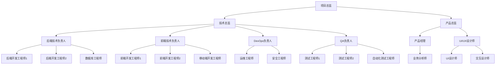
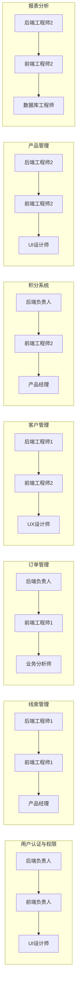
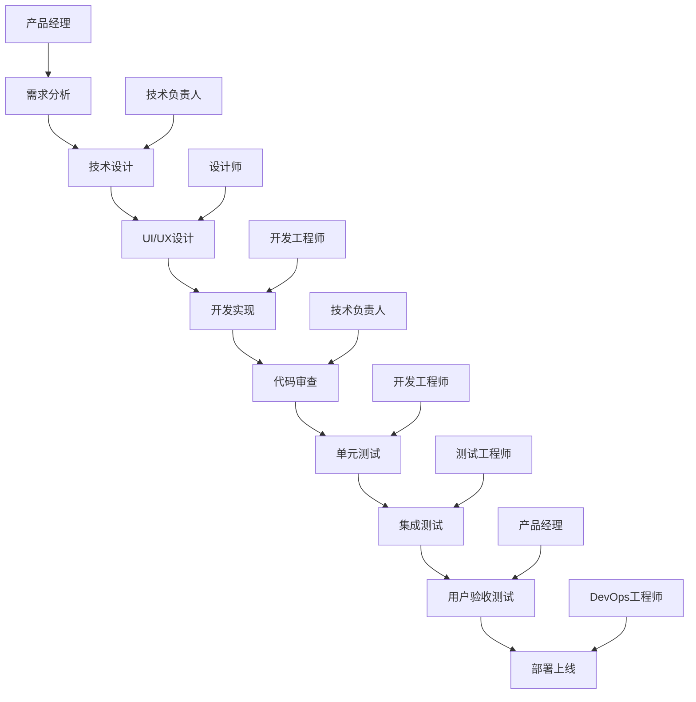

# 罗莱L2C销售管理系统 - 开发团队组建与分工方案

## 📋 文档概述

### 文档目标
- 建立高效的开发团队组织架构
- 明确各角色职责和分工边界
- 建立有效的团队协作机制
- 确保第一期MVP按时高质量交付

### 适用范围
- 开发团队组建
- 角色职责定义
- 工作流程规范
- 团队协作机制

---

## 👥 团队组织架构

### 团队架构图


---

## 🎯 核心团队配置

### 管理层（3人）
```typescript
interface ManagementTeam {
  projectDirector: {
    name: "项目总监";
    responsibility: "项目整体规划、资源协调、风险控制";
    experience: "10年以上项目管理经验";
    skills: ["项目管理", "团队管理", "风险控制", "商务沟通"];
    workload: "100%";
  };
  
  technicalDirector: {
    name: "技术总监";
    responsibility: "技术架构决策、技术团队管理、技术风险控制";
    experience: "8年以上技术管理经验";
    skills: ["架构设计", "技术管理", "团队建设", "技术选型"];
    workload: "100%";
  };
  
  productDirector: {
    name: "产品总监";
    responsibility: "产品规划、需求管理、用户体验、业务价值";
    experience: "6年以上产品管理经验";
    skills: ["产品规划", "需求分析", "用户体验", "数据分析"];
    workload: "100%";
  };
}
```

### 技术团队（12人）
```typescript
interface TechnicalTeam {
  backend: {
    teamLead: {
      name: "后端技术负责人";
      responsibility: "后端架构设计、代码审查、技术指导";
      experience: "5年以上后端开发经验";
      skills: ["Node.js", "TypeScript", "PostgreSQL", "Redis", "微服务"];
      modules: ["用户认证", "订单管理", "积分系统"];
      workload: "100%";
    };
    
    developers: [
      {
        name: "后端开发工程师1";
        responsibility: "核心业务逻辑开发、API接口实现";
        experience: "3年以上后端开发经验";
        skills: ["Node.js", "Express", "PostgreSQL", "Redis"];
        modules: ["线索管理", "客户管理"];
        workload: "100%";
      },
      {
        name: "后端开发工程师2";
        responsibility: "业务功能开发、数据处理逻辑";
        experience: "3年以上后端开发经验";
        skills: ["Node.js", "TypeScript", "数据库设计", "API设计"];
        modules: ["产品管理", "报表分析"];
        workload: "100%";
      }
    ];
    
    databaseEngineer: {
      name: "数据库工程师";
      responsibility: "数据库设计优化、性能调优、数据迁移";
      experience: "4年以上数据库经验";
      skills: ["PostgreSQL", "数据库优化", "数据迁移", "备份恢复"];
      modules: ["数据库架构", "性能优化"];
      workload: "80%";
    };
  };
  
  frontend: {
    teamLead: {
      name: "前端技术负责人";
      responsibility: "前端架构设计、组件库建设、代码规范";
      experience: "5年以上前端开发经验";
      skills: ["React", "TypeScript", "状态管理", "组件设计"];
      modules: ["架构设计", "公共组件"];
      workload: "100%";
    };
    
    developers: [
      {
        name: "前端开发工程师1";
        responsibility: "核心页面开发、用户交互实现";
        experience: "3年以上前端开发经验";
        skills: ["React", "TypeScript", "Ant Design", "状态管理"];
        modules: ["线索管理页面", "订单管理页面"];
        workload: "100%";
      },
      {
        name: "前端开发工程师2";
        responsibility: "业务页面开发、数据可视化";
        experience: "3年以上前端开发经验";
        skills: ["React", "TypeScript", "图表库", "响应式设计"];
        modules: ["客户管理页面", "报表分析页面"];
        workload: "100%";
      }
    ];
    
    mobileEngineer: {
      name: "移动端开发工程师";
      responsibility: "移动端应用开发、响应式适配";
      experience: "3年以上移动端开发经验";
      skills: ["React Native", "移动端优化", "响应式设计"];
      modules: ["移动端应用"];
      workload: "60%";
    };
  };
  
  devops: {
    teamLead: {
      name: "DevOps负责人";
      responsibility: "CI/CD流水线、容器化部署、监控运维";
      experience: "4年以上DevOps经验";
      skills: ["Docker", "Kubernetes", "Jenkins", "监控系统"];
      modules: ["部署架构", "监控运维"];
      workload: "100%";
    };
    
    engineers: [
      {
        name: "运维工程师";
        responsibility: "服务器运维、系统监控、故障处理";
        experience: "3年以上运维经验";
        skills: ["Linux", "Docker", "监控系统", "故障排查"];
        modules: ["系统运维", "监控告警"];
        workload: "80%";
      },
      {
        name: "安全工程师";
        responsibility: "安全架构设计、安全测试、漏洞修复";
        experience: "3年以上安全经验";
        skills: ["安全测试", "漏洞扫描", "安全加固"];
        modules: ["安全防护"];
        workload: "50%";
      }
    ];
  };
  
  qa: {
    teamLead: {
      name: "QA负责人";
      responsibility: "测试策略制定、测试流程管理、质量保证";
      experience: "4年以上测试经验";
      skills: ["测试管理", "自动化测试", "性能测试"];
      modules: ["测试策略", "质量保证"];
      workload: "100%";
    };
    
    engineers: [
      {
        name: "测试工程师1";
        responsibility: "功能测试、集成测试、用户验收测试";
        experience: "3年以上测试经验";
        skills: ["功能测试", "接口测试", "测试用例设计"];
        modules: ["功能测试", "集成测试"];
        workload: "100%";
      },
      {
        name: "测试工程师2";
        responsibility: "兼容性测试、用户体验测试、缺陷跟踪";
        experience: "2年以上测试经验";
        skills: ["兼容性测试", "用户体验测试", "缺陷管理"];
        modules: ["兼容性测试", "用户体验测试"];
        workload: "100%";
      },
      {
        name: "自动化测试工程师";
        responsibility: "自动化测试框架、性能测试、持续集成";
        experience: "3年以上自动化测试经验";
        skills: ["自动化测试", "性能测试", "CI/CD集成"];
        modules: ["自动化测试", "性能测试"];
        workload: "100%";
      }
    ];
  };
}
```

### 产品设计团队（5人）
```typescript
interface ProductDesignTeam {
  productManager: {
    name: "产品经理";
    responsibility: "需求分析、产品规划、用户故事、验收标准";
    experience: "4年以上产品经验";
    skills: ["需求分析", "产品设计", "用户研究", "数据分析"];
    modules: ["产品规划", "需求管理"];
    workload: "100%";
  };
  
  businessAnalyst: {
    name: "业务分析师";
    responsibility: "业务流程梳理、需求调研、业务规则定义";
    experience: "3年以上业务分析经验";
    skills: ["业务分析", "流程设计", "需求调研"];
    modules: ["业务流程", "需求分析"];
    workload: "80%";
  };
  
  uxDesigner: {
    name: "UI/UX设计师";
    responsibility: "用户体验设计、交互设计、原型设计";
    experience: "3年以上UX设计经验";
    skills: ["用户体验设计", "交互设计", "原型设计"];
    modules: ["用户体验", "交互设计"];
    workload: "100%";
  };
  
  uiDesigner: {
    name: "UI设计师";
    responsibility: "界面设计、视觉设计、设计规范";
    experience: "3年以上UI设计经验";
    skills: ["界面设计", "视觉设计"];
    modules: ["界面设计", "视觉规范"];
    workload: "100%";
  };
  
  interactionDesigner: {
    name: "交互设计师";
    responsibility: "交互流程设计、用户操作优化、可用性测试";
    experience: "2年以上交互设计经验";
    skills: ["交互设计", "可用性测试", "用户研究"];
    modules: ["交互流程", "可用性优化"];
    workload: "80%";
  };
}
```

---

## 📊 模块分工矩阵

### 第一期MVP模块分工


### 详细分工表
| 模块 | 后端负责人 | 前端负责人 | 设计负责人 | 测试负责人 | 工期 |
|------|------------|------------|------------|------------|------|
| 用户认证与权限 | 后端技术负责人 | 前端技术负责人 | UI设计师 | 测试工程师1 | 1周 |
| 线索管理 | 后端工程师1 | 前端工程师1 | UX设计师 | 测试工程师1 | 1.5周 |
| 订单管理 | 后端技术负责人 | 前端工程师1 | 业务分析师 | 测试工程师2 | 2周 |
| 客户管理 | 后端工程师1 | 前端工程师2 | UX设计师 | 测试工程师1 | 1周 |
| 积分系统 | 后端技术负责人 | 前端工程师2 | 产品经理 | 测试工程师2 | 1.5周 |
| 产品管理 | 后端工程师2 | 前端工程师2 | UI设计师 | 测试工程师1 | 1周 |
| 报表分析 | 后端工程师2 | 前端工程师2 | 交互设计师 | 自动化测试工程师 | 1周 |

---

## 🔄 工作流程规范

### 开发流程


### 代码审查流程
```typescript
interface CodeReviewProcess {
  reviewers: {
    mandatory: ["技术负责人"];
    optional: ["资深开发工程师"];
    autoAssign: true;
  };
  
  criteria: {
    codeQuality: "代码规范、可读性、可维护性";
    functionality: "功能实现正确性、边界条件处理";
    performance: "性能优化、资源使用效率";
    security: "安全漏洞、数据保护";
    testing: "测试覆盖率、测试质量";
  };
  
  process: {
    createPR: "开发者创建Pull Request";
    autoCheck: "自动化检查（lint、test、build）";
    peerReview: "同级开发者审查";
    leadReview: "技术负责人审查";
    approval: "审查通过后合并";
  };
  
  standards: {
    responseTime: "24小时内响应";
    approvalRequired: "至少2个approve";
    conflictResolution: "技术负责人最终决策";
  };
}
```

### 测试流程
```typescript
interface TestingProcess {
  unitTesting: {
    responsibility: "开发工程师";
    coverage: "> 80%";
    automation: "CI/CD集成";
    tools: ["Jest", "Supertest"];
  };
  
  integrationTesting: {
    responsibility: "测试工程师";
    scope: "模块间接口测试";
    environment: "专用测试环境";
    tools: ["Postman", "Newman"];
  };
  
  systemTesting: {
    responsibility: "测试团队";
    scope: "端到端业务流程";
    environment: "类生产环境";
    tools: ["Playwright", "Cypress"];
  };
  
  performanceTesting: {
    responsibility: "自动化测试工程师";
    scope: "性能基准测试";
    tools: ["Artillery", "JMeter"];
    metrics: ["响应时间", "吞吐量", "并发数"];
  };
  
  userAcceptanceTesting: {
    responsibility: "产品经理 + 业务用户";
    scope: "业务需求验证";
    environment: "UAT环境";
    criteria: "验收标准文档";
  };
}
```

---

## 📅 团队协作机制

### 会议机制
```typescript
interface MeetingSchedule {
  dailyStandup: {
    frequency: "每日";
    duration: "15分钟";
    participants: "开发团队全员";
    agenda: ["昨日完成", "今日计划", "遇到问题"];
    time: "上午9:30";
  };
  
  sprintPlanning: {
    frequency: "每2周";
    duration: "2小时";
    participants: "项目核心团队";
    agenda: ["Sprint目标", "任务分解", "工作量估算"];
    time: "周一上午10:00";
  };
  
  sprintReview: {
    frequency: "每2周";
    duration: "1小时";
    participants: "项目团队 + 业务方";
    agenda: ["功能演示", "成果回顾", "反馈收集"];
    time: "周五下午3:00";
  };
  
  retrospective: {
    frequency: "每2周";
    duration: "1小时";
    participants: "开发团队";
    agenda: ["问题回顾", "改进建议", "行动计划"];
    time: "周五下午4:00";
  };
  
  technicalReview: {
    frequency: "每周";
    duration: "1小时";
    participants: "技术团队";
    agenda: ["技术方案", "架构决策", "技术债务"];
    time: "周三下午2:00";
  };
  
  productReview: {
    frequency: "每周";
    duration: "1小时";
    participants: "产品团队 + 技术负责人";
    agenda: ["需求澄清", "优先级调整", "用户反馈"];
    time: "周二下午2:00";
  };
}
```

### 沟通工具
```typescript
interface CommunicationTools {
  instantMessaging: {
    tool: "企业微信/钉钉";
    usage: "日常沟通、快速协调";
    channels: ["全员群", "技术群", "产品群", "测试群"];
  };
  
  projectManagement: {
    tool: "Jira";
    usage: "任务管理、进度跟踪、缺陷管理";
    workflows: ["需求 -> 开发 -> 测试 -> 验收"];
  };
  
  documentation: {
    tool: "Confluence";
    usage: "文档管理、知识分享";
    structure: ["需求文档", "技术文档", "操作手册"];
  };
  
  codeRepository: {
    tool: "Git + GitHub/GitLab";
    usage: "代码管理、版本控制、代码审查";
    branching: "Git Flow工作流";
  };
  
  videoConferencing: {
    tool: "腾讯会议/Zoom";
    usage: "远程会议、技术讨论";
    recording: "重要会议录制";
  };
}
```

### 知识管理
```typescript
interface KnowledgeManagement {
  technicalDocumentation: {
    architecture: "系统架构文档";
    apiDocumentation: "API接口文档";
    databaseSchema: "数据库设计文档";
    deploymentGuide: "部署运维文档";
  };
  
  processDocumentation: {
    developmentProcess: "开发流程规范";
    testingProcess: "测试流程规范";
    releaseProcess: "发布流程规范";
    troubleshooting: "故障排查手册";
  };
  
  trainingMaterials: {
    onboarding: "新员工入职指南";
    technicalTraining: "技术培训材料";
    businessTraining: "业务培训材料";
    toolsTraining: "工具使用指南";
  };
  
  bestPractices: {
    codingStandards: "编码规范";
    designPatterns: "设计模式指南";
    securityGuidelines: "安全开发指南";
    performanceOptimization: "性能优化指南";
  };
}
```

---

## 🎯 团队绩效管理

### 绩效指标
```typescript
interface PerformanceMetrics {
  individual: {
    codeQuality: {
      metric: "代码审查通过率";
      target: "> 95%";
      measurement: "每周统计";
    };
    
    productivity: {
      metric: "任务完成率";
      target: "> 90%";
      measurement: "Sprint结束统计";
    };
    
    bugRate: {
      metric: "缺陷率";
      target: "< 5%";
      measurement: "每月统计";
    };
    
    collaboration: {
      metric: "团队协作评分";
      target: "> 4.0/5.0";
      measurement: "季度360度评估";
    };
  };
  
  team: {
    deliveryQuality: {
      metric: "交付质量评分";
      target: "> 4.5/5.0";
      measurement: "每个里程碑";
    };
    
    scheduleAdherence: {
      metric: "进度达成率";
      target: "> 95%";
      measurement: "每个Sprint";
    };
    
    customerSatisfaction: {
      metric: "客户满意度";
      target: "> 4.0/5.0";
      measurement: "每个版本发布后";
    };
    
    teamVelocity: {
      metric: "团队速度";
      target: "稳定增长";
      measurement: "每个Sprint";
    };
  };
}
```

### 激励机制
```typescript
interface IncentiveMechanism {
  recognition: {
    monthlyAward: "月度优秀员工";
    technicalExcellence: "技术卓越奖";
    innovationAward: "创新贡献奖";
    teamPlayer: "团队协作奖";
  };
  
  careerDevelopment: {
    technicalPath: "技术专家路径";
    managementPath: "管理路径";
    trainingOpportunities: "培训机会";
    certificationSupport: "认证支持";
  };
  
  workLifeBalance: {
    flexibleHours: "弹性工作时间";
    remoteWork: "远程工作支持";
    teamBuilding: "团队建设活动";
    wellnessProgram: "健康计划";
  };
}
```

---

## 🚨 风险管理

### 团队风险识别
```typescript
interface TeamRisks {
  personnelRisks: {
    keyPersonDependency: {
      risk: "关键人员依赖";
      probability: "中等";
      impact: "高";
      mitigation: "知识分享、文档化、交叉培训";
    };
    
    skillGap: {
      risk: "技能缺口";
      probability: "低";
      impact: "中等";
      mitigation: "技能评估、培训计划、外部支持";
    };
    
    teamTurnover: {
      risk: "人员流失";
      probability: "低";
      impact: "高";
      mitigation: "激励机制、职业发展、工作环境";
    };
  };
  
  communicationRisks: {
    informationSilo: {
      risk: "信息孤岛";
      probability: "中等";
      impact: "中等";
      mitigation: "定期会议、文档共享、跨团队协作";
    };
    
    requirementMisunderstanding: {
      risk: "需求理解偏差";
      probability: "中等";
      impact: "高";
      mitigation: "需求澄清、原型验证、频繁沟通";
    };
  };
  
  processRisks: {
    processCompliance: {
      risk: "流程执行不到位";
      probability: "低";
      impact: "中等";
      mitigation: "流程培训、工具支持、定期检查";
    };
    
    qualityControl: {
      risk: "质量控制不足";
      probability: "低";
      impact: "高";
      mitigation: "代码审查、自动化测试、质量门禁";
    };
  };
}
```

### 应急预案
```typescript
interface ContingencyPlans {
  keyPersonnelUnavailable: {
    action: "激活备份人员，知识转移";
    timeline: "24小时内响应";
    escalation: "技术总监介入";
  };
  
  criticalBugFound: {
    action: "组建紧急修复小组";
    timeline: "2小时内响应";
    process: "热修复流程";
  };
  
  scheduleDelay: {
    action: "重新评估优先级，调整范围";
    timeline: "48小时内制定调整方案";
    approval: "项目总监批准";
  };
  
  qualityIssue: {
    action: "暂停发布，质量修复";
    timeline: "立即执行";
    criteria: "质量标准重新达标";
  };
}
```

---

## 📋 团队建设检查清单

### 团队组建检查清单
- [ ] **人员招聘**
  - [ ] 核心岗位人员到位
  - [ ] 技能评估完成
  - [ ] 团队配比合理
  - [ ] 备用人员储备

- [ ] **环境准备**
  - [ ] 办公环境配置
  - [ ] 开发工具配置
  - [ ] 权限账号开通
  - [ ] 硬件设备配置

- [ ] **流程建立**
  - [ ] 开发流程定义
  - [ ] 测试流程建立
  - [ ] 发布流程确定
  - [ ] 沟通机制建立

- [ ] **文档准备**
  - [ ] 项目文档整理
  - [ ] 技术文档编写
  - [ ] 流程文档制定
  - [ ] 培训材料准备

### 团队协作检查清单
- [ ] **工具配置**
  - [ ] 项目管理工具配置
  - [ ] 代码仓库建立
  - [ ] 沟通工具配置
  - [ ] 文档平台搭建

- [ ] **会议机制**
  - [ ] 会议时间确定
  - [ ] 会议议程制定
  - [ ] 会议室预订
  - [ ] 会议工具准备

- [ ] **培训计划**
  - [ ] 新员工入职培训
  - [ ] 技术培训计划
  - [ ] 业务培训安排
  - [ ] 工具使用培训

---

## 📝 总结

本开发团队组建与分工方案为罗莱L2C销售管理系统提供了：

1. **完整的团队架构**：20人的专业团队，覆盖开发、测试、设计、产品各个领域
2. **明确的分工职责**：每个角色都有清晰的职责定义和工作边界
3. **高效的协作机制**：标准化的工作流程和沟通机制
4. **科学的绩效管理**：量化的绩效指标和激励机制
5. **完善的风险控制**：风险识别和应急预案

通过这套团队组建方案，确保：
- 🎯 **高效协作**：清晰的分工和流程，减少沟通成本
- 🚀 **快速交付**：专业的团队配置，保证开发效率
- 🔧 **质量保证**：完善的测试和审查机制
- 📈 **持续改进**：绩效管理和团队建设机制
- 🛡️ **风险控制**：风险识别和应急响应能力

为第一期MVP的成功交付提供了强有力的团队保障！
