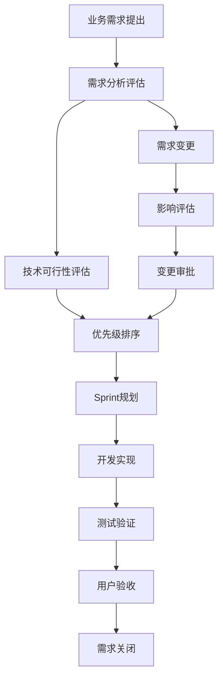
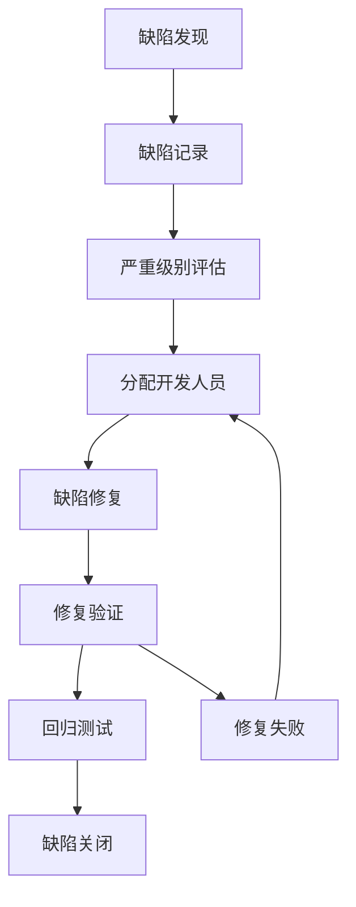

# 罗莱L2C销售管理系统 - 项目管理与沟通机制方案

## 文档信息
- **文档版本**: v1.0
- **创建日期**: 2024年12月
- **文档状态**: 正式版
- **适用范围**: 第一期MVP开发阶段

## 1. 项目管理框架

### 1.1 敏捷开发模式
```
开发模式: Scrum + Kanban 混合模式
Sprint周期: 2周一个迭代
发布周期: 8周完成MVP
团队规模: 20人专业团队
```

### 1.2 项目管理工具栈
```typescript
interface ProjectManagementTools {
  // 项目管理平台
  projectManagement: "Jira" | "Azure DevOps" | "禅道";
  
  // 代码管理
  codeRepository: "GitHub Enterprise";
  
  // 文档协作
  documentation: "Confluence" | "语雀" | "飞书文档";
  
  // 即时通讯
  communication: "企业微信" | "钉钉" | "Slack";
  
  // 视频会议
  videoConference: "腾讯会议" | "Zoom" | "飞书会议";
  
  // 设计协作
  design: "Figma" | "蓝湖" | "摹客";
}
```

## 2. 组织架构与角色职责

### 2.1 项目治理结构
```
项目指导委员会
├── 业务负责人 (Product Owner)
├── 技术负责人 (Tech Lead)
└── 项目经理 (Scrum Master)

核心开发团队
├── 后端开发组 (3人)
├── 前端开发组 (3人)
├── DevOps组 (3人)
├── 测试组 (3人)
└── 产品设计组 (3人)

支持团队
├── 业务分析师 (1人)
├── UI/UX设计师 (2人)
└── 技术文档专员 (1人)
```

### 2.2 关键角色职责矩阵
| 角色 | 主要职责 | 决策权限 | 汇报关系 |
|------|----------|----------|----------|
| **项目总监** | 项目整体规划、资源协调、风险管控 | 项目重大决策 | 向公司高层汇报 |
| **技术总监** | 技术架构、技术选型、代码质量 | 技术方案决策 | 向项目总监汇报 |
| **产品总监** | 产品规划、需求管理、用户体验 | 产品功能决策 | 向项目总监汇报 |
| **Scrum Master** | 流程管理、团队协调、障碍清除 | 流程优化决策 | 向项目总监汇报 |
| **Tech Lead** | 技术实现、代码审查、技术指导 | 技术实现决策 | 向技术总监汇报 |

## 3. 沟通机制设计

### 3.1 会议体系
```typescript
interface MeetingSchedule {
  // 每日站会
  dailyStandup: {
    时间: "每工作日 09:30-09:45";
    参与者: "全体开发团队";
    议题: ["昨日完成", "今日计划", "遇到障碍"];
    形式: "线下/线上混合";
  };
  
  // Sprint计划会
  sprintPlanning: {
    时间: "每两周一次，周一 14:00-16:00";
    参与者: "核心团队 + 产品经理";
    议题: ["Sprint目标", "任务分解", "工作量估算"];
    产出: "Sprint Backlog";
  };
  
  // Sprint回顾会
  sprintReview: {
    时间: "每两周一次，周五 16:00-17:30";
    参与者: "全体团队 + 利益相关者";
    议题: ["功能演示", "完成情况", "改进建议"];
    产出: "改进行动计划";
  };
  
  // 技术评审会
  techReview: {
    时间: "每周三 15:00-16:00";
    参与者: "技术团队 + 架构师";
    议题: ["技术方案", "代码质量", "性能优化"];
    产出: "技术决策记录";
  };
  
  // 产品评审会
  productReview: {
    时间: "每周五 10:00-11:00";
    参与者: "产品团队 + 业务代表";
    议题: ["需求澄清", "原型评审", "用户反馈"];
    产出: "需求变更记录";
  };
}
```

### 3.2 沟通渠道设计
```typescript
interface CommunicationChannels {
  // 即时沟通
  instantMessaging: {
    全员群: "项目重要通知、里程碑更新";
    技术群: "技术讨论、问题求助";
    产品群: "需求讨论、原型反馈";
    测试群: "缺陷报告、测试协调";
    管理群: "管理决策、资源协调";
  };
  
  // 正式沟通
  formalCommunication: {
    邮件: "正式通知、决策记录、周报月报";
    文档: "需求文档、技术方案、会议纪要";
    工单: "需求变更、缺陷跟踪、任务分配";
  };
  
  // 知识分享
  knowledgeSharing: {
    技术分享: "每周技术分享会";
    代码评审: "Pull Request评审机制";
    文档库: "技术文档、最佳实践";
  };
}
```

## 4. 项目管理流程

### 4.1 需求管理流程


### 4.2 缺陷管理流程


### 4.3 发布管理流程
```typescript
interface ReleaseProcess {
  // 发布准备阶段
  preparation: {
    代码冻结: "发布前3天";
    集成测试: "发布前2天";
    用户验收: "发布前1天";
    发布审批: "发布当天";
  };
  
  // 发布执行阶段
  execution: {
    数据库迁移: "自动化脚本执行";
    应用部署: "蓝绿部署策略";
    服务验证: "健康检查和烟雾测试";
    流量切换: "灰度发布策略";
  };
  
  // 发布后阶段
  postRelease: {
    监控告警: "实时监控关键指标";
    用户反馈: "收集用户使用反馈";
    问题处理: "快速响应和修复";
    经验总结: "发布回顾和改进";
  };
}
```

## 5. 质量管理体系

### 5.1 代码质量管控
```typescript
interface CodeQualityControl {
  // 代码规范
  codingStandards: {
    语言规范: "ESLint + Prettier (前端), Checkstyle (后端)";
    命名规范: "统一命名约定";
    注释规范: "关键逻辑必须注释";
    文档规范: "API文档自动生成";
  };
  
  // 代码审查
  codeReview: {
    审查策略: "所有代码必须经过审查";
    审查人员: "至少2人审查";
    审查标准: "功能、性能、安全、可维护性";
    审查工具: "GitHub Pull Request";
  };
  
  // 自动化测试
  automatedTesting: {
    单元测试: "覆盖率 >= 80%";
    集成测试: "关键业务流程覆盖";
    端到端测试: "核心用户场景覆盖";
    性能测试: "关键接口性能验证";
  };
}
```

### 5.2 项目质量指标
| 质量维度 | 关键指标 | 目标值 | 监控频率 |
|----------|----------|--------|----------|
| **代码质量** | 代码覆盖率 | ≥80% | 每日 |
| **缺陷质量** | 缺陷密度 | ≤2个/KLOC | 每周 |
| **性能质量** | 响应时间 | ≤500ms | 每日 |
| **可用性** | 系统可用率 | ≥99.5% | 实时 |
| **安全性** | 安全漏洞 | 0个高危 | 每周 |

## 6. 风险管理机制

### 6.1 风险识别与分类
```typescript
interface RiskManagement {
  // 技术风险
  technicalRisks: {
    架构风险: "技术选型不当、性能瓶颈";
    集成风险: "第三方服务集成失败";
    数据风险: "数据迁移失败、数据丢失";
    安全风险: "安全漏洞、数据泄露";
  };
  
  // 项目风险
  projectRisks: {
    进度风险: "开发延期、资源不足";
    质量风险: "缺陷率高、用户体验差";
    人员风险: "关键人员离职、技能不足";
    沟通风险: "需求理解偏差、沟通不畅";
  };
  
  // 业务风险
  businessRisks: {
    需求风险: "需求变更频繁、需求不明确";
    用户风险: "用户接受度低、培训不足";
    运营风险: "运营流程不完善、支持不足";
    合规风险: "法规变化、合规要求";
  };
}
```

### 6.2 风险应对策略
| 风险等级 | 应对策略 | 责任人 | 监控频率 |
|----------|----------|--------|----------|
| **高风险** | 立即制定应对方案，每日跟踪 | 项目总监 | 每日 |
| **中风险** | 制定预防措施，定期检查 | 相关负责人 | 每周 |
| **低风险** | 持续观察，必要时采取行动 | 团队成员 | 每月 |

## 7. 绩效管理与激励

### 7.1 团队绩效指标
```typescript
interface PerformanceMetrics {
  // 个人绩效
  individual: {
    任务完成率: "按时完成分配任务的比例";
    代码质量: "代码审查通过率、缺陷率";
    技术成长: "技术分享、学习新技能";
    团队协作: "协作效果、沟通能力";
  };
  
  // 团队绩效
  team: {
    Sprint完成率: "Sprint目标达成情况";
    交付质量: "缺陷率、用户满意度";
    响应速度: "问题解决时间、需求响应";
    创新能力: "技术创新、流程改进";
  };
}
```

### 7.2 激励机制
```typescript
interface IncentiveMechanism {
  // 短期激励
  shortTerm: {
    Sprint奖励: "优秀Sprint表现奖励";
    技术分享: "技术分享贡献奖励";
    问题解决: "关键问题解决奖励";
    创新提案: "流程改进建议奖励";
  };
  
  // 长期激励
  longTerm: {
    项目奖金: "MVP成功交付奖金";
    技能认证: "技术认证培训支持";
    职业发展: "晋升机会、职业规划";
    股权激励: "优秀员工股权激励";
  };
}
```

## 8. 工具配置与使用指南

### 8.1 项目管理工具配置
```yaml
# Jira项目配置
project_config:
  project_key: "L2C"
  issue_types:
    - Epic: "大功能模块"
    - Story: "用户故事"
    - Task: "开发任务"
    - Bug: "缺陷"
    - Subtask: "子任务"
  
  workflows:
    - "待办 → 进行中 → 代码审查 → 测试 → 完成"
  
  custom_fields:
    - "优先级"
    - "严重程度"
    - "影响范围"
    - "预估工时"
```

### 8.2 沟通工具使用规范
```typescript
interface CommunicationGuidelines {
  // 企业微信使用规范
  wechat: {
    群聊命名: "L2C-[功能模块]-[团队]";
    消息格式: "【类型】内容描述";
    响应时间: "工作时间2小时内回复";
    文件分享: "重要文件同步到文档库";
  };
  
  // 邮件使用规范
  email: {
    主题格式: "[L2C][类型] 主题描述";
    抄送规则: "相关利益方必须抄送";
    回复时限: "24小时内回复";
    附件规范: "文件命名规范化";
  };
}
```

## 9. 项目启动检查清单

### 9.1 环境准备检查
- [ ] 项目管理工具账号开通
- [ ] 代码仓库权限配置
- [ ] 开发环境搭建完成
- [ ] 测试环境部署就绪
- [ ] 监控告警系统配置

### 9.2 团队准备检查
- [ ] 团队成员角色明确
- [ ] 权限和访问控制配置
- [ ] 沟通渠道建立
- [ ] 工具使用培训完成
- [ ] 项目规范宣贯

### 9.3 流程准备检查
- [ ] 开发流程文档化
- [ ] 测试流程标准化
- [ ] 发布流程自动化
- [ ] 应急响应流程制定
- [ ] 质量管控机制建立

## 10. 持续改进机制

### 10.1 回顾改进流程
```typescript
interface ContinuousImprovement {
  // Sprint回顾
  sprintRetrospective: {
    频率: "每Sprint结束后";
    参与者: "Scrum团队";
    议题: ["做得好的", "需要改进的", "行动计划"];
    产出: "改进行动项";
  };
  
  // 项目回顾
  projectRetrospective: {
    频率: "项目里程碑节点";
    参与者: "全体项目成员";
    议题: ["成功经验", "失败教训", "最佳实践"];
    产出: "经验知识库";
  };
}
```

### 10.2 度量改进指标
| 改进维度 | 度量指标 | 改进目标 |
|----------|----------|----------|
| **效率提升** | 开发速度、交付周期 | 提升20% |
| **质量改善** | 缺陷率、返工率 | 降低30% |
| **满意度** | 团队满意度、用户满意度 | 提升至90% |
| **创新能力** | 改进提案数、采纳率 | 月均5个提案 |

---

## 总结

本项目管理与沟通机制方案为罗莱L2C销售管理系统第一期MVP开发提供了完整的管理框架，包括：

1. **敏捷开发模式** - Scrum + Kanban混合，2周Sprint
2. **完整组织架构** - 20人专业团队，角色职责明确
3. **高效沟通机制** - 多层次会议体系，多渠道沟通
4. **规范管理流程** - 需求、缺陷、发布全流程管控
5. **质量保证体系** - 代码质量、项目质量双重保障
6. **风险管控机制** - 全面风险识别和应对策略
7. **激励绩效体系** - 短期长期激励相结合
8. **工具支撑体系** - 完整工具链和使用规范

通过这套机制，确保项目能够按时、按质、按预算完成第一期MVP的交付目标。
