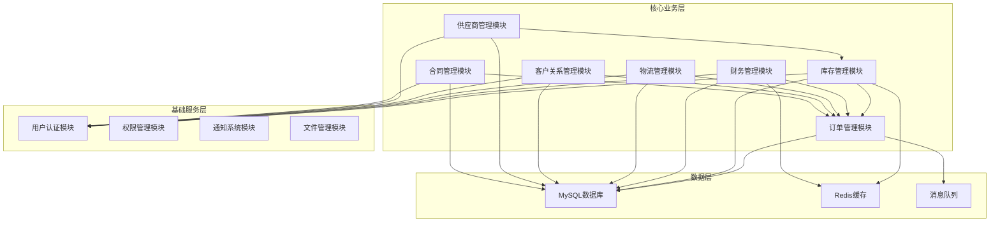

# 罗莱L2C销售管理系统 - 核心业务模块集成设计方案

## 文档信息
- **文档版本**: v1.0
- **创建日期**: 2024年12月
- **文档状态**: 正式版
- **适用范围**: 第一期MVP核心业务模块

## 1. 核心业务模块总览

### 1.1 模块架构图


### 1.2 模块依赖关系
```typescript
interface ModuleDependencies {
  // 核心依赖关系
  dependencies: {
    订单管理: ["库存管理", "财务管理", "物流管理", "客户关系管理", "合同管理"];
    库存管理: ["供应商管理", "产品管理"];
    财务管理: ["订单管理", "供应商管理", "合同管理"];
    物流管理: ["订单管理", "库存管理"];
    客户关系管理: ["订单管理", "线索管理"];
    供应商管理: ["库存管理", "财务管理"];
    合同管理: ["订单管理", "财务管理", "客户关系管理"];
  };
  
  // 数据流向
  dataFlow: {
    "线索 → 客户 → 订单 → 库存 → 物流 → 财务": "主业务流程";
    "供应商 → 库存 → 订单": "供应链流程";
    "合同 → 订单 → 财务": "合同执行流程";
  };
}
```

## 2. 库存管理模块增强设计

### 2.1 核心功能增强
```typescript
interface EnhancedInventoryService {
  // 智能库存预警
  smartInventoryAlert: {
    dynamicThreshold: "基于销售趋势动态调整预警阈值";
    seasonalForecast: "季节性需求预测";
    supplierLeadTime: "供应商交期预测";
    autoReorder: "自动补货建议";
  };
  
  // 多仓库协同
  multiWarehouseSync: {
    realTimeSync: "实时库存同步";
    crossWarehouseTransfer: "跨仓库调拨";
    distributedInventory: "分布式库存管理";
    warehouseOptimization: "仓库布局优化";
  };
  
  // 库存成本优化
  costOptimization: {
    fifoLifoWeighted: "多种成本核算方法";
    batchTracking: "批次追踪管理";
    expiryManagement: "保质期管理";
    obsoleteInventory: "呆滞库存处理";
  };
}
```

### 2.2 库存状态流转增强
```typescript
enum EnhancedInventoryStatus {
  AVAILABLE = "available",           // 可用库存
  RESERVED = "reserved",             // 已预留
  IN_TRANSIT = "in_transit",         // 在途库存
  QUALITY_CHECK = "quality_check",   // 质检中
  DAMAGED = "damaged",               // 损坏
  EXPIRED = "expired",               // 过期
  OBSOLETE = "obsolete",             // 呆滞
  ALLOCATED = "allocated",           // 已分配
  PICKED = "picked",                 // 已拣货
  SHIPPED = "shipped"                // 已发货
}

interface InventoryStatusFlow {
  transitions: {
    [key in EnhancedInventoryStatus]: EnhancedInventoryStatus[];
  };
  
  businessRules: {
    autoTransition: "自动状态转换规则";
    manualApproval: "需要人工审批的状态转换";
    systemTrigger: "系统触发的状态变更";
  };
}
```

## 3. 财务管理模块完善设计

### 3.1 财务核心架构
```typescript
interface FinancialManagementSystem {
  // 收款管理
  receivableManagement: {
    orderPayment: "订单收款管理";
    installmentPayment: "分期付款管理";
    advancePayment: "预收款管理";
    refundManagement: "退款管理";
    paymentReconciliation: "收款对账";
  };
  
  // 应付管理
  payableManagement: {
    supplierPayment: "供应商付款";
    expensePayment: "费用支付";
    employeeReimbursement: "员工报销";
    taxPayment: "税费缴纳";
    paymentApproval: "付款审批流程";
  };
  
  // 成本核算
  costAccounting: {
    productCost: "产品成本核算";
    serviceCost: "服务成本核算";
    operatingCost: "运营成本核算";
    profitAnalysis: "利润分析";
    costAllocation: "成本分摊";
  };
  
  // 财务报表
  financialReporting: {
    incomeStatement: "损益表";
    balanceSheet: "资产负债表";
    cashFlowStatement: "现金流量表";
    salesReport: "销售报表";
    costReport: "成本报表";
  };
}
```

### 3.2 财务数据模型
```sql
-- 财务科目表
CREATE TABLE financial_accounts (
    id BIGSERIAL PRIMARY KEY,
    account_code VARCHAR(20) NOT NULL UNIQUE COMMENT '科目编码',
    account_name VARCHAR(100) NOT NULL COMMENT '科目名称',
    account_type VARCHAR(20) NOT NULL COMMENT '科目类型：asset-资产,liability-负债,equity-权益,revenue-收入,expense-费用',
    parent_id BIGINT COMMENT '父科目ID',
    level INT NOT NULL DEFAULT 1 COMMENT '科目级别',
    is_leaf BOOLEAN DEFAULT TRUE COMMENT '是否叶子节点',
    is_active BOOLEAN DEFAULT TRUE COMMENT '是否启用',
    created_at TIMESTAMP DEFAULT CURRENT_TIMESTAMP,
    updated_at TIMESTAMP DEFAULT CURRENT_TIMESTAMP ON UPDATE CURRENT_TIMESTAMP,
    
    FOREIGN KEY (parent_id) REFERENCES financial_accounts(id),
    INDEX idx_account_code (account_code),
    INDEX idx_account_type (account_type),
    INDEX idx_parent_id (parent_id)
);

-- 财务凭证表
CREATE TABLE financial_vouchers (
    id BIGSERIAL PRIMARY KEY,
    voucher_no VARCHAR(30) NOT NULL UNIQUE COMMENT '凭证号',
    voucher_date DATE NOT NULL COMMENT '凭证日期',
    voucher_type VARCHAR(20) NOT NULL COMMENT '凭证类型：receipt-收款,payment-付款,transfer-转账',
    business_type VARCHAR(30) NOT NULL COMMENT '业务类型：order_payment-订单收款,supplier_payment-供应商付款',
    reference_id BIGINT COMMENT '关联业务ID',
    reference_no VARCHAR(50) COMMENT '关联业务单号',
    total_amount DECIMAL(15,2) NOT NULL COMMENT '凭证总金额',
    description TEXT COMMENT '摘要说明',
    status VARCHAR(20) DEFAULT 'draft' COMMENT '状态：draft-草稿,approved-已审核,posted-已过账',
    created_by BIGINT NOT NULL COMMENT '制单人',
    approved_by BIGINT COMMENT '审核人',
    approved_at TIMESTAMP COMMENT '审核时间',
    posted_by BIGINT COMMENT '过账人',
    posted_at TIMESTAMP COMMENT '过账时间',
    created_at TIMESTAMP DEFAULT CURRENT_TIMESTAMP,
    updated_at TIMESTAMP DEFAULT CURRENT_TIMESTAMP ON UPDATE CURRENT_TIMESTAMP,
    
    FOREIGN KEY (created_by) REFERENCES users(id),
    FOREIGN KEY (approved_by) REFERENCES users(id),
    FOREIGN KEY (posted_by) REFERENCES users(id),
    INDEX idx_voucher_no (voucher_no),
    INDEX idx_voucher_date (voucher_date),
    INDEX idx_voucher_type (voucher_type),
    INDEX idx_business_type (business_type),
    INDEX idx_reference (reference_id, reference_no),
    INDEX idx_status (status)
);

-- 财务凭证明细表
CREATE TABLE financial_voucher_entries (
    id BIGSERIAL PRIMARY KEY,
    voucher_id BIGINT NOT NULL COMMENT '凭证ID',
    account_id BIGINT NOT NULL COMMENT '科目ID',
    debit_amount DECIMAL(15,2) NOT NULL DEFAULT 0 COMMENT '借方金额',
    credit_amount DECIMAL(15,2) NOT NULL DEFAULT 0 COMMENT '贷方金额',
    description TEXT COMMENT '摘要',
    auxiliary_info JSON COMMENT '辅助信息：客户、供应商、项目等',
    created_at TIMESTAMP DEFAULT CURRENT_TIMESTAMP,
    
    FOREIGN KEY (voucher_id) REFERENCES financial_vouchers(id),
    FOREIGN KEY (account_id) REFERENCES financial_accounts(id),
    INDEX idx_voucher_id (voucher_id),
    INDEX idx_account_id (account_id)
);
```

## 4. 物流管理模块设计

### 4.1 物流管理架构
```typescript
interface LogisticsManagementSystem {
  // 配送管理
  deliveryManagement: {
    routePlanning: "配送路线规划";
    vehicleScheduling: "车辆调度管理";
    driverAssignment: "司机分配";
    deliveryTracking: "配送跟踪";
    deliveryConfirmation: "配送确认";
  };
  
  // 仓储管理
  warehouseManagement: {
    warehouseLayout: "仓库布局管理";
    pickingOptimization: "拣货路径优化";
    packingManagement: "包装管理";
    shippingManagement: "发货管理";
    returnProcessing: "退货处理";
  };
  
  // 第三方物流
  thirdPartyLogistics: {
    carrierIntegration: "承运商集成";
    shippingRateComparison: "运费比较";
    trackingIntegration: "物流跟踪集成";
    performanceMonitoring: "物流绩效监控";
  };
  
  // 安装服务
  installationService: {
    appointmentScheduling: "安装预约";
    installerAssignment: "安装师傅分配";
    installationTracking: "安装进度跟踪";
    qualityInspection: "安装质量检查";
    customerSatisfaction: "客户满意度调查";
  };
}
```

### 4.2 物流数据模型
```sql
-- 物流任务表
CREATE TABLE logistics_tasks (
    id BIGSERIAL PRIMARY KEY,
    task_no VARCHAR(30) NOT NULL UNIQUE COMMENT '任务编号',
    order_id BIGINT NOT NULL COMMENT '订单ID',
    task_type VARCHAR(20) NOT NULL COMMENT '任务类型：delivery-配送,pickup-取货,installation-安装',
    priority VARCHAR(10) DEFAULT 'normal' COMMENT '优先级：high-高,normal-普通,low-低',
    scheduled_date DATE COMMENT '计划日期',
    scheduled_time_start TIME COMMENT '计划开始时间',
    scheduled_time_end TIME COMMENT '计划结束时间',
    actual_start_time TIMESTAMP COMMENT '实际开始时间',
    actual_end_time TIMESTAMP COMMENT '实际结束时间',
    status VARCHAR(20) DEFAULT 'pending' COMMENT '状态：pending-待处理,assigned-已分配,in_progress-进行中,completed-已完成,cancelled-已取消',
    assigned_to BIGINT COMMENT '分配给（司机/安装师傅）',
    vehicle_id BIGINT COMMENT '车辆ID',
    delivery_address TEXT NOT NULL COMMENT '配送地址',
    contact_person VARCHAR(50) COMMENT '联系人',
    contact_phone VARCHAR(15) COMMENT '联系电话',
    special_instructions TEXT COMMENT '特殊说明',
    completion_notes TEXT COMMENT '完成备注',
    customer_signature TEXT COMMENT '客户签名',
    photos JSON COMMENT '现场照片',
    created_at TIMESTAMP DEFAULT CURRENT_TIMESTAMP,
    updated_at TIMESTAMP DEFAULT CURRENT_TIMESTAMP ON UPDATE CURRENT_TIMESTAMP,
    
    FOREIGN KEY (order_id) REFERENCES sales_orders(id),
    FOREIGN KEY (assigned_to) REFERENCES users(id),
    INDEX idx_task_no (task_no),
    INDEX idx_order_id (order_id),
    INDEX idx_task_type (task_type),
    INDEX idx_status (status),
    INDEX idx_scheduled_date (scheduled_date),
    INDEX idx_assigned_to (assigned_to)
);

-- 车辆管理表
CREATE TABLE vehicles (
    id BIGSERIAL PRIMARY KEY,
    vehicle_no VARCHAR(20) NOT NULL UNIQUE COMMENT '车牌号',
    vehicle_type VARCHAR(20) NOT NULL COMMENT '车辆类型：truck-货车,van-面包车,car-轿车',
    brand VARCHAR(50) COMMENT '品牌',
    model VARCHAR(50) COMMENT '型号',
    capacity DECIMAL(8,2) COMMENT '载重量(吨)',
    volume DECIMAL(8,2) COMMENT '容积(立方米)',
    driver_id BIGINT COMMENT '默认司机ID',
    status VARCHAR(20) DEFAULT 'available' COMMENT '状态：available-可用,busy-忙碌,maintenance-维修,retired-报废',
    insurance_expiry DATE COMMENT '保险到期日',
    inspection_expiry DATE COMMENT '年检到期日',
    created_at TIMESTAMP DEFAULT CURRENT_TIMESTAMP,
    updated_at TIMESTAMP DEFAULT CURRENT_TIMESTAMP ON UPDATE CURRENT_TIMESTAMP,
    
    FOREIGN KEY (driver_id) REFERENCES users(id),
    INDEX idx_vehicle_no (vehicle_no),
    INDEX idx_vehicle_type (vehicle_type),
    INDEX idx_status (status),
    INDEX idx_driver_id (driver_id)
);
```

## 5. 客户关系管理(CRM)模块设计

### 5.1 CRM核心架构
```typescript
interface CRMSystem {
  // 客户管理
  customerManagement: {
    customerProfile: "客户档案管理";
    customerSegmentation: "客户分群";
    customerLifecycle: "客户生命周期管理";
    customerValue: "客户价值分析";
    customerService: "客户服务管理";
  };
  
  // 销售管理
  salesManagement: {
    salesOpportunity: "销售机会管理";
    salesFunnel: "销售漏斗分析";
    salesForecast: "销售预测";
    salesPerformance: "销售绩效分析";
    territoryManagement: "销售区域管理";
  };
  
  // 营销管理
  marketingManagement: {
    campaignManagement: "营销活动管理";
    leadNurturing: "线索培育";
    emailMarketing: "邮件营销";
    socialMediaMarketing: "社交媒体营销";
    marketingROI: "营销ROI分析";
  };
  
  // 客户服务
  customerService: {
    ticketManagement: "工单管理";
    knowledgeBase: "知识库";
    serviceLevel: "服务水平管理";
    customerFeedback: "客户反馈管理";
    satisfactionSurvey: "满意度调查";
  };
}
```

### 5.2 CRM数据模型
```sql
-- 客户档案表
CREATE TABLE customers (
    id BIGSERIAL PRIMARY KEY,
    customer_no VARCHAR(30) NOT NULL UNIQUE COMMENT '客户编号',
    customer_name VARCHAR(100) NOT NULL COMMENT '客户姓名',
    customer_type VARCHAR(20) DEFAULT 'individual' COMMENT '客户类型：individual-个人,enterprise-企业',
    gender VARCHAR(10) COMMENT '性别：male-男,female-女',
    birth_date DATE COMMENT '出生日期',
    id_card VARCHAR(18) COMMENT '身份证号',
    phone VARCHAR(15) NOT NULL COMMENT '手机号',
    email VARCHAR(100) COMMENT '邮箱',
    wechat VARCHAR(50) COMMENT '微信号',
    address TEXT COMMENT '地址',
    company_name VARCHAR(100) COMMENT '公司名称',
    position VARCHAR(50) COMMENT '职位',
    industry VARCHAR(50) COMMENT '行业',
    source VARCHAR(30) COMMENT '客户来源：online-线上,offline-线下,referral-推荐',
    source_detail VARCHAR(100) COMMENT '来源详情',
    assigned_sales BIGINT COMMENT '分配销售',
    customer_level VARCHAR(20) DEFAULT 'normal' COMMENT '客户等级：vip-VIP,gold-金牌,silver-银牌,normal-普通',
    credit_limit DECIMAL(15,2) DEFAULT 0 COMMENT '信用额度',
    payment_terms VARCHAR(50) COMMENT '付款条件',
    status VARCHAR(20) DEFAULT 'active' COMMENT '状态：active-活跃,inactive-不活跃,blacklist-黑名单',
    tags JSON COMMENT '客户标签',
    notes TEXT COMMENT '备注',
    created_at TIMESTAMP DEFAULT CURRENT_TIMESTAMP,
    updated_at TIMESTAMP DEFAULT CURRENT_TIMESTAMP ON UPDATE CURRENT_TIMESTAMP,
    
    FOREIGN KEY (assigned_sales) REFERENCES users(id),
    INDEX idx_customer_no (customer_no),
    INDEX idx_phone (phone),
    INDEX idx_email (email),
    INDEX idx_customer_type (customer_type),
    INDEX idx_assigned_sales (assigned_sales),
    INDEX idx_customer_level (customer_level),
    INDEX idx_status (status)
);

-- 客户互动记录表
CREATE TABLE customer_interactions (
    id BIGSERIAL PRIMARY KEY,
    customer_id BIGINT NOT NULL COMMENT '客户ID',
    interaction_type VARCHAR(30) NOT NULL COMMENT '互动类型：call-电话,email-邮件,meeting-会面,visit-拜访,wechat-微信',
    direction VARCHAR(10) NOT NULL COMMENT '方向：inbound-来电,outbound-外呼',
    subject VARCHAR(200) COMMENT '主题',
    content TEXT COMMENT '内容',
    duration INT COMMENT '持续时间(分钟)',
    outcome VARCHAR(50) COMMENT '结果',
    next_action VARCHAR(200) COMMENT '下一步行动',
    next_action_date DATE COMMENT '下一步行动日期',
    sales_person BIGINT NOT NULL COMMENT '销售人员',
    created_at TIMESTAMP DEFAULT CURRENT_TIMESTAMP,
    
    FOREIGN KEY (customer_id) REFERENCES customers(id),
    FOREIGN KEY (sales_person) REFERENCES users(id),
    INDEX idx_customer_id (customer_id),
    INDEX idx_interaction_type (interaction_type),
    INDEX idx_sales_person (sales_person),
    INDEX idx_created_at (created_at)
);
```

## 6. 供应商管理模块设计

### 6.1 供应商管理架构
```typescript
interface SupplierManagementSystem {
  // 供应商档案
  supplierProfile: {
    basicInfo: "基本信息管理";
    qualificationManagement: "资质管理";
    performanceEvaluation: "绩效评估";
    riskAssessment: "风险评估";
    categoryManagement: "供应商分类管理";
  };
  
  // 采购管理
  procurementManagement: {
    purchaseRequisition: "采购申请";
    purchaseOrder: "采购订单";
    receiptManagement: "收货管理";
    qualityInspection: "质量检验";
    invoiceVerification: "发票核验";
  };
  
  // 合同管理
  contractManagement: {
    contractNegotiation: "合同谈判";
    contractSigning: "合同签署";
    contractExecution: "合同执行";
    contractRenewal: "合同续签";
    contractTermination: "合同终止";
  };
  
  // 付款管理
  paymentManagement: {
    paymentTerms: "付款条件";
    paymentSchedule: "付款计划";
    paymentExecution: "付款执行";
    paymentReconciliation: "付款对账";
  };
}
```

### 6.2 供应商数据模型
```sql
-- 供应商信息表
CREATE TABLE suppliers (
    id BIGSERIAL PRIMARY KEY,
    supplier_no VARCHAR(30) NOT NULL UNIQUE COMMENT '供应商编号',
    supplier_name VARCHAR(100) NOT NULL COMMENT '供应商名称',
    supplier_type VARCHAR(20) NOT NULL COMMENT '供应商类型：manufacturer-制造商,distributor-经销商,service-服务商',
    legal_name VARCHAR(100) COMMENT '法定名称',
    tax_id VARCHAR(30) COMMENT '税号',
    business_license VARCHAR(50) COMMENT '营业执照号',
    contact_person VARCHAR(50) COMMENT '联系人',
    contact_phone VARCHAR(15) COMMENT '联系电话',
    contact_email VARCHAR(100) COMMENT '联系邮箱',
    address TEXT COMMENT '地址',
    website VARCHAR(200) COMMENT '网站',
    established_date DATE COMMENT '成立日期',
    registered_capital DECIMAL(15,2) COMMENT '注册资本',
    employee_count INT COMMENT '员工数量',
    annual_revenue DECIMAL(15,2) COMMENT '年营业额',
    main_products TEXT COMMENT '主营产品',
    certifications JSON COMMENT '认证资质',
    payment_terms VARCHAR(50) COMMENT '付款条件',
    credit_limit DECIMAL(15,2) DEFAULT 0 COMMENT '信用额度',
    supplier_level VARCHAR(20) DEFAULT 'normal' COMMENT '供应商等级：strategic-战略,preferred-优选,normal-普通,restricted-限制',
    status VARCHAR(20) DEFAULT 'active' COMMENT '状态：active-活跃,inactive-不活跃,blacklist-黑名单',
    risk_level VARCHAR(20) DEFAULT 'low' COMMENT '风险等级：high-高,medium-中,low-低',
    performance_score DECIMAL(5,2) DEFAULT 0 COMMENT '绩效评分',
    created_at TIMESTAMP DEFAULT CURRENT_TIMESTAMP,
    updated_at TIMESTAMP DEFAULT CURRENT_TIMESTAMP ON UPDATE CURRENT_TIMESTAMP,
    
    INDEX idx_supplier_no (supplier_no),
    INDEX idx_supplier_name (supplier_name),
    INDEX idx_supplier_type (supplier_type),
    INDEX idx_supplier_level (supplier_level),
    INDEX idx_status (status),
    INDEX idx_risk_level (risk_level)
);

-- 采购订单表
CREATE TABLE purchase_orders (
    id BIGSERIAL PRIMARY KEY,
    po_no VARCHAR(30) NOT NULL UNIQUE COMMENT '采购订单号',
    supplier_id BIGINT NOT NULL COMMENT '供应商ID',
    order_date DATE NOT NULL COMMENT '订单日期',
    expected_delivery_date DATE COMMENT '预期交货日期',
    total_amount DECIMAL(15,2) NOT NULL COMMENT '订单总金额',
    tax_amount DECIMAL(15,2) DEFAULT 0 COMMENT '税额',
    discount_amount DECIMAL(15,2) DEFAULT 0 COMMENT '折扣金额',
    final_amount DECIMAL(15,2) NOT NULL COMMENT '最终金额',
    currency VARCHAR(10) DEFAULT 'CNY' COMMENT '币种',
    payment_terms VARCHAR(50) COMMENT '付款条件',
    delivery_address TEXT COMMENT '交货地址',
    contact_person VARCHAR(50) COMMENT '联系人',
    contact_phone VARCHAR(15) COMMENT '联系电话',
    status VARCHAR(20) DEFAULT 'draft' COMMENT '状态：draft-草稿,sent-已发送,confirmed-已确认,partial_received-部分收货,received-已收货,cancelled-已取消',
    notes TEXT COMMENT '备注',
    created_by BIGINT NOT NULL COMMENT '创建人',
    approved_by BIGINT COMMENT '审批人',
    approved_at TIMESTAMP COMMENT '审批时间',
    created_at TIMESTAMP DEFAULT CURRENT_TIMESTAMP,
    updated_at TIMESTAMP DEFAULT CURRENT_TIMESTAMP ON UPDATE CURRENT_TIMESTAMP,
    
    FOREIGN KEY (supplier_id) REFERENCES suppliers(id),
    FOREIGN KEY (created_by) REFERENCES users(id),
    FOREIGN KEY (approved_by) REFERENCES users(id),
    INDEX idx_po_no (po_no),
    INDEX idx_supplier_id (supplier_id),
    INDEX idx_order_date (order_date),
    INDEX idx_status (status),
    INDEX idx_created_by (created_by)
);
```

## 7. 合同管理模块设计

### 7.1 合同管理架构
```typescript
interface ContractManagementSystem {
  // 合同生命周期
  contractLifecycle: {
    contractCreation: "合同创建";
    contractNegotiation: "合同谈判";
    contractApproval: "合同审批";
    contractSigning: "合同签署";
    contractExecution: "合同执行";
    contractRenewal: "合同续签";
    contractTermination: "合同终止";
  };
  
  // 合同模板
  contractTemplate: {
    templateManagement: "模板管理";
    clauseLibrary: "条款库";
    templateVersioning: "模板版本控制";
    templateApproval: "模板审批";
  };
  
  // 合同执行
  contractExecution: {
    milestoneTracking: "里程碑跟踪";
    deliverableManagement: "交付物管理";
    performanceMonitoring: "履约监控";
    changeManagement: "变更管理";
    disputeResolution: "争议解决";
  };
  
  // 合同分析
  contractAnalytics: {
    contractValue: "合同价值分析";
    performanceAnalysis: "履约分析";
    riskAnalysis: "风险分析";
    renewalAnalysis: "续签分析";
  };
}
```

### 7.2 合同数据模型
```sql
-- 合同主表
CREATE TABLE contracts (
    id BIGSERIAL PRIMARY KEY,
    contract_no VARCHAR(30) NOT NULL UNIQUE COMMENT '合同编号',
    contract_name VARCHAR(200) NOT NULL COMMENT '合同名称',
    contract_type VARCHAR(30) NOT NULL COMMENT '合同类型：sales-销售合同,purchase-采购合同,service-服务合同,framework-框架合同',
    template_id BIGINT COMMENT '合同模板ID',
    party_a_type VARCHAR(20) NOT NULL COMMENT '甲方类型：company-公司,customer-客户',
    party_a_id BIGINT COMMENT '甲方ID',
    party_a_name VARCHAR(100) NOT NULL COMMENT '甲方名称',
    party_b_type VARCHAR(20) NOT NULL COMMENT '乙方类型：company-公司,supplier-供应商',
    party_b_id BIGINT COMMENT '乙方ID',
    party_b_name VARCHAR(100) NOT NULL COMMENT '乙方名称',
    contract_amount DECIMAL(15,2) NOT NULL COMMENT '合同金额',
    currency VARCHAR(10) DEFAULT 'CNY' COMMENT '币种',
    signing_date DATE COMMENT '签署日期',
    effective_date DATE NOT NULL COMMENT '生效日期',
    expiry_date DATE COMMENT '到期日期',
    auto_renewal BOOLEAN DEFAULT FALSE COMMENT '是否自动续签',
    renewal_period INT COMMENT '续签周期(月)',
    payment_terms TEXT COMMENT '付款条件',
    delivery_terms TEXT COMMENT '交货条件',
    warranty_period INT COMMENT '质保期(月)',
    status VARCHAR(20) DEFAULT 'draft' COMMENT '状态：draft-草稿,negotiating-谈判中,approving-审批中,signed-已签署,executing-执行中,completed-已完成,terminated-已终止',
    risk_level VARCHAR(20) DEFAULT 'low' COMMENT '风险等级：high-高,medium-中,low-低',
    contract_file_url VARCHAR(500) COMMENT '合同文件URL',
    notes TEXT COMMENT '备注',
    created_by BIGINT NOT NULL COMMENT '创建人',
    approved_by BIGINT COMMENT '审批人',
    approved_at TIMESTAMP COMMENT '审批时间',
    signed_by BIGINT COMMENT '签署人',
    signed_at TIMESTAMP COMMENT '签署时间',
    created_at TIMESTAMP DEFAULT CURRENT_TIMESTAMP,
    updated_at TIMESTAMP DEFAULT CURRENT_TIMESTAMP ON UPDATE CURRENT_TIMESTAMP,
    
    FOREIGN KEY (template_id) REFERENCES contract_templates(id),
    FOREIGN KEY (created_by) REFERENCES users(id),
    FOREIGN KEY (approved_by) REFERENCES users(id),
    FOREIGN KEY (signed_by) REFERENCES users(id),
    INDEX idx_contract_no (contract_no),
    INDEX idx_contract_type (contract_type),
    INDEX idx_party_a (party_a_type, party_a_id),
    INDEX idx_party_b (party_b_type, party_b_id),
    INDEX idx_status (status),
    INDEX idx_effective_date (effective_date),
    INDEX idx_expiry_date (expiry_date)
);

-- 合同条款表
CREATE TABLE contract_clauses (
    id BIGSERIAL PRIMARY KEY,
    contract_id BIGINT NOT NULL COMMENT '合同ID',
    clause_type VARCHAR(30) NOT NULL COMMENT '条款类型：payment-付款,delivery-交货,warranty-质保,penalty-违约,termination-终止',
    clause_title VARCHAR(200) NOT NULL COMMENT '条款标题',
    clause_content TEXT NOT NULL COMMENT '条款内容',
    clause_order INT NOT NULL COMMENT '条款顺序',
    is_key_clause BOOLEAN DEFAULT FALSE COMMENT '是否关键条款',
    created_at TIMESTAMP DEFAULT CURRENT_TIMESTAMP,
    
    FOREIGN KEY (contract_id) REFERENCES contracts(id),
    INDEX idx_contract_id (contract_id),
    INDEX idx_clause_type (clause_type),
    INDEX idx_clause_order (clause_order)
);
```

## 8. 模块集成接口设计

### 8.1 模块间通信接口
```typescript
interface ModuleIntegrationAPIs {
  // 库存与订单集成
  inventoryOrderIntegration: {
    checkInventory: "GET /api/inventory/check/{productId}";
    reserveInventory: "POST /api/inventory/reserve";
    releaseInventory: "POST /api/inventory/release";
    allocateInventory: "POST /api/inventory/allocate";
  };
  
  // 财务与订单集成
  financeOrderIntegration: {
    createPaymentRecord: "POST /api/finance/payments";
    updatePaymentStatus: "PUT /api/finance/payments/{id}/status";
    generateInvoice: "POST /api/finance/invoices";
    processRefund: "POST /api/finance/refunds";
  };
  
  // 物流与订单集成
  logisticsOrderIntegration: {
    createDeliveryTask: "POST /api/logistics/delivery-tasks";
    updateDeliveryStatus: "PUT /api/logistics/delivery-tasks/{id}/status";
    scheduleInstallation: "POST /api/logistics/installation-tasks";
    trackShipment: "GET /api/logistics/tracking/{trackingNo}";
  };
  
  // CRM与订单集成
  crmOrderIntegration: {
    updateCustomerInfo: "PUT /api/crm/customers/{id}";
    recordInteraction: "POST /api/crm/interactions";
    updateCustomerLevel: "PUT /api/crm/customers/{id}/level";
    createServiceTicket: "POST /api/crm/tickets";
  };
  
  // 供应商与库存集成
  supplierInventoryIntegration: {
    createPurchaseOrder: "POST /api/suppliers/purchase-orders";
    updateReceiptStatus: "PUT /api/suppliers/receipts/{id}/status";
    updateSupplierPerformance: "PUT /api/suppliers/{id}/performance";
  };
  
  // 合同与订单集成
  contractOrderIntegration: {
    validateContractTerms: "POST /api/contracts/validate";
    updateContractExecution: "PUT /api/contracts/{id}/execution";
    checkContractCompliance: "GET /api/contracts/{id}/compliance";
  };
}
```

### 8.2 事件驱动集成
```typescript
interface ModuleEvents {
  // 订单事件
  orderEvents: {
    OrderCreated: "订单创建事件";
    OrderConfirmed: "订单确认事件";
    OrderCancelled: "订单取消事件";
    OrderCompleted: "订单完成事件";
  };
  
  // 库存事件
  inventoryEvents: {
    InventoryReserved: "库存预留事件";
    InventoryAllocated: "库存分配事件";
    InventoryShipped: "库存发货事件";
    InventoryLowStock: "库存不足事件";
  };
  
  // 财务事件
  financeEvents: {
    PaymentReceived: "收款事件";
    PaymentFailed: "付款失败事件";
    InvoiceGenerated: "发票生成事件";
    RefundProcessed: "退款处理事件";
  };
  
  // 物流事件
  logisticsEvents: {
    ShipmentCreated: "发货创建事件";
    ShipmentDelivered: "发货完成事件";
    InstallationScheduled: "安装预约事件";
    InstallationCompleted: "安装完成事件";
  };
}
```

## 9. 数据一致性保证

### 9.1 分布式事务处理
```typescript
interface DistributedTransactionStrategy {
  // Saga模式
  sagaPattern: {
    orderProcessingSaga: "订单处理Saga";
    inventoryManagementSaga: "库存管理Saga";
    paymentProcessingSaga: "支付处理Saga";
    compensationHandling: "补偿处理机制";
  };
  
  // 事件溯源
  eventSourcing: {
    eventStore: "事件存储";
    eventReplay: "事件重放";
    snapshotting: "快照机制";
    eventVersioning: "事件版本控制";
  };
  
  // 最终一致性
  eventualConsistency: {
    asyncProcessing: "异步处理";
    retryMechanism: "重试机制";
    deadLetterQueue: "死信队列";
    reconciliation: "数据对账";
  };
}
```

### 9.2 数据同步策略
```typescript
interface DataSynchronizationStrategy {
  // 实时同步
  realTimeSync: {
    changeDataCapture: "变更数据捕获";
    messageBroker: "消息代理";
    webhooks: "Webhook通知";
    streamProcessing: "流处理";
  };
  
  // 批量同步
  batchSync: {
    scheduledJobs: "定时任务";
    incrementalSync: "增量同步";
    fullSync: "全量同步";
    conflictResolution: "冲突解决";
  };
  
  // 数据校验
  dataValidation: {
    checksumValidation: "校验和验证";
    businessRuleValidation: "业务规则验证";
    crossModuleValidation: "跨模块验证";
    dataQualityMonitoring: "数据质量监控";
  };
}
```

## 10. 性能优化策略

### 10.1 数据库优化
```sql
-- 核心业务表索引优化
-- 订单表复合索引
CREATE INDEX idx_orders_customer_status_date ON sales_orders(customer_id, status, order_date);
CREATE INDEX idx_orders_sales_person_date ON sales_orders(sales_person, order_date);

-- 库存表复合索引
CREATE INDEX idx_inventory_product_warehouse ON inventory(product_id, warehouse_id);
CREATE INDEX idx_inventory_status_quantity ON inventory(status, available_quantity);

-- 财务表复合索引
CREATE INDEX idx_vouchers_type_date ON financial_vouchers(voucher_type, voucher_date);
CREATE INDEX idx_vouchers_business_reference ON financial_vouchers(business_type, reference_id);

-- 客户表复合索引
CREATE INDEX idx_customers_sales_level ON customers(assigned_sales, customer_level);
CREATE INDEX idx_customers_type_status ON customers(customer_type, status);

-- 分区表设计（按时间分区）
CREATE TABLE sales_orders_2024 PARTITION OF sales_orders
FOR VALUES FROM ('2024-01-01') TO ('2025-01-01');

CREATE TABLE financial_vouchers_2024 PARTITION OF financial_vouchers
FOR VALUES FROM ('2024-01-01') TO ('2025-01-01');
```

### 10.2 缓存策略
```typescript
interface CachingStrategy {
  // Redis缓存层次
  cacheHierarchy: {
    L1_ApplicationCache: "应用内存缓存";
    L2_RedisCache: "Redis分布式缓存";
    L3_DatabaseCache: "数据库查询缓存";
  };
  
  // 缓存模式
  cachePatterns: {
    cacheAside: "旁路缓存模式";
    writeThrough: "写透模式";
    writeBack: "写回模式";
    refreshAhead: "预刷新模式";
  };
  
  // 缓存策略
  cacheStrategies: {
    productInfo: "产品信息缓存(TTL: 1小时)";
    inventoryStatus: "库存状态缓存(TTL: 5分钟)";
    customerProfile: "客户档案缓存(TTL: 30分钟)";
    priceInfo: "价格信息缓存(TTL: 15分钟)";
  };
}
```

## 11. 监控与告警

### 11.1 业务监控指标
```typescript
interface BusinessMetrics {
  // 订单指标
  orderMetrics: {
    orderCreationRate: "订单创建率";
    orderConversionRate: "订单转化率";
    orderCancellationRate: "订单取消率";
    averageOrderValue: "平均订单价值";
    orderProcessingTime: "订单处理时间";
  };
  
  // 库存指标
  inventoryMetrics: {
    stockTurnoverRate: "库存周转率";
    stockoutRate: "缺货率";
    inventoryAccuracy: "库存准确率";
    warehouseUtilization: "仓库利用率";
  };
  
  // 财务指标
  financeMetrics: {
    revenueGrowthRate: "收入增长率";
    profitMargin: "利润率";
    cashFlowRatio: "现金流比率";
    accountsReceivableTurnover: "应收账款周转率";
  };
  
  // 客户指标
  customerMetrics: {
    customerAcquisitionCost: "客户获取成本";
    customerLifetimeValue: "客户生命周期价值";
    customerSatisfactionScore: "客户满意度";
    customerRetentionRate: "客户保留率";
  };
}
```

### 11.2 告警规则配置
```yaml
# 业务告警规则
business_alerts:
  - name: "库存不足告警"
    condition: "available_quantity < min_stock_alert"
    severity: "warning"
    notification: ["inventory_manager", "sales_team"]
    
  - name: "订单异常告警"
    condition: "order_processing_time > 24_hours"
    severity: "critical"
    notification: ["order_manager", "customer_service"]
    
  - name: "支付失败告警"
    condition: "payment_failure_rate > 5%"
    severity: "high"
    notification: ["finance_manager", "technical_team"]
    
  - name: "客户投诉告警"
    condition: "customer_complaint_count > 10/day"
    severity: "high"
    notification: ["customer_service_manager", "quality_manager"]

# 技术告警规则
technical_alerts:
  - name: "API响应时间告警"
    condition: "api_response_time > 2000ms"
    severity: "warning"
    notification: ["technical_team"]
    
  - name: "数据库连接告警"
    condition: "db_connection_pool_usage > 80%"
    severity: "critical"
    notification: ["dba_team", "technical_team"]
    
  - name: "缓存命中率告警"
    condition: "cache_hit_rate < 70%"
    severity: "warning"
    notification: ["technical_team"]
```

## 12. 部署与运维

### 12.1 微服务部署架构
```yaml
# Kubernetes部署配置
apiVersion: apps/v1
kind: Deployment
metadata:
  name: inventory-service
spec:
  replicas: 3
  selector:
    matchLabels:
      app: inventory-service
  template:
    metadata:
      labels:
        app: inventory-service
    spec:
      containers:
      - name: inventory-service
        image: l2c/inventory-service:v1.0
        ports:
        - containerPort: 8080
        env:
        - name: DB_HOST
          value: "mysql-cluster"
        - name: REDIS_HOST
          value: "redis-cluster"
        resources:
          requests:
            memory: "256Mi"
            cpu: "250m"
          limits:
            memory: "512Mi"
            cpu: "500m"
        livenessProbe:
          httpGet:
            path: /health
            port: 8080
          initialDelaySeconds: 30
          periodSeconds: 10
        readinessProbe:
          httpGet:
            path: /ready
            port: 8080
          initialDelaySeconds: 5
          periodSeconds: 5
```

### 12.2 数据备份策略
```bash
#!/bin/bash
# 数据库备份脚本

# MySQL备份
mysqldump --single-transaction --routines --triggers \
  --host=$DB_HOST --user=$DB_USER --password=$DB_PASSWORD \
  l2c_database > /backup/mysql/l2c_$(date +%Y%m%d_%H%M%S).sql

# Redis备份
redis-cli --rdb /backup/redis/dump_$(date +%Y%m%d_%H%M%S).rdb

# 文件备份
tar -czf /backup/files/files_$(date +%Y%m%d_%H%M%S).tar.gz /app/uploads

# 上传到云存储
aws s3 sync /backup s3://l2c-backup/$(date +%Y%m%d)/
```

---

## 总结

本核心业务模块集成设计方案为罗莱L2C销售管理系统提供了完整的业务支撑体系：

### ✅ **设计亮点**

1. **模块化架构** - 6个核心业务模块，职责清晰，边界明确
2. **数据一致性** - 分布式事务、事件驱动、最终一致性保证
3. **高性能设计** - 多级缓存、数据库优化、异步处理
4. **完整监控** - 业务指标、技术指标、告警机制
5. **可扩展性** - 微服务架构、容器化部署、弹性伸缩

### 🎯 **核心价值**

- **业务完整性** - 覆盖销售全流程的核心业务模块
- **数据准确性** - 强一致性和最终一致性相结合
- **系统稳定性** - 完善的监控告警和容错机制
- **运维便利性** - 自动化部署和运维工具支持

### 🚀 **实施建议**

1. **分阶段实施** - 按模块优先级逐步实施
2. **数据迁移** - 制定详细的数据迁移计划
3. **性能测试** - 全面的性能和压力测试
4. **用户培训** - 完善的用户培训和文档支持

通过这套核心业务模块设计，确保第一期MVP能够支撑完整的销售业务流程，为后续功能扩展奠定坚实基础。
