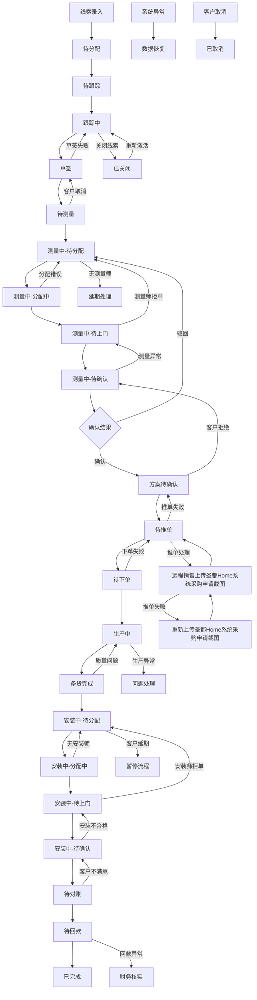
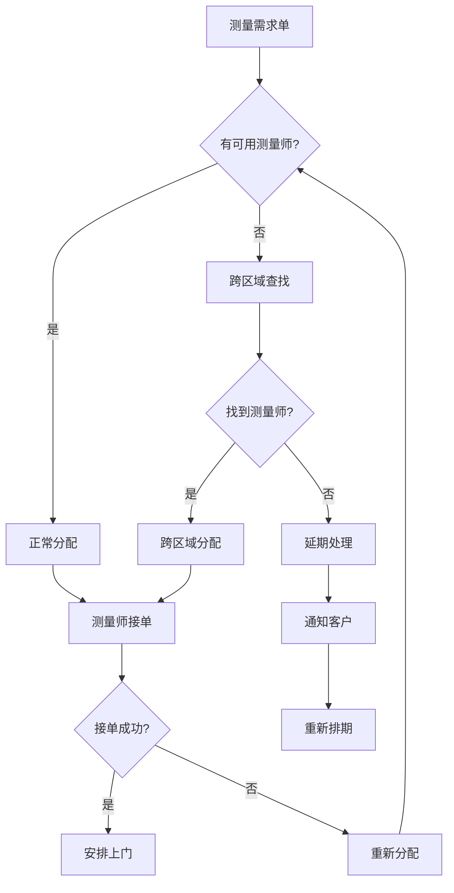
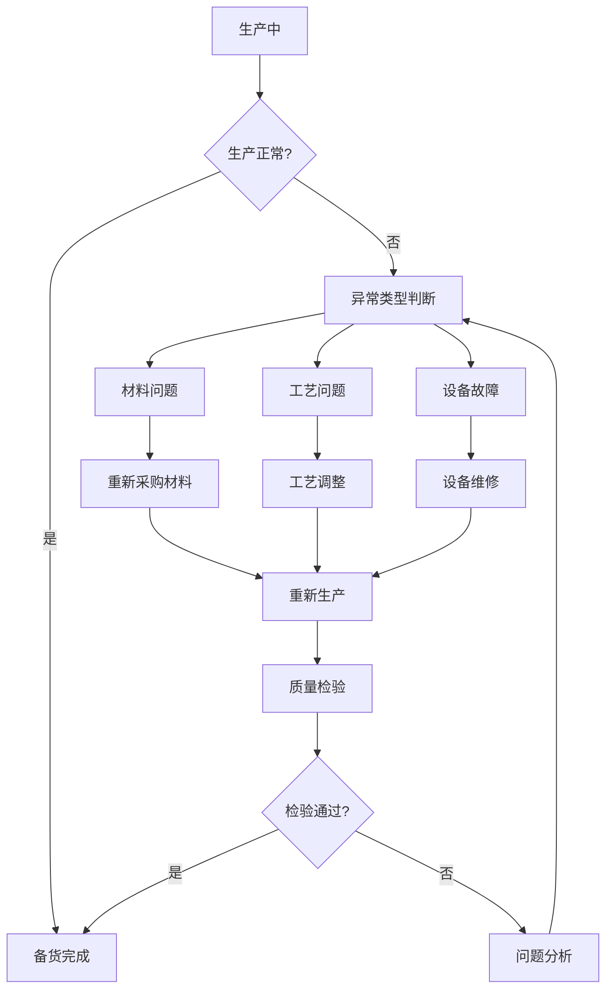
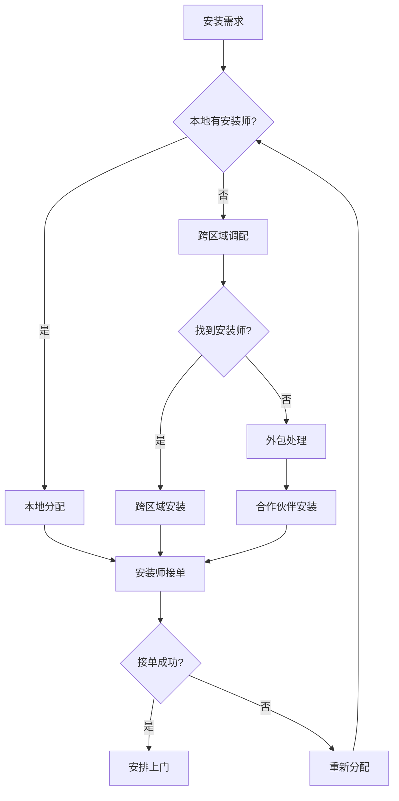
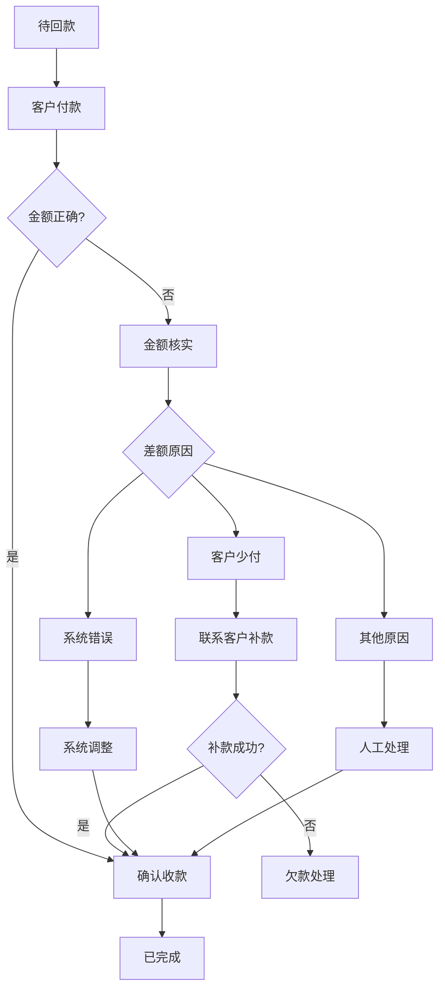
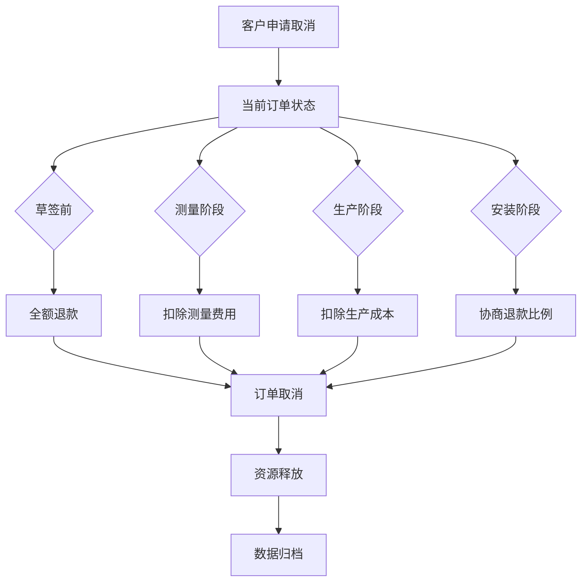

# 异常处理流程图

## 流程回流机制总览

## 详细异常处理流程

### 1. 线索阶段异常处理

#### 1.1 录入异常
- **Excel格式错误**
  - 提供标准模板下载
  - 显示具体错误信息
  - 支持部分数据导入
  
- **重复线索处理**
  - 自动检测重复线索
  - 提供合并或忽略选项
  - 记录重复来源

#### 1.2 分配异常
- **无可分配人员**
  - 自动转至上级处理
  - 发送紧急通知
  - 记录分配失败原因

#### 1.3 跟踪异常
- **长期无跟踪**
  - 系统自动提醒（7天、15天、30天）
  - 自动转交给其他销售
  - 线索质量评估

### 2. 测量阶段异常处理

#### 2.1 测量师分配异常

#### 2.2 测量质量异常
- **测量数据不准确**
  - 驻店销售驳回
  - 重新安排测量
  - 测量师培训记录
  
- **客户不配合测量**
  - 申请延期处理
  - 客户沟通记录
  - 必要时取消订单

#### 2.3 测量确认异常
- **多次驳回处理**
  - 第3次驳回自动升级
  - 技术主管介入
  - 客户需求重新评估

### 3. 生产阶段异常处理

#### 3.1 生产异常流程

#### 3.2 质量问题处理
- **质量不合格**
  - 立即停止生产
  - 问题原因分析
  - 重新生产或退款
  
- **交期延误**
  - 及时通知客户
  - 协商新的交期
  - 必要时提供补偿

### 4. 安装阶段异常处理

#### 4.1 安装师调度异常

#### 4.2 安装质量异常
- **安装不合格**
  - 客户拒绝确认
  - 重新安装
  - 安装师考核记录
  
- **客户投诉处理**
  - 24小时内响应
  - 现场问题解决
  - 客户满意度跟踪

### 5. 财务阶段异常处理

#### 5.1 回款异常处理

#### 5.2 发票异常处理
- **发票信息错误**
  - 重新开具发票
  - 客户信息核实
  - 税务合规检查

### 6. 客户取消订单处理

#### 6.1 取消订单流程

#### 6.2 退款标准
- **草签前取消**：全额退款
- **测量阶段取消**：扣除测量费用（200-500元）
- **生产阶段取消**：扣除已产生的生产成本
- **安装阶段取消**：根据具体情况协商

### 7. 系统异常处理

#### 7.1 数据异常处理
- **数据丢失**
  - 自动备份恢复
  - 手动数据补录
  - 异常原因分析
  
- **状态异常**
  - 状态一致性检查
  - 自动修复机制
  - 人工干预处理

#### 7.2 权限异常处理
- **越权操作**
  - 操作拦截
  - 权限申请流程
  - 操作日志记录

### 8. 预警机制

#### 8.1 时间预警
- **超时提醒**：各环节处理时限预警
- **延期预警**：可能延期的订单提前预警
- **节假日预警**：节假日期间的特殊安排

#### 8.2 质量预警
- **异常率预警**：各环节异常率超标预警
- **客户投诉预警**：投诉率异常预警
- **资源紧张预警**：人力资源不足预警

### 9. 应急处理机制

#### 9.1 紧急情况处理
- **系统故障**：备用系统启动
- **人员紧急情况**：应急人员调配
- **客户紧急需求**：绿色通道处理

#### 9.2 升级机制
- **一级升级**：主管介入
- **二级升级**：部门经理介入
- **三级升级**：公司高层介入

## 异常处理考核指标

### 1. 响应时效
- **异常发现时间**：从异常发生到发现的时间
- **处理响应时间**：从发现异常到开始处理的时间
- **解决完成时间**：从开始处理到问题解决的时间

### 2. 处理质量
- **一次解决率**：异常一次性解决的比例
- **客户满意度**：异常处理后的客户满意度
- **重复异常率**：同类异常的重复发生率

### 3. 预防效果
- **异常预防率**：通过预警机制避免的异常比例
- **流程改进率**：基于异常分析的流程改进比例
- **培训效果**：异常处理培训的效果评估
