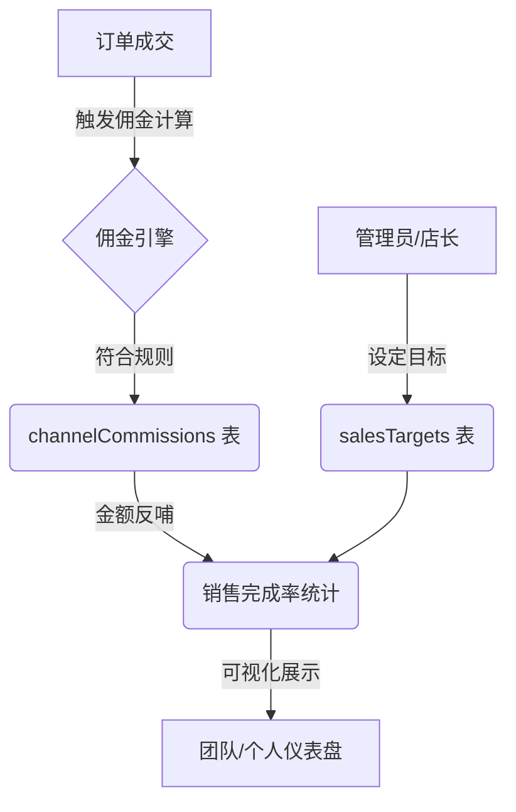

# 销售目标与佣金联动说明文档

## 1. 业务闭环概览

本系统通过「销售目标」设定与「渠道佣金」自动计算，实现了销售业绩管理的全链路闭环：

## 2. 技术联动机制

### 2.1 目标设定 (Sales Module)
- **入口**: `targets.ts` -> `updateSalesTarget`
- **逻辑**: 仅具备 `admin/manager/BOSS` 角色的用户可为指定销售人员（`role: 'sales'`）设定年度/月度目标金额。
- **存储**: 持久化至 `sales_targets` 表，并通过 `revalidateTag('sales-targets')` 失效缓存。

### 2.2 业绩采集 (Analytics Module)
- **入口**: `analytics.ts` -> `getMonthlyAchievedAmount`
- **逻辑**: 系统扫描 `quotes` 表中状态为 `ACCEPTED` 且所属租户、所属月份匹配的记录，汇总其 `finalAmount` 作为「已达成金额」。
- **联动**: 佣金系统的结算状态不直接影响销售达成率展示，但在财务对账（`finance` 模块）中，只有 `PAID` 状态的佣金才计入最终利润。

## 3. 关键代码入口

| 环节 | 文件路径 | 核心函数 | 说明 |
| :--- | :--- | :--- | :--- |
| **目标管理** | `src/features/sales/actions/targets.ts` | `updateSalesTarget` | 设定与修改 KPI |
| **完成率计算** | `src/features/sales/actions/analytics.ts` | `getSalesCompletionTrend` | 聚合最近 6 个月目标 vs 达成 |
| **佣金计算** | `src/features/channels/logic/commission.service.ts` | `calculateOrderCommission` | 处理复杂的金额分润逻辑 |
| **仪表盘展示** | `src/features/sales/actions/dashboard.ts` | `getSalesDashboardStats` | 团队与个人双视图数据支撑 |

## 4. FAQ (常见问题)

**Q: 为什么销售修改了订单金额，目标完成率没有立即变化？**
A: 为保证高性能，分析数据挂载了 `unstable_cache`，有效期为 60 秒。如需强制更新，可通过重新提交目标或触发订单状态变更来清除 Tag 缓存。

**Q: 佣金退回 (Clawback) 会减少销售达成金额吗？**
A: 目前版本的达成金额以 `ACCEPTED` 报价单为准。若发生退货导致的佣金扣回，会在 `channels` 模块体现负向记录，销售仪表盘的「已达成金额」目前保持成交时的数值。
