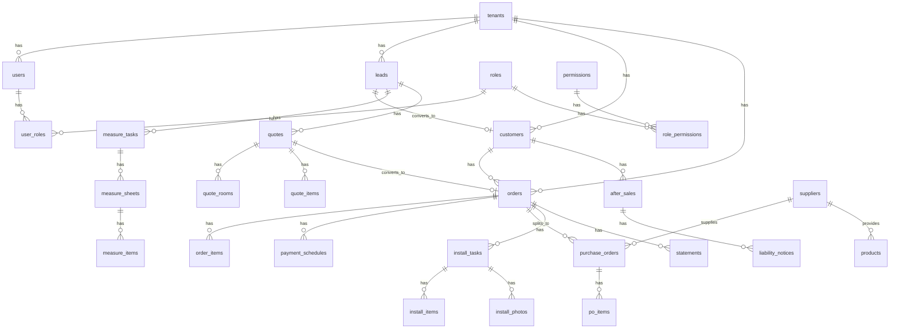

# L2C 数据库 Schema 设计

> 基于 12 个模块 PRD 的完整数据库表结构设计
> 技术栈: PostgreSQL (阿里云 RDS) + Drizzle ORM

## 1. 设计原则

| 原则 | 实现方式 |
|:---|:---|
| **RLS 优先** | 所有业务表启用 Row Level Security |
| **租户隔离** | 所有表包含 `tenant_id` 外键 |
| **软删除** | `deleted_at` 字段，不物理删除 |
| **审计追踪** | `created_by`, `created_at`, `updated_at` |
| **JSONB 动态** | 扩展属性使用 JSONB 存储 |

---

## 2. ER 关系图



---

## 3. 枚举类型定义

```sql
-- 线索状态
CREATE TYPE lead_status AS ENUM (
  'PENDING_DISPATCH',  -- 待分配 (公海)
  'PENDING_FOLLOWUP',  -- 待跟踪
  'FOLLOWING',         -- 跟踪中
  'WON',               -- 已成交
  'VOID'               -- 已作废
);

-- 测量任务状态
CREATE TYPE measure_task_status AS ENUM (
  'PENDING_DISPATCH',  -- 待分配
  'DISPATCHING',       -- 分配中
  'PENDING_VISIT',     -- 待上门
  'PENDING_CONFIRM',   -- 待确认
  'COMPLETED',         -- 已完成
  'CANCELLED'          -- 已取消
);

-- 测量数据状态
CREATE TYPE measure_sheet_status AS ENUM (
  'DRAFT',             -- 草稿
  'CONFIRMED',         -- 已确认
  'ARCHIVED'           -- 已归档
);

-- 报价单状态
CREATE TYPE quote_status AS ENUM (
  'DRAFT',             -- 草稿
  'ACTIVE',            -- 生效中
  'LOCKED',            -- 已锁定 (转订单)
  'EXPIRED'            -- 已失效
);

-- 订单状态
CREATE TYPE order_status AS ENUM (
  'PENDING_CONFIRMATION',  -- 待确认深化图 [NEW]
  'PENDING_PO',        -- 待下单
  'IN_PRODUCTION',     -- 生产中
  'PENDING_DELIVERY',  -- 待发货
  'DISPATCHING',       -- 发货中
  'SHIPPED',           -- 已发货
  'PENDING_INSTALL',   -- 待安装
  'COMPLETED',         -- 已完成
  'CLOSED',            -- 已关闭
  'HALTED',            -- 已叫停 [NEW]
  'CANCELLED'          -- 已取消
);

-- 采购单状态
CREATE TYPE po_status AS ENUM (
  'DRAFT',             -- 草稿
  'IN_PRODUCTION',     -- 生产中
  'READY',             -- 备货完成
  'SHIPPED',           -- 已发货
  'DELIVERED',         -- 已到货
  'STOCKED',           -- 已入库 (面料)
  'CANCELLED'          -- 已取消
);

-- [MODIFIED] 采购单类型
CREATE TYPE po_type AS ENUM (
  'FINISHED',          -- 成品采购
  'FABRIC',            -- 面料采购
  'STOCK'              -- 内部备货
);

-- 安装任务状态
CREATE TYPE install_task_status AS ENUM (
  'PENDING_DISPATCH',  -- 待分配
  'DISPATCHING',       -- 分配中
  'PENDING_VISIT',     -- 待上门
  'PENDING_CONFIRM',   -- 待确认
  'COMPLETED'          -- 已完成
);

-- 对账单状态
CREATE TYPE statement_status AS ENUM (
  'PENDING_INVOICE',   -- 待开票
  'PENDING_PAYMENT',   -- 待回款/待付款
  'PARTIAL_PAYMENT',   -- 部分回款
  'COMPLETED',         -- 已完成
  'BAD_DEBT'           -- 坏账
);

-- 对账单类型
CREATE TYPE statement_type AS ENUM (
  'AR',                -- 应收 (客户)
  'AP_SUPPLIER',       -- 应付 (供应商)
  'AP_LABOR'           -- 应付 (劳务)
);

-- 售后状态
CREATE TYPE after_sales_status AS ENUM (
  'PENDING',           -- 待受理
  'PROCESSING',        -- 处理中
  'PENDING_VISIT',     -- 待上门
  'PENDING_CALLBACK',  -- 待回访
  'CLOSED',            -- 已关闭
  'REJECTED'           -- 已驳回
);

-- 定责单状态
CREATE TYPE liability_status AS ENUM (
  'DRAFT',             -- 待发送
  'PENDING_CONFIRM',   -- 待确认
  'CONFIRMED',         -- 已确认
  'DISPUTED',          -- 有异议
  'ARBITRATED'         -- 已仲裁
);

-- 商品品类
CREATE TYPE product_category AS ENUM (
  'CURTAIN_FABRIC',    -- 窗帘布料
  'CURTAIN_SHEER',     -- 窗帘纱
  'CURTAIN_TRACK',     -- 窗帘轨道
  'CURTAIN_ACCESSORY', -- 窗帘配件
  'WALLCLOTH',         -- 墙布
  'WALLPANEL',         -- 墙咔
  'WINDOWPAD',         -- 飘窗垫
  'STANDARD',          -- 标品
  'MOTOR'              -- 电机
);

-- 客户等级
CREATE TYPE customer_level AS ENUM ('A', 'B', 'C', 'D');

-- 意向等级
CREATE TYPE intention_level AS ENUM ('HIGH', 'MEDIUM', 'LOW');

-- 支付方式
CREATE TYPE payment_method AS ENUM ('CASH', 'WECHAT', 'ALIPAY', 'BANK_TRANSFER', 'OTHER');

-- 责任方类型
CREATE TYPE liable_party_type AS ENUM ('COMPANY', 'SUPPLIER', 'INSTALLER', 'MEASURER', 'CUSTOMER');

-- [NEW] 装修进度
CREATE TYPE decoration_progress AS ENUM (
  'WATER_ELECTRIC',    -- 水电
  'MUD_WOOD',          -- 泥木
  'INSTALLATION',      -- 安装
  'PAINTING',          -- 油漆
  'COMPLETED'          -- 完工
);

-- [NEW] 订单结算方式
CREATE TYPE order_settlement_type AS ENUM (
  'PREPAID',           -- 预收
  'CREDIT',            -- 月结
  'CASH'               -- 现结
);

-- [NEW] 加工单状态
CREATE TYPE work_order_status AS ENUM (
  'PENDING',           -- 待加工 (面料未入库)
  'PROCESSING',        -- 加工中
  'COMPLETED',         -- 已完成
  'CANCELLED'          -- 已取消
);

-- [NEW] 测量类型
CREATE TYPE measure_type AS ENUM (
  'QUOTE_BASED',       -- 方案验证
  'BLIND',             -- 盲测
  'SALES_SELF'         -- 销售自测
);
```

---

## 4. 基础设施表

### 4.1 tenants (租户)

```sql
CREATE TABLE tenants (
  id UUID PRIMARY KEY DEFAULT gen_random_uuid(),
  name VARCHAR(100) NOT NULL,
  code VARCHAR(50) UNIQUE NOT NULL,          -- 租户编码
  logo_url TEXT,
  settings JSONB DEFAULT '{}',               -- 租户级配置
  is_active BOOLEAN DEFAULT TRUE,
  created_at TIMESTAMPTZ DEFAULT NOW(),
  updated_at TIMESTAMPTZ DEFAULT NOW()
);
```

### 4.2 users (用户)

```sql
CREATE TABLE users (
  id UUID PRIMARY KEY DEFAULT gen_random_uuid(),
  tenant_id UUID REFERENCES tenants(id) NOT NULL,
  email VARCHAR(255),
  phone VARCHAR(20) UNIQUE NOT NULL,
  password_hash TEXT,
  name VARCHAR(50) NOT NULL,
  avatar_url TEXT,
  is_active BOOLEAN DEFAULT TRUE,
  last_login_at TIMESTAMPTZ,
  created_at TIMESTAMPTZ DEFAULT NOW(),
  updated_at TIMESTAMPTZ DEFAULT NOW(),
  deleted_at TIMESTAMPTZ
);

CREATE INDEX idx_users_tenant ON users(tenant_id);
CREATE INDEX idx_users_phone ON users(phone);
```

### 4.3 roles (角色)

```sql
CREATE TABLE roles (
  id UUID PRIMARY KEY DEFAULT gen_random_uuid(),
  tenant_id UUID REFERENCES tenants(id) NOT NULL,
  name VARCHAR(50) NOT NULL,
  code VARCHAR(50) NOT NULL,                 -- ADMIN, SALES, DISPATCHER...
  description TEXT,
  is_system BOOLEAN DEFAULT FALSE,           -- 预置角色不可删
  created_at TIMESTAMPTZ DEFAULT NOW(),
  updated_at TIMESTAMPTZ DEFAULT NOW(),
  UNIQUE(tenant_id, code)
);
```

### 4.4 user_roles (用户角色关联)

```sql
CREATE TABLE user_roles (
  id UUID PRIMARY KEY DEFAULT gen_random_uuid(),
  user_id UUID REFERENCES users(id) NOT NULL,
  role_id UUID REFERENCES roles(id) NOT NULL,
  created_at TIMESTAMPTZ DEFAULT NOW(),
  UNIQUE(user_id, role_id)
);
```

### 4.5 permissions (权限点)

```sql
CREATE TABLE permissions (
  id UUID PRIMARY KEY DEFAULT gen_random_uuid(),
  module VARCHAR(50) NOT NULL,               -- lead, order, quote...
  action VARCHAR(50) NOT NULL,               -- view, create, edit, delete, approve
  name VARCHAR(100) NOT NULL,
  description TEXT,
  UNIQUE(module, action)
);
```

### 4.6 role_permissions (角色权限关联)

```sql
CREATE TABLE role_permissions (
  id UUID PRIMARY KEY DEFAULT gen_random_uuid(),
  role_id UUID REFERENCES roles(id) NOT NULL,
  permission_id UUID REFERENCES permissions(id) NOT NULL,
  created_at TIMESTAMPTZ DEFAULT NOW(),
  UNIQUE(role_id, permission_id)
);
```

---

## 5. 业务核心表

### 5.1 channel_sources (渠道配置)

```sql
CREATE TABLE channel_sources (
  id UUID PRIMARY KEY DEFAULT gen_random_uuid(),
  tenant_id UUID REFERENCES tenants(id) NOT NULL,
  parent_id UUID REFERENCES channel_sources(id),  -- 三级层级
  name VARCHAR(100) NOT NULL,
  level INTEGER NOT NULL CHECK (level IN (1, 2, 3)),
  is_active BOOLEAN DEFAULT TRUE,
  auto_assign_sales_id UUID REFERENCES users(id),
  sort_order INTEGER DEFAULT 0,
  created_at TIMESTAMPTZ DEFAULT NOW(),
  updated_at TIMESTAMPTZ DEFAULT NOW()
);

CREATE INDEX idx_channel_sources_parent ON channel_sources(parent_id);
```

### 5.2 customers (客户)

```sql
CREATE TABLE customers (
  id UUID PRIMARY KEY DEFAULT gen_random_uuid(),
  tenant_id UUID REFERENCES tenants(id) NOT NULL,
  customer_no VARCHAR(50) UNIQUE NOT NULL,   -- CU20260101001
  name VARCHAR(50) NOT NULL,
  phone VARCHAR(20) NOT NULL,
  phone_secondary VARCHAR(20),
  wechat VARCHAR(50),
  gender VARCHAR(10),
  birthday DATE,
  source_lead_id UUID,                        -- 首次线索ID
  referrer_customer_id UUID REFERENCES customers(id),
  default_address TEXT,
  addresses JSONB DEFAULT '[]',
  tags TEXT[] DEFAULT '{}',
  level customer_level DEFAULT 'D',
  total_orders INTEGER DEFAULT 0,
  total_amount DECIMAL(12,2) DEFAULT 0,
  avg_order_amount DECIMAL(12,2) DEFAULT 0,
  first_order_at TIMESTAMPTZ,
  last_order_at TIMESTAMPTZ,
  preferences JSONB DEFAULT '{}',
  notes TEXT,
  is_merged BOOLEAN DEFAULT FALSE,
  merged_from UUID[],
  assigned_sales_id UUID REFERENCES users(id),
  created_by UUID REFERENCES users(id) NOT NULL,
  created_at TIMESTAMPTZ DEFAULT NOW(),
  updated_at TIMESTAMPTZ DEFAULT NOW(),
  deleted_at TIMESTAMPTZ
);

CREATE INDEX idx_customers_tenant ON customers(tenant_id);
CREATE INDEX idx_customers_phone ON customers(phone);
CREATE INDEX idx_customers_level ON customers(level);
```

### 5.3 leads (线索)

```sql
CREATE TABLE leads (
  id UUID PRIMARY KEY DEFAULT gen_random_uuid(),
  tenant_id UUID REFERENCES tenants(id) NOT NULL,
  lead_no VARCHAR(50) UNIQUE NOT NULL,       -- LD20260101001
  source_category_id UUID REFERENCES channel_sources(id),
  source_sub_id UUID REFERENCES channel_sources(id),
  source_detail VARCHAR(200),
  customer_name VARCHAR(50) NOT NULL,
  customer_phone VARCHAR(20) NOT NULL,
  customer_wechat VARCHAR(50),
  community VARCHAR(100),
  address TEXT,
  house_type VARCHAR(50),
  intention_level intention_level,
  estimated_amount DECIMAL(12,2),
  status lead_status DEFAULT 'PENDING_DISPATCH',
  assigned_sales_id UUID REFERENCES users(id),
  assigned_at TIMESTAMPTZ,
  tags TEXT[] DEFAULT '{}',
  remark TEXT,
  decoration_progress decoration_progress,    -- [NEW] 装修进度
  next_follow_up_recommendation TIMESTAMPTZ,  -- [NEW] 系统推荐跟进时间
  referrer_customer_id UUID REFERENCES customers(id),
  customer_id UUID REFERENCES customers(id), -- 成交后关联
  quoted_at TIMESTAMPTZ,
  visited_store_at TIMESTAMPTZ,
  won_at TIMESTAMPTZ,
  created_by UUID REFERENCES users(id) NOT NULL,
  created_at TIMESTAMPTZ DEFAULT NOW(),
  updated_at TIMESTAMPTZ DEFAULT NOW(),
  last_activity_at TIMESTAMPTZ DEFAULT NOW(),
  deleted_at TIMESTAMPTZ
);

CREATE INDEX idx_leads_tenant ON leads(tenant_id);
CREATE INDEX idx_leads_status ON leads(status);
CREATE INDEX idx_leads_sales ON leads(assigned_sales_id);
CREATE INDEX idx_leads_phone ON leads(customer_phone);
```

### 5.4 lead_activities (跟进记录)

```sql
CREATE TABLE lead_activities (
  id UUID PRIMARY KEY DEFAULT gen_random_uuid(),
  lead_id UUID REFERENCES leads(id) NOT NULL,
  activity_type VARCHAR(50) NOT NULL,        -- PHONE_CALL, WECHAT_CHAT, STORE_VISIT...
  content TEXT NOT NULL,
  next_follow_date DATE,
  created_by UUID REFERENCES users(id) NOT NULL,
  created_at TIMESTAMPTZ DEFAULT NOW()
);

CREATE INDEX idx_lead_activities_lead ON lead_activities(lead_id);
```

---

## 6. 测量模块

### 6.1 measure_tasks (测量任务)

```sql
CREATE TABLE measure_tasks (
  id UUID PRIMARY KEY DEFAULT gen_random_uuid(),
  tenant_id UUID REFERENCES tenants(id) NOT NULL,
  task_no VARCHAR(50) UNIQUE NOT NULL,       -- MT20260101001
  lead_id UUID REFERENCES leads(id) NOT NULL,
  customer_name VARCHAR(50) NOT NULL,
  customer_phone VARCHAR(20) NOT NULL,
  address TEXT NOT NULL,
  category product_category,                  -- 窗帘/墙布等
  status measure_task_status DEFAULT 'PENDING_DISPATCH',
  sales_id UUID REFERENCES users(id) NOT NULL,
  dispatcher_id UUID REFERENCES users(id),
  measurer_id UUID REFERENCES users(id),
  measurer_name VARCHAR(50),
  scheduled_date DATE,
  scheduled_time_slot VARCHAR(20),            -- 上午/下午/晚间
  check_in_at TIMESTAMPTZ,
  check_in_location POINT,
  type measure_type DEFAULT 'BLIND',          -- [NEW] 测量类型
  reject_count INTEGER DEFAULT 0,
  remark TEXT,
  created_by UUID REFERENCES users(id) NOT NULL,
  created_at TIMESTAMPTZ DEFAULT NOW(),
  updated_at TIMESTAMPTZ DEFAULT NOW(),
  completed_at TIMESTAMPTZ,
  deleted_at TIMESTAMPTZ
);

CREATE INDEX idx_measure_tasks_tenant ON measure_tasks(tenant_id);
CREATE INDEX idx_measure_tasks_lead ON measure_tasks(lead_id);
CREATE INDEX idx_measure_tasks_status ON measure_tasks(status);
CREATE INDEX idx_measure_tasks_measurer ON measure_tasks(measurer_id);
```

### 6.2 measure_sheets (测量数据)

```sql
CREATE TABLE measure_sheets (
  id UUID PRIMARY KEY DEFAULT gen_random_uuid(),
  task_id UUID REFERENCES measure_tasks(id) NOT NULL,
  sheet_no VARCHAR(50) UNIQUE NOT NULL,      -- MS20260101001
  round INTEGER DEFAULT 1,                    -- 测量轮次
  variant VARCHAR(10) DEFAULT 'A',            -- 方案分支
  version_display VARCHAR(20),                -- V1.A
  parent_id UUID REFERENCES measure_sheets(id),
  status measure_sheet_status DEFAULT 'DRAFT',
  site_photos JSONB DEFAULT '[]',
  sketch_map TEXT,
  confirmed_at TIMESTAMPTZ,
  confirmed_by UUID REFERENCES users(id),
  created_by UUID REFERENCES users(id) NOT NULL,
  created_at TIMESTAMPTZ DEFAULT NOW(),
  updated_at TIMESTAMPTZ DEFAULT NOW()
);

CREATE INDEX idx_measure_sheets_task ON measure_sheets(task_id);
```

### 6.3 measure_items (测量明细)

```sql
CREATE TABLE measure_items (
  id UUID PRIMARY KEY DEFAULT gen_random_uuid(),
  sheet_id UUID REFERENCES measure_sheets(id) NOT NULL,
  room_name VARCHAR(50) NOT NULL,
  window_type VARCHAR(20) DEFAULT 'STRAIGHT', -- STRAIGHT, L_SHAPE, U_SHAPE, ARC
  width DECIMAL(10,2) NOT NULL,               -- mm
  height DECIMAL(10,2) NOT NULL,              -- mm
  install_type VARCHAR(20) DEFAULT 'TOP',     -- TOP, SIDE
  bracket_dist DECIMAL(10,2),                 -- 支架离地
  wall_material VARCHAR(20),                  -- CONCRETE, WOOD, GYPSUM
  has_box BOOLEAN DEFAULT FALSE,
  box_depth DECIMAL(10,2),
  is_electric BOOLEAN DEFAULT FALSE,
  photos JSONB DEFAULT '[]',
  remark TEXT,
  sort_order INTEGER DEFAULT 0,
  created_at TIMESTAMPTZ DEFAULT NOW()
);

CREATE INDEX idx_measure_items_sheet ON measure_items(sheet_id);
```

---

## 7. 报价模块

### 7.1 quotes (报价单)

```sql
CREATE TABLE quotes (
  id UUID PRIMARY KEY DEFAULT gen_random_uuid(),
  tenant_id UUID REFERENCES tenants(id) NOT NULL,
  quote_no VARCHAR(50) UNIQUE NOT NULL,      -- QT20260101001
  lead_id UUID REFERENCES leads(id),
  customer_id UUID REFERENCES customers(id),
  measure_variant_id UUID REFERENCES measure_sheets(id),
  title VARCHAR(200),
  status quote_status DEFAULT 'DRAFT',
  version INTEGER DEFAULT 1,
  total_amount DECIMAL(12,2) DEFAULT 0,
  discount_rate DECIMAL(5,4),                 -- 0.95 = 95折
  discount_amount DECIMAL(12,2),
  final_amount DECIMAL(12,2) DEFAULT 0,
  valid_until DATE,
  remark TEXT,
  created_by UUID REFERENCES users(id) NOT NULL,
  created_at TIMESTAMPTZ DEFAULT NOW(),
  updated_at TIMESTAMPTZ DEFAULT NOW(),
  locked_at TIMESTAMPTZ,
  deleted_at TIMESTAMPTZ
);

CREATE INDEX idx_quotes_tenant ON quotes(tenant_id);
CREATE INDEX idx_quotes_lead ON quotes(lead_id);
CREATE INDEX idx_quotes_status ON quotes(status);
```

### 7.2 quote_rooms (报价空间)

```sql
CREATE TABLE quote_rooms (
  id UUID PRIMARY KEY DEFAULT gen_random_uuid(),
  quote_id UUID REFERENCES quotes(id) NOT NULL,
  name VARCHAR(50) NOT NULL,
  measure_room_id UUID,                       -- 关联测量空间
  sort_order INTEGER DEFAULT 0,
  created_at TIMESTAMPTZ DEFAULT NOW()
);

CREATE INDEX idx_quote_rooms_quote ON quote_rooms(quote_id);
```

### 7.3 quote_items (报价明细)

```sql
CREATE TABLE quote_items (
  id UUID PRIMARY KEY DEFAULT gen_random_uuid(),
  quote_id UUID REFERENCES quotes(id) NOT NULL,
  room_id UUID REFERENCES quote_rooms(id) NOT NULL,
  room_name VARCHAR(50) NOT NULL,
  category product_category NOT NULL,
  product_id UUID NOT NULL,
  product_name VARCHAR(200) NOT NULL,
  product_sku VARCHAR(100) NOT NULL,
  product_image TEXT,
  fabric_width DECIMAL(10,2),                 -- 幅宽 cm
  unit VARCHAR(20) NOT NULL,
  unit_price DECIMAL(10,2) NOT NULL,
  width DECIMAL(10,2),                        -- mm
  height DECIMAL(10,2),                       -- mm
  fold_ratio DECIMAL(5,2),                    -- 褶皱倍率
  quantity DECIMAL(10,2) NOT NULL,
  process_fee DECIMAL(10,2) DEFAULT 0,
  subtotal DECIMAL(12,2) NOT NULL,
  remark TEXT,
  sort_order INTEGER DEFAULT 0,
  created_at TIMESTAMPTZ DEFAULT NOW(),
  updated_at TIMESTAMPTZ DEFAULT NOW()
);

CREATE INDEX idx_quote_items_quote ON quote_items(quote_id);
CREATE INDEX idx_quote_items_room ON quote_items(room_id);
```

---

## 8. 订单模块

### 8.1 orders (订单)

```sql
CREATE TABLE orders (
  id UUID PRIMARY KEY DEFAULT gen_random_uuid(),
  tenant_id UUID REFERENCES tenants(id) NOT NULL,
  order_no VARCHAR(50) UNIQUE NOT NULL,      -- OD20260101001
  quote_id UUID REFERENCES quotes(id) NOT NULL,
  lead_id UUID REFERENCES leads(id),
  customer_id UUID REFERENCES customers(id) NOT NULL,
  customer_name VARCHAR(50) NOT NULL,
  customer_phone VARCHAR(20) NOT NULL,
  delivery_address TEXT NOT NULL,
  status order_status DEFAULT 'PENDING_PO',
  settlement_type order_settlement_type DEFAULT 'CASH', -- [NEW] 结算方式
  total_amount DECIMAL(12,2) NOT NULL,
  paid_amount DECIMAL(12,2) DEFAULT 0,
  confirmation_img TEXT,                      -- 客户确认凭证
  payment_proof_img TEXT,                     -- 付款凭证
  payment_amount DECIMAL(12,2),              -- 立即支付金额
  payment_method payment_method,                 -- 支付方式
  payment_time TIMESTAMPTZ,                   -- 支付时间
  prepaid_payment_id UUID,                      -- 预收款单 ID
  sales_id UUID REFERENCES users(id) NOT NULL,
  remark TEXT,
  snapshot_data JSONB NOT NULL DEFAULT '{}',   -- [NEW] 订单快照数据
  halted_reason TEXT,                            -- [NEW] 叫停原因
  halted_at TIMESTAMPTZ,                         -- [NEW] 叫停时间
  previous_status order_status,                   -- [NEW] 叫停前的状态
  cancel_reason TEXT,                            -- [NEW] 撤单原因
  cancelled_by UUID REFERENCES users(id),           -- [NEW] 撤单人ID
  cancelled_at TIMESTAMPTZ,                      -- [NEW] 撤单时间
  locked_by UUID REFERENCES users(id),              -- [NEW] 锁定人ID
  is_locked BOOLEAN DEFAULT FALSE,                 -- [NEW] 是否锁定
  confirmation_deadline TIMESTAMPTZ,             -- [NEW] 深化图确认截止时间
  created_at TIMESTAMPTZ DEFAULT NOW(),
  updated_at TIMESTAMPTZ DEFAULT NOW(),
  completed_at TIMESTAMPTZ,
  closed_at TIMESTAMPTZ,
  deleted_at TIMESTAMPTZ
);

CREATE INDEX idx_orders_tenant ON orders(tenant_id);
CREATE INDEX idx_orders_customer ON orders(customer_id);
CREATE INDEX idx_orders_status ON orders(status);
CREATE INDEX idx_orders_sales ON orders(sales_id);
```

### 8.2 order_items (订单明细)

```sql
CREATE TABLE order_items (
  id UUID PRIMARY KEY DEFAULT gen_random_uuid(),
  order_id UUID REFERENCES orders(id) NOT NULL,
  quote_item_id UUID REFERENCES quote_items(id) NOT NULL,
  room_name VARCHAR(50) NOT NULL,
  product_id UUID NOT NULL,
  product_name VARCHAR(200) NOT NULL,
  category product_category NOT NULL,
  unit_price DECIMAL(10,2) NOT NULL,
  quantity DECIMAL(10,2) NOT NULL,
  width DECIMAL(10,2),
  height DECIMAL(10,2),
  subtotal DECIMAL(12,2) NOT NULL,
  po_id UUID,                                 -- 关联采购单 (拆单后)
  supplier_id UUID REFERENCES suppliers(id),  -- 供应商ID [NEW]
  purchase_order_id UUID REFERENCES purchase_orders(id),  -- 采购单ID [NEW]
  delivery_status VARCHAR(50) DEFAULT 'PENDING',  -- 交付状态 [NEW]
  delivered_at TIMESTAMPTZ,                      -- 送达时间 [NEW]
  status VARCHAR(50) DEFAULT 'PENDING',
  created_at TIMESTAMPTZ DEFAULT NOW()
);

CREATE INDEX idx_order_items_order ON order_items(order_id);
CREATE INDEX idx_order_items_po ON order_items(po_id);
CREATE INDEX idx_order_items_supplier ON order_items(supplier_id);  -- [NEW]
CREATE INDEX idx_order_items_purchase_order ON order_items(purchase_order_id);  -- [NEW]
```

### 8.4 change_requests (变更单) [NEW]

```sql
CREATE TABLE change_requests (
  id UUID PRIMARY KEY DEFAULT gen_random_uuid(),
  tenant_id UUID REFERENCES tenants(id) NOT NULL,
  order_id UUID REFERENCES orders(id) NOT NULL,
  order_no VARCHAR(50) NOT NULL,
  change_type VARCHAR(50) NOT NULL,  -- ADD_ITEM/REMOVE_ITEM/MODIFY_ITEM
  change_reason TEXT NOT NULL,
  original_items JSONB NOT NULL,
  new_items JSONB NOT NULL,
  price_difference DECIMAL(10,2),
  status VARCHAR(50) NOT NULL DEFAULT 'PENDING',  -- PENDING/APPROVED/REJECTED
  approved_by UUID REFERENCES users(id),
  approved_at TIMESTAMPTZ,
  rejected_by UUID REFERENCES users(id),
  rejected_at TIMESTAMPTZ,
  rejection_reason TEXT,
  created_by UUID REFERENCES users(id) NOT NULL,
  created_at TIMESTAMPTZ DEFAULT NOW(),
  updated_at TIMESTAMPTZ DEFAULT NOW()
);

CREATE INDEX idx_change_requests_order ON change_requests(order_id);
CREATE INDEX idx_change_requests_status ON change_requests(status);
CREATE INDEX idx_change_requests_tenant ON change_requests(tenant_id);
CREATE INDEX idx_change_requests_tenant_status ON change_requests(tenant_id, status);
```

### 8.5 payment_schedules (收款计划)

```sql
CREATE TABLE payment_schedules (
  id UUID PRIMARY KEY DEFAULT gen_random_uuid(),
  order_id UUID REFERENCES orders(id) NOT NULL,
  name VARCHAR(50) NOT NULL,                  -- 定金/发货前/验收后
  amount DECIMAL(12,2) NOT NULL,
  expected_date DATE,
  actual_date DATE,
  status VARCHAR(20) DEFAULT 'PENDING',       -- PENDING/PAID
  proof_url TEXT,
  remark TEXT,
  created_at TIMESTAMPTZ DEFAULT NOW(),
  updated_at TIMESTAMPTZ DEFAULT NOW()
);

CREATE INDEX idx_payment_schedules_order ON payment_schedules(order_id);
```

---

## 9. 采购模块

### 9.1 suppliers (供应商)

```sql
CREATE TABLE suppliers (
  id UUID PRIMARY KEY DEFAULT gen_random_uuid(),
  tenant_id UUID REFERENCES tenants(id) NOT NULL,
  supplier_no VARCHAR(50) UNIQUE NOT NULL,   -- SP20260101001
  name VARCHAR(100) NOT NULL,
  contact_name VARCHAR(50),
  contact_phone VARCHAR(20),
  contact_email VARCHAR(100),
  address TEXT,
  settlement_type VARCHAR(20) DEFAULT 'MONTHLY', -- MONTHLY/CASH
  bank_account JSONB,
  is_active BOOLEAN DEFAULT TRUE,
  remark TEXT,
  created_at TIMESTAMPTZ DEFAULT NOW(),
  updated_at TIMESTAMPTZ DEFAULT NOW(),
  deleted_at TIMESTAMPTZ
);

CREATE INDEX idx_suppliers_tenant ON suppliers(tenant_id);
```

### 9.2 purchase_orders (采购单)

```sql
CREATE TABLE purchase_orders (
  id UUID PRIMARY KEY DEFAULT gen_random_uuid(),
  tenant_id UUID REFERENCES tenants(id) NOT NULL,
  po_no VARCHAR(50) UNIQUE NOT NULL,         -- PO20260101001
  order_id UUID REFERENCES orders(id) NOT NULL,
  supplier_id UUID REFERENCES suppliers(id) NOT NULL,
  supplier_name VARCHAR(100) NOT NULL,
  type po_type DEFAULT 'FINISHED',            -- [MODIFIED] 采购类型
  status po_status DEFAULT 'DRAFT',
  total_cost DECIMAL(12,2) NOT NULL,
  external_po_no VARCHAR(100),                -- 工厂方单号
  supplier_quote_img TEXT,
  sent_method VARCHAR(20),                    -- WECHAT/EMAIL/SYSTEM
  sent_at TIMESTAMPTZ,
  produced_at TIMESTAMPTZ,
  logistics_company VARCHAR(50),
  logistics_no VARCHAR(100),
  shipped_at TIMESTAMPTZ,
  delivered_at TIMESTAMPTZ,
  payment_status VARCHAR(20) DEFAULT 'PENDING', -- PENDING/PARTIAL/PAID
  remark TEXT,
  created_by UUID REFERENCES users(id) NOT NULL,
  created_at TIMESTAMPTZ DEFAULT NOW(),
  updated_at TIMESTAMPTZ DEFAULT NOW()
);

CREATE INDEX idx_po_tenant ON purchase_orders(tenant_id);
CREATE INDEX idx_po_order ON purchase_orders(order_id);
CREATE INDEX idx_po_supplier ON purchase_orders(supplier_id);
CREATE INDEX idx_po_status ON purchase_orders(status);
```

### 9.3 po_items (采购明细)

```sql
CREATE TABLE po_items (
  id UUID PRIMARY KEY DEFAULT gen_random_uuid(),
  po_id UUID REFERENCES purchase_orders(id) NOT NULL,
  order_item_id UUID REFERENCES order_items(id) NOT NULL,
  product_id UUID NOT NULL,
  product_name VARCHAR(200) NOT NULL,
  product_sku VARCHAR(100),
  category product_category NOT NULL,
  unit_cost DECIMAL(10,2) NOT NULL,
  quantity DECIMAL(10,2) NOT NULL,
  width DECIMAL(10,2),
  height DECIMAL(10,2),
  subtotal DECIMAL(12,2) NOT NULL,
  remark TEXT,
  created_at TIMESTAMPTZ DEFAULT NOW()
);

CREATE INDEX idx_po_items_po ON po_items(po_id);

### 9.4 work_orders (加工单) [NEW]

```sql
CREATE TABLE work_orders (
  id UUID PRIMARY KEY DEFAULT gen_random_uuid(),
  tenant_id UUID REFERENCES tenants(id) NOT NULL,
  wo_no VARCHAR(50) UNIQUE NOT NULL,         -- WO20260101001
  order_id UUID REFERENCES orders(id) NOT NULL,
  po_id UUID REFERENCES purchase_orders(id) NOT NULL, -- 关联的面料采购单
  supplier_id UUID REFERENCES suppliers(id) NOT NULL, -- 加工厂
  status work_order_status DEFAULT 'PENDING',
  start_at TIMESTAMPTZ,
  completed_at TIMESTAMPTZ,
  remark TEXT,
  created_by UUID REFERENCES users(id) NOT NULL,
  created_at TIMESTAMPTZ DEFAULT NOW(),
  updated_at TIMESTAMPTZ DEFAULT NOW(),
  deleted_at TIMESTAMPTZ
);

CREATE INDEX idx_work_orders_order ON work_orders(order_id);
CREATE INDEX idx_work_orders_po ON work_orders(po_id);
```

### 9.5 work_order_items (加工明细) [NEW]

```sql
CREATE TABLE work_order_items (
  id UUID PRIMARY KEY DEFAULT gen_random_uuid(),
  wo_id UUID REFERENCES work_orders(id) NOT NULL,
  order_item_id UUID REFERENCES order_items(id) NOT NULL, -- 关联原始订单项(成品窗帘)
  status VARCHAR(20) DEFAULT 'PENDING',
  created_at TIMESTAMPTZ DEFAULT NOW()
);
```
```

---

## 10. 安装模块

### 10.1 install_tasks (安装任务)

```sql
CREATE TABLE install_tasks (
  id UUID PRIMARY KEY DEFAULT gen_random_uuid(),
  tenant_id UUID REFERENCES tenants(id) NOT NULL,
  task_no VARCHAR(50) UNIQUE NOT NULL,       -- IT20260101001
  order_id UUID REFERENCES orders(id) NOT NULL,
  customer_id UUID REFERENCES customers(id) NOT NULL,
  customer_name VARCHAR(50) NOT NULL,
  customer_phone VARCHAR(20) NOT NULL,
  address TEXT NOT NULL,
  category product_category,
  status install_task_status DEFAULT 'PENDING_DISPATCH',
  sales_id UUID REFERENCES users(id) NOT NULL,
  dispatcher_id UUID REFERENCES users(id),
  installer_id UUID REFERENCES users(id),
  installer_name VARCHAR(50),
  scheduled_date DATE,
  scheduled_time_slot VARCHAR(20),
  actual_start_at TIMESTAMPTZ,
  actual_end_at TIMESTAMPTZ,
  check_in_location POINT,
  check_in_at TIMESTAMPTZ,
  labor_fee DECIMAL(10,2),                    -- 预估工费
  actual_labor_fee DECIMAL(10,2),             -- 实际工费
  rating INTEGER CHECK (rating >= 1 AND rating <= 5),
  rating_comment TEXT,
  remark TEXT,
  reject_count INTEGER DEFAULT 0,
  created_at TIMESTAMPTZ DEFAULT NOW(),
  updated_at TIMESTAMPTZ DEFAULT NOW(),
  completed_at TIMESTAMPTZ,
  deleted_at TIMESTAMPTZ
);

CREATE INDEX idx_install_tasks_tenant ON install_tasks(tenant_id);
CREATE INDEX idx_install_tasks_order ON install_tasks(order_id);
CREATE INDEX idx_install_tasks_status ON install_tasks(status);
CREATE INDEX idx_install_tasks_installer ON install_tasks(installer_id);
```

### 10.2 install_items (安装明细)

```sql
CREATE TABLE install_items (
  id UUID PRIMARY KEY DEFAULT gen_random_uuid(),
  install_task_id UUID REFERENCES install_tasks(id) NOT NULL,
  order_item_id UUID REFERENCES order_items(id) NOT NULL,
  product_name VARCHAR(200) NOT NULL,
  room_name VARCHAR(50) NOT NULL,
  quantity DECIMAL(10,2) NOT NULL,
  is_installed BOOLEAN DEFAULT FALSE,
  created_at TIMESTAMPTZ DEFAULT NOW()
);

CREATE INDEX idx_install_items_task ON install_items(install_task_id);
```

### 10.3 install_photos (安装照片)

```sql
CREATE TABLE install_photos (
  id UUID PRIMARY KEY DEFAULT gen_random_uuid(),
  install_task_id UUID REFERENCES install_tasks(id) NOT NULL,
  photo_type VARCHAR(20) NOT NULL,            -- BEFORE/AFTER/DETAIL
  photo_url TEXT NOT NULL,
  room_name VARCHAR(50),
  remark TEXT,
  created_at TIMESTAMPTZ DEFAULT NOW()
);

CREATE INDEX idx_install_photos_task ON install_photos(install_task_id);
```

---

## 11. 财务模块

### 11.1 statements (对账单)

```sql
CREATE TABLE statements (
  id UUID PRIMARY KEY DEFAULT gen_random_uuid(),
  tenant_id UUID REFERENCES tenants(id) NOT NULL,
  statement_no VARCHAR(50) UNIQUE NOT NULL,  -- AR/AP20260101001
  type statement_type NOT NULL,
  order_id UUID REFERENCES orders(id),        -- AR 关联
  customer_id UUID REFERENCES customers(id),  -- AR 关联
  customer_name VARCHAR(50),
  supplier_id UUID REFERENCES suppliers(id),  -- AP 关联
  supplier_name VARCHAR(100),
  worker_id UUID REFERENCES users(id),        -- 劳务关联
  worker_name VARCHAR(50),
  period_start DATE,
  period_end DATE,
  total_amount DECIMAL(12,2) NOT NULL,
  received_amount DECIMAL(12,2) DEFAULT 0,    -- AR
  pending_amount DECIMAL(12,2) DEFAULT 0,
  deduction_amount DECIMAL(12,2) DEFAULT 0,   -- AP 扣款
  actual_amount DECIMAL(12,2),                -- AP 实付
  status statement_status DEFAULT 'PENDING_INVOICE',
  invoice_no VARCHAR(100),
  invoice_url TEXT,
  invoiced_at TIMESTAMPTZ,
  paid_at TIMESTAMPTZ,
  sales_id UUID REFERENCES users(id),
  created_by UUID REFERENCES users(id) NOT NULL,
  created_at TIMESTAMPTZ DEFAULT NOW(),
  updated_at TIMESTAMPTZ DEFAULT NOW(),
  completed_at TIMESTAMPTZ
);

CREATE INDEX idx_statements_tenant ON statements(tenant_id);
CREATE INDEX idx_statements_type ON statements(type);
CREATE INDEX idx_statements_status ON statements(status);
CREATE INDEX idx_statements_order ON statements(order_id);
CREATE INDEX idx_statements_supplier ON statements(supplier_id);
```

### 11.2 statement_items (对账明细)

```sql
CREATE TABLE statement_items (
  id UUID PRIMARY KEY DEFAULT gen_random_uuid(),
  statement_id UUID REFERENCES statements(id) NOT NULL,
  source_type VARCHAR(50) NOT NULL,           -- PO/INSTALL/MEASURE
  source_id UUID NOT NULL,
  source_no VARCHAR(50) NOT NULL,
  amount DECIMAL(12,2) NOT NULL,
  is_deduction BOOLEAN DEFAULT FALSE,
  deduction_reason TEXT,
  after_sales_id UUID,
  created_at TIMESTAMPTZ DEFAULT NOW()
);

CREATE INDEX idx_statement_items_statement ON statement_items(statement_id);
```

### 11.3 payment_records (收付款记录)

```sql
CREATE TABLE payment_records (
  id UUID PRIMARY KEY DEFAULT gen_random_uuid(),
  statement_id UUID REFERENCES statements(id) NOT NULL,
  schedule_id UUID REFERENCES payment_schedules(id),
  amount DECIMAL(12,2) NOT NULL,
  payment_method payment_method NOT NULL,
  proof_url TEXT,
  received_at TIMESTAMPTZ NOT NULL,
  recorded_by UUID REFERENCES users(id) NOT NULL,
  remark TEXT,
  created_at TIMESTAMPTZ DEFAULT NOW()
);

CREATE INDEX idx_payment_records_statement ON payment_records(statement_id);
```

---

## 12. 售后模块

### 12.1 after_sales (售后工单)

```sql
CREATE TABLE after_sales (
  id UUID PRIMARY KEY DEFAULT gen_random_uuid(),
  tenant_id UUID REFERENCES tenants(id) NOT NULL,
  ticket_no VARCHAR(50) UNIQUE NOT NULL,     -- AS20260101001
  customer_id UUID REFERENCES customers(id) NOT NULL,
  order_id UUID REFERENCES orders(id) NOT NULL,
  type VARCHAR(20) NOT NULL,                  -- REPAIR/CLEAN/REPLACE/COMPLAINT/CONSULT
  priority VARCHAR(20) DEFAULT 'NORMAL',      -- URGENT/NORMAL/LOW
  status after_sales_status DEFAULT 'PENDING',
  description TEXT NOT NULL,
  photos JSONB DEFAULT '[]',
  assigned_to UUID REFERENCES users(id),
  solution TEXT,
  cost DECIMAL(10,2) DEFAULT 0,
  is_warranty BOOLEAN DEFAULT TRUE,
  satisfaction INTEGER CHECK (satisfaction >= 1 AND satisfaction <= 5),
  created_by UUID REFERENCES users(id) NOT NULL,
  created_at TIMESTAMPTZ DEFAULT NOW(),
  updated_at TIMESTAMPTZ DEFAULT NOW(),
  closed_at TIMESTAMPTZ,
  deleted_at TIMESTAMPTZ
);

CREATE INDEX idx_after_sales_tenant ON after_sales(tenant_id);
CREATE INDEX idx_after_sales_customer ON after_sales(customer_id);
CREATE INDEX idx_after_sales_order ON after_sales(order_id);
CREATE INDEX idx_after_sales_status ON after_sales(status);
```

### 12.2 liability_notices (定责单)

```sql
CREATE TABLE liability_notices (
  id UUID PRIMARY KEY DEFAULT gen_random_uuid(),
  notice_no VARCHAR(50) UNIQUE NOT NULL,     -- LN20260101001
  after_sales_id UUID REFERENCES after_sales(id) NOT NULL,
  liable_party_type liable_party_type NOT NULL,
  liable_party_id UUID,                       -- 供应商/工人ID
  liable_party_name VARCHAR(100),
  liability_reason TEXT NOT NULL,
  cost_amount DECIMAL(10,2) NOT NULL,
  evidence_photos JSONB DEFAULT '[]',
  status liability_status DEFAULT 'DRAFT',
  confirmed_at TIMESTAMPTZ,
  confirmed_by UUID REFERENCES users(id),
  dispute_reason TEXT,
  arbitration_result TEXT,
  created_by UUID REFERENCES users(id) NOT NULL,
  created_at TIMESTAMPTZ DEFAULT NOW(),
  updated_at TIMESTAMPTZ DEFAULT NOW()
);

CREATE INDEX idx_liability_notices_after_sales ON liability_notices(after_sales_id);
CREATE INDEX idx_liability_notices_status ON liability_notices(status);
```

---

## 13. 供应链模块

### 13.1 products (商品)

```sql
CREATE TABLE products (
  id UUID PRIMARY KEY DEFAULT gen_random_uuid(),
  tenant_id UUID REFERENCES tenants(id) NOT NULL,
  sku VARCHAR(100) UNIQUE NOT NULL,
  name VARCHAR(200) NOT NULL,
  category product_category NOT NULL,
  unit VARCHAR(20) NOT NULL,
  base_price DECIMAL(10,2) NOT NULL,
  cost_price DECIMAL(10,2),
  default_supplier_id UUID REFERENCES suppliers(id),
  is_stockable BOOLEAN DEFAULT FALSE,
  stock_quantity DECIMAL(10,2) DEFAULT 0,
  safety_stock DECIMAL(10,2),
  images JSONB DEFAULT '[]',
  attributes JSONB DEFAULT '{}',              -- 品类特有属性
  is_active BOOLEAN DEFAULT TRUE,
  created_at TIMESTAMPTZ DEFAULT NOW(),
  updated_at TIMESTAMPTZ DEFAULT NOW(),
  deleted_at TIMESTAMPTZ
);

CREATE INDEX idx_products_tenant ON products(tenant_id);
CREATE INDEX idx_products_category ON products(category);
CREATE INDEX idx_products_supplier ON products(default_supplier_id);
CREATE INDEX idx_products_sku ON products(sku);
```

### 13.2 attribute_templates (属性模板)

```sql
CREATE TABLE attribute_templates (
  id UUID PRIMARY KEY DEFAULT gen_random_uuid(),
  tenant_id UUID REFERENCES tenants(id) NOT NULL,
  category product_category NOT NULL,
  field_name VARCHAR(100) NOT NULL,
  field_key VARCHAR(100) NOT NULL,
  field_type VARCHAR(20) NOT NULL,            -- string/number/boolean/enum/array
  is_required BOOLEAN DEFAULT FALSE,
  options JSONB,                              -- 枚举选项
  validation JSONB,                           -- 校验规则
  sort_order INTEGER DEFAULT 0,
  created_at TIMESTAMPTZ DEFAULT NOW(),
  updated_at TIMESTAMPTZ DEFAULT NOW(),
  UNIQUE(tenant_id, category, field_key)
);

CREATE INDEX idx_attribute_templates_category ON attribute_templates(category);
```

---

## 14. 审批模块

### 14.1 approval_templates (审批模板)

```sql
CREATE TABLE approval_templates (
  id UUID PRIMARY KEY DEFAULT gen_random_uuid(),
  tenant_id UUID REFERENCES tenants(id) NOT NULL,
  name VARCHAR(100) NOT NULL,
  trigger_module VARCHAR(50) NOT NULL,        -- quote/order/install
  trigger_condition JSONB NOT NULL,
  nodes JSONB NOT NULL,                       -- 审批节点数组
  is_active BOOLEAN DEFAULT TRUE,
  created_at TIMESTAMPTZ DEFAULT NOW(),
  updated_at TIMESTAMPTZ DEFAULT NOW()
);

CREATE INDEX idx_approval_templates_tenant ON approval_templates(tenant_id);
CREATE INDEX idx_approval_templates_module ON approval_templates(trigger_module);
```

### 14.2 approval_instances (审批实例)

```sql
CREATE TABLE approval_instances (
  id UUID PRIMARY KEY DEFAULT gen_random_uuid(),
  template_id UUID REFERENCES approval_templates(id) NOT NULL,
  source_module VARCHAR(50) NOT NULL,
  source_id UUID NOT NULL,
  source_no VARCHAR(50),
  status VARCHAR(20) DEFAULT 'pending',       -- pending/approved/rejected/escalated
  current_node_id VARCHAR(100),
  submitted_by UUID REFERENCES users(id) NOT NULL,
  submitted_at TIMESTAMPTZ DEFAULT NOW(),
  completed_at TIMESTAMPTZ,
  logs JSONB DEFAULT '[]',
  created_at TIMESTAMPTZ DEFAULT NOW(),
  updated_at TIMESTAMPTZ DEFAULT NOW()
);

CREATE INDEX idx_approval_instances_template ON approval_instances(template_id);
CREATE INDEX idx_approval_instances_source ON approval_instances(source_module, source_id);
CREATE INDEX idx_approval_instances_status ON approval_instances(status);
```

---

## 15. 操作日志

```sql
CREATE TABLE operation_logs (
  id UUID PRIMARY KEY DEFAULT gen_random_uuid(),
  tenant_id UUID REFERENCES tenants(id) NOT NULL,
  module VARCHAR(50) NOT NULL,
  action VARCHAR(50) NOT NULL,
  target_id UUID NOT NULL,
  target_no VARCHAR(50),
  before_data JSONB,
  after_data JSONB,
  operator_id UUID REFERENCES users(id) NOT NULL,
  operator_name VARCHAR(50),
  ip_address VARCHAR(50),
  user_agent TEXT,
  created_at TIMESTAMPTZ DEFAULT NOW()
);

CREATE INDEX idx_operation_logs_tenant ON operation_logs(tenant_id);
CREATE INDEX idx_operation_logs_target ON operation_logs(module, target_id);
CREATE INDEX idx_operation_logs_operator ON operation_logs(operator_id);
CREATE INDEX idx_operation_logs_time ON operation_logs(created_at);
```

---

## 16. RLS 策略示例

```sql
-- 启用 RLS
ALTER TABLE leads ENABLE ROW LEVEL SECURITY;

-- 销售只能看自己的线索 + 公海线索
CREATE POLICY leads_sales_policy ON leads
  FOR SELECT
  USING (
    tenant_id = current_setting('app.tenant_id')::uuid
    AND (
      assigned_sales_id = current_setting('app.user_id')::uuid
      OR status = 'PENDING_DISPATCH'
    )
  );

-- 店长可以看所有线索
CREATE POLICY leads_admin_policy ON leads
  FOR ALL
  USING (
    tenant_id = current_setting('app.tenant_id')::uuid
    AND current_setting('app.user_role') = 'admin'
  );
```

---

## 17. 表统计

| 分类 | 表数量 |
|:---|:---|
| 基础设施 | 6 |
| 业务核心 | 4 |
| 测量 | 3 |
| 报价 | 3 |
| 订单 | 3 |
| 采购 | 3 |
| 安装 | 3 |
| 财务 | 3 |
| 售后 | 2 |
| 供应链 | 2 |
| 审批 | 2 |
| 日志 | 1 |
| **合计** | **35** |
