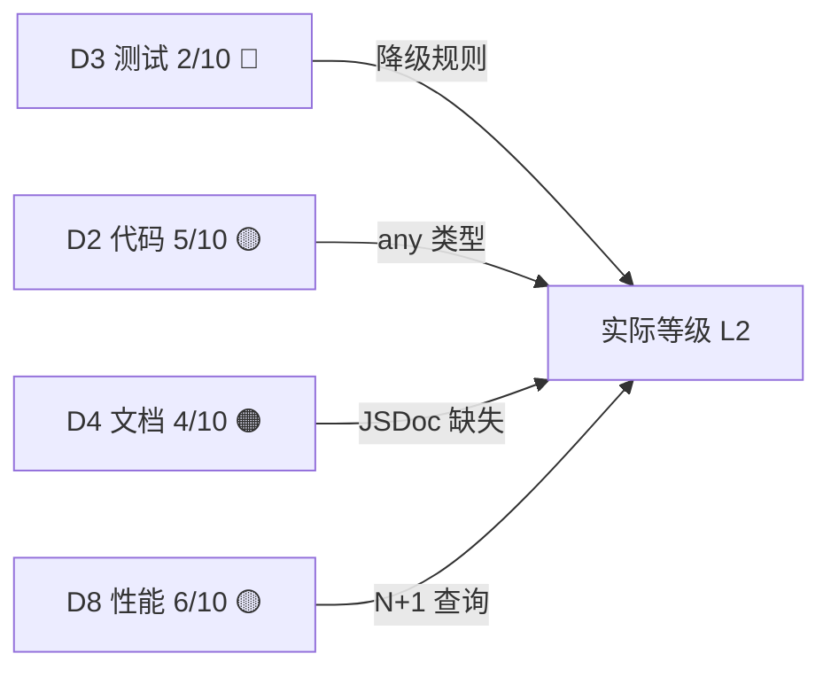

# 财务中心 L2→L4 全面升级计划

> 基准评估：L2 可用期（综合 5.6/10，D3 测试降级）
> 目标等级：L4 精益期（综合 ≥ 8.0/10，无维度 ≤ 4）
> 预计总工时：10 人天（4 个 Sprint）
> 日期：2026-02-19

---

## 当前瓶颈分析



| 降级因素      | 当前值 | L3 阈值 | L4 阈值 |
| :------------ | :----: | :-----: | :-----: |
| D3 测试覆盖   |  2/10  |   ≥ 5   |   ≥ 7   |
| D2 代码质量   |  5/10  |   ≥ 5   |   ≥ 7   |
| D4 文档完整性 |  4/10  |   ≥ 4   |   ≥ 6   |
| 综合得分      |  5.6   |  ≥ 6.0  |  ≥ 8.0  |

---

## Sprint 1：消除降级 — 测试基础（2 人天）

> **目标**：D3 从 2/10 → 6/10，解除降级规则，达到 L3

### 1.1 核心 Service 单元测试

#### [NEW] [finance-service.test.ts](file:///c:/Users/bigey/Documents/Antigravity/L2C/src/features/finance/__tests__/finance-service.test.ts)

为 `FinanceService` 编写 ≥ 15 个单元测试，覆盖：

| 测试分组   | 用例数 | 覆盖方法                                           |
| :--------- | :----: | :------------------------------------------------- |
| 应收生成   |   3    | `generateReceivables` — 正常/空订单/已存在         |
| 首付验证   |   3    | `validateDownPayment` — 正常/低于阈值/0值          |
| 付款单创建 |   3    | `createPaymentOrder` — 正常/金额超限/Decimal精度   |
| 付款单审核 |   4    | `verifyPaymentOrder` — 通过/拒绝/余额更新/佣金计算 |
| 佣金计算   |   2    | `calculateCommission` — 正常费率/无佣金            |

**Mock 策略**：使用 `vi.mock` Mock `db`、`AuditService`，不 Mock `Decimal.js`（验证精度）

### 1.2 对账核销单元测试

#### [NEW] [reconciliation-actions.test.ts](file:///c:/Users/bigey/Documents/Antigravity/L2C/src/features/finance/__tests__/reconciliation-actions.test.ts)

替换现有 Mock 占位文件，编写 ≥ 8 个用例：

| 测试分组 | 用例数 | 覆盖方法                                    |
| :------- | :----: | :------------------------------------------ |
| 汇总对账 |   2    | `generateAggregatedStatement` — 正常/无数据 |
| 批量核销 |   3    | `batchWriteOff` — 全额/部分/余额不足        |
| 跨期对账 |   2    | `crossPeriodReconciliation` — 正常/跨年     |
| 权限校验 |   1    | 无权限用户调用应报错                        |

### 1.3 AP Actions 单元测试

#### [MODIFY] [ap-actions.test.ts](file:///c:/Users/bigey/Documents/Antigravity/L2C/src/features/finance/ap/__tests__/ap-actions.test.ts)

替换 Mock 占位，编写 ≥ 6 个用例：

| 测试分组   | 用例数 | 覆盖方法                                   |
| :--------- | :----: | :----------------------------------------- |
| 付款单创建 |   2    | `createPaymentBill` — 正常/超额            |
| 付款单审核 |   2    | `verifyPaymentBill` — 通过/拒绝            |
| 劳务结算   |   1    | `generateLaborSettlement` — 正常           |
| 供应商退款 |   1    | `createSupplierRefundStatement` — 红字冲账 |

### 1.4 替换其余 Mock 占位

#### [MODIFY] [finance-additional.test.ts](file:///c:/Users/bigey/Documents/Antigravity/L2C/src/features/finance/__tests__/finance-additional.test.ts)

替换为贷项/借项通知单测试 ≥ 4 个用例：

| 测试分组   | 用例数 | 覆盖方法                                 |
| :--------- | :----: | :--------------------------------------- |
| 贷项通知单 |   2    | `createCreditNote` + `approveCreditNote` |
| 借项通知单 |   2    | `createDebitNote` + `approveDebitNote`   |

### Sprint 1 验证

```bash
# 运行财务模块全部测试
npm test src/features/finance/

# 预期：≥ 33 个用例全部通过，0 个 Mock 占位
```

---

## Sprint 2：代码质量加固（2.5 人天）

> **目标**：D2 从 5/10 → 7/10

### 2.1 消除组件层 `any` 类型（15 处）

| 文件                         |      行号      | 当前                       | 目标类型                                  |
| :--------------------------- | :------------: | :------------------------- | :---------------------------------------- |
| `APStatementTable.tsx`       | 23, 50, 52, 96 | `data: any[]`, `item: any` | 从 Schema 推导 `APSupplierStatement` 类型 |
| `ARStatementTable.tsx`       |     20, 28     | `data: any[]`              | 推导 `ARStatement` 类型                   |
| `AccountList.tsx`            |     20, 27     | `accounts: any[]`          | 推导 `FinanceAccount` 类型                |
| `AccountDialog.tsx`          |       42       | `initialData?: any`        | 定义 `AccountFormData` 接口               |
| `receipt-bill-table.tsx`     |       18       | `data: any[]`              | 推导 `ReceiptBill` 类型                   |
| `receipt-bill-dialog.tsx`    |       68       | `initialStatement?: any`   | 定义 `StatementRef` 接口                  |
| `PaymentOrderDialog.tsx`     |       51       | `initialStatement?: any`   | 定义 `StatementRef` 接口                  |
| `PaymentBillDialog.tsx`      |       52       | `initialStatement?: any`   | 定义 `StatementRef` 接口                  |
| `create-transfer-dialog.tsx` |    127, 143    | `acc: any`                 | 推导 `FinanceAccount` 类型                |

#### [NEW] [types.ts](file:///c:/Users/bigey/Documents/Antigravity/L2C/src/features/finance/types.ts)

创建统一类型定义文件，从 Drizzle Schema 推导所有业务类型：

```typescript
import type { InferSelectModel } from 'drizzle-orm';
import { arStatements, apSupplierStatements, financeAccounts, receiptBills, ... } from '@/shared/api/schema/finance';

/** AR 应收对账单 */
export type ARStatement = InferSelectModel<typeof arStatements>;
/** AP 供应商对账单 */
export type APSupplierStatement = InferSelectModel<typeof apSupplierStatements>;
/** 财务账户 */
export type FinanceAccount = InferSelectModel<typeof financeAccounts>;
/** 收款单 */
export type ReceiptBill = InferSelectModel<typeof receiptBills>;
// ...
```

### 2.2 消除 `as any` 断言（8 处）

| 文件                        |      行号      | 问题                  | 修复策略                                  |
| :-------------------------- | :------------: | :-------------------- | :---------------------------------------- |
| `finance-config-service.ts` |     37, 42     | 动态属性赋值          | 使用 `Record<string, unknown>` + 类型守卫 |
| `receipt-bill-dialog.tsx`   |      166       | Action 输入类型不匹配 | 对齐 Zod Schema 与 Action 参数            |
| `receipt-bill-dialog.tsx`   |      173       | 错误类型断言          | 定义 `ActionResult` 类型                  |
| `ar-actions.test.ts`        | 26, 27, 66, 68 | Mock 类型断言         | 使用 `vi.mocked()` 替代                   |

### 2.3 实现桩代码

#### [MODIFY] [internal.ts](file:///c:/Users/bigey/Documents/Antigravity/L2C/src/features/finance/internal.ts)

实现 `calculateFees` 真实逻辑：

```typescript
/** 计算交易手续费 */
export const financeInternal = {
  calculateFees: (amount: number, method: string): number => {
    const rates: Record<string, number> = {
      WECHAT: 0.006,
      ALIPAY: 0.006,
      BANK_TRANSFER: 0,
      CASH: 0,
      POS: 0.0035,
    };
    return Number((amount * (rates[method] ?? 0)).toFixed(2));
  },
};
```

### 2.4 迁移遗留 `paymentOrders` 表引用

扫描所有对已废弃 `paymentOrders` 表的引用，统一迁移至 `receiptBills`：

- `ar.ts` 中 `createPaymentOrder` / `verifyPaymentOrder` → 评估并迁移
- 保留 Schema 中 `@deprecated` 标记，暂不删除表定义

### Sprint 2 验证

```bash
# TypeScript 类型检查（应无 any 警告）
npx tsc --noEmit 2>&1 | Select-String "finance"

# 重跑全部测试确认无回归
npm test src/features/finance/
```

---

## Sprint 3：文档与可运维性（2.5 人天）

> **目标**：D4 从 4/10 → 7/10，D7 从 6/10 → 8/10

### 3.1 核心 Actions JSDoc 补全

为 13 个 Action 文件中的 50+ 个导出函数补充 JSDoc：

```typescript
/**
 * 创建付款单并提交审核
 *
 * @description 从 AP 对账单创建付款单，自动关联应付明细，
 *   提交后进入审批流程（参见 FinanceApprovalLogic）
 * @param data - 付款单创建参数（参见 createPaymentBillSchema）
 * @returns 创建结果（含付款单 ID）
 * @throws 未授权/金额超限/对账单状态异常
 */
export async function createPaymentBill(data: z.infer<typeof createPaymentBillSchema>) { ... }
```

**优先级排序**（按使用频率）：

1. 🔴 P1：`ar.ts`（5 函数）、`ap.ts`（12 函数）、`reconciliation.ts`（6 函数）
2. 🟡 P2：`receipt.ts`（3 函数）、`payment-plan.ts`（4 函数）、`transfers.ts`（4 函数）
3. 🟢 P3：`credit-notes.ts`（4 函数）、`debit-notes.ts`（4 函数）、`statement-confirmations.ts`（3 函数）

### 3.2 Service 层 JSDoc 补全

#### [MODIFY] [finance.service.ts](file:///c:/Users/bigey/Documents/Antigravity/L2C/src/services/finance.service.ts)

为 `FinanceService` 的 6 个静态方法补充完整 JSDoc：

- `generateReceivables` — 从订单自动生成应收
- `validateDownPayment` — 首付比例校验
- `createPaymentOrder` — 创建付款单
- `verifyPaymentOrder` — 审核付款单
- `calculateCommission` — 佣金计算
- `auditFinanceAction` — 审计日志

### 3.3 补充缺失的审计日志

当前 `AuditService.log` 覆盖分布：

| Action 文件                  | 审计调用数 |              状态              |
| :--------------------------- | :--------: | :----------------------------: |
| `ap.ts`                      |     14     |            ✅ 完善             |
| `payment-plan.ts`            |     4      |            ✅ 完善             |
| `transfers.ts`               |     2      |            ✅ 完善             |
| `statement-confirmations.ts` |     2      |            ✅ 完善             |
| `debit-notes.ts`             |     3      |            ✅ 完善             |
| `credit-notes.ts`            |     3      |            ✅ 完善             |
| `reconciliation.ts`          |     2      |            ✅ 完善             |
| `config.ts`                  |     4      |            ✅ 完善             |
| `ar.ts`                      |     2      |            ✅ 完善             |
| `receipt.ts`                 |     1      | ⚠️ 缺少 `voidReceiptBill` 审计 |
| `refund.ts`                  |     0      |            🔴 缺失             |
| `analysis-actions.ts`        |     1      |          ✅ 仅读操作           |
| `schema.ts`                  |     0      |      ✅ 纯定义，无需审计       |

**修复**：

- `receipt.ts` — 为 `voidReceiptBill` 添加审计日志
- `refund.ts` — 为 `submitRefundRequest` 添加审计日志

### 3.4 同步架构设计文档

#### [MODIFY] [2026-01-15-finance-module-architecture-design.md](file:///c:/Users/bigey/Documents/Antigravity/L2C/docs/02-requirements/modules/财务模块/2026-01-15-finance-module-architecture-design.md)

更新文档以反映最新代码实现：

- 补充贷项/借项通知单模块说明
- 补充对账确认模块说明
- 标注 `paymentOrders` 废弃状态

### Sprint 3 验证

```bash
# 检查 JSDoc 覆盖
npx tsc --noEmit

# 重跑测试确认无回归
npm test src/features/finance/
```

---

## Sprint 4：性能与 UI 完善（3 人天）

> **目标**：D5 从 6/10 → 8/10，D8 从 6/10 → 8/10

### 4.1 列表接口分页

为以下列表查询函数添加分页参数（`page`, `pageSize`）：

| 函数                      | 文件                | 当前状态  |
| :------------------------ | :------------------ | :-------: |
| `getReconciliations`      | `reconciliation.ts` | ❌ 无分页 |
| `getARStatements`         | `ar.ts`             | ❌ 无分页 |
| `getAPSupplierStatements` | `ap.ts`             | ❌ 无分页 |
| `getAPLaborStatements`    | `ap.ts`             | ❌ 无分页 |
| `getReceiptBills`         | `receipt.ts`        | ❌ 无分页 |
| `getFinanceAccounts`      | `config.ts`         | ❌ 无分页 |

> [!NOTE]
> `getInternalTransfers`、`getCreditNotes`、`getDebitNotes`、`getStatementConfirmations` 已实现分页

**分页实现模式**：

```typescript
export async function getARStatements(page = 1, pageSize = 20) {
  const session = await auth();
  if (!session) throw new Error('未授权');

  const offset = (page - 1) * pageSize;
  const [data, countResult] = await Promise.all([
    db
      .select()
      .from(arStatements)
      .where(eq(arStatements.tenantId, session.user.tenantId))
      .limit(pageSize)
      .offset(offset)
      .orderBy(desc(arStatements.createdAt)),
    db
      .select({ count: sql<number>`count(*)` })
      .from(arStatements)
      .where(eq(arStatements.tenantId, session.user.tenantId)),
  ]);

  return { data, total: countResult[0]?.count ?? 0, page, pageSize };
}
```

### 4.2 消除利润分析串行查询

#### [MODIFY] [analysis-actions.ts](file:///c:/Users/bigey/Documents/Antigravity/L2C/src/features/finance/actions/analysis-actions.ts)

将 5 个独立的数据库查询改为 `Promise.all` 并行执行：

```typescript
// 之前：串行（~500ms）
const revenue = await db.select()...;
const inventoryCost = await db.select()...;
const materialCost = await db.select()...;
const laborCost = await db.select()...;
const commissionCost = await db.select()...;

// 之后：并行（~150ms）
const [revenue, inventoryCost, materialCost, laborCost, commissionCost] = await Promise.all([
  db.select()...,
  db.select()...,
  db.select()...,
  db.select()...,
  db.select()...,
]);
```

### 4.3 消除 N+1 查询

#### [MODIFY] [finance.service.ts](file:///c:/Users/bigey/Documents/Antigravity/L2C/src/services/finance.service.ts)

`verifyPaymentOrder` 中的逐项循环查询优化为批量操作：

```typescript
// 之前：N+1
for (const item of order.items) {
  const stmt = await tx.select().from(arStatements).where(eq(arStatements.id, item.statementId));
  // ... update ...
}

// 之后：批量查询 + 批量更新
const stmtIds = order.items.map((i) => i.statementId);
const stmts = await tx.select().from(arStatements).where(inArray(arStatements.id, stmtIds));
// ... batch update ...
```

### 4.4 组件三态处理

为以下对话框组件添加 Loading / Error / Empty 状态：

| 组件                         |  Loading  |   Error   | Empty |
| :--------------------------- | :-------: | :-------: | :---: |
| `receipt-bill-dialog.tsx`    | ⚠️ 需添加 | ⚠️ 需添加 |  ✅   |
| `PaymentBillDialog.tsx`      | ⚠️ 需添加 | ⚠️ 需添加 |  ✅   |
| `PaymentOrderDialog.tsx`     | ⚠️ 需添加 | ⚠️ 需添加 |  ✅   |
| `create-transfer-dialog.tsx` | ⚠️ 需添加 | ⚠️ 需添加 |  ✅   |
| `AccountDialog.tsx`          | ⚠️ 需添加 | ⚠️ 需添加 |  ✅   |

**实现模式**：

```tsx
const [isSubmitting, setIsSubmitting] = useState(false);
const [error, setError] = useState<string | null>(null);

// 提交按钮
<Button disabled={isSubmitting}>
  {isSubmitting ? <Loader2 className="animate-spin" /> : '提交'}
</Button>;

// 错误提示
{
  error && <Alert variant="destructive">{error}</Alert>;
}
```

### Sprint 4 验证

```bash
# 类型检查
npx tsc --noEmit

# 全量测试
npm test src/features/finance/

# 手动验证：通过浏览器访问 /finance 页面，检查各子模块列表的分页是否正常
```

---

## 预期成果

|     维度      |  当前   | Sprint 1 后 | Sprint 2 后 | Sprint 3 后 | Sprint 4 后 |
| :-----------: | :-----: | :---------: | :---------: | :---------: | :---------: |
| D1 功能完整性 |    8    |      8      |      9      |      9      |      9      |
|  D2 代码质量  |    5    |      5      |      7      |      7      |      8      |
|  D3 测试覆盖  |    2    |      6      |      6      |      7      |      7      |
| D4 文档完整性 |    4    |      4      |      4      |      7      |      7      |
|   D5 UI/UX    |    6    |      6      |      6      |      6      |      8      |
|  D6 安全规范  |    7    |      7      |      8      |      8      |      8      |
|  D7 可运维性  |    6    |      6      |      6      |      8      |      8      |
|    D8 性能    |    6    |      6      |      6      |      6      |      8      |
|   **综合**    | **5.6** |   **6.0**   |   **6.5**   |   **7.3**   |   **8.0**   |
|   **等级**    |   L2    |   **L3**    |     L3      |     L3+     |   **L4**    |

> [!IMPORTANT]
> Sprint 1 完成即可解除降级，从 L2 → L3。Sprint 4 完成后达到 L4 精益期。

---

## 风险与依赖

| 风险                                   | 影响             | 缓解措施                                         |
| :------------------------------------- | :--------------- | :----------------------------------------------- |
| `paymentOrders` 表迁移涉及外部调用方   | 可能引发回归     | Sprint 2 仅整理引用，不删除表；Sprint 4 完成迁移 |
| `internal.ts` 真实手续费费率需业务确认 | 费率不准确       | 使用可配置费率，从 `financeConfigs` 读取         |
| 利润分析并行化可能改变错误传播行为     | 部分查询失败影响 | 使用 `Promise.allSettled` + 降级                 |
| 分页改造需同步前端组件                 | UI 交互变更      | 分页参数设为可选，默认值保持向后兼容             |
