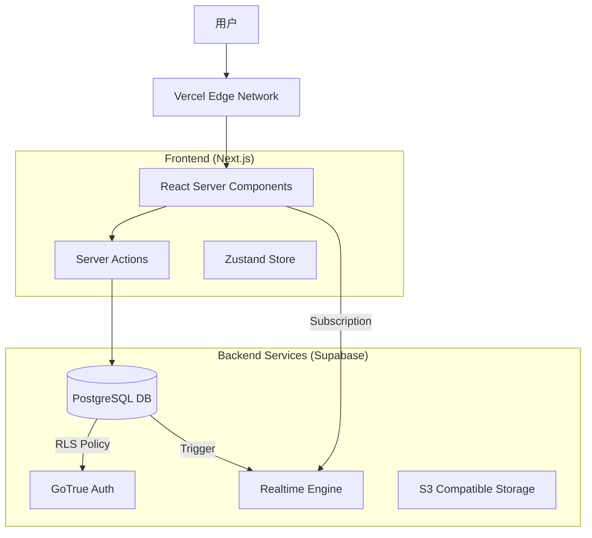

# 罗莱L2C销售管理系统 - 技术实施方案 (v4.0)

## 🎯 方案概览

**文档版本：** v4.0  
**更新日期：** 2025-11-27  
**核心方向：** 基于 Next.js + Supabase 的现代化全栈开发实施方案

### 核心挑战与应对策略

#### 1. 高并发线索处理 (High Concurrency)
**挑战描述：** 大促期间（如双11）线索创建和抢单的高并发写入。

**传统方案缺陷：** 引入 Redis/Kafka 导致架构复杂，维护成本高。

**新实施方案：**
*   **数据库层**：利用 PostgreSQL 的 `SKIP LOCKED` 机制实现高效的抢单队列，无需 Redis。
*   **应用层**：使用 Server Actions 进行原子化操作，结合 `useOptimistic` 提升前端响应速度。
*   **限流**：在 Edge Middleware 层使用 Upstash/Vercel KV 进行 IP 级别的速率限制。

#### 2. 复杂状态机管理 (State Machine)
**挑战描述：** 订单从"线索"到"安装完成"涉及 10+ 个状态流转，需确保合法性。

**新实施方案：**
*   **Type-Safe State Machine**：利用 TypeScript 的 Discriminated Unions 定义状态。
*   **Database Constraints**：在 Postgres 中使用 `CHECK` 约束防止非法状态写入。
*   **Centralized Service**：在 `src/server/services/order.ts` 中集中管理状态流转逻辑。

#### 3. 数据一致性 (Consistency)
**挑战描述：** 积分发放、订单创建、库存扣减需保持事务一致性。

**新实施方案：**
*   **单体数据库优势**：由于使用单一 Supabase Postgres 实例，直接使用 SQL Transaction (`BEGIN...COMMIT`) 即可，无需分布式事务 (Saga/TCC)。
*   **Supabase RPC**：将复杂的跨表事务封装为 Postgres Function，通过 RPC 调用，确保原子性。

---

## 🏗️ 系统实施架构

### 1. 总体架构图



### 2. 核心模块实施细节

#### 2.1 认证与权限 (Auth & RLS)

**实施代码示例 (Middleware):**
```typescript
import { createMiddlewareClient } from '@supabase/auth-helpers-nextjs'
import { NextResponse } from 'next/server'
import type { NextRequest } from 'next/server'

export async function middleware(req: NextRequest) {
  const res = NextResponse.next()
  const supabase = createMiddlewareClient({ req, res })
  
  const { data: { session } } = await supabase.auth.getSession()

  // 路由保护逻辑
  if (!session && req.nextUrl.pathname.startsWith('/admin')) {
    return NextResponse.redirect(new URL('/login', req.url))
  }

  return res
}
```

**实施代码示例 (RLS Policy):**
```sql
-- 仅允许拥有 'admin' 角色的用户查看所有订单
create policy "Admins can view all orders"
on orders for select
using ( 
  auth.uid() in (
    select user_id from user_roles where role = 'admin'
  )
);
```

#### 2.2 状态机实现 (TypeScript)

```typescript
// src/lib/constants/order-status.ts
export const ORDER_STATUS = {
  NEW: 'new',
  ASSIGNED: 'assigned',
  MEASURING: 'measuring',
  QUOTED: 'quoted',
  SIGNED: 'signed',
  PAID: 'paid',
  INSTALLING: 'installing',
  COMPLETED: 'completed',
  CANCELLED: 'cancelled',
} as const

export type OrderStatus = typeof ORDER_STATUS[keyof typeof ORDER_STATUS]

const TRANSITIONS: Record<OrderStatus, OrderStatus[]> = {
  [ORDER_STATUS.NEW]: [ORDER_STATUS.ASSIGNED, ORDER_STATUS.CANCELLED],
  [ORDER_STATUS.ASSIGNED]: [ORDER_STATUS.MEASURING, ORDER_STATUS.CANCELLED],
  // ... 其他流转规则
}

export function canTransition(current: OrderStatus, next: OrderStatus): boolean {
  return TRANSITIONS[current]?.includes(next) ?? false
}
```

#### 2.3 实时通知 (Realtime)

前端组件订阅数据库变更，实现无刷新通知。

```typescript
// src/components/OrderListener.tsx
'use client'
import { useEffect } from 'react'
import { createClientComponentClient } from '@supabase/auth-helpers-nextjs'
import { toast } from 'sonner'

export function OrderListener() {
  const supabase = createClientComponentClient()

  useEffect(() => {
    const channel = supabase
      .channel('orders')
      .on('postgres_changes', { 
        event: 'INSERT', 
        schema: 'public', 
        table: 'orders' 
      }, (payload) => {
        toast.success(`新订单: ${payload.new.order_no}`)
      })
      .subscribe()

    return () => { supabase.removeChannel(channel) }
  }, [supabase])

  return null
}
```

---

## 📊 性能优化方案

### 1. 数据库索引策略
针对高频查询场景建立组合索引：

```sql
-- 优化：按销售员查询待处理订单
CREATE INDEX idx_orders_sales_status 
ON orders (sales_id, status) 
WHERE status NOT IN ('completed', 'cancelled');

-- 优化：按手机号模糊搜索线索
CREATE EXTENSION IF NOT EXISTS pg_trgm;
CREATE INDEX idx_leads_phone_trgm 
ON leads USING gin (phone gin_trgm_ops);
```

### 2. Next.js 缓存策略
利用 Next.js 的 Data Cache 减少数据库查询压力。

```typescript
// src/server/actions/get-products.ts
'use server'
import { db } from '@/server/db'

// 缓存 1 小时，按 'products' 标签失效
export async function getProducts() {
  const products = await db.query.products.findMany()
  return products
}

// 在需要更新时调用
import { revalidateTag } from 'next/cache'
export async function updateProduct(id: string, data: any) {
  await db.update(products).set(data).where(eq(products.id, id))
  revalidateTag('products')
}
```

---

## 🚀 部署与监控

### 1. 部署流程
*   **Frontend**: Git Push -> Vercel 自动构建 -> Edge Network 分发。
*   **Database**: Supabase Dashboard / CLI 管理 Schema Migrations。

### 2. 监控告警
*   **Sentry**: 捕获前端 JS 错误和 API 异常。
*   **Supabase Dashboard**: 监控数据库 CPU、内存、连接数。
*   **Vercel Analytics**: 监控 Real User Metrics (LCP, FID, CLS)。

---
*注：本方案完全移除 Java/Spring Boot 相关依赖，统一使用 TypeScript/Node.js 技术栈。*
