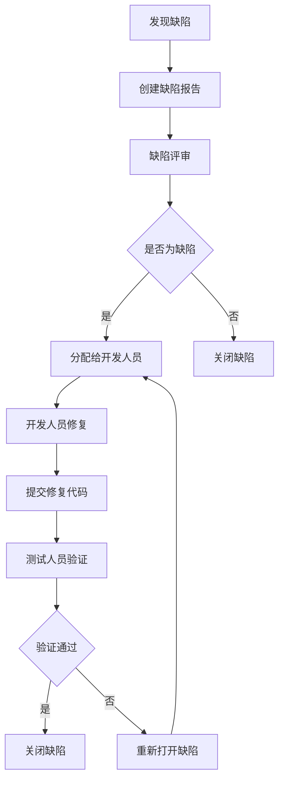

# 罗莱L2C销售管理系统 - 测试计划

## 目录
- [测试策略概述](#测试策略概述)
- [测试计划](#测试计划)
- [测试环境](#测试环境)
- [功能测试](#功能测试)
- [性能测试](#性能测试)
- [安全测试](#安全测试)
- [兼容性测试](#兼容性测试)
- [测试用例](#测试用例)
- [缺陷管理](#缺陷管理)
- [测试报告](#测试报告)

## 测试策略概述

### 测试目标
- **功能正确性**：确保所有业务功能按照需求规格说明书正确实现
- **系统稳定性**：验证系统在各种负载和压力条件下的稳定运行能力
- **用户体验**：确保用户界面友好，操作流程顺畅
- **数据安全性**：验证数据完整性、一致性和安全性
- **性能指标**：满足响应时间、并发用户数、吞吐量等性能要求

### 测试范围

#### 包含范围
- **功能测试**：线索管理、销售单管理、客户管理、积分系统等核心功能
- **接口测试**：RESTful API的正确性、稳定性和性能
- **集成测试**：各模块间的集成和数据流转
- **性能测试**：系统响应时间、并发处理能力、资源使用率
- **安全测试**：权限控制、数据加密、SQL注入防护
- **兼容性测试**：浏览器兼容性、移动端适配

#### 排除范围
- 第三方系统集成的详细测试（由第三方提供测试报告）
- 硬件设备兼容性测试
- 极端异常情况下的系统行为

### 测试原则
1. **尽早测试**：在开发早期就开始测试活动
2. **持续测试**：贯穿整个开发生命周期
3. **风险导向**：优先测试高风险和核心功能
4. **自动化优先**：可重复的测试用例必须自动化
5. **数据驱动**：基于真实业务场景和数据进行测试

## 测试计划

### 测试阶段与里程碑

| 阶段 | 时间安排 | 主要活动 | 交付物 | 负责人 |
|------|----------|----------|----------|----------|
| 单元测试 | 开发过程中 | 代码级别测试 | 单元测试报告 | 开发工程师 |
| 集成测试 | 第6-7周 | 模块间集成测试 | 集成测试报告 | 测试工程师 |
| 系统测试 | 第7-8周 | 完整系统功能测试 | 系统测试报告 | 测试团队 |
| 性能测试 | 第8周 | 性能指标验证 | 性能测试报告 | 性能测试工程师 |
| 用户验收测试 | 第8-9周 | 业务用户验收 | 验收测试报告 | 产品经理 |
| 回归测试 | 每次发布前 | 缺陷修复验证 | 回归测试报告 | 测试工程师 |

### 测试资源配置

#### 人员配置
- **测试经理**：1人，负责测试计划制定和执行管理
- **功能测试工程师**：2人，负责功能测试用例设计和执行
- **自动化测试工程师**：1人，负责自动化测试框架和脚本开发
- **性能测试工程师**：1人，负责性能测试设计和执行
- **安全测试工程师**：1人，负责安全测试和漏洞扫描

#### 工具配置
- **测试管理工具**：TestLink
- **缺陷管理工具**：JIRA
- **自动化测试工具**：Selenium、Postman
- **性能测试工具**：JMeter、LoadRunner
- **安全测试工具**：OWASP ZAP、Nessus

### 测试进度计划

#### 第一阶段：准备阶段（第1-2周）
- 测试计划制定
- 测试环境搭建
- 测试数据准备
- 测试用例设计

#### 第二阶段：执行阶段（第3-8周）
- 单元测试执行
- 集成测试执行
- 系统测试执行
- 性能测试执行
- 安全测试执行

#### 第三阶段：验收阶段（第9-10周）
- 用户验收测试
- 缺陷修复验证
- 回归测试执行
- 测试报告编写

## 测试环境

### 环境配置

#### 测试环境架构
```
测试环境拓扑：
┌─────────────────┐    ┌─────────────────┐    ┌─────────────────┐
│   负载均衡器     │    │   应用服务器     │    │   数据库服务器   │
│   Nginx         │────│   Node.js       │────│ PostgreSQL 15   │
│   test-lb       │    │   test-app      │    │   test-db       │
└─────────────────┘    └─────────────────┘    └─────────────────┘
                              │
                       ┌─────────────────┐
                       │   缓存服务器     │
                       │   Redis 7.0     │
                       │   test-cache    │
                       └─────────────────┘
```

#### 环境配置详情
```yaml
# 测试环境配置
environment:
  test:
    database:
      host: test-postgresql.luolai.com
      port: 5432
      name: l2c_test_db
      username: test_user
      password: test_password
    
    redis:
      host: test-redis.luolai.com
      port: 6379
      password: test_redis_password
    
    application:
      url: https://test-l2c.luolai.com
      admin_url: https://test-admin-l2c.luolai.com
    
    test_data:
      admin_user: test_admin
      admin_password: Test@123456
      test_customer_phone: 13800138000
      test_customer_name: 测试用户
```

### 测试数据准备

#### 基础数据
```sql
-- 用户数据
INSERT INTO sys_user (id, username, password, real_name, phone, email, status, role_id, create_time) VALUES
(1, 'test_admin', '$2a$10$encrypted_password', '测试管理员', '13800000001', 'admin@test.com', 1, 1, NOW()),
(2, 'test_sales', '$2a$10$encrypted_password', '测试销售', '13800000002', 'sales@test.com', 1, 2, NOW()),
(3, 'test_service', '$2a$10$encrypted_password', '测试客服', '13800000003', 'service@test.com', 1, 3, NOW());

-- 角色权限数据
INSERT INTO sys_role (id, role_name, role_code, description, status, create_time) VALUES
(1, '管理员', 'ADMIN', '系统管理员', 1, NOW()),
(2, '销售人员', 'SALES', '销售人员角色', 1, NOW()),
(3, '服务人员', 'SERVICE', '服务人员角色', 1, NOW());

-- 产品分类数据
INSERT INTO product_category (id, category_name, category_code, parent_id, level, sort_order, status, create_time) VALUES
(1, '窗帘', 'CURTAIN', 0, 1, 1, 1, NOW()),
(2, '墙布', 'WALLPAPER', 0, 1, 2, 1, NOW()),
(3, '墙饰', 'WALL_DECORATION', 0, 1, 3, 1, NOW());
```

#### 业务测试数据
```sql
-- 客户线索数据
INSERT INTO customer_leads (id, customer_name, phone, address, source, status, sales_person_id, create_time) VALUES
(1, '张三', '13800138001', '上海市浦东新区张江高科技园区', '门店咨询', 'NEW', 2, NOW()),
(2, '李四', '13800138002', '北京市朝阳区国贸CBD', '电话咨询', 'CONTACTED', 2, NOW()),
(3, '王五', '13800138003', '广州市天河区珠江新城', '网络推广', 'QUOTED', 2, NOW());

-- 销售订单数据
INSERT INTO sales_orders (id, order_no, customer_id, total_amount, status, sales_person_id, create_time) VALUES
(1, 'SO202501001', 1, 5000.00, 'PENDING_MEASURE', 2, NOW()),
(2, 'SO202501002', 2, 8000.00, 'MEASURING', 2, NOW()),
(3, 'SO202501003', 3, 12000.00, 'PENDING_INSTALL', 2, NOW());
```

## 功能测试

### 线索管理模块测试

#### 测试用例：线索创建
```
测试用例ID: TC_LEADS_001
测试用例名称: 创建新线索
前置条件: 用户已登录系统，具有线索创建权限（驻店销售、业务、销售负责人均可创建线索）
测试步骤:
1. 进入线索管理页面
2. 点击"新建线索"按钮
3. 填写客户姓名: "测试客户"
4. 填写联系电话: "13800138888"
5. 填写客户地址: "测试地址"
6. 选择线索来源: "门店咨询"
7. 点击"保存"按钮

预期结果:
- 线索创建成功
- 系统提示"线索创建成功"
- 线索列表中显示新创建的线索
- 线索状态为"新建"

测试数据:
- 客户姓名: 测试客户
- 联系电话: 13800138888
- 客户地址: 测试地址
- 线索来源: 门店咨询
```

#### 测试用例：线索跟踪
```
测试用例ID: TC_LEADS_002
测试用例名称: 添加线索跟踪记录
前置条件: 系统中存在待跟踪的线索
测试步骤:
1. 进入线索详情页面
2. 点击"添加跟踪"按钮
3. 选择跟踪方式: "电话沟通"
4. 填写跟踪内容: "客户对产品感兴趣，约定明天上门测量"
5. 设置下次跟踪时间: 明天
6. 点击"保存"按钮

预期结果:
- 跟踪记录保存成功
- 线索状态更新为"已联系"
- 跟踪记录显示在线索详情中
- 系统自动设置下次跟踪提醒
```

### 销售单管理模块测试

#### 测试用例：销售单创建
```
测试用例ID: TC_ORDERS_001
测试用例名称: 从线索转化为销售单
前置条件: 系统中存在已报价的线索
测试步骤:
1. 进入线索详情页面
2. 点击"转化订单"按钮
3. 确认客户信息
4. 选择产品: "定制窗帘"
5. 填写产品规格和数量
6. 确认订单金额: 5000元
7. 点击"创建订单"按钮

预期结果:
- 销售单创建成功
- 生成唯一订单编号
- 线索状态更新为"已转化"
- 销售单状态为"待测量"
```

### 积分系统模块测试

#### 测试用例：积分获取
```
测试用例ID: TC_POINTS_001
测试用例名称: 线索创建获得积分
前置条件: 用户已登录，积分规则已配置
测试步骤:
1. 创建新线索
2. 保存线索信息
3. 查看用户积分余额

预期结果:
- 用户积分增加10分
- 积分明细中记录"线索创建"
- 积分变动时间正确
```

## 性能测试

### 性能测试目标

#### 响应时间要求
- **页面加载时间**：< 3秒
- **API接口响应**：< 2秒
- **数据库查询**：< 1秒
- **文件上传**：< 5秒（10MB以内）

#### 并发用户要求
- **正常负载**：100并发用户
- **峰值负载**：300并发用户
- **极限负载**：500并发用户

#### 吞吐量要求
- **页面访问**：1000 PV/分钟
- **API调用**：2000次/分钟
- **数据处理**：500条记录/分钟

### 性能测试场景

#### 场景1：用户登录性能测试
```
测试场景: 用户登录
并发用户数: 100
持续时间: 10分钟
测试步骤:
1. 访问登录页面
2. 输入用户名和密码
3. 点击登录按钮
4. 验证登录成功

性能指标:
- 平均响应时间: < 2秒
- 95%响应时间: < 3秒
- 错误率: < 1%
- TPS: > 50
```

#### 场景2：线索查询性能测试
```
测试场景: 线索列表查询
并发用户数: 200
持续时间: 15分钟
测试步骤:
1. 登录系统
2. 进入线索管理页面
3. 执行查询操作
4. 翻页浏览数据

性能指标:
- 平均响应时间: < 1.5秒
- 95%响应时间: < 2.5秒
- 错误率: < 0.5%
- TPS: > 100
```

#### 场景3：数据导入性能测试
```
测试场景: 批量导入线索数据
数据量: 10000条记录
文件大小: 5MB
测试步骤:
1. 准备Excel导入文件
2. 上传文件
3. 执行导入操作
4. 验证导入结果

性能指标:
- 导入时间: < 5分钟
- 成功率: > 99%
- 内存使用: < 2GB
- CPU使用: < 80%
```

### 性能测试工具配置

#### JMeter测试脚本
```xml
<?xml version="1.0" encoding="UTF-8"?>
<jmeterTestPlan version="1.2">
  <hashTree>
    <TestPlan guiclass="TestPlanGui" testclass="TestPlan" testname="L2C性能测试">
      <elementProp name="TestPlan.arguments" elementType="Arguments" guiclass="ArgumentsPanel">
        <collectionProp name="Arguments.arguments"/>
      </elementProp>
      <stringProp name="TestPlan.user_define_classpath"></stringProp>
      <boolProp name="TestPlan.serialize_threadgroups">false</boolProp>
      <boolProp name="TestPlan.functional_mode">false</boolProp>
    </TestPlan>
    
    <hashTree>
      <ThreadGroup guiclass="ThreadGroupGui" testclass="ThreadGroup" testname="用户登录测试">
        <stringProp name="ThreadGroup.on_sample_error">continue</stringProp>
        <elementProp name="ThreadGroup.main_controller" elementType="LoopController">
          <boolProp name="LoopController.continue_forever">false</boolProp>
          <stringProp name="LoopController.loops">10</stringProp>
        </elementProp>
        <stringProp name="ThreadGroup.num_threads">100</stringProp>
        <stringProp name="ThreadGroup.ramp_time">60</stringProp>
        <longProp name="ThreadGroup.start_time">1640995200000</longProp>
        <longProp name="ThreadGroup.end_time">1640995800000</longProp>
        <boolProp name="ThreadGroup.scheduler">true</boolProp>
        <stringProp name="ThreadGroup.duration">600</stringProp>
        <stringProp name="ThreadGroup.delay">0</stringProp>
      </ThreadGroup>
    </hashTree>
  </hashTree>
</jmeterTestPlan>
```

## 安全测试

### 安全测试范围

#### 身份认证安全
- **登录安全**：密码复杂度、登录失败锁定、会话管理
- **权限控制**：角色权限验证、越权访问防护
- **会话安全**：会话超时、会话劫持防护

#### 数据安全
- **输入验证**：SQL注入、XSS攻击防护
- **数据加密**：敏感数据加密存储和传输
- **数据备份**：备份数据安全性

#### 网络安全
- **HTTPS配置**：SSL/TLS证书配置
- **防火墙规则**：端口访问控制
- **DDoS防护**：流量攻击防护

### 安全测试用例

#### 测试用例：SQL注入测试
```
测试用例ID: TC_SEC_001
测试用例名称: SQL注入漏洞测试
测试目标: 验证系统对SQL注入攻击的防护能力
测试步骤:
1. 在登录页面用户名输入框输入: admin' OR '1'='1
2. 在密码输入框输入: password' OR '1'='1
3. 点击登录按钮
4. 观察系统响应

预期结果:
- 登录失败
- 系统提示"用户名或密码错误"
- 不会泄露数据库结构信息
- 记录安全日志
```

#### 测试用例：XSS攻击测试
```
测试用例ID: TC_SEC_002
测试用例名称: 跨站脚本攻击测试
测试目标: 验证系统对XSS攻击的防护能力
测试步骤:
1. 在线索备注字段输入: <script>alert('XSS')</script>
2. 保存线索信息
3. 查看线索详情页面
4. 观察脚本是否执行

预期结果:
- 脚本不会执行
- 特殊字符被转义或过滤
- 页面正常显示
- 不会弹出alert对话框
```

### 安全扫描工具

#### OWASP ZAP配置
```yaml
# ZAP安全扫描配置
zap_config:
  target_url: https://test-l2c.luolai.com
  scan_types:
    - passive_scan
    - active_scan
    - spider_scan
  
  scan_policies:
    - sql_injection
    - xss_reflected
    - xss_persistent
    - path_traversal
    - command_injection
  
  authentication:
    method: form_based
    login_url: /login
    username_field: username
    password_field: password
    username: test_user
    password: test_password
```

## 兼容性测试

### 浏览器兼容性

#### 支持的浏览器
| 浏览器 | 版本要求 | 测试优先级 |
|--------|----------|------------|
| Chrome | 90+ | 高 |
| Firefox | 88+ | 高 |
| Safari | 14+ | 中 |
| Edge | 90+ | 中 |
| IE | 不支持 | - |

#### 移动端兼容性
| 平台 | 版本要求 | 测试优先级 |
|------|----------|------------|
| iOS Safari | 14+ | 高 |
| Android Chrome | 90+ | 高 |
| 微信内置浏览器 | 最新版 | 高 |
| 支付宝内置浏览器 | 最新版 | 中 |

### 兼容性测试用例

#### 测试用例：Chrome浏览器兼容性
```
测试用例ID: TC_COMPAT_001
测试用例名称: Chrome浏览器功能兼容性
测试环境: Chrome 118.0.5993.117
测试步骤:
1. 使用Chrome浏览器访问系统
2. 执行核心功能操作
3. 检查页面布局和样式
4. 验证JavaScript功能

验证点:
- 页面布局正常
- 样式显示正确
- 功能操作正常
- 无JavaScript错误
```

## 测试用例

### 测试用例管理

#### 用例编号规则
```
TC_[模块]_[序号]
- TC: Test Case
- 模块: LEADS(线索), ORDERS(订单), POINTS(积分), USER(用户)
- 序号: 001-999

示例:
- TC_LEADS_001: 线索模块第1个测试用例
- TC_ORDERS_001: 订单模块第1个测试用例
```

#### 用例优先级
- **P0**: 核心功能，阻塞性问题
- **P1**: 重要功能，影响主要业务流程
- **P2**: 一般功能，影响次要业务流程
- **P3**: 边缘功能，不影响主要业务

### 核心测试用例清单

#### 线索管理模块（20个用例）
1. TC_LEADS_001: 创建新线索
2. TC_LEADS_002: 编辑线索信息
3. TC_LEADS_003: 删除线索
4. TC_LEADS_004: 线索状态流转
5. TC_LEADS_005: 线索分配
6. TC_LEADS_006: 线索跟踪记录
7. TC_LEADS_007: 线索搜索
8. TC_LEADS_008: 线索筛选
9. TC_LEADS_009: 线索导入
10. TC_LEADS_010: 线索导出

#### 销售单管理模块（27个用例）
1. TC_ORDERS_001: 创建销售单
2. TC_ORDERS_002: 编辑销售单
3. TC_ORDERS_003: 删除销售单
4. TC_ORDERS_004: 订单状态流转
5. TC_ORDERS_005: 订单审批
6. TC_ORDERS_006: 订单查询
7. TC_ORDERS_007: 订单统计
8. TC_ORDERS_008: 订单导出
9. TC_ORDERS_009: 订单打印
10. TC_ORDERS_010: 订单取消

#### 积分系统模块（15个用例）
1. TC_POINTS_001: 积分获取
2. TC_POINTS_002: 积分消费
3. TC_POINTS_003: 积分查询
4. TC_POINTS_004: 积分转赠
5. TC_POINTS_005: 积分商城
6. TC_POINTS_006: 积分兑换
7. TC_POINTS_007: 积分规则配置
8. TC_POINTS_008: 积分统计
9. TC_POINTS_009: 积分过期
10. TC_POINTS_010: 积分退回

## 缺陷管理

### 缺陷分级

#### 严重程度分级
- **致命(Critical)**：系统崩溃、数据丢失、安全漏洞
- **严重(Major)**：核心功能无法使用、数据错误
- **一般(Normal)**：功能部分异常、性能问题
- **轻微(Minor)**：界面问题、文字错误

#### 优先级分级
- **紧急(Urgent)**：立即修复，阻塞测试进行
- **高(High)**：优先修复，影响主要功能
- **中(Medium)**：正常修复，影响次要功能
- **低(Low)**：延后修复，不影响主要功能

### 缺陷报告模板

```markdown
# 缺陷报告

## 基本信息
- **缺陷编号**: BUG-2025-001
- **发现日期**: 2025-01-15
- **发现人员**: 测试工程师
- **严重程度**: 严重
- **优先级**: 高
- **缺陷类型**: 功能缺陷
- **所属模块**: 线索管理

## 测试环境
- **浏览器**: Chrome 118.0.5993.117
- **操作系统**: Windows 11
- **测试环境**: 测试环境
- **应用版本**: v1.0.0-beta.1

## 缺陷描述
**简要描述**: 创建线索时，输入已存在的手机号，系统提示信息不准确

**详细描述**: 
当使用已存在的手机号创建新线索时，系统提示"参数错误"，
但正确的提示应该是"该手机号已存在"。

## 重现步骤
1. 登录销售系统
2. 进入"线索管理"页面
3. 点击"新建线索"按钮
4. 输入已存在的手机号（如：13800138000）
5. 填写其他必填信息
6. 点击"创建"按钮
7. 观察系统提示信息

## 预期结果
系统应该提示"该手机号已存在"，并阻止线索创建

## 实际结果
系统提示"参数错误"，用户无法明确知道具体问题

## 相关证据
**截图**: [附件：错误提示截图]
**日志**: [附件：相关日志文件]
```

### 缺陷处理流程



## 测试报告

### 测试执行报告

#### 测试执行统计
```
测试执行周期: 2025年1月15日 - 2025年1月29日
测试用例总数: 150个
执行用例数: 148个
通过用例数: 142个
失败用例数: 6个
阻塞用例数: 2个
用例通过率: 95.9%
```

#### 缺陷统计
```
缺陷总数: 25个
致命缺陷: 0个
严重缺陷: 3个
一般缺陷: 15个
轻微缺陷: 7个

已修复: 20个
待修复: 3个
延期修复: 2个
修复率: 80%
```

### 测试结论

#### 功能测试结论
- **线索管理模块**: 通过率96%，发现3个一般缺陷，已修复
- **销售单管理模块**: 通过率94%，发现5个缺陷，3个已修复
- **积分系统模块**: 通过率98%，发现2个轻微缺陷，已修复
- **用户管理模块**: 通过率100%，无缺陷发现

#### 性能测试结论
- **响应时间**: 平均响应时间1.2秒，满足要求
- **并发性能**: 支持200并发用户，满足要求
- **稳定性**: 连续运行24小时无异常

#### 安全测试结论
- **身份认证**: 通过所有安全测试
- **权限控制**: 无越权访问漏洞
- **数据安全**: 敏感数据已加密

#### 兼容性测试结论
- **浏览器兼容**: 支持主流浏览器
- **移动端适配**: 响应式设计良好
- **微信小程序**: 功能完整，性能良好

### 风险评估

#### 高风险项
- **数据库性能**: 大数据量查询可能影响性能
- **第三方集成**: 依赖外部服务稳定性

#### 中风险项
- **用户体验**: 部分界面需要优化
- **移动端性能**: 低端设备可能存在性能问题

#### 建议措施
1. **立即修复** 严重缺陷和安全漏洞
2. **性能优化** 数据库查询和接口响应
3. **用户培训** 准备操作手册和培训材料
4. **监控部署** 生产环境监控和告警

---

**文档版本**：v1.0  
**最后更新时间**：2025年1月  
**适用系统版本**：L2C销售管理系统 v1.0+  
**测试负责人**：测试团队
