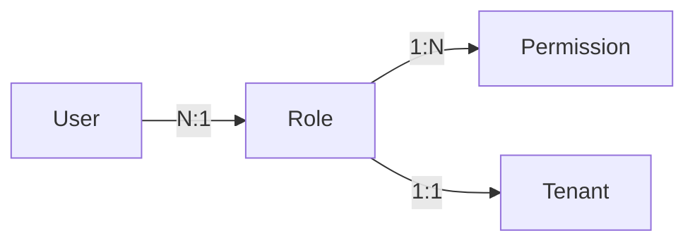

# Admin 模块权限体系与策略扩展指南

## 1. 权限模型概览 (RBAC)

系统采用标准的 **基于角色的访问控制 (RBAC)** 模型，并结合多租户隔离机制。

### 核心概念
- **Permission**: 原子操作权限（如 `lead.view`）。
- **Role**: 权限集合的载体。
- **User**: 关联一个特定角色，并在 `tenantId` 维度下隔离。



## 2. 如何新增权限

1. **注册常量**: 在 `src/shared/config/permissions.ts` 的 `PERMISSIONS` 对象中定义新权限。
2. **添加标签**: 在 `PERMISSION_LABELS` 中添加中文描述。
3. **分配分组**: 在 `PERMISSION_GROUPS` 中将权限归类到相应业务模块。

## 3. 策略引擎 (Policy Engine) 扩展

策略引擎允许在 RBAC 基础上实施更精细的 **ABAC (基于属性的访问控制)** 逻辑。

### 编写自定义策略
实现 `PolicyRule` 接口：

```typescript
export const IpWhitelistPolicy: PolicyRule = {
  name: 'IpWhitelist',
  description: '限制仅特定 IP 可执行管理操作',
  evaluate: async (ctx) => {
    const userIp = ctx.attributes?.ip as string;
    if (!ALLOWED_IPS.includes(userIp)) {
      return { allowed: false, reason: '当前 IP 不在白名单内' };
    }
    return { allowed: true };
  }
};
```

### 注册策略
在 `PolicyEngine.registerRule()` 中注册。

## 4. 速率限制与配额

- **速率限制**: 通过 `AdminRateLimiter.check(userId, actionType)` 调用，配置位于 `rate-limiter.ts`。
- **资源配额**: 通过 `QuotaManager.checkRoleQuota(tenantId)` 调用，防止角色/用户数量超出套餐限制。

## 5. 审计日志 (Audit Log)

所有 `admin` 模块的写操作 **必须** 通过 `AuditService.log` 记录：
- `oldValues`: 变更前的状态。
- `newValues`: 变更后的内容。
- 关键字段必须包含 `tableName` 和 `recordId`。
