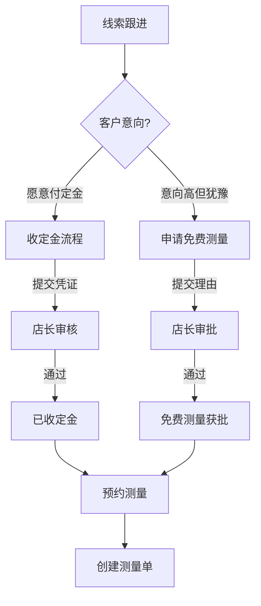
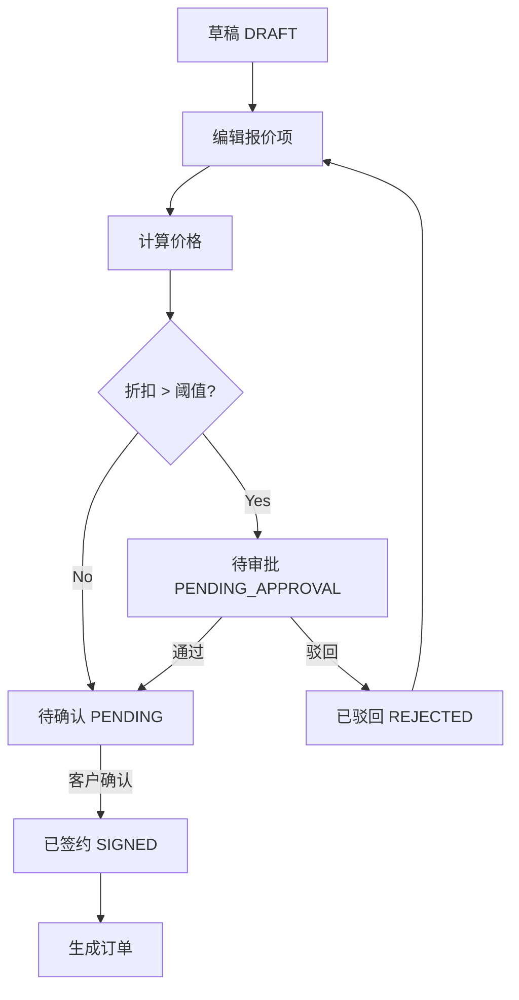
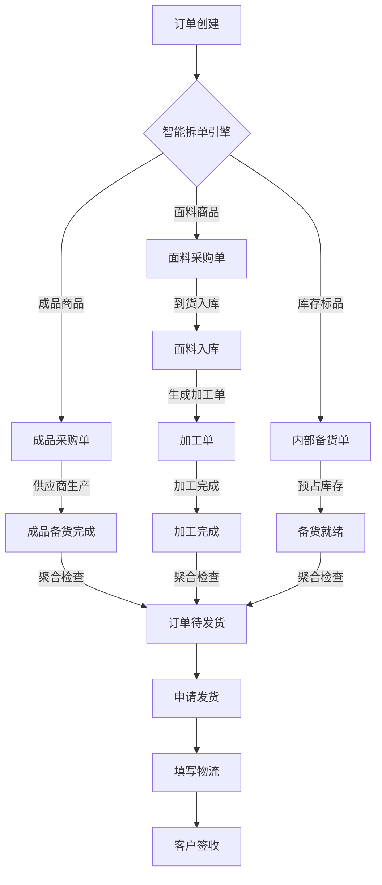

# 业务流程设计 (Business Workflow Design)

本文档定义了 L2C (Lead to Cash) 系统的核心业务流程和各模块的关键业务动作。

## 1. 全链路核心流程 (Core L2C Flow)

```mermaid
graph LR
    Lead[线索 (Lead)] -->|转化| Customer[客户 (Customer)]
    Lead -->|转化| Measure[测量单 (Measure Task)]
    Measure -->|生成| Quote[报价单 (Quote)]
    Quote -->|签约| Order[订单 (Order)]
    Order -->|拆单| PO[采购单 (Purchase Order)]
    PO -->|入库| Production[生产/加工 (Processing)]
    Order -->|发货| Install[安装单 (Install Task)]
    Install -->|验收| AfterSales[售后 (After Sales)]
    Order -->|回款| AR[应收 (AR)]
    PO -->|付款| AP[应付 (AP)]
    
    subgraph 售前阶段
    Lead
    Measure
    Quote
    end
    
    subgraph 售中阶段
    Order
    PO
    Production
    Install
    end
    
    subgraph 售后与财务
    AfterSales
    AR
    AP
    end
```

## 2. 模块级详细流程 (Module Level Flows)

### 2.1 线索管理 (Lead Management)

**核心业务动作:**
*   `create_lead`: 创建线索 (来源: 手动, 渠道API, 导入)
*   `check_duplicate`: **智能查重** (优先级: 手机号 > 楼盘+地址; 30天保护期逻辑)
*   `assign_lead`: 分配销售 (自动/手动)
*   `smart_follow`: **智能跟进推荐** (基于装修进度自动计算下次跟进时间: 水电30天/泥木20天/安装7天)
*   `collect_deposit`: **收定金** (关键转化动作, 触发自动建档)
*   `apply_free_measure`: **申请免费测量** (店长审批, 豁免定金)
*   `convert_lead`: 线索转化 (事务性操作: 更新状态 + 创建客户 + 锁定来源)

**线索转化决策流 (Lead -> Measure Decision):**



### 2.2 测量服务 (Measurement Service)

**核心业务动作:**
*   `dispatch_measure`: 派单 (支持三种场景)
*   `self_measure_approval`: **自测审批** (销售自测场景)
*   `submit_measurement`: 提交数据 (支持多轮次 Round + 多方案 Variant)
*   `verify_feasibility`: **方案可行性校验** (针对预选方案)
*   `confirm_measure`: 确认数据 (触发报价单更新)

**测量场景决策与流转 (Measurement Scenarios):**

```mermaid
graph TD
    Start[发起测量] --> Check{场景判定}
    
    Check -->|有初步方案| Scene1[场景一: 方案验证]
    Check -->|无现场信息| Scene2[场景二: 盲测]
    Check -->|销售自测| Scene3[场景三: 自测申请]
    
    Scene1 --> Task1[生成任务: 携带预选方案]
    Scene2 --> Task2[生成任务: 空白采集单]
    
    Scene3 --> Audit[店长审批]
    Audit -->|通过| Task3[生成任务: 销售执行]
    
    Task1 --> Worker[师傅上门]
    Task2 --> Worker
    Task3 --> Sales[销售上门]
    
    Worker -->|提交| Data[测量数据 (V1.A)]
    Sales -->|提交| Data
    
    Data --> Feasibility{方案可行?}
    Feasibility -->|Yes| Auto[自动回填报价]
    Feasibility -->|No| Manual[手动调整方案]
    
    Auto --> Confirm[销售确认]
    Manual --> Confirm
```

**多轮次与多版本管理 (Versioning Logic):**
*   **Round (轮次)**: 用于重测 (R1, R2, R3). 历史轮次归档。
*   **Variant (方案)**: 同一轮次下的不同建议 (V1.A 顶装, V1.B 侧装)。
*   **数据流向**: `Measure(V1.A)` -> `Quote(A)` -> `Order(A)`。订单生成后版本锁定。

### 2.3 报价管理 (Quote Management)

**核心业务动作:**
*   `create_quote`: 创建报价单
*   `calculate_price`: 自动计价
*   `submit_approval`: 折扣审批
*   `confirm_quote`: 客户确认
*   `sign_contract`: 签约

**流程图 (Quote Approval Flow):**



### 2.4 订单履约 (Order Fulfillment)

**核心业务动作:**
*   `create_order`: 创建订单 (支持 月结/现结/预收 三种模式, 需上传凭证)
*   `smart_split`: **智能拆单引擎** (自动拆分为 成品PO / 面料PO / 备货PO)
*   `barrel_effect`: **木桶效应状态聚合** (所有子单据达标才流转订单状态)
*   `request_delivery`: 发货申请 (物流/自提)
*   `track_logistics`: 物流发货与签收

**智能拆单与履约流程 (Order Split & Fulfillment):**



### 2.5 供应链与采购 (Supply Chain & PO)

**核心业务动作:**
*   `submit_po`: 确认下单 (上传供应商凭证)
*   `fabric_stock_in`: **面料入库** (触发加工单生成)
*   `process_wo`: 加工单管理 (从入库到完成)
*   `logistics_check`: 物流跟踪
*   `reconcile_ap`: AP对账 (生产中触发应付)

**双轨采购路线 (Dual Procurement Routes):**

*   **成品路线**: `PO(DRAFT)` -> `IN_PRODUCTION` -> `READY` -> `SHIPPED` -> `DELIVERED`
*   **面料+加工路线**: `PO(DRAFT)` -> `IN_PRODUCTION` -> `DELIVERED` -> `STOCKED` -> `WO(PROCESSING)` -> `WO(COMPLETED)`

**状态联动规则 (Barrel Effect):**
*   订单状态由 **所有** 子单据状态决定。
*   例如: 只有当 **所有** 采购单都 `READY/COMPLETED` 时, 订单才变为 `PENDING_DELIVERY`。
