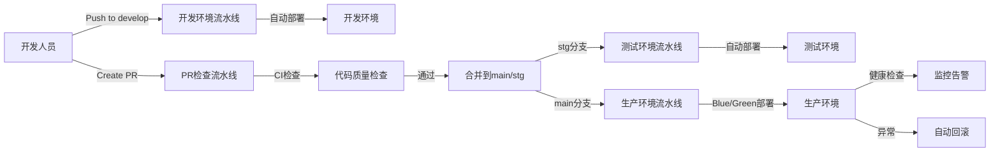
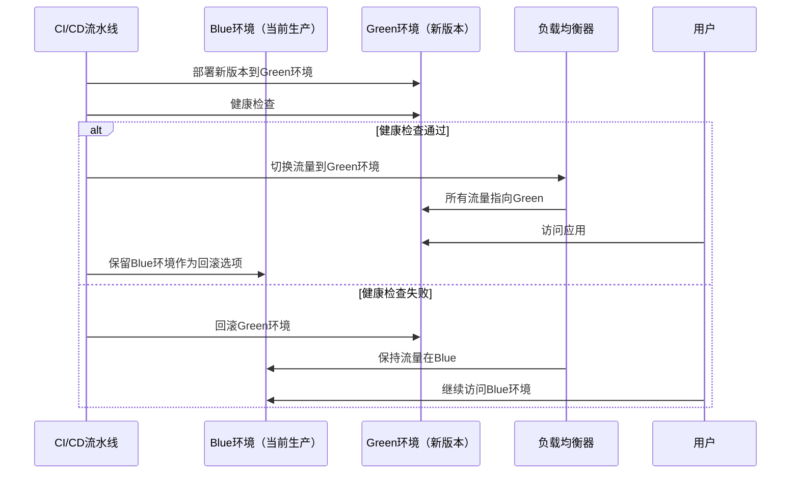

# 罗莱L2C销售管理系统 - 部署指南

## 目录
- [部署架构概述](#部署架构概述)
- [环境准备](#环境准备)
- [多环境部署架构](#多环境部署架构)
- [Vercel 部署 (前端 & Edge)](#vercel-部署-前端--edge)
- [Supabase 部署 (后端 & 数据库)](#supabase-部署-后端--数据库)
- [环境变量配置](#环境变量配置)
- [域名与 SSL](#域名与-ssl)
- [CI/CD 自动化](#cicd-自动化)
- [Blue/Green 发布](#bluegreen-发布)
- [回滚机制](#回滚机制)

## 部署架构概述

## 部署架构概述

本系统采用 **Next.js + Supabase 自托管 (Self-Hosted)** 架构，部署于国内阿里云 ECS 环境，以确保数据主权、内网通信速度及合规性。

- **前端应用**: Docker 容器化部署 Next.js (Standalone 模式)，运行于 ECS。
- **后端服务**: Supabase 全栈组件（Postgres, GoTrue, PostgREST, Realtime, Storage, Kong）通过 Docker Compose 编排运行于同一 ECS 或内网集群。
- **流量入口**: Nginx 作为反向代理，处理 SSL 终结与域名路由。
- **部署策略**: 采用 Blue/Green 无停机发布模式。
- **数据安全**: 核心数据存储于 ECS 云盘，并每日自动冷备至阿里云 OSS。

## 环境准备

### 1. 账号准备
- **GitHub**: 代码托管。
### 1. 账号准备
- **GitHub**: 代码托管与 CI/CD Actions。
- **阿里云**:
  - **ECS**: 弹性计算服务 (运行 Docker)。
  - **ACR**: 容器镜像服务 (用于中转 GitHub Actions 构建的镜像及缓存海外 Supabase 镜像)。
  - **OSS**: 对象存储 (用于数据库异地备份)。

### 2. 工具链安装
```bash
# 安装 Supabase CLI
npm install -g supabase

# 安装 Vercel CLI (可选，用于本地调试部署)
npm install -g vercel
```

## 多环境部署架构

本系统采用严格的多环境部署架构，确保开发、测试和生产环境的隔离与稳定性。

### 1. 环境层次

| 环境 | 分支 | 用途 | 部署方式 | 访问域名 |
|------|------|------|----------|----------|
| 开发环境 | `develop` | 开发测试 | 自动部署 | `dev.luolai-l2c.com` |
| 测试环境 | `stg` | 功能测试、回归测试 | 自动部署 | `stg.luolai-l2c.com` |
| 生产环境 | `main` | 正式发布 | 手动/自动部署 | `www.luolai-l2c.com` |

### 2. 环境隔离原则

- **数据库隔离**: 每个环境使用独立的 Supabase 项目
- **配置隔离**: 每个环境使用独立的环境变量配置
- **部署隔离**: 每个环境有独立的部署流水线
- **访问隔离**: 不同环境使用不同的域名

### 3. 分支策略

- **Git Flow**: 采用主干开发模式，`develop` 分支用于开发，`main` 分支用于生产
- **PR 流程**: 所有代码变更通过 Pull Request 合并，必须通过 CI 检查
- **版本控制**: 生产环境部署自动生成版本标签

### 4. 环境变量管理

- 环境变量模板文件: `.env.dev`, `.env.stg`, `.env.prod`
- 敏感信息管理: GitHub Secrets
- 配置注入方式: 运行时环境变量注入，而非构建时

### 5. 部署流水线



## 前端容器化部署

前端应用通过 Docker 容器运行，不再依赖 Vercel。

### 1. 构建镜像
CI/CD 流水线会自动执行 `docker build`，产出包含 Next.js Standalone 输出的最小化镜像。

### 2. 启动容器
由 `docker-compose.production.yml` 管理，通常运行两个实例 (Blue/Green) 以支持零停机切换。

### 3. Edge Middleware 适配
原 Vercel Edge Middleware 功能（如路由守卫）已完全兼容 Node.js Runtime，在 Docker 容器中可正常运行。

## Supabase 自托管部署

### 1. 基础设施初始化
参考 `04-ECS部署手册.md` 完成 ECS 环境初始化及数据盘挂载。

### 2. 镜像准备 (关键)
由于国内网络环境限制，**严禁**在生产环境直接拉取 `public.ecr.aws` 等海外镜像源。
必须使用脚本将所需镜像同步至阿里云 ACR 私有仓库。

```bash
# 镜像同步脚本示例 (在本地或海外跳板机执行)
docker pull public.ecr.aws/supabase/postgres:17.6.1.043
docker tag public.ecr.aws/supabase/postgres:17.6.1.043 registry.cn-shanghai.aliyuncs.com/l2c-production/postgres:17.6.1.043
docker push registry.cn-shanghai.aliyuncs.com/l2c-production/postgres:17.6.1.043
```

### 3. 启动服务
使用 `docker-compose.production.yml` 启动整套服务栈：
```bash
docker-compose up -d supabase-db supabase-kong supabase-auth
```

## 环境变量配置

### 1. Supabase 环境变量
在 Supabase Dashboard -> Settings -> API 中获取：
- `NEXT_PUBLIC_SUPABASE_URL`: 项目 URL
- `NEXT_PUBLIC_SUPABASE_ANON_KEY`: 匿名公钥 (用于客户端)
- `SUPABASE_SERVICE_ROLE_KEY`: 服务端私钥 (用于 CI/CD 或管理脚本，**严禁暴露给客户端**)

### 2. Vercel 环境变量配置
在 Vercel Dashboard -> Project Settings -> Environment Variables 中配置：

| 变量名 | 描述 | 示例值 | 环境 |
|--------|------|--------|------|
| `NEXT_PUBLIC_SUPABASE_URL` | Supabase API URL | `https://xyz.supabase.co` | Production, Preview, Development |
| `NEXT_PUBLIC_SUPABASE_ANON_KEY` | Supabase Anon Key | `eyJxh...` | Production, Preview, Development |
| `SUPABASE_SERVICE_ROLE_KEY` | Supabase Service Role Key | `eyJh...` | Production (仅服务端使用) |
| `NEXT_PUBLIC_APP_URL` | 应用访问地址 | `https://l2c.luolai.com` | Production |

### 3. 生产环境数据库连接 (Direct Connection)
如果 Next.js Server Actions 需要直连数据库 (非 HTTP 方式)，配置连接池：
- 使用 **Supavisor** 连接池 (Transaction Mode)。
- 变量名: `DATABASE_URL`
- 格式: `postgres://[user]:[password]@[host]:6543/[db_name]?pgbouncer=true`

## 域名与 SSL

### 1. Vercel 域名配置
1. 在 Vercel Dashboard -> Settings -> Domains。
2. 添加生产域名 (e.g., `l2c.luolai.com`)。
3. 根据提示在 DNS 提供商处添加 CNAME 记录 (指向 `cname.vercel-dns.com`)。
4. Vercel 会自动申请并续期 SSL 证书。

### 2. Supabase 自定义域名 (可选)
如果需要自定义 Supabase API 域名 (需 Pro Plan)：
1. Supabase Dashboard -> Settings -> General -> Custom Domain。
2. 配置 CNAME (e.g., `api.l2c.luolai.com`)。

## CI/CD 自动化

本系统利用 GitHub Actions 和 Vercel 内置流程实现全自动 CI/CD。

### 1. 自动化流程
1. **代码提交**: 开发人员推送到 GitHub。
2. **CI 检查**: GitHub Actions 运行 Lint 和 Tests。
3. **Preview 部署**: Vercel 部署预览环境 (针对 PR)。
4. **合并主分支**:
   - **Supabase Migration**: GitHub Actions 调用 Supabase CLI 自动应用数据库变更。
   - **Production 部署**: Vercel 构建并发布生产版本。

### 2. GitHub Actions 配置示例 (.github/workflows/deploy.yml)

```yaml
name: Deploy Production

on:
  push:
    branches:
      - main

jobs:
  deploy-db:
    runs-on: ubuntu-latest
    steps:
      - uses: actions/checkout@v3
      - uses: supabase/setup-cli@v1
        with:
          version: latest
      - run: supabase link --project-ref ${{ secrets.SUPABASE_PROJECT_ID }}
        env:
          SUPABASE_ACCESS_TOKEN: ${{ secrets.SUPABASE_ACCESS_TOKEN }}
      - run: supabase db push
        env:
          SUPABASE_ACCESS_TOKEN: ${{ secrets.SUPABASE_ACCESS_TOKEN }}
```

## Blue/Green 发布

为确保生产环境的高可用性和零停机部署，本系统采用 Blue/Green 发布策略。

### 1. Blue/Green 架构

- **双环境部署**: 生产环境同时运行两套相同的应用实例（Blue 和 Green）
- **流量切换**: 通过 Nginx 反向代理实现流量在两个环境间的无缝切换
- **健康检查**: 自动检查新环境的健康状态，确保部署成功
- **快速回滚**: 支持一键回滚到之前的稳定版本

### 2. 发布流程



### 3. Blue/Green 部署脚本

项目提供了完整的 Blue/Green 部署管理脚本：

```bash
# 执行完整的Blue/Green部署（部署+流量切换）
./scripts/deploy/blue-green-deploy.sh full-deploy

# 仅部署新版本到目标环境（不切换流量）
./scripts/deploy/blue-green-deploy.sh deploy

# 仅切换流量到目标环境
./scripts/deploy/blue-green-deploy.sh switch

# 回滚到上一个稳定版本
./scripts/deploy/blue-green-deploy.sh rollback

# 清理旧版本环境
./scripts/deploy/blue-green-deploy.sh cleanup

# 查看当前部署状态
./scripts/deploy/blue-green-deploy.sh status
```

### 4. 部署优势

- **零停机部署**: 部署过程中服务不中断
- **风险可控**: 新版本部署失败不影响生产环境
- **快速回滚**: 支持一键回滚到稳定版本
- **环境一致性**: 两个环境使用相同的基础设施
- **可测试性**: 新版本部署后可在切换流量前进行测试

## 回滚机制

### 1. 自动回滚

- **触发条件**: 部署过程中健康检查失败
- **回滚流程**: 自动切换流量回之前的稳定环境
- **通知机制**: 回滚事件会发送告警通知

### 2. 手动回滚

```bash
# 使用Blue/Green脚本进行手动回滚
./scripts/deploy/blue-green-deploy.sh rollback

# 或在GitHub Actions中手动触发回滚 workflow
```

### 3. 回滚策略

- **保留版本**: 至少保留最近3个稳定版本
- **回滚范围**: 包括应用代码和配置
- **数据回滚**: 数据库变更采用迁移脚本，支持逆向执行

### 4. 回滚注意事项

- 回滚前确认当前环境状态
- 回滚后验证应用功能
- 记录回滚原因和结果

### 5. 数据库备份与恢复

Supabase 自动管理备份：
- **每日备份**: 自动保留
- **PITR**: 启用后可恢复到任意时间点 (Pro Plan)
- **手动备份**: 可通过 Supabase CLI 创建手动备份

```bash
# 创建数据库备份
npx supabase db dump > backup.sql

# 恢复数据库
npx supabase db restore backup.sql
```
