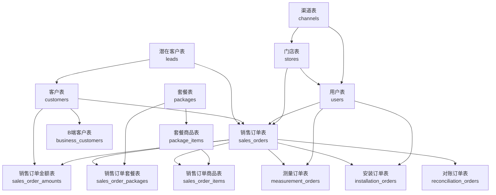

# 销售管理系统数据库设计方案

## 1. 设计原则

- **遵循命名规范**：所有表名和字段名使用 snake_case 格式
- **业务流程完整**：覆盖从潜在客户到销售订单、再到后续服务的完整流程
- **关系清晰**：明确的主键和外键关系
- **扩展性强**：支持未来业务扩展
- **审计追踪**：包含必要的创建和更新时间字段
- **软删除支持**：通过 deleted_at 字段实现软删除，便于数据归档和恢复
- **客户类型区分**：明确区分B端和C端客户，支持差异化管理

## 2. 核心业务流程

```
潜在客户 → 客户（B端/C端） → B端客户详情 → 销售订单 → 订单金额/套餐/商品 → 测量订单/安装订单/对账订单
用户（销售人员）→ 销售订单
渠道 → 门店 → 用户/销售订单
套餐 → 销售订单套餐 → 套餐商品
```

## 3. 数据库表结构设计

### 3.1 潜在客户表 (leads)

| 字段名 | 数据类型 | 约束 | 描述 |
|--------|----------|------|------|
| id | BIGSERIAL | PRIMARY KEY | 潜在客户ID |
| name | VARCHAR(100) | NOT NULL | 潜在客户名称 |
| contact_info | VARCHAR(200) | NOT NULL | 联系方式 |
| status | SMALLINT | NOT NULL | 状态：1-潜在, 2-转化, 3-失效 |
| created_at | TIMESTAMPTZ | NOT NULL DEFAULT NOW() | 创建时间 |
| updated_at | TIMESTAMPTZ | NOT NULL DEFAULT NOW() | 更新时间 |
| deleted_at | TIMESTAMPTZ | NULL | 删除时间(软删除) |

### 3.2 客户表 (customers)

| 字段名 | 数据类型 | 约束 | 描述 |
|--------|----------|------|------|
| id | BIGSERIAL | PRIMARY KEY | 客户ID |
| lead_id | BIGINT | FOREIGN KEY REFERENCES leads(id) ON DELETE SET NULL | 关联的潜在客户ID |
| customer_type | SMALLINT | NOT NULL | 客户类型：1-C端个人客户, 2-B端企业客户 |
| name | VARCHAR(100) | NOT NULL | 客户名称 |
| contact_info | VARCHAR(200) | NOT NULL | 联系方式 |
| address | TEXT | NOT NULL | 客户地址 |
| created_at | TIMESTAMPTZ | NOT NULL DEFAULT NOW() | 创建时间 |
| updated_at | TIMESTAMPTZ | NOT NULL DEFAULT NOW() | 更新时间 |
| deleted_at | TIMESTAMPTZ | NULL | 删除时间(软删除) |

### 3.3 B端客户表 (business_customers)

| 字段名 | 数据类型 | 约束 | 描述 |
|--------|----------|------|------|
| id | BIGSERIAL | PRIMARY KEY | B端客户ID |
| customer_id | BIGINT | UNIQUE, FOREIGN KEY REFERENCES customers(id) ON DELETE CASCADE | 关联的客户ID（一对一关系） |
| company_name | VARCHAR(100) | NOT NULL | 企业名称 |
| legal_representative | VARCHAR(50) | NOT NULL | 法定代表人 |
| business_license | VARCHAR(50) | NOT NULL | 营业执照编号 |
| tax_registration | VARCHAR(50) | NOT NULL | 税务登记证号 |
| company_scale | SMALLINT | NOT NULL | 企业规模：1-微型, 2-小型, 3-中型, 4-大型 |
| business_scope | TEXT | NOT NULL | 经营范围 |
| established_date | DATE | NOT NULL | 成立日期 |
| annual_turnover | DECIMAL(15,2) | | 年营业额 |
| employee_count | INT | | 员工人数 |
| company_address | TEXT | NOT NULL | 企业地址 |
| company_phone | VARCHAR(50) | NOT NULL | 企业电话 |
| company_email | VARCHAR(100) | | 企业邮箱 |
| website | VARCHAR(100) | | 企业网站 |
| qualification_certificates | TEXT | | 资质证书（JSON格式存储多个证书） |
| credit_rating | SMALLINT | | 信用等级：1-AAA, 2-AA, 3-A, 4-BBB, 5-BB, 6-B, 7-C |
| cooperation_history | TEXT | | 合作历史 |
| status | SMALLINT | DEFAULT 1 | 合作状态：1-合作中, 2-暂停合作, 3-终止合作 |
| created_at | TIMESTAMPTZ | NOT NULL DEFAULT NOW() | 创建时间 |
| updated_at | TIMESTAMPTZ | NOT NULL DEFAULT NOW() | 更新时间 |
| deleted_at | TIMESTAMPTZ | NULL | 删除时间(软删除) |

### 3.4 销售订单表 (sales_orders)

| 字段名 | 数据类型 | 约束 | 描述 |
|--------|----------|------|------|
| id | BIGSERIAL | PRIMARY KEY | 销售订单ID |
| order_no | VARCHAR(50) | UNIQUE, NOT NULL | 订单编号 |
| lead_id | BIGINT | FOREIGN KEY REFERENCES leads(id) ON DELETE SET NULL | 潜在客户ID |
| customer_id | BIGINT | FOREIGN KEY REFERENCES customers(id) ON DELETE SET NULL | 客户ID |
| salesperson_id | BIGINT | FOREIGN KEY REFERENCES users(id) ON DELETE SET NULL | 销售人员ID |
| store_id | BIGINT | FOREIGN KEY REFERENCES stores(id) ON DELETE SET NULL | 门店ID |
| order_type | SMALLINT | NOT NULL | 订单类型：1-零售, 2-批发, 3-定制 |
| order_date | DATE | NOT NULL | 订单日期 |
| status | SMALLINT | NOT NULL | 订单状态：1-待审核, 2-已审核, 3-已发货, 4-已完成, 5-已取消 |
| delivery_address | TEXT | NOT NULL | 交付地址 |
| notes | TEXT | | 订单备注 |
| created_at | TIMESTAMPTZ | NOT NULL DEFAULT NOW() | 创建时间 |
| updated_at | TIMESTAMPTZ | NOT NULL DEFAULT NOW() | 更新时间 |
| deleted_at | TIMESTAMPTZ | NULL | 删除时间(软删除) |

### 3.5 销售订单金额表 (sales_order_amounts)

| 字段名 | 数据类型 | 约束 | 描述 |
|--------|----------|------|------|
| id | BIGSERIAL | PRIMARY KEY | 销售订单金额ID |
| sales_order_id | BIGINT | FOREIGN KEY REFERENCES sales_orders(id) ON DELETE CASCADE | 关联的销售订单ID |
| customer_id | BIGINT | FOREIGN KEY REFERENCES customers(id) ON DELETE SET NULL | 关联的客户ID |
| total_amount | DECIMAL(15,2) | NOT NULL | 订单总金额 |
| discount | DECIMAL(15,2) | DEFAULT 0.00 | 折扣金额 |
| actual_payment | DECIMAL(15,2) | NOT NULL | 实际支付金额 |
| created_at | TIMESTAMPTZ | NOT NULL DEFAULT NOW() | 创建时间 |
| updated_at | TIMESTAMPTZ | NOT NULL DEFAULT NOW() | 更新时间 |
| deleted_at | TIMESTAMPTZ | NULL | 删除时间(软删除) |

### 3.6 用户表 (users)

| 字段名 | 数据类型 | 约束 | 描述 |
|--------|----------|------|------|
| id | BIGSERIAL | PRIMARY KEY | 用户ID |
| user_type | SMALLINT | NOT NULL | 用户类型：1-远程销售, 2-驻店销售, 3-销售负责人, 4-订单客服, 5-派单员, 6-测量技师, 7-安装技师 |
| name | VARCHAR(100) | NOT NULL | 用户姓名 |
| contact_info | VARCHAR(200) | NOT NULL | 联系方式 |
| store_id | BIGINT | FOREIGN KEY REFERENCES stores(id) ON DELETE SET NULL | 所属门店ID |
| status | SMALLINT | DEFAULT 1 | 用户状态：1-在职, 2-离职, 3-休假 |
| created_at | TIMESTAMPTZ | NOT NULL DEFAULT NOW() | 创建时间 |
| updated_at | TIMESTAMPTZ | NOT NULL DEFAULT NOW() | 更新时间 |
| deleted_at | TIMESTAMPTZ | NULL | 删除时间(软删除) |

### 3.7 渠道表 (channels)

| 字段名 | 数据类型 | 约束 | 描述 |
|--------|----------|------|------|
| id | BIGSERIAL | PRIMARY KEY | 渠道ID |
| channel_name | VARCHAR(100) | NOT NULL | 渠道名称 |
| channel_level | SMALLINT | NOT NULL | 渠道级别：1-一级渠道, 2-二级渠道, 3-三级渠道 |
| involved_cities | TEXT | | 涉及的城市（多个城市用逗号分隔） |
| channel_manager_id | BIGINT | FOREIGN KEY REFERENCES users(id) ON DELETE SET NULL | 渠道负责人ID |
| channel_key_person_id | BIGINT | FOREIGN KEY REFERENCES users(id) ON DELETE SET NULL | 渠道关键人ID |
| channel_description | TEXT | | 渠道描述 |
| status | SMALLINT | DEFAULT 1 | 渠道状态：1-合作中, 2-未合作, 3-开发中 |
| created_at | TIMESTAMPTZ | NOT NULL DEFAULT NOW() | 创建时间 |
| updated_at | TIMESTAMPTZ | NOT NULL DEFAULT NOW() | 更新时间 |
| deleted_at | TIMESTAMPTZ | NULL | 删除时间(软删除) |

### 3.8 门店表 (stores)

| 字段名 | 数据类型 | 约束 | 描述 |
|--------|----------|------|------|
| id | BIGSERIAL | PRIMARY KEY | 门店ID |
| store_name | VARCHAR(100) | NOT NULL | 门店名称 |
| address | TEXT | NOT NULL | 门店地址 |
| city | VARCHAR(100) | NOT NULL | 所在城市 |
| contact_info | VARCHAR(200) | NOT NULL | 联系方式 |
| channel_id | BIGINT | FOREIGN KEY REFERENCES channels(id) ON DELETE SET NULL | 所属渠道ID |
| in_store_sales_id | BIGINT | FOREIGN KEY REFERENCES users(id) ON DELETE SET NULL | 驻店销售ID |
| remote_sales_id | BIGINT | FOREIGN KEY REFERENCES users(id) ON DELETE SET NULL | 远程销售ID |
| order_service_id | BIGINT | FOREIGN KEY REFERENCES users(id) ON DELETE SET NULL | 订单客服ID |
| dispatcher_id | BIGINT | FOREIGN KEY REFERENCES users(id) ON DELETE SET NULL | 派单员ID |
| sales_manager_id | BIGINT | FOREIGN KEY REFERENCES users(id) ON DELETE SET NULL | 销售负责人ID |
| key_contact_id | BIGINT | FOREIGN KEY REFERENCES users(id) ON DELETE SET NULL | 关键对接人ID |
| status | SMALLINT | DEFAULT 1 | 门店状态：1-开店, 2-装修中, 3-闭店 |
| created_at | TIMESTAMPTZ | NOT NULL DEFAULT NOW() | 创建时间 |
| updated_at | TIMESTAMPTZ | NOT NULL DEFAULT NOW() | 更新时间 |
| deleted_at | TIMESTAMPTZ | NULL | 删除时间(软删除) |

### 3.9 销售订单套餐表 (sales_order_packages)

| 字段名 | 数据类型 | 约束 | 描述 |
|--------|----------|------|------|
| id | INT | PRIMARY KEY, AUTO_INCREMENT | 销售订单套餐ID |
| sales_order_id | INT | FOREIGN KEY REFERENCES sales_orders(id) | 关联的销售订单ID |
| package_id | INT | FOREIGN KEY REFERENCES packages(id) | 关联的套餐ID |
| quantity | INT | NOT NULL | 套餐数量 |
| price | DECIMAL(10,2) | NOT NULL | 套餐单价 |
| created_at | TIMESTAMP | DEFAULT CURRENT_TIMESTAMP | 创建时间 |
| updated_at | TIMESTAMP | DEFAULT CURRENT_TIMESTAMP ON UPDATE CURRENT_TIMESTAMP | 更新时间 |

### 3.8 销售订单商品表 (sales_order_items)

| 字段名 | 数据类型 | 约束 | 描述 |
|--------|----------|------|------|
| id | INT | PRIMARY KEY, AUTO_INCREMENT | 销售订单商品ID |
| sales_order_id | INT | FOREIGN KEY REFERENCES sales_orders(id) | 关联的销售订单ID |
| item_id | INT | FOREIGN KEY REFERENCES package_items(id) | 关联的套餐商品ID |
| quantity | INT | NOT NULL | 商品数量 |
| price | DECIMAL(10,2) | NOT NULL | 商品单价 |
| created_at | TIMESTAMP | DEFAULT CURRENT_TIMESTAMP | 创建时间 |
| updated_at | TIMESTAMP | DEFAULT CURRENT_TIMESTAMP ON UPDATE CURRENT_TIMESTAMP | 更新时间 |

### 3.9 测量订单表 (measurement_orders)

| 字段名 | 数据类型 | 约束 | 描述 |
|--------|----------|------|------|
| id | INT | PRIMARY KEY, AUTO_INCREMENT | 测量订单ID |
| sales_order_id | INT | FOREIGN KEY REFERENCES sales_orders(id) | 关联的销售订单ID |
| technician_id | INT | FOREIGN KEY REFERENCES users(id) | 测量技师ID |
| measurement_date | DATE | NOT NULL | 测量日期 |
| status | VARCHAR(50) | NOT NULL | 测量状态 |
| created_at | TIMESTAMP | DEFAULT CURRENT_TIMESTAMP | 创建时间 |
| updated_at | TIMESTAMP | DEFAULT CURRENT_TIMESTAMP ON UPDATE CURRENT_TIMESTAMP | 更新时间 |

### 3.10 安装订单表 (installation_orders)

| 字段名 | 数据类型 | 约束 | 描述 |
|--------|----------|------|------|
| id | INT | PRIMARY KEY, AUTO_INCREMENT | 安装订单ID |
| sales_order_id | INT | FOREIGN KEY REFERENCES sales_orders(id) | 关联的销售订单ID |
| technician_id | INT | FOREIGN KEY REFERENCES users(id) | 安装技师ID |
| installation_date | DATE | NOT NULL | 安装日期 |
| status | VARCHAR(50) | NOT NULL | 安装状态 |
| created_at | TIMESTAMP | DEFAULT CURRENT_TIMESTAMP | 创建时间 |
| updated_at | TIMESTAMP | DEFAULT CURRENT_TIMESTAMP ON UPDATE CURRENT_TIMESTAMP | 更新时间 |

### 3.11 对账订单表 (reconciliation_orders)

| 字段名 | 数据类型 | 约束 | 描述 |
|--------|----------|------|------|
| id | INT | PRIMARY KEY, AUTO_INCREMENT | 对账订单ID |
| sales_order_id | INT | FOREIGN KEY REFERENCES sales_orders(id) | 关联的销售订单ID |
| reconciliation_date | DATE | NOT NULL | 对账日期 |
| amount | DECIMAL(10,2) | NOT NULL | 对账金额 |
| status | VARCHAR(50) | NOT NULL | 对账状态 |
| created_at | TIMESTAMP | DEFAULT CURRENT_TIMESTAMP | 创建时间 |
| updated_at | TIMESTAMP | DEFAULT CURRENT_TIMESTAMP ON UPDATE CURRENT_TIMESTAMP | 更新时间 |

### 3.12 套餐表 (packages)

| 字段名 | 数据类型 | 约束 | 描述 |
|--------|----------|------|------|
| id | INT | PRIMARY KEY, AUTO_INCREMENT | 套餐ID |
| name | VARCHAR(100) | NOT NULL | 套餐名称 |
| description | TEXT | NOT NULL | 套餐描述 |
| price | DECIMAL(10,2) | NOT NULL | 套餐价格 |
| status | VARCHAR(50) | NOT NULL | 套餐状态 |
| created_at | TIMESTAMP | DEFAULT CURRENT_TIMESTAMP | 创建时间 |
| updated_at | TIMESTAMP | DEFAULT CURRENT_TIMESTAMP ON UPDATE CURRENT_TIMESTAMP | 更新时间 |

### 3.13 套餐商品表 (package_items)

| 字段名 | 数据类型 | 约束 | 描述 |
|--------|----------|------|------|
| id | INT | PRIMARY KEY, AUTO_INCREMENT | 套餐商品ID |
| package_id | INT | FOREIGN KEY REFERENCES packages(id) | 关联的套餐ID |
| item_id | INT | NOT NULL | 商品ID（可扩展为独立商品表） |
| item_name | VARCHAR(100) | NOT NULL | 商品名称 |
| quantity | INT | NOT NULL | 商品数量 |
| created_at | TIMESTAMP | DEFAULT CURRENT_TIMESTAMP | 创建时间 |
| updated_at | TIMESTAMP | DEFAULT CURRENT_TIMESTAMP ON UPDATE CURRENT_TIMESTAMP | 更新时间 |

## 4. 数据库关系图



## 5. 核心业务流程说明

### 5.1 潜在客户管理
- 记录潜在客户信息
- 跟踪潜在客户状态变化
- 支持直接生成销售订单

### 5.2 客户管理
- 从潜在客户转化而来，分为B端客户和C端客户
- 管理客户基本信息，包括联系方式和地址
- 关联多个销售订单
- B端客户有专门的B端客户表存储详细企业信息

### 5.3 销售订单管理
- 核心业务表，关联多个子表
- 记录订单基本信息、金额、套餐、商品
- 触发后续服务流程

### 5.4 销售团队管理
- 管理不同类型的销售人员
- 关联所属门店
- 跟踪销售人员的订单业绩

### 5.5 门店管理
- 管理门店基本信息
- 关联所属销售人员
- 统计门店销售业绩
- 关联所属渠道

### 5.6 B端客户管理
- 专门管理B端客户（如装企）的详细企业信息
- 包含企业规模、经营范围、资质证书等B端特有字段
- 与客户表建立一对一关系
- 记录企业的合作状态和信用等级

### 5.7 渠道管理
- 管理公司的各类销售渠道和渠道商
- 区分渠道级别和状态
- 关联渠道负责人和关键人
- 通过门店间接服务客户

### 5.8 后续服务管理
- 测量订单：记录测量服务信息
- 安装订单：记录安装服务信息
- 对账订单：记录财务对账信息

### 5.7 套餐管理
- 定义可销售的套餐
- 管理套餐包含的商品
- 支持套餐销售和单独商品销售

## 6. 索引设计

| 表名 | 索引字段 | 索引类型 | 描述 |
|------|----------|----------|------|
| leads | status | INDEX | 按状态查询潜在客户 |
| leads | name | INDEX | 按名称查询潜在客户 |
| customers | name | INDEX | 按名称查询客户 |
| customers | customer_type | INDEX | 按客户类型查询 |
| customers | lead_id | INDEX | 按潜在客户ID查询 |
| business_customers | customer_id | UNIQUE INDEX | 按客户ID查询B端客户信息 |
| business_customers | company_name | INDEX | 按企业名称查询 |
| business_customers | business_license | INDEX | 按营业执照编号查询 |
| business_customers | company_scale | INDEX | 按企业规模查询 |
| business_customers | status | INDEX | 按合作状态查询 |
| business_customers | credit_rating | INDEX | 按信用等级查询 |
| sales_orders | order_no | UNIQUE INDEX | 订单编号唯一索引 |
| sales_orders | customer_id | INDEX | 按客户ID查询 |
| sales_orders | salesperson_id | INDEX | 按销售人员ID查询 |
| sales_orders | store_id | INDEX | 按门店ID查询 |
| sales_orders | status | INDEX | 按状态查询 |
| sales_order_amounts | sales_order_id | INDEX | 按订单查询金额 |
| users | user_type | INDEX | 按用户类型查询 |
| users | store_id | INDEX | 按门店查询用户 |
| channels | channel_name | INDEX | 按名称查询渠道 |
| channels | channel_level | INDEX | 按级别查询渠道 |
| channels | channel_manager_id | INDEX | 按渠道负责人查询 |
| channels | channel_key_person_id | INDEX | 按渠道关键人查询 |
| channels | status | INDEX | 按状态查询 |
| stores | store_name | INDEX | 按名称查询门店 |
| stores | channel_id | INDEX | 按所属渠道查询门店 |
| stores | city | INDEX | 按城市查询门店 |
| stores | in_store_sales_id | INDEX | 按驻店销售查询门店 |
| stores | remote_sales_id | INDEX | 按远程销售查询门店 |
| stores | sales_manager_id | INDEX | 按销售负责人查询门店 |
| measurement_orders | sales_order_id | INDEX | 按订单查询测量订单 |
| measurement_orders | status | INDEX | 按状态查询测量订单 |
| installation_orders | sales_order_id | INDEX | 按订单查询安装订单 |
| installation_orders | status | INDEX | 按状态查询安装订单 |

## 7. 数据安全

- **访问控制**：基于角色的权限管理
- **数据加密**：敏感数据加密存储
- **备份策略**：定期全量备份和增量备份
- **审计日志**：记录关键操作日志

## 8. 扩展性考虑

- **商品表扩展**：当前套餐商品表包含商品名称，未来可扩展为独立商品表
- **服务类型扩展**：支持添加更多类型的后续服务
- **多维度统计**：支持按时间、区域、人员等维度统计
- **API集成**：支持与其他系统集成

## 9. 技术栈建议

- **数据库引擎**：MySQL 8.0+ 或 PostgreSQL 14+
- **ORM框架**：根据后端技术栈选择（如TypeORM、Prisma等）
- **缓存层**：Redis（可选，用于热点数据缓存）
- **搜索功能**：Elasticsearch（可选，用于复杂查询）

## 10. 部署建议

- **开发环境**：单节点部署
- **测试环境**：与生产环境一致的配置
- **生产环境**：主从复制架构，确保高可用性
- **监控**：使用Prometheus + Grafana监控数据库性能

---

**设计日期**：2025-11-28  
**设计人员**：开发团队  
**版本**：v1.0