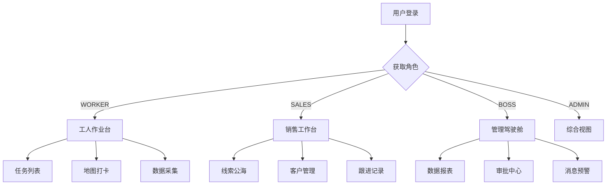

# L2C 移动端部署策略

> **版本**: v1.0
> **日期**: 2026-01-18
> **状态**: 规划中

## 一、战略定位

### 1.1 核心原则

采用 **"单一超级应用 + 角色动态视图"** 架构，在一个微信小程序内服务所有角色（工人、销售、管理层），而非开发多个独立小程序。

### 1.2 选择理由

| 方案 | 优势 | 劣势 | 结论 |
|------|------|------|------|
| 多小程序（按角色拆分） | 职责清晰 | 业务割裂、维护成本高、角色重叠困难 | ❌ 不推荐 |
| 单一超级应用 | 数据互通、统一维护、角色切换灵活 | 需分包管理 | ✅ **推荐** |

---

## 二、角色与功能规划

### 2.1 角色矩阵

```
┌──────────────────────────────────────────────────────────┐
│                    L2C 移动端角色矩阵                      │
├──────────────┬──────────────┬──────────────┬─────────────┤
│   工人端     │    销售端    │    老板端    │   管理员    │
│  (Field)     │   (Sales)    │   (Boss)     │  (Admin)    │
├──────────────┼──────────────┼──────────────┼─────────────┤
│ • 测量任务   │ • 线索录入   │ • 经营看板   │ • 全部功能  │
│ • 安装任务   │ • 客户跟进   │ • 移动审批   │ • 权限管理  │
│ • GPS 打卡   │ • 发起测量   │ • 业绩排行   │ • 系统设置  │
│ • 数据采集   │ • 查看报价   │ • 异常预警   │             │
│ • 现场拍照   │ • 订单跟踪   │ • 团队管理   │             │
└──────────────┴──────────────┴──────────────┴─────────────┘
```

### 2.2 动态工作台架构



---

## 三、技术架构

### 3.1 技术选型

| 层级 | 技术方案 | 说明 |
|------|---------|------|
| 前端框架 | **uni-app (Vue3)** | 一套代码输出小程序 + 安卓 + iOS |
| 状态管理 | Pinia | 与 Vue3 生态统一 |
| 请求库 | uni.request 封装 | 统一错误处理、Token 刷新 |
| 地图 | 腾讯地图 SDK | 微信小程序原生支持 |
| 图表 | uCharts | 跨平台图表库 |
| UI 组件 | uView UI 3.0 | uni-app 生态成熟组件库 |

### 3.2 分包策略

```
pages/                      # 主包 (< 2MB)
├── login/                  # 登录页
├── home/                   # 首页 (动态路由)
└── common/                 # 公共页面

subpackages/
├── worker/                 # 分包A: 工人端 (< 2MB)
│   ├── task-list/
│   ├── measure-detail/
│   ├── install-detail/
│   └── photo-upload/
│
├── sales/                  # 分包B: 销售端 (< 2MB)
│   ├── lead-list/
│   ├── customer-detail/
│   ├── followup/
│   └── quote-view/
│
└── boss/                   # 分包C: 老板端 (< 2MB)
    ├── dashboard/
    ├── approval/
    ├── ranking/
    └── alert/
```

### 3.3 后端 API 架构

```
/api/mobile/
├── auth/
│   ├── login              # 登录
│   ├── logout             # 登出
│   └── refresh            # Token 刷新
│
├── tasks/                 # 工人端 (已实现)
│   ├── GET    /           # 任务列表
│   ├── GET    /:type/:id  # 任务详情
│   └── PATCH  /:type/:id  # 任务更新
│
├── sales/                 # 销售端 (待实现)
│   ├── leads/             # 线索管理
│   ├── customers/         # 客户管理
│   └── quotes/            # 报价查看
│
├── boss/                  # 老板端 (待实现)
│   ├── dashboard/         # 经营看板
│   ├── approvals/         # 移动审批
│   └── alerts/            # 消息预警
│
└── common/
    ├── upload/            # 图片上传 (OSS 签名)
    └── notifications/     # 消息推送
```

---

## 四、分阶段实施计划

### Phase 1: 工人端 MVP (第1-3周)

**目标**: 完成测量/安装现场数据采集闭环

| 任务 | 工作量 | 负责人 | 状态 |
|------|--------|--------|------|
| 后端 API 完善 (OSS签名、Token刷新) | 3天 | 后端 | 待开始 |
| 工人端页面开发 | 8天 | 前端 | 待开始 |
| GPS + 地图集成 | 2天 | 前端 | 待开始 |
| 联调测试 | 2天 | 全员 | 待开始 |

**交付物**:
- 微信小程序审核版本
- 安卓 APK 内测版

---

### Phase 2: 老板端审批 (第4-5周)

**目标**: 管理层可随时随地进行审批和查看关键数据

| 任务 | 工作量 | 负责人 | 状态 |
|------|--------|--------|------|
| Boss API 封装 | 3天 | 后端 | 待开始 |
| 审批流页面 | 3天 | 前端 | 待开始 |
| 数据看板页面 | 3天 | 前端 | 待开始 |
| 消息推送集成 | 2天 | 全栈 | 待开始 |

**交付物**:
- 老板端功能模块
- 微信模板消息推送

---

### Phase 3: 销售端 CRM (第6-8周)

**目标**: 销售人员可完成线索录入和客户跟进全流程

| 任务 | 工作量 | 负责人 | 状态 |
|------|--------|--------|------|
| Sales API 封装 | 4天 | 后端 | 待开始 |
| 线索管理页面 | 4天 | 前端 | 待开始 |
| 客户详情页面 | 3天 | 前端 | 待开始 |
| 跟进记录功能 | 3天 | 前端 | 待开始 |

**交付物**:
- 销售端功能模块
- 完整的小程序正式版

---

## 五、资源规划

### 5.1 人力配置

| 阶段 | 前端 | 后端 | 测试 | 总人天 |
|------|------|------|------|--------|
| Phase 1 | 10天 | 3天 | 2天 | 15天 |
| Phase 2 | 6天 | 3天 | 2天 | 11天 |
| Phase 3 | 10天 | 4天 | 3天 | 17天 |
| **合计** | **26天** | **10天** | **7天** | **43天** |

### 5.2 外部依赖

| 依赖项 | 说明 | 预估费用 |
|--------|------|---------|
| 微信小程序服务器域名 | 需 HTTPS | 已有 |
| 腾讯地图 API | 每日免费额度足够 | 免费 |
| OSS 存储 | 图片上传 | 按量付费 |
| 微信模板消息 | 审批通知 | 免费 |
| 安卓应用签名 | 上架应用市场 | 一次性 |

---

## 六、风险与应对

| 风险 | 等级 | 应对措施 |
|------|------|---------|
| 小程序审核被拒 | 中 | 预留 3-5 天缓冲期，准备审核材料 |
| GPS 定位精度不足 | 低 | 支持手动输入地址作为备选 |
| 图片上传失败 | 中 | 实现断点续传和离线缓存 |
| Token 过期导致操作失败 | 中 | 实现静默刷新机制 |

---

## 七、验收标准

### Phase 1 验收标准
- [ ] 工人可登录并查看任务列表
- [ ] 工人可完成 GPS 打卡 (误差 < 100m)
- [ ] 工人可上传现场照片 (支持批量)
- [ ] 工人可提交测量/安装数据
- [ ] 数据正确同步到 Web 管理后台

### Phase 2 验收标准
- [ ] 老板可查看当日/当月经营数据
- [ ] 老板可在手机上完成审批操作
- [ ] 审批完成后相关人员收到通知

### Phase 3 验收标准
- [ ] 销售可录入新线索
- [ ] 销售可查看客户列表和详情
- [ ] 销售可添加跟进记录
- [ ] 销售可发起预约测量

---

## 附录

### A. 目录结构参考

```
mobile-app/
├── src/
│   ├── api/                 # API 封装
│   ├── components/          # 公共组件
│   ├── pages/               # 主包页面
│   ├── subpackages/         # 分包页面
│   ├── store/               # Pinia 状态
│   ├── utils/               # 工具函数
│   └── static/              # 静态资源
├── manifest.json            # 小程序配置
├── pages.json               # 路由配置
└── package.json
```

### B. 相关文档

- [移动端 API 文档](./04-api/03-mobile/)
- [API 审计报告](./04-api/audit-report.md)
