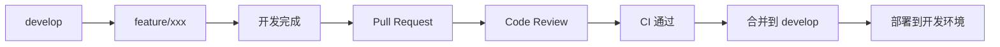
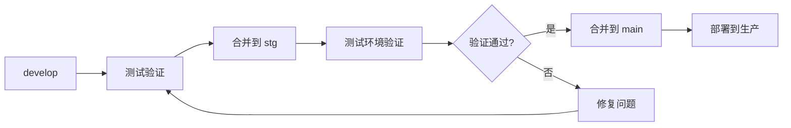
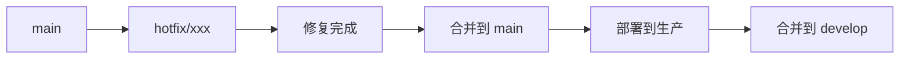

# 分支策略

本文档定义了 L2C 项目的 Git 分支管理策略。

## 分支类型

### 主要分支

#### `main` - 生产环境分支
- **用途**：生产环境部署分支
- **保护级别**：高（受保护）
- **合并方式**：仅通过 Pull Request 合并
- **部署目标**：生产环境
- **CI/CD**：触发完整的测试、构建和部署流程

#### `develop` - 开发主分支
- **用途**：日常开发的集成分支
- **保护级别**：中（受保护）
- **合并方式**：通过 Pull Request 合并
- **部署目标**：开发环境
- **CI/CD**：触发测试、构建和开发环境部署

#### `stg` - 测试环境分支
- **用途**：测试/预生产环境
- **保护级别**：中
- **合并方式**：从 develop 合并
- **部署目标**：测试环境
- **CI/CD**：触发测试环境部署

### 临时分支

#### `feature/*` - 功能分支
- **命名规则**：`feature/<功能名称>`
- **示例**：`feature/user-authentication`、`feature/order-management`
- **从哪里创建**：从 `develop` 创建
- **合并到**：`develop`
- **生命周期**：功能开发完成后删除

```bash
# 创建功能分支
git checkout develop
git pull origin develop
git checkout -b feature/user-authentication

# 开发完成后合并
git checkout develop
git pull origin develop
git merge feature/user-authentication
git push origin develop
git branch -d feature/user-authentication
```

#### `bugfix/*` - 错误修复分支
- **命名规则**：`bugfix/<问题描述>`
- **示例**：`bugfix/login-error`、`bugfix/data-loading-issue`
- **从哪里创建**：从 `develop` 创建
- **合并到**：`develop`
- **生命周期**：修复完成后删除

```bash
# 创建修复分支
git checkout develop
git pull origin develop
git checkout -b bugfix/login-error

# 修复完成后合并
git checkout develop
git merge bugfix/login-error
git push origin develop
git branch -d bugfix/login-error
```

#### `hotfix/*` - 紧急修复分支
- **命名规则**：`hotfix/<问题描述>`
- **示例**：`hotfix/critical-security-patch`
- **从哪里创建**：从 `main` 创建
- **合并到**：`main` 和 `develop`
- **生命周期**：修复完成后删除
- **注意**：需要同时合并到 main 和 develop

```bash
# 创建紧急修复分支
git checkout main
git pull origin main
git checkout -b hotfix/critical-security-patch

# 修复完成后合并到 main
git checkout main
git merge hotfix/critical-security-patch
git push origin main

# 同时合并到 develop
git checkout develop
git merge hotfix/critical-security-patch
git push origin develop

# 删除分支
git branch -d hotfix/critical-security-patch
```

## 工作流程

### 日常开发流程



**步骤：**
1. 从 `develop` 创建功能分支
2. 在功能分支上开发
3. 提交符合规范的 commit（见 [COMMIT_CONVENTION.md](file:///Users/laichangcheng/Documents/文稿%20-%20来长城的MacBook%20Air/trae/L2C/docs/COMMIT_CONVENTION.md)）
4. 推送到远程仓库
5. 创建 Pull Request 到 `develop`
6. 等待 Code Review 和 CI 通过
7. 合并到 `develop`
8. 自动部署到开发环境

### 发布流程



**步骤：**
1. 在 `develop` 分支上完成开发
2. 合并到 `stg` 分支
3. 在测试环境进行完整测试
4. 测试通过后，创建 Pull Request 到 `main`
5. Code Review 和最终确认
6. 合并到 `main`
7. 自动部署到生产环境
8. 打 Tag 标记版本

### 紧急修复流程



## 分支保护规则

### `main` 分支保护
- ✅ 要求 Pull Request 审核
- ✅ 要求至少 1 个审核批准
- �� 要求 CI 通过
- ✅ 禁止强制推送
- ✅ 禁止删除分支

### `develop` 分支保护
- ✅ 要求 Pull Request 审核
- ✅ 要求 CI 通过
- ✅ 禁止强制推送
- ✅ 禁止删除分支

## Pull Request 规范

### 创建 PR 时

1. **标题**：使用清晰的描述，遵循 Conventional Commits 格式
   - 示例：`feat: 添加用户认证功能`

2. **描述**：包含以下内容
   - 改动的目的
   - 主要变更点
   - 测试方法
   - 相关的 Issue 链接

3. **检查清单**
   ```markdown
   - [ ] 代码已通过本地测试
   - [ ] 已添加必要的单元测试
   - [ ] 已更新相关文档
   - [ ] 符合代码规范
   - [ ] 无编译警告或错误
   ```

### 审核 PR 时

1. **检查代码质量**
   - 代码逻辑是否清晰
   - 是否有潜在的 Bug
   - 是否符合项目规范

2. **检查测试覆盖**
   - 是否有足够的测试
   - 测试是否有效

3. **检查性能影响**
   - 是否有性能问题
   - 是否需要优化

## 最佳实践

1. **及时同步**：定期从上游分支拉取最新代码
   ```bash
   git checkout develop
   git pull origin develop
   ```

2. **小步提交**：每个 commit 只做一件事，便于回滚和审查

3. **频繁推送**：每天至少推送一次，避免代码丢失

4. **及时合并**：功能分支不要存在太久，避免冲突

5. **冲突解决**：
   ```bash
   git checkout feature/xxx
   git pull origin develop
   # 解决冲突
   git add .
   git commit
   git push origin feature/xxx
   ```

## 常见问题

### Q: 功能分支开发期间，develop 有新的提交怎么办？
A: 定期从 develop rebase 或 merge 最新代码：
```bash
git checkout feature/xxx
git pull origin develop --rebase
# 或
git merge develop
```

### Q: 误提交到错误的分支怎么办？
A: 使用 cherry-pick 将 commit 移动到正确的分支：
```bash
git checkout correct-branch
git cherry-pick <commit-hash>
```

### Q: 如何撤销已推送的 commit？
A: 使用 revert 创建新的 commit 来撤销：
```bash
git revert <commit-hash>
git push origin <branch-name>
```

## 参考资料

- [Git Flow](https://nvie.com/posts/a-successful-git-branching-model/)
- [GitHub Flow](https://docs.github.com/en/get-started/quickstart/github-flow)
- [提交规范](file:///Users/laichangcheng/Documents/文稿%20-%20来长城的MacBook%20Air/trae/L2C/docs/COMMIT_CONVENTION.md)
