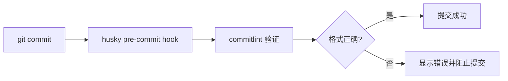

# 提交规范（Commit Convention）

本文档定义了 L2C 项目的 Git 提交信息规范，基于 [Conventional Commits](https://www.conventionalcommits.org/) 标准。

## 为什么需要规范？

- 📝 **自动生成 CHANGELOG**：统一的提交格式便于自动生成版本日志
- 🔍 **快速定位变更**：清晰的提交类型让历史记录一目了然
- 🤖 **自动化版本管理**：基于提交类型自动确定版本号升级规则
- 👥 **团队协作**：统一的规范降低沟通成本

## 提交信息格式

```
<类型>(<范围>): <主题>

<正文>

<页脚>
```

### 必需部分

#### 类型（type）

提交的类型，必须是以下之一：

| 类型 | 说明 | 示例 |
|------|------|------|
| `feat` | 新功能 | `feat: 添加用户登录功能` |
| `fix` | 错误修复 | `fix: 修复订单计算错误` |
| `docs` | 文档更新 | `docs: 更新 API 文档` |
| `style` | 代码格式（不影响代码运行） | `style: 格式化代码缩进` |
| `refactor` | 重构（既不是新功能也不是修复） | `refactor: 重构用户服务层` |
| `test` | 测试相关 | `test: 添加订单测试用例` |
| `chore` | 构建过程或辅助工具的变动 | `chore: 更新依赖包` |
| `perf` | 性能优化 | `perf: 优化数据库查询` |
| `ci` | CI/CD 配置变更 | `ci: 更新部署流程` |
| `build` | 构建系统或外部依赖变更 | `build: 升级 Next.js 到 15.0` |
| `revert` | 回退之前的提交 | `revert: 回退 feat: 添加XXX功能` |

#### 主题（subject）

- 简短描述，不超过 50 个字符
- 使用祈使句，现在时态："添加功能" 而不是 "添加了功能"
- 首字母小写
- 结尾不加句号

### 可选部分

#### 范围（scope）

说明提交影响的范围，可选但推荐使用。

**常用范围：**
- `auth` - 认证相关
- `order` - 订单相关
- `user` - 用户相关
- `lead` - 线索相关
- `install` - 安装相关
- `payment` - 支付相关
- `report` - 报表相关
- `api` - API 相关
- `ui` - 用户界面
- `db` - 数据库
- `config` - 配置相关

#### 正文（body）

- 详细描述改动的原因和内容
- 与主题空一行
- 可以分多段
- 每行不超过 72 个字符

#### 页脚（footer）

用于声明不兼容变更或关闭 Issue：

```
BREAKING CHANGE: <说明>
Closes #<issue号>
```

## 示例

### 基础示例

```bash
# 新功能
git commit -m "feat(auth): 添加手机号登录功能"

# 错误修复
git commit -m "fix(order): 修复订单金额计算错误"

# 文档更新
git commit -m "docs: 更新部署文档"

# 代码重构
git commit -m "refactor(user): 重构用户服务层代码"
```

### 包含正文的示例

```bash
git commit -m "feat(payment): 集成支付宝支付

添加支付宝支付接口集成
- 实现支付创建接口
- 实现支付回调处理
- 添加支付状态查询"
```

### 包含页脚的示例

```bash
git commit -m "feat(api): 更新用户 API 响应格式

将用户 API 的响应格式从蛇形命名改为驼峰命名

BREAKING CHANGE: 用户 API 响应格式已更改，客户端需要更新
Closes #123"
```

### 重大变更示例

```bash
git commit -m "feat(api)!: 重构 API 认证机制

BREAKING CHANGE: 所有 API 端点现在都需要 Authorization header"
```

## 自动化验证

项目已配置 **commitlint** 和 **husky**，在提交时会自动验证提交信息格式。

### 配置文件

位于 `slideboard-frontend/.commitlintrc.json`:

```json
{
  "extends": ["@commitlint/config-conventional"],
  "rules": {
    "type-enum": [
      2,
      "always",
      [
        "feat",
        "fix",
        "docs",
        "style",
        "refactor",
        "test",
        "chore",
        "perf",
        "ci",
        "build",
        "revert"
      ]
    ],
    "scope-case": [2, "always", "kebab-case"],
    "subject-case": [0]
  }
}
```

### 工作原理



当你执行 `git commit` 时：
1. Husky 会拦截提交
2. Commitlint 验证提交信息格式
3. 格式正确才允许提交
4. 格式错误会显示错误信息并阻止提交

### 测试提交信息

在项目 `slideboard-frontend` 目录下测试：

```bash
# 测试不符合规范的提交信息（应该失败）
echo "bad commit message" | npx commitlint

# 测试符合规范的提交信息（应该成功）
echo "feat: add new feature" | npx commitlint
```

## 常见错误与解决

### ❌ 错误：没有类型
```bash
git commit -m "添加用户登录功能"
```
**错误信息**：`subject may not be empty [subject-empty]`

**修正**：
```bash
git commit -m "feat: 添加用户登录功能"
```

### ❌ 错误：类型拼写错误
```bash
git commit -m "feature: 添加用户登录功能"
```
**错误信息**：`type must be one of [feat, fix, ...]`

**修正**：
```bash
git commit -m "feat: 添加用户登录功能"
```

### ❌ 错误：主题首字母大写
```bash
git commit -m "feat: Add user login"
```
**错误信息**：`subject must not be sentence-case`

**修正**：
```bash
git commit -m "feat: add user login"
```

### ❌ 错误：主题过长
```bash
git commit -m "feat: 添加了一个非常复杂的用户登录功能，包括手机号登录、邮箱登录、第三方登录等多种方式"
```
**错误信息**：`header must not be longer than 100 characters`

**修正**：
```bash
git commit -m "feat(auth): 添加多种登录方式

- 手机号登录
- 邮箱登录  
- 第三方登录"
```

## 最佳实践

### 1. 小步提交

每个提交只做一件事，避免一次性提交大量改动：

```bash
# ❌ 不好
git commit -m "feat: 添加用户模块、订单模块、支付功能"

# ✅ 好
git commit -m "feat(user): 添加用户管理模块"
git commit -m "feat(order): 添加订单管理模块"
git commit -m "feat(payment): 添加支付功能"
```

### 2. 提供足够的上下文

使用正文部分说明"为什么"而不仅仅是"做了什么"：

```bash
git commit -m "perf(query): 优化订单查询性能

原有的查询方式在订单数量超过 10000 时响应时间超过 3秒
通过添加复合索引将响应时间降低到 300ms 以内

- 在 orders 表添加 (user_id, created_at) 复合索引
- 优化查询 SQL，减少 JOIN 操作"
```

### 3. 关联 Issue

在页脚关联相关的 Issue：

```bash
git commit -m "fix(auth): 修复登录时的会话过期问题

用户在登录后 30 分钟会话会自动过期，现已修复

Closes #456"
```

### 4. 声明破坏性变更

重要的 API 或功能变更要明确标注：

```bash
git commit -m "feat(api)!: 更改用户 API 响应格式

BREAKING CHANGE: 
- 将所有字段从蛇形命名改为驼峰命名
- user_name -> userName
- created_at -> createdAt

客户端需要更新代码以适配新格式"
```

## 快捷命令

为常用的提交类型创建 Git 别名：

```bash
# 在 ~/.gitconfig 中添加
[alias]
    feat = "!f() { git commit -m \"feat: $1\"; }; f"
    fix = "!f() { git commit -m \"fix: $1\"; }; f"
    docs = "!f() { git commit -m \"docs: $1\"; }; f"
    chore = "!f() { git commit -m \"chore: $1\"; }; f"
```

使用方式：
```bash
git feat "添加新功能"
git fix "修复 Bug"
```

## 工具推荐

### 1. Commitizen

交互式提交工具，引导你创建符合规范的提交信息：

```bash
npm install -g commitizen
git cz  # 代替 git commit
```

### 2. VSCode 插件

- **Conventional Commits**: 提供 Conventional Commits 格式的代码片段
- **Git Lens**: 增强 Git 功能，更好地查看提交历史

## 参考资料

- [Conventional Commits 规范](https://www.conventionalcommits.org/)
- [Angular 提交规范](https://github.com/angular/angular/blob/master/CONTRIBUTING.md#commit)
- [commitlint 文档](https://commitlint.js.org/)
- [分支策略文档](file:///Users/laichangcheng/Documents/文稿%20-%20来长城的MacBook%20Air/trae/L2C/docs/BRANCH_STRATEGY.md)
