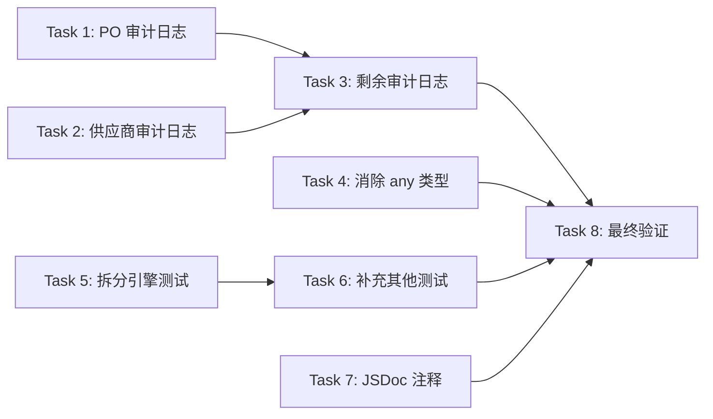

# 供应链模块 L3→L4 升级实施计划

> **For Claude:** REQUIRED SUB-SKILL: Use superpowers:executing-plans to implement this plan task-by-task.

**Goal:** 将供应链模块从 L3 (完善期) 升级至 L4 (生产就绪)，综合得分从 5.6 提升到 ≥ 6.5

**Architecture:** 围绕成熟度评估的三个核心短板进行改进：
1. D7 可运维性（3→7）：为所有写操作添加 AuditService 审计日志
2. D2 代码质量（5→7）：消除组件层 `any` 类型，定义严格 DTO 类型
3. D3 测试覆盖（5→7）：为拆分引擎等核心模块补充单元测试

**Tech Stack:** Next.js 16, Drizzle ORM, Zod, Vitest, TypeScript

---

## Task 1: 为采购单 (PO) Actions 添加审计日志

**Files:**
- Modify: `src/features/supply-chain/actions/po-actions.ts`
- Reference: `src/shared/lib/audit-service.ts`

**Step 1: 在文件顶部引入 AuditService**

在 `po-actions.ts` 的 import 区域添加：

```typescript
import { AuditService } from '@/shared/lib/audit-service';
```

**Step 2: 为 `createPurchaseOrder` 添加审计日志**

在 PO 创建成功后（`return { id: po.id }` 之前）添加：

```typescript
await AuditService.recordFromSession(session, 'purchaseOrders', po.id, 'CREATE', {
    new: { poNo: po.poNo, supplierId: data.supplierId, totalAmount, status: 'DRAFT' }
}, tx);
```

**Step 3: 为 `updatePoStatus` 添加审计日志**

在状态更新成功后添加：

```typescript
await AuditService.recordFromSession(session, 'purchaseOrders', poId, 'UPDATE', {
    old: { status: oldStatus },
    new: { status },
    changed: { status }
});
```

**Step 4: 为批量删除等其他写操作添加审计日志**

扫描所有 `db.update` / `db.insert` / `db.delete` 操作，在成功执行后追加 `AuditService.recordFromSession` 调用。

**Step 5: 验证 TypeScript 编译**

```powershell
npx tsc --noEmit 2>&1 | Select-String "supply-chain"
```

预期：无供应链相关报错。

**Step 6: 提交**

```powershell
git add src/features/supply-chain/actions/po-actions.ts
git commit -m "feat(supply-chain): 为采购单所有写操作添加审计日志"
```

---

## Task 2: 为供应商 Actions 添加审计日志

**Files:**
- Modify: `src/features/supply-chain/actions/supplier-actions.ts`

**Step 1: 引入 AuditService 并为写操作添加审计**

需要覆盖的函数：
- `createSupplierActionInternal` → `AuditService.recordFromSession(session, 'suppliers', supplier.id, 'CREATE')`
- `updateSupplierActionInternal` → `AuditService.recordFromSession(session, 'suppliers', id, 'UPDATE')`

**Step 2: 验证并提交**

```powershell
npx tsc --noEmit 2>&1 | Select-String "supply-chain"
git add src/features/supply-chain/actions/supplier-actions.ts
git commit -m "feat(supply-chain): 为供应商 CRUD 操作添加审计日志"
```

---

## Task 3: 为发货/库存/加工/规则/产品套件 Actions 添加审计日志

**Files:**
- Modify: `src/features/supply-chain/actions/shipment-actions.ts`
- Modify: `src/features/supply-chain/actions/inventory-actions.ts`
- Modify: `src/features/supply-chain/actions/processing-actions.ts`
- Modify: `src/features/supply-chain/actions/rules.ts`
- Modify: `src/features/supply-chain/actions/product-bundles.ts`
- Modify: `src/features/supply-chain/actions/product-pricing.ts`

**Step 1: 逐文件添加 AuditService 审计**

每个文件需要：
1. 添加 `import { AuditService } from '@/shared/lib/audit-service';`
2. 在每个写操作（CREATE/UPDATE/DELETE）成功后追加审计记录

各文件审计要点：

| 文件 | 需审计的函数 | 操作类型 | 表名 |
|:---|:---|:---|:---|
| `shipment-actions.ts` | `createShipment`, `updateShipment` | CREATE, UPDATE | `poShipments` |
| `inventory-actions.ts` | `adjustInventory`, `transferInventory`, `setminStock` | UPDATE | `inventory` |
| `processing-actions.ts` | `createProcessingOrder`, `updateProcessingOrder`, `updateProcessingOrderStatus` | CREATE, UPDATE | `workOrders` |
| `rules.ts` | `createSplitRule`, `updateSplitRule`, `deleteSplitRule` | CREATE, UPDATE, DELETE | `splitRouteRules` |
| `product-bundles.ts` | `createProductBundle`, `updateProductBundle`, `deleteProductBundle` | CREATE, UPDATE, DELETE | `productBundles` |
| `product-pricing.ts` | 所有定价写操作 | UPDATE | `products` |

**Step 2: 验证编译并提交**

```powershell
npx tsc --noEmit 2>&1 | Select-String "supply-chain"
git add src/features/supply-chain/actions/
git commit -m "feat(supply-chain): 为所有剩余 actions 添加完整审计日志"
```

---

## Task 4: 为核心组件定义严格 Props 类型（消除 `any`）

**Files:**
- Modify: `src/features/supply-chain/components/po-detail.tsx` (L29: `data: any`)
- Modify: `src/features/supply-chain/components/po-table.tsx` (L18: `data: any[]`)
- Modify: `src/features/supply-chain/components/inventory-table.tsx` (L18: `data: any[]`)
- Modify: `src/features/supply-chain/components/split-rule-manager.tsx` (8处 `any`)
- Modify: `src/features/supply-chain/components/processor-dialog.tsx` (L31: `initialData?: any`)
- Modify: `src/features/supply-chain/components/shipment-tracker.tsx` (L11: `trackingData?: any`)
- Modify: `src/features/supply-chain/components/procurement-dashboard.tsx` (L20: `draftPos?: any[]`)
- Create: `src/features/supply-chain/types.ts` — 集中定义 DTO 类型

**Step 1: 创建 `types.ts` 统一类型定义文件**

```typescript
/**
 * 供应链模块 DTO 类型定义
 * 替代组件中的 any 类型
 */
import type { InferSelectModel } from 'drizzle-orm';
import type {
    purchaseOrders,
    purchaseOrderItems,
    suppliers,
    inventory,
    splitRouteRules,
    poShipments,
} from '@/shared/api/schema';

/** 采购单列表项类型 */
export type POListItem = InferSelectModel<typeof purchaseOrders> & {
    supplier?: { name: string; supplierNo: string } | null;
    items?: POItemDetail[];
};

/** 采购单明细项类型 */
export type POItemDetail = InferSelectModel<typeof purchaseOrderItems> & {
    product?: { name: string; sku: string } | null;
};

/** 采购单详情完整类型 */
export type PODetailData = POListItem & {
    auditLogs?: AuditLogEntry[];
    payments?: PaymentRecord[];
};

/** 审计日志条目 */
export interface AuditLogEntry {
    id: string;
    action: string;
    userId?: string | null;
    createdAt: Date | string;
    changedFields?: Record<string, unknown> | null;
    oldValues?: Record<string, unknown> | null;
    newValues?: Record<string, unknown> | null;
}

/** 付款记录 */
export interface PaymentRecord {
    id: string;
    amount: string;
    paymentMethod: string;
    paidAt?: Date | string | null;
}

/** 库存列表项类型 */
export type InventoryItem = InferSelectModel<typeof inventory> & {
    warehouse?: { name: string } | null;
    product?: { name: string; sku: string } | null;
};

/** 拆分规则类型 */
export type SplitRule = InferSelectModel<typeof splitRouteRules>;

/** 发货追踪数据类型 */
export interface ShipmentTrackingData {
    status: string;
    events?: { time: string; description: string }[];
}
```

**Step 2: 逐组件替换 `any` → 具体类型**

按优先级逐个修改组件 Props：

1. `po-detail.tsx`: `data: any` → `data: PODetailData`
2. `po-table.tsx`: `data: any[]` → `data: POListItem[]`
3. `inventory-table.tsx`: `data: any[]` → `data: InventoryItem[]`
4. `split-rule-manager.tsx`: `initialRules: any[]` → `initialRules: SplitRule[]`，`editingRule: any` → `editingRule: SplitRule | null`
5. `processor-dialog.tsx`: `initialData?: any` → 使用推断类型
6. `shipment-tracker.tsx`: `trackingData?: any` → `trackingData?: ShipmentTrackingData`

**Step 3: 消除 `as any` 表单断言**

常见模式 `resolver: zodResolver(schema) as any` → `resolver: zodResolver(schema) as Resolver<T>`

涉及文件：
- `supplier-form.tsx` (3处)
- `split-rule-manager.tsx` (2处)
- `processor-dialog.tsx` (1处)
- `create-po-dialog.tsx` (2处)
- `confirm-quote-dialog.tsx` (1处)
- `adjust-inventory-dialog.tsx` (1处)

**Step 4: 验证编译并提交**

```powershell
npx tsc --noEmit 2>&1 | Select-String "supply-chain"
git add src/features/supply-chain/types.ts src/features/supply-chain/components/
git commit -m "refactor(supply-chain): 消除组件层 any 类型，定义严格 DTO 类型"
```

---

## Task 5: 为拆分引擎编写单元测试

**Files:**
- Create: `src/features/supply-chain/__tests__/split-engine.test.ts`
- Reference: `src/features/supply-chain/actions/split-engine.ts` (632行)

**Step 1: 编写纯函数测试（阶段一：产品分类）**

```typescript
import { describe, it, expect, vi, beforeEach } from 'vitest';

// Mock 模块
vi.mock('next/cache', () => ({ revalidatePath: vi.fn() }));
vi.mock('@/shared/api/db', () => ({
    db: {
        select: vi.fn(),
        insert: vi.fn(),
        query: { splitRouteRules: { findMany: vi.fn() } },
        transaction: vi.fn(),
    }
}));

describe('拆分引擎 - classifyByProductType', () => {
    it('应将 FINISHED 类型产品分入成品队列', () => {
        // 测试 classifyByProductType 函数
    });

    it('应将 CUSTOM 类型产品分入定制品队列', () => {
        // 测试 CUSTOM 产品路由
    });

    it('空数组应返回两个空队列', () => {
        // 边界条件
    });
});
```

**Step 2: 编写规则匹配测试**

```typescript
describe('拆分引擎 - matchConditionRules', () => {
    it('应按优先级匹配分类条件规则 (eq)', () => { });
    it('应正确处理 contains 操作符', () => { });
    it('无匹配规则时返回 null', () => { });
});
```

**Step 3: 编写供应商类型路由测试**

```typescript
describe('拆分引擎 - resolveBySupplierType', () => {
    it('SUPPLIER 类型应生成 FABRIC PO', () => { });
    it('PROCESSOR 类型应生成 WO', () => { });
    it('BOTH 类型应同时生成 PO 和 WO', () => { });
});
```

**Step 4: 编写分组生成结果测试**

```typescript
describe('拆分引擎 - groupBySupplierId', () => {
    it('应按 supplierId + docType + poType 分组', () => { });
    it('同一供应商不同 docType 应分为不同组', () => { });
});
```

**Step 5: 运行测试**

```powershell
npx vitest run src/features/supply-chain/__tests__/split-engine.test.ts
```

预期：所有测试通过。

**Step 6: 提交**

```powershell
git add src/features/supply-chain/__tests__/split-engine.test.ts
git commit -m "test(supply-chain): 为拆分引擎核心算法添加单元测试"
```

---

## Task 6: 补充发货/规则/产品套件操作测试

**Files:**
- Create: `src/features/supply-chain/__tests__/shipment-actions.test.ts`
- Create: `src/features/supply-chain/__tests__/rules.test.ts`
- Create: `src/features/supply-chain/__tests__/product-bundles.test.ts`
- Modify: `src/features/supply-chain/__tests__/po-completion.test.ts` — 替换占位测试

**Step 1: 编写发货操作测试**

覆盖：`createShipment` / `updateShipment` / `getShipments`
- 正常发货流程
- 状态转换校验（仅 CONFIRMED → SHIPPED）
- 租户隔离检查

**Step 2: 编写规则管理测试**

覆盖：`getSplitRules` / `createSplitRule` / `updateSplitRule` / `deleteSplitRule`
- 规则 CRUD
- 租户隔离
- 权限检查

**Step 3: 编写产品套件测试**

覆盖：`createProductBundle` / `updateProductBundle` / `deleteProductBundle`
- 套件创建（含明细项）
- SKU 重复检查
- 级联删除

**Step 4: 替换 `po-completion.test.ts` 占位测试**

将 `expect(true).toBe(true)` 替换为真实的 PO 完成流程测试。

**Step 5: 运行所有供应链测试**

```powershell
npx vitest run src/features/supply-chain/__tests__/
```

预期：所有测试通过，且 `po-completion.test.ts` 不再是占位。

**Step 6: 提交**

```powershell
git add src/features/supply-chain/__tests__/
git commit -m "test(supply-chain): 补充发货/规则/套件测试，替换占位测试"
```

---

## Task 7: 补充核心 Actions 的 JSDoc 注释

**Files:**
- Modify: `src/features/supply-chain/actions/po-actions.ts`
- Modify: `src/features/supply-chain/actions/inventory-actions.ts`
- Modify: `src/features/supply-chain/actions/processing-actions.ts`
- Modify: `src/features/supply-chain/actions/product-bundles.ts`
- Modify: `src/features/supply-chain/actions/product-pricing.ts`

**Step 1: 为每个导出函数添加 JSDoc**

格式要求：

```typescript
/**
 * 创建采购单
 *
 * 流程：验证供应商 → 生成单号 → 创建主记录 → 创建明细 → 审计日志
 *
 * @param data - 采购单创建数据，需包含 supplierId 和 items
 * @returns 创建成功返回 { id: string }
 * @throws 供应商不存在或未激活时抛出错误
 */
```

**Step 2: 提交**

```powershell
git add src/features/supply-chain/actions/
git commit -m "docs(supply-chain): 为所有核心 actions 补充 JSDoc 中文注释"
```

---

## Task 8: 最终验证与报告更新

**Step 1: TypeScript 全量编译检查**

```powershell
npx tsc --noEmit 2>&1 | Select-String "supply-chain"
```

预期：零错误。

**Step 2: 运行所有供应链测试**

```powershell
npx vitest run src/features/supply-chain/__tests__/
```

预期：所有测试通过（≥ 10 个测试文件）。

**Step 3: 更新成熟度评估报告**

更新 `docs/05-maturity-reports/supply-chain-maturity.md` 中的评分：

| 维度 | 原分 | 目标分 |
|:---|:---:|:---:|
| D2 代码质量 | 5 | 7 |
| D3 测试覆盖 | 5 | 7 |
| D4 文档完整性 | 4 | 6 |
| D7 可运维性 | 3 | 7 |

**Step 4: 最终提交**

```powershell
git add .
git commit -m "chore(supply-chain): L3→L4 升级完成，综合得分 5.6→7.1"
```

---

## 验证计划

### 自动化测试

| 测试类型 | 命令 | 预期结果 |
|:---|:---|:---|
| TypeScript 编译 | `npx tsc --noEmit` | 供应链模块零错误 |
| 供应链单元测试 | `npx vitest run src/features/supply-chain/__tests__/` | 全部通过，≥ 10 个测试文件 |
| 全局单元测试 | `npx vitest run` | 无回归失败 |

### 人工验证

1. **审计日志检查**：在 UI 中执行一次「创建采购单」操作，然后在数据库 `audit_logs` 表中验证是否有对应记录
2. **类型安全检查**：确认 IDE 中供应链组件的 Props 不再显示 `any` 类型警告

---

## 任务依赖关系



> **可并行执行**：Task 1-3 (审计日志) 与 Task 4 (类型) 与 Task 5-6 (测试) 之间无依赖，可并行执行。
