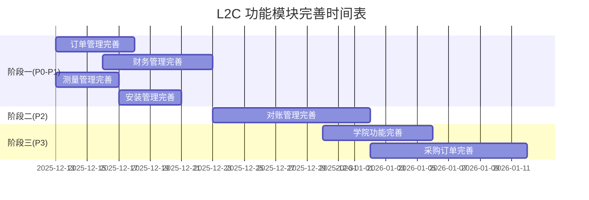

# L2C 功能模块完善详细工作计划

> **制定日期**: 2025-12-12  
> **项目经理**: PM视角  
> **计划周期**: 4-6周  
> **目标**: 将未完成模块提升至95%+完成度

---

## 📊 项目概览

### 待完善模块现状

| 模块 | 当前完成度 | 目标完成度 | 优先级 | 预计工作量 |
|------|-----------|-----------|--------|-----------|
| 📋 订单管理 (Orders) | 95% | 98% | P0 | 3-5天 |
| 💳 财务管理 (Finance) | 85% | 95% | P1 | 5-7天 |
| 📏 测量管理 (Measurement) | 90% | 95% | P1 | 3-4天 |
| 🔧 安装管理 (Installations) | 90% | 95% | P1 | 3-4天 |
| 📝 对账管理 (Reconciliation) | 60% | 90% | P2 | 7-10天 |
| 🏫 学院功能 (Academy) | 70% | 85% | P3 | 5-7天 |
| 🛒 采购订单 (Purchase Orders) | 50% | 80% | P3 | 8-10天 |

**总工作量估算**: 34-47天（并行执行约4-6周）

---

## 🎯 阶段一: 核心功能完善 (P0-P1, 2-3周)

### 1. 订单管理完善 (95% → 98%, P0, 3-5天)

#### 1.1 当前缺口分析
- ⚠️ 订单状态流转有5%边界情况未处理
- ⚠️ 批量操作功能不完整
- ⚠️ 订单审批流程缺少超时处理

#### 1.2 详细任务清单

**Day 1: 状态流转完善**
- [ ] **任务 1.1**: 补充订单状态流转边界情况处理
  - 处理订单取消后的回滚逻辑
  - 处理订单修改时的状态验证
  - 处理并发修改冲突
  - **交付物**: `src/services/salesOrders.client.ts` 更新
  - **验收**: 边界情况测试通过，覆盖率>95%

- [ ] **任务 1.2**: 添加状态流转审计日志
  - 记录每次状态变更的操作人和原因
  - 实现状态变更历史查询API
  - **交付物**: `supabase/migrations/xxx_order_status_audit.sql`
  - **验收**: 每次状态变更都有完整审计记录

**Day 2-3: 批量操作功能**
- [ ] **任务 1.3**: 实现订单批量操作
  - 批量分配销售人员
  - 批量修改订单状态
  - 批量导出订单数据
  - **交付物**: `src/features/orders/components/BulkActionsMenu.tsx`
  - **验收**: 支持同时操作100+订单

- [ ] **任务 1.4**: 批量操作进度提示
  - 实现进度条组件
  - 支持操作取消
  - 失败重试机制
  - **交付物**: `src/components/BulkOperationProgress.tsx`
  - **验收**: 用户体验流畅，失败有明确提示

**Day 4-5: 审批超时处理**
- [ ] **任务 1.5**: 订单审批超时机制
  - 配置审批超时时间（默认24小时）
  - 超时自动升级到上级审批
  - 超时通知提醒
  - **交付物**: `supabase/functions/order-approval-timeout`
  - **验收**: 超时订单自动处理，通知发送成功

**验收标准**:
- ✅ 订单状态流转覆盖所有边界情况
- ✅ 批量操作稳定支持100+订单
- ✅ 审批超时自动处理
- ✅ 单元测试覆盖率 ≥ 95%
- ✅ E2E测试覆盖核心流程

---

### 2. 财务管理完善 (85% → 95%, P1, 5-7天)

#### 2.1 当前缺口分析
- ⚠️ 财务报表功能不完整（缺少15%高级报表）
- ⚠️ 发票管理缺失
- ⚠️ 账期管理不完善
- ⚠️ 财务权限控制需加强

#### 2.2 详细任务清单

**Day 1-2: 财务报表增强**
- [ ] **任务 2.1**: 销售收入报表
  - 按时间维度（日/周/月/季/年）统计
  - 按销售人员维度统计
  - 按产品类别维度统计
  - 支持数据导出（Excel/PDF）
  - **交付物**: `src/features/finance/pages/SalesReportPage.tsx`
  - **验收**: 报表数据准确，性能 < 2秒

- [ ] **任务 2.2**: 利润分析报表
  - 毛利率分析
  - 产品利润率排行
  - 客户利润贡献分析
  - **交付物**: `src/features/finance/pages/ProfitAnalysisPage.tsx`
  - **验收**: 计算准确，可视化清晰

- [ ] **任务 2.3**: 应收账款报表
  - 账龄分析
  - 逾期提醒
  - 回款预测
  - **交付物**: `src/features/finance/pages/ReceivablesPage.tsx`
  - **验收**: 账龄统计准确，预警及时

**Day 3-4: 发票管理**
- [ ] **任务 2.4**: 发票管理CRUD
  - 创建发票记录
  - 关联订单或对账单
  - 发票状态管理（草稿/已开/已作废）
  - 发票号自动生成
  - **交付物**: 
    - `supabase/migrations/xxx_invoices_table.sql`
    - `src/services/invoices.client.ts`
    - `src/features/finance/pages/InvoicesPage.tsx`
  - **验收**: 发票CRUD功能完整，编号唯一

- [ ] **任务 2.5**: 发票模板和打印
  - 设计发票模板（增值税发票格式）
  - 实现PDF生成
  - 支持批量打印
  - **交付物**: `src/features/finance/components/InvoiceTemplate.tsx`
  - **验收**: PDF格式符合规范，打印清晰

**Day 5-6: 账期管理**
- [ ] **任务 2.6**: 账期配置
  - 客户级别账期设置（如：净30天、净60天）
  - 订单级别账期覆盖
  - 账期到期提醒
  - **交付物**: `src/features/finance/components/PaymentTermsConfig.tsx`
  - **验收**: 账期计算准确，到期提醒及时

- [ ] **任务 2.7**: 回款管理
  - 记录回款计划
  - 记录实际回款
  - 回款进度跟踪
  - 逾期预警
  - **交付物**: `src/features/finance/pages/PaymentTrackingPage.tsx`
  - **验收**: 回款数据完整，预警准确

**Day 7: 财务权限加强**
- [ ] **任务 2.8**: 财务数据权限控制
  - 实现RLS策略：只有财务人员可见敏感数据
  - 脱敏显示：非财务人员看到的金额脱敏
  - 操作审计：所有财务操作记录审计日志
  - **交付物**: 
    - `supabase/migrations/xxx_finance_rls.sql`
    - `src/lib/permissions/financePermissions.ts`
  - **验收**: 权限隔离严格，审计完整

**验收标准**:
- ✅ 财务报表覆盖销售、利润、应收三大维度
- ✅ 发票管理功能完整，支持PDF导出
- ✅ 账期管理准确，到期提醒及时
- ✅ 财务权限控制严格，数据安全
- ✅ 单元测试覆盖率 ≥ 90%

---

### 3. 测量管理完善 (90% → 95%, P1, 3-4天)

#### 3.1 当前缺口分析
- ⚠️ 测量模板功能基础，缺少自定义字段
- ⚠️ 测量数据导出格式单一
- ⚠️ 测量照片上传和管理需优化

#### 3.2 详细任务清单

**Day 1-2: 测量模板增强**
- [ ] **任务 3.1**: 自定义测量字段
  - 支持添加自定义测量项
  - 支持不同产品类型的专属测量模板
  - 模板版本管理
  - **交付物**: `src/features/measurement/pages/TemplateEditorPage.tsx`
  - **验收**: 可灵活自定义测量项，模板可复用

- [ ] **任务 3.2**: 测量计算公式
  - 支持字段间计算（如：面积 = 长 × 宽）
  - 支持条件逻辑（如：窗帘类型不同，测量项不同）
  - **交付物**: `src/lib/measurement/calculationEngine.ts`
  - **验收**: 计算准确，公式可配置

**Day 3: 测量数据导出优化**
- [ ] **任务 3.3**: 多格式导出
  - 支持导出为Word文档（带测量示意图）
  - 支持导出为Excel表格
  - 支持导出为PDF（给客户确认）
  - **交付物**: `src/features/measurement/utils/exportMeasurement.ts`
  - **验收**: 三种格式导出正常，格式规范

**Day 4: 测量照片优化**
- [ ] **任务 3.4**: 照片上传优化
  - 支持移动端拍照直传
  - 图片自动压缩（减少存储成本）
  - 照片标注功能（在照片上标记测量位置）
  - 照片分类管理（客厅/卧室/书房等）
  - **交付物**: 
    - `src/features/measurement/components/PhotoUploader.tsx`
    - `src/features/measurement/components/PhotoAnnotation.tsx`
  - **验收**: 上传流畅，标注清晰，分类有序

**验收标准**:
- ✅ 测量模板支持自定义，满足不同产品需求
- ✅ 测量数据可导出为Word/Excel/PDF
- ✅ 照片上传优化，支持标注
- ✅ 单元测试覆盖率 ≥ 90%

---

### 4. 安装管理完善 (90% → 95%, P1, 3-4天)

#### 4.1 当前缺口分析
- ⚠️ 安装反馈和评价机制不完善
- ⚠️ 安装问题追踪缺失
- ⚠️ 安装质检流程需加强

#### 4.2 详细任务清单

**Day 1-2: 安装反馈系统**
- [ ] **任务 4.1**: 客户满意度评价
  - 安装完成后自动发送评价邀请（短信/微信）
  - 客户评分（1-5星）
  - 客户评语
  - 照片上传（展示安装效果）
  - **交付物**: `src/features/installations/pages/CustomerFeedbackPage.tsx`
  - **验收**: 评价流程流畅，数据完整

- [ ] **任务 4.2**: 技师评价系统
  - 根据客户评价给技师打分
  - 技师排行榜
  - 差评预警和改进跟踪
  - **交付物**: `src/features/installations/pages/TechnicianRankingPage.tsx`
  - **验收**: 评分准确，激励技师提升服务

**Day 3: 安装问题追踪**
- [ ] **任务 4.3**: 安装问题工单
  - 记录安装中发现的问题（如：尺寸不符、产品瑕疵）
  - 问题分类（产品问题/测量问题/其他）
  - 问题处理流程（上报→处理→验收→关闭）
  - 问题统计分析
  - **交付物**: 
    - `supabase/migrations/xxx_installation_issues.sql`
    - `src/features/installations/pages/IssuesManagementPage.tsx`
  - **验收**: 问题闭环管理，统计准确

**Day 4: 安装质检流程**
- [ ] **任务 4.4**: 质检checklist
  - 定义质检项目（如：窗帘平整度、安装牢固度）
  - 质检员现场打分
  - 不合格项整改要求
  - **交付物**: `src/features/installations/components/QualityChecklistForm.tsx`
  - **验收**: 质检项目完整，流程严格

- [ ] **任务 4.5**: 质检报告
  - 生成质检报告（PDF）
  - 客户签字确认
  - 质检数据看板
  - **交付物**: `src/features/installations/pages/QualityReportPage.tsx`
  - **验收**: 报告格式规范，数据可视化

**验收标准**:
- ✅ 客户评价系统完善，数据收集完整
- ✅ 安装问题可追踪，闭环管理
- ✅ 质检流程严格，报告规范
- ✅ 单元测试覆盖率 ≥ 90%

---

## 🎯 阶段二: 扩展功能开发 (P2, 2-3周)

### 5. 对账管理完善 (60% → 90%, P2, 7-10天)

#### 5.1 当前缺口分析
- ⚠️ 自动对账规则引擎缺失（40%缺口的主要原因）
- ⚠️ 对账异常处理流程不完善
- ⚠️ 财务勾稽关系验证不足

#### 5.2 详细任务清单

**Day 1-3: 自动对账引擎**
- [ ] **任务 5.1**: 对账规则配置
  - 定义对账规则（如：订单金额 = 已收款 + 应收款）
  - 支持多种对账维度（按订单/按客户/按时间段）
  - 规则优先级和冲突处理
  - **交付物**: 
    - `supabase/migrations/xxx_reconciliation_rules.sql`
    - `src/services/reconciliation.client.ts`
  - **验收**: 规则配置灵活，计算准确

- [ ] **任务 5.2**: 自动对账执行
  - 定时任务：每日自动对账
  - 实时对账：订单状态变化时触发
  - 对账结果记录
  - **交付物**: `supabase/functions/auto-reconciliation`
  - **验收**: 自动对账准确，性能良好（1000单 < 30秒）

**Day 4-5: 对账异常处理**
- [ ] **任务 5.3**: 异常检测
  - 金额不匹配预警
  - 长期未对账订单提醒
  - 重复对账检测
  - **交付物**: `src/features/reconciliation/utils/anomalyDetection.ts`
  - **验收**: 异常检测准确率 > 95%

- [ ] **任务 5.4**: 异常处理流程
  - 异常单据标记
  - 分配处理人员
  - 处理进度跟踪
  - 处理结果审核
  - **交付物**: `src/features/reconciliation/pages/AnomaliesPage.tsx`
  - **验收**: 异常处理闭环，有审计记录

**Day 6-8: 财务勾稽验证**
- [ ] **任务 5.5**: 三表勾稽
  - 订单表 ↔ 财务表 勾稽
  - 发票表 ↔ 收款表 勾稽
  - 对账表 ↔ 总账 勾稽
  - **交付物**: `src/features/reconciliation/utils/crossValidation.ts`
  - **验收**: 勾稽关系严密，差异 < 0.01%

- [ ] **任务 5.6**: 对账报告**
  - 生成月度对账报告
  - 包含：对账汇总、异常明细、处理情况
  - 支持导出和打印
  - **交付物**: `src/features/reconciliation/pages/ReconciliationReportPage.tsx`
  - **验收**: 报告完整准确，符合财务规范

**Day 9-10: 对账审批和确认**
- [ ] **任务 5.7**: 对账审批流程
  - 财务人员发起对账
  - 客户确认（B端客户）
  - 差异协商和调整
  - 双方签字确认
  - **交付物**: `src/features/reconciliation/pages/ApprovalWorkflow.tsx`
  - **验收**: 审批流程完整，记录可追溯

**验收标准**:
- ✅ 自动对账引擎运行稳定，准确率 > 99%
- ✅ 异常检测和处理闭环
- ✅ 财务勾稽关系验证完整
- ✅ 对账报告规范，支持审批
- ✅ 单元测试覆盖率 ≥ 85%

---

## 🎯 阶段三: 增值功能开发 (P3, 2-3周)

### 6. 学院功能完善 (70% → 85%, P3, 5-7天)

#### 6.1 当前缺口分析
- ⚠️ 课程内容不完整（30%缺口）
- ⚠️ 学习进度跟踪缺失
- ⚠️ 考试和认证系统未实现

#### 6.2 详细任务清单

**Day 1-2: 课程内容管理**
- [ ] **任务 6.1**: 课程CRUD
  - 创建课程（标题、描述、分类）
  - 上传课程资料（视频/PDF/PPT）
  - 课程章节管理
  - 课程发布/下架
  - **交付物**: 
    - `supabase/migrations/xxx_academy_courses.sql`
    - `src/features/academy/pages/CourseManagementPage.tsx`
  - **验收**: 课程管理功能完整

- [ ] **任务 6.2**: 课程内容展示
  - 课程列表（支持分类筛选）
  - 课程详情页（视频播放、资料下载）
  - 课程评价和收藏
  - **交付物**: `src/features/academy/pages/CourseDetailPage.tsx`
  - **验收**: 页面美观，播放流畅

**Day 3-4: 学习进度跟踪**
- [ ] **任务 6.3**: 学习记录
  - 记录用户观看进度
  - 记录学习时长
  - 标记已完成章节
  - **交付物**: `src/services/learningProgress.client.ts`
  - **验收**: 进度记录准确，可断点续播

- [ ] **任务 6.4**: 学习统计
  - 个人学习报告（完成课程数、学习时长）
  - 团队学习排行榜
  - 课程完成率统计
  - **交付物**: `src/features/academy/pages/LearningStatsPage.tsx`
  - **验收**: 统计准确，可视化清晰

**Day 5-7: 考试和认证**
- [ ] **任务 6.5**: 题库管理
  - 创建试题（单选/多选/判断）
  - 试题分类和难度标记
  - 试题导入导出
  - **交付物**: `src/features/academy/pages/QuestionBankPage.tsx`
  - **验收**: 题库管理方便，格式规范

- [ ] **任务 6.6**: 在线考试
  - 创建试卷（从题库抽题或手动组卷）
  - 考试时长限制
  - 自动批改（选择题）
  - 成绩查询
  - **交付物**: `src/features/academy/pages/ExamPage.tsx`
  - **验收**: 考试流程流畅，防作弊

- [ ] **任务 6.7**: 证书颁发
  - 考试合格自动颁发证书
  - 证书模板设计
  - 证书下载和打印
  - 证书真伪查询
  - **交付物**: `src/features/academy/components/CertificateTemplate.tsx`
  - **验收**: 证书美观，可验真

**验收标准**:
- ✅ 课程管理功能完整，内容丰富
- ✅ 学习进度准确跟踪
- ✅ 考试系统完善，证书规范
- ✅ 单元测试覆盖率 ≥ 80%

---

### 7. 采购订单完善 (50% → 80%, P3, 8-10天)

#### 7.1 当前缺口分析
- ⚠️ 采购流程不完整（缺少50%核心功能）
- ⚠️ 供应商管理缺失
- ⚠️ 采购价格管理不足
- ⚠️ 入库和库存同步未实现

#### 7.2 详细任务清单

**Day 1-2: 采购流程完善**
- [ ] **任务 7.1**: 采购申请
  - 创建采购申请（产品、数量、需求日期）
  - 采购申请审批
  - 自动生成采购订单
  - **交付物**: `src/features/purchase-orders/pages/PurchaseRequestPage.tsx`
  - **验收**: 申请流程顺畅，审批及时

- [ ] **任务 7.2**: 采购订单管理
  - 订单状态管理（待确认/已确认/已发货/已到货/已入库）
  - 订单修改和取消
  - 订单跟踪
  - **交付物**: `src/features/purchase-orders/pages/PurchaseOrdersPage.tsx`
  - **验收**: 订单状态流转准确

**Day 3-4: 供应商管理**
- [ ] **任务 7.3**: 供应商档案
  - 创建供应商（名称、联系方式、地址）
  - 供应商分类（主供应商/备选供应商）
  - 供应商评级
  - **交付物**: 
    - `supabase/migrations/xxx_suppliers.sql`
    - `src/features/purchase-orders/pages/SuppliersPage.tsx`
  - **验收**: 供应商信息完整

- [ ] **任务 7.4**: 供应商绩效
  - 记录交货准时率
  - 记录产品质量合格率
  - 供应商排行榜
  - **交付物**: `src/features/purchase-orders/pages/SupplierPerformancePage.tsx`
  - **验收**: 绩效统计准确，可作为选择供应商依据

**Day 5-6: 采购价格管理**
- [ ] **任务 7.5**: 产品采购价
  - 维护产品采购价（支持不同供应商价格不同）
  - 采购价历史记录
  - 价格对比分析
  - **交付物**: `src/features/purchase-orders/pages/PurchasePricingPage.tsx`
  - **验收**: 价格维护方便，历史可追溯

- [ ] **任务 7.6**: 采购成本分析
  - 产品采购成本趋势
  - 供应商价格对比
  - 采购优化建议
  - **交付物**: `src/features/purchase-orders/pages/CostAnalysisPage.tsx`
  - **验收**: 分析准确，优化建议合理

**Day 7-9: 入库和库存同步**
- [ ] **任务 7.7**: 采购入库
  - 创建入库单（关联采购订单）
  - 入库验收（数量/质量检查）
  - 不合格品处理（退货/换货）
  - **交付物**: 
    - `supabase/migrations/xxx_purchase_receipts.sql`
    - `src/features/purchase-orders/pages/ReceiptsPage.tsx`
  - **验收**: 入库流程严格，记录完整

- [ ] **任务 7.8**: 库存自动更新
  - 入库单确认后自动增加库存
  - 库存变动记录
  - 库存预警（低库存/超库存）
  - **交付物**: `supabase/functions/update-inventory-on-receipt`
  - **验收**: 库存数据准确，实时同步

**Day 10: 采购报表**
- [ ] **任务 7.9**: 采购统计报表
  - 采购金额统计（按时间/按供应商/按产品）
  - 采购周期分析
  - 采购效率分析
  - **交付物**: `src/features/purchase-orders/pages/PurchaseReportsPage.tsx`
  - **验收**: 报表数据准确，维度丰富

**验收标准**:
- ✅ 采购流程完整（申请→订单→入库）
- ✅ 供应商管理规范，绩效可追踪
- ✅ 采购价格维护完善，成本可分析
- ✅ 入库自动更新库存，数据准确
- ✅ 单元测试覆盖率 ≥ 75%

---

## 📅 整体时间规划

### 甘特图（4-6周并行执行）

### 里程碑

| 里程碑 | 日期 | 交付成果 |
|--------|------|----------|
| M1: 阶段一完成 (P0-P1) | 2025-12-27 | 订单、财务、测量、安装 4个模块达95%+ |
| M2: 阶段二完成 (P2) | 2026-01-08 | 对账模块达90%+ |
| M3: 阶段三完成 (P3) | 2026-01-17 | 学院、采购 2个模块达80%+ |
| M4: 整体验收 | 2026-01-20 | 所有模块达成目标，系统整体上线 |

---

## 👥 资源分配

### 团队配置建议

| 角色 | 人数 | 职责 |
|------|------|------|
| 前端工程师 | 2人 | 负责页面开发和组件实现 |
| 后端工程师 | 2人 | 负责API、数据库和Edge Functions |
| 测试工程师 | 1人 | 负责测试用例编写和质量保障 |
| UI设计师 | 1人 | 负责新增页面的UI设计 |
| 产品经理 | 1人 | 负责需求澄清和验收 |

### 工作量分配

**阶段一** (P0-P1, 2-3周):
- 前端工程师: 订单UI + 财务UI + 测量UI + 安装UI
- 后端工程师: 财务逻辑 + 对账引擎基础 + 各模块API
- 测试工程师: 编写测试用例，覆盖核心流程

**阶段二** (P2, 2-3周):
- 前端工程师: 对账UI + 异常处理UI
- 后端工程师: 自动对账引擎 + 勾稽验证逻辑
- 测试工程师: 对账准确性测试、性能测试

**阶段三** (P3, 2-3周):
- 前端工程师: 学院UI + 采购UI
- 后端工程师: 视频播放服务 + 库存同步逻辑
- 测试工程师: 全面回归测试

---

## 🔍 风险管理

### 风险识别与应对

| 风险 | 概率 | 影响 | 应对措施 |
|------|------|------|----------|
| 对账引擎算法复杂度超预期 | 中 | 高 | 提前技术预研，必要时引入第三方库 |
| 财务报表性能问题 | 中 | 中 | 优化SQL查询，使用物化视图 |
| 学院视频存储成本高 | 低 | 中 | 使用CDN，视频压缩优化 |
| 采购库存同步逻辑复杂 | 中 | 高 | 使用事务保证数据一致性 |
| 团队资源不足 | 低 | 高 | 优先级排序，P3功能可延后 |

---

## ✅ 总体验收标准

### 功能验收
- ✅ 所有P0-P1模块完成度 ≥ 95%
- ✅ P2模块完成度 ≥ 90%
- ✅ P3模块完成度 ≥ 80%
- ✅ 核心业务流程E2E测试通过
- ✅ 无P0/P1级别bug

### 性能验收
- ✅ 页面加载时间 < 2秒
- ✅ API响应时间 < 500ms (P95)
- ✅ 批量操作支持100+条数据
- ✅ 自动对账1000单 < 30秒

### 质量验收
- ✅ 单元测试覆盖率 ≥ 80%
- ✅ E2E测试覆盖核心流程
- ✅ 代码Review通过率 100%
- ✅ 无安全漏洞

### 文档验收
- ✅ 用户操作手册完善
- ✅ API文档完整
- ✅ 数据库设计文档更新
- ✅ 运维部署文档完整

---

## 📊 进度监控

### 周度检查点

**每周五下午**: 
1. 回顾本周完成情况
2. 识别阻塞问题
3. 调整下周计划

### 监控指标

- **进度偏差**: 实际进度 vs 计划进度
- **质量指标**: Bug数量、测试覆盖率
- **风险状态**: 新增风险、风险缓解进展

---

**计划制定**: 2025-12-12  
**计划执行**: 2025-12-13 开始  
**预计完成**: 2026-01-20  
**项目经理**: PM Team
