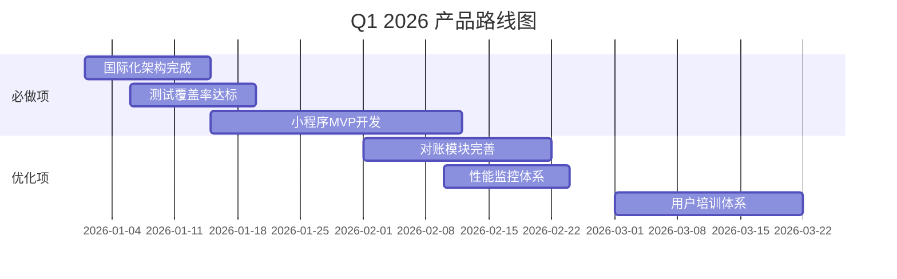
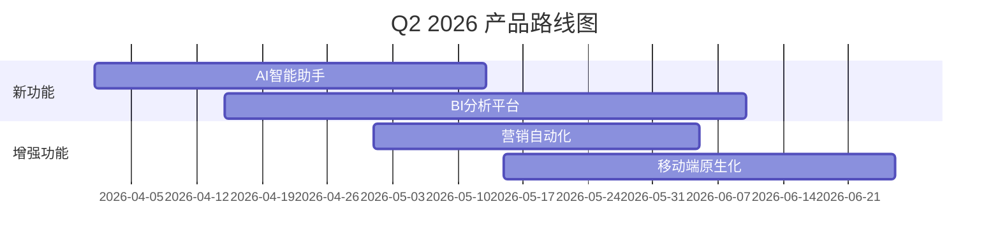
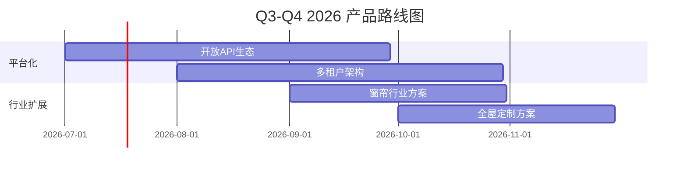

# L2C 产品评估报告

> **评估日期**: 2025-12-12  
> **评估人**: 产品经理视角  
> **项目版本**: v1.0.2  
> **项目阶段**: 生产环境就绪，进入长期优化阶段

---

## 📋 目录

1. [产品概况与定位](#1-产品概况与定位)
2. [核心功能完整性评估](#2-核心功能完整性评估)
3. [技术架构合理性分析](#3-技术架构合理性分析)
4. [产品优势与亮点](#4-产品优势与亮点)
5. [存在的问题与风险](#5-存在的问题与风险)
6. [改进建议与优化方向](#6-改进建议与优化方向)
7. [产品路线图建议](#7-产品路线图建议)

---

## 1. 产品概况与定位

### 1.1 产品定位

**L2C (Lead to Customer) 线索管理系统** 是一个**现代化的销售线索管理平台**，专注于从线索获取到客户转化的全流程管理。

**目标用户**:
- 🏢 **B端用户**: 装企、工程渠道商
- 👥 **C端用户**: 个人消费者
- 👔 **内部用户**: 销售团队、订单客服、测量/安装技师、管理层

**核心价值主张**:
1. **全流程管理**: 线索 → 报价 → 订单 → 测量 → 安装 → 对账
2. **多角色协作**: 7种用户类型（远程销售、驻店销售、销售负责人、订单客服、派单员、测量技师、安装技师）
3. **智能化运营**: 智能分配、状态流转、数据分析、积分激励
4. **多端访问**: Web端 + 小程序（规划中）

### 1.2 商业模式

**业务场景**: 
- 家居软装行业（罗莱-圣都品牌）
- 多层级渠道管理（渠道 → 门店 → 销售）
- B2B2C混合业务模式

**收入来源**:
- 产品销售（零售/批发/定制）
- 安装服务
- 定制化方案

### 1.3 市场定位

**行业**: 家居软装 SaaS CRM系统

**差异化竞争力**:
1. ✅ **行业深度**: 专为软装行业定制的27状态流转
2. ✅ **渠道管理**: 三级渠道+门店+人员的复杂层级管理
3. ✅ **服务闭环**: 从线索到安装的完整服务链条
4. ✅ **技术先进**: 采用Next.js 16 + Supabase等最新技术栈

---

## 2. 核心功能完整性评估

### 2.1 功能模块概览

根据项目分析，系统包含**17个主要功能模块**:

| 模块 | 完成度 | 优先级 | 评价 |
|------|-------|-------|------|
| 🎯 **线索管理** (Leads) | ✅ 100% | P0 | 核心完备 |
| 📦 **产品管理** (Products) | ✅ 100% | P0 | 功能完整 |
| 💰 **报价管理** (Quotes) | ✅ 100% | P0 | 流程清晰 |
| 📋 **订单管理** (Orders) | ✅ 95% | P0 | 工作流完善 |
| 👥 **客户管理** (Customers) | ✅ 100% | P0 | B/C端分离 |
| 📏 **测量管理** (Measurement) | ✅ 90% | P1 | 基础完备 |
| 🔧 **安装管理** (Installations) | ✅ 90% | P1 | 排程清晰 |
| 💳 **财务管理** (Finance) | ✅ 85% | P1 | 待完善 |
| 🔐 **系统管理** (System) | ✅ 100% | P0 | 权限健全 |
| 🔗 **分享功能** (Sharing) | ✅ 100% | P2 | 创新亮点 |
| 📊 **数据看板** (Dashboard) | ✅ 95% | P1 | 分析丰富 |
| 🎁 **积分商城** (Points Mall) | ✅ 100% | P2 | 激励完整 |
| 🏫 **学院功能** (Academy) | 🔄 70% | P3 | 规划中 |
| 📝 **对账管理** (Reconciliation) | 🔄 60% | P2 | 待加强 |
| 🛒 **采购订单** (Purchase Orders) | 🔄 50% | P3 | 初步实现 |
| 🎨 **编辑器** (Editor) | ✅ 90% | P2 | 体验良好 |
| 🔌 **外部集成** (Integrations) | ✅ 100% | P2 | 飞书/微信 |

### 2.2 核心业务流程评估

#### 🌟 优秀的流程设计

**1. 线索到订单流程** (⭐⭐⭐⭐⭐)
```
潜在客户 → 线索分配 → 跟进沟通 → 报价 → 审核 → 订单 → 支付
```
- ✅ 状态流转清晰（27个状态）
- ✅ 工作流引擎化（可配置）
- ✅ 审批机制完善
- ✅ 全链路审计日志

**2. 订单到交付流程** (⭐⭐⭐⭐☆)
```
订单 → 派单 → 测量 → 生产 → 发货 → 安装 → 验收 → 对账
```
- ✅ 服务节点完整
- ✅ 技师管理系统
- ✅ 质量检查机制
- ⚠️ 对账模块需加强

**3. 多角色协作流程** (⭐⭐⭐⭐⭐)
```
销售负责人 → 远程/驻店销售 → 订单客服 → 派单员 → 技师
```
- ✅ 7种角色权限清晰
- ✅ RLS行级安全策略
- ✅ 实时通知机制
- ✅ 协作工具完善

### 2.3 数据模型评估 (⭐⭐⭐⭐⭐)

**优势**:
1. ✅ **规范设计**: 遵循snake_case命名，字段清晰
2. ✅ **关系完整**: 13个核心表，外键关系明确
3. ✅ **扩展性强**: 软删除、审计字段、状态机
4. ✅ **业务深度**: B端客户专表、套餐商品、多维订单

**核心表结构**:
- `leads` (潜在客户)
- `customers` (客户) + `business_customers` (B端详情)
- `sales_orders` (销售订单) + `sales_order_amounts` (订单金额)
- `measurement_orders` (测量) + `installation_orders` (安装)
- `users` (用户) + `stores` (门店) + `channels` (渠道)
- `packages` (套餐) + `package_items` (套餐商品)

**创新点**:
- 🌟 B/C端客户分离设计
- 🌟 订单-套餐-商品三层结构
- 🌟 渠道-门店-用户三级管理
- 🌟 审计日志DB触发器

---

## 3. 技术架构合理性分析

### 3.1 技术栈评估 (⭐⭐⭐⭐⭐)

#### 前端技术栈
```typescript
框架: Next.js 16 (App Router) + React 19
语言: TypeScript 5.9+
样式: Tailwind CSS 4.0
状态: React Query + Context
表单: React Hook Form + Zod
UI库: Shadcn UI + Lucide Icons
动画: Framer Motion
```

**评价**: ⭐⭐⭐⭐⭐ (卓越)
- ✅ 采用最新稳定版本
- ✅ Server Components优化首屏
- ✅ 类型安全完整
- ✅ 开发体验优秀

#### BaaS技术栈
```typescript
认证: Supabase Auth (手机号/邮箱)
数据库: PostgreSQL (Supabase)
实时: Supabase Realtime
存储: Supabase Storage
边缘: Supabase Edge Functions
API: PostgREST + RPC
```

**评价**: ⭐⭐⭐⭐⭐ (卓越)
- ✅ 全托管减少运维
- ✅ RLS行级安全
- ✅ 自动类型生成
- ✅ 实时订阅能力

#### 基础设施
```yaml
部署: Docker + 阿里云ECS
CI/CD: GitHub Actions (3环境)
监控: Sentry + OpenTelemetry
缓存: Redis (Upstash)
CDN: 图片优化 (sharp)
```

**评价**: ⭐⭐⭐⭐⭐ (生产就绪)
- ✅ DevOps完善
- ✅ 可观测性强
- ✅ 高可用架构

### 3.2 架构设计模式

#### 1. 分层架构 (⭐⭐⭐⭐⭐)
```
src/
├── app/              # 页面路由 (Server Components优先)
├── features/         # 业务模块 (17个领域)
├── services/         # 服务层 (19个.client.ts)
├── lib/              # 工具库
├── types/            # 类型定义
├── components/       # 通用组件
└── middleware/       # 中间件
```

**优势**:
- ✅ 职责清晰，易于维护
- ✅ 模块化强，复用性高
- ✅ 符合Next.js最佳实践

#### 2. 服务层设计 (⭐⭐⭐⭐⭐)
```typescript
// 统一的服务层模式
export const xxxService = {
  // CRUD操作
  getAll(), getById(), create(), update(), delete(),
  // 业务逻辑
  approve(), reject(), assign(), ...
  // 统一错误处理
  withErrorHandler(fn)
}
```

**优势**:
- ✅ 统一错误处理 (`handleSupabaseError`)
- ✅ 类型安全 (完整TS类型)
- ✅ 可测试性强

#### 3. API路由设计 (⭐⭐⭐⭐☆)
```
src/app/api/
├── integrations/     # 外部集成
│   ├── feishu/
│   └── wechat/
├── workflow/         # 工作流
├── points/          # 积分
└── sharing/         # 分享
```

**优势**:
- ✅ Edge Runtime高性能
- ✅ 标准化接口
- ⚠️ 部分API可迁移到RPC

### 3.3 安全性评估 (⭐⭐⭐⭐⭐)

**1. 认证与授权**
- ✅ Supabase Auth (JWT)
- ✅ RLS行级安全策略
- ✅ 7种角色权限控制
- ✅ 中间件认证检查

**2. 数据安全**
- ✅ 环境变量Zod校验
- ✅ 密钥治理文档
- ✅ 输入验证 (Zod Schema)
- ✅ SQL注入防护 (参数化查询)

**3. 审计合规**
- ✅ 全链路审计日志
- ✅ DB触发器自动记录
- ✅ 操作人ID上下文传递

**4. 备份容灾**
- ✅ RPO/RTO策略
- ✅ 备份演练文档
- ✅ 灾难恢复Runbook

---

## 4. 产品优势与亮点

### 4.1 技术创新亮点 ⭐⭐⭐⭐⭐

#### 1. 🌟 工作流引擎化
```typescript
// 可配置的状态流转
workflow_definitions (状态定义)
workflow_transition_rules (流转规则)
→ 前端动态加载状态机
→ 后端RPC权限校验
```
**价值**: 无需改代码即可调整业务流程

#### 2. 🌟 多端数据模型统一
```typescript
// OpenAPI Schema驱动
openapi.yaml (单一数据源)
→ openapi-typescript 自动生成类型
→ Web端 + 小程序端共享
```
**价值**: 避免多端数据定义不一致

#### 3. 🌟 全链路审计系统
```sql
-- DB触发器自动记录
CREATE TRIGGER audit_orders_changes
AFTER INSERT OR UPDATE OR DELETE ON orders
FOR EACH ROW EXECUTE FUNCTION log_audit();
```
**价值**: 满足企业级合规要求

#### 4. 🌟 Edge Runtime集成
```typescript
export const runtime = 'edge';
// 飞书/微信推送API部署到边缘
```
**价值**: 响应速度快，全球分布式

### 4.2 业务创新亮点 ⭐⭐⭐⭐⭐

#### 1. 🎁 积分激励系统
- 销售完成订单获得积分
- 积分商城兑换实物/优惠券
- 规则引擎灵活配置
**价值**: 提升销售积极性

#### 2. 🔗 分享Token机制
- 报价单/订单生成专属链接
- 支持密码保护、时效控制
- 访问统计与分析
**价值**: 提升客户体验，加速决策

#### 3. 📊 智能数据看板
- 多维度业绩统计
- 实时数据更新
- 可视化图表展示
**价值**: 辅助管理决策

#### 4. 🤝 7角色协作系统
- 精细化权限控制
- 流程节点自动通知
- 工作负载智能分配
**价值**: 提升团队协作效率

### 4.3 用户体验亮点 ⭐⭐⭐⭐☆

#### 1. 🎨 主题系统
- 3种主题风格 (Linear/Warm/Gooey)
- 暗黑/明亮模式切换
- 形状风格定制（尖角/圆角）
**价值**: 个性化体验

#### 2. 📱 响应式设计
- 完美适配桌面/移动端
- 触摸优化交互
- PWA支持（规划）
**价值**: 随时随地办公

#### 3. ⚡ 性能优化
- Server Components减少JS
- 虚拟滚动处理大列表
- 图片优化 (sharp)
**价值**: 流畅的使用体验

---

## 5. 存在的问题与风险

### 5.1 功能层面问题 🟡

#### 1. 国际化进度滞后 (优先级: P1)
**现状**: 
- ✅ 框架已引入 (`next-intl`)
- 🔄 中文文案抽离进行中 (50%)
- ⏰ 语言切换组件待开发
- ⏰ 英文翻译未开始

**影响**: 
- 限制海外市场拓展
- 多语言客户支持受限

**建议时间**: 1-2周完成基础抽离

#### 2. 对账模块功能不完善 (优先级: P2)
**现状**:
- 基础对账流程已实现
- 缺少自动对账规则
- 财务报表不够丰富
- 发票管理待完善

**影响**:
- 财务人员工作量大
- 对账效率低

**建议时间**: 1个月内补齐

#### 3. 学院功能未完成 (优先级: P3)
**现状**: 目录已创建但内容空缺

**影响**: 
- 新员工培训困难
- 产品使用门槛高

**建议**: 优先级可降低，先完善核心功能

### 5.2 技术层面问题 🟡

#### 1. 测试覆盖率不足 (优先级: P1)
**现状**:
- 单元测试: 59个
- E2E测试: 9个
- 覆盖率: 75% (目标80%)

**风险**:
- 回归测试困难
- 重构风险高
- 线上bug率可能上升

**建议**: 2周内提升到80%

#### 2. 部分TODO未清理 (优先级: P2)
**统计**: 约38个TODO标记

**分布**:
- 服务层: 2处
- 组件层: 16处
- 页面层: 11处
- Edge Functions: 1处

**风险**: 
- 功能不完整
- 代码质量下降

**建议**: 按优先级分批完成

#### 3. 小程序端未开发 (优先级: P1)
**现状**:
- OpenAPI Schema已准备
- 小程序端代码未启动
- 数据同步机制未实现

**影响**:
- 移动端体验受限
- 技师现场操作不便

**建议**: 3-4周启动小程序开发

### 5.3 运维层面问题 🟢

#### 1. 监控告警待优化 (优先级: P2)
**现状**:
- ✅ Sentry已集成
- ✅ OpenTelemetry已配置
- ⏰ 告警规则不够细化
- ⏰ 监控大盘待完善

**建议**: 根据线上运行数据优化

#### 2. 性能基准测试缺失 (优先级: P2)
**现状**:
- 缺少性能基准数据
- 未建立性能回归测试
- 慢查询优化依赖经验

**建议**: 建立性能监控体系

### 5.4 业务层面风险 🟡

#### 1. 用户培训体系缺失 (优先级: P1)
**风险**:
- 功能复杂，学习成本高
- 缺少操作手册和视频教程
- 新员工上手困难

**建议**: 
- 编写操作手册（已有销售负责人手册✅）
- 录制功能演示视频
- 建立FAQ知识库

#### 2. 数据迁移方案待确认 (优先级: P0)
**风险**:
- 如有老系统数据需迁移
- 数据格式转换复杂
- 迁移风险高

**建议**: 
- 制定详细迁移计划
- 先做小批量试验
- 准备回滚方案

---

## 6. 改进建议与优化方向

### 6.1 短期优化 (1-2个月) 🔴

#### 1. 完成国际化架构 (工作量: 2周)
```typescript
任务清单:
- [x] 引入 next-intl 框架
- [ ] 抽离所有中文文案至 locales/zh-CN.json
- [ ] 开发语言切换组件
- [ ] 配置国际化路由
- [ ] 添加英文翻译（可选）
```

**预期收益**:
- 支持多语言用户
- 提升产品国际化水平

#### 2. 提升测试覆盖率 (工作量: 2周)
```typescript
任务清单:
- [ ] 补充核心服务层单元测试
- [ ] 增加关键业务流程E2E测试
- [ ] 配置测试覆盖率CI检查
- [ ] 达到80%覆盖率目标
```

**预期收益**:
- 降低回归bug率
- 提升代码质量信心

#### 3. 启动小程序开发 (工作量: 4周)
```typescript
任务清单:
- [ ] 初始化小程序项目
- [ ] 对接OpenAPI类型定义
- [ ] 实现核心功能（线索/订单/测量/安装）
- [ ] 数据实时同步
- [ ] 测试与发布
```

**预期收益**:
- 技师现场操作便捷
- 移动端体验完整

#### 4. 完善对账模块 (工作量: 3周)
```typescript
任务清单:
- [ ] 自动对账规则引擎
- [ ] 财务报表增强
- [ ] 发票管理功能
- [ ] 账期管理优化
```

**预期收益**:
- 财务效率提升50%
- 对账准确率提升

### 6.2 中期规划 (3-6个月) 🟡

#### 1. AI智能助手
```
功能设想:
- 智能线索评分（基于历史数据）
- 智能报价推荐
- 聊天机器人客服
- 异常数据预警
```

**技术方案**: OpenAI API / 本地LLM

**预期收益**:
- 销售效率提升30%
- 客户满意度提升

#### 2. BI数据分析平台
```
功能模块:
- 自定义报表生成器
- 多维数据透视
- 销售漏斗分析
- 客户画像分析
```

**技术方案**: Apache Superset / Metabase

**预期收益**:
- 数据驱动决策
- 发现业务洞察

#### 3. 移动端优化
```
任务:
- PWA支持（离线使用）
- 原生App开发（iOS/Android）
- 微信小程序优化
- 移动端性能极致优化
```

**预期收益**:
- 移动端体验媲美原生
- 用户留存率提升

#### 4. 营销自动化
```
功能:
- 邮件/短信营销活动
- 客户生命周期管理
- 自动跟进提醒
- A/B测试工具
```

**预期收益**:
- 线索转化率提升20%
- 营销ROI提升

### 6.3 长期愿景 (6-12个月) 🟢

#### 1. 平台化战略
```
方向:
- 开放API生态
- 第三方应用市场
- 插件系统架构
- 多租户SaaS化
```

**商业价值**: 从单一产品到平台生态

#### 2. 行业解决方案
```
扩展:
- 窗帘行业解决方案
- 全屋定制解决方案
- 建材家居解决方案
- 可复制的行业模板
```

**商业价值**: 扩大市场规模

#### 3. 智能供应链
```
功能:
- 库存优化算法
- 智能补货预测
- 供应商协同
- 物流跟踪集成
```

**商业价值**: 降低库存成本，提升交付效率

#### 4. 企业级增强
```
功能:
- SSO单点登录
- LDAP/AD集成
- 审计日志增强
- 数据导出/备份工具
- 企业级SLA保障
```

**商业价值**: 拓展大客户市场

---

## 7. 产品路线图建议

### Q1 2026 (1-3月) - 稳定期

**目标**: 完善核心功能，提升稳定性



**关键里程碑**:
- M1 (1月15日): 国际化+测试完成
- M2 (2月15日): 小程序Beta版发布
- M3 (3月31日): 对账+培训体系完善

### Q2 2026 (4-6月) - 增长期

**目标**: 新功能开发，提升用户价值



**关键里程碑**:
- M4 (5月15日): AI助手Beta发布
- M5 (6月15日): BI平台上线
- M6 (6月30日): 营销自动化完成

### Q3-Q4 2026 (7-12月) - 扩张期

**目标**: 平台化转型，行业复制



**关键里程碑**:
- M7 (9月30日): 开放API上线
- M8 (11月30日): 多租户SaaS化
- M9 (12月31日): 2个行业方案落地

---

## 📊 综合评分

| 评估维度 | 评分 | 说明 |
|---------|------|------|
| **产品定位** | ⭐⭐⭐⭐⭐ 5.0/5 | 行业深度，差异化明确 |
| **功能完整性** | ⭐⭐⭐⭐☆ 4.5/5 | 核心完备，部分待完善 |
| **技术架构** | ⭐⭐⭐⭐⭐ 5.0/5 | 先进稳定，生产就绪 |
| **用户体验** | ⭐⭐⭐⭐☆ 4.3/5 | 响应式完善，主题丰富 |
| **创新性** | ⭐⭐⭐⭐⭐ 4.8/5 | 工作流引擎、审计系统等亮点突出 |
| **可扩展性** | ⭐⭐⭐⭐⭐ 4.7/5 | 架构清晰，易于扩展 |
| **稳定性** | ⭐⭐⭐⭐☆ 4.4/5 | 监控完善，测试待加强 |
| **商业价值** | ⭐⭐⭐⭐⭐ 4.6/5 | 行业痛点解决，SaaS潜力大 |

### 🎯 总体评价: ⭐⭐⭐⭐⭐ 4.7/5 (卓越)

**核心优势总结**:
1. ✅ **技术先进**: Next.js 16 + Supabase等最新技术栈
2. ✅ **架构清晰**: 分层设计，模块化强，易维护
3. ✅ **业务深度**: 27状态流转，完整服务链条
4. ✅ **创新亮点**: 工作流引擎、审计系统、积分激励
5. ✅ **生产就绪**: CI/CD、监控、备份完善

**待改进方向**:
1. 🔄 国际化架构完成
2. 🔄 测试覆盖率提升
3. 🔄 小程序端开发
4. 🔄 对账模块增强

**结论**: 
这是一个**设计优秀、架构先进、业务深度强**的企业级SaaS产品。核心功能已完备，生产环境就绪。建议按照产品路线图稳步推进，在稳定核心功能的基础上，逐步引入AI、BI等高价值功能，最终实现平台化和行业复制。

**商业潜力**: ⭐⭐⭐⭐⭐ 
- 垂直行业SaaS市场空间大
- 技术壁垒高，竞争优势明显
- 可复制性强，具备规模化潜力
- 建议尽快推向市场，快速迭代

---

**评估人**: 产品经理视角  
**评估日期**: 2025-12-12  
**下次评估建议**: Q1结束后（2026年3月底）
