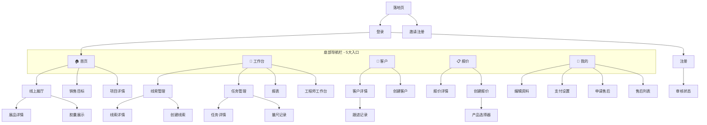

# 小程序页面路由地图 (Route Map)

> 最后更新：2026-02-23
> 基于 `app.json` 中全部 34 个注册页面

---

## 应用导航架构

---

## 页面清单与功能定义

### 🔐 公开页面 (无需登录)

| 路径 | 名称 | 功能描述 | 权限 |
|:---|:---|:---|:---|
| `pages/landing/landing` | 落地页 | 品牌展示、引导登录/注册 | 公开 |
| `pages/login/login` | 登录页 | 手机号 + 密码登录 | 公开 |
| `pages/register/register` | 注册页 | 新用户邀请注册流程 | 公开 |
| `pages/status/status` | 审核状态 | 注册后等待管理员审核 | 公开 |
| `pages/invite/invite` | 邀请页 | 接受邀请链接加入租户 | 公开 |

### 🏠 TabBar 主页面 (需登录)

| 路径 | 名称 | 功能描述 | 权限 |
|:---|:---|:---|:---|
| `pages/index/index` | 首页 | 概览仪表盘、常用功能入口 | 全角色 |
| `pages/workbench/index` | 工作台 | 角色化任务面板（销售/工程师） | 全角色 |
| `pages/crm/index` | 客户列表 | 客户档案管理、搜索与筛选 | 销售/管理 |
| `pages/quotes/index` | 报价列表 | 报价单管理与状态跟踪 | 销售/管理 |
| `pages/users/profile` | 个人中心 | 账号设置、退出登录 | 全角色 |

### 👥 CRM 客户管理

| 路径 | 名称 | 功能描述 | 权限 |
|:---|:---|:---|:---|
| `pages/crm/create/create` | 创建客户 | 新增客户档案 | 销售 |
| `pages/crm/detail/index` | 客户详情 | 查看客户全貌（信息/订单/跟进） | 销售/管理 |
| `pages/crm/followup/create` | 创建跟进 | 新增客户跟进记录 | 销售 |

### 🎯 线索管理

| 路径 | 名称 | 功能描述 | 权限 |
|:---|:---|:---|:---|
| `pages/leads/index/index` | 线索列表 | 潜在客户线索管理 | 销售/管理 |
| `pages/leads/create/index` | 创建线索 | 新增商机线索 | 销售 |
| `pages/leads/detail/index` | 线索详情 | 查看线索信息与转化状态 | 销售/管理 |

### 📋 报价管理

| 路径 | 名称 | 功能描述 | 权限 |
|:---|:---|:---|:---|
| `pages/quotes/create/index` | 创建报价 | 新建报价单（按房间+产品） | 销售 |
| `pages/quotes/detail` | 报价详情 | 查看/编辑报价明细 | 销售/管理 |
| `pages/quotes/product-selector/index` | 产品选择器 | 报价过程中选择产品 SKU | 销售 |

### 🔧 任务与工程管理

| 路径 | 名称 | 功能描述 | 权限 |
|:---|:---|:---|:---|
| `pages/tasks/index` | 任务列表 | 测量/安装任务统一视图 | 工程师/销售 |
| `pages/tasks/detail/detail` | 任务详情 | 任务信息、打卡、上报 | 工程师 |
| `pages/tasks/measure/index` | 量尺记录 | 测量任务数据录入 | 工程师 |
| `pages/workbench/engineer/index` | 工程师工作台 | 工程师专属任务面板 | 工程师 |
| `pages/projects/task-detail/index` | 项目任务详情 | 项目维度的任务查看 | 全角色 |

### 🏪 展厅 (Showroom)

| 路径 | 名称 | 功能描述 | 权限 |
|:---|:---|:---|:---|
| `pages/showroom/index` | 线上展厅 | 产品展示与浏览 | 全角色 |
| `pages/showroom/detail/index` | 展品详情 | 单品详细信息 | 全角色 |
| `pages/showroom/capsule/index` | 胶囊展示 | 精选产品推荐卡片 | 全角色 |

### 📊 数据与管理

| 路径 | 名称 | 功能描述 | 权限 |
|:---|:---|:---|:---|
| `pages/reports/index` | 报表中心 | 销售数据分析 | 管理 |
| `pages/manager/targets/index` | 销售目标 | 目标设定与达成跟踪 | 管理 |

### ⚙️ 设置与售后

| 路径 | 名称 | 功能描述 | 权限 |
|:---|:---|:---|:---|
| `pages/users/edit/edit` | 编辑资料 | 个人信息修改 | 全角色 |
| `pages/tenant/payment-settings/index` | 支付设置 | 租户支付方式配置 | 管理 |
| `pages/service/apply/index` | 申请售后 | 提交售后服务工单 | 全角色 |
| `pages/service/list/index` | 售后列表 | 查看售后工单进度 | 全角色 |

---

## 路由规范

### 参数传递
- 统一使用 `id` 作为主键参数：`/pages/crm/detail/index?id=xxx`
- 复杂筛选用 `type`/`status` 等查询参数

### 跳转方式
| 场景 | API | 说明 |
|:---|:---|:---|
| 切换 TabBar | `wx.switchTab` | 仅限 5 个主页面 |
| 打开新页面 | `wx.navigateTo` | 常规子页面跳转 |
| 关闭当前跳转 | `wx.redirectTo` | 登录后跳首页等 |
| 清栈重启 | `wx.reLaunch` | 退出登录后返回落地页 |

### 权限守卫
- 所有非 `landing` / `login` / `register` / `invite` / `status` 页面需检查 `authStore.isLoggedIn`
- 通过 `utils/navigation-guard.ts` 统一拦截

### 自定义 TabBar
- 使用 `custom-tab-bar` 组件，支持角色动态显示/隐藏的 Tab 项
- 未登录状态下 TabBar 不可见
