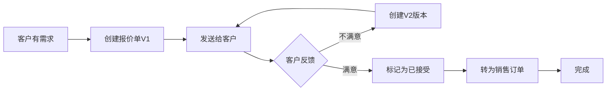

# 报价单管理操作手册 - 销售人员版

欢迎使用 L2C 报价单系统！本手册将教您如何为客户创建专业的报价单、管理多个版本，并最终转化为销售订单。

---

## 📖 目录

1. [报价单系统概述](#报价单系统概述)
2. [创建第一份报价单](#创建第一份报价单)
3. [多版本管理](#多版本管理)
4. [报价单转销售订单](#报价单转销售订单)
5. [常见场景与技巧](#常见场景与技巧)
6. [注意事项](#注意事项)

---

## 🎯 报价单系统概述

### 什么是报价单？

报价单是向客户展示产品方案和价格的正式文档。在 L2C 系统中，报价单具有以下特点：

```
特点1：多版本管理
  → 同一客户可以有V1、V2、V3等多个版本
  → 每个版本独立保存，可随时查看历史

特点2：状态流转
  草稿 → 已发布 → 已接受/已拒绝

特点3：单向转化
  已接受的报价单 → 转为销售订单
```

---

### 报价单的生命周期



---

### 您的权限

作为销售人员，您可以：
- ✅ 为自己跟进的线索创建报价单
- ✅ 创建和编辑报价单版本
- ✅ 查看报价单历史
- ✅ 将已接受的报价单转为销售订单
- ❌ 不能修改已转为订单的报价单

---

## 📝 创建第一份报价单

### 场景：客户李女士想装修客厅和卧室

#### Step 1：进入创建页面

**路径1：从线索详情进入**
```
1. 打开线索详情页
2. 点击"生成报价单"按钮
3. 系统自动带入客户和项目信息
```

**路径2：直接创建**
```
1. 左侧菜单 → 报价单
2. 点击"新建报价单"
3. 手动选择线索/客户
```

---

#### Step 2：填写基本信息

**必填信息**：

| 字段 | 说明 | 示例 |
|------|------|------|
| 项目名称 | 客户姓名+项目 | 李女士家装修 |
| 项目地址 | 施工地点 | XX小区3栋1单元501 |
| 关联线索 | 选择对应线索 | L20251212001 |
| 关联客户 | 选择客户 | 李女士 |

**💡 提示**：
```
如果从线索详情进入，这些信息会自动填充
您只需确认无误即可
```

---

#### Step 3：添加报价明细

这是报价单的核心部分！每一行代表一个产品或服务。

**点击"添加项目"，填写以下信息**：

**示例1：客厅窗帘**
```
空间：客厅
类别：窗帘
产品名称：XX品牌遮光布
数量：18 平米
单价：280 元/平米
总价：5,040 元（自动计算）
描述：双层遮光，配罗马杆
```

**示例2：主卧墙纸**
```
空间：主卧
类别：墙纸
产品名称：XX无纺布墙纸
数量：15 平米
单价：180 元/平米
总价：2,700 元（自动计算）
描述：环保无甲醛，现代简约风格
```

**关键操作**：
- 🔢 **数量和单价输入后，总价自动计算**
- ➕ **点击"添加项目"可添加更多明细**
- 🗑️ **点击删除图标可移除明细**

---

#### Step 4：确认总金额

系统会自动汇总所有明细的总价：

```
客厅窗帘：   5,040 元
主卧墙纸：   2,700 元
次卧窗帘：   3,200 元
----------------------------
总计：      10,940 元
```

**💡 检查清单**：
- ✅ 每个明细的单价是否正确
- ✅ 数量是否准确
- ✅ 总金额是否在客户预算内
- ✅ 产品描述是否清晰

---

#### Step 5：保存报价单

点击"保存报价单"按钮：

```
系统自动操作：
1. 生成报价单号（Q-20251212-0001）
2. 创建V1版本
3. 状态设置为"草稿"
4. 在线索中添加"已报价"标签
```

**成功提示**：
```
✅ 报价单创建成功！
报价单号：Q-20251212-0001
当前版本：V1
```

---

### 发送给客户

**方式1：直接发送PDF**（推荐）
```
1. 在报价单详情页点击"导出PDF"
2. 下载PDF文件
3. 通过微信/邮件发送给客户
```

**方式2：在线链接**
```
1. 点击"生成分享链接"
2. 复制链接发送给客户
3. 客户可在线查看（无需登录）
```

**方式3：打印**
```
1. 点击"打印"
2. 打印实体文档
3. 当面交给客户
```

---

## 🔄 多版本管理

### 为什么需要多版本？

**场景：客户对V1不满意**

```
客户反馈："窗帘太贵了，能不能便宜点？"
您的应对：创建V2版本，调整价格或产品
```

**多版本的好处**：
- ✅ 保留历史版本，方便对比
- ✅ 客户可以看到您的调整
- ✅ 避免混乱，每个版本独立
- ✅ 可随时切换查看

---

### 创建新版本

#### 方法1：基于当前版本创建

**步骤**：
1. 打开报价单详情页
2. 点击"创建新版本"按钮
3. 选择"基于V1创建V2"
4. 系统自动复制V1的所有明细
5. 您可以修改任何内容
6. 保存

**何时使用**：
```
✅ 客户要求微调（改价格/改产品）
✅ 需求基本不变，只调整部分
```

---

#### 方法2：全新创建版本

**步骤**：
1. 点击"创建新版本"
2. 选择"全新创建V2"
3. 重新添加所有明细
4. 保存

**何时使用**：
```
✅ 客户需求大幅变化
✅ 产品方案完全不同
✅ 空间/数量有大调整
```

---

### 版本对比

**场景：客户问"V2比V1便宜了多少？"**

**操作**：
1. 在报价单详情页
2. 选择版本切换器（V1 / V2）
3. 查看两个版本的明细和总价

**示例对比**：

| 项目 | V1 | V2 | 变化 |
|------|----|----|------|
| 客厅窗帘 | 280元/㎡ | 240元/㎡ | ⬇️ 便宜40元 |
| 主卧墙纸 | 180元/㎡ | 180元/㎡ | 持平 |
| 总价 | 10,940元 | 9,460元 | ⬇️ 便宜1,480元 |

---

### 版本状态管理

每个版本都有独立的状态：

**状态流转**：
```
草稿（draft）
  → 填写中，可随时修改
  
已发布（presented）
  → 已发送给客户
  
已接受（accepted）
  → 客户确认同意
  
已拒绝（rejected）
  → 客户不满意
```

**如何更新状态**：
```
1. 进入报价单详情
2. 选择对应版本
3. 点击"更新状态"
4. 选择新状态
5. 填写备注（可选）
```

**⚠️ 重要**：
```
❌ 已接受的版本不能再修改
✅ 如需修改，创建新版本
✅ 只有"已接受"状态的版本可以转订单
```

---

## 💼 报价单转销售订单

### 转化条件

必须同时满足：
```
条件1：✅ 至少有一个版本状态为"已接受"
条件2：✅ 报价单状态不是"已赢单"（未转化过）
条件3：✅ 客户已明确同意（口头/书面）
```

---

### 转化操作

#### Step 1：确认当前版本

```
进入报价单详情页
→ 查看当前版本（顶部显示）
→ 确认状态为"已接受"（绿色标签）
```

**如果不是当前版本**：
```
1. 切换到客户接受的版本（如V3）
2. 点击"设为当前版本"
3. 确认切换
```

---

#### Step 2：点击"转为销售单"

**位置**：报价单详情页右上角

**确认对话框**：
```
┌────────────────────────────────┐
│ 确定要将此报价单转为销售单吗？    │
│ 此操作不可撤销。                 │
│                                  │
│ 报价单: Q-20251212-0001         │
│ 版本: V3                         │
│ 总金额: ¥9,460                   │
│                                  │
│   [取消]       [确定]            │
└────────────────────────────────┘
```

---

#### Step 3：系统自动处理

**系统会做什么**：

1. **生成销售订单**
   ```
   订单号：SO-20251212-1234
   客户：李女士
   金额：¥9,460
   状态：草稿
   ```

2. **深拷贝数据**
   ```
   报价单明细 → 复制到 → 销售订单明细
   （独立数据，互不影响）
   ```

3. **更新报价单状态**
   ```
   报价单状态：草稿 → 已赢单（won）
   背景色：变为绿色
   ```

4. **建立关联**
   ```
   销售订单中记录来源：source_quote_id
   可追溯到原报价单
   ```

---

#### Step 4：查看生成的销售订单

**成功提示**：
```
✅ 转换成功！
销售单号：SO-20251212-1234
点击查看详情
```

**您可以**：
```
→ 点击链接跳转到销售订单详情
→ 或在"销售订单"菜单中查找
```

---

### 转化后的变化

| 维度 | 报价单 | 销售订单 |
|------|--------|----------|
| 可编辑性 | ❌ 不可再编辑 | ✅ 可以继续修改 |
| 状态 | 已赢单（锁定） | 草稿（可流转） |
| 明细 | 保持不变 | 可调整数量/价格 |
| 用途 | 历史记录 | 进入生产/发货流程 |

**⚠️ 关键理解**：
```
报价单是"提案"，销售订单是"合同"
转化后两者独立，互不影响
```

---

## 🎯 常见场景与技巧

### 场景1：客户犹豫不决，反复改需求

**现象**：
```
第1次：要窗帘
第2次：窗帘+墙纸
第3次：只要墙纸
第4次：窗帘+墙纸+地板
```

**应对策略**：
```
✅ 为每次需求创建新版本（V1-V4）
✅ 保留所有版本，方便客户对比
✅ 标注每个版本的差异（备注）
✅ 引导客户做决策（设deadline）
```

**操作建议**：
```
→ 在版本备注中写明：
  V1：仅客厅窗帘
  V2：客厅窗帘+主卧墙纸
  V3：仅墙纸（客户删减）
  V4：全屋方案（最终版）
```

---

### 场景2：客户觉得贵，要求降价

**错误做法**：
```
❌ 直接在V1上改价格（会丢失原价记录）
❌ 口头承诺不记录（容易扯皮）
```

**正确做法**：
```
✅ 创建V2，调整价格
✅ 在备注说明："应客户要求，窗帘降价至240元/㎡"
✅ 保留V1作为初始报价的证据
```

**高级技巧**：
```
→ V1：保持原价（锚定高价值）
→ V2：小幅降价（展示诚意）
→ V3：换产品（性价比方案）
→ 让客户在V1/V2/V3中选择
```

---

### 场景3：测量后发现数量有误

**问题**：
```
报价时估算：窗帘18平米
测量后实际：窗帘21平米
```

**处理**：
```
1. 创建新版本（V2或V3）
2. 更新数量为21平米
3. 总价自动重新计算
4. 备注："根据实际测量调整"
5. 联系客户确认
```

**沟通话术**：
```
"李女士您好，我们测量师上门测量后，
实际面积是21平米，比预估多了3平米。
我已经更新了报价单V2，新的总价是
5,880元，增加了840元。您看一下可以吗？"
```

---

### 场景4：客户接受了V2，但要求按V1的某个产品

**问题**：
```
V1总价：￥10,940（窗帘280元/㎡）
V2总价：￥9,460（窗帘240元/㎡）
客户说：我要V2的价格，但V1的窗帘质量
```

**处理**：
```
1. 创建V4（混合版本）
2. 窗帘：用V1的280元/㎡
3. 其他：用V2的价格
4. 重新计算总价
5. 备注清楚
```

---

### 场景5：多个项目共用一个报价单

**问题**：
```
客户有2套房要装修
都想要报价
```

**建议**：
```
方案1：分开创建（推荐）
→ 报价单A：XX路501室
→ 报价单B：YY路301室
好处：清晰、易管理

方案2：合并在一个报价单
→ 用"空间"字段区分
→ 501-客厅、501-卧室
→ 301-客厅、301-卧室
风险：容易混乱
```

---

## ⚠️ 注意事项

### ❌ 常见错误

#### 错误1：修改已发布的版本

```
错误操作：
客户看了V1后，您直接在V1上改价格

后果：
→ 客户看到的和您改的不一致
→ 容易产生纠纷

正确做法：
→ 创建V2
→ 保持V1不变
```

---

#### 错误2：转订单前未确认版本

```
错误操作：
客户接受了V3，但您转化时当前版本是V2

后果：
→ 生成的订单是V2的数据（错误）
→ 需要重新处理

正确做法：
→ 转化前确认当前版本
→ 如需切换，先切换再转化
```

---

#### 错误3：频繁创建版本

```
错误操作：
客户每说一句话就创建一个版本
一个报价单有10+个版本

后果：
→ 版本太多，难以管理
→ 客户也会混乱

正确做法：
→ 小调整：先草稿，确定后再保存
→ 大调整：才创建新版本
→ 控制版本数在3-5个
```

---

### ✅ 最佳实践

#### 实践1：版本命名有规律

```
V1：初版
V2：降价版
V3：实测版
V4：最终版
```

**在备注中写明**，方便回溯

---

#### 实践2：及时更新状态

```
发送给客户 → 立即标记"已发布"
客户确认 → 立即标记"已接受"
客户拒绝 → 立即标记"已拒绝"
```

**不要靠记忆**，随时更新

---

#### 实践3：关键操作记录备注

```
创建版本时填写：
→ 为什么创建？（客户要求降价）
→ 改了什么？（窗帘单价下调）
→ 何时创建？（2025-12-12下午沟通后）

好处：3个月后还能看懂
```

---

#### 实践4：转化前电话确认

```
即使客户已经口头同意，
转化为订单前再电话确认一次：

"李女士，我现在按照V3的方案给您下单，
总价9,460元，没问题吧？"

确认后再点击"转为销售单"
```

**避免乌龙**

---

## 💡 高效技巧

### 技巧1：使用产品模板

```
常用产品可以保存模板：
→ 窗帘（标准款）280元/㎡
→ 墙纸（普通款）180元/㎡
→ 地板（实木）350元/㎡

下次报价：
→ 点击"从模板添加"
→ 选择产品
→ 修改数量即可
→ 节省80%时间
```

---

### 技巧2：批量操作

```
添加多个同类产品：
→ 点击"批量添加"
→ 选择类别（如窗帘）
→ 输入多个空间
→ 系统自动创建多行
```

---

### 技巧3：快捷键

```
Ctrl + S：保存
Ctrl + Enter：添加明细
Ctrl + D：复制当前行
Delete：删除当前行
```

---

## 📞 遇到问题？

| 问题类型 | 联系方式 |
|----------|----------|
| 系统操作问题 | IT支持（扫码加企业微信）|
| 定价策略咨询 | 销售主管 |
| 客户投诉 | 客服部 |
| 功能建议 | 产品经理 |

---

## 🎓 学习检查清单

完成本手册学习后，您应该能够：

- [ ] 独立创建一份完整的报价单
- [ ] 为客户创建至少3个版本
- [ ] 理解每个版本状态的含义
- [ ] 正确操作报价单转销售订单
- [ ] 处理客户的常见需求变更
- [ ] 避免常见错误

**全部打勾？恭喜您已掌握报价单系统！** 🎉

---

**手册版本**: v1.0  
**最后更新**: 2025-12-12  
**培训视频**: 扫码观看操作演示
