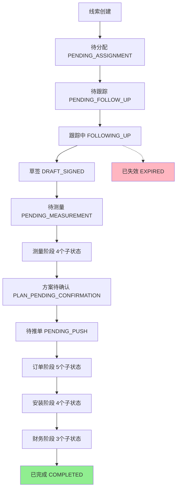

# 线索管理模块技术文档

## 📋 模块概述

### 什么是线索管理模块？

线索管理模块是 L2C 系统的核心模块，负责管理从客户初次接触到最终成交的完整销售流程。它是销售团队的日常工作中心，支持线索分配、跟踪、转化等全生命周期管理。

### 核心特性

```
✅ 全生命周期管理
   39个状态节点，覆盖从线索到完成的所有阶段

✅ 严格时效控制
   每个状态都有明确的时效要求和超时处罚机制

✅ 精细化权限控制
   基于角色的访问控制（RBAC），8种用户角色

✅ 智能预警系统
   8种预警类型，主动发现风险线索

✅ 数据驱动决策
   实时统计、转化漏斗、业绩分析
```

---

## 🎯 业务流程

### 线索完整生命周期



### 39个状态详解

#### 1. 线索阶段（6个状态）

| 状态 | 中文 | 说明 | 时效 |
|------|------|------|------|
| PENDING_ASSIGNMENT | 待分配 | 新线索等待销售主管分配 | 24小时 |
| PENDING_FOLLOW_UP | 待跟踪 | 已分配给销售，待开始跟进 | 72小时 |
| FOLLOWING_UP | 跟踪中 | 销售正在跟进客户 | 7天内需跟进 |
| DRAFT_SIGNED | 草签 | 客户口头同意或支付定金 | 72小时内生成报价单 |
| EXPIRED | 已失效 | 超时未处理或客户流失 | - |

#### 2. 测量阶段（5个状态）

| 状态 | 中文 | 说明 | 时效 |
|------|------|------|------|
| PENDING_MEASUREMENT | 待测量 | 等待安排测量 | 48小时 |
| MEASURING_PENDING_ASSIGNMENT | 测量中-待分配 | 调度需分配测量师 | 4小时 |
| MEASURING_ASSIGNING | 测量中-分配中 | 测量师需接单 | 2小时 |
| MEASURING_PENDING_VISIT | 测量中-待上门 | 测量师即将上门 | 48小时 |
| MEASURING_PENDING_CONFIRMATION | 测量中-待确认 | 销售需确认测量结果 | 48小时 |

#### 3. 方案与订单阶段（6个状态）

| 状态 | 中文 | 说明 | 时效 |
|------|------|------|------|
| PLAN_PENDING_CONFIRMATION | 方案待确认 | 设计师已出图，等客户确认 | 72小时 |
| PENDING_PUSH | 待推单 | 方案确认，销售推送订单 | 无强制时效 |
| PENDING_ORDER | 待下单 | 交付部门审核订单 | 48小时 |
| IN_PRODUCTION | 生产中 | 产品生产阶段 | 根据产品定 |
| STOCK_PREPARED | 备货完成 | 产品已备好，待发货 | 24小时 |
| PENDING_SHIPMENT | 待发货 | 填写快递单号 | 24小时 |

#### 4. 安装阶段（4个状态）

| 状态 | 中文 | 说明 | 时效 |
|------|------|------|------|
| INSTALLING_PENDING_ASSIGNMENT | 安装中-待分配 | 调度分配安装师 | 4小时 |
| INSTALLING_ASSIGNING | 安装中-分配中 | 安装师接单中 | 2小时 |
| INSTALLING_PENDING_VISIT | 安装中-待上门 | 安装师即将上门 | - |
| INSTALLING_PENDING_CONFIRMATION | 安装中-待确认 | 销售审核安装结果 | - |

#### 5. 财务与完成阶段（4个状态）

| 状态 | 中文 | 说明 |
|------|------|------|
| PENDING_RECONCILIATION | 待对账 | 财务对账中 |
| PENDING_INVOICE | 待开发票 | 等待开具发票 |
| PENDING_PAYMENT | 待回款 | 等待客户付款 |
| COMPLETED | 已完成 | 订单完成 |

#### 6. 异常状态（3个状态）

| 状态 | 中文 | 说明 |
|------|------|------|
| CANCELLED | 已取消 | 客户取消订单 |
| PAUSED | 暂停 | 暂时停止推进 |
| ABNORMAL | 异常 | 出现问题需处理 |

---

## 🗄️ 数据库设计

### 核心表结构

#### leads 表（线索主表）

```sql
CREATE TABLE leads (
    id UUID PRIMARY KEY DEFAULT gen_random_uuid(),
    lead_number VARCHAR(50) UNIQUE NOT NULL,  -- 线索编号 L20251212001
    
    -- 客户信息
    name VARCHAR(100) NOT NULL,               -- 客户姓名
    phone VARCHAR(20) NOT NULL,               -- 联系电话
    project_address TEXT,                     -- 项目地址
    source VARCHAR(50),                       -- 来源渠道
    
    -- 状态信息
    status VARCHAR(50) NOT NULL,              -- 当前状态
    customer_level VARCHAR(10),               -- 客户等级 A/B/C/D
    business_tags TEXT[],                     -- 业务标签
    
    -- 需求信息
    budget_min DECIMAL(10,2),                 -- 预算下限
    budget_max DECIMAL(10,2),                 -- 预算上限
    requirements TEXT[],                      -- 需求列表
    area_size DECIMAL(10,2),                  -- 面积
    construction_progress VARCHAR(50),        -- 装修进度
    expected_purchase_date DATE,              -- 预计购买日期
    expected_check_in_date DATE,              -- 预计入住日期
    
    -- 约见信息
    appointment_time TIMESTAMP,               -- 预约时间
    appointment_reminder VARCHAR(50),         -- 提醒设置
    
    -- 人员关联
    assigned_to_id UUID,                      -- 分配给谁（销售）
    designer_id UUID,                         -- 设计师
    shopping_guide_id UUID,                   -- 导购
    created_by_id UUID,                       -- 创建人
    
    -- 统计信息
    quote_versions INT DEFAULT 0,             -- 报价单版本数
    measurement_completed BOOLEAN DEFAULT FALSE,  -- 是否已测量
    installation_completed BOOLEAN DEFAULT FALSE, -- 是否已安装
    total_quote_amount DECIMAL(12,2),         -- 报价总额
    
    -- 状态追踪
    last_status_change_at TIMESTAMP,          -- 最后状态变更时间
    last_status_change_by_id UUID,            -- 最后变更人
    is_cancelled BOOLEAN DEFAULT FALSE,       -- 是否已取消
    cancellation_reason TEXT,                 -- 取消原因
    is_paused BOOLEAN DEFAULT FALSE,          -- 是否暂停
    pause_reason TEXT,                        -- 暂停原因
    
    -- 时间戳
    created_at TIMESTAMP DEFAULT NOW(),
    updated_at TIMESTAMP DEFAULT NOW(),
    
    -- 外键
    FOREIGN KEY (assigned_to_id) REFERENCES users(id),
    FOREIGN KEY (designer_id) REFERENCES users(id),
    FOREIGN KEY (shopping_guide_id) REFERENCES users(id),
    FOREIGN KEY (created_by_id) REFERENCES users(id)
);

-- 索引
CREATE INDEX idx_leads_status ON leads(status);
CREATE INDEX idx_leads_assigned_to ON leads(assigned_to_id);
CREATE INDEX idx_leads_phone ON leads(phone);
CREATE INDEX idx_leads_created_at ON leads(created_at);
```

---

#### lead_follow_up_records 表（跟进记录）

```sql
CREATE TABLE lead_follow_up_records (
    id UUID PRIMARY KEY DEFAULT gen_random_uuid(),
    lead_id UUID NOT NULL,                    -- 关联线索
    
    follow_up_type VARCHAR(20),               -- 跟进方式：电话/微信/面谈
    content TEXT,                             -- 跟进内容
    result VARCHAR(50),                       -- 结果：interested/not-interested/follow-up
    note TEXT,                                -- 备注
    
    next_follow_up_time TIMESTAMP,            -- 下次跟进时间
    appointment_time TIMESTAMP,               -- 预约时间（如约到店）
    
    created_at TIMESTAMP DEFAULT NOW(),
    created_by_id UUID,                       -- 跟进人
    
    FOREIGN KEY (lead_id) REFERENCES leads(id) ON DELETE CASCADE,
    FOREIGN KEY (created_by_id) REFERENCES users(id)
);

CREATE INDEX idx_follow_up_lead ON lead_follow_up_records(lead_id);
CREATE INDEX idx_follow_up_created_at ON lead_follow_up_records(created_at);
```

---

#### lead_assignments 表（分配记录）

```sql
CREATE TABLE lead_assignments (
    id UUID PRIMARY KEY DEFAULT gen_random_uuid(),
    lead_id UUID NOT NULL,                    -- 线索ID
    
    assigned_to_id UUID NOT NULL,             -- 分配给谁
    assigned_by_id UUID,                      -- 谁分配的
    assignment_method VARCHAR(20),            -- 分配方式：manual/auto
    reason TEXT,                              -- 分配原因
    
    created_at TIMESTAMP DEFAULT NOW(),
    
    FOREIGN KEY (lead_id) REFERENCES leads(id) ON DELETE CASCADE,
    FOREIGN KEY (assigned_to_id) REFERENCES users(id),
    FOREIGN KEY (assigned_by_id) REFERENCES users(id)
);

CREATE INDEX idx_assignment_lead ON lead_assignments(lead_id);
CREATE INDEX idx_assignment_to ON lead_assignments(assigned_to_id);
```

---

#### lead_status_history 表（状态历史）

```sql
CREATE TABLE lead_status_history (
    id UUID PRIMARY KEY DEFAULT gen_random_uuid(),
    lead_id UUID NOT NULL,                    -- 线索ID
    
    from_status VARCHAR(50),                  -- 原状态
    to_status VARCHAR(50) NOT NULL,           -- 新状态
    comment TEXT,                             -- 变更说明
    
    changed_at TIMESTAMP DEFAULT NOW(),
    changed_by_id UUID,                       -- 变更人
    
    FOREIGN KEY (lead_id) REFERENCES leads(id) ON DELETE CASCADE,
    FOREIGN KEY (changed_by_id) REFERENCES users(id)
);

CREATE INDEX idx_status_history_lead ON lead_status_history(lead_id);
CREATE INDEX idx_status_history_changed_at ON lead_status_history(changed_at);
```

---

## 🔐 权限控制（RLS）

### 角色定义

```typescript
enum UserRole {
  SALES_STORE = 'SALES_STORE',           // 驻店销售
  SALES_REMOTE = 'SALES_REMOTE',         // 远程销售
  LEAD_SALES = 'LEAD_SALES',             // 销售主管
  SALES_CHANNEL = 'SALES_CHANNEL',       // 渠道主管
  SERVICE_DISPATCH = 'SERVICE_DISPATCH', // 服务调度
  SERVICE_MEASURE = 'SERVICE_MEASURE',   // 测量师
  SERVICE_INSTALL = 'SERVICE_INSTALL',   // 安装师
  PARTNER_DESIGNER = 'PARTNER_DESIGNER', // 设计师
  DELIVERY_SERVICE = 'DELIVERY_SERVICE', // 交付服务
  OTHER_FINANCE = 'OTHER_FINANCE',       // 财务
  OTHER_CUSTOMER = 'OTHER_CUSTOMER',     // 客户
  LEAD_ADMIN = 'LEAD_ADMIN',             // 系统管理员
  LEAD_CHANNEL = 'LEAD_CHANNEL',         // 渠道运营
  LEAD_GENERAL = 'LEAD_GENERAL'          // 普通员工
}
```

---

### RLS 策略

#### 基本查看权限

```sql
-- 销售只能看到自己的线索
CREATE POLICY "销售查看权限"
ON leads FOR SELECT
TO authenticated
USING (
  assigned_to_id = auth.uid()
  OR
  created_by_id = auth.uid()
  OR
  EXISTS (
    SELECT 1 FROM users
    WHERE id = auth.uid()
    AND role IN ('LEAD_SALES', 'LEAD_ADMIN')
  )
);
```

#### 状态变更权限

```sql
-- 不同角色可以修改不同状态的线索
CREATE POLICY "状态变更权限"
ON leads FOR UPDATE
TO authenticated
USING (
  validate_lead_status_transition(id, status, auth.uid())
);

-- 验证函数
CREATE OR REPLACE FUNCTION validate_lead_status_transition(
  lead_id UUID,
  new_status VARCHAR,
  user_id UUID
) RETURNS BOOLEAN AS $$
DECLARE
  user_role VARCHAR;
  current_status VARCHAR;
  allowed_roles TEXT[];
BEGIN
  -- 获取用户角色
  SELECT role INTO user_role FROM users WHERE id = user_id;
  
  -- 获取当前状态
  SELECT status INTO current_status FROM leads WHERE id = lead_id;
  
  -- 根据配置检查权限
  SELECT visibleTo INTO allowed_roles
  FROM lead_status_config
  WHERE status_key = new_status;
  
  RETURN user_role = ANY(allowed_roles);
END;
$$ LANGUAGE plpgsql;
```

---

## ⏰ 时效管理

### 时效配置表

```typescript
export const LEAD_STATUS_TIMELIMIT_CONFIG = {
  PENDING_ASSIGNMENT: {
    timeLimitHours: 24,        // 24小时内必须分配
    reminderHours: 12,         // 12小时时提醒
    timeoutAction: 'alert',    // 超时后报警
    timeoutPenalty: {
      48: 5,                    // 超过48小时扣5分
      72: 10                    // 超过72小时扣10分
    }
  },
  PENDING_FOLLOW_UP: {
    timeLimitHours: 72,
    reminderHours: 48,
    timeoutAction: 'alert',
    timeoutPenalty: {
      96: 'alert_manager',
      120: { penalty: 5, action: 'return' }  // 退回待分配
    }
  },
  FOLLOWING_UP: {
    timeLimitHours: 720,       // 30天
    reminderHours: 672,        // 28天
    timeoutAction: 'alert',
    timeoutPenalty: {
      1008: 5                   // 超过42天扣5分
    }
  }
  // ... 其他39个状态的配置
};
```

### 时效检查函数

```sql
CREATE OR REPLACE FUNCTION check_lead_timeout()
RETURNS TABLE(
  lead_id UUID,
  status VARCHAR,
  hours_overdue INT,
  penalty INT
) AS $$
BEGIN
  RETURN QUERY
  SELECT 
    l.id,
    l.status,
    EXTRACT(EPOCH FROM (NOW() - l.last_status_change_at)) / 3600 AS hours,
    calculate_penalty(l.status, hours) AS penalty
  FROM leads l
  WHERE l.status IN (
    SELECT status_key FROM lead_status_time_limits
    WHERE time_limit_hours IS NOT NULL
  )
  AND (NOW() - l.last_status_change_at) > 
      (SELECT time_limit_hours * INTERVAL '1 hour' 
       FROM lead_status_time_limits 
       WHERE status_key = l.status);
END;
$$ LANGUAGE plpgsql;
```

---

## 🚨 预警系统

### 8种预警类型

#### 1. 跟踪逾期预警（follow_up_stale）

**定义**：线索超过7天无跟进记录

**SQL 查询**：
```sql
SELECT id, name, phone, last_follow_up_time
FROM leads
WHERE status = 'FOLLOWING_UP'
  AND (
    SELECT MAX(created_at) 
    FROM lead_follow_up_records 
    WHERE lead_id = leads.id
  ) < NOW() - INTERVAL '7 days'
  OR NOT EXISTS (
    SELECT 1 FROM lead_follow_up_records 
    WHERE lead_id = leads.id
  );
```

---

#### 2. 已报价无草签预警（quoted_no_draft）

**定义**：已发报价单14天，客户未草签

**SQL 查询**：
```sql
SELECT l.id, l.name, q.created_at AS quote_created
FROM leads l
JOIN quotes q ON q.lead_id = l.id
WHERE l.status = 'FOLLOWING_UP'
  AND q.created_at < NOW() - INTERVAL '14 days'
  AND l.status != 'DRAFT_SIGNED';
```

---

#### 3. 测量逾期预警（measurement_overdue）

**定义**：安排测量后超过48小时未完成

**SQL 查询**：
```sql
SELECT id, name, status, last_status_change_at
FROM leads
WHERE status IN ('MEASURING_PENDING_VISIT', 'MEASURING_PENDING_CONFIRMATION')
  AND last_status_change_at < NOW() - INTERVAL '48 hours';
```

---

#### 4. 连续无跟进预警（no_follow_up_7days）

**定义**：任意线索7天内无任何操作

**SQL 查询**：
```sql
SELECT id, name, status, updated_at
FROM leads
WHERE updated_at < NOW() - INTERVAL '7 days'
  AND status NOT IN ('COMPLETED', 'CANCELLED', 'EXPIRED');
```

---

#### 5. 高意向客户无跟进（high_intent_stale）

**定义**：A/B级客户7天无跟进

**SQL 查询**：
```sql
SELECT l.id, l.name, l.customer_level
FROM leads l
LEFT JOIN lead_follow_up_records f ON f.lead_id = l.id
WHERE l.customer_level IN ('A', 'B')
  AND l.status = 'FOLLOWING_UP'
  AND (
    SELECT MAX(created_at) 
    FROM lead_follow_up_records 
    WHERE lead_id = l.id
  ) < NOW() - INTERVAL '7 days';
```

---

#### 6. 预算超支预警（budget_exceeded）

**定义**：报价金额超出客户预算30%

**SQL 查询**：
```sql
SELECT l.id, l.name, l.budget_max, q.total_amount
FROM leads l
JOIN quotes q ON q.lead_id = l.id
WHERE q.total_amount > l.budget_max * 1.3;
```

---

#### 7. 流失风险预警（churn_risk）

**定义**：客户长时间停滞在某阶段

**SQL 查询**：
```sql
SELECT id, name, status, last_status_change_at,
       EXTRACT(DAY FROM NOW() - last_status_change_at) AS days_in_status
FROM leads
WHERE last_status_change_at < NOW() - INTERVAL '30 days'
  AND status IN ('FOLLOWING_UP', 'DRAFT_SIGNED', 'PLAN_PENDING_CONFIRMATION');
```

---

#### 8. 竞品威胁预警（competitor_threat）

**定义**：跟进记录中提到竞争对手

**SQL 查询**：
```sql
SELECT DISTINCT l.id, l.name, f.content
FROM leads l
JOIN lead_follow_up_records f ON f.lead_id = l.id
WHERE f.content ~* '(竞争对手|其他公司|比价|对比)'
  AND f.created_at > NOW() - INTERVAL '7 days';
```

---

### 预警数据库函数

```sql
CREATE OR REPLACE FUNCTION get_lead_warnings()
RETURNS JSON AS $$
DECLARE
  result JSON;
BEGIN
  SELECT json_build_object(
    'followUpStale', (SELECT COUNT(*) FROM leads WHERE ...),
    'quotedNoDraft', (SELECT COUNT(*) FROM leads WHERE ...),
    'measurementOverdue', (SELECT COUNT(*) FROM leads WHERE ...),
    'noFollowUp7Days', (SELECT COUNT(*) FROM leads WHERE ...),
    'highIntentStale', (SELECT COUNT(*) FROM leads WHERE ...),
    'budgetExceeded', (SELECT COUNT(*) FROM leads WHERE ...),
    'churnRisk', (SELECT COUNT(*) FROM leads WHERE ...),
    'competitorThreat', (SELECT COUNT(*) FROM leads WHERE ...),
    'total', ...,
    'generated_at', NOW()
  ) INTO result;
  
  RETURN result;
END;
$$ LANGUAGE plpgsql;
```

---

## 💻 技术实现

### 前端架构

```
/src/features/leads/
├── components/
│   ├── list/
│   │   ├── LeadTable.tsx          # 线索列表表格
│   │   ├── LeadFilters.tsx        # 筛选组件
│   │   └── LeadActionButtons.tsx  # 操作按钮
│   ├── detail/
│   │   ├── LeadDetailDrawer.tsx   # 线索详情抽屉
│   │   └── LeadTimeline.tsx       # 时间轴
│   ├── dialogs/
│   │   ├── LeadFollowUpController.tsx    # 跟进对话框
│   │   ├── LeadAssignmentController.tsx  # 分配对话框
│   │   └── LeadTrackingController.tsx    # 确认跟踪
│   └── dashboard/
│       ├── LeadStatsCards.tsx     # 统计卡片
│       └── LeadsPageHeader.tsx    # 页面头部
├── hooks/
│   ├── useLeadActions.ts          # 线索操作逻辑
│   └── useLeadsFilters.ts         # 筛选逻辑
└── services/
    └── leads.client.ts            # API 调用
```

---

### 核心 API

#### 获取线索列表

```typescript
async function getLeads(
  page: number,
  pageSize: number,
  filters: LeadFilter
): Promise<{
  data: Lead[];
  total: number;
  hasNextPage: boolean;
}> {
  let query = supabase
    .from('leads')
    .select('*', { count: 'exact' });
  
  // 应用筛选
  if (filters.searchTerm) {
    query = query.or(`name.ilike.%${filters.searchTerm}%,phone.ilike.%${filters.searchTerm}%`);
  }
  if (filters.status) {
    query = query.eq('status', filters.status);
  }
  
  // 分页
  query = query
    .order('created_at', { ascending: false })
    .range((page - 1) * pageSize, page * pageSize - 1);
  
  const { data, count, error } = await query;
  
  return {
    data: data || [],
    total: count || 0,
    hasNextPage: count > page * pageSize
  };
}
```

---

#### 更新线索状态

```typescript
async function updateLeadStatus(
  id: string,
  status: LeadStatus,
  comment?: string
): Promise<void> {
  const { data: { user } } = await supabase.auth.getUser();
  
  // 1. 验证状态流转
  const { data: validationResult } = await supabase
    .rpc('validate_lead_status_transition', {
      lead_id: id,
      new_status: status,
      current_user_id: user.id
    });
  
  if (!validationResult?.is_valid) {
    throw new Error('Invalid status transition');
  }
  
  // 2. 更新状态
  await supabase
    .from('leads')
    .update({
      status,
      last_status_change_by_id: user.id,
      last_status_change_at: new Date().toISOString()
    })
    .eq('id', id);
  
  // 3. 记录历史
  await supabase
    .from('lead_status_history')
    .insert({
      lead_id: id,
      to_status: status,
      changed_by_id: user.id,
      comment
    });
}
```

---

## 📱 用户界面

### 线索列表页

**功能**：
- 表格展示所有线索
- 支持筛选（状态/来源/标签/人员）
- 支持搜索（姓名/电话）
- 批量操作
- 实时刷新

**关键组件**：
```tsx
<LeadsPage>
  <LeadsPageHeader stats={stats} />
  <LeadFilters filters={filters} onFilterChange={handleFilter} />
  <LeadTable leads={leads} onAction={handleAction} />
</LeadsPage>
```

---

### 线索详情抽屉

**功能**：
- 查看线索完整信息
- 查看跟进记录时间轴
- 查看关联的报价单
- 快速操作（跟进/分配/状态变更）

**关键组件**：
```tsx
<LeadDetailDrawer leadId={leadId}>
  <BasicInfo lead={lead} />
  <LeadTimeline records={followUpRecords} />
  <QuotesList quotes={quotes} />
  <ActionButtons lead={lead} />
</LeadDetailDrawer>
```

---

## 🔄 业务规则

### 状态流转规则

**规则1：单向流转**
```
线索状态只能往前推进，不能回退
（除非管理员手动调整）
```

**规则2**：**强制路径**
```
草签 → 必须经过测量 → 才能到方案确认
不能跳过测量直接到方案
```

**规则3：终态锁定**
```
COMPLETED/CANCELLED/EXPIRED → 不能再变更
需要重新创建线索
```

---

### 分配规则

**规则1：负载均衡**
```
新线索自动分配时，优先分配给：
1. 当前跟踪线索少的销售
2. 擅长该类型客户的销售
3. 地理位置近的销售
```

**规则2：防抢单**
```
线索一旦分配，48小时内不能重新分配
（除非销售主动申请转移）
```

**规则3：新人保护**
```
新销售入职30天内，每天最多分配5个线索
避免压力过大
```

---

## 📊 数据分析

### 转化漏斗

```sql
SELECT 
  '总线索数' AS stage, COUNT(*) AS count, 100.0 AS rate
FROM leads
UNION ALL
SELECT 
  '开始跟踪', 
  COUNT(*), 
  COUNT(*)::FLOAT / (SELECT COUNT(*) FROM leads) * 100
FROM leads WHERE status NOT IN ('PENDING_ASSIGNMENT', 'PENDING_FOLLOW_UP')
UNION ALL
SELECT 
  '草签', 
  COUNT(*), 
  COUNT(*)::FLOAT / (SELECT COUNT(*) FROM leads) * 100
FROM leads WHERE status IN ('DRAFT_SIGNED', ...)
UNION ALL
SELECT 
  '成交', 
  COUNT(*), 
  COUNT(*)::FLOAT / (SELECT COUNT(*) FROM leads) * 100
FROM leads WHERE status = 'COMPLETED';
```

**典型转化率**：
```
100个线索
  → 85个开始跟踪（85%）
  → 30个草签（30%）
  → 20个成交（20%）
```

---

## 🚀 部署与配置

### 1. 数据库迁移

```bash
# 运行迁移脚本
supabase db push

# 验证表结构
supabase db diff
```

### 2. RLS 策略启用

```sql
ALTER TABLE leads ENABLE ROW LEVEL SECURITY;
ALTER TABLE lead_follow_up_records ENABLE ROW LEVEL SECURITY;
ALTER TABLE lead_assignments ENABLE ROW LEVEL SECURITY;
```

### 3. 定时任务配置

```sql
-- 每小时检查超时线索
SELECT cron.schedule(
  'check-lead-timeout',
  '0 * * * *',  -- 每小时
  $$
    SELECT check_lead_timeout();
  $$
);

-- 每天生成预警报告
SELECT cron.schedule(
  'generate-warnings',
  '0 8 * * *',  -- 每天早上8点
  $$
    REFRESH MATERIALIZED VIEW lead_warnings_summary;
  $$
);
```

---

## 🔮 未来规划

### Phase 4：智能化功能

- [ ] AI 客户意向评分
- [ ] 智能分配算法优化
- [ ] 自动跟进提醒（基于客户行为）
- [ ] 预测客户流失风险

### Phase 5：集成与扩展

- [ ] 与微信/企业微信集成
- [ ] 与电话系统集成（自动记录通话）
- [ ] 与BI系统集成（高级分析）
- [ ] Open API（第三方系统对接）

---

## 📞 技术支持

**遇到问题？**

| 类型 | 联系方式 |
|------|----------|
| 系统Bug | 提交 GitHub Issue |
| 功能建议 | 产品经理邮箱 |
| 紧急故障 | 技术支持热线 400-XXX-XXXX |

---

**文档版本**: v1.0  
**最后更新**: 2025-12-12  
**维护者**: L2C 技术团队
