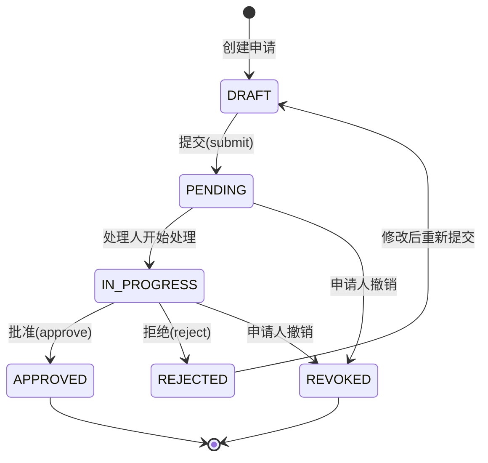

# 审批流状态机设计文档

> 版本：v1.0 | 最后更新：2026-02-23
> 模块路径：`src/features/approval/`

---

## 审批流状态定义

| 状态 | 值 | 说明 |
|:---|:---|:---|
| 草稿 | `DRAFT` | 申请人尚未提交 |
| 待审批 | `PENDING` | 已提交，等待审批 |
| 审批中 | `IN_PROGRESS` | 当前节点处理人已接收 |
| 已批准 | `APPROVED` | 通过全部节点 |
| 已拒绝 | `REJECTED` | 任一节点拒绝 |
| 已撤销 | `REVOKED` | 申请人中途撤回 |

---

## 状态流转图



---

## 节点泳道图（以报价审批为例）

```
申请人(Submitter)     |   审批人(Approver)   |  系统(System)
─────────────────────────────────────────────────────────────
创建报价
    │
    ├──→ [触发] 超出折扣阈值
    │
    ├──→ submission.ts: createApproval()
    │         │
    │         └──→ 状态 DRAFT → PENDING
    │                   │
    │                   └──→ 通知审批人(notifications)
    │
    │                   审批人点击"批准"
    │                         │
    │                         └──→ processing.ts: approve()
    │                                     │
    │                                     ├──→ 状态 → APPROVED
    │                                     └──→ 触发业务回调(报价生效)
```

---

## 核心文件职责

| 文件 | 职责 |
|:---|:---|
| `submission.ts` | 申请提交与起草逻辑 |
| `processing.ts` | 批准与拒绝处理 |
| `revoke.ts` | 撤销逻辑 |
| `flow.ts` | 流程编排与节点路由 |
| `management.ts` | 审批人管理与指派 |

---

## 并发保护（待实现）

> [!WARNING]
> 当前未实现并发保护。同一节点被多人同时操作时，存在以下风险：
> - 同一审批被双重批准

计划引入乐观锁：

```sql
-- 在 approval_requests 表增加 version 字段
UPDATE approval_requests
   SET status = 'APPROVED', version = version + 1
 WHERE id = ? AND version = ? AND status = 'IN_PROGRESS';
-- 若影响行数为 0，则说明被并发修改，返回冲突错误
```
